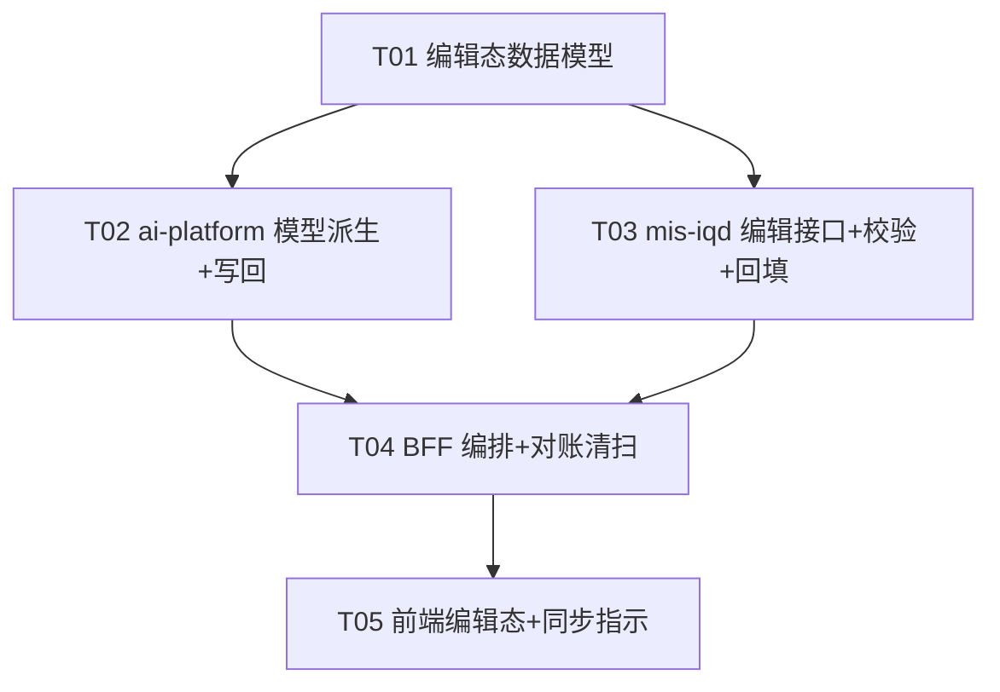

# mis-iqd 二期「语义模型编辑能力」架构评审与单边风险分析

> 架构师：高见远（software-architect）｜ 语言：中文
> 评审对象：`mis-iqd` 二期「平台侧编辑 tables / relations / cubes / views 并写回 WrenAI MDL」
> 配套输入：`mis-iqd-closure-system-design.md`（一期设计）、各端真实代码（见 §〇 依据）
> 交付物：本文 + `mis-iqd-edit-class.mermaid`（类图）+ `mis-iqd-edit-sequence.mermaid`（时序图）

---

## 〇、分析依据（真实代码 grounding）

本评审基于下列已读真实文件，结论非凭空臆造：

| 层 | 文件 | 关键事实 |
| --- | --- | --- |
| mis-iqd 控制层 | `IqdController.java` | `PUT /api/v1/iqd/catalog/node` 当前**返回 501**；`GET /enhance/sync-status` 已存在 |
| mis-iqd 内部层 | `IqdInternalController.java` | `/enhance/backfill`、`/enhance/sync-job` 已实现（对齐 `write_ask_log` 内部 API 范式） |
| mis-iqd 服务层 | `IqdAdminService.java` | `backfillEnhancementSync`/`reportSyncJob`/`syncCatalogFromMdl` 已实现；catalog 仅 `saveCatalogBatch`/`syncCatalogFromMdl`（**WrenAI→平台单向导入**） |
| 实体 | `IqdCatalogItem.java` | 已加 `editable` 列（一期恒 `0`）；有 `item_key`/`parent_key`/`kind`/`source`/`expression` |
| ai-platform 编排 | `service.py` | `trigger_build_index` 仅把 `sql_pairs`+`instructions` 传给 `context_build`，**不重排模型（tables/relations/cubes）**；`_parse_mdl_hash`/`_fallback_mdl_hash` 已就绪 |
| ai-platform CLI | `iqd_cli.py` | `context_build` 支持 `--mdl <dir>`/`--sql-pairs`/`--instructions`/`--allow-write`；`memory_index()` 已实现 |
| ai-platform 协调 | `sync_coordinator.py` | 每连接 3s 合并窗口，`asyncio.Lock` 保证同连接 build 串行 |
| ai-platform 客户端 | `iqd_config_client.py` | `backfill_enhancement_sync`/`report_sync_job` 已就绪；含变更事件缓存失效 |
| 路由 | `iqd_enhance.py` | `POST /iqd/enhance/sync`（`wait` 参数）已存在 |
| BFF | `IqdFacadeService.java`/`AiPlatformClient.java`/`IqdClient.java` | `triggerSyncBestEffort`（**失败仅告警不阻断**）已存在；`syncEnhancements`→ai-platform 已通 |
| 前端 | `iqd-catalog-page.tsx`/`iqd-enhance-page.tsx`/`lib/api/iqd.ts` | catalog 仅展示；`editable` 编辑态**未接**；`SyncStatusBar` 轮询 `/enhance/sync-status` |

**一期核心闭环（已验证）**：平台保存物料(pending) → BFF best-effort 调 ai-platform `/enhance/sync`(wait=false) → SyncCoordinator 3s 合并 → 拉 pending → `context_build`+`memory_index` → 经 `IqdConfigClient` 回填 `wren_ref_id` + 报 `iqd_sync_job`。**模型本身（tables/relations/cubes/views）一期不被平台改写**，仅由 `syncCatalogFromMdl` 一次性从 WrenAI 镜像进平台。

---

## 一、源真值（Source of Truth）归属结论

这是二期最关键的设计决策。结论如下：

| 维度 | 归属 | 说明 |
| --- | --- | --- |
| **编辑权威（逻辑真值）** | **平台 catalog（`iqd_catalog_item` + 新增编辑态）** | 用户意图的唯一记录源；支撑审计、回滚、乐观并发 |
| **服务权威（运行真值）** | **WrenAI MDL（编译产物，问数引擎实际读取）** | 引擎在 ask 时读 WrenAI 的 `mdl.json`，非平台库 |
| **唯一受控写路径** | **平台 → WrenAI（写回）** | 二期起平台是 WrenAI MDL 的**唯一受控写入方**；外部直改 WrenAI 视为 out-of-band，需经「重新导入」收敛（见 S3） |

**核心不变量（必须维持）**：对任一连接，
`平台.built_edit_revision == WrenAI.build_mdl_hash 所代表的模型版本`。
偏离即「单边情况（one-sided divergence）」。

> 工程类比（便于团队共识）：**平台 catalog = 源代码（git）；`context build` = 编译；`mdl_hash` = 构建指纹；问数引擎 = 运行时只读编译产物。** 单边情况 =「改了源码没重新编译」或「有人直接在运行时改了产物却没回写源码」。

由此，二期编辑落库策略定为 **「平台先落库、异步写回 WrenAI」**（复用一期闭环），而非「先调 WrenAI 成功再落平台」——理由：平台先落库可即时给用户确认、保留编辑权威与审计；写回失败属 fail-closed（保留平台编辑、标记失败、可重试），与一期闸门哲学一致。

---

## 二、单边风险清单（10 类，系统枚举）

判定口径：**fail-closed** = 写回/校验失败时平台侧不静默放行、必须可见且可重试/可阻断；**fail-open** = 允许降级继续。

| # | 场景 | 触发条件 | 后果 | 一期机制能否防住 | 推荐策略 | fail-closed/open | 检测手段 | 修复 / 回滚路径 |
| --- | --- | --- | --- | --- | --- | --- | --- | --- |
| **S1** | 平台编辑成功 → context build 失败/超时 | 保存编辑后，SyncCoordinator 触发 build，WrenAI CLI 失败/超时 | 平台为新模型、引擎用旧 MDL → 答案错误/能力缺失 | 部分：一期 `reportSyncJob(build_status=failed)` 记录作业，但**无 catalog 级同步态、无前端告警** | 平台保留编辑、`SYNC_FAILED`，前端红标 + 阻断「信任此模型」类操作，允许重试 | **fail-closed** | `edit_revision > built_edit_revision` 且作业终态 failed | 重试整库 build（幂等）；平台编辑无需回滚 |
| **S2** | 编辑后 memory index 失败（Q6 容错延伸） | build 成功、新 MDL 已编译，但 `memory_index` 失败 | 模型已生效，但新/改模型的 few-shot/instruction 未索引 → 该模型问答降级 | 部分：一期 Q6 已 `index_status=failed` 且不阻断 backfill | 模型 build **fail-closed**；index **fail-open**（沿用 Q6），单独标 `index_status=failed` | 模型 fail-closed / 索引 fail-open | `index_status=failed` | 仅重试 `memory_index`（无需整库重建），幂等 |
| **S3** | WrenAI MDL 被外部直改（绕过平台） | 运维直连引擎改 WrenAI，平台 `edit_revision`/`build_mdl_hash` 不变 | 平台旧、WrenAI 新 → **逆偏**；平台再编辑会整库重建**静默覆盖**外部改动 | **否**：平台从不回读 WrenAI（仅一次性 `syncCatalogFromMdl`），无周期性对账 | 治理规则：平台是**唯一受控写路径**；检测外部漂移 → 标 `STALE_DRIFT`，**阻断**平台触发的重建直至重新导入 | **fail-closed** | 周期 `GET mdl`/版本 etag 与 `built_mdl_hash` 比对不符 | 「重新导入」(`syncCatalogFromMdl`) 生成待审草稿 → 用户比对合并 |
| **S4** | 关系(relation) 引用已删除的表（悬空引用） | 删表/改名后，仍有 relation/cube 引用该 `item_key` | 派生 MDL 非法 → `context build` 失败（DDL 校验） | **否**：catalog 无引用完整性校验（自由 `item_key` 字符串） | 编辑/删除前**预校验**（平台侧，无需 WrenAI） | **fail-closed** | 编辑时图遍历：被引用项不可删/改名 | 拒绝(422) 并列出引用方；或级联（见 U1） |
| **S5** | 重命名表/列 → cube/measure/instruction 引用断裂 | 重命名 `orders→sales_orders` | 表达式里 `orders` 引用失效 → build 失败或语义漂移 | **否**：无 rename-aware 改写 | v1 采取「被引用则禁止重命名」；提供「删后重建」或「级联改写+确认」 | **fail-closed** | 扫描 `expression`/`wren_sql` 中 `item_key` token | 拒绝(422)列依赖；或单事务内级联改写+展示 diff |
| **S6** | 并发编辑（两人改同模型 / 平台与 WrenAI 同改） | 用户在 3s 窗口内各改一处；或平台编辑与 S3 外部编辑并发 | 丢失更新；两.build 竞争 | 部分：SyncCoordinator 合并窗口使多次编辑→**一次整库 build**（无部分写）；但 `PUT /catalog/node` **无乐观并发** | 平台内：乐观并发（`base_revision` 不符→409）；整库合并已保证无部分写。平台↔WrenAI：由 S3 治理覆盖 | **fail-closed（乐观锁）** | `base_revision` 与服务器 `edit_revision` 不符 | 客户端重读后重试；整库重建天然合并 |
| **S7** | 批量多实体编辑，仅部分写回成功（partial write） | 一次改 5 个 relation，build 中途失败或 backfill 部分成功 | 平台全改、WrenAI 部分；或 catalog `wren_ref_id` 仅部分盖章 | 部分：整库 build 原子（要么全成要么全败）；但一期 backfill **逐条循环**盖章，中途失败会部分盖章 | build 原子 + backfill **按 revision 批量 UPDATE**（非逐条循环），可断点续盖 | **fail-closed + 幂等** | `edit_revision > built_revision`；逐 item `wren_ref_id != 最新 hash` | 重试整库 build（幂等），批量 UPDATE 补齐 |
| **S8** | 删除 cube/view → 下游 question/instruction 仍引用 | 删 cube，但有 sql_pair/knowledge 引用其 `item_key` | 物料悬空 → 该问数报错或返回陈旧答案 | **否**：物料与 catalog 无 FK，删除不查依赖 | 删除前预校验下游引用 → 阻断或级联解引用 | **fail-closed** | 物料 `related_item_keys`/表达式中检索被删 `item_key` | 拒绝(422)列 N 条依赖；或级联置空+标 invalid |
| **S9** | 网络分区 / ai-platform 不可达时提交编辑 | 平台落库成功，但 BFF→ai-platform `/enhance/sync` 失败（ai-platform 宕） | 平台已改、写回永不触发 → **静默永久偏离**（一期把 sync 当 best-effort） | **否**：`triggerSyncBestEffort` 吞异常仅告警，无 PENDING_SYNC 态、无对账 | 保存成功（平台权威），但平台**记录 PENDING_SYNC** + 新增**对账清扫任务**重新触发偏离连接 | **fail-closed（可见性）** | 对账任务扫描 `current>b built` 的连接 | 定时重触发 sync（幂等）；前端「变更待同步」横幅 |
| **S10** | 幂等：重复提交同一编辑 / 重复 backfill 回调 | 用户双击保存；网络重试重投 backfill/sync_job | 重复 catalog 行、重复 bump revision、重复作业行 | 部分：`saveCatalogBatch` 按 `conn+item_key` upsert 幂等；`iqd_sync_job` 按连接 upsert；但每次 PUT 可能重复 bump | `PUT /catalog/node` 带 `idempotency_key`+`base_revision` 去重；backfill 按 `build_mdl_hash`+连接 upsert | **fail-closed（去重）** | `idempotency_key` 重复 / `base_revision` 未变 | 同 key 重复请求直接返回首次结果；revision 不二次 bump |

**小结**：一期在 S1/S2/S6/S7/S10 的「记录/合并/幂等」层面已有基础，但**缺少 catalog 级同步态与前端可见性**；在 S3/S4/S5/S8/S9 上**几乎无防护**（无引用校验、无外部漂移检测、无对账清扫、无乐观并发）。这正是二期必须补齐的缺口。

---

## 三、推荐编辑架构

### 3.1 编辑落库策略
- **平台先落库、异步写回 WrenAI**（复用一期 `SyncCoordinator` + `/enhance/sync` 闭环）。
- 任一 catalog 节点编辑 → bump 该连接的 `edit_revision`（单调递增）→ 触发整库 build（合并窗口内多次编辑合并为一次）。
- 写回失败：平台**保留编辑**，`SYNC_FAILED`，可重试；不因 WrenAI 失败而回滚平台（平台是权威）。

### 3.2 同步状态机（每连接，复用 `iqd_sync_job` + 新增 `edit_revision`）

```
                编辑成功(bump edit_revision)
   [SYNCED] ───────────────────────────────► [EDITED_UNSYNCED]
      ▲                                      │
      │            build 成功回填             │ 触发 SyncCoordinator
      │                                      ▼
      │                                [SYNCING]
      │                                      │
      │            build 失败                 │ build 成功
      │◄────────────────────── [SYNC_FAILED] │
      │                                      ▼
      └─────────────────────────────── [SYNCED] (edit_revision==built_revision)
   外部漂移检测(S3): 任何态 ──detect──► [STALE_DRIFT] (阻断重建, 需重新导入)
```
派生规则：`current_edit_revision == built_edit_revision && build_status==success` → SYNCED；`current > built` → EDITED_UNSYNCED（有在途作业则 SYNCING）；build 终态 failed → SYNC_FAILED；外部 hash 不符 → STALE_DRIFT。

### 3.3 保留字段演进
- `iqd_connection`：新增 `current_edit_revision`（Long）、`built_edit_revision`（Long）、`mdl_writeback_enabled`（复用一期 `editable` 思路，二期翻 true）。
- `iqd_catalog_item`：新增 `edit_revision`（该节点最后编辑所属 revision）、`wren_ref_id`（被编入的 mdl_hash）；`source` 新增值 `platform_edit`（区分平台编著节点 vs `mdl` 镜像节点 vs `db_meta`）。
- `iqd_sync_job`：新增 `edit_revision`（本次 build 对应 revision）、`edit_source`（`materials`/`model`，区分一期物料与二期模型）。
- 一期已有 `wren_ref_id`/`sync_status`（物料级）**保留不动**，与节点级 `edit_revision` 并存。

### 3.4 幂等设计
- `PUT /catalog/node` 请求体含 `idempotency_key`（客户端生成）+ `base_revision`（乐观锁）。
- 同 `idempotency_key` 重复提交：直接返回首次结果，`edit_revision` 不二次 bump。
- `base_revision` 与服务器不符 → 409（并发编辑，S6）。
- backfill 回调按 `connection_id + build_mdl_hash` upsert；catalog 盖章用批量 `UPDATE ... WHERE edit_revision <= :built AND wren_ref_id <> :hash`（S7 断点续盖）。

### 3.5 `PUT /catalog/node` 从 501 → 实现：职责切分

| 层 | 职责 |
| --- | --- | --- |
| **前端** `iqd-catalog-page.tsx` | 编辑弹窗（tables/relations/cubes/views）；带 `base_revision`+`idempotency_key`；删除/重命名前**展示依赖项**并阻断；乐观 UI + 同步态徽标；对接 `CatalogSyncStatusBar` |
| **BFF** `IqdFacadeService`+`IqdClient` | 权限闸 `iqd:catalog:edit`；透传并把 409 转为友好冲突提示；成功后复用 `triggerSyncBestEffort` 调 ai-platform |
| **mis-iqd** `IqdController`+`IqdAdminService` | `updateCatalogNode`：`validateCatalogRefs`（S4/S5/S8 预校验，fail-closed）→ `base_revision` 乐观并发 → bump `edit_revision` → `@Transactional` 落库 → 返回新 `edit_revision`+`edit_status` |
| **ai-platform** `SyncCoordinator`+`IqdAskService` | 复用合并窗口；新增 `trigger_model_build`：从平台**派生完整 MDL** → `context_build(mdl_dir=...)` → `memory_index` → 回填 `edit_revision`+盖章 |
| **WrenAI CLI** | 接收完整 MDL（一期仅收 materials；二期 MDL 来源改为平台 catalog） |

**二期最关键的代码增量**：ai-platform 必须**从平台 catalog 派生完整 MDL**（tables/relations/cubes/views + 物料），而非仅注入 `sql_pairs`/`instructions`。需新增内部端点 `GET /internal/v1/iqd/get-catalog-full`（组装 MDL 源）供 Worker 拉取。

---

## 四、类图（mermaid classDiagram）

详见 `mis-iqd-edit-class.mermaid`，要点如下：

- **数据实体**：`IqdConnection`(+current_edit_revision +built_edit_revision +mdl_writeback_enabled)、`IqdCatalogItem`(+edit_revision +wren_ref_id +editable +source)、`IqdSyncJob`(+edit_revision +edit_source)。
- **mis-iqd 服务**：`IqdAdminService` 新增 `updateCatalogNode` / `validateCatalogRefs` / `backfillCatalogSync` / `getCatalogSyncStatus` / `reconcileCatalog`（复用一期 `backfillEnhancementSync`/`reportSyncJob`/`syncCatalogFromMdl`）。
- **控制层**：`IqdController`(实现 `PUT /catalog/node`、`GET /catalog/sync-status`、`POST /catalog/reconcile`)；`IqdInternalController`(新增 `/get-catalog-full`、`/enhance/catalog-backfill`)。
- **BFF**：`IqdFacadeService`/`IqdClient`/`AiPlatformClient` 新增编辑与对齐方法（复用 `triggerSyncBestEffort`、`syncEnhancements`）。
- **ai-platform**：`SyncCoordinator`(复用)、`IqdAskService`(新增 `trigger_model_build`/`build_mdl_from_catalog`)、`IqdCli`(复用 `context_build`/`memory_index`)、`IqdConfigClient`(新增 `get_catalog_full`/`backfill_catalog_sync`)。
- **前端**：`IqdCatalogPage`、`CatalogSyncStatusBar`(新)。

---

## 五、编辑→写回→回填 时序图（mermaid sequenceDiagram）

详见 `mis-iqd-edit-sequence.mermaid`。主线 A（编辑写回）+ 分支 B（S9 对账清扫）。

---

## 六、任务分解（有序、含依赖、≤5 任务，T01 为基础设施）

> 约束：最多 5 个任务；每任务 ≥3 文件；T01 为基础设施；依赖仅向后。

| Task | 名称 | 源文件 | 复用一期组件 | 依赖 | 优先级 |
| --- | --- | --- | --- | --- | --- |
| **T01** | 编辑态数据模型与共享约定（迁移+实体+配置） | 迁移 SQL(`iqd_connection`+`iqd_catalog_item`+`iqd_sync_job` 加列)；`IqdConnection.java`/`IqdCatalogItem.java`/`IqdSyncJob.java`；`IqdProperties.java`(`mdlWritebackEnabled=true`)；`IqdConnectionRepository`/`IqdCatalogItemRepository`(revision 查询) | `IqdSyncJob`、`IqdCatalogItem.editable`、`IqdProperties` | 无 | P0 |
| **T02** | ai-platform 模型派生 + 写回核心 | `service.py`(新增 `trigger_model_build`/`build_mdl_from_catalog`)；`iqd_config_client.py`(新增 `get_catalog_full`/`backfill_catalog_sync`)；`iqd_cli.py`(`context_build` 传 `--mdl`，可选 `validate`)；`sync_coordinator.py`(复用+model scope)；`iqd_enhance.py`(`/enhance/sync` 加 `scope` 或新增 `/enhance/sync-model`) | `SyncCoordinator`、`IqdCli.context_build`/`memory_index`、`IqdConfigClient.backfill_enhancement_sync`、`_parse_mdl_hash`/`_fallback_mdl_hash` | T01 | P0 |
| **T03** | mis-iqd 编辑接口 + 校验 + 回填（落地 501） | `IqdController.java`(实现 `PUT /catalog/node`、`GET /catalog/sync-status`、`POST /catalog/reconcile`)；`IqdAdminService.java`(`updateCatalogNode`+`validateCatalogRefs`+`backfillCatalogSync`+`getCatalogSyncStatus`)；`IqdInternalController.java`(新增 `/get-catalog-full`、`/enhance/catalog-backfill`)；Repository(revision 查询) | `backfillEnhancementSync`、`reportSyncJob`、`syncCatalogFromMdl`(重导入)、`IqdSyncJob` | T01 | P0 |
| **T04** | BFF 编排（编辑触发 + 状态 + 冲突 + 对账清扫） | `IqdClient.java`(新增 `updateCatalogNode`/`getCatalogSyncStatus`/`reconcileCatalog`)；`AiPlatformClient.java`(复用 `syncEnhancements`/扩 scope)；`IqdFacadeService.java`(`updateCatalogNode` 含 409 处理 + 复用 `triggerSyncBestEffort`；`getCatalogSyncStatus`)；`IqdAclController.java`(新增 `PUT/GET/POST` 三个端点)；新增 `IqdReconcileJobService`(对账清扫，复用 `IqdScopeSyncJobService` 范式) | `IqdFacadeService.triggerSyncBestEffort`、`AiPlatformClient.syncEnhancements`、`IqdClient` | T02, T03 | P0 |
| **T05** | 前端：catalog 编辑态 + 同步指示 + 冲突/依赖提示 | `lib/api/iqd.ts`(新增 `updateIqdCatalogNode`/`getIqdCatalogSyncStatus`/`reconcileIqdCatalog` + 类型)；`iqd-catalog-page.tsx`(编辑弹窗/`base_revision`+`idempotency_key`/依赖提示/同步徽标)；`components/CatalogSyncStatusBar.tsx`(新) | `SyncStatusBar` 轮询、`IqdCatalogItem` 类型、`iqd-catalog-page` 分组展示 | T04 | P0 |

**实现顺序**：`T01 →（T02 ∥ T03）→ T04 → T05`。T02 与 T03 可并行（代码无交叉，仅运行期 ai-platform 回调 mis-iqd 内部端点）；T04 收口两端；T05 最后接前端。

**任务依赖图**：


---

## 七、依赖包 / 接口变更点

| 端 | 新增依赖包 | 接口变更点 |
| --- | --- | --- |
| **mis-iqd** | 无（JPA/Flyway 既有） | `PUT /api/v1/iqd/catalog/node` **501→200**；新增 `GET /api/v1/iqd/catalog/sync-status`、`POST /api/v1/iqd/catalog/reconcile`；内部新增 `GET /internal/v1/iqd/get-catalog-full`、`POST /internal/v1/iqd/enhance/catalog-backfill` |
| **ai-platform** | 无（httpx/asyncio 既有；wren CLI 已验证 `context build --mdl`） | `POST /api/v1/iqd/enhance/sync` 增 `scope` 参数（或新增 `/enhance/sync-model`）；`IqdConfigClient` 增 `get_catalog_full`/`backfill_catalog_sync` |
| **mis-admin-bff** | 无（WebClient 既有） | 新增 `PUT /iqd/catalog/node`、`GET /iqd/catalog/sync-status`、`POST /iqd/catalog/reconcile`；权限码 `iqd:catalog:edit`（新增） |
| **前端** | 无（react/mui/tailwind 既有） | `lib/api/iqd.ts` 增 3 个 API + 类型；`iqd-catalog-page.tsx` 编辑态 |

**请求/响应契约（建议）**：
- `PUT /iqd/catalog/node` body：`{ item_key, kind, patch:{display_name?,description?,expression?,...}, base_revision, idempotency_key }` → `{ edit_revision, edit_status, wren_ref_id? }`（冲突返回 409 + 当前 `edit_revision`）。
- `GET /iqd/catalog/sync-status` → `{ connection_id, current_edit_revision, built_edit_revision, build_status, index_status, edit_status(synced/unsynced/syncing/failed/drift), build_mdl_hash, build_error? }`。
- 无新增 npm / PyPI 包；唯一外部前置仍为部署侧 `wren` CLI 支持 `context build --mdl`（一期已验证）。

---

## 八、一期缺口与最小补强建议（不重写一期）

| 缺口 | 位置 | 最小补强 |
| --- | --- | --- |
| G1 | `PUT /catalog/node` 501 | 实现 `updateCatalogNode`（本评审 T03 主体） |
| G2 | `iqd_sync_job` 无模型级 revision | 加 `edit_revision`/`edit_source` 列（T01） |
| G3 | 无 catalog 级同步态、前端无可见性 | 派生 `edit_status` + `CatalogSyncStatusBar`（T03/T05） |
| G4 | `triggerSyncBestEffort` 静默吞错 | 记录 PENDING_SYNC + 新增对账清扫任务（T04） |
| G5 | catalog 编辑无引用完整性 | `validateCatalogRefs`（S4/S5/S8，T03） |
| G6 | 编辑无乐观并发 | `base_revision` 乐观锁 + 409（T03/T05） |
| G7 | build 仅注入物料、不重排模型 | `build_mdl_from_catalog` 派生完整 MDL（T02，核心增量） |
| G8 | backfill 逐条循环盖章（部分失败风险） | 改按 revision 批量 UPDATE（T02/T03） |

---

## 九、决策锁定（已拍板，2026-08-26）

> 全部决策遵循 **fail-closed** 哲学（可见、可重试、可阻断），与一期闸门一致。锁定后即可进入实现阶段（PM 增量 PRD → 架构细化 → 工程师实现 → QA 验证）。

| # | 议题 | 决策 | 影响 / 落地 |
| --- | --- | --- | --- |
| **U1** | 重命名策略(S5) | **禁止重命名**（被引用实体改名直接 422 拒绝，并列出依赖方） | `validateCatalogRefs` 校验；级联改写留作 **v2 增强**（仅对 cube/relation 结构化引用做 AST 级改写，instruction 等自然语言不自动改、标失效需人工复核） |
| **U2** | 并发锁粒度(S6) | **每节点乐观并发**（`base_revision` + 409） | 整库合并窗口已消除部分写风险，无需悲观锁 |
| **U3** | 外部写治理(S3) | **周期对账 + 重新导入**（非实时漂移检测） | 新增 `reconcileCatalog` 端点 + `STALE_DRIFT` 阻断重建；明确平台为 WrenAI MDL 唯一受控写路径 |
| **U4** | 整库重建代价 | **接受单节点编辑触发整连接 MDL 重建** | 大模型延迟可接受；本期不做分库/分 model 范围 |
| **U5** | 删除语义(S8) | **删除被引用 cube/view 阻断**（422） | `validateCatalogRefs` 预校验下游物料引用，列出 N 条依赖 |
| **U6** | 模型与物料作业 | **统一每连接 SyncCoordinator 作业** | `edit_revision`(模型) 与物料 `wren_ref_id` 分开追踪，不混用 |
| **U7** | 灰度开关 | **`mdl_writeback_enabled` 按连接粒度**（复用 `editable` 列做节点级门控） | T01 加列，默认 false，按连接翻 true 开放写回 |
| **U8** | 回填粒度(S7) | **按 revision 批量 UPDATE 盖章**（非逐条循环） | 断点续盖，避免一期 backfill 部分盖章风险 |

---

## 十、结论

二期「平台编辑 → 写回 WrenAI」在**复用一期闭环（SyncCoordinator / backfill / iqd_sync_job / 内部 API 范式）** 的前提下可行，核心增量仅三处：**(1) 平台 catalog 升格为编辑权威并加 `edit_revision` 状态机；(2) ai-platform 从平台 catalog 派生完整 MDL（G7，最关键）；(3) 补全引用校验/乐观并发/对账清扫（G4–G6）**。单边风险中 S3/S4/S5/S8/S9 一期基本无防护，必须在 T03/T04 重点补强，且整体遵循 **fail-closed** 哲学（可见、可重试、可阻断），与一期闸门一致。
