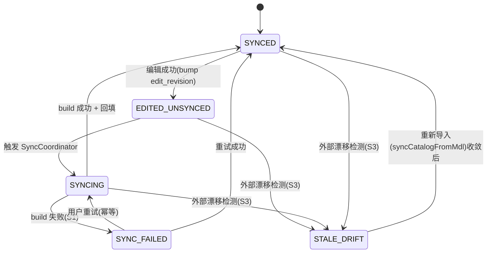

# mis-iqd 二期「语义模型编辑能力」增量 PRD

> 产品经理：许清楚（software-product-manager）｜ 语言：中文
> 配套架构评审：`mis-iqd-edit-architecture-review.md`（架构师高见远）、`mis-iqd-edit-class.mermaid`、`mis-iqd-edit-sequence.mermaid`
> 文档性质：**增量 PRD（仅需求分析）**，覆盖「编辑」相对于一期的变更点，不重述一期已交付内容。

---

## 一、文档目的与范围

### 1.1 目的
为一期已交付的 mis-iqd（问数 APP，集成 WrenAI 做 NL2SQL）补充**二期「语义模型编辑能力」**的产品需求，使平台从「模型浏览/只读镜像」升格为「模型编辑权威」，支持在平台侧编辑 `tables / relations / cubes / views` 并写回 WrenAI MDL。

### 1.2 范围边界

| 项 | 是否本期范围 | 说明 |
| --- | --- | --- |
| 语义模型**浏览**（cube/measure 补全）、平台级指令录入、context build + memory index 闭环 | ❌ 一期已交付 | 不重述 |
| `PUT /catalog/node`（一期返回 501）、`editable` 字段、`iqd-catalog-page` 编辑态未接 | ✅ 本期补全 | G1 |
| 平台编辑 `tables/relations/cubes/views` 并异步写回 WrenAI MDL | ✅ 本期核心 | G7 最关键 |
| 删除、引用完整性校验、乐观并发、同步状态机、外部漂移重导入 | ✅ 本期 | G3–G6、S3 |
| 重命名级联改写、instruction AST 级改写 | ❌ 留 v2 | U1、待确认 |
| NL2SQL 能力本身、WrenAI 引擎内核、问数交互体验 | ❌ 不在范围 | 仅保证编辑后模型正确生效 |

### 1.3 与架构评审的关系
本文档是**需求层**产物，决策依据全部来自架构评审已拍板的 U1–U8 与单边风险清单 S1–S10。凡涉及「怎么改」的细节（字段演进、时序、任务分解 T01–T05、接口契约）以架构评审为准，本文仅做**需求映射**与**产品语言转译**，不重写架构评审。

---

## 二、产品目标

> 核心命题：**让平台 catalog 升格为编辑权威，支持在平台侧编辑语义模型并写回 WrenAI MDL**，全程遵循 **fail-closed**（可见、可重试、可阻断），与一期闸门哲学一致。

### 2.1 产品目标（3 个清晰、正交的目标）

| # | 目标 | 度量（验收口径） |
| --- | --- | --- |
| G-A | **编辑权威化**：平台 catalog 成为模型逻辑真值源，用户可在平台编辑 tables/relations/cubes/views 并落库 | 任意节点编辑后平台 `edit_revision` 单调递增且持久化；WrenAI 仅在平台受控写路径下被改写 |
| G-B | **写回闭环化**：编辑后异步派生完整 MDL 写回 WrenAI，失败时可见、可重试、可阻断 | 写回失败 → `SYNC_FAILED` 前端红标且可重试；`平台.built_edit_revision == WrenAI.build_mdl_hash 所代表的模型版本`（核心不变量）维持 |
| G-C | **治理可控化**：引用完整性、乐观并发、外部漂移均在平台侧可检测、可阻断、可收敛 | 悬空引用/被引用删除/重命名 → 422 阻断；并发编辑 → 409；外部直改 → `STALE_DRIFT` 阻断重建并引导重导入 |

### 2.2 源真值归属（与架构评审一致，需求约束）
- **编辑权威（逻辑真值）**：平台 `iqd_catalog_item` + 新增编辑态（用户意图唯一记录源，支撑审计/回滚/乐观并发）。
- **服务权威（运行真值）**：WrenAI MDL（问数引擎实际读取的编译产物）。
- **唯一受控写路径**：平台 → WrenAI（写回）。外部直改 WrenAI 视为 out-of-band，须经「重新导入」收敛。

### 2.3 编辑落库策略（需求层锁定）
**平台先落库、异步写回 WrenAI**（复用一期 `SyncCoordinator` + `/enhance/sync` 闭环）。写回失败不回滚平台编辑，仅标失败、可重试——平台是权威。

---

## 三、用户故事

> 角色：**语义模型编辑者**（数据/平台管理员，拥有 `iqd:catalog:edit` 权限）；**只读观察员**（查看同步状态）。

| # | 用户故事 | 对应风险/决策 |
| --- | --- | --- |
| US-1 | 作为模型编辑者，我想在平台编辑某个 **table / relation / cube / view** 的字段（显示名、描述、表达式等），以便在不离开平台的前提下修正语义模型 | G7、S1 |
| US-2 | 作为模型编辑者，我想**删除**一个 cube / view，当被下游物料引用时能立刻收到阻断提示并看到引用方列表，以免产生悬空引用 | U5、S8、G5 |
| US-3 | 作为模型编辑者，我想在编辑/删除前**看到该节点的依赖项（谁引用了我）**，以便判断操作是否安全 | S4、S5、G5 |
| US-4 | 作为模型编辑者，我想在编辑后**查看同步状态**（已同步/待同步/同步中/同步失败/外部漂移），以便在模型尚未生效时不被误认为可用 | G3、S1、S2 |
| US-5 | 作为模型编辑者，当两人**并发编辑同一节点**时，我希望后提交者收到明确冲突提示（含当前版本号）并可重读重试，而不是静默丢失更新 | U2、S6、G6 |
| US-6 | 作为模型编辑者，当一次编辑**写回失败**时，我希望能一键重试整库重建（幂等），而不是手动排查 | S1、S7、U4 |
| US-7 | 作为模型编辑者，当检测到 **WrenAI 被外部直改**（平台旧、WrenAI 新）时，我希望平台阻断后续重建并提示「请重新导入」，由我把外部变更收敛回平台 | U3、S3、G4 |
| US-8 | 作为只读观察员，我希望通过同步状态徽标一眼看出当前连接是否存在「变更待同步 / 外部漂移」，以便及时提醒编辑者 | G3、S9 |

---

## 四、需求池（P0 / P1 / P2）

> 优先级：P0=必须；P1=应当；P2=本期不做（仅标注，留 v2）。所有 P0/P1 需求须满足 fail-closed。

### 4.1 P0（必须）

| ID | 需求 | 说明 | 关联 |
| --- | --- | --- | --- |
| P0-1 | **catalog 节点字段 patch 编辑** | 实现 `PUT /catalog/node`（一期 501→200），支持 tables/relations/cubes/views 的字段级 patch（display_name/description/expression 等） | G1、US-1 |
| P0-2 | **删除含引用阻断** | 删除被引用的 cube/view（或存在 relation 引用已删表）时，预校验下游引用 → 422 阻断并列出 N 条依赖方 | U5、S8、G5、US-2 |
| P0-3 | **乐观并发控制** | 编辑请求带 `base_revision`；与服务器 `edit_revision` 不符 → 409（冲突），返回当前版本号供客户端重读重试 | U2、S6、G6、US-5 |
| P0-4 | **引用完整性校验** | `validateCatalogRefs`：编辑/删除前平台侧图遍历，检测悬空引用与被引用实体（S4/S5/S8），不依赖 WrenAI | G5、US-3 |
| P0-5 | **编辑态先落库、异步写回**（复用一期闭环） | 编辑成功 → bump 该连接 `edit_revision` → 触发整库 build（合并窗口内多次编辑合并一次）→ 异步写回 WrenAI | G7、US-1 |
| P0-6 | **同步状态机 + 前端可见** | 派生 `edit_status`：`EDITED_UNSYNCED / SYNCING / SYNCED / SYNC_FAILED / STALE_DRIFT`；前端 `CatalogSyncStatusBar` 轮询展示 | G3、S1、S9、US-4 |
| P0-7 | **整库 build 派生完整 MDL**（最关键） | ai-platform 从平台 catalog **派生完整 MDL**（tables/relations/cubes/views + 物料），而非仅注入 `sql_pairs`/`instructions` | G7、U4、核心 |
| P0-8 | **按 revision 批量回填** | backfill 改按 `edit_revision` 批量 `UPDATE`（断点续盖），消除一期逐条循环部分盖章风险 | U8、S7、G8 |
| P0-9 | **周期对账清扫**（S9） | 新增 `IqdReconcileJobService` 周期扫描 `current>b built` 的连接，重触发偏离连接写回（幂等） | G4、S9、US-8 |
| P0-10 | **外部漂移检测**（S3） | 周期比对 WrenAI 当前 `mdl_hash` 与 `built_mdl_hash` 不符 → 标 `STALE_DRIFT`，**阻断**平台触发的重建直至重新导入 | U3、S3、US-7 |
| P0-11 | **连接级灰度开关** | `mdl_writeback_enabled` 按连接粒度开放（复用 `editable` 列做节点级门控），默认 false，按连接翻 true 开放写回 | U7、G1 |
| P0-12 | **幂等提交** | `PUT /catalog/node` 带 `idempotency_key`+`base_revision` 去重；同 key 重复提交返回首次结果且不二次 bump；backfill 按 `connection_id + build_mdl_hash` upsert | S10、G8 |

### 4.2 P1（应当）

| ID | 需求 | 说明 | 关联 |
| --- | --- | --- | --- |
| P1-1 | 删除语义细化 | 区分「被引用阻断（422）」与「无引用可删」；被引用时 UI 明确展示依赖列表与操作建议 | U5、S8 |
| P1-2 | 并发重试 UI 提示 | 409 冲突时前端展示「版本已变更（当前 edit_revision=N），点击重读最新模型」的友好引导，而非裸错误 | S6 |
| P1-3 | 重导入收敛流程 UI | `STALE_DRIFT` 触发时展示「检测到外部变更，请重新导入」横幅，并提供引导进入 `syncCatalogFromMdl` 生成待审草稿的比对合并界面 | U3、S3 |

### 4.3 P2（本期不做，仅标注，留 v2）

| ID | 需求 | 说明 | 关联 |
| --- | --- | --- | --- |
| P2-1 | 重命名级联改写 | v1 禁止重命名（U1）。v2 提供对 cube/relation 结构化引用的 AST 级级联改写（含 diff 预览与确认） | U1、S5 |
| P2-2 | instruction AST 级改写 | 自然语言类 instruction 中的 `item_key` 引用改动不自动改写，标失效需人工复核 | U1、S5 |

> 注：P2 的需求本期**不实现**，仅作为 PRD 占位，避免 v1 决策（禁止重命名）被误解为能力缺失。

### 4.4 同步状态机（需求层，与架构评审一致）

派生规则：
- `current_edit_revision == built_edit_revision && build_status == success` → **SYNCED**
- `current > built` → **EDITED_UNSYNCED**（有在途作业则 **SYNCING**）
- build 终态 failed → **SYNC_FAILED**
- 外部 `mdl_hash` 与 `built_mdl_hash` 不符 → **STALE_DRIFT**（阻断重建）

---

## 五、UI 设计稿（文字描述，结构化）

> 仅描述编辑态相对一期的增量；一期 `iqd-catalog-page.tsx` 已支持 cube/measure 分组展示，本期补「编辑态 / 同步态 / 冲突与依赖」。复用一期 `SyncStatusBar` 轮询范式。

### 5.1 Catalog 编辑弹窗（`IqdCatalogPage.openEditModal`）
- **触发**：点击 catalog 节点「编辑」按钮（仅 `@mdl_writeback_enabled && editable` 节点可点）。
- **字段区域**（按 kind 动态渲染）：
  - table：`display_name`、`description`、`schema/table` 只读标识、`expression`（视图类）。
  - relation：`display_name`、源/目标 `item_key`（下拉，来自同连接 catalog）、`condition` 表达式。
  - cube：`display_name`、`description`、`expression`（含 measures/dimensions）。
  - view：同 cube 表达式区。
- **依赖提示区**（S4/S5/S8）：编辑/删除前调用 `validateCatalogRefs`，展示「以下 N 个对象引用了此节点」列表；删除被引用节点时弹窗升级为**阻断确认**，列出依赖方并禁用确认按钮（422）。
- **透明元数据区**（可折叠）：展示 `base_revision`（当前版本）、`idempotency_key`（本次提交指纹），让用户理解乐观并发与幂等机制。
- **提交**：携带 `base_revision` + `idempotency_key` 调 `PUT /iqd/catalog/node`；乐观 UI 即时更新，落库即返回新 `edit_revision`。

### 5.2 同步状态徽标（`CatalogSyncStatusBar`，新增）
- 轮询 `GET /iqd/catalog/sync-status`，渲染 5 态徽标：
  - `SYNCED`（绿）：已同步，模型可信。
  - `EDITED_UNSYNCED`（黄）：有变更待同步。
  - `SYNCING`（蓝，转圈）：同步中。
  - `SYNC_FAILED`（红）：同步失败，提供「重试」按钮（触发 P0-6 重试，走主线 A 幂等写回）。
  - `STALE_DRIFT`（橙，阻断）：检测到外部变更，展示「请重新导入」横幅（P1-3）。
- 顶部横幅：当 `current > built` 且未进入 SYNCING 时显示「变更待同步」（S9 对账可见性）。

### 5.3 冲突 / 依赖阻断弹窗
- **冲突（409）**：展示「模型已被他人更新（当前 edit_revision=N），您的编辑基于旧版本」，提供「重读最新模型并重试」按钮（P1-2）。
- **依赖阻断（422）**：展示引用方清单（cube/relation/sql_pair 等），明确「请先处理以下引用后再操作」，禁用确认（P1-1）。

---

## 六、决策采纳说明（U1–U8 → 需求映射）

> 以下 8 项决策用户已拍板（架构评审 §九），本文档直接采信，并映射到需求以保证一致性。

| 决策 | 决策内容 | 映射到需求（一句话） |
| --- | --- | --- |
| **U1** | 禁止重命名（被引用则 422 拒绝，级联改写留 v2） | P0-4 校验拦截改名；P2-1/P2-2 标注 v2 才做级联改写 |
| **U2** | 每节点乐观并发（`base_revision` + 409） | P0-3 编辑带 `base_revision`，冲突 409 返回当前版本供重试 |
| **U3** | 外部写治理：周期对账 + 重新导入 | P0-10 检测外部漂移标 `STALE_DRIFT` 阻断重建；P0-9 周期对账重触发 |
| **U4** | 接受单节点编辑触发整连接 MDL 重建 | P0-5/P0-7 单节点编辑 → 整连接 `build_mdl_from_catalog` 重建（本期不做分库范围） |
| **U5** | 删除被引用 cube/view 阻断（422） | P0-2 删除前 `validateCatalogRefs` 预校验下游引用，列出 N 条依赖并阻断 |
| **U6** | 模型与物料作业统一每连接 | P0-5/P0-6 `edit_revision`（模型）与物料 `wren_ref_id` 分开追踪，同走 `SyncCoordinator` |
| **U7** | 灰度 `mdl_writeback_enabled` 按连接粒度 | P0-11 开关复用 `editable` 列做节点级门控，默认 false 按需开放 |
| **U8** | 回填按 revision 批量 UPDATE | P0-8 backfill 改批量 `UPDATE ... WHERE edit_revision <= :built AND wren_ref_id <> :hash`（断点续盖） |

**一致性结论**：需求池 P0-1～P0-12 与 U1–U8、G1–G8、S1–S10 一一对应，无冲突；fail-closed 哲学贯穿全部需求。

---

## 七、待确认问题（仅 PM 层面不确定项）

> 以下为产品层面仍未拍板的点，**不重复**架构师已解决的 U1–U8 与 S1–S10。需主理人/相关方在开工前确认。

| # | 待确认问题 | 建议默认 | 影响 |
| --- | --- | --- | --- |
| Q-1 | 编辑弹窗是否需要**字段级 diff 预览**（编辑前后对比）？还是仅展示当前值 + 保存？ | 一期仅展示当前值；diff 预览作为 P1 增强 | 影响 `openEditModal` 复杂度与评审工作量 |
| Q-2 | 外部漂移重导入（`STALE_DRIFT`）是否需要**人工审批按钮**，还是自动发起 `syncCatalogFromMdl` 草稿？ | 自动生成待审草稿，人工确认合并（更安全） | 影响 P1-3 流程与权限设计 |
| Q-3 | 删除被引用节点的阻断提示中，依赖列表展示**粒度**？仅列直接引用方，还是递归展开全部上游链路？ | 仅直接引用方（N 条），避免信息过载 | 影响 `validateCatalogRefs` 返回结构与前端渲染 |
| Q-4 | 灰度 `mdl_writeback_enabled` 首批开放**哪些连接**？是否有内部试点连接清单？ | 留 1 个内部试点连接先翻 true | 影响 U7 落地节奏与回归范围 |
| Q-5 | `edit_status` 徽标轮询**间隔**沿用一期 `SyncStatusBar` 还是加密？ | 沿用一期轮询间隔，后续按体验调优 | 影响前端轮询实现与后端压力 |

---

## 附：与架构评审的接口/任务参照（不展开）

- **接口契约**：`PUT /iqd/catalog/node`、`GET /iqd/catalog/sync-status`、`POST /iqd/catalog/reconcile` 请求/响应字段见架构评审 §七。
- **任务分解**：实现侧 T01–T05（编辑态数据模型 → ai-platform 派生写回 ∥ mis-iqd 编辑接口 → BFF 编排 → 前端），顺序 `T01 → (T02 ∥ T03) → T04 → T05`，详见架构评审 §六。
- **字段演进**：`iqd_connection`/`iqd_catalog_item`/`iqd_sync_job` 加列与 `source=platform_edit` 取值，详见架构评审 §三.3。
- **类图/时序图**：见 `mis-iqd-edit-class.mermaid`、`mis-iqd-edit-sequence.mermaid`。
