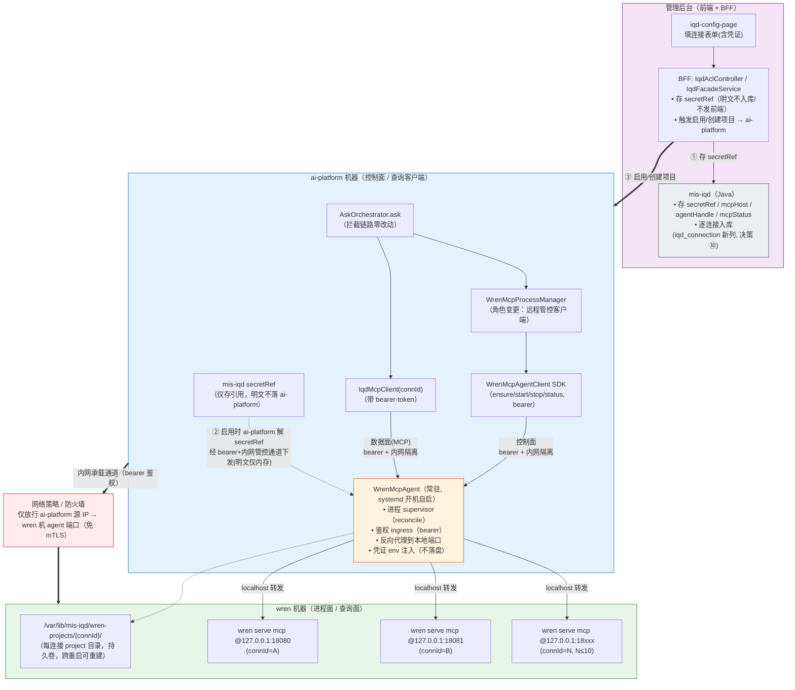
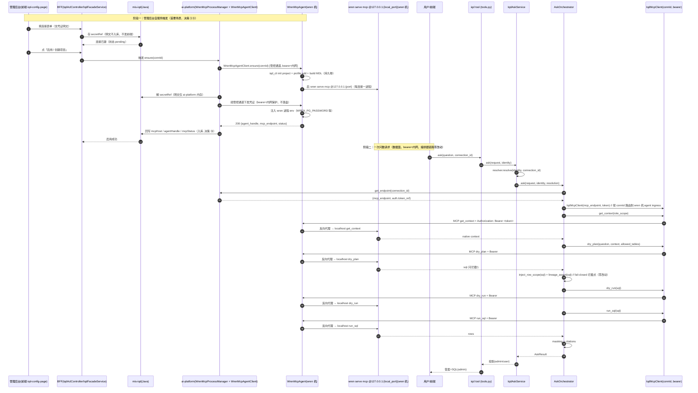
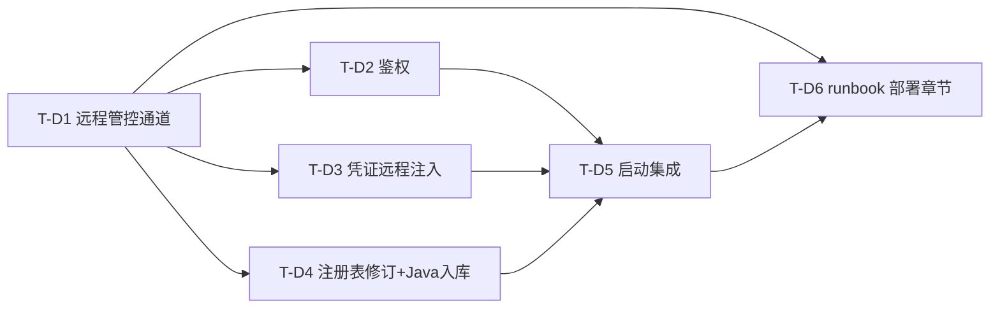

# mis-iqd 多连接对接 WrenAI MCP：部署层增量设计修订（方案 A × 跨机器事实）

> 文档类型：架构评审 / 增量设计修订（不写实现代码，只给决策、拓扑、schema、任务分解）
> 架构师：高见远（software-architect）｜日期：2026-08-27｜版本：**v0.2（决策锁定）**
> 触发事实：**ai-platform 与 wren 部署在「不同的机器」上**（用户已明确确认）
> 基础文档：`mis-iqd-mcp-multiconn-design.md`（方案 A，已采纳）
> 关联：`wrenai-ops-runbook.md` §2.3、`mis-iqd-mcp-multiconn-prd.md`
> **v0.2 变更说明**：将 v0.1 的 10 项「待拍板」全部落定为最终决策（见 §0），并据此微调拓扑/鉴权/凭证/注册表/时序/文件清单/任务分解。**业务正确性结论一律继承 v0.1，不重新辩论。**

---

## 0. 决策锁定 v0.2（10 项待拍板落定）

v0.1 提出 10 项待拍板议题，本次由主理人/用户（经「管理后台自服务」需求澄清）全部落定。下表为最终值及对设计的影响；**凡 v0.1 已确立的业务正确性结论（per-connection 路由、进程管理器逻辑、编排器拦截点、凭证不落盘）一律继承，不重新辩论。**

| # | 议题 | 最终决策 | 对设计的影响（v0.2 落点） |
|---|---|---|---|
| ① | wren 机常驻 agent | ✅ 允许，落地 `WrenMcpAgent`（方案 a） | §3 维持「方案 a」结论，进程管理器角色＝远程管控客户端 |
| ② | 鉴权组合 | ✅ **简化（内网）**：去 mTLS，保留 **bearer-token + 内网网络隔离（防火墙/源 IP 放行）** | §4 改为「bearer + 内网隔离，免 mTLS」；§2/§7 拓扑与时序去除 mTLS 标注 |
| ③ | 凭证 S1/S2 | ✅ **S1**：凭证经平台流向 wren 机——admin 提交→mis-iqd 存 secretRef→启用时 ai-platform 解 secretRef→经 bearer+内网管控通道下发 agent→注入 wren 进程 env。wren 机**不接 Vault** | §5 改 S1 为唯一实现路径；D6 仍满足（mis-iqd 仅存 secretRef）；S2 降为后续可选 |
| ④ | wren 机运行时 | ✅ **默认 Linux + systemd + 持久卷**（project 目录挂持久卷，跨重启可重建；agent 用 systemd 开机自启） | §3 补充运行时约束；§10 R-D3 重启重建路径明确为持久卷 + systemd |
| ⑤ | 防火墙放行 | ✅ 按之前确定的走（内网，仅放行 ai-platform 源 IP ↔ wren 机 agent 管控/数据端口） | §4/§10 网络策略不变，仅去除 mTLS 证书相关项 |
| ⑥ | mTLS 证书 | ✅ **免去**（内网+鉴权简化） | §4 去除 mTLS 层；§10 R-D5 证书生命周期风险移除 |
| ⑦ | 资源/规模 | ✅ 接入数据库 **≤10 个**（单 wren 机，一次性定档；建议 16GB/4-8vCPU 舒适档） | §3 规模定档；§10 单点风险维持（单 wren 机，≤10 库） |
| ⑧ | 多机联邦 | ✅ 本期**单 wren 机** | §6 注册表 `wren_host` 单值；多机联邦列为后续演进 |
| ⑨ | SSH 兜底 | ✅ **保留**（Day-1 bootstrap 用） | §3 将 SSH 标注为 Day-1 bootstrap 通道（agent 未部署时手动拉起） |
| ⑩ | Java 字段 mcpHost/agentHandle | ✅ **入库**（iqd_connection 表加两列、逐连接存，需写 Flyway 迁移；改 IqdConnection 实体/映射 + IqdAdminService 写回；前端/API 不暴露） | §6 说明入库；§8 补 Flyway 新迁移 + 实体/服务改动；§9 T-D4 含 Flyway |

### 0.1 业务正确性结论继承声明（v0.1 → v0.2 不变）

- **每连接一个 `wren serve mcp` 进程**（一进程=一 project=一库）：✅ 保留
- **`WrenMcpProcessManager` 生命周期职责**（启停/健康/重启/端口回收）：✅ 保留（角色＝远程管控客户端）
- **查询面 `iqd_mcp_client` 按 `connId` 路由**：✅ 保留（`host` 为 wren 机 agent ingress）
- **编排器控制面链路** `get_context→dry_plan→注入行级范围→血缘 fail-closed→dry_run→run_sql→脱敏`：**完全保留、零改动**
- **凭证不落盘铁律**（env 注入 / 临时 profile chmod600 用即删）：✅ 保留、加强（经网络传输部分由 bearer+内网保护）
- **管理面 `iqd_cli.py` 参数化 `project_dir`**：✅ 保留

---

## 1. 修订结论摘要（TL;DR）

### 1.1 本修订的范围

本修订**只动部署层（进程面 + 网络面 + 凭证落点）**，**不动方案 A 的业务正确性结论**。
即：方案 A 在「同一机器」假设下做出的"每连接一个 `wren serve mcp` 进程 + 进程管理器"的决策**本身仍然成立且被保留**；被推翻的是"进程管理器在 ai-platform 本机拉起 wren"这一**部署拓扑假设**。

### 1.2 保留 / 推翻对照表

| 方案 A 要素 | 结论 | 说明 |
|---|---|---|
| 每连接一个 `wren serve mcp` 进程（一进程=一 project=一库） | ✅ **保留** | wren 0.13.3 硬约束不变 |
| `WrenMcpProcessManager` 负责生命周期（启停/健康/重启/端口回收） | ✅ **保留（角色变更）** | 从"本机 subprocess 拉起者"变为"远程管控客户端"，逻辑职责不变 |
| 查询面 `iqd_mcp_client` 按 `connId` 路由到 `host:port` | ✅ **保留（host 取值变更）** | `host` 由 `127.0.0.1` 变为 wren 机内网地址 |
| 管理面 `iqd_cli.py` 参数化 `project_dir` | ✅ **保留** | 仅执行位置从本机变 wren 机（经 agent/SSH） |
| 编排器控制面链路 `get_context → dry_plan → 注入行级范围 → 血缘 fail-closed → dry_run → run_sql → 脱敏` | ✅ **完全保留、零改动** | SQL 拦截点不动，这是方案 A 的立身之本 |
| 凭证"不落盘"铁律（env 注入 / 临时 profile chmod600 用即删） | ✅ **保留、加强** | 落点转移到 wren 机，新增"经网络传输"约束（bearer+内网保护） |
| 每连接 project 目录 `/var/lib/mis-iqd/wren-projects/{connId}/` | ✅ **保留** | 目录**位于 wren 机**（不再是 ai-platform 本机），挂持久卷跨重启可重建 |
| 假设①：进程管理器在 ai-platform 本机 `subprocess` 拉起 wren | ❌ **推翻** | wren 在另一台机器 |
| 假设②：`wren serve mcp` 绑 `127.0.0.1`、ai-platform 经 localhost 访问 | ❌ **推翻（部分）** | 跨机不可达；改为"wren 留 localhost + wren 机 agent 做鉴权 ingress"更优（见 §4） |
| 假设③：凭证 env 注入发生在 ai-platform 本机启动子进程时 | ❌ **推翻** | 落点转移到 wren 机（远程拉起子进程处） |
| 假设④：跨机通道用 mTLS + bearer 鉴权 | ❌ **推翻（简化）** | v0.2 决策 ②⑥：免 mTLS，仅 bearer-token + 内网网络隔离 |

### 1.3 新部署拓扑（一句话）

> **管理后台（自服务）** → BFF → **ai-platform（控制面 + 查询客户端）** ──（**bearer-token + 内网网络隔离，免 mTLS**）──▶ **wren 机上的常驻管控代理 `WrenMcpAgent`**（进程 supervisor + 鉴权 ingress）→ 本地 `127.0.0.1` 上的 N 个 `wren serve mcp`（每连接一个，N≤10）。

**核心决策**：**方案 a) wren 机常驻 `WrenMcpAgent`**（自然收敛为 operator 模式 c）；否决 b) 纯 SSH 直连用于生产，仅保留为 Day-1 bootstrap（决策 ①⑨）。详见 §3。

---

## 2. 新的部署拓扑图（Mermaid）



**拓扑要点（鉴权边界标注）**：
- **信任边界 1（跨机网络）**：ai-platform ↔ wren 机之间仅有**一条 bearer 鉴权 + 内网网络隔离（防火墙/源 IP 放行）的管控/数据通道**，由 `WrenMcpAgent` 统一收口，**免 mTLS**（决策 ②⑥）；防火墙只放行 ai-platform 源 IP。
- **信任边界 2（wren 机内）**：`wren serve mcp` 仍绑 `127.0.0.1`（官方"keep it local"），**不经过任何外部网络**；agent 在 localhost 上转发，外部不可直连 wren。
- **凭证边界**：明文只在 ai-platform 解 secretRef 时短暂在内存存在、经 bearer+内网通道一次性下发；wren 机磁盘不落明文、wren 机不接 Vault（决策 ③）。
- **自服务边界**：管理后台经 BFF 提交连接/凭证（存 secretRef，明文不入库不发前端）→ 用户点「启用/创建项目」触发 ai-platform `WrenMcpAgentClient.ensure`；这是首要使用场景（见 §5 / §7）。

---

## 3. 跨机器进程管理模型（核心决策）

### 3.1 候选评估

| 方案 | 描述 | 优劣 | 结论 |
|---|---|---|---|
| **a) wren 机 sidecar/agent** | wren 机部署轻量常驻 agent，受 ai-platform 经 HTTP（bearer+内网）控制；负责拉起/停止/健康巡检/端口回收/凭证 env 注入。`WrenMcpProcessManager` 改为"远程控制客户端" | ✅ 稳定控制端点、本地 reconcile（崩溃自愈不依赖跨机网络）、并发与状态由 agent 集中、凭证只在 agent 本地注入（落点最优）；❌ 新增一个常驻组件需运维 | **推荐（决策 ① 采纳）** |
| **b) ai-platform 经 SSH 直连 wren 机执行** | 不引入常驻组件，ai-platform 用 SSH 会话远程跑 wren CLI / 启停进程 | ✅ 无新组件；❌ 常驻进程需 `setsid/nohup/systemd` 否则 SSH 断连即杀；SSH 会话管理/并发/凭证传递脆弱；无集中状态、难做自愈与端口回收；密钥分发面大 | **否决（仅作 Day-1 bootstrap 兜底，决策 ⑨）** |
| **c) 独立 wren-mcp-operator 服务** | 把进程管理抽成独立微服务，wren 机部署，ai-platform 经 API 调用 | ✅ 与 a 本质相同，是 a 的"正式化/硬化"形态；❌ 若独立成重服务则过度设计 | **a 的成熟形态**（不另立项） |

### 3.2 推荐方案：a) `WrenMcpAgent`（wren 机常驻管控代理）

**推荐理由（相对 b 的代价对比）**：
- **状态一致性**：agent 在 wren 机本地持有 `desired_state`（哪些 connId 应 up），并以 reconcile 循环本地自愈（崩溃重启、端口回收），**即使与 ai-platform 网络分区也不影响已运行连接的问数**。b) 方案下跨机失联即无管控，进程死了无人拉。
- **并发与生命周期**：常驻 agent 用进程池/supervisor 管理 N 个 `wren serve mcp`，端口段在 wren 机本地分配回收，干净可控。b) 每次 SSH 启停需自己防重复拉起、防端口冲突，极易出竞态。
- **凭证落点最优**：明文只在 agent 本地注入子进程 env（或临时 profile），**明文完全不跨机**（S1 下仅经 bearer+内网通道一次性下发，见 §5）。b) 要么明文经 SSH 下发（泄漏面大），要么 SSH 远端自己取密（需 wren 机有 vault 访问，与决策 ③ 不符）。
- **可观测/健康检查**：agent 暴露 `/health` `/connections` 给 ai-platform 轮询；b) 需每连接 SSH 探活，开销大。
- **否决 b 的代价**：若强行用 b，需额外自研 SSH 会话保活 + 远端进程注册表 + 并发锁 + 凭证安全通道，工作量≥a 且更脆弱；仅当**运维政策明确禁止在 wren 机部署任何常驻组件**时，才退化为 b 作为 Day-1 兜底，并标注为"非生产推荐"。

**`WrenMcpAgent` 职责（明确边界）**：
1. **进程 supervisor**：按 `desired_state` reconcile 本地 N 个 `wren serve mcp`（启动/停止/重启/崩溃自愈/端口段分配回收）。
2. **管控 ingress**：接收 ai-platform 的控制指令（`ensure/start/stop/restart/status`），经 **bearer + 内网网络隔离**鉴权（**免 mTLS**，决策 ②⑥）。
3. **数据面 ingress（反向代理）**：对外暴露鉴权后的 MCP 端点，按 `connId` 路由到本地 `127.0.0.1:{port}` 的 wren 进程；**这是 `iqd_mcp_client` 跨机访问 wren 的唯一入口**。
4. **凭证 env 注入**：接收 ai-platform 经管控通道下发的明文（S1），注入子进程环境变量（或临时 profile `chmod 600` 用即删），**不落盘**。
5. **心跳/上报**：向 ai-platform 周期上报各连接真实状态，使 ai-platform 可重建/校正注册表。

**agent 实现形态建议**：轻量（Go 单二进制或 Python+uvicorn），systemd 托管，开机自启，自身配置含"wren 机 project 根目录、端口段、ai-platform 信任源 IP 白名单 + bearer token 配置"。

### 3.3 运行时约束（决策 ④）与 Day-1 bootstrap（决策 ⑨）

- **运行时（决策 ④）**：wren 机默认 **Linux + systemd + 持久卷**。project 目录 `/var/lib/mis-iqd/wren-projects/{connId}/` 挂载持久卷，跨重启可重建（由 `mdl_raw` 重新生成 `models/` 与 `target/mdl.json`）；`WrenMcpAgent` 以 systemd unit 托管、开机自启；agent 自身持久化 `desired_state`（或启动时扫描持久卷 project 目录）以在重启后 reconcile 重建进程。
- **规模定档（决策 ⑦⑧）**：单 wren 机接入数据库 **≤10 个**（一次性定档）；建议规格 16GB 内存 / 4-8 vCPU 舒适档。注册表 `wren_host` 单值、多机联邦列为后续演进。
- **SSH 兜底（决策 ⑨）**：保留 SSH 作为 **Day-1 bootstrap 通道**——在 `WrenMcpAgent` 尚未于 wren 机部署/启动前，运维可经 SSH 手动执行 `iqd_cli init project + profile add + build MDL + 启 wren serve mcp` 完成首拉起；agent 上线后即接管为常驻管控端点，SSH 退居兜底。SSH 通道仅用于 bootstrap，不用于生产期常驻管控（避免 §3.1 所列脆弱性）。

---

## 4. 网络与鉴权修订

### 4.1 推荐方案（优于字面"绑 0.0.0.0 + 补鉴权"）

> **保持 `wren serve mcp` 绑 `127.0.0.1`（官方"keep it local"）**，由 `WrenMcpAgent` 在 wren 机提供**唯一鉴权 ingress** 并反向代理到本地端口。

- 好处：① 复用 wren 官方默认（无鉴权 localhost 绑定），**不改 wren 二进制/配置**；② wren 进程永不直接暴露到任何网络，外部不可直达，攻击面最小；③ 鉴权、限流、审计集中在 agent 一处。
- 若运维**坚持** wren 直接绑内网 IP/0.0.0.0（不推荐），则必须在 wren 前额外布一套 auth gateway（nginx/Caddy `auth_request` 或 envoy），否则无鉴权的 MCP 端口暴露在内网即违规。

### 4.2 推荐鉴权组合（内网简化，免 mTLS，决策 ②⑥）

| 层 | 手段 | 说明 |
|---|---|---|
| 应用 | **bearer-token**（每连接或每平台短期 token） | agent ingress 校验 `Authorization: Bearer <token>`；`iqd_mcp_client` 注入该 token |
| 网络 | **内网网络隔离 + 防火墙 / 源 IP 放行** | 仅放行 ai-platform 源 IP → wren 机 agent 端口（管控/数据）；其余全拒；**免 mTLS**（决策 ②⑥） |
| 可选 | 按 `connId` 的 path/header 路由 + 每连接独立 token 作用域 | 防止 token 串连 |

> **决策说明**：因走内网 + 源 IP 放行，`mTLS` 证书层**免去**（决策 ⑥）。纵深防御由「bearer-token 应用鉴权 + 内网网络隔离」二者组合承担。证书生命周期/轮换风险（原 R-D5）随之移除（见 §10）。

**`iqd_mcp_client` 侧改动**：构造函数已接受 `host/port`，新增 `token` 参数；每次 MCP 请求带 `Authorization: Bearer <token>`；`host` 取自注册表（wren 机 agent ingress 地址，非 127.0.0.1）。

---

## 5. 凭证注入落点修订（决策 ③：S1）

### 5.1 首要场景：管理后台自服务（决策 ③ 触发）

用户明确要"**通过管理后台直接配置 wren 链接的数据库、创建 wren 项目**"——这是首要使用场景，结论**可行**且优于"运维本地置备"。端到端流（对应 §7 时序）：

```
管理后台填连接表单(含凭证) → BFF → mis-iqd 存 secretRef（明文不入库、不发前端）
→ 用户点「启用 / 创建项目」 → BFF → ai-platform
→ WrenMcpAgentClient.ensure(connId) [跨机管控通道, bearer+内网]
→ wren 机 WrenMcpAgent: iqd_cli init project + profile add + build MDL + 启 wren serve mcp（每连接一进程）
→ ai-platform 解 secretRef → 经管控通道把凭证下发 agent → 注入 wren 进程 env（不落盘）
→ agent 回报状态 → mis-iqd 存 mcpHost / agentHandle / mcpStatus
```

问数：`iqd_mcp_client` 按 connId 从注册表取 mcpHost+token，跨机打 agent ingress。编排器 `dry_plan` 拦截点、行级注入、血缘 fail-closed **零改动**。

### 5.2 凭证传递策略：S1（唯一实现路径，决策 ③）

| 策略 | 流程 | 明文是否跨机 | 评价 |
|---|---|---|---|
| **S1（采纳）** | admin 提交凭证→mis-iqd 存 `secretRef`（明文不落库/不落前端）→ 启用时 ai-platform 经 `secretRef` 解出明文 → 经 **bearer+内网管控通道**随 `ensure/start` 下发给 agent → agent 注入子进程 env（不落盘）。**wren 机不接 Vault** | 是（仅在 bearer+内网通道内，且仅一次，明文仅两端内存） | 满足自服务诉求；明文经内网承载+bearer 保护，一次性下发 |
| ~~S2（wren 侧 vault 解析）~~ | agent 侧自行经 vault 解析明文（wren 机/共享 vault 可达） | 否 | **降为后续可选增强**（决策 ③）：当前 wren 机不接 Vault，故不采用；若未来 wren 机可访共享密钥库可再评估 |

### 5.3 "不落盘"保证如何保持（D6 铁律仍满足）

- **mis-iqd 只存 `secretRef`（凭证引用），绝不存明文或 token 明文**；前端/API 不暴露明文与 secretRef 直读。
- 明文仅在 ai-platform 解 `secretRef` 时短暂在内存存在，经 bearer+内网通道一次性下发给 agent；用完即弃，不写库/不写日志/不写前端。
- agent 侧明文仅注入 `wren serve mcp` 子进程环境变量（`WREN_PG_PASSWORD=xxx` 等），wren 启动期解析一次；**wren 机磁盘无明文**、wren 机不接 Vault。
- 若使用临时 profile 文件：`chmod 600` 写入 → 启动子进程 → `os.remove` 立即删除（删除失败告警 + 定时清理兜底）。
- 注册表/Java 侧只存 `secret_ref` 与 `agent_handle`/`mcp_host`/`mcp_status`，**绝不存明文或 token 明文**。

---

## 6. 注册表结构修订

### 6.1 原 schema（被推翻部分）

```json
{ "connId": { "host": "127.0.0.1", "port": 18080, "pid": 12345, "status": "running", "last_health_at": "..." } }
```

### 6.2 修订后 schema（v1，继承 v0.1）

```json
{
  "connId": {
    "wren_host": "10.20.30.40",                 // wren 机内网地址（管控 + 数据面 ingress）
    "control_endpoint": "https://10.20.30.40:19090",   // WrenMcpAgent 管控地址（bearer）
    "mcp_endpoint": "https://10.20.30.40:19091/mcp/{connId}", // 鉴权后 MCP ingress（bearer）
    "local_mcp_port": 18080,                    // wren 机 localhost 端口（agent 内部转发用，对外不可见）
    "agent_handle": "lease-7f3a9c",             // 远程管控句柄（替代 pid；agent 侧会话/租约标识）
    "desired_state": "up",                      // 声明式期望状态（agent reconcile 依据）
    "status": "running",                        // running|starting|stopped|failed|unknown
    "auth": { "scheme": "bearer", "token_ref": "vault://iqd/mcp-token/{connId}" }, // token 引用，非明文
    "secret_ref": "vault://iqd/db/{connId}",    // 凭证引用；S1 下由 ai-platform 侧解析
    "last_health_at": "2026-08-27T14:20:00Z",   // UTC
    "last_health_msg": "ok",
    "project_home": "/var/lib/mis-iqd/wren-projects/{connId}" // 位于 wren 机（持久卷）
  }
}
```

### 6.3 关键变更点

- `host: 127.0.0.1` → `wren_host`（wren 机内网地址）+ 显式 `control_endpoint` / `mcp_endpoint`。
- `pid`（本机进程号）→ `agent_handle`（远程管控句柄/租约）；ai-platform 不再直接知道 wren 机 pid。
- 新增 `desired_state`：声明式期望，使 agent 可独立 reconcile、ai-platform 可幂等重发。
- `auth` / `secret_ref` 仅存**引用**，不存明文/token 明文（满足不落盘）。
- **入库约束（决策 ⑩）**：`mcp_host` / `agent_handle` 为**逐连接持久化字段**，写入 `iqd_connection` 表新增两列（需 Flyway 迁移，见 §8）；`mcp_status` 沿用现有字段。mapping：注册表 `wren_host` ↔ `iqd_connection.mcp_host`（Java `IqdConnection.mcpHost`）；注册表 `agent_handle` ↔ `iqd_connection.agent_handle`（Java `IqdConnection.agentHandle`）。`mis-iqd` 在 `ensure` 回报后由 `IqdAdminService` 回写 `mcpHost`/`agentHandle`/`mcpStatus`。**前端/API 不暴露这两列**。

---

## 7. 接线时序图修订（Mermaid）

在原 §6 时序图基础上，体现 **管理后台自服务触发（admin→BFF→ai-platform→agent→wren）** + **S1 凭证跨机下发（bearer+内网保护）** + 数据面问数（编排器链路零改动）。



> 注：阶段二编排器链路（`get_context → dry_plan → 注入 → 血缘断言 → dry_run → run_sql → 脱敏`）**与方法 A 完全一致，未改动任何拦截点**，仅 `IqdMcpClient` 的 `host` 与 `token` 来自修订后注册表，且跨机流量经 `WrenMcpAgent` ingress（bearer+内网保护）。

---

## 8. 增量文件改动清单（相对原方案 A）

> 标注 **[新增·wren机]** 表示部署在 wren 机器上的组件；其余默认在 ai-platform 仓库。v0.2 在 v0.1 基础上补：Flyway 新迁移（mcp_host/agent_handle 两列）、IqdConnection/IqdAdminService 入库改动、管理后台「启用/创建项目」按钮接线。

| 文件 | 类型 | 改动要点 |
|---|---|---|
| `agent/ai-platform/backend/src/config.py` | 修改 | `IqdMcpSettings`：删除 `wren_mcp_default_host=127.0.0.1`；新增 `wren_agent_endpoint`（wren 机地址）、`wren_agent_control_port`/`mcp_port`、`wren_agent_token`、wren 机侧 `wren_mcp_port_range`（端口段现位于 wren 机）、`wren_projects_root`（现为 wren 机路径，ai-platform 侧仅作逻辑约定） |
| `agent/ai-platform/backend/src/adapters/wren_mcp_registry.py` | **修改（角色变更）** | `WrenMcpProcessManager`：移除本机 `subprocess` 拉起逻辑；改为调用 `WrenMcpAgentClient` 远程管控；注册表 schema 改为 §6.2；新增 `reconcile()` 周期校正 |
| `agent/ai-platform/backend/src/adapters/wren_mcp_agent_client.py` | **新增** | 远程管控客户端 SDK：封装 `ensure/start/stop/restart/status/health` 调用（bearer + 内网），供 `WrenMcpProcessManager` 使用 |
| `agent/ai-platform/backend/src/adapters/iqd_mcp_client.py` | 修改 | 新增 `token` 参数；请求注入 `Authorization: Bearer <token>`；`host` 取注册表（wren 机 agent ingress）；保留工具常量与 mock 降级 |
| `agent/ai-platform/backend/src/adapters/iqd_cli.py` | 修改 | 方法新增 `project_dir` 参数（原方案 A 已规划）；**执行位置改为经 agent/SSH 在 wren 机执行**（新增 `remote_exec` 适配，或保持 CLI 语义由 agent 侧执行） |
| `agent/ai-platform/backend/src/agent/mis_iqd/orchestrator.py` | 修改 | `_get_mcp_client()` 按 `resolution.connection_id` 从修订后注册表取 `mcp_endpoint` + `token` 构造 client（链路其余零改动） |
| `agent/ai-platform/backend/src/agent/mis_iqd/service.py` | 修改 | build/index 传 `project_dir`；新增连接 bootstrap 改调远程 `ensure`（不再本机 subprocess） |
| `agent/ai-platform/backend/src/agent/mis_iqd/bootstrap.py` | **新增/修改** | 连接创建/启用：init project（wren 机侧）+ profile + first build + 经 agent `ensure` 拉起 MCP |
| `agent/ai-platform/backend/src/main.py` 或 `runtime/setup` | 修改 | Worker 启动：对全部 `enabled` 连接经 agent 批量 `ensure` + 启动后台 reconcile/心跳循环 |
| `backend/mis-iqd/.../entity/IqdConnection.java` | 修改 | 新增/调整 `projectHome`（现为 wren 机路径约定）、`mcpHost`（wren 机地址，替代原 127.0.0.1）、`mcpPort`、`mcpStatus`、`agentHandle`（**入库，决策 ⑩**） |
| `backend/mis-iqd/.../IqdAdminService.java` | 修改 | 连接创建/启用时分配 projectHome（wren 机约定路径）、回写 `mcpHost/mcpPort/mcpStatus/agentHandle`（**决策 ⑩**） |
| `backend/mis-iqd/.../db/migration/V85__add_mcp_host_agent_handle.sql` | **[新增]** | Flyway 迁移：iqd_connection 表加 `mcp_host` / `agent_handle` 两列（决策 ⑩，逐连接存） |
| `agent/ai-platform/backend/src/.../routes/iqd_mcp_manager.py` | 修改 | 暴露「启用/创建项目」后端触发入口（调用 `WrenMcpAgentClient.ensure`），供 BFF 转发 |
| `agent/ai-platform/bff/.../IqdFacadeService.java` / `IqdAclController.java` | 修改 | 新增「启用/创建项目」接口，转发 ai-platform `ensure`；凭证提交仅落 secretRef |
| `agent/ai-platform/frontend/src/features/agent/iqd/iqd-config-page/*` | 修改 | 接线「启用 / 创建项目」按钮 → BFF → ai-platform ensure；连接表单含凭证字段（提交走 secretRef，明文不落前端） |
| `agent/ai-platform/frontend/src/features/agent/iqd/lib/api/iqd.ts` | 修改 | 新增 enable/createProject API 调用；连接管理含 mcpStatus 展示（不暴露 mcpHost/agentHandle） |
| **`deploy/wrenai/wren-mcp-agent/`** | **[新增·wren机]** | `WrenMcpAgent` 服务：Dockerfile 或 systemd unit、config.yaml、进程 supervisor、反向代理、auth 中间件（bearer）、凭证注入模块 |
| **`deploy/wrenai/wren-mcp-agent/agent.py`**（或 main） | **[新增·wren机]** | agent 主程序：control API + MCP ingress 反向代理 + supervisor reconcile + 凭证注入 |
| `agent/ai-platform/deploy/wrenai/README.md` | 修改 | 补充**跨机器部署**：wren 机 agent 安装、ai-platform→wren 网络/源 IP 放行、端口段在 wren 机 |
| `docs/ai-fusion/wrenai/wrenai-ops-runbook.md` §2.3 | 修改 | 更新为"跨机器方案 A"：agent 安装/开机自启(systemd)、防火墙/源 IP 放行、凭证 S1 远程注入、wren 机重启重建注册表、自服务排查 |
| **`docs/ai-fusion/wrenai/wren-mcp-agent-deploy.md`** | **[新增]** | wren 机侧 agent 专属部署/运维手册（含网络策略 spec、凭证 S1 流程） |

**继承声明（明确不改）**：原方案 A 的 per-connection project 目录结构、编排器 SQL 拦截链路、`dry_plan` 复用、行级注入、血缘 fail-closed、凭证不落盘原则 —— **全部保留，本修订不触及上述任何业务逻辑文件的核心逻辑**。

---

## 9. 增量任务分解（有序，含依赖）

> 命名沿用 T-D1…T-D6；优先级 P0/P1。依赖关系尽量扁平（多数仅依赖 T-D1）。本表在 v0.1 基础上按 v0.2 决策（已落定鉴权/凭证/入库/自服务）微调。

| # | 任务 | 源文件（改动清单项） | 依赖 | 优先级 |
|---|---|---|---|---|
| **T-D1** | **远程管控通道（P0）**：wren 机 `WrenMcpAgent`（supervisor + control API）；ai-platform 侧 `WrenMcpProcessManager` 改远程控制客户端 + 新增 `WrenMcpAgentClient` SDK | wren-mcp-agent/*、wren_mcp_registry.py、wren_mcp_agent_client.py | 无 | P0 |
| **T-D2** | **鉴权（P0，简化）**：agent ingress bearer 校验 + 防火墙/源 IP；`iqd_mcp_client` 加 token 注入。**免 mTLS** | iqd_mcp_client.py、config.py、wren-mcp-agent auth 中间件、防火墙 spec | T-D1 | P0 |
| **T-D3** | **凭证远程注入（P0，S1）**：ai-platform 解 secretRef → 经管控通道下发 agent → 注入 wren 进程 env（不落盘）；wren 机不接 Vault | wren-mcp-agent 凭证模块、wren_mcp_agent_client.py、config.py、mis-iqd secretRef 解引用 | T-D1, T-D2 | P0 |
| **T-D4** | **注册表修订 + Java 入库（P1）**：注册表 schema 修订 + **Flyway 新迁移加 mcp_host/agent_handle 两列** + `IqdConnection` 实体/映射 + `IqdAdminService` 写回 mcpHost/agentHandle/mcpStatus | wren_mcp_registry.py、IqdConnection.java、IqdAdminService.java、V85 Flyway 迁移 | T-D1 | P1 |
| **T-D5** | **启动集成（P1）**：Worker 批量 ensure + reconcile/心跳 + bootstrap 改远程 + orchestrator 取 mcp_endpoint+token + **管理后台「启用/创建项目」按钮接线（前端+BFF+ai-platform ensure）** | main.py/runtime/setup、bootstrap.py、orchestrator.py、service.py、前端 iqd-config-page、BFF IqdFacadeService/IqdAclController、routes/iqd_mcp_manager.py | T-D2, T-D3, T-D4 | P1 |
| **T-D6** | **runbook 部署章节（P1）**：agent 安装(systemd)/防火墙/凭证(S1 流程)/重启重建注册表/自服务排查 | wrenai-ops-runbook.md §2.3、wren-mcp-agent-deploy.md、README.md | T-D1, T-D5 | P1 |

**任务依赖图（Mermaid）**：



---

## 10. 风险与缓解（部署层）

| 风险 | 描述 | 缓解 |
|---|---|---|
| **R-D1 跨机网络分区** | ai-platform 与 agent 失联，注册表与真实进程状态不一致 | agent 持 `desired_state` 本地 reconcile（崩溃自愈不依赖跨机）；ai-platform 周期 poll `/health` 校正注册表；`ensure` 幂等可重发 |
| **R-D2 管控通道失联时状态一致性** | 控制指令丢失，进程状态未知 | 声明式 reconcile + agent 心跳上报；agent 重启后自愈本地进程；ai-platform 重连后全量 reconcile（diff desired vs actual） |
| **R-D3 wren 机重启后注册表重建** | wren 机宕启，N 个连接全掉 | 决策 ④：agent 以 systemd 开机自启 → 本地扫描持久卷 project 目录 / 读自身持久化 `desired_state` → 重建进程 → 向 ai-platform 注册/心跳；ai-platform 启动拉取 agent 全量 endpoints 重建内存注册表 |
| **R-D4 凭证经内网通道泄漏** | 明文跨机被嗅探 | bearer + 内网网络隔离（源 IP 放行）；**S1 一次性下发**（明文仅两端内存，用完即弃）；wren 机不接 Vault；env 不落盘 |
| **R-D5 鉴权凭据生命周期** | bearer token 过期/泄露 | **mTLS 证书风险已移除（决策 ⑥ 免 mTLS）**；保留短时效 bearer token + runbook 轮换流程；源 IP 白名单收窄暴露面 |
| **R-D6 端口段在 wren 机本地分配** | ai-platform 不再知 pid/本地端口 | 以 `agent_handle` 代替；所有管控经 agent 句柄，不直接操作 wren 机进程 |
| **R-D7 wren 机单点 + 规模** | wren 机宕 → 全部连接不可用；超规模 | 本期单 wren 机、≤10 库（决策 ⑦⑧，与现状一致）；多 wren 机联邦为后续演进（超出本期）；规格 16GB/4-8vCPU 定档 |
| **R-D8 build 未就绪即问数** | （继承原 R4） | 就绪门禁保留：build 完成才经 agent `ensure` 拉起/重启 MCP |

---

## 11. 待拍板事项（全部已决 ✅）

v0.1 的 10 项待拍板议题已在 v0.2 落定，**无遗留决策阻塞实现**：

| # | 议题 | 结论 | 落定点 |
|---|---|---|---|
| 1 | wren 机常驻 agent | ✅ 允许（方案 a `WrenMcpAgent`） | §0 ① / §3 |
| 2 | 鉴权组合 | ✅ bearer + 内网网络隔离，免 mTLS | §0 ②⑥ / §4 |
| 3 | 凭证 S1/S2 | ✅ S1（wren 机不接 Vault） | §0 ③ / §5 |
| 4 | wren 机运行时 | ✅ Linux + systemd + 持久卷 | §0 ④ / §3 |
| 5 | 防火墙放行 | ✅ 内网，仅放行 ai-platform 源 IP ↔ wren agent 端口 | §0 ⑤ / §4 |
| 6 | mTLS 证书 | ✅ 免去 | §0 ⑥ / §4 |
| 7 | 资源/规模 | ✅ ≤10 库，单 wren 机，16GB/4-8vCPU | §0 ⑦ / §3 |
| 8 | 多机联邦 | ✅ 单 wren 机（多机后续演进） | §0 ⑧ / §6 |
| 9 | SSH 兜底 | ✅ 保留为 Day-1 bootstrap | §0 ⑨ / §3 |
| 10 | Java 字段 mcpHost/agentHandle | ✅ 入库（Flyway 新列） | §0 ⑩ / §6 / §8 |

> 无遗留决策阻塞实现；工程师可按 §9 任务分解直接开工。

---

## 12. 已有实现 vs 本次新增（最小改动对照）

便于工程师定位最小改动面，下表区分「方案 A 首轮已实现（无需动核心逻辑）」与「v0.2 跨机器新增」。

### 12.1 已有实现（方案 A 首轮，本地 wrenai 分支，未 push）

| 层 | 文件/组件 | 状态 |
|---|---|---|
| Python 后端 | `wren_mcp_registry.py`（WrenMcpProcessManager，**原假设本机 subprocess**） | 已存在，需从本机 subprocess 改为远程控制客户端 |
| Python 后端 | `iqd_mcp_client.py`（for_connection） | 已存在，需加 token 注入 + host 取 agent ingress |
| Python 后端 | `iqd_cli.py`（project_dir 参数化） | 已存在，执行位置改经 agent/SSH 在 wren 机执行 |
| Python 后端 | `orchestrator.py` / `service.py` / `bootstrap.py` | 已存在，bootstrap 改调远程 ensure；orchestrator 取 mcp_endpoint+token |
| Python 后端 | `routes/iqd_mcp_manager.py`、`config.py` | 已存在，config 补 wren 机/agent 参数 |
| Java | `IqdConnection`（+mcpStatus/mcpPort）、`IqdAdminService` | 已存在，需补 mcpHost/agentHandle 实体/映射 + Flyway 新列 |
| BFF | `AiPlatformClient` / `IqdFacadeService` / `IqdAclController` | 已存在，需加「启用/创建项目」触发 ensure 的转发 |
| 前端 | `features/agent/iqd`（iqd-config-page / iqd-catalog-page / SelfHealPanel.tsx / lib/api/iqd.ts） | 已存在，需接线「启用/创建项目」按钮 |
| DB | Flyway V83 / V84 | 已存在，需新增 V85（mcp_host/agent_handle 两列） |

### 12.2 本次新增（v0.2 跨机器事实触发）

| 项 | 说明 | 任务归属 |
|---|---|---|
| `WrenMcpAgent`（wren 机常驻） | supervisor + 鉴权 ingress + 反向代理 + 凭证注入；systemd 托管 | T-D1 |
| `WrenMcpAgentClient` SDK | ai-platform 侧远程管控客户端（ensure/start/stop/status/health, bearer） | T-D1 |
| bearer 鉴权 + 内网网络隔离 | agent ingress 校验 bearer；防火墙/源 IP 放行；免 mTLS | T-D2 |
| 凭证 S1 远程下发 | ai-platform 解 secretRef → 经管控通道下发 agent → 注入 env（不落盘）；wren 机不接 Vault | T-D3 |
| 注册表修订 + Flyway 新列 | 注册表 schema 改为 §6.2；`iqd_connection` 加 mcp_host/agent_handle 两列；`IqdConnection`/`IqdAdminService` 入库回写 | T-D4 |
| 管理后台自服务启用接线 | 前端「启用/创建项目」按钮 + BFF 转发 + ai-platform ensure 触发 | T-D5 |
| runbook 部署章节 | agent 安装(systemd)/防火墙/凭证(S1)/重启重建/自服务排查 | T-D6 |

> 凡本修订未提及的方案 A 要素，均以原文档 `mis-iqd-mcp-multiconn-design.md` 为准，且**业务正确性结论不变**。

---

> 文档结束。本修订（v0.2）与 `mis-iqd-mcp-multiconn-design.md`（方案 A）配套阅读；10 项待拍板已全部落定，凡本修订未提及的方案 A 要素，均以原文档为准、且**业务正确性结论不变**。
