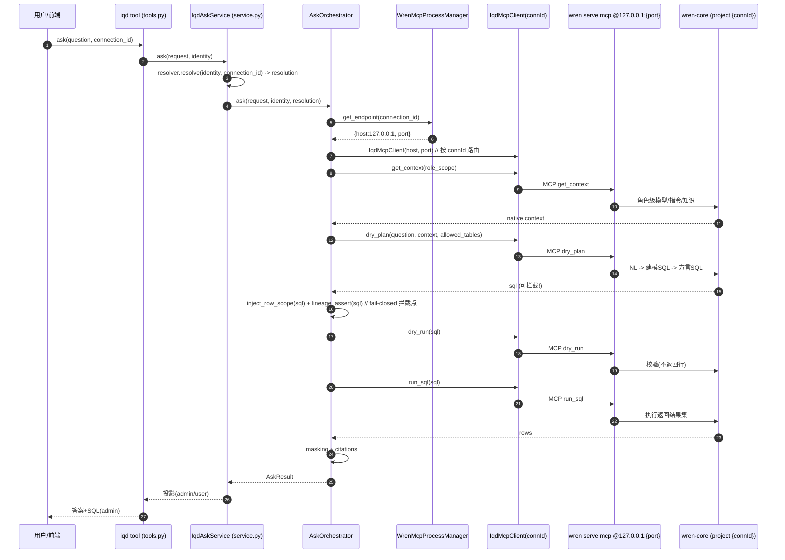

# mis-iqd 多连接对接 WrenAI MCP：增量架构设计（方案 A 精炼版）

> 文档类型：架构评审 / 增量设计（不写实现代码，只给决策与设计）
> 架构师：高见远（software-architect）｜日期：2026-08-27｜版本：v0.1 草案
> 关联：`wrenai-ops-runbook.md` §2.3（gap 与候选解法）、`architecture.md`（D2/D3/D4/D5/Q5）、
> `mis-iqd-selfheal-design.md`（三按钮，Q4 当前为单 profile）、`IqdConnection.java`、`iqd_cli.py` / `iqd_mcp_client.py` / `orchestrator.py` / `config.py`（均已读源码核实）

---

## 0. 结论摘要（TL;DR）

| 项 | 结论 |
|---|---|
| **决策** | **方案 A 精炼版：每连接一个 `wren serve mcp` 进程 + 轻量进程管理器（WrenMcpProcessManager）**；**不采用**纯方案 B |
| **关键理由** | ① wren 0.13.3 硬约束「一进程=一 project=一库」；② 编排器安全控制面要求 `dry_plan→注入行级范围→血缘断言(fail-closed)→dry_run→run_sql` **分步拦截 SQL**，依赖可拦截的「问题→SQL」原语；③ 纯 CLI 方案（B）在对等命令上**无法保留该拦截点** |
| **硬前提核实** | 方案 B 要求的「wren CLI 提供与 `dry_plan`/`dry_run`/`run_sql`/`get_context` 对等的问数+检索命令」**部分不成立**：`dry_run`↔`wren dry-run --sql`、`run_sql`↔`wren query --sql` 1:1 存在；但 `dry_plan`（自然语言→SQL）与 `get_context`（角色级语义检索）**无 CLI 对等物** |
| 方案 C | 已排除（官方确认 server 启动即绑定 profile，运行期不可切换） |

---

## 1. 已核实事实（源码 + 官方文档交叉验证）

### 1.1 wren 0.13.3 硬事实（官方 docs.getwren.ai，已主理人核实 + 本次 Web 核实）
- `wren serve mcp` **一个进程 = 一个 wren project = 一个业务库连接**（server 启动即绑定 MDL + 单一活跃 profile，运行期不切换）。
- `--transport http` 默认绑 `127.0.0.1`、**无 bearer-token 鉴权**，必须本地（keep it local）。
- 管理面 CLI（天然按目录作用于对应 project）：`context build` / `memory index` / `profile add` / `context set-profile` / `get mdl`（mdl_hash）。
- MCP server 暴露工具（官方 MCP guide 实测清单）：
  - Query：`run_sql` `dry_run` `dry_plan` `query_cube`
  - Schema：`get_mdl` `list_models` `describe_model` `get_data_source` `list_cubes` `describe_cube` `list_functions`
  - Knowledge：`get_instructions` `recall_queries` `get_context` `describe_schema` `list_stored_queries` `list_knowledge`

### 1.2 wren CLI 0.13.3 实际命令面（本次 Web 核实：docs.getwren.ai/oss/reference/cli + DeepWiki）

| 命令 | 作用 | 是否接收自然语言 |
|---|---|---|
| `wren --sql '...'` / `wren query --sql` | 执行**已建模 SQL** 返回结果 | 否（仅 `--sql`） |
| `wren dry-plan --sql '...'` | 把**已建模 SQL** 翻译为目标方言（不执行） | 否（仅 `--sql`，**不接收问题**） |
| `wren dry-run --sql '...'` | 对真实库校验 SQL、不返回行 | 否（仅 `--sql`） |
| `wren ask "" --guided/--direct` | 自然语言问数的「提示词包装」代理入口（端到端产出答案） | 是（但**端到端、不可拦截**） |
| `wren context show/build/validate` | project / MDL 生命周期 | — |
| `wren profile add/list/switch` | 连接 profile 管理 | — |
| `wren memory index/fetch/recall/store` | 语义记忆（`fetch/recall` 收 `-q "..."`，为 agent 检索原语，非结构化 get_context） | fetch/recall 收 `-q`（检索用） |

> **关键发现（已校正）**：Wren OSS 0.13 的 CLI/MCP ``dry_plan`` **仅做 SQL 方言转译**（参数 `sql`），**不做** NL→SQL。平台问数链路已改为：`get_context` → **`Nl2SqlGenerator`（ai-platform LLM Gateway）** → `dry_plan(sql)` → 注入 → 血缘 → `dry_run` → `run_sql`。`wren ask` 仅 Prompt 包装，不可作为可拦截的「问题→SQL」原语。

### 1.3 mis-iqd 现状（源码核实）
- **`IqdConnection`**（`backend/mis-iqd/.../entity/IqdConnection.java`）：已含 `mdlWritebackEnabled` `builtMdlHash` `staleDrift` `currentEditRevision`/`builtEditRevision` 等**按连接的 MDL 状态字段**；含 `secretRef`（凭证引用）、`projectId`、`defaultConnector`。**数据模型已具备多连接基础**，仅缺 `projectHome`/`mcpPort`/`mcpStatus` 类字段。
- **`iqd_cli.py`**：封装 `profile_add` / `context_set_profile` / `context_build` / `memory_index` / `memory_reset` / `context_validate` / `get_current_mdl_hash`。**当前所有方法无 `project_dir` 参数，依赖进程 cwd 为单一 project 目录** → 多连接需参数化 `project_dir`。
- **`iqd_mcp_client.py`**：工具名抽为模块常量；`__init__` 取 `WREN_MCP_HOST/PORT`（**单一** 127.0.0.1:8080）；`health()` 不可达降级 mock。
- **`orchestrator.py::AskOrchestrator.ask`**：链路 `get_context → dry_plan(question) → 注入行级范围 → 血缘后置断言(fail-closed) → dry_run → run_sql → 脱敏 → 引用`。**SQL 必须在 `dry_plan` 与 `run_sql` 之间被平台拦截注入**（D2 范围裁定 + D5 脱敏唯一出口）。`_get_mcp_client()` 当前返回默认 `IqdMcpClient()`（无 connection_id 路由）。
- **`tools.py`**：`AskRequest.connection_id` 已是字段（L128），流入 `service.ask`；`IqdScopeResolution.connection_id` 存在。
- **`service.py`**：`trigger_build_index(connection_id, ...)` 已按连接拉物料 → context build → memory index → 报作业；但 `IqdCli` 调用**未传 project_dir**（仍依赖 cwd）。
- **`config.py::IqdMcpSettings`**：`wren_mcp_host`/`wren_mcp_port` 单值；`wren_cli_bin`；`wren_profile_name` 单值。需改为「按连接」。

---

## 2. 决策与理由（A vs B）

### 2.1 决策
**采用方案 A 精炼版**：每连接拉起一个 `wren serve mcp` 进程（绑定该连接 project 目录、独立端口），由新增的 **进程管理器（WrenMcpProcessManager）** 统一负责生命周期（启停 / 健康检查 / 崩溃重启 / 端口分配回收）；查询面 `iqd_mcp_client` 改为按 `connId` 路由到对应 `host:port`。管理面 `iqd_cli.py` 保持不变（已天然多库，仅需参数化 `project_dir`）。

### 2.2 评估矩阵

| 维度 | A（每连接 MCP 进程） | B（问数改走 CLI） | 结论 |
|---|---|---|---|
| 与编排器安全控制面兼容 | ✅ 原样复用 `dry_plan/dry_run/run_sql/get_context`，SQL 拦截点不动 | ❌ `dry_plan`/`get_context` 无对等可拦截 CLI，需自研 NL→SQL 代理层 | **A 胜** |
| 与 wren 设计哲学一致 | ✅ MCP server 即官方「代理查询面」 | ⚠️ CLI 定位是管理与低层 SQL，NL→SQL 非 CLI 原语 | **A 胜** |
| 多连接扩展性 | ✅ 一进程一库，线性扩展；端口段分配 | ✅ 无常驻进程；但每次问数需冷启 `wren`（CLI 进程重、冷启延迟高、无连接池/健康检查） | A 更可控 |
| 运维复杂度 | ⚠️ 需管理 N 进程（启停/健康/重启/端口） | ✅ 无常驻进程，扩展零额外运维 | B 胜（代价是正确性） |
| 与现有 iqd_cli 技术栈统一 | ✅ 管理面复用 iqd_cli；仅查询面加进程管理器 | ✅ 完全复用 iqd_cli | 平 |
| 凭证安全（D6） | ✅ profile 注入同机制，server 启动期解析一次 | ✅ 同机制 | 平 |

### 2.3 硬前提核实结论（方案 B 成立条件）
方案 B 要求「wren CLI 提供与 `dry_plan`/`dry_run`/`run_sql`/`get_context` 对等的问数+检索命令」。核实结果：

- `dry_run` ↔ `wren dry-run --sql`：**成立**（1:1），但需先有 SQL。
- `run_sql` ↔ `wren query --sql` / `wren --sql`：**成立**（1:1）。
- `dry_plan`（问题→SQL，编排器拦截点）↔ **不成立**：CLI `wren dry-plan` 仅转译已建模 SQL（`--sql`），不接收自然语言；`wren ask` 是端到端代理入口，**无法在生成 SQL 后、执行前拦截注入行级范围与血缘断言**。
- `get_context`（角色级模型/指令/知识/原生引用）↔ **不成立**：CLI 仅 `wren context show` + `wren memory fetch -q` + `wren memory recall -q` 片段化组合，非单一结构化工具，且输出形态不同于 `get_context` 契约。

→ **纯方案 B 不可行**：若强行用 `wren ask` 端到端，则失去平台「范围裁定 + 行级注入 + 血缘 fail-closed」控制面（D2/D5/NFR-2 铁律），且需自研 NL→SQL 重试/修复逻辑（WrenAI 已内置的 correctness primitives），得不偿失。

### 2.4 边界与可选优化
- **A 的运维代价可控**：连接数预期为个位数~数十（企业多业务库问数），进程管理器足够。
- **可选懒启动优化（二期）**：对低频连接，首次问数按需拉起 MCP 进程、空闲超时回收；一期建议 Worker 启动时对全部 `enabled` 连接拉起并常驻 + 健康检查自愈，保持简单。
- **排除方案 C**：官方已确认 server 启动即绑定 profile，运行期不可切换。

---

## 3. 共用基座：每连接一个 wren project 目录

### 3.1 目录布局
```
/var/lib/mis-iqd/wren-projects/
  {connId}/                        # 一个 IQD 连接 = 一个 wren project
    wren_project.yml               # schema_version/name/catalog/schema/data_source/profile
    models/                        # MDL 源（由平台语义模型写回生成）
    views/  cubes/  relationships.yml  knowledge/
    target/mdl.json                # context build 编译产物（MCP server 必读）
    .wren/memory/                  # memory index 产物（LanceDB）
    .wren/profiles.yml             # profile 凭证占位（${ENV} 不落明文）
```

### 3.2 生命周期与映射
- **连接创建**：Java `IqdAdminService` 创建 `IqdConnection` 时分配 `projectHome = /var/lib/mis-iqd/wren-projects/{connId}`（或存 DB 字段），并初始化 `wren context init` 骨架。
- **进程映射**：WrenMcpProcessManager 维护 `connId → {host=127.0.0.1, port, pid, status, last_health_at}` 注册表（内存 + 持久化到 mis-iqd `iqd_connection.mcp_port`/`mcp_status` 供可观测）。
- **端口分配**：配置 `wren_mcp_port_range = "18080-18180"`（避开 8080 单点），启动时按 connId 顺序分配，回收复用。
- **清理策略**：连接 `disabled`/`deleted` 时 → 先 SIGTERM MCP 进程 → 回收端口 → 保留 project 目录 7 天（便于回溯/审计）→ 到期定时任务清理 `.wren/memory` 与 `target/`，`wren_project.yml`+`models/` 可保留或归档。凭证（profiles.yml 内 `${ENV}`）本就不落明文，删除无泄漏。

---

## 4. MDL 同步触发（语义模型保存 → context build + memory index）

| 项 | 设计 |
|---|---|
| 触发时机 | 语义模型/物料保存 → 该连接 `mdl_writeback_enabled=true` 且 `current_edit_revision > built_edit_revision` 时触发 |
| 同步/异步 | **异步**（build+index 可能数十秒~分钟）：写入 `iqd_sync_job`（connection_id 维度）状态机 `pending→running→success/failed`；合并窗口 `sync_coalesce_window_sec`（现有配置）内多次保存合并为一次 |
| 执行位置 | 在 `{connId}` project 目录内执行 `wren context build [--mdl] [--sql-pairs] [--instructions]` → `wren memory index`；`IqdCli` 新增 `project_dir` 参数（cwd 或 `WREN_PROJECT_HOME` 注入） |
| 失败重试 | build 超时/非零退出 → `build_status=failed`，`IqdConnection.staleDrift` 置位；提供自愈三按钮（force-rebuild/re-index/validate）人工重触发；自动重试 ≤3 次（指数退避） |
| 漂移检测 | `iqd_cli.get_current_mdl_hash()` 比对 `builtMdlHash`，不一致置 `staleDrift`（现有逻辑，按连接执行） |
| 就绪门禁 | MCP 进程启动前必须 `target/mdl.json` 存在；build 完成后才允许该连接 MCP 进程启动/重启（避免问数打到未就绪 project） |

---

## 5. 凭证注入方式（D6 铁律）

- **机制**：`wren profile add {name} --connector ...` 时，凭证经 `${ENV}` 占位注入（profiles.yml 仅存 `host/port/user/${DB_PWD}`），server 启动期解析一次、凭证留 server-side（官方 MCP guide 确认）。
- **实现**：WrenMcpProcessManager 拉起 `wren serve mcp` 时，从 `IqdConnection.secretRef` 经凭据保险箱解出明文 → 注入进程环境变量（`WREN_PG_PASSWORD=xxx` 等）→ 子进程内 `wren` 解析 `${ENV}`。明文仅在进程环境变量中存在，不落盘、不进平台库/前端。
- **备选**：若 wren 版本支持 `--from-file ./profile.tmp.yml`，则用临时文件注入、`chmod 600`、用后即删（`os.remove` 确保删除，失败告警）。
- **bootstrap 人工**：首次 `profile add` 真实凭证仍由运维人工执行（D6：平台不代敲），`secretRef` 仅存引用。

---

## 6. 接线时序图（一次问数请求路由到正确连接 project 并执行）



---

## 7. 文件改动清单（相对路径，新增/修改）

| 文件 | 类型 | 改动要点 |
|---|---|---|
| `agent/ai-platform/backend/src/config.py` | 修改 | `IqdMcpSettings`：将 `wren_mcp_host/port` 单值改为 `wren_mcp_port_range`、`wren_projects_root`、`wren_mcp_default_host=127.0.0.1`；保留 `wren_cli_bin`。 |
| `agent/ai-platform/backend/src/adapters/iqd_cli.py` | 修改 | 所有方法新增 `project_dir: str \| None` 参数，调用时切换 cwd 或注入 `WREN_PROJECT_HOME` 到 env；新增 `ensure_project(conn_id, project_home)` 骨架初始化。 |
| `agent/ai-platform/backend/src/adapters/iqd_mcp_client.py` | 修改 | 构造函数已接受 `host/port`；新增工厂 `for_connection(conn_id, registry)`；保留工具常量与 mock 降级。 |
| `agent/ai-platform/backend/src/adapters/wren_mcp_registry.py` | **新增** | `WrenMcpProcessManager`：connId→{host,port,pid,status} 注册表；`start(conn_id, project_home, env)`/`stop`/`health_check`/`recycle_port`/`list_endpoints`；端口段分配与回收；崩溃重启。 |
| `agent/ai-platform/backend/src/agent/mis_iqd/orchestrator.py` | 修改 | `_get_mcp_client()` 改为按 `resolution.connection_id` 从 registry 取端点构造 `IqdMcpClient`（其余链路不变）。 |
| `agent/ai-platform/backend/src/agent/mis_iqd/service.py` | 修改 | `trigger_build_index`/`trigger_model_build` 等传入 `project_dir`（来自 connId→projectHome）；build 完成后再触发该连接 MCP 进程（re)start；增加「连接就绪门禁」。 |
| `agent/ai-platform/backend/src/agent/mis_iqd/bootstrap.py` | **新增**（或并入 service） | 连接创建/启用时：初始化 project 目录、`profile add`+`context set-profile`、首次 `context build`+`memory index`、拉起 MCP 进程。 |
| `agent/ai-platform/backend/src/main.py` 或 `runtime/setup` | 修改 | Worker 启动：对全部 `enabled` 连接调用 `WrenMcpProcessManager` 批量拉起 + 启动后台健康检查循环。 |
| `backend/mis-iqd/.../entity/IqdConnection.java` | 修改 | 新增 `projectHome`、`mcpPort`、`mcpStatus` 字段（可选，亦可仅约定路径由 connId 派生）。 |
| `backend/mis-iqd/.../IqdAdminService.java` | 修改 | 连接创建/启用时分配 projectHome、初始化骨架、回写 mcpPort/status。 |
| `agent/ai-platform/deploy/wrenai/README.md` | 修改 | 补充多连接部署：每连接 project 目录、端口段、进程管理器说明。 |
| `docs/ai-fusion/wrenai/wrenai-ops-runbook.md` §2.3 | 修改 | 将「候选解法待评估」更新为「已采纳方案 A」，补多进程运维步骤。 |

---

## 8. 任务分解（有序，含依赖）

| # | 任务 | 依赖 | 优先级 |
|---|---|---|---|
| T1 | 配置与目录基座：`config.py` 增加 `wren_projects_root`/`wren_mcp_port_range`；`iqd_cli.py` 参数化 `project_dir` + `ensure_project()` | 无 | P0 |
| T2 | 进程管理器：`wren_mcp_registry.py` 实现注册表 / 端口分配 / 启停 / 健康检查 / 重启 / 回收 | T1 | P0 |
| T3 | 路由接线：`iqd_mcp_client.py` 增加 `for_connection()` 工厂；`orchestrator.py` 按 `connection_id` 取端点构造 client | T2 | P0 |
| T4 | MDL 同步按连接落地：`service.py` 的 build/index 传入 `project_dir`；新增连接 bootstrap（init project + profile + first build + 启动 MCP） | T1, T2 | P1 |
| T5 | 启动集成与可观测：Worker 启动批量拉起 `enabled` 连接 MCP + 后台健康检查；`IqdConnection` 增加 `projectHome/mcpPort/mcpStatus`；runbook/README 更新 | T2, T3, T4 | P1 |
| T6（可选，二期）| 低频连接懒启动 / 空闲回收 | T2, T5 | P2 |

---

## 9. 待明确事项

1. **`wren serve mcp` 真实工具清单与参数**（runbook §8 待 W0 实测）：`dry_plan` 是否真接收 `question` 自然语言并返回 `sql`？`get_context` 原生引用结构？需在 `wrenaitest` 真机 `wren serve mcp --help` + 一次真实问数核实（影响 `iqd_mcp_client` 常量与 orchestrator 字段解析）。**这是唯一可能改变「纯 B 不可行」结论的变量**——若 `wren ask` 暴露「仅生成 SQL 不执行」的可拦截模式，B 可重评（但仍需重建 get_context 等价物）。
2. **CLI `wren dry-plan --sql` vs MCP `dry_plan` 语义差异**：确认编排器当前 `dry_plan(question=...)` 调用契约与 CLI 不一致，真机前以 MCP 契约为准（方案 A 不受影响）。
3. **端口段与并发上限**：N 进程常驻的内存/CPU 预算（每个 `wren serve mcp` 含 wren-core/Rust + Python），需按最大连接数压测定档。
4. **project 目录存储介质**：`/var/lib/mis-iqd` 持久卷 vs 临时盘；崩溃后 project 目录需可重建（由 `mdl_raw` 重新生成 models/）。
5. **多连接问数的租户隔离/限流**：是否需要 per-connection 并发上限与失败熔断（避免单库慢查询拖垮 Worker）。
6. **Java 侧字段落地方式**：`projectHome` 由 `connId` 约定派生（无需新字段）还是入库；自愈 `lastHealthAt/lastHealthMsg` 是否复用。

---

## 10. 风险与缓解
- **R1 进程膨胀**：端口段 + 健康检查自愈 + 二期懒启动缓解。
- **R2 单连接 MCP 崩溃**：进程管理器自动重启 + orchestrator 对 MCP 不可达降级 mock（已有）。
- **R3 凭证泄漏**：仅 env 注入、不落盘、用后即删（`--from-file` 路径）。
- **R4 build 未就绪即问数**：就绪门禁（build 完成才拉起/重启 MCP）。
