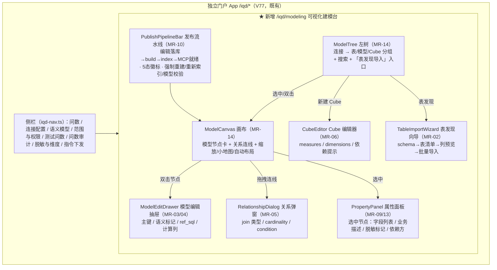
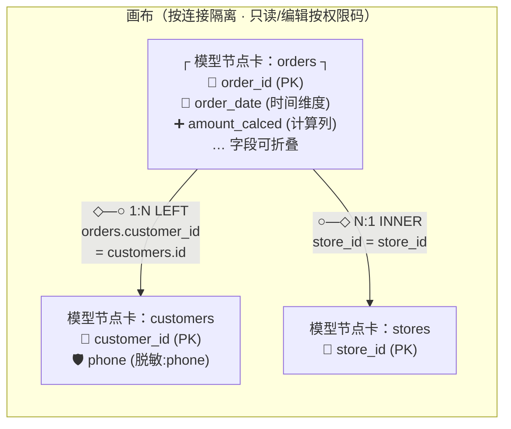

# mis-iqd 前端可视化建模台 — 增量 PRD（经典 wren-ui 全量内嵌）

> 产品经理：许清楚（software-product-manager）｜语言：中文
> 文档性质：**增量 PRD（仅需求分析，本轮不写业务代码）**。覆盖「可视化建模台」相对现有已落地形态的变更点，**不重述、不推翻** prd.md v1.9 / architecture.md v1.9 / tasks.md v1.9 及四份增量 PRD（edit / selfheal / mcp-multiconn / 闭环）已确认的全部决策。
> 状态：🔶 草案（待主理人拍板 Open Questions Q1–Q8）｜日期：2026-08-30
> 关联：基线 [`prd.md`](prd.md) · [`architecture.md`](architecture.md)（§1.5/§3.3/§3.4 命名边界、§4.2.2 权限五件套、§8 待明确事项）· 二期编辑 [`mis-iqd-edit-prd.md`](mis-iqd-edit-prd.md)（U1–U8 已拍板）· 运维自愈 [`mis-iqd-selfheal-prd.md`](mis-iqd-selfheal-prd.md) · 多连接 [`mis-iqd-mcp-multiconn-prd.md`](mis-iqd-mcp-multiconn-prd.md)

---

## 0. 项目信息

| 项 | 内容 |
|---|---|
| Language | 中文 |
| Project Name | `mis_iqd_modeling_studio`（前端增量，无新独立服务） |
| 原始需求复述 | 在已落地的 mis-iqd「平台侧语义治理 + 增强物料」形态之上，补一个**前端可视化建模台**——对齐经典 wren-ui 的建模体验（拖拽 ER 画布 / 模型结构编辑 / Cube 指标建模全量做），并把用户给出的 **14 项能力清单全覆盖**（数据源/Profile、物理表发现导入、语义模型、字段语义、关系、指标/Cube、Instructions、样本对、知识术语、MDL 构建发布、漂移对账、问数范围/ACL、脱敏、可视化 ER 拖拽建模）。本轮只产出规划文档，不写业务代码。 |
| 技术栈 | **复用 `frontend/mis-admin-web` 既有体系**：Vite + React 18 + TypeScript + Tailwind + shadcn/radix（`@/components/ui/*`）+ TanStack Query（服务端状态）+ zustand（已在依赖，UI 态）+ react-router 6。**不引入 MUI**（与既有组件体系冲突，偏离团队默认 MUI 栈需在此显式声明）。画布/SQL 编辑器选型见 Q3/Q4。 |
| 前端落点 | 现状代码在 `src/features/agent/ai/iqd/`（7 页面 + 3 状态条 + 1 测试，共 11 文件），路由已迁独立门户 App `/iqd/*`（V77，`lib/nav/iqd-nav.ts`）。architecture.md §3.4 规划目录为 `features/agent/iqd` —— **是否随本轮迁移见 Q2**。 |
| 红线（继承，不可破） | ① 命名边界：平台域一律 `iqd`，外部 WrenAI 适配层保留 `wren`；② 前端不直连 MCP/WrenAI、不持有凭证；③ 编辑权威 = 平台 catalog（`iqd_catalog_item`），WrenAI MDL 为运行真值，唯一受控写路径 = 平台→WrenAI（edit PRD §2.2）；④ 权限五件套（BFF `iqd:*` + Worker ACL 二次裁定 + 行级维度 + 脱敏 + 审计）不变；⑤ fail-closed 哲学贯穿（同步失败可见可重试、漂移阻断、越权拒绝）。 |

---

## 1. 增量定位与范围边界

### 1.1 一句话定位

**把「语义治理」从表单/树形清单升级为 wren-ui 级的可视化建模台**：DBA/数据治理在一个画布内完成「接库 → 发现表 → 建模型 → 连关系 → 建指标 → 发布 MDL」的全流程，所有编辑仍走平台编辑权威闭环（edit PRD U4：单节点编辑 → 整连接 build 写回），发布链路与漂移对账全程可见。

> **「经典 wren-ui 全量内嵌」的语义澄清（重要）**：指**能力形态与体验全量对齐** wren-ui（拖拽 ER、结构编辑、Cube 建模），**以平台自建页面实现**，不是 iframe 内嵌 Next.js 版 wren-ui，也不要求用户登录 WrenAI 侧。wren-ui 是否随 `pip install wrenai` 发布（A3）只影响「DBA 是否可顺带用原版」，不影响本建模台的建设决策。

### 1.2 范围边界表

| 项 | 是否本轮范围 | 说明 |
|---|---|---|
| ①连接配置页、清单页、scope/ACL、enhance 五 Tab、instruction、test-chat、traces 的**既有能力** | ❌ 已落地，不重做 | 本轮只「增强」标注的子项 |
| ②可视化 ER 画布、模型/关系/Cube **创建与编辑**、表发现导入向导 | ✅ 本轮核心 | 能力 #2/#3/#5/#6/#14 |
| ③计算列编辑器、发布链路可视化、漂移详情面板、行级维度展示、字段级脱敏直编 | ✅ 本轮增强 | 能力 #4/#10/#11/#12/#13 |
| ④多连接 MCP 进程管理（wren_mcp_registry 等） | ❌ multiconn 增量已规划 | 本建模台**以 per-connection 为前提消费其结果**（连接维度下拉、MCP 状态徽标），排期依赖见 Q8 |
| ⑤MDL 写入通道（直写文件 vs 经既有写回闭环） | 🔶 待拍板 | 见 §5 方案对比 + Q1 |
| ⑥列级 ACL、重命名级联改写、instruction AST 改写 | ❌ 沿用既有决策不做 | edit PRD P2 / A5 |
| ⑦用户端 `/iqd/data-query` 问数体验 | ❌ 不动 | 本轮纯后台治理侧 |

### 1.3 现状基线（增量判断依据，实地核对）

- **`iqd-config-page.tsx`**：单连接表单（`getIqdConfig()` 单条）+ 连通测试；无 Profile 列表、无向导。multiconn PRD §4 已规划升级多连接列表 + MCP 运行态卡。
- **`iqd-catalog-page.tsx`**：清单按 kind 分组展示（table/model/column/relationship/cube/measure/dimension/view）+ 节点编辑弹窗（`updateIqdCatalogNode`）+ `CatalogSyncStatusBar`（5 态）+ `SelfHealPanel`（三按钮）。**只有既有节点的 patch 编辑，无「新建节点」入口**（建模型/建关系/建 Cube 均无从谈起）。
- **`iqd-enhance-page.tsx`**：脱敏规则 / 行级维度注册表 / 字典同步 / 样本对（含 v1.10 转化 + 试运行 + 保存）/ 知识术语（含 S-07 导入）五 Tab。
- **`iqd-instruction-page.tsx`**：指令 CRUD + 下发（`iqd_knowledge kind='instruction'`）。
- **`iqd-scope-page.tsx` / `iqd-test-chat-page.tsx` / `iqd-trace-page.tsx`**：范围与 ACL / 测试问数 / 审计，均可用。
- **`lib/api/iqd.ts`**：约 30 个函数、20+ 接口类型，wire snake_case。
- **路由**：独立门户 App `/iqd/*`（V77），nav 权威在 `lib/nav/iqd-nav.ts`（8 个 leaf）。

---

## 2. 产品目标（3 个，正交）

| # | 目标 | 度量（验收口径） |
|---|---|---|
| **G1 建模全流程画布化** | 治理人员在一个建模台内完成「接库→发现表→建模型→连关系→建指标→发布」全流程，不登机、不跳 WrenAI 侧 | 14 项能力各有可操作入口；新建 model/relation/cube 三类节点端到端可走通并写回生效（黄金用例 M1/M2） |
| **G2 编辑权威闭环不破** | 建模台一切编辑仍落平台 catalog（`edit_revision` 乐观并发 + 幂等），经既有「派生完整 MDL → build → memory index → MCP 就绪门禁」写回；不直写 MDL 文件（除非 Q1 拍板方案乙） | 编辑后 5 态状态机流转正确；并发冲突 409 可重读重试；写回失败可重试不回滚平台编辑 |
| **G3 发布与漂移全程可见** | 发布链路（编辑→落库→build→index→MCP 就绪）在建模台内可视化；漂移（STALE_DRIFT）有详情面板与重导入引导 | 任一环节失败前端可见并定位到环节；漂移时画布顶部横幅 + 差异明细 + 「重新导入」入口 |

---

## 3. 用户故事

> 角色：**语义建模者**（DBA/数据治理，持有建模权限码）；**只读观察员**（看画布与发布状态）；**AI 运营**（enhance/instruction 使用者）。

| # | 用户故事 | 对应能力/需求 |
|---|---|---|
| US-1 | 作为语义建模者，我想在向导里新增一条业务库连接（选 connector → 填参数 → 绑 profile → 测试连通），并看到该连接的 MCP 进程运行态，以便多库各自隔离问数 | #1 / MR-01 |
| US-2 | 作为语义建模者，我想从业务库「发现」表结构（含列名/类型/注释预览），勾选若干张表批量导入语义层，以便不必手写 JSON 建模 | #2 / MR-02 |
| US-3 | 作为语义建模者，我想在画布上看到所有模型（含字段）与关系连线，拖拽调整布局、点连线编辑 join 类型与基数，以便直观理解并维护模型间关系 | #14/#5 / MR-14、MR-05 |
| US-4 | 作为语义建模者，我想从一张物理表创建模型并编辑关键字段（主键/时间维度/ref_sql 视图定义/计算列），以便把物理表升格为业务模型 | #3/#4 / MR-03、MR-04 |
| US-5 | 作为语义建模者，我想在 Cube 编辑器里定义 measure（表达式/格式）与 dimension，并看到「谁引用了这个 Cube」，以便安全建模指标 | #6 / MR-06 |
| US-6 | 作为语义建模者，编辑完成后我想在一条「发布流水线」上看到 build → index → MCP 就绪的实时进度，失败可一键重试或强制重建，以便知道模型何时生效 | #10 / MR-10 |
| US-7 | 作为只读观察员，当 WrenAI 被外部直改（STALE_DRIFT）时，我想看到平台与 WrenAI 的差异明细并引导重新导入，以便及时收敛漂移 | #11 / MR-11 |
| US-8 | 作为 AI 运营，我想在建模台的字段侧栏直接维护业务描述、指令、样本对与脱敏标记，以便不必在多个 Tab 间来回跳 | #7/#8/#9/#13 / MR-07~09、MR-13 |

---

## 4. 需求池（14 项能力全覆盖 + 支撑项）

> 优先级：P0 = 本期必须；P1 = 应做；P2 = 二期增强。**14 项能力（#1–#14）均为 P0/P1，无「本期不做」项**。
> 每条需求可直接被架构师拆为任务；「涉及文件类型」指相对 `features/agent/ai/iqd/` 现状（新建 = 新文件/新端点，增强 = 改既有文件，复用 = 不动）。

### 4.1 主体需求（14 项能力 → MR-01~MR-14）

| ID | 能力# | 子项 | 优先级 | 需求描述 | 验收要点（可测） | 涉及文件类型 | 依赖 |
|---|---|---|---|---|---|---|---|
| **MR-01** | #1 数据源/Profile | 连接向导 + Profile 列表 + 连接测试 | **P0** | 连接管理升级为**分步向导**（① 基本信息/connector 下拉 → ② 数据源参数（凭证不落前端）→ ③ profile 绑定（`wren profile` 标识，服务端管理）→ ④ 连接测试），并展示**多连接列表 + 每连接 MCP 运行态卡**（running/stopped/crashed/unhealthy + 端口 + 最近健康时间 + 启停/重启二次确认） | ① 向导四步可走通，测试连通返回明确结果；② 列表可见多连接及各自 MCP 状态（数据来自 multiconn REQ-P1-2 落库字段）；③ 停止/重启带二次确认；④ 凭证 UI 不回显明文 | 增强 `iqd-config-page.tsx`；新建 `components/ConnectionWizard.tsx`、`McpStatusCard.tsx`（复用 multiconn §4.2 草拟交互） | multiconn 增量 T1（多连接 + MCP 状态落库） |
| **MR-02** | #2 物理表发现/导入 | 表发现向导 + 批量导入 | **P0** | **新建**「表发现」向导：按连接拉取 schema → 表清单（服务端经 `iqd_cli.py`/既有管理面通道读取，前端不直连业务库）→ 表详情列预览（列名/类型/注释/主键推断）→ 勾选批量导入 catalog（kind=table，source=import，自动带出 columns） | ① 表清单可分页/搜索；② 列预览准确（与业务库一致）；③ 批量导入后 catalog 页与画布可见新 table 节点（含 columns）；④ 重复导入幂等（已存在表跳过/更新可选）；⑤ 无连接/未就绪时有空态引导 | 新建 `components/TableImportWizard.tsx`；后端新端点 `GET /iqd/discovery/schemas|tables|columns`、`POST /iqd/discovery/import`（架构师定形） | MR-01；服务端发现通道（§5.2 增量点 a） |
| **MR-03** | #3 语义模型（Model） | 模型创建/编辑页 | **P0** | **新建**模型创建与编辑：① 从物理表一键生成模型（表→model，列映射为字段）或空白新建；② 编辑关键字段：主键（单/复合）、`is_time_dimension`/`is_email` 等语义标记、`ref_sql`（视图型模型）编辑器；③ 保存走编辑权威闭环（`edit_revision` + 幂等 key） | ① 从表生成模型后画布出现 model 节点且字段齐全；② 主键/语义标记保存后随 MDL 写回生效（问数可用）；③ ref_sql 编辑有 SQL 高亮与保存前服务端校验（validate）；④ 新建端点幂等（重复提交不产生重复节点） | 新建 `ModelEditDrawer.tsx`（画布右侧抽屉）；后端新端点 `POST /iqd/catalog/model`（**新建节点**，edit PRD 只有 PUT patch，新建为增量）、`POST /iqd/catalog/model/from-table` | MR-02、MR-14；edit PRD 写回闭环（已落地） |
| **MR-04** | #4 字段语义 | 计算列编辑器（description 已有） | **P0** | catalog 节点编辑已有 description/display_name（复用）；**新增计算列（calculated column）编辑器**：在模型编辑抽屉内为模型添加计算列（列名 + expression 引用本模型字段），expression 有 SQL 高亮 + 保存前校验；计算列随 MDL 派生写回 | ① 可添加/编辑/删除计算列；② expression 非法（引用不存在字段/语法错误）保存被阻断并给出原因；③ 计算列写入 MDL 后问数可按其聚合/过滤 | 增强 `ModelEditDrawer.tsx`；新建 `CalculatedColumnEditor.tsx`；后端计算列落 `iqd_catalog_item`（kind=column，expression 字段，架构师定形） | MR-03 |
| **MR-05** | #5 关系（Relationship） | 关系可视化编辑 | **P0** | **新建**关系编辑：画布连线即关系（源/目标 model 由拖拽决定），关系编辑弹窗含 join 类型（inner/left/right/full）、cardinality（1:1/1:N/N:1/N:N）、condition 表达式（字段下拉插入）；引用完整性预校验（源/目标字段存在性）；删除被引用关系有阻断提示（复用 `validateCatalogRefs`） | ① 画布两 model 节点可拖拽连线创建关系；② join/cardinality/condition 保存后随 MDL 写回，问数跨模型 join 正确；③ condition 引用不存在字段被 422 阻断；④ 禁止重命名（U1 沿用） | 新建 `RelationshipDialog.tsx`、`RelationEdge.tsx`（画布边组件）；后端新端点 `POST /iqd/catalog/relationship` | MR-03、MR-14 |
| **MR-06** | #6 指标/Cube | Cube/measure/dimension 建模编辑器 | **P0** | **新建** Cube 编辑器：Cube 为主节点（挂靠 model），编辑 measures（名称 + expression + format 聚合语义）与 dimensions（引用模型字段/ref）；依赖提示区（谁引用此 cube，复用 `IqdDependents`）；保存走编辑权威闭环 | ① 可新建/编辑 Cube 及其 measures/dimensions；② measure expression 保存前校验（引用模型字段存在性）；③ 删除被引用 Cube 被 422 阻断并列出依赖方（复用 edit PRD P0-2）；④ Cube 写回后问数「按 Cube 指标提问」可用（`query_cube` 通道） | 新建 `CubeEditor.tsx`；后端新端点 `POST /iqd/catalog/cube`（+ PUT 复用既有）；新建 `MeasureDimensionList.tsx` | MR-03；服务端 Cube→MDL 派生（§5.2 增量点 b，需确认 build 已含 cubes） |
| **MR-07** | #7 业务规则/Instructions | 指令页增强：表达式录入 | **P1** | instruction 页（已有 CRUD + 下发）增强：① 内容区支持**表达式辅助录入**（`@` 或按钮插入 item_key 下拉——模型/字段/cube 一次点选插入，避免手敲错拼）；② 指令可绑定生效范围（本连接/指定 model/cube，存 `iqd_knowledge` 关联字段）；③ 下发前展示将推送条数与上次下发状态 | ① 插入的 item_key 一定存在于当前连接 catalog（下拉即校验）；② 绑定 model 的指令不出现在其他 model 的上下文（下发内容按绑定裁剪）；③ 下发结果可查 | 增强 `iqd-instruction-page.tsx`（复用 `SyncStatusBar`） | MR-03（item_key 下拉数据源） |
| **MR-08** | #8 NL→SQL 样本对 | 样本对增强（试运行已有）+ 建模台入口 | **P1** | v1.10 的 DB 类型下拉 → 转化 → 试运行 → 保存已落地；增强：① 建模台/模型编辑抽屉提供「为本模型添加样本对」入口（预填模型上下文）；② SQL 编辑框升级为 SQL 编辑器组件（高亮/行号，Q4 选型）；③ 样本对列表支持按模型/cube 过滤 | ① 从模型抽屉进入样本对编辑，保存后 `wren_ref_id` 回填、可下发；② 过滤正确；③ 试运行结果（列/行/错误/耗时）展示不变 | 增强 `iqd-enhance-page.tsx` 样本对 Tab；复用 `translateSqlPair`/`trialSqlPair` | Q4（SQL 编辑器） |
| **MR-09** | #9 知识/术语 | 知识增强 + 字段侧栏直编 | **P1** | ① 建模台画布选中字段时，右侧属性面板可直接编辑业务描述（写 `iqd_catalog_item.description`，与 catalog 页同源同闭环）；② 知识/术语 Tab 增加「关联对象」列（term/metric_definition 可关联 model/字段，下发按关联裁剪）；③ S-07 导入按钮状态化（未就绪置灰并提示 A6 现状） | ① 侧栏改描述后 catalog 页同步可见（同一数据源）；② 关联裁剪生效；③ S-07 未就绪时按钮置灰有 tooltip | 增强 `PropertyPanel.tsx`（MR-14 内）、`iqd-enhance-page.tsx` 知识 Tab | MR-14 |
| **MR-10** | #10 MDL 构建/发布 | 发布链路可视化 + 自愈集成 | **P0** | 把现有 `CatalogSyncStatusBar`（5 态）+ `SelfHealPanel`（三按钮）整合为建模台顶部**发布流水线条**：编辑落库 → build（context build）→ index（memory index）→ MCP 就绪（就绪门禁）四段实时进度（5000ms 轮询沿用）；任一段失败横幅告警 + 段内重试；「强制重建」高危二次确认（selfheal REQ-6）；三按钮 **per-connection**（multiconn §6 已重定范围） | ① 四段进度逐段点亮/失败定位；② build 失败横幅 + 一键重试（幂等）；③ 强制重建二次确认后才发起；④ MCP 未就绪时画布顶部持续提示「问数暂不可用（构建中）」；⑤ 全部状态数据复用 sync-job 状态接口，不新增轮询通道 | 新建 `PublishPipelineBar.tsx`（整合复用两个既有组件逻辑）；增强 `SelfHealPanel.tsx` per-connection 化 | selfheal PRD、multiconn §6、edit PRD P0-6 状态机（均已规划/落地） |
| **MR-11** | #11 漂移对账 | STALE_DRIFT 详情面板 | **P1** | `CatalogSyncStatusBar` 的 STALE_DRIFT 态升级为**可展开详情面板**：平台 `current/built edit_revision` vs WrenAI `mdl_hash`、最近对账时间、差异对象清单（哪些 kind/item_key 疑似外部变更）、「重新导入」入口（进 edit PRD P1-3 的 syncCatalogFromMdl 比对合并界面）；漂移期间**阻断重建**提示不变 | ① 漂移横幅可展开明细；② 「重新导入」跳转草稿比对界面（复用 P1-3）；③ 漂移未收敛前「强制重建」置灰并提示原因（fail-closed） | 增强 `CatalogSyncStatusBar.tsx`、新建 `DriftDetailPanel.tsx` | edit PRD P0-10/P1-3（已落地/规划） |
| **MR-12** | #12 问数范围/ACL | 行级维度展示补齐 | **P1** | `/iqd/scope` 已有勾选 + ACL 授权；补齐**行级维度可视化展示**：某表配置的 row_scope 以维度徽标形式展示（dept/store，多维度 AND 叠加一目了然），点击展开按维度/策略形态展示注入谓词预览（PATH_PREFIX/ENUM）与模拟角色 WHERE 片段（复用 T-W2-02a 验收 5 的预览接口） | ① 授权矩阵中带 row_scope 的表显示维度徽标；② 展开可见各维度谓词预览与模拟角色 WHERE；③ 双维度 AND 叠加展示正确 | 增强 `iqd-scope-page.tsx`（+ 复用 `wren-acl-dialog`/维度下拉逻辑） | T-W2-02a/b（已落地） |
| **MR-13** | #13 脱敏规则 | 字段级脱敏直编 | **P1** | 画布选中字段时，属性面板可直接设置 `sensitive_level` / `mask_rule`（下拉对齐 `iqd_mask_rule` 五类内置 + custom），与 enhance 脱敏 Tab 同源同优先级（§7.5 规则链）；设置后问数结果即时生效路径不变（Worker 缓存 ≤10s 刷新） | ① 侧栏设置脱敏后，enhance Tab 与问数结果脱敏一致生效；② 内置规则下拉与 03-security §9.3 对齐；③ 无 `iqd:mask:save` 权限时只读 | 增强 `PropertyPanel.tsx`；复用 mask API | MR-14；`iqd:mask:save` 权限 |
| **MR-14** | #14 可视化 ER/拖拽建模 | 画布核心 | **P0** | **核心新建**：建模台主页 = 左侧模型树（连接 → 表/模型/Cube 分组，复用 catalog 数据）+ 中央拖拽画布 + 右侧属性面板三栏。画布：模型节点卡（表名 + 字段列表可折叠 + 主键/计算列标记）、关系连线（含 join 类型/基数标签）、节点拖拽/框选/缩放/小地图、连线两端拖拽创建关系入口、自动布局（一键 dagre 类整理）、画布按连接隔离。**画布只读/编辑由权限码控制** | ① 画布正确渲染当前连接全部 model 节点与关系（与 catalog 数据一致）；② 拖拽布局可保存并在刷新后恢复（MR-S4）；③ 连线即进关系编辑（MR-05）；④ 双击节点进模型编辑抽屉（MR-03）；⑤ 200+ 节点规模下滚动/缩放不卡顿（虚拟化，见 Q7）；⑥ 无编辑权限码者只读（按钮置灰） | 新建 `iqd-modeling-page.tsx`、`components/modeling/ModelCanvas.tsx`、`ModelNodeCard.tsx`、`RelationEdge.tsx`、`PropertyPanel.tsx`、`ModelTree.tsx` | Q3（画布库）、MR-03/05（编辑联动）、MR-S1/S2/S4 |

### 4.2 支撑需求（MR-S1~S4）

| ID | 子项 | 优先级 | 需求描述 | 验收要点 | 涉及文件类型 | 依赖 |
|---|---|---|---|---|---|---|
| **MR-S1** | 建模台框架与导航 | **P0** | 新增路由 `/iqd/modeling`（独立门户 App 内），nav 权威 `iqd-nav.ts` 追加 leaf；页面壳复用 `PageHeader` + 面包屑范式；三栏布局（树/画布/属性）可拖拽调宽、可折叠 | ① 侧栏出现「可视化建模」入口（icon 登记防静默回退）；② 三栏可折叠；③ 无连接时空态引导去连接向导 | 新建页面壳；增强 `iqd-nav.ts` + V7x 种子（**四处同改**①②④⑤，对齐 §7.7） | 无 |
| **MR-S2** | 新建节点端点族 + 编辑权威闭环复用 | **P0** | edit PRD 只交付了**既有节点 patch**（`PUT /catalog/node`）；建模台需**新建**节点端点：model（含 from-table）、relationship、cube（+measures/dimensions）、计算列。所有新建/编辑一律：落 `iqd_catalog_item`（source=platform_edit/modeling）→ bump `edit_revision` → 幂等 key → 触发整库 build（U4 沿用，不做局部构建） | ① 四类新建端点幂等（重复提交不产生重复节点）；② 新建后同步状态机正确流转（EDITED_UNSYNCED→SYNCING→SYNCED）；③ 删除走既有 422 阻断链；④ 乐观并发 409 语义对新建同样适用（同 key 并发） | 后端增量（架构师定形：mis-iqd Java 侧 + BFF 透传 + Worker 派生 MDL 扩展） | edit PRD 全部 P0（已落地） |
| **MR-S3** | 权限码与种子 | **P0** | 新增权限码 `iqd:modeling:view`（画布只读）/ `iqd:modeling:edit`（建模编辑，语义等同并扩展 `iqd:catalog:edit`）/ `iqd:modeling:publish`（触发构建/强制重建）；全部端点登记 `sys_api` + `sys_menu_api`（INNER JOIN 硬规则）；V7x 种子幂等（固定 ID 段） | ① 无 view 码不可进页面（40300）；② 无 edit 码画布只读；③ 无 publish 码发布/自愈按钮置灰；④ `deny-unmapped` 下全部端点无 40300 | 后端 + 种子 SQL（V7x，ID 段避开 V69/V73/V77 已用） | §7.1 命名规范 |
| **MR-S4** | 画布布局持久化 | **P1** | 画布节点坐标/折叠态/视口按**连接**持久化，跨会话恢复；另存「自动布局」一键重排 | ① 拖拽后刷新页面布局不丢；② 换连接布局各自独立；③ 一键自动布局生效；④ 存储位置按 Q6 拍板实现（建议独立 layout 存储，不动 catalog 表结构） | 新建 layout 读写（前端 + 1 个轻量端点或既有端点扩展） | Q6 |

---

## 5. 关键架构决策输入（供架构师，含方案对比与推荐）

### 5.1 MDL 写入通道（对应 A3 + Q1，两方案 + 推荐）

| 方案 | 描述 | 优点 | 缺点/风险 |
|---|---|---|---|
| **甲：编辑权威闭环（推荐）** | 建模台一切编辑落 `iqd_catalog_item` → 既有「派生完整 MDL → `wren context build` → memory index → MCP 就绪门禁」写回 | 完全复用已落地闭环（edit PRD P0-5/7 + multiconn REQ-P0-4）；审计/回滚/乐观并发/漂移对账天然可用；**不新增写路径**，fail-closed 语义全覆盖 | 单节点编辑触发整库 build（U4 已接受）；大量建模操作时 build 合并窗口压力大（已有 coalesce 机制，需压测） |
| 乙：建模台直写 MDL 文件 | 建模台生成/修改 `deploy/wrenai/mdl/` 下 MDL JSON → `wren context build` | 更接近 wren-ui 原生形态；绕过 catalog 落库 | **破坏编辑权威**：平台 catalog 与 MDL 双真值源，漂移检测（P0-10）自打架；`edit_revision`/幂等/引用校验全部失效；与 ADR-020 精神相悖 |
| 丙：跳转/内嵌真实 wren-ui | DBA 直接用随包 wren-ui（若 A3 核实随包） | 零开发 | 与「平台统一治理/权限五件套/审计」冲突；仅限 DBA 内网兜底，不可作为平台能力 |

**PM 推荐意见：方案甲**。建模台是「编辑体验的前端升级」，不是「写通道的架构变更」；乙方案省下的落库成本远小于破坏闭环的代价。丙仅作为 A3 核实后的 DBA 兜底备注，不进产品能力。

### 5.2 服务端增量点（供架构师拆任务的清单，非设计）

- **a. 表发现通道**：`iqd_cli.py`/管理面增加「按连接列 schema/表/列」的读取能力（复用 profile 凭证 server-side，前端不触达业务库）。
- **b. Cube→MDL 派生确认**：核实 `build_mdl_from_catalog` 是否已派生 cubes/measures/dimensions（edit PRD P0-7 写「tables/relations/cubes/views」，需实测确认 Cube 成员完整性），缺则补。
- **c. 新建节点端点族**（MR-S2）：model/from-table、relationship、cube、calculated column 四组 + 引用校验复用。
- **d. layout 存储**（MR-S4，按 Q6）。
- **e. 指令/知识「关联对象」裁剪**（MR-07/09）：`iqd_knowledge` 关联字段 + 下发内容裁剪逻辑。

### 5.3 必须遵守的既有架构约束（不重新讨论，仅列出防违）

1. 命名边界（§1.5/§3.3）：平台域 `iqd`，外部 WrenAI 保留 `wren`；wire snake_case；`item_key` 大小写敏感不归一。
2. 落库 mis_platform + `backend/mis-iqd` Java 侧 + Flyway V7x；Worker 经 `IqdConfigClient` API+缓存消费。
3. 权限五件套：BFF `iqd:*`（L1）+ Worker 表 ACL 二次裁定（fail-closed 45204）+ 行级维度（维度注册表 dept+store 双维度 AND）+ 脱敏（`masking.py` 唯一出口）+ 审计。
4. 前端零 WrenAI 直连/零凭证/不解析用户 SQL；`view=user` 剥离 SQL 为服务端行为。
5. ADR-020 替代 ADR-019；列级 ACL 本期不做（A5）；禁止重命名（U1）。
6. 新增页面「四处同改」+ icon 登记防静默回退（§7.7，当前落点为 `iqd-nav.ts` + `keep-alive-outlet` PAGE_MAP + router 核查 + V7x 种子 + `icons.ts`）。

---

## 6. UI 设计稿描述（文字 + Mermaid）

### 6.1 建模台信息架构



### 6.2 ER 画布（核心交互，节点图 + 边界说明）



**画布边界与交互规则**：
- **节点** = model（模型节点卡，字段列表默认折叠前 8 列 + 展开）；table（未建模物理表，浅灰虚线边框，双击引导「生成模型」）；cube 以「指标」徽标挂在所属 model 节点角标上（不在画布单独成节点，避免节点爆炸——cube 多时经左树/编辑器管理）。
- **边** = relationship，线型/箭头编码 cardinality（1:N / N:1 / 1:1 / N:N），hover 显示 condition，点击进关系弹窗。
- **创建关系** = 从节点边缘锚点拖拽到目标节点 → 弹关系弹窗（预填两端，join 默认 INNER 1:N）。
- **只读模式** = 无 `iqd:modeling:edit` 时：拖拽/连线/编辑禁用，仅缩放/查询/看属性。
- **规模策略** = 节点 >100 提示「已折叠 N 个无关系表」（可展开）；虚拟滚动；规模上限待 Q7。
- **画布数据单向来源于 catalog**（TanStack Query 缓存），画布只产生「编辑意图」（走 MR-S2 端点），画布本身不持有真值——**画布是视图，catalog 是模型**。

### 6.3 表发现向导（四步）

```
[① 选 schema] → [② 表清单（搜索/分页/全选）] → [③ 列预览（列名/类型/注释/主键推断）] → [④ 导入确认（新增/跳过已存在）]
```
- 导入完成即触发一次整库 build（编辑权威闭环），流水线条同步点亮；导入的表不自动纳入问数范围（`in_scope` 默认 false，引导去 `/iqd/scope` 勾选——**导入 ≠ 可问**，权限边界不因建模便利而放松）。

### 6.4 发布流水线条（MR-10）

```
[编辑落库 ✓] → [MDL build ▶构建中…] → [memory index ○待开始] → [MCP 就绪 ○]   mdl_hash a1b2c3d4 · [强制重建][重新索引][模型校验]
                                     ↑ 失败段红色 + 段内「重试」；漂移时整条置橙并阻断重建（MR-11 详情入口）
```

### 6.5 复用清单（不新造）

`CatalogSyncStatusBar` 5 态徽标与 5000ms 轮询范式、`SelfHealPanel` 三按钮、`SyncStatusBar`、`IqdDependents` 依赖提示、`validateCatalogRefs` 阻断弹窗、Dialog/Select/shadcn 组件族、`lib/api/iqd.ts` wire 层（新增函数不改既有签名）。

---

## 7. 分期建议（供排期，架构师可调）

| 阶段 | 内容 | 验收门槛（黄金用例） |
|---|---|---|
| **M1 基础闭环** | MR-S1/S2/S3 + MR-01/02/03/14（只读画布 + 表发现 + 模型创建） | **M-G1**：向导建连接→发现导入 3 张表→生成 1 个模型→画布可见→build 写回 SYNCED→测试问数页可问 |
| **M2 建模全量** | MR-04/05/06/10（计算列 + 关系可视化 + Cube 编辑器 + 发布流水线） | **M-G2**：画布连线建 orders–customers 关系→建 Cube（含 1 measure）→问数「上月客单价」命中 Cube 聚合；**M-G3**：build 人为失败→流水线定位失败段→重试成功 |
| **M3 治理增强** | MR-07/08/09/11/12/13 + MR-S4 | **M-G4**：漂移注入→详情面板→重新导入收敛；**M-G5**：字段侧栏改描述/脱敏→问数结果同步生效；**M-G6**：scope 页行级维度徽标 + 谓词预览正确 |

---

## 8. 待确认问题（送主理人/架构师拍板）

| # | 项 | 影响范围 | 建议默认（供拍板参考，非结论） |
|---|---|---|---|
| **Q1** | **MDL 写入通道选型**：方案甲（编辑权威闭环，建模台只经 catalog）vs 方案乙（建模台直写 MDL 文件）；wren-ui 是否随包（A3）仅影响 DBA 兜底 | MR-S2 全部端点形态、是否需要文件写入能力 | **方案甲**（§5.1 理由）；乙仅在甲被否决时评估 |
| **Q2** | **前端目录是否迁移**：`features/agent/ai/iqd` → `features/agent/iqd`（对齐 architecture §3.4 v1.9 命名边界；路由 `/iqd/*` 与页面常量不受影响，属纯目录级 git mv + import 引用更新） | 全部存量 11 文件 + 本轮新文件的落点 | **随 M1 一并迁移**（大体量新代码落正确位置，存量一次性搬齐，避免永久性目录债务；迁移单独成任务便于回滚） |
| **Q3** | **画布库选型**：`@xyflow/react`（react-flow，声明式节点/边、自带小地图/虚拟化生态）vs 自研 SVG vs d3-force | MR-14 实现路径、工期（自研估 2–3 倍工作量） | **`@xyflow/react`**（MIT、React 18 兼容、节点自定义渲染贴合 shadcn 体系、bundle ~150KB gzip 可接受） |
| **Q4** | **SQL/表达式编辑器**：引入 `monaco-editor`（体验最全、~2MB+ 需懒加载分包）vs `CodeMirror 6`（~300KB、SQL 高亮/补全够用）vs 维持 Textarea | MR-03 ref_sql、MR-04 计算列、MR-08 样本对 SQL 框 | **CodeMirror 6**（`@codemirror/lang-sql` 起步，包体友好）；若后续需要重编辑器（多光标/格式化）再评估 monaco 懒加载 |
| **Q5** | **跨页状态方案**：建模台三栏 + 向导 + 各编辑器的共享态（选中节点、画布 nodes/edges、脏标记、连接上下文） | MR-14/S1/S4 | 服务端状态一律 TanStack Query（catalog 单一缓存源）；**zustand 仅存 UI 态**（选中项/视口/抽屉开合/脏标记），画布 nodes/edges 由 catalog 数据派生（selector），不做第二份真值 |
| **Q6** | **画布布局持久化位置**：独立 `iqd_model_layout`（连接级 JSONB 快照）vs `iqd_catalog_item` 加 x/y 列 vs 仅前端 localStorage | MR-S4；是否动 V7x 表结构 | **独立 layout 存储**（连接级一份 JSONB，不动 catalog 表结构、不参与 MDL 派生、自动布局可随时覆盖重建）；localStorage 仅作未保存缓冲 |
| **Q7** | **画布规模上限**：单连接预期模型/表数量级（几十 vs 数百 vs 上千）？超限折叠策略与性能预算 | MR-14 验收 ⑤ 的量化口径 | 预期 ≤200 节点流畅（60fps 拖拽）；>200 触发「无关系表折叠」；>500 需架构师评估分区画布/按 schema 分组视图（P2） |
| **Q8** | **与 multiconn 增量的排期耦合**：建模台以 per-connection 为前提（连接下拉、MCP 状态、per-connection 自愈），是否硬依赖 multiconn T1/T4 先行 | MR-01/10 排期 | **硬依赖**：M1 排在 multiconn T1（多连接 + MCP 状态落库）之后；若 multiconn 延期，M1 降级为「单连接建模」（连接向导暂留单条形态，画布/建模不阻塞） |

---

## 9. 关联文档

| 文档 | 关系 |
|---|---|
| [`prd.md`](prd.md) / [`architecture.md`](architecture.md) / [`tasks.md`](tasks.md) | 基线（v1.9），本文为其前端建模台增量，冲突时以基线 + 本文拍板结论为准 |
| [`mis-iqd-edit-prd.md`](mis-iqd-edit-prd.md) | 编辑权威/写回闭环/引用校验的既定决策（U1–U8），本文全部沿用 |
| [`mis-iqd-selfheal-prd.md`](mis-iqd-selfheal-prd.md) | 三按钮（MR-10 集成对象），per-connection 化遵循 multiconn §6 |
| [`mis-iqd-mcp-multiconn-prd.md`](mis-iqd-mcp-multiconn-prd.md) | 多连接/MCP 状态/就绪门禁（MR-01/10 前置） |
| 现有前端 `src/features/agent/ai/iqd/`（11 文件） | 增量基线（§1.3 实地核对） |
