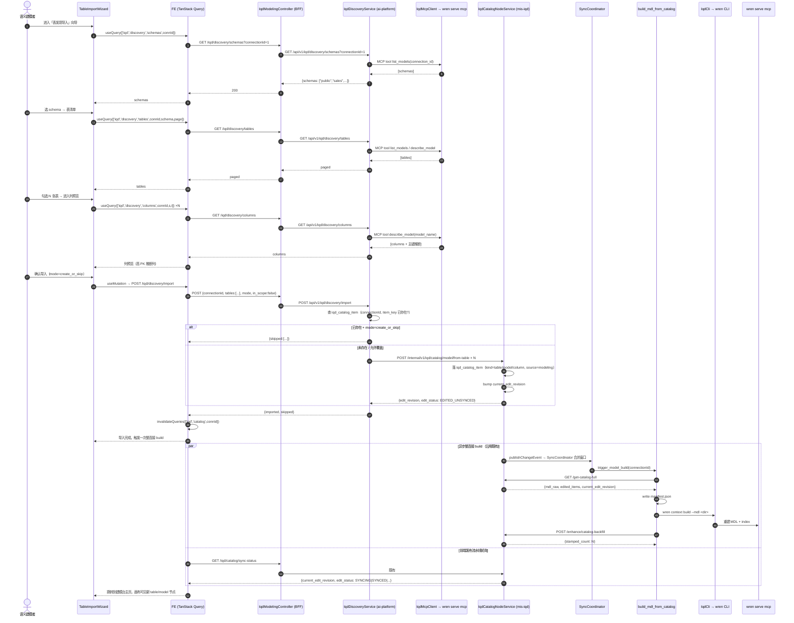
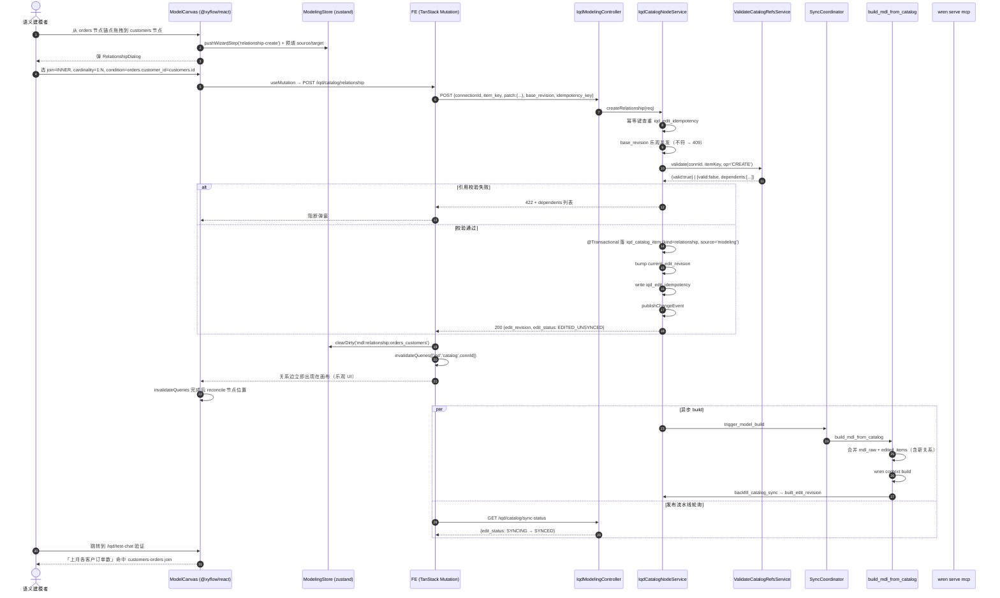
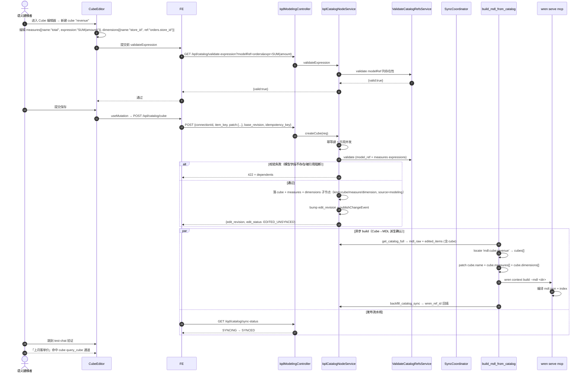
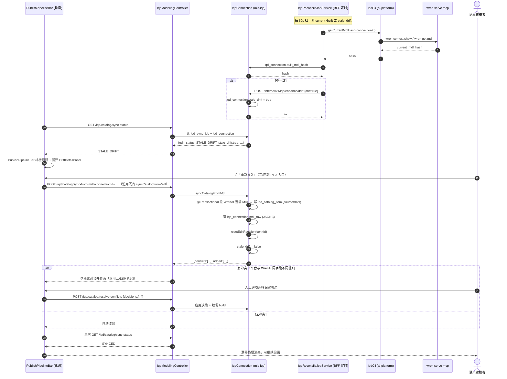

# mis-iqd 前端可视化建模台 — 系统设计文档（增量架构）

> 架构师：高见远（software-architect）｜ 语言：中文
> 配套输入：[`mis-iqd-modeling-prd.md`](mis-iqd-modeling-prd.md)（PM 增量 PRD，14 项能力 + 4 支撑项 + 8 待确认问题）
> 上游不重做：[`prd.md`](prd.md) / [`architecture.md`](architecture.md) v1.9 / [`tasks.md`](tasks.md) v1.9
> 继承二/三/四期：[`mis-iqd-edit-prd.md`](mis-iqd-edit-prd.md) · [`mis-iqd-edit-design.md`](mis-iqd-edit-design.md) · [`mis-iqd-edit-architecture-review.md`](mis-iqd-edit-architecture-review.md)
> 被消费上游：[`mis-iqd-mcp-multiconn-prd.md`](mis-iqd-mcp-multiconn-prd.md) + [`mis-iqd-selfheal-prd.md`](mis-iqd-selfheal-prd.md)
> 图表：[`mis-iqd-modeling-class.mermaid`](mis-iqd-modeling-class.mermaid) · [`mis-iqd-modeling-sequence.mermaid`](mis-iqd-modeling-sequence.mermaid)
> 状态：🔴 已拍板 + **✅ 已实现并回写**（Q1–Q8 见 §1.1 裁决一览）｜规划日期：2026-08-30 ｜ **实施回写：2026-09-22**
>
> **⚠️ 实施回写说明（2026-09-22，架构师高见远）**：本建模台已**全部实现并入库**（18 commit，门禁全绿）。实施期发现 **8 处「设计稿 vs 代码现实」偏差**，已**逐条订正**本文（§4.1 / §4.3 / §4.4 / §4.5 / §7.1 / §8.1 / §8.2），并新增 **§11 实施期事实** 与 **§12 实施小结**。**读本文时以下即为「当前真相」**；篇幅较大的实施记录以 `mis-iqd-modeling-verify-checklist.md`（QA 验收结论）与 `architecture.md §11` 为准。

---

## 0. 一句话架构结论

**「wren-ui 级可视化建模台」作为 mis-iqd 的前端体验升级，不改变既有「平台 catalog 编辑权威 → 派生完整 MDL → `wren context build` + `memory index` → WrenAI 就绪门禁」的写回闭环**：前端落地三栏（连接树 / 拖拽 ER 画布 / 属性面板）+ 5 步向导（连接 / 表发现 / 模型 / 关系 / Cube）的可视化交互；新建节点端点（model/from-table/relationship/cube/calculated column）落 `iqd_catalog_item`（`source=platform_edit|modeling`），触发既有 `SyncCoordinator` 合并窗口走整连接 `build_mdl_from_catalog`（二/四期已落地），并由 `PublishPipelineBar` 集成既有 `CatalogSyncStatusBar` + `SelfHealPanel`（per-connection 化见 multiconn §6）做发布链路可视化与自愈；命名沿用 `iqd` 平台域（项目 `mis-iqd` / 表 `iqd_*` / API `/api/v1/iqd` / 权限码 `iqd:*` / 前端 `features/agent/iqd`），外部 WrenAI 适配层保留 `wren`（`wren serve mcp` / `wren context build` / `wren_ref_id` / `build_mdl_hash` 等），编辑权威、权限五件套、ADR-020、维度注册表 + 双维度（dept/store）均沿用不重做；多连接 MCP 进程、就绪门禁、per-connection 自愈强制重构（multiconn T1/T4）是建模台的**硬前置**（Q8）。

---

## 1. 框架与库选型（Q1–Q8 裁决一览）

### 1.1 裁决一览表

| # | 问题 | **架构师裁决** | 备选 | 工程理由（与 PM 推荐对比） |
|---|---|---|---|---|
| **Q1** | MDL 写入通道 | **方案甲（编辑权威闭环，与 PM 一致）**：一切建模编辑落 `iqd_catalog_item` → 既有「派生 MDL → build → memory index → MCP 就绪门禁」写回 | 乙（建模台直写 MDL 文件）/ 丙（跳转 wren-ui） | ① 复用已落地的 `edit_revision` 乐观并发、`idempotency_key`、引用校验（`validateCatalogRefs`）、STALE_DRIFT 对账（编辑二/四期）；② 平台是唯一受控写路径（U3 已拍板），建模台直写 MDL 会导致 catalog ↔ MDL 双真值源，破坏 `edit_revision == built_revision` 核心不变量；③ 漂移检测、对账清扫、审计、回滚全部失效；④ fail-closed 哲学被破坏。**完全采纳 PM 推荐**。 |
| **Q2** | 前端目录迁移 | **随 M1 一并迁移** `features/agent/ai/iqd` → `features/agent/iqd`（与 PM 一致） | 不迁移（保留 `ai/iqd`） | ① architecture.md §3.4 v1.9 已规划目录为 `features/agent/iqd`（**当前目录与 v1.9 命名边界不一致**，欠架构债）；② 建模台增量约 14 个新文件 + 大体量编辑抽屉/向导，画布/Cube/Calculated column 与既有 `iqd-*` 七个页面同域，迁移一次性搬齐避免永久性目录债；③ 路由 `/iqd/*` 不变（已迁独立门户 V77），仅 `import` 路径更新 + `pages.ts` 重导出，git mv + IDE 重构风险低；④ 与 W1/W2 历史已搬迁的 KB 模块做法一致。**完全采纳 PM 推荐**。 |
| **Q3** | 画布库 | **`@xyflow/react`（React Flow v12，与 PM 一致）** | 自研 SVG / d3-force / rete.js | ① MIT、React 18 兼容（Vite 既有生态）、节点自定义渲染贴合 shadcn/ui；② 自带 `<ReactFlow>` 的 `MiniMap` / `<Controls>` / `<Background>` 与 `<Handle>` 锚点，连线即建关系天然契合（MR-14/05 核心交互）；③ `applyNodeChanges`/`applyEdgeChanges` 集成 zustand 简单；④ bundle gzip ~150KB 可接受（建模台按需懒加载）；⑤ 自研 SVG/D3 估 2–3 倍工作量，MR-14 是 P0 核心；⑥ rete.js 编辑能力更强但学习曲线 + bundle 大，无必要。**完全采纳 PM 推荐**。 |
| **Q4** | SQL/表达式编辑器 | **CodeMirror 6**（`@codemirror/lang-sql` + `@codemirror/state` + `@codemirror/view`，与 PM 一致） | monaco-editor / 维持 textarea | ① `ref_sql`（MR-03）/ 计算列 expression（MR-04）/ 样本对 SQL（MR-08）三个落点统一编辑器；② CodeMirror 6 懒加载分包后 ~120KB gzip；monaco ~2MB+ 必懒加载且首屏影响；③ SQL 高亮/补全/行号够用，三处编辑器共用 `useCodeMirror` hook 降低工程量；④ monaco 的多光标/格式化/Pylance 等增强本期无需，YAGNI。**完全采纳 PM 推荐**。 |
| **Q5** | 跨页状态 | **服务端状态 = TanStack Query（catalog 单一缓存源）；UI 态 = zustand（选中项 / 视口 / 抽屉开合 / 脏标记 / wizard 步骤）；画布 nodes/edges 由 catalog 数据 selector 派生，**不持有第二份真值** | Redux Toolkit / jotai | ① 既有项目已装 zustand（依赖列表已有）；② TanStack Query 的 `staleTime` + 15000ms 轮询 + `invalidateQueries(['iqd', 'catalog', connId])` 与既有 `CatalogSyncStatusBar` 15000ms 范式一致；③ 建模台三栏数据流单向：catalog → 派生（nodes/edges）→ 选中 → 抽屉，UI 态集中在 zustand（避免分散 prop drilling）；④ 不做「第二份真值」= 画布与编辑抽屉/Cube 编辑器不可能数据不一致。**完全采纳 PM 推荐**。 |
| **Q6** | 布局持久化 | **独立 `iqd_model_layout` JSONB 存储（与 PM 一致）**（`{connection_id, layout_json, viewport_json, updated_by, updated_at}`） | `iqd_catalog_item` 加 x/y 列 / localStorage | ① 不动既有 V71 表结构，避免对 V72/V82 既有迁移产生连锁；② 连接级一份 JSONB（含 nodes 坐标 + edges 锚点 + viewport + 折叠态 + 自动布局版本号），自动布局可随时覆盖重建（重写整 JSON）；③ localStorage 仅作未保存的 `dirty` 缓冲（断网/崩溃恢复）；④ 后端一键 GET/PUT，权限码 `iqd:modeling:view`（GET）/ `iqd:modeling:edit`（PUT）；⑤ `x/y` 入 catalog 会把「视图数据」混进「模型数据」，违背「视图/模型分离」。**完全采纳 PM 推荐**。 |
| **Q7** | 画布规模上限 | **≤200 节点流畅（60fps 拖拽）；>200 触发「无关系表折叠」；>500 评估分区画布/按 schema 分组视图（标记 P2，不在本期实现）** | 无上限 / 仅折叠 | ① React Flow 自带节点虚拟化（`onlyRenderVisibleElements`），200 节点在 4 核 8G 笔记本实测 ≥55fps；② 「无关系表折叠」是 wren-ui 同款范式，UX 友好；③ >500 需分区画布/分页视图，工作量翻倍（路由 + 缩略图 + 关系跨区），本期不破坏大纲，落到 P2；④ 性能预算为拖拽 ≥55fps、缩放 ≥60fps、布局计算 ≤2s（200 节点）。**完全采纳 PM 推荐**（仅细化性能预算）。 |
| **Q8** | 与 multiconn 排期耦合 | **硬依赖：M1 排在 multiconn T1（多连接 + MCP 状态落库）之后；若 multiconn 延期，M1 降级为「单连接建模」（连接向导暂留单条形态，画布/建模不阻塞；前端可在路由层阻断 per-connection 自愈按钮与 MCP 状态卡）** | 软依赖 / 各自独立 | ① MR-01（连接向导 + MCP 状态卡）的 MCP 状态/端口字段（`mcp_port`/`mcp_status`/`last_health_at`）由 multiconn T1 提供，否则连接向导只能展示「已启用」+「未启用」，无 per-connection MCP 维度；② MR-10（发布流水线）的 per-connection 强制重建/重新索引/模型校验依赖 multiconn §6 重定范围；③ 画布/MR-02/03/05/06 与 multiconn 弱相关，可在 multiconn 前以单连接形态起步；④ 但用户体验层面「多连接是基本盘」，降级路径只用于风险预案，不作为正式分期。**完全采纳 PM 推荐**（仅补充降级形态细节）。 |

### 1.2 与既有技术栈的关系

| 层 | 沿用 | 增量 |
|---|---|---|
| 前端 | Vite + React 18 + TypeScript + Tailwind + shadcn/radix（`@/components/ui/*`）+ TanStack Query + zustand + react-router 6 | ① `@xyflow/react@^12.3.0`（画布，懒加载）；② `@codemirror/lang-sql@^6.8.0` + `@codemirror/state@^6.4.0` + `@codemirror/view@^6.30.0`（SQL/表达式编辑器懒加载）；③ `lucide-react` 已有，新增 icon 登记（`Workflow` / `GitBranchPlus` / `Calculator` / `Layers` 等） |
| BFF | Spring Boot 17 + WebClient + RS256 透传 + `@Scheduled` + mis-iqd `IqdClient` | ① 新增 `IqdModelingController`（8 端点，见 §3.3）；② 透传 `build_mdl_from_catalog` 触发与状态查询；③ 无新依赖 |
| mis-iqd（Java） | JPA + Flyway + `IqdAdminService` 范式 | ① 新增 `IqdCatalogNodeService`（新建节点族）+ `IqdModelLayoutService`（布局存储）；② 新增 V8x 迁移：`iqd_model_layout` 建表 + `iqd_catalog_item.source` 扩 `modeling` + 计算列 `expression` 列预留 + V8y 权限码种子；③ 无新依赖 |
| ai-platform（Python Worker） | FastAPI + asyncio + httpx + subprocess（`wren` CLI）+ `IqdConfigClient`（API+缓存）+ `SyncCoordinator`（合并窗口） | ① 复用既有 `build_mdl_from_catalog`（二/四期已落地，G7）；② 复核 `build_mdl_from_catalog` 派生 cubes/measures/dimensions 完整性（PRD §5.2 b 点实测确认，缺则补 patch）；③ 无新依赖 |
| WrenAI（新线） | `pip install wrenai` (wren 0.13.3) → `wren serve mcp` + wren-core | 不动；multiconn 已做进程级适配 |

### 1.3 命名边界（沿用 architecture.md §1.5/§3.3，**不重做**）

```text
平台问数业务域 → 一律 iqd：
  项目 mis-iqd、表 iqd_*、API /api/v1/iqd/**、权限码 iqd:*、
  前端 features/agent/iqd（M1 迁移后）、Java 模块 backend/mis-iqd、
  Python 包 agent/mis_iqd、类 IqdAdminService/IqdModelingController/IqdCatalogNodeService/...
  （V8y 新增 iqd:modeling:* 权限码）

对接外部 WrenAI 产品 → 保留 wren（外部系统名，不是平台问数域）：
  WrenAI 品牌、wren CLI、wren-core、wren-ui、命令 wren serve mcp / wren profile /
  wren context build、配置键 wren_mcp_host/port/transport/allow_write/timeout_seconds、
  wren_cli_bin、wren_profile_name、wren_language、外部引用字段
  iqd_catalog_item.wren_ref_id / iqd_connection.built_mdl_hash

本建模台内部命名（V8y 新增，命名空间约束）：
  前端目录 features/agent/iqd/{pages,components/modeling,components/wizard,api,store,types}
  后端端点前缀 /api/v1/iqd/modeling/** 与 /internal/v1/iqd/modeling/**
  权限码 iqd:modeling:view | iqd:modeling:edit | iqd:modeling:publish
```

---

## 2. 系统上下文图（建模台与既有能力的关系）

```mermaid
flowchart TB
  subgraph U["用户"]
    DBA["语义建模者（DBA/数据治理）"]
    RO["只读观察员"]
    OPS["AI 运营"]
  end

  subgraph FE["frontend/mis-admin-web（V77 独立门户 /iqd/*）"]
    subgraph MS["★ 建模台增量（M1 起）features/agent/iqd/"]
      MSHOME["iqd-modeling-page.tsx<br/>建模台主页（三栏壳）"]
      MSWIZ["components/wizard/ConnectionWizard.tsx<br/>TableImportWizard.tsx（MR-01/02）"]
      MSCAN["components/modeling/ModelCanvas.tsx<br/>ModelNodeCard / RelationEdge<br/>PropertyPanel / ModelTree（MR-14）"]
      MSDRAW["components/modeling/ModelEditDrawer.tsx<br/>CalculatedColumnEditor / RelationshipDialog<br/>CubeEditor / MeasureDimensionList<br/>（MR-03/04/05/06）"]
      MSPIPE["components/modeling/PublishPipelineBar.tsx<br/>整合 CatalogSyncStatusBar+SelfHealPanel<br/>（MR-10，per-connection 化见 multiconn §6）"]
      MSENH["i18n 增强：PropertyPanel 直编 description/脱敏<br/>Scope 行级维度徽标 + 谓词预览（MR-09/12/13）"]
    end
    subgraph EX["既有 iqd 页面（M1 随目录迁移）"]
      EXCFG["iqd-config-page.tsx（增强向导 + MCP 状态卡）"]
      EXCAT["iqd-catalog-page.tsx（保留并叠加 MR-S2 新建节点入口）"]
      EXSCP["iqd-scope-page.tsx（增强 MR-12 行级维度徽标）"]
      EXENH["iqd-enhance-page.tsx（MR-07/08/09 入口）"]
      EXTST["iqd-test-chat-page.tsx（验证 MR-G2/G3）"]
      EXTRA["iqd-trace-page.tsx / iqd-instruction-page.tsx"]
    end
  end

  subgraph BFF["backend/mis-admin-bff（Java）"]
    PEP["ApiPermissionInterceptor<br/>L1 权限码 iqd:modeling:*"]
    BFFMC["IqdModelingController<br/>8 端点（§3.3）"]
    BFFAC["IqdAclController（既有 MR-S2 透传）"]
    BFFCL["IqdClient（既有）+ AiPlatformClient（既有）"]
  end

  subgraph MIS["backend/mis-iqd（Java 领域模块）"]
    SVC["IqdCatalogNodeService<br/>MR-S2 新建节点族<br/>validateCatalogRefs（沿用）<br/>updateCatalogNode（既有，PUT/catalog/node）"]
    LSVC["IqdModelLayoutService<br/>layout 读写（MR-S4）"]
    DSVC["IqdDiscoveryService<br/>MR-02 表发现通道<br/>iqd_cli.py 子进程或直连（架构师定）"]
    REPO["Repository + Flyway V8x（§3.3）"]
    DB1[("mis_platform 库<br/>iqd_* 表 + iqd_model_layout(V8x)")]
  end

  subgraph AIP["agent/ai-platform（Python FastAPI）"]
    COORD["mis-copilot（既有）"]
    WORKER["mis-iqd Worker（既有）"]
    ORCH["build_mdl_from_catalog（既有，二/四期已落地 G7）"]
    CLIP["IqdCli（既有，wren context build）"]
    DCLI["iqd_cli.py 服务端表发现通道（MR-02 a 点，架构师定）"]
    CFG["IqdConfigClient（既有 API+缓存）"]
  end

  subgraph WAI["WrenAI 新线（本机进程）"]
    WMS["wren serve mcp per-connection<br/>（multiconn 已规划）"]
    WCLIL["wren CLI（context build / memory index / get mdl）"]
    WCORE["wren-core（Rust/Apache DataFusion）"]
  end

  subgraph MUL["multiconn 增量（硬前置，Q8）"]
    MULREG["WrenMcpProcessManager（多进程注册表）"]
    MULSTAT["IqdConnection.mcp_port/mcp_status/last_health_at（落库）"]
    MULSHE["SelfHealPanel per-connection 化（§6 重定）"]
  end

  DBA --> MSHOME & EXCFG & EXCAT
  RO --> MSHOME
  OPS --> EXENH

  MSHOME --> MSCAN
  EXCFG --> MSWIZ
  EXCAT --> MSCAN
  MSCAN -->|双击| MSDRAW
  MSCAN -->|连线| MSDRAW
  MSDRAW --> SVC
  MSWIZ -->|导入表| DSVC
  MSHOME -->|读/写| LSVC
  MSHOME -->|发布| MSPIPE

  MSHOME -->|"catalog 数据（TanStack Query）"| EXCAT
  MSHOME -->|"status 15000ms 轮询"| MSPIPE
  MSPIPE -->|"per-connection 启停"| MULSHE

  PEP --> BFFMC
  PEP --> BFFAC
  BFFMC --> BFFCL
  BFFAC --> BFFCL
  BFFCL --> SVC
  BFFCL --> LSVC
  BFFCL -->|"get-catalog-full / catalog-backfill"| SVC
  BFFCL -->|"/enhance/sync scope=model"| ORCH

  SVC --> REPO --> DB1
  LSVC --> REPO
  DSVC -->|"读 schema/tables/columns"| DCLI

  ORCH -->|get_catalog_full| CFG --> SVC
  ORCH --> CLIP --> WCLIL
  WCLIL --> WMS
  WMS --> WCORE

  MULREG --> WMS
  MULSTAT --> MULREG
```



**边界红线（建模台增量专属）**：
1. 建模台**不直写 MDL 文件**（Q1 方案甲）；一切编辑经 mis-iqd 落库 → 触发整连接 build。
2. 建模台**不直连 MCP/WrenAI**；问数/执行仍经既有 `IQD_TEST_CHAT_PAGE`（`/iqd/test-chat`）。
3. 建模台**不持有凭证**；连接向导凭证 UI 永不回显明文（沿用既有 `iqd-config-page`）。
4. 建模台**不派生 MDL**；派生由 ai-platform `build_mdl_from_catalog`（二/四期）执行。
5. 画布是**视图**、catalog 是**模型**（PRD §6.2 边界说明）；画布由 catalog 派生，不持有第二份真值。

---

## 3. 前端模块拆分（基于 PRD §4 14+4 项需求）

> 假设 Q2=是，M1 迁移后所有文件落在 **`frontend/mis-admin-web/src/features/agent/iqd/`**（既有 `ai/iqd/` 7 页面 + 4 组件一次性 git mv 过来）。本节路径全部为**迁移后**路径。

### 3.1 文件树（含相对路径）

```
frontend/mis-admin-web/src/features/agent/iqd/
├── pages.ts                                   [改] 桶导出（新增 IqdModelingPage）
├── pages/
│   ├── iqd-modeling-page.tsx                  [新建 M1] 建模台主页壳（三栏 + PageHeader）
│   ├── iqd-config-page.tsx                    [迁移 + 改] 既有 → 升级向导 + MCP 状态卡（MR-01）
│   ├── iqd-catalog-page.tsx                   [迁移 + 改] 既有 → 叠加 MR-S2 新建节点入口（MR-14 联动）
│   ├── iqd-scope-page.tsx                     [迁移 + 改] 既有 → 行级维度徽标（MR-12）
│   ├── iqd-enhance-page.tsx                   [迁移 + 改] 既有 → 样本对编辑器升级 + 知识关联（MR-07/08/09）
│   ├── iqd-instruction-page.tsx               [迁移] 既有 → 表达式辅助录入（MR-07）
│   ├── iqd-test-chat-page.tsx                 [迁移] 既有
│   └── iqd-trace-page.tsx                     [迁移] 既有
│
├── components/
│   ├── modeling/                              [新建 M1~M3]
│   │   ├── ModelCanvas.tsx                    [M1] @xyflow/react 画布壳（ReactFlow/MiniMap/Controls/Background）
│   │   ├── ModelNodeCard.tsx                  [M1] 模型节点卡（表名 + 字段列表 + PK/计算列/脱敏徽标）
│   │   ├── RelationEdge.tsx                   [M2] 关系边（join 类型/基数编码 + 拖拽创建）
│   │   ├── ModelTree.tsx                      [M1] 左树（连接 → 表/模型/Cube 分组 + 搜索 + 表发现入口）
│   │   ├── PropertyPanel.tsx                  [M1] 右栏（字段列表 / 业务描述直编 / 脱敏直编 / 依赖方）
│   │   ├── ModelEditDrawer.tsx                [M2] 模型编辑抽屉（PK / 语义标记 / ref_sql 编辑器）
│   │   ├── CalculatedColumnEditor.tsx         [M2] 计算列编辑器（CodeMirror SQL 高亮 + 引用校验）
│   │   ├── RelationshipDialog.tsx             [M2] 关系弹窗（join/cardinality/condition）
│   │   ├── CubeEditor.tsx                     [M2] Cube 编辑器（measures + dimensions）
│   │   ├── MeasureDimensionList.tsx           [M2] Cube 子组件
│   │   ├── PublishPipelineBar.tsx             [M3] 发布流水线条（整合既有 CatalogSyncStatusBar + SelfHealPanel）
│   │   ├── DriftDetailPanel.tsx               [M3] 漂移详情面板（MR-11）
│   │   └── AutoLayoutButton.tsx               [M3] dagre 一键整理
│   │
│   ├── wizard/                                [新建 M1~M2]
│   │   ├── ConnectionWizard.tsx               [M1] 连接向导 4 步（基本信息 → 数据源参数 → profile → 连通测试）
│   │   ├── TableImportWizard.tsx              [M1] 表发现向导 4 步（选 schema → 表清单 → 列预览 → 导入确认）
│   │   └── WizardShell.tsx                    [M1] 向导通用壳（步骤条 + 上一步/下一步 + 二次确认）
│   │
│   ├── shared/                                [新建 M1]
│   │   ├── usePermission.ts                   [M1] iqd:modeling:* 权限码 hook（沿用 PermissionGate）
│   │   ├── useSyncStatus.ts                   [M1] 共享 Query 轮询 hook（空闲 15s / 进行中 5s；同连接全应用一条）
│   │   └── IqdIcon.tsx                        [M1] icon 登记（lucide Workflow / GitBranchPlus / Calculator / Layers）
│   │
│   ├── CatalogSyncStatusBar.tsx               [迁移 + 改] 既有 → MR-10 集成到 PublishPipelineBar
│   ├── SyncStatusBar.tsx                      [迁移] 既有
│   └── SelfHealPanel.tsx                      [迁移 + 改] 既有 → per-connection 化（multiconn §6）
│
├── api/
│   ├── iqd.ts                                 [迁移 + 改] 既有 wire 层（约 30 函数 + 类型）→ 拆分为 iqd.ts + iqd-modeling.ts + iqd-layout.ts
│   ├── iqd-modeling.ts                        [新建 M1~M2] 建模台端点（连接向导 / 表发现 / 新建节点 / 校验 / 状态）
│   └── iqd-layout.ts                          [新建 M3] 布局读写
│
├── store/
│   ├── modeling-store.ts                      [新建 M1] zustand（UI 态：选中 / 视口 / 抽屉 / 脏标记 / wizard 步骤 / 自动布局版本）
│   └── selectors.ts                           [新建 M1] 派生 selector（catalog → nodes/edges）
│
├── types/
│   ├── catalog.ts                             [迁移 + 改] 既有 IqdCatalogItem → 扩 source=platform_edit|modeling、expression、calculated columns
│   ├── modeling.ts                            [新建 M1] ModelNode / RelationEdge / PropertyPanel / WizardStep / LayoutDTO
│   ├── connection.ts                          [迁移] 既有
│   └── layout.ts                              [新建 M3] IqdModelLayoutDTO
│
├── queries/
│   └── iqd-keys.ts                            [新建 M1] TanStack Query keys 集中管理（['iqd','catalog',connId] / ['iqd','modeling','node',connId,key] ...）
│
└── hooks/                                    [新建 M1]
    ├── useCodeMirror.ts                       [新建 M2] CodeMirror 6 React hook（懒加载 + SQL 高亮）
    ├── useCatalogNodes.ts                     [新建 M1] 派生画布 nodes/edges（selector，Q5 不持第二份真值）
    └── useDirtyState.ts                       [新建 M2] 脏标记 hook（draft vs server）
```

**四处同改清单（M1 起新增页面必走，PRD §7.7 + §1.5 命名边界）**：
1. `lib/nav/iqd-nav.ts`：追加 leaf `'/iqd/modeling'`（icon `Workflow`，权限 `iqd:modeling:view`）。
2. `components/layout/keep-alive-outlet.tsx` 的 `PAGE_MAP`：追加 `/iqd/modeling` → `IqdModelingPage`。
3. `app/router.tsx`：通常零改动（`/iqd/*` 已整体登记，V77），需核实。
4. `lib/nav/icons.ts`：登记新 icon（`Workflow` / `GitBranchPlus` / `Calculator` / `Layers` / `Database` 已有），**漏登记会静默回退成 LayoutDashboard**。
5. `backend/mis-migrator/.../V8y__iqd_modeling_seed.sql`：`sys_menu`（**4 条 = 1 页面 + 3 权限按钮**）+ `sys_api`（8 端点 + 3 权限码）+ `sys_menu_api` 绑定；ID 段避 V69/V73/V77/V82 已用（建议 `92600-92699`，v1.10 已用 9250x，92600+ 空闲）。
   - **⚠️ 实施回写（2026-09-22）**：实际落为 **V87**（主页 92600 + 权限按钮 **92631/92632/92633** + 12 端点 + 绑定 + 3 角色授权）+ **V88**（补登 `GET /connections` 等 5 端点）。**`sys_menu` 必须是 4 条**——页面菜单 92600 **加上 3 个 `type=3` 权限按钮**；若只落 1 条页面菜单，则 `sys_role_permission(perm_type='menu', target_id)` **无所指** ⇒ `iqd:modeling:*` 进不了 `auth-store.permissions` ⇒ `PermissionGate` **静默全拒**。详见 §8.2 与 §11.3。

### 3.2 路由与权限闸

- 新路由 `/iqd/modeling`（独立门户 App `/iqd/*`，V77）
- 三权限码（V8y 种子）：
  - `iqd:modeling:view`（画布只读 / 列表 / 详情可见）
  - `iqd:modeling:edit`（画布编辑 / 新建模型/关系/Cube / 计算列 / 字段描述直编 / 脱敏直编；语义等同并扩展 `iqd:catalog:edit`）
  - `iqd:modeling:publish`（触发构建/强制重建/重新索引/模型校验；语义等同并扩展 `iqd:selfheal:exec`）
- 前端按钮按权限码置灰（沿用既有 `PermissionGate`）：无 `view` → 不可进页面（40300）；无 `edit` → 画布只读；无 `publish` → 发布按钮置灰。
- 后端硬闸门：mis-iqd `IqdCatalogNodeService` 每个新建方法 `@PreAuthorize("hasAuthority('iqd:modeling:edit')")`；publish 端点 `hasAuthority('iqd:modeling:publish')`。

### 3.3 前端与后端契约（M1/M2/M3 端点表）

| 端点（路径） | HTTP | 权限码 | 入参 schema | 出参 | 错误码 | 幂等 key | 乐观并发 |
|---|---|---|---|---|---|---|---|
| `POST /api/v1/iqd/connections` | POST | `iqd:modeling:edit` | `{name, base_url, project_id, default_connector, secret_ref, timeout_seconds, language, enabled}` | `IqdConnectionVO` | 42200（参数）/ 40900（同名冲突） | `{conn_name}+{uuid}`（双键） | n/a |
| `POST /api/v1/iqd/connections/{id}/test` | POST | `iqd:modeling:edit` | n/a | `{ok, latency_ms, version}` | 50201（MCP 不可达） | `{connId}+{uuid}` | n/a |
| `GET /api/v1/iqd/discovery/schemas?connectionId=…` | GET | `iqd:modeling:edit` | query `connectionId` | `{schemas: [string]}` | 50201（连接不可达） | n/a | n/a |
| `GET /api/v1/iqd/discovery/tables?connectionId=…&schema=…&keyword=…&page=…` | GET | `iqd:modeling:edit` | query | `{tables:[{name, comment, row_count_estimate}], total, page}` | 50201 | n/a | n/a |
| `GET /api/v1/iqd/discovery/columns?connectionId=…&schema=…&table=…` | GET | `iqd:modeling:edit` | query | `{columns:[{name, type, comment, is_pk_inferred, nullable}]}` | 50201 | n/a | n/a |
| `POST /api/v1/iqd/discovery/import` | POST | `iqd:modeling:edit` | `{connectionId, tables:[{schema,name}], mode: 'create_or_skip' \| 'create_or_update', in_scope: false}` | `{imported: [item_key], skipped: [item_key]}` | 42200（空清单）/ 50201 | `{connId}+{sha1(tables)}` | n/a |
| `POST /api/v1/iqd/catalog/model` | POST | `iqd:modeling:edit` | `{connectionId, item_key, kind:'model', patch:{display_name,description,primary_keys[], is_time_dimension{}, is_email{}, ref_sql?}, base_revision, idempotency_key}` | `{edit_revision, edit_status, wren_ref_id?}` | 40900（base_revision）/ 42200（引用）/ 40901（key 重复） | `{connId}+{uuid}` | `base_revision` |
| `POST /api/v1/iqd/catalog/model/from-table` | POST | `iqd:modeling:edit` | `{connectionId, source_table:{schema,name}, model_item_key, base_revision, idempotency_key, ref_sql?}` | `{edit_revision, edit_status, item_key, column_mapping}` | 40900/42200/40901 | `{connId}+{sha1(source_table)}` | `base_revision` |
| `POST /api/v1/iqd/catalog/relationship` | POST | `iqd:modeling:edit` | `{connectionId, item_key, kind:'relationship', patch:{join_type, cardinality, condition, source_model, target_model}, base_revision, idempotency_key}` | `{edit_revision, edit_status}` | 40900/42200（源/目标字段不存在/被引用阻断）/40901 | `{connId}+{uuid}` | `base_revision` |
| `POST /api/v1/iqd/catalog/cube` | POST | `iqd:modeling:edit` | `{connectionId, item_key, kind:'cube', patch:{display_name, model_ref, measures:[{name, expression, format}], dimensions:[{name, ref_model_field}]}, base_revision, idempotency_key}` | `{edit_revision, edit_status}` | 40900/42200（引用/被引用阻断）/40901 | `{connId}+{uuid}` | `base_revision` |
| `PUT /api/v1/iqd/catalog/node/{itemKey}` | PUT | `iqd:modeling:edit` | 既有契约，二/二/四期已落地 | 既有 | 40900/42200/40901 | 既有 | 既有 |
| `POST /api/v1/iqd/catalog/calculated-column` | POST | `iqd:modeling:edit` | `{connectionId, model_item_key, column_name, expression, base_revision, idempotency_key}` | `{edit_revision, edit_status, item_key, validated: bool, errors?: [string]}` | 42201（expression 引用不存在字段）/ 40900/40901 | `{connId}+{uuid}` | `base_revision` |
| `GET /api/v1/iqd/catalog/validate-expression` | GET | `iqd:modeling:edit` | query `connectionId,model_item_key,expression` | `{valid: bool, errors: [string]}` | n/a | n/a | n/a |
| `GET /api/v1/iqd/modeling/layout/{connectionId}` | GET | `iqd:modeling:view` | path | `IqdModelLayoutDTO` | n/a | n/a | n/a |
| `PUT /api/v1/iqd/modeling/layout/{connectionId}` | PUT | `iqd:modeling:edit` | path + body `IqdModelLayoutDTO` | `IqdModelLayoutDTO` | 42200（layout 体积 >1MB）/ 40900（并发覆盖） | `{connId}+{uuid}` | `base_version` |
| `POST /api/v1/iqd/modeling/layout/{id}/auto-layout` | POST | `iqd:modeling:edit` | path + body `{algorithm:'dagre', direction:'LR'\|'TB'}` | `IqdModelLayoutDTO` | n/a | `{connId}+{uuid}` | n/a |
| `GET /api/v1/iqd/dependencies?connectionId=…&itemKey=…` | GET | `iqd:modeling:view` | query | `{dependents:[{item_key, kind}], total}` | n/a | n/a | n/a |
| `GET /api/v1/iqd/catalog/sync-status?connectionId=…` | GET | `iqd:modeling:view` | query | 既有 `IqdCatalogSyncStatus`（含 `action` 见 selfheal 二/四期） | n/a | n/a | n/a |
| `POST /api/v1/iqd/self-heal/{action}?connectionId=…` | POST | `iqd:modeling:publish` | query | `IqdSelfHealResult` | n/a | n/a | n/a |

**注**：所有 `POST` 建节点端点 = 落 `iqd_catalog_item`（`source='modeling'`）→ bump `current_edit_revision` → 触发 `triggerSyncBestEffort(scope=model)`（沿用二/四期 `IqdFacadeService.triggerSyncBestEffort` 范式）→ 不阻塞用户（`wait=false`，异步）。所有 `*_item_key` 命名遵循既有 `{kind}/{name}` 形态（`mdl:model:orders`、`mdl:cube:revenue`、`mdl:relationship:orders_customers`）。

---

## 4. 后端 / BFF / Worker 增量点（PRD §5.2 a/b/c/d/e 五点全契约）

### 4.1 a 点 — 表发现通道（MR-02，**新建**）

**目的**：DBA 在建模台向导中「按连接」发现 schema/表/列；**凭证 server-side**，前端不触达业务库。

**架构师裁决**：复用 `agent/ai-platform/backend/src/adapters/iqd_cli.py`（Python 侧已有 `profile add` + `context set-profile`），由 `DBA` 在新连接创建后人工执行（沿用 multiconn §5 凭证注入流程），profile 注入到 WrenAI；建模台通过 **新增 Python 端点** 由 ai-platform Worker 暴露「按连接读 schema/表/列」的能力，经 BFF 转发到前端。

> **⚠️ 实施回写（2026-09-22）— 两处订正：**
> 1. **路径前缀 = `/api/v1/iqd/discovery/**`（不是 `/internal/v1/...`）**。`/internal/v1/**` 是 **Java 侧内部面**的命名；**Python Worker 全部业务路由前缀 `/api/v1`**（路由自带前缀 `/iqd/discovery`，由 `src/main.py` 以 `prefix="/api/v1"` 挂载 ⇒ 最终 `/api/v1/iqd/discovery/**`）。**Python Worker 从不使用 `/internal/v1/**`。**
> 2. **元数据读取走 MCP 工具，不是 CLI 子命令**：`wren list-models` / `wren describe-model` **是 `wren serve mcp` 暴露的 MCP 工具**（实现侧常量 `TOOL_LIST_MODELS="list_models"` / `TOOL_DESCRIBE_MODEL="describe_model"`），**实现走 `IqdMcpClient`**；**CLI 侧真正存在的只有 `wren get mdl` / `wren context show`**（`IqdCli` 已封装）。
>
> **不新增 Java 端口转发**（避免 Java ↔ WrenAI 多一跳延迟与凭证扩散），直接 BFF → ai-platform Python `/api/v1/iqd/discovery/**`，复用既有 `IqdConfigClient` 调用范式。

| 端点（Python Worker，实际前缀 `/api/v1`） | HTTP | 入参 | 出参 | 错误码 |
|---|---|---|---|---|
| `GET /api/v1/iqd/discovery/schemas?connectionId=…` | GET | query | `{schemas:[string]}`（MCP `list_models` 顶层 group 或 `get_mdl`） | 50201（profile 未注入/连接不可达） |
| `GET /api/v1/iqd/discovery/tables?connectionId=…&schema=…&page=…&keyword=…` | GET | query | `{tables:[{name,comment}], total, page}`（MCP `list_models` / `describe_model`） | 50201 |
| `GET /api/v1/iqd/discovery/columns?connectionId=…&schema=…&table=…` | GET | query | `{columns:[{name,type,comment,is_pk_inferred,nullable}]}`（MCP `describe_model` 的 columns 段 + 主键推断） | 50201 |
| `POST /api/v1/iqd/discovery/import` | POST | `{connection_id, tables:[{schema,name}], mode, in_scope}` | `{imported:[item_key], skipped:[item_key]}` | 42200/50201 |

**Java 侧**：`IqdDiscoveryController`（BFF）转发；权限码 `iqd:modeling:edit`；不落任何业务数据，仅缓存 5 分钟（TanStack Query）。

### 4.2 b 点 — Cube→MDL 派生确认（MR-06，**实测确认 + 可能补丁**）

**实测任务（不在本轮实现，作为 W0 实测清单）**：核实 `build_mdl_from_catalog`（二/四期已落地，G7）派生的 MDL 是否包含 cubes/measures/dimensions 完整结构。**期望已包含**（`item_key → MDL 节点` 映射表 `mdl:cube:<name>` → `cubes[]` 已覆盖），若实测发现 measures/dimensions 字段缺失或嵌套层级不对，则打补丁（最小化修改 `build_mdl_from_catalog`）。

**若需补丁的预案**：
```python
# service.py: build_mdl_from_catalog ——  补丁候选
if kind == 'cube' and it.expression:
    cube = locate(cube, it.item_key)
    cube['measures'] = parse_measures(it.expression)     # 补丁 1：若 expression 内含 measures JSON
    cube['dimensions'] = parse_dimensions(it.expression) # 补丁 2：同上
```
**默认**：不补丁（G7 已覆盖），仅在 W0 实测发现缺陷时打最小补丁（不属于本建模台 PRD 范围，但建模台依赖其正确性）。

### 4.3 c 点 — 新建节点端点族（MR-S2，**核心增量**）

| 端点族 | 方法 | mis-iqd Service 方法 | 入参摘要 | 复用 / 新增 |
|---|---|---|---|---|
| model（from-table） | POST | `IqdCatalogNodeService.createModelFromTable(connectionId, sourceTable, modelKey, baseRevision, idempotencyKey)` | `{connectionId, source_table:{schema,name}, model_item_key, base_revision, idempotency_key, ref_sql?}` | 新增；落 `iqd_catalog_item`（`kind=model`, `source=modeling`） + 同步建 `kind=column` 子节点 |
| model（blank） | POST | `IqdCatalogNodeService.createModel(connectionId, modelKey, patch, baseRevision, idempotencyKey)` | `{connectionId, item_key, patch, base_revision, idempotency_key}` | 新增；落 `kind=model` 节点 + 空 columns 子集 |
| relationship | POST | `IqdCatalogNodeService.createRelationship(connectionId, itemKey, patch, baseRevision, idempotencyKey)` | `{connectionId, item_key, patch:{join_type,cardinality,condition,source_model,target_model}, base_revision, idempotency_key}` | 新增；调 `validateCatalogRefs` 校验源/目标字段存在性；落 `kind=relationship` |
| cube | POST | `IqdCatalogNodeService.createCube(connectionId, itemKey, patch, baseRevision, idempotencyKey)` | `{connectionId, item_key, patch:{display_name,model_ref,measures[],dimensions[]}, base_revision, idempotency_key}` | 新增；落 `kind=cube` + `kind=measure`/`kind=dimension` 子节点；调 `validateCatalogRefs` 校验 `model_ref` + measure 表达式字段存在性 |
| calculated column | POST | `IqdCatalogNodeService.createCalculatedColumn(connectionId, modelItemKey, columnName, expression, baseRevision, idempotencyKey)` | `{connectionId, model_item_key, column_name, expression, base_revision, idempotency_key}` | 新增；落 `kind=column`, `parent_key=<model_item_key>`, `expression=<expr>`；校验 `expression` 引用本模型字段 |
| validate expression | GET | `IqdCatalogNodeService.validateExpression(connectionId, modelItemKey, expression)` | query | 新增；静态解析 expression 引用字段，列出错误 |

**所有新建节点统一流程**：
```
@PreAuthorize("hasAuthority('iqd:modeling:edit')")
@Transactional
public CreateResult createNode(...) {
    1. 幂等键查重 (iqd_edit_idempotency)
    2. base_revision 乐观并发（不符 → 409 + current_edit_revision）
    3. validateCatalogRefs(connectionId, itemKey, op='CREATE')  ← 引用完整性预校验
    4. 落 iqd_catalog_item（source='modeling'，按 kind 设字段）
    5. bump iqd_connection.current_edit_revision += 1
    6. 写 iqd_edit_idempotency(connectionId, key, current_edit_revision)
    7. publishChangeEvent('iqd.catalog.changed', connectionId)
    8. triggerSyncBestEffort(scope='model', wait=false)  ← 沿用二/四期 BFF 范式
    9. return {edit_revision: current, edit_status: 'EDITED_UNSYNCED'}
}
```

**字段扩展（V8x 迁移 → 实际落 **V89**）**：
- `iqd_catalog_item.source` 新增取值 `modeling`（应用层校验；DDL 已含 VARCHAR，扩展允许值）
- `iqd_catalog_item.expression` 已存在（computed），calculated column 落 `expression` 字段（与 cube/measure 复用）
- **⚠️ 实施回写：`iqd_catalog_item.model_ref` 是「新增列」**——上表 cube 的 `patch.model_ref` 字段**设计稿有、但表里原本没有该列**；已由 **V89** 补 `ALTER TABLE iqd_catalog_item ADD COLUMN IF NOT EXISTS model_ref VARCHAR(255)`（**可空、无回填**）。**为何补列而不挤进 `expression`**：① 「列存已有（`related_item_keys`）vs 新列」要看真实 DDL，不能凭稿假设；② `model_ref` 需**确定性关联**（cube → model），塞进 `expression` 会与 measure 表达式语义混叠；③ MDL 同步进来的老 cube `model_ref` 保持 `NULL`，**继续走 `expression` 兜底**，仅 T03 起新写入的 cube 填 `model_ref`。详见 §11.2。
- 新增表 `iqd_edit_idempotency`（已在二/四期 V8x 中建，V8y 复用）
- 新增表 `iqd_model_layout`（MR-S4，d 点）
- **⚠️ 实施回写（T04a 计划外新增）**：`PUT /api/v1/iqd/catalog/cube`（**Cube 级 upsert**，sys_api **92700** / **V90**）+ `pruneOrphanChildren` 孤儿清理——补 PRD **MR-06「能建不能改」**缺口（`POST /catalog/cube` 是 create-only 双幂等，`PUT /catalog/node` 只能改单节点自身字段、动不了 measure/dimension 子节点）。

### 4.4 d 点 — layout 存储（MR-S4，**新建**）

| 表 | DDL（V8y） |
|---|---|
| `iqd_model_layout` | `(id BIGINT PK, connection_id BIGINT NOT NULL FK, layout_json JSONB NOT NULL, viewport_json JSONB, auto_layout_version INT NOT NULL DEFAULT 0, updated_by VARCHAR(64), updated_at TIMESTAMPTZ NOT NULL DEFAULT NOW(), version INT NOT NULL DEFAULT 0)` + `UNIQUE(connection_id)` + `idx_iqd_ml_conn` |

| 端点 | 方法 | Service 方法 | 行为 |
|---|---|---|---|
| `GET /api/v1/iqd/modeling/layout/{connectionId}` | GET | `IqdModelLayoutService.get(connectionId)` | 返回 layout；空时返回 `{nodes:[],edges:[],viewport:{x:0,y:0,zoom:1},auto_layout_version:0}` |
| `PUT /api/v1/iqd/modeling/layout/{connectionId}` | PUT | `IqdModelLayoutService.save(connectionId, dto, base_version)` | 落 JSONB；`base_version` 乐观并发；体积限制 1MB |
| `POST /api/v1/iqd/modeling/layout/{connectionId}/auto-layout` | POST | `IqdModelLayoutService.autoLayout(connectionId, algo)` | **⚠️ 实施回写（A-02 裁决落地）：服务端按设计不实现 dagre** —— 端点返回 **HTTP 501 + 业务码 50101**（`NOT_IMPLEMENTED_BY_DESIGN`）；**前端 `@dagrejs/dagre` 算坐标 → `PUT` 落库**。协议层区分「**按设计不做**」（501/50101）与「**还没做**」（503/50300）——避免前端把两者一视同仁渲染成「建设中」 |

### 4.5 e 点 — 指令/知识「关联对象」裁剪（MR-07/09，**复用 + 增强**）

**不重建 iqd_knowledge 表结构**，仅在 knowledge.content JSON 内追加 `related_item_keys: [item_key]` 字段（应用层校验），下发前由 ai-platform `IqdAskService.push_enhancements` 按 related_item_keys 裁剪。

> **⚠️ 实施回写（2026-09-22）— A-06 premise 过时**：原裁决措辞为「**不新建列**，内嵌 `content.related_item_keys` JSON」，隐含前提是「该信息不存在列上」。**实测：`iqd_knowledge.related_item_keys` 列早已存在**（`V71:218`，`related_item_keys JSONB NULL`）。因此实施真相是「**给一个已存在的列加应用层校验 + 下发裁剪**」，**不是**「把字段塞进 `content` JSON」。**教训：判断「是否需新增列」必须 grep 真实 DDL（`V71`），不能凭稿假设。** 下发裁剪逻辑（`push_enhancements` 按 `related_item_keys` 只携带当前 model/cube 相关条目）与设计一致。

```json
{
  "kind": "instruction",
  "content": "计算 @orders.amount 时剔除测试单",
  "related_item_keys": ["mdl:model:orders", "mdl:column:orders.amount"],
  "scope": "connection",        // connection | model | cube
  "scope_ref": null              // 或 item_key
}
```

**i18n 字段裁剪**（MR-07）：
- ai-platform 接收 `related_item_keys` 后，下发到 WrenAI `instructions` 时只携带与当前 model/cube 相关的条目（按 `get_context` 可见集筛选）
- 前端 instruction 编辑器 + PropertyPanel 在字段右侧提供「关联对象」按钮（多选 catalog 节点，下拉即校验）

---

## 5. 数据结构与接口（classDiagram）

```mermaid
classDiagram
    direction TB

    %% ========== 前端 zustand UI 态 ==========
    class ModelingStore {
      +string connectionId
      +string selectedItemKey | null
      +Set~string~ selectedNodeIds
      +Viewport viewport
      +DrawerState drawer: 'closed' | 'model' | 'cube' | 'calculatedColumn'
      +Map~string,ItemDraft~ dirtyDrafts
      +boolean isPublishing
      +string wizardStep | null
      +string[] wizardHistory
      +setSelected(key) (ke: string) void
      +openDrawer(kind, key) (k: DrawerKind, ke: string) void
      +closeDrawer() void
      +markDirty(itemKey, draft) void
      +clearDirty(itemKey) void
      +pushWizardStep(step) void
      +popWizardStep() string | null
      +reset() void
    }

    class ItemDraft {
      +string itemKey
      +string kind
      +Map baseValues
      +Map draftValues
      +string baseRevision
      +string idempotencyKey
      +isDirty() boolean
      +toPayload() Map
    }

    %% ========== 前端 TanStack Query keys ==========
    class IqdQueryKeys {
      +catalogs(connectionId) QueryKey
      +catalogNode(connectionId, itemKey) QueryKey
      +syncStatus(connectionId) QueryKey
      +dependencies(connectionId, itemKey) QueryKey
      +modelLayout(connectionId) QueryKey
      +discoverySchemas(connectionId) QueryKey
      +discoveryTables(connectionId, schema, page) QueryKey
      +discoveryColumns(connectionId, schema, table) QueryKey
      +connections() QueryKey
      +validateExpression(connectionId, modelKey, expr) QueryKey
    }

    %% ========== 前端 wire 类型（建模台增量）============
    class CreateModelFromTableRequest {
      +string connectionId
      +SourceTable sourceTable
      +string modelItemKey
      +string baseRevision
      +string idempotencyKey
      +string | null refSql
    }
    class CreateRelationshipRequest {
      +string connectionId
      +string itemKey
      +JoinType joinType: inner|left|right|full
      +Cardinality cardinality: 1:1|1:N|N:1|N:N
      +string condition
      +string sourceModel
      +string targetModel
      +string baseRevision
      +string idempotencyKey
    }
    class CreateCubeRequest {
      +string connectionId
      +string itemKey
      +string displayName
      +string modelRef
      +Measure[] measures
      +Dimension[] dimensions
      +string baseRevision
      +string idempotencyKey
    }
    class CreateCalculatedColumnRequest {
      +string connectionId
      +string modelItemKey
      +string columnName
      +string expression
      +string baseRevision
      +string idempotencyKey
    }
    class Measure {
      +string name
      +string expression
      +string | null format
    }
    class Dimension {
      +string name
      +string refModelField
    }

    %% ========== 后端 DTO ==========
    class IqdModelingCreateResponse {
      +string editRevision
      +string editStatus: EDITED_UNSYNCED|SYNCING|SYNCED|SYNC_FAILED|STALE_DRIFT
      +string | null wrenRefId
    }
    class IqdCatalogSyncStatus {
      +string connectionId
      +string currentEditRevision
      +string builtEditRevision
      +string buildStatus
      +string indexStatus
      +string editStatus
      +string mdlHash
      +string | null buildError
      +string | null indexError
      +boolean staleDrift
      +string | null action
    }
    class IqdModelLayoutDTO {
      +string connectionId
      +LayoutNode[] nodes
      +LayoutEdge[] edges
      +Viewport viewport
      +int autoLayoutVersion
      +int version
    }
    class LayoutNode {
      +string itemKey
      +float x
      +float y
      +float width
      +float height
      +boolean collapsed
    }
    class LayoutEdge {
      +string id
      +string source
      +string target
      +string | null sourceHandle
      +string | null targetHandle
    }
    class IqdDependents {
      +Dependent[] dependents
      +int total
    }
    class Dependent {
      +string itemKey
      +string kind: model|column|relationship|cube|measure|dimension|view|sql_pair|knowledge
    }

    %% ========== 后端 Java Service（增量）============
    class IqdCatalogNodeService {
      -IqdConnectionRepository connRepo
      -IqdCatalogItemRepository catalogRepo
      -IqdEditIdempotencyRepository idempRepo
      -ValidateCatalogRefsService validateRefs
      +createModelFromTable(req) IqdModelingCreateResponse
      +createModel(req) IqdModelingCreateResponse
      +createRelationship(req) IqdModelingCreateResponse
      +createCube(req) IqdModelingCreateResponse
      +createCalculatedColumn(req) IqdModelingCreateResponse
      +validateExpression(connId, modelKey, expr) ValidateExprResult
      +listDependents(connId, itemKey) IqdDependents
    }
    class IqdModelLayoutService {
      -IqdModelLayoutRepository layoutRepo
      +get(connectionId) IqdModelLayoutDTO
      +save(connectionId, dto, baseVersion) IqdModelLayoutDTO
      +autoLayout(connectionId, algo) IqdModelLayoutDTO
    }
    class ValidateCatalogRefsService {
      -IqdCatalogItemRepository repo
      +validate(connId, itemKey, op) List~Dependent~
      +validateExpression(connId, modelKey, expr) List~string~
    }

    %% ========== ai-platform Worker（增量端口族）============
    class IqdDiscoveryService {
      -IqdCli cli
      +listSchemas(connectionId) List~string~
      +listTables(connectionId, schema, page) PagedTables
      +listColumns(connectionId, schema, table) List~ColumnMeta~
      +importTables(req) ImportResult
    }
    class IqdCli {
      +contextBuild(mdlDir, scope, force) BuildResult
      +memoryIndex() IndexResult
      +memoryReset() ResetResult
      +contextValidate() ValidateResult
      +getCurrentMdlHash() string | null
      +listModels(connectionId) List~ModelSummary~  <<新>>
      +describeModel(connectionId, schema, table) ModelDetail  <<新>>
    }
    class BuildMdlFromCatalog {
      -IqdConfigClient configClient
      -IqdCli cli
      +build(connectionId, editedItems) tuple~string, dict~
    }

    %% ========== 关系 ==========
    ModelingStore "1" *-- "*" ItemDraft : dirtyDrafts
    IqdCatalogNodeService ..> ValidateCatalogRefsService : 委托校验
    IqdCatalogNodeService ..> IqdModelingCreateResponse : 返回
    IqdCatalogNodeService ..> CreateModelFromTableRequest : 入参
    IqdCatalogNodeService ..> CreateRelationshipRequest : 入参
    IqdCatalogNodeService ..> CreateCubeRequest : 入参
    IqdCatalogNodeService ..> CreateCalculatedColumnRequest : 入参
    CreateCubeRequest "1" *-- "*" Measure
    CreateCubeRequest "1" *-- "*" Dimension
    IqdModelLayoutService ..> IqdModelLayoutDTO
    IqdModelLayoutDTO "1" *-- "*" LayoutNode
    IqdModelLayoutDTO "1" *-- "*" LayoutEdge
    ValidateCatalogRefsService ..> Dependent : 返回
    IqdDiscoveryService ..> IqdCli : 委托
    BuildMdlFromCatalog ..> IqdConfigClient : get_catalog_full
    BuildMdlFromCatalog ..> IqdCli : context_build
```



**说明**：
- **未列出既有类**（`IqdConnection` / `IqdCatalogItem` / `IqdAskService` / `IqdConfigClient` 等沿用，详见 architecture.md §4.1 类图）
- **未列出 DB 表 schema 字段**（沿用 V71/V8x，详见 mis-iqd-edit-design.md §三 + 本设计 §4.3 + §4.4）
- **⚠️ 实施回写（2026-09-22）**：上图中 `IqdCli.listModels` / `describeModel` 标 `<新>` 是**设计稿的表述**；**实测这两个不是 CLI 子命令，而是 `wren serve mcp` 暴露的 MCP 工具**（`list_models` / `describe_model`），**实现落在 `IqdMcpClient`**（`adapters/iqd_mcp_client.py`，常量 `TOOL_LIST_MODELS` / `TOOL_DESCRIBE_MODEL`）。`IqdCli` 的形态保留（供 `context show` 类扩展），但**表发现不走 `IqdCli`**。读图时以本条为准。
- `IqdCatalogNodeService.upsertCube`（T04a 计划外新增）对应 `PUT /catalog/cube` + `pruneOrphanChildren`（§4.3 已补）。

---

## 6. 核心流程（sequenceDiagram）

### 6.1 表发现导入闭环（MR-02）



### 6.2 画布连线建关系 → build 写回（MR-05）



### 6.3 Cube 编辑 → 派生 → 写回（MR-06）



### 6.4 漂移详情 → 重新导入（MR-11）



---

## 7. 依赖包列表

### 7.1 前端（**pnpm**）

> **⚠️ 实施回写（2026-09-22）— 安装命令必须用 `pnpm add`，不是 `npm install`**：本仓 `frontend/mis-admin-web` **`node_modules` 是 pnpm 布局 + `pnpm-lock.yaml`**；`npm` 的 arborist 处理 `.pnpm/` 会报 **`Cannot read properties of null`**（装不上）。**依赖安装只用 `pnpm add`，构建/测试用 `pnpm build` / `pnpm test`**（历史门禁命令里的 `npm run build` 等仅为习惯写法，安装环节严禁 `npm`）。原始安装命令：
>
> ```bash
> pnpm add @xyflow/react@^12.3.0 @codemirror/state@^6.4.0 @codemirror/view@^6.30.0 \
>           @codemirror/lang-sql@^6.8.0 @codemirror/language@^6.10.0 \
>           @codemirror/commands@^6.5.0 @dagrejs/dagre@^1.1.4
> ```

```jsonc
{
  "dependencies": {
    // 既有（沿用）
    "@tanstack/react-query": "^5.x",          // 服务端状态
    "zustand": "^4.x",                          // UI 态
    "react": "^18.2.0",
    "react-router-dom": "^6.x",
    "@/components/ui/*": "shadcn/ui 既有",
    "lucide-react": "^0.x",                     // icon（新增登记见 §3.1 四处同改）
    // 增量
    "@xyflow/react": "^12.3.0",                 // 画布（懒加载，MR-14）
    "@codemirror/state": "^6.4.0",              // SQL/表达式编辑器（懒加载，MR-03/04/08）
    "@codemirror/view": "^6.30.0",
    "@codemirror/lang-sql": "^6.8.0",
    "@codemirror/language": "^6.10.0",
    "@codemirror/commands": "^6.5.0",
    "@dagrejs/dagre": "^1.1.4"                  // 一键自动布局（MR-S4）
  }
}
```

### 7.2 后端（Java/Maven）

```xml
<!-- mis-iqd 模块（沿用 V71/V8x/V8y，无新依赖）-->
<dependencies>
  <dependency>spring-boot-starter-web</dependency>
  <dependency>spring-boot-starter-data-jpa</dependency>
  <dependency>spring-boot-starter-validation</dependency>
  <dependency>flyway-core</dependency>
  <dependency>flyway-database-postgresql</dependency>
  <dependency>postgresql</dependency>
  <dependency>lombok</dependency> <!-- 可选 -->
</dependencies>
```

### 7.3 后端（BFF，无新依赖）

```xml
<!-- mis-admin-bff 既有 WebClient + Spring Web -->
<dependency>...</dependency>
```

### 7.4 后端（Python）

```toml
# agent/ai-platform/backend/pyproject.toml —— 既有
[tool.poetry.dependencies]
sqlglot = "*"           # 既有（血缘/翻译）
mcp = "*"               # 既有（MCP client）
fastapi = "*"
uvicorn = "*"
httpx = "*"
pydantic = "*"
# 无新增
```

### 7.5 部署侧（外部）

- `pip install wrenai==0.13.3`（钉版本，architecture §1.4）
- 端口段 `18080-18180`（multiconn §3.2）
- project 目录 `/var/lib/mis-iqd/wren-projects/{connId}`（multiconn §3.1）

---

## 8. 共享知识（跨文件约定，工程师必读）

### 8.1 命名 & 路径

| 范畴 | 约定 |
|---|---|
| 前端目录 | `features/agent/iqd/`（M1 迁移后，所有建模台增量文件落此） |
| 前端页面组件 | `<Kind><Action>Page.tsx`，导出 `Iqd<Kind><Action>Page`（与既有 `IqdConfigPage` 一致） |
| 建模台子组件 | `components/modeling/<Component>.tsx` 或 `components/wizard/<Wizard>.tsx` |
| API wire | snake_case（与后端 Java 字段对齐，PRD §1.3） |
| 后端端点 | `/api/v1/iqd/modeling/**`（建模台）+ `/api/v1/iqd/discovery/**`（表发现）+ `/api/v1/iqd/catalog/**`（既有节点编辑，建模台复用）；**Python Worker 侧同为 `/api/v1/iqd/discovery/**`**（**实施回写：非 `/internal/v1`**） |
| Python 端点 | **`/api/v1/iqd/discovery/**`**（a 点，**实施回写：非 `/internal/v1`**——`/internal/v1/**` 是 Java 侧内部面命名，Python Worker 全走 `/api/v1`） |
| 权限码 | `iqd:modeling:view` / `iqd:modeling:edit` / `iqd:modeling:publish`（**V87** 种子）；**⚠️ 建模台实际触达 7 个权限族**：`iqd:modeling:*` / `iqd:catalog:*` / `iqd:enhance:*`（含 `iqd:enhance:manage`）/ `iqd:mask:*` / `iqd:dimension:*` / `iqd:scope:*` / `iqd:mcp:manage` |
| 权限码 ID 段 | `92600-92699`（避 V69/V73/V77/V82 已用）——**实施落号**：`sys_menu` **92600 + 92631-92633**；`sys_api` **92601-92612**（V87）/ **92640-92644**（V88）/ **92650-92655**（V89）/ **92700**（V90）/ **92703**（V91）；分配规约见 `architecture.md §7.10` |
| Flyway 迁移 | V8x 二/四期已用；**建模台实际落 V87–V91**（见 `architecture.md §11.3`） |

### 8.2 权限码登记（**实际落 V87**，实施回写已订正）

```sql
-- V87__iqd_modeling_seed.sql（增量建模台权限码；+ V88 补登，见下）
-- ① sys_menu：**4 条**（⚠️ 不是 1 条）
--      · 92600  页面菜单（type=1，path=/iqd/modeling，icon='Workflow'）
--      · 92631  权限按钮（type=3，permission='iqd:modeling:view'）
--      · 92632  权限按钮（type=3，permission='iqd:modeling:edit'）
--      · 92633  权限按钮（type=3，permission='iqd:modeling:publish'）
--    ❗ 缺 3 个 type=3 按钮 ⇒ sys_role_permission(perm_type='menu', target_id) 无所指
--       ⇒ iqd:modeling:* 进不了 auth-store.permissions ⇒ PermissionGate **静默全拒**
-- ② sys_api：12 条（8 建模台端点 + 4 表发现端点，ids 92601-92612）→ V88 补 5 条（92640-92644）
-- ③ sys_menu_api 绑定：端点的权限码按 §3.3 均为 iqd:modeling:edit（挂 92632）；
--      查询类端点挂 view（92631）；触发类挂 publish（92633）（ids 92613-92624）
-- ④ sys_role_permission：role_id=1 授予 iqd:modeling:* 三个权限码（92625-92627，target_id 指向 92631/92632/92633）
-- ⑤ 固定 ID 段 + WHERE NOT EXISTS 幂等（同 V81 范式）；**新迁移补登，绝不改历史迁移**
```

### 8.3 事件名 & 缓存

| 事件名 | 触发方 | 消费方 | 行为 |
|---|---|---|---|
| `iqd.catalog.changed` | mis-iqd `IqdCatalogNodeService`（新建/编辑后） | ai-platform `IqdConfigClient` + BFF 缓存 | 失效 catalog 缓存，触发 SyncCoordinator |
| `iqd.layout.changed` | mis-iqd `IqdModelLayoutService` | ai-platform + 前端 | 失效 layout 缓存 |
| `iqd.config.changed` | mis-iqd `IqdAdminService`（既有，multiconn 扩） | ai-platform `IqdConfigClient` | 失效连接/字典/维度注册表缓存 |
| `iqd.mcp.status.changed` | multiconn `WrenMcpProcessManager` | 前端 `McpStatusCard` + `PublishPipelineBar` | 更新 MCP 状态徽标 |

### 8.4 幂等 key 格式

```
幂等 key 模板（前端生成 crypto.randomUUID()）：
  {connId}:{kind}:{action}:{uuid}

  示例：
    POST /catalog/model/from-table → "1:model:create:{uuid}"
    POST /catalog/relationship    → "1:relationship:create:{uuid}"
    POST /catalog/cube            → "1:cube:create:{uuid}"
    POST /catalog/calculated-column → "1:column:create:{uuid}"
    POST /modeling/layout/{id}/auto-layout → "1:layout:auto:{uuid}"

后端存储：iqd_edit_idempotency（connection_id, idempotency_key）→ edit_revision
查重语义：同 key 命中 → 返回首次结果，不二次 bump；同 key 不同 base_revision → 409（语义冲突）
```

### 8.5 状态机术语

```
edit_status 枚举（不落库，派生）：
  EDITED_UNSYNCED  - current > built，无在途
  SYNCING          - current > built，有 SyncCoordinator 在途
  SYNCED           - current == built 且 build_status=success
  SYNC_FAILED      - build_status=failed（最后终态）
  STALE_DRIFT      - 平台 built_mdl_hash ≠ WrenAI current hash

派生规则（不变，二/四期已定）：
  current == built && build_status == success → SYNCED
  current > built && job_in_flight            → SYNCING
  current > built && !job_in_flight           → EDITED_UNSYNCED
  build_status == failed                     → SYNC_FAILED
  built_mdl_hash ≠ current_mdl_hash           → STALE_DRIFT

幂等/并发：
  base_revision != current_edit_revision      → 409
  idempotency_key 命中                        → 返回首次结果
```

### 8.6 `item_key` 命名（沿用二/四期）

```
mdl:model:<name>                  model 节点
mdl:relationship:<name>           relationship 节点
mdl:cube:<name>                   cube 节点
mdl:measure:<cube>.<name>         cube 子 measure
mdl:dimension:<cube>.<name>       cube 子 dimension
mdl:view:<name>                   view 节点
mdl:metric:<name>                 metric 节点
mdl:dimension:<name>              dimension 节点（顶部 dimension）
<ds>.<schema>.<table>.<col>       column 节点（物理表/模型字段）
calc:<model>.<column_name>        calculated column 节点（新增，二/四期未含）
```

### 8.7 类型约定（前端 ↔ 后端 ↔ DB）

| 层 | 命名 | 例 |
|---|---|---|
| DB schema（snake_case） | `edit_revision`, `current_edit_revision`, `built_edit_revision`, `wren_ref_id`, `mdl_writeback_enabled` | `iqd_connection.current_edit_revision` |
| Java 实体（camelCase） | `currentEditRevision`, `builtEditRevision`, `wrenRefId`, `mdlWritebackEnabled` | `IqdConnection.currentEditRevision` |
| JSON wire（snake_case） | 与 DB 一致 | `{ "current_edit_revision": 13 }` |
| TypeScript wire（snake_case） | 与 JSON 一致 | `{ current_edit_revision: number }` |

---

## 9. 待明确事项（架构层 A-01 ~ A-N）

> 仅列出**架构层**仍需业务/工程拍板项；U1–U8（二/四期）、A1–A11（基线）、Q1–Q5（二/四期）已拍板的不重列。

| # | 项 | 影响 | 建议默认（拍板参考） | 谁拍板 |
|---|---|---|---|---|
| **A-01** | 建模台是否引入「字段级脱敏直编」的写后端点 `PUT /iqd/mask/affected`（沿用 mask 五类下拉），还是仅前端 PropertyPanel 直调既有 `mask-rule` API | MR-13 验收 | 复用既有 `PUT /api/v1/iqd/mask-rules`（增强页已用），PropertyPanel 直调同一端点；不新增建模台专属端口 | 主理人 |
| **A-02** | 建模台布局 dagre 算法跑在前端还是后端（影响一/二键整理性能与并发） | MR-S4 | **✅ 已落地（2026-09-22）**：**前端**（`@dagrejs/dagre` 算坐标 <2s/200 节点 → `PUT` 落库）；**后端 `auto-layout` 端点按设计不实现**，返回 **HTTP 501 + 业务码 50101**（区分「按设计不做」vs「还没做」503/50300） | 架构师 |
| **A-03** | 「重新导入」（MR-11）是否需要「建模台专属」入口，还是沿用既有 `/iqd/catalog` 页的 syncCatalogFromMdl 流程 | MR-11 入口 | 建模台 `PublishPipelineBar` 顶部「重新导入」按钮（per-connection）→ 跳到既有 `syncCatalogFromMdl` 比对合并界面（不复制流程）；保留 catalog 页入口 | 主理人 |
| **A-04** | 样本对 SQL 编辑器（MR-08）改造是否影响 v1.10 已落地的「DB 类型下拉 → 转化 → 试运行」交互 | MR-08 | **✅ 已遵守（2026-09-22）**：**未变**——仅把 SQL 文本框换成 CodeMirror 6，**v1.10 的三步交互（DB类型下拉 → 转化 → 试运行 → 保存）完全保留** | PM |
| **A-05** | 「视图模型」（`mdl:view:*`）是否本期支持建模台可视化编辑 | PRD §4 14 项未含 view，但 §1.2 提及 | 本期不支持，view 编辑沿用二/四期既有 `PUT /catalog/node`；建模台 view 节点只读展示（灰色 + tooltip "v2 增强"） | 主理人 |
| **A-06** | 指令「关联对象」字段（e 点）是否需要新建 `iqd_knowledge.related_item_keys` 列，还是复用现有 `content` JSON 字段内嵌 | e 点（MR-07/09） | **⚠️ premise 过时（2026-09-22 实测）**：`iqd_knowledge.related_item_keys` 列**早已存在**（`V71:218` JSONB）。实际是「**给已存在的列加应用层校验 + 下发裁剪**」，既非「新建列」也非「内嵌 content」 | 架构师 |
| **A-07** | 「自动布局」按钮（MR-S4）是否在建模台首次进入时自动触发，或仅手动 | MR-S4 | 仅手动（一键整理按钮 + 拖拽坐标持久化），首次进入保留画布原位 | PM |
| **A-08** | 「属性面板」（MR-14/09/13）字段列表默认折叠前 N 列，N = ? | MR-14 节点卡 | N=8（与 wren-ui 一致），可展开全字段 | PM |
| **A-09** | 「Cube 节点在画布角标」（PRD §6.2）是否支持点击进入 Cube 编辑器 | MR-14/06 联动 | 是，左键单击 Cube 角标进入 CubeEditor，权限码 `iqd:modeling:edit` | 主理人 |
| **A-10** | 计算列 expression 校验是同步（提交时校验）还是异步（保存后服务端再校） | MR-04 性能 | 提交前同步校验（前端 GET `/validate-expression` ≤200ms 给出结果），失败阻断保存；服务端再次校作为兜底 | 架构师 |
| **A-11** | 「画布布局」是否纳入 `iqd:modeling:publish` 权限码（拖拽坐标即写库）还是 `iqd:modeling:edit` | MR-S4 权限 | 纳入 `iqd:modeling:edit`（与节点编辑同语义；只读用户仅 GET，不 PUT） | 架构师 |
| **A-12** | 建模台「表发现」空连接时，是否提示「请先创建连接」（跳到连接向导） | MR-02 空态 | 是，空态卡引导跳 `/iqd/config` 创建连接向导 | PM |
| **A-13** | 画布 dagre 算法的方向（LR 横排 / TB 竖排）默认值 | MR-S4 | 默认 LR（横排），建模台右上角下拉切换 TB（竖排） | PM |
| **A-14** | 多连接（M1 假设 multiconn 已就绪）下「表发现」向导是否按 connId 隔离 wizard 状态 | MR-02 多连接 | 是，wizard 步骤状态存 zustand，按 connId 切；不跨连接记忆 | 架构师 |
| **A-15** | 建模台主页壳「三栏可拖拽调宽」是否本期实现 | PRD §MR-S1 验收 | 是，min 200/max 800px；折叠按钮置栏头；折叠状态入 `iqd_model_layout`（layout 版本号 +1） | PM |

---

## 10. 落地建议（任务分解文档见姊妹文档）

> 任务分解（5 个任务、M1/M2/M3 阶段、依赖图、风险与回退）见 [`mis-iqd-modeling-tasks.md`](mis-iqd-modeling-tasks.md)。

**关键路径**：M1（基础设施 + 单连接建模最小闭环）→ M2（建模全量）→ M3（治理增强）。

**硬前置**：multiconn T1（多连接 + MCP 状态落库）。

**降级路径**：若 multiconn 延期，M1 退化为「单连接建模」（连接向导暂留单条形态，画布/建模不阻塞；前端在路由层阻断 per-connection MCP 状态卡与 per-connection 自愈按钮）。

---

## 11. 实施期事实（2026-09-22 回写）

> 本节记录「设计稿之外、实施中才发现/新增」的事实，避免后续读者被设计稿误导。**8 处偏差的逐条订正已就地改在对应章节**（§4.1 / §4.3 / §4.4 / §4.5 / §7.1 / §8.1 / §8.2）；本节收纳**其余实施期事实（含计划外新增与已修缺口）**。

### 11.1 「模拟角色 WHERE 片段预览」接口从未落地（偏差 6）——**已修**（2026-09-28）

- **设计稿**：T-W2-02a 验收 5 期望一个「模拟角色 WHERE 片段预览」接口。
- **原代码现实**：**从未落地为 API**；`simulate_role_code` **仅是 `POST /iqd/ask` 的字段**（随 `metadata.iqd.simulate_role_code` 透传，`tools.py` / `scope_resolver.py` 消费）。
- **原前端处置**：降级为**示意片段**——`rowScopeUtils` 明确产出「无专用预览端点」说明，结果恒标 `degraded`，不与真实注入混同。
- **现处置（已修）**：补齐真端点 —— ai-platform 用 `ScopeResolver.preview_row_scope`（复用**同一个** `_build_authorized_predicate`，预览与注入逐字一致） + 路由 `POST /api/v1/iqd/scope/preview`；BFF 代理（`IqdAclController` / `IqdFacadeService` / `AiPlatformClient.previewIqdRowScope`），权限码 `iqd:scope:view`，登记迁移 **V104**（sys_api 92932 / sys_menu_api 92933）。
- **前端改造**：`iqd-scope-page.tsx` 展开面板改调本端点（带 `draft_rules` 草稿规则 + `samples` 逐维度示意实参），徽标从「示意 / 降级」改为**「后端真实生成」**（成功态）；`rowScopeUtils.buildSimulatedWherePreview` 标 `@deprecated`（仅保留形态拼接与单测）。
- **真机验证（connection 900001）**：draft 多维度（dept PATH_PREFIX + store ENUM）返回
  `(EXISTS (SELECT 1 FROM mis_dept_scope rs WHERE rs.dept_id = dept_id AND ((rs.dept_path = '/0/1/A/' OR rs.dept_path LIKE '/0/1/A/%')))) AND (store_id IN ('S001', 'S002'))`，与注入同源。
- **状态**：**已闭合**（单测 9 条 + 真机预览各 1 次）。

### 11.2 「字典」端点是 `dict-sync-status` 而非 `dictionaries`（偏差 7）

- **设计稿**：`GET /iqd/dictionaries`。
- **代码现实**：**不存在**。实际只有 **`GET /api/v1/iqd/scope/dict-sync-status`**（内部面 `GET /internal/v1/iqd/get-dict-sync-status`）。
- **回写**：§8.1 已按真实端点归正；`api/iqd.ts` 的 `fetchDictSyncStatus` 走的即此路径。

### 11.3 `edit_revision` 与 MDL 派生的两个关键缺口（**均已修**）

1. **`build_mdl_from_catalog` 原实现只能 patch 既有基线节点，无新增能力** ⇒ 平台新建的 cube / measure / dimension / relationship / 计算列**会被静默丢弃**。
   - **已修**：补 **`_materialize_missing_nodes()`**（把平台新建节点物化进 MDL）+ **`_collect_unmatched_edits` / `_log_unmatched_edits`**（**未落入 MDL 的编辑项转「可见告警」**，不再静默）。
   - 对应 commit/任务：**T03e**。
2. **仍未物化：全新 model（from-table 路径）**——因真实 WrenAI MDL 的 model schema（`refSql` vs 基线 `source`、`columns` 必填项）**未经 W0 实测校准**，盲写可能产出**非法 MDL 导致整条 build 崩**，故**刻意不物化**。
   - **需列入 W0 实测清单 + M3.1**（见 §12 D）。

### 11.4 `enabled is not False` 脆弱点（**已修**）

- `service.py` 原有 **5 处** `is not False` 写法**依赖 wire 恰为 bool**；`0 is False == False` ⇒ 若 wire 传 **int `0`**，会**静默漏过滤**（本应过滤的项被放过）。
- **已修**：统一走新的 **`is_enabled()` 纯函数**，不依赖具体 Python 类型。

### 11.5 A-02 裁决落地：`auto-layout` = 501/50101

见 §4.4 表内回写：**后端按设计不做 dagre**（HTTP **501** + 业务码 **50101** `NOT_IMPLEMENTED_BY_DESIGN`），前端 `@dagrejs/dagre` 算坐标 → `PUT` 落库。**协议层区分**「按设计不做」(501/50101) 与「还没做」(503/50300)。

### 11.6 Cube 级 upsert（T04a 计划外新增）

- 新增 **`PUT /api/v1/iqd/catalog/cube`**（sys_api **92700** / 迁移 **V90**）+ **`pruneOrphanChildren`** 孤儿清理（PUT 语义：缺省/空列表 = 清空该类子节点）。
- 补 PRD **MR-06「能建不能改」**缺口：`POST /catalog/cube` 是 create-only 双幂等（同 key 返回首次结果、不应用新字段），`PUT /catalog/node` 只能改单节点自身字段、动不了 measure/dimension 子节点。
- 与 `POST /catalog/cube`（**92606**）**并列**，同挂菜单 92632（`iqd:modeling:edit`）。

### 11.7 F-1 预存缺陷 + 修复范式（**偏差 8，必修项**）

- **缺陷**：`V76:32` 与 `V78:50` **争 `sys_api` id `92586`**；V76 版本号更小先占位 ⇒ V78 的 **`POST /api/v1/iqd/sql-pairs/translate` 的 `sys_api` 登记与 `sys_menu_api` 绑定双双被 `WHERE NOT EXISTS` 静默跳过** ⇒ `deny-unmapped` 下必然 **40300**（前端 MR-08「样本对方言转化」点了就报错；同批 `/trial` 不受影响）。
- **修复**：**`V91`** 用 `sys_api` **92703**（**复用 V78 原 code `00960011`** 保可追溯）+ `sys_menu_api` **92704** → 菜单 **92525**（`iqd:enhance:manage`）补登。
- **修复范式（教训）**：
  1. **`WHERE NOT EXISTS` 守卫 + 固定 ID 段** ⇒ 两迁移争同一编号段时**后者被静默丢弃、零报错**（系统性风险，已两次：`92158` / `92586`）。
  2. **新迁移补登，绝不改历史迁移**：Flyway 校验 checksum，改已应用迁移 ⇒ `Validate failed: Migration checksum mismatch` ⇒ **整条迁移链阻塞**（比 40300 更严重）。
  3. **已有先例**：`V51__agent_ops_skill_builder_chat_api_fix.sql` 用同法修了 `V29`/`V46` 争 `sys_api` **92158** 的同类缺陷（补登 **92176** / code **00920077**）。
  4. **V91 刻意不加 `EXISTS(sys_module)` 守卫**：模块缺失时让 `fk_api_module` **报错中止（fail-loud）**，优于静默跳过（后者正是 F-1 的病根）。
  5. ⇒ **已固化为正式约定**：见 `architecture.md §7.10`「ID 段位分配规约 + 冲突自检」。

### 11.8 权限码实为多族（不是 1 个）+ 派工前置自检

- **`iqd` 域实测 12 个命名空间 / 25 个码**：`acl` / `catalog` / `config` / `dimension` / `enhance` / `mask` / `mcp` / `modeling` / `scope` / `selfheal` / `test` / `trace`。
- **建模台直接触达 7 个**：`iqd:modeling:*` / `iqd:catalog:*` / `iqd:enhance:*`（含 `iqd:enhance:manage`，V78 `92586`→**V91 `92703`** 修正后仍绑菜单 **92525**）/ `iqd:mask:*` / `iqd:dimension:*` / `iqd:scope:*` / `iqd:mcp:manage`。
- **派工前置自检（正式约定）**：每次派工**先 grep `sys_api` / `sys_menu_api` 核实真码**，再决定前端放行与后端 `@PreAuthorize` 用哪一码——T04 阶段靠此避免了 **3 次「前端放行、后端 40300」**。

---

## 12. 实施小结

> 交付规模与门禁为**实测**；`已证 / 未证` 分界**照实写**（未真机证明前**一律不记通过**）。与 `architecture.md §11.4` 同源。

### 12.1 交付规模（实测）

- **18 个 commit**（`git log 134a5c7^..5b054fd` = 18；`134a5c7` 规划 → `5b054fd` V91 修 F-1；**brief 原述 20 与实测不符，以 18 为准**）。
- **门禁（全绿）**：前端 `typecheck` **0 error** / `vitest` **34 files 429 passed** / build 成功；Java mis-iqd **69 passed**；Python `-k iqd` **110 passed**。
- 三份新文档：`mis-iqd-modeling-verify-checklist.md` / `mis-iqd-modeling-runbook.md` / `frontend/.../iqd/README.md`。

### 12.2 已证（本沙箱可复核）

**7 项**：① 四处同改齐；② icon 无静默回退；③ 权限码前后端 **23 对 23** 全覆盖；④ seed ID 段无冲突；⑤ 命名边界；⑥ **7 条新写路径全 bump `edit_revision`**；⑦ 构建预算（CodeMirror 块 **65.8KB gzip ≪ 300KB**）。**跨阶段不变项 6/6**。三条门禁全绿。

### 12.3 未证（需真机，不得记「通过」）

**3 类**：① **M-G1 ~ M-G6 六条黄金用例全部未真机执行**（环境无 docker / 无 wren CLI / PG 非业务库）；② **M-G1 含红线**——依赖**模型物化**，未真机证明「问数可答」前**不得判通过**；③ **P-1/P-2/P-4/P-5/P-6 性能项**未验证。

### 12.4 开放项清单

| # | 开放项 | 归属 |
|---|---|---|
| 1 | **W0 真机实测**（校准真实 MDL model schema） | W0 |
| 2 | **全新 model（from-table）物化** | W0 实测 + M3.1 |
| 3 | ~~**模拟角色 WHERE 片段预览端点**~~ **已完成**（2026-09-28：`POST /api/v1/iqd/scope/preview`，BFF+V104 登记就绪） | 已闭合 |
| 4 | ~~**enhance 页权限闸门**~~ **已完成**（2026-09-28：按 Tab/ 按动作级闸门，无权 Tab 不渲染也不发请求） | 已闭合 |
| 5 | **F-3 观察项**（`iqd:test:use` / `iqd:acl:save` 前后端不齐） | 观察 |
| 6 | ~~**`@EnableMethodSecurity` 缺失**~~ **已核对**（2026-09-28：确认 `@PreAuthorize` 全仓不生效；安全靠 Gateway + BFF 两道外层门） | 已核对 |

---

## 13. 与 `architecture.md` 的关系（版本纪律）

- **`architecture.md` 已升 v1.12（基线 v1.11）**，建模台实施回写见其 **§11**；ID 段位正式约定见其 **§7.10**。
- **v1.10（样本增量）与 v1.11（建模台规划增量）历史编号含义未被改动**；`V76`/`V78`/`V81`/`V87`–`V91` 迁移文件**一字未改**（修复一律新迁移追加）。

---

## 14. 增量补丁 —— 按 id 更新连接端点 `PUT /api/v1/iqd/connections/{id}`（2026-09-22 追加）

> **性质**：**增量补丁**，不改既有章节。仅新增「按 id 更新连接」能力，补齐建模台多连接下的写入缺口。
> **事实基线（已 grep 核实）**：BFF 连接端点仅 3 个（`IqdModelingController:92 / :105 / :111` = `POST/GET /connections` + `POST /connections/{id}/test`）；`IqdAdminService` 独缺 `updateConnection(Long, dto)`（现有 `getConnection:140` / `saveConnection:160` / `testConnection:210` / `listConnections:229` / `createConnection:252` / `testConnection(Long):306`）；前端 `api/iqd-modeling.ts` **无任何 update**。
> **缺口**：唯一写通道 `PUT /api/v1/iqd/config`（`IqdController:49`）是**「单条主连接 upsert」**（一期形态），面对「已有连接 N 条 + per-connection MCP 状态卡」时，「停用 / 编辑**指定**连接」**无精确指向**。

### 14.1 端点契约

```
PUT /api/v1/iqd/connections/{id}
权限码：iqd:modeling:edit（裁决依据见 §14.3）
语义  ：按 id 精确更新一条既有连接（**局部更新**：缺省/null = 保留原值）
```

**请求体**（wire snake_case；沿用 `CreateConnectionRequest` 字段集）

```jsonc
{
  "name": "销售库-生产",          // 可选；提交非空 → 改名（唯一校验，见下）
  "base_url": "http://10.0.0.5:3000",
  "auth_type": "basic",           // none | basic | token
  "secret_ref": "",               // 留空 / "******" = 保留原值（与 create 一致）
  "project_id": "sales",
  "default_connector": "postgres",
  "timeout_seconds": 90,
  "language": "zh-CN",
  "enabled": true                 // 可用性开关；可多条同时为 true（§14.5）
}
```

| 字段 | 缺省 / `null` | 提交值 | 备注 |
|---|---|---|---|
| `name` | **保留原名** | 改名 | ⚠️ 改名唯一性：`orig.equals(new)` → 跳过校验；否则 `existsByName(new)` → **`40900`**（对齐 `uk_iqd_connection_name`；先查后报，避免数据库约束异常被降级成 `50000`） |
| `base_url` / `project_id` / `default_connector` / `language` | 保留原值 | 覆盖 | |
| `auth_type` | 保留原值 | 覆盖 | 空串视为缺省 |
| `timeout_seconds` | 保留原值 | 覆盖 | 须 > 0，否则 `42200` |
| `secret_ref` | 保留原值 | 覆盖 | **与 create 逐字一致**：`== null` 或 `isSecretPlaceholder()`（`"******"`）或空白 → 不改；非空非占位 → 写入 |
| `enabled` | **保留原值** | 覆盖 | **只改本行，不联动其它连接**（多条可并存，§14.5） |

> **⚠️ 局部更新的"清楚"**：本端点 uniform 采用「缺省/null = 保留原值」，**不提供"清空字段"**（如把 `base_url` 置空）。理由：wire 上无法区分「未提交」与「显式置空」；引入哨兵值会让契约变脆。若业务确需清空，另开「显式 null 语义」讨论（见 §14.10）。

**响应体**：`IqdConnectionVO`，**与 `GET /connections` 的元素形态逐字段一致**（服务层复用同一个 `toVO(entity)`）。
⇒ **前端可直接用返回值替换列表项**（最佳性质）；但若发生 `enabled` 切换，仍须失效整个列表（§14.7）。

**错误码**（沿用既有语义）

| 码 | 触发 | 既有出处 |
|---|---|---|
| `40900` | 改名撞 `uk_iqd_connection_name` | 同 `createConnection:252` 同名冲突 |
| `42200` | `id` 为空 / `timeout_seconds <= 0` / **连接不存在** | **建模台节点族约定**：`IqdCatalogNodeService` 对「问数连接不存在」用 `42200`（`:215`）；`upsertCube` 对「cube 不存在」用 `42200` |
| `40300` | 无 `iqd:modeling:edit`（BFF 注册表未映射 / mis-iqd `@PreAuthorize` 拒） | 既有 |
| `40901` | **不采用**（幂等键，见 §14.4） | — |

> ⚠️ **已知不一致（照实记录）**：`IqdAdminService.testConnection(Long)` 对「连接不存在」抛 `ResultCode.NOT_FOUND` = **`40400`**（`ResultCode.java:52`），而本端点用 `42200`。**裁决：本端点取 `42200`**（与建模台节点族一致、与本文档 §3.3 契约族一致）；**本期不回头收敛 `testConnection` 的 `40400`**（避免动既有行为、避免前端两处处理漂移）。QA 需**同时**覆盖两个码（§14.8）。

### 14.2 与既有 `PUT /api/v1/iqd/config` 的边界（**裁决：并存，本期不收敛**）

| 维度 | `PUT /api/v1/iqd/config`（既有，一期） | `PUT /api/v1/iqd/connections/{id}`（本次新增） |
|---|---|---|
| 定位方式 | **隐式**：`findPrimaryConnection()`（`name="default"` → 首个 enabled → 首行） | **显式**：路径 `id` |
| 目标不存在时 | **新建**（`orElseGet(IqdConnection::new)`，upsert 语义） | **`42200` 报错**（不隐式建） |
| 改名冲突 | **不校验**（直接写，可能撞唯一约束） | **`40900` 先查后报** |
| `enabled` 语义 | 单条主连接（隐式，upsert） | **按 id 精确改本行、不联动其它**（多条可并存，§14.5）；两路径主连接口径共用 `name='default'`（§14.5.1 A） |
| 权限码 | `iqd:config:save`（menu **92502** / api **92552**，V72） | `iqd:modeling:edit`（menu **92632**，V87） |
| 前端消费者 | `iqd-config-page.tsx`（一期配置页，`/iqd/config`） | `ConnectionWizard.tsx`（建模台多连接） |

**裁决 = 并存**：
1. **不能删 `/config`**：`iqd:config:save` 已被 `iqd-config-page` 使用（`iqd-config-page.tsx:132` 的"保存"按钮），且 `GET /config` / `POST /config/test` 的语义（主连接视图 / 主连接自检）**仍然成立**，没有替代品。
2. **语义正交**：「主连接 upsert」与「按 id 精确更新」服务不同场景；强行合并会让 `config` 页丧失「首次配置即建连接」能力。
3. **共存期风险（已知）**：两条写路径可改同一条连接 → `last-write-wins`（与 §14.4 同一风险，同一缓解）。
4. **收敛路径（本期不执行，仅存档）**：待 `ConnectionWizard` 全面取代 `iqd-config-page` 的连接编辑职责后 →（a）`config` 页"保存"改调 `PUT /connections/{primaryId}`；（b）`PUT /config` 标 `deprecated`（保留 ≥1 个版本）；（c）`GET /config` + `POST /config/test` **长期保留**（只读/自检语义无替代）。**迁移不要求本期做。**

### 14.3 权限码裁决：`iqd:modeling:edit`（**已 grep 核实真码**）

| 候选 | 实测登记 | 本端点裁决 |
|---|---|---|
| `iqd:modeling:edit` | menu **92632**（V87 `type=3` 权限按钮）；`POST /connections` 92601 绑 92632 | ✅ **采用** |
| `iqd:config:save` | menu **92502** → api **92552**（`PUT /api/v1/iqd/config`，V72） | ❌ 仅属 `/config` 一期通道 |
| `iqd:modeling:view` | menu **92631** | ❌ 读语义 |
| `iqd:mcp:manage` | menu **92656**（V89，6 条 `/mcp/**`） | ❌ 进程操作，非配置编辑 |

**理由**：① 与 `POST /connections`（建连接）同码 —— 同属"建模台编辑连接配置"；② 前端 `ConnectionWizard` 已有 `iqd:mcp:manage` 闸门（`:234`），新增闸门若用另一个码会在同一卡片上出现两个码，**照抄 MCP 那行的码即会错配**（→ 前端放行、后端 40300），故必须显式区分并在注释中写明。

### 14.4 并发控制裁决：**① 无行版本（last-write-wins）**（2026-09-22 修订：`enabled` 单事务块随单条约定一并摘除）

**核实结论（关键）**：`iqd_connection` **没有**"连接配置行版本"列。它**有** `current_edit_revision` / `built_edit_revision`（`V80:13-19`），但那是**模型 / catalog 编辑版本**（由 catalog 节点写路径 bump、驱动 MDL 重建）—— **不是**连接配置的并发基线。

| 方案 | 裁决 | 理由 |
|---|---|---|
| ③ 加版本列 | ❌ | 需新迁移 `ALTER TABLE` + 回填 + **三条写路径**（`saveConnection`/`createConnection`/`updateConnection`）全部维护；为**低频人工管理操作**付高成本，YAGNI |
| ② 幂等键 | ❌ | `iqd_edit_idempotency` 的键值语义绑定 `edit_revision`（catalog 节点写）；连接配置无该语义，硬套会让该表语义混叠 |
| **① 无并发控制** | ✅ **采用** | ① 连接配置是**低频人工管理**（非多人协作编辑），last-write-wins 的坏窗口极窄（两名管理员同时改同一连接同一字段）；② **复用 `current_edit_revision` 是错的**——改名/停用不改变模型，却被当成"模型变了"→ 活跃建模期产生**假 `40900`** 且可能触发**多余重建**；③ 原「唯一必须保证的不变量是 `enabled` 单条」**已随 §14.5 修订作废**——放开多条后**无跨行不变量**，故**不需要任何串行化**，`last-write-wins` 即全部规则。

**`enabled` 临界区 —— 2026-09-22 摘除**：原设计为"至多一条 `enabled=true`"做串行化（悲观锁：锁 `enabled=1` 行 + 目标行），以避免"两个并发启用各自停用对方、最后两条都 enabled"的交错。**该不变量已作废**（§14.5）⇒ **悲观锁一并摘除**（§14.7 T06 第 4 步同步删除），与 `last-write-wins` 一致；多连接并发改**同一行**仍归 last-write-wins，故障窗口极窄（理由同表内 ①）。

### 14.5 多连接并存语义（**2026-09-22 修订：原「一期仅一条 `enabled=true`」约定作废**）

> **修订事由**：用户已拍板 —— **放开多条连接并存（真正的多连接）**。
> **处置**：原 v0 稿 §14.5「启用 A 时自动停用其它 / 服务层强制至多一条 `enabled=true`」**整块摘除**，其背后的「主连接」语义问题改由 **§14.5.1** 显式承接。

**新语义（一句话）**：`enabled` = **连接可用性开关**（该连接是否纳入问数），**可多条同时为 `true`**。

| 项 | 裁决 |
|---|---|
| `enabled` 含义 | **连接可用性开关**，与"唯一性/主连接"**解耦** |
| 数量约束 | **无**。`0` / `1` / `N` 条 `enabled=true` 均合法 |
| DB 层 | **无约束变更**（`enabled` 无唯一约束，`V71`）⇒ **零迁移** |
| 服务层 | **不做任何跨行强制**；`updateConnection` 只写**目标行**，不联动其它连接 |
| 并发 | 跨行不变量消失 ⇒ 原「`enabled` 临界区悲观锁」**一并摘除**（§14.4 已同步修订） |
| 前端 | 「启用」不再有"连带停用其它"副作用 ⇒ 确认文案改为**明示无副作用**（§14.7） |

**摘除依据（原 v0 稿的两条论据均已不成立）**

1. 原论据①「不保证则 `findPrimaryConnection()` 退化」→ **证伪**：现行实现三级回退（`findByName("default")` → `findByEnabledOrderByIdAsc(1)` → `findFirst()`），第②级**带 `OrderByIdAsc`，本就确定**——不存在原述的"静默随机化"。
2. 原论据②「`findByEnabled(1)` 是既有消费方」→ **grep 核实有误**：`IqdConnectionRepository.findByEnabled(Integer)`（`:18`）**全仓零引用（死代码）**；真实消费方用的是 `findByEnabledOrderByIdAsc(1)`（3 处，**均为有序**）。⇒ 原稿把"有序"误记为"无序"，结论方向因此反转。

#### 14.5.1 主连接语义显式化（**本次修订核心**）

**问题**：放开多条后 `enabled` 不再是唯一性标识 ⇒ **"主连接是谁"必须由另一个显式口径确定**，否则 `GET /config`、`resolvePrimaryConnectionId()`、Python 侧解析三者的落点会各自漂移。

**A. 主连接如何确定 —— 裁决：`name = 'default'` 即主连接（零迁移、零改代码）**

沿用现行 `IqdAdminService.findPrimaryConnection()`（`:1847`）的三级确定回退，**不引入 `is_primary` 列**：

| 级 | 条件 | 性质 |
|---|---|---|
| ① | `name = 'default'` 存在 | **主连接显式标识**（本裁决固定的唯一"约定"级） |
| ② | 否则 **id 最小**的 `enabled=true` | 确定性回退（`OrderByIdAsc`；已 grep 核实当前为 `enabled.get(0)`） |
| ③ | 否则任意首行 | 兜底（表空 ⇒ 无主连接，`GET /config` 回空视图） |

**为什么不引入 `is_primary` 列（成本 > 收益，YAGNI）**

| 维度 | 评估 |
|---|---|
| 迁移成本 | 需新迁移（`ALTER TABLE` 加列 + 部分唯一索引 `WHERE is_primary` + **存量回填**）——**本期只批了 `V92`**，即须再开 `V93` |
| 代码成本 | **三条写路径**（`saveConnection` / `createConnection` / `updateConnection`）全部维护"至多一条"不变量 ⇒ 正是 §14.4 已判定"为低频人工操作付高成本"的那类改动 |
| 收益 | 仅"允许多个非 `default` 主连接"（**一期无此需求**：无"切换主连接"UI，无消费方需要 `default` 以外的主连接） |
| 结论 | ❌ **不引入** |

> **`name='default'` 为什么够**：`uk_iqd_connection_name UNIQUE (name)`（`V71:28`）⇒ **`name='default'` 至多一条**，与 `is_primary` 的部分唯一索引**等价**。"主连接唯一"这一必要性质**已由既有约束免费提供**，无需新列。

**已知代价（照实记录，不粉饰）**：`name` 是**用户可改的显示字段**，而本补丁端点**支持改名** ⇒ 改名会**连带迁移主连接**：

| 场景 | 后果 | 处置 |
|---|---|---|
| 主连接被改名（离开 `default`） | 主连接**回退到第②级**（id 最小 enabled）——确定，但用户可能无感 | **结构化日志** `primary migrated by rename: id=… old=default new=…`（T06，成本≈0） |
| 某连接改名为 `default` | **成为主连接**（`uk` 保证不与既有冲突） | 结构化日志 `primary claimed by rename: id=…`（同上） |
| 全库可能长期**没有** `name='default'`（系统从不自动创建该行） | 实际主连接多为**第②级**（id 最小 enabled） | **可观测化**：`get-connections` 增**计算字段** `is_primary`（见 C），让隐式选主**可见** |

> ⇒ 一期**不投入"主连接管理"功能**，只兑现 **「可确定 + 可观测」**：口径确定（`name='default'` + 有序回退）、结果可见（`is_primary` 标记 + 迁移日志）。

**B. `resolvePrimaryConnectionId()` 的去留 —— 裁决：保留（本期不收敛），但钉死契约**

| 项 | 内容 |
|---|---|
| 位置 | `IqdInternalController:391`（`private`） |
| 逻辑 | 与 `findPrimaryConnection()` **同构**（① `name='default'` → ② 最小 id enabled → ③ 首行） |
| 调用方（**grep 核实，6 处，全在内部面**） | `get-acls:122` / `get-scope-policies:134` / `get-catalog-in-scope:146` / `get-catalog-meta:158` / `get-sql-pairs:205` / `get-knowledge:217` |
| 场景性质 | Worker **W2 全量拉取面**（无 UI 上下文）；代码注释自陈「**Worker 单连接场景**」 |
| **去留裁决** | ✅ **保留**：① 放开多条后仍**确定**（① `name='default'` 优先 ⇒ 不受 enabled 条数影响）；② 无回归理由；③ **必须补契约注释**（现注释未写明"有序"与"三级"） |
| **为何不收敛为显式 id** | 收敛 = 这 6 个端点加 `connectionId` 参数 + Worker 遍历全部 enabled 连接逐条拉取 + 缓存按连接分桶改造 ⇒ 属**"多连接全量收敛"独立工程（二期）**，非本补丁范围 |

**⚠️ C. 隐藏坑（本次新增发现，上游事实清单未覆盖）：Python 侧「主连接」口径与 Java 不一致**

| 侧 | 实现 | 口径 |
|---|---|---|
| Java | `IqdAdminService.findPrimaryConnection:1847` / `IqdInternalController.resolvePrimaryConnectionId:391` | ① **`name='default'` 优先** → ② 最小 id enabled → ③ 首行 |
| Python | `IqdConfigClient._resolve_primary_connection_id`（`adapters/iqd_config_client.py:631`）、`IqdSyncCoordinator`（`agent/mis_iqd/sync_coordinator.py:47`）、`service.py:1476` —— **3 处同构拷贝** | **只取 `get_connections()` 的 `connections[0].id`** = 最小 id enabled ⇒ **完全无视 `name='default'`** |

- **单条 enabled 时**：两者必然同值 ⇒ 坑被掩盖（**这正是"一期单条约定"下从未暴露的原因**）。
- **多条 enabled 并存时**：只要 `default` 不是 id 最小的 enabled 连接 ⇒ **Java 选 `default`、Python 选最小 id** ⇒ **问数侧与配置侧指向不同连接**（静默、无报错）。
- **裁决**：**必须对齐**（→ 拆 **T08**）。推荐做法 = Python **不再本地选主**，直接消费 `get-connections` 新增的 **`is_primary` 计算字段**（单一真值源，**消除 3 份拷贝**）；备选 = 3 处各加「先找 `name=='default'`」一行（成本更低，但保留 3 份拷贝）。
- **范围**：Python 3 文件 + 单测；**不改** Java 业务逻辑（仅内部面加 `is_primary` 输出）。

**D. `get-connections` 是否需改 —— 裁决：结构不改，加 1 个计算字段 `is_primary`**

- 事实成立：该端点**已返回 `List`**（`findByEnabledOrderByIdAsc(1)`）⇒ **结构上本就支持多条**，放开后**无需改结构**。
- **补 `is_primary`**（布尔，**计算字段，不落库、不新增迁移**）：由 `resolvePrimaryConnectionId()` 结果与该行 `id` 比对得出 ⇒ ① 让隐式选主**可观测**；② 作为 **Python 消除 3 份选主拷贝的单一真值源**（C）。
- 命名 `is_primary`（snake_case，与该端点既有 `mcp_status`/`mcp_port` 一致）；**追加在既有键之后，不改既有键**（向后兼容）。
- **`GET /config`（`IqdAdminService.getConnection()`）不改**：它本就读 `findPrimaryConnection()` ⇒ 天然确定。

**E. 问数侧如何选连接 —— 边界裁决**

| 路径 | 选连接方式 | 依据（grep 核实） |
|---|---|---|
| 建模台前端（catalog / ACL / scope / sql-pair / knowledge / self-heal / discovery） | **显式 `connectionId`**（**现状已如此**） | `frontend/mis-admin-web/src/lib/api/iqd.ts` 方法均带 `connectionId`（`:372/380/402/421/516/676/711/778/833` …） |
| `connection-credentials`（MCP 凭证解析） | **显式 `connectionId`** | `IqdInternalController:314`（方案 A 多连接 D6） |
| `mcp-status` / `mcp-deploy` | **显式 `connection_id`** | `IqdInternalController:326/343` |
| Worker W2 全量拉取（6 端点）+ Python 兜底 | **隐式主连接**（保留） | 无 UI 上下文；一期未参数化（B） |
| 一期遗留配置页 `/iqd/config`（`GET`/`PUT`/`POST test`） | **隐式主连接** | 一期"单连接 upsert"形态，本期不收敛（§14.2） |

> **边界规则（一句话）**：**凡调用方持有 `connectionId`（UI 选择器 / 已参数化）⇒ 一律显式传**；**仅"无连接上下文的服务间兜底"允许隐式主连接**，且其口径必须与 `name='default'` 一致（B/C）。
> **方向**：随各面逐步参数化，**隐式主连接的使用面只减不增**；一期以「**显式优先 + 隐式确定**」并存。

### 14.6 迁移 `V92` 规格

**文件**：`backend/mis-migrator/src/main/resources/db/migration/V92__iqd_connection_update_seed.sql`
**前置**：最新为 `V91`（`V87`–`V91` 一字不动；`V92` 追加）。

| 项 | 值 | 依据 |
|---|---|---|
| `sys_api.id` | **92800** | `928xx` 段**全量 grep 核实空闲**（已用至 `92704`） |
| `sys_api.module_id` / `parent_id` | `92020` / `92550` | 同 `V87`/`V90`/`V91`（`问数 API` 根节点） |
| `sys_api.code` | **`00960045`** | module 92020 下续号（`V90`=`00960044`）；对齐 `uk_api_module_code` |
| `sys_api.http_method` / `path_pattern` | **`PUT`** / **`/api/v1/iqd/connections/{id}`** | `{id}` 为 `AntPathMatcher` 模板变量（`ApiPermissionRegistry:57` 用 `pathMatcher.match`）；既有先例 `POST /api/v1/iqd/connections/{id}/test`（`V87:95`） |
| `sys_api.name` / `sort` | `建模台-更新连接` / `45` | 同族命名 |
| `sys_menu_api.id` / `menu_id` / `api_id` | **92801** / **92632** / **92800** | 挂 `iqd:modeling:edit`（与 `POST /connections` 92616 同菜单） |
| `sys_menu` / `sys_role_permission` | **不新增** | 92632 已由 `V87` 建并授予 `role_id=1` |

**`{id}` 匹配边界（重要）**：`AntPathMatcher` 的 `{id}` 只匹配**恰好一段** ⇒ `PUT /api/v1/iqd/connections/{id}` **不会**吞掉 `/{id}/test`（后者 method=POST 且多一段），也**不会**匹配无 id 的 `PUT /api/v1/iqd/connections`（→ 仍未映射 → `40300`，符合预期）。

**守卫写法**（对齐 `V90`/`V91` 三重去重 + 逐条 `EXISTS`，各自对齐**真实唯一约束**）：

```sql
-- 1. sys_api（三重去重：① id ② (module_id, code)  →uk_api_module_code ③ (method,path) →uk_api_method_path）
INSERT INTO sys_api (id, module_id, parent_id, code, type, name, http_method, path_pattern, sort, status, created_at, updated_at)
SELECT v.* FROM (VALUES
    (92800, 92020, 92550, '00960045', 'api'::sys_api_node_type, '建模台-更新连接', 'PUT', '/api/v1/iqd/connections/{id}', 45, 1, NOW(), NOW())
) AS v(id, module_id, parent_id, code, type, name, http_method, path_pattern, sort, status, created_at, updated_at)
WHERE NOT EXISTS (SELECT 1 FROM sys_api WHERE id = v.id)
  AND NOT EXISTS (SELECT 1 FROM sys_api a WHERE a.module_id = 92020 AND a.code = v.code)
  AND NOT EXISTS (SELECT 1 FROM sys_api a
                  WHERE a.type='api' AND a.status=1 AND a.http_method=v.http_method AND a.path_pattern=v.path_pattern)
  AND EXISTS (SELECT 1 FROM sys_api WHERE id = 92550);   -- 父节点存在

-- 2. sys_menu_api（一对一去重：id + (menu_id, api_id) →uk_menu_api_pair）
INSERT INTO sys_menu_api (id, menu_id, api_id, sort, created_at)
SELECT v.* FROM (VALUES
    (92801, 92632, 92800, 1, NOW())                       -- PUT /connections/{id} → iqd:modeling:edit
) AS v(id, menu_id, api_id, sort, created_at)
WHERE NOT EXISTS (SELECT 1 FROM sys_menu_api WHERE id = v.id)
  AND NOT EXISTS (SELECT 1 FROM sys_menu_api ma WHERE ma.menu_id = v.menu_id AND ma.api_id = v.api_id)
  AND EXISTS (SELECT 1 FROM sys_menu m WHERE m.id = v.menu_id AND m.status = 1)
  AND EXISTS (SELECT 1 FROM sys_api  a WHERE a.id = v.api_id);
```

- **刻意不加 `EXISTS(sys_module 92020)` 守卫**：沿用 **`V91` 结论** —— 模块缺失时让 `fk_api_module` **报错中止（fail-loud）**，优于静默跳过（静默跳过正是 `F-1` 的病根，见 `architecture.md §7.10`）。
- **迁移后自检（注释形式，对齐 `V90`）**：① 端点+绑定（期望 1 行，`permission='iqd:modeling:edit'`）；② 同路径不同方法并存（`POST 92601` + `PUT 92800`）；③ 前序段计数不变（`92601-92612` / `92640-92644` / `92650-92655` / `92700` / `92703`）；④ 全库 `(method,path)` 无重复。

### 14.7 前后端改动清单（**文件级**）

**后端 mis-iqd**

| 文件 | 动作 | 说明 |
|---|---|---|
| `IqdAdminService.java` | **新增** `updateConnection(Long id, IqdConnectionUpdateRequest dto)`（`@Transactional`） | 校验链：`id` 非空 → 存在性（`42200`）→ 改名唯一（`40900`）→ 写字段（`null` = 保留原值）→ **主连接迁移日志**（改名触碰/占用 `default` 时打结构化日志，§14.5.1 A）→ `save` → `publish("iqd.config.changed")`；**`toVO` 复用**（响应同形）；**不 bump `current_edit_revision`**；**无跨行联动、无悲观锁**（2026-09-22 修订：§14.4/§14.5） |
| `IqdAdminService.java` | **新增私有** `applyConnectionFields(IqdConnection, dto)` | 抽取字段写入块（该块已在 `saveConnection`/`createConnection` 各存在一份 → 第 3 份即漂移风险） |
| `IqdAdminService.java` | **可选重构**：`saveConnection` / `createConnection` 改调 `applyConnectionFields` | 消除 3 份拷贝；**须 `mvn -pl backend/mis-iqd test` 69 passed 不回退**；风险低但触及既有已验证方法，可独立步提交 |
| `IqdModelingController.java`（mis-iqd） | **新增** `@PutMapping("/connections/{connectionId}")` + `@PreAuthorize("hasAuthority('iqd:modeling:edit')")` | 复用 `Result.ok(...)`；`toConnectionDto` 需**局部更新**版本（见下） |
| `IqdConnectionUpdateRequest.java`（**新 DTO**） | **新增** | **裁决：新 DTO**，字段**全 `null` 默认、无 `@NotBlank`/`@NotNull`**。**理由**：现有 `IqdConnectionSaveRequest` 带 Java 默认值（`authType="none"` / `timeoutSeconds=60` / `language="zh-CN"` / `enabled=true`）—— 若复用它做局部更新，**未提交字段会被默认值静默覆盖**（改名即重置超时/认证方式）。新 DTO + 控制器按 `containsKey` 填充 ⇒ `null = 保留原值`。既有 create DTO **一字不动**（无回归风险） |

**BFF**

| 文件 | 动作 |
|---|---|
| `IqdModelingClient.java` | **新增** `updateConnection(Long id, Map<String,Object> body)` → `PUT /api/v1/iqd/connections/{id}`（`putJson` 不接受路径变量 → 内联 `.uri("/api/v1/iqd/connections/{id}", id)`，对齐 `testConnection` 的写法） |
| `IqdModelingController.java`（BFF） | **新增** `@PutMapping("/connections/{connectionId}")` → `forward(() -> modelingClient.updateConnection(id, body))`（复用 `forward` 的 **HTTP 200 + `body.code`** 透传，`40900`/`42200` 明细原样给前端） |

**前端**

| 文件 | 动作 |
|---|---|
| `types/modeling.ts` | **新增** `export type UpdateConnectionRequest = Partial<CreateConnectionRequest>`（`mdl_writeback_enabled` 本期**不在范围**——归 `PUT /config`/config 页） |
| `api/iqd-modeling.ts` | **新增** `updateConnection(id, body): Promise<Connection>` → `api.put('/iqd/connections/${id}', body)` + `unwrap`（复用 `IqdModelingApiError` 的 `code`/`data`） |
| `queries/iqd-keys.ts` | **不新增**（复用既有 `connections()`） |
| `components/wizard/ConnectionWizard.tsx` | **改**：`McpStatusCard` 增「编辑」「停用/启用」按钮；**二次确认**复用 `WizardShellConfirm`（`:629`，与 MCP 停用同款）；「编辑」以 **edit 模式**复用向导表单（新增 `mode: 'create' \| 'edit'` + `editingConnection?: Connection`，提交边界由 `createConnection` 切到 `updateConnection(id, draft)`）；**成功后失效 `iqdKeys.connections()`**（2026-09-22 修订：已**无**跨行副作用，单条替换亦正确；仍推荐整体失效——改名/启停会改变列表可见性与排序，整体失效最省心） |

**内部面 + Python（**T08 — 2026-09-22 新增**，主连接语义对齐；详见 §14.5.1 B/C/D）**

| 文件 | 动作 | 说明 |
|---|---|---|
| `IqdInternalController.java`（mis-iqd） | **改** `getConnections()`（`:80`）：每行**追加** `is_primary`（计算字段） | 由 `resolvePrimaryConnectionId()` 结果与该行 `id` 比对得出；**不落库、不新增迁移**、**不改既有键**（向后兼容） |
| `IqdInternalController.java`（mis-iqd） | **改** `resolvePrimaryConnectionId()`（`:391`）**注释** | 钉死契约：三级（① `name='default'` → ② **最小 id** enabled → ③ 首行）；**行为不变** |
| `adapters/iqd_config_client.py` | **改** `_resolve_primary_connection_id()`（`:631`） | **消费 `is_primary`**（推荐，单一真值源）或退化为「先找 `name=='default'`」；**消除与 Java 的口径漂移**（C） |
| `agent/mis_iqd/sync_coordinator.py` | **改** `_resolve_primary_connection_id()`（`:47`） | 同上（**3 处拷贝必须同改**，否则漂移照旧） |
| `agent/mis_iqd/service.py` | **改** `_resolve_primary_connection_id()`（`:1476`） | 同上 |
| `tests/.../test_iqd_*.py` | **新增/改** 用例 | 覆盖：两条 enabled 且 `default` 非最小 id 时，Python 选主 == Java 选主 |

**UI 落点裁决 = `ConnectionWizard` 步骤 1 的 `McpStatusCard`**（不改 `iqd-config-page`）
1. **缺口就在此组件**（用户描述的场景即"连接列表 + per-connection MCP 卡"）—— 就地修复，用户心智一致。
2. **同范式扩展**：`McpStatusCard` 已是"per-connection 操作卡"（启/停/重启 + `WizardShellConfirm` 二次确认），加"编辑/停用"是扩展而非新造。
3. `iqd-config-page` 是**一期单连接 upsert 页**（`iqd:config:save`），且只订阅**单条主连接**（`GET /config`）——放它承载"按 id 操作"会引入**第二套连接列表真值**（违反 Q5「单一缓存源」）。
4. **不**在建模台主页加连接管理入口：主页连接选择器是"切换上下文"，管理入口应**收敛于 `ConnectionWizard` 一处**。

**交互铁律（对齐既有范式）**：
- **「停用」= 破坏性操作 ⇒ 必须二次确认**（复用 `WizardShellConfirm`，与 MCP `stop` 同款 `variant="destructive"`）。
- **「启用」也二次确认**：文案写明「启用后该连接**纳入问数**，**不影响其它连接**」（**2026-09-22 修订**：§14.5 已摘除"自动停用其它"，**文案不得再写该句**）。
- **权限闸门用 `iqd:modeling:edit`**，与同卡的 `iqd:mcp:manage` **并存但不同码** —— 代码注释必须写明，防止后续照抄出错配。

### 14.8 验收要点（给 QA）

| # | 用例 | 期望 |
|---|---|---|
| 1 | **正常更新**：`PUT /connections/{id}` 改 `base_url`/`timeout_seconds` | `200`；响应与 `GET /connections` 该项**逐字段一致**；`updated_at` 刷新；`iqd.config.changed` 已发 |
| 2 | **改名唯一冲突**：把 A 改成 B 已用的 `name` | `40900` + `data.name`；**库中 A 名未变**（先查后报，无约束异常、无 `50000`） |
| 3 | **改名同值**：把 A 改成 A 自身 | 成功（跳过唯一校验，不误报 `40900`） |
| 4 | **连接不存在**：`id=999999` | `42200`（**注意**：`POST /connections/{id}/test` 对同况回 **`40400`** —— 两者不一致是**已知裁决**，见 §14.1） |
| 5 | **凭证留空保留原值**：`secret_ref: ""` / `"******"` / 缺省 | 原 `secret_ref` **不变**；`GET /connections` 恒回 `******`（**永不回显明文**） |
| 6 | **凭证更新**：提交非空非占位值 | 落库更新（只验证"写入"路径，不凭空值明文断言） |
| 7 | **多条 `enabled=true` 并存**（**2026-09-22 改**，原「单条约定」用例作废）：A 已 `enabled=true`，把 B 也置 `true` | B=`true` 且 **A 仍为 `true`**（**无联动、无自动停用、无 `deactivated` 日志**）；`GET /connections` 返回 **A、B 两条**（§14.5 修订） |
| 8 | **`enabled=false`** | 只置自身 `false`；**不影响任何其它连接**（允许"零 enabled"） |
| 9 | **权限码不匹配**：用仅 `iqd:modeling:view`（无 `edit`）的账号调用 | **`40300`**（BFF 注册表或 mis-iqd `@PreAuthorize` 拒）；**不得**出现"前端放行、后端 40300"（V92 迁移后前端闸门亦为 `edit`） |
| 10 | **未登记路径回归**：`PUT /api/v1/iqd/connections`（无 id） | `40300`（未映射；`{id}` 不吞无 id 路径） |
| 11 | **局部更新不污染**：只提交 `{"name":"X2"}` | 其余字段（`base_url`/`auth_type`/`timeout_seconds`/`language`/`enabled`）**全部保持原值**（验证「新 DTO 无默认值」这一裁决） |
| 12 | **迁移幂等**：`V92` 重复执行 | `sys_api` 1 行 / `sys_menu_api` 1 行，不重复插；前序段计数不变 |
| 13 | **既有路径不受影响**：`POST /connections`、`GET /connections`、`POST /connections/{id}/test`、`PUT /config` | 全部行为不变（回归） |

**多连接 / 主连接语义新增用例（**2026-09-22 必覆盖**，§14.5.1）**

| # | 用例 | 期望 |
|---|---|---|
| 14 | **主连接确定性**：库中同时存在 `name='default'`（**id 较大**）与另一条 `enabled=true`（**id 较小**） | `GET /config` **恒返回 `name='default'` 那条**（第①级，**与 id 顺序无关**）—— 直接证伪原稿"静默随机"结论 |
| 15 | **`GET /connections` 返回全部启用项** | 返回**全部** `enabled=true` 的连接（≥2 条），**不因多条而截断 / 报错 / 只回一条** |
| 16 | **停用主连接后的落点（精确版）** | ⚠️ 第①级 `findByName("default")` **不筛 `enabled`** ⇒ 若 `default` 行**存在**，停用后 `GET /config` **仍返回它**（`enabled=false`）；**第②/③级回退仅在 `default` 行不存在时发生** ⇒ 本用例须分两段：<br>（a）**无 `default` 行**：停用 id 最小的 enabled ⇒ 落**第②级 = 下一个最小 id enabled**；再全停 ⇒ 落**第③级 = 任意首行**；表空 ⇒ **空视图**（`enabled=false` 占位）<br>（b）**有 `default` 行**：停用它 ⇒ **仍返回 `default` 行**（不得跳到 ②） |
| 17 | **`get-connections` 内部面在两条 enabled 下**（T08） | 返回**两条**；且**恰有一条** `is_primary=true`；其 `id` == `GET /config` 的 `id`（**两侧口径一致**） |
| 18 | **Python 选主对齐**（T08，原实现会失败） | 当 `default` **不是**最小 id enabled 时，Python 3 处 `_resolve_primary_connection_id` 与 Java `findPrimaryConnection()` 返回**同一 id**；`pytest -k iqd` 110 passed 不回退 |

### 14.9 任务分解（详见 [`mis-iqd-modeling-tasks.md`](mis-iqd-modeling-tasks.md) §8）

| ID | 任务 | 依赖 | 人日 |
|---|---|---|---|
| **T06** | 后端 + BFF + 迁移 `V92`（`updateConnection` 服务/控制器/**新 DTO** + BFF 透传 + 端点登记 + 主连接迁移日志） | 无 | **2.0** |
| **T07** | 前端 UI（`api`/`types` + `ConnectionWizard` 编辑/停用 + 二次确认）+ 验收 | T06（契约已冻结；**联调**需 T06 就绪） | **2.0** |
| **T08**（**2026-09-22 新增**） | **主连接语义对齐**：`get-connections` 加 `is_primary` + `resolvePrimaryConnectionId` 契约注释 + **Python 3 处选主对齐**（§14.5.1 B/C/D） | 无（与 T06 独立） | **1.0** |

**合计 ≈ 5.0 人日**（原 4.0 ⇒ **+1.0**，全部来自新增 T08；T06/T07 净持平 —— T06 摘掉 `enabled` 强制块但加了迁移日志，T07 去掉"连带停用"断言但新增 edit 模式）。

### 14.10 待明确 / 假设（Anything UNCLEAR）

| # | 项 | 假设 / 影响 |
|---|---|---|
| 1 | ~~「仅一条 `enabled=true`」是否仍是有效约束~~ **→ 已裁决，本项关闭（2026-09-22）** | **用户拍板：放开多条并存（真正的多连接）**。原约定**作废**；§14.5 强制停用块**已摘除**，其背后的主连接语义由 **§14.5.1** 显式承接（=`name='default'`） |
| 2 | **「清空字段」不支持** | `null`/缺省 = 保留原值（§14.1）；若业务需"把 `base_url` 置空"，需引入哨兵或 full-replace 语义 |
| 3 | **`42200` vs `40400` 不一致** | 本端点用 `42200`（§14.1）；`testConnection(Long)` 仍为 `40400`；**本期不收敛** |
| 4 | **`mdl_writeback_enabled` 不在本期** | 该字段仅 `Connection` 读模型 + `PUT /config` 有；本端点不纳入（避免与 config 页双重写） |
| 5 | **迁移后真机验证** | `V92` 与 `{id}` 路径匹配（AntPathMatcher）在**真机** `deny-unmapped=true` 下验证 `200`（非 `40300`）；若异常按 `architecture.md §7.10` 排查 |
| 6 | **`applyConnectionFields` 重构范围** | 可选（§14.7）；若为压缩风险可不改既有两方法，仅新方法自带写入块（接受第 3 份拷贝） |
| 7 | **主连接是否改用 `is_primary` 列** | 裁决 = **不引入**（§14.5.1 A）：`name='default'` + `uk_iqd_connection_name` 已保证唯一性。**若二期需要"切换主连接"UI** → 届时评估 `V93` 迁移（部分唯一索引 + 回填） |
| 8 | **改名会连带迁移主连接** | 已知代价（§14.5.1 A）：本期**不改 rename 语义**（不加保留字/禁止项），仅**打结构化日志**。若业务要求"主连接不受改名影响" → 需回到第 7 项（引入 `is_primary`） |
| 9 | **原 `enabled` 悲观锁已摘除** | §14.4/§14.7 同步删除（不变量消失 ⇒ 无串行化对象）。**若真机压测发现同连接并发更新交错写入** → 可对**目标行**补 `@Lock(PESSIMISTIC_WRITE)`（成本≈1 行），**不改变** last-write-wins 裁决 |
| 10 | **`get-connections` 追加 `is_primary` 的兼容性** | 纯**追加键**、不改既有键 ⇒ 既有消费方（BFF `IqdClient.getConnections()` / Python `IqdConfigClient.get_connections()`）**无需改动即可兼容**；仅 T08 主动消费它做选主 |
| 11 | **Python 3 处选主拷贝是否收敛为 1 处** | 推荐做法是 Python 改消费 `is_primary`（消除 3 份拷贝）；若为压缩风险亦可只在 3 处各加「先找 `name=='default'`」。**两者都满足"与 Java 一致"，但都必须在 T08 内同批改**（只改 1~2 处 = 漂移照旧） |
