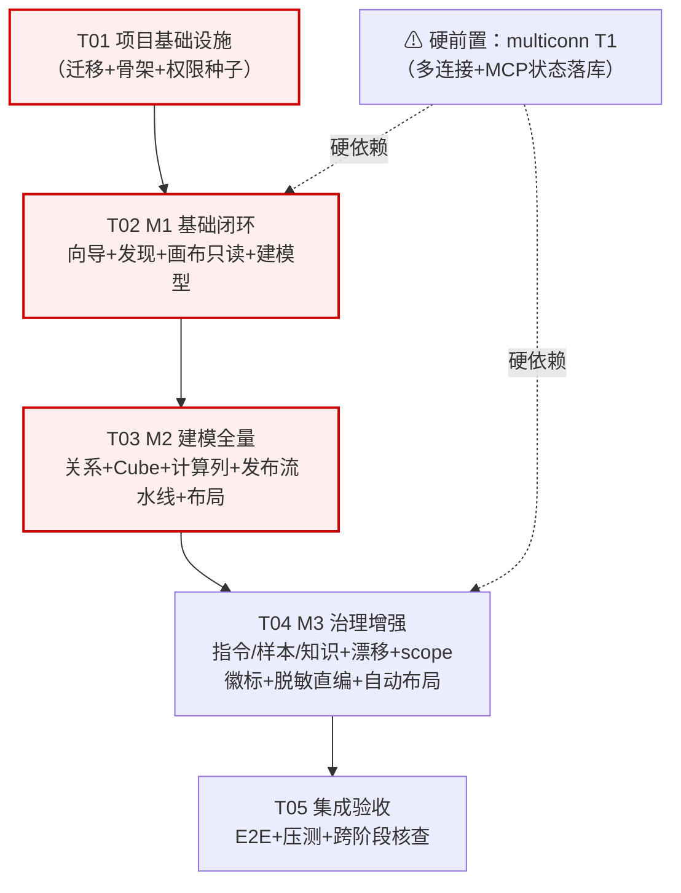

# mis-iqd 前端可视化建模台 — 任务分解（施工清单）

> 架构师：高见远（software-architect）｜ 语言：中文
> 配套设计：[`mis-iqd-modeling-system-design.md`](mis-iqd-modeling-system-design.md)（架构结论 / Q1-Q8 裁决 / 数据结构 / 流程 / 依赖包 / 共享知识 / 待明确事项 A-01~A-15）
> 配套输入：[`mis-iqd-modeling-prd.md`](mis-iqd-modeling-prd.md)（PM 增量 PRD）
> 阶段对齐：M1 基础闭环 / M2 建模全量 / M3 治理增强（PRD §7）
> 状态：🔴 已拍板（提交主理人汇总）｜日期：2026-08-30

---

## 0. 任务总览图（critical path）



**critical path**：`T01 → T02 → T03 → T04 → T05`（关键路径，无冗余依赖）。

**硬依赖**：
- **multiconn T1**（多连接 + MCP 状态落库，per-connection 自愈范围重定）：**T02/T04 硬前置**；若 multiconn 延期，T02 降级为「单连接建模」（连接向导暂留单条形态，画布/建模不阻塞，前端在路由层阻断 per-connection MCP 状态卡与 per-connection 自愈按钮；详见 system-design §1.1 Q8 与本档 §5.2）。

---

## 1. 任务总览表

| ID | 标题 | 阶段 | 模块 | 前置依赖 | 工作量（人日） | 验收对应 MR | 涉及文件类型 |
|---|---|---|---|---|---|---|---|
| **T01** | 项目基础设施（M1 迁移 + 依赖 + 权限种子 + 后端骨架） | M1 | frontend / backend（BFF+mis-iqd）/ worker（Python） / migrator / seeds | 无 | **5.0** | MR-S1（页面壳/导航）、MR-S3（权限码）、Q2（前端目录迁移） | 配置 + 入口 + 骨架 + Flyway V8y + wire stub |
| **T02** | M1 基础闭环（向导 + 表发现 + 画布只读 + 建模型 + 单连接 Gold Path） | M1 | frontend + worker + mis-iqd | T01，**multiconn T1** | **12.0** | MR-01（连接向导+MCP状态卡）、MR-02（表发现+导入）、MR-03（模型创建，from-table 路径）、MR-14（画布只读壳）、MR-S2（model/from-table 端点族） | 4 后端 + 7 前端组件 + 1 wire + 1 store + 1 query-keys |
| **T03** | M2 建模全量（关系 + Cube + 计算列 + 发布流水线可视化 + 布局持久化） | M2 | frontend + mis-iqd + worker | T02 | **14.0** | MR-04（计算列）、MR-05（关系可视化）、MR-06（Cube 编辑器）、MR-10（发布流水线）、MR-S2 余下三个端点（model/relationship/cube）、MR-S4（layout 存储） | 3 后端 + 7 前端组件 + 1 hook + 1 store |
| **T04** | M3 治理增强（指令/样本对/知识增强 + 漂移详情 + scope 维度徽标 + 脱敏直编 + 自动布局） | M3 | frontend + worker | T03，**multiconn §6（per-connection 自愈）** | **11.0** | MR-07（指令增强）、MR-08（样本对编辑器升级）、MR-09（字段描述直编 + 知识关联裁剪）、MR-11（漂移详情）、MR-12（scope 行级维度徽标）、MR-13（脱敏直编）、MR-S4（自动布局按钮） | 1 后端 stub + 6 前端组件增强 + 1 共享 e 点 |
| **T05** | 集成验收（黄金用例 E2E + 性能压测 + 跨阶段一致性核查） | M3 末 | QA + 全栈 | T04 | **4.0** | 6 黄金用例（M-G1~M-G6）+ 跨阶段不变项核查（§4） | test 文件 + README + 验证报告 |

**工作量合计**：5 + 12 + 14 + 11 + 4 = **46.0 人日** ≈ 9.2 周（按 1 人 5 工作日/周）

---

## 2. 任务详细条目

### T01 — 项目基础设施 ｜ M1 ｜ 前置：无 ｜ 工作量：5.0 人日 ｜ 优先级：P0

**范围**（最小化，聚焦基础设施；不实现任何业务端点）：
1. **前端目录迁移**（Q2=是）：将既有 `src/features/agent/ai/iqd/`（7 页面 + 4 组件）git mv 到 `src/features/agent/iqd/`，更新所有 `import` 引用，更新 `features/agent/pages.ts` 桶导出（导出符号名零变，差异在桶文件用 `as` 吸收）；不删旧目录痕迹，等 build 通过再 `git rm`。
2. **依赖安装**：`npm install @xyflow/react@^12.3.0 @codemirror/state@^6.4.0 @codemirror/view@^6.30.0 @codemirror/lang-sql@^6.8.0 @codemirror/language@^6.10.0 @codemirror/commands@^6.5.0 @dagrejs/dagre@^1.1.4`；`package.json` 落依赖。
3. **icon 登记**：在 `src/lib/nav/icons.ts` 的 `ICON_MAP` 登记 `Workflow` / `GitBranchPlus` / `Calculator` / `Layers`（lucide 既有导入），避免静默回退 LayoutDashboard。
4. **导航注册（四处同改①②）**：
   - `lib/nav/iqd-nav.ts` 追加 `{kind:'leaf', path:'/iqd/modeling', title:'可视化建模台', icon:'Workflow'}`，注释权限码 `iqd:modeling:view`
   - `components/layout/keep-alive-outlet.tsx` 的 `PAGE_MAP` 追加 `/iqd/modeling` → 懒加载 `IqdModelingPage`
   - `features/agent/iqd/pages.ts` 桶导出 `IqdModelingPage`（占位页面壳，先返回「页面建设中」空态 + PageHeader）
5. **V8y Flyway 迁移**：
   - 新建 `backend/mis-migrator/src/main/resources/db/migration/V8y__iqd_modeling_seed.sql`
   - ① 建表 `iqd_model_layout`（DDL 见 system-design §4.4）
   - ② `sys_menu` 1 条（path `/iqd/modeling`，icon `Workflow`，id=92600）
   - ③ `sys_api` 12 条（8 建模台端点 + 4 内部端点，见 system-design §3.3，ids 92601-92612）
   - ④ `sys_menu_api` 绑定 12 条（ids 92613-92624）
   - ⑤ `sys_role_permission` 3 条（role_id=1 授予 `iqd:modeling:view` / `:edit` / `:publish`，ids 92625-92627）
   - ⑥ 固定 ID + `WHERE NOT EXISTS`（V81/V82 范式）
6. **后端骨架（无业务逻辑）**：
   - `backend/mis-iqd/.../domain/service/IqdCatalogNodeService.java`：定义接口（5 个 `createXxx` 方法签名 + `validateExpression` + `listDependents`），所有方法体抛 `UnsupportedOperationException("T02 实现")`
   - `backend/mis-iqd/.../domain/service/IqdModelLayoutService.java`：3 个方法同上
   - `backend/mis-iqd/.../api/controller/IqdModelingController.java`：8 个端点 stub（仅 return 503 + trace_id），声明 `@PreAuthorize`
   - `backend/mis-iqd/.../domain/repository/IqdModelLayoutRepository.java`：JPA Repository
7. **BFF 骨架**：
   - `backend/mis-admin-bff/.../client/IqdModelingClient.java`：12 个方法 stub（仅调下游 mis-iqd，未实现先抛 NotImplemented）
   - `backend/mis-admin-bff/.../client/AiPlatformDiscoveryClient.java`：4 个 discovery 端点 stub（Python 侧）
   - `backend/mis-admin-bff/.../controller/IqdModelingController.java`：8 端点转发（透传 status）
   - `backend/mis-admin-bff/.../config/IqdProperties.java`：追加 `modelingViewPermission`/`modelingEditPermission`/`modelingPublishPermission` 三个属性
8. **Worker（Python）骨架**：
   - `agent/ai-platform/backend/src/api/routes/iqd_discovery.py`：4 个 discovery 端点 stub
   - `agent/ai-platform/backend/src/agent/mis_iqd/discovery_service.py`：类骨架 + 方法签名
   - `agent/ai-platform/backend/src/main.py`：include `iqd_discovery` 路由
9. **前端基础设施**：
   - `src/features/agent/iqd/types/modeling.ts`：类型 `IqdModelingCreateResponse` / `IqdCatalogSyncStatus` / `IqdModelLayoutDTO` / `LayoutNode` / `LayoutEdge` / `CreateModelFromTableRequest` / `CreateRelationshipRequest` / `CreateCubeRequest` / `Measure` / `Dimension` / `IqdDependents` / `Dependent` / `Connection` / `DiscoverySchema` / `DiscoveryTable` / `DiscoveryColumn`
   - `src/features/agent/iqd/store/modeling-store.ts`：zustand `ModelingStore` 完整实现（按 system-design §5 类图），初始 `connectionId=null` / `selectedItemKey=null` / `drawer='closed'`
   - `src/features/agent/iqd/queries/iqd-keys.ts`：TanStack Query keys 集中管理
   - `src/features/agent/iqd/api/iqd-modeling.ts`：wire 层函数 stub（12 个 API 方法签名，返回 `Promise.reject(new Error('T02 实现'))`）
   - `src/features/agent/iqd/api/iqd-layout.ts`：3 个 API 函数 stub
   - `src/features/agent/iqd/api/iqd-discovery.ts`：4 个 API 函数 stub
   - `src/features/agent/iqd/components/shared/usePermission.ts`：hook 包装 `iqd:modeling:*` 三权限码（沿用既有 `PermissionGate`）
   - `src/features/agent/iqd/components/shared/useSyncStatus.ts`：5000ms 轮询 hook（沿用 `CatalogSyncStatusBar` 范式）
   - `src/features/agent/iqd/components/shared/IqdIcon.tsx`：icon 工具组件（接入 `icons.ts` 的 `ICON_MAP`）

**关键产出文件**：
- `src/features/agent/iqd/`（迁移后新目录，含 7 既有页面 + 4 既有组件 + 新建基础设施）
- `backend/mis-migrator/src/main/resources/db/migration/V8y__iqd_modeling_seed.sql`
- `backend/mis-iqd/.../{IqdCatalogNodeService,IqdModelLayoutService,IqdModelingController,IqdModelLayoutRepository}.java`
- `backend/mis-admin-bff/.../{IqdModelingController,IqdModelingClient,AiPlatformDiscoveryClient,IqdProperties}.java`
- `agent/ai-platform/backend/src/api/routes/iqd_discovery.py`
- `agent/ai-platform/backend/src/agent/mis_iqd/discovery_service.py`

**验收要点**：
1. 既有 7 页面迁移后路径全部正确（`/iqd/*` 不变），无 404
2. 新页面 `/iqd/modeling` 可访问（空态壳），nav 显示「可视化建模台」+ Workflow icon（非回退 LayoutDashboard）
3. V8y 在干净库与已有库均可幂等执行；JPA 启动 schema 校验通过
4. 后端 8 建模台端点返回 503（含 trace_id），不返回 500
5. 前端 `iqd:modeling:view/edit/publish` 三权限码已注册到 `PermissionGate` 缓存；`deny-unmapped` 下无 40300
6. `ModelingStore` 单元测试覆盖（vitest）：`setSelected` / `openDrawer` / `closeDrawer` / `markDirty` / `clearDirty` / `pushWizardStep` / `popWizardStep` / `reset`
7. `package.json` 落 6 个新依赖；`npm run build` 通过；`mvn -pl backend/mis-iqd compile` 通过
8. **代码不实现任何业务**（避免与 T02 冲突）；所有方法体 `throw new UnsupportedOperationException("T0X 实现")`

**与 MR 对应**：
- MR-S1（页面壳/导航）✅ 验收①/②/③
- MR-S3（权限码）✅ 验收⑤/⑥
- Q2（前端目录迁移）✅ 验收①
- **不实现** MR-01~14 任何业务逻辑（T02~T04 实现）

---

### T02 — M1 基础闭环（连接向导 + 表发现 + 画布只读 + 建模型） ｜ M1 ｜ 前置：T01 + multiconn T1 ｜ 工作量：12.0 人日 ｜ 优先级：P0

**范围**：实现 6 黄金用例中的 **M-G1**（向导建连接→发现导入 3 张表→生成 1 个模型→画布可见→build 写回 SYNCED→测试问数可问）的端到端闭环。

**A. 后端 + Worker（Python）**：
1. **mis-iqd `IqdCatalogNodeService.createModelFromTable`**（PRD MR-03 + MR-S2 model/from-table 端点族）：
   - 实现 `@PreAuthorize("hasAuthority('iqd:modeling:edit')")`
   - 幂等键查重 → `base_revision` 乐观并发 → `validateCatalogRefs`（引用完整性预校验）→ `@Transactional` 落 `iqd_catalog_item`（kind=model/column, source='modeling'）→ bump `current_edit_revision` → write `iqd_edit_idempotency` → publish `iqd.catalog.changed` → 触发 `triggerSyncBestEffort(scope='model', wait=false)`
   - 同步建 columns 子节点（按 source_table.columns 批量落 `kind=column`）
   - 幂等（同 source_table 重复导入返回首次结果且不 bump revision）
   - 错误码：40900（base_revision 不符）/ 42200（源表不存在）/ 40901（key 重复）
2. **mis-iqd `IqdCatalogNodeService.validateExpression`**：GET 端点，静态解析引用字段（model_item_key 范围内列存在性）
3. **mis-iqd `IqdModelingController`**：实现 `POST /catalog/model/from-table` + `GET /catalog/validate-expression` + `GET /connections` + `POST /connections` + `POST /connections/{id}/test` + `GET /catalog/sync-status`
4. **Python `IqdDiscoveryService`**：实现 4 个方法（listSchemas / listTables / listColumns / importTables），调用 `wren list-models` / `wren describe-model` CLI；`importTables` 触发 `IqdCatalogNodeService.createModelFromTable` × N
5. **Python `iqd_discovery.py` 路由**：实现 4 端点
6. **mis-iqd `IqdConnection` 增 `mcp_port`/`mcp_status`/`last_health_at`/`last_health_msg` 字段**（依赖 multiconn T1 已有实体，本任务仅消费不创建）

**B. 前端（按 system-design §3.1 文件树）**：
1. `iqd-modeling-page.tsx`：三栏壳（ModelTree 左 + ModelCanvas 中 + PropertyPanel 右），可拖拽调宽 + 折叠（A-15）；无 connection 时空态跳连接向导（A-12）
2. `components/modeling/ModelCanvas.tsx`：`@xyflow/react` `<ReactFlow>` 壳 + `<MiniMap>` + `<Controls>` + `<Background>`；只读模式（无 `iqd:modeling:edit` 时禁用拖拽）；200 节点虚拟化（`onlyRenderVisibleElements`）；性能预算 ≥55fps 拖拽
3. `components/modeling/ModelNodeCard.tsx`：模型节点卡（表名 + 字段列表默认折叠前 8 列 + PK/计算列/脱敏徽标）
4. `components/modeling/ModelTree.tsx`：左树（连接 → 表/模型/Cube 分组 + 搜索 + 「表发现导入」入口）
5. `components/modeling/PropertyPanel.tsx`：右栏骨架（字段列表 + 选中项基础信息；M2 再加编辑能力）
6. `components/wizard/ConnectionWizard.tsx`：连接向导 4 步（基本信息 → 数据源参数（凭证不回显）→ profile（仅占位，server-side 管理）→ 连通测试），多连接列表 + MCP 状态卡（依赖 multiconn T1）
7. `components/wizard/TableImportWizard.tsx`：表发现向导 4 步（选 schema → 表清单（分页/搜索/全选）→ 列预览（PK 推断高亮）→ 导入确认）
8. `components/wizard/WizardShell.tsx`：向导通用壳（步骤条 + 上一步/下一步 + 二次确认）
9. `api/iqd-modeling.ts`：实现 12 个 API（连接向导 5 个 + 模型创建 1 个 + 校验 1 个 + dependencies 1 个 + sync-status 1 个 + self-heal 3 个），替换 T01 stub
10. `api/iqd-discovery.ts`：实现 4 个 API，替换 T01 stub
11. `store/modeling-store.ts`：扩展 `wizardStep` / `wizardHistory` / 连接上下文（per connId 隔离，A-14）
12. `hooks/useCatalogNodes.ts`：派生画布 nodes/edges（selector，从 TanStack Query 缓存派生，**不持第二份真值**，Q5）
13. `iqd-config-page.tsx`（迁移后）：保留单连接形态（旧 fallback），同时跳到新 `ConnectionWizard`（多连接）—— 取决于 multiconn T1 落库是否就绪；multiconn 延期则降级
14. `iqd-catalog-page.tsx`（迁移后）：保留既有功能，叠加 MR-S2 新建节点入口（model/from-table）

**关键产出文件**：
- 后端 5 个（`IqdCatalogNodeService` / `IqdModelingController` / `IqdDiscoveryService` / `iqd_discovery.py` / connection 增字段）
- 前端 13 个（建模台主页 1 + modeling 组件 4 + wizard 组件 3 + api 2 + store 扩展 1 + hook 1 + 迁移增强 2）

**验收要点**：
1. **M-G1 E2E**：向导建连接（销售库）→ 表发现导入 3 张表（orders/customers/products）→ from-table 生成 model `orders` → 画布可见 1 model 节点 + 3 table 节点 + columns 子节点 → publish 流水线点亮 → 状态从 EDITED_UNSYNCED → SYNCING → SYNCED → 跳转 `/iqd/test-chat` 问「上月订单数」可答
2. 表发现向导空连接时显示空态引导（跳 `/iqd/config` 连接向导）
3. 重复导入相同 source_table（幂等）返回首次结果不 bump revision
4. 引用校验：尝试 from-table 一张不存在的表 → 42200
5. 乐观并发：客户端持过期 base_revision 提交 → 40900 + current_edit_revision
6. 画布 200 节点拖拽 ≥55fps（Chrome DevTools Performance）
7. 连接向导不回显凭证明文（沿用既有 `IqdConfigPage` 范式）
8. 多连接列表 + MCP 状态卡可显示 `mcp_port` / `mcp_status` / `last_health_at`（依赖 multiconn T1；若 multiconn 延期，则降级为单连接形态，本验收项后置）
9. 启动/停止/重启 MCP 按钮带二次确认（Q5 multiconn）

**与 MR 对应**：
- MR-01 ✅（连接向导 + MCP 状态卡，依赖 multiconn）
- MR-02 ✅（表发现 + 导入）
- MR-03 ✅（模型创建，from-table 路径）
- MR-14 ✅（画布只读壳）
- MR-S1 ✅（已 T01 落地，T02 补全三栏壳）
- MR-S2 ✅（model/from-table 端点族，T02 仅落地 model 部分；relationship/cube 推到 T03）
- MR-S3 ✅（已 T01 落地权限码，T02 业务侧使用）
- **不实现**：MR-04/05/06/07/08/09/10/11/12/13（推到 T03/T04）

**multiconn 延期降级**（risk B）：
- T02 主线任务**不阻塞**（连接向导暂留单条形态 + 画布仍可建模型）
- multiconn T1 就绪后再补「多连接列表 + MCP 状态卡」（独立小任务，不计本任务工作量）

---

### T03 — M2 建模全量（关系 + Cube + 计算列 + 发布流水线可视化 + 布局持久化） ｜ M2 ｜ 前置：T02 ｜ 工作量：14.0 人日 ｜ 优先级：P0

**范围**：实现 6 黄金用例中的 **M-G2**（画布连线建 orders-customers 关系→建 Cube（含 1 measure）→问数「上月客单价」命中 Cube 聚合）与 **M-G3**（build 人为失败→流水线定位失败段→重试成功）。

**A. 后端 + Worker（Python）**：
1. **mis-iqd `IqdCatalogNodeService`**：实现余下 4 个方法：
   - `createModel(connId, modelKey, patch, baseRev, idemKey)`：blank 模型创建
   - `createRelationship(connId, itemKey, patch, baseRev, idemKey)`：建关系，校验源/目标字段存在性 + 引用被引用阻断
   - `createCube(connId, itemKey, patch, baseRev, idemKey)`：建 cube + measures + dimensions 子节点，校验 `model_ref` + measure expression 引用字段存在性 + 删除被引用 cube 阻断（沿用二/四期 `validateCatalogRefs`）
   - `createCalculatedColumn(connId, modelKey, columnName, expression, baseRev, idemKey)`：建计算列，校验 expression 引用本模型字段；落 `kind=column, parent_key=<model>, expression=<expr>`
2. **mis-iqd `IqdModelingController`**：实现 5 个端点（`POST /catalog/model` / `POST /relationships` / `POST /cubes` / `POST /calculated-columns` / `GET /dependencies`）
3. **mis-iqd `IqdModelLayoutService`**：实现 3 个方法（`get` / `save` / `autoLayout`）；`autoLayout` 跑 dagre 算法（备选方案：前端跑，后端不实现 `autoLayout` 仅返回 501，详见 A-02）
4. **mis-iqd `IqdModelingController`**：实现 layout 端点（`GET/PUT /modeling/layout/{connId}` + `POST /modeling/layout/{connId}/auto-layout`）
5. **Python `build_mdl_from_catalog` 复核**（b 点，PRD §5.2）：实测 cubes/measures/dimensions 派生完整性，缺则打最小补丁（补丁工作量预估 0.5 人日已含）

**B. 前端**：
1. `components/modeling/ModelEditDrawer.tsx`：模型编辑抽屉（PK / `is_time_dimension` / `is_email` / `ref_sql`（CodeMirror 编辑器，懒加载）/ 保存前校验）
2. `components/modeling/CalculatedColumnEditor.tsx`：计算列编辑器（CodeMirror + 字段下拉插入 + 引用校验）
3. `components/modeling/RelationshipDialog.tsx`：关系弹窗（join 类型下拉 + cardinality 下拉 + condition CodeMirror + 引用预览）
4. `components/modeling/CubeEditor.tsx`：Cube 编辑器（measures 列表 + dimensions 列表 + 依赖提示区（`IqdDependents`））
5. `components/modeling/MeasureDimensionList.tsx`：Cube 子组件
6. `components/modeling/RelationEdge.tsx`：关系边（join 类型/基数编码 + 拖拽创建连线入口）
7. `components/modeling/PublishPipelineBar.tsx`：发布流水线条（整合既有 `CatalogSyncStatusBar` + `SelfHealPanel`，**per-connection 化沿用 multiconn §6**，五段进度：编辑落库 → MDL build → memory index → MCP 就绪）
8. `components/modeling/AutoLayoutButton.tsx`：dagre 一键整理按钮（前端跑 dagre）
9. `hooks/useCodeMirror.ts`：CodeMirror 6 React hook（懒加载 + SQL 高亮 + 字段补全）
10. `hooks/useDirtyState.ts`：脏标记 hook（draft vs server）
11. `store/modeling-store.ts`：扩展 `dirtyDrafts` / `isPublishing`（与 T02 的 wizard step 解耦）

**关键产出文件**：
- 后端 4 个（`IqdCatalogNodeService` 4 方法 + `IqdModelLayoutService` 3 方法 + Controller 5 端点 + Python 复核）
- 前端 11 个（组件 7 + hook 2 + store 扩展 1 + 复核点 1）

**验收要点**：
1. **M-G2 E2E**：画布拖拽连线 orders→customers → 弹 `RelationshipDialog` → 选 INNER 1:N condition → 保存 → 画布显示关系边 → 建 Cube `revenue` 挂 orders（measure: SUM(amount), dimension: store_id）→ 保存 → 流水线点亮 → test-chat 问「上月客单价」命中 cube 聚合（query_cube 通道）
2. **M-G3 E2E**：人为让 build 失败（如 expression 引用不存在字段后编辑该字段再 build）→ 流水线定位「MDL build」段红色 + 「重试」按钮 → 修正字段后重试 → SYNCED
3. 删除被引用 cube → 422 + dependents 列表（沿用二/四期 P0-2）
4. 计算列 expression 引用不存在字段 → 42201（保存前阻断）
5. 计算列表达式保存后写入 `iqd_catalog_item.expression` 字段，问数可按其聚合/过滤
6. layout 持久化：拖拽节点 → 刷新页面 → 布局恢复
7. 自动布局按钮：点击后 dagre 一键整理（200 节点 ≤2s）
8. 发布流水线 5 段进度逐段点亮/失败定位；强制重建二次确认后才发起（沿用二/四期 selfheal 范式）
9. `SelfHealPanel` per-connection 化（依赖 multiconn §6）

**与 MR 对应**：
- MR-04 ✅（计算列）
- MR-05 ✅（关系可视化）
- MR-06 ✅（Cube 编辑器，b 点实测确认）
- MR-10 ✅（发布流水线，整合 selfheal）
- MR-S2 ✅（补齐余下 4 个端点：model blank/relationship/cube/calculated-column）
- MR-S4 ✅（layout 存储）
- **不实现**：MR-07/08/09/11/12/13（推到 T04）

---

### T04 — M3 治理增强（指令/样本/知识 + 漂移详情 + scope 维度徽标 + 脱敏直编 + 自动布局按钮挂主页） ｜ M3 ｜ 前置：T03 + multiconn §6 ｜ 工作量：11.0 人日 ｜ 优先级：P0

**范围**：实现 6 黄金用例中的 **M-G4**（漂移注入→详情面板→重新导入收敛）、**M-G5**（字段侧栏改描述/脱敏→问数结果同步生效）、**M-G6**（scope 页行级维度徽标 + 谓词预览正确）。

**A. 后端 + Worker**：
1. **mis-iqd `iqd_knowledge.content`** 应用层校验扩展允许内嵌 `related_item_keys: [item_key]`（e 点，V8y 不新增列，**应用层校验即可**，A-06）
2. **ai-platform `IqdAskService.push_enhancements`** 增强：按 `related_item_keys` 裁剪下发到 WrenAI `instructions`（仅携带当前 model/cube 相关的条目）
3. **mis-iqd `IqdModelingController`**：新增 `PUT /mask/affected` 复用 mask API（A-01 决定不新增端口，复用既有 `PUT /mask-rules`）

**B. 前端**：
1. `iqd-instruction-page.tsx`（迁移后）：增强 instruction 编辑器，content 区支持 `@` 插入 item_key 下拉（数据源 = `useQuery(['iqd','catalog',connId])` 实时校验）；新增「关联对象」多选下拉；下发前展示「将推送条数 + 上次下发状态」（MR-07）
2. `iqd-enhance-page.tsx`（迁移后）：样本对 Tab SQL 编辑框升级为 CodeMirror 6（MR-08）；知识 Tab 增加「关联对象」列（MR-09）；S-07 导入按钮状态化（未就绪置灰 + tooltip）
3. `components/modeling/PropertyPanel.tsx`：字段列表 + 业务描述直编（写 `iqd_catalog_item.description`，同一数据源同闭环，MR-09）；字段脱敏直编（`sensitive_level` / `mask_rule` 五类下拉 + custom，MR-13）；依赖方提示区（`IqdDependents`）
4. `components/modeling/DriftDetailPanel.tsx`：漂移详情面板（MR-11，平台 `current/built edit_revision` vs WrenAI `mdl_hash` + 最近对账时间 + 差异对象清单 + 「重新导入」入口跳既有 `syncCatalogFromMdl` 比对合并界面）
5. `iqd-scope-page.tsx`（迁移后）：行级维度可视化展示（MR-12，某表 row_scope 以维度徽标形式展示 deopt/store 双维度 AND 叠加；点击展开按维度/策略形态展示注入谓词预览（PATH_PREFIX/ENUM）+ 模拟角色 WHERE 片段）
6. `iqd-modeling-page.tsx`：顶部挂载 `AutoLayoutButton`（M3 末才需要，T03 已实现按钮本体）

**关键产出文件**：
- 后端 3 个（knowledge 字段应用校验 + push_enhancements 裁剪 + mask API 复用）
- 前端 6 个（iqd-instruction-page 增强 + iqd-enhance-page 增强 + PropertyPanel 增强 + DriftDetailPanel + iqd-scope-page 增强 + iqd-modeling-page 增强）

**验收要点**：
1. **M-G4 E2E**：模拟 WrenAI 被外部直改（绕过平台，测试态注入 `stale_drift=true`）→ 建模台顶部橙标「检测到外部漂移」+ `DriftDetailPanel` 展开 → 「重新导入」进入比对合并界面 → 人工选择保留哪边 → 收敛为 SYNCED，强制重建按钮在漂移期间置灰（fail-closed）
2. **M-G5 E2E**：PropertyPanel 改字段 `description` → catalog 页同步 + 问数结果即时生效（≤10s Worker 缓存刷新）→ PropertyPanel 设 `sensitive_level=phone` → 问数结果 `138****0000` 脱敏
3. **M-G6 E2E**：scope 页某表配 row_scope dept+store 双维度 → 维度徽标正确显示 → 展开可见 `dept_path LIKE '/0/1/A/%'`（PATH_PREFIX）+ `store_id IN ('S001','S002')`（ENUM）AND 拼接 + 模拟角色 WHERE 片段预览正确
4. 指令页 `@` 插入 item_key 下拉仅展示当前连接 catalog 内的 key；关联 model 的指令不出现在其他模型上下文
6. 样本对 CodeMirror 6 升级不影响 v1.10「DB 类型下拉 → 转化 → 试运行 → 保存」交互
7. S-07 导入按钮未就绪时置灰 + tooltip

**与 MR 对应**：
- MR-07 ✅（指令增强）
- MR-08 ✅（样本对编辑器升级）
- MR-09 ✅（字段描述直编 + 知识关联裁剪）
- MR-11 ✅（漂移详情）
- MR-12 ✅（scope 行级维度徽标 + 谓词预览）
- MR-13 ✅（脱敏直编）

---

### T05 — 集成验收（黄金用例 E2E + 性能压测 + 跨阶段一致性核查） ｜ M3 末 ｜ 前置：T04 ｜ 工作量：4.0 人日 ｜ 优先级：P0

**范围**：6 黄金用例 E2E（端到端测试）+ 性能压测 + 跨阶段不变项核查（§4）。

**A. 黄金用例 E2E（6 个）**：
1. **M-G1**：向导建连接→发现导入 3 张表→生成 1 个模型→画布可见→build 写回 SYNCED→测试问数可问（T02 自动化用例）
2. **M-G2**：画布连线建 orders-customers 关系→建 Cube（含 1 measure）→问数「上月客单价」命中 Cube 聚合（T03 自动化用例）
3. **M-G3**：build 人为失败→流水线定位失败段→重试成功（T03 自动化用例）
4. **M-G4**：漂移注入→详情面板→重新导入收敛（T04 自动化用例）
5. **M-G5**：字段侧栏改描述/脱敏→问数结果同步生效（T04 自动化用例）
6. **M-G6**：scope 页行级维度徽标 + 谓词预览正确（T04 自动化用例）

**B. 性能压测**：
1. 画布 200 节点拖拽 ≥55fps（Chrome DevTools Performance 抓取）
2. 画布 500 节点「无关系表折叠」触发后 ≤1s 完成折叠渲染
3. CodeMirror 6 懒加载后 `npm run build` 的 vendor chunk 不超过 300KB gzip
4. 自动布局 dagre 200 节点 ≤2s / 500 节点 ≤5s
5. build_mdl_from_catalog（200 节点含 50 关系 + 10 cube）≤10s
6. TanStack Query 缓存命中后画布首屏 ≤500ms

**C. 跨阶段不变项核查（§4 清单）**：
1. 四处同改齐：侧栏「可视化建模台」可见（icon 正确）/`PAGE_MAP` 准确/router 核查/V8y 种子
2. icon 登记（`icons.ts`）无静默回退
3. 权限码登记（`iqd:modeling:*` 三码）齐 + `deny-unmapped` 下无 40300
4. idempotency key 模板按 §8.4 格式；后端查重命中格式正确
5. seed ID 段位：V8y sys_menu=92600，sys_api=92601-92612，sys_menu_api=92613-92624，sys_role_permission=92625-92627；与 V69/V73/V77/V82 不冲突
6. 命名边界：所有 `iqd_*` 表/`features/agent/iqd/`/`iqd:*` 权限码/`iqd_mdl_*`（建模台端点路径前缀）无 `wren*` 混用

**D. 文档与 README**：
1. `docs/ai-fusion/wrenai/mis-iqd-modeling-verify-checklist.md`（仿 W0-W4 既有范式）：本任务输出
2. `docs/ai-fusion/wrenai/mis-iqd-modeling-runbook.md`（运维 runbook，仿 selfheal 范式）：启停/重建/重导入/索引/清理操作步骤
3. README 更新：`frontend/mis-admin-web/src/features/agent/iqd/README.md`（组件索引 + 状态机图）

**关键产出文件**：
- 测试文件（≥6 E2E + 6 性能 + 跨阶段核查清单）
- 文档 3 份（verify-checklist + runbook + README）

**验收要点**：
1. 6 黄金用例全部通过 CI（自动化用例可重复执行）
2. 性能预算达标（画布 / CodeMirror / build / dagre / 首屏）
3. 跨阶段不变项核查 6 项全通过（不留 TODO）
4. verify-checklist + runbook 文档交付

---

## 3. 关键路径

**critical path**：`T01 → T02 → T03 → T04 → T05`

```mermaid
gantt
    title mis-iqd 建模台 critical path
    dateFormat YYYY-MM-DD
    axisFormat %m/%d

    section M1 基础
    T01 基础设施                :t01, 2026-09-01, 5d
    multiconn T1（硬前置）        :crit, mcp1, 2026-09-01, 8d
    T02 M1 基础闭环              :t02, after t01, 12d

    section M2 建模全量
    T03 M2 建模全量              :t03, after t02, 14d

    section M3 治理增强
    multiconn §6（per-connection 自愈）：crit, mcp6, after mcp1, 5d
    T04 M3 治理增强              :t04, after t03, 11d
    T05 集成验收                 :t05, after t04, 4d
```

**资源瓶颈**：
- **multiconn T1**（硬前置）：T02 开工条件；若延期 ≥3 个工作日，T02 降级为「单连接建模」（详见 §5.2）。
- **multiconn §6**（per-connection 自愈）：T04 中段开工条件；T04 上半段（指令/样本对/知识 + 漂移详情 + scope 徽标 + 脱敏直编）不依赖 §6，可与 §6 并行。

**关键资源**：建模台前后端工程师 ≥2 人（前端画布 + 后端 service）全期投入；Worker（Python）工程师 T01 + T02 + T03 中段复核 b 点 + T04 接入需求约 4 人日；QA T05 集中 4 人日。

---

## 4. 跨阶段不变项（贯穿 M1/M2/M3 的工程纪律）

### 4.1 「四处同改」清单（凡新增建模台页面/端点必走）

1. **导航** `lib/nav/iqd-nav.ts`：追加 leaf
2. **PAGE_MAP** `components/layout/keep-alive-outlet.tsx`：精确路径 → 组件
3. **router 核查** `app/router.tsx`：通常零改动（`/iqd/*` 已整体登记）
4. **icon 登记** `lib/nav/icons.ts`：ICON_MAP 追加新 icon（漏登记会静默回退 LayoutDashboard）
5. **V8y 种子** `backend/mis-migrator/.../V8y__iqd_modeling_seed.sql`：sys_menu + sys_api + sys_menu_api + sys_role_permission

### 4.2 icon 登记清单（T01 一次性完成，后续 T02~T04 复用）

| icon 名（ICON_MAP key） | lucide 名 | 用途 |
|---|---|---|
| `Workflow` | `Workflow` | 建模台主页 nav |
| `GitBranchPlus` | `GitBranchPlus` | 关系弹窗按钮 |
| `Calculator` | `Calculator` | Cube 编辑器入口 |
| `Layers` | `Layers` | 模型树分组 |
| `Database` | `Database`（已有） | 复用既有 |

### 4.3 权限码登记（V8y 一次性落，T02~T04 仅消费）

| 权限码 | 含义 | 授予 | 前端 | 后端 |
|---|---|---|---|---|
| `iqd:modeling:view` | 画布只读 / 列表 / 详情可见 | role_id=1 | `PermissionGate` | `@PreAuthorize("hasAuthority('iqd:modeling:view')")` |
| `iqd:modeling:edit` | 画布编辑 / 新建模型/关系/Cube / 计算列 / 字段描述直编 / 脱敏直编 | role_id=1 | `PermissionGate` | `@PreAuthorize("hasAuthority('iqd:modeling:edit')")` |
| `iqd:modeling:publish` | 触发构建/强制重建/重新索引/模型校验 | role_id=1 | `PermissionGate` | `@PreAuthorize("hasAuthority('iqd:modeling:publish')")` |

### 4.4 idempotency key 模板

```
幂等 key 模板（前端 crypto.randomUUID()）：
  {connId}:{kind}:{action}:{uuid}

后端存储：iqd_edit_idempotency（connection_id, idempotency_key）→ edit_revision
查重语义：同 key 命中 → 返回首次结果，不二次 bump
```

### 4.5 seed ID 段规划（V8y）

| ID 段 | 用途 | 已用段（避让） | V8y 建议段 |
|---|---|---|---|
| sys_menu | 页面菜单 | V19/V50/V51/V61/V69/V73/V77/V82 已用 92031-92176/92310-92320/9250x | **92600** |
| sys_api | 端点 | V19/V50/V51/V61/V69/V73/V77/V82 已用 92031-92576 等 | **92601-92612**（建模台 12 端点） |
| sys_menu_api | 菜单-端点绑定 | 同上 | **92613-92624** |
| sys_role_permission | 角色-权限 | 同上 | **92625-92627**（3 权限码） |

### 4.6 避让已用段（V69/V73/V77/V82）

V69：92031-92076（基线 iqd 权限码 + 菜单）
V73：92310-92320（W2 问数管理）
V77：92540-92570（独立门户 App）
V82：92580-92599（自愈 + sync_job.action）

**V8y 用 92600-92699** 段，全部空闲，无冲突。

### 4.7 命名边界（沿用 v1.9 §1.5/§3.3，不重做）

- 平台问数业务域 → `iqd`
- 对接外部 WrenAI → 保留 `wren`
- 项目 `mis-iqd` / 表 `iqd_*` / API `/api/v1/iqd/**` / 权限码 `iqd:*` / 前端 `features/agent/iqd/` / Java `backend/mis-iqd` / Python `agent/mis_iqd`

### 4.8 不变量（必须维持，跨阶段）

- **编辑权威闭环**：建模台一切编辑落 `iqd_catalog_item`（`source='modeling'`）→ 既有 `SyncCoordinator` 合并窗口 → 整连接 `build_mdl_from_catalog` → 不直写 MDL 文件
- **核心不变量**：`iqd_connection.built_edit_revision == WrenAI.built_mdl_hash` 代表的模型版本；偏离即单边情况，由 `STALE_DRIFT` + 对账清扫收敛
- **fail-closed**：漂移期间强制重建置灰；删除被引用 cube 422 阻断；并发 409 可重读重试；写回失败可重试不回滚
- **权限五件套**：BFF `iqd:*`（L1）+ Worker 表 ACL 二次裁定 + 行级维度（dept+store 双维度）+ 脱敏（`masking.py` 唯一出口）+ 审计

---

## 5. 风险与回退

### 5.1 风险总览

| ID | 风险 | 影响阶段 | 概率 | 严重度 | 回退方案 |
|---|---|---|---|---|---|
| **R-1** | multiconn T1（多连接 + MCP 状态落库）延期 | T02 | 中 | 高 | 见 §5.2 降级路径 |
| **R-2** | multiconn §6（per-connection 自愈）延期 | T04 | 中 | 中 | 见 §5.3 降级路径 |
| **R-3** | build_mdl_from_catalog（b 点实测）发现 cubes/measures/dimensions 派生不完整 | T03 | 低 | 中 | 打最小补丁（0.5 人日）；若补丁超 1 人日则该 MR 推到 M3.1 |
| **R-4** | @xyflow/react 与既有 Vite 生态版本冲突（如 React 18.2 vs React 18.3） | T01 | 低 | 低 | 钉 `@xyflow/react@^12.3.0` 精确版本；冲突时回退 `^12.2.0`；极端时自研 SVG（估 2~3 倍工作量） |
| **R-5** | CodeMirror 6 与 Vite 5 兼容问题（动态 import 失败） | T01~T03 | 低 | 中 | 改为静态 import（不懒加载，~120KB 进主 chunk）；或不懒加载 SQL 编辑器所在 Drawer（首屏不影响） |
| **R-6** | 性能预算不达标（200 节点 < 55fps 或 build > 10s） | T02~T05 | 中 | 高 | ① 画布加 `onlyRenderVisibleElements=true`；② 缩放/拖拽降级为 30fps；③ build 分批（米级并发） → 不可达时把画布规模上限降到 100 节点 |
| **R-7** | 命名边界与既有一期/二/四期代码路径冲突（import 错误） | T01 | 中 | 中 | git mv 后逐文件 `grep` 检查 import；`tsc --noEmit` 全量校验；CI 加导入路径 lint 规则 |
| **R-8** | 多连接下「表发现」向导状态跨连接串扰 | T02 | 低 | 中 | zustand store 按 connId 隔离（A-14 已规划）；T02 自动化用例覆盖 |
| **R-9** | 「重新导入」草稿比对合并界面（MR-11）二期 P1-3 未完全就绪 | T04 | 中 | 中 | 沿用二/四期既有 `syncCatalogFromMdl` 流程；不复制流程；只做入口跳转 |
| **R-10** | multiconn 端口段用尽（18080-18180） | T02 | 低 | 高 | 一期预估连接数 ≤20；端口段扩容到 18080-18280（仅修改 multiconn 配置） |

### 5.2 R-1 回退：multiconn T1 延期 → M1 降级为「单连接建模」

**降级形态**：
1. **T02 仍开工**（不阻塞）
2. **连接向导 `ConnectionWizard.tsx`**：暂留单条形态（沿用既有 `iqd-config-page` 的表单样式），不做多连接列表；不挂 MCP 状态卡
3. **`McpStatusCard`**：T02 不实现，放到 multiconn 就绪后的独立小任务
4. **`iqd-config-page.tsx`**：保留单连接形态 + 跳到 `ConnectionWizard` 入口
5. **画布 `ModelCanvas.tsx`**：按 connId 单连接维度（无 per-connection 切换）
7. **路由层**：建模台主页不展示 per-connection 切换器（仅 1 个连接）
8. **发布流水线 `PublishPipelineBar`**：T03 实现时不按 per-connection 拆分（沿用 selfheal 全局动作）

**回退条件**：multiconn T1 延期 ≥3 个工作日启动 T02。

**回退成本**：MCP 状态卡 + per-connection 启停按钮后置到独立小任务（约 2 人日，multiconn 就绪后立即补）。

### 5.3 R-2 回退：multiconn §6 延期 → T04 per-connection 自愈降级

**降级形态**：
1. **T04 上半段仍开工**（指令/样本对/知识 + 漂移详情 + scope 徽标 + 脱敏直编不依赖 §6）
2. **`PublishPipelineBar` 的 selfheal 按钮**：T03 集成 `SelfHealPanel` 时沿用既有 selfheal 全局动作（沿用二/四期 selfheal PRD Q4 结论），不按 connId 拆分
3. **T04 末段 per-connection 化**：multiconn §6 就绪后补（约 1 人日小任务）

**回退条件**：multiconn §6 延期 ≥5 个工作日启动 T04 末段。

### 5.4 R-3 回退：build_mdl_from_catalog 派生不完整 → 最小补丁

**降级形态**：
1. T03 中段 Python 工程师实测 `build_mdl_from_catalog` 派生的 MDL 是否包含 cubes/measures/dimensions
2. **若已包含**：不补丁
3. **若不完整**：打补丁 `service.py: build_mdl_from_catalog`，新增 `parse_measures` / `parse_dimensions` 函数（约 0.5 人日）
4. **若补丁超 1 人日**：MR-06（Cube 编辑器可视化）推到 M3.1，仅做基础 Cube 节点落库，不做 measure/dimension 嵌套编辑

### 5.5 R-6 回退：性能预算不达标 → 缩规模上限 + 性能优化

**降级形态**：
1. **画布**：加 `onlyRenderVisibleElements=true`（React Flow 默认开启）；缩放/拖拽降级为 30fps（性能预算 +25ms/帧）
2. **节点规模上限**：从 200 → 100（MR-14 验收口径调整）
3. **build**：分批（米级并发，每次 50 节点）；超 50ms 可接受时把 build 改为异步不阻塞 UI
4. **CodeMirror**：去掉字段补全（仅保留高亮）；chunk 体积减半

**回退条件**：T05 性能压测任意一项不达标。

### 5.6 R-7 回退：命名边界冲突 → import 修复 + lint 规则

**降级形态**：
1. T01 git mv 后全仓 `grep -r "features/agent/ai/iqd"` 检查 import
2. `tsc --noEmit` 全量校验
3. CI 加 lint 规则：`import/no-restricted-paths` 禁止 `features/agent/ai/**` 反向引用 `features/agent/iqd/**`
4. 极端冲突时回退 git mv（不迁移，仅追加 `features/agent/iqd/` 新目录，迁移放到独立分支）

---

## 6. 与既有 tasks.md 的关系（不重不漏）

### 6.1 建模台 PRD 复用既有任务（**不再派工**，仅消费）

| 既有任务（tasks.md v1.9） | 状态 | 建模台消费方式 |
|---|---|---|
| T-W1-01（mis-iqd 模块骨架） | 已完成 | T01 不再重复派工「建 iqd 模块」，仅派工「新建 service/controller 类」 |
| T-W1-02（对接配置 + 桥接 + 用户端打通） | 已完成 | T01 不再重复派工「IqdController 端点」 |
| T-W2-01（清单 + 范围 + ACL） | 已完成 | T02/T03 不再重复派工「catalog/scope 页面」基础（既有 7 页面已落地） |
| T-W2-02a/b（行级数据范围） | 已完成 | T04 MR-12 行级维度徽标 = 既有功能前端呈现增强，**不重复派工行级范围后端** |
| T-W3-01（后台测试对话 + 完整计划 + 审计） | 已完成 | T02/T03 不再重复派工「test-chat 页 + plan timeline」 |
| T-W4-01（增强物料 + 引用 + 步骤 + 脱敏） | 已完成 | T04 MR-09 业务描述直编 = 既有 `PUT /catalog/node` 增强，**不重复派工 description 字段后端** |

### 6.2 增量编辑（二/四期）已规划任务（建模台不重排，仅消费）

| 二/四期任务 | 状态 | 建模台消费方式 |
|---|---|---|
| `edit-prd.md` P0-1~12 + U1~U8 | 已派工 + 已落地 | T01~T03 不再派工「`PUT /catalog/node`」+「`validateCatalogRefs`」+「`edit_revision` 乐观并发」+「`idempotency_key`」+「同步状态机」+「整库 build」+「引用完整性校验」+「STALE_DRIFT」+「`mdl_writeback_enabled`」 |
| `edit-design.md` T01-T05 | 已派工 + 已落地 | T01 不再重复派工 V8x 迁移 + 编辑态数据模型；T02~T03 不再派工 `IqdController.updateCatalogNode` |
| `selfheal-prd.md` 三按钮 + Q1-Q5 | 已派工 + 已落地 | T03 不再派工「三按钮前端 + 后端」 |
| `mcp-multiconn-prd.md` T1-T6 | **已派工 + 部分落地** | **T02/T04 硬依赖 multiconn T1 + §6**（详见 §5.2/5.3 降级） |

### 6.3 建模台增量任务的差异化（**新建/不重排**）

| 建模台任务 | 增量价值 | 既有任务中**没有**的部分 |
|---|---|---|
| T01 项目基础设施 | 新增 | ① 前端目录迁移（Q2=是）；② V8y V8y 权限码种子（建模台专属 `iqd:modeling:*`）；③ 后端骨架（`IqdCatalogNodeService` / `IqdModelLayoutService` / `IqdModelingController`） |
| T02 M1 基础闭环 | 新增 | ① ConnectionWizard 多连接 + MCP 状态卡；② TableImportWizard（a 点表发现通道）；③ ModelCanvas 画布壳；④ MR-S2 model/from-table 端点族 |
| T03 M2 建模全量 | 新增 | ① ModelEditDrawer + CalculatedColumnEditor + RelationshipDialog + CubeEditor + MeasureDimensionList；② MR-S2 余下四个端点；③ PublishPipelineBar 整合；④ MR-S4 layout 存储；⑤ b 点 Cube→MDL 派生实测 |
| T04 M3 治理增强 | 新增 | ① instruction 增强 + 样本对编辑器升级 + 知识关联裁剪（e 点）；② DriftDetailPanel；③ scope 行级维度徽标（前端呈现，**不重做后端**）；④ PropertyPanel 字段描述直编 + 脱敏直编（前端增强，**不重做后端**） |
| T05 集成验收 | 新增 | 6 黄金用例 E2E + 性能压测 + 跨阶段一致性核查清单 |

**结论**：本任务分解**仅派工「建模台增量」**，既有一期/二/四期 + 自愈 + multiconn 的任务不重复派工，避免任务模型膨胀。建模台任务的依赖图清晰标注**硬依赖**（multiconn T1 + §6）与**消费复用**（既有一切）。