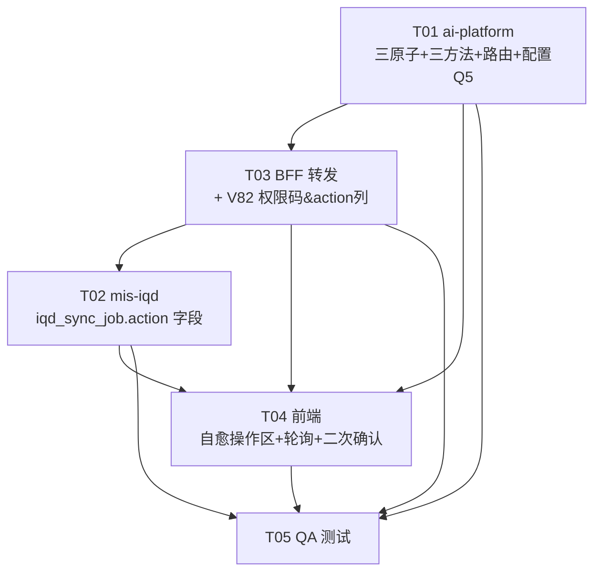

# 增量设计：运维自愈三按钮（mis-iqd × WrenAI）

> 架构师：高见远（software-architect）｜ 语言：中文｜ 日期：2026-08-28
> 关联输入：`mis-iqd-selfheal-prd.md`（增量 PRD）、`wrenai-ops-runbook.md`（任务3 同期）、`mis-iqd-edit-design.md`（二期复用范式）、`mis-iqd-edit-design-class.mermaid` / `-sequence.mermaid`（既有图）
> 代码依据（均 Read 并比对真实契约）：`iqd_cli.py` / `service.py` / `sync_coordinator.py` / `iqd_enhance.py`（ai-platform）；`IqdClient/IqdFacadeService/IqdAclController/AiPlatformClient/IqdProperties`（BFF）；`IqdInternalController/IqdAdminService/IqdSyncJob`（mis-iqd）；`iqd.ts` / `iqd-catalog-page.tsx` / `CatalogSyncStatusBar.tsx`（前端）；`V81__iqd_closure_enhance_sync_api_seed.sql`（权限码登记范式）
> 决策依据：PRD Q1–Q5 主理人已锁定（见 §〇）

---

## 〇、Q1–Q5 主理人决策落地

| # | 问题 | 主理人拍板 | 本文落地 |
| --- | --- | --- | --- |
| Q1 | 按钮落点 | 「语义模型」页（`iqd-catalog-page`），与 `CatalogSyncStatusBar` 同页 | 新增「运维自愈」操作区，置于状态条下方（§二 T04） |
| Q2 | 强制重建 gate | 带 gate（有进行中动作 / SYNCING 则禁用并提示）+ 二次确认弹窗（前端） | 前端 `gateBlocked` + 二次确认 `Dialog`（§四 / T04） |
| Q3 | 轮询间隔 | 沿用 15000ms（进行中 5000ms），不新增配置（**2026-09-27 由 5000ms 下调**，理由：sync-status 调用密度过高；同日改为共享 Query 去重 + 两档节奏） | 复用 `useSyncStatus` 的共享 Query（`iqdKeys.syncStatus`，§七.2） |
| Q4 | 动作粒度 | 全局（单 profile / 单 WrenAI 实例，与现状默认主连接一致） | 三个动作均 `connection_id=None` 解析主连接，不按 connection_id 拆分（§三 service 方法） |
| Q5 | 命令参数 | 三个新 WrenAI 命令精确参数以 W0 真机实测为准，参数隔离在 `iqd_cli.py` 配置层，不得硬编码臆造 | 三命令可选 flag 全部来自 `IqdMcpSettings.self_heal_*_args`（默认空，W0 回填）；结构命令名词固定，可选参数可配置可核对（§三 / §七.3 / §八） |

---

## 一、实现方案 + 框架选型

**结论：沿用一期/二期技术栈，无新增 npm / PyPI / Maven 包；外部前置仍为 `wren` CLI。**

| 层 | 技术栈 | 本期变化 |
| --- | --- | --- |
| ai-platform（Python FastAPI，PRD 所称「mis-iqd Worker」） | asyncio + httpx + subprocess 调 `wren` CLI | 新增 `IqdCli` 三原子（`context_build(force)` / `memory_reset` / `context_validate`）+ `IqdAskService` 三方法 + 新路由 `iqd_selfheal.py` + 配置三参数；**无新依赖** |
| mis-iqd（Java Spring Boot，配置/状态服务） | JPA + Flyway | `IqdSyncJob` 增 `action` 字段（审计/区分动作）+ `reportSyncJob`/`IqdSyncJobVO` 映射；**无新依赖** |
| mis-admin-bff（Java，BFF） | WebClient + RS256 透传 | 新增 3 转发方法 + 1 权限码 `iqd:selfheal:exec`；**无新依赖** |
| 前端（React + MUI + Tailwind + lucide） | 既有 | 新增「运维自愈」操作区（3 按钮 + 二次确认 + gate + 失败横幅）+ 3 API 函数；复用 `CatalogSyncStatusBar` 轮询；**无新依赖** |

> **术语澄清（关键）**：PRD 与团队简报中的「mis-iqd Worker 暴露三个触发端点」实际指 **ai-platform 的 Python Worker**（`IqdCli` 持有方，直调 `wren` CLI）。Java 侧 `mis-iqd` 是配置/元数据/状态服务，本期**不新增内部端点**（复用既有的 `/internal/v1/iqd/enhance/sync-job` 上报 + `/api/v1/iqd/catalog/sync-status` 状态查询）。故「三端点」归属 ai-platform 路由层。

**架构模式**：复用二期闭环「平台先落库 → BFF 转发 → ai-platform 编排 → iqd_cli → WrenAI CLI → 经 `report_sync_job` 写回 `iqd_sync_job` → 前端 15000ms 轮询状态」。三动作与现有 `trigger_build_index` / `trigger_model_build` 同构，fail-closed 哲学一致（memory index 失败不阻断 build 回填，单独标 `index_status=failed`）。

**核心不变量（维持）**：任一连接 `平台.built_edit_revision 对应模型 == WrenAI.build_mdl_hash 所代表版本`；自愈动作通过复用同一 `iqd_sync_job` 状态表与同一轮询通道，对运维透明可观测。

---

## 二、文件清单（增量视角，标注 新增 / 修改）

> 端：ai-platform（Python Worker）/ bff（Java）/ mis-iqd（Java）/ frontend

### T01 — ai-platform（Worker）：三原子 + 三方法 + 路由 + 配置隔离（Q5）

| 文件 | 端 | 标注 | 职责 |
| --- | --- | --- | --- |
| `agent/ai-platform/backend/src/adapters/iqd_cli.py` | ai-platform | `[修改]` | 新增 `context_build(force=False)`（force 时附加 `self._force_build_args`）、`memory_reset()`（附加 `self._memory_reset_args`）、`context_validate()`（附加 `self._context_validate_args` 并返回 `{"ok","summary","raw"}`）、`_parse_validate_summary(stdout,stderr)`；`__init__` 从 `get_settings().iqd_mcp` 读三参数（Q5） |
| `agent/ai-platform/backend/src/config/.../settings.py`（`IqdMcpSettings`） | ai-platform | `[修改]` | 新增 `self_heal_force_build_args: list[str]` / `self_heal_memory_reset_args: list[str]` / `self_heal_context_validate_args: list[str]`，默认 `Field(default_factory=list)`（W0 实测回填，不臆造） |
| `agent/ai-platform/backend/src/agent/mis_iqd/service.py` | ai-platform | `[修改]` | 新增 `trigger_force_rebuild(connection_id, wait)` / `trigger_reindex(connection_id, wait)` / `trigger_validate(connection_id, wait)`；私有 `_report_selfheal_job(client, connection_id, action, result)`（复用 `report_sync_job`，注入 `action`） |
| `agent/ai-platform/backend/src/api/routes/iqd_selfheal.py` | ai-platform | `[新建]` | `APIRouter(prefix="/iqd/self-heal")`：`POST /force-rebuild`、`POST /re-index`、`POST /validate`；复用 `EnhanceSyncRequest` 风格（`connection_id?`、`wait` 默认 `true`） |
| `agent/ai-platform/backend/src/api/routes/__init__.py` 或 app 装配处 | ai-platform | `[修改]` | 注册 `iqd_selfheal` 路由（若非自动发现） |

### T02 — mis-iqd（Java）：`iqd_sync_job.action` 字段（审计/区分动作）

| 文件 | 端 | 标注 | 职责 |
| --- | --- | --- | --- |
| `backend/mis-iqd/.../domain/entity/IqdSyncJob.java` | mis-iqd | `[修改]` | 加 `action: String`（取值 `force_rebuild` / `reindex` / `validate` / `materials` / `model`，可为 null） |
| `backend/mis-iqd/.../api/dto/IqdSyncJobVO.java` | mis-iqd | `[修改]` | 加 `action` 字段 + getter/setter |
| `backend/mis-iqd/.../domain/service/IqdAdminService.java` | mis-iqd | `[修改]` | `reportSyncJob` 映射 `payload["action"]` → `job.setAction(...)`；`toSyncJobVO` 设 `vo.setAction(entity.getAction())` |

### T03 — BFF 转发 + 权限码登记（V82 迁移含 `action` 列）

| 文件 | 端 | 标注 | 职责 |
| --- | --- | --- | --- |
| `backend/mis-admin-bff/.../client/IqdClient.java` | bff | `[修改]` | 新增 `selfHealForceRebuild(conn)` / `selfHealReindex(conn)` / `selfHealValidate(conn)`（统一调 `aiPlatformClient.selfHeal(action, conn, ...)`） |
| `backend/mis-admin-bff/.../client/AiPlatformClient.java` | bff | `[修改]` | 新增 `selfHeal(action, connectionId, authorization, traceId)` → `POST /api/v1/iqd/self-heal/{action}`，body `{connection_id, wait:true}` |
| `backend/mis-admin-bff/.../service/iqd/IqdFacadeService.java` | bff | `[修改]` | 新增 `selfHeal(action, connectionId, authorization, traceId)`，`requirePermission(properties.getSelfHealPermission())` |
| `backend/mis-admin-bff/.../controller/IqdAclController.java` | bff | `[修改]` | 新增 3 端点 `POST /api/v1/iqd/self-heal/{force-rebuild\|re-index\|validate}`，catch `BusinessException` 透传 |
| `backend/mis-admin-bff/.../config/IqdProperties.java` | bff | `[修改]` | 加 `selfHealPermission = "iqd:selfheal:exec"` + getter/setter |
| `backend/mis-migrator/.../V82__iqd_selfheal_api_seed.sql` | mis-iqd(migration) | `[新建]` | ① `sys_menu` 权限码 `iqd:selfheal:exec`；② `sys_api` + `sys_menu_api` 绑定 3 端点；③ `ALTER TABLE iqd_sync_job ADD COLUMN action VARCHAR(32)`；④ `sys_role_permission` 授权 role_id=1。固定 ID + WHERE NOT EXISTS（append-only，范式同 V81） |

### T04 — 前端：运维自愈操作区 + 轮询 + 二次确认

| 文件 | 端 | 标注 | 职责 |
| --- | --- | --- | --- |
| `frontend/mis-admin-web/src/lib/api/iqd.ts` | frontend | `[修改]` | 新增 `selfHealForceRebuild(conn)` / `selfHealReindex(conn)` / `selfHealValidate(conn)` + 类型 `IqdSelfHealResult`、`IqdSelfHealAction` |
| `frontend/mis-admin-web/src/features/agent/ai/iqd/components/SelfHealPanel.tsx` | frontend | `[新建]` | 「运维自愈」操作区：3 按钮 + 二次确认 `Dialog`（强制重建）+ gate（进行中/SYNCING/stale_drift 禁用）+ 失败横幅（REQ-7）；同页复用 `CatalogSyncStatusBar` |
| `frontend/mis-admin-web/src/features/agent/ai/iqd/iqd-catalog-page.tsx` | frontend | `[修改]` | 在 `CatalogSyncStatusBar` 下方挂载 `<SelfHealPanel connectionId={connectionId} />` |
| `frontend/mis-admin-web/src/features/agent/ai/iqd/components/CatalogSyncStatusBar.tsx` | frontend | `[复用]` | 沿用既有 15000ms 轮询 + 5 态徽标 + mdl_hash（不新造组件，仅确保 `action` 字段若返回可被忽略） |

### T05 — QA 测试

| 文件 | 端 | 标注 | 职责 |
| --- | --- | --- | --- |
| `agent/ai-platform/backend/tests/.../test_iqd_selfheal.py` | ai-platform | `[新建]` | 单元：三方法 + `IqdCli` 三原子参数注入（mock `_run` 断言 args 含配置参数）；集成：路由 → service → 状态回写 |
| `frontend/mis-admin-web/.../SelfHealPanel.test.tsx` | frontend | `[新建]` | gate / 二次确认 / 失败横幅 / 轮询态渲染 |

---

## 三、数据结构和接口（类图见 `mis-iqd-selfheal-design-class.mermaid`）

要点（相对二期设计的新增/修改）：

### 1. ai-platform `IqdCli`（新增/修改方法，参数隔离 Q5）

```python
# iqd_cli.py —— 构造时从 settings.iqd_mcp 读取（Q5：参数在配置层，不臆造）
def __init__(self, ...):
    wren = settings.iqd_mcp
    self._bin = ...
    self._force_build_args      = list(wren.self_heal_force_build_args)       # W0 回填，如 ["--force"]
    self._memory_reset_args     = list(wren.self_heal_memory_reset_args)      # W0 回填，如 []
    self._context_validate_args = list(wren.self_heal_context_validate_args) # W0 回填，如 []

async def context_build(self, *, mdl_dir=None, sql_pairs=None, instructions=None,
                         allow_write=True, force: bool = False) -> dict:
    args = ["context", "build"]
    if allow_write: args.append("--allow-write")
    if force: args.extend(self._force_build_args)   # 仅 force 时附加（如 --force）
    if mdl_dir: args += ["--mdl", mdl_dir]
    if sql_pairs: args += ["--sql-pairs", json.dumps(sql_pairs, ensure_ascii=False)]
    if instructions: args += ["--instructions", json.dumps(instructions, ensure_ascii=False)]
    return await self._run(args)

async def memory_reset(self) -> dict:
    """wren memory reset（重新索引前置；可选 flag 来自配置）。"""
    return await self._run(["memory", "reset", *self._memory_reset_args])

async def context_validate(self) -> dict:
    """wren context validate；返回 {"ok": bool, "summary": str, "raw": str}。
    summary 为人可读错误摘要（REQ-8），从 stdout/stderr 解析（JSON 或首段错误行）。"""
    try:
        raw = await self._run(["context", "validate", *self._context_validate_args])
    except IqdCliError as exc:
        return {"ok": False, "summary": self._parse_validate_summary("", exc.args[0] if exc.args else ""), "raw": str(exc)}
    stdout = raw.get("stdout", "")
    stderr = raw.get("stderr", "")
    ok = "error" not in (stdout + stderr).lower()
    return {"ok": ok, "summary": self._parse_validate_summary(stdout, stderr), "raw": stdout}
```

### 2. ai-platform `IqdAskService`（新增三方法，复用 `SyncResult` + `report_sync_job`）

```python
async def trigger_force_rebuild(self, connection_id=None, wait=True) -> SyncResult:
    # 复用 trigger_build_index 的物料拉取 + context_build(force=True) + memory_index + 回填 + 报作业
    # 仅 build 阶段传 force=True；其余与 trigger_build_index 完全一致（含 _parse_mdl_hash / 容错）
    ...
    await self._report_selfheal_job(client, cid, "force_rebuild", result)
    return result

async def trigger_reindex(self, connection_id=None, wait=True) -> SyncResult:
    # 串联 memory_reset() + memory_index()（runbook §6 兜底命令）
    # build_status 反映 reset 结果；index_status 反映 index 结果
    ...
    await self._report_selfheal_job(client, cid, "reindex", result)
    return result

async def trigger_validate(self, connection_id=None, wait=True) -> SyncResult:
    # 调 context_validate()；build_status=success/failed；build_error=人可读摘要(REQ-8)
    ...
    await self._report_selfheal_job(client, cid, "validate", result)
    return result

async def _report_selfheal_job(self, client, connection_id, action, result: SyncResult):
    try:
        await client.report_sync_job({
            "connection_id": connection_id,
            "action": action,                         # 新增：区分动作（审计 REQ-7）
            "build_status": result.build_status,
            "build_mdl_hash": result.build_mdl_hash,
            "index_status": result.index_status,
            "build_error": result.build_error,
            "index_error": result.index_error,
            "synced_sql_pair_count": result.synced_sql_pair_count,
            "synced_knowledge_count": result.synced_knowledge_count,
        })
    except Exception as exc:
        logger.warning("IQD self-heal job report failed", action=action, error=str(exc))
```

### 3. ai-platform 路由 `iqd_selfheal.py`（新建，复用 `EnhanceSyncRequest` 风格）

```python
router = APIRouter(prefix="/iqd/self-heal", tags=["iqd-selfheal"])

class SelfHealRequest(BaseModel):
    connection_id: int | None = None
    wait: bool = True   # 运维主动触发，默认阻塞至完成返回完整 SyncResult

@router.post("/force-rebuild")
async def force_rebuild(req, current_user=Depends(get_current_user), trace_id=Depends(get_trace_id), authorization: str = Header("")):
    svc = IqdAskService()
    result = await svc.trigger_force_rebuild(req.connection_id, req.wait)
    return success(data=result.model_dump(), message="ok", trace_id=trace_id)

@router.post("/re-index")
async def re_index(req, ...):
    return success(data=(await IqdAskService().trigger_reindex(req.connection_id, req.wait)).model_dump(), ...)

@router.post("/validate")
async def validate(req, ...):
    return success(data=(await IqdAskService().trigger_validate(req.connection_id, req.wait)).model_dump(), ...)
```

### 4. BFF 转发（Java，新增方法签名）

```java
// IqdClient.java
public Map<String, Object> selfHealForceRebuild(Long connectionId) {
    return iqdClient.selfHeal("force-rebuild", connectionId, ...);
}
public Map<String, Object> selfHealReindex(Long connectionId) { return aiPlatformClient.selfHeal("re-index", connectionId, ...); }
public Map<String, Object> selfHealValidate(Long connectionId) { return aiPlatformClient.selfHeal("validate", connectionId, ...); }

// AiPlatformClient.java
public Map<String, Object> selfHeal(String action, Long connectionId, String authorization, String traceId) {
    Consumer<HttpHeaders> headers = buildHeaders(authorization, traceId);
    Map<String, Object> body = new LinkedHashMap<>();
    body.put("connection_id", connectionId);
    body.put("wait", Boolean.TRUE);
    return block(client().post()
        .uri("/api/v1/iqd/self-heal/{action}", action)
        .headers(headers).contentType(MediaType.APPLICATION_JSON).bodyValue(body)
        .retrieve().bodyToMono(MAP_RESULT_TYPE));
}

// IqdFacadeService.java
public Map<String, Object> selfHeal(String action, Long connectionId, String authorization, String traceId) {
    requirePermission(properties.getSelfHealPermission());   // iqd:selfheal:exec
    return iqdClient.selfHealXxx(connectionId);  // 按 action 分发到对应 IqdClient 方法
}
```

### 5. 前端 API 函数（TypeScript）

```typescript
export type IqdSelfHealAction = 'force_rebuild' | 'reindex' | 'validate';
export interface IqdSelfHealResult {
  connection_id?: number;
  build_status?: string;
  index_status?: string;
  build_mdl_hash?: string | null;
  build_error?: string | null;
  index_error?: string | null;
}
export async function selfHealForceRebuild(connectionId: number): Promise<IqdSelfHealResult> {
  const res = await api.post<ApiResult<IqdSelfHealResult>>('/iqd/self-heal/force-rebuild', undefined, { params: { connectionId, wait: true } });
  return unwrap(res, '强制重建失败');
}
export async function selfHealReindex(connectionId: number): Promise<IqdSelfHealResult> { /* /iqd/self-heal/re-index */ }
export async function selfHealValidate(connectionId: number): Promise<IqdSelfHealResult> { /* /iqd/self-heal/validate */ }
```

### 6. sync-job 状态表复用字段（REQ-2）

`iqd_sync_job` 既有列全部复用：`build_status` / `index_status` / `build_mdl_hash` / `build_error` / `index_error` / `synced_sql_pair_count` / `synced_knowledge_count`。**新增** `action VARCHAR(32)`（区分 `force_rebuild` / `reindex` / `validate` / `materials` / `model`，用于 REQ-7 审计与状态条区分）。前端轮询仍复用既有 `GET /iqd/catalog/sync-status`（返回 `build_status` / `index_status` / `mdl_hash` / `edit_status`），`action` 作为可选附加信息。

---

## 四、程序调用流程（时序图见 `mis-iqd-selfheal-design-sequence.mermaid`）

主线（以「强制重建」为例，其余两动作同类路径）：

1. **前端**：`SelfHealPanel` 渲染 3 按钮；点「强制重建」→ 先 `gateBlocked` 检查（有进行中动作 / `build_status=running` / `SYNCING` / `stale_drift` 则禁用并 tooltip 提示）→ 弹二次确认 `Dialog`（Q2）→ 确认后 `selfHealForceRebuild(connectionId)`。
2. **BFF**：`POST /api/v1/iqd/self-heal/force-rebuild` → `IqdAclController` → `IqdFacadeService.selfHeal("force-rebuild", ...)`（`requirePermission(iqd:selfheal:exec)`）→ `IqdClient` → `AiPlatformClient.selfHeal("force-rebuild", conn, auth, traceId)`。
3. **ai-platform Worker**：`POST /api/v1/iqd/self-heal/force-rebuild` → `IqdSelfHealRouter` → `IqdAskService.trigger_force_rebuild(conn, wait=true)`。
4. **编排**：`IqdCli.context_build(force=True, ...)` → `wren context build <force_build_args>`；成功 `_parse_mdl_hash` → `IqdCli.memory_index()`（`wren memory index`，失败仅标 `index_status=failed`）；组装 `SyncResult`。
5. **状态回报**：`IqdAskService._report_selfheal_job` → `IqdConfigClient.report_sync_job({action:"force_rebuild", ...})` → mis-iqd `POST /internal/v1/iqd/enhance/sync-job` → `IqdAdminService.reportSyncJob` → `iqd_sync_job`（覆盖写，含 `action` 列）。
6. **返回**：`SyncResult` 经路由 → BFF → 前端 `IqdSelfHealResult`；前端据 `build_status` 更新按钮态 / 失败横幅（REQ-7）/ 展示新 `mdl_hash`。
7. **轮询**：前端经 `useSyncStatus` 的共享 Query 轮询 `GET /iqd/catalog/sync-status`（空闲 15000ms / 进行中 5000ms；同一连接全应用只有一条轮询）→ mis-iqd `getCatalogSyncStatus` 读 `iqd_sync_job` 最新作业 → 渲染 5 态徽标 + `mdl_hash`。

**重新索引** 串联 `memory_reset()` + `memory_index()`；**模型校验** 串联 `context_validate()`（返回人可读 `summary`，REQ-8）。两动作上报 `action="reindex"` / `"validate"`。

---

## 五、任务清单 T01–T05（文件级 + 契约 + 验收）

> 依赖顺序：`T01 → T03 →（T02 ∥ 对齐）→ T04 → T05`。T02 的运行时依赖 T03 的 V82 `action` 列；T03 依赖 T01 的端点契约；T04 依赖 T02/T03。

### T01 — ai-platform（Worker）：三原子 + 三方法 + 路由 + 配置隔离（Q5） ｜ P0 ｜ 依赖：无

**源文件**：`iqd_cli.py` / `IqdMcpSettings`(config) / `service.py` / `iqd_selfheal.py`(新) / 路由装配。
**接口契约**：
- `POST /api/v1/iqd/self-heal/force-rebuild` body `{"connection_id":null,"wait":true}` → `SyncResult`
- `POST /api/v1/iqd/self-heal/re-index` 同上
- `POST /api/v1/iqd/self-heal/validate` 同上（`build_error` 含人可读摘要）
**Q5 落实**：三命令可选 flag 仅来自 `IqdMcpSettings.self_heal_*_args`（默认空），方法体内**不得出现 `--force` / `reset` 的硬编码参数值**；结构命令名词（`context build` / `memory reset` / `context validate`）固定。
**验收**：mock `IqdCli._run` 断言 `force-rebuild` 调用 args 含 `self._force_build_args`；`re-index` 依次调 `memory reset` + `memory index`；`validate` 解析 stdout 出 `summary`；三动作均经 `report_sync_job` 带 `action`。

### T02 — mis-iqd（Java）：`iqd_sync_job.action` 字段 ｜ P0 ｜ 依赖：T03

**源文件**：`IqdSyncJob.java` / `IqdSyncJobVO.java` / `IqdAdminService.reportSyncJob` + `toSyncJobVO`。
**内部方法签名**：`IqdSyncJob.setAction(String)` / `getAction()`；`reportSyncJob` 增加 `job.setAction(str(payload.get("action")))`；`toSyncJobVO` 增加 `vo.setAction(entity.getAction())`。
**验收**：`report_sync_job` 携带 `action` 时 `iqd_sync_job.action` 正确落库；`getCatalogSyncStatus` / `getLatestSyncJob` 返回的 VO 含 `action`；无 `action` 时列保持 null（兼容历史物料/model 作业）。

### T03 — BFF 转发 + 权限码登记（V82 含 `action` 列） ｜ P0 ｜ 依赖：T01

**源文件**：`IqdClient.java` / `AiPlatformClient.java` / `IqdFacadeService.java` / `IqdAclController.java` / `IqdProperties.java` / `V82__iqd_selfheal_api_seed.sql`(新)。
**接口契约（BFF 对外，权限码 `iqd:selfheal:exec`）**：
- `POST /api/v1/iqd/self-heal/force-rebuild?connectionId=1&wait=true`
- `POST /api/v1/iqd/self-heal/re-index?connectionId=1&wait=true`
- `POST /api/v1/iqd/self-heal/validate?connectionId=1&wait=true`
**V82 内容**：`sys_menu` 权限码 `iqd:selfheal:exec`（type=3 挂 92500 目录）；`sys_api` 3 端点（path `/api/v1/iqd/self-heal/*`，module 92020，code 段续 00960018+）；`sys_menu_api` 绑定；`ALTER TABLE iqd_sync_job ADD COLUMN action VARCHAR(32)`；`sys_role_permission` 授权 role_id=1。固定 ID + `WHERE NOT EXISTS`（append-only，范式同 V81）。
**验收**：三端点缺权 403；`deny-unmapped` 不返回 40300（已登记）；`iqd_sync_job.action` 列存在；`role_id=1` 持有 `iqd:selfheal:exec`；调用链 AI-platform 可达。

### T04 — 前端：运维自愈操作区 + 轮询 + 二次确认 ｜ P0/P1 ｜ 依赖：T02, T03

**源文件**：`lib/api/iqd.ts` / `components/SelfHealPanel.tsx`(新) / `iqd-catalog-page.tsx` / `CatalogSyncStatusBar.tsx`(复用)。
**前端 API 签名**：见 §三.5。
**验收**：3 按钮可见可点；强制重建经 `gateBlocked`（进行中/SYNCING/stale_drift 禁用）+ 二次确认 Dialog（未确认不发起）；点击后按钮 loading 并复用 15000ms 轮询刷新；完成徽标转 SYNCED 并展示新 mdl_hash；任一动作 `build_status=failed` 出失败横幅（复用 STALE_DRIFT 样式，REQ-7）；`validate` 失败展示 `build_error` 人可读摘要（REQ-8）。

### T05 — QA 测试 ｜ 依赖：T01–T04

**源文件**：`tests/.../test_iqd_selfheal.py`(新) / `SelfHealPanel.test.tsx`(新)。
**验收**：三动作端到端跑通 + sync-job 状态机收敛；force-rebuild 覆盖增量短路；gate 在 SYNCING 时禁用；二次确认阻断；失败横幅 + 审计可读；W0 真机实测后参数回填一致（见 §八）。

---

## 六、依赖包列表

**无新增依赖包**（与二期评审一致）：
- ai-platform：asyncio / httpx / subprocess / pydantic（既有）；`wren` CLI 部署侧已验证。
- mis-iqd：JPA / Flyway / WebClient（既有）。
- mis-admin-bff：WebClient / `@ConfigurationProperties`（Spring 既有）。
- 前端：react / mui / tailwind / lucide（既有）。

---

## 七、共享知识（跨文件约定，工程师必读）

1. **`iqd_sync_job` 状态字段复用**：三动作复用 `build_status` / `index_status` / `build_mdl_hash` / `build_error` / `index_error`，新增 `action` 区分动作来源（`force_rebuild` / `reindex` / `validate` / `materials` / `model`）。覆盖写语义不变（`findTopByConnectionIdOrderByIdDesc`）。
2. **`action` 取值约定**：`force_rebuild` / `reindex` / `validate`（本期自愈）；既有 `materials` / `model`（二期）。`reportSyncJob` 对缺省 `action` 保持 null 兼容。
3. **共享 Query 轮询范式**：前端 `useSyncStatus` 以 `iqdKeys.syncStatus(connId)` 起**一条** Query（`refetchInterval` 传函数：空闲 15000ms / 进行中 5000ms），`CatalogSyncStatusBar` 与 `SelfHealPanel` 同页订阅同一份缓存（**不再各起 `setInterval`**，同一连接同一时刻只有一条轮询）；自愈按钮区与状态条复用同一 `getIqdCatalogSyncStatus` 通道。
4. **参数隔离约定（Q5，硬约束）**：三个新 WrenAI 命令的**可选 flag**（`--force` / `memory reset` 参数 / `context validate` 参数）**仅**来自 `IqdMcpSettings.self_heal_*_args` 配置，方法体内不得硬编码臆造值；结构命令名词（`context build` / `memory reset` / `context validate`）固定。W0 实测后由运维在 Nacos `ai-platform.yaml` 回填具体参数，工程无需改代码。
5. **权限码命名**：自愈统一权限码 `iqd:selfheal:exec`（BFF `IqdProperties.selfHealPermission`）；三按钮共用同一码，gate 由前端按动作语义叠加（强制重建额外 gate + 二次确认）。
6. **动作粒度（Q4）**：三动作均为全局（单 profile / 单 WrenAI 实例），`connection_id=None` 解析主连接（`findByName('default')` 或首条 enabled），不按 `connection_id` 拆分。
7. **fail-closed 容错**：`memory_index` / `context validate` 失败不阻断主流程，单独标 `index_status=failed` 或 `build_status=failed` 并经 `report_sync_job` 上报；前端据状态出横幅。
8. **`wait=true` 默认**：自愈为运维主动触发，BFF 转发固定 `wait=true`（阻塞至完整 `SyncResult` 返回），与编辑写回的 best-effort（wait=false）区分。

---

## 八、待明确事项（仅真正需澄清）

1. **W0 参数实测前的临时占位策略（Q5 落地细节）**：
   - 代码侧 `self_heal_*_args` 默认 `[]`（即不附加任何可选 flag），三方法可编译可跑；此时 `force-rebuild` 退化为普通增量 build（不带 `--force`），`re-index` 退化为仅 `memory reset` + `memory index`（无额外 flag），`validate` 退化为 `context validate`（无额外 flag）。
   - **上线前硬门槛**：W0 真机实测（runbook §8 清单：`--force` / `memory reset` / `context validate` 的存在性与参数形态）后，由运维在 Nacos `ai-platform.yaml` 的 `iqd.mcp.self-heal-*` 项回填真实参数（如 `self-heal-force-build-args: ["--force"]`）。**未回填不得视为功能完成**（PRD 验收口径）。
   - 工程侧验收用例需覆盖「参数经配置注入」而非「硬编码」，防止臆造。
2. **`context validate` 输出形态**：WrenAI 是否返回结构化 JSON 或纯文本错误行待 W0 确认；`_parse_validate_summary` 需同时支持两种（JSON 取 `errors`/`message` 数组；纯文本取首段非空错误行），此解析逻辑以 W0 样本校准，不臆测字段名。
3. **`iqd_sync_job.action` 历史兼容**：既有 `materials` / `model` 作业 `action` 为 null，前端/状态条对 null 按既有行为渲染（不展示动作名），仅本期三动作展示 `action` 标签（可选，非强制 UI）。
4. **REQ-9 / REQ-10（P2）本期范围外**：批量/定时触发、漂移横幅旁强制重建入口留接口（gate + 端点已具备，后续接入 `IqdReconcileJobService` 或前端横幅按钮即可），本期不实现。

---

## 九、任务依赖图


