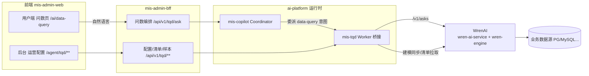
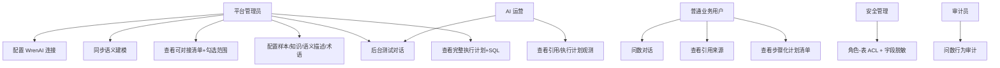
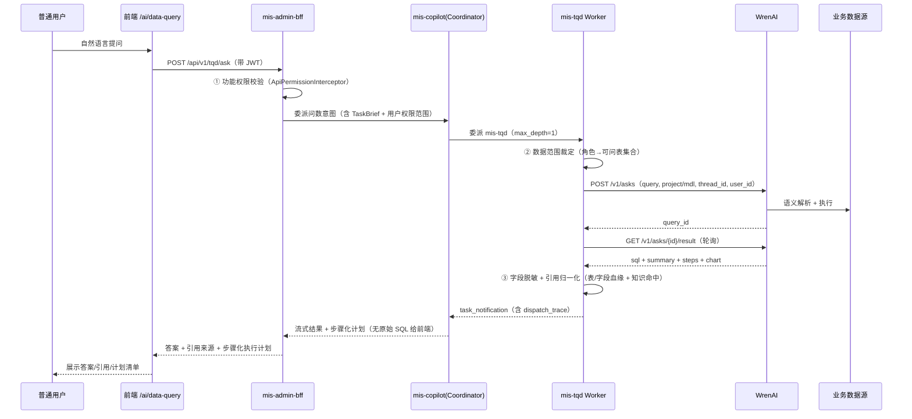
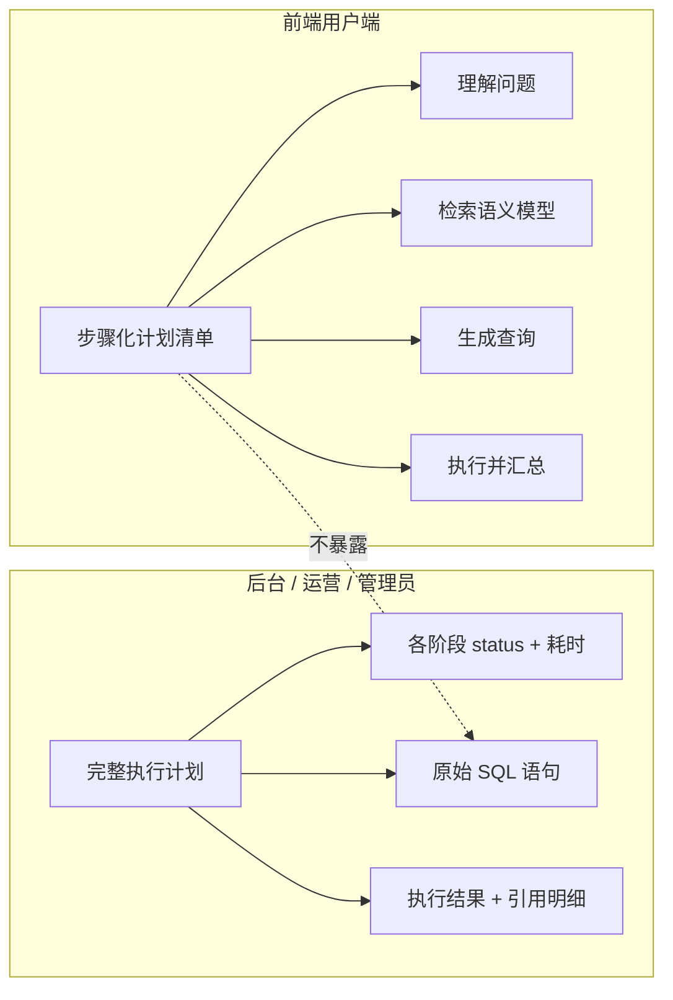
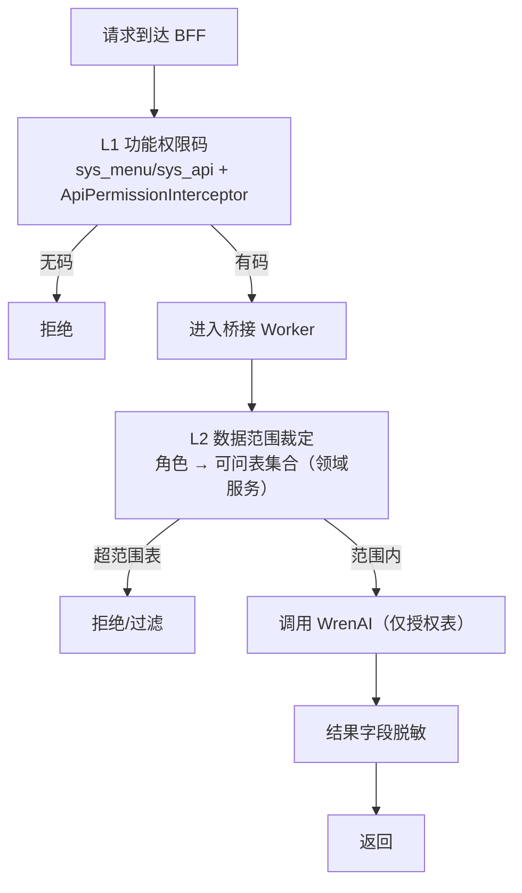

# MIS 平台对接 WrenAI 问数 APP — 产品需求文档（PRD）

> 文档角色：MIS 平台对接 **WrenAI（开源 LLM 语义层 / Text-to-SQL 问数系统）** 的**产品级需求锁定**（规划阶段，仅产出文档，不写代码）。  
> 上游参考资料：`docs/ai-fusion/coordinator-worker/`（对话调度基座）、`docs/ai-fusion/agent-ops-console/`（智能体运营控制台）、`docs/architecture/03-security.md`（RBAC / 数据范围）、`docs/backend/knowledge-base*.md` 与 `docs/analysis/kb-permission-redesign-review-2026-08-12.md`（KB 三层两套权限模型）、`frontend/mis-admin-web/src/features/agent/`（UI 范式）。  
> 本目录首页：[README.md](./README.md)（待建）  
> 版本：v1.0｜状态：🔵 需求草稿待评审｜日期：2026-08-22｜语言：中文
> **v1.9 命名一致性说明（2026-08-22，架构同步）**：本 PRD 为需求级文档，未锁定实现命名。架构 v1.9 已定——**平台问数业务域统一用 `tqd`**（项目 `mis-tqd`、表前缀 `tqd_*`、API `/api/v1/tqd/**`、权限码 `tqd:*`、模块 `backend/mis-tqd`），**对接外部 WrenAI 产品的适配层保留 `wren`**（`wren serve mcp` / `wren profile` / `wren_mcp_host` / `wren_ref_id` 等外部事实引用）；问数配置**落 `mis_platform` 库**（对齐 mis_kb 范式，Java 侧管理，ADR-020 替代 ADR-019）；行级范围**维度注册表一期 + 部门/门店双维度**。本文档提及的 `wren_client`（传输抽象）与 WrenAI 品牌属保留边界，与实现命名无冲突。

---

## 0. 项目信息

| 项 | 内容 |
|---|---|
| Language | 中文 |
| Project Name | `tqd_data_query_app` |
| 原始需求复述 | 在 MIS 平台内**自研后台**对接 WrenAI（非直接用 WrenUI），通过平台内一个 **agent** 把用户自然语言问数请求桥接给 WrenAI；后台可配置连接与语义建模同步、查看可对接内容清单并勾选问数范围、配置样本/知识库/语义描述以提升准确度、提供联调测试对话页；前端用户端问数结果需可见引用来源、执行计划分层展示（后台含完整 SQL、前端仅步骤化清单）；权限复用现有 RBAC 与 KB 模型，至少做到「基于角色控制可访问的表」+ 字段脱敏。 |
| 技术栈（复用既有，不新建运行时） | 前端：`mis-admin-web`（建议复用 `features/agent` 壳与 `PermissionGate` 范式）；用户端对话面复用既有 `/ai/data-query`（DataQueryPage → AiChatPanel）。BFF：`mis-admin-bff`（建议新增 `/api/v1/tqd/**` 或并入 `/api/v1/agent-ops/**`）。AI 桥接：建议走现有 **Coordinator–Worker** 基座（mis-copilot 调度 + 新增 `mis-tqd` Worker）。权限：`mis-system` / `mis-iam`（sys_role / sys_menu / sys_api / sys_role_permission + Redis）+ 领域服务数据范围裁定。外部系统：WrenAI（自托管 OSS 或 Cloud）。 |
| 产品选型（默认假设，待确认） | ① 桥接 = Coordinator 委派的新 Worker（对齐 C–W）；② 后台管理 UI 挂载在 `agent` host App 下（或独立 `wrenai` App，见 Q6）；③ 权限复用 RBAC + KB 三层两套数据范围模型；④ 用户端入口 = 现有 `/ai/data-query` 问数页扩展。 |
| 边界红线 | **前端不直连 WrenAI**；所有问数请求与密钥经平台 BFF/AI 层；WrenAI 仅在服务端可达。权限为「功能权限码（BFF 拦截）+ 数据范围（领域服务二次裁定）」双闸门，禁止仅靠前端隐藏。 |

---

## 1. 产品目标与定位

> 一句话定位：**让业务用户在 MIS 内用自然语言问数，背后由平台 agent 桥接 WrenAI 的语义层与 Text-to-SQL 能力；运营在后台完成连接、建模同步、范围治理、准确度调优与联调验证，且全程权限可控、来源可溯。**

### 1.1 目标表

| # | 目标 | 关键结果（可衡量） |
|---|---|---|
| G1 可对接 | 后台可配置 WrenAI 连接（地址 / 令牌 / connector 类型）并完成语义建模同步 | 配置保存后经测试对话页可连通并返回 SQL+结果 |
| G2 桥接可达 | 用户端问数请求经平台 agent 转发到 WrenAI，前端不持有 WrenAI 地址/密钥 | 端到端链路中前端零 WrenAI 直连；链路经 BFF → Coordinator → WrenAI Worker |
| G3 范围治理 | 后台可浏览数据源/库/表/字段与 WrenAI 语义模型（models/relationships/metrics/dimensions），并勾选「问数范围」 | 清单可拉取、可勾选、范围可保存并约束实际可问表集合 |
| G4 权限可控 | 复用 RBAC + KB 模型，至少做到「基于角色控制可访问的表」，敏感字段脱敏 | 越权角色问数被拒/不可见；字段脱敏按安全设计规则生效 |
| G5 准确度可调 | 可配置样本（few-shot）、知识库（业务术语/口径/同义词）、表/字段业务语义描述、术语词典 | 配置后测试对话页命中率/口径正确率可观测提升 |
| G6 联调可验 | 后台运营侧有联调测试对话页，可见 SQL / 执行结果 / 引用来源 / 执行计划 | 运营可独立验证对接与准确度，不依赖生产用户 |
| G7 来源可溯 | 前端用户端结果可见引用/来源（哪张表、哪个字段、哪段知识库内容） | 用户能看懂答案依据，不暴露原始 SQL |
| G8 计划分层 | 执行计划后台可见完整（含 SQL），前端仅步骤化自然语言清单 | 两端展示口径按角色分离，前端不泄露原始 SQL |

### 1.2 非目标（本期不做）

- 替换 WrenUI 做终端用户 UI（本产品用 MIS 自研前端）。
- 在 WrenAI 之外自建 Text-to-SQL 引擎。
- 把 WrenAI 运行时搬进 Java 微服务（WrenAI 独立部署，平台仅对接）。
- 字段级权限的细粒度列级 ACL 引擎（本期以「表级范围 + 字段脱敏」为下限，列级 ACL 见 Q3）。
- 多租户隔离下的多 WrenAI 实例联邦（一期单 project，见 Q10）。

### 1.3 与现有 AI 融合基座的关系

> 参考：现有 `DataQueryPage`（`/ai/data-query`）经 `AiChatPanel` 调用 BFF 对话 → 由 mis-copilot 按 Coordinator 调度；本需求新增的 WrenAI 桥接作为其中一类「问数」Worker 接入，复用同一调度基座与 UI 壳。

---

## 2. WrenAI 能力边界与对接假设（调研结论，供架构参考）

> 来源：WrenAI 官方文档 / GitHub（Canner/WrenAI）、社区 API 手册。用于确保 PRD 不脱离现实；**非架构方案**。

| 维度 | 事实 / 能力 | 对 PRD 的影响 |
|---|---|---|
| 架构 | `wren-ui`（Next.js + Apollo GraphQL 语义建模 UI/BFF）、`wren-ai-service`（FastAPI：意图分类、向量检索、LLM 提示、SQL 纠错循环）、`wren-engine`（Rust + Apache DataFusion：MDL 语义解析与执行） | 平台对接点主要为 **wren-ai-service 的 REST API**；语义建模可由平台侧经 API/UI 推送 MDL |
| 连接器 | 支持 15–22+ 数据源：PostgreSQL、MySQL、BigQuery、Snowflake、DuckDB、ClickHouse、Oracle、SQL Server、Redshift、Databricks、Trino、Athena、Spark、Doris 等 | 需求 #1 的「connector 类型」可直接映射 WrenAI 既有连接器；需平台后台下拉选择 |
| 语义建模（MDL） | `models`（表/视图，列含 description / primary_key / is_time_dimension / is_email）、`relationships`（foreign_key + condition）、`metrics`（expression / format / category / tags）、`dimensions`、`views`、`cubes` | 需求 #3 的「可对接内容清单」= 数据源表/字段 + WrenAI 侧 MDL 清单；需求 #5 的「表/字段业务语义描述」= 写入 MDL column.description |
| Ask API（异步） | `POST /v1/asks`：body `{ query, mdl_hash?, thread_id?, user_id?, project_id?, language?, returnSqlDialect?, enable_column_pruning?, histories? }` → 返回 `query_id`；`GET /v1/asks/{query_id}/result` 轮询 → `status`（understanding→searching→planning→generating→correcting→finished/failed/stopped）、`type`（GENERAL/TEXT_TO_SQL）、`response[]`（含 `sql`、`summary`、`steps[{sql,summary}]`、`chart`、`view`）、`error` | ① 平台 agent 须实现「提交→轮询→聚合」；② `status` 序列即「执行计划」步骤；③ `sql` 即后台可见 SQL；④ `thread_id` 支撑多轮上下文 |
| 知识 / 样本检索 | 问数时自动检索 **Documentation/Instruction（业务术语、口径、同义词）** 与 **SQL Pairs（few-shot 示例）** 注入提示 | 需求 #5 的「样本 / 知识库 / 术语词典」可直接复用 WrenAI 的 Documentation + SQL Pairs 机制，或由平台侧注入 |
| 部署形态 | 自托管（Docker Compose：wren-ui + wren-ai-service + wren-engine）、或 WrenAI Cloud（API Key + projectId） | 决定密钥管理、网络连通（是否同 VPC 直连业务库）、建模 API 形态 —— **关键待确认（Q1）** |
| Agent 就绪 | MCP-native；WrenAI 可提供 MCP server 将语义层/ask 能力暴露为 MCP tools | **MCP 仅是「桥接层→WrenAI」的传输协议选择（W0 拍板），不是独立分期**：`mis-tqd` Worker 始终保留以承载权限/范围/脱敏/引用裁定；所选版本 MCP server 稳定则 Worker 直连 MCP（流式原生），否则本期 REST 轮询、后续低成本切换（`wren_client` 已抽象传输）。**用户端禁止直连 MCP**（绕过权限双闸门） |

**已知产品风险（写入 Open Questions）：**
- WrenAI 不同版本对「引用/来源（citations）」的暴露程度不一：旧版 `/v1/asks` 结果无独立 citation 字段，仅含 `sql`/`summary`/`steps`；文档/样本检索命中是否回传待确认（Q5）。前端「引用来源」可能需从生成 SQL 解析表/字段血缘 + 语义模型元数据派生。
- `mdl_hash` 与「问数范围」映射：WrenAI 按 project/MDL 隔离语义；平台「勾选问数范围」需映射到 WrenAI 侧 project 或 MDL 子集（Q7）。

---

## 3. 角色与用户故事

### 3.1 角色

| 角色 | 诉求 | 对应界面 |
|---|---|---|
| 平台管理员 / 数据治理 | 配置 WrenAI 连接、同步语义建模、治理问数范围、配置样本与知识、查看执行计划排错 | 后台配置 / 清单 / 样本 / 测试对话 |
| AI 运营 | 联调验证对接与准确度、查看引用与执行计划、处理差评/异常 | 后台测试对话 / 观测 |
| 普通业务用户 | 用自然语言问数，看到答案 + 引用来源 + 步骤化执行计划（不含原始 SQL） | 前端 `/ai/data-query` |
| 安全管理 / 审计 | 角色可问哪些表、字段脱敏、操作审计 | 权限配置 / 审计日志 |

### 3.2 用户故事

1. As a **平台管理员**, I want 在后台配置 WrenAI 连接（地址/令牌/connector 类型）并同步语义建模, so that 平台具备问数底座。
2. As a **平台管理员**, I want 浏览可对接的数据源/库/表/字段与 WrenAI 语义模型清单并勾选问数范围, so that 只暴露经治理的表给问数。
3. As a **普通业务用户**, I want 在问数页用自然语言提问并经平台 agent 得到答案, so that 我不直接接触 WrenAI 也不关心底层 SQL。
4. As a **安全管理员**, I want 按角色控制「能问哪些表」并对敏感字段脱敏, so that 越权与数据泄露被杜绝。
5. As a **平台管理员**, I want 配置 few-shot 样本、业务术语/口径/同义词、表字段业务描述、术语词典, so that 问数准确度与口径一致性提升。
6. As a **AI 运营**, I want 在后台测试对话页输入问题并看到 SQL/结果/引用/执行计划, so that 我可独立验证对接与准确度。
7. As a **普通业务用户**, I want 在答案中看到引用来源（哪张表/字段/哪段知识库）, so that 我理解并信任答案依据。
8. As a **普通业务用户**, I want 看到步骤化、自然语言化的执行计划清单（不含原始 SQL）, so that 我知晓处理过程但不暴露技术细节。
9. As a **平台管理员**, I want 在执行计划页看到完整执行计划 + 原始 SQL, so that 我能排错与优化。
10. As a **审计员**, I want 问数行为（谁、问了什么、命中哪些表/知识）可记录, so that 可审计追溯。

### 3.3 用例图（摘要）

---

## 4. 需求池（P0 / P1 / P2，逐条覆盖需求 1–8）

> 优先级：P0 = 本期必须；P1 = 应做（准确度/体验关键）；P2 = 增强/远期。每条标注对应的用户原始需求编号（R1–R8）。

### 4.1 后台配置对接（R1）

| ID | 需求 | 优先级 | 验收要点 |
|---|---|---|---|
| FR-CFG-1 | 后台可配置 WrenAI 连接：服务地址、认证令牌/Key、默认 connector 类型（PostgreSQL/MySQL 等下拉） | P0 | 配置保存入库（密钥脱敏存储/服务端）；连通性自检通过 |
| FR-CFG-2 | 支持多 connector 接入与切换（与 WrenAI 连接器对齐） | P0 | 下拉枚举受支持类型；选择后触发建模同步 |
| FR-CFG-3 | 语义建模同步：从 WrenAI 拉取/向 WrenAI 推送 MDL（models/relationships/metrics/dimensions） | P0 | 同步后清单页可见最新模型；同步失败有错误提示 |
| FR-CFG-4 | 连接密钥/令牌在 UI 不回显明文，仅服务端持有 | P0 | 同 KB/RAGFlow 密钥规范（Nacos/配置，不落前端） |

### 4.2 Agent 桥接（R2）

| ID | 需求 | 优先级 | 验收要点 |
|---|---|---|---|
| FR-BRG-1 | 用户端问数请求经平台 agent 转发 WrenAI，前端不直连 | P0 | 抓包/链路确认前端无 WrenAI 直连；令牌不出服务端 |
| FR-BRG-2 | 桥接以 Worker 形态接入 Coordinator–Worker 基座（建议 `mis-tqd`），由 mis-copilot 按意图委派 | P0 | 问数意图路由到该 Worker；保留 `dispatch_trace` |
| FR-BRG-3 | 支持多轮上下文（透传 WrenAI `thread_id`）与超时/降级（HITL/友好错误，不臆造） | P1 | 连续追问上下文连续；WrenAI 不可达返回明确错误而非编造 |

### 4.3 可对接内容清单与范围治理（R3）

| ID | 需求 | 优先级 | 验收要点 |
|---|---|---|---|
| FR-INV-1 | 后台可浏览数据源、库、表、字段清单（来自 WrenAI/DB 元数据） | P0 | 树状/列表可展开到字段级 |
| FR-INV-2 | 后台可浏览 WrenAI 侧已建语义模型（models/relationships/metrics/dimensions）清单 | P0 | 模型/关系/指标/维度分开展示 |
| FR-INV-3 | 支持勾选「纳入问数范围」的表/字段，保存为范围策略 | P0 | 勾选可保存；实际问数仅限范围内表 |
| FR-INV-4 | 范围策略可按角色/用户组差异化（与权限体系联动，见 FR-PERM） | P1 | 不同角色看到/可问的表集合不同 |
| FR-INV-5 | 范围变更有审计与生效提示 | P1 | 操作入日志；生效范围可回查 |

### 4.4 权限（R4，复用 RBAC + KB 模型）

| ID | 需求 | 优先级 | 验收要点 |
|---|---|---|---|
| FR-PERM-1 | 复用现有 RBAC：后台配置页经 `sys_menu`/`sys_api` + BFF `ApiPermissionInterceptor` 门禁 | P0 | 无菜单/按钮/API 权限码者不可进/不可调 |
| FR-PERM-2 | 数据范围权限：基于角色控制「可访问的表」（表级 ACL），未授权表不可问、不可见于结果 | P0 | 越权角色问数被拒；WrenAI 仅被允许访问授权表集合 |
| FR-PERM-3 | 字段脱敏：对敏感字段（手机号/身份证/金额等，对齐 `03-security.md` 脱敏规则）在结果中脱敏 | P1 | 命中脱敏规则的字段按规则展示（如 `138****0000`） |
| FR-PERM-4 | 权限模型复用 KB「三层两套」范式：功能权限码（L1 入口）+ 数据范围（L2 领域服务裁定），双闸门 | P0 | 后端二次裁定，不只靠前端隐藏（对齐 KB 改造评审结论） |
| FR-PERM-5 | 操作审计：问数行为（用户/角色/问题/命中表/知识/结果摘要）入操作日志 | P1 | 可审计追溯 |

### 4.5 准确度增强（R5）

| ID | 需求 | 优先级 | 验收要点 |
|---|---|---|---|
| FR-ACC-1 | 样本（few-shot 问答示例）管理：增删改查，注入 WrenAI SQL Pairs | P1 | 样本保存后问数命中相似问题准确率提升可观测 |
| FR-ACC-2 | 知识库/业务术语/口径说明/同义词管理：注入 WrenAI Documentation | P1 | 术语/口径不一致问题减少 |
| FR-ACC-3 | 表/字段业务语义描述编辑（写入 MDL `description`） | P1 | 描述进入语义上下文，提升生成质量 |
| FR-ACC-4 | 术语词典（平台级 S-07 术语表，或本期独立）→ 问数前扩展 | P2 | 同义词/口径自动对齐（与 KB S-07 关系见 Q8） |
| FR-ACC-5 | 准确度评估：测试对话页可记录命中/差评，形成金标对照 | P2 | 运营可量化调优效果 |

### 4.6 后台联调测试对话页（R6）

| ID | 需求 | 优先级 | 验收要点 |
|---|---|---|---|
| FR-TEST-1 | 运营侧对话页：输入自然语言问题，返回 SQL / 执行结果 / 引用来源 / 执行计划 | P0 | 单页可完成联调验证 |
| FR-TEST-2 | 可切换问数范围/角色模拟，验证不同范围下的可见性 | P1 | 模拟角色后结果受范围约束 |
| FR-TEST-3 | 可查看完整执行计划（含各阶段 status 与原始 SQL、执行耗时） | P0 | 运维/排错可见全量 |

### 4.7 前端引用展示（R7）

| ID | 需求 | 优先级 | 验收要点 |
|---|---|---|---|
| FR-CITE-1 | 用户端答案展示引用/来源：来源表、来源字段、命中的知识库内容片段 | P1 | 用户可看懂依据；来源可展开 |
| FR-CITE-2 | 引用数据由平台桥接层归一化（SQL 表/字段血缘 + 语义模型元数据 + 知识命中） | P1 | 不依赖 WrenAI 是否原生暴露 citation（降级派生，见 Q5） |

### 4.8 执行计划分层（R8）

| ID | 需求 | 优先级 | 验收要点 |
|---|---|---|---|
| FR-PLAN-1 | 后台：完整执行计划 + 原始 SQL 语句（运维/排错） | P0 | 后台可见全量 pipeline + SQL |
| FR-PLAN-2 | 前端用户端：步骤化、自然语言化执行计划清单（understanding→searching→planning→generating→correcting→finished 映射为中文步骤） | P1 | 前端**不暴露原始 SQL**；仅展示「理解问题 / 检索语义模型 / 生成查询 / 执行汇总」等 |
| FR-PLAN-3 | 前后端展示口径按角色分离（同 KB「可管理 vs 可见」双口径思路） | P1 | 运营/管理员见全量，普通用户见清单 |

### 4.9 端到端流程（用户问数）

### 4.10 执行计划分层对照

---

## 5. UI 设计稿描述

### 5.1 信息架构（建议）

> 建议后台管理挂在 `agent` host App 下新增 `wrenai` 模块（或独立 `sys_app=wrenai`，见 Q6），沿用 `features/agent` 壳（`agent-page-shell` + `PermissionGate` + sys_menu）。用户端复用 `/ai/data-query`。

| 分组 | 路径（建议） | 对应需求 | 建议权限码 |
|---|---|---|---|
| WrenAI 对接配置 | `/agent/tqd/config` | R1（FR-CFG） | `tqd:config:view` / `:save` |
| 可对接内容清单 | `/agent/tqd/catalog` | R3（FR-INV） | `tqd:catalog:view` |
| 问数范围治理 | `/agent/tqd/scope` | R3/R4 | `tqd:scope:manage` |
| 样本 / 知识 / 语义描述 | `/agent/tqd/enhance` | R5（FR-ACC） | `tqd:enhance:manage` |
| 联调测试对话 | `/agent/tqd/test-chat` | R6（FR-TEST） | `tqd:test:use` |
| 执行计划查看（后台全量） | 内嵌于测试对话页 / `/agent/tqd/traces` | R8（FR-PLAN-1） | `tqd:trace:view` |
| 权限配置 | 复用 `sys_role_permission` + 新增表级 ACL 页 | R4（FR-PERM） | `tqd:acl:grant` |
| 用户端问数 | `/ai/data-query`（扩展引用/计划展示） | R2/R7/R8 | 复用问数入口权限 |

### 5.2 后台页面线框（要点）

**① 对接配置页 `/agent/tqd/config`**
- 表单：服务地址、认证方式（API Key / Bearer）、密钥（密码框，不回显）、默认 connector 类型下拉（PostgreSQL/MySQL/…）、超时、语言。
- 操作：保存（经 `PermissionGate tqd:config:save`）、「测试连通性」按钮、状态徽标（已连接/异常）。
- 语义建模同步区：按钮「从 WrenAI 拉取 MDL」「推送本地建模」，显示上次同步时间。

**② 可对接内容清单页 `/agent/tqd/catalog`**
- 左树：数据源 → 库 → 表 → 字段（元数据：类型/主键/是否时间维度/是否邮箱等）。
- 右栏：WrenAI 侧语义模型 Tab（models / relationships / metrics / dimensions），展示名称、描述、表达式。
- 顶部筛选：按数据源/是否已纳入范围。

**③ 问数范围治理页 `/agent/tqd/scope`**
- 清单页每行带「纳入问数范围」勾选框（对应 FR-INV-3）。
- 支持按角色/用户组套用范围模板（FR-INV-4，P1）。
- 保存二次确认；空态文案「请先完成对接配置」。

**④ 样本 / 知识 / 语义描述管理页 `/agent/tqd/enhance`**
- 三个子区（Tab）：
  - 样本（few-shot）：问题/SQL 对列表，增删改（FR-ACC-1）。
  - 知识/术语/口径/同义词：条目列表 + 关联语义模型（FR-ACC-2）。
  - 表/字段业务描述：从清单页带入，富文本/描述编辑，写入 MDL description（FR-ACC-3）。
- 「重新同步到 WrenAI」按钮使增强生效。

**⑤ 联调测试对话页 `/agent/tqd/test-chat`**
- 左：对话区（输入框 + 消息流 + 建议示例），角标「运营联调」。
- 右（结果详情，可展开）：SQL（代码块）、执行结果（表格）、引用来源（表/字段/知识片段）、完整执行计划（阶段时间线 + 原始 SQL + 耗时）。
- 顶部：范围/角色模拟切换（FR-TEST-2）。

### 5.3 前端用户端（扩展 `/ai/data-query`）

**⑥ 问数对话页（扩展）**
- 复用 `AiChatPanel`；问数意图经 Coordinator → mis-tqd。
- 答案消息卡含：文字答案 + 「引用来源」可展开块 + 「执行计划」步骤化清单（无 SQL）。

**⑦ 引用展示组件**
- 来源表（如 `orders`、`users`）、来源字段（如 `orders.total`）、命中的知识库内容片段（如有）。
- 由桥接层归一化后下发，前端仅渲染，不解析 SQL。

**⑧ 执行计划清单展示（前端）**
- 步骤化、自然语言化：① 理解你的问题 → ② 检索相关语义模型（表/指标）→ ③ 生成查询 → ④ 执行并汇总结果。
- **不展示原始 SQL**；与后台全量计划口径分离（FR-PLAN-2/3）。

---

## 6. 权限设计（复用 RBAC + KB 三层两套）

### 6.1 双闸门模型（对齐既有）

### 6.2 功能权限（L1）

- 菜单/按钮/API 经 `sys_menu` + `sys_api` + `sys_role_permission`；BFF `ApiPermissionInterceptor` 统一拦截（ADR-008/010）。
- 新增权限码命名空间 `tqd:*`（示例见 §5.1），登记进 `sys_menu_api` 与 Flyway 种子，避免 `authOnly` 静默放行。

### 6.3 数据范围权限（L2，复用 KB 范式）

- 参照 KB「三层两套」：`kb_category_admin`（管辖/管理语义）+ `kb_acl read`（可见语义）；本需求映射为：
  - **表级 ACL（管理/授权语义）**：角色/用户组 × 表 × 可问（类比 `kb_acl manage`）。
  - **问数可见范围（检索/可见语义）**：角色 × 表集合（类比 `kb_acl read`）。
- 领域服务（桥接 Worker 或 BFF 编排）在调 WrenAI 前**二次裁定**数据范围，将「可问表集合」注入 WrenAI 请求（如限定 project/MDL 或传 scope），**不只靠前端隐藏**（对齐 KB 改造评审 R1/R6 结论）。
- 字段脱敏：结果返回前按 `03-security.md` 脱敏规则处理敏感字段（FR-PERM-3）。
- 双口径：后台「可管理/可配置」用管理语义；用户端「可问」用可见语义（对齐 KB「可管理 vs 可见」）。

---

## 7. 非功能需求

| ID | 类别 | 要求 |
|---|---|---|
| NFR-1 | 安全 | 前端不直连 WrenAI；密钥仅服务端；功能权限 + 数据范围双闸门；字段脱敏 |
| NFR-2 | 可靠 | WrenAI 不可达/超时不臆造数据，返回明确错误；问数超时可配置 |
| NFR-3 | 性能 | 异步轮询不阻塞前端；结果流式返回（复用 BFF SSE 透传，生产 `sse-enabled=true`） |
| NFR-4 | 可观测 | 保留 `dispatch_trace`；问数行为入操作日志（用户/角色/问题/命中表/知识） |
| NFR-5 | 兼容 | 不破坏现有 `/ai/data-query`、Coordinator–Worker、agent-ops-console |
| NFR-6 | 扩展 | 新增 connector / 语义模型 / 样本 均可在后台完成，不改前端调度基座 |
| NFR-7 | 审计 | 配置变更、范围变更、权限授予、问数行为可审计追溯 |

---

## 8. 分期与验收（建议）

| 阶段 | 产品交付重点 | 验收门槛 |
|---|---|---|
| **W0** | 本文档评审 + 待确认问题拍板（Q1–Q10） | 架构/业务签字 |
| **W1** | 对接配置 + 桥接 Worker + 用户端问数打通（R1/R2） | 端到端自然语言问数成功，前端无 WrenAI 直连 |
| **W2** | 可对接清单 + 范围治理（R3）+ 表级权限（R4 P0） | 勾选范围生效；越权表被拒 |
| **W3** | 后台测试对话页 + 完整执行计划/SQL（R6/R8-P0） | 运营可独立联调验证 |
| **W4** | 准确度增强（R5 P1）+ 前端引用/步骤化计划（R7/R8-P1）+ 字段脱敏（R4-P1） | 引用可见、前端无 SQL、脱敏生效 |

### 黄金验收用例

| # | 场景 | 期望 |
|---|---|---|
| G1 | 配置 WrenAI 连接并测试连通 | 状态正常，可拉取清单 |
| G2 | 用户端提问「本月各渠道销售额」 | 经 agent 返回答案+图表，前端无 WrenAI 直连 |
| G3 | 未授权角色问受限表 | 被拒/不可见（双闸门） |
| G4 | 勾选问数范围后，越范围表不可问 | 范围约束生效 |
| G5 | 后台测试页看到 SQL/结果/引用/完整计划 | 运维可排错 |
| G6 | 前端答案展示引用来源 + 步骤化计划（无 SQL） | 用户可见依据，无原始 SQL |
| G7 | 敏感字段在结果中脱敏 | 按规则展示 |
| G8 | 配置 few-shot/术语后相似问题准确率提升 | 金标对照可观测 |

---

## 9. 待确认问题清单（转交架构师 / 业务拍板）

| # | 项 | 影响 | 建议默认 |
|---|---|---|---|
| **Q1** | **WrenAI 部署形态**：自托管 OSS（Docker，wren-engine 直连业务库）vs WrenAI Cloud（API Key + projectId） | 决定连接器/建模 API 形态、密钥管理、网络连通（是否同 VPC）、是否需独立部署栈 | 自托管 OSS（数据不出域），独立 Docker 栈，密钥走 Nacos/配置（对齐 RAGFlow 部署规范） |
| **Q2** | **桥接 Agent 形态**：复用 mis-copilot Coordinator + 新增 `mis-tqd` Worker（对齐 C–W）vs 独立桥接 Agent | 影响 C–W 白名单/Catalog/权限模型、对话调度一致性 | 新增 `mis-tqd` Worker，由 mis-copilot 按意图委派（对齐 crm-assistant 模式） |
| **Q3** | **权限粒度与字段脱敏是否本期做**：下限「表级可问 + 字段脱敏」；列级 ACL 是否纳入 | 工作量与数据安全风险 | 本期做**表级范围 + 字段脱敏**（下限）；列级 ACL 列为 P2/二期 |
| **Q4** | **语义模型由谁维护 / 同步机制**：平台侧建模后推送 WrenAI，还是平台只读拉取 WrenAI 已建模型 | 责任边界、数据治理流程 | 平台侧建模（数据治理/DBA 拥有入口）→ 推送同步到 WrenAI；运营只读浏览 |
| **Q5** | **引用来源数据可得性**：WrenAI `/v1/asks` 结果是否暴露 documentation/instruction 检索命中（真 citation） | 前端「引用」实现方式 | 若版本暴露则直接消费；否则由桥接层从生成 SQL 解析表/字段血缘 + 语义模型元数据派生（降级方案） |
| **Q6** | **后台管理界面归属**：`agent` host App 下新增 `wrenai` 模块 vs 独立 `sys_app=wrenai` | 门户/菜单/权限码命名空间 | 复用 `agent` host App（最小新增），独立 `tqd:*` 权限命名空间 |
| **Q7** | **「问数范围」与 WrenAI project/MDL 的映射**：单 project 多 MDL 子集 vs 多 project | 范围隔离实现复杂度 | 单 project + MDL/表集合 scope 隔离（一期） |
| **Q8** | **术语词典/同义词与现有 KB S-07 平台术语表的关系**：复用 vs 独立 | 避免重复建设、保持口径一致 | 复用平台术语表 S-07，问数前扩展；WrenAI Documentation 注入同步 |
| **Q9** | **步骤化执行计划由谁生成**：直接映射 WrenAI pipeline `status` vs 平台侧二次加工文案 | 前端展示质量 | 平台侧做 status→中文步骤映射 + 必要加工 |
| **Q10** | **多数据源 / 多 WrenAI project 支持**：一期单 project 还是多 | 范围收敛 | 一期单 project / 单默认 connector；多数据源经 WrenAI 多 connector 在单 project 内 |

### 待确认问题 Top 5（送架构师与业务）

1. **Q1 部署形态**：自托管 OSS 还是 Cloud？决定密钥管理、网络连通与建模 API 形态。
2. **Q2 桥接形态**：走现有 mis-copilot Coordinator + 新 `mis-tqd` Worker，还是独立桥接 Agent？
3. **Q3 权限粒度**：本期是否只做「表级可问 + 字段脱敏」（下限），列级 ACL 是否延后？
4. **Q4 语义模型归属**：平台侧建模推送 WrenAI，还是只读拉取？谁拥有建模入口？
5. **Q5 引用可得性**：WrenAI 版本是否暴露文档/样本检索命中（真 citation），否则前端引用需从 SQL 血缘派生。

---

## 10. 关联文档

| 文档 | 关系 |
|---|---|
| [`../coordinator-worker/prd.md`](../coordinator-worker/prd.md) | 对话调度基座（桥接 Worker 接入依据） |
| [`../agent-ops-console/prd.md`](../agent-ops-console/prd.md) | 智能体运营控制台（UI 范式 / host App 优先） |
| [`../README.md`](../README.md) | 融合文档中心 |
| [`../../architecture/03-security.md`](../../architecture/03-security.md) | RBAC / 数据范围 / 脱敏规则 |
| [`../../backend/knowledge-base.md`](../../backend/knowledge-base.md) | KB 三层两套权限模型（数据范围复用范式） |
| [`../../analysis/kb-permission-redesign-review-2026-08-12.md`](../../analysis/kb-permission-redesign-review-2026-08-12.md) | 权限双闸门/双口径改造结论 |
| [`../../adr/ADR-018-knowledge-base-mis-kb.md`](../../adr/ADR-018-knowledge-base-mis-kb.md) | 知识库服务边界 |
| 既有前端 `features/agent/ai/data-query-page.tsx` | 用户端问数页（扩展接入点） |
| WrenAI 官方文档 / GitHub（Canner/WrenAI） | 外部能力边界参考 |
