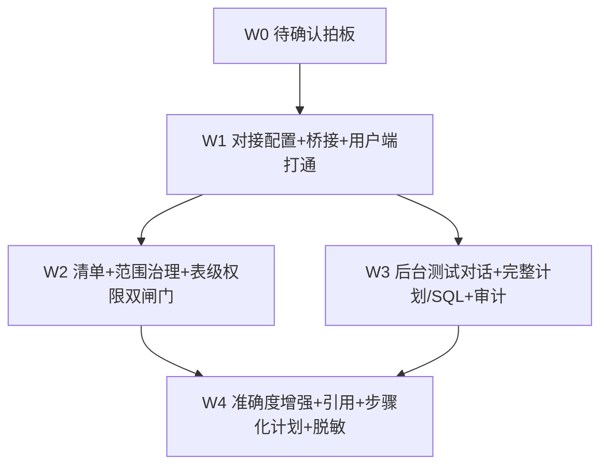

# MIS 平台对接 WrenAI 问数 APP — 任务分解（施工清单）

> 文档角色：基于 [`architecture.md`](architecture.md) 的**可执行有序任务列表**（规划阶段，只列任务不写代码）。
> 版本：v1.9｜日期：2026-08-22｜语言：中文｜状态：🔴 已修订（**v1.9 三处重大修订落盘（2026-08-22，主理人记录）**：① **A1 业务改判——落库改道**：表级 ACL 等问数配置**不落 ai_platform，改落 `mis_platform` 库**，对齐 **mis_kb 项目范式**，项目名 **`mis-tqd`**、表前缀 **`tqd_`**（替代 `wren_*`）；ADR-019 标记已替代、新增 **ADR-020** 固化新决策；② **命名统一**：项目/表/API/权限码/模块全部收敛 `tqd`，**对接外部 WrenAI 产品的适配层保留 wren**（命名边界见 architecture.md §1.5/§3.3）；③ **维度注册表提前一期 + 双维度一期**：`tqd_row_scope_dimension` 从二期 P2 提为**一期必做**、**部门不再特例**，一期同时支持「部门权限 + 门店权限」两个维度。**tasks.md 关键同步**：T-W0-01 探针 3e 更新（新增门店维度盘点：业务库是否有门店主数据表/门店层级/门店编码与平台映射）；T-W2-01 改「mis_platform + tqd_* 表 + Java 侧 `backend/mis-tqd` 实现 + `TqdConfigClient` 消费（不直连库） + Flyway `V71__tqd_schema.sql`」；T-W2-02a 改「维度注册表驱动 + 双维度 + `tqd_row_scope_dimension` 建表 + 种子 dept/store + 配置界面维度下拉」；T-W2-02b 改「维度遍历注入 + store ENUM 用例」；新增 T-W2-02c 维度注册表一期子任务（建表/种子/CRUD/同步扩展）；新增 ADR-019 修订 + ADR-020 编写任务；BFF 头注入按维度注册表遍历（`X-Mis-Dept-Scope` + `X-Mis-Stores`）；详见 architecture.md v1.9 §1.5/§3.2/§3.3/§3.6/§4.2.2 D.7–D.9/§5/§8/§9；**v1.8 A1/A5 拍板 + 行级权限放置/扩展设计落盘（2026-08-22，主理人记录）**：A1 当时确认——**表级 ACL 等 `wren_*` 问数配置落 `ai_platform` 库（Python 侧统一管理，BFF 经 HTTP 读写，不新建 Java 领域服务，建议发 ADR-019）**（**v1.9 已业务改判**，见上）；A5 已确认——**列级隔离本期不做、预留后期方案**（预留位点见 architecture.md §4.2.2 D.10）；T-W2-01 标注 A1 已确认（Python 侧模型 + BFF HTTP 读写，验收不变）、T-W2-02a 标注 `row_scope.type` 扩展点（org_auto/template，预留未来维度 type；维度注册表 `tqd_row_scope_dimension` 为二期 P2 不排本期）、A5 相关标注「列级隔离本期不做，masking.py 脱敏仍为唯一出口；预留列 ACL 扩展位（设计位点见 architecture.md D.10）」；T-W0-01 验收 2 更新（A1/A5 已确认）；对齐 architecture.md v1.8 §4.2.2 D.7/D.8 与 §8；**v1.7 A13 拍板 + 配置模型澄清落盘（2026-08-22，主理人记录）**：A13 三答已确认——**① 业务库部门编码与 mis_org 不统一主数据（暂时无关）→ 需要映射；② 业务库与 mis_platform 非同一实例 → 物化表（视图不可行）；③ 多数据源每库一张、集中定义从中心每日同步到各库**；T-W2-02a 字典表子项由「视图/物化表分叉」改「**物化表 + 中心每日同步**」，新增「同步任务（中心侧每日全量 upsert 幂等）+ 目标库注册（scope_sync_enabled，v1.9 由 dept_scope_sync_enabled 改名）」子项与「映射维护」子项（编码决策 X：dept_id=业务库编码 + mis_dept_id/dept_path=平台，中心侧映射），验收新增「配置界面：授权矩阵全局一处、表按数据源分组、row_scope 模板化、同角色批量套用」；T-W0-01 探针 3e 更新（库边界已确认非同一实例，剩余聚焦「业务库 DEPTID 编码体系现状盘点 + 与 mis_org 的映射可行性」）；详见 architecture.md §4.2.2 D.6 与 §8 A13；**v1.6 部门权限字典表方案落盘（2026-08-22，主理人记录）**：2a 由「直接 JOIN 平台内部 `sys_dept`」修订为「**JOIN/EXISTS 部门权限字典表 `mis_dept_scope`（表/视图）**」——同实例视图 / 跨实例物化表+同步 / 每库一张 / 编码对齐 A13 待确认；T-W0-01 探针 3d 实测对象更新为 mis_dept_scope 形态 + **新增 3e（库边界与编码对齐盘点）**；T-W2-02a 新增 mis_dept_scope 字典表子项（列结构/索引/MDL 注册/同步幂等）；T-W2-02b 黄金用例 JOIN/EXISTS 谓词引用 mis_dept_scope；详见 architecture.md §4.2.2 D.6 与 §8 A13；**v1.5 A12 拍板落盘（2026-08-22，主理人记录）**：A12 已由业务确认——**物化 `dept_path`，`PATH_PREFIX` 为唯一主路径，`CLOSURE_CTE` 不实现**；T-W2-02a 物化 dept_path 由「可选」改「必做」并含回填迁移/维护级联/`X-Mis-Dept-Scope` 头携带锚点 path；T-W2-02b 策略单测精简为 PATH_PREFIX/ENUM/FAIL_CLOSED；T-W0-01 探针 3b（方言矩阵）降级为「仅记录不阻塞」、新增 3d（`dept_path LIKE` 前缀实测）；v1.4 曾修订规模策略（mis-org 部门树规模上万 → BFF 身份头改 `X-Mis-Dept-Scope` 锚点+范围语义、注入前增规模分层策略层 `resolve_inject_strategy`、新增待拍板 A12、T-W0-01 加 3 项规模探针、T-W2-02a/b 验收同步）；v1.3 曾修订 A11 行级数据范围确认本期、T-W2-02 拆分为 a/b、验收标准更新；对齐 architecture.md v1.7 §4.2.2）
> 阶段对齐 PRD §8：W0 拍板 → W1 对接打通 → W2 范围治理 → W3 后台测试 → W4 准确度增强。
> 涉及文件均引用 `architecture.md` §3 的文件清单；依赖关系标注前序任务 ID。
> **桥接模型已定 MCP-first**：`mis-tqd` Worker 本地起 MCP client 连本机 `wren serve mcp @127.0.0.1`，**不再分 REST/MCP 两期**；前端/用户端绝不直连 MCP。

---

## 0. 任务总览图

> 约束：W1 解耦为「基础设施（T-W1-01）」与「打通（T-W1-02）」两段；W2/W3 仅依赖 W1 全线；W4 依赖 W2（ACL/范围已就绪才能脱敏与引用）与 W3（计划接口已就绪）。
> **本期必做（A11 已确认，2026-08-22）**：T-W2-02 行级数据范围（RLS 注入）挂在 W2 之下、依赖 T-W2-01，拆分为 T-W2-02a（数据模型 + 范围设置页）与 T-W2-02b（注入/校验算法 + 测试）；完整设计见 `architecture.md §4.2.2`。
> **v1.4 规模策略（2026-08-22，主理人确认部门树上万）**：注入通道改 `X-Mis-Dept-Scope` 锚点+范围语义，注入前经 `resolve_inject_strategy` 规模分层（ENUM/PATH_PREFIX/CLOSURE_CTE/FAIL_CLOSED，v1.5 已精简），详见 `architecture.md §4.2.2 A.1/C`；A12 当时待拍板、**v1.5 已确认物化 dept_path**。
> **v1.5 A12 拍板（2026-08-22，业务已确认，主理人记录）**：**物化 `dept_path`，`PATH_PREFIX` 为唯一主路径，`CLOSURE_CTE` 不实现**——策略精简为 PATH_PREFIX（主）/ ENUM（降级 ≤500）/ FAIL_CLOSED（兜底），详见 `architecture.md §4.2.2 C/D` 与 §8 A12。
> **v1.6 部门权限字典表方案（2026-08-22，业务提出方案，主理人记录）**：2a 的 JOIN 载体由「平台内部 `sys_dept`」改为「**部门权限字典表/视图 `mis_dept_scope`**」（业务库本地建，视图/物化表分叉由库边界探针 3e 决定）；`sys_dept` 不再直接进 WrenAI MDL 可见集合。详见 `architecture.md §4.2.2 D.6` 与 §8 A13。
> **v1.7 A13 拍板 + 配置模型澄清（2026-08-22，业务已确认，主理人记录）**：**① 业务库部门编码与 mis_org 不统一主数据（暂时无关）→ 需要映射；② 非同一实例 → 物化表（视图不可行）；③ 每库一张 + 集中定义从中心每日同步到各库**；编码对齐决策 **X（映射内嵌字典表）** 定案、中心每日同步任务细化、**配置面 vs 数据面**澄清（权限配置平台统一一处，不存在逐库配置权限）详见 architecture.md §4.2.2 D.6 与 §8 A13；T-W2-02a 字典表子项改「物化表 + 中心每日同步 + 目标库注册 + 映射维护」，验收新增配置界面四项。
> **v1.8 A1/A5 拍板 + 行级权限放置/扩展设计（2026-08-22，业务已确认，主理人记录）**：**A1——表级 ACL 等 `wren_*` 问数配置落 `ai_platform` 库（Python 侧统一管理，BFF 经 HTTP 读写，不新建 Java 领域服务，建议发 ADR-019）；A5——列级隔离本期不做、预留后期方案（预留位点见 architecture.md §4.2.2 D.8.2）**；新增 architecture.md §4.2.2 **D.7 行级权限数据三层放置 + 使用链路**（平台侧=配置+裁定 / mis-org 侧=授权源头 / 业务库侧=数据载体）与 **D.8 行级维度扩展设计**（`row_scope.type` 扩展点 / 维度注册表二期 P2 / 扩展步骤模板 + 门店示例 / 列级预留位点）；T-W2-01/T-W2-02a/T-W2-02b 已同步标注。

---

## W0 — 待确认拍板（规划/评审，无代码；v1.8：A1/A5 已确认；v1.9：A1 业务改判落 mis_platform，剩余 A2/A3/A6/A7/A8/A9/A10 执行期确认 + W0 实测）

### T-W0-01 架构与业务待确认项拍板（MCP-first 已定）

- **所属阶段**：W0
- **标题**：拉起 WrenAI 新线实例做 MCP 工具面实测 + 拍板 A1–A10（**A1 落库位置已改判（v1.9：落 mis_platform + backend/mis-tqd Java 侧，ADR-020 替代 ADR-019）、A5 列级隔离已确认（v1.8）、A11 行级范围已确认本期、A12 物化 dept_path 已确认（v1.5）、A13 部门编码对齐与字典表形态已确认（v1.7：不统一主数据→映射 / 非同一实例→物化表 / 每库一张+中心每日同步）、门店维度已确认一期（v1.9：双维度一期，见 architecture.md §4.2.2 D.8/D.9）**）
- **涉及文件**：
  - `agent/ai-platform/deploy/wrenai/README.md`（钉版本号 **`wren: v0.13.3`** / 项目 **`0.29.2`** + 实测 MCP 工具清单）
  - `docs/ai-fusion/wrenai/architecture.md`（A1–A13 待明确事项：A1–A10 待拍板，A11 已确认本期，**A12 已确认物化 dept_path（v1.5）**，**A13 已确认（v1.7：编码不统一→映射 X、非同一实例→物化表、每库一张+中心每日同步）**，**A1 已改判（v1.9：落 mis_platform）**，已据新线修订）
  - `docs/ai-fusion/wrenai/deploy-tqd.md`（部署速查，随实测补工具面细节）
- **依赖**：无
- **验收标准**：
  1. 已 `pip install wrenai` 拉起新线实例（A2），以 `wren --version` 实测钉版本 **`wren: v0.13.3`**（项目 **`0.29.2`**，2026-08-18），并书面确认 `wren serve mcp --transport http` 暴露的工具清单：`run_sql`/`dry_run`/`dry_plan`/`query_cube`/`get_mdl`/`list_models`/`describe_model`/`get_instructions`；**重点验证** `get_context`/`recall_queries`/`list_knowledge` 是否暴露**原生引用来源**（决定 Q5 原生引用如何归一化）；
  1b. 确认官方 MCP server 安全约束：**默认绑 127.0.0.1 + 本版本无 bearer-token 鉴权 + 默认只读**（写入需 `--allow-write`）——即「前端/用户端不直连 MCP」由官方约束兜底；验证凭证经 `wren profile` 注入为 **server-side**（不落平台/前端）；
  1c. 验证 MDL 建模流程：`wren context build`（MDL 文件 → 构建/部署）可跑通，替代旧 `/v1/mdl/deploy`；确认 wren-ui 是否随包发布（A3）；
  2. `architecture.md §8` 的 A1（**✅ v1.9 已改判：ACL 落 mis_platform，Java 侧 backend/mis-tqd 管理，Worker TqdConfigClient API+缓存消费，ADR-020 替代 ADR-019**；v1.8 原裁定落 ai-platform 为历史记录）、A5（✅ v1.8 已确认：列级隔离本期不做、预留位点见 §4.2.2 D.10）、A7（`452xx` 错误码段可用）已获架构/业务签字；
  3. 产出《WrenAI 新线对接实测报告》与《Q1–Q10 拍板结论》两份记录，附版本号与 MCP 工具清单。
  3a. **（v1.4 探针①，保留）超大 IN 实测**：向 wren-core / 业务库注入 5k / 10k 项 `IN` 列表，实测行为与**报错阈值**（parser/plan 拒绝？SQL 体积上限？），写入实测报告；结论用于**校准 `ENUM_LIMIT`（默认 500）** 与 FAIL_CLOSED 触发条件（ENUM 为降级路径，见 architecture.md §4.2.2 C）；
  3b. **（v1.4 探针②，v1.5 降级为「仅记录不阻塞」）方言支持矩阵**：~~实测 wren-core DataFusion 对 CTE / VALUES 派生表 / 子查询 IN / LIKE 前缀匹配的支持矩阵（结论曾决定 PATH_PREFIX 与 CLOSURE_CTE 策略的方言前置条件）~~ —— **CLOSURE_CTE 已拍板不实现（A12，v1.5）**，CTE/VALUES/子查询 IN 的方言矩阵**不再作为阻塞项**；仅顺带记录结果备查，不阻塞 W1/W2 排期。**LIKE 前缀匹配的实测移到 3d（PATH_PREFIX 主路径的谓词形态验证）**；
  3c. **（v1.4 探针③，保留）部门树规模与 path 现状盘点**：运维/业务确认 mis-org 实际部门树规模（万级？十万级？）、`sys_dept` 新增物化 `dept_path` 列的实施窗口（✅ A12 已确认物化，v1.5；含 V70 迁移回填与 `DeptService` 维护逻辑改造点复核：create/relocate/根创建）、业务库各表条件列现状（dept_id / 是否已冗余 path），结论支持 T-W2-02a 落地排期；
  3d. **（v1.5 探针④，v1.6 修订实测对象为 `mis_dept_scope` 形态）`dept_path LIKE` 前缀实测**：向 wren-core / 业务库注入 `col = '<path>' OR col LIKE '<path>/%'` 谓词（含 2a 的 `EXISTS (SELECT 1 FROM mis_dept_scope d WHERE d.dept_id = t.dept_id AND (d.dept_path = '
' OR d.dept_path LIKE '
/%'))` JOIN 形态——**v1.6 由「JOIN `sys_dept`」改为字典表形态**），实测可解析、可执行、性能与索引命中（`mis_dept_scope.dept_path` btree 前缀 LIKE）；**结论决定 PATH_PREFIX 注入改写形态与 `mis_dept_scope` 字典表是否需注册进 WrenAI MDL 可见范围**（若 JOIN 不可行 → 该表降级 ENUM/FAIL_CLOSED，见 architecture.md §4.2.2 C/D.6）。
  3e. **（v1.6 探针⑤，v1.7 更新：库边界已确认，聚焦编码盘点与映射可行性；v1.9 新增门店维度盘点）库边界与编码对齐盘点 + 门店维度现状**：~~① **业务库与 mis_platform 是否同一数据库实例**（同实例可走视图；跨实例必须物化表+同步）——现状：**未知**，需运维/DBA 确认~~ —— **✅ 已确认（A13②，2026-08-22）：非同一实例 → 物化表必选（视图不可行）**；② **业务库 DEPTID 与 mis-org 部门 ID（`sys_dept.id`）是否同一套主数据**——**✅ 已确认（A13①）：不统一主数据（暂时无关）→ 需要映射（决策 X：`mis_dept_scope.dept_id` 存业务库编码 + `mis_dept_id`/`dept_path` 存平台，中心侧映射）**；③ 多业务库清单与各库是否需独立字典表——**✅ 已确认（A13③）：每库一张 + 中心每日同步**。**v1.7 剩余探针聚焦**：**业务库 DEPTID 编码体系现状盘点**（dept_id 数值/字符串？是否 ODS dept_code？各库是否一致？）**+ 与 mis_org 的映射可行性**（业务库是否已有 `dept_code ↔ mis_dept_id` 现成对应列→零维护；无则确认 `mis_dept_mapping` 映射表维护路径与数据管理员），结论决定 T-W2-02a 映射维护子项是否需要 UI（见 architecture.md §4.2.2 D.6.3/D.6.4）。**v1.9 新增 3e-门店维度盘点（支撑 T-W2-02a store 维度实例化，见 architecture.md §4.2.2 D.9）**：① 业务库**是否有门店主数据表**（如 `dim_store`/`t_store`，权威性/字段 `store_id` 编码类型）；② **门店是否有层级**（区域/加盟/直营维度，决定一期扁平 ENUM ≤500 是否成立，>500 且无层级 → FAIL_CLOSED 需业务治理授权粒度，有层级 → 评估 store_path 演进）；③ **门店编码与平台是否需映射**（`store_id`=业务库编码 + `mis_store_id`=平台，或复用业务库主数据编码零映射）；④ 用户-门店授权现状（平台 RBAC 是否已有门店数据权限，或需 `user.store_ids` 最小实现），结论决定 T-W2-02a store 维度行权来源与字典表形态（`mis_store_scope` vs 复用主数据表）。

---

## W1 — 对接配置 + 桥接 Worker + 用户端问数打通（FR-CFG / FR-BRG / R1/R2）

### T-W1-01 项目基础设施与数据模型

- **所属阶段**：W1（基础设施）
- **标题**：mis-tqd Java 模块骨架（v1.9：落 mis_platform + `backend/mis-tqd`，对齐 mis-kb 范式）、建表、建连接配置骨架、注册 Worker、BFF/前端骨架
- **涉及文件**：
  - `backend/mis-tqd/pom.xml`（新增，Java 模块依赖：Spring Boot Web / JPA / Flyway，对齐 mis-kb 模块 pom）
  - `backend/mis-tqd/src/main/java/com/mis/tqd/domain/entity/TqdConnection.java`、`TqdDatasource.java`、`TqdModelSnapshot.java`、`TqdCatalogItem.java`、`TqdScopePolicy.java`、`TqdTableAcl.java`、`TqdSqlPair.java`、`TqdKnowledge.java`、`TqdMaskRule.java`、`TqdAskLog.java`（新增，JPA 实体，BIGINT 自增 PK，对齐 mis_platform V12 风格；v1.9 由 Python ORM 迁入 Java 侧）
  - `backend/mis-tqd/src/main/java/com/mis/tqd/domain/repository/*.java`（新增，Spring Data JPA Repository，对齐 mis-kb repository 分层）
  - `backend/mis-migrator/src/main/resources/db/migration/V71__tqd_schema.sql`（新增，`tqd_*` 建表 DDL：BIGINT 自增 PK + created_at/updated_at TIMESTAMPTZ，对齐 V12__kb_schema.sql 风格；含 `tqd_row_scope_dimension` 维度注册表建表 + 种子 dept/store，见 §4.2.2 D.8.1；v1.9 替代原 `agent/ai-platform/deploy/sql/tqd_tables.sql` Python create_all 方案）
  - `agent/ai-platform/backend/src/config.py`（改，追加 `TqdMcpSettings` 段 + `TqdConfigClientSettings`（mis-tqd 配置读取 API 地址，v1.9））
  - `agent/ai-platform/backend/pyproject.toml`（改，追加 `sqlglot`）
  - `agent/ai-platform/backend/src/adapters/tqd_config_client.py`（新增，v1.9：配置读取 API 客户端，对齐 `kb_client.py` 范式，见 architecture.md §4.2.2 D.7.3）
  - `agent/ai-platform/configs/agents/mis-tqd/agent.yaml`、`metadata.yaml`、`runtime/runtime.yaml`、`runtime/prompts/system.md`、`system/model.yaml`、`identity/access-control.yaml`、`memory/personality.md`、`eval/golden-questions.yaml`（新增 Worker 配置，对齐 §7.8 第 1–9 项）
  - `agent/ai-platform/configs/agents/mis-copilot/coordination.yaml`（改，`worker_ids` 追加 `mis-tqd`）
  - Nacos `ai-platform.yaml`（改，`wren.mcp-host`/`mcp-port`/`mcp-transport`/`mcp-allow-write`/`cli-bin`/`profile-name`/`language`；**不含 WrenAI 凭证**；v1.9 追加 `tqd.internal-api-base-url`）
- **依赖**：无（或 T-W0-01 完成后启动）
- **验收标准**：
  1. Flyway `V71__tqd_schema.sql` 执行后 `mis_platform` 库出现 `tqd_connection` 等 11 张表（含 `tqd_row_scope_dimension` 维度注册表 + 种子 dept/store），字段与 `architecture.md §4.2` 逐一对应（v1.9：BIGINT 自增 PK，非 Python create_all）；
  2. `backend/mis-tqd` 模块可编译启动，JPA 实体/Repository 与 V71 表结构对应（对齐 mis-kb 模块分层）；
  3. `mis-tqd` 出现在 `mis-copilot` 委派白名单；`INVOKE_AGENT_WHITELIST` 含 `mis-tqd`；`role=worker`、`max_depth=1`；
  4. 启动无报错，`GET /health` 正常；`TqdConfigClient` 配置读取 API 客户端可连通 mis-tqd `/internal/v1/tqd/**`（健康检查/空配置拉取）；
  5. `golden-questions.yaml` 至少 5 条，含「命中表 / 口径正确 / 前端无 SQL 泄漏」断言。

### T-W1-02 对接配置 + 桥接 Worker + 用户端问数打通

- **所属阶段**：W1（打通）
- **标题**：连接配置 CRUD/自检、WrenAI 客户端、AskOrchestrator、权限双闸门、SSE 透传、前端问数扩展
- **涉及文件**：
  - `agent/ai-platform/backend/src/adapters/tqd_mcp_client.py`（新增，本地 MCP client，工具名模块常量）+ `agent/ai-platform/backend/src/adapters/tqd_cli.py`（新增，本地 CLI：profile / context build）
  - `agent/ai-platform/backend/src/agent/mis_tqd/orchestrator.py`、`scope_resolver.py`、`lineage.py`、`plan_mapper.py`、`projector.py`（新增）
  - `agent/ai-platform/backend/src/agent/mis_tqd/service.py`、`tools.py`（新增）
  - `agent/ai-platform/backend/src/api/routes/tqd.py`（新增，管理面 `/api/v1/tqd/**`）
  - `agent/ai-platform/backend/src/main.py`（改，include tqd_router）
  - `backend/mis-admin-bff/.../controller/TqdController.java`、`TqdAskController.java`（新增）
  - `backend/mis-admin-bff/.../client/TqdClient.java`（新增，继承 `AbstractDownstreamClient`，SSE 用 `Flux<ServerSentEvent<String>>`）
  - `backend/mis-admin-bff/.../service/wrenai/TqdFacadeService.java`、`TqdAskFacadeService.java`（新增）
  - `backend/mis-admin-bff/.../dto/wrenai/*.java`（新增，约 14 个 DTO，snake_case 透传）
  - `backend/mis-admin-bff/src/main/resources/application.yml`（改，ask-timeout-ms / sse-enabled / admin-view-permission）
  - `frontend/mis-admin-web/src/features/agent/ai/components/wren-citation-block.tsx`、`wren-plan-steps.tsx`（新增，用户端引用+步骤）
  - `frontend/mis-admin-web/src/features/agent/ai/ai-chat-panel.tsx`（改，挂载扩展块）
  - `frontend/mis-admin-web/src/features/agent/ai/data-query-page.tsx`、`services/skill-dispatch.ts`（改，建议词/文案）
  - `backend/mis-migrator/src/main/resources/db/migration/V69__tqd_menu_api_seed.sql`（新增，sys_menu+sys_api+sys_menu_api，含 `ai:chat:use` 复用登记）
- **依赖**：T-W1-01
- **验收标准**：
  1. 后端 `PUT /api/v1/tqd/config` 保存连接，`GET` 密钥恒返回 `******`；`POST /config/test` 调 `wren_mcp_client.health()` 返回已连接；
  2. 用户端 `/ai/data-query` 输入自然语言 → SSE `ask-stream` → 经 Coordinator→mis-tqd → WrenAI → 返回 answer+citations+plan；抓包确认**前端无 WrenAI 域名/密钥**；
  3. 双闸门生效：无 `ai:chat:use` 者 40300；`scope_resolver` 对空范围返回 `45204`（DENY）且**不返回任何数据/SQL**；
  4. `view=user` 响应经 `ResponseProjector._strip_sql()` 删键，前端 `wren-plan-steps.tsx` props 无 `sql` 字段（类型级保险）；
  5. `V69` 全端点 `sys_menu_api` 绑定齐全，`deny-unmapped` 下无 40300；
  6. Golden path：问「本月各渠道销售额」返回答案+图表摘要，SQL 仅后台可见。

---

## W2 — 可对接清单 + 范围治理 + 表级权限双闸门（FR-INV / FR-PERM / R3/R4）

### T-W2-01 清单浏览 + 范围治理 + 表级 ACL 双闸门

- **所属阶段**：W2
- **标题**：catalog 拉取/树、范围策略、表级 ACL（**v1.9：A1 改判——落 mis_platform + Java 侧 `backend/mis-tqd` + Worker `TqdConfigClient` 消费，ADR-020 替代 ADR-019**）、脱敏规则种子、作用域二次裁定
- **说明**：**v1.9（A1 业务改判，2026-08-22，主理人记录）**——表级 ACL 等 `tqd_*` 问数配置**落 `mis_platform` 库**（对齐 mis_kb 项目范式：kb_* 表在 mis_platform 库），Java 侧 **`backend/mis-tqd`**（entity/repository/service/controller，对齐 mis-kb 分层）统一管理；BFF（`TqdAclController`）对外经 `/api/v1/tqd/**` HTTP 读写（权限码 `tqd:*`）；**Worker 不直连 mis_platform 库**，经 `TqdConfigClient` 调 mis-tqd `TqdInternalController` `/internal/v1/tqd/**` 配置读取 API + 本地缓存消费（启动全量加载 + 变更事件刷新 + 每日定期兜底；缓存不可得 fail-closed 45204，见 architecture.md §4.2.2 D.7.3）；Flyway `V71__tqd_schema.sql`（backend/mis-migrator）。**验收不变**（双闸门语义不变：BFF 功能码 + Worker 侧二次裁定；变更生效从「无缓存立即生效」改为「事件推送默认 ≤10s 生效，缓存不可得 fail-closed 45204」）。**v1.8（A5 已确认）**——列级隔离本期不做：`masking.py` 脱敏仍为唯一出口，预留列 ACL 扩展位（`column_acl` 数据位 / 脱敏与列 ACL 分层 / SQL 投影列裁剪注入位点，设计位点见 architecture.md §4.2.2 D.10），**本期无列裁剪实现**。
- **涉及文件**：
  - `backend/mis-tqd/src/main/java/com/mis/tqd/domain/entity/TqdCatalogItem.java`、`TqdScopePolicy.java`、`TqdTableAcl.java`、`TqdMaskRule.java`（JPA 实体，v1.9）
  - `backend/mis-tqd/src/main/java/com/mis/tqd/domain/repository/*.java`（JPA Repository，v1.9）
  - `backend/mis-tqd/src/main/java/com/mis/tqd/domain/service/TqdAdminService.java`（新增，v1.9：连接/清单/范围/ACL/脱敏规则 CRUD + 变更事件推送）
  - `backend/mis-tqd/src/main/java/com/mis/tqd/api/controller/TqdController.java`（新增，v1.9：管理面 `/api/v1/tqd/**` 或内部 `/internal/v1/tqd/**` 分类挂载）
  - `backend/mis-tqd/src/main/java/com/mis/tqd/api/controller/TqdInternalController.java`（新增，v1.9：配置读取 API `/internal/v1/tqd/**`：get-acls / get-scope-policies / get-mask-rules / get-dict-sync-status，供 Worker `TqdConfigClient` 消费，对齐 `/internal/v1/kb/**`）
  - `agent/ai-platform/backend/src/agent/mis_tqd/scope_resolver.py`（改，v1.9：配置来源由「同进程读 ORM」改为「`TqdConfigClient` 缓存」）
  - `agent/ai-platform/backend/src/agent/mis_tqd/masking.py`（新增，唯一脱敏出口，对齐 §7.5；规则配置经 `TqdConfigClient` 缓存读取）
  - `agent/ai-platform/backend/src/adapters/tqd_config_client.py`（扩，v1.9：get-acls / get-mask-rules 等增量拉取 + 变更事件订阅）
  - `backend/mis-admin-bff/.../controller/TqdAclController.java`（新增）
  - `backend/mis-admin-bff/.../service/wrenai/TqdFacadeService.java`（扩：清单树装配、范围批量提交）
  - `frontend/mis-admin-web/src/features/agent/tqd/wrenai-catalog-page.tsx`、`wren-catalog-tree.tsx`、`wrenai-scope-page.tsx`、`wren-scope-table.tsx`、`wren-acl-dialog.tsx`（新增）
  - `frontend/mis-admin-web/src/features/agent/tqd/api/wrenai-api.ts`、`types.ts`（新增）
  - `frontend/mis-admin-web/src/lib/nav/agent-nav.ts`、`components/layout/keep-alive-outlet.tsx`、`lib/nav/icons.ts`（改，四处同改①②③⑤）
  - `frontend/mis-admin-web/src/features/agent/pages.ts`（改，桶导出 5 页）
  - `backend/mis-migrator/src/main/resources/db/migration/V71__tqd_schema.sql`（扩：catalog/scope/acl 相关表 + `tqd_row_scope_dimension` 维度注册表；菜单/API 种子见 V69 或 V71 内 `sys_menu`/`sys_api` 登记）
- **依赖**：T-W1-02（桥接与主数据表就绪）
- **验收标准**：
  1. 后台 `/agent/tqd/catalog` 左树可展开到字段级、右栏可分 model/relationship/metric/dimension 展示（FR-INV-1/2）；
  2. `/agent/tqd/scope` 勾选「纳入问数范围」保存后，`tqd_catalog_item.in_scope` 与 `tqd_scope_policy` 一致更新（FR-INV-3）；生效经变更事件推送 → Worker 缓存刷新（默认 ≤10s；缓存不可得 fail-closed 45204）；
  3. 表级 ACL：`tqd_table_acl action=ask` 授权后，越权角色问数返回 `45204`，授权角色可问对应表（FR-PERM-2 双闸门实物）；
  4. 脱敏：对 `tqd_mask_rule` + `sensitive_level` 命中的字段，结果经 `MaskingEngine` 脱敏（`138****0000` 等，对齐 03-security §9.3）；
  5. 前端导航四处同改齐：侧栏可见 5 个 `wrenai` 入口，icon 不回退 LayoutDashboard；
  6. 黄金用例 G3/G4 通过（越权被拒、范围约束生效）；
  7. **（v1.9 新增）** `backend/mis-tqd` 的 `TqdInternalController` `/internal/v1/tqd/**` 配置读取 API 可被 `TqdConfigClient` 正常拉取（ACL/范围/脱敏规则/维度注册表），Worker 配置消费链路（启动全量 + 事件增量 + 每日兜底）验收通过。

### T-W2-02a 行级数据范围·数据模型 + 范围设置页（✅ A11 已确认本期；v1.4 头语义修订；v1.5 A12 已确认物化 dept_path；v1.6 新增 mis_dept_scope 字典表；v1.7 A13 已确认——物化表+中心每日同步+编码映射；v1.9 维度注册表一期 + 双维度 + Java 侧）

- **所属阶段**：W2（范围治理扩展）
- **标题**：**`tqd_row_scope_dimension` 维度注册表（v1.9 一期必做：建表 + 种子 dept/store，Java 侧 `TqdAdminService` 管理）** + `tqd_table_acl.row_scope` 维度实例数据模型 + BFF **`X-Mis-Dept-Scope` 锚点+范围语义头（v1.5 起携带锚点 `path`）+ `X-Mis-Stores`（v1.9 门店头）** + **mis-org 物化 `dept_path`（✅ A12 已确认，必做）** + **部门权限字典表 `mis_dept_scope`（v1.6 新增；v1.7 A13 定案：物化表 + 中心每日同步 + 编码映射 X）+ 门店字典 `mis_store_scope`（v1.9 新增，见 §4.2.2 D.9.3）** + 后台行级范围编辑/校验/预览（**v1.9：维度下拉替代原模式选择，可多维度 AND 叠加，见 architecture.md §4.2.2 D.8**）
- **说明**：复用平台数据权限（dept 树/数据权限 + v1.9 门店权限）做行级条件来源。`row_scope` 支持**单维度实例**（`{"dimension":"dept",...}` / `{"dimension":"store",...}`）与**多维度数组**（`{"dimensions":[...]}` AND 叠加）；`dimension` 引用维度注册表 `tqd_row_scope_dimension`；自动模式（`auto_mode=true`，BFF 按数据权限展开）与手动模板（`auto_mode=false` + 参数绑定，白名单由注册表 `param_whitelist` 约束）两态。数据模型与交互细节见 `architecture.md §4.2.2` A/A.1/B/D。**v1.9 关键变化（维度注册表一期 + 双维度）**：`row_scope.type`（org_auto/template）**废弃**，改为维度注册表驱动；`tqd_row_scope_dimension` **一期必做**（非 v1.8 的二期 P2），种子 `dept`（predicate_type=PATH_PREFIX，列 `dept_id`，头 `X-Mis-Dept-Scope`，字典 `mis_dept_scope`）+ `store`（predicate_type=ENUM 一期默认，列 `store_id`，头 `X-Mis-Stores`，字典 `mis_store_scope`）；**一表可多维度 AND 叠加**（部门+门店同表共存）；BFF 头注入按维度注册表遍历（有部门授权注 `X-Mis-Dept-Scope`、有门店授权注 `X-Mis-Stores`，无该维度授权不注；维度已配但无头 → fail-closed 45204）；落库 **mis_platform**（Java 侧 `backend/mis-tqd`，Flyway `V71__tqd_schema.sql`）；存量 `org_auto`/`template` 迁移映射见 architecture.md §4.2.2 D.8.2。**v1.4 关键变化**：BFF 身份头由「全量可见部门集合 `X-Mis-Depts`」改为「**可见锚点集合 + 每锚点范围语义 `X-Mis-Dept-Scope`**」（体积 O(锚点数)，与部门树规模解耦）；`X-Mis-Depts` 保留小规模兼容（≤500）。**v1.5 关键变化（A12 拍板）**：mis-org **物化 `dept_path` 为必做**（PATH_PREFIX 唯一主路径，CLOSURE_CTE 不实现）；`X-Mis-Dept-Scope` 头元素新增锚点 `path`（BFF 从 mis-org 取，Worker 零查询）。**v1.6 关键变化（部门权限字典表方案）**：2a 的 JOIN 载体由 `sys_dept` 改为 **业务库本地 `mis_dept_scope` 字典表/视图**。**v1.7 关键变化（A13 拍板 + 配置模型澄清）**：**① 编码不统一 → 映射（决策 X）；② 非同一实例 → 物化表必选；③ 每库一张 + 中心每日同步**；新增「同步任务 + 目标库注册（v1.9 改名 `scope_sync_enabled`）」与「映射维护」子项。落地设计见 `architecture.md §4.2.2 D.6/D.8/D.9`。
- **涉及文件**：
  - `backend/mis-tqd/.../domain/entity/TqdRowScopeDimension.java`（新增，v1.9：维度注册表实体：dimension_code/dimension_name/predicate_type/column_name/header_name/param_whitelist/dict_table/auto_mode/enabled/sort）
  - `backend/mis-tqd/.../domain/repository/TqdRowScopeDimensionRepository.java`（新增，v1.9）
  - `backend/mis-tqd/.../domain/service/TqdAdminService.java`（扩，v1.9：`crud_dimension`（维度注册表 CRUD）+ `row_scope` 读写/校验 + 变更事件推送）
  - `backend/mis-tqd/.../domain/service/TqdScopeSyncJobService.java`（新增，v1.9：中心每日同步按维度注册表遍历 dept/store 字典，见 §4.2.2 D.6.4/D.9.4）
  - `backend/mis-tqd/.../api/controller/TqdInternalController.java`（扩，v1.9：`get-dimensions` 配置读取 API）
  - `agent/ai-platform/backend/src/models/tqd_schema.py`（改，v1.9：`RowScopeConfig` 改 `dimension`/`dimensions` 语义 + `RowScopeDimension` DTO；原 Python ORM 移除后 DTO 保留于 Worker 侧）
  - `agent/ai-platform/backend/src/agent/mis_tqd/service.py`（扩，v1.9：经 `TqdConfigClient` 读维度注册表 + row_scope 校验 + 模拟角色预览展开）
  - `agent/ai-platform/backend/src/adapters/tqd_config_client.py`（扩，v1.9：get-dimensions 缓存）
  - `backend/mis-admin-bff/.../client/AiPlatformClient.java`（扩，v1.9：`buildMisEnrichmentHeaders()` 按维度注册表遍历——dept 维度解析任职锚点注入 **`X-Mis-Dept-Scope`**（锚点+path+scope），store 维度解析门店授权注入 **`X-Mis-Stores`**（可见门店集合/锚点），无该维度授权则不注入；`X-Mis-Orgs` 同理；小规模兼容按需回填 `X-Mis-Depts`）
  - `backend/mis-admin-bff/.../service/tqd/TqdIdentityHeaderService.java`（新增，v1.9：头注入维度遍历服务，读 mis-tqd 维度注册表缓存）
  - `backend/mis-admin-bff/.../dto/wrenai/*.java`（扩：row_scope 透传 DTO，snake_case）
  - `frontend/mis-admin-web/src/features/agent/tqd/wrenai-scope-page.tsx`、`wren-acl-dialog.tsx`（扩：行级条件编辑弹窗：**维度下拉（v1.9 替代模式选择，可添加多维度）** / 列下拉 / 范围语义 / 自动-手动切换 / 校验 / 试算 / 模拟角色预览，预览按策略形态展示）
  - `frontend/mis-admin-web/src/features/agent/tqd/api/wrenai-api.ts`、`types.ts`（扩：row_scope + dimension 类型）
  - `backend/mis-migrator/src/main/resources/db/migration/V71__tqd_schema.sql`（扩：`tqd_row_scope_dimension` 建表 + 种子 dept/store，见 architecture.md §4.2.2 D.8.1）
  - **（A12 已确认，必做）** `backend/mis-org`：`SysDept` 实体 + `sys_dept` DDL 新增物化 `dept_path` 列（格式 `/0/<rootId>/<…>/<selfId>/`，含自身、保留虚拟根 `0`）；`DeptService` 新增 `buildDeptPath`/`rebuildDeptPath` 并与 `buildAncestors`/`rebuildAncestors` 在 **create / relocate（含子孙级联） / 根部门创建** 成对赋值（一处改动原则）；**Flyway `V70__org_dept_path_materialized.sql` 幂等回填存量 + `idx_dept_path` 索引**（设计见 architecture.md §4.2.2 D.1–D.3）
  - **（v1.6 新增，v1.7 A13 定案，部门权限字典表）`mis_dept_scope` 落地（物化表 + 中心每日同步 + 编码映射 X）**：
    - **物化表（必选，视图不可行：非同一实例 A13②）**：业务库侧 `CREATE TABLE mis_dept_scope (dept_id BIGINT PK /*业务库编码 A13①*/, mis_dept_id BIGINT /*平台 mis-org 侧 id*/, dept_name VARCHAR(255), dept_path VARCHAR(1024), updated_at TIMESTAMPTZ)` + `idx_mis_dept_scope_path` 索引（SQL 见 architecture.md §4.2.2 D.6.2；同库视图 SQL 仅保留为未来收敛演进参考）
    - **同步任务（中心侧每日全量 upsert 幂等，v1.9 归属 Java 侧）**：mis-tqd 定时作业 `TqdScopeSyncJobService.sync_scope_dict_job` 按 `tqd_datasource.scope_sync_enabled=true` 清单 + **维度注册表遍历**（dept → `mis_dept_scope`；store → `mis_store_scope`）循环，读 mis-org/门店主数据只读数据 → 逐库 `INSERT … ON CONFLICT (key) DO UPDATE`（重跑幂等）；失败重试 → 告警 → 该连接行级降级 ENUM/FAIL_CLOSED（45204，不静默放行）；同步完成发 `tqd.config.changed` → Worker 缓存刷新（v1.9，见 architecture.md §4.2.2 D.6.4/D.9.4）
    - **目标库注册（一次性接入，非权限配置）**：`tqd_datasource` 新增 `scope_sync_enabled`（v1.9 由 `dept_scope_sync_enabled` 改名），接入新业务库时注册该库连接 + 启用字典同步（A13③）
    - **编码映射（A13①，决策 X）**：`dept_id` 存业务库编码 + `mis_dept_id`/`dept_path` 存平台（中心侧映射）；映射来源优先业务库现成 `dept_code ↔ mis_dept_id` 对应列（零维护），否则中心侧 `mis_dept_mapping` 映射表 + 映射维护界面（数据管理员批量导入/修正，非权限配置）（见 architecture.md §4.2.2 D.6.3）
    - **MDL 注册**：`mis_dept_scope` / `mis_store_scope` 注册进 WrenAI 项目 MDL 可见集合（`tqd_catalog_item` 有该表条目，描述标记「内部字典表，仅行级注入使用」），**不纳入问数 ACL**（`tqd_scope_policy` 不勾选、`tqd_table_acl` 不给 `ask`）
  - **（v1.9 新增，store 维度字典表/复用，见 §4.2.2 D.9.3）`mis_store_scope` 落地**：业务库侧建 `mis_store_scope`（store_id=业务库编码 + mis_store_id/store_name/store_path（预留，一期可 NULL））；**或复用业务库门店主数据表**（判定条件：表存在且权威、store_id 编码与业务表条件列一致、注入无需暴露平台内部字段，满足则 `tqd_row_scope_dimension.dict_table=NULL`）；store 一期扁平 ENUM，注入谓词 `store_id IN (BFF 头携带列表)` **不依赖字典 JOIN**（列表已在 `X-Mis-Stores` 头中）
  - **（v1.9 新增，store 行权来源，见 §4.2.2 D.9.2）用户门店授权**：目标形态平台 RBAC 扩展 `perm_type=store`；一期最小实现 `user.store_ids` JSONB（或 `mis_user_store` 关联表），BFF 读 `user.store_ids` → 注入 `X-Mis-Stores`
  - `backend/mis-admin-bff`：锚点展开时从 mis-org 取各锚点 `dept_path` 注入 `X-Mis-Dept-Scope`；从 `user.store_ids`/RBAC 门店授权解析注入 `X-Mis-Stores`（Worker 零查询，见 architecture.md §4.2.2 D.5/D.9.2）
- **依赖**：T-W2-01（ACL/范围就绪后才有 row_scope 编辑与注入）；**T-W0-01 探针③（部门树规模与 path 现状盘点）确认物化实施窗口、探针 3d（`dept_path LIKE` 实测，v1.6 实测对象为 mis_dept_scope 物化表形态）确认注入形态、探针 3e（v1.7 更新：库边界已确认非同一实例，剩余聚焦「业务库 DEPTID 编码体系盘点 + 与 mis_org 的映射可行性」；**v1.9 新增门店维度盘点：门店主数据表/层级/编码映射/用户门店授权现状**）确认映射维护路径与 store 维度实例化**（A12 已确认物化，v1.5；A13 已确认：物化表 + 中心每日同步 + 编码映射 X，v1.7；双维度一期已确认，v1.9）
- **验收标准**：
  1. `tqd_row_scope_dimension` 维度注册表已建表（mis_platform 库，Flyway V71）且有种子两条 `dept`/`store`（predicate_type/column_name/header_name/dict_table/auto_mode 正确，见 architecture.md §4.2.2 D.8.1）；Java 侧 `TqdAdminService.crud_dimension` 可增删改查注册表（enabled 开关生效）；
  2. 授权时可为「角色 × 表」配置行级条件：**选维度（dept/store 下拉，数据来自注册表）→ 绑定列 → 范围语义 → 自动/手动**，保存到 `tqd_table_acl.row_scope`（单维度对象或 `dimensions` 数组 AND 叠加）；手动模式参数来源白名单 = 注册表 `param_whitelist`；
  3. 模板校验生效：维度存在性 / 列存在性 / 白名单语法（禁函数/子查询/注释/多语句）/ 参数引用完整，任一失败禁止保存并给出具体原因；
  4. BFF **`X-Mis-Dept-Scope` 已注入锚点+范围语义+锚点 `path`**（头体积 O(锚点数)）：data_scope=3 用户注入 `[{"id":"A","path":"/0/1/A/","scope":"dept_subtree"}]` 形态；**`X-Mis-Stores` 已按 `user.store_ids` 注入可见门店集合**（`["S001","S002"]` 形态，v1.9）；无该维度授权则不注入该头；小规模兼容回填 `X-Mis-Depts` ≤500 时形态 `[{"id":"A"},{"id":"A1"},{"id":"A2"}]`；
  5. 生效前预览：选择模拟角色 → 展示该角色经行级范围展开后的 WHERE 片段（**按维度与策略形态**：dept 主路径 `dept_path = '/0/1/A/' OR dept_path LIKE '/0/1/A/%'`；store 扁平 `store_id IN ('S001','S002')`；多维度 AND 拼接）；
  6. `row_scope=NULL` = 全行可见（向后兼容）；撤销 ACL 随行删除；**保存后经变更事件推送 → Worker 缓存刷新（默认 ≤10s 生效；缓存不可得 fail-closed 45204，v1.9）**；
  7. **（A12 已确认，必做）** mis-org `sys_dept.dept_path` 物化列已建（V70 迁移幂等回填存量 + 索引），`DeptService` create/relocate（含部门移动子孙级联）/根创建已同步维护；**部门移动后 path 级联正确（黄金用例：移动 A 到 X 下后，A 及子孙 `dept_path` 全部以 `/…/X/A/` 开头，任意深度子树 LIKE 命中）**；BFF 头锚点携带 `dept_path`（Worker 零查询）。
  8. **（v1.6 新增，v1.7 A13 定案，mis_dept_scope 字典表）** 业务库本地 `mis_dept_scope` **物化表**已落地（A13② 非同一实例 → 视图不可行）：**中心每日同步任务可重复执行且幂等**（`ON CONFLICT (dept_id) DO UPDATE`，重跑不产生重复行、结果一致），同步失败重试后仍有告警且该连接行级降级走 ENUM/FAIL_CLOSED（45204，不静默放行）；`scope_sync_enabled=true`（v1.9 由 `dept_scope_sync_enabled` 改名）的目标库清单可注册/启停（一次性接入，非权限配置）；**编码映射 X 已体现**（`dept_id`=业务库编码 + `mis_dept_id`/`dept_path`=平台，中心侧映射；业务库无现成对应列时 `mis_dept_mapping` 映射表已可维护）；`mis_dept_scope` 已注册进 WrenAI MDL 可见集合（描述标记「内部字典表」）且**不纳入问数 ACL**。
  9. **（v1.9 新增，store 维度实例化）** `mis_store_scope` 已建（或复用门店主数据表，`dict_table=NULL`）；`X-Mis-Stores` 头注入链路（`user.store_ids` → BFF → Worker）打通；中心同步按维度注册表遍历 dept + store 均成功（`tqd_scope_dict_sync` 每维度一行状态）；维度已配置但请求无对应头 → fail-closed 45204（不降级为全行可见）。
  10. **（v1.7 新增，配置界面验收——配置面 vs 数据面，D.6.6）** 权限配置界面为**授权矩阵全局一处**：行为角色、列为表且**按数据源分组展示**；**row_scope 模板化**——「角色 × 表」一格按维度实例（单维度或多维度 AND 叠加），运行时按当前问数用户授权注入；支持**同一角色对多表批量套用同一维度实例**；表按数据源分组仅为展示层组织，**不存在逐库配置权限的交互路径**。

### T-W2-02b 行级数据范围·注入/校验算法 + 测试（✅ A11 已确认本期；v1.4 规模分层；v1.5 策略精简 PATH_PREFIX/ENUM/FAIL_CLOSED；v1.6 谓词载体 mis_dept_scope；v1.9 维度遍历注入 + store ENUM）

- **所属阶段**：W2（范围治理扩展）
- **标题**：`ScopeResolver.inject_row_scope` 维度遍历注入（v1.9：按维度注册表取形态、多维度 AND 叠加）+ 覆盖性校验 + fail-closed + 边界用例测试
- **说明**：命中 row_scope 表的连接强制「三段式」：dry 生成 SQL（不执行）→ `inject_row_scope`（**v1.9：按 `rule.dimensions` 遍历，每个维度经 `resolve_inject_strategy` 按注册表 `predicate_type` 选策略**：dept 维度 PATH_PREFIX（主）/ ENUM（降级 ≤500），store 维度 ENUM（一期默认扁平 ≤500），FAIL_CLOSED 拒绝；**CLOSURE_CTE 已拍板不实现（A12，v1.5）** → 每维度独立谓词 → 多维度 **AND 拼接**（同一表级注入点一次注入）→ 逐表注入/覆盖校验（**按维度分别判定**），任一维度注入失败或越权 → `45204` 拒绝，宁可拒不可漏）→ `dry_run` 确认 → `run_sql` 执行注入后 SQL → 脱敏 → 审计（记最终 SQL + 判定结果 + strategy + dimensions）。注入点定位：单表主 WHERE、JOIN 表改写为内联派生表（PATH_PREFIX 子方案 2a 含 JOIN/EXISTS **`mis_dept_scope` 部门权限字典表**取 path——**v1.6 由 JOIN `sys_dept` 修订**，wren-core 注意点见 architecture.md §4.2.2 C/D.6）、子查询/CTE 内 WHERE、UNION 逐分支。算法与边界用例见 `architecture.md §4.2.2` C（含 v1.4 规模分层用例 11–15，v1.5 已同步移除 CLOSURE_CTE 用例，v1.6 用例 12 谓词已更新为 mis_dept_scope 形态，**v1.9 新增用例 16–20：store ENUM 主路径 / store 越权 / 双维度 AND / 双维度 dept 幂等+store 越权 / 维度头缺失 fail-closed**）。**v1.9（A1 改判 + 双维度一期）**：配置来源由「同进程读 ORM」改为 `TqdConfigClient` 缓存（维度注册表 + ACL + 字典同步状态，见 architecture.md §4.2.2 D.7.3）；`resolve_inject_strategy(dimension, ...)` 按维度 `predicate_type` 取形态；`inject_row_scope` 遍历维度谓词 AND 叠加；覆盖性校验按维度分别判定。**v1.8（A5 已确认，2026-08-22，主理人记录）**：列级隔离本期不做——`masking.py` 脱敏仍为唯一出口；预留列 ACL 扩展位（`column_acl` 数据位 / 脱敏与列 ACL 分层 / SQL 投影列裁剪注入位点，见 architecture.md §4.2.2 D.10），**本期不实现列裁剪**。
- **涉及文件**：
  - `agent/ai-platform/backend/src/agent/mis_tqd/scope_resolver.py`（扩：`inject_row_scope(sql, dialect, resolution, identity)`、**`resolve_inject_strategy(dimension, resolution, dialect)`（按维度注册表 predicate_type 取 PATH_PREFIX/ENUM/FAIL_CLOSED）、`_probe_db_capabilities`（has_dept_path / has_store_path / enum_in_limit）、`_dept_path_map`（覆盖性校验反查用，连接自检时缓存；v1.6 数据源 = mis_dept_scope.dept_id → dept_path）、`_build_authorized_predicate(dimension, ...)`（按维度策略 + `expand_predicate`，2a 谓词引用 mis_dept_scope；store 扁平 `store_id IN (...)`）、`_is_covered_by`（按维度分别判定）、`inject_at_table_level`**；`RowScopeInjectOutcome{strategy, dimensions}`；配置来源 `TqdConfigClient` 缓存（v1.9））
  - `agent/ai-platform/backend/src/adapters/tqd_config_client.py`（扩，v1.9：维度注册表 + ACL + 字典同步状态缓存，变更事件刷新）
  - `agent/ai-platform/backend/src/agent/mis_tqd/orchestrator.py`（扩：TEXT_TO_SQL 分支接入注入：dry 生成 → 注入 → dry_run → run_sql；`get_context` 前置注入行条件描述，按维度/策略形态）
  - `agent/ai-platform/backend/src/agent/mis_tqd/lineage.py`（核查：注入后 final_sql 血缘校验兼容）
  - `agent/ai-platform/backend/src/agent/mis_tqd/service.py`（扩：`write_ask_log` 记注入后最终 SQL + row_scope 判定结果 + strategy + dimensions 入 `resolved_scope` JSONB）
  - `agent/ai-platform/backend/tests/`（新增：`test_row_scope_inject.py` 覆盖 §4.2.2 C 边界用例表 ≥20 条含规模分层 11–15 与 v1.9 store/双维度用例 16–20；**`test_resolve_inject_strategy.py` 单测：dept PATH_PREFIX（主）/ ENUM（降级）/ FAIL_CLOSED 三策略 + store ENUM（一期默认）选择；CLOSURE_CTE 相关单测已删除（A12 不实现）**）
  - `agent/ai-platform/configs/agents/mis-tqd/eval/golden-questions.yaml`（扩：行级黄金用例 + 大规模部门树样例 + 门店维度样例（v1.9））
- **依赖**：T-W2-02a（row_scope 数据模型与 BFF 头扩展先行）；**PATH_PREFIX 用例依赖 T-W0-01 探针 3d（`dept_path LIKE` 前缀实测，v1.5 新增，v1.6 实测对象为 mis_dept_scope 形态）、探针 3e（库边界与编码对齐盘点，v1.6 新增；v1.9 含门店维度盘点）与 A12 已确认（物化 dept_path，v1.5）**
- **验收标准**：
  1. 注入生效：单表简单查询自动补 WHERE；JOIN 两表各有范围时**逐表各自注入**（LEFT 语义保持，不塞主 WHERE）；子查询/CTE 内引用正确注入；UNION 逐分支注入；
  2. 越权拒绝：用户 SQL 带 `dept_id='B'`（授权 `IN ('A','A1','A2')`）→ `45204` 越权提示，**不执行、不返回任何数据**；**PATH_PREFIX 形态：授权 `/0/1/A/`，用户写 `dept_id='B'`（B.path=`/0/2/B/…`）→ `45204` 拒绝**；**v1.9 store：授权 `store_id IN ('S1','S2','S3')`，用户写 `store_id='S9'` → `45204` 拒绝**；
  3. 幂等：已有同列子集条件（如 `dept_id IN ('A','A1')`）不重复注入；AST 解析失败 / 表识别不出 → `45204` 拒绝（fail-closed）；
  4. 链路顺序不破：注入 → 血缘 → `dry_run` → `run_sql` → 脱敏 → 审计；`tqd_ask_log.sql_text` 为注入后最终 SQL，`resolved_scope` 含 `row_scope.verdict` / `strategy` / `dimensions` / `original_sql`；
  5. **规模分层用例（v1.4/v1.5/v1.9）**：`resolve_inject_strategy` 单元测试覆盖——dept 有物化 dept_path → PATH_PREFIX（与规模无关，唯一主路径）；dept 无 dept_path 且可见集合 ≤500 → ENUM（降级）；dept 无 dept_path 且 >500 / path 解析失败 → FAIL_CLOSED（45204 拒绝，不执行）；**store 维度：扁平 ≤500 → ENUM（一期默认主路径）；>500 且无层级 → FAIL_CLOSED（需业务治理授权粒度）**；**CLOSURE_CTE 无单测（A12 拍板不实现）**；策略选择结果写入 outcome.strategy 且审计可见；
  6. **（v1.9 新增，双维度 AND）** 同表配 dept + store 两个维度实例：注入后 SQL 为 `dept 谓词 AND store 谓词`（如 `(d.dept_path='/0/1/A/' OR d.dept_path LIKE '/0/1/A/%') AND store_id IN ('S1','S2')`）；覆盖性校验按维度分别判定——dept 幂等 + store 越权 → 整表 `45204` 拒绝（不部分放行）；维度头缺失（维度已配但无 `X-Mis-Dept-Scope`/`X-Mis-Stores` 且非空集）→ `45204`（fail-closed，不降级为全行可见）；
  7. 黄金用例：**A 部门用户问 B 部门数据被拒**（45204）；**A 部门用户问 A 及任意深度子孙可见（PATH_PREFIX 一次 LIKE，多层部门 A1/A2/… 均可命中；2a 形态为 `EXISTS (SELECT 1 FROM mis_dept_scope d WHERE d.dept_id = t.dept_id AND (d.dept_path = '/0/1/A/' OR d.dept_path LIKE '/0/1/A/%'))`，v1.6 替代 JOIN `sys_dept`）**；**部门移动后 path 级联正确（移动后子树仍按新前缀 LIKE 命中）**；**v1.9：A 门店用户问 B 门店数据被拒（store ENUM）；部门+门店双授权用户问数据仅见交集行集**；同表不同部门角色问数返回不同行集；`get_context` 前置提示已带行条件描述（按维度/策略形态）；
  8. 边界用例测试 ≥20 条全绿（对齐 architecture.md §4.2.2 C 边界用例表 + 规模分层 11–15 + v1.9 store/双维度用例 16–20，v1.5 已同步移除 CLOSURE_CTE 用例）。

---

## W3 — 后台测试对话页 + 完整执行计划/SQL + 审计（FR-TEST / FR-PLAN-1 / R6）

### T-W3-01 后台联调测试对话 + 完整计划 + 审计

- **所属阶段**：W3
- **标题**：test-chat 页（admin 全量）、完整计划时间线、SQL 代码块、范围/角色模拟、问数审计
- **涉及文件**：
  - `agent/ai-platform/backend/src/agent/mis_tqd/service.py`（扩：`write_ask_log` 写全量含 SQL、`list_ask_logs`）
  - `backend/mis-admin-bff/.../controller/TqdController.java`（扩：`/traces`、`/traces/{id}`）
  - `frontend/mis-admin-web/src/features/agent/tqd/wrenai-test-chat-page.tsx`、`wren-plan-timeline.tsx`、`wren-sql-block.tsx`（新增）
  - `frontend/mis-admin-web/src/features/agent/tqd/api/wrenai-api.ts`、`types.ts`（扩：admin 视图类型）
  - `V69__tqd_menu_api_seed.sql`（扩：test/trace 菜单与 `tqd:test:use` / `tqd:trace:view`）
- **依赖**：T-W1-02（问数管道 + 投影器已就绪）
- **验收标准**：
  1. `/agent/tqd/test-chat` 左对话右详情：SQL 代码块 + 结果表格 + 引用明细 + 完整计划时间线（各阶段 status+耗时+SQL）齐全（FR-TEST-1/3）；
  2. 顶部「模拟角色」切换后结果受该角色范围约束（FR-TEST-2，不放大权限，A8 边界）；`tqd_ask_log` 记 `simulated_role_code` 但不改真实 `user_id`；
  3. `view=admin` 携带 SQL 的前提是持有 `tqd:trace:view`；无该码自动降为 user（后端裁定，前端 view 仅建议）；
  4. 问数行为入 `tqd_ask_log`（user/role/question/命中表/知识/status/sql 摘要/耗时），`/traces` 可回查（FR-PERM-5、NFR-4/7）；
  5. 黄金用例 G5 通过（运营独立联调，可见 SQL/结果/引用/完整计划）。

---

## W4 — 准确度增强 + 前端引用/步骤化计划 + 字段脱敏（FR-ACC / FR-CITE / FR-PLAN-2/3 / R5/R7/R8）

### T-W4-01 准确度增强物料 + 引用归一化 + 步骤化计划 + 字段脱敏收口

- **所属阶段**：W4
- **标题**：样本/知识 CRUD + 同步 WrenAI、业务描述编辑、术语导入、引用归一化、前端计划分层、脱敏全链路
- **涉及文件**：
  - `agent/ai-platform/backend/src/agent/mis_tqd/service.py`（扩：sql_pair/knowledge CRUD、`push_enhancements`、`import_s07`、MDL deploy 回填 `mdl_hash`）
  - `agent/ai-platform/backend/src/agent/mis_tqd/lineage.py`（扩：`CitationBuilder.merge_native_citations()` 钩子，Q5 原生/降级统一）
  - `agent/ai-platform/backend/src/adapters/tqd_cli.py`（扩：`context build` 携带 sql_pairs/instructions 增强物料，需 `--allow-write`）+ `agent/ai-platform/backend/src/adapters/tqd_mcp_client.py`（扩：`get_instructions` 复核对账、回填 `wren_ref_id`）
  - `backend/mis-admin-bff/.../controller/TqdController.java`（扩：sql-pairs/knowledge/enhance 端点）
  - `frontend/mis-admin-web/src/features/agent/tqd/wrenai-enhance-page.tsx`（新增，三 Tab + 重新同步）
  - `frontend/mis-admin-web/src/features/agent/ai/components/wren-citation-block.tsx`、`wren-plan-steps.tsx`（扩：引用展开、步骤化清单无 SQL）
  - `frontend/mis-admin-web/src/features/agent/tqd/api/wrenai-api.ts`、`types.ts`（扩：enhance 类型）
  - `V69__tqd_menu_api_seed.sql`（扩：enhance 菜单与 `tqd:enhance:*` 码）
- **依赖**：T-W2-01（范围/ACL/脱敏基础就绪）、T-W3-01（审计/计划接口就绪）
- **验收标准**：
  1. 样本（few-shot）与知识/术语/口径/同义词在 `/agent/tqd/enhance` CRUD 后，`POST /enhance/sync` 推到 WrenAI（`sql_pairs`/`instructions`），`wren_ref_id` 回填，失败项保持 pending 且有明细（FR-ACC-1/2）；
  2. 业务描述编辑写入 `tqd_catalog_item.description` 并随 `mdl/deploy` 推送（FR-ACC-3，Q4 平台为准）；
  3. 术语导入 `POST /knowledge/import-s07` 从 S-07 单向拉入（`source=kb_s07`，Q8）；S-07 未就绪时该字段保留但不启用（A6）；
  4. 前端答案引用来源可展开（表/字段/知识片段），由桥接层归一化，不依赖 WrenAI 原生 citation（FR-CITE-2，Q5 降级派生）；
  5. 前端步骤化计划为自然语言清单（scope_check→understanding→searching→generating→lineage_check→executing→masking→finished），**不含 SQL**（FR-PLAN-2/3，G6）；
  6. 字段脱敏全链路：命中规则字段展示 `138****0000` 等，日志/审计不落明文（FR-PERM-3、G7）；
  7. 黄金用例 G6/G7/G8 通过（引用可见、前端无 SQL、脱敏生效）。

---

## 附：交付物与文件映射速查

| 阶段 | 任务 ID | 关键可交付 | 落库/落码 |
|---|---|---|---|
| W0 | T-W0-01 | 实测报告 + 拍板结论（**v1.4 加 3 项规模探针：超大 IN 阈值 / 部门树规模与 path 现状盘点 / CTE·VALUES·子查询·LIKE 方言矩阵（v1.5 降级为仅记录不阻塞）；v1.5 新增 3d：`dept_path LIKE` 前缀实测（v1.6 实测对象更新为 mis_dept_scope 形态）；v1.6 新增 3e：库边界与编码对齐盘点（v1.7 更新：库边界已确认非同一实例，剩余聚焦「业务库 DEPTID 编码体系盘点 + 与 mis_org 的映射可行性」，A13 已拍板；v1.9 新增门店维度盘点：门店主数据表/层级/编码映射/用户门店授权，支撑 T-W2-02a store 维度实例化）**） | 文档 |
| W1 | T-W1-01 | 表/模型/Worker 注册/配置 | ai-platform + Nacos + deploy |
| W1 | T-W1-02 | 配置+桥接+用户端打通 | 三端代码 + V69 |
| W2 | T-W2-01 | 清单+范围+ACL 双闸门+脱敏（**v1.9：A1 改判——落 mis_platform + Java 侧 `backend/mis-tqd`（entity/repository/service/controller）+ Worker `TqdConfigClient` API+缓存消费（不直连库，fail-closed 45204）+ Flyway V71，ADR-020 替代 ADR-019；A5 已确认列级隔离本期不做——masking.py 仍为唯一出口 + 列 ACL 预留位点见 architecture.md §4.2.2 D.10**） | 三端代码 + mis-migrator V71 |
| W2 | T-W2-02a | 行级数据范围·数据模型 + 范围设置页（✅ A11；**v1.9：维度注册表一期必做——`tqd_row_scope_dimension` 建表 + 种子 dept/store（Java 侧 `TqdAdminService.crud_dimension`），`row_scope.type` 废弃改维度实例（单维度/多维度 AND 叠加），配置界面维度下拉，BFF 头注入按维度注册表遍历（`X-Mis-Dept-Scope` + `X-Mis-Stores`），store 维度实例化（ENUM 扁平 + `user.store_ids` 行权 + `mis_store_scope`/复用主数据 + 同步按维度注册表遍历）**；**v1.4：BFF `X-Mis-Dept-Scope` 锚点+范围语义头**；**v1.5：A12 已确认——mis-org `dept_path` 物化必做（列+维护级联+V70 回填迁移），头携带锚点 path**；**v1.6：新增 `mis_dept_scope` 部门权限字典表**；**v1.7：A13 已确认——物化表必选 + 中心每日同步（Java 侧 `TqdScopeSyncJobService` 全量 upsert 幂等，v1.9）+ 编码映射 X + 目标库注册（scope_sync_enabled）+ 配置界面四项验收**） | 三端代码 + mis-tqd 模块 + mis-org DDL（V70）+ 业务库 DDL（物化表）+ 中心同步任务 + 映射维护 |
| W2 | T-W2-02b | 行级数据范围·维度遍历注入/校验算法 + 测试（✅ A11；**v1.9：按维度注册表取形态（dept PATH_PREFIX / store ENUM 一期默认），多维度 AND 叠加，覆盖性校验按维度分别判定，配置来源 `TqdConfigClient` 缓存；新增用例 16–20（store 越权/双维度 AND/维度头缺失 fail-closed）**；**v1.4：`resolve_inject_strategy` 规模分层**；**v1.5：精简为 PATH_PREFIX（主）/ ENUM（降级）/ FAIL_CLOSED，CLOSURE_CTE 不实现**；**v1.6：2a 谓词载体由 `sys_dept` 改为 `mis_dept_scope`**；**v1.8：A5 列级隔离本期不做——masking 仍为唯一出口 + 列 ACL 预留位点（architecture.md §4.2.2 D.10）**） | 三端代码 |
| W3 | T-W3-01 | 测试对话+完整计划+审计 | 三端代码 |
| W4 | T-W4-01 | 增强物料+引用+步骤+脱敏收口 | 三端代码 |

> 执行顺序建议：T-W0-01 → T-W1-01 → T-W1-02 →（并行可选 T-W2-01、T-W3-01）→ T-W4-01；行级范围串行：T-W2-01 → T-W2-02a → T-W2-02b。W2 与 W3 互不依赖可并行，但都须等 W1 全线完成。
> **v1.5 前置拍板已落盘：A12（物化 `dept_path`）✅ 业务已确认（2026-08-22，主理人记录）**——PATH_PREFIX 为唯一主路径（必做），CLOSURE_CTE 不实现；T-W2-02a 物化 dept_path 必做（V70 迁移 + `DeptService` 维护级联 + 头携带锚点 path），T-W2-02b 策略单测为 PATH_PREFIX/ENUM/FAIL_CLOSED；详见 architecture.md §4.2.2 C/D 与 §8 A12。
> **v1.6 部门权限字典表方案（2026-08-22，业务提出方案，主理人记录）**——2a 的 JOIN 载体由 `sys_dept` 改为业务库本地 `mis_dept_scope` 字典表/视图（同实例视图 / 跨实例物化表+幂等同步 / 每库一张 / 编码对齐 A13 待确认）；T-W2-02a 新增字典表子项，T-W2-02b 谓词引用 mis_dept_scope；详见 architecture.md §4.2.2 D.6 与 §8 A13。
> **v1.7 A13 拍板（2026-08-22，业务已确认，主理人记录）**——**① 业务库部门编码与 mis_org 不统一主数据（暂时无关）→ 需要映射（决策 X：dept_id=业务库编码 + mis_dept_id/dept_path=平台，中心侧映射）；② 非同一实例 → 物化表（视图不可行）；③ 每库一张 + 集中定义从中心每日同步到各库**；T-W2-02a 字典表子项改「物化表 + 中心每日同步 + 目标库注册 + 映射维护」，T-W0-01 探针 3e 更新（库边界已确认，剩余聚焦编码盘点与映射可行性），验收新增配置界面四项；详见 architecture.md §4.2.2 D.6 与 §8 A13。
> **v1.8 A1/A5 拍板（2026-08-22，业务已确认，主理人记录）**——**A1：表级 ACL 等 `wren_*` 问数配置落 `ai_platform` 库（Python 侧统一管理，BFF 经 HTTP 读写，不新建 Java 领域服务，建议发 ADR-019 固化边界，文件 `docs/adr/ADR-019-wren-query-acl-ai-platform.md`）；A5：列级隔离本期不做、预留后期方案（`column_acl` 数据位 / 脱敏与列 ACL 分层 / SQL 投影列裁剪注入位点，见 architecture.md §4.2.2 D.10）**；新增 architecture.md D.7（行级权限数据三层放置 + 使用链路）与 D.8（行级维度扩展设计：type 扩展点 / 维度注册表二期 P2 / 扩展步骤模板 + 门店示例 / 列级预留位点）；T-W2-01 标注 A1 已确认、T-W2-02a 标注 type 扩展点 + P2、T-W2-02b 标注 A5 列级预留。
> **v1.9 三处重大修订（2026-08-22，业务已确认，主理人记录）**——**① A1 改判：问数配置落 `mis_platform` 库（对齐 mis_kb 范式，Java 侧 `backend/mis-tqd` 管理，Flyway V71；ADR-019 标记已替代、新增 ADR-020）；② 命名统一：项目 `mis-tqd` / 表前缀 `tqd_` / API `/api/v1/tqd/**` / 权限码 `tqd:*`，对接外部 WrenAI 适配层保留 wren（`wren serve mcp`/`wren_mcp_host`/`wren_ref_id` 等，见 architecture.md §1.5/§3.3）；③ 维度注册表一期必做 + 双维度一期（dept + store，一表可多维度 AND 叠加）**；tasks.md 关键同步：T-W0-01 探针 3e 新增门店维度盘点、T-W1-01 改 mis-tqd Java 模块 + V71、T-W2-01 改 Java 侧 + TqdConfigClient 消费、T-W2-02a 改维度注册表驱动 + 双维度 + store 实例化、T-W2-02b 改维度遍历注入 + store/双维度用例 16–20、新增维度注册表一期子项（建表/种子/CRUD/同步扩展）、ADR-019 修订 + ADR-020 编写；详见 architecture.md v1.9。
