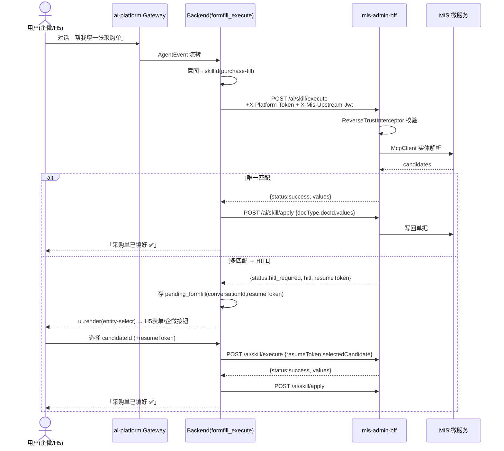

# 整合架构设计：AI Skill 表单填充引擎（FormFill）× Agent 平台

> 文档类型：**整合架构设计 + 任务分解**（软件架构师 高见远）
> 日期：2026-08 · 语言：简体中文
> 关联：增量 PRD `ai-skill-agent-integration-prd.md`、FormFill 引擎设计 `ai-skill-fill-engine-design.md`、融合身份决策 `ai-fusion/decisions/identity-jwt.md`
> 设计原则：复用优先、最小侵入、镜像既有信任模型、P0 端到端可跑通。

---

## 1. 现状与问题

### 1.1 两套平行体系对比

| 维度 | FormFill（mis-admin-bff，Java） | Agent 平台（ai-platform，Python/TS） |
|------|------|------|
| 触发入口 | `mis-admin-web` 表单页「AI 填充」按钮 | 企微对话 / H5 Copilot（经 Gateway） |
| 引擎 | `SkillExecutionEngine` + DAG + `ParameterResolver` + `McpClient` | OpenHarness `QueryEngine`（LLM 工具循环） |
| 技能定义 | `classpath:skills/*.json`（SkillLoader） | `skills/` 注册表 + OpenHarness `SKILL.md` 包 + `mcp/` 工具 |
| 检索/排序 | 无（直接 skillId 调用） | `SkillRetriever`（Qdrant 向量）+ `SkillRanker`（权限/频次/分类） |
| MCP 调用 | `McpClient`（JSON-RPC → mis-org/iam） | `McpClientManager` + `tool_registry_builder`（`mcp__*` 工具） |
| HITL | `mis-admin-web` `HitlDialog` / `EntitySelector` 弹窗 | `hitl/store.py`（ApprovalStore）+ `approval-card` A2UI |
| 鉴权 | MIS 网关 JWT（RS256）+ `X-User-Id` 透传 | 自签 HS256（iss=ai-platform）；**同时已支持 MIS RS256 JWT 验签**（`mis_token.py` + `deps.get_current_user`） |
| 写回单据 | 前端 `form.setFieldsValue` + 用户提交 | 经 `credential_mapper` + 业务 adapter / MCP 写工具 |
| A2UI | 无 | `entity-select` **不存在**（仅 `approval-card`/`data-table`/`form-sheet`） |

### 1.2 6 个决策点的现状空缺

1. **暴露形态**：FormFill 在 ai-platform 侧**既非一等 Skill、也非 MCP 工具**——OpenHarness 运行时只暴露 `skill`（SKILL.md 包）+ `mcp__*`（MCP 工具），注册表 `CUSTOM` Skill 仅作元数据，无自动分发。
2. **反向调用通路**：ai-platform **没有**任何指向 `mis-admin-bff` 的客户端；`McpClient` 指向的是 mis-org/iam 等微服务，不是 BFF 的 `/ai/skill/execute`。
3. **反向身份信任（Q3）**：`mis_token.py` 已实现「MIS RS256 JWT + `X-Mis-*` 头」的**正向**验签（BFF→platform）；**反向**（platform→BFF）信任机制为零，BFF 当前假设所有 `/ai/skill/execute` 调用都来自受 MIS 网关保护的 `X-User-Id`。
4. **HITL 多通道回传（Q1）**：BFF 返回 `hitl{field, candidates}`，但 ai-platform 的 A2UI 无 `entity-select` 组件，WeCom `BotEventMapper.mapUIRender` 也无对应映射——候选实体无法在当前通道渲染与回传。
5. **单据回填（Q2）**：FormFill 仅返回 `values`，agent 侧**缺一个把 values 写回目标单据的确定通路**（`pageContext` 也无 `docType`/`docId` 约定）。
6. **skill 发现（Q6）**：BFF 的 Skill 从 classpath 加载、**无查询接口**；agent 侧 `GET /api/v1/skills` 只能看到 ai-platform 自身已注册 Skill，看不到 BFF 侧的 FormFill Skill 清单。

---

## 2. 整合方案总览

### 2.1 架构图（新增 / 复用边界）

```mermaid
flowchart TB
    subgraph CH[用户通道]
        UH5[ H5 Copilot ]
        UWC[ 企微对话 ]
    end

    subgraph GW[ai-platform Gateway TS]
        AUTH[ auth.ts 双验签<br/>HS256 / MIS RS256 ]
        CR[ ChannelResolver ]
        ET[ EventTransformer ]
        BEM[ BotEventMapper ]
        H5A[ H5Adapter ]
        WCA[ WecomAdapter ]
    end

    subgraph BE[ai-platform Backend Python]
        RT[ OpenHarness Runtime ]
        TR[ tool_registry_builder ]
        FFEX[ formfill_execute 工具 ★新增 ]
        FFAP[ formfill_apply 工具 ★新增 ]
        FFC[ FormFillClient ★新增 ]
        RT2[ reverse_trust 头构造 ★新增 ]
        EV[ events.py A2UI_COMPONENTS<br/>+entity-select ★修改 ]
        SES[ Session State<br/>pending_formfill ★新增 ]
        SKREG[ SkillRegistry ]
    end

    subgraph BFF[mis-admin-bff Java]
        AIC[ AiProxyController<br/>/ai/skill/execute 复用<br/>/ai/skill/apply ★新增 ]
        RTI[ ReverseTrustInterceptor ★新增 ]
        ENG[ SkillExecutionEngine 复用 ]
    end

    subgraph MIS[MIS 微服务]
        ORG[ mis-org / mis-iam MCP ]
        DOC[ 目标业务单据服务 ]
    end

    UH5 --> GW
    UWC --> GW
    GW --> BE
    RT --> TR --> FFEX --> FFC
    FFEX --> RT2
    FFC -. 反向信任头 .-> RTI
    RTI --> AIC --> ENG --> ORG
    FFAP --> AIC
    AIC --> DOC
    RT -. ui.render entity-select .-> EV
    EV --> ET
    ET -->|H5| H5A
    ET -->|WeCom| BEM --> WCA
    SES -. resumeToken 续传 .-> FFEX
    SKREG -. P2-1 检索 .-> RT
```

图例：**★新增** = 本增量新增；**复用** = 已有能力直接复用；`-.->` 为信任/控制流。

### 2.2 核心思路（一句话）

> 把 FormFill 包装成 ai-platform 的**两个平台工具**（`formfill_execute` 反向调 BFF、`formfill_apply` 回填单据），其调用**镜像 `identity-jwt.md` 的正向信任**（平台服务凭证 + 委托用户 MIS JWT）；HITL 走**单一 `entity-select` A2UI 事件**，由 Gateway 按通道同构降级为 H5 表单 / 企微按钮卡片；`resumeToken` 与 `conversationId` 绑定暂存于会话态。

---

## 3. 六个架构决策（Q1–Q6）

### 决策 1：FormFill 在 ai-platform 侧的暴露形态

- **结论**：注册为**一等 Skill**（写入 `SkillRegistry`，`source=CUSTOM`，参与检索/排序/即开即用，**满足 P2-1**），但其**执行载体是一个平台工具 `formfill_execute`**（OpenHarness `BaseTool`）。
  - 即：**「一等 Skill 元数据 + 反向 HTTP 工具实现」**——两者在 P0 一起落地（成本低），既让 P0 能端到端跑通，又天然满足 P2-1 的检索/排序诉求。
- **理由**：
  1. OpenHarness 运行时的 LLM 动作单元是**工具**（`skill` / `mcp__*`），注册表 `CUSTOM` Skill 本身不被运行时自动分发；因此必须有一个真实可调用的工具。
  2. 注册为 `SkillRegistry` 的 `CUSTOM` Skill，可立即复用 `SkillRetriever`/`SkillRanker`（语义检索 + 权限过滤 + 分类匹配），契合 P1-4（意图→skill 可配置）与 P1-6（即开即用）。
  3. 不引入 OpenHarness `SKILL.md` 包：避免提示词歧义，且 FormFill 逻辑在远端 BFF，包内只放「调 HTTP」指令是多余的间接层。
- **备选**：
  - A. 仅作 MCP 工具（`mcp__formfill__execute`）→ 需把 BFF 暴露为 MCP server（属 P2-2），P0 不采纳。
  - B. 仅作 CUSTOM Skill 不实现工具 → 运行时无法调用，不可行。
- **风险**：`SkillRegistry` 的 `CUSTOM` Skill 与 OpenHarness `skill` 包是两套索引；需在工具描述里写明「调用 `formfill_execute`」，并在 P1-6 的 bootstrap 中同步 BFF Skill 清单（见决策 6）。

### 决策 2：ai-platform → BFF 的反向调用方式

- **结论**：**(a) 直接反向 HTTP** 调 `POST /api/v1/ai/skill/execute`。**P0 采用此方案**；P2-2 再评估把 FormFill 暴露为 MCP server 走 `mcp/` 层。
- **理由**：
  1. BFF 已有现成 HTTP 端点与 `SkillExecuteRequest/Response`，零改动即可被调。
  2. 与 Q3 反向信任强耦合：HTTP 头可同时携带「平台服务凭证 + 用户 MIS JWT 委托」，实现简单、可观测、易审计。
  3. MCP server 方案需 BFF 新增 MCP 暴露面、改造网关/工具注册，超出 P0 时间盒。
  4. 代码佐证：`tool_registry_builder.PlatformMcpToolAdapter` 已展示「平台工具 → 远端调用」的成熟封装范式，新增 `formfill_execute` 工具与之同构，风险最低。
- **备选**：(b) MCP server（P2-2）——延迟到 P2，作为双向直连演进。
- **风险**：BFF 端点需新增反向鉴权（决策 3）；跨网络调用需网关/Nacos 放行 ai-platform → BFF 的 egress。

### 决策 3（最关键）：反向身份信任（Q3）

- **结论**：**镜像 `identity-jwt.md` 的正向模型**，采用「**平台服务凭证 + 用户 MIS JWT 委托**」双因子：
  - **因子一 · 平台服务身份**：ai-platform 在请求头携带 `X-Platform-Token: <shared-secret>`（或 `Authorization: Bearer <platform-service-jwt>`，由 BFF 与平台共享密钥/公钥）。BFF 校验其有效且请求来自平台信任域（网络隔离 / mTLS / 来源 IP 白名单）。
  - **因子二 · 真实用户身份委托**：ai-platform 把**正向调用时收到的、 genuine 的 MIS RS256 JWT** 经头 `X-Mis-Upstream-Jwt` 回传 BFF（**平台不伪造 MIS JWT**）。BFF 用 `MisTokenVerifier`（RS256、`iss=mis-platform`）验签，取出 `userId` / `tenantId`，注入 FormFill 执行上下文用于 MCP 数据权限过滤。
  - **因子三 · 防御纵深**：`/ai/skill/execute` 的反向调用仅接受来自 ai-platform 网络/信任域的请求；公网裸 `X-*` 头不被采信（与 `identity-jwt.md` §3.3「仅信任来自 BFF 网络的 X-Mis-*」对称）。
- **理由**：
  1. `deps.get_current_user` 已用「`alg==RS256` → `MisTokenVerifier` + `X-Mis-*` 头」实现正向信任——**反向完全镜像**，不另起炉灶（PRD Q3 明确要求）。
  2. 用户身份用**委托的 MIS JWT** 而非平台自己声明的 `userId`，避免平台越权填单：BFF 信任的是 MIS 签发的 JWT，平台无法伪造。
  3. 服务凭证证明「调用方是可信 ai-platform」，与用户身份解耦——即使 JWT 委托，也需平台身份先过闸门。
  4. `mcp_identity.py` 已把 `X-User-Id` 等注入下游 HTTP；本次只需**新增 `X-Tenant-Id`** 并复用同一 `IdentityAwareAsyncClient` 注入模式，扩展成本极低。
- **备选**：
  - A. 仅用用户 MIS JWT（无平台服务凭证）→ 任何拿到 MIS JWT 的调用方都能调 BFF，信任域不可控。
  - B. 仅用平台服务凭证 + 平台自填 userId → 平台可冒用任意用户，违反 Q3「以真实用户身份执行」。
- **风险**：MIS JWT 有效期（8h）可能短于长时 HITL 挂起（P1-5 TTL 需重放原 JWT，而非缓存 userId）；平台需将会话中的上游 MIS JWT 持久化而非仅取 `userId`。

### 决策 4：HITL 多通道同构渲染（Q1）

- **结论**：BFF 返回的 `hitl{field, originalValue, candidates}` → agent 产出**单一 A2UI 事件 `ui.render("entity-select", props)`**；Gateway 按通道**同构降级**：
  - **H5**：`entity-select` → 前端 `EntitySelectView`（单选列表 + 确认/手动/取消按钮），真实渲染。
  - **企微 Bot**：`BotEventMapper.mapUIRender("entity-select", …)` → `button_interaction` 卡片，**每个候选一个按钮 + 一个「手动」按钮**；按钮 `key` 编码 `candidateId`。
  - **回传**：用户选择经 `resumeToken` 回到 agent（见 §4.3 / 决策 4 回传契约），agent 调 `formfill_execute(resumeToken, selectedCandidate)` 续填。
- **理由**：
  1. 复用既有 `EventTransformer`（H5 原样透传、`ui.render`→card）与 `BotEventMapper`（已支持 `approval.request`→`button_interaction`），新增 `entity-select` 分支与 `approval-card` 同构，改动局部。
  2. 「一份载荷、两通道同构」满足 PRD「在哪触发就在哪确认」，且避免 agent 触发的对话跳回 `mis-admin-web` 弹窗（PRD §5.3 已弃用 C 落点）。
- **备选**：C. 仅用企微卡片 / 仅用 H5 → 不满足双通道一致。
- **风险**：`resumeToken` 必须与 `conversationId` 绑定（决策 8 + Q4），否则多轮/多单会串号；企微按钮 `key` 长度受限，需在 `task_id`/元数据携带 `resumeToken`。

### 决策 5：单据回填（Q2）

- **结论**：`status=SUCCESS` 后，`values` 经 **ai-platform 工具 `formfill_apply` → BFF 新增 `POST /api/v1/ai/skill/apply`** 写回目标单据；`pageContext` 携带 `docType` + `docId`（决策 5 契约见 §4.4）。BFF 侧按 `docType` 路由到对应 MIS 业务微服务（复用 BFF 既有 MCP/REST 连接与凭据），**写权限落在 BFF（已持 MIS 信任），agent 不持域凭据**。
- **理由**：
  1. 写回逻辑集中在 BFF，复用其已有的 mis-org/iam 微服务连通性与身份，避免 agent 为每个业务系统申请凭据（与 `credential_mapper` 解耦，降低攻击面）。
  2. BFF 新增的是**独立端点**（非修改 FormFill 引擎），符合「不改动引擎」约束。
  3. `docType` 字段映射（`values` 的 key → 单据字段）由 `formfill_apply` 侧的 `docType→fieldMapping` 配置驱动，新增单据类型即配即用（P1-6）。
- **备选**：
  - A. agent 直接调业务写 MCP/adapter（PRD 产品倾向的「写回 MIS 业务微服务」字面义）→ 需 agent 持域凭据、且目前缺对应写 MCP，P0 成本更高；**保留为 P2 演进**（当目标系统已暴露写 MCP 时优先走 MCP）。
  - B. 仅写回 agent session → 无法真正回填，不符合诉求。
- **风险**：具体目标微服务 API 因 `docType` 而异，P0 需先落地**一个参考写路径**（如采购单），其余 `docType` 经注册表扩展；确切微服务/接口为 PRD Q2 待确认项（§9 给出默认建议）。

### 决策 6：skill 发现（Q6）

- **结论**：
  - **P0**：意图→`skillId` 走**配置驱动路由**（参考 `SkillGrouper` 的分类/关键词，落 `enabled-skills.yaml` 或 `formfill` 专用映射配置）；agent 不依赖动态发现即可触发。
  - **P1-6（即开即用）**：BFF **新增 `GET /api/v1/ai/skills`**（返回已加载 Skill 清单）；ai-platform 启动 bootstrap 拉取并同步进 `SkillRegistry`（`CUSTOM`，`handler=formfill_execute`），实现「BFF 新增 Skill JSON → agent 无需改代码即可触发」。
- **理由**：
  1. BFF `SkillLoader` 从 classpath 加载、无查询接口（PRD Q6 已确认），新增只读 `GET` 端点是最低侵入的发现方式。
  2. 复用 `SkillRegistry.register` + Qdrant 索引，新 Skill 自动获得检索/排序能力（满足 P2-1）。
  3. P0 不必等发现机制即可跑通（已知 skillId 如 `user-fill`）。
- **备选**：仅经 ai-platform `retriever/registry` 手工登记 → 无法即开即用，违背 P1-6。
- **风险**：bootstrap 同步需处理 Skill 增删与版本；建议带 `version` 去重 + 定时 refresh（TTL 60s）。

---

## 4. 接口契约

### 4.1 agent → BFF 反向调用（复用 FormFill 现有结构，仅新增信任头）

**请求** `POST /api/v1/ai/skill/execute`（Body 复用 `SkillExecuteRequest`，**不新增字段**）

```
Headers（★新增反向信任头）:
  Authorization: Bearer <MIS_JWT>          # 因子二：委托的用户 MIS RS256 JWT（X-Mis-Upstream-Jwt 亦可）
  X-Mis-Upstream-Jwt: <MIS_JWT>            # 与 Authorization 二选一，明确语义
  X-Platform-Token: <shared-secret>        # 因子一：平台服务凭证（或 Authorization: Bearer <platform-service-jwt>）
  X-Tenant-Id: <tenantId>                  # 因子二补充（镜像 mcp_identity，供 BFF 快速取主租户）
  X-Channel: wecom-bot | h5 | wecom-h5     # 通道透传（复用 mcp_identity 头映射）
Body（复用）:
  { "skillId": "user-fill", "userInput": "把张三调到财务部",
    "pageContext": {"orgId": 3, "docType": "purchase-order", "docId": "PO-2026-001"},
    "resumeToken": null, "selectedCandidate": null }
```

**响应**（复用 `SkillExecuteResponse`，**不新增字段**）

```
{ "status": "success|hitl_required|manual_required|error",
  "fields": {"personId":1001,"orgId":3,"deptId":12},
  "hitl": {"field":"deptId","originalValue":"财务部",
           "candidates":[{"id":12,"name":"财务部","aliases":[],"context":"code=FIN"}]},
  "message": "...", "resumeToken": "rt-xxx" }
```

> BFF 侧修改点：`AiProxyController` 在反向入口**新增 `ReverseTrustInterceptor`**，校验 `X-Platform-Token` + 验签 `X-Mis-Upstream-Jwt`（RS256，`iss=mis-platform`），提取 `userId/tenantId` 注入 `SkillExecutionEngine.execute(...)`。其余引擎逻辑零改动。

### 4.2 ai-platform 侧新增工具契约

**`formfill_execute`**（OpenHarness `BaseTool`，命名空间 `formfill__execute`）

```
input_schema:
  skillId:         string   (required)  # 意图路由结果
  userInput:       string   (required)  # 对话原文 / 抽取意图
  pageContext:     object   (optional)  # {orgId, docType?, docId?}
  resumeToken:     string   (optional)  # HITL 续传
  selectedCandidate: string (optional)  # HITL 用户选择候选 id
行为: 经 FormFillClient 反向调 BFF → 返回 status + fields/hitl；HITL 时发 entity-select 事件并存 pending
```

**`formfill_apply`**（命名空间 `formfill__apply`）

```
input_schema:
  skillId:   string (required)
  docType:   string (required)   # 目标单据类型
  docId:     string (required)   # 目标单据 ID
  values:    object (required)   # FormFill 返回的 fields
行为: 调 BFF POST /api/v1/ai/skill/apply → 写回目标单据 → 返回 {ok, docId}
```

### 4.3 A2UI `entity-select` 组件 Schema（★新增，双端登记）

**后端** `events.py::A2UI_COMPONENTS` 增加 `"entity-select"`；props 结构：

```json
{
  "component": "entity-select",
  "props": {
    "namespace": "mis-formfill",
    "resumeToken": "rt-xxx",
    "field": "deptId",
    "originalValue": "财务部",
    "prompt": "请选择「供应商」",
    "candidates": [
      {"id": "12", "name": "财务部", "context": "code=FIN"},
      {"id": "13", "name": "财务共享中心", "context": "code=FSC"}
    ],
    "actions": ["confirm", "manual", "cancel"]
  }
}
```

**前端** `frontend/src/components/a2ui/` 新增 `EntitySelectView.tsx`，注册进 `registry.ts`（`KNOWN_A2UI_COMPONENTS` 增加 `"entity-select"`）。按钮 `onSubmit` 回传 `{resumeToken, selectedCandidate}`。

**回传契约（H5 / 企微一致）**：用户选择 → 入站消息 `{ type:"entity_select", resumeToken, selectedCandidate }`（H5 经 WebSocket action；企微经按钮 `key=candidateId` + 卡片 `task_id` 携带 `resumeToken` → `BotEventMapper` 映射为同结构入站消息）→ agent 新 turn 检测到 pending → 调 `formfill_execute(resumeToken, selectedCandidate)`。

### 4.4 单据回写契约（BFF 新增端点）

**`POST /api/v1/ai/skill/apply`**（★新增，非引擎改动）

```json
Request:
  Headers: 同 §4.1 反向信任头
  Body: { "skillId":"user-fill", "docType":"purchase-order", "docId":"PO-2026-001",
          "values": {"personId":1001,"orgId":3,"deptId":12} }
Response:
  { "status":"success|error", "docId":"PO-2026-001", "message":"采购单已回填" }
```

> BFF 侧：`AiProxyController` 新增 `applySkillFill`，按 `docType` 路由到 `DocWriteHandler` 注册表（P0 落地一个参考 handler：采购单；其余注册扩展）。写动作复用 BFF 既有微服务客户端 + 身份。

---

## 5. 改动文件清单

### 5.1 ai-platform backend（Python）— 新增 / 修改

| 路径 | 动作 | 说明 |
|------|------|------|
| `src/skills/formfill_client.py` | **新增** | `FormFillClient`：反向 HTTP 调 BFF，注入 §4.1 信任头 |
| `src/skills/reverse_trust.py` | **新增** | 构造反向信任头（平台服务凭证 + 委托 MIS JWT + `X-Tenant-Id`/`X-Channel`） |
| `src/skills/tools/formfill_execute.py` | **新增** | OpenHarness `BaseTool` `formfill__execute` |
| `src/skills/tools/formfill_apply.py` | **新增** | OpenHarness `BaseTool` `formfill__apply` |
| `src/runtime/tool_registry_builder.py` | **修改** | 注册两个 FormFill 工具；`resolve_allowed_tool_patterns` 默认增 `formfill__*` |
| `src/runtime/events.py` | **修改** | `A2UI_COMPONENTS` 增加 `"entity-select"` |
| `src/hitl/formfill_pending.py` | **新增** | `FormFillPendingStore`：`resumeToken ↔ conversationId` 映射 + TTL（复用 ApprovalStore 范式） |
| `src/skills/formfill_skill_bootstrap.py` | **新增** | 启动拉取 BFF `GET /ai/skills` 同步进 `SkillRegistry`（P1-6） |
| `src/agent/session.py` | **修改** | 会话态支持暂存 `pending_formfill` |
| `src/config.py` | **修改** | 新增 `MIS_ADMIN_BFF_BASE_URL`、`AI_PLATFORM_BFF_SHARED_SECRET`、`FORMFILL_ALLOWED_SKILLS` 等配置项 |
| `configs/agents/<agent>/enabled-skills.yaml` | **修改** | 启用 `formfill` 工具 + 意图→skillId 映射（P0 配置驱动） |

### 5.2 ai-platform gateway（TS）— 新增 / 修改

| 路径 | 动作 | 说明 |
|------|------|------|
| `src/router/BotEventMapper.ts` | **修改** | `mapUIRender` 增加 `entity-select` → `button_interaction` 卡片（每候选一按钮 + 手动按钮；`task_id` 携 `resumeToken`） |
| `src/adapters/wecom/WecomBotCardBuilder.ts` | **复用** | 已有 `buildButtonInteraction`，直接复用 |
| `src/queue/redisStream.ts` / `BotEventMapper` 按钮回传 | **修改** | 按钮 `key=candidateId` → 入站消息 `{resumeToken, selectedCandidate}` |
| `src/middleware/auth.ts` | **复用** | 双验签不变；反向 BFF 调用在 backend，不涉及网关鉴权 |

### 5.3 ai-platform frontend（H5 A2UI）— 新增 / 修改

| 路径 | 动作 | 说明 |
|------|------|------|
| `src/components/a2ui/EntitySelectView.tsx` | **新增** | `entity-select` 单选表单 + 确认/手动/取消 |
| `src/components/a2ui/registry.ts` | **修改** | 注册 `entity-select` + `KNOWN_A2UI_COMPONENTS` 增加 |
| `src/components/a2ui/types.ts` | **修改** | `A2UIComponentName` 增加 `"entity-select"` |

### 5.4 mis-admin-bff（Java）— 新增 / 修改

| 路径 | 动作 | 说明 |
|------|------|------|
| `controller/AiProxyController.java` | **修改** | 反向入口加 `ReverseTrustInterceptor`；新增 `POST /ai/skill/apply` + `applySkillFill` |
| `security/ReverseTrustInterceptor.java` | **新增** | 校验 `X-Platform-Token` + 验签 `X-Mis-Upstream-Jwt`（RS256，`iss=mis-platform`） |
| `config/AiPlatformTrustConfig.java` | **新增** | 平台服务凭证 / 公钥 + 信任域（来源 IP / mTLS）配置 |
| `service/skill/DocWriteHandler.java` + `DocWriteRegistry.java` | **新增** | `docType → 写处理器` 路由；P0 一个参考 handler |
| `resource/application.yml` 的 `mis.ai-platform` 段 | **修改** | 配置平台服务凭证 / 信任域 |
| `dto/ai/*` | **复用** | `SkillExecuteRequest/Response` 等**不改** |

---

## 6. 任务分解（按 P0 优先排序）

> 约定：P0 任务必须端到端跑通；P1/P2 标注但本轮非强制。

### T01 — 反向身份信任（决策 3 / Q3 落地）【P0】
- **目标**：BFF 能验证「调用方是可信 ai-platform」且取到「真实用户身份」用于数据权限。
- **涉及文件**：`mis-admin-bff` `ReverseTrustInterceptor.java`(新)、`AiPlatformTrustConfig.java`(新)、`AiProxyController.java`(改)、`application.yml`(改)；`ai-platform` `reverse_trust.py`(新)、`config.py`(改)。
- **依赖**：无（基础）。
- **实现要点**：BFF 反向入口校验 `X-Platform-Token`（共享密钥/服务 JWT）+ 验签 `X-Mis-Upstream-Jwt`（复用 `MisTokenVerifier` 思路，RS256、`iss=mis-platform`），提取 `userId/tenantId`；ai-platform `reverse_trust.py` 从会话取上游 MIS JWT 并构造头（含 `X-Tenant-Id`、`X-Channel`）。信任域白名单（来源网络/mTLS）。

### T02 — FormFill 反向调用客户端 + 平台工具（决策 1+2）【P0】
- **目标**：agent 可通过 `formfill_execute` 工具调起 BFF FormFill。
- **涉及文件**：`formfill_client.py`(新)、`tools/formfill_execute.py`(新)、`tool_registry_builder.py`(改)、`config.py`(改)、`enabled-skills.yaml`(改)。
- **依赖**：T01（需信任头）。
- **实现要点**：`FormFillClient` POST `/ai/skill/execute`（复用 `SkillExecuteRequest`）；`formfill_execute` 工具封装调用 + 读取 status；`tool_registry_builder` 注册并放开 `formfill__*`；意图→skillId 先用配置（如「采购单→purchase-fill」）。

### T03 — HITL 多通道同构渲染（决策 4 / Q1）【P0】
- **目标**：`hitl` 载荷在 H5 / 企微同构渲染并可回传续填。
- **涉及文件**：`events.py`(改)、`BotEventMapper.ts`(改)、`EntitySelectView.tsx`(新)、`a2ui/registry.ts`(改)、`a2ui/types.ts`(改)、`redisStream.ts` 按钮回传(改)。
- **依赖**：T02（需能拿到 hitl 并产出事件）。
- **实现要点**：新增 `entity-select` A2UI（双端登记）；`formfill_execute` 在 HITL 时发 `ui.render("entity-select", props)`（含 `resumeToken`）；`BotEventMapper` 映射为 `button_interaction`（候选→按钮、`task_id` 携 `resumeToken`）；按钮/表单回传 `{resumeToken, selectedCandidate}`。

### T04 — 单据回填（决策 5 / Q2）【P0】
- **目标**：`status=SUCCESS` 后 `values` 写回目标单据。
- **涉及文件**：`tools/formfill_apply.py`(新)；`mis-admin-bff` `AiProxyController.applySkillFill`(新)、`DocWriteHandler.java`+`DocWriteRegistry.java`(新)、`application.yml`(改)。
- **依赖**：T02（values 来自 FormFill 成功返回）；`pageContext` 约定 `docType`/`docId`。
- **实现要点**：`formfill_apply` 调 BFF `POST /ai/skill/apply`；BFF 按 `docType` 路由 `DocWriteHandler`（P0 一个参考 handler，如采购单）；`formfill_apply` 侧维护 `docType→fieldMapping` 配置将 `values` 映射到单据字段。

### T05 — 会话暂存 + HITL 续传 + 错误闭环（Q4 / P0-7/P0-8）【P0】
- **目标**：HITL 等待期 `resumeToken` 与 `conversationId` 绑定暂存；用户回传选择续填；ERROR/NO_MATCH 转自然语言。
- **涉及文件**：`hitl/formfill_pending.py`(新)、`agent/session.py`(改)、`tools/formfill_execute.py`(改)。
- **依赖**：T02、T03。
- **实现要点**：`FormFillPendingStore` 存 `{resumeToken, conversationId, skillId, docContext, ttl}`；新入站消息检测 pending 并调 `formfill_execute(resumeToken, selectedCandidate)`；`status=ERROR`→友好提示+重试建议，`manual_required`→引导手动/换说法，均不裸抛错误码。

### T06 — 意图路由 + Skill 发现（决策 6 / Q6 / P1-4/P1-6）【P1】
- **目标**：新增 FormFill Skill 即开即用；agent 经检索感知可用 Skill。
- **涉及文件**：`mis-admin-bff` 新增 `GET /api/v1/ai/skills`(新)；`formfill_skill_bootstrap.py`(新)、`SkillRegistry`(复用)、`enabled-skills.yaml`(改)。
- **依赖**：T02（工具已存在）。
- **实现要点**：BFF 暴露 Skill 清单只读端点；bootstrap 拉取并注册为 `CUSTOM` Skill（`handler=formfill_execute`）；TTL refresh + 版本去重；意图路由配置化。

### T07 — 多通道同构增强 + 实体映射学习后端化（P1-1/P1-2）【P1】
- **目标**：跨设备/跨通道映射学习持久化（替代 localStorage）；进度可视化。
- **涉及文件**：`mis-admin-bff` 实体映射存储（新，复用 `credential_vault` 范式）；`formfill_execute.py` 读映射做自动跳过；H5/A2UI 进度组件（新）。
- **依赖**：T03、T05。
- **实现要点**：`useEntityMapping` 的 localStorage 升级为后端持久化，使「这次选过下次免确认」跨设备生效。

### T08 — P2 演进（MCP 双向直连 / 一等 Skill 检索深化 / 多轮增量 / 审计）【P2】
- **目标**：FormFill 暴露为 MCP server（P2-2）；多轮增量填充（P2-3）；审计留痕（P2-4）。
- **涉及文件**：`mcp/` 层新增 BFF MCP server 接入；`SkillRetriever` 深度集成；审计服务接入。
- **依赖**：T01–T06 稳定。
- **实现要点**：反向 HTTP（决策 2 备选）演进为 MCP 直连；resumeToken 状态机支持增量补字段；记录 agent 触发 FormFill 的操作留痕。

---

## 7. 依赖包 / 配置

### 7.1 ai-platform（Python）侧配置（新增）
```
MIS_ADMIN_BFF_BASE_URL=http://mis-admin-bff:8080      # FormFill 反向调用基址
AI_PLATFORM_BFF_SHARED_SECRET=<shared-secret>          # 因子一：平台服务凭证（或 platform-service-jwt 私钥）
MIS_JWT_REPLAY_HEADER=X-Mis-Upstream-Jwt               # 因子二：委托 MIS JWT 头名
FORMFILL_ALLOWED_SKILLS=user-fill,purchase-fill         # P0 已知 skill 白名单（P1-6 后由发现覆盖）
ALLOWED_TOOLS=...,formfill__*                            # tool_registry_builder 放开
```
> 无需新增第三方依赖；复用 `httpx`、OpenHarness `BaseTool`、既有 `MisTokenVerifier` 思路。

### 7.2 mis-admin-bff（Java）侧配置（新增）
```yaml
mis:
  ai-platform:
    service-token: ${AI_PLATFORM_BFF_SHARED_SECRET}   # 因子一：与平台共享
    trusted-network: 10.20.0.0/16                       # 因子三：平台来源网段（或 mTLS）
    mis-jwt-issuer: mis-platform                        # 因子二：委托 JWT 验签
```
> 反向端点 `/api/v1/ai/skill/execute` 与新增 `/api/v1/ai/skill/apply` 受 `ReverseTrustInterceptor` 保护；公网/非信任域请求拒绝。

### 7.3 Nacos / 网关
- **网关路由**：允许 `ai-platform` 网络 → `mis-admin-bff` 的 `/api/v1/ai/skill/*` egress（反向调用）。
- **信任域**：BFF 反向端点仅对 ai-platform 来源（网段/mTLS）开放；禁止公网裸调。
- **Nacos**：`ai-platform` 配置中心下发 `MIS_ADMIN_BFF_BASE_URL` 与共享凭证；BFF 下发 `mis.ai-platform.*` 信任配置。

---

## 8. 共享知识（跨文件约定）

1. **`resumeToken ↔ conversationId` 绑定**：`FormFillPendingStore` 以 `conversationId` 为主键存 `resumeToken`，防止多轮/多单串号（Q4）。`resumeToken` 由 BFF 生成、agent 不透传解析，仅原样带回。
2. **反向信任头命名**（与既有 `mcp_identity.py` 对齐）：
   - 服务凭证：`X-Platform-Token`
   - 委托用户 JWT：`X-Mis-Upstream-Jwt`
   - 用户/租户/通道：`X-User-Id` / `X-Tenant-Id` / `X-Channel`（复用 `IdentityAwareAsyncClient` 注入）
3. **A2UI 命名空间**：FormFill 相关组件统一 `namespace: "mis-formfill"`，与现有 `approval-card` 等隔离；新增组件须**双端登记**（`events.py` + `a2ui/registry.ts`）。
4. **错误码映射**：BFF `status=error` → agent 转自然语言（`message` 字段直接转译 + 重试建议），不向用户暴露原始 code；`manual_required` → 引导「换说法 / 手动输入」。
5. **`pageContext` 约定（Q5）**：缺失 `docType`/`docId` 时，agent 经对话抽取或调上下文工具补全；FormFill 三级降级（引擎设计 §6）覆盖部分字段缺失，但 `docType` 为回填必需，缺失则提示用户明确目标单据。
6. **会话态键**：`pending_formfill` 存于 `agent/session.py` 会话态，TTL 默认 30min（P1-5 半途退出可恢复）。

---

## 9. 风险与待明确事项

### 9.1 技术风险
| 风险 | 缓解 |
|------|------|
| MIS JWT 有效期（8h）短于长时 HITL 挂起 | agent 持久化上游 MIS JWT（非仅 userId），续传时重放；超期提示重新发起（P1-5） |
| BFF 反向端点被非平台调用 | 双因子（服务凭证 + 委托 JWT）+ 信任域网段/mTLS；公网拒绝 |
| `entity-select` 候选过多超出企微按钮数（企微 `button_interaction` 上限） | 超过阈值降级为 `multiple_interaction` 或分页；P0 参考 Skill 候选≤5 |
| `formfill_apply` 写目标微服务 API 因 `docType` 而异 | P0 落一个参考 handler，其余走 `DocWriteRegistry` 注册扩展 |
| OpenHarness `CUSTOM` Skill 与 `skill` 包索引分裂 | P1-6 bootstrap 同步；工具描述明确指向 `formfill_execute` |

### 9.2 需进一步确认（含 PRD 未决项的最终建议）
1. **Q2 目标微服务**：建议默认 BFF 内 `DocWriteHandler` 按 `docType` 路由；首个参考 `docType=purchase-order`。确切微服务/接口由产品确认（建议 P0 锁定 1 个）。
2. **Q3 服务凭证形态**：推荐「共享密钥 `X-Platform-Token`」（运维简单）；若安全要求高，升级为「平台 RS256 服务 JWT + BFF 持公钥」。建议 P0 先用共享密钥，P2 升级。
3. **Q5 `pageContext` 来源**：企微场景用户未必在单据页，建议 agent 经对话抽取 `docType`/`docId`，缺失则显式询问（不强制跳过）。
4. **Q4 多挂起/多轮**：建议允许同会话多 `pending_formfill`（按 `resumeToken` 区分），TTL 30min，超期提示「有未完成的填单」。
5. **Q6 即开即用节奏**：P0 用配置驱动；P1-6 上线 BFF `GET /ai/skills` + bootstrap 同步后实现零代码即开即用。
6. **身份建模决策落地前提**：依赖 `identity-jwt.md` 已上线（`iss=mis-platform` 强校验 + `X-Mis-*` 头注入）；若尚未全量，反向信任的「用户 JWT 委托」需待其就绪，P0 可先以「平台服务凭证 + `X-User-Id`/`X-Tenant-Id` 头（由平台从正向会话取出）」临时替代，后续切换为委托 MIS JWT。

---

> 附：端到端时序（SUCCESS / HITL 两条主路径）见下，可在 Mermaid 渲染器查看。


