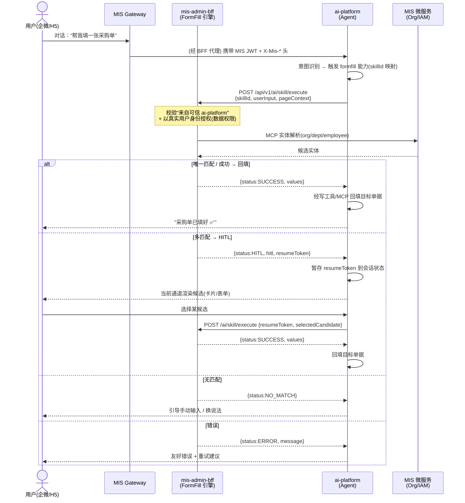

# 增量 PRD：将 AI Skill 表单填充引擎（FormFill）暴露为 Agent 可调用能力

> 文档类型：**增量 PRD（简单模式，无竞品分析）**
> 作者：许清楚（产品经理 / software-product-manager）
> 日期：2026-08
> 语言：简体中文
> 关联设计：[AI Skill 表单填充引擎详细设计](./ai-skill-fill-engine-design.md) · [MIS × ai-platform 融合文档中心](../ai-fusion/README.md) · [身份建模决策](../ai-fusion/decisions/identity-jwt.md)

---

## 0. 项目信息

| 项 | 内容 |
|----|------|
| Project Name | `formfill_agent_integration` |
| Language | 简体中文 |
| 涉及技术栈 | BFF：`mis-admin-bff`（Java）；Agent 平台：`ai-platform` backend（Python）/ gateway（TS）/ frontend（H5） |
| 原始需求复述 | 已完成落盘的 FormFill 引擎与现有 agent 平台是两套平行体系（各自实现 skill / mcp / hitl，鉴权链路也不同）。用户要求**把 FormFill 暴露为 agent 可调用能力**，使对话式 Agent（企微 / H5）能触发单据填充，打通端到端：用户在企微对 Agent 说"帮我填一张采购单" → Agent 调起 FormFill → 完成字段填充与实体解析 → 必要时走 HITL 让用户确认 → 回填单据。 |

### 0.1 范围边界（增量视角）

- **本 PRD 只描述"与现有 FormFill 相比新增 / 变更"的部分**。FormFill 引擎本身（`SkillLoader` / `DagBuilder` / `ParameterResolver` / `McpClient`、四种状态机、`/api/v1/ai/skill/execute` 接口）已实现且**不在本次改动范围**，详见 `ai-skill-fill-engine-design.md`。
- **In Scope**：agent 触发 FormFill 的反向调用链路、身份信任诉求、HITL 在多通道的回传闭环、填充结果回填目标、多轮会话状态保持、双通道（H5 A2UI / 企微卡片）UI 表现。
- **Out of Scope**：FormFill 引擎内部重做、新增 MCP 工具、Skill JSON 配置本身的改动（仅消费，不改造）；这些仅在"扩展即开即用"层面作为 P2 提及。

### 0.2 关键事实（已核实，作为产品决策依据）

1. FormFill 入口：`POST /api/v1/ai/skill/execute`（`AiProxyController`），请求体 `{skillId, userInput, pageContext, resumeToken, selectedCandidate}`，响应 `{status(SUCCESS|HITL|NO_MATCH|ERROR), values, hitl, resumeToken}`。
2. FormFill 当前由 `mis-admin-web`（`features/ai/` 的 `useSkillFill` / `HitlDialog` / `EntitySelector`）做 HITL 弹窗与实体选择，身份来自 MIS 网关 `X-User-Id` 透传。
3. **反向信任现状**：当前 `mis-admin-bff` 已通过 `AiPlatformClient` 作为**客户端**调用 ai-platform（携带 MIS JWT + `X-Mis-*` 头，详见 `identity-jwt.md`）。本需求是**反向**——ai-platform 作为客户端调用 BFF 的 FormFill，信任方向需新建。
4. ai-platform 已具备 `skills/`（检索/排序/分组）、`mcp/`（统一发现与调用）、`hitl/`（审批/人工确认 store）、`identity/`（鉴权与凭据）、`runtime/`（openharness）模块，以及 TS gateway 的 H5/Wecom 适配与 A2UI 透传机制，可复用其 HITL 与通道适配能力承载 FormFill 的 HITL 回传。

---

## 1. 产品目标

**打通"对话即填单"的端到端体验，消除 FormFill 与 agent 平台的平行割裂。** 当前 FormFill 仅能在 `mis-admin-web` 表单页内由用户点击"AI 填充"触发，而对话式 Agent（企微 / H5）无法复用这套已验证的字段填充与实体解析能力，导致用户必须离开对话、跳转到业务表单页才能填单。打通后，用户可直接在企微 / H5 对话中说"帮我填一张采购单"，Agent 复用 FormFill 引擎完成字段抽取、实体消歧与 HITL 确认，并将结果回填到目标单据——把"填单"从"打开表单页操作"降级为"一句话对话"，显著提升单据处理效率，并让 FormFill 的实体解析/映射学习能力在对话场景复用增值。

---

## 2. 用户故事

> 覆盖企微对话触发 / H5 内嵌触发 / HITL 确认回传 / 无匹配降级 / 错误处理 五个主场景。

| # | 用户故事 | 验收要点 |
|---|----------|----------|
| **US1 企微对话触发** | 作为**企微用户**，我希望在对话中对 Agent 说"帮我填一张采购单"，以便不用打开业务系统也能发起填单。 | Agent 识别意图 → 调起 FormFill → 返回填充进度与结果；全程在企微内完成，无需跳转。 |
| **US2 H5 内嵌触发** | 作为**H5 用户**，我在单据页或 Copilot 面板点击/输入触发填单，希望 Agent 调起 FormFill 并把结果渲染回当前页面。 | H5 经 A2UI 渲染触发入口与填充结果；与企微通道共享同一套能力。 |
| **US3 HITL 确认回传（多通道一致）** | 作为**用户**，当某字段存在多个候选实体时，我希望在当前对话通道（企微卡片 / H5 A2UI 表单）直接选择，而不是去另一个系统确认。 | 同一份 `hitl` 载荷在企微渲染为卡片按钮、在 H5 渲染为单选表单；选择后回填并继续。 |
| **US4 无匹配降级** | 作为**用户**，当 FormFill 无匹配实体时，我希望 Agent 引导我手动补充，而不是报错中断。 | `status=NO_MATCH` 时 Agent 给出友好引导（换说法 / 手动输入），流程不崩。 |
| **US5 错误处理与可恢复** | 作为**用户**，当填充出错（Skill 不存在 / 依赖异常 / 超时）时，我希望得到可理解的错误与重试建议，且未完成的填单可续。 | `status=ERROR` 转自然语言提示 + 重试建议；挂起的 HITL 状态可续（见 Q4）。 |

---

## 3. 集成架构视图（端到端时序，产品视角）



> 说明：上述时序刻意保留"经 BFF 代理"——与现有 ai-platform 访问模式一致；反向调用（AG→BFF）的信任机制见待确认问题 **Q3**。

---

## 4. 需求池（P0 / P1 / P2）

### P0 — 打通端到端必需

| ID | 需求 | 说明 / 验收标准 |
|----|------|----------------|
| P0-1 | **建立反向调用链路** | ai-platform 新增 `formfill` 工具/能力，可调用 BFF `POST /api/v1/ai/skill/execute`。链路可用，能跑通一次 SUCCESS 路径。 |
| P0-2 | **反向调用身份信任（产品诉求）** | agent 调用 BFF 时，BFF 必须能识别"该调用来自可信 ai-platform"且携带"发起对话的真实用户身份"，用于授权与数据权限过滤。机制由架构师定（见 Q3）。 |
| P0-3 | **请求契约对齐** | agent 调用传 `skillId`（意图映射结果）、`userInput`（对话原文或抽取意图）、`pageContext`（目标单据上下文如 orgId/单据类型）、`resumeToken`/`selectedCandidate`（HITL 续传）。**复用 FormFill 现有 `SkillExecuteRequest` 结构，不新增 BFF 字段**。 |
| P0-4 | **响应契约对齐** | agent 消费现有 `SkillExecuteResponse`（`status` ∈ SUCCESS/HITL/NO_MATCH/ERROR、`values`、`hitl`、`resumeToken`）。**不改动 FormFill 引擎与响应结构**。 |
| P0-5 | **HITL 多通道回传闭环** | `status=HITL` 时，agent 必须将 `hitl`（field + candidates）渲染到用户**当前通道**（H5 A2UI / 企微卡片），并把用户选择经 `resumeToken` 回传 BFF 完成填充。 |
| P0-6 | **回填目标明确且落地** | `status=SUCCESS` 后，`values` 由 agent 应用到**目标单据**（经 MIS 业务写工具 / MCP），而非仅停留在会话。需明确写回哪个系统/单据（见 Q2）。 |
| P0-7 | **错误处理闭环** | `status=ERROR` / `NO_MATCH` 时，agent 转自然语言友好提示 + 下一步建议（重试 / 换说法 / 手动）。不得裸抛错误码。 |
| P0-8 | **会话状态暂存（HITL 等待期）** | agent 在 HITL 等待期间，将 `resumeToken` + 挂起上下文存入会话状态（复用 ai-platform `hitl/store` 或 session store），支持用户在同一次对话中回传选择。 |

### P1 — 体验增强

| ID | 需求 | 说明 |
|----|------|------|
| P1-1 | **多通道 HITL 同构渲染** | 同一份 `hitl` 载荷 → H5 表单 / 企微卡片 一致呈现（候选列表、确认/手动/取消 动作对齐）。 |
| P1-2 | **实体映射学习跨通道/跨设备** | 现有 FormFill 用 `localStorage` 存映射，agent 场景需后端持久化（对齐 FormFill P1 路线图），使"这次选过，下次免确认"跨设备生效。 |
| P1-3 | **填充进度可视化** | H5：A2UI 进度条 / 流式文本；企微：阶段文本（"正在解析供应商…"）。 |
| P1-4 | **意图→skill 路由可配置** | 用户自然语言到 `skillId` 的映射由配置管理（参考 ai-platform `skills/grouper`），新增单据类型即配即用。 |
| P1-5 | **半途退出可恢复** | 用户未确认 HITL 直接离开，再次进入对话时 agent 提示"你有一张采购单未填完"，可续填。 |
| P1-6 | **多单据类型即开即用** | 新增 Skill 配置（采购单/报销单）后 agent 无需改代码即可触发（依赖 Q6 的 skill 发现）。 |

### P2 — 后续

| ID | 需求 | 说明 |
|----|------|------|
| P2-1 | **FormFill 注册为 ai-platform 一等技能** | 与现有 `skills/` 体系对齐（而非仅一个 tool），支持检索/排序/分组。 |
| P2-2 | **双向 MCP 直连（替代反向 HTTP）** | FormFill 作为 MCP server 被 ai-platform 发现与调用（备选于 Q3 的反向 HTTP 方案）。 |
| P2-3 | **多轮增量填充** | 同一张单多次补充字段（先填供应商，再补金额），复用 `resumeToken` 状态机。 |
| P2-4 | **审计与可观测** | 记录 agent 触发 FormFill 的操作留痕（谁/何时/填了什么单/HITL 选择），对接现有审计。 |

---

## 5. UI 设计稿

> 设计原则：**在哪触发就在哪确认**。HITL 落点跟随触发通道，避免"用户在企微却要去 web 弹窗确认"的割裂。

### 5.1 H5 通道（A2UI 真实渲染）

触发入口 + 填充进度 + HITL 确认：

```
┌──────────────────────────────────────────┐
│  AI 助手                          🔽       │
│                                            │
│  🤖 正在为你填写「采购单」…                 │
│  ▰▰▰▰▰▰▰▰▱▱  实体解析 70%                  │
│                                            │
│  ┌─ A2UI: entity-select ────────────────┐ │
│  │ 请选择「供应商」：                     │ │
│  │ ( ) 八佰伴宜兴店   code=BBY-YX        │ │
│  │ ( ) 八佰伴无锡店   code=BBY-WX        │ │
│  │                                        │ │
│  │  [确认选择]   [手动输入]   [取消]      │ │
│  └────────────────────────────────────────┘ │
│                                            │
│  ✅ 采购单已填好（供应商/金额/部门）       │
└──────────────────────────────────────────┘
```

- **渲染机制**：agent 下发 A2UI 组件 `entity-select`，`props={field, candidates}`；H5 `components/a2ui/registry.ts` 已注册该组件 → 真实渲染单选表单。复用现有 A2UI 透传（`EventTransformer` / `ChannelResolver`）。
- **触发入口**：业务单据 H5 页内嵌"AI 填单"按钮，或 Copilot 面板输入"帮我填一张采购单"。

### 5.2 企微通道（卡片按钮）

```
┌──────────────────────────────────────────┐
│  AI 助手                                   │
│  已为你解析采购单，请确认供应商：          │
│  1. 八佰伴宜兴店  (code=BBY-YX)            │
│  2. 八佰伴无锡店  (code=BBY-WX)            │
├──────────────────────────────────────────┤
│   [选 1]      [选 2]      [手动]           │
└──────────────────────────────────────────┘
        │
        │ 用户点击 → 企微回调 webhook
        ▼
   agent 收到 event → resume FormFill(resumeToken, selectedCandidate)
```

- **渲染机制**：`WecomAdapter` 将 A2UI 的 `entity-select` 转换为企微 `button_list` 卡片；用户点击按钮 → 企微回调 webhook → agent 收到事件 → 续传 `resumeToken`。
- **进度文本**：企微无进度条，用阶段文本"正在为你填写采购单…" + 完成结果卡片替代。

### 5.3 复用 vs 新增说明

| 能力 | FormFill 现状（mis-admin-web） | 本增量（agent 通道） | 处置 |
|------|------|------|------|
| 触发入口 | 表单页"AI 填充"按钮 | 企微/对话 or H5 A2UI 按钮 | **新增**（agent 侧） |
| HITL 弹窗 | `HitlDialog` / `EntitySelector` | A2UI `entity-select` / 企微卡片 | **新增渲染**（agent 侧承载，mis-admin-web 弹窗不再作为 agent 触发的 HITL 落点） |
| 实体映射学习 | `localStorage`（useEntityMapping） | 后端持久化（P1-2） | **升级**（跨设备） |
| 引擎执行 | `SkillExecutionEngine` | 不变 | **复用** |
| 回填动作 | 表单 `setFieldsValue` + 用户提交 | agent 经写工具回填单据 | **新增**（见 Q2） |

---

## 6. 待确认问题（产品层面）

### Q1 — HITL 确认交互落点（核心）

- **背景**：FormFill 现有 HITL 在 `mis-admin-web` 弹窗；ai-platform 自带 `hitl/`（store/approval）与 H5/企微通道适配。两套体系重叠。
- **候选方案**：
  - **A. 企微卡片按钮**（`WecomAdapter` 转 `button_list`）—— 适合企微对话。
  - **B. H5 A2UI 表单**（`registry` 渲染 `entity-select`）—— 适合 H5 / 内嵌。
  - **C. mis-admin-web 弹窗** —— 仅当触发源是 admin-web 表单页时。
- **产品倾向**：**在哪触发就在哪确认**（A+B 为主，C 限 admin-web 源）。避免在企微对话却要跳 web 弹窗。
- **待拍板**：多通道体验一致性由谁保证（同一份 `hitl` 载荷 → 同构渲染）；是否彻底弃用 agent 触发的 web 弹窗落点。

### Q2 — 单据回填目标

- **背景**：FormFill 当前把 `values` 返回前端由表单回填；agent 场景需明确"写回哪里"。
- **候选方案**：
  - **A. 写回 MIS 业务微服务**（如采购单服务）—— 需 agent 持有业务写工具 / MCP。**产品倾向**。
  - **B. 写回 agent 自身 session**（仅上下文，不落库）—— 无法真正"回填单据"。
  - **C. 写回 mis-admin-web 表单草稿** —— 仅 admin-web 触发场景适用。
- **待拍板**：目标单据标识如何传入（ `pageContext` 含 `docType` + `docId`？还是仅 `docType` 新建？）；agent 通过哪个写工具/MCP 回填（是否复用 ai-platform `mcp/` 层）。

### Q3 — 鉴权诉求（技术项，PRD 仅提诉求）

- **背景**：当前 BFF→ai-platform 已用 MIS JWT + `X-Mis-*` 头（见 `identity-jwt.md`）；本需求是**反向**（ai-platform→BFF），信任方向需新建。
- **产品诉求（由架构师确认方案）**：
  1. 反向调用**必须携带可验证身份**，BFF 能确认"调用方是可信 ai-platform"（信任域 / mTLS / 服务凭证其一）。
  2. 调用须以**发起对话的真实用户身份**执行 FormFill（数据权限过滤依赖 `userId` / `tenantId`），禁止 agent 越权填单。
  3. 可镜像现有模式（agent 持 MIS JWT 或 BFF 签发的服务凭证），复用 `identity-jwt.md` 已落地机制，避免另起炉灶。
- **待拍板**：反向调用用"用户 MIS JWT 委托"还是"ai-platform 服务身份 + 用户上下文头"？信任域如何界定（BFF 是否仅 ai-platform 可达）？

### Q4 — 多轮对话中 FormFill 状态保持

- **背景**：现有 `resumeToken` 仅服务单次会话内 HITL 续传；agent 对话是多轮、可中断的。
- **待拍板**：
  - 同一张单**多次填充**（增量补字段）是否支持？（P2-3）
  - 用户**半途退出再回来**：挂起态存哪（复用 `hitl/store`）、TTL 多久、超期如何提示（P1-5）？
  - 是否允许多个挂起 FormFill 并存（如同时填采购单 + 报销单）？
  - `resumeToken` 是否与 `conversationId` 绑定防串号？

### Q5（补充）— 目标单据上下文（pageContext）来源

- **背景**：企微场景用户未必在单据页，`orgId` / 单据类型等 `pageContext` 可能缺失。
- **待拍板**：缺失 context 由 agent 通过对话抽取或调上下文工具补全，还是要求用户显式给出？FormFill 对缺失 context 走现有三级降级是否足够（见引擎设计 §6）？

### Q6（补充）— skillId 发现与版本

- **背景**：现有 FormFill 无 skill 列表查询接口（`SkillLoader` 从 classpath 加载，未暴露查询）；agent 需知道"有哪些可填单据"。
- **待拍板**：是否新增 `GET /api/v1/ai/skills`（或经 ai-platform `retriever/registry` 接入）供 agent 检索可用 skill？新增 Skill 后 agent 如何感知（P1-6 即开即用）？

---

## 7. 引用与术语

- **FormFill**：AI Skill 表单填充引擎，落盘于 `mis-admin-bff`，入口 `POST /api/v1/ai/skill/execute`。
- **A2UI**：Agent-to-UI 协议，agent 下发 UI 组件 schema，H5 `registry` 真实渲染。
- **HITL**：Human-in-the-Loop，多匹配时人工确认。
- **X-Mis-\***：BFF 调 MIS IAM 补全后注入 ai-platform 的身份头（depts/orgs/roles）。
- 引用文档：`ai-skill-fill-engine-design.md`、`agent/ai-agent-design.md`、`ai-fusion/README.md`、`ai-fusion/decisions/identity-jwt.md`。
