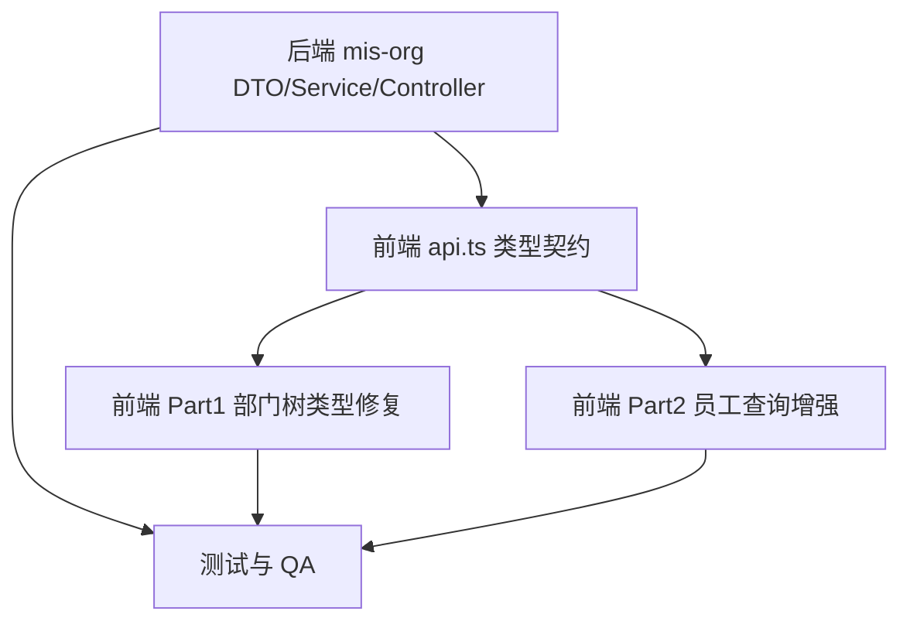
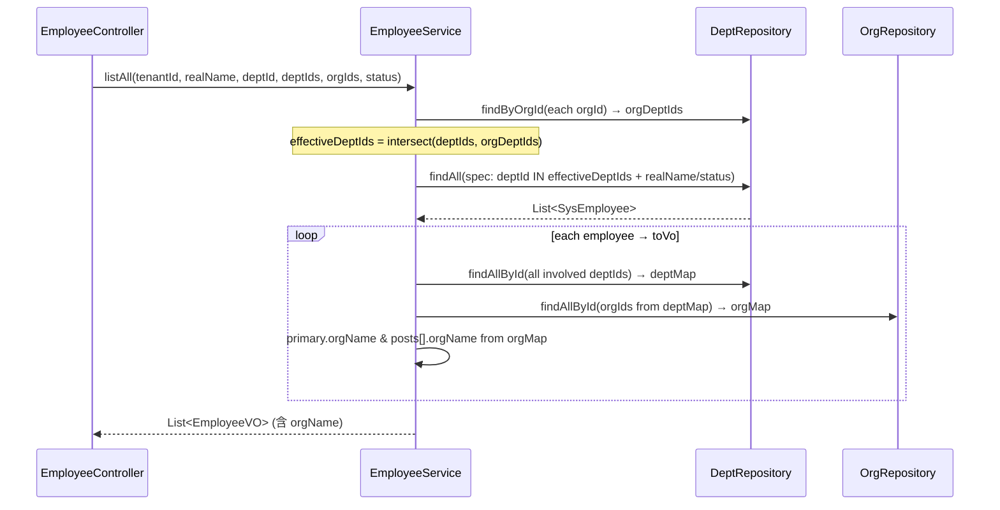
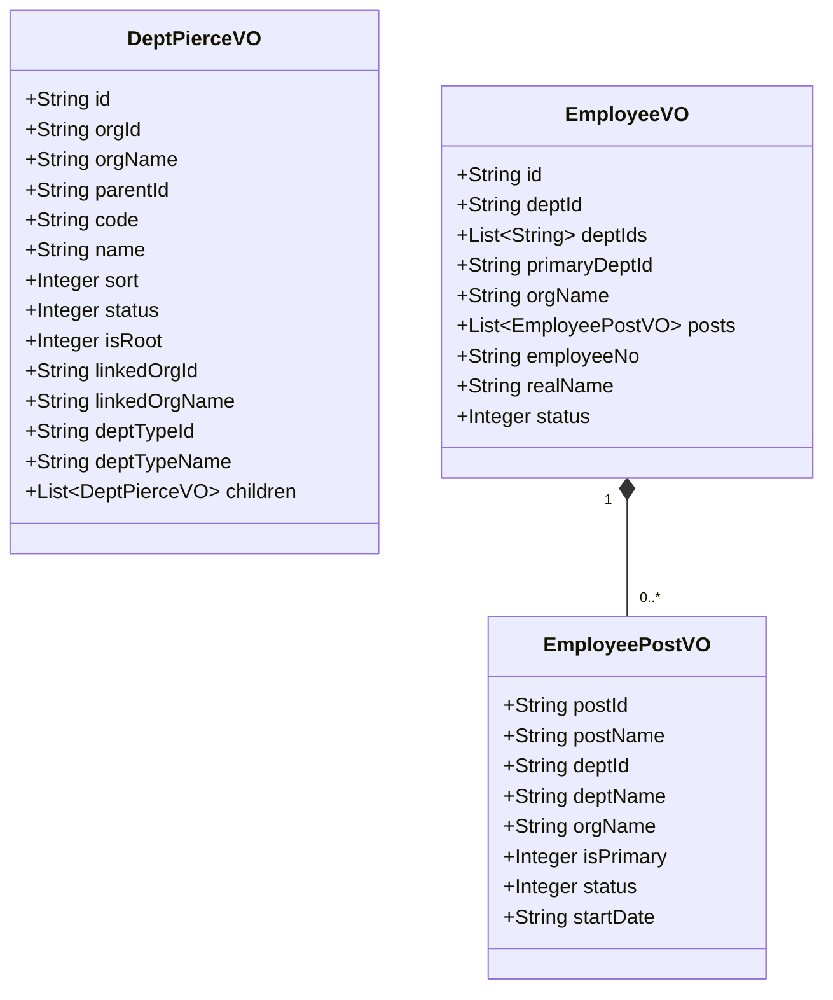

# MIS 平台交付架构设计 + 任务分解 + 遮罩诊断报告

> 交付架构师：高见远（software-architect）
> 范围：Part 1 部门树穿透只读行部门类型修正 / Part 2 员工管理组织·部门查询增强 / Part 3 浏览器遮罩层诊断（仅诊断）
> 代码事实均已基于仓库实读核实（行号见正文），未提交改动可直接采信。

---

## A. Part 1 设计（部门树穿透只读行部门类型修正）

### 根因确认（一句话）
`DeptService.pierce()`（DeptService.java:76-88）整棵 forest 递归时**只收集组织名/锚点组织名，从未调用 `buildDeptTypeNameMap`**，且 `toPierceVo`（:282-301）构造 `DeptPierceVO` 时不带部门类型字段，导致穿透（只读）行的部门类型被整体丢弃；前端 `normalizePierceNode`（dept-tree-types.ts:131）又硬编码 `deptTypeName: null`，`dept-tree-page.tsx:381` 对只读行直接渲染「—」。

### 修复方案
**后端（mis-org）**
- `DeptPierceVO.java`：新增 `String deptTypeId`、`String deptTypeName`（置于 `isRoot` 之后、`linkedOrgId` 之前或与 `linkedOrgName` 并列；与现有 id 用 String 保持一致，对齐前端 `DeptNode.deptTypeId?: string`）。
- `DeptService.pierce()`：在取到 `all`（:80）后，**一次性** `Map<Long,String> deptTypeNameMap = buildDeptTypeNameMap(all);`（该方法已存在 :270-280，批量 `deptTypeRepository.findAllById` 避免 N+1），随 `orgName/orgNames` 一并传入 `toPierceVo`。
- `toPierceVo`（:282）：新增参数 `Map<Long,String> deptTypeNameMap`，构造 VO 时填入 `String.valueOf(dept.getDeptTypeId())`、`deptTypeNameMap.get(dept.getDeptTypeId())`。

**前端（mis-admin-web）**
- `types/api.ts` `DeptPierceNode`（:163-176）：补 `deptTypeId?: string | null`、`deptTypeName?: string | null`。
- `dept-tree-types.ts` `normalizePierceNode`（:118-141）：将 `deptTypeName: null` 改为 `deptTypeName: node.deptTypeName ?? null`，并补 `deptTypeId: node.deptTypeId ?? null`（保持与 `normalizeDeptNode` :95 对称）。
- `dept-tree-page.tsx:381`：`{readOnly ? <span>—</span> : row.deptTypeName ?? '—'}` → 改为 `{row.deptTypeName ?? '—'}`（只读行也显示真实部门类型，与只读行计数显真实值的一致性原则对齐）。

### 文件清单（相对仓库根）
| 文件 | 改动 |
|---|---|
| backend/mis-org/.../dto/DeptPierceVO.java | 加 deptTypeId / deptTypeName 字段 |
| backend/mis-org/.../service/DeptService.java | pierce 收集 deptTypeNameMap；toPierceVo 透传 |
| frontend/mis-admin-web/src/types/api.ts | DeptPierceNode 补两字段 |
| frontend/mis-admin-web/src/features/system/dept/dept-tree-types.ts | normalizePierceNode 携带 deptTypeName/deptTypeId |
| frontend/mis-admin-web/src/features/system/dept/dept-tree-page.tsx | :381 只读行显示 deptTypeName |

### 任务顺序与依赖
后端字段契约先行（否则前端类型无来源），前端两步可并行；本部分并入全局 T1/T2/T3。

---

## B. Part 2 设计（员工管理组织·部门查询增强）

### 后端（mis-org）

**1. `EmployeeService.listAll` 扩展签名**
```java
public List<EmployeeVO> listAll(Long tenantId, String realName,
        Long deptId, List<Long> deptIds, List<Long> orgIds, Integer status)
```
- `orgIds` 经 `deptRepository.findByOrgId(orgId)` 反查得到 `orgDeptIds`（并集）；
- 与入参 `deptIds` 取**交集**（POST-04 语义）：
  - 仅传 deptIds → 过滤 `emp.deptId IN deptIds`；
  - 仅传 orgIds → 过滤 `emp.deptId IN orgDeptIds`；
  - 两者都传 → `emp.deptId IN (deptIds ∩ orgDeptIds)`；
  - 都空 → 不过滤部门。
- `deptId`（单值，保留兼容）视为 `deptIds = [deptId]` 的特例。

**2. `EmployeeController.listAll`（EmployeeController.java:39-45）**
新增 `@RequestParam(required = false) List<Long> deptIds`、`@RequestParam(required = false) List<Long> orgIds`（Spring 自动以 `,` 分隔解析 `List<Long>`）。

**3. `EmployeeVO` + `EmployeePostVO` 增加 orgName**
- `EmployeeVO.java`：新增 `String orgName`（主部门所属组织名，由 `emp.deptId`→dept→org 解析）；
- `EmployeePostVO.java`：新增 `String orgName`（该任职部门所属组织名）。
- `EmployeeService.toVo`（:328-361）：注入 `SysOrgRepository orgRepository`（参照 PostService.java:46/53/122 模式），一次性收集全部涉及 deptId（主部门 + 各 post 部门）→ `deptMap = deptRepository.findAllById(...)` → 提取 orgId 集合 → `orgMap = orgRepository.findAllById(...)` → 主部门 `orgName = orgMap.get(deptMap.get(emp.deptId).getOrgId())?.getName()`；每个 post 的 `orgName` 同理从 `p.deptId` 反查。

**4. `EmployeePostItem` 是否需要加 orgName**：**需要**。`EmployeePostVO` 已加 → 前端 `EmployeePostItem`（api.ts:319-327）补 `orgName?: string | null`，供展开表「组织」列使用。

### 前端（mis-admin-web）

**1. `types/api.ts`**
- `EmployeeItem`（:330-349）补 `orgName?: string | null`；
- `EmployeePostItem`（:319-327）补 `orgName?: string | null`。

**2. `lib/api/employees.ts`**
- `EmployeeQuery`（:11-15）补 `deptIds?: string[] | number[]`、`orgIds?: string[] | number[]`；
- `listEmployees`（:54-57）透传：`params: { ...query }` 已展开，无需改动透传逻辑（确保 query 含新字段即发出）。

**3. `features/system/page-defs.ts` `/system/employee`（:95-221）**
- `filters`（:105-109）改为：
  ```ts
  { key: 'real_name', label: '姓名', type: 'text', col: 2 },
  { key: 'deptIds', label: '主部门', type: 'dept-tree-multi', col: 4, serverFilter: true },
  { key: 'orgIds', label: '所属组织', type: 'multiselect', col: 4, optionsFrom: 'org', serverFilter: true },
  { key: 'status', label: '状态', type: 'select', col: 2, options: STATUS_OPTS },
  ```
- 加 `orgOptionsLoader: loadOrgOptions`、`serverFilterKeys: ['deptIds', 'orgIds']`（照搬 post 段 :233 / :238）。
- `columns`（:110-117）`dept`（主部门）映射改为「组织-部门」：`${primary.orgName}-${primary.deptName}`（orgName 缺省时仅显 deptName）。
- `loader`（:148-178）：主部门 `dept` 用 `primary?.orgName ? \`${primary.orgName}-${primary.deptName}\` : primary?.deptName ?? null`；`assignments` map（:168-175）补 `orgName: p.orgName`。

**4. 展开「任职记录」表加「组织」列（定位结果）**
- 渲染组件：`admin-list-page.tsx` 内 `AssignmentTable`（只读子表，定义于 :269-290；表头 :276-278，表体 :285-287；在行展开处通过 `<AssignmentTable list={assignments} />` 调用，:1415）。
- 方案：
  - 表头新增 `<th>组织</th>`（位于「任职部门」之后）；
  - 表体新增 `<td>{a.orgName ?? '—'}</td>`；
  - 为不影响其它使用 `assignments` 类型的页面，列显示条件化：仅当 `list` 中至少一项含 `orgName != null` 时才渲染「组织」表头与列（否则维持现状）。
- 数据来源：`a.orgName` 来自 loader 中 `assignments` 的 `orgName: p.orgName`（上面第 3 点已补）。

### 文件清单（相对仓库根）
| 文件 | 改动 |
|---|---|
| backend/mis-org/.../dto/EmployeeVO.java | 加 orgName |
| backend/mis-org/.../dto/EmployeePostVO.java | 加 orgName |
| backend/mis-org/.../service/EmployeeService.java | listAll 扩展 + 注入 orgRepository + toVo 填充 orgName |
| backend/mis-org/.../controller/EmployeeController.java | listAll 加 deptIds/orgIds 参数 |
| frontend/mis-admin-web/src/types/api.ts | EmployeeItem / EmployeePostItem 补 orgName |
| frontend/mis-admin-web/src/lib/api/employees.ts | EmployeeQuery 补 deptIds/orgIds |
| frontend/mis-admin-web/src/features/system/page-defs.ts | employee 段 filters/columns/loader/assignments |
| frontend/mis-admin-web/src/features/system/admin-list-page.tsx | AssignmentTable 加「组织」列（条件渲染） |

### 任务顺序与依赖
**后端先于前端**（前端需新 DTO 字段契约）。本部分并入全局 T1/T2/T4。

---

## C. Part 3 诊断报告（仅诊断，不写修复代码）

### 冻结时当场排查清单（照做）
1. **DevTools → Elements**：搜 `.MuiBackdrop-root` 或 `position:fixed` / `inset-0` 全屏 div，看是否残留且 `pointer-events` 覆盖视口 → 确认是遮罩未关。
2. **Console**：冻结前是否有未捕获异常 / rejected promise（本仓库错误多经 `showToast` 吞掉，留意 `Promise.reject` 未被 catch）。
3. **Network**：是否有请求一直 pending（loading 未关闭的常见诱因；本仓库 axios `timeout: 15000` 才会被动结束）。
4. **React DevTools**：看某个 `<Dialog>/<Sheet>` 的 `open` state 是否卡 `true`（Radix `Dialog.Root` 的 `open` prop）。

### 高风险嫌疑文件/组件清单（按风险排序）
> 已对**系统管理通用引擎** `admin-list-page.tsx` 与通用 `Sheet/Dialog` 原语、`lib/api/client.ts` 逐行审计，结论如下。

| 风险 | 文件:行 | 原因 |
|---|---|---|
| ✅ 已排除（低） | admin-list-page.tsx:721→733-734 | 数据加载 `setLoading(true)` 配 `.finally(() => { if (alive) setLoading(false) })` 且用 `alive` 守卫，严格配平。 |
| ✅ 已排除（低） | admin-list-page.tsx:1480→908-909 | `onOpenChange={closeSheet}`，`closeSheet(open){ setSheetOpen(open) }`，Radix 标准接线，Esc/点遮罩均触发关闭。 |
| ⚠️ 中（设计缺口·首嫌疑） | admin-list-page.tsx:987-1010 `handleSave`；:1012-1030 `removeRow` | 提交/删除期间**无任何 saving/loading 状态**；`createApi/updateApi/deleteApi` 的 Promise 若因网络挂起（15s 超时前）长期不 settle，界面无「提交中」遮罩或按钮禁用，用户感知为"卡死"；且 `setSheetOpen(false)` 仅在 try 成功分支，catch 仅 toast。 |
| 🔴 高（机制·需逐文件核查） | 任意 Radix `Dialog`/`Sheet` 的 `open` 卡 true | 遮罩即 `fixed inset-0 z-50 bg-slate-950/40`（sheet.tsx:28 / command-palette.tsx:61），`open` 不翻 false 即冻结视口。引擎已确认接线正确，但其它 feature 弹窗若 `onOpenChange` 未真正 `setOpen(false)` 即冻结。候选：
- command-palette.tsx:59-61（全局命令面板遮罩，高流量，优先查）
- kb-document-upload-dialog.tsx:161（grep 行未显示 `open`/`onOpenChange`，需确认受控接线）
- 其余 60+ Dialog 多为 `onOpenChange={(v)=>!v && setX(false)}` 或 `(v)=>(v?null:setX(false))` 模式（安全）。 |
| ✅ 已排除（低） | lib/api/client.ts:44-66 | 响应拦截器仅做 401 刷新重试，**无全局 loading 遮罩**，排除全局层。 |

### 建议下一步
1. 先按上面 4 步清单复现，确认是「哪种遮罩」：全屏 `bg-slate-950/40`（Dialog/Sheet open 卡 true）→ 走 🔴；还是"无遮罩但按钮点了没反应/列表不刷新"→ 走 ⚠️（缺提交中态 + 依赖网络超时）。
2. 若冻结发生在**员工/岗位/部门页（本次改动页）**：首要嫌疑是 ⚠️（缺 saving 态，`handleSave` 无 finally 关闭）。修复：提交期间置 `saving=true`、按钮 `disabled`、并 `try/finally` 中 `setSheetOpen(false)` + `setSaving(false)`。
3. 若发生在其它 feature 弹窗：按 🔴 逐文件核查 `onOpenChange` 是否真正复位 `open`。
4. 本次 Part 1/2 改动会触碰 `page-defs.ts` 与 `admin-list-page.tsx`，建议顺带在 `handleSave` 补 saving 态（低成本，消除 ⚠️）。

---

## D. 全局约定 / 测试策略 / 待明确事项

### 跨 Part 1/2 共享约定
- **DTO 字段命名**：后端 VO 用 `deptTypeId`/`deptTypeName`/`orgName`（驼峰）；前端 `api.ts` 接口用同名可选字段 + `?`，缺省一律 `null`。
- **缺失降级**：任何 `orgName`/`deptTypeName` 为 `null` 或 `undefined` 时，UI 显示「—」（与现有 `?? '—'` 约定一致）。
- **主部门格式**：列显示 `组织-部门`（orgName 缺省则仅部门）；展开表「组织」列独立成列。
- **服务端过滤键**：`deptIds`/`orgIds` 走 `serverFilterKeys`，引擎跳过客户端二次过滤（照搬 post 范式）。
- **批量预取**：orgName 一律用 `orgRepository.findAllById` 一次性取 `orgMap` 填充，禁止逐条查库（复用 PostService R1 模式）。

### 测试策略提示（QA 用）
- **Part 1**：单测 `normalizePierceNode` 携带 `deptTypeName` 且只读行渲染分支（dept-tree-types.test.ts 增加用例：穿透节点带 deptTypeId/deptTypeName → 行 `deptTypeName` 非空；dept-tree-page:381 改后只读行显真实值而非「—」）。
- **Part 2**：
  - 后端 `EmployeeService.listAll`：验证 `orgIds→deptIds` 反查 + 与 `deptIds` 交集语义（仅 orgIds / 仅 deptIds / 两者 / 皆空四组）；验证 `EmployeeVO.orgName` 与 `posts[].orgName` 经 `orgMap` 批量填充正确、脏数据（部门未挂组织）为 `null`。
  - 前端 loader 单测：「组织-部门」拼接（`orgName` 缺省回退 `deptName`）；`assignments` 携带 `orgName`；`AssignmentTable` 条件渲染「组织」列。

### 待明确事项
- `SysDeptRepository.findByOrgId(Long)` 团队已核实存在（POST-04 已用）；`EmployeeService` 注入 `SysOrgRepository` 需在构造器补参（参照 PostService.java:53）。
- 展开表「组织」列是否对所有 `assignments` 类型页面可见：本设计采用**条件渲染**（仅员工页带 orgName 时显示），如需全局统一显示请确认。
- Part 3 为纯诊断，未写入任何修复；是否将 ⚠️ 的 saving 态补丁纳入本次 PR 待主理人定夺。

---

## 可执行任务列表（有序 · 含依赖 · 按实现顺序）

> 分组原则：按模块/层聚合，避免单文件拆任务；后端先于前端（前端依赖新 DTO 契约）。Part 3 仅诊断，不入任务。

### T1 · 后端 mis-org DTO/Service/Controller（Part 1+2 合并，同一 PR）
- **源文件**：`DeptPierceVO.java`、`EmployeeVO.java`、`EmployeePostVO.java`、`DeptService.java`、`EmployeeService.java`、`EmployeeController.java`
- **依赖**：无
- **优先级**：P0
- **内容**：
  1. `DeptPierceVO` 加 `deptTypeId/deptTypeName`；`pierce()` 收集 `buildDeptTypeNameMap(all)` 并透传 `toPierceVo`。
  2. `EmployeeVO/EmployeePostVO` 加 `orgName`；`EmployeeService` 注入 `SysOrgRepository`。
  3. `listAll` 扩签名为 `(tenantId, realName, deptId, deptIds, orgIds, status)`，`orgIds`→`findByOrgId` 反查并与 `deptIds` 取交集过滤。
  4. `toVo` 批量预取 `deptMap`+`orgMap` 填充 `orgName`（主部门 + 各 post）。
  5. `EmployeeController.listAll` 加 `@RequestParam(required=false) List<Long> deptIds/orgIds`。

### T2 · 前端共享类型契约（api.ts）
- **源文件**：`frontend/mis-admin-web/src/types/api.ts`
- **依赖**：T1（字段契约来源）
- **优先级**：P0
- **内容**：`DeptPierceNode` 补 `deptTypeId?/deptTypeName?`；`EmployeeItem` 补 `orgName?`；`EmployeePostItem` 补 `orgName?`。

### T3 · 前端 Part 1 修复（部门树穿透只读行类型显示）
- **源文件**：`dept-tree-types.ts`、`dept-tree-page.tsx`
- **依赖**：T2
- **优先级**：P0
- **内容**：`normalizePierceNode` 改携带 `deptTypeName/deptTypeId`；`dept-tree-page.tsx:381` 只读行改显 `row.deptTypeName ?? '—'`（与计数显真实值一致）。

### T4 · 前端 Part 2 员工页查询增强（page-defs + employees + 展开表）
- **源文件**：`lib/api/employees.ts`、`features/system/page-defs.ts`、`features/system/admin-list-page.tsx`
- **依赖**：T2
- **优先级**：P0
- **内容**：
  1. `EmployeeQuery` 补 `deptIds?/orgIds?`，`listEmployees` 透传。
  2. `page-defs.ts` `/system/employee`：filters 改 `real_name + deptIds(dept-tree-multi,serverFilter) + orgIds(multiselect,optionsFrom org,serverFilter) + status`；加 `orgOptionsLoader: loadOrgOptions`、`serverFilterKeys:['deptIds','orgIds']`；`dept` 列映射「组织-部门」；loader `assignments` 补 `orgName`。
  3. `admin-list-page.tsx` `AssignmentTable`（:269-290）条件渲染「组织」列（表头 + 表体 `a.orgName ?? '—'`）。

### T5 · 测试与 QA 验证
- **源文件**：`dept-tree-types.test.ts`（扩展）、`backend/.../test/.../EmployeeServiceListFilterTest.java`（扩展/新增）、前端 loader 单测
- **依赖**：T1、T3、T4
- **优先级**：P1
- **内容**：Part 1 的 `normalizePierceNode` 携带 + 渲染分支；Part 2 的 `listAll` 交集过滤 + `toVo` orgName 填充 + 前端「组织-部门」拼接与展开表 orgName。

### 任务依赖图


### Part 2 数据流转（sequence）


### DTO 变更概览（classDiagram）

