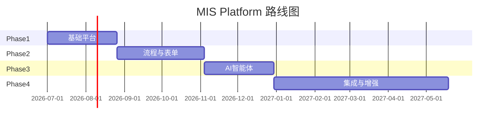

# 01 — 项目总览

> 状态：📝 草稿 | 版本：v1.0-draft

## 1. 项目定位

**MIS Platform** 是面向企业内部使用的统一管理与协作平台，提供组织人事、权限管控、系统配置、审计合规等基础能力，并预留 AI 智能体层用于知识问答、审批辅助、数据分析等场景。

### 1.1 目标用户

| 角色 | 使用场景 |
|------|----------|
| 系统管理员 | 用户/组织/角色/菜单/字典维护 |
| 部门管理员 | 本部门人员与数据管理（受数据权限约束） |
| 普通员工 | 仪表盘、个人中心、后续流程审批 |
| 审计人员 | 登录日志、操作日志查询 |

### 1.2 非目标（Out of Scope，Phase 1）

- 工作流引擎与表单引擎（Phase 2）
- 企微/钉钉 SSO（Phase 2）
- RAG 知识库与真实 LLM 对接（Phase 3）
- 移动端 / 小程序
- 多租户 SaaS 商业化运营
- 微前端拆分

## 2. 核心价值

1. **统一身份与权限**：RBAC + 数据范围，菜单/按钮/API 三级控制
2. **可审计**：登录与操作全链路留痕，敏感字段脱敏
3. **可扩展**：微服务边界清晰，AI 层独立演进
4. **现代化体验**：暗色主题、Command Palette、响应式布局

## 3. 技术栈

| 层级 | 选型 | 版本（规划） |
|------|------|-------------|
| 管理后台 | React + TypeScript + Vite + shadcn/ui | React 18.3, Vite 5 |
| API 网关 | Spring Cloud Gateway | 4.x |
| 业务服务 | Spring Boot + Spring Cloud Alibaba | Boot 3.2.5, SCA 2023.0.1 |
| 运行时 | JDK | 17 LTS |
| 数据库 | PostgreSQL | 16 |
| 持久层 | Spring Data JPA (Hibernate 6) | Boot 3.2 默认 |
| 缓存 | Redis | 7.2 |
| 注册/配置 | Nacos | 2.3.x |
| 对象存储 | MinIO | S3 兼容 |
| 智能体 | Python + FastAPI | Python 3.11 |
| 容器 | Docker Compose（开发）/ K8s（生产） | — |

## 4. 分阶段路线图

### Phase 1 — 基础平台（当前文档范围）

- 认证授权（登录/登出/Token 刷新）
- 用户、组织、角色、菜单、字典
- 审计日志（登录 + 操作）
- 管理后台完整 UI 骨架与核心业务页面
- Agent Gateway 健康检查与 Mock 对话（不阻塞主系统）

### Phase 2 — 核心业务

- Flowable 流程引擎
- 动态表单引擎
- 消息中心（站内信、邮件、企微/钉钉）
- 文件中心
- 报表基础

### Phase 3 — AI 能力

- RAG 知识库
- 嵌入式 Copilot
- 审批摘要 Agent
- NL2SQL（只读沙箱）

### Phase 4 — 增强与集成

- 低代码页面
- 外部系统集成（ERP/HR）
- 多租户增强
- 移动端 H5

## 5. 非功能需求（NFR）

| 指标 | Phase 1 目标 | 生产目标 |
|------|-------------|----------|
| API P99 延迟（非 AI） | < 500ms（本地） | < 500ms |
| 可用性 | — | 99.9% |
| 并发用户 | 100（开发验证） | 5000+（水平扩展） |
| 前端 Lighthouse Performance | > 70 | > 80 |
| 核心 Service 单测覆盖率 | ≥ 60% | ≥ 70% |

## 6. 项目代号与命名

| 项 | 值 |
|----|-----|
| 项目代号 | `mis-platform` |
| Maven groupId | `com.mis` |
| 前端包名 | `mis-admin-web` |
| API 前缀 | `/api/v1` |
| 默认租户 ID | `1` |

## 7. 待确认项

- [ ] Phase 1 是否坚持单库策略（见 ADR-001）
- [ ] 是否需要从 Phase 1 开始支持多租户 UI 切换
- [ ] 仪表盘统计指标是否需要对接真实 HR 数据
- [ ] 是否需要英文界面并行开发

## 8. 关联文档

- [系统架构](02-system-architecture.md)
- [Sprint 计划](../project/sprint-plan.md)
- [待确认项汇总](../README.md#待确认项汇总全局)
