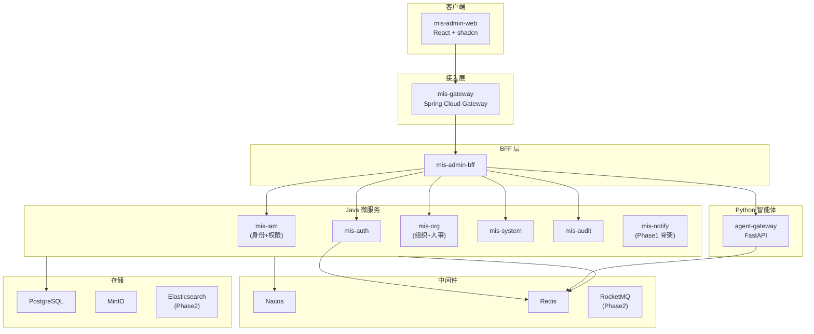
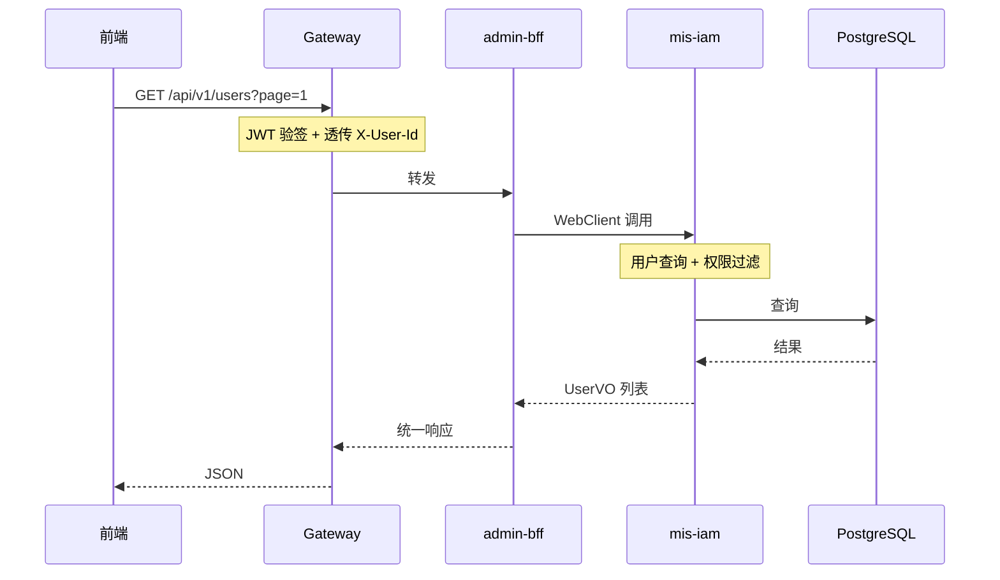

# 02 — 系统架构

> 状态：✅ 已更新 | 版本：v1.1 | 更新：Sprint 2 服务边界重构

## 1. 逻辑架构图



## 2. 分层职责

| 层级 | 组件 | 职责 | 禁止事项 |
|------|------|------|----------|
| 客户端 | mis-admin-web | UI 渲染、表单校验、权限展示 | 不直连微服务（除 SSE 等特殊场景） |
| 接入层 | mis-gateway | 路由、JWT 验签、限流、CORS、traceId | 不写业务逻辑 |
| BFF | mis-admin-bff | 聚合接口、适配前端 DTO、减少往返 | 不承载核心业务规则 |
| 领域服务 | mis-auth / mis-iam / mis-org / mis-system | 单一限界上下文、领域规则 | 不跨域直接访问他库表 |
| 智能体 | agent-gateway | LLM 编排、RAG、工具调用 | 不承载核心交易写操作 |
| 基础设施 | Nacos/Redis/PG | 注册发现、配置、缓存、持久化 | — |

## 3. 请求链路（典型读操作）



## 4. Monorepo 目录结构

```
mis-platform/
├── frontend/mis-admin-web/
├── backend/
│   ├── pom.xml
│   ├── mis-common/
│   ├── mis-gateway/
│   ├── mis-admin-bff/
│   ├── mis-auth/
│   ├── mis-iam/
│   ├── mis-org/
│   ├── mis-system/
│   ├── mis-audit/
│   └── mis-notify/
├── agent/
│   ├── agent-gateway/
│   └── shared/
├── deploy/
├── docs/
└── scripts/
```

## 5. 服务清单与端口

| 服务 | 端口 | Phase | 说明 |
|------|------|-------|------|
| mis-gateway | 8080 | 1 | 统一入口 |
| mis-admin-bff | 8081 | 1 | BFF 聚合 |
| mis-auth | 8101 | 1 | 认证 |
| mis-iam | 8102 | 1 | 身份+权限（合并原 mis-user/mis-rbac） |
| mis-org | 8103 | 1 | 组织+人事 |
| mis-system | 8105 | 1 | 菜单/API/字典/日志 |
| mis-audit | 8106 | 1 | 审计 |
| mis-notify | 8107 | 1 | 骨架 |
| agent-gateway | 8200 | 1 | Mock AI |
| mis-admin-web | 5173 | 1 | 开发服务器 |

> **Sprint 2 重构：** mis-user（原8102）和 mis-rbac（原8104）已取消，合并为 mis-iam（8102）。端口 8104 回收。

## 6. 服务间通信

### 6.1 Phase 1

| 方式 | 场景 |
|------|------|
| WebClient + LoadBalancer | BFF 并行聚合调用领域服务 |
| RestClient + LoadBalancer | 领域服务间低频同步调用 |
| Redis 单级缓存 | 权限、字典、会话、验证码（见 ADR-006）；写后 DEL，无 Pub/Sub |
| 共享 PostgreSQL 单库 | 简化事务，避免 Seata |

### 6.2 Phase 2+

| 方式 | 场景 |
|------|------|
| RocketMQ | 用户创建、角色变更、流程事件 |
| Seata AT | 跨库分布式事务（若拆库） |
| Elasticsearch | 全文检索、日志分析 |

## 7. 统一响应格式

```json
{
  "code": 0,
  "message": "ok",
  "data": {},
  "traceId": "a1b2c3d4e5f6"
}
```

### 分页响应 data 结构

```json
{
  "page": 1,
  "size": 20,
  "total": 100,
  "list": []
}
```

## 8. 错误码规划

| 范围 | 含义 | 示例 |
|------|------|------|
| 0 | 成功 | — |
| 40100-40199 | 认证失败 | 40100 Token 无效 |
| 40300-40399 | 权限不足 | 40300 无接口权限 |
| 40400-40499 | 资源不存在 | 40400 用户不存在 |
| 40900-40999 | 业务冲突 | 40900 用户名已存在 |
| 50000-50099 | 系统错误 | 50000 内部错误 |

## 9. 可观测性（规划）

| 能力 | 技术 | Phase |
|------|------|-------|
| 指标 | Micrometer + Prometheus | 1（基础） |
| 链路 | OpenTelemetry + Jaeger | 2 |
| 日志 | 结构化 JSON + traceId | 1 |
| 健康检查 | Spring Actuator `/actuator/health` | 1 |

## 10. 待确认项

- [ ] Phase 1 BFF 是否必须，还是前端直连 Gateway 路由到各服务
- [ ] Gateway 是否承担 JWT 验签（**是**，见 03-security §4）
- [ ] BFF 是否信任 Gateway 透传头（**Phase 1 是**，见 03-security §4.5）
- [ ] 是否需要 API 版本策略（v1/v2 并存规则）
- [ ] mis-notify Phase 1 是否从仓库中完全排除，仅保留目录占位

## 11. 关联文档

- [安全设计](03-security.md)
- [微服务划分](../backend/microservices.md)
- [本地开发环境](../devops/local-dev.md)
