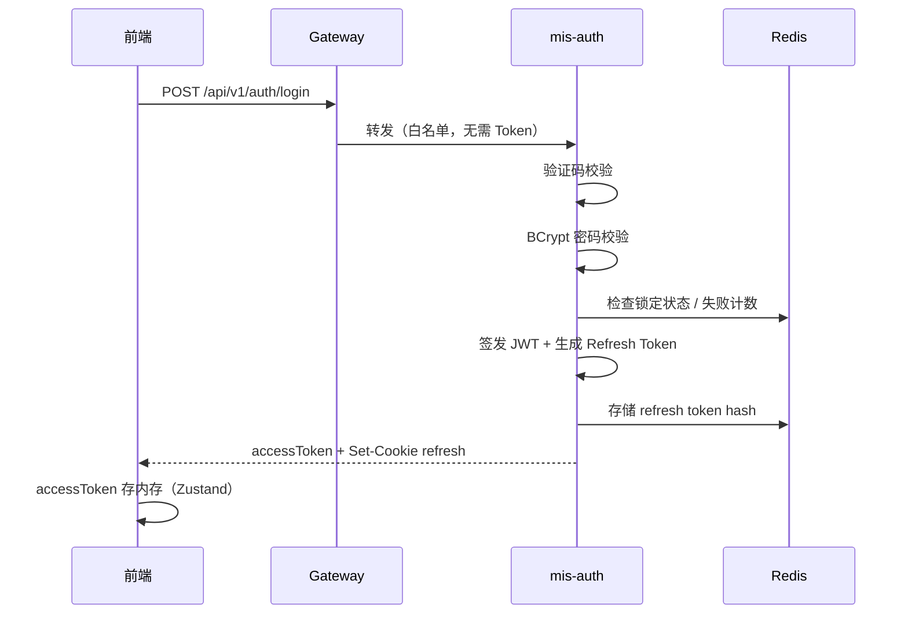
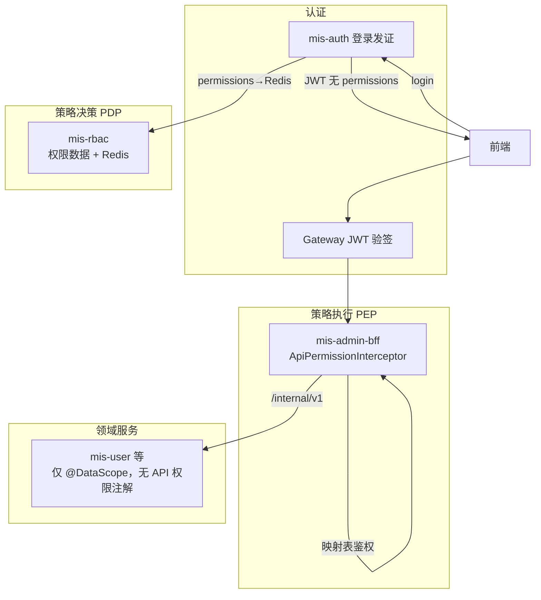
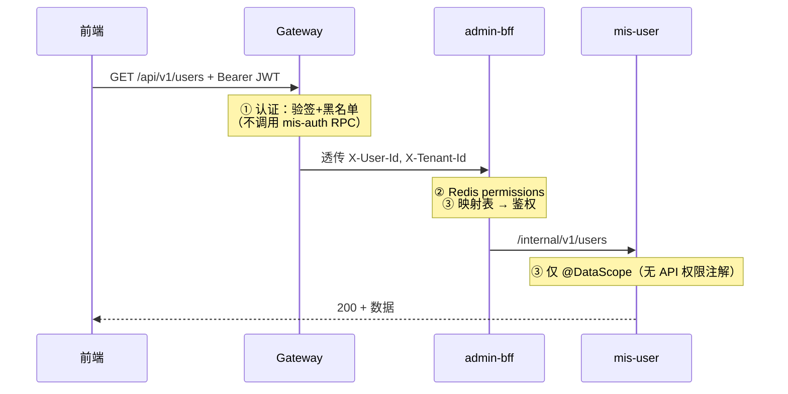
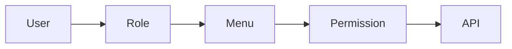

# 03 — 安全设计

> 状态：📝 草稿 | 版本：v1.0-draft

## 1. 安全目标

1. 身份可信：强密码策略 + 验证码 + 登录失败锁定
2. 访问可控：RBAC 菜单/按钮/API 三级 + 数据范围
3. 传输安全：HTTPS（生产）、CORS 白名单
4. 可审计：登录日志、操作日志、敏感字段脱敏
5. 令牌安全：短 Access Token + HttpOnly Refresh Cookie

## 2. 认证架构



## 3. Token 规范

### 3.1 Access Token（JWT RS256）

| 声明 | 说明 |
|------|------|
| sub | 用户 ID（字符串） |
| tenantId | 租户 ID |
| **appId** | **登录所在 APP**（ADR-011） |
| employeeId | 员工主数据 ID |
| username | 登录名 |
| deptId | 主部门 ID |
| roles | 角色编码数组（**展示用**，API 鉴权不依赖此字段） |
| permVersion | 权限版本号（与 Redis 对比，供前端刷新菜单） |
| iat / exp | 签发 / 过期时间 |
| jti | 唯一 ID（用于黑名单） |

> **JWT 不含 `permissions` 数组。** 权限变更频繁时 Token 无法及时更新；运行时权限见 [ADR-009](../adr/ADR-009-permissions-in-redis-not-jwt.md)。

- 有效期：默认 7200 秒（`sys_config: security.token.access_ttl`）
- 存储：前端内存（Zustand），**不放 localStorage**

### 3.2 权限存哪里（运行时）

> 详见 [ADR-009](../adr/ADR-009-permissions-in-redis-not-jwt.md)

| 存储 | Key / 接口 | 用途 |
|------|------------|------|
| **PostgreSQL** | `sys_role_permission`、`sys_menu_api` 等 | 权威源 |
| Redis | `mis:rbac:permissions:{tenantId}:{appId}:{userId}` | BFF 鉴权、`/auth/me` |
| **Redis** | `mis:rbac:perm-version:{tenantId}:{appId}:{userId}` | 版本号 |
| **JWT** | — | **不存 permissions** |
| **前端** | `auth-store.permissions` | 来自 `GET /auth/me`，非 JWT decode |

**登录流程：** mis-rbac 聚合 permissions → **写入 Redis** → JWT 只带 identity + permVersion。

**业务请求：** BFF 解析 JWT → Redis 取 permissions → **映射表匹配 method/path** → 鉴权。

**权限变更：** 写 DB → **DEL 受影响用户的 Redis key** → 用户**下次请求**即获新权限，无需重新登录。

### 3.3 Refresh Token

| 属性 | 值 |
|------|-----|
| 格式 | 256bit 随机字符串 |
| 存储 | DB `sys_refresh_token.token_hash` + Redis |
| 传输 | HttpOnly Cookie `mis_refresh_{appCode}`（或统一名 + payload 含 appId） |
| SameSite | Strict |
| Secure | 生产环境 true |
| 有效期 | 默认 604800 秒（7 天） |
| 轮换 | 每次 refresh 颁发新 refresh，旧 token 吊销 |

## 4. 认证 vs 授权：谁做什么

> 常见困惑：权限怎么校验？**不是**每个 Controller 写 `@PreAuthorize`，而是 BFF **一张映射表 + 统一拦截器**（ADR-010）。

### 4.1 概念拆分

| 概念 | 英文 | 回答的问题 | 典型位置 |
|------|------|------------|----------|
| **认证** | Authentication | 你是谁？Token 有效吗？ | Gateway（验签 JWT） |
| **授权** | Authorization | 你能调这个 API 吗？ | **mis-admin-bff**（`ApiPermissionInterceptor` + 映射表） |
| **数据权限** | Data Scope | 你能看哪些行？ | 领域服务（`@DataScope` + SQL） |

**mis-auth** 不负责每个业务请求的权限判断；**mis-rbac** 提供权限数据（PDP），不在热路径上对每个 API 做 RPC 校验。

> 详见 [ADR-008](../adr/ADR-008-bff-centralized-api-authz.md)：对外 API 权限在 **BFF 统一校验**，不新建独立 authz-service，领域服务不做 `@PreAuthorize`。

### 4.2 全链路分工（Phase 1 方案 — ADR-008）



| 层级 | 组件 | 何时执行 | 做什么 | **不做什么** |
|------|------|----------|--------|--------------|
| L0 登录 | **mis-auth** | `login` / `refresh` / `logout` | 密码、验证码、调 rbac **写 Redis**，签发 JWT（**无 permissions**） | 不拦截业务 API |
| L1 网关 | **mis-gateway** | 每个非白名单请求 | JWT 验签、黑名单、透传 `X-User-Id` | **不做** API 权限判断 |
| L2 接口授权 | **mis-admin-bff** | 对外请求 | Redis 取 permissions + **method/path 查映射表** | 不在 Controller 硬编码 |
| — | **mis-rbac** | 登录回填、缓存 miss、权限变更 | DB 聚合、evict Redis | 热路径命中时不 RPC |
| L3 数据授权 | **领域服务** | SQL 执行前 | `@DataScope` | **不做** API 权限校验 |

### 4.3 业务请求时序（已登录用户）



**要点：**
- JWT 只证明身份；permissions 在 **Redis**（变更后 DEL，下次请求生效）
- Redis miss 时 BFF 调 rbac 回源并回填
- 权限变更频繁时**不必**重新登录

### 4.4 三种「集中校验」方案对比

| 方案 | 做法 | 是否推荐 |
|------|------|----------|
| **A. 独立 authz-service，每请求 RPC** | Gateway/BFF 都问 authz | ❌ 延迟高、单点故障 |
| **B. Gateway 配 route→permission** | 网关层统一 | ❌ 细粒度 RBAC 难维护 |
| **C. BFF 映射表 + rbac PDP（选定）** | 对外单表配置；Controller 无硬编码 | ✅ ADR-008/010 |

「单独一个服务管权限」应理解为 **mis-rbac 管权限数据和策略**，而不是 **每个 API 都 RPC 问一次**。

### 4.5 权限校验：菜单树 + API 树（数据库）

```
sys_api (type=api)              BFF 请求
────────────────────          ─────────
permission=system:user:add    POST /api/v1/users  →  需要 system:user:add
```

| 存储 | 职责 |
|------|------|
| `sys_menu` | UI 树 + **permission** |
| `sys_api` | HTTP 端点注册树（无 permission） |
| `sys_menu_api` | 菜单页/按钮 ↔ API 关联 |
| `sys_role_permission` | 角色授权（`perm_type`：menu / dept / store…） |
| `sys_menu_api` | 菜单页/按钮 ↔ API 关联 |
| Redis permissions | `{tenantId}:{appId}:{userId}` 下的 permission 集合 |
| `ApiPermissionRegistry` | 从 `sys_api WHERE type=api` 加载 |

详见 [api-permission-mapping.md](../backend/api-permission-mapping.md)、[ADR-011](../adr/ADR-011-sys-api-code-multi-app-auth.md)。

### 4.6 SecurityContext 如何建立

**mis-admin-bff**（必须）：
1. 解析 JWT → userId
2. `GET mis:rbac:permissions:{tenantId}:{appId}:{userId}` from Redis
3. miss → 调 mis-rbac 回源 → 回填 Redis
4. `ApiPermissionInterceptor`：method + path → 查映射表 → 比对 permissions

**领域服务**：`@DataScope` only；无 API 权限注解。

### 4.7 与前端权限的关系

| 位置 | 机制 | 作用 |
|------|------|------|
| 前端菜单/按钮 | `permissions` + `usePermission` | **体验优化**（隐藏无权限按钮） |
| `ApiPermissionInterceptor`（BFF） | 后端强制 | **真正安全边界** |

前端隐藏按钮不等于安全；**后端注解是权威**。

## 5. Gateway 鉴权（认证层 L1）

### 5.1 白名单路径

```
POST /api/v1/auth/login
POST /api/v1/auth/refresh
GET  /api/v1/auth/captcha
GET  /actuator/health
GET  /v3/api-docs/**
```

### 5.2 鉴权流程（仅认证，不含接口权限）

1. 提取 `Authorization: Bearer {token}`
2. RS256 本地验签（公钥从 Nacos 获取）
3. 检查 `jti` 是否在 Redis 黑名单
4. 透传请求头：`X-User-Id`, `X-Tenant-Id`, `X-Username`, `X-Trace-Id`（**不含**权限判断）

> Gateway 这一层只回答「Token 是否合法、用户是谁」，不回答「能否调用 system:user:delete」。

## 6. 授权模型

### 6.1 RBAC 三层



| 层级 | 控制对象 | 示例 |
|------|----------|------|
| 菜单 | 路由可见性 | `/system/user` |
| 按钮 | 页面操作 | `system:user:add` |
| API | 接口访问 | `api-permissions.yml` 映射 + `ApiPermissionInterceptor` |

### 6.2 数据权限

| data_scope 值 | 名称 | SQL 策略 |
|---------------|------|----------|
| 1 | 全部数据 | 不追加条件 |
| 2 | 本部门 | `dept_id = #{userDeptId}` |
| 3 | 本部门及下级 | `dept_id IN (子树 ID 列表)` |
| 4 | 仅本人 | `created_by = #{userId}` |
| 5 | 自定义 | `dept_id IN (SELECT target_id FROM sys_role_permission WHERE perm_type='dept')` |

实现方式：Spring Data JPA **`DataScopeSpecification`** + `@DataScope` 注解（**仅在领域服务**，与 BFF 的 API 权限校验互补）。见 [ADR-015](../adr/ADR-015-jpa-over-mybatis.md)。

## 7. 密码策略

| 规则 | 值 |
|------|-----|
| 最小长度 | 8 |
| 复杂度 | 至少字母 + 数字 |
| 加密 | BCrypt（strength=10） |
| 失败锁定 | 连续 5 次失败，锁定 30 分钟 |
| 默认密码 | `Mis@123456`（首次登录可强制修改，Phase 1 可选） |

## 8. 验证码

- 类型：图形验证码（4 位字母数字）
- 存储：Redis，key=`captcha:{captchaId}`，TTL=300 秒
- 接口：`GET /api/v1/auth/captcha` 返回 `{ captchaId, imageBase64 }`

## 9. 审计

### 9.1 登录日志 `sys_login_log`

记录：user_id, username, ip, user_agent, status, msg, login_at

### 9.2 操作日志 `sys_oper_log`

| 字段 | 说明 |
|------|------|
| module | 模块名，如「用户管理」 |
| operation | 操作名，如「新增用户」 |
| request_params | JSON，敏感字段脱敏 |
| duration_ms | 耗时 |
| response_code | 业务 code |

采集方式：`@OperLog` AOP 注解 + SpEL 解析业务 ID。

### 9.3 脱敏规则

| 字段类型 | 脱敏方式 |
|----------|----------|
| 手机号 | `138****0000` |
| 身份证 | `110***********1234` |
| 密码 | 不记录 |
| Token | 不记录 |

## 10. 安全防护清单

| 威胁 | 措施 | Phase |
|------|------|-------|
| SQL 注入 | JPA 参数绑定 + 输入校验；原生 SQL 仅 `@Query` 参数化 | 1 |
| XSS | 前端输出转义；富文本 Phase 2 用 DOMPurify | 1 |
| CSRF | SameSite Cookie；API 用 Bearer Token | 1 |
| 暴力破解 | 验证码 + 失败锁定 | 1 |
| 越权访问 | RBAC + DataScope | 1 |
| 敏感数据泄露 | 脱敏 + 最小权限 | 1 |
| 依赖漏洞 | Dependabot / Trivy 扫描 | 1 |

## 11. 待确认项

- [ ] 是否 Phase 1 启用 MFA（TOTP / 短信）
- [ ] Refresh Token 是否同时允许 body 传递（移动端预留）
- [ ] JWT 私钥管理方式：Nacos 配置 vs 挂载 K8s Secret
- [ ] 是否需要 IP 白名单（管理后台内网访问）
- [ ] 操作日志是否记录 response body（默认不记录）
- [x] 权限存 **Redis**，JWT **不内嵌** permissions（ADR-009）
- [x] 权限变更：**主动 evict Redis**，BFF 下次请求生效
- [ ] 前端 permVersion 变更时自动拉 `/auth/me`（Phase 2 WebSocket 可选）

## 12. 关联文档

- [权限清单](../api/permissions.md)
- [ADR-002：JWT + Refresh Cookie](../adr/ADR-002-jwt-refresh-cookie.md)
