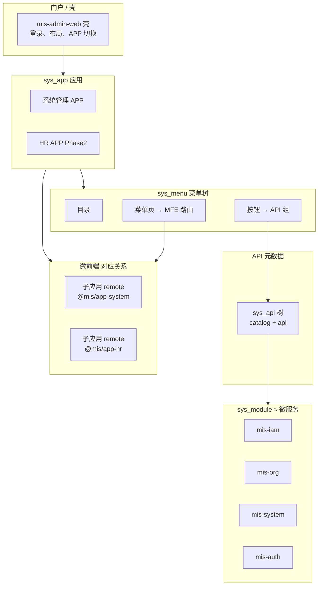

# 04 — 应用、模块、菜单、API 与微前端

> 状态：📝 讨论稿 | 版本：v1.1-discussion

## 1. 你的设想（归纳）

```
APP（应用）
 └── 菜单树（目录 → 菜单页 → 按钮）     ← 对应微前端里的页面/操作
 └── API 树（类似菜单的分层）           ← API 归属某个后端模块（微服务）
 └── 模块 = 业务微服务（mis-iam、mis-org …）
```

并问：**微前端是否也类似模块？每个页面是否类似一个 API？**

---

## 2. 结论先说

| 说法 | 是否合理 |
|------|----------|
| **API 归属某个模块（微服务）** | ✅ 合理，应在元数据里标明 `module_id` / `service_name` |
| **菜单归属某个 APP** | ✅ 合理，多应用门户 / 微前端子应用时必需 |
| **API 也做成树** | ✅ 作为**分类目录**合理；**运行时鉴权仍是扁平** method+path |
| **一个 service 模块 = 一个业务微服务** | ✅ 与当前 **mis-iam、mis-org、mis-system** 划分一致 |
| **微前端 ≈ 模块** | △ 部分对：APP ≈ 微前端子应用，不是每个微服务一个 MFE |
| **每个页面 ≈ 一个 API** | ❌ 不准确：**一个页面消费多个 API**；对应关系是 **菜单页 ↔ MFE 路由/页面，按钮 ↔ API 组** |

**Phase 1 建议：** 在库里**预留 APP + 模块**，菜单挂 APP、API 挂模块；**微前端与 API 树 UI Phase 2** 再做。单体内核（BFF + 一个 admin-web）可先跑通。

---

## 3. 推荐概念模型（四层）



### 3.1 各层职责对照

| 概念 | 数据库 | 后端 | 前端 | 与微服务 |
|------|--------|------|------|----------|
| **APP** | `sys_app` | 菜单/API/用户按 `app_id` 隔离 | 微前端**子应用**边界 | 不拥有 module |
| **模块** | `sys_module` | **平台级**微服务注册表，**无 app_id** | 不暴露给用户 | `service_name=mis-iam` |
| **菜单页** | `sys_menu` type=2 | BFF 路由 | **一个页面**（MFE 一个 route） | 页面可调多个服务 |
| **按钮** | `sys_menu` type=3 | — | 工具栏按钮 | — |
| **API 树** | **`sys_api`** | catalog + api 叶子 | — | `module_id` 必填 |
| **API 端点** | **`sys_api` type=api** | 真实 HTTP | axios 调用 | 参与 BFF Registry |

---

## 4. 纠正两个常见类比

### 4.1 「每个页面类似一个 API」

不对。典型用户管理页：

```
菜单页「用户管理」(1 个 MFE 页面)
  ├── API: GET  /api/v1/users          (mis-iam)
  ├── API: GET  /api/v1/depts/tree     (mis-org)
  ├── 按钮「新增」
  │     └── POST /api/v1/users         (mis-iam)
  └── 按钮「分配角色」
        └── PUT  /api/v1/users/{id}/roles (mis-iam)
```

**菜单页 : API = 1 : N**（页面 API 挂在 type=2 节点下）  
**按钮 : API = 1 : N**（操作 API 挂在 type=3 节点下）

### 4.2 「微前端类似模块」

更准确的说法：

| 微前端 | 对应 |
|--------|------|
| 整个 `mis-admin-web` 壳 | 门户 + 登录 + 布局 |
| 一个 **APP** | 一个 **微前端子应用**（Module Federation remote） |
| 菜单页 `component` | 子应用内的 **路由/页面组件** |
| 后端 **module** | **微服务**，不是前端 bundle |

一个 APP 的页面/API 可调用**多个** `sys_module`（微服务）；module 与 APP **无数据库级对应**，关联经 `sys_api.module_id`。

---

## 5. API 树 vs 菜单树（两棵独立 code 树）

| | 菜单树 `sys_menu` | API 树 `sys_api` |
|--|-------------------|------------------|
| 目的 | 导航、UI 授权 | HTTP 注册、API 授权 |
| code | 独立编号，如 `00020001` | 独立编号，如 `000100010001` |
| 叶子 | 菜单页/按钮 | `type=api`（method+path） |
| 运行时 | 路由、按钮显示 | BFF Registry 读 `type=api` 扁平匹配 |

API 树示例：

```
0001  catalog  身份模块 (module: mis-iam)
00010001  catalog  用户查询
000100010001  api  GET /api/v1/users
000100020001  api  POST /api/v1/users
```

---

## 6. 与现有 ADR 的关系

| 已有决策 | 本模型如何兼容 |
|----------|----------------|
| ADR-008 BFF 统一鉴权 | 不变；`sys_api` + permission |
| ADR-010 → ADR-011 | `sys_menu_api` 演进为 `sys_api` 独立树 |
| ADR-011 多 APP | 用户/角色/菜单/API 均带 `app_id` |
| Phase 1 不做微前端 | APP 表先只有 `system` 一个 |

---

## 7. 分阶段建议

### Phase 1（当前）

- 表：`sys_app`、`sys_module`、`sys_employee`、`sys_user`、`sys_menu`、`sys_api`、**`sys_menu_api`**
- 前端：单仓 `mis-admin-web`
- BFF：一个 `mis-admin-bff`

### Phase 2

- Module Federation，每个 `sys_app` 一个 remote
- 管理台 API 树可视化编辑

---

## 8. 待确认

| ID | 问题 | 状态 |
|----|------|------|
| M1–M7 | APP / 模块（含 module 与 app 解耦） | ✅ 已全部确认 |
| A1–A6 | sys_api + 多 APP 隔离 | ✅ ADR-011 |

---

## 9. 关联文档

- [Schema 细化讨论](../database/schema-discussion.md)
- [微服务划分](../backend/microservices.md)
- [ADR-011](../adr/ADR-011-sys-api-code-multi-app-auth.md)
