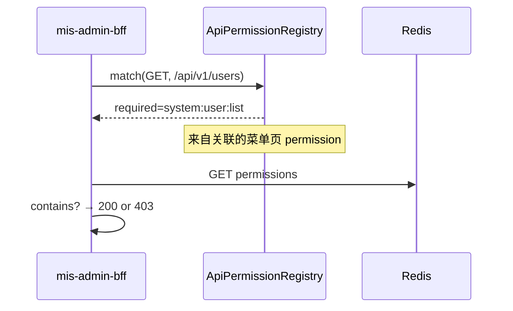

# API 权限映射（角色 → 菜单/按钮 → API）

> 状态：📝 草稿 | 存储：`sys_menu` + `sys_api` + **`sys_menu_api`** | 详见 [ADR-011](../adr/ADR-011-sys-api-code-multi-app-auth.md)

## 1. 模型总览

```
角色勾选（`sys_role_permission` WHERE `perm_type='menu'`）
└── 菜单树 sys_menu
    ├── 菜单页 (type=2)  permission = system:user:list
    │     sys_menu_api → GET /api/v1/users, GET /api/v1/orgs/tree
    └── 按钮 (type=3)  permission = system:user:add
          sys_menu_api → POST /api/v1/users

sys_api（独立 API 注册树，管理台维护 HTTP 端点）
catalog → api 叶子（method + path + module_id）
```

| 概念 | 存储 | 说明 |
|------|------|------|
| 权限码 | `sys_menu.permission` | **唯一鉴权来源**（菜单页、按钮） |
| HTTP 端点 | `sys_api` type=api | 无 permission 字段 |
| 关联 | `sys_menu_api` | menu_id ↔ api_id |
| 角色授权 | **`sys_role_permission`**（`perm_type='menu'`） | 勾选目录/菜单页/按钮 |
| 用户 permissions | Redis | 已勾选节点的 permission 去重 |
| BFF 鉴权 | Registry | api ⋈ menu_api ⋈ menu → path → permission |

## 2. 鉴权流程



Registry SQL：

```sql
SELECT a.http_method, a.path_pattern, m.permission, m.type AS menu_type, m.id AS menu_id
FROM sys_api a
INNER JOIN sys_menu_api ma ON ma.api_id = a.id
INNER JOIN sys_menu m ON ma.menu_id = m.id
WHERE a.type = 'api' AND a.status = 1
  AND m.status = 1 AND m.permission IS NOT NULL;
```

用户 permissions（登录写入 Redis）：

```sql
SELECT DISTINCT m.permission
FROM sys_user_role ur
JOIN sys_role_permission rp ON ur.role_id = rp.role_id AND rp.perm_type = 'menu'
JOIN sys_menu m ON rp.target_id = m.id
WHERE ur.user_id = ? AND m.app_id = ?
  AND m.status = 1 AND m.permission IS NOT NULL AND m.type IN (2, 3);
```

## 3. 用户管理 — 完整示例

### 3.1 菜单树 + 角色勾选

| code | type | name | permission | 角色勾选 |
|------|------|------|------------|----------|
| 00020001 | 2 | 用户管理 | system:user:list | ✅ |
| 000200010001 | 3 | 新增用户 | system:user:add | ✅ |
| 000200010002 | 3 | 编辑用户 | system:user:edit | ✅ |

### 3.2 sys_menu_api 绑定

| menu 节点 | permission | api (method + path) |
|-----------|------------|------------------------|
| 用户管理(菜单页) | system:user:list | GET /api/v1/users |
| 用户管理(菜单页) | system:user:list | GET /api/v1/orgs/tree |
| 新增用户(按钮) | system:user:add | POST /api/v1/users |
| 编辑用户(按钮) | system:user:edit | GET /api/v1/users/{id} |
| 编辑用户(按钮) | system:user:edit | PUT /api/v1/users/{id} |

### 3.3 sys_api 树（元数据，节选）

| code | type | http_method | path_pattern | module |
|------|------|-------------|--------------|--------|
| 000100010001 | api | GET | /api/v1/users | mis-iam |
| 000100020001 | api | POST | /api/v1/users | mis-iam |

## 4. 仅登录 API

挂在 `permission IS NULL` 的菜单页下，或 `sys_menu_api` 关联且 menu.permission 为空：

| menu | http_method | path_pattern |
|------|-------------|--------------|
| 认证(菜单页) | GET | /api/v1/auth/me |
| 认证(菜单页) | GET | /api/v1/menus/router |

login/captcha/refresh 在 Gateway 白名单，不入库。

## 5. 管理台 API

| 方法 | 路径 | 权限 |
|------|------|------|
| GET | `/menus/{menuId}/apis` | system:menu:query |
| PUT | `/menus/{menuId}/apis` | system:menu:edit |
| GET | `/apis/tree` | system:api:query |
| POST | `/apis` | system:api:edit |

变更后刷新 Registry；菜单 permission 变更时 evict 用户 Redis。

## 6. 关联文档

- [表结构](../database/schema-design.md) §3.9–3.12
- [权限清单](../api/permissions.md)
- [ADR-011](../adr/ADR-011-sys-api-code-multi-app-auth.md)
