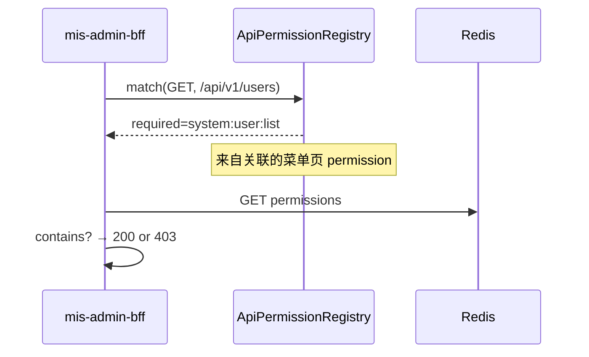

# API 权限映射（角色 → 菜单/按钮 → API）

> 状态：📝 草稿 | 存储：`sys_menu` + `sys_api` + **`sys_menu_api`** | 详见 [ADR-011](../adr/ADR-011-sys-api-code-multi-app-auth.md)

## 1. 模型总览

```
角色勾选（`sys_role_permission` WHERE `perm_type='menu'`）
└── 菜单树 sys_menu
    ├── 菜单页 (type=2)  permission = system:user:list
    │     sys_menu_api → GET /api/v1/users, GET /api/v1/orgs/tree
    └── 按钮 (type=3)  permission = system:user:add
          sys_menu_api → POST /api/v1/users

sys_api（独立 API 注册树，管理台维护 HTTP 端点）
catalog → api 叶子（method + path + module_id）
```

| 概念 | 存储 | 说明 |
|------|------|------|
| 权限码 | `sys_menu.permission` | **唯一鉴权来源**（菜单页、按钮） |
| HTTP 端点 | `sys_api` type=api | 无 permission 字段 |
| 关联 | `sys_menu_api` | menu_id ↔ api_id |
| 角色授权 | **`sys_role_permission`**（`perm_type='menu'`） | 勾选目录/菜单页/按钮 |
| 用户 permissions | Redis | 已勾选节点的 permission 去重 |
| BFF 鉴权 | Registry | api ⋈ menu_api ⋈ menu → path → permission |

## 2. 鉴权流程


```mermaid
sequenceDiagram
    participant BFF as mis-admin-bff
    participant Reg as ApiPermissionRegistry
    participant Redis as Redis

    BFF->>Reg: match(GET, /api/v1/users)
    Reg-->>BFF: required=system:user:list
    Note over Reg: 来自关联的菜单页 permission
    BFF->>Redis: GET permissions
    BFF->>BFF: contains? → 200 or 403
```

Registry SQL：

```sql
SELECT a.http_method, a.path_pattern, m.permission, m.type AS menu_type, m.id AS menu_id
FROM sys_api a
INNER JOIN sys_menu_api ma ON ma.api_id = a.id
INNER JOIN sys_menu m ON ma.menu_id = m.id
WHERE a.type = 'api' AND a.status = 1
  AND m.status = 1 AND m.permission IS NOT NULL;
```

用户 permissions（登录写入 Redis）：

```sql
SELECT DISTINCT m.permission
FROM sys_user_role ur
JOIN sys_role_permission rp ON ur.role_id = rp.role_id AND rp.perm_type = 'menu'
JOIN sys_menu m ON rp.target_id = m.id
WHERE ur.user_id = ? AND m.app_id = ?
  AND m.status = 1 AND m.permission IS NOT NULL AND m.type IN (2, 3);
```

## 3. 用户管理 — 完整示例

### 3.1 菜单树 + 角色勾选

| code | type | name | permission | 角色勾选 |
|------|------|------|------------|----------|
| 00020001 | 2 | 用户管理 | system:user:list | ✅ |
| 000200010001 | 3 | 新增用户 | system:user:add | ✅ |
| 000200010002 | 3 | 编辑用户 | system:user:edit | ✅ |

### 3.2 sys_menu_api 绑定

| menu 节点 | permission | api (method + path) |
|-----------|------------|------------------------|
| 用户管理(菜单页) | system:user:list | GET /api/v1/users |
| 用户管理(菜单页) | system:user:list | GET /api/v1/orgs/tree |
| 新增用户(按钮) | system:user:add | POST /api/v1/users |
| 编辑用户(按钮) | system:user:edit | GET /api/v1/users/{id} |
| 编辑用户(按钮) | system:user:edit | PUT /api/v1/users/{id} |

### 3.3 sys_api 树（元数据，节选）

| code | type | http_method | path_pattern | module |
|------|------|-------------|--------------|--------|
| 000100010001 | api | GET | /api/v1/users | mis-iam |
| 000100020001 | api | POST | /api/v1/users | mis-iam |

### 3.4 知识库（mis-kb / mis-admin-bff）

> **【R6 反向修订 · 2026-08-04】** 二期 Wave A 新增命中测试（Q-04），此处补登记。
> 菜单与授权 seed 见 `V17__kb_hittest_perms.sql`（菜单 `91039`，授权 `role_id=1`；
> 「知识管理员 / 运营」角色 id 未固化，按主理人裁决 U1 待 V18 补授）。
> **【2026-08-04 补正 · 返工三】** V17 已**一并**写入 `sys_api`（catalog `91060` + API `91061` `POST /api/v1/kb/hit-test`）
> 与 `sys_menu_api`（`91061`：菜单 `91039` → API `91061`）。即：命中测试是 **KB 模块当前唯一完成 API 级登记的端点**，
> 其余 KB 端点（库列表 / 引擎配置 / 重解析 / RAG 设置保存等）仍只在菜单/按钮授权层生效、API 层未映射（见下方实况说明）。
>
> **【2026-08-04 补正 · 返工四 / QA P0-A】** V17 原先还建了一个按钮节点承载同一权限码，
> 违反 `uk_menu_app_permission`（`sys_menu (app_id, permission) WHERE status=1 AND permission IS NOT NULL`
> 部分唯一索引，见 `V1__init_schema.sql:269`），**首次 migrate 即失败**。
> 已按主理人裁决「方案 C」删除该按钮节点：`kb:hittest:run` 由页面菜单 `91039` 单独承载，
> `sys_menu_api` 也改挂 `91039`。**本仓库不支持「页面菜单 + 按钮节点共用同一 permission」的写法**，
> 后续补登记时务必遵守。

| menu 节点 | permission | api (method + path) | 备注 |
|-----------|------------|------------------------|------|
| 命中测试(菜单页 91039) | `kb:hittest:run` | `POST /api/v1/kb/hit-test` | **新增，且已 API 级登记（V17：sys_api `91061` + sys_menu_api `91061`）**。单库检索调参工具；后端另叠加 ACL（`hasPermission(userId, libraryId, 'read')`），权限码只管功能可用性、管不了能看哪个库 |
| ~~执行命中测试(按钮)~~ | — | — | **已删除（返工四 / QA P0-A）**。该按钮节点与菜单页 `91039` 共用 `kb:hittest:run`，违反 `uk_menu_app_permission`。权限码统一由菜单页 `91039` 承载；页内「执行」按钮暂未包 `PermissionGate`，与 KB 现有页面基线一致（KB 前端目前统一靠动态菜单授权控制入口可见性） |
| 知识库(菜单页 91033) | `kb:library:list` | `GET /api/v1/kb/libraries` | V32 登记（READ-02） |
| 编辑知识库(按钮 91044) | `kb:library:edit` | `PUT /api/v1/kb/libraries/{id}/engine/settings` | 已有；RAG 设置 Tab 的保存按钮。V32 另把 `GET /libraries/{id}/engine/settings`（READ-05）挂同码——RAG 设置敏感，「能改才能看」（Q6） |
| 维护文档(按钮 91047) | `kb:document:edit` | `POST /api/v1/kb/libraries/{libraryId}/documents/{id}/reparse` | 已有；重解析按钮 |
| 引擎配置(菜单页 91038) | `kb:engine:view` | `GET /api/v1/kb/engine/capabilities` | **【文档纠偏 2026-08-12】** 此前误标「已有」——实际未登记（grep 全仓迁移无此行），V32 已补登（READ-23）；同码另挂 `engine/health`（READ-22）、`engine/models`（READ-24） |

> **实况说明（勿误读上表）**：KB 模块 API **除命中测试外均尚未写入 `sys_api` / `sys_menu_api`**（自 V13 起即如此，非 Wave A 引入）。
> `ApiPermissionRegistryLoader` 的规则源就是这两张表，分两类情况：
> - **命中测试（例外，V17 中登记 SQL 已就绪）**：`POST /api/v1/kb/hit-test` 的登记语句已写入 `sys_api`（API `91061`）
>   + `sys_menu_api`（`91061`：**菜单页 `91039`** → API `91061`），关联权限码 `kb:hittest:run`。
>   ⚠️ **生效前提（截至本次修订尚未在任何环境实测）**：(1) V17 在目标库上真实执行成功；
>   (2) BFF 侧 `ApiPermissionRegistry` 完成重载（重启，或等 `refresh-interval-seconds` 默认 300s 到期）。
>   两者满足后，`ApiPermissionInterceptor` 才会对未授权用户返回 `403`。在此之前，因
>   `mis.api-permission.deny-unmapped: false`，该路径按「未映射」放行。
>   为覆盖这段空窗，`KbController.requireHitTestPermission()` 提供了一道代码级兜底判权
>   （复用 `UserPermissionLoader`，与拦截器同一权限查询路径）。
>   服务端 ACL（`hasPermission(userId, libraryId, 'read')`）始终叠加兜底——两道闸门语义不同、缺一不可。
> - **其余 KB 端点（库列表 `91033`、引擎配置 `91038`、重解析 `91047`、RAG 设置保存 `91044` 等）**：仍只在菜单/按钮授权层生效，API 层**未映射**；
>   未映射 API 的实际闸门是「仅登录」（deny-unmapped=false），API 层强制判权要等 KB 整体补 `sys_api` seed 后才真正落地。
> 注意：**上表命中测试行已与现实一致**，其余行是后续补 seed 时的对齐目标；真正的越权兜底始终由服务端 ACL 提供，不依赖上述登记。

**审计**：`POST /api/v1/kb/hit-test` 在 BFF 标注 `@OperLog(module="知识库", operation="命中测试")`，
经 `OperLogAspect` → `AuditWebClient` 落 audit 表。原因：命中测试可读取跨密级知识库的 chunk 原文，
属敏感读操作，不能无痕。结果 CSV 导出为纯前端行为，不额外记审计（内容用户本就可见）。

### 3.5 知识库 V32 补登 28 端点（技术债 11.2 收尾，SEC-03/04）

> 迁移：`V32__kb_security_sprint.sql`（sys_api `91125-91152` / code `00900041-00900068` / sys_menu_api `91225-91252` / sort `50-77`）。
> 权限码全部复用既有 `kb:*` 体系，零新增权限码、零新增菜单行；一码一菜单挂既有节点（91032-91038 页面 / 91044 编辑 / 91045 删除 / 91051 反馈）。
> 端点 `method + path` 与 BFF `KbController` 映射逐字一致（`KbControllerRegistryCoverageTest` 锁定）。

| 编号 | sys_api id | code | 方法 | path_pattern | 功能 | 权限码 | menu_id |
|---|---|---|---|---|---|---|---|
| READ-01 | 91125 | 00900041 | GET | `/api/v1/kb/categories` | 分类列表 | `kb:category:list` | 91032 |
| READ-02 | 91126 | 00900042 | GET | `/api/v1/kb/libraries` | 库列表 | `kb:library:list` | 91033 |
| READ-03 | 91127 | 00900043 | GET | `/api/v1/kb/libraries/{id:[0-9]+}` | 库详情 | `kb:library:list` | 91033 |
| READ-04 | 91128 | 00900044 | GET | `/api/v1/kb/libraries/{id:[0-9]+}/detail` | 详情聚合 | `kb:library:list` | 91033 |
| READ-05 | 91129 | 00900045 | GET | `/api/v1/kb/libraries/{id:[0-9]+}/engine/settings` | RAG 设置读取 | `kb:library:edit` | 91044 |
| READ-06 | 91130 | 00900046 | GET | `/api/v1/kb/libraries/{libraryId:[0-9]+}/documents` | 文档列表 | `kb:document:list` | 91034 |
| READ-07 | 91131 | 00900047 | GET | `/api/v1/kb/libraries/{libraryId:[0-9]+}/documents/{id:[0-9]+}` | 文档详情 | `kb:document:list` | 91034 |
| READ-08 | 91132 | 00900048 | GET | `/api/v1/kb/libraries/{libraryId:[0-9]+}/acls` | ACL 列表 | `kb:acl:list` | 91035 |
| READ-09 | 91133 | 00900049 | GET | `/api/v1/kb/qa/sessions/mine` | 我的会话 | `kb:qa:ask` | 91036 |
| READ-10 | 91134 | 00900050 | GET | `/api/v1/kb/qa/sessions/{sessionId}` | 会话详情 | `kb:qa:ask` | 91036 |
| READ-11 | 91135 | 00900051 | GET | `/api/v1/kb/qa/sessions/{sessionId}/feedback` | 反馈详情 | `kb:qa:ask` | 91036 |
| READ-12 | 91136 | 00900052 | GET | `/api/v1/kb/operations/qa/sessions` | 运营会话列表 | `kb:operation:list` | 91037 |
| READ-13 | 91137 | 00900053 | GET | `/api/v1/kb/operations/qa/sessions/{sessionId}` | 运营会话详情 | `kb:operation:list` | 91037 |
| READ-14 | 91138 | 00900054 | GET | `/api/v1/kb/operations/qa/sessions-all` | 全量会话 | `kb:operation:list` | 91037 |
| READ-15 | 91139 | 00900055 | GET | `/api/v1/kb/operations/qa/feedback` | 反馈列表 | `kb:operation:list` | 91037 |
| READ-16 | 91140 | 00900056 | GET | `/api/v1/kb/operations/stats` | 评价看板 | `kb:operation:list` | 91037 |
| READ-17 | 91141 | 00900057 | GET | `/api/v1/kb/operations/qa/export` | 运营 CSV 导出 | `kb:operation:list` | 91037 |
| READ-18 | 91142 | 00900058 | GET | `/api/v1/kb/operations/qa/tickets` | 工单列表 | `kb:operation:list` | 91037 |
| READ-19 | 91143 | 00900059 | GET | `/api/v1/kb/operations/qa/tickets/{ticketId}` | 工单详情 | `kb:operation:list` | 91037 |
| READ-20 | 91144 | 00900060 | GET | `/api/v1/kb/operations/qa/tickets/by-session/{sessionId}` | 会话侧栏工单 | `kb:operation:list` | 91037 |
| READ-21 | 91145 | 00900061 | GET | `/api/v1/kb/subjects/search` | 授权主体检索 | `kb:acl:list` | 91035 |
| READ-22 | 91146 | 00900062 | GET | `/api/v1/kb/engine/health` | 引擎健康 | `kb:engine:view` | 91038 |
| READ-23 | 91147 | 00900063 | GET | `/api/v1/kb/engine/capabilities` | 引擎能力 | `kb:engine:view` | 91038 |
| READ-24 | 91148 | 00900064 | GET | `/api/v1/kb/engine/models` | 引擎模型池 | `kb:engine:view` | 91038 |
| WRITE-01 | 91149 | 00900065 | DELETE | `/api/v1/kb/libraries/{id:[0-9]+}` | 删除/归档知识库 | `kb:library:delete` | 91045 |
| WRITE-02 | 91150 | 00900066 | POST | `/api/v1/kb/qa/feedback` | 提交问答反馈 | `kb:qa:feedback` | 91051 |
| WRITE-03 | 91151 | 00900067 | POST | `/api/v1/kb/operations/qa/tickets` | 创建问答工单 | `kb:qa:ask` | 91036 |
| WRITE-04 | 91152 | 00900068 | PATCH | `/api/v1/kb/operations/qa/tickets/{ticketId}` | 处理问答工单 | `kb:operation:list` | 91037 |

## 4. 仅登录 API

挂在 `permission IS NULL` 的菜单页下，或 `sys_menu_api` 关联且 menu.permission 为空：

| menu | http_method | path_pattern |
|------|-------------|--------------|
| 认证(菜单页) | GET | /api/v1/auth/me |
| 认证(菜单页) | GET | /api/v1/menus/router |

login/captcha/refresh 在 Gateway 白名单，不入库。

> **authOnly 口径（2026-08-12 补充）**：注册表行关联的菜单 `permission` 为空时，
> `ApiService.registry()` 以「permission 为空」原生派生 `authOnly=true`（`ApiService.java:38`）——
> 拦截器对 authOnly 端点只校验登录态（未登录 40100），不做 URL 权限码比对。
> **V33（U1 裁决）**：`POST /api/v1/ai/skill/execute` / `POST /api/v1/ai/skill/apply`
> 以 authOnly 登记（sys_api `91153/91154`，挂 V21 建的 permission=NULL 目录 `92200`），
> 使 AI 反向信任链路在 fail-closed 下不断裂；真实判权由 Controller 层
> `SkillPermissionChecker` 按 body `skill_id` 做技能级 fail-closed（`ai:skill:{id}:run`）。

## 5. 管理台 API

| 方法 | 路径 | 权限 |
|------|------|------|
| GET | `/menus/{menuId}/apis` | system:menu:query |
| PUT | `/menus/{menuId}/apis` | system:menu:edit |
| GET | `/apis/tree` | system:api:query |
| POST | `/apis` | system:api:edit |

变更后刷新 Registry；菜单 permission 变更时 evict 用户 Redis。

## 6. 关联文档

- [表结构](../database/schema-design.md) §3.9–3.12
- [权限清单](../api/permissions.md)
- [ADR-011](../adr/ADR-011-sys-api-code-multi-app-auth.md)
