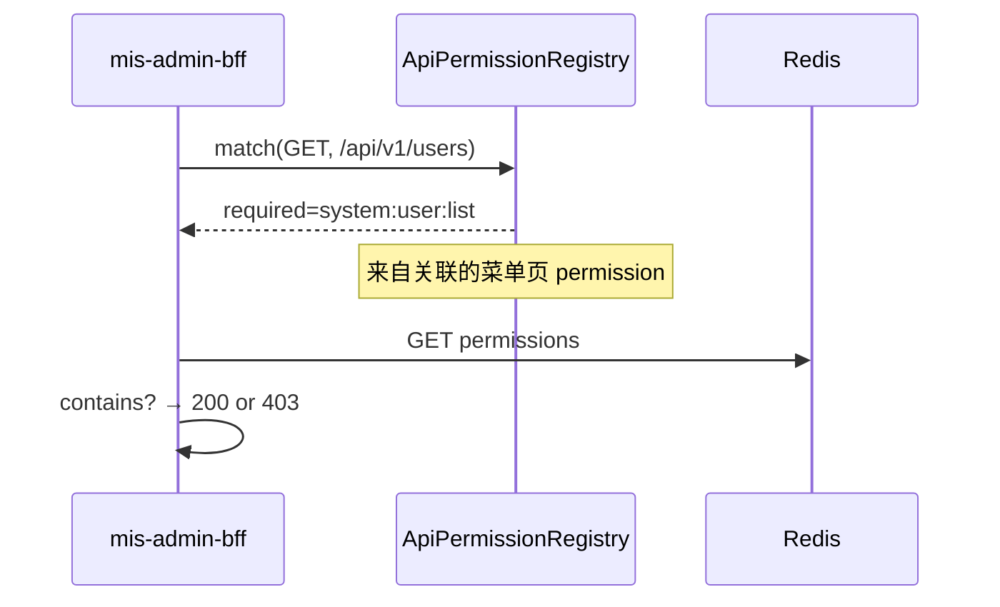

# API 权限映射（角色 → 菜单/按钮 → API）

> 状态：📝 草稿 | 存储：`sys_menu` + `sys_api` + **`sys_menu_api`** | 详见 [ADR-011](../adr/ADR-011-sys-api-code-multi-app-auth.md)

## 1. 模型总览

```
角色勾选（`sys_role_permission` WHERE `perm_type='menu'`）
└── 菜单树 sys_menu
    ├── 菜单页 (type=2)  permission = system:user:list
    │     sys_menu_api → GET /api/v1/users, GET /api/v1/orgs/tree
    └── 按钮 (type=3)  permission = system:user:add
          sys_menu_api → POST /api/v1/users

sys_api（独立 API 注册树，管理台维护 HTTP 端点）
catalog → api 叶子（method + path + module_id）
```

| 概念 | 存储 | 说明 |
|------|------|------|
| 权限码 | `sys_menu.permission` | **唯一鉴权来源**（菜单页、按钮） |
| HTTP 端点 | `sys_api` type=api | 无 permission 字段 |
| 关联 | `sys_menu_api` | menu_id ↔ api_id |
| 角色授权 | **`sys_role_permission`**（`perm_type='menu'`） | 勾选目录/菜单页/按钮 |
| 用户 permissions | Redis | 已勾选节点的 permission 去重 |
| BFF 鉴权 | Registry | api ⋈ menu_api ⋈ menu → path → permission |

## 2. 鉴权流程


```mermaid
sequenceDiagram
    participant BFF as mis-admin-bff
    participant Reg as ApiPermissionRegistry
    participant Redis as Redis

    BFF->>Reg: match(GET, /api/v1/users)
    Reg-->>BFF: required=system:user:list
    Note over Reg: 来自关联的菜单页 permission
    BFF->>Redis: GET permissions
    BFF->>BFF: contains? → 200 or 403
```

Registry SQL：

```sql
SELECT a.http_method, a.path_pattern, m.permission, m.type AS menu_type, m.id AS menu_id
FROM sys_api a
INNER JOIN sys_menu_api ma ON ma.api_id = a.id
INNER JOIN sys_menu m ON ma.menu_id = m.id
WHERE a.type = 'api' AND a.status = 1
  AND m.status = 1 AND m.permission IS NOT NULL;
```

用户 permissions（登录写入 Redis）：

```sql
SELECT DISTINCT m.permission
FROM sys_user_role ur
JOIN sys_role_permission rp ON ur.role_id = rp.role_id AND rp.perm_type = 'menu'
JOIN sys_menu m ON rp.target_id = m.id
WHERE ur.user_id = ? AND m.app_id = ?
  AND m.status = 1 AND m.permission IS NOT NULL AND m.type IN (2, 3);
```

## 3. 用户管理 — 完整示例

### 3.1 菜单树 + 角色勾选

| code | type | name | permission | 角色勾选 |
|------|------|------|------------|----------|
| 00020001 | 2 | 用户管理 | system:user:list | ✅ |
| 000200010001 | 3 | 新增用户 | system:user:add | ✅ |
| 000200010002 | 3 | 编辑用户 | system:user:edit | ✅ |

### 3.2 sys_menu_api 绑定

| menu 节点 | permission | api (method + path) |
|-----------|------------|------------------------|
| 用户管理(菜单页) | system:user:list | GET /api/v1/users |
| 用户管理(菜单页) | system:user:list | GET /api/v1/orgs/tree |
| 新增用户(按钮) | system:user:add | POST /api/v1/users |
| 编辑用户(按钮) | system:user:edit | GET /api/v1/users/{id} |
| 编辑用户(按钮) | system:user:edit | PUT /api/v1/users/{id} |

### 3.3 sys_api 树（元数据，节选）

| code | type | http_method | path_pattern | module |
|------|------|-------------|--------------|--------|
| 000100010001 | api | GET | /api/v1/users | mis-iam |
| 000100020001 | api | POST | /api/v1/users | mis-iam |

### 3.4 知识库（mis-kb / mis-admin-bff）

> **【R6 反向修订 · 2026-08-04】** 二期 Wave A 新增命中测试（Q-04），此处补登记。
> 菜单与授权 seed 见 `V17__kb_hittest_perms.sql`（菜单 `91039`，授权 `role_id=1`；
> 「知识管理员 / 运营」角色 id 未固化，按主理人裁决 U1 待 V18 补授）。
> **【2026-08-04 补正 · 返工三】** V17 已**一并**写入 `sys_api`（catalog `91060` + API `91061` `POST /api/v1/kb/hit-test`）
> 与 `sys_menu_api`（`91061`：菜单 `91039` → API `91061`）。即：命中测试是 **KB 模块当前唯一完成 API 级登记的端点**，
> 其余 KB 端点（库列表 / 引擎配置 / 重解析 / RAG 设置保存等）仍只在菜单/按钮授权层生效、API 层未映射（见下方实况说明）。
>
> **【2026-08-04 补正 · 返工四 / QA P0-A】** V17 原先还建了一个按钮节点承载同一权限码，
> 违反 `uk_menu_app_permission`（`sys_menu (app_id, permission) WHERE status=1 AND permission IS NOT NULL`
> 部分唯一索引，见 `V1__init_schema.sql:269`），**首次 migrate 即失败**。
> 已按主理人裁决「方案 C」删除该按钮节点：`kb:hittest:run` 由页面菜单 `91039` 单独承载，
> `sys_menu_api` 也改挂 `91039`。**本仓库不支持「页面菜单 + 按钮节点共用同一 permission」的写法**，
> 后续补登记时务必遵守。

| menu 节点 | permission | api (method + path) | 备注 |
|-----------|------------|------------------------|------|
| 命中测试(菜单页 91039) | `kb:hittest:run` | `POST /api/v1/kb/hit-test` | **新增，且已 API 级登记（V17：sys_api `91061` + sys_menu_api `91061`）**。单库检索调参工具；后端另叠加 ACL（`hasPermission(userId, libraryId, 'read')`），权限码只管功能可用性、管不了能看哪个库 |
| ~~执行命中测试(按钮)~~ | — | — | **已删除（返工四 / QA P0-A）**。该按钮节点与菜单页 `91039` 共用 `kb:hittest:run`，违反 `uk_menu_app_permission`。权限码统一由菜单页 `91039` 承载；页内「执行」按钮暂未包 `PermissionGate`，与 KB 现有页面基线一致（KB 前端目前统一靠动态菜单授权控制入口可见性） |
| 知识库(菜单页 91033) | `kb:library:list` | `GET /api/v1/kb/libraries` | 已有 |
| 编辑知识库(按钮 91044) | `kb:library:edit` | `PUT /api/v1/kb/libraries/{id}/engine/settings` | 已有；RAG 设置 Tab 的保存按钮 |
| 维护文档(按钮 91047) | `kb:document:edit` | `POST /api/v1/kb/libraries/{libraryId}/documents/{id}/reparse` | 已有；重解析按钮 |
| 引擎配置(菜单页 91038) | `kb:engine:view` | `GET /api/v1/kb/engine/capabilities` | 已有 |

> **实况说明（勿误读上表）**：KB 模块 API **除命中测试外均尚未写入 `sys_api` / `sys_menu_api`**（自 V13 起即如此，非 Wave A 引入）。
> `ApiPermissionRegistryLoader` 的规则源就是这两张表，分两类情况：
> - **命中测试（例外，V17 中登记 SQL 已就绪）**：`POST /api/v1/kb/hit-test` 的登记语句已写入 `sys_api`（API `91061`）
>   + `sys_menu_api`（`91061`：**菜单页 `91039`** → API `91061`），关联权限码 `kb:hittest:run`。
>   ⚠️ **生效前提（截至本次修订尚未在任何环境实测）**：(1) V17 在目标库上真实执行成功；
>   (2) BFF 侧 `ApiPermissionRegistry` 完成重载（重启，或等 `refresh-interval-seconds` 默认 300s 到期）。
>   两者满足后，`ApiPermissionInterceptor` 才会对未授权用户返回 `403`。在此之前，因
>   `mis.api-permission.deny-unmapped: false`，该路径按「未映射」放行。
>   为覆盖这段空窗，`KbController.requireHitTestPermission()` 提供了一道代码级兜底判权
>   （复用 `UserPermissionLoader`，与拦截器同一权限查询路径）。
>   服务端 ACL（`hasPermission(userId, libraryId, 'read')`）始终叠加兜底——两道闸门语义不同、缺一不可。
> - **其余 KB 端点（库列表 `91033`、引擎配置 `91038`、重解析 `91047`、RAG 设置保存 `91044` 等）**：仍只在菜单/按钮授权层生效，API 层**未映射**；
>   未映射 API 的实际闸门是「仅登录」（deny-unmapped=false），API 层强制判权要等 KB 整体补 `sys_api` seed 后才真正落地。
> 注意：**上表命中测试行已与现实一致**，其余行是后续补 seed 时的对齐目标；真正的越权兜底始终由服务端 ACL 提供，不依赖上述登记。

**审计**：`POST /api/v1/kb/hit-test` 在 BFF 标注 `@OperLog(module="知识库", operation="命中测试")`，
经 `OperLogAspect` → `AuditWebClient` 落 audit 表。原因：命中测试可读取跨密级知识库的 chunk 原文，
属敏感读操作，不能无痕。结果 CSV 导出为纯前端行为，不额外记审计（内容用户本就可见）。

## 4. 仅登录 API

挂在 `permission IS NULL` 的菜单页下，或 `sys_menu_api` 关联且 menu.permission 为空：

| menu | http_method | path_pattern |
|------|-------------|--------------|
| 认证(菜单页) | GET | /api/v1/auth/me |
| 认证(菜单页) | GET | /api/v1/menus/router |

login/captcha/refresh 在 Gateway 白名单，不入库。

## 5. 管理台 API

| 方法 | 路径 | 权限 |
|------|------|------|
| GET | `/menus/{menuId}/apis` | system:menu:query |
| PUT | `/menus/{menuId}/apis` | system:menu:edit |
| GET | `/apis/tree` | system:api:query |
| POST | `/apis` | system:api:edit |

变更后刷新 Registry；菜单 permission 变更时 evict 用户 Redis。

## 6. 关联文档

- [表结构](../database/schema-design.md) §3.9–3.12
- [权限清单](../api/permissions.md)
- [ADR-011](../adr/ADR-011-sys-api-code-multi-app-auth.md)
