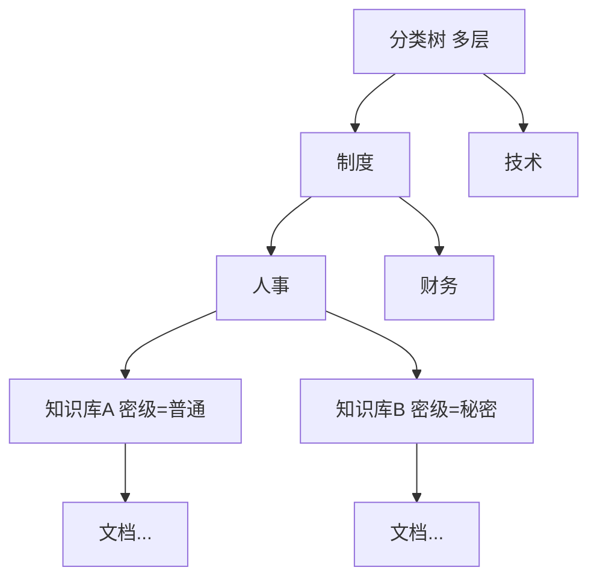
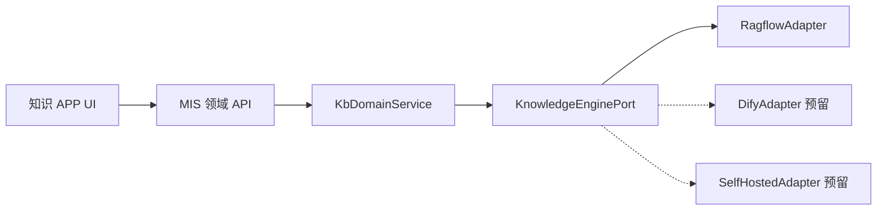
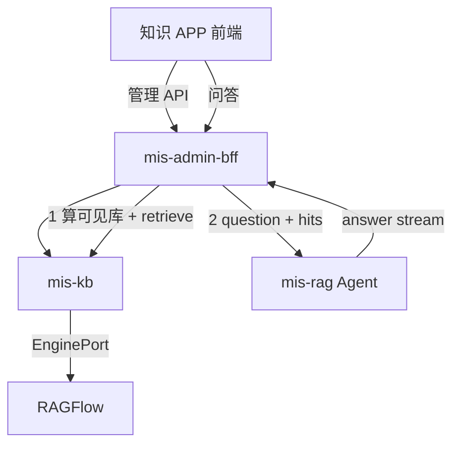

# MIS 知识库 APP 规划（修订 v3）

> 状态：📝 草稿 | 版本：v3.2 | 日期：2026-08-03（2026-08-04 增补二期扩展索引与同义词 S-07）  
> 决策摘要：[ADR-018](../adr/ADR-018-knowledge-base-mis-kb.md) · 部署：[deploy/ragflow](../../deploy/ragflow/) · 简版设计：[knowledge-base.md](knowledge-base.md)  
> **二期扩展（检索/结构/同义词）**：[knowledge-base-phase2-plan.md](knowledge-base-phase2-plan.md)

本文为知识库产品与技术的**完整规划**（由迭代讨论定稿）。实现以本文件 + ADR-018 + Flyway/API 文档为准。

## 0. 已确认决策


| 项 | 结论 |
| ---- | ------------------------------------------------- |
| 组织维度 | **不强制与部门挂钩**；「一部门多库」仅为业务比喻 |
| 库的划分 | **多层分类树** + **保密等级** |
| 文档库 vs 知识库 | **不拆两层产品**；统一为「知识库」，库内管文档 + RAG 索引 |
| 密级 | **普通级**：登录用户均可检索；**其他级**：须显式授权后才可检索 |
| 形态 | 开源引擎 API + MIS 自研 APP；**引擎经 Port/Adapter 接入，可切换** |
| 一期引擎 | RAGFlow（Apache-2.0）；配置与检索走适配层，不直连 UI/SDK 散落调用 |
| 问答 | 专用 `mis-rag`；检索范围 = 当前用户可见知识库集合 |
| 问答体验与运营 | **方案 B**：多维评价、强引用/定位原文、用户历史；后台记录+统计看板+差评/举报工单 |
| 代码归属 | **新建 `mis-kb`（Java）**；管理不进 mis-rag；BFF 聚合对外 API |
| Docker 交付 | 开发须**同步**维护测试环境可用的 [`deploy/ragflow`](../../deploy/ragflow/) Compose |


---

## 1. 信息架构：分类 × 密级（不挂部门）



### 1.1 实体


| 实体 | 说明 |
| -------------------- | ------------------------------------------------- |
| **分类 `kb_category`** | 多层树（`parent_id`）；只做导航与归属，**本身不含密级** |
| **知识库 `kb_library`** | 挂在某个分类节点下；必填 **密级**；对应引擎侧一个 dataset；是 **权限与检索边界** |
| **文档 `kb_document`** | 隶属某一知识库；可有库内目录/标签；版本与引擎 doc_id 映射 |
| **ACL `kb_acl`** | 针对知识库（可扩展到单文档）；主体 = 用户 / 角色（可选部门，作授权便利而非强制归属） |


同一分类下可有多个知识库（例如同属「人事」但密级不同，或同密级但业务拆分）。**不要求** `(category, secrecy)` 全局唯一，但建议名称在同分类下唯一。

### 1.2 密级枚举（可配置）


| 码 | 名称 | 检索规则 |
| -------------- | --- | -------------------------------- |
| `public` / 普通 | 普通级 | **所有已登录且具备知识 APP 入口权限的用户**均可检索该库 |
| `internal` | 内部 | 须 ACL 显式授权（读） |
| `secret` | 秘密 | 须 ACL 显式授权（读）；可限制可授权角色 |
| `confidential` | 机密 | 同上，更严（谁可授权、是否可导出） |


> 「普通级所有人可查」= 业务上的全员可读，**不是**匿名公网；仍走登录 + APP 权限。

### 1.3 可见性计算（检索前）

```
visible_libraries(user) =
  { L | L.secrecy == public 且 L.status=enabled }
  ∪ { L | L.secrecy != public 且 ACL 授予 user/其角色 读权限 }
  − { L | status=disabled/deleted }
```

智能问答 / 搜索 **只命中 `visible_libraries`**；禁止先全库召回再靠 Prompt 过滤。

---

## 2. 要不要分成「文档库」和「知识库」两层？

### 结论：**一期不拆，只要「知识库」一层。**


| 方案 | 含义 | 适用 |
| ------------- | ---------------------------- | ---------------------- |
| **A. 单层（采用）** | 知识库 = 文档容器 + RAG 索引单位 + 权限边界 | 当前目标：分类/密级/授权/问答 |
| B. 两层 | 文档库管文件；知识库从文档库勾选再建索引 | 同一文件要进多个检索域、或要做独立企业网盘时 |


**采用 A 的原因：**

- 核心边界是「谁能搜到哪批内容」，用 **知识库 + 密级 + ACL** 已足够。
- 两层会带来双份目录、同步、授权重复，一期成本高。
- 开源引擎（如 RAGFlow dataset）天然对应「一库一索引」；与单层模型对齐。

**预留扩展（不做实现）：** 若未来要「一份制度进多个场景索引」，再引入「文档中心 → 挂载到多个知识库」的 B 方案，文档表可抽离。

库内仍可有 **文件夹/标签**（导航用），那是知识库**内部**结构，不是第二套「文档库」产品。

---

## 3. 知识库权限设计

### 3.1 权限动作


| 动作 | 含义 |
| ----------------- | ---------------------------- |
| `library:read` | 可在问答/检索中命中该库；可浏览库内文档元数据（按策略） |
| `library:manage` | 上传/替换/删除文档、改库内目录与标签 |
| `library:acl` | 配置该库授权（通常仅管理员或库负责人） |
| `category:manage` | 维护分类树（平台/知识管理员） |
| `app:enter` | 进入知识 APP（`sys_app` 菜单权限） |


`manage` ⊃ `read`；`acl` 可与 `manage` 分立。

### 3.2 授权规则

1. **普通级知识库**：创建后默认全员 `read`（无需写 ACL 行）；`manage`/`acl` 仍须指定负责人或角色。
2. **非普通级**：默认无人可读；必须在权限设置中显式授权用户或角色 `read`（及按需 `manage`）。
3. **授权主体**：用户、角色（一期）；部门仅作「批量选人」便利时可扩展，**不作为库的强制归属字段**。
4. **继承**：分类树 **不自动继承密级**；权限落在知识库。若需「授权某分类下全部库」，用管理操作批量写 ACL，或二期做分类级 ACL。
5. **文档级授权（二期可选）**：默认文档继承所属库权限；极敏感单篇再下沉文档 ACL。
6. **审计**：授权变更、文档变更、问答 query（脱敏）记审计。

### 3.3 权限设置 UI（产品要点）

- 入口：知识库详情 →「权限设置」
- 展示：密级只读说明 + 当前授权列表（主体、动作、生效时间）
- 操作：添加用户/角色、勾选动作、移除、复制自其他库
- 普通级：提示「全员可读」，仍可配置管理员
- 保存后立即影响 `visible_libraries`（缓存短 TTL 或主动失效）

### 3.4 与引擎的关系

- 引擎 API Key 为 **服务账号**，能操作多库；**浏览器永不持有引擎 Key**。
- BFF / mis-kb 计算 `visible_library_ids` → 经 Adapter 调引擎 `retrieval(dataset_ids=...)`。
- 引擎侧 `me/team` 权限忽略，以 MIS ACL 为准。

### 3.5 RAG 细项配置放哪？（切片 / 召回等）

**原则：日常运营在 MIS 知识 APP 里配；通过引擎 API 写入/调用。不要求业务人员登录 RAGFlow 控制台。**

RAGFlow 控制台仅留给 **平台运维**：引擎升级、模型接入、排障、API 未暴露的实验能力。


> **【R4 反向修订 · 2026-08-04】** 原表未区分「建库期」与「检索期」两种下发时机，
> 且把 `vector_similarity_weight` / `rerank_id` 含糊标为「MIS 高级设置 / 系统配置」。
> 经 RAGFlow 官方 HTTP API 核对：**`POST/PUT /api/v1/datasets/{id}` 不接受这两个字段**，
> 它们只能随每次 `POST /api/v1/retrieval` 下发。这是本波次最容易踩错的实现陷阱，
> 现补「落点时机」列并逐条标注。

| 配置项 | 配置入口 | 落点参数 | **下发时机** | 说明 |
| --------------------------------------- | ------------------- | ------------------------------------------- | ------ | -------------------------------- |
| 切片方案 `chunk_method`（general/book/laws…） | MIS 库设置 L-08 | 引擎 dataset `chunk_method` / `parser_config` | **建库期** `POST /datasets/{id}` | 建库或改库时 API 同步；改后对**新解析/重解析**生效 |
| 切片大小 `chunk_token_num`、分隔符等 | MIS 库设置（高级） | 引擎 `parser_config.chunk_token_num` / `.delimiter` | **建库期** | 同上；已解析文档需「重新解析」才应用 |
| Embedding 模型 | MIS 库设置 / 系统默认 S-05 | 引擎 dataset `embedding_model` | **建库期** | 建库时选定；变更成本高，限制权限 |
| 召回 Top-K | MIS：库默认 + 问答/命中测试可覆盖 | 检索请求 `page_size` / `top_k` | **检索期** `POST /retrieval` | 由 mis-kb 参数合并器决定后随请求下发 |
| 相似度阈值 `similarity_threshold` | MIS 库默认 / 全局默认 | 检索请求 `similarity_threshold` | **检索期** | 同上 |
| 检索方式 `retrievalMethod` | MIS 库设置 L-08 | 检索请求 `keyword`（布尔）+ `vector_similarity_weight` 组合 | **检索期** | ⚠️ RAGFlow **无** `retrieval_method` 请求字段；`vector`→`keyword=false,weight=1.0`、`keyword`→`keyword=true,weight=0.0`、`hybrid`→`keyword=true,weight=设定值` |
| 向量↔关键词权重 `vectorSimilarityWeight` | MIS 库设置 L-08（hybrid 时显示滑条） | 检索请求 `vector_similarity_weight` | **检索期** ⚠️ 非建库期 | 默认 0.3；`PUT /datasets/{id}` **不接受**该字段 |
| Rerank 模型 `rerank_id` | **平台全局配置** `mis.kb.engine.rerank-model-id`（库级只有 on/off 开关） | 检索请求 `rerank_id` | **检索期** ⚠️ 非建库期 | 仅在「开关为真 且 全局模型 ID 非空」时放入请求体；传空串会被 RAGFlow 当成合法模型名而报错，故不下发该键 |
| 空检索回复策略 `emptyResultStrategy` | MIS 库设置 L-08 | **不下发引擎**（纯 MIS 业务语义） | MIS 侧 | 取值 `SUGGEST`/`EMPTY`/`TRANSFER`；由 mis-kb 随检索响应下发给 mis-rag / 命中测试页 |
| GraphRAG / RAPTOR 等 | 二期或运维在引擎 | 引擎高级 | — | API 有但复杂，一期可不进 MIS UI |


**分层建议（避免把 MIS 做成第二套 RAGFlow）：**

1. **全局默认**（S-05）：平台级切片模板、默认 top_k、默认阈值 → 新建库继承。
2. **知识库覆盖**（L-08）：本库切片方案、本库默认召回参数。
3. **单次问答覆盖**（可选）：问答页「高级」临时改 top_k（不落库）。
4. **文档级覆盖**（可选 P1）：单文档改 `chunk_method` 后重解析（RAGFlow Update document 支持）。

**数据流：**

```text
MIS UI 保存库设置
  → BFF 校验权限
  → KnowledgeEnginePort.updateLibrarySettings(...)
  → RagflowAdapter → PUT /datasets/{id}
  → MIS 元数据表存镜像（对外只暴露 MIS libraryId）

用户提问
  → BFF 算 visible_library_ids + 召回参数
  → Port.retrieve({ libraryIds, question, topK, ... })
  → Adapter 映射为引擎 dataset_ids 等
  → mis-rag 生成答案 + 统一 Citation DTO
```

### 3.6 引擎可切换（提前设计）

**可以，且应在一期就做薄适配层，避免业务绑死 RAGFlow。**



#### 硬规则

1. **对外只认 MIS ID**：`libraryId` / `documentId`；引擎原生 ID 只存在映射表。
2. **BFF / mis-rag / 前端禁止**直接调用 RAGFlow URL 或使用其字段名（`dataset_id` 等）。
3. **配置枚举用 MIS 语义**：如 `chunkProfile=general|manual|laws`，由 Adapter 翻译成引擎取值；未知能力返回 `UNSUPPORTED`。
4. **一库一引擎绑定**：`kb_library.engine_type` + `engine_library_ref`；切换引擎 = 新绑定 + **重ingest**（不幻想热迁移向量）。
5. **能力探测**：`Port.capabilities()` 声明是否支持 replace、metadata_filter、rerank 等；UI 按能力显隐高级项。

#### `KnowledgeEnginePort` 最小接口（一期）


| 方法 | 用途 |
| ------------------------------------------ | -------------------------- |
| `createLibrary(meta, ragSettings)` | 建库 |
| `updateLibrarySettings(ref, ragSettings)` | 切片等 |
| `deleteLibrary(ref)` | 删库 |
| `uploadDocument(ref, file, meta)` | 上传 |
| `replaceDocument(ref, docRef, file)` | 替换（无则 Adapter 内删+传） |
| `deleteDocument(ref, docRef)` | 删文档 |
| `setDocumentEnabled(ref, docRef, enabled)` | 启停 |
| `reparseDocument(ref, docRef)` | 重解析 |
| `retrieve(RetrieveQuery)` | 多库召回 → 统一 `List<ChunkHit>` |
| `health()` / `capabilities()` | 运维与 UI |


生成答案优先在 **mis-rag**（统一 Prompt/审计）；引擎 chat 可选，不作为唯一路径。

#### 映射表（示意）

```text
kb_library(id, ..., engine_type, engine_library_ref, rag_settings_json)
kb_document(id, library_id, ..., engine_document_ref, version)
```

`rag_settings_json` 存 **MIS 规范**字段；Adapter 写出时再映射。

#### 切换引擎时要接受的成本


| 可平滑 | 不可平滑（需重做） |
| ---------------------- | ----------------------- |
| 分类、密级、ACL、MIS 文档元数据、UI | 向量索引、引擎侧 chunk、部分高级切片特性 |
| 召回参数语义（topK/阈值） | 引擎特有能力（如某家 RAPTOR） |


一期只实现 `RagflowAdapter`；接口与表字段为第二引擎留位即可，**不要**同时维护两套引擎。

### 3.7 代码与服务怎么拆（不要放进 mis-rag）

**结论：专门增加知识库领域服务 `mis-kb`（Java）；不要把管理后台能力做进 `mis-rag`。**


| 组件 | 职责 | 不做什么 |
| ------------------------ | -------------------------------------------------------------------------------------- | --------------------------- |
| **mis-kb**（新建，建议端口 8108） | 分类/知识库/文档/ACL/RAG 设置镜像、问答会话与评价/工单、`KnowledgeEnginePort`+`RagflowAdapter`、对内 `retrieve` | 不跑 LLM 长对话生成 |
| **mis-rag**（现有 Agent） | 收到问题 + 可见库/召回结果后做 Prompt、流式生成、结构化 citations | 不落业务库、不管授权、不直连 RAGFlow 散落调用 |
| **mis-admin-bff** | `/api/v1/kb/**`、`/api/v1/ai/rag` 门面；鉴权与 DTO；编排问答 | 不写核心规则、不持有引擎映射表 |
| **mis-system** | 仅字典/菜单等平台能力；可提供密级字典码表若复用 sys_dict | **不**承接整套知识库 CRUD（避免膨胀） |
| **RAGFlow** | 解析/向量/检索引擎 | 不作为业务权限与运营后台 |




**推荐问答编排（BFF 编排，ACL 留在 Java）：**

1. BFF 鉴权 → 调 `mis-kb`：`resolveVisibleLibraries(user)` + `retrieve(question, libraryIds, params)`
2. BFF 调 `mis-rag`：只传问题、hits/citations 草稿、用户上下文 → 生成答案
3. BFF/mis-kb 落库：`session/message/citation/feedback`

也可让 `mis-rag` 调 `mis-kb` 内部 retrieve（带用户 JWT）；一期更建议 **BFF 编排**，边界更清晰、单测更容易。

**为何不放 mis-rag / ai-platform 里做管理：**

- 管理是典型 CRUD + ACL + 审计，适合 Java 微服务与 Flyway、现有 IAM 模式
- 方案 B 运营表多，塞进 Agent 会变成「Python 里再造一套 MIS」
- 引擎密钥与映射集中在 `mis-kb`，切换引擎只改 Adapter

**包与模块示意：**

```text
backend/mis-kb/
  domain/          # category, library, document, acl, qa
  engine/          # KnowledgeEnginePort, RagflowAdapter
  api/             # internal + 供 BFF 的应用服务
  persistence/     # JPA + Flyway

agent/.../mis-rag/ # 仅 prompts + 生成；消费统一 RetrieveHits DTO
```

### 3.8 RAGFlow 运行与 Docker 交付

- RAGFlow 以 **Docker Compose** 多容器运行（应用 + MySQL/Redis/MinIO/ES 等），不是单 JAR。
- **硬要求：** 开发 `mis-kb` / Adapter / 知识 APP 时，须**同步**维护 [`deploy/ragflow/`](../../deploy/ragflow/)，保证**测试环境**同一套脚本可启；禁止仅本机手工 `docker run`。
- 镜像 tag **钉死版本**；API Key 仅服务端，不进 Git、不下发浏览器。

**分期：** K0 PoC 引擎 API → **同步补全 `deploy/ragflow` 完整 Compose（测试可启）** → K1 建 `mis-kb` 骨架 + 表 → K2 BFF/前端管理 → K3 问答编排 + 方案 B 运营。

---

## 4. 后台管理功能清单（详细说明）

知识 APP 菜单建议：**概览 | 分类管理 | 知识库 | 文档 | 权限 | 智能问答 | 问答运营（记录/评价）| 系统配置 | 审计/评测**。

---

### 4.1 分类管理


| 编号 | 功能 | 详细说明 |
| ---- | ------- | ----------------------------------------- |
| C-01 | 分类树查看 | 左侧/主区展示多层树；支持展开折叠；节点显示名称、编码、下挂知识库数量、启用状态。 |
| C-02 | 新建分类 | 选择父节点（可根级）；填写名称、编码、排序、备注；校验同级名称唯一。 |
| C-03 | 编辑分类 | 改名称/排序/备注；编码谨慎可改（有引用时提示）；不可把节点拖到自己的子树下。 |
| C-04 | 移动分类 | 拖拽或选择新父节点；移动后路径变更；下挂知识库的「分类归属」随之更新展示。 |
| C-05 | 停用/启用分类 | 停用后不可在该节点下新建知识库；已有库仍可按权限访问（或策略：停用后库只读）。 |
| C-06 | 删除分类 | 仅空节点可删（无子分类且无知识库）；否则提示先迁移库或删库。 |
| C-07 | 分类检索 | 按名称/编码过滤树或定位到节点。 |


---

### 4.2 知识库管理


| 编号 | 功能 | 详细说明 |
| ---- | --------- | -------------------------------------------------------------------------------------------------------------- |
| L-01 | 知识库列表 | 表格/卡片：名称、所属分类路径、密级、文档数、索引状态、更新时间、负责人；筛选：分类、密级、状态、关键词。 |
| L-02 | 新建知识库 | 选择挂载分类节点；名称；**密级（必选）**；描述；可选 embedding/解析策略（映射引擎）；创建后在引擎建 dataset，回写引擎映射。普通级自动全员可读；非普通级进入「去配置权限」引导。 |
| L-03 | 编辑知识库 | 改名称、描述、挂载分类（迁移分类）；**密级变更**须二次确认（升级：可能需补授权；降级到普通：扩大可见面，记审计）。 |
| L-04 | 启用/停用 | 停用后不参与检索与问答；管理端仍可见；文档保留。 |
| L-05 | 删除知识库 | 软删 → 引擎删 dataset 或标记废弃；需确认（文档一并不可检索）；可配置保留期后硬删。 |
| L-06 | 知识库详情 | 概览：统计、索引健康、最近文档、权限摘要；Tab：文档 / 权限 / 设置。 |
| L-07 | 索引状态 | 展示解析中/成功/失败文档数；失败列表与「重试解析」；对接引擎任务状态。 |
| L-08 | 库内 RAG 设置 | **在 MIS 配置，API 同步引擎，不进 RAGFlow 控制台。** 含：切片方案、chunk 大小、本库默认 top_k/相似度阈值、空结果策略；「恢复全局默认」；改切片后提示需重解析文档。高级项仅知识管理员。 |


---

### 4.3 文档管理（隶属知识库）


| 编号 | 功能 | 详细说明 |
| ---- | -------- | ----------------------------------------------- |
| D-01 | 文档列表 | 库内列表：标题、格式、大小、版本、解析状态、更新人/时间；搜索与状态筛选。 |
| D-02 | 上传文档 | 单文件/多文件；类型限制（pdf/docx/md/txt 等）；上传后异步解析入库；显示进度。 |
| D-03 | 替换文档 | 保留逻辑文档 ID，上传新文件 → 新版本 → 成功后切换当前版本并重建索引；失败不切版本。 |
| D-04 | 下载原文 | 校验 `read`/`manage`；记审计；机密级可禁下载或加水印策略（可配置）。 |
| D-05 | 删除文档 | 软删；引擎删除对应 doc；列表可进回收站（可选）。 |
| D-06 | 启用/停用文档 | 停用后不参与检索，文件保留（对应引擎 enabled）。 |
| D-07 | 库内目录（可选） | 知识库内文件夹树，仅导航；文档移动目录不改变密级与库级 ACL。 |
| D-08 | 文档标签 | 受控词表打标；用于库内筛选；非权限依据。 |
| D-09 | 文档详情 | 元数据、版本历史、解析日志、命中试检索入口。 |
| D-10 | 批量操作 | 批量删除、批量停用、批量移动目录、批量重试解析。 |


---

### 4.4 权限设置


| 编号 | 功能 | 详细说明 |
| ---- | ---------- | ---------------------------------------------------------- |
| P-01 | 查看库权限 | 列出已授权主体（用户/角色）、动作（读/管/ACL）、授权人、时间；普通级展示「全员可读」标识。 |
| P-02 | 添加授权 | 人员/角色选择器（复用组织组件）；勾选动作；保存写 `kb_acl`；非普通级至少保证有可读主体或明确仅管理员可管。 |
| P-03 | 修改/撤销授权 | 改动作或移除；立即失效缓存。 |
| P-04 | 库管理员指定 | 指定 `manage`+`acl` 负责人；防止无人可管。 |
| P-05 | 权限校验预览 | 输入用户，预览其是否可读/可管该库（便于验收越权）。 |
| P-06 | 批量授权（可选） | 多库勾选后统一授权同一角色（运维向）。 |
| P-07 | 与 APP 权限协同 | 无知识 APP 入口则不能问答；有入口也不自动拥有非普通库读权限。 |


---

### 4.5 前端智能问答（业务用户）— 方案 B

知识 APP「智能问答」页。**回答、引用快照、多维评价均落 MIS 库**，供后台运营。


| 编号 | 功能 | 详细说明 |
| ---- | --------- | ----------------------------------------------------- |
| F-01 | 提问与回答 | 输入问题；支持流式；可选在可见库中再选分类/单库缩小范围。 |
| F-02 | 可见范围提示 | 「当前可检索 N 个知识库」；可展开库名列表（仅有权库）。 |
| F-03 | 引用文档与片段 | 「参考来源」：库名、文档标题、相关度、**可展开完整 snippet**。 |
| F-04 | 定位原文 | 抽屉展示完整片段 + 分类/密级；尽量定位原文（预览高亮或文档详情；无 offset 时降级为片段对照）。 |
| F-05 | 预览/下载原文 | 受权限与密级策略约束。 |
| F-06 | 我的会话历史 | 本人历史回放；保留**当时引用快照**。 |
| F-07 | 多维评价 | 总体有用/无用或 1～5 星；维度：准确性、是否有帮助、答非所问、引用错误/过时；可选文字；可改评一次。 |
| F-08 | 复制 / 重新生成 | 复制答案；同题再生成（新 message）。 |
| F-09 | 无命中态 | 不编造；引导换问法或申请权限。 |
| F-10 | 举报越权/敏感 | 疑似越权、敏感、错误引用 → 运营工单；记审计。 |


前端不展示：引擎原生 ID、他人会话、无权限正文。

---

### 4.6 命中测试与 Agent（管理向）


> **【R5 反向修订 · 2026-08-04】** 原文「单库 retrieve，展示 chunks」过于简写，
> 按字面实现会漏掉权限与审计，直接构成越权与合规缺口。现补齐权限码、ACL、
> 禁写清单与参数回显四项硬约束。

| 编号 | 功能 | 详细说明 |
| ---- | ---------- | ----------------------------------------- |
| Q-04 | 命中测试 | **单库** retrieve，展示 chunk 原文 / score / 来源文档 / 页码，用于调参。硬约束见下方四条。 |
| Q-05 | mis-rag 对接 | BFF 注入 `visible_library_ids`；专用 Agent 生成。 |

**Q-04 硬约束（实现者必读）：**

1. **权限码 `kb:hittest:run`**——**仅**菜单 `91039`（`V17__kb_hittest_perms.sql`）。
   不另建按钮节点：`uk_menu_app_permission` 禁止同一 app 下两行菜单共用同一 `permission`
   （返工四 / QA P0-A 修订，原按钮节点已删除）。
   前端 `PermissionGate` 包裹 `/kb/hit-test` 路由与页内「执行」按钮；
   后端 `ApiPermissionInterceptor` 拦 `POST /api/v1/kb/hit-test`（依赖 V17 执行成功 + 注册表重载），
   并由 `KbController.requireHitTestPermission()` 兜底该生效空窗。
2. **必须叠加 ACL 过滤**——权限码只管「能不能用这个功能」，管不了「能看哪个库」。
   服务层强制走 `KbVisibilityService.hasPermission(userId, libraryId, "read")`，
   无授权返回 `KB_NO_READ_PERMISSION`。命中测试能读到 chunk 原文，等于直接读库内容，
   绝不能因为「这是个管理工具」就绕过授权。
3. **不写问答记录**——`kb_qa_session` / `kb_qa_message` / `kb_qa_citation` /
   `kb_qa_feedback` / `kb_qa_ticket` 一行都不许写。调参噪声混进问答运营看板会污染评价统计。
   （实现上 `KbHitTestService` 不注入任何 `kb_qa_*` 仓储，从依赖上断掉写入可能。）
4. **生效参数需回显**——响应含 `effectiveParams`（含 `source` 与 `degradedReasons`）与 `elapsedMs`，
   让管理员看清「这次到底用了什么参数、从哪来、降级没有」，否则调参只能靠猜。

**审计**：命中测试调用本身**必须留痕**——BFF 端点标注 `@OperLog(module="知识库", operation="命中测试")`，
走既有 `OperLogAspect` → `AuditWebClient` 链路落 audit 表（与第 3 条「禁写 kb_qa_*」不冲突，两者是不同的表）。
结果 CSV 导出（WA-15）**不额外记审计**：导出内容用户在页面上本就看得见。


---

### 4.7 后台：问答记录与评价运营 — 方案 B


| 编号 | 功能 | 详细说明 |
| ----- | ------- | ------------------------------------------ |
| A-02 | 问答记录列表 | 筛：时间、用户、库、评价、差评维度、是否举报、关键词。 |
| A-02a | 问答详情 | 完整问答、引用快照、可见范围、召回参数、评价明细；只读。 |
| A-02b | 评价统计看板 | 好评率/均分、差评维度分布、高频差评问、低分库/文档 Top N、趋势；可下钻详情。 |
| A-02c | 差评/举报工单 | 待处理→处理中→已关闭；关联改文档/调权限/改 Prompt；处理备注。 |
| A-02d | 导出 | 记录与评价导出（可脱敏）；记审计。 |
| A-02e | 与金标对照 | 真实差评热点 vs 金标跑批结果对照。 |
| A-01 | 操作审计 | 库/文档/权限变更日志。 |
| A-03 | 金标评测 | 问题集跑批 + 越权负例。 |


数据实体：`kb_qa_session` / `kb_qa_message` / `kb_qa_citation` / `kb_qa_feedback` / `kb_qa_ticket`。

权限：用户仅看自己的历史；A-02\* 需运营/管理员。高密级片段快照访问记审计。

---

### 4.8 系统配置（知识管理员）


| 编号 | 功能 | 详细说明 |
| ---- | --------- | ------------------------------ |
| S-01 | 密级字典 | 码、名称、是否全员可读、是否允许下载等。 |
| S-02 | 标签词表 | 文档标签受控列表；用于库内筛选；**不参与**查询扩展。 |
| S-03 | 文件类型与大小限额 | 全局上传策略。 |
| S-04 | 引擎连接 | 地址、API Key（仅服务端）；健康检查。 |
| S-05 | 全局 RAG 默认 | 切片、top_k、阈值等；新建库继承；可被 L-08 覆盖。 |
| S-06 | 评价标签配置 | 差评维度文案、是否必填说明、举报类型开关。 |
| S-07 | 同义词 / 术语表 | 平台全局术语组（规范词 + 别名）；**检索前**在 mis-kb 扩展查询。与 S-02 区分。详见二期 [Wave D](knowledge-base-phase2-plan.md)。 |


---

### 4.9 门户与 APP 集成


| 编号 | 功能 | 详细说明 |
| ---- | ---------- | ------------------------------ |
| I-01 | sys_app 注册 | 知识 APP 进九宫格；菜单/API 带 `app_id`。 |
| I-02 | 统一体验 | shadcn 与现有管理台一致。 |
| I-03 | 组织组件复用 | 授权选人/角色复用 IAM/Org。 |


---

## 5. 功能优先级（落地顺序）— 方案 B


| 优先级 | 包含 |
| --- | --------------------------------------------------------------- |
| P0 | 分类/库/文档/权限；F-01～05、F-07；问答+引用+评价落库；A-02/A-02a；Q-05；I-01～02；S-04；**deploy/ragflow 可测** |
| P1 | F-06、F-08～10；A-02b、A-02c；L-07～08；Q-04；S-01～03、S-06；A-01 |
| P2 | A-02d、A-02e、A-03；S-05、**S-07（同义词）**；文档级 ACL；原文精确定位增强 |


---

## 6. 实现任务清单（跟踪用）


| ID | 内容 |
| ---- | ------ |
| poc-kb-engine-api | PoC RAGFlow：库/文档 CRUD、按 dataset_ids 检索、替换/删除 |
| adr-kb-app | ADR-018（已建）+ 本规划文档同步 |
| schema-kb | mis-kb 表设计：kb_* + engine_type/engine_ref；问答/评价/工单表 |
| engine-port | 在 mis-kb 内实现 KnowledgeEnginePort + RagflowAdapter |
| bff-kb-facade | BFF `/api/v1/kb/**` 与问答编排（先 mis-kb.retrieve 再 mis-rag） |
| frontend-kb-app | 知识 APP：分类/库/文档/权限 + 方案 B 问答 |
| wire-mis-rag | mis-rag 经统一检索 DTO；不直连 RAGFlow SDK |
| qa-ops-scheme-b | 问答落库+引用快照；后台记录/多维评价统计/差评工单；金标对照 |
| eval-lite | 金标评测：命中率 + 密级越权负例 |
| deploy-ragflow-docker | K0 将 deploy/ragflow 补全为测试可启动的完整 Compose（钉死版本） |


---

## 8. 二期扩展（检索与结构增强）

P0/P1 解决「能用、能管、能问、能评」；**二期**专注检索质量与可选结构增强，详见独立文档：

**[knowledge-base-phase2-plan.md](knowledge-base-phase2-plan.md)**

| Wave | 内容 | 说明 |
|------|------|------|
| A 质量线 | 混合检索（关键字+语义）打磨、Rerank、切片 UI 齐套、命中测试 Q-04 | 必须交付 |
| D 同义词 | 平台术语表 S-07；mis-kb 检索前扩展；引擎原生词表仅运维可选 | 可与 A 收尾 / B **并行** |
| B 结构 PoC | GraphRAG 至多 1～2 库；引擎内图谱，**不上 Neo4j** | 门禁：金标对比 |
| C 条件启动 | RAPTOR / TOC 等 | 仅 B 达标后 |

P1 流式/工单/门户 enterable 等见 [mis-kb-incremental-design-2026-08-03.md](mis-kb-incremental-design-2026-08-03.md)，不在二期正文重复。

---

## 9. 结论摘要

- 分类×密级、单层知识库、普通全员可读、MIS 配 RAG 参数、引擎可切换：见前文。
- **前端（方案 B）**：问答 + 完整引用/定位原文 + **多维评价** + 举报 + 本人历史。
- **后台（方案 B）**：问答记录与详情、**评价看板**、**差评/举报工单**、导出、与金标对照。
- **服务**：`mis-kb` 管领域与引擎；`mis-rag` 只生成；RAGFlow Docker 与开发同步交付测试脚本。
- **二期**：Hybrid/Rerank/命中测试 → **同义词（Wave D）** → GraphRAG 小范围 PoC；详见 [phase2 规划](knowledge-base-phase2-plan.md)。
