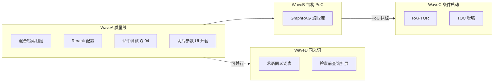

# MIS 知识库二期扩展能力规划

> 状态：📝 草稿 | 版本：v1.1 | 日期：2026-08-04（同日增补 Wave D 同义词）  
> 主规划：[knowledge-base-app-plan.md](knowledge-base-app-plan.md) · 决策：[ADR-018](../adr/ADR-018-knowledge-base-mis-kb.md)  
> P1 产品补齐（非本文正文）：[mis-kb-incremental-design-2026-08-03.md](mis-kb-incremental-design-2026-08-03.md)

本文规划 **检索与结构增强（二期扩展）**，与 P0 MVP、P1 体验/运营补齐区分开。  
**策略：** 质量线完整交付 + GraphRAG 仅 1～2 库 PoC；不上独立 Neo4j；不全库默认开图谱；**同义词由 MIS 持有词表并在检索前扩展**（可与引擎原生词表并存，见 Wave D）。

---

## 1. 定位与边界


| 层级 | 范围 | 本文是否展开 |
|------|------|--------------|
| P0 MVP | `mis-kb`、分类/库/文档/ACL、问答管线、noop/ragflow Adapter | 否（已落地基线） |
| P1 产品补齐 | 流式、门户 enterable、`kb` 工单、定位原文、运营看板等 | 仅作**前置依赖**标注 |
| **二期扩展** | 混合检索打磨、Rerank、命中测试、切片 UI 齐套、**同义词/术语扩展**、GraphRAG PoC、（条件）RAPTOR/TOC | **是** |




Wave D（同义词）**不依赖** Graph；可与 Wave A 收尾或 Wave B **并行**。建议：命中测试（A4）可用后再做 D，便于用 hit-test 验收扩展效果。

---

## 2. 概念澄清（写入产品口径）

| 术语 | 定义 | 二期做法 |
|------|------|----------|
| **混合检索（Hybrid）** | **关键字检索 + 语义（向量）检索**，再融合排序 | Wave A 打磨；与 Graph **分开开关** |
| **Rerank** | 对初召回结果重排，不是第三路召回 | Wave A |
| **同义词 / 术语扩展** | 受控词表：查询词 ↔ 别名/缩写/内部代号；**检索前**把问句扩成多词再召回 | Wave D；**≠** 文档标签词表 S-02 |
| **标签词表（S-02）** | 文档打标受控列表，用于库内筛选 | P1 配置项；**不参与**查询扩展 |
| **Graph RAG** | 沿实体关系多跳增强问答；**一种方法** | Wave B：经 RAGFlow 库级能力，**不**自建图库 |
| **Neo4j** | 通用图数据库产品 | **二期不做**；若未来要企业图谱中台再单独立项 |

Hybrid 与 Graph 可叠加；同义词增强的是 **关键字侧召回与问句覆盖**，不能被「只靠向量语义」替代（缩写、内部代号、多语别名仍需词表）。Neo4j 不是 Hybrid 的替代，也不是二期 Graph RAG 的默认实现。

---

## 3. 一期已具备（勿重复造）

| 资产 | 现状 | 二期缺口 |
|------|------|----------|
| [`RagSettings`](../../backend/mis-kb/src/main/java/com/mis/kb/domain/model/RagSettings.java) | `retrievalMethod`（默认 hybrid）；`vectorSimilarityWeight`（Wave A ✅ 默认 0.3）；`rerank`；`chunkMethod`；`chunkTokenNum`；`separator`；`emptyResultStrategy`；`topK`；threshold | 缺 **`useKnowledgeGraph`**、图谱任务状态（Wave B）。**库级 `rerankModelId` 已按 R1 取消**，改由全局配置提供 |
| [`RagflowClient`](../../backend/mis-kb/src/main/java/com/mis/kb/engine/RagflowClient.java) | 建库期下发 `embedding_model`/`chunk_method`/`parser_config`；**检索期**下发 `keyword`/`vector_similarity_weight`/`rerank_id`（Wave A ✅）；`parseDocuments` 触发重解析（Wave A ✅） | `use_kg`、构图 API（Wave B） |
| [`EngineCapabilities`](../../backend/mis-kb/src/main/java/com/mis/kb/domain/model/EngineCapabilities.java) | `hybrid`（Wave A ✅） / `rerank`（语义改为「当前配置下可用」） / `metadata_filter` / `replace` | 增加 **`graphrag` / `raptor`**（及 toc 等，Wave B/C） |
| [`RetrieveQueryResolver`](../../backend/mis-kb/src/main/java/com/mis/kb/domain/model/RetrieveQueryResolver.java) | **Wave A 新增**：检索参数合并唯一收口（单库取库级 / 多库回落全局默认 / 显式覆盖优先 / 能力降级） | — |
| 问答编排 | 前端 → BFF `/api/v1/ai/rag` → mis-rag → mis-kb retrieve（决策 #3） | 命中测试走 BFF→mis-kb，**不经** LLM |

---

## 4. 能力与字段矩阵（实现对照）

### 4.1 `EngineCapabilities` 扩展

> **【R3 反向修订 · Wave A 已实现，2026-08-04】** 下表 `hybrid` 行原为「A 新增待办」，
> 现已落地，状态与各适配器实际返回值同步更新；并补充 `rerankSupported` 的语义变更。

| capability 码 | 含义 | Wave | RagflowAdapter | NoopAdapter | MockAdapter |
|---------------|------|------|----------------|-------------|-------------|
| `hybrid` | 支持 keyword+vector 混合检索与权重调节 | A ✅ 已实现 | ✅ true | ❌ false（检索降级为 vector 并记 WARN） | ✅ true |
| `rerank` | **当前配置下**重排可用 | A ✅ 已实现 | 条件 ✅（`mis.kb.engine.rerank-model-id` 非空才为 true） | ❌ false | ✅ true |
| `metadata_filter` | 元数据过滤（已有） | — | ✅ true | ❌ false | ✅ true |
| `replace` | 文档替换（已有） | — | ✅ true | ❌ false | ✅ true |
| `graphrag` | 知识图谱增强检索 | B | PoC 后声明 | false | false |
| `synonym` | 引擎原生同义词（如 RAGFlow `synonym.json`/Redis）可被 Adapter 同步或探测 | D | 条件（有挂载/配置才 true） | false | true（模拟扩展） |
| `raptor` | 层次摘要树 | C | 条件 | false | false |
| `toc_enhance` | 目录增强检索 | C | 条件 | false | false |

> **说明：** MIS 侧查询扩展（Wave D 主路径）**不依赖** `synonym` capability；该码仅表示「引擎侧是否另有原生词表可运维同步」。避免 UI 把「未挂载 synonym.json」误判为「平台不能做同义词」。

**`rerankSupported` 语义变更（重要）**：由「引擎理论上支不支持重排」改为「**当前平台配置下重排能不能用**」。
RAGFlow 当然支持重排，但没配全局模型 ID 就等于不可用；若此处恒返 true，前端会把开关亮着让人去开，
保存时又被后端强制关掉。这条语义是 WA-06「前端置灰 + 保存强制关 + 检索期降级」三道防线口径一致的基础。

码值字符串常量集中定义在 `EngineCapabilities`（`CAP_HYBRID` 等），禁止各处硬编码字面量。

前端、BFF **按 `capabilities()` 显隐/置灰**；未声明则不可打开对应库开关。

### 4.2 `RagSettings` / 库级配置扩展


> **【R1 反向修订 · 2026-08-04】** 删除库级 `rerankModelId`（主理人决策②）。
> **【R2 反向修订 · 2026-08-04】** 空结果策略沿用现有 `SUGGEST`/`EMPTY`/`TRANSFER` 三值。
> **【R4 关联】** `retrievalMethod` / `vectorSimilarityWeight` / `rerank_id` 的落点是**检索期**，不是建库期。

| 字段（MIS 语义） | 类型 | Wave | 引擎映射（RAGFlow） | 落点 | 说明 |
|------------------|------|------|---------------------|------|------|
| `retrievalMethod` | enum | 已有/A ✅ | `keyword`（布尔）+ `vector_similarity_weight` 组合表达 | **检索期** | `vector` \| `keyword` \| `hybrid`。⚠️ RAGFlow **无** `retrieval_method` 请求字段，此前文档写错 |
| `vectorSimilarityWeight` | float 0～1 | **A 新增** ✅ | `vector_similarity_weight` | **检索期** | 仅 hybrid 有意义，默认 **0.3**；`vector`→1.0、`keyword`→0.0（**仅合并期覆写，不改库级存值**） |
| `topK` / `similarityThreshold` | int / float | 已有 | `page_size`/`top_k`、`similarity_threshold` | **检索期** | 命中测试可临时覆盖，覆盖值不写回 |
| `rerank` | boolean | 已有/A ✅ | 有模型才下发 `rerank_id`，否则不放该键 | **检索期** | 库级仅 on/off；无全局模型时保存强制 false + WARN |
| ~~`rerankModelId`~~ | ~~string~~ | ~~A 新增~~ | — | — | **【R1 已删除】库级不再持有重排模型 ID**。模型 ID 由全局配置 `mis.kb.engine.rerank-model-id` 统一提供，库级只保留 `rerank` 开关。理由：重排模型是要占显存、要运维统一升级的平台级资源，允许每个库各挑一个，运维根本收不拢 |
| `chunkMethod` / `chunkTokenNum` / `separator` | string / int / string | 已有/A | `chunk_method` / `parser_config.chunk_token_num` / `parser_config.delimiter` | **建库期** | 改后需重解析才生效 |
| `embeddingModel` | string | 已有 | `embedding_model` | **建库期** | — |
| `emptyResultStrategy` | enum | A（对齐 P1）✅ | 无（纯 MIS 语义，不下发引擎） | MIS 侧 | **【R2】取值固定为 `SUGGEST` / `EMPTY` / `TRANSFER`**，含转人工语义，已有存量数据与 UI 选项。**不引入** `none` / `general_prompt` / `empty_text` —— 改文档零成本，改代码要数据迁移 + 前后端联动 |
| `useKnowledgeGraph` | boolean | **B 新增** | `use_kg` 等 | — | 默认 **false**；需 `graphrag` 能力 |
| `kgBuildStatus` | enum | **B 新增** | 构图任务查询 | — | `none` \| `building` \| `ready` \| `failed`（可落库或缓存） |

全局默认（S-05）：新建库继承 `hybrid` + 权重 0.3 + rerank 默认关。
多库检索时参数一律回落全局默认（决策⑥），空结果策略同步回落（U7），不做「参数用全局、策略用库级」的割裂。

**零 DDL 说明**：`RagSettings` 整体序列化进 `kb_library.rag_settings_json`（TEXT），
新增 `vectorSimilarityWeight` 不需要数据库迁移；存量 JSON 读出为 null 由 `withDefaults()` 补 0.3。

---

## 5. Wave A — 质量线（必须交付）

### A1. 混合检索打磨

- 产品文案固定：Hybrid = 关键字 + 语义。
- 库设置：三选一 + **仅 hybrid 显示权重滑条**。
- Adapter：完整下发 `retrieval_method` + `vector_similarity_weight`。
- noop：选 hybrid 时降级行为写清（仅 vector 或空 hits + 日志）。

### A2. Rerank

- 补齐模型 ID 配置（Nacos / `mis.kb.engine.rerank-model-id` 或库级覆盖）。
- 无模型：UI 禁用 rerank，capabilities 可仍声明但运行时校验失败要友好提示。

### A3. 切片与空结果（L-08 齐套）

- MIS UI 可配 `chunkMethod` / `chunkTokenNum` / 空结果策略，并 **API 同步引擎**。
- 变更后提示必须重解析；提供单文档重解析（批量作最小集）。

### A4. 命中测试 Q-04

- 管理页：选库 → 问题 → **只 retrieve** → 展示 chunk 文本、score、文档名。
- 可临时覆盖：`retrievalMethod`、`topK`、权重、rerank 开关。
- 链路：`前端 → BFF /api/v1/kb/.../hit-test → mis-kb retrieve`，**不调用 mis-rag / LLM**。

### A5. 与 P1 的依赖

| 依赖项 | 说明 |
|--------|------|
| 门户 `ENTERABLE_CODES` 含 `kb` | 便于从九宫格进 APP 验收 |
| 问答主路径可用 | 流式或稳定非流式均可；不阻塞 A 字段落地 |

P1 详细设计见增量文档，**不在本文重写**。

---

## 5.1 Wave D — 同义词与术语扩展

> **缺口说明（2026-08-04）：** P0/P1/Wave A～C 原稿均未规划同义词；向量召回对「说法相近」有一定容错，但**不能**覆盖企业缩写、内部代号、双向别名。本节补齐产品与技术口径。

> **实现依据（2026-08-04 补记）：** 本节 D0–D6 只给产品与技术口径，**不是**施工规格。
> Wave D 的落地实现以系统设计文档 [`mis-kb-wave-d-design-2026-08-04.md`](./mis-kb-wave-d-design-2026-08-04.md)
> 为唯一施工依据（配套 `mis-kb-wave-d-prd-2026-08-04.md` / `mis-kb-wave-d-class.mermaid` /
> `mis-kb-wave-d-seq.mermaid`）。两者冲突时以设计文档为准，并回写本节。
>
> **D6 六条设计约束 → 代码落点映射：**
>
> | 本文 D6 约束 | 代码落点 |
> |---|---|
> | (2) 单次最多扩展 N 个术语组（默认 8） | `SynonymBudget.maxGroups`（`mis.kb.synonym.max-groups`） |
> | (2) 每组最多并入 M 个别名（默认 5） | `SynonymBudget.maxTermsPerGroup`（`mis.kb.synonym.max-terms-per-group`） |
> | (2) `expandedQuery` 字符硬上限（默认 512） | `SynonymBudget.maxQueryChars`（`mis.kb.synonym.max-query-chars`） |
> | (3) 短词门槛（默认 term 长度 &lt; 2 不参与匹配） | `SynonymBudget.minTermLength`（`mis.kb.synonym.min-term-length`） |
> | (5) 容量口径 约 5k～1万 term | `SynonymProperties.recommendedTermLimit`（默认 10000，超限只告警不阻断） |
> | (1) 热路径零全表扫 / (4) 最长匹配 / (6) 导入分页 | `SynonymDictLoader`（内存不可变词典 + 版本号）/ `SynonymExpandService.longestMatchScan()` / `SynonymImportService` 两阶段导入 + 列表强制分页 |

### D0. 与相关概念的边界

| 能力 | 做什么 | 不做什么 |
|------|--------|----------|
| **同义词表（本 Wave）** | 问句/检索词扩展：`周五`↔`星期五`、`OKR`↔`目标与关键结果`、内部系统代号 | 不做文档分类标签；不做密级/ACL |
| **标签词表 S-02** | 文档元数据打标与筛选 | 不改写用户问题 |
| **Hybrid 关键字路** | BM25/全文命中扩展后的词 | 不自动维护企业词表 |
| **向量语义** | 近义句召回 | 不保证命中未出现在语料中的缩写映射 |

### D1. 产品决策（采用）

| # | 决策 | 理由 |
|---|------|------|
| 1 | **词表由 MIS 持有**（平台全局，配置项编号 **S-07**） | 与「业务不进引擎控制台」、引擎可切换（ADR-018）一致；词表可审计、可权限控制 |
| 2 | **检索前在 `mis-kb` 扩展查询**，再调用 `KnowledgeEnginePort.retrieve` | 对 noop/mock/未来引擎一视同仁；不把同义逻辑绑死在 RAGFlow 文件格式上 |
| 3 | **一期范围 = 平台全局词表**；库级覆盖列为候选（D-候选），本波次不做 | 与 Rerank「平台级资源」同理，先收拢运维与验收 |
| 4 | **默认开启扩展**（全局开关可关）；单次命中测试可临时关闭以便对比 | 便于 Q-04 / 金标对比「开/关同义词」 |
| 5 | **RAGFlow 原生 `synonym.json` / Redis 词表**仅作 **运维可选补充**（D-ops），不作为 MIS 产品主路径 | 引擎升级/多副本时文件难同步；与 MIS 双写易漂移 |

**明确不采用（二期）：** 仅文档化「去 RAGFlow 控制台改同义词」、无 MIS UI；浏览器直连引擎改词表。

### D2. 数据模型（建议）

零散键值不够用；采用「术语组」：

```
kb_synonym_group
  id, canonical_term   -- 规范词（展示与导出主名）
  status, remark, created_at, updated_at

kb_synonym_term
  id, group_id
  term                 -- 别名/缩写（含规范词自身可冗余一行或强制含 canonical）
  UNIQUE(term)         -- 全局唯一，避免一组映射冲突
```

Flyway **只追加**新版本（如 `V1x__kb_synonym.sql`）。  
权限：`kb:config:synonym`（或挂在现有知识管理员角色下的按钮权限）；读写记操作日志。

**扩展算法（P0 足够；规模约束见 D6）：**

1. 对用户问题做分词/简单切词（中英混排可先「最长匹配词表」+ 空白/标点切分，不强制上 NLP 服务）。
2. 命中任一 `term` → 收集同组全部 `term`（含规范词）——**受每组 M、总组数 N、总字符上限约束**。
3. 生成 `expandedQuery`（空格或引擎接受的 OR 形态）与 `expansionTrace`（命中了哪些组，供命中测试展示）。
4. 将 `expandedQuery` 作为检索 query 下发；**原始问题仍用于 LLM 生成**（mis-rag 收到的 user question 不变，避免答案口吻被别名污染）。

扩展发生在 **mis-kb retrieve / hit-test** 入口；mis-rag **不**各自维护词表。词典走**内存缓存**，热路径不扫库。

### D3. API / UI 落点

| 层 | 内容 |
|----|------|
| mis-kb | CRUD 术语组；全局开关 `mis.kb.synonym.enabled`；retrieve/hit-test 走 `SynonymExpandService` |
| BFF | `/api/v1/kb/synonyms/**` 透传；不回传引擎 Key |
| 前端 | 系统配置页 **S-07**：术语组列表、导入（CSV/JSON）、启用开关；命中测试展示「是否扩展 / 扩展词」 |
| Adapter | 主路径无需改检索签名；可选 `syncSynonymsToEngine`（仅当 `capabilities.synonym=true` 且运维打开双写） |
| deploy/ragflow | README 说明原生 `synonym.json` 挂载方式（D-ops）；**默认不要求**业务配置该文件 |

### D4. 交付切分

| 子项 | 内容 | 优先级 |
|------|------|--------|
| **D-ops** | 文档化 RAGFlow 静态同义词挂载与验证步骤 | 可先于代码，半天级 |
| **D-core** | 表 + CRUD + retrieve/hit-test 扩展 + 全局开关 | 必须 |
| **D-ui** | S-07 管理页 + 命中测试扩展轨迹 | 必须 |
| **D-候选** | 库级词表覆盖、双向自动补全、从差评工单一键加词 | 本波次不做 |

### D5. 验收

- [ ] 配置「OKR ↔ 目标与关键结果」后，仅含一侧表述的文档可被另一侧问句命中（hybrid/keyword 路径可观测）
- [ ] 关闭全局开关后行为与扩展前一致
- [ ] 命中测试可看到扩展轨迹；问答落库仍保存**用户原问题**
- [ ] 词表变更有权限与操作日志；无浏览器持有引擎 Key
- [ ] 与 S-02 标签词表在 UI/文案上区分清楚
- [ ] 词表 ≥2k term 时：热路径不逐次全表扫库；扩展后 query 长度受硬上限约束（见 D6）

### D6. 规模：几千条同义词是否够用 / 哪里会出事

| 维度 | 「几千 term」结论 | 说明 |
|------|-------------------|------|
| 落库 / UNIQUE | ✅ 无压力 | 几千行对 PG 可忽略；管理 UI 必须分页 + 关键词搜索 |
| 单次命中查找 | ✅ 无压力（有前提） | **内存倒排**（`term → groupId` HashMap）或 Aho-Corasick；**禁止**每次 retrieve `SELECT *` 再线性扫 |
| 词表加载 | ✅ | 启动/变更时全量加载 + 本地缓存；CRUD 后失效刷新即可（词表远小于 MB 级） |
| **扩展后问句长度** | ⚠️ **主风险** | 一问命中多组、每组别名多 → `expandedQuery` 膨胀 → 关键字路变噪、时延升 |
| **短词误匹配** | ⚠️ | `IT`/`AI`/`法` 等过短 term 易误扩；需最小长度或「整词/边界」规则 |
| 引擎侧 | ⚠️ 次要 | 超长 query 可能触引擎/分词限制；靠下方硬上限兜底 |

**设计约束（Wave D 实现必须遵守，补原稿缺口）：**

1. **热路径零全表扫**：`SynonymExpandService` 只用内存词典；DB 仅服务 CRUD 与冷启动加载。
2. **扩展预算（建议默认，可配）**：
   - 单次最多扩展 **N 个术语组**（如 8）
   - 每组最多并入 **M 个别名**（如 5，优先规范词 + 短别名）
   - `expandedQuery` 字符硬上限（如 512）；超限截断并打 WARN + 写入 `expansionTrace`
3. **短词门槛**：默认 `term` 长度 &lt; 2（可配）不参与自动匹配；英文可用「非字母边界」避免子串误伤。
4. **匹配策略**：最长匹配优先，避免「目标与关键结果」被拆成更短噪声词。
5. **容量口径**：产品按 **约 5k～1万 term** 验收；再往上（数万～十万）再评估分库词表 / 引擎原生词表双写，不在本波次假设内。
6. **管理侧**：导入支持批量；列表禁止一次拉全表到前端。

**结论：** 几千个同义词 **现有「MIS 持有 + 检索前扩展」方向成立**；原稿若按「朴素全表扫描 + 无上限 OR 拼接」实现会在扩展爆炸处出问题，故以 D6 约束收口，而不是改主路径决策。

---

## 6. Wave B — GraphRAG PoC

### 6.1 范围

- 试点 **至多 2 个**关系密集库（如制度/组织职责）；**默认关闭**。
- 经 `KnowledgeEnginePort`：`graphrag` 能力、构图触发/状态查询、retrieve 带图谱增强参数。
- **ACL**：构图与检索不得越权；禁止「全局图谱浏览器」暴露不可见库实体。

### 6.2 Graph RAG vs Neo4j（决策固化）


| | Graph RAG（采用） | Neo4j（二期不做） |
|--|-------------------|-------------------|
| 角色 | 问答增强方法 | 通用图数据库 |
| 存储 | RAGFlow 引擎内 | 需自建运维 |
| 与 MIS | Adapter + 库开关 | 双写、同步、ACL 成本高 |

二期采用 **引擎内 Graph RAG**；若未来要企业级图谱中台，另立 ADR，不在本波次。

### 6.3 交付与门禁

- 库详情可见 `kgBuildStatus`。
- 金标：10～20 条多跳/关系型问题；对比 **hybrid-only vs hybrid+graph**；记录时延与资源。
- **不达标 → 不进 Wave C，不全量打开 Graph。**

### 6.4 非目标（二期）

- 自建 Neo4j / 第二套图谱引擎  
- 全库默认 GraphRAG  
- 浏览器直连引擎 Graph API / 持有 API Key  

---

## 7. Wave C — 条件启动（仅 Wave B 达标后）


| 能力 | 做法 |
|------|------|
| RAPTOR | 库级开关 + `raptor` capability；长手册库试点 |
| TOC 增强 | retrieve `toc_enhance`；长 PDF 试点 |
| Parent-Child | 映射引擎 chunk 策略；不另起产品名 |

**三期候选（正文不展开）：** 多模态 OCR、文档级 ACL、独立「文档中心」两层模型、Neo4j 中台、库级同义词覆盖。

---

## 8. 实现落点（供后续迭代，本文不写代码）


| 层 | 落点 |
|----|------|
| mis-kb | `RagSettings` 字段、`EngineCapabilities`、`RagflowAdapter`/`RagflowClient`、命中测试 API、图谱状态；**同义词表 + `SynonymExpandService`（Wave D）** |
| BFF | `/api/v1/kb/**` 透传设置、hit-test、**synonyms**；不把引擎 Key 回传 |
| 前端 `features/kb` | 库设置 L-08、命中测试页、Graph 开关（按 capabilities）；**S-07 同义词配置页** |
| mis-rag | 问答 retrieve 携带库级 hybrid/权重/rerank/use_kg；**命中测试不经此路径**；**不持有同义词表**（扩展在 mis-kb） |
| 配置 | Nacos `mis-kb`：默认权重、rerank 模型、**`mis.kb.synonym.enabled`**；密钥仍环境变量 |
| deploy/ragflow | Compose；**可选**原生 synonym 挂载说明（D-ops） |

---

## 9. 验收清单

### Wave A

> **验收状态（2026-08-07 QA 门禁收口）：** 离线门禁已执行，报告见
> [`mis-kb-wave-a-qa-2026-08-07.md`](../../deliverables/software-company/mis-kb-wave-a-qa-2026-08-07.md)。
> 后端 270 用例 0 失败（`BUILD SUCCESS`，退出码 0）；前端 `tsc --noEmit` 退出码 0 零错误、
> `eslint src/features/kb` 零 error 零 warning。**IS_PASS = YES（有条件）**，
> 条件为上线前补一轮 dev 栈冒烟（RAGFlow + PG），详见报告 §8.3。
> 图例：`[x]` = 离线门禁已验；`🟡 待 dev 栈联调` = 需真实 RAGFlow/PG 环境实测复核。

- [x] 文档与 UI 口径：hybrid = keyword + semantic；与 Graph 分离  
  ✅ **离线门禁已验**（WA-12）：前端术语统一为「混合检索（关键字 + 语义）」，
  与 Graph/知识图谱分列不同开关；`RetrieveQueryResolverTest` 30 用例锁定 hybrid 语义。
- [x] 库可配 `retrievalMethod` + `vectorSimilarityWeight`；capabilities 含 `hybrid`/`rerank`  
  ✅ **离线门禁已验**（WA-01/03/05/06）：`RagSettingsServiceTest`（QA 本轮补齐，26 用例）
  覆盖「默认 0.3 / 区间 [0,1] 越界返回 `KB_RAG_SETTINGS_INVALID` / 无全局模型时
  `rerank=true` 落库为 `false`」；`RagflowAdapter#capabilities()` 声明
  `hybridSupported=true`、`rerankSupported` 按 `rerank-model-id` 动态判定。
- [x] 命中测试只 retrieve、可调参  
  ✅ **离线门禁已验**（WA-07/08/14/15）：`KbHitTestService` 不注入任何 `kb_qa_*` 仓储
  且 `@Transactional(readOnly = true)`，从依赖与事务两侧断掉写五表可能；
  `KbControllerHitTestPermissionTest`（9 用例）锁定判权先于下游调用；
  `RetrieveHitsVoContractTest`（8 用例）对问答链路响应体做键集合恒等断言。
  🟡 端到端命中结果渲染与 `sys_oper_log` 实际落行**待 dev 栈联调**。
- [ ] 切片参数 MIS 可配，改后提示重解析并可用  
  🟡 **待 dev 栈联调**：`chunkMethod`/`chunkTokenNum` 校验与落库、dirty 后弹重解析引导、
  `RagflowAdapter#reparseDocument → RagflowClient#parseDocuments →
  POST /api/v1/datasets/{id}/chunks` 接线均已读码确认且编译通过（T04/T10 已实现），
  但**「可用」一词要求 RAGFlow 侧 `run/progress` 状态真实变化**，
  该验证无法在离线单测覆盖，故本项保留未勾选，待 dev 栈冒烟后由验收人补勾。

### Wave D

- [ ] MIS 全局同义词 CRUD + 检索前扩展；与 S-02 标签词表区分  
- [ ] 开关可关；命中测试可见扩展轨迹；用户原问题不变  
- [ ] （可选）deploy 文档含 RAGFlow 原生词表运维说明，且非产品主路径  

### Wave B

- [ ] 至多 2 库可开 Graph；默认关  
- [ ] 构图状态可查；检索仍 ACL 过滤  
- [ ] 金标对比报告（含资源）决定是否 Wave C  

### 非目标核对

- [ ] 无 Neo4j、无全库强制图谱、无浏览器持有引擎 Key  
- [ ] 无「仅引擎控制台维护同义词、MIS 无词表」作为唯一方案  

---

## 11. 技术债登记（候选）

> 来源：Wave A 质量线返工评审（2026-08-04）。下列项**不纳入 Wave A 交付**，作为候选技术债登记，建议 Wave B 或后续迭代消化。

### 11.1 文档解析失败可观测性（parse_error 列）

- **现状**：`kb_document` 当前无解析失败字段。文档解析（`parseDocuments` / RAGFlow 回写）失败时，
  状态仅落到 `status` / `parse_status` 等既有枚举，错误信息散落在应用日志，**无法在库/文档列表层结构化查询**，
  运维与运营看板拿不到「哪些文档解析失败、为什么失败」。
- **影响**：解析失败的文档对问答是「静默丢失」——用户问不到，且无入口定位根因；排障靠翻服务日志，效率低。
- **方案**：`kb_document` 新增可空文本列承载最近一次解析错误：
  ```sql
  ALTER TABLE kb_document ADD COLUMN parse_error TEXT;
  ```
  解析成功 / 重解析时清空；解析失败时由 Adapter 回写 RAGFlow 返回的错误摘要（截断到合理长度）。
  配套：库文档列表 API 可选回显该字段；运营看板据此统计失败率。
- **代价**：一次小表结构变更 + Adapter 回写点改造 + 列表 API / 看板可选扩展；**不阻塞** Wave A 发布。
- **状态**：📝 候选，待 Wave B 排期。

### 11.2 KB 全量 API 未登记 `sys_api`（QA P2-B）

- **现状**：`ApiPermissionInterceptor` 的判权规则源是 `SysApiRepository.findRegistryRows()`
  （`sys_api ⋈ sys_menu_api ⋈ sys_menu ⋈ sys_module`）。KB 模块自 V13 建模块起，
  **除 Wave A 的 `POST /api/v1/kb/hit-test` 一条外，其余全部端点均未写入 `sys_api`**
  （`/api/v1/kb/libraries/**`、`/documents/**`、`/acl/**`、`/qa/**`、`/engine/**` 等）。
  V17 只为 hit-test 单点补登记，是**定向止血**，不是面上治理。
- **影响**：叠加下一条 11.3 的 `deny-unmapped=false`，所有未登记的 KB 端点在 API 层
  **无权限码门控**，实际防线只剩 mis-kb 内部的 ACL（`KbVisibilityService`），
  而 ACL 回答的是「能不能读这个库」，回答不了「能不能用这个功能」。
  典型后果：只有只读权限的账号可直连写接口，能否落库取决于下游服务自身的校验完备度。
- **方案**：出 `V19`，按 `KbController` 现有映射逐条登记 `sys_api` + `sys_menu_api`，
  挂到对应 KB 页面菜单上。`code` 段位使用 `0001–0089`（V17 已刻意跳到 `0090` 段避让）。
  登记前先用 `RequestMappingHandlerMapping` 导出全量端点清单比对，避免遗漏。
  ⚠️ 需同步核对：**同一 app 下不得出现两行菜单共用同一 `permission`**
  （`uk_menu_app_permission`，V17 r2 即栽在这里）。
  ⚠️ **迁移版本号已由 `V18` 顺延为 `V19`**：`V18__kb_synonym.sql` 已被 Wave D
  （同义词与术语扩展）占用，两个迁移抢同一版本号会导致 Flyway 在部署期直接失败。
  本条落地时请再次确认当时的最大版本号，取「最大版本号 + 1」，不要沿用本文写死的数字。
- **代价**：一个迁移文件 + 一次端点清点；无代码改动。建议与 11.3 合并评估后一起做。
- **状态**：📝 候选，待排期。原计划挂 Wave B，但 Wave B/C 尚未启动、Wave D 已先行落地
  `V18`，故本条不再与具体 Wave 绑定；实施时以「当时仓库内最大迁移版本号 + 1」为准。

### 11.3 `denyUnmapped` 平台级安全默认值（QA P2-C）

- **现状**：`ApiPermissionProperties.java:12` → `private boolean denyUnmapped = false;`。
  全仓扫描所有 `*.yml` / `*.yaml` / `*.properties`（含 `deploy/nacos-config` 下 test /
  integration / prod 三套）**无任何环境覆盖该默认值**。即 `ApiPermissionInterceptor:53-58`
  在所有环境下对未映射路径一律 `return true` 放行。
- **影响**：**这是平台级问题，影响面远超 KB**。任何未登记 `sys_api` 的接口都等同
  「登录即可调用」；且第 57 行的提前 return 发生在第 66-70 行 `LoginUser` 判空**之前**，
  未映射路径连「是否已登录」都不校验（登录态实际由上游网关承担）。
  安全默认值应当是 fail-close，当前是 fail-open。
- **方案**：**专项评估，不在 Wave A 动这个全局开关。** 建议路径：
  1. 先导出全平台 `RequestMapping` 全量清单，与 `sys_api` 现有登记做差集；
  2. 差集清零（或显式加入豁免白名单）后，再在**单一非生产环境**打开 `deny-unmapped=true` 灰度；
  3. 观察期无误杀后逐环境推进，最后再改代码里的默认值。
- **代价**：跨模块清点 + 多环境灰度，工作量集中在清点而非编码。
  **风险点是误杀**——差集没清干净就打开会导致大面积 403。
- **状态**：📝 候选，需**平台架构专项**立项，非 KB 单模块可决策。

### 11.4 `KbVisibilityService` 对 public 库跳过 ACL（QA P2-D）

- **现状**：`KbVisibilityService.java:156-164`，当 `action = READ` 且目标库
  `secrecy = public` 且 `status = enabled` 时**无条件 `return true`**，
  完全跳过第 166 行的 `resolveGrantedLibraryIds()` ACL 查询。
- **影响**：任何能通过网关拿到登录态的用户——哪怕 `kb_acl` 表里一条授权都没有——
  都可读取任意「公开密级 + 启用」知识库的内容（含命中测试的 chunk 原文）。
  **该口径是全局的，问答链路（`QaInternalController` → `KbRetrieveService`）同样在用，
  并非 Wave A 引入**，Wave A 只是让它在命中测试这个新入口上更显眼。
- **方案**：**需产品拍板**，本轮只登记不改。两种取向：
  - 维持现状：把「public 密级 = 全员可读」写进产品口径文档，明确这是**有意设计**而非缺陷；
  - 收紧：public 库也必须有显式 ACL 授权，另设「全员」授权主体承载原语义。
    此路需数据迁移（为存量 public 库补全员授权行），否则上线即大面积失读。
- **代价**：维持现状为零；收紧则涉及 ACL 语义变更 + 存量数据迁移 + 问答链路回归。
- **状态**：📝 候选，**阻塞点是产品决策而非工程**。

### 11.5 审计日志脱敏对分隔符命名不生效（Wave A 收尾自查）

- **现状**：`OperLogAspect.isSensitiveKey`（`mis-admin-bff/.../audit/OperLogAspect.java:253-264`）的
  匹配逻辑是「先 `key.toLowerCase(Locale.ROOT)`（第 257 行），再对黑名单片段逐项
  `lower.contains(fragment)`（第 258-262 行）」。黑名单 `SENSITIVE_KEY_FRAGMENTS`（第 70-71 行）
  7 项全部是**无分隔符的连写小写串**：`password / pwd / secret / token / credential /
  privatekey / accesskey`。于是 `privatekey` 能命中 `privateKey` / `PrivateKeyPem` / `PRIVATEKEY`，
  却命中不了 `private_key` / `private-key`；`accesskey` 同理漏掉 `access_key` / `access-key`
  （小写后分隔符仍在，`contains` 不成立）。该盲区在源码第 66-68 行注释里写过，**但此前未进本登记表**。
  下游**没有第二道防线**：审计侧 `OperLogService.maskParams()`
  （`mis-audit/.../service/OperLogService.java:28-29`、`95-105`）用的是精确键名正则
  `password|passwd|pwd|token|accessToken|refreshToken|secret`，既不含 `privateKey`，
  更不含任何分隔符变体。两层都漏 ⇒ 值原样落 `sys_oper_log.request_params`。
- **影响**：**已实测核实，结论是「当前无真实触发路径，属预防性登记」**，不是在线漏洞。核实依据：
  1. 全仓 `@OperLog` 注解共 **7 处**，全在 mis-admin-bff：`UserController`
     第 49/55/61/67/74/81 行 + `KbController.hitTest` 第 400 行。
  2. `OperLog.recordParams()` **默认 `false`**，7 处里**只有 hitTest 显式置 `true`**。
     其余 6 处 `requestParams` 恒为 null（`OperLogAspect.java:141`），脱敏逻辑根本不执行。
  3. 唯一落入参的 hitTest，其 DTO `KbHitTestRequest` 是 record，7 个分量全 camelCase，
     无 `@JsonProperty` 别名、无 snake_case 命名策略、无自由 Map 字段。**关键点**：切面在
     `collectParams` 第 177 行做的是 `MAPPER.valueToTree(arg)`——序列化的是**已反序列化的
     Java 对象**，键名由 Java 类型决定，与客户端线上 JSON 的形态无关。即便调用方发蛇形键，
     落审计的仍是 `libraryId/question/topK/...`。⇒ 蛇形键**到不了** `isSensitiveKey`。
  4. ai-platform 反向信任链路：`ReverseTrustConfiguration` 只拦
     `/api/v1/ai/skill/execute` 与 `/api/v1/ai/skill/apply` 两个端点，二者位于
     `AiProxyController`，**均未标注 `@OperLog`**，压根不进审计切面。Python 侧
     `agent/ai-platform/backend/src/skills/formfill_client.py:90-94`、`121-126` 构造的请求体
     信封是 **camelCase**（`skillId / userInput / pageContext / docType / docId / values`），
     源码注释明写「契约对齐 mis-admin-bff SkillExecuteRequest」。**「Python 项目=蛇形入参」
     这个直觉在本仓不成立。**

  **潜伏面（真实存在，非臆测）**：上述两个反向 DTO 各带一个**自由形态**
  `Map<String, Object>`——`SkillExecuteRequest.pageContext` 与 `SkillApplyRequest.values`，
  其键完全由 Python 侧运行时填充，Jackson 序列化时**原样输出**，会直穿 `sanitize` 的对象
  递归分支（`OperLogAspect.java:220-233`）。现有 Python 用例里已出现蛇形键实例
  （`agent/ai-platform/backend/tests/test_formfill.py:598`，`values={"supplier": "c1",
  "evil_field": "x"}`）。因此**只要有人给这两个端点补上 `@OperLog(recordParams = true)`**
  ——而反向信任写操作恰恰是最该留痕的一类——盲区当场从「理论」变「可触发」，
  且触发形态是私钥/密钥明文入审计表（审计表保留期长、查询权限比业务表宽、还常导出给合规）。
- **方案**：把 `isSensitiveKey` 的比对基准从「原串小写」改为「小写 + 剥离非字母数字字符」，
  一次性覆盖 `_`、`-`、`.`、空格等**全部**分隔形态：
  ```java
  private static boolean isSensitiveKey(String key) {
      if (key == null || key.isEmpty()) {
          return false;
      }
      // 归一化：小写 + 剥离分隔符，使 private_key / access-key 与驼峰形态收敛到同一形
      String normalized = key.toLowerCase(Locale.ROOT).replaceAll("[^a-z0-9]", "");
      for (String fragment : SENSITIVE_KEY_FRAGMENTS) {
          if (normalized.contains(fragment)) {
              return true;
          }
      }
      return false;
  }
  ```
  黑名单 7 项**不动**——它们本来就是连写小写，正是归一化后的目标形态。
  **误伤评估**：该改动是**单调的**，归一化只删字符不增字符，故只可能新增命中、
  不可能丢失现有命中，**无「原本脱敏的字段变成不脱敏」的回归风险**。新增命中集合 =
  「片段自身被分隔符切开」的键名，实际只有 `private_key / private-key / access_key /
  access-key / access.key` 这一类，全部是想要的。反向误伤需要构造 `pass_word` / `p_w_d` /
  `to_ken` 这种把单词劈开的字段名，本仓不存在。
  ⚠️ 需澄清一点，避免记错账：`max_tokens` / `maxTokens` 这类字段**现在就已经命中**
  （分隔符在片段之外，`max_tokens` 本就含子串 `token`），属**既有的过度脱敏**，
  与本改动无关，不要算到这条头上。销账时建议补一条反向断言，锁定
  `topK / docType / docId / pageContext / retrievalMethod / vectorSimilarityWeight`
  归一化后仍不命中。
- **代价**：一个私有方法体改动（约 2 行）+ **测试同步（硬性）**。QA 的现状锁定用例
  `OperLogAspectSensitiveKeyTest$KnownBlindSpots`
  （`mis-admin-bff/src/test/java/com/mis/adminbff/audit/OperLogAspectSensitiveKeyTest.java:184-210`）
  **三个用例会全部转红**，销账时必须同步改写，不能只改产品代码：
  - `separatedFormsAreCurrentlyMissed`（第 186-192 行）：`assertFalse` → `assertTrue`，
    语义从「已登记盲区」翻成「分隔形态正确命中」，断言消息一并改掉；
  - `blindSpotLeaksThroughSanitize`（第 194-200 行）：期望值
    `SHOULD-BE-MASKED-BUT-ISNT` → `***`，方法名与 `@DisplayName` 同步改；
  - `camelCaseCounterpartIsMasked`（第 202-209 行）：`private_key` 的期望
    `leaked` → `***`，退化为与驼峰对照组同结论，可与上一条合并。

  同时删除 `@Nested class KnownBlindSpots` 这层包装及其类注释（第 176-184 行，
  该注释显式声明「与源码注释登记一致」），并回收 `OperLogAspect.java:66-68` 的
  「已知盲区」注释段。**无 DB 迁移、无接口契约变更、无前端改动。**
- **状态**：📝 候选，**建议挂「安全专项」而非 Wave B**。理由：
  (1) 与 KB 业务**零耦合**——`OperLogAspect` 在 mis-admin-bff 通用审计层，Wave B（Graph）
  不会碰它，挂进去只是搭车项，Wave B 一延期这条跟着延；
  (2) 与 11.3（`denyUnmapped` fail-open）**同属平台级安全默认值**性质，同一批人、
  同一次评审里一并裁决更省事；
  (3) 改动本身极小（2 行 + 测试改写），不依赖任何 Wave 的节奏，专项一立项即可插入。

  ⚠️ **触发条件优先于时间排期**：若安全专项迟迟未立项，则以事件驱动兜底——
  **谁先给 `/api/v1/ai/skill/execute`、`/api/v1/ai/skill/apply`，或任何带自由
  `Map<String, Object>` 入参的端点加 `@OperLog(recordParams = true)`，谁就必须先销掉这条。**
  建议把该句写进反向信任端点的改动检查项。

---

## 10. 关联文档

- 主规划：[knowledge-base-app-plan.md](knowledge-base-app-plan.md)  
- 设计摘要：[knowledge-base.md](knowledge-base.md)  
- P1 增量：[mis-kb-incremental-design-2026-08-03.md](mis-kb-incremental-design-2026-08-03.md)  
- ADR：[ADR-018](../adr/ADR-018-knowledge-base-mis-kb.md)  
- 引擎部署：[deploy/ragflow/README.md](../../deploy/ragflow/README.md)（含可选原生同义词运维）  
