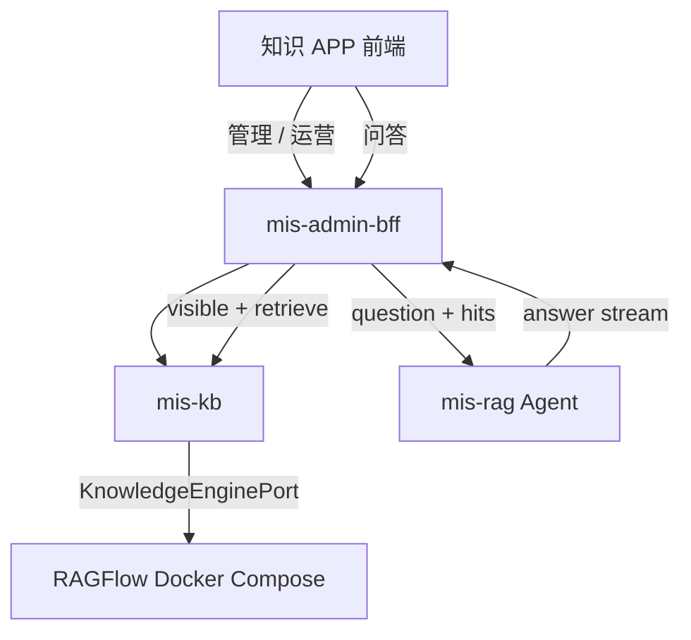

# 知识库（Knowledge APP）设计说明

> 状态：📝 草稿 | 版本：v0.1 | 日期：2026-08-03  
> 决策权威：[ADR-018](../adr/ADR-018-knowledge-base-mis-kb.md)  
> **完整规划（功能清单 / 分期 / 任务）**：[knowledge-base-app-plan.md](knowledge-base-app-plan.md)  
> **二期扩展（Hybrid / 同义词 / GraphRAG PoC 等）**：[knowledge-base-phase2-plan.md](knowledge-base-phase2-plan.md)

## 1. 目标

为企业用户提供：按**多层分类树**组织、按**保密等级**管控的知识库；文档上传/替换/删除；专用 RAG 智能问答；**方案 B** 运营能力（多维评价、引用、后台记录/看板/差评工单）。

管理界面自研（MIS 统一风格），检索引擎一期使用 **RAGFlow**（Docker 部署），经适配层调用，便于将来换引擎。

## 2. 核心产品决策

| 项 | 结论 |
|----|------|
| 组织 | **不强制**知识库挂部门；分类树 + 密级 |
| 分层 | **不拆**「文档库 / 知识库」两层产品；单层知识库内可有目录 |
| 密级 | **普通**：有 APP 入口的登录用户可检索；**其他级**：须显式 ACL |
| 问答体验 | 方案 B：完整引用、多维评价、举报、本人历史 |
| 后台运营 | 问答记录、评价看板、差评/举报工单、导出、金标对照 |
| RAG 参数 | 切片 / top_k 等在 **MIS 配置**，API 同步引擎；不强制进 RAGFlow UI |
| 同义词 | **MIS 持有**平台术语表（S-07）；`mis-kb` 检索前扩展；引擎原生词表仅运维可选（二期 Wave D） |

## 3. 运行时架构



| 组件 | 职责 |
|------|------|
| **mis-kb**（新建 Java，建议端口 8108） | 领域模型、ACL、问答落库、`RagflowAdapter` |
| **mis-rag** | Prompt + 流式生成；不落业务库、不管授权 |
| **mis-admin-bff** | 对外 API 与问答编排 |
| **RAGFlow** | 解析 / 向量 / 检索；**Docker Compose 多容器栈** |

### 3.1 问答编排（推荐）

1. BFF 鉴权 → `mis-kb.resolveVisibleLibraries` + `retrieve`  
2. BFF → `mis-rag`（问题 + hits）→ 流式答案  
3. `mis-kb` 落库 session / message / citation / feedback  

## 4. 信息与权限（摘要）

- **分类** `kb_category`：多层树。  
- **知识库** `kb_library`：挂分类 + 密级；对应引擎 `engine_type` + `engine_library_ref`。  
- **文档** `kb_document`：隶属库；版本与 `engine_document_ref`。  
- **ACL** `kb_acl`：用户/角色 × 库 × read|manage|acl。  
- 检索前强制 `visible_library_ids`；禁止仅靠 Prompt 保密。  
- 对外 API **禁止**暴露引擎原生 ID。

功能清单（分类 / 库 / 文档 / 权限 / 问答 F-\* / 运营 A-02\*）见迭代计划；实现以本 ADR 与 Flyway 为准。

## 5. 引擎可切换

`KnowledgeEnginePort` 落在 `mis-kb`；一期仅 `RagflowAdapter`。换引擎 = 新 Adapter + **重新 ingest**，分类/ACL/UI 可保留。

## 6. 部署与 Docker（强制交付）

### 6.1 RAGFlow 怎么跑

- **正式推荐形态**：官方 **Docker Compose**（RAGFlow 应用镜像 + MySQL / Redis / MinIO / ES 或 Infinity 等依赖），不是单 JAR。  
- 资源参考（上游）：约 ≥4 核、≥16GB 内存、≥50GB 盘。  
- MIS 业务人员日常使用知识 APP；RAGFlow 控制台仅运维排障。

### 6.2 开发交付硬要求

> **实现 `mis-kb` / 知识 APP / 引擎适配时，必须一并维护测试环境可启动的 Docker 脚本，与功能同一迭代交付，不得事后补。**

| 交付物 | 路径 | 说明 |
|--------|------|------|
| Compose 与说明 | [`deploy/ragflow/`](../../deploy/ragflow/) | 测试/本地拉起 RAGFlow 引擎栈 |
| 环境变量样例 | `deploy/ragflow/.env.example` | 镜像版本、端口、与 MIS 网络 |
| 测试部署说明 | [test-deploy.md](../devops/test-deploy.md) § RAGFlow | 验收步骤 |
| Nacos/本地配置项 | `mis-kb` 引擎 `base-url`、API Key（密钥不进库） | 仅服务端 |

本地开发可叠加：

```powershell
# 示例：主栈 +（可选）AI 融合 + RAGFlow 引擎
docker compose -f deploy/docker-compose.dev.yml -f deploy/ragflow/docker-compose.yml up -d
```

测试环境将同一 `deploy/ragflow` 脚本纳入集群/主机部署清单（见 test-deploy）。

### 6.3 验收（Docker）

- [ ] `deploy/ragflow` 文档可独立按步骤在**测试机**拉起  
- [ ] `mis-kb` 使用配置中的 base-url 能 `health` / 建库 / 上传 / retrieve  
- [ ] 浏览器不持有 RAGFlow API Key  
- [ ] 镜像 tag **钉死版本**（禁止长期 `latest`）

## 7. 分期（与开发同步 Docker）

| 阶段 | 功能 | Docker |
|------|------|--------|
| K0 | RAGFlow API PoC | **同步**完善 `deploy/ragflow` 可在 test 启动 |
| K1 | `mis-kb` 骨架 + 表 + Adapter | Compose 写入引擎连接说明与网络 |
| K2 | BFF + 知识 APP 管理 | test-deploy 增加 mis-kb 与引擎联调清单 |
| K3 | 问答编排 + 方案 B 运营 | 压测/资源说明更新 |

## 8. 关联文档

- [ADR-018](../adr/ADR-018-knowledge-base-mis-kb.md)
- [ai-fusion 部署](../ai-fusion/decisions/deploy.md)（既有 Qdrant/embedding，与 RAGFlow 引擎职责区分：RAGFlow 管企业文档 RAG）
- [微服务划分](microservices.md)（落地时追加 mis-kb 行）
- [本地开发](../devops/local-dev.md) / [测试部署](../devops/test-deploy.md)
