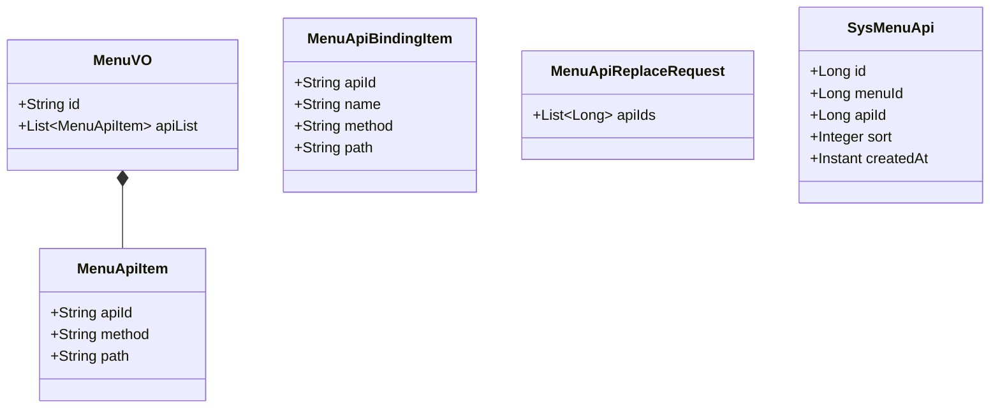
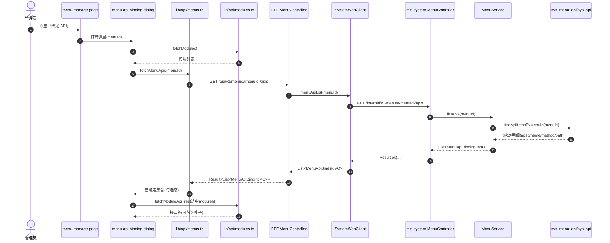
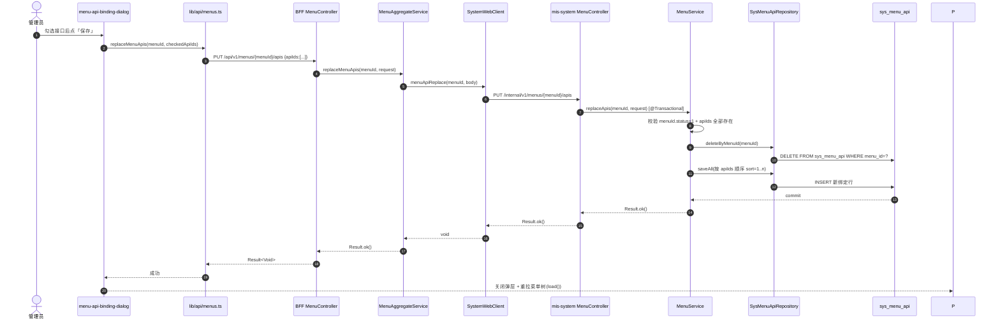
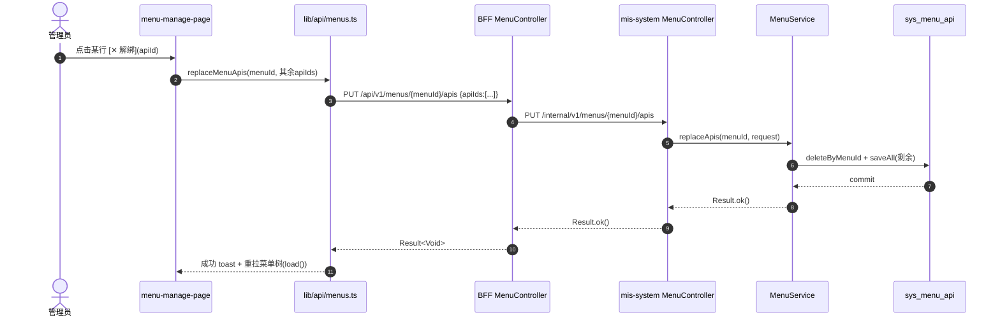
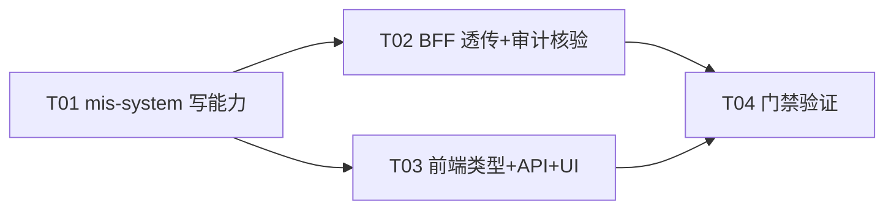

# 菜单「关联 API」绑定写能力 系统设计 + 任务分解（menu_api_binding）

| 项 | 值 |
| --- | --- |
| 文档版本 | v1.0（2026-08-12） |
| 关联 PRD | `deliverables/software-company/menu-api-binding-prd-2026-08-12.md` |
| 架构师 | software-architect（Bob） |
| 范围 | mis-system（写端点）+ mis-admin-bff（透传）+ mis-admin-web（详情面板绑定/解绑） |
| 状态 | 待工程师按任务列表实现 |

---

## 1. 实现方案 + 框架选型

**一句话**：沿用现有分层（Spring MVC + JPA + Flyway / WebFlux BFF / React + shadcn + Tailwind），**无新框架、无新依赖**；在既有「菜单管理」详情面板上补齐 `sys_menu_api` 的写闭环，采用 **GET + PUT 全量替换** 语义（与 `PUT /api/v1/roles/{id}/menus` 平台惯例一致）。

### 1.1 核心难点与对策

| 难点 | 对策 |
| --- | --- |
| 全量替换的原子性 | `MenuService.replaceApis` 一个 `@Transactional` 内「`deleteByMenuId` + `saveAll`（按请求顺序写 `sort`=1..n）」，避免逐条增删的中间态与部分失败 |
| 绑定弹层回显需要 `apiId` | `MenuVO.MenuApiItem` 由 `{method, path}` **增量扩展**为 `{apiId, method, path}`（additive，`{method,path}` 字段保留，向后兼容）；`findApisByMenuIds` 联查补 `a.id` |
| 权限码复用 | **无需任何权限改动**：V2 迁移早已登记 `GET/PUT /api/v1/menus/{menuId}/apis`（sys_api 4007/4008）并绑定到菜单 242（编辑菜单按钮，`system:menu:edit`）。BFF 判权走 `ApiPermissionInterceptor` + sys_api 注册表，新端点实现后自动被 `system:menu:edit` 保护（见 §1.2 事实锚点） |
| `(menu_id, api_id)` 唯一性 | **已存在，无需新迁移**：V1 建表即带 `CONSTRAINT uk_menu_api_pair UNIQUE (menu_id, api_id)`（V1__init_schema.sql:300）；V8 已 DROP 仅限 `api_id` 的 `uk_menu_api_api`。约束自 V1 起强制，库内不可能有重复行 → 无数据清洗、无 Flyway 增量（见 §1.2） |
| 审计测试 | `BffApiRegistryDiffSurveyTest` 的 `REGISTERED_FIXTURE` **已含** `GET/PUT /api/v1/menus/{menuId}/apis`（L532-533）。测试语义是「**导出端点必须被注册表覆盖**」；实现两个端点后导出集合恰好被 fixture 覆盖，**测试无需改 fixture**（见 §1.3） |

### 1.2 现状逆向核验（架构依据，硬事实）

> 以下均经读代码确认，作为实现锚点，勿偏离。

1. **mis-system `MenuService`**：`tree()` → `loadApiMap()`（L186-196）只读组装 `apiList`；`create/update/delete`（L95-163）不写 `sys_menu_api`。
2. **mis-system `MenuController`**：`/internal/v1/menus` 仅 `tree/router/permissions/{id}/create/update/delete`，无绑定端点。
3. **`SysMenuApi` 实体**：`id / menu_id / api_id / sort / created_at`（无更新时间戳）。
4. **`SysMenuApiRepository`**：仅 `findBindingsByModuleId` / `findApisByMenuIds` 两个只读 native query；`MenuApiRow` 投影 `{menuId, method, path}`。
5. **`SysApiRepository`**：有 `existsByModuleId*` 等，无 `existsByIdIn`；绑定校验可用 JPA 内置 `findAllById` + 数量比对，或新增 `countByIdIn`。
6. **BFF `SystemWebClient`**：已有 `menuTree/menuCreate/menuUpdate/menuDelete`，模块透传 `moduleApiTree/moduleBindings`（L144-154）可作新增透传的模板。
7. **BFF `MenuController`**：`/api/v1/menus` 无权限注解——BFF 权限由 `ApiPermissionInterceptor` + sys_api 注册表统一判定（非注解式）。
8. **BFF `ModuleController`**：`POST /{moduleId}/apis`、`PUT/DELETE /apis/{apiId}` 是 **sys_api（模块下接口）CRUD**，不是「菜单绑接口」——本功能勿与其混淆。
9. **Flyway**：最新版本 `V36__kb_agent_api_domain_catalogs.sql`；`sys_menu_api` 唯一约束自 V1 存在（`uk_menu_api_pair`），V17/V18/V26/V27/V29/V30 的 seed 均依赖该约束做 `WHERE NOT EXISTS (menu_id, api_id)` 幂等守卫。
10. **权限登记**：V2__seed_data.sql 已登记 sys_api 4007（GET 菜单API查询）/ 4008（PUT 菜单API绑定），经 sys_menu_api (44,45) 绑定到菜单 242（`system:menu:edit`）→ **新端点实现即自动挂上编辑菜单权限**。
11. **前端**：`src/lib/api/modules.ts` 已有 `fetchModules()` / `fetchModuleApiTree(moduleId)`（模块管理页在用），绑定弹层直接复用；`MenuNode.apiList` 唯一消费方是 `menu-manage-page.tsx` 详情面板（L557-587）。
12. **测试基建**：mis-system **无** `src/test`（无单测基建，门禁为编译）；BFF 测试在 `mis-admin-bff/src/test`（审计测试 `BffApiRegistryDiffSurveyTest`、`ModuleControllerRegistryCoverageTest` 等）。

### 1.3 Q7 审计测试语义核验结论

`BffApiRegistryDiffSurveyTest` 是「**已登记端点必须能覆盖导出端点**」的差集盘点（断言 4：非 KB 未登记必须恰好等于 3 个 agent-ops 动作变量端点）。`REGISTERED_FIXTURE` L532-533 已包含 `GET/PUT /api/v1/menus/{menuId}/apis`（即「设计已登记、实现缺失」状态）。本期补实现后：

- 导出集合新增 `GET /api/v1/menus/{menuId}/apis`、`PUT /api/v1/menus/{menuId}/apis`；
- 二者均被 fixture 覆盖 → 不进入 `nonKbUnregistered` → 断言 4 保持通过；
- `DISPOSITIONS` 已有 `menus` 处置项。

**结论：无需修改测试文件，仅需在门禁中运行确认。**

---

## 2. 文件清单（相对路径，标注 新增/修改）

### 2.1 mis-system（后端写能力）

| 文件 | 动作 | 说明 |
| --- | --- | --- |
| `backend/mis-system/src/main/java/com/mis/system/dto/MenuVO.java` | 修改 | `MenuApiItem` 记录扩展：`record MenuApiItem(String apiId, String method, String path)` |
| `backend/mis-system/src/main/java/com/mis/system/domain/repository/MenuApiRow.java` | 修改 | 投影接口增加 `Long getApiId()` |
| `backend/mis-system/src/main/java/com/mis/system/domain/repository/SysMenuApiRepository.java` | 修改 | ①`findApisByMenuIds` 联查补 `a.id AS apiId`；②新增 `findApiItemsByMenuId`（GET 明细投影）；③新增 `deleteByMenuId`（全量替换删除步） |
| `backend/mis-system/src/main/java/com/mis/system/domain/repository/MenuApiBindingRow.java` | 新增 | GET 明细投影接口：`{menuId, apiId, name, method, path}` |
| `backend/mis-system/src/main/java/com/mis/system/dto/MenuApiBindingItem.java` | 新增 | GET 响应 DTO：`record MenuApiBindingItem(String apiId, String name, String method, String path)` |
| `backend/mis-system/src/main/java/com/mis/system/dto/MenuApiReplaceRequest.java` | 新增 | PUT 请求 DTO：`record MenuApiReplaceRequest(@NotNull List<Long> apiIds)` |
| `backend/mis-system/src/main/java/com/mis/system/service/MenuService.java` | 修改 | 新增 `listApis(Long menuId)`、`replaceApis(Long menuId, MenuApiReplaceRequest)`；`loadApiMap` 适配 `MenuApiItem` 新字段；`requireActive`（菜单存在且 status=1） |
| `backend/mis-system/src/main/java/com/mis/system/controller/MenuController.java` | 修改 | 新增 `GET /internal/v1/menus/{menuId}/apis`、`PUT /internal/v1/menus/{menuId}/apis` |
| `backend/mis-migrator/src/main/resources/db/migration/V37__menu_api_binding.sql` | **不新增** | 核验结论：唯一约束/权限登记均已存在，无迁移需求（见 §1.2 第 9/10 条） |

### 2.2 mis-admin-bff（透传）

| 文件 | 动作 | 说明 |
| --- | --- | --- |
| `backend/mis-admin-bff/src/main/java/com/mis/adminbff/client/SystemWebClient.java` | 修改 | 新增 `menuApiList(Long menuId)`（GET）/ `menuApiReplace(Long menuId, Map<String,Object> body)`（PUT），参照 `moduleApiTree/moduleBindings` 写法；新增 `Result<List<MenuApiBindingVO>>` 类型引用 |
| `backend/mis-admin-bff/src/main/java/com/mis/adminbff/dto/MenuApiBindingVO.java` | 新增 | 对外 GET 响应 DTO（与 mis-system `MenuApiBindingItem` 同形） |
| `backend/mis-admin-bff/src/main/java/com/mis/adminbff/dto/MenuApiReplaceRequest.java` | 新增 | 对外 PUT 请求 DTO：`record MenuApiReplaceRequest(@NotNull List<Long> apiIds)`（镜像 `RoleMenuAssignRequest`） |
| `backend/mis-admin-bff/src/main/java/com/mis/adminbff/service/MenuAggregateService.java` | 修改 | 新增 `menuApis(Long menuId)` / `replaceMenuApis(Long menuId, MenuApiReplaceRequest)` 直通方法 |
| `backend/mis-admin-bff/src/main/java/com/mis/adminbff/controller/MenuController.java` | 修改 | 新增 `GET /api/v1/menus/{menuId}/apis`、`PUT /api/v1/menus/{menuId}/apis`（权限由注册表自动生效，无需注解） |
| `backend/mis-admin-bff/src/test/java/com/mis/adminbff/audit/BffApiRegistryDiffSurveyTest.java` | **不改**（仅核验） | fixture 已含两个端点，实现后断言仍通过 |

### 2.3 mis-admin-web（前端）

| 文件 | 动作 | 说明 |
| --- | --- | --- |
| `frontend/mis-admin-web/src/types/api.ts` | 修改 | `MenuApiItem` 增加 `apiId: string`；新增 `MenuApiBindingItem { apiId; name; method; path }` |
| `frontend/mis-admin-web/src/lib/api/menus.ts` | 修改 | 新增 `fetchMenuApis(menuId)`、`replaceMenuApis(menuId, apiIds: string[])` |
| `frontend/mis-admin-web/src/features/system/menu/menu-api-binding-dialog.tsx` | 新增 | 绑定弹层组件：模块下拉 + 接口树勾选 + 已绑定回显 + 保存（复用 `fetchModules`/`fetchModuleApiTree`） |
| `frontend/mis-admin-web/src/features/system/menu/menu-manage-page.tsx` | 修改 | 详情面板「关联 API」区：新增「绑定 API」按钮（`PermissionGate system:menu:edit`）+ `Unlink` 变为可点击解绑；集成弹层；成功后重拉菜单树 |

---

## 3. 数据结构与接口

### 3.1 数据模型变更



- `MenuApiItem`：**additive 扩展**（原 `{method, path}` 字段保留，仅新增 `apiId`）。`MenuService.loadApiMap` 改为 `new MenuVO.MenuApiItem(String.valueOf(row.getApiId()), row.getMethod(), row.getPath())`。
- `MenuApiBindingItem`：GET `/menus/{menuId}/apis` 的响应元素（含 `name` 供弹层展示，`method/path` 与详情面板一致）。
- `MenuApiReplaceRequest`：PUT 全量替换请求体，`apiIds` 顺序即 `sort` 顺序。

### 3.2 Repository 接口设计（SysMenuApiRepository）

```java
// ① 菜单树「关联 API」投影：补 apiId（修改既有查询）
@Query(value = """
        SELECT ma.menu_id     AS menuId,
               a.id           AS apiId,
               a.http_method  AS method,
               a.path_pattern AS path
        FROM sys_menu_api ma
        JOIN sys_api a ON a.id = ma.api_id
        WHERE ma.menu_id IN :menuIds
        ORDER BY ma.menu_id, ma.sort
        """, nativeQuery = true)
List<MenuApiRow> findApisByMenuIds(@Param("menuIds") List<Long> menuIds);

// ② 单个菜单的已绑定接口明细（回显勾选用）
@Query(value = """
        SELECT ma.menu_id     AS menuId,
               a.id           AS apiId,
               a.name         AS name,
               a.http_method  AS method,
               a.path_pattern AS path
        FROM sys_menu_api ma
        JOIN sys_api a ON a.id = ma.api_id
        WHERE ma.menu_id = :menuId
        ORDER BY ma.sort
        """, nativeQuery = true)
List<MenuApiBindingRow> findApiItemsByMenuId(@Param("menuId") Long menuId);

// ③ 全量替换删除步（须在 @Transactional 内调用）
void deleteByMenuId(Long menuId);
```

- `MenuApiRow` 增加 `Long getApiId()`；`MenuApiBindingRow`（新增接口）含 `getMenuId/getApiId/getName/getMethod/getPath`。
- 校验「apiIds 全部存在」：`SysApiRepository` 直接用 JPA 内置 `findAllById(Collection<Long>)`，`去重后数量 == 查询数量` 否则抛 `VALIDATION_ERROR`（无需新增 Repository 方法；如工程师偏好显式方法可加 `long countByIdIn(Collection<Long> ids)`，二选一）。

### 3.3 REST 接口

mis-system 内部（`/internal/v1/menus`）与 BFF 对外（`/api/v1/menus`）路径一一对应，由 `SystemWebClient` 透传。

```
GET /api/v1/menus/{menuId}/apis
PUT /api/v1/menus/{menuId}/apis
```

**GET 响应示例**：

```json
{
  "code": 0,
  "message": "ok",
  "data": [
    { "apiId": "91039001", "name": "查询命中测试", "method": "GET", "path": "/api/v1/kb/hit-test" },
    { "apiId": "91039002", "name": "同义词列表",   "method": "GET", "path": "/api/v1/kb/synonyms" }
  ]
}
```

**PUT 请求/响应示例**：

```json
// 请求
PUT /api/v1/menus/91039/apis
{ "apiIds": [91039001, 91039002] }

// 响应
{ "code": 0, "message": "ok", "data": null }
```

**校验规则（mis-system `MenuService.replaceApis`）**：

1. `menuId` 对应菜单必须存在且 `status=1`（软删菜单不可绑），否则 `NOT_FOUND`/`VALIDATION_ERROR`；
2. `apiIds` 允许为空（= 清空绑定）；去重后逐项校验全部存在于 `sys_api`，否则 `VALIDATION_ERROR`（防脏数据）；
3. 通过后同一事务内 `deleteByMenuId(menuId)` + `saveAll` 新行（`id=IdGenerator.nextId()`、`sort=下标+1`、`createdAt=now`）；
4. `uk_menu_api_pair` 兜底并发唯一性，重复写入被 DB 拒绝。

### 3.4 BFF 透传方法签名

```java
// SystemWebClient
public List<MenuApiBindingVO> menuApiList(Long menuId)
public void menuApiReplace(Long menuId, Map<String, Object> body)   // body: {"apiIds": [...]}

// MenuAggregateService
public List<MenuApiBindingVO> menuApis(Long menuId)
public void replaceMenuApis(Long menuId, MenuApiReplaceRequest request)

// BFF MenuController
@GetMapping("/{menuId}/apis")
public Result<List<MenuApiBindingVO>> menuApis(@PathVariable Long menuId)
@PutMapping("/{menuId}/apis")
public Result<Void> replaceMenuApis(@PathVariable Long menuId, @Valid @RequestBody MenuApiReplaceRequest request)
```

---

## 4. 程序调用流程（时序图）

### 4.1 打开绑定弹层（回显）



### 4.2 保存绑定（全量替换，含新增+解绑）



### 4.3 单行解绑（快捷操作 = 剩余集合的全量替换）



---

## 5. 任务列表（有序，含依赖）

> **任务数说明**：PRD 决策基线中的 Q6「Flyway 唯一索引」经核验**已存在**（`uk_menu_api_pair`，V1 建表即有），Q7「审计测试更新」经核验**无需改 fixture**——原 T01/T04 均为空操作，合并进相邻任务，最终 4 个任务（≤ 5 硬上限）。

| 任务 | 名称 | 源文件（含新增/修改） | 依赖 | 优先级 |
| --- | --- | --- | --- | --- |
| **T01** | mis-system 菜单-接口绑定写能力（含唯一索引核验） | `MenuVO.java`、`MenuApiRow.java`、`SysMenuApiRepository.java`、`MenuApiBindingRow.java`（新）、`MenuApiBindingItem.java`（新）、`MenuApiReplaceRequest.java`（新）、`MenuService.java`、`MenuController.java` | 无 | P0 |
| **T02** | BFF 透传 + 审计测试核验 | `SystemWebClient.java`、`MenuApiBindingVO.java`（新）、`MenuApiReplaceRequest.java`（新）、`MenuAggregateService.java`、`MenuController.java`（BFF） | T01 | P0 |
| **T03** | 前端类型 + API 封装 + 详情面板/绑定弹层 | `types/api.ts`、`lib/api/menus.ts`、`menu-api-binding-dialog.tsx`（新）、`menu-manage-page.tsx` | T01（接口契约） | P0 |
| **T04** | 门禁验证与集成 | 全仓：mis-system 编译、BFF 编译 + `BffApiRegistryDiffSurveyTest`、前端 `typecheck`（`tsc --noEmit`）；失败则修复 | T01、T02、T03 | P0 |

**T01 详细范围**（实现顺序）：
1. `MenuApiRow` + `findApisByMenuIds` 补 `apiId`；`MenuVO.MenuApiItem` 加 `apiId`；`loadApiMap` 适配；
2. 新增 `MenuApiBindingRow`、`findApiItemsByMenuId`、`deleteByMenuId`；
3. 新增 DTO `MenuApiBindingItem` / `MenuApiReplaceRequest`；
4. `MenuService.listApis` / `replaceApis`（`@Transactional` 全量替换 + 校验）；
5. `MenuController` 新增 GET/PUT 端点；
6. **核验**（不产文件）：确认 `uk_menu_api_pair` 存在、V2 已登记 4007/4008 → 无 Flyway 增量。

**T02 详细范围**：BFF DTO 2 个 + `SystemWebClient` 2 个透传方法（模板：`moduleApiTree/moduleBindings`）+ `MenuAggregateService` 2 个直通 + `MenuController` 2 个端点；运行 `BffApiRegistryDiffSurveyTest` 确认零改动通过（如断言异常，先对照 §1.3 结论排查，勿擅改 fixture）。

**T03 详细范围**：
1. `types/api.ts`：`MenuApiItem` 加 `apiId: string`；新增 `MenuApiBindingItem`；
2. `lib/api/menus.ts`：`fetchMenuApis(menuId)`、`replaceMenuApis(menuId, apiIds)`（发送时 `string[]` → `number[]`）；
3. 新增 `menu-api-binding-dialog.tsx`：模块下拉（`fetchModules`）+ 接口树（`fetchModuleApiTree`，仅 `type==='api'` 叶子可勾选）+ 打开时 `fetchMenuApis` 回显 + 保存调 `replaceMenuApis`；错误态 toast 展示 `Result.message` 且不关弹层；
4. `menu-manage-page.tsx`：详情面板「关联 API」区加「绑定 API」按钮（`PermissionGate system:menu:edit`）；`Unlink` 由纯展示改为可点击解绑（调用剩余集合全量替换）；成功/失败 toast；成功后 `await load()` 重拉树（整树刷新兜底，P2 局部更新不做）。

**T04 详细范围**：门禁命令见 §6/§7（BFF 测试以 `mvn -pl mis-admin-bff test -Dtest=BffApiRegistryDiffSurveyTest` 等价方式运行）；同时人工核对「绑定保存后重拉树 apiList 与 sys_menu_api 一致」。



---

## 6. 依赖包

**无新增**。全部复用既有依赖：

- mis-system：`spring-boot-starter-data-jpa`、`spring-boot-starter-web`、`spring-boot-starter-validation`、Flyway（runtime）；
- mis-admin-bff：`spring-boot-starter-webflux`、`spring-web`（审计测试用 RequestMappingHandlerMapping）；
- mis-admin-web：React + Vite + TypeScript + shadcn/ui + Tailwind + lucide-react + sonner（toast）。

---

## 7. 共享知识（跨文件约定）

1. **`MenuApiItem` 是 additive 变更**：保留 `{method, path}`，新增 `apiId`；后端 `MenuApiRow`/`findApisByMenuIds`/`loadApiMap` 三处必须同步改，漏一处即树接口缺 `apiId`。前端 `MenuNode.apiList` 唯一消费方是 `menu-manage-page.tsx` 详情面板；行 `key` 可用 `apiId` 替代数组下标。
2. **权限码复用 `system:menu:edit`**：前端按钮用 `<PermissionGate permission="system:menu:edit">`；后端无需新增权限码/菜单/角色授权——V2 注册表已让新端点自动受该码保护（勿新增 `system:menu:api`）。
3. **事务边界**：全量替换必须在 `MenuService.replaceApis` 的 `@Transactional` 内完成「校验 → deleteByMenuId → saveAll」，任何一步失败整体回滚；`deleteByMenuId` 是修改型派生查询，脱离事务会报错。
4. **排序语义**：`sort` = 请求 `apiIds` 数组下标 + 1（1..n），与 `findApisByMenuIds/findApiItemsByMenuId` 的 `ORDER BY ma.sort` 配合，前端稳定展示；P2 拖拽排序只需复用同一 PUT 全量替换改顺序，无需改后端。
5. **软删不清理绑定行（Q3 已拍板）**：`MenuService.delete` 保持不写 `sys_menu_api`；`tree()` 只查 `status=1` 菜单天然过滤脏行；绑定/查询端点对软删菜单返回「不存在或已停用」，防复活绑定。
6. **统一响应与路由**：`Result{code,message,data,traceId}`；mis-system 走 `/internal/v1/**`，BFF 透传对外 `/api/v1/**`；BFF 侧异常由 `AbstractDownstreamClient.block()` 统一抛 `BusinessException`，前端 toast 展示 `message`。
7. **幂等与并发**：`uk_menu_api_pair (menu_id, api_id)` 唯一约束（V1 建表即有）兜底并发重复绑定；迁移/代码无需再建索引。
8. **前端发送类型**：`replaceMenuApis` 发送 `{ apiIds: number[] }`（对齐 `RoleMenuAssignRequest` 的 `List<Long>` 惯例），字符串 id 在 api 层转换。
9. **易混淆点**：BFF `ModuleController` 的 `POST /{moduleId}/apis`、`PUT/DELETE /apis/{apiId}` 是 sys_api 接口字典 CRUD；本功能是「菜单 ↔ 接口绑定」，只动 `sys_menu_api`，不新增 sys_api 行。

---

## 8. 待明确事项（若有）

1. **解绑确认提示**（PRD P1）：本期默认「点击 ✕ 直接解绑 + toast 成功」，不做二次确认；如需与删除菜单一致的确认弹层，属低成本增强，工程师可顺手加（不阻塞 P0）。
2. **绑定弹层展示字段**：默认展示 `method + path`（与详情面板一致）+ `name`（GET 返回含 name）；是否展示所属模块/分组，由 UI 现场决定（数据已够）。
3. **已停用接口的展示**：GET 回显不做 `sys_api.status=1` 过滤（保证已停用接口仍可被看到并解绑）；若产品要求隐藏停用接口，改 `findApiItemsByMenuId` 加过滤即可（不阻塞）。
4. **mis-system 无测试基建**：门禁以编译（`mvn compile`）代替单测；如后续需要，可补 service 层单元测试基建（本期不引入）。
5. **门禁命令细节**：BFF 测试运行方式（`-pl mis-admin-bff -am test -Dtest=...` 或 IDE 直跑）以仓库实际 Maven 配置为准，工程师在 T04 现场确认。
