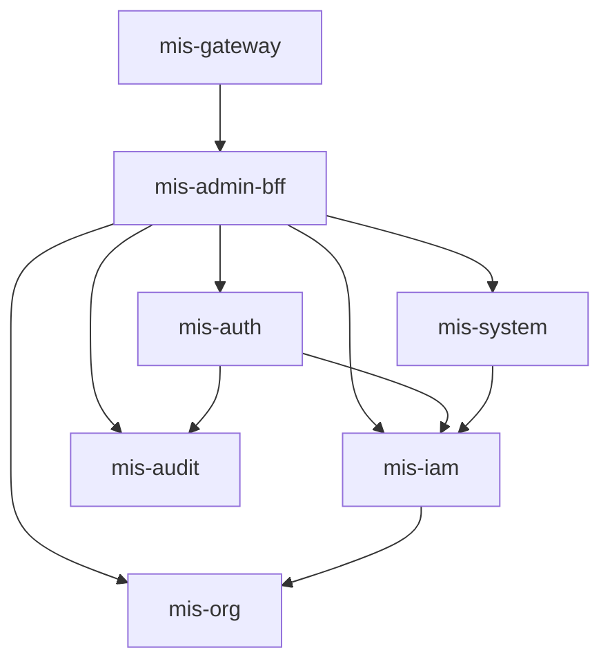

# 后端微服务划分

> 状态：✅ 已更新 | 版本：v1.1 | 更新：Sprint 2 服务边界重构（mis-user/mis-rbac → mis-iam）

## 1. 服务总览

| 服务 | artifactId | 端口 | Phase | 职责 |
|------|------------|------|-------|------|
| 网关 | mis-gateway | 8080 | 1 | 路由、鉴权、限流 |
| BFF | mis-admin-bff | 8081 | 1 | 前端 API 聚合 |
| 认证 | mis-auth | 8101 | 1 | 登录、Token、验证码 |
| 身份权限 | mis-iam | 8102 | 1 | APP/用户/角色/权限聚合 |
| 组织 | mis-org | 8103 | 1 | 组织树、员工档案、岗位编制 |
| 系统 | mis-system | 8105 | 1 | 菜单/API/字典/参数/日志 |
| 审计 | mis-audit | 8106 | 1 | 日志采集与查询 |
| 通知 | mis-notify | 8107 | 1 | 骨架占位 |

> **Sprint 2 重构说明：** 取消 mis-user（8102）和 mis-rbac（8104），合并为 mis-iam（8102）；员工档案从 mis-user 迁入 mis-org。

## 2. 服务依赖图



## 3. 各服务详细职责

### 3.1 mis-gateway

| 职责 | 说明 |
|------|------|
| 路由 | 按 path 前缀转发到 BFF 或直连服务 |
| JWT 验签 | RS256 公钥验签 + jti 黑名单 |
| 限流 | Sentinel（Phase 1 基础规则） |
| CORS | 开发环境允许 localhost:5173 |
| 透传头 | X-User-Id, X-Tenant-Id, X-App-Id, X-Employee-Id, X-Username, X-Trace-Id |

**不做：** 业务逻辑、数据库访问

### 3.2 mis-admin-bff

| 对外 Controller | 聚合服务 |
|-----------------|----------|
| AuthController | mis-auth |
| UserController | mis-iam（+ mis-org 补员工/部门名） |
| OrgController | mis-org |
| RoleController | mis-iam（+ mis-system 菜单树可选） |
| MenuController | mis-system |
| DictController | mis-system |
| AuditController | mis-audit |
| DashboardController | mis-iam + mis-org + mis-audit |

**原则：**
- 适配前端 DTO，字段命名 camelCase
- 减少前端 chattiness（如用户列表直接返回 orgName、roles）
- **对外 API 权限**：`sys_api` + `sys_menu_api` + `ApiPermissionInterceptor`（ADR-011）
- 不写核心业务规则，规则在领域服务

### 3.3 mis-auth

| API（内部） | 说明 |
|-------------|------|
| login | 验证码 + 密码校验 + 签发 Token |
| refresh | 刷新 Token |
| logout | 吊销 |
| validateToken | 供 Gateway 或内部校验 |
| getCaptcha | 生成验证码 |

**依赖：** mis-iam（查用户 / 写 permissions）、Redis（锁定/黑名单/验证码）、mis-audit（登录日志）

### 3.4 mis-iam（身份与权限聚合）

> Sprint 2 重构：合并原规划中的 mis-user + mis-rbac，统一管理身份与权限（PDP）。

| 能力 | 说明 |
|------|------|
| APP 管理 | `sys_app` CRUD |
| 用户 CRUD | `sys_user`，含软删除、状态管理 |
| 角色 CRUD | `sys_role`，含租户管理员保护 |
| 角色-权限分配 | `sys_role_permission`，全量替换模式 |
| 用户-角色绑定 | 为用户分配/移除角色 |
| 重置密码 | BCrypt 写入 |
| 权限版本管理 | `perm_version` 缓存失效（Redis） |

**规则：**
- 不能删除自己
- 不能删除最后一个 TENANT_ADMIN
- username 租户内唯一
- 权限变更时递增 perm_version，主动 evict Redis 缓存

### 3.5 mis-org（组织与人事聚合）

> Sprint 2 重构：员工档案（`sys_employee`）归属本服务（不再放在独立 mis-user）。

| 能力 | 说明 |
|------|------|
| 组织 CRUD | `sys_org` 租户内扁平列表 |
| 部门树 | `sys_dept`：`parent_id` + 层级 `code` + `ancestors` |
| 员工管理 | `sys_employee` CRUD |
| 岗位编制 | `sys_post`、`sys_post_type`、`sys_employee_post` |
| 部门类别 | `sys_dept_category` |
| 子树 ID 列表 | 供 DataScope 使用 |

**ancestors 维护：** 创建/移动时更新自身及子孙节点

**删除规则：**
- 有子部门 → 拒绝
- 有员工任职 → 拒绝

### 3.6 mis-system

| 能力 | 说明 |
|------|------|
| 菜单 CRUD | |
| **API 注册** | `sys_api` CRUD + Registry 刷新 |
| **菜单-API 绑定** | `sys_menu_api` CRUD（归属本服务，非 mis-iam） |
| 路由树组装 | `/menus/router` |
| **API Registry** | `GET /internal/v1/api-permissions/registry` 供 BFF 加载 |
| 字典类型/项 CRUD | |
| 系统参数 | `sys_config` |
| 操作日志 | `@OperLog` AOP + 查询 |

### 3.7 mis-audit

| 能力 | 说明 |
|------|------|
| 登录日志写入 | 供 auth 调用 |
| 登录日志查询 | 分页 |
| 操作日志查询 | 分页 + 详情 |

### 3.8 mis-notify（Phase 1 骨架）

仅保留：
- 健康检查
- 模块占位
- 数据库表预留（Phase 2 实现）

## 4. 服务间调用方式

> 详见 [ADR-007](../adr/ADR-007-webclient-over-feign.md)：BFF 用 **WebClient**，领域服务用 **RestClient**，**不使用 OpenFeign**。

### 4.1 HTTP Client 清单（Phase 1）

**mis-admin-bff（WebClient，支持并行）**

| Client 类 | 被调服务 | 典型调用 |
|-----------|----------|----------|
| AuthWebClient | mis-auth | 登录、刷新 |
| IamWebClient | mis-iam | 用户/角色 CRUD、权限 |
| OrgWebClient | mis-org | 组织树、员工、批量名称 |
| SystemWebClient | mis-system | 菜单、字典、API |
| AuditWebClient | mis-audit | 日志查询 |

BFF 聚合示例：`GET /users` 并行请求 mis-iam 用户列表 + mis-org 批量员工名称。

**领域服务（RestClient，串行）**

| 调用方 | 被调方 | 场景 |
|--------|--------|------|
| mis-auth | mis-iam | 登录查用户 |
| mis-auth | mis-audit | 写登录日志 |
| mis-iam | mis-org | 校验组织/部门 |
| mis-system | mis-iam | 菜单关联角色 |

地址格式：`http://{service-name}/internal/v1/...`（经 LoadBalancer 解析）

### 4.2 内部 API 与外部 API 分离

- 外部：BFF 暴露 `/api/v1/*`
- 内部：各服务 `/internal/v1/*`（不经过 Gateway 公网暴露）

## 5. 包结构（单服务示例 mis-iam）

```
com.mis.iam/
├── IamApplication.java
├── controller/
│   ├── AppController.java
│   ├── UserController.java
│   └── RoleController.java
├── service/
│   ├── UserService.java
│   ├── RoleService.java
│   └── impl/
├── domain/
│   ├── entity/
│   │   ├── SysApp.java
│   │   ├── SysUser.java
│   │   └── SysRole.java
│   ├── repository/
│   └── dto/
└── config/
```

## 6. Gateway 路由规则

| Path | 目标 | 备注 |
|------|------|------|
| `/api/v1/auth/me` | mis-admin-bff | **order 更高**，勿落入 auth 通配 |
| `/api/v1/auth/**` | mis-auth | 登录 / captcha / refresh / logout |
| `/api/v1/audit/**` | mis-audit | 审计查询（若直出） |
| `/api/v1/**` | mis-admin-bff | 其余对外 API |
| `/actuator/**` | 各服务 | 仅内网 |

## 7. Nacos 配置 Data ID

Git 源：`deploy/nacos-config/{prod,test,integration}/`（推送后 Data ID **无** `.yaml` 后缀）。

| Data ID | 说明 |
|---------|------|
| `mis-common` | 数据源、Redis、JWT 公钥路径 |
| `mis-gateway` | 路由（remote 用 `lb://`） |
| `mis-auth` | 认证 |
| `mis-iam` | 身份与权限 |
| `mis-org` | 组织与人事 |
| `mis-audit` | 审计 |
| `mis-system` | 菜单/字典/仪表盘 |
| `mis-admin-bff` | BFF 聚合 + API 权限 |

## 8. 待确认项

- [x] Phase 1 服务均独立进程部署
- [x] 内部 API **直连**（RestClient/WebClient），不经 Gateway
- [x] 权限缓存：主动 evict + TTL（ADR-006）

## 9. 关联文档

- [公共模块](common-modules.md)
- [接口规范](../api/api-specification.md)
- [系统架构](../architecture/02-system-architecture.md)
