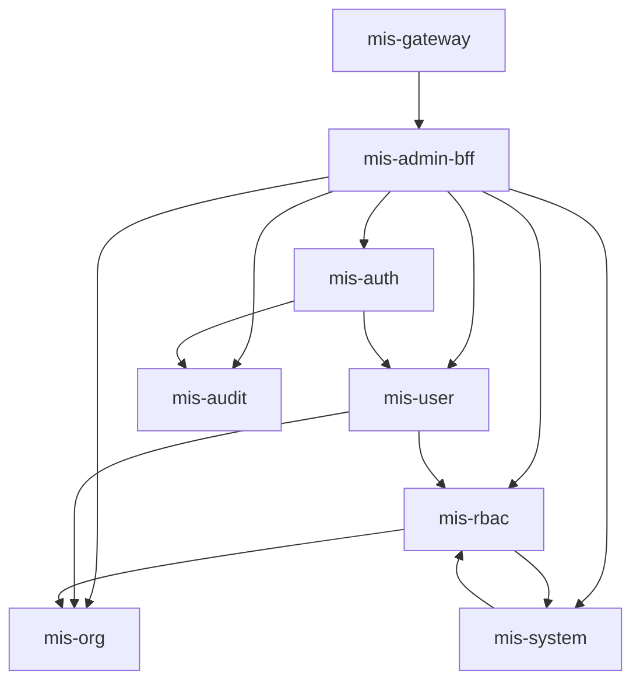

# 后端微服务划分

> 状态：📝 草稿 | 版本：v1.0-draft

## 1. 服务总览

| 服务 | artifactId | 端口 | Phase | 职责 |
|------|------------|------|-------|------|
| 网关 | mis-gateway | 8080 | 1 | 路由、鉴权、限流 |
| BFF | mis-admin-bff | 8081 | 1 | 前端 API 聚合 |
| 认证 | mis-auth | 8101 | 1 | 登录、Token、验证码 |
| 用户 | mis-user | 8102 | 1 | 用户 CRUD、档案 |
| 组织 | mis-org | 8103 | 1 | 组织树 CRUD |
| 权限 | mis-rbac | 8104 | 1 | 角色、权限聚合 |
| 系统 | mis-system | 8105 | 1 | 菜单、字典、参数 |
| 审计 | mis-audit | 8106 | 1 | 日志采集与查询 |
| 通知 | mis-notify | 8107 | 1 | 骨架占位 |

## 2. 服务依赖图



## 3. 各服务详细职责

### 3.1 mis-gateway

| 职责 | 说明 |
|------|------|
| 路由 | 按 path 前缀转发到 BFF 或直连服务 |
| JWT 验签 | RS256 公钥验签 + jti 黑名单 |
| 限流 | Sentinel（Phase 1 基础规则） |
| CORS | 开发环境允许 localhost:5173 |
| 透传头 | X-User-Id, X-Tenant-Id, X-Trace-Id |

**不做：** 业务逻辑、数据库访问

### 3.2 mis-admin-bff

| 对外 Controller | 聚合服务 |
|-----------------|----------|
| AuthController | mis-auth |
| UserController | mis-user + mis-rbac |
| OrgController | mis-org |
| RoleController | mis-rbac + mis-system |
| MenuController | mis-system |
| DictController | mis-system |
| AuditController | mis-audit |
| DashboardController | mis-user + mis-org + mis-audit |

**原则：**
- 适配前端 DTO，字段命名 camelCase
- 减少前端 chattiness（如用户列表直接返回 orgName、roles）
- **对外 API 权限**：`sys_api` + `sys_menu_api` + `ApiPermissionInterceptor`（ADR-011）
- 不写核心业务规则，规则在领域服务

### 3.3 mis-auth

| API（内部） | 说明 |
|-------------|------|
| login | 验证码 + 密码校验 + 签发 Token |
| refresh | 刷新 Token |
| logout | 吊销 |
| validateToken | 供 Gateway 或内部校验 |
| getCaptcha | 生成验证码 |

**依赖：** mis-user（查用户）、Redis（锁定/黑名单/验证码）、mis-audit（登录日志）

### 3.4 mis-user

| 能力 | 说明 |
|------|------|
| 用户 CRUD | 含软删除 |
| 员工主数据 | sys_employee |
| APP 登录账号 | sys_user（每 APP 每员工一条） |
| 状态管理 | 启用/禁用/锁定 |
| 重置密码 | 写 BCrypt hash |
| 分配角色 | 调 mis-rbac 或直写 sys_user_role |

**规则：**
- 不能删除自己
- 不能删除最后一个 ADMIN
- 创建用户时 username 租户内唯一

### 3.5 mis-org

| 能力 | 说明 |
|------|------|
| 组织树查询 | 递归或一次查 + 内存组树 |
| CRUD | 维护 ancestors 字段 |
| 子树 ID 列表 | 供 DataScope 使用 |

**ancestors 维护：** 创建/移动时更新自身及子孙节点

**删除规则：**
- 有子部门 → 拒绝
- 有用户关联 → 拒绝

### 3.6 mis-rbac（PDP — 权限策略中心）

| 能力 | 说明 |
|------|------|
| 角色 CRUD | |
| 角色-菜单分配 | |
| 数据范围配置 | `sys_role_permission`（`perm_type='dept'`） |
| 用户权限聚合 | 从 DB 聚合 → **写入 Redis**；JWT **不含** permissions（ADR-009） |
| 用户角色绑定 | |

**内部 API：**

| 方法 | 路径 | 用途 |
|------|------|------|
| GET | `/internal/v1/permissions/{userId}` | 登录/refresh 加载权限 |
| POST | `/internal/v1/authz/check` | 调试/备用；正常走 Redis + BFF |

**权限聚合逻辑：**
1. 查用户所有角色 → 合并菜单 permission（去重）
2. 缓存 Redis `mis:rbac:permissions:{userId}`，TTL 15min，变更时主动 evict
3. BFF **每请求读 Redis** + **映射表鉴权**（ADR-008/009/010）

### 3.7 mis-system

| 能力 | 说明 |
|------|------|
| 菜单 CRUD | |
| **API 树管理** | `sys_api` CRUD + Registry 刷新 |
| **菜单/API 关联** | `sys_menu_api` CRUD |
| 路由树组装 | `/menus/router` |
| **API Registry** | `GET /internal/v1/api-permissions/registry` 供 BFF 加载 |
| 字典类型/项 CRUD | |
| 系统参数 | sys_config |

### 3.8 mis-audit

| 能力 | 说明 |
|------|------|
| 登录日志写入 | 供 auth 调用 |
| 登录日志查询 | 分页 |
| 操作日志 AOP | `@OperLog` 注解 |
| 操作日志查询 | 分页 + 详情 |

### 3.9 mis-notify（Phase 1 骨架）

仅保留：
- 健康检查
- 模块占位
- 数据库表预留（Phase 2 实现）

## 4. 服务间调用方式

> 详见 [ADR-007](../adr/ADR-007-webclient-over-feign.md)：BFF 用 **WebClient**，领域服务用 **RestClient**，**不使用 OpenFeign**。

### 4.1 HTTP Client 清单（Phase 1）

**mis-admin-bff（WebClient，支持并行）**

| Client 类 | 被调服务 | 典型调用 |
|-----------|----------|----------|
| AuthWebClient | mis-auth | 登录、刷新 |
| UserWebClient | mis-user | 用户 CRUD、列表 |
| OrgWebClient | mis-org | 组织树、批量 orgName |
| RbacWebClient | mis-rbac | 角色、权限 |
| SystemWebClient | mis-system | 菜单、字典 |
| AuditWebClient | mis-audit | 日志查询 |

BFF 聚合示例：`GET /users` 并行请求 user-service 列表 + org-service 批量名称。

**领域服务（RestClient，串行）**

| 调用方 | 被调方 | 场景 |
|--------|--------|------|
| mis-auth | mis-user | 登录查用户 |
| mis-auth | mis-audit | 写登录日志 |
| mis-user | mis-org | 校验 orgId |
| mis-user | mis-rbac | 分配角色 |
| mis-rbac | mis-org | 数据范围子树 ID |

地址格式：`http://{service-name}/internal/v1/...`（经 LoadBalancer 解析）

### 4.2 内部 API 与外部 API 分离

- 外部：BFF 暴露 `/api/v1/*`
- 内部：各服务 `/internal/v1/*`（不经过 Gateway 公网暴露）

## 5. 包结构（单服务示例 mis-user）

```
com.mis.user/
├── UserApplication.java
├── controller/
│   ├── UserController.java          # 内部 API
│   └── internal/UserInternalController.java
├── service/
│   ├── UserService.java
│   └── impl/UserServiceImpl.java
├── mapper/
│   └── UserMapper.java
├── domain/
│   ├── entity/User.java
│   └── dto/
│       ├── UserCreateDTO.java
│       ├── UserUpdateDTO.java
│       └── UserVO.java
└── config/
```

## 6. Gateway 路由规则

| Path | 目标 |
|------|------|
| /api/v1/** | mis-admin-bff |
| /actuator/** | 各服务（仅内网） |

## 7. Nacos 配置 dataId

```
mis-gateway-dev.yaml
mis-admin-bff-dev.yaml
mis-auth-dev.yaml
mis-user-dev.yaml
mis-org-dev.yaml
mis-rbac-dev.yaml
mis-system-dev.yaml
mis-audit-dev.yaml
mis-common-dev.yaml          # 数据源、Redis、JWT 公钥
```

## 8. 待确认项

- [x] Phase 1 **mis-auth** 与 **mis-user** **独立进程**部署
- [x] 内部 API **直连**（RestClient/WebClient），不经 Gateway
- [x] 权限缓存：主动 evict + TTL（ADR-006）

## 9. 关联文档

- [公共模块](common-modules.md)
- [接口规范](../api/api-specification.md)
- [系统架构](../architecture/02-system-architecture.md)
