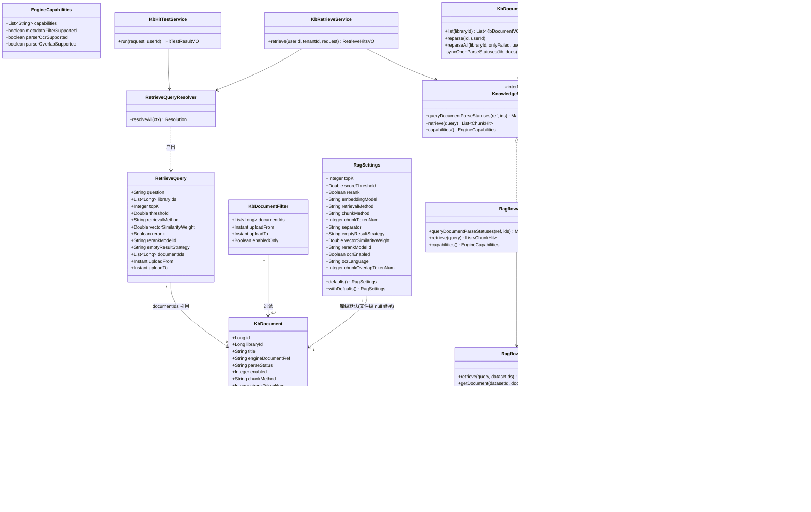
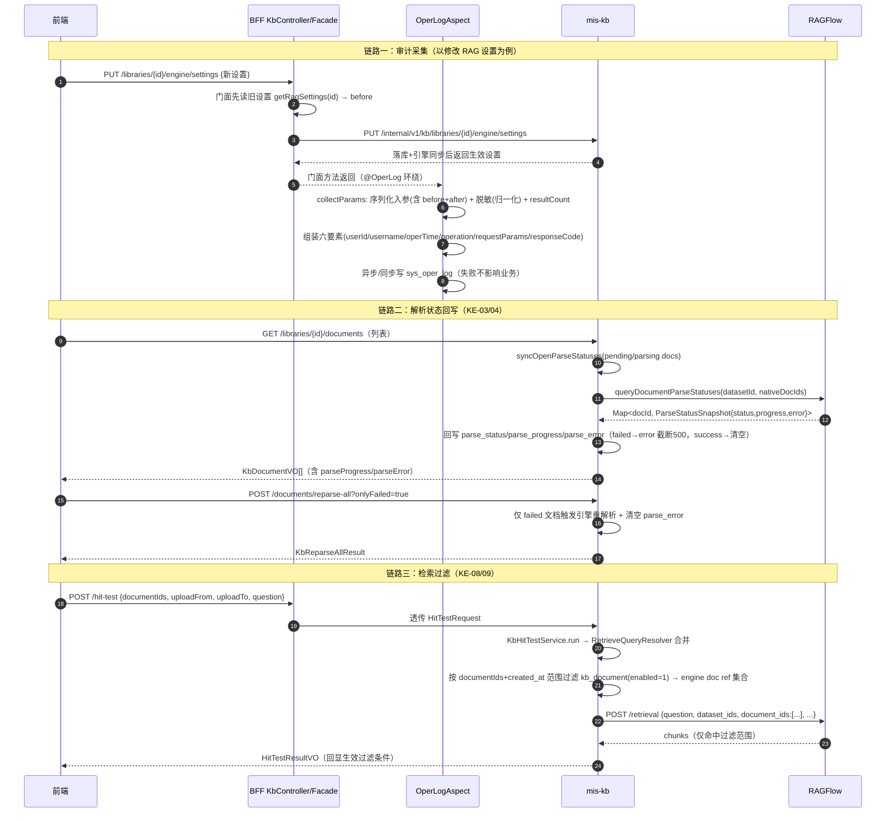

# MIS 知识库（mis-kb）企业级增强一期 技术设计

- **作者**：高见远（软件架构师）
- **日期**：2026-08-11
- **状态**：定稿（待主理人复核 Q5/Q6 裁决与待拍板事项）
- **上游**：`deliverables/software-company/kb-enterprise-phase1-prd-2026-08-11.md`（许清楚，KE-01~KE-09 + Q1~Q8）
- **基线**：`docs/backend/knowledge-base-phase2-plan.md` §11（技术债）、`docs/backend/mis-kb-settings-model-chunk-design-2026-08-10.md`、`docs/backend/mis-kb-phase2-wave-a-design-2026-08-04.md`、`docs/backend/ragflow-capability-probe-2026-08-10.md`
- **下游**：寇豆码（软件工程师）按本文任务列表实现

---

## 0. 本设计与 PRD 的映射

| PRD 需求 | 本文章节 | 结论 |
|---|---|---|
| KE-01 审计全覆盖 | §1.1 / §2.1 / §4 | 17 个写端点补挂（PRD §3.1 列 17 行，正文称 18，按实际盘点 17 处理，见 §10） |
| KE-02 审计查询 | §2.2 / §4 | 复用 log:list 监控页 + module=知识库，不新增查询端点 |
| KE-03 解析进度 | §1.2 / §3 | parse_progress 落库（Q1=落库） |
| KE-04 失败原因 | §1.2 / §3 | parse_error 落库，来源引擎 progress_msg |
| KE-05 失败重试 | §1.3 / §4 | 行内重试复用 /reparse；库级扩展 /reparse-all?onlyFailed=true（Q8） |
| KE-06 OCR 开关 | §1.4 / §3 | **引擎实测不支持**，落库+回显+提示，不下发（Q3） |
| KE-07 chunk overlap | §1.4 / §3 | **引擎实测不支持**，落库+回显+提示，不下发（Q4） |
| KE-08 按文档过滤 | §1.5 / §3 | 用引擎原生 `document_ids`（实测生效），不走 metadata_filters |
| KE-09 时间范围过滤 | §1.5 / §3 | MIS 侧先过滤文档 id 集再并入 document_ids（Q7） |
| 技术债 11.2 | §1.6 / §3 | V30 登记 17 写端点 sys_api（Q5=随期销） |
| 技术债 11.5 | §1.7 | isSensitiveKey 归一化 + 测试改写（Q6=随期销） |
| P2 候选 | §8 | 明确不做：密级过滤、库级看板、前后值 diff 视图 |

---

## 1. 实现方案与关键决策（Q1~Q8 逐条裁决）

### 1.0 现状核查结论（读码 + 实测，非臆测）

- **审计层现状**：`@OperLog` 切面在 `mis-admin-bff`（`OperLogAspect`），采集「登录用户 + 入参（脱敏）+ 结果条数」写入 `sys_oper_log`（mis-audit 落库）。**无「修改前值」能力**；KB 写端点中仅 `deleteLibrary` / `engine-*` / `hit-test` / `synonyms-*` 已挂，其余 17 个写端点未挂。
- **审计查询现状**：`mis-audit OperLogController` + 前端 `monitor/log-pages.tsx` 已支持 `module` 筛选与详情面板 request_params 展示 → KE-02 无需新增查询能力。
- **解析链路现状**：`KbDocumentService.list/get` 内 `syncOpenParseStatuses()` 仅对 pending/parsing 文档向引擎批量拉取 `run/progress`，只回写 `parse_status`；`RfDocument` 已含 `progress/progress_msg/chunk_count` 字段但未落库。
- **重试链路现状**：单文档 `/reparse`、库级 `/reparse-all` 已实现（返回成功/失败/跳过 + 失败明细）；无 failed-only 过滤。
- **检索链路现状**：`RetrieveQueryResolver` 合并 → `RagflowAdapter.retrieve` → `RagflowClient.retrieve`（顶层扁平字段）；`metadataFilterSupported=true` 已声明，但**当前 RAGFlow 实例实测 `metadata_filters` 被静默忽略**（见 T00 补充实测）。
- **迁移现状**：`backend/mis-migrator` 最新 **V29**，V30 空闲可用。
- **sys_api 登记现状**：KB 模块已登记 hit-test / engine-ref / engine-reconcile / engine-orphans / engine-rename / synonyms 共 21 行（V17/V18/V26/V27）；**categories/libraries/documents/acls 写端点全部未登记**（技术债 11.2 属实）。

### 1.1 Q2 裁决：审计「前后值」机制 —— **采纳门面层采集旧值入 request_params（产品倾向），具体实现 = 「审计快照入参」范式（对齐 KbSynonymFacadeService.deleteGroup 既有先例）**

- **结论**：采用产品倾向，但**不新增切面全局语义、不改既有 7 处调用**。机制：
  1. **门面层采集旧值**：对「修改类」写操作（RAG 设置、库基本信息、分类修改、文档切片配置、文档启停、ACL 授予/撤销、分类管理员授予/撤销），BFF 门面方法在执行业务前先调用既有**读**端点取得旧值（`getRagSettings` / `getLibrary` / `getDocument` / `listAcls` 等，均为已存在只读端点，零新增）；
  2. **审计快照入参**：门面方法签名增加一个「审计快照」参数（`KbAuditBefore` 包装 record），`@OperLog(recordParams=true)` 挂到该门面方法上，切面按既有逻辑把入参（含 before）序列化进 `request_params`；
  3. **前后值呈现**：request_params 形如 `{"libraryId":12, "before":{...旧值...}, "after":{...新值...}}`（after 即请求体/新参数，由门面显式组装）；`KbAuditBefore` 用与请求 DTO 同构的字段承载旧值，保证可读。
- **可行性评估**：低风险。同义词 `deleteGroup(Long id, KbSynonymGroupSnapshot snapshot)` 已证明「快照入参 + 门面层挂注解」在本仓库可行（跨 Bean 调用走代理，切面正常触发）。对删除类操作（删除文档/删除分类/撤销 ACL），快照=删除前实体摘要（id + 标题/名称 + 关键属性），业务删除后仍可追溯。
- **兜底**：采集失败（读端点异常）不阻断主链路——快照为 null 时仍记入参（id），审计主干六要素不丢。
- **与 P0 验收对齐**：六要素 userId/username/oper_time/operation/request_params(含前后值)/response_code 全部满足；失败操作同样留痕（response_code=1，切面 finally 已有）。
- **注意**：`@OperLog` 挂门面方法时 requestUri 仍取当前请求（切面从 RequestContextHolder 拿），URI/方法名是 BFF 端点，人工检索无差别（与 deleteGroup 同款）。

### 1.2 Q1 裁决：解析进度 —— **落库 parse_progress（产品倾向）**

- **结论**：采纳落库。`kb_document` 新增 `parse_progress INT NULL`（0~100），随既有 `syncOpenParseStatuses` 同步批次一并回写（该批次只查 pending/parsing，不增加引擎调用次数）。
- 理由：①列表页零 N 次引擎调用；②与 parse_error 同一批次写，语义一致；③引擎不可达时保留本地旧值，列表仍可展示。
- 展示口径：pending 显示「待解析」、parsing 显示百分比（`parse_progress` 为空时按 0~100 估算或显示「解析中」）、success 显示「已完成」、failed 显示「失败」（PRD §4.2）。

### 1.3 KE-04 / KE-05 裁决：失败原因与重试

- **parse_error 列**（技术债 11.1 落地）：`kb_document.parse_error TEXT NULL`，来源引擎 `progress_msg`（RAGFlow 文档 run=FAIL 时 progress_msg 携带错误摘要），截断 ≤500 字符；解析成功/重试时清空；`RagflowAdapter.queryDocumentParseStatuses` 从 `Map<String,String>`（仅状态）扩展为返回状态+进度+错误摘要（见 §3.3）。
- **行内重试**：复用既有 `POST /libraries/{libraryId}/documents/{id}/reparse`（不新增端点）；`KbDocumentService.reparse` 已在触发前清状态为 PARSING，需补一句「清空 parse_error」（§3 实现点）。
- **库级重试（Q8）**：**采纳扩展 `reparse-all` 加 `onlyFailed=true` 查询参数**（不新增独立端点）。mis-kb `DocumentController.reparseAll(libraryId, @RequestParam(defaultValue="false") boolean onlyFailed)`；`KbDocumentService.reparseAll` 增加 onlyFailed 分支：仅对 `parse_status=failed` 文档触发；返回结果结构不变（成功/失败/跳过）。BFF 与前端透传参数。

### 1.4 Q3 / Q4 裁决：OCR 与 overlap —— **引擎实测：当前 RAGFlow 实例不支持；按 PRD 降级路径「落库 + UI 回显 + 提示、不下发假配置」**

- **实测记录（2026-08-11，实例 10.254.16.6:9380，API Key 取自 .env.integration）**：
  - `PUT /api/v1/datasets/{id}/documents/{docId}` 携带 `parser_config.ocr=true` → **code:102 "Extra inputs are not permitted"**（严格拒绝）；
  - 携带 `parser_config.overlap_token_num=64` → **code:102**；
  - 携带 `parser_config.ocr_language=ch` → **code:102**；
  - `PUT /api/v1/datasets/{id}`（dataset 级）携带同名键 → **code:101**（同样拒绝）；
  - 对照组：快照既有键 `html4excel=true` → **code:0** 接受（证明白名单是真实存在的，未知键一律拒）。
- **结论**：当前 RAGFlow 版本的 parser_config 白名单**不含** OCR/overlap 键，硬下发会导致整个 PUT 请求失败（且会连带影响已生效的 chunk_token_num/delimiter）。因此：
  - **RagSettings 新增 `ocrEnabled` / `ocrLanguage` / `chunkOverlapTokenNum` 字段，落库 + 回显**（零 DDL 序列化进 rag_settings_json + withDefaults 兜底）；
  - **RagflowAdapter 不下发这三个键**（保存时不下发；`updateDatasetSettings` / `updateDocumentConfig` 保持白名单）；
  - **EngineCapabilities 新增能力码 `parser_ocr` / `parser_overlap`**（默认 false），前端据此置灰 + 提示「当前引擎版本暂不支持 OCR/重叠，参数已保留待引擎升级生效」；能力为 false 时保存照常成功（落库），但 UI 明确标注「暂不生效」；
  - 引擎升级后翻转能力声明即可放行下发，代码分支不动（与 `deleteSupported` 同款配置化口径）。
- **OCR 语言码值**：产品三档固化 `zh`（中文）/ `en`（英文）/ `zh_en`（中英混合）；存库原样，能力不支持时不参与下发。**待引擎升级后需按 RAGFlow 实际码值对齐**（当前无法探测到语言字段形态，因为键本身被拒）。

### 1.5 Q7 裁决：时间范围过滤实现位置 —— **采纳 MIS 侧先过滤文档 id 集；实测进一步明确：直接用引擎原生 `document_ids`，不依赖 metadata_filters**

- **实测补充（2026-08-11）**：
  - 检索请求携带 `document_ids=[合法id]` → code:0 且**只命中该文档**（真实生效）；
  - 携带 `document_ids=[不存在id]` → **code:102**（引擎会校验 document 归属）；
  - 携带 `document_ids=[]` → code:0 全量（空=不过滤）；
  - 携带 `metadata_filters={...}`（含不存在的字段 / 条件必不满足）→ **code:0 但返回全部结果，被静默忽略** → 当前实例 metadata_filters 不可依赖。
- **结论**：
  - KE-08（按文档过滤）：MIS 侧把前端选中的文档 id（MIS 侧 `kb_document.id`）解析为该库下**启用的**引擎 document ref 集合，合并为一个 `document_ids` 数组下发 `RagflowClient.retrieve`；**必须只下发该库内的文档 id，且仅 enabled=1**（避免引擎 code:102 与检索到停用文档）；
  - KE-09（时间范围）：MIS 侧先按 `kb_document.created_at`（上传时间）过滤出该库 id 集，与 KE-08 取交集，再作为 `document_ids` 下发；
  - 均未设置时行为与现状一致（不下发 document_ids 键）；
  - 能力降级：noop/不支持过滤的引擎（`metadataFilterSupported=false`）→ 前端过滤区整体置灰 + 提示「当前引擎不支持过滤」；后端强制：过滤参数非空且能力为 false → 返回明确降级提示（对齐 WA-06「前端置灰 + 后端强制 + 降级提示」三道防线），绝不静默忽略。
- 实现点：`RetrieveQuery` 增加 `documentIds`（List<String> 引擎原生 id 或 List<Long> MIS id？——**设计取 List<Long> MIS docId，由适配层翻译**，保持「对外只认 MIS ID」铁律）；`RetrieveQueryResolver` 在合并上下文透传；`RagflowAdapter.retrieve` 内解析 MIS docId → 引擎 ref（用 `documentRepository.findAllById`），组装 `document_ids`；`RagflowClient.retrieve` 增加 document_ids 下发。

### 1.6 Q5 裁决：sys_api 登记 —— **随期销技术债 11.2（补挂审计的 17 个写端点全部登记）**

- **结论**：采纳「本期 P0 至少把补挂审计的写端点一并登记 sys_api」。V30 一个迁移文件登记 17 个写端点（categories/libraries/documents/acls 全量）+ sys_menu_api 关联；`denyUnmapped` 全局开关属平台专项（技术债 11.3），**不擅自打开**。
- 段位：`sys_api` id 用 **91106 起**（V27 已用到 91105，见 §3 迁移）；`sys_api.code` 用 **00900022 起**（V27 已用到 00900021）；`sys_menu_api` id 用 **91206 起**（与 sys_api 段区分，参考 V27 用 91100-91105 对应 api 91094-91099 的错开风格，也可同段不冲突即可，设计取 91206+ 稳妥）。
- ⚠️ `uk_menu_app_permission`：**同一 app 下不得两行菜单共用同一 permission**——本期不新增权限码，全部复用既有 `kb:*` 权限码挂到既有页面菜单（categories 挂分类管理菜单 / libraries-documents 挂知识库管理菜单 / acls 挂权限菜单），一个权限码只允许出现在一个菜单节点上，V30 登记时严格按「一码一菜单」。

### 1.7 Q6 裁决：审计脱敏分隔符盲区 —— **随期销技术债 11.5**

- **结论**：采纳。`OperLogAspect.isSensitiveKey` 归一化（小写 + `replaceAll("[^a-z0-9]", "")` 剥离分隔符），黑名单 7 项不动；同步改写 `OperLogAspectSensitiveKeyTest` 三个存量锁定用例（`KnownBlindSpots` 断言翻转），删除「已知盲区」注释段。
- 因本期 17 个写端点全部 `recordParams=true`，此改动是合规前置（防 `access_key` 类蛇形键明文入审计表）。
- 误伤评估：单调变化，只增命中不丢命中；`max_tokens` 类既有过度脱敏与本改动无关，另补反向断言锁定 `topK/docType/retrievalMethod` 等仍不命中。

### 1.8 明确不做（对齐 PRD §8）

密级过滤（KE-P2-01）、库级解析看板（KE-P2-02）、审计前后值 diff 视图（KE-P2-03）、结果去重/版本/配额/脱敏词（二期）、文档级权限/数据源同步（三期）、模型下拉/文件级切片（已交付）。

---

## 2. 文件列表

### 2.1 新增文件

| 层 | 相对路径 | 说明 |
|---|---|---|
| 迁移 | `backend/mis-migrator/src/main/resources/db/migration/V30__kb_enterprise_phase1.sql` | parse_progress/parse_error 列 + 17 写端点 sys_api 登记 |
| mis-kb | `backend/mis-kb/src/main/java/com/mis/kb/api/dto/KbAuditBefore.java` | （如放 mis-kb 侧则为领域层；实际建议放 BFF，见下） |
| mis-kb | `backend/mis-kb/src/main/java/com/mis/kb/domain/model/ParseStatusSnapshot.java` | 解析状态+进度+错误摘要快照（引擎回写载体） |
| mis-kb | `backend/mis-kb/src/main/java/com/mis/kb/domain/model/KbDocumentFilter.java` | 文档过滤条件（documentIds + from/to） |
| mis-kb | `backend/mis-kb/src/main/java/com/mis/kb/domain/repository/KbDocumentFilterRepository.java`（或 KbDocumentRepository 内加方法） | created_at 范围 + id 集 + enabled 过滤查询 |
| BFF | `backend/mis-admin-bff/src/main/java/com/mis/adminbff/dto/kb/KbAuditBefore.java` | 审计快照包装（before 承载旧值；after 由门面组装） |

### 2.2 修改文件

| 层 | 相对路径 | 改动 |
|---|---|---|
| mis-kb | `domain/model/RagSettings.java` | 追加末位 `ocrEnabled` / `ocrLanguage` / `chunkOverlapTokenNum`（record 末位铁律）+ defaults/withDefaults 兜底 |
| mis-kb | `domain/entity/KbDocument.java` | 追加 `parseProgress` / `parseError` 字段（V30 列） |
| mis-kb | `api/dto/KbDocumentVO.java` | 追加 `parseProgress` / `parseError` |
| mis-kb | `engine/RagflowAdapter.java` | queryDocumentParseStatuses 返回快照（状态+进度+error）；retrieve 解析 documentIds；capabilities 增 parser_ocr/parser_overlap=false；updateDocumentConfig/updateDatasetSettings 不下发 OCR/overlap |
| mis-kb | `engine/RagflowClient.java` | retrieve 增加 document_ids 下发；getDocument/listDocuments 已含 progress/progress_msg 无需改（复用） |
| mis-kb | `engine/RagflowParseStatusMapper.java` | 可选：增加 toProgress() 提取（0~100） |
| mis-kb | `engine/dto/RfDocument.java` | 已含 progress/progress_msg，无需改（确认字段映射即可） |
| mis-kb | `domain/model/EngineCapabilities.java` | 新增 `CAP_PARSER_OCR` / `CAP_PARSER_OVERLAP` 常量与布尔位（或仅列表码值） |
| mis-kb | `domain/service/KbDocumentService.java` | syncOpenParseStatuses 回写 progress/error；reparse/reparseAll 清空 parse_error；reparseAll 支持 onlyFailed；upload 后 parse_progress=null |
| mis-kb | `domain/service/KbRetrieveService.java` | RetrieveContext 透传 documentIds + 时间范围 → 过滤文档 id 集 |
| mis-kb | `domain/service/KbHitTestService.java` | HitTestRequest 增加过滤字段 → 交 resolver |
| mis-kb | `domain/model/RetrieveQuery.java` / `RetrieveQueryResolver.java` | 增加 documentIds 透传与校验 |
| mis-kb | `api/controller/DocumentController.java` | reparseAll 增加 onlyFailed 参数 |
| mis-kb | `api/controller/LibraryController.java` | 无需改（设置保存逻辑在 RagSettingsService） |
| mis-kb | `api/dto/HitTestRequest.java` / `RetrieveRequest.java` | 增加 documentIds / uploadFrom / uploadTo |
| mis-kb | `api/dto/KbReparseAllResult.java` | 无需改（结构已含失败明细） |
| mis-kb | `domain/service/RagSettingsService.java` | save 校验 OCR/overlap 新字段（正整数、语言码值合法）；OCR/overlap 不参与 syncToEngine 下发 |
| BFF | `controller/KbController.java` | 17 个写端点补挂 `@OperLog(module="知识库", operation=..., recordParams=true)`；重试/重试全部/设置保存等门面方法签名按需加 `KbAuditBefore` 快照 |
| BFF | `service/KbFacadeService.java` | 写操作前采集旧值组装 KbAuditBefore；reparseAll 透传 onlyFailed；hitTest 透传过滤字段 |
| BFF | `service/KbSynonymFacadeService.java` | 已挂审计保留；可选按新口径调整（不动） |
| BFF | `dto/kb/KbRagSettings.java` | 追加 ocrEnabled/ocrLanguage/chunkOverlapTokenNum |
| BFF | `dto/kb/KbHitTestRequest.java` | 追加 documentIds/uploadFrom/uploadTo |
| BFF | `audit/OperLogAspect.java` | isSensitiveKey 归一化（11.5） |
| BFF | `client/KbWebClient.java` | reparseAll 透传 onlyFailed；hitTest/updateRagSettings 透传新字段 |
| BFF 测试 | `src/test/java/com/mis/adminbff/audit/OperLogAspectSensitiveKeyTest.java` | 改写 KnownBlindSpots 三用例 + 反向断言 |
| 前端 | `features/kb/types.ts` | KbDocument 增加 parseProgress/parseError；RagSettings 增加 ocr 字段；HitTest 增加过滤字段 |
| 前端 | `features/kb/api/kb-api.ts` | 透传 onlyFailed / 过滤参数；类型对齐 |
| 前端 | `features/kb/document/kb-document-page.tsx` | 解析进度列/失败原因 tooltip/行内重试/库级「重试全部失败文档」按钮 |
| 前端 | `features/kb/document/kb-document-table.tsx` | 新增列 + 状态文案 |
| 前端 | `features/kb/library/kb-library-detail-page.tsx` | 切片设置区新增 OCR 开关/语言/overlap + 需重解析提示 |
| 前端 | `features/kb/hittest/kb-hit-test-page.tsx` | 过滤区（限定文档多选 + 上传时间范围）+ 结果回显过滤条件 + 能力置灰 |
| 前端 | `features/kb/library/kb-library-page.tsx` | 快捷入口「操作日志」跳转 module=知识库 |

> 前端监控页 `features/monitor/log-pages.tsx` **不改**（已支持 module 筛选），只加 KB 页跳转链接。

---

## 3. 数据结构与迁移

### 3.1 V30 迁移 SQL（要点）

```sql
-- V30__kb_enterprise_phase1.sql
-- A. kb_document 解析治理列
ALTER TABLE kb_document ADD COLUMN IF NOT EXISTS parse_progress INT  NULL;
ALTER TABLE kb_document ADD COLUMN IF NOT EXISTS parse_error    TEXT NULL;
COMMENT ON COLUMN kb_document.parse_progress IS '解析进度百分比 0~100；null=未解析/未知';
COMMENT ON COLUMN kb_document.parse_error    IS '最近一次解析失败原因（引擎 progress_msg 摘要，≤500 字符）；成功/重试时清空';

-- B. RagSettings 零 DDL：ocrEnabled/ocrLanguage/chunkOverlapTokenNum 序列化进 rag_settings_json（TEXT），无需 DDL。

-- C. sys_api 登记：17 个写端点（id 91106-91122，code 00900022-00900038）
--    sys_menu_api 关联（id 91206-91222），复用既有 kb:* 权限码挂既有页面菜单
--    ⚠️ uk_menu_app_permission：同一 app 下每 permission 仅一行 status=1 菜单
--    详见文件内 SQL（工程实现按 V17/V26/V27 模板，WHERE NOT EXISTS + ON CONFLICT DO NOTHING 幂等）
```

### 3.2 RagSettings 扩展（追加末位 + withDefaults 兜底）

| 字段 | 类型 | 默认 | 引擎映射 | 说明 |
|---|---|---|---|---|
| `ocrEnabled` | Boolean | false | **不下发**（引擎不支持） | OCR 开关；能力 `parser_ocr=true` 时下发 `parser_config.ocr` |
| `ocrLanguage` | String | `zh` | **不下发** | zh/en/zh_en；能力支持后映射引擎语言字段（码值待引擎升级实测） |
| `chunkOverlapTokenNum` | Integer | null（=引擎默认/0） | **不下发** | 正整数 0~上限；能力 `parser_overlap=true` 时下发实测键名（当前未知，标记待联调） |

### 3.3 类图（Mermaid classDiagram）

见 `docs/backend/mis-kb-enterprise-phase1-class.mermaid`（本文内嵌见下）：



---

## 4. 接口设计（新增/修改 REST 端点）

> 权限码：本期**不新增**，全部复用既有 `kb:*` 体系；重试/重试全部用 `kb:document:edit`，RAG 设置（含 OCR/overlap）用 `kb:library:edit`，命中测试过滤用 `kb:hittest:run`，审计查询 `log:list`。

### 4.1 修改端点

| 方法/路径 | 变更 | 请求/响应变更 | 审计 |
|---|---|---|---|
| `PUT /api/v1/kb/libraries/{id}/engine/settings` | 补挂审计 + 新字段 | `KbRagSettings` 增加 ocrEnabled/ocrLanguage/chunkOverlapTokenNum；门面签名增加 `KbAuditBefore`（before=旧设置） | `@OperLog(module="知识库", operation="修改 RAG 设置", recordParams=true)` |
| `PUT /api/v1/kb/libraries/{id}` | 补挂审计 | 门面签名增加 KbAuditBefore（before=旧库元信息） | `@OperLog(module="知识库", operation="修改知识库", recordParams=true)` |
| `POST /api/v1/kb/libraries` | 补挂审计 | 无 | `@OperLog(module="知识库", operation="创建知识库", recordParams=true)` |
| `POST /api/v1/kb/categories` | 补挂审计 | 无 | 创建分类 |
| `PUT /api/v1/kb/categories/{id}` | 补挂审计 | 门面签名增加 KbAuditBefore | 修改分类 |
| `DELETE /api/v1/kb/categories/{id}` | 补挂审计 | 门面签名增加 KbAuditBefore（删除前快照） | 删除分类 |
| `PUT /api/v1/kb/categories/{id}/move` | 补挂审计 | 门面签名增加 KbAuditBefore | 移动分类 |
| `POST /api/v1/kb/categories/{id}/admins` | 补挂审计 | 门面签名增加 KbAuditBefore | 授予分类管理员 |
| `DELETE /api/v1/kb/category-admins/{adminId}` | 补挂审计 | 门面签名增加 KbAuditBefore | 撤销分类管理员 |
| `POST /api/v1/kb/libraries/{libraryId}/documents` | 补挂审计 | 无（file 为 MultipartFile，切面自动跳过，落结果条数） | 上传文档 |
| `PUT /api/v1/kb/libraries/{libraryId}/documents/{id}/chunk-config` | 补挂审计 | 门面签名增加 KbAuditBefore（before=旧文件级切片配置） | 修改文档切片配置 |
| `PUT /api/v1/kb/libraries/{libraryId}/documents/{id}/enable` | 补挂审计 | 门面签名增加 KbAuditBefore（before=旧 enabled） | 启停文档 |
| `POST /api/v1/kb/libraries/{libraryId}/documents/{id}/reparse` | 补挂审计 | 无（触发重试） | 文档重解析 |
| `POST /api/v1/kb/libraries/{libraryId}/documents/reparse-all` | 补挂审计 + **新增 `onlyFailed` 查询参数** | 响应 `KbReparseAllResultVO` 不变 | 全部重解析 / 重试全部失败文档 |
| `DELETE /api/v1/kb/libraries/{libraryId}/documents/{id}` | 补挂审计 | 门面签名增加 KbAuditBefore（删除前快照） | 删除文档 |
| `POST /api/v1/kb/libraries/{libraryId}/acls` | 补挂审计 | 门面签名增加 KbAuditBefore（before=旧 ACL 列表） | 授予库权限 |
| `DELETE /api/v1/kb/acls/{id}` | 补挂审计 | 门面签名增加 KbAuditBefore（删除前快照） | 撤销库权限 |

### 4.2 新增/修改查询侧

| 方法/路径 | 变更 |
|---|---|
| `GET /api/v1/kb/libraries/{libraryId}/documents` | 响应 `KbDocumentVO` 增加 `parseProgress` / `parseError`；前端新增列 |
| `POST /api/v1/kb/hit-test` | 请求增加 `documentIds`（List\<Long\> MIS docId）/ `uploadFrom` / `uploadTo`（可选，叠加取交集）；响应「本次生效参数」回显过滤条件 |
| `POST /api/v1/kb/...`（正式问答内部链路 `RetrieveRequest`） | 增加同款过滤字段（接口能力预留，业务 UI 本期不开） |
| `GET /api/v1/audit/oper-logs?module=知识库` | **无改动**（既有能力），KB 页快捷入口跳转携带 module |

---

## 5. 程序调用流程（Mermaid sequenceDiagram）

见 `docs/backend/mis-kb-enterprise-phase1-seq.mermaid`，三条主链路：



---

## 6. 任务列表（有序，含依赖）

| 编号 | 任务 | 目标 | 涉及文件（节选） | 依赖 | 优先级 |
|---|---|---|---|---|---|
| **T0** | **项目基础设施 + 数据模型 + 迁移** | V30 迁移落地（parse_progress/parse_error 列 + 17 写端点 sys_api 登记）；RagSettings/KbDocument/DTO/EngineCapabilities 新字段；构建可编译基线 | V30 SQL、RagSettings、KbDocument、KbDocumentVO、KbRagSettings、EngineCapabilities、ParseStatusSnapshot、KbDocumentFilter | — | P0 |
| **T1** | **P0 审计：17 端点补挂 + 前后值快照 + 脱敏修复 + sys_api 生效** | 所有写端点产生六要素审计（含 before/after）；log:list 页可按知识库筛选；11.5 销账 | OperLogAspect、KbController、KbFacadeService、KbAuditBefore、OperLogAspectSensitiveKeyTest、前端快捷入口 | T0 | P0 |
| **T2** | **P1-a 解析治理：进度/失败原因/重试** | 文档列表展示进度与失败原因；行内重试 + 库级 onlyFailed 重试；parse_error 随状态回写/清空 | KbDocumentService、RagflowAdapter、RagflowParseStatusMapper、DocumentController、KbWebClient、前端 document 页/表/api | T0 | P1 |
| **T3** | **P1-b OCR/overlap：落库+回显+降级** | 切片设置区新增三字段并可保存回显；引擎不支持提示；不下发假配置 | RagSettingsService、RagflowAdapter、RagflowClient、KbRagSettings、前端 library-detail 页 | T0 | P1 |
| **T4** | **P1-c 检索过滤 + 集成联调** | 命中测试支持按文档/时间过滤；document_ids 下发；能力降级提示；快捷入口联调；全量回归 | RetrieveQuery、RetrieveQueryResolver、RagflowAdapter、RagflowClient、KbRetrieveService、KbHitTestService、HitTestRequest/RetrieveRequest、前端 hittest 页 | T0（可并行 T1/T2/T3） | P1 |

> 任务分组原则：按功能模块整组交付，不按单文件拆分；T0 为唯一硬依赖，T1~T4 相对独立可并行，T4 建议最后集成。

---

## 7. 依赖包列表

- **无新增第三方依赖**。全部使用既有栈：Spring Boot 3.2.5 / Java 17 / JPA / PostgreSQL / Flyway / Jackson / React + TS + Vite + shadcn/ui + Tailwind + Zustand。
- 若实现时发现需要 `java.time` 时间范围过滤用 JPA Specification 即可，无新库。

---

## 8. 共享知识（跨文件约定）

- **权限码**：本期不新增；沿用 `kb:*` 体系（`kb:library:edit` / `kb:document:edit` / `kb:hittest:run` / `kb:category:manage` / `kb:config:synonym:*` / `kb:engine:*`）。**uk_menu_app_permission：同一 app 下每 permission 只能挂一行 status=1 菜单**，sys_api 登记挂菜单时严格校验。
- **迁移版本号**：V30 起；若实现时发现 V30 被其他在途工作占用，取当时最大版本号 + 1；Flyway 只追加不修改已发布版本。
- **sys_api 段位**：api id `91106+`，code `00900022+`，menu_api id `91206+`；幂等写法（WHERE NOT EXISTS + ON CONFLICT DO NOTHING）参照 V26/V27。
- **错误码**：沿用既有 `Result` / `BusinessException` 语义；mis-kb 内部 `KbResultCode`；审计六要素中 response_code=0 成功 / 1 失败。
- **RAG 参数层级铁律**：所有检索/切片参数合并只能走 `RetrieveQueryResolver` / `DocumentChunkConfigResolver`，服务层不得内联判断。
- **record 末位追加铁律**：`RagSettings` / `RetrieveQuery` / `KbDocumentVO` / `KbRagSettings` 新增字段一律追加末位，杜绝位置参数错位。
- **零 DDL 铁律**：RagSettings 系列字段序列化进 `rag_settings_json` TEXT 列，`withDefaults()` 兜底 null。
- **parse_error 口径**：仅存引擎 `progress_msg` 摘要（≤500 字符），不存内部堆栈；成功/重试清空。
- **文案口径**：OCR/overlap 引擎不支持时提示「当前引擎版本暂不支持，参数已保留待引擎升级生效」；解析进度 pending 显示「待解析」、parsing 显示百分比、success「已完成」、failed「失败」。
- **审计入参脱敏**：17 个写端点全部 `recordParams=true`；`OperLogAspect.isSensitiveKey` 采用归一化（小写+剥离非字母数字）；开启前确认端点入参无凭据类字段（KB 入参均非密钥）。

---

## 9. 待明确事项（需主理人/用户拍板）

1. **Q2 快照范式细节**：`KbAuditBefore` 的 before 字段是否允许与业务 DTO 同构（可读性优先）还是统一 `Map<String,Object>`（通用性优先）？设计默认同构 DTO（如 RAG 设置快照复用 `KbRagSettings`），请确认可接受。
2. **Q5 登记范围**：本期登记 17 个写端点；是否顺带把**其余未登记读端点**（如 `/libraries` 列表、`/documents` 列表、`/qa/**`、`/operations/**`）也一并登记 sys_api？设计建议**只登记写端点**（P0 边界），读端点留二期（11.2 面治理）；如需全量登记请明示。
3. **OCR/overlap 引擎升级路径**：当前实例不支持，能力码默认 false。若在途 RAGFlow 升级计划已明确支持 OCR/overlap，需在升级时同步实测键名/值域并翻转能力声明——请确认升级窗口是否在本期验收前（若否，本期按降级路径验收）。
4. **时间范围字段口径**：KE-09 用 `created_at`（上传时间）还是 `updated_at`？PRD 写「上传时间」，设计默认 `created_at`。
5. **审计写失败日志级别**：现有切面 `log.debug`，本期补挂大量端点后是否提升为 WARN 以便运维感知？设计默认维持 debug（避免噪声），可拍板。

---

## 10. 风险与降级路径

| # | 风险 | 等级 | 降级/应对 |
|---|---|---|---|
| R1 | **审计补挂面大（P0 主风险）**：17 端点一次性补挂，漏挂/挂错 annotation 参数（module/operation 文案）难发现 | 高 | 验收点：抽样写操作六要素齐全；T1 交付前用 `RequestMappingHandlerMapping` 导出全量写端点清单与 @OperLog 清单比对（同技术债 11.2 手法） |
| R2 | **Q2 快照采集影响主链路**：门面层先读旧值，若读端点故障会否拖慢写操作 | 中 | 读旧值包 try-catch，失败时 before=null 仍记入参；审计写失败不阻断业务（既有语义） |
| R3 | **OCR/overlap 引擎不支持（已实测）**：验收「开启后扫描件可解析」无法满足 | 高 | 按 PRD 降级路径：落库+回显+提示「暂不生效」，不下发假配置；验收用例预置降级路径（Q3/Q4 已实测确认） |
| R4 | **metadata_filters 不可依赖（已实测静默忽略）**：若误用会「看似支持实则不过滤」 | 中 | KE-08/09 全部走 `document_ids` 原生参数（实测真实生效）；能力 false 时前端置灰+后端强制提示 |
| R5 | **document_ids 引擎 102 校验**：传入不存在的 MIS 文档 id 解析成引擎 id 后会 102 拒整单 | 中 | MIS 侧先按库+enabled=1 过滤解析；解析为空时不下发 document_ids（与现状一致）；异常向上抛并提示 |
| R6 | **11.5 脱敏改动测试转红**：3 个存量锁定用例必改 | 中 | 同步改写测试（Q6 已列明断言翻转），补反向断言；单调改动无回归风险 |
| R7 | **sys_api 登记撞 uk_menu_app_permission / id 冲突** | 中 | 登记前 grep 全仓已占用 id/段位；一码一菜单；迁移幂等 |
| R8 | **reparse-all onlyFailed 语义边界**：failed 文档在引擎侧实际已 DONE（本地 stale failed） | 低 | 复用现有 `syncOpenParseStatuses` 先收敛一次再按 failed 过滤（reparse 已有同款先例） |

---

## 11. 验收映射（PRD 验收要点 → 验证方式）

| PRD 验收 | 验证方式 |
|---|---|
| KE-01 ① 17 写端点全部产生 sys_oper_log | 每个端点执行一次写操作，查 sys_oper_log 行存在且 module=知识库 |
| KE-01 ② 六要素正确 | 抽样 RAG 设置修改：request_params 含 before/after、userId/username 正确 |
| KE-01 ③ 失败留痕 response_code=1 | 触发一次失败写操作（如重解析无引擎映射文档） |
| KE-02 快捷入口 + module 筛选 | 监控页按知识库筛选可见全部 KB 操作；详情展开 JSON |
| KE-03 进度列 + 自动刷新 | 上传文档后列表显示解析进度百分比变化至 100%；pending 显示待解析 |
| KE-04 失败原因 + 清空 | 造解析失败文档 → 显示 progress_msg 摘要；重试成功后清空 |
| KE-05 行内重试 + 库级 onlyFailed | failed 行点重试转 parsing；reparse-all?onlyFailed=true 仅 failed 触发 |
| KE-06/07 OCR/overlap 降级 | 保存回显一致；引擎不支持提示；**不**下发 parser_config.ocr/overlap（验证引擎侧 parser_config 无新键） |
| KE-08 文档过滤 | 勾选 1~N 文档 → 结果仅含这些文档 chunk；不勾选行为不变 |
| KE-09 时间范围 + 叠加 | 设置时间范围 → 仅范围内；与文档过滤交集；均未设置行为不变 |
