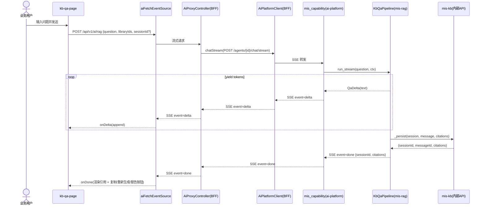
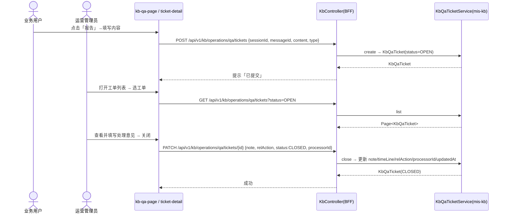
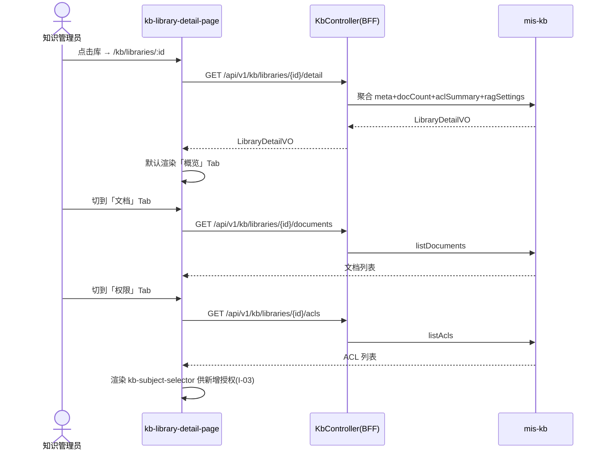
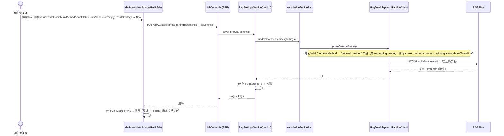
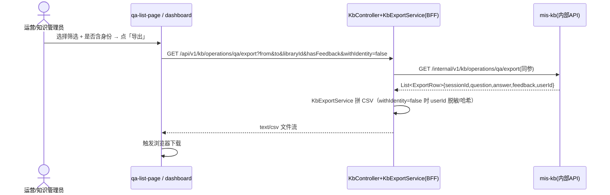

# MIS 知识库（mis-kb）P1/P2 增量架构设计 + 任务分解

> 版本：v1（增量设计） ｜ 日期：2026-08-03 ｜ 作者：软件架构师（高见远）
> 基线：P0 已交付 `docs/backend/mis-kb-system-design.md` ｜ 输入：`deliverables/software-company/kb-incremental-prd-2026-08-03.md`
> 设计原则：**复用 P0 技术栈与既有抽象（KnowledgeEnginePort / KbSubjectClient / ai-sse-client / Iam·Org WebClient），仅做最小扩展与缺陷修复**，不引入新服务、不新增重大依赖。

---

## 1. 实现方案与框架选型

### 1.1 技术难点与既有资产

| 难点 | 既有可复用资产（已读码核实） | 结论 |
|------|------------------------------|------|
| F-01 流式问答 | 前端 `ai-sse-client.ts`（`@microsoft/fetch-event-source`，已解析 delta/done/error）；BFF `AiPlatformClient.chatStream()` 返回 `Flux<ServerSentEvent>`；`ai-platform` `mis_capability.agent_chat_stream` 已是 SSE 端点 | **仅打通链路**：`/api/v1/ai/rag` 改为 SSE + `qa_pipeline.run` 改为生成器 yield |
| F-10→A-02c 工单 | `KbQaTicket` 为 P1 占位空表（仅 id/sessionId/type/status/content/handlerId/createdAt） | 平台无统一工单中心（全仓 grep 无 ticket 模块）→ **知识库自建轻量工单** |
| I-03 选人 | `IamWebClient.pageUsers/listEnabledRoles`、`OrgWebClient.deptTree/orgNames/employeeNames` 均存在且可复用 | **无需新对接 Org**，BFF 直接代理 |
| L-08 引擎同步 | `RagflowClient.updateDatasetSettings` 存在但 **X-03 缺陷**（retrievalMethod 误写入 `embedding_model`） | 修复 X-03 + 补 chunk_method/parser_config |
| F-04 定位原文 | `RfChunk` 仅返回 documentId/documentName/text/score，**无 offset/页码**（已 grep 确认） | **RAGFlow 不回传页码** → 采用子串定位兜底 + 预留 RAGFlow `page_num` 字段开关 |
| A-02a~e 运营 | `OperationsController` 仅有 sessions/feedback 两个内部端点；无 detail/stats/export/ticket | 扩展内部接口 + BFF 聚合 |

### 1.2 框架与库选型（沿用 P0，无新增重大依赖）

- **前端**：React 18 + TypeScript + Vite + shadcn/ui + Tailwind + Zustand + TanStack Query（沿用）。流式复用 `@microsoft/fetch-event-source`（已装）。
- **BFF**：Spring Boot 3.2.5 + WebFlux `WebClient`/`Flux<ServerSentEvent>`（已具备 SSE 能力）。无新依赖。
- **mis-kb（Java）**：Spring Boot 3.2.5 + JPA + PostgreSQL + Flyway（迁移集中在 `mis-migrator`）。无新依赖；CSV 导出用字符串拼接，不引 poi。
- **mis-rag（Python）**：FastAPI + `sse-starlette`/StreamingResponse（已具备 SSE）。`qa_pipeline` 改为 `async generator`。无新依赖。
- **门户 SQL**：`mis-migrator` 新增 V14 增量迁移（扩展既有表，不新建大表）。

### 1.3 架构模式

沿用 P0 分层：**前端 → BFF（聚合/鉴权）→ mis-kb（领域/落库）↔ mis-rag（编排/召回）↔ RAGFlow**。**编排责任下沉 mis-rag（决策 #3）**，流式 token 由 mis-rag 产出、会话/消息/引用落库由 mis-rag 调 mis-kb 内部 API 完成（沿用 P0 约定）。

---

## 2. 文件清单（相对路径 · 新增 / 修改 · 分层）

> 仓库根：`D:/code/mis-platform`。★=新增，✎=修改。

### 2.1 门户 SQL（mis-migrator）
- ✎ `backend/mis-migrator/src/main/resources/db/migration/V14__kb_incremental.sql` — 扩展 `kb_qa_ticket`/`kb_qa_citation`/`kb_acl`/`kb_rag_settings`（X-01 无关；含索引）。

### 2.2 Java 后端（mis-kb）
- ✎ `backend/mis-kb/.../domain/entity/KbQaTicket.java` — 补 note/timeLine/relAction/processorId/updatedAt。
- ✎ `backend/mis-kb/.../domain/entity/KbQaCitation.java` — 补 offset/page/source。
- ✎ `backend/mis-kb/.../domain/model/RagSettings.java` — 补 chunkMethod/chunkTokenNum/separator/emptyResultStrategy。
- ✎ `backend/mis-kb/.../domain/model/ChunkHit.java` — 补 offset/page。
- ✎ `backend/mis-kb/.../domain/model/SubjectType.java` — 枚举加 `DEPT`（I-03）。
- ✎ `backend/mis-kb/.../domain/model/AclAction.java` — 保持 read/manage/acl（X-02 以后端为准）。
- ✎ `backend/mis-kb/.../domain/model/EmptyResultStrategy.java` — ★新增枚举（L-08）。
- ✎ `backend/mis-kb/.../domain/model/SessionDetailVO.java` — 补 visibility/recallParams。
- ✎ `backend/mis-kb/.../domain/service/KbQaService.java` — `getSessionDetail` 补可见范围/召回参数。
- ★ `backend/mis-kb/.../domain/service/KbQaTicketService.java` — 工单创建/关闭（F-10/A-02c）。
- ✎ `backend/mis-kb/.../domain/service/RagSettingsService.java` — save→引擎同步（L-08，修复 X-03 后调用）。
- ✎ `backend/mis-kb/.../domain/service/KbVisibilityService.java` — 支持 DEPT 主体（I-03）。
- ✎ `backend/mis-kb/.../api/client/KbSubjectClient.java` — 扩展取用户 deptId（I-03）。
- ✎ `backend/mis-kb/.../engine/RagflowClient.java` — **修复 X-03**：retrievalMethod→`retrieval_method` 字段；补 `chunk_method`/`parser_config`。
- ✎ `backend/mis-kb/.../api/controller/OperationsController.java` — 扩展 detail/stats/tickets/export 内部端点（A-02a~e/F-10）。
- ★ `backend/mis-kb/.../api/controller/QaTicketController.java` — 工单内部 CRUD（如不与 OperationsController 合并）。
- ✎ `backend/mis-kb/.../domain/model/KbResultCode.java` — 新增 40924~40926。

### 2.3 BFF（mis-admin-bff）
- ✎ `backend/mis-admin-bff/.../controller/AiProxyController.java` — `rag` 改为 SSE（F-01）。
- ✎ `backend/mis-admin-bff/.../controller/AppController.java` — `ENTERABLE_CODES` 加 `"kb"`（I-01）。
- ✎ `backend/mis-admin-bff/.../controller/KbController.java` — 扩展 detail/tickets/qa-sessions(stats/export)/subjects。
- ★ `backend/mis-admin-bff/.../service/SubjectProxyService.java` — 代理 IAM/Org 选人（I-03）。
- ★ `backend/mis-admin-bff/.../service/KbDashboardService.java` — 看板聚合（A-02b/d）。
- ★ `backend/mis-admin-bff/.../service/KbExportService.java` — CSV 导出+脱敏（A-02e）。
- ✎ `backend/mis-admin-bff/.../client/IamWebClient.java` / `OrgWebClient.java` — 复用（不改动，SubjectProxyService 调用）。

### 2.4 Python（ai-platform / mis-rag）
- ✎ `agent/ai-platform/backend/src/agent/mis_rag/qa_pipeline.py` — `run` 改为 `async generator` yield `QaDelta`，done 时 `_persist`。
- ★ `agent/ai-platform/backend/src/agent/mis_rag/models.py`（或同文件）— `QaDelta` 数据类。
- ✎ `agent/ai-platform/backend/src/api/routes/mis_capability.py` — `agent_chat_stream` 接入 `_run_kb_qa` 流式分支（F-01）。

### 2.5 前端（mis-admin-web）
- ✎ `src/features/kb/types.ts` — **修复 X-01/X-02**（密级映射、AclAction/SubjectType 对齐后端）。
- ✎ `src/features/kb/api/kb-api.ts` — `askKbRag` 改 SSE；补 ticket/detail/stats/export/subjects API。
- ✎ `src/features/kb/qa/kb-qa-page.tsx` — SSE 流式 + 复制/重新生成/报告按钮（F-01/F-08/F-10）。
- ✎ `src/features/kb/components/kb-citation-list.tsx` — 抽屉展开 offset/页码/来源（F-04）。
- ★ `src/features/kb/components/kb-subject-selector.tsx` — 用户/角色/部门选择器（I-03）。
- ✎ `src/features/kb/permission/kb-permission-page.tsx` — 用 selector 替换手动 Input（I-03/X-02）。
- ★ `src/features/kb/library/kb-library-detail-page.tsx` — 库详情三 Tab（L-06/L-08）。
- ✎ `src/features/kb/library/kb-library-page.tsx` — 行点击进详情（L-06）。
- ★ `src/features/kb/operations/qa-list-page.tsx` — 问答列表+筛选（A-02b）。
- ★ `src/features/kb/operations/qa-detail-page.tsx` — 问答详情（A-02a）。
- ★ `src/features/kb/operations/ticket-list-page.tsx` — 工单列表（A-02c）。
- ★ `src/features/kb/operations/ticket-detail-page.tsx` — 工单处理/关闭（A-02c）。
- ★ `src/features/kb/operations/dashboard-page.tsx` — 评价看板（A-02b/d）。
- ✎ `src/features/kb/ai/ai-sse-client.ts` — 复用（不改动）。
- ✎ `src/lib/nav/kb-nav.ts` — 补 library-detail/operations 路由叶子（I-01/L-06/A-02）。
- ✎ `src/app/router.tsx` — `/kb/*` 已存在，补充子路由挂载。

---

## 3. 数据结构与接口

### 3.1 类图（关键新增/变更类）

```mermaid
classDiagram
    %% ===== 实体（mis-kb）=====
    class KbQaTicket {
        +Long id
        +Long sessionId
        +String type
        +String status  %% OPEN/CLOSED
        +String content
        +Long handlerId
        +LocalDateTime createdAt
        +String note
        +String timeLine
        +String relAction
        +Long processorId
        +LocalDateTime updatedAt
        +create(sessionId, content, type) Ticket
        +close(note, processorId, relAction) void
    }
    class KbQaCitation {
        +Long id
        +Long messageId
        +Long libraryId
        +Long documentId
        +String chunkText
        +Float score
        +Integer offset
        +Integer page
        +String source
    }
    class KbAcl {
        +Long id
        +Long libraryId
        +String subjectType  %% USER/ROLE/DEPT
        +Long subjectId
        +String action  %% READ/MANAGE/ACL
    }
    class KbLibrary {
        +Long id
        +String name
        +String secrecy
        +Integer status
    }

    %% ===== 模型/VO =====
    class RagSettings {
        +Integer topK
        +Float scoreThreshold
        +Boolean rerank
        +String embeddingModel
        +String retrievalMethod
        +String chunkMethod
        +Integer chunkTokenNum
        +String separator
        +String emptyResultStrategy  %% SUGGEST/EMPTY/TRANSFER
    }
    class ChunkHit {
        +Long libraryId
        +Long documentId
        +String chunkText
        +Float score
        +Integer offset
        +Integer page
    }
    class SessionDetailVO {
        +String sessionId
        +String question
        +String answer
        +List~Citation~ citations
        +Visibility visibility
        +RecallParams recallParams
    }
    class RecallParams {
        +Integer topK
        +Float scoreThreshold
        +String embeddingModel
        +String retrievalMethod
    }
    class Visibility {
        +String secrecy
        +List~AclSummary~ acls
    }
    class AclSummary {
        +String subjectType
        +Long subjectId
        +String subjectName
        +String action
    }

    %% ===== 枚举 =====
    class SubjectType {
        <<enum>>
        USER
        ROLE
        DEPT
    }
    class AclAction {
        <<enum>>
        READ
        MANAGE
        ACL
    }
    class EmptyResultStrategy {
        <<enum>>
        SUGGEST
        EMPTY
        TRANSFER
    }

    %% ===== 服务/端口 =====
    class KbQaService {
        +getSessionDetail(userId) SessionDetailVO
        +submitFeedback(...) Result
    }
    class KbQaTicketService {
        +create(CreateTicketCmd) KbQaTicket
        +close(ticketId, note, processorId, relAction) KbQaTicket
        +list(filter) List~KbQaTicket~
    }
    class RagSettingsService {
        +get(libraryId) RagSettings
        +save(libraryId, RagSettings) RagSettings
    }
    class KbVisibilityService {
        +resolveVisibleLibraryIds(userId, tenantId) List~Long~
    }
    class KbSubjectClient {
        +fetchUserRoleIds(userId) List~Long~
        +fetchUserDeptId(userId) Long
    }
    class KnowledgeEnginePort {
        <<interface>>
        +updateDatasetSettings(settings) void
        +query(question, ctx) List~ChunkHit~
    }
    class RagflowAdapter {
        +updateDatasetSettings(settings) void
    }
    class NoopAdapter
    class MockAdapter

    %% ===== BFF =====
    class AiProxyController {
        +rag(SseRequest) Flux~ServerSentEvent~
    }
    class KbController {
        +libraryDetail(id) LibraryDetailVO
        +qaSessions(filter) Page
        +qaSessionDetail(id) SessionDetailVO
        +createTicket(cmd) Ticket
        +closeTicket(id, cmd) Ticket
        +stats() DashboardVO
        +export(filter) CSV
        +searchSubjects(type, q) List
    }
    class SubjectProxyService {
        +searchUsers(q) List~IamUserVO~
        +searchRoles() List~IamRoleVO~
        +deptTree(orgId) List~DeptVO~
    }
    class IamWebClient {
        +pageUsers(...) PageResult~IamUserVO~
        +listEnabledRoles(...) List~IamRoleVO~
    }
    class OrgWebClient {
        +deptTree(orgId) List~DeptVO~
        +orgNames(ids) Map
    }

    %% ===== Python(mis-rag) =====
    class KbQaPipeline {
        +run_stream(question, ctx) *QaDelta
        -_persist(session, message, citations) void
    }
    class QaDelta {
        +String text
        +String event  %% delta/done/error
    }

    %% ===== 关系 =====
    KbQaTicket "1" --> "1" KbQaSession : sessionId
    KbQaCitation --> KbQaMessage : messageId
    KbAcl ..> SubjectType : subjectType
    KbAcl ..> AclAction : action
    RagSettingsService --> KnowledgeEnginePort
    RagflowAdapter ..|> KnowledgeEnginePort
    NoopAdapter ..|> KnowledgeEnginePort
    MockAdapter ..|> KnowledgeEnginePort
    RagflowAdapter ..> RagflowClient : HTTP(RAGFlow)
    KbVisibilityService --> KbSubjectClient
    KbVisibilityService --> KbAcl
    KbQaService --> KbQaCitation
    KbController --> SubjectProxyService
    SubjectProxyService --> IamWebClient
    SubjectProxyService --> OrgWebClient
    AiProxyController ..> KbQaPipeline : SSE via ai-platform
    KbQaPipeline ..> KbWebClient : _persist→mis-kb
```

### 3.2 API 端点清单（标注 新增 / 扩展）

#### mis-kb（Java，内部/外部）
| 方法+路径 | 功能 | 类型 | 请求 | 响应 |
|---|---|---|---|---|
| `GET /api/v1/kb/libraries/{id}/detail` | 库详情聚合（L-06） | 新增 | — | `LibraryDetailVO{meta,docCount,aclSummary,ragSettings}` |
| `GET /api/v1/kb/libraries/{id}/engine/settings` | RAG 设置读取（L-08） | 扩展 | — | `RagSettings`(+4 字段) |
| `PUT /api/v1/kb/libraries/{id}/engine/settings` | RAG 设置保存+同步（L-08/X-03） | 扩展 | `RagSettings` | `RagSettings` |
| `GET /internal/v1/kb/operations/qa/sessions` | 问答列表(筛选)（A-02b） | 扩展 | `from,to,libraryId,status,hasFeedback,page,size` | `Page<SessionListVO>` |
| `GET /internal/v1/kb/operations/qa/sessions/{id}` | 问答详情（A-02a） | 新增 | — | `SessionDetailVO`(+visibility/recallParams) |
| `POST /internal/v1/kb/operations/qa/tickets` | 建工单（F-10） | 新增 | `{sessionId,messageId,type,content}` | `KbQaTicket` |
| `GET /internal/v1/kb/operations/qa/tickets` | 工单列表（A-02c） | 新增 | `status,page,size` | `Page<KbQaTicket>` |
| `PATCH /internal/v1/kb/operations/qa/tickets/{id}` | 处理/关闭工单（A-02c） | 新增 | `{note,relAction,status:CLOSED,processorId}` | `KbQaTicket` |
| `GET /internal/v1/kb/operations/stats` | 看板统计（A-02b/d） | 新增 | `from,to` | `DashboardVO` |
| `GET /internal/v1/kb/operations/qa/export` | 导出查询（A-02e） | 新增 | `from,to,libraryId,hasFeedback,withIdentity` | `List<ExportRow>` |
| `POST /api/v1/kb/libraries/{id}/acls` | 授权（I-03） | 扩展 | `{subjectType:USER/ROLE/DEPT,subjectId,action}` | `KbAcl` |

#### BFF（mis-admin-bff）
| 方法+路径 | 功能 | 类型 | 说明 |
|---|---|---|---|
| `POST /api/v1/ai/rag` | 流式问答（F-01） | 扩展→SSE | 返回 `Flux<ServerSentEvent>`；请求 `AiRagRequest{question,libraryIds?,sessionId?,threshold?,topK?}` |
| `GET /api/v1/kb/libraries/{id}/detail` | 库详情（L-06） | 新增 | 代理 mis-kb detail |
| `GET/PUT /api/v1/kb/libraries/{id}/engine/settings` | RAG 设置（L-08） | 扩展 | — |
| `GET /api/v1/kb/operations/qa/sessions` | 问答列表（A-02b） | 扩展 | 透传筛选 |
| `GET /api/v1/kb/operations/qa/sessions/{id}` | 问答详情（A-02a） | 新增 | — |
| `POST /api/v1/kb/operations/qa/tickets` | 建工单（F-10） | 新增 | — |
| `GET /api/v1/kb/operations/qa/tickets` | 工单列表（A-02c） | 新增 | — |
| `PATCH /api/v1/kb/operations/qa/tickets/{id}` | 关闭工单（A-02c） | 新增 | — |
| `GET /api/v1/kb/operations/stats` | 看板（A-02b/d） | 新增 | `KbDashboardService` 聚合 |
| `GET /api/v1/kb/operations/qa/export` | 导出 CSV（A-02e） | 新增 | `text/csv`；脱敏 |
| `GET /api/v1/kb/subjects/search?type=user&q=` | 选人（I-03） | 新增 | 代理 `IamWebClient.pageUsers` |
| `GET /api/v1/kb/subjects/search?type=role` | 选角色（I-03） | 新增 | 代理 `IamWebClient.listEnabledRoles` |
| `GET /api/v1/kb/subjects/search?type=dept&orgId=` | 选部门（I-03） | 新增 | 代理 `OrgWebClient.deptTree` |
| `AppController.ENTERABLE_CODES` | 门户接入（I-01） | 修改 | 加 `"kb"`（无新端点） |

#### Python（ai-platform）
| 端点 | 功能 | 类型 |
|---|---|---|
| `POST /api/v1/agents/{agentId}/chat/stream` | KB QA 流式（F-01） | 扩展：接入 `KbQaPipeline.run_stream` |
| `KbQaPipeline.run_stream` | 生成器 yield `QaDelta` → done 时 `_persist` 经 mis-kb 内部 API | 修改 |

#### 前端路由（新增/挂载）
`/kb/libraries/:id`（L-06/L-08）｜`/kb/operations/qa`（A-02b）｜`/kb/operations/qa/:id`（A-02a）｜`/kb/operations/tickets`（A-02c）｜`/kb/operations/tickets/:id`（A-02c）｜`/kb/operations/dashboard`（A-02b/d）。`/kb/overview` 与 `/kb/*` 路由壳已存在。

---

## 4. 程序调用流（Mermaid 时序图）

> 共 5 条关键链，覆盖 F-01 / F-10→A-02c / L-06 / L-08(X-03) / A-02e。

### 4.1 F-01 流式问答（完整 SSE 链路）

### 4.2 F-10 → A-02c 报告问题 → 工单关闭

### 4.3 L-06 知识库详情 三 Tab 加载

### 4.4 L-08 RAG 设置保存 → 引擎同步（含 X-03 修复）

### 4.5 A-02e 运营问答记录导出（CSV + 脱敏）

---

## 5. 任务列表（有序 · 含依赖 · 标注层/功能号）

> 排序原则：先缺陷与基础（X-01/02/03 + 迁移）→ 数据模型 → 后端服务/接口 → BFF 聚合 → 前端。依赖任务完成后方可开工。

| ID | 任务 | 层 | 功能号 | 源文件（新增/修改） | 依赖 | 优先级 |
|---|---|---|---|---|---|---|
| T01 | 增量迁移脚本（扩展 ticket/citation/acl/rag_settings） | 门户SQL | X-01/02/03·基座 | V14__kb_incremental.sql ✎ | — | P0 |
| T02 | 前端类型与字典对齐（X-01 密级反转、X-02 actions/subjects 对齐后端） | 前端 | X-01/X-02 | types.ts ✎ | — | P0 |
| T03 | 修复 RagflowClient X-03（retrievalMethod 字段错位 + 补 chunk/parser） | Java | X-03 | RagflowClient.java ✎ | — | P0 |
| T04 | 实体与 DTO 扩展（citation offset/page/source、RagSettings +4 字段、SessionDetailVO 可见范围/召回参数、ChunkHit +2） | Java | F-04/L-08/A-02a | KbQaCitation✎ RagSettings✎ SessionDetailVO✎ ChunkHit✎ EmptyResultStrategy★ RecallParams★ Visibility★ AclSummary★ | T01 | P0/P1 |
| T05 | SubjectType 加 DEPT + 可见性评估与 KbSubjectClient 取用户 deptId（I-03 后端侧） | Java | I-03 | SubjectType✎ KbVisibilityService✎ KbSubjectClient✎ | T01 | P1 |
| T06 | mis-rag QA 管道流式化（run→async generator，done 时 _persist） | Python | F-01 | qa_pipeline.py ✎ QaDelta★ mis_capability.py ✎ | — | P0 |
| T07 | 工单与运营内部服务（KbQaTicketService 建/关、OperationsController 扩展 detail/stats/export/tickets） | Java | F-10/A-02a~e | KbQaTicketService★ OperationsController✎ QaTicketController★ KbResultCode✎ | T04 | P1 |
| T08 | RAG 设置服务（save→引擎同步，复用修复后的 RagflowClient） | Java | L-08 | RagSettingsService✎ | T03,T04 | P1 |
| T09 | BFF AI 流式问答接口（rag 改 SSE，复用 AiPlatformClient.chatStream） | BFF | F-01 | AiProxyController✎ | T06 | P0 |
| T10 | BFF 知识库详情聚合（/libraries/{id}/detail） | BFF | L-06 | KbController✎ | — | P1 |
| T11 | BFF 工单/运营接口（tickets 增删改查、qa sessions detail/list、stats、export） | BFF | F-10/A-02a~e | KbController✎ KbDashboardService★ KbExportService★ | T07 | P1 |
| T12 | BFF 权限主体查询代理（subjects/search 用户/角色/部门，复用 Iam/Org 客户端） | BFF | I-03 | KbController✎ SubjectProxyService★ | — | P1 |
| T13 | 门户接入 I-01（ENTERABLE_CODES 加 "kb"，sys_app 已 seeded） | BFF | I-01 | AppController✎ | — | P0 |
| T14 | 前端流式问答页改造（SSE 接入、复制/重新生成/报告按钮、kb-api 改 SSE） | 前端 | F-01/F-08/F-10 | kb-qa-page.tsx✎ kb-api.ts✎ | T09,T02 | P0 |
| T15 | 前端引用来源抽屉（offset/页码/来源展开） | 前端 | F-04 | kb-citation-list.tsx✎ | T04,T02 | P1 |
| T16 | 前端权限主体选择器（用户/角色/部门，替换手动 Input） | 前端 | I-03 | kb-subject-selector.tsx★ kb-permission-page.tsx✎ | T12,T02 | P1 |
| T17 | 前端知识库详情三 Tab（概览/文档/权限 + RAG 设置） | 前端 | L-06/L-08 | kb-library-detail-page.tsx★ kb-library-page.tsx✎ | T10,T08 | P1 |
| T18 | 前端运营中心（问答列表/详情/工单列表/工单处理/看板/导出） | 前端 | A-02a~e | qa-list-page★ qa-detail-page★ ticket-list-page★ ticket-detail-page★ dashboard-page★ kb-api.ts✎ | T11,T07 | P1 |
| T19 | 前端路由与导航挂载（kb-nav / router / keep-alive PAGE_MAP） | 前端 | I-01/L-06/A-02 | kb-nav.ts✎ router.tsx✎ keep-alive-outlet.tsx✎ | T17,T18 | P0/P1 |

> 说明：本增量按「层 × 功能」拆分任务（共 19 项），以满足可追溯性（每条带功能号与层）；若需压缩为 Bob 默认 ≤5 任务的粗粒度视图，可合并为：① 基础与缺陷(T01-03) ② 后端模型与服务(T04-08) ③ BFF 聚合(T09-13) ④ 前端页面(T14-17) ⑤ 运营前端与路由(T18-19)。

---

## 6. 依赖包清单（新增 / 复用）

| 包 | 层 | 用途 | 说明 |
|---|---|---|---|
| `@microsoft/fetch-event-source` | 前端 | SSE 流式（F-01） | **已装复用**，不改 |
| Spring WebFlux (`Flux<ServerSentEvent>`) | BFF/Java | SSE 响应 | **已具备**，不改 |
| `sse-starlette` / `StreamingResponse` | Python | SSE 流式 | **已具备**，不改 |
| `commons-csv` / `openpyxl` | — | 导出 | **不引入**；CSV 用字符串拼接，Excel 延后（见§7-Q5） |
| 无新增引擎/数据库驱动 | Java | — | 沿用 PostgreSQL/JPA/Flyway |

**结论：本轮增量无需引入重大新依赖**，所有能力均由 P0 既有栈承载；唯一可选新增为「Excel 导出（xlsx）」前端 `xlsx` 或后端 `poi`，按 §7-Q5 决策。

---

## 7. 共享知识（跨文件约定）

- **统一响应包装**：所有 BFF/mis-kb REST 用 `{code, data, message}`（`Result<T>`）；内部接口同构。
- **错误码（KbResultCode）**：沿用 `40920~40923`（反馈类）、`40410~40413`、`40310`；**新增**：
  - `40924 KB_TICKET_ALREADY_CLOSED` — 关闭已关闭工单。
  - `40925 KB_EXPORT_LIMIT_EXCEEDED` — 导出条数超阈值。
  - `40926 KB_SUBJECT_NOT_FOUND` — 主体（用户/角色/部门）解析失败。
  - 反馈重复码 `KB_FEEDBACK_ALREADY = 40923`（沿用，P0 已实现悲观锁）。
- **SSE 事件格式（F-01）**：事件名 `delta` / `done` / `error`，`data` 为 JSON：
  - `delta` → `{"text":"..."}`
  - `done` → `{"sessionId":..,"messageId":..,"citations":[..],"finishReason":"stop"}`
  - `error` → `{"code":..,"message":"..."}`
  - 前端 `ai-sse-client.ts` 已按此解析，BFF/ai-platform 须对齐事件名。
- **密级字典（X-01 修复后权威映射）**：`public=公开 / internal=内部 / secret=秘密 / confidential=机密`（以 V13 seed 为准，前端 types.ts 须与之一致）。
- **ACL 动作与主体（X-02 修复后）**：`AclAction = read|manage|acl`；`SubjectType = user|role|dept`（dept 为 I-03 新增）。前端 types.ts 须删除 `write/admin`，对齐后端。
- **落库责任（决策 #3）**：会话/消息/引用由 mis-rag 调 mis-kb 内部 API 落库；反馈由前端→BFF→mis-kb。流式**结束后一次性落库**（见 §7-Q1）。
- **空结果策略（L-08）**：`emptyResultStrategy ∈ {SUGGEST, EMPTY, TRANSFER}`，默认 `SUGGEST`（见 §7-Q6）。
- **脱敏（A-02e）**：导出默认不含用户身份（`userId` 哈希），`withIdentity=true` 才明文（见 §7-Q5）。
- **命名约定**：内部端点前缀 `/internal/v1/kb/operations/...`；BFF 对外 `/api/v1/kb/...`；主体查询 `/api/v1/kb/subjects/search?type=`。

---

## 8. PRD §7 开放问题：可行性判断 + 建议

| # | 问题 | 技术可行性 | 建议 / 决策 |
|---|---|---|---|
| 1 | 流式落库时机（结束一次性 vs 边流边落） | 高 | **推荐：结束后一次性落库**。与决策 #3 一致，`qa_pipeline.run_stream` yield 完毕后调 `_persist`（复用 P0 `_persist`）。边流边落引入并发/事务复杂度，本轮不做。 |
| 2 | A-02c 工单与平台工单中心关系 | 高（自建） | **推荐：知识库自建轻量工单**（扩展 `KbQaTicket`）。全仓 grep 无统一 ticket 模块，无平台工单中心可接入。**需用户拍板**：若后续平台规划统一工单中心，是否改接入（建议本期不阻塞，自建先行）。 |
| 3 | A-02e 金标评测口径 | 中（P2 重） | **本期 A-02e 落地为「运营问答/反馈记录导出（CSV）」**；**金标问题集+跑批评测为 P2 延后**（PRD §5 P2 行已单列）。指标/标注/跑批频率属 P2 产品决策。 |
| 4 | I-03 选人数据源 | 高（已具备） | **已核实可复用**：`IamWebClient.pageUsers/listEnabledRoles`、`OrgWebClient.deptTree/orgNames` 均存在。无需新对接 Org，BFF `SubjectProxyService` 直接代理。 |
| 5 | A-02d 导出脱敏与格式 | 高（CSV）/ 中（xlsx） | **推荐 P1：CSV 由 BFF `KbExportService` 生成、前端下载；默认脱敏（userId 哈希），`withIdentity` 控制明文**。是否走平台统一导出中心/审计、是否需 xlsx → **需用户拍板**（建议先 CSV，xlsx 作为 P2 增强，避免引入 poi/xlsx 依赖）。 |
| 6 | L-08 空结果策略默认行为 | 高 | **推荐默认 `SUGGEST`**：兜底文案「未检索到相关内容，可参考以下相关问题：…」，不转人工（转人工需接入客服系统，超出范围）。具体兜底文案 → **需用户拍板**（建议产品给模板）。 |
| 7 | L-08 改切片重解析 | 中 | **推荐异步 + 不锁库**：改 `chunk_method/parser_config` 后触发 RAGFlow 后台重解析（RAGFlow 支持在线更新）；前端用文档 `indexingStatus` 轮询展示「解析中」badge。**进度呈现（轮询 vs WebSocket）→ 需用户拍板**（建议轮询，零新增基建）。 |
| 8 | F-04 定位原文字段来源 | 中（有条件） | **已核实：RAGFlow 当前适配器不返回 offset/页码**（`RfChunk` 仅 documentId/documentName/text/score）。**推荐兜底方案**：后端/前端对 `chunkText` 在文档原文做子串定位，展示「命中片段」而非精确页码；同时预留 RAGFlow `page_num` 字段开关（若版本支持则直接取）。是否强制要求精确页码 → **需用户拍板**（建议先用子串定位，精确页码随 RAGFlow 升级启用）。 |

---

## 9. 落盘与交付

- 主文档：`D:\code\mis-platform\docs\backend\mis-kb-incremental-design-2026-08-03.md`（本文件）
- 独立 Mermaid（供渲染/工蜂预览）：
  - `D:\code\mis-platform\docs\backend\mis-kb-incremental-class.mermaid`（§3.1 类图）
  - `D:\code\mis-platform\docs\backend\mis-kb-incremental-seq.mermaid`（§4 五条时序图）
- 任务总数：**19 项**（详见 §5），含 3 缺陷修复（X-01/02/03）+ 13 功能（I-01/F-04/F-08/F-10/A-02a~e/L-06/L-08/I-03/F-01）。
- 依赖结论：**无重大新增依赖**，全量复用 P0 技术栈。
