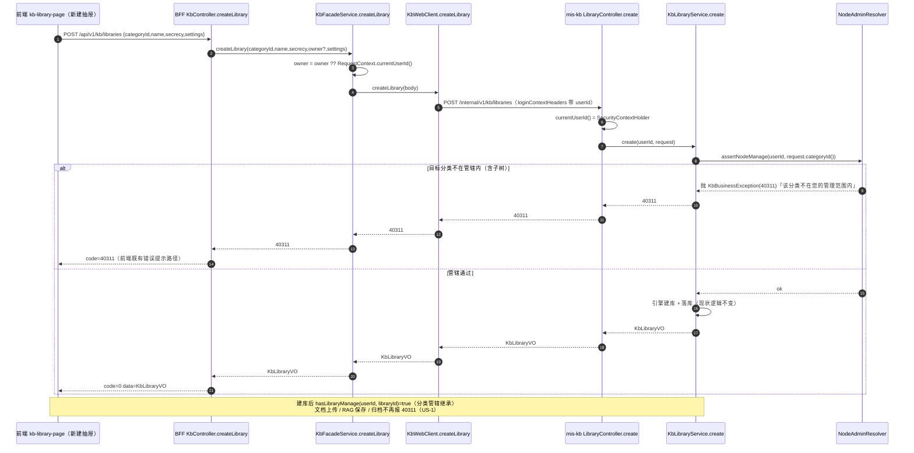
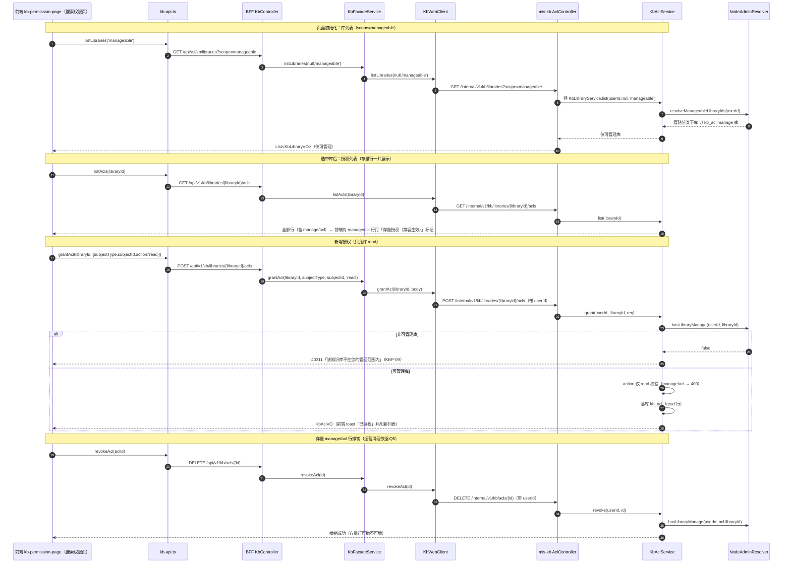
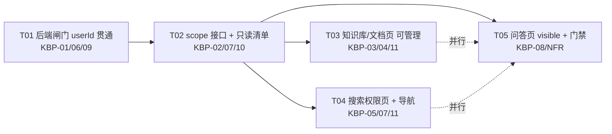

# MIS 平台知识库（KB）权限模型改造 —— 增量架构设计 + 任务分解

- **作者**：高见远（软件架构师）
- **日期**：2026-08-12
- **类型**：增量架构设计（评审报告 D 部分细化，不推翻评审结论）
- **上游权威输入**
  - 架构评审：`docs/analysis/kb-permission-redesign-review-2026-08-12.md`（现状梳理 A、风险 R1~R8、改动量 C.1~C.4、建议 D1~D7）
  - 增量 PRD：`deliverables/software-company/kb-permission-redesign-prd-2026-08-12.md`（需求池 KBP-01~11、UI 变更 §4、验收判据）
- **主理人已拍板决策（直接遵守）**
  - Q1/Q5：存量 manage/acl 零迁移「UI 收敛 + 后端兼容」——`AclAction` 枚举与 `kb_acl` 表不动；存量行 API 层兼容生效；UI 显示 +「存量授权（兼容生效）」标记、可撤销不可新增；KBP-10 只读清单本期落地。
  - Q2：`GET /kb/libraries?scope=manageable|visible` 单端点 + 参数；不带 scope 返回现状全量（兼容存量调用）。
  - Q3：KBP-09 `KbAclService.grant/revoke` 补 `hasLibraryManage` 管辖校验，**纳入本期 P0**。
  - Q4：KBP-08 问答页库选择器改 visible 口径本期做；命中测试面板 / 引擎孤儿面板不改（范围外）。
  - 本期范围 = KBP-01~11 全部（KBP-11 空态融入各页面任务）。
- **工程约束**：DB 零迁移（无 DDL）；检索 / 问答接口鉴权零改动（D7）；不 commit（改动保留工作树）；前端门禁 `npm run typecheck`（tsc --noEmit）；Java 侧 JDK17。

---

## 1. 实现方案

按「后端闸门 → 接口收敛 → 前端口径 → 收敛配套」四层展开，每项落到文件 + 方法级。

### 1.1 层一：后端闸门（userId 贯通 + 服务层数据范围校验）—— KBP-01 / KBP-09 / KBP-06

**目标**：把「分类管辖 → 库管理」的合成语义（`NodeAdminResolver.hasLibraryManage`）从「只用于文档写操作」扩展到「建库 / 改库 / 删库 / RAG 设置保存 / ACL 授权」全管理面，功能权限码只控入口，数据范围一律由 mis-kb 二次裁定（双闸门）。

**方法签名变化总表（mis-kb）**

| 文件 | 方法 | 现状签名 | 目标签名 | 校验逻辑 |
|---|---|---|---|---|
| `domain/service/KbLibraryService.java` | `create` | `KbLibraryVO create(KbLibraryCreateRequest req)` | `KbLibraryVO create(Long userId, KbLibraryCreateRequest req)` | 首行 `nodeAdminResolver.assertNodeManage(userId, req.categoryId())`（消除「非管辖分类下建库」根因） |
| 同 | `update` | `KbLibraryVO update(Long id, KbLibraryUpdateRequest req)` | `KbLibraryVO update(Long userId, Long id, KbLibraryUpdateRequest req)` | `require(id)` 后 `if (!hasLibraryManage(userId, id)) throw 40311` |
| 同 | `delete` | `KbLibraryDeleteResultVO delete(Long id, LibraryDeleteMode mode)` | `KbLibraryDeleteResultVO delete(Long userId, Long id, LibraryDeleteMode mode)` | 同上（归档 / 物理删共用一道闸） |
| 同 | `list` | `List<KbLibraryVO> list(Long categoryId)` | `List<KbLibraryVO> list(Long userId, Long categoryId, String scope)` | scope 数据面收敛，见 §1.2 |
| `domain/service/RagSettingsService.java` | `save` | `RagSettings save(Long libraryId, RagSettings settings)` | `RagSettings save(Long userId, Long libraryId, RagSettings settings)` | `require(libraryId)` 后 `if (!hasLibraryManage(userId, libraryId)) throw 40311` |
| `domain/service/KbAclService.java` | `grant` | `KbAclVO grant(Long libraryId, KbAclCreateRequest req)` | `KbAclVO grant(Long userId, Long libraryId, KbAclCreateRequest req)` | ① `hasLibraryManage(userId, libraryId)` 否则 40311；② 仅允许 `action=read`，否则 400（见 §2.3） |
| 同 | `revoke` | `void revoke(Long id)` | `void revoke(Long userId, Long id)` | 先取行 `acl.libraryId`，再 `hasLibraryManage(userId, acl.getLibraryId())` 否则 40311 |
| 同（新增） | `listLegacyInventory` | — | `List<LegacyAclInventoryVO> listLegacyInventory(Long userId, Long libraryId, String subjectType, Long subjectId)` | KBP-10；前置 `isGlobalAdmin(userId)` 否则 40311（运营工具全局视角，见 §2.2） |

**Controller 贯通（userId 一律取 `SecurityContextHolder`，已有先例 `LibraryController.currentUserId()` L228-230）**

| 文件 | 改动 |
|---|---|
| `api/controller/LibraryController.java` | `create/update/delete` 传入 `currentUserId()`；`list` 增加 `@RequestParam(required=false) String scope` 并传 userId；`updateEngineSettings` 传 userId（`ragSettingsService.save(currentUserId(), id, settings)`）；`buildGraph/buildRaptor` 现状已传，不动 |
| `api/controller/AclController.java` | `grant/revoke` 传 `currentUserId()`；新增 `GET /internal/v1/kb/acls/inventory` 只读清单端点（或放新 `LegacyAclController`，见 §6 待明确默认值） |

> 设计说明：Service 方法显式加 `Long userId` 参数而非依赖线程上下文——单测可注入任意用户，可测性优先；Controller 层统一从 `SecurityContextHolder` 取（与 `KbGraphService.build(id, userId)` 现有风格一致）。

**固化继承语义（KBP-06）**：不改 `NodeAdminResolver` 任何判定逻辑；`hasNodeManage`（祖先链 + 全局管理员短路 + user∪role∪dept 并集）与 `resolveManageableCategoryIds`（授权节点子树并集）原样保留。新增 `resolveManageableLibraryIds(Long userId)` 作为「可管理库 id 集合」的唯一出口（供 scope=manageable 使用），合成口径与 `hasLibraryManage` 完全一致：

```
resolveManageableLibraryIds(userId) =
    { lib | lib.categoryId ∈ resolveManageableCategoryIds(userId) }
    ∪ { lib | kb_acl 存在 (user|role|dept, lib, manage) 授权 }
```

> 铁律（评审 §B.2 R5 / NodeAdminResolver 类级 Javadoc）：管理判定只允许走 `NodeAdminResolver`，禁止在 Service/Controller 内联祖先链或直接查 `kb_category_admin`。

### 1.2 层二：接口收敛（scope 单端点 + KBP-10 只读清单）—— KBP-02 / KBP-07 / KBP-10

**`GET /api/v1/kb/libraries?scope=manageable|visible`（BFF，前端唯一入口）**

- BFF `controller/KbController.java`：`listLibraries` 增加 `@RequestParam(required=false) String scope`，透传 `KbFacadeService.listLibraries(categoryId, scope)`。
- BFF `service/KbFacadeService.java`：`listLibraries(Long categoryId, String scope)` 透传。
- BFF `client/KbWebClient.java`：`listLibraries(Long categoryId, String scope)` → uri 追加 `scope` 参数（`queryUri` 现有工具）。
- mis-kb `api/controller/LibraryController.java` + `domain/service/KbLibraryService.java`：见 §1.1 签名表。

scope 语义（两端字面量统一，缺省 = 现状全量兼容）：
- 不带 scope / 空串 / 非法值 → **现状行为**（`categoryId != null ? findByCategoryIdOrderByNameAsc : findAll`），零回归。
- `scope=manageable` → `list(userId, categoryId, "manageable")`：取 `nodeAdminResolver.resolveManageableLibraryIds(userId)` 与全量库的交集（categoryId 可选再收敛）；`userId == null` 一律返回空集（安全侧收紧）。
- `scope=visible` → `list(userId, categoryId, "visible")`：取 `visibilityService.resolveVisibleLibraryIds(userId, tenantId)` 交集（口径与 `KbVisibilityService` 一致：public∧enabled ∪ ACL read − disabled）；`userId == null` 只返回公开库（沿用 `resolveVisibleLibraryIds` 现有语义）。

**响应结构兼容性结论**：**保持 `Result<List<KbLibraryVO>>` 不变，本期不加分页**。理由：① 现有前端 `listLibraries()` 与组合框直接消费 `List`，加分页会破坏全部调用点；② 知识库规模为百级，现状即一次性加载；③ 若未来需要分页，作为独立演进另行设计，不在本 PRD 范围（列 §6 待明确默认值，主理人可覆写）。

**KBP-10 只读清单端点（运营清理依据，只读不清理）**

- BFF 端点（建议默认）：`GET /api/v1/kb/acls/inventory?libraryId=&subjectType=&subjectId=&action=`
  - `action` 可选 `manage|acl`（缺省返回两者）；`libraryId` 按库维度过滤；`subjectType` + `subjectId` 按主体维度过滤；均缺省 = 全量存量 manage/acl 行。
  - 返回 `Result<List<LegacyAclInventoryVO>>`，VO 字段：`id, libraryId, libraryName, categoryId, subjectType, subjectId, subjectName, action, createdAt, updatedAt`。`subjectName` 由 BFF 用 `KbSubjectProxyService` 回填（mis-kb 侧为 null，与 `KbLibraryDetailVO.aclSummary` 现有回填口径一致）。
- mis-kb 内部端点（默认）：`GET /internal/v1/kb/acls/inventory`（挂 `AclController`），由 `KbAclService.listLegacyInventory(userId, libraryId, subjectType, subjectId)` 实现：`aclRepository` 按 `action IN (manage,acl)` + 可选条件查询，关联 `KbLibraryRepository` 取 `libraryName/categoryId`。
- 权限：BFF 兜底 `requirePermission("kb:acl:revoke")`（复用既有权限码，不新增——PRD §6.5）；mis-kb 侧前置 `nodeAdminResolver.isGlobalAdmin(userId)`，**非全局管理员 403**（清单是跨库全局视角，若按管辖过滤会让运营看不全；普通分类管理员不应看到全平台授权数据）。

### 1.3 层三：前端口径（可管理 vs 可见）—— KBP-03 / KBP-04 / KBP-08 / KBP-11

**双口径总则（评审 R3 / PRD D3）**：管理界面一律「可管理」（`scope=manageable`），问答 / 检索场景一律「可见」（`scope=visible`）。前端不在本地拉全量再过滤，一律走 scope 接口（数据面收敛优先，D4）。

| 页面 | 组件 / 位置 | 口径 | 改动 |
|---|---|---|---|
| 知识库管理页 | `library/kb-library-page.tsx` | 可管理 | 分类树与「新增知识库」分类下拉按管辖过滤（子树）；新增「全部 / 仅管辖」开关（复用分类管理页 `onlyManageable` 先例）；空态 |
| 文档管理页 | `document/kb-document-page.tsx` | 可管理 | 组合框传 `scope=manageable`；空态 |
| 搜索权限页 | `permission/kb-permission-page.tsx` | 可管理 | 组合框传 `scope=manageable`；action 只 read；存量行标记；文案 |
| 问答页 | `qa/kb-qa-page.tsx` | 可见 | 组合框传 `scope=visible`；文案「此处列出您可见的知识库」 |

**共用组件改造 `components/kb-library-combobox.tsx`**
- Props 新增：`scope?: KbLibraryScope`（`'manageable' | 'visible'`，缺省 undefined = 现状全量）。
- `load()` 内 `listLibraries(categoryId, scope)`（L116-119）；`categoryId` 与 `scope` 都进 `useCallback` 依赖（现 L144 只有 `categoryId`）。
- 空态文案按 scope 区分：`manageable` →「您暂无管理的知识库，请联系管理员」；`visible` →「暂无可见知识库」；缺省 → 现状文案「还没有知识库，请先到『知识库』页创建」。
- 保留同名 / 分类路径强提示逻辑（R8 不回归）。

**知识库管理页（KBP-03 / KBP-11）**
- 新增状态 `onlyManageable`（默认 true）；分类树渲染用 `flattenCategoryTree(manageableCategories, expanded)`（管辖子树），关闭开关时回落全量 `categories`。
- 「新增知识库」抽屉「所属分类」下拉（L662-666）改为只列管辖分类（`manageableCategories`，含子树——即 `resolveManageableCategoryIds` 语义的前端映射）。
- 空态：`categories` 非空但 `manageableCategories` 为空（或库列表为空）时显示「您暂无管辖的分类 / 知识库，请联系管理员」；页面顶部 / 空态旁文案「此处仅列出您可管理的知识库」。
- 管辖分类数据来源：复用现有 `listManageableCategoryIds()`（BFF `/kb/categories/manageable-ids`，已存在）+ `listCategories()` 本地求子树并集；**管理页库列表继续用 `listLibraries(categoryId)`（scope 缺省）还是 `scope=manageable`？**——结论：库列表用 `scope=manageable`（与右侧行级操作口径一致，后端兜底）；分类树仍走 `manageable-ids`（树形渲染需要子树结构，无法由扁平的库列表推导）。

### 1.4 层四：收敛配套（权限页改名 + 存量行展示 + 导航）—— KBP-05 / KBP-07 / KBP-11

**搜索权限页 `permission/kb-permission-page.tsx`**
- 标题：`PageHeader title="知识库权限"` → `"搜索权限"`，description 更新为「按用户 / 角色 / 部门授予只读（read）权限，控制谁能搜索到该库数据」；面包屑 `title: '权限'` → `'搜索权限'`。
- 授权动作：新增授权抽屉的 `<select>`（L365-375）改为只渲染 read 项——`KB_ACL_ACTION_OPTIONS.filter((o) => o.value === 'read')`（结论见 §5）；抽屉说明文案（L376-378）更新为「只读用于控制知识搜索数据范围；管理权限随分类管辖自动获得」。
- 库列表：`KbLibraryCombobox` 传 `scope="manageable"`；`activePath` 不变。
- 可见性规则 Alert（L191-197）保留并补充「管理权限随分类管辖自动获得」。
- 存量行展示（Q5）：`listAcls(libraryId)` 返回全部行（含 manage/acl，后端不动）；行渲染时 `action === 'manage' || action === 'acl'` 追加 `<Badge>存量授权（兼容生效）</Badge>`；该行可撤销（`PermissionGate permission="kb:acl:revoke"` 现状已允许），但**无新增入口**（新增抽屉只有 read）。
- 空态（KBP-11）：无可管理库时组合框空态文案 + 表格「请先选择知识库」保留。

**导航 / 标题（KBP-05）**
- `lib/nav/kb-nav.ts` L19：`title: '权限'` → `'搜索权限'`。
- `keep-alive-outlet.tsx` PAGE_MAP：若包含 `/kb/permissions` 的展示标题，同步改为「搜索权限」。
- 迁移 SQL `sys_menu` seed：**本期不改**（DB 零迁移约束 + 菜单标题多由系统菜单管理维护），差异列为 §6 待明确；前端静态清单先行，保证侧栏「点得进去、有标题」。

**前端 API 层 `api/kb-api.ts`**
- `listLibraries(categoryId?, scope?)`：params 增加 `scope`（`cleanParams` 剔除空值，缺省不发 = 兼容现状）。
- 新增 `listLegacyAclInventory(query)` → `GET /kb/acls/inventory`。
- `types.ts`：新增 `export type KbLibraryScope = 'manageable' | 'visible'`；`LegacyAclInventory` 类型 + `KB_ACL_ACTION_OPTIONS` 保留三值（见 §5 结论）。

---

## 2. 接口契约

### 2.1 `GET /api/v1/kb/libraries?scope=manageable|visible`（新增参数，单端点收敛）

**请求**

```
GET /api/v1/kb/libraries?scope=manageable
GET /api/v1/kb/libraries?scope=visible&categoryId=101
GET /api/v1/kb/libraries          ← 兼容存量：不带 scope，返回现状全量
```

参数说明：`scope` 可选 `manageable` / `visible`；`categoryId` 可选（与 scope 可叠加，交集收敛）；其余参数不变。

**响应**（结构保持 `Result<List<KbLibraryVO>>` 不变，仅 data 内容按口径收敛）

```json
{
  "code": 0,
  "message": "ok",
  "data": [
    {
      "id": 9001,
      "categoryId": 101,
      "name": "财务制度库",
      "secrecy": "internal",
      "status": 1,
      "owner": 1001,
      "engineType": "RAGFLOW",
      "settings": { "topK": 5, "scoreThreshold": 0.2, "retrievalMethod": "hybrid" },
      "docCount": 128,
      "createdAt": "2026-08-01T10:00:00Z",
      "updatedAt": "2026-08-12T08:30:00Z",
      "engineSyncStatus": 1,
      "engineCheckedAt": "2026-08-12T08:30:00Z",
      "archivedAt": null,
      "engineSyncFailed": null,
      "engineSyncMessage": null
    }
  ]
}
```

**边界语义**
- `scope=manageable` 且 userId 缺失（理论上 BFF 恒有登录上下文）→ 空数组（安全侧收紧）。
- `scope=visible`：口径 = `resolveVisibleLibraryIds`（public∧enabled ∪ ACL read − disabled），与检索可见性**完全一致**（前端问答页选库所见即检索所得，消除「选得到但搜不到」）。
- 非法 scope 值（如 `scope=all`）→ 按「不带 scope」处理（兼容优先，不报错）。**待明确默认值**：也可改为 400 拒绝，主理人可覆写；本期默认宽容兼容。

### 2.2 `GET /api/v1/kb/acls/inventory`（KBP-10，新增只读清单）

**请求**

```
GET /api/v1/kb/acls/inventory                          ← 全量存量 manage/acl 行（全局管理员）
GET /api/v1/kb/acls/inventory?libraryId=9001           ← 按库维度
GET /api/v1/kb/acls/inventory?subjectType=role&subjectId=2001   ← 按主体维度
GET /api/v1/kb/acls/inventory?action=manage            ← 只看 manage（缺省 manage+acl）
```

**响应**

```json
{
  "code": 0,
  "message": "ok",
  "data": [
    {
      "id": 70001,
      "libraryId": 9001,
      "libraryName": "财务制度库",
      "categoryId": 101,
      "subjectType": "role",
      "subjectId": 2001,
      "subjectName": "财务专员",
      "action": "manage",
      "createdAt": "2026-05-03T09:00:00Z",
      "updatedAt": "2026-05-03T09:00:00Z"
    }
  ]
}
```

**校验**：BFF 兜底 `kb:acl:revoke` 权限码；mis-kb 侧 `isGlobalAdmin(userId)` 否则 403（`KB_CATEGORY_NOT_MANAGEABLE` 40311，message 场景化「该操作仅限全局管理员」——见 §2.3 语义）。数据源 = `kb_acl` 表 `action IN ('manage','acl')`，与授权接口同一事实源，运营核对零偏差（PRD KBP-10 判据②）。

### 2.3 grant / revoke 403 语义结论

**结论：复用 40311（`KB_CATEGORY_NOT_MANAGEABLE`），不新增业务码。**

- 理由：① 4031x 段即「权限不足」，40311 现有 message「该节点不在您的管理范围内」，库级场景通过 `KbBusinessException(code, message)` 覆盖为「该知识库不在您的管理范围内」即可（`KbBusinessException` 支持带 message 构造，见 `KbLibraryService` L348-350 先例）；② 前端对 40311 已有错误提示映射（知识库页 40311 路径为回归重点），复用零前端改动；③ 新增业务码需要同步 BFF 错误映射、前端提示、文档三处，收益为零。
- 详细语义：
  - `create`（目标分类非管辖）→ 40311「该分类不在您的管理范围内」。
  - `update/delete/RagSettings.save`（非 `hasLibraryManage`）→ 40311「该知识库不在您的管理范围内」。
  - `KbAclService.grant/revoke`（非 `hasLibraryManage`）→ 40311「该知识库不在您的管理范围内」（KBP-09）。
  - `grant` 提交非 read 动作（绕过前端直连 API）→ **400 `VALIDATION_ERROR`**「本期仅支持授予只读（read）权限」。理由：这不是数据范围问题，而是「该操作被禁用」，用 4xx 校验错误更贴切；正常前端不会触发（下拉已过滤）。
  - KBP-10 非全局管理员 → 40311（message 场景化）。

---

## 3. 数据流

### 3.1 建库时序（userId 贯通，KBP-01）



### 3.2 搜索权限页授权 read 时序（含存量 manage/acl 行展示来源）



---

## 4. 任务列表（按依赖顺序，T01 → T05）

> 硬约束：≤5 任务；每任务 ≥3 文件；T01 = 基础设施（本任务语境 = 后端闸门基础设施，即 userId 贯通 + 校验骨架）。

### T01 后端闸门：userId 贯通 + 服务层数据范围校验（KBP-01 / KBP-06 / KBP-09 的 grant/revoke 部分）

- **涉及文件**
  - `backend/mis-kb/src/main/java/com/mis/kb/domain/service/KbLibraryService.java`（create/update/delete 加 userId + 校验）
  - `backend/mis-kb/src/main/java/com/mis/kb/domain/service/RagSettingsService.java`（save 加 userId + 校验）
  - `backend/mis-kb/src/main/java/com/mis/kb/domain/service/KbAclService.java`（grant/revoke 加 userId + hasLibraryManage + grant 仅 read）
  - `backend/mis-kb/src/main/java/com/mis/kb/api/controller/LibraryController.java`（create/update/delete/updateEngineSettings 传 currentUserId()）
  - `backend/mis-kb/src/main/java/com/mis/kb/api/controller/AclController.java`（grant/revoke 传 currentUserId()）
  - `backend/mis-kb/src/main/java/com/mis/kb/domain/service/NodeAdminResolver.java`（仅新增 `resolveManageableLibraryIds`，不改判定逻辑）
  - `backend/mis-kb/src/test/java/com/mis/kb/domain/service/KbLibraryServiceTest.java`、`RagSettingsServiceTest.java`、`KbAclServiceTest.java`（正反分支）
- **依赖**：无（首个任务）
- **优先级**：P0
- **验收判据**（对齐 PRD KBP-01/KBP-06/KBP-09）
  - ① 持有 `kb:library:add` 但目标分类不在管辖内的用户直连 API 建库 → 40311；② 非 `hasLibraryManage` 用户直连 update/delete/RAG save → 40311；③ 非可管理库 grant/revoke → 40311；grant action=manage/acl → 400；④ 分类管理员对自管库建/改/删/RAG 设置全部放行（回归零差异）；⑤ 单测覆盖：`resolveManageableCategoryIds` 子树并集、user∪role∪dept 并集、全局管理员短路三分支零差异（KBP-06）；⑥ 编译通过（JDK17）。

### T02 scope 接口 + KBP-10 只读清单（KBP-02 / KBP-07 / KBP-10）

- **涉及文件**
  - `backend/mis-kb/src/main/java/com/mis/kb/domain/service/KbLibraryService.java`（list 加 scope 分支）
  - `backend/mis-kb/src/main/java/com/mis/kb/api/controller/LibraryController.java`（list 加 scope 参数）
  - `backend/mis-kb/src/main/java/com/mis/kb/api/dto/LegacyAclInventoryVO.java`（新增 DTO）
  - `backend/mis-kb/src/main/java/com/mis/kb/domain/service/KbAclService.java`（listLegacyInventory）
  - `backend/mis-kb/src/main/java/com/mis/kb/api/controller/AclController.java`（/inventory 端点）
  - `backend/mis-admin-bff/src/main/java/com/mis/adminbff/controller/KbController.java`（listLibraries 加 scope；/kb/acls/inventory）
  - `backend/mis-admin-bff/src/main/java/com/mis/adminbff/service/KbFacadeService.java`（透传 scope + listLegacyAclInventory + subjectName 回填）
  - `backend/mis-admin-bff/src/main/java/com/mis/adminbff/client/KbWebClient.java`（scope 参数 + inventory 调用）
  - `backend/mis-admin-bff/src/main/java/com/mis/adminbff/dto/kb/LegacyAclInventoryVO.java`（新增 BFF DTO）
  - 单测：mis-kb `KbLibraryServiceTest` scope 分支、`KbAclServiceTest` inventory；BFF 透传测试
- **依赖**：T01（hasLibraryManage / resolveManageableLibraryIds 已就绪）
- **优先级**：P0（scope）/ P1（inventory，KBP-10）
- **验收判据**（对齐 PRD KBP-02/KBP-07/KBP-10）
  - ① `scope=manageable` 只返回 `hasLibraryManage` 的库；② `scope=visible` 返回 `resolveVisibleLibraryIds` 口径（public∧enabled ∪ ACL read − disabled）；③ 不带 scope 返回现状全量（兼容存量调用）；④ `/kb/acls/inventory` 可按库/主体/action 过滤，数据与 `kb_acl` 表一致，非全局管理员 403；⑤ 检索 / 问答接口鉴权零改动（回归确认）。

### T03 前端：知识库管理页 + 文档页「可管理」口径（KBP-03 / KBP-04 / KBP-11）

- **涉及文件**
  - `frontend/mis-admin-web/src/features/kb/api/kb-api.ts`（listLibraries 加 scope）
  - `frontend/mis-admin-web/src/features/kb/types.ts`（`KbLibraryScope` 类型）
  - `frontend/mis-admin-web/src/features/kb/components/kb-library-combobox.tsx`（scope prop + 空态分流）
  - `frontend/mis-admin-web/src/features/kb/library/kb-library-page.tsx`（分类树/下拉按管辖 + 「全部 / 仅管辖」开关 + 空态 + 库列表 scope=manageable）
  - `frontend/mis-admin-web/src/features/kb/document/kb-document-page.tsx`（scope=manageable + 空态）
- **依赖**：T02（scope 接口）
- **优先级**：P0
- **验收判据**（对齐 PRD KBP-03/KBP-04/KBP-11）
  - ① 分类下拉只列管辖分类（子树），非管辖不出现不可选；② 「全部 / 仅管辖」开关生效且与后端 scope 口径一致；③ 非管理员进页面看到空态文案而非空白；④ 文档页组合框只显示可管理库，无可管理库时空态；⑤ 保留 `KbLibraryCombobox` 同名 / 分类路径强提示（R8 不回归）；⑥ 选中库后文档操作全程不出现「无管理权限」误报。

### T04 前端：搜索权限页 + 导航收敛（KBP-05 / KBP-07 / KBP-11）

- **涉及文件**
  - `frontend/mis-admin-web/src/features/kb/permission/kb-permission-page.tsx`（标题/面包屑/action 只 read/库列表 scope=manageable/存量行标记/文案）
  - `frontend/mis-admin-web/src/lib/nav/kb-nav.ts`（L19 title「搜索权限」）
  - `frontend/mis-admin-web/src/components/common/keep-alive-outlet.tsx`（PAGE_MAP 标题同步，若含）
  - `frontend/mis-admin-web/src/features/kb/types.ts`（`KB_ACL_ACTION_OPTIONS` 保留 + 只读过滤结论注释，见 §5）
  - `frontend/mis-admin-web/src/features/kb/api/kb-api.ts`（grantAcl 注释更新；可选 listLegacyAclInventory）
- **依赖**：T02（scope=manageable）
- **优先级**：P0
- **验收判据**（对齐 PRD KBP-05/KBP-07）
  - ① 导航标题（kb-nav L19）、页面标题、面包屑均为「搜索权限」；② 授权动作下拉只出现 read；③ 库列表 = 可管理的库（scope=manageable）；④ 说明文案写明「只读用于控制知识搜索数据范围；管理权限随分类管辖自动获得」，删除与 manage/acl 新语义冲突的描述；⑤ 存量 manage/acl 行展示 +「存量授权（兼容生效）」标记 + 可撤销不可新增；⑥ 无 DDL 迁移；存量行在 API 层仍生效（`hasLibraryManage` 仍为 true，回归确认）。

### T05 前端：问答页 visible + 全量门禁（KBP-08 / KBP-02 前端侧 / NFR-2 / NFR-4）

- **涉及文件**
  - `frontend/mis-admin-web/src/features/kb/qa/kb-qa-page.tsx`（组合框 scope=visible + 文案「此处列出您可见的知识库」）
  - `frontend/mis-admin-web/src/features/kb/components/kb-library-combobox.tsx`（visible 空态文案微调）
  - 全量门禁：`frontend/mis-admin-web` 执行 `npm run typecheck`（strict + noUnusedLocals + noUnusedParameters 0 错误）
  - 回归确认（无代码改动）：检索 / 问答 / 命中测试接口鉴权行为与改造前完全一致（只认 read，不看 manage/acl）
- **依赖**：T02（scope=visible）；建议在 T03/T04 之后收尾（typecheck 需全量前端就绪）
- **优先级**：P1
- **验收判据**（对齐 PRD KBP-08 / NFR-2 / NFR-4）
  - ① 问答页组合框只显示可见库（scope=visible）；② 页面文案标注「此处列出您可见的知识库」；③ 检索 / 问答接口鉴权代码零改动（回归确认）；④ `npm run typecheck` 0 错误；⑤ 命中测试 / 引擎孤儿面板组合框保持现状（范围外确认）。

### 任务依赖图



---

## 5. 共享知识（跨文件约定）

1. **scope 枚举值**：`manageable` / `visible` 字面量在 mis-kb、BFF、前端三端统一；缺省 / 空 / 非法 = 现状全量（兼容优先）。前端类型 `KbLibraryScope = 'manageable' | 'visible'`；BFF 不校验非法值（宽容兼容，见 §6 待明确）。
2. **403 业务码语义**：库级管理越权统一复用 **40311**（`KB_CATEGORY_NOT_MANAGEABLE`），message 按场景覆盖（「该分类/该知识库不在您的管理范围内」）；ACL grant 非 read 动作用 **400 VALIDATION_ERROR**；KBP-10 非全局管理员用 40311（message 场景化）。**本期不新增任何业务码**。
3. **前端口径标注**：管理页（知识库 / 文档 / 搜索权限）一律「可管理」（`scope=manageable`），页面文案写明「此处仅列出您可管理的知识库」；问答页「可见」（`scope=visible`），文案「此处列出您可见的知识库」。**禁止混用**（评审 R3 悖论：权限页绝不能列「只读得到但管不了」的库）。
4. **`KB_ACL_ACTION_OPTIONS` 处理结论：保留常量三值 + 页面过滤，不裁剪常量。** 理由：`aclActionLabel`（types.ts L1319）与存量行展示依赖 `manage/acl` 的 label 映射（Q5「存量行仍展示」），裁剪常量会破坏存量展示；新增授权下拉用 `KB_ACL_ACTION_OPTIONS.filter((o) => o.value === 'read')` 即可满足「只出现 read」。在常量旁加注释说明口径，防止后人误裁剪。
5. **userId 贯通方式**：Controller 从 `SecurityContextHolder` 取 `currentUserId()`（已有先例），Service 方法签名显式加 `Long userId`（可测性）；BFF→mis-kb 走 `loginContextHeaders()` 现有登录上下文透传，无需改鉴权链路。
6. **检索 / 问答零改动红线（D7）**：`KbRetrieveService`、`KbVisibilityService`、`KbHitTestService` 逻辑**一律不动**；本期所有「可见」语义均复用 `resolveVisibleLibraryIds` 现有口径。
7. **DB 零迁移（D2）**：`AclAction` 枚举、`kb_acl` 表、`kb_category_admin` 表全部不动；不新增迁移脚本；KBP-10 只读清单用既有表查询实现。
8. **双闸门原则（评审 B.3）**：功能权限码（`kb:library:*` / `kb:acl:*` 等）只控入口；数据范围一律 mis-kb 服务层二次裁定。前端 `PermissionGate` 只做 UI 层门控，不替代后端校验。
9. **API 响应统一 `{code, data, message}`**（`Result<T>`）；错误经 BFF 透传 mis-kb 业务码（40311 等），前端 `unwrap` 抛 message。
10. **空态文案统一**：知识库页「您暂无管辖的分类 / 知识库，请联系管理员」；文档页「您暂无管理的知识库，请联系管理员」；搜索权限页复用组合框 manageable 空态；问答页「暂无可见知识库」。

---

## 6. 待明确事项

| # | 事项 | 建议默认值（主理人可覆写） |
|---|---|---|
| W1 | KBP-10 只读清单端点归属与权限模型 | 默认：BFF `GET /api/v1/kb/acls/inventory`（挂 `KbController` 运营区），mis-kb 内部端点挂 `AclController`；权限 = BFF 兜底 `kb:acl:revoke` + mis-kb `isGlobalAdmin` 双闸门 |
| W2 | scope 接口是否分页 | 默认：**不加分页**，保持 `Result<List<KbLibraryVO>>`（现状兼容，破坏面最小）；如需分页列为后续独立演进 |
| W3 | 非法 scope 值处理 | 默认：按「不带 scope」宽容兼容（不报错）；也可改为 400 拒绝 |
| W4 | 导航「搜索权限」三处同改中的 sys_menu seed | 默认：**本期只改前端两处**（kb-nav.ts + keep-alive-outlet PAGE_MAP），`sys_menu` 表标题差异不落 DDL（DB 零迁移约束），由运营在系统菜单管理维护或下期数据修正；若主理人要求本期同步，则补一次性数据 UPDATE（非 DDL）脚本并明确审批 |
| W5 | 知识库管理页库列表是否也走 `scope=manageable` | 默认：**走**（与右侧行级操作口径一致，后端兜底）；分类树仍走 `manageable-ids`（树形结构无法由库列表推导） |
| W6 | KBP-10 是否提供 CSV 导出 | 默认：本期只做 JSON 只读端点（PRD 未要求导出）；若运营要批量导出，追加 CSV 变体（复用 `exportCsv` 现有范式） |

---

## 7. 回归门禁清单：管理操作 × hasLibraryManage 覆盖矩阵

> 图例：**改动** = 本期代码变更点，须有正反分支测试；**回归确认** = 现状已覆盖，仅验证改造前后行为零差异。

| # | 管理操作 | 入口（BFF 权限码） | mis-kb 校验点 | 本期状态 | 回归要点 |
|---|---|---|---|---|---|
| 1 | 建库 `create` | `kb:library:add` | `KbLibraryService.create` + `assertNodeManage` | **改动**（新增） | 目标分类在管辖内放行；非管辖 40311；分类管理员自管分类下建库零差异 |
| 2 | 改库 `update` | `kb:library:edit` | `KbLibraryService.update` + `hasLibraryManage` | **改动**（新增） | 非可管理库 40311；可管理库改名/密级/状态/设置零差异 |
| 3 | 删库 `delete`（归档/物理） | `kb:library:delete` | `KbLibraryService.delete` + `hasLibraryManage` | **改动**（新增） | 归档/物理删两分支均需校验；可管理库归档回执零差异 |
| 4 | RAG 设置保存 `save` | `kb:library:edit` | `RagSettingsService.save` + `hasLibraryManage` | **改动**（新增） | 非可管理库 40311；可管理库保存 + 引擎同步 + 图谱/RAPTOR 联动零差异 |
| 5 | 文档写（上传/启停/重解析/删除） | `kb:document:*` | `KbDocumentService.requireLibraryManage` | 回归确认（现状已有） | 文档操作 40311 路径不回归（评审重点） |
| 6 | 图谱构建 `graph/build` | `kb:library:edit` | `KbGraphService.build` + `hasLibraryManage` | 回归确认（现状已有） | 构图权限与状态机零差异 |
| 7 | RAPTOR 构建 `raptor/build` | `kb:library:edit` | `KbRaptorService.build` + `hasLibraryManage` | 回归确认（现状已有） | 构建权限与状态机零差异 |
| 8 | ACL 授权 `grant/revoke` | `kb:acl:grant/revoke` | `KbAclService.grant/revoke` + `hasLibraryManage` | **改动**（新增 KBP-09） | 非可管理库 40311；可管理库授/撤 read 零差异；存量 manage/acl 撤销仍可用 |
| 9 | 命中测试 `hit-test` | `kb:hittest:run` | `KbHitTestService` + `hasPermission(READ)` | 回归确认（检索零影响 D7） | 只认 read 不看 manage/acl，行为与改造前完全一致 |
| 10 | 检索 / 问答 `retrieve/qa` | — | `KbRetrieveService` + `resolveVisibleLibraryIds` | **零改动**（红线 D7） | 可见性口径与前端 `scope=visible` 完全一致；接口鉴权零差异 |

**额外回归项**
- NFR-1：mis-kb / mis-admin-bff 全量单测通过（含 T01/T02 新增用例）。
- NFR-2：前端 `npm run typecheck` 0 错误。
- NFR-5：不带 `scope` 的库列表接口行为不变；存量 manage/acl 授权行 API 层仍生效（`hasLibraryManage` 合成语义含 kb_acl.manage 分支，勿在改造中误删）。
- 检索零回归：KBP-08 上线后问答页选库（visible）与后端可见性计算结果一致，无「选得到但搜不到」。

---

## 附：设计文档对应关系

| PRD 需求 | 设计位置 |
|---|---|
| KBP-01 | §1.1 / §2.3 / §3.1 / T01 |
| KBP-02 | §1.2 / §2.1 / T02 |
| KBP-03 | §1.3 / T03 |
| KBP-04 | §1.3 / T03 |
| KBP-05 | §1.4 / T04 |
| KBP-06 | §1.1 / T01 |
| KBP-07 | §1.2 / §1.4 / §2.2 / T02/T04 |
| KBP-08 | §1.3 / T05 |
| KBP-09 | §1.1 / §2.3 / T01 |
| KBP-10 | §1.2 / §2.2 / T02 |
| KBP-11 | §1.3 / §1.4 / T03/T04 |
| NFR-1~5 | §7 回归门禁清单 |
