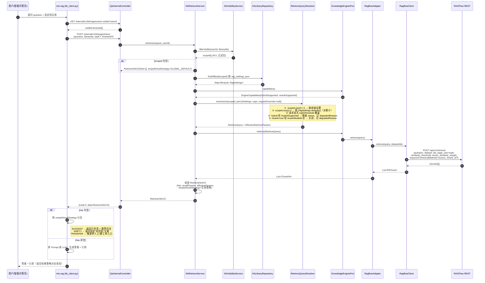
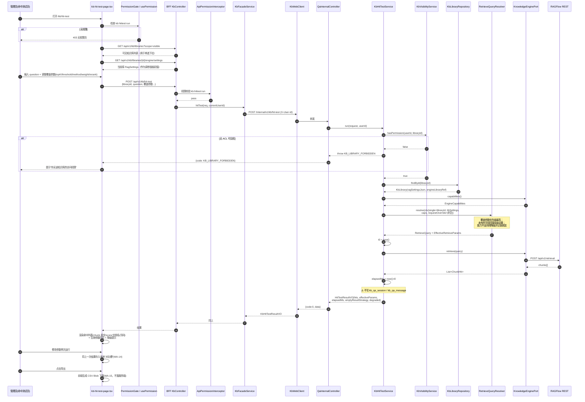
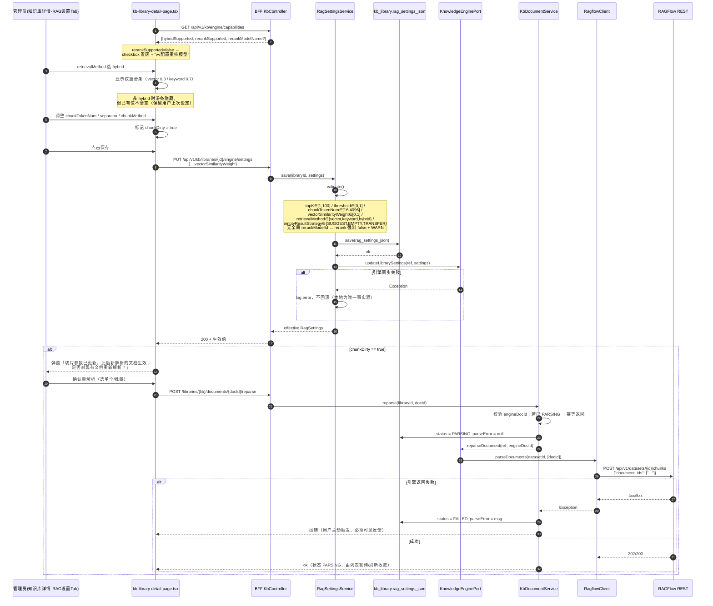
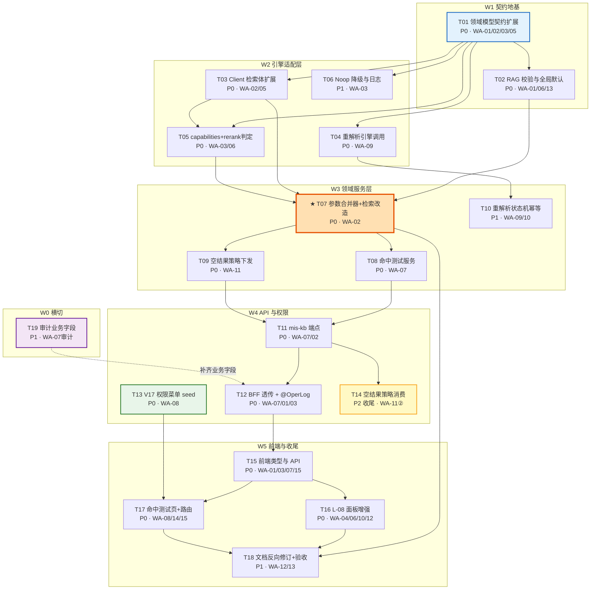

# MIS 知识库二期 Wave A（质量线）系统设计与任务分解

| 项 | 内容 |
|---|---|
| 文档编号 | `mis-kb-phase2-wave-a-design-2026-08-04` |
| 版本 | **v1.2.1（定稿）** — 全部待裁决项已关闭，可直接进入实现 |
| 日期 | 2026-08-04 |
| 作者 | 架构师 高见远 |
| 上游输入 | `deliverables/software-company/kb-phase2-wave-a-prd-2026-08-04.md`（产品经理 许清楚） |
| 关联文档 | `docs/backend/knowledge-base-phase2-plan.md`、`docs/backend/knowledge-base-app-plan.md`、`docs/backend/mis-kb-incremental-design-2026-08-03.md` |
| 范围 | Wave A 四子项：A1 Hybrid 打磨 / A2 Rerank / A3 切片与空结果 L-08 齐套（缩量）/ A4 命中测试 Q-04 |
| 不在范围 | Wave B（问答体验）、Wave C（运营闭环）、A5 前置项、多库命中测试、库级 rerank 模型覆盖、跨库 score 归一化 |

> **前置约定**：本文严格执行主理人已拍板的 8 项设计决策（对应 PRD §7 的 Q1–Q8 结论），不再重新论证。设计中所有"为什么这么选"的说明仅用于让工程师理解约束，不构成对决策的挑战。

---

## 1. 实现方案与框架选型

### 1.1 本波次的技术难点判定

读码后，Wave A 的难点**不在于新技术引入，而在于一条既有链路的"断点修复"与一次"最小面积的能力扩展"**。四个真实难点：

| # | 难点 | 现状证据 | 影响 |
|---|---|---|---|
| D1 | **库级 RAG 设置从未参与实际检索** | `KbRetrieveService.retrieve()` 直接 `new RetrieveQuery(question, scoped, request.topK(), request.threshold())`，全程不读 `kb_library.rag_settings_json` | L-08 面板配的 `retrievalMethod` / `rerank` / 阈值全是"摆设"。这是 Wave A 最高优先级（WA-02）的根因 |
| D2 | **RAGFlow 的参数落点与规划文档的假设不一致** | 经官方 HTTP API 核对：`retrieval_method` / `vector_similarity_weight` / `rerank_id` **不是** `PUT /api/v1/datasets/{id}` 的请求体字段，只在 `POST /api/v1/retrieval` 的请求体中有效（`vector_similarity_weight` 仅作为 dataset 的**响应**字段回显） | 参数必须在**每次检索调用时下发**，而不是"建库时同步一次"。`RagflowClient.updateDatasetSettings` 保持现状即可，扩展点全部落在 `retrieve()` 上 |
| D3 | **多库检索的参数归属没有唯一解** | 问答主链路 `mis-rag → /internal/v1/kb/rag/retrieve` 一次传多个 `libraryIds`，各库设置可能冲突 | 采用决策⑥：**单库精确生效、多库回落全局默认**。需要一个明确的"参数合并器"作为唯一收口点 |
| D4 | **`reparseDocument()` 是空实现** | `RagflowAdapter.reparseDocument()` 方法体为空注释 | 切片参数改了也无法重建索引，A3 的"生效"无从谈起。需补 `POST /api/v1/datasets/{id}/chunks` 调用与状态机联动 |

### 1.2 总体方案

**一句话方案：不改分层、不引新框架，在"领域模型 → 引擎适配 → 领域服务 → API → 前端"这条既有竖切上，各补一段最小增量；新增能力（命中测试）复用已有检索服务，只加一个薄服务 + 一个薄端点 + 一个页面。**

```
┌────────────────────────────────────────────────────────────────────────┐
│ 前端 mis-admin-web (React 18 + Vite + TS + Tailwind + shadcn)          │
│  features/kb/library/kb-library-detail-page.tsx  ← L-08 权重滑条/rerank │
│  features/kb/hittest/kb-hit-test-page.tsx        ← 【新增】Q-04 命中测试 │
└──────────────────────────────┬─────────────────────────────────────────┘
                               │ /api/v1/kb/**  (JWT + ApiPermissionInterceptor)
┌──────────────────────────────▼─────────────────────────────────────────┐
│ mis-admin-bff (Spring Boot 3, WebClient)                               │
│  KbController  ─────────────────────────────────▶ KbFacadeService      │
│    ▲ 判权不在 Controller 注解上（见下方「判权机制勘误」）  └─▶ KbWebClient │
└──────────────────────────────┬─────────────────────────────────────────┘
                               │ /internal/v1/kb/**
┌──────────────────────────────▼─────────────────────────────────────────┐
│ mis-kb (领域服务 + 引擎端口)                                             │
│  QaInternalController ─┬─▶ KbRetrieveService ──▶ RetrieveQueryResolver  │◀── 参数合并唯一收口
│                        └─▶ KbHitTestService  ──▶ KbVisibilityService    │
│  RagSettingsService / KbDocumentService                                 │
└──────────────────────────────┬─────────────────────────────────────────┘
                               │ KnowledgeEnginePort (端口)
        ┌──────────────────────┼──────────────────────┐
        ▼                      ▼                      ▼
  RagflowAdapter          NoopAdapter            MockAdapter
        │                (返空 + WARN)          (单测/本地)
        ▼
  RagflowClient ──▶ RAGFlow REST  POST /api/v1/retrieval
                                  POST /api/v1/datasets/{id}/chunks
```

> **【判权机制勘误 —— 依据 QA P1-B + 主理人裁决】**
>
> 本图早期版本在 `KbController` 上标注 `@Permission("kb:hittest:run")`。经复核，
> **本仓库不存在 `@Permission` 注解机制**：全仓无 `Permission.java` / `RequiresPermission*.java`，
> 亦无任何 `@Permission(` 使用点（`grep` 零命中）。该标注是设计稿臆造的产物，不可照此实现。
>
> `kb:hittest:run` 的真实判权落点有两处，主次分明：
>
> 1. **主路径（PEP）—— `ApiPermissionInterceptor`**，注册在 `/api/v1/**` 上。
>    它按 `method + path` 查 `ApiPermissionRegistry`；注册表数据源是
>    `SysApiRepository.findRegistryRows()`，即 `sys_api ⋈ sys_menu_api ⋈ sys_menu ⋈ sys_module`，
>    **permission 取自 `sys_menu.permission`**。命中规则后比对用户权限码集合，不含则 403。
>    对应的登记数据由 `V17__kb_hittest_perms.sql` D 段写入
>    （`sys_api` 91060/91061 + `sys_menu_api` → 页面菜单 91039）。
>    ⚠️ 该机制**依赖迁移真实执行成功 + 注册表重载**才生效；未映射路径在
>    `api-permission.deny-unmapped=false`（当前所有环境的默认值）下会被直接放行。
> 2. **兜底 —— `KbController.requireHitTestPermission()`**，仅覆盖上述空窗期。
>    它复用 `UserPermissionLoader.load(LoginUser)`（与拦截器同一权限查询路径），
>    **不可**改读 `LoginUser.getPermissions()` 缓存字段：该字段仅在拦截器命中映射后才被填充，
>    在需要兜底的场景里恒为空集，照读会对所有人 403。
>
> 前端侧的菜单显隐仍由 `PermissionGate` + `MenuService.permissionCodes()` 负责，与上述后端判权互不替代。

### 1.3 关键设计取舍

#### （1）参数合并唯一收口：`RetrieveQueryResolver`

引入一个**无状态领域组件** `RetrieveQueryResolver`，把"请求参数 + 库级设置 + 全局默认 + 引擎能力"合并成最终 `RetrieveQuery`。这是 Wave A 唯一的新增抽象，理由：

- WA-02（问答检索）、WA-07（命中测试）、WA-11（空结果策略）三条需求都需要同一套合并逻辑，若各自实现必然漂移；
- 合并规则含"单库/多库分支"和"引擎能力降级"两个易错点，集中在一个类里才可单测覆盖；
- 它是**纯函数式**的（入参→出参，不碰 DB），单测无需 Spring 上下文。

合并优先级（自高而低）：

```
显式请求覆盖(仅命中测试可传)  >  库级 RagSettings(仅单库场景)  >  全局默认 RagSettings.defaults()
                                          ↓
                            引擎能力兜底（capabilities 不支持则降级并记录 degraded 原因）
```

#### （2）`vectorSimilarityWeight` 零 DDL 落地

`RagSettings` 序列化存放于 `kb_library.rag_settings_json`（TEXT），新增字段**不需要任何数据库迁移**。存量库读出来该字段为 `null`，由 `withDefaults()` 补 `0.3`。这一点让 WA-01 的成本降到几乎为零，也是本波次唯一需要新增迁移脚本的地方只剩权限 seed（V17）的原因。

> ⚠️ 工程师注意：`RagSettings` 是 Java `record`，新增字段会破坏所有 `new RagSettings(...)` 的位置参数调用。必须全量搜索构造点（`RagSettings.defaults()`、`withDefaults()`、BFF `KbRagSettings`、`MockAdapter`、测试类）同步改，**新字段一律追加在参数列表末尾**，降低误配风险。

#### （3）Rerank：全局模型 ID + 库级开关 + 运行时降级

- 全局模型 ID 落 `RagflowProperties`（`mis.kb.engine.rerank-model-id`），Nacos 可覆盖，**不进 `RagSettings`**（决策②）。
- `EngineCapabilities.rerankSupported` 的语义从"适配器理论上支持"升级为"**当前配置下真正可用**"：`RagflowAdapter.capabilities()` 需判断 `rerankModelId` 是否为空白。
- 三道防线保证"无模型不会打开 rerank"：
  1. **保存时**：`RagSettingsService.validate()` 检测到全局无模型 → 强制把 `rerank` 归 `false`（不报错，静默纠正 + WARN 日志），避免管理员被拦住；
  2. **检索时**：`RetrieveQueryResolver` 再判一次，无模型则不下发 `rerank_id`；
  3. **前端**：`capabilities.rerankSupported=false` 时 checkbox 置灰 + 展示"未配置重排模型，请联系平台管理员"。

#### （4）命中测试：复用检索、独立端点、不落记录

命中测试**不新建检索实现**，而是：`KbHitTestService` → `KbVisibilityService.hasPermission(userId, libraryId)` 单库鉴权 → `RetrieveQueryResolver` 合并（允许显式覆盖）→ `enginePort.retrieve()` → 返回 hits + **本次实际生效参数回显**（`effectiveParams`）。

三条硬约束写进设计：
- **不写 `kb_qa_session` / `kb_qa_message`**——命中测试是调参工具，污染问答记录会毁掉运营看板口径；
- **必须叠加 ACL**——权限码 `kb:hittest:run` 只控入口，可见范围仍走 `KbVisibilityService`，与问答链路同一口径；
- **单库**（决策④）——入参是 `libraryId`（标量）而非 `libraryIds`，从类型上杜绝多库调用。

#### （5）`reparseDocument` 的幂等与状态机

`RagflowClient.parseDocuments(datasetId, List<docId>)` → `POST /api/v1/datasets/{id}/chunks`，body `{"document_ids": [...]}`。
`KbDocumentService.reparse()` 现有逻辑（置 `PARSING` → 调端口）保留，补三点：
- 调用前校验文档存在且有 `engineDocId`，否则抛 `KB_DOCUMENT_NOT_FOUND`；
- 引擎调用失败 → 状态回滚为 `FAILED` 并写 `parseError`，**不吞异常**（与 RAG 设置同步的"吞掉"口径相反，因为这里用户是主动触发、期待反馈）；
- 已处于 `PARSING` 的文档重复触发 → 直接返回成功（幂等），不重复下发。

### 1.4 框架与技术选型（全部沿用，无新增框架）

| 层 | 选型 | 说明 |
|---|---|---|
| 后端语言 | Java 17 | 沿用 `record` + `sealed`-free 的现有风格 |
| 后端框架 | Spring Boot 3.x（Web / Data JPA / Validation） | 无变化 |
| 服务间调用 | `WebClient`（BFF→mis-kb）、`RestClient`/`WebClient`（mis-kb→RAGFlow，沿用 `RagflowClient` 现有实现） | 无变化 |
| 配置中心 | Nacos + `@ConfigurationProperties("mis.kb.engine")` | 新增 `rerank-model-id` 一个 key |
| 数据库迁移 | Flyway | 仅新增 `V17__kb_hittest_perms.sql`（权限/菜单 seed），**无表结构变更** |
| JSON | Jackson（经 `KbJson` 封装） | 新增字段自动兼容（未知字段忽略 + 缺失字段为 null） |
| 前端 | React 18 + Vite + TypeScript + Tailwind + shadcn/ui（Radix 原语） | 无变化 |
| 前端状态 | 现有 `use-kb-store.ts` + 组件局部 state | 命中测试页为**独立调参工具**，参数不入全局 store，避免污染问答页 |
| 前端新组件 | 权重滑条：**用原生 `<input type="range">` + Tailwind 样式**，不引 `@radix-ui/react-slider` | 见 §6 依赖包说明 |

### 1.5 架构模式

- **端口-适配器（Hexagonal）**：`KnowledgeEnginePort` 是唯一出海口，Wave A 所有引擎侧扩展都必须经过它，禁止在领域服务里直接引用 `RagflowClient`。
- **领域服务 + 贫血 DTO**：沿用现状，`RetrieveQueryResolver` 作为领域内的**策略/规约组件**。
- **BFF 薄透传**：BFF 只做鉴权、DTO 映射、错误码转译，**不写业务规则**（对齐主规划 §3.7）。命中测试的 ACL 判定必须在 mis-kb 侧完成。

---

## 2. 文件列表（三分类）

> 路径均相对仓库根 `mis-platform/`。分类口径：**A 新增** / **B 修改** / **C 复用不动（但工程师需读懂）**。

### 2.1 A 类 · 新增文件（14 个）

| # | 路径 | 职责 | 关联需求 |
|---|---|---|---|
| A01 | `backend/mis-kb/src/main/java/com/mis/kb/domain/model/RetrieveQueryResolver.java` | **参数合并唯一收口**：请求覆盖 + 库级设置 + 全局默认 + 引擎能力降级 | WA-02 / WA-07 / WA-11 |
| A02 | `backend/mis-kb/src/main/java/com/mis/kb/domain/model/EffectiveRetrieveParams.java` | record：本次检索实际生效参数（含 `degradedReasons`），用于回显与排障 | WA-02 / WA-07 / WA-14 |
| A03 | `backend/mis-kb/src/main/java/com/mis/kb/domain/service/KbHitTestService.java` | 命中测试领域服务：单库鉴权 + 合并参数 + 调端口 + 组装结果，**不落问答记录** | WA-07 |
| A04 | `backend/mis-kb/src/main/java/com/mis/kb/api/dto/HitTestRequest.java` | record：`libraryId, question, topK, threshold, retrievalMethod, vectorSimilarityWeight, rerank` | WA-07 / WA-14 |
| A05 | `backend/mis-kb/src/main/java/com/mis/kb/api/dto/HitTestResultVO.java` | record：`hits, effectiveParams, elapsedMs, emptyResultStrategy, degraded` | WA-07 / WA-11 |
| A06 | `backend/mis-kb/src/main/java/com/mis/kb/api/dto/EffectiveParamsVO.java` | record：生效参数回显（前端参数对比用） | WA-14 |
| A07 | `backend/mis-admin-bff/src/main/java/com/mis/adminbff/dto/kb/KbHitTestRequest.java` | BFF 入参 DTO | WA-07 |
| A08 | `backend/mis-admin-bff/src/main/java/com/mis/adminbff/dto/kb/KbHitTestResultVO.java` | BFF 出参 DTO | WA-07 |
| A09 | `backend/mis-admin-bff/src/main/java/com/mis/adminbff/dto/kb/KbEffectiveParamsVO.java` | BFF 生效参数 DTO | WA-14 |
| A10 | `backend/mis-migrator/src/main/resources/db/migration/V17__kb_hittest_perms.sql` | 菜单节点 91039 + 按钮节点 + 权限码 `kb:hittest:run` + 角色授权 | WA-08 |
| A11 | `frontend/mis-admin-web/src/features/kb/hittest/kb-hit-test-page.tsx` | 命中测试页主体（选库/输入/调参/结果列表/参数对比/导出） | WA-08 / WA-14 / WA-15 |
| A12 | `frontend/mis-admin-web/src/features/kb/hittest/kb-hit-test-result-list.tsx` | 命中结果列表组件（chunk 原文、score、来源文档、页码） | WA-08 |
| A13 | `frontend/mis-admin-web/src/features/kb/components/kb-weight-slider.tsx` | 向量/关键字权重滑条（原生 range + Tailwind，含双侧百分比标注） | WA-04 |
| A14 | `backend/mis-kb/src/test/java/com/mis/kb/domain/model/RetrieveQueryResolverTest.java` | 参数合并单测（单库/多库/覆盖/降级四类用例） | WA-02 / WA-03 |

### 2.2 B 类 · 修改文件（21 个）

#### 后端 mis-kb（11）

| # | 路径 | 改动要点 | 关联需求 |
|---|---|---|---|
| B01 | `.../domain/model/RagSettings.java` | 新增 `Double vectorSimilarityWeight`（追加末位）；`defaults()` 填 `0.3`；`withDefaults()` 补 null；新增 `isHybrid()` 便捷方法 | WA-01 |
| B02 | `.../domain/model/RetrieveQuery.java` | 新增 `retrievalMethod, vectorSimilarityWeight, rerank, rerankModelId, emptyResultStrategy`；保留旧 4 参构造为兼容重载 | WA-02 / WA-05 / WA-11 |
| B03 | `.../domain/model/EngineCapabilities.java` | 新增 `hybridSupported`；`capabilities` 列表纳入 `"hybrid"`；`unsupported()` 同步 | WA-03 |
| B04 | `.../engine/RagflowProperties.java` | 新增 `rerankModelId`（`mis.kb.engine.rerank-model-id`），默认空串 | WA-05 |
| B05 | `.../engine/RagflowClient.java` | ① `retrieve()` 请求体补 `vector_similarity_weight` / `rerank_id` / `keyword`；② 新增 `parseDocuments(datasetId, docIds)` | WA-02 / WA-05 / WA-09 |
| B06 | `.../engine/RagflowAdapter.java` | ① `capabilities()` 加 `hybrid` 并按 `rerankModelId` 动态判 `rerankSupported`；② `reparseDocument()` 真实实现；③ `retrieve()` 透传新字段 | WA-03 / WA-05 / WA-06 / WA-09 |
| B07 | `.../engine/NoopAdapter.java` | `retrieve()` 保持返空，补 WARN 日志（库 ID + 请求检索方式 + 权重）；`capabilities()` 显式 `hybridSupported=false` | WA-03 |
| B08 | `.../engine/MockAdapter.java` | 同步新字段以保证编译与本地联调；`capabilities()` 声明全支持 | WA-03 |
| B09 | `.../domain/service/KbRetrieveService.java` | **核心**：注入 `RetrieveQueryResolver` + `KbLibraryRepository`，改造 `retrieve()` 走参数合并；结果附 `emptyResultStrategy` | WA-02 / WA-11 |
| B10 | `.../domain/service/RagSettingsService.java` | `validate()` 新增权重区间校验 [0,1]；无全局 rerank 模型时强制 `rerank=false`；非 hybrid 时权重原样保留但不生效（不清空） | WA-01 / WA-06 |
| B11 | `.../domain/service/KbDocumentService.java` | `reparse()` 补 engineDocId 校验、幂等短路、失败置 `FAILED` + `parseError` | WA-09 / WA-10 |

#### 后端 API 层与 BFF（5）

| # | 路径 | 改动要点 | 关联需求 |
|---|---|---|---|
| B12 | `.../api/controller/QaInternalController.java` | 新增 `POST /internal/v1/kb/hit-test`；`retrieve` 响应补生效参数 | WA-07 / WA-02 |
| B13 | `.../api/dto/RetrieveHitsVO.java` | 新增 `emptyResultStrategy` + `effectiveParams` 字段 | WA-11 / WA-02 |
| B14 | `.../api/dto/RecallParamsVO.java` | 补 `retrievalMethod` / `vectorSimilarityWeight` / `rerank`，与生效参数对齐 | WA-02 |
| B15 | `backend/mis-admin-bff/.../controller/KbController.java` | 新增 `POST /api/v1/kb/hit-test`，标注权限码 `kb:hittest:run` | WA-07 / WA-08 |
| B16 | `backend/mis-admin-bff/.../service/KbFacadeService.java` + `client/KbWebClient.java` + `dto/kb/KbRagSettings.java` + `dto/kb/KbEngineCapabilitiesVO.java` | 透传 hit-test；`KbRagSettings` 加 `vectorSimilarityWeight`；`KbEngineCapabilitiesVO` 加 `hybridSupported` | WA-01 / WA-03 / WA-07 |
| B24 | `backend/mis-common/mis-common-web/.../audit/OperLog.java` | 新增 `boolean recordParams() default false`（**默认 false，存量端点零影响**） | WA-07 审计 |
| B25 | `backend/mis-admin-bff/.../audit/OperLogAspect.java` | `recordParams=true` 时采集入参摘要 + 结果条数写入 `request_params`（当前第 73 行硬编码 `null`） | WA-07 审计 |
| B26 | `agent/ai-platform/backend/src/adapters/kb_client.py` + 问答链路消费点 | 消费 `emptyResultStrategy` 三分支（WA-11 ② 段，P2 不阻塞发布） | WA-11 |

#### 前端（5）

| # | 路径 | 改动要点 | 关联需求 |
|---|---|---|---|
| B17 | `frontend/mis-admin-web/src/features/kb/types.ts` | `KbRagSettings` 加 `vectorSimilarityWeight?`；`KbEngineCapabilities` 加 `hybridSupported`；新增 `KbHitTestRequest/Result/Hit/EffectiveParams` | WA-01 / WA-03 / WA-07 |
| B18 | `frontend/mis-admin-web/src/features/kb/api/kb-api.ts` | 新增 `hitTest(req)`；`getRagSettings/updateRagSettings` 携带新字段 | WA-07 / WA-01 |
| B19 | `frontend/mis-admin-web/src/features/kb/library/kb-library-detail-page.tsx` | 权重滑条（仅 hybrid 显示）；rerank 区展示当前全局模型名 + 不可用置灰理由；修复 `**此后新解析**` 原样渲染缺陷；切片参数改动后弹重解析引导 | WA-04 / WA-06 / WA-10 / WA-12 |
| B20 | `frontend/mis-admin-web/src/lib/nav/kb-nav.ts` | 新增「命中测试」叶节点（`/kb/hit-test`，置于「智能问答」与「问答运营」之间，`permission: 'kb:hittest:run'`） | WA-08 |
| B21 | `frontend/mis-admin-web/src/components/layout/keep-alive-outlet.tsx` | `PAGE_MAP` 增加 `/kb/hit-test → KbHitTestPage` | WA-08 |

#### 文档反向修订（2，见 §9）

| # | 路径 | 改动要点 |
|---|---|---|
| B22 | `docs/backend/knowledge-base-phase2-plan.md` | §4.1 capabilities 矩阵补 `hybrid`；§4.2 删除库级 `rerankModelId`、明确 `emptyResultStrategy` 三值口径 |
| B23 | `docs/backend/knowledge-base-app-plan.md` | §3.5 标注 `vector_similarity_weight` / `rerank_id` 为**检索期下发**而非 dataset 期；§4.6 Q-04 补权限码与单库口径 |

### 2.3 C 类 · 复用不动（工程师必读，禁止顺手改）

| 路径 | 为什么必须读 |
|---|---|
| `.../domain/service/KbVisibilityService.java` | 命中测试的 ACL 口径**必须**复用 `hasPermission` / `filterVisible`，不得另写一套 |
| `.../engine/KnowledgeEnginePort.java` | 端口签名变更会波及三个适配器，改动需在本设计范围内（仅 `retrieve` 入参对象扩展，方法签名不变） |
| `.../engine/EngineAdapterSelector.java` | 按 `mis.kb.engine.type` 选适配器的逻辑不动 |
| `.../domain/model/EmptyResultStrategy.java` | 决策⑦：**沿用 `SUGGEST/EMPTY/TRANSFER`，一个字都不改** |
| `.../support/KbJson.java` | RagSettings 序列化入口，新增字段需确认其 ObjectMapper 配置为"忽略未知字段" |
| `.../domain/model/KbResultCode.java` | 新增错误码需在此登记（见 §8 待明确 U3） |
| `backend/mis-migrator/.../V13__kb_seed.sql` / `V14__kb_menu_buttons_and_grants.sql` | V17 的节点 ID 与授权写法必须与之对齐，**不得修改已发布的 V13/V14** |
| `frontend/.../components/auth/permission-gate.tsx` + `hooks/use-permission.ts` | 前端门控统一入口 |
| `backend/mis-audit/.../dto/CreateOperLogRequest.java` + `domain/entity/SysOperLog.java` | 审计写入契约；`requestParams` 字段与 `sys_oper_log.request_params`（TEXT）**均已存在**，无需改动 |
| `backend/mis-common/mis-common-core/.../util/DesensitizeUtils.java` | 现有脱敏工具**仅支持 phone/idCard/email**，无自由文本方法（见 §8-U9） |

---

## 3. 数据结构与接口（类图）

> 同步产物：`docs/backend/mis-kb-wave-a-class.mermaid`
> 图例：`+` public，`-` private；标注 `«new»` 为新增类型，标注 `«+字段»` 为本波次新增成员。

```mermaid
classDiagram
    direction LR

    class RagSettings {
        <<record>>
        +Integer topK
        +Double scoreThreshold
        +Boolean rerank
        +String embeddingModel
        +String retrievalMethod
        +String chunkMethod
        +Integer chunkTokenNum
        +String separator
        +String emptyResultStrategy
        +Double vectorSimilarityWeight
        +RagSettings defaults()$
        +RagSettings withDefaults()
        +boolean isHybrid()
    }
    note for RagSettings "«+vectorSimilarityWeight» 默认 0.3\n持久化于 kb_library.rag_settings_json，无 DDL"

    class RetrieveQuery {
        <<record>>
        +String question
        +List~Long~ libraryIds
        +Integer topK
        +Double threshold
        +String retrievalMethod
        +Double vectorSimilarityWeight
        +Boolean rerank
        +String rerankModelId
        +String emptyResultStrategy
        +int DEFAULT_TOP_K$
    }

    class EffectiveRetrieveParams {
        <<record new>>
        +Integer topK
        +Double threshold
        +String retrievalMethod
        +Double vectorSimilarityWeight
        +Boolean rerank
        +String rerankModelId
        +String emptyResultStrategy
        +String source
        +List~String~ degradedReasons
    }
    note for EffectiveRetrieveParams "source ∈ {LIBRARY, GLOBAL_DEFAULT, REQUEST_OVERRIDE}\ndegradedReasons 记录每一次降级原因，前端可展示"

    class EngineCapabilities {
        <<record>>
        +List~String~ capabilities
        +boolean rerankSupported
        +boolean metadataFilterSupported
        +boolean replaceSupported
        +boolean hybridSupported
        +EngineCapabilities unsupported()$
        +boolean supports(String)
    }

    class EmptyResultStrategy {
        <<enumeration>>
        SUGGEST
        EMPTY
        TRANSFER
        +EmptyResultStrategy fromCode(String)$
        +String normalize(String)$
        +boolean isValid(String)$
    }

    class RetrieveQueryResolver {
        <<new component>>
        -RagflowProperties props
        +RetrieveQuery resolve(RetrieveContext ctx)
        +EffectiveRetrieveParams effective(RetrieveContext ctx)
        -RagSettings pickBase(List~Long~ ids, Map~Long,RagSettings~ perLib)
        -RagSettings applyOverride(RagSettings base, ParamOverride ov)
        -RagSettings degradeByCapability(RagSettings s, EngineCapabilities cap, List~String~ out)
    }
    note for RetrieveQueryResolver "参数合并唯一收口\n优先级: REQUEST_OVERRIDE > LIBRARY(单库) > GLOBAL_DEFAULT\n再经 capabilities 降级"

    class KnowledgeEnginePort {
        <<interface>>
        +EngineLibraryRef createLibrary(...)
        +void updateLibrarySettings(EngineLibraryRef, RagSettings)
        +List~ChunkHit~ retrieve(RetrieveQuery)
        +void reparseDocument(EngineLibraryRef, String docId)
        +EngineCapabilities capabilities()
        +EngineHealth health()
    }

    class RagflowAdapter {
        -RagflowClient client
        -RagflowProperties props
        +List~ChunkHit~ retrieve(RetrieveQuery)
        +void reparseDocument(EngineLibraryRef, String)
        +EngineCapabilities capabilities()
    }
    class NoopAdapter {
        +List~ChunkHit~ retrieve(RetrieveQuery)
        +EngineCapabilities capabilities()
    }
    class MockAdapter
    class EngineAdapterSelector

    class RagflowClient {
        -RagflowProperties props
        +List~RfChunk~ retrieve(RetrieveQuery, List~String~ datasetIds)
        +void updateDatasetSettings(String, RagSettings)
        +void parseDocuments(String datasetId, List~String~ docIds)
        -String mapRetrievalMethodToKeyword(String)
    }
    note for RagflowClient "«+» retrieve body: vector_similarity_weight / rerank_id / keyword\n«+» parseDocuments -> POST /api/v1/datasets/{id}/chunks"

    class RagflowProperties {
        +String type
        +String baseUrl
        +String apiKey
        +String rerankModelId
    }

    class KbRetrieveService {
        -KbVisibilityService visibilityService
        -KbLibraryRepository libraryRepository
        -RetrieveQueryResolver resolver
        -KnowledgeEnginePort enginePort
        +RetrieveHitsVO retrieve(RetrieveRequest, Long userId)
    }

    class KbHitTestService {
        <<new service>>
        -KbVisibilityService visibilityService
        -KbLibraryRepository libraryRepository
        -RetrieveQueryResolver resolver
        -KnowledgeEnginePort enginePort
        +HitTestResultVO run(HitTestRequest, Long userId)
    }
    note for KbHitTestService "单库 + ACL 强制过滤 + 不写 kb_qa_*"

    class KbVisibilityService {
        +Set~Long~ resolveVisibleLibraryIds(Long userId)
        +List~Long~ filterVisible(Long userId, List~Long~ ids)
        +boolean hasPermission(Long userId, Long libraryId)
    }

    class RagSettingsService {
        +RagSettings get(Long)
        +RagSettings save(Long, RagSettings)
        +KbLibraryDetailVO detail(Long)
        -RagSettings validate(RagSettings)
        -void syncToEngine(KbLibrary, RagSettings)
    }

    class KbDocumentService {
        +void reparse(Long libraryId, Long docId)
    }

    class HitTestRequest {
        <<record new>>
        +Long libraryId
        +String question
        +Integer topK
        +Double threshold
        +String retrievalMethod
        +Double vectorSimilarityWeight
        +Boolean rerank
    }
    class HitTestResultVO {
        <<record new>>
        +List~ChunkHitVO~ hits
        +EffectiveParamsVO effectiveParams
        +long elapsedMs
        +String emptyResultStrategy
        +boolean degraded
    }
    class RetrieveHitsVO {
        +List~ChunkHitVO~ hits
        +RecallParamsVO recallParams
        +String emptyResultStrategy
        +EffectiveParamsVO effectiveParams
    }
    class ChunkHitVO {
        +Long libraryId
        +String documentId
        +String documentName
        +String text
        +Double score
        +Integer page
    }

    class QaInternalController {
        +RetrieveHitsVO retrieve(RetrieveRequest)
        +HitTestResultVO hitTest(HitTestRequest)
    }
    class BffKbController {
        +KbHitTestResultVO hitTest(KbHitTestRequest)
        +KbRagSettings updateRagSettings(Long, KbRagSettings)
    }
    note for BffKbController "hitTest 判权（非注解机制）:\n1) 主路径 ApiPermissionInterceptor + sys_api 注册表，\n   permission 取自 sys_menu(91039).permission=kb:hittest:run\n   （V17 D 段登记 sys_api 91061 / sys_menu_api 91061→91039）\n2) 兜底 KbController.requireHitTestPermission()：\n   复用 UserPermissionLoader.load(LoginUser) 真实查询，\n   不读 LoginUser.getPermissions() 空集缓存\n@OperLog(module=知识库,\n operation=命中测试,\n recordParams=true) 保留"
    class KbFacadeService
    class KbWebClient

    class OperLog {
        <<annotation>>
        +String module()
        +String operation()
        +boolean recordParams()
    }
    note for OperLog "«+recordParams» 默认 false\n存量端点行为零变化"

    class OperLogAspect {
        -AuditWebClient auditWebClient
        +Object around(ProceedingJoinPoint, OperLog)
        -void writeLog(...)
    }
    note for OperLogAspect "⚠️ 现状第 73 行 requestParams 硬编码 null\nT19 改为：recordParams=true 时采集\n{libraryId, question, resultCount} + 截断"

    KnowledgeEnginePort <|.. RagflowAdapter
    KnowledgeEnginePort <|.. NoopAdapter
    KnowledgeEnginePort <|.. MockAdapter
    EngineAdapterSelector ..> KnowledgeEnginePort : selects by mis.kb.engine.type
    RagflowAdapter --> RagflowClient
    RagflowAdapter --> RagflowProperties
    RagflowClient --> RagflowProperties

    KbRetrieveService --> RetrieveQueryResolver
    KbRetrieveService --> KbVisibilityService
    KbRetrieveService --> KnowledgeEnginePort
    KbHitTestService --> RetrieveQueryResolver
    KbHitTestService --> KbVisibilityService
    KbHitTestService --> KnowledgeEnginePort

    RetrieveQueryResolver ..> RagSettings : merges
    RetrieveQueryResolver ..> EngineCapabilities : degrades by
    RetrieveQueryResolver --> RetrieveQuery : produces
    RetrieveQueryResolver --> EffectiveRetrieveParams : produces
    RagSettings ..> EmptyResultStrategy : validates

    RagSettingsService --> RagSettings
    RagSettingsService --> KnowledgeEnginePort
    KbDocumentService --> KnowledgeEnginePort

    QaInternalController --> KbRetrieveService
    QaInternalController --> KbHitTestService
    QaInternalController ..> HitTestRequest
    QaInternalController ..> HitTestResultVO
    QaInternalController ..> RetrieveHitsVO
    HitTestResultVO o-- ChunkHitVO
    RetrieveHitsVO o-- ChunkHitVO

    BffKbController --> KbFacadeService
    KbFacadeService --> KbWebClient
    KbWebClient ..> QaInternalController : HTTP /internal/v1/kb/**
    BffKbController ..> OperLog : annotated with
    OperLogAspect ..> OperLog : @Around
    OperLogAspect ..> BffKbController : intercepts
```



### 3.1 关键接口签名约定

```
# mis-kb 内部端点（新增）
POST /internal/v1/kb/hit-test
  Header: X-User-Id: {userId}
  Body:   { libraryId, question, topK?, threshold?, retrievalMethod?, vectorSimilarityWeight?, rerank? }
  200:    { code, data: { hits[], effectiveParams, elapsedMs, emptyResultStrategy, degraded }, message }
  错误:    KB_LIBRARY_NOT_FOUND / KB_LIBRARY_FORBIDDEN / KB_ENGINE_UNAVAILABLE

# BFF 对外端点（新增）
POST /api/v1/kb/hit-test          权限码: kb:hittest:run
  Body/响应结构与上同（DTO 换名 Kb* 前缀）

# 既有端点（响应扩展，向后兼容）
POST /internal/v1/kb/rag/retrieve  响应新增 emptyResultStrategy / effectiveParams
GET|PUT /api/v1/kb/libraries/{id}/engine/settings   RagSettings 新增 vectorSimilarityWeight
GET  /api/v1/kb/engine/capabilities                 新增 hybridSupported
```

---

## 4. 程序调用流程（时序图）

> 同步产物：`docs/backend/mis-kb-wave-a-seq.mermaid`

### 4.1 主链路一：问答检索（库级参数真正生效，WA-02 / WA-11）



### 4.2 主链路二：命中测试（WA-07 / WA-08 / WA-14）



### 4.3 支撑链路：RAG 设置保存 + 切片改动引导 + 重解析生效（WA-01 / WA-06 / WA-09 / WA-10）



---

## 5. 任务列表（19 条，按依赖排序）

> v1.1 更新：依据产品经理 2026-08-04 裁决，T09/T14 拆为 WA-11 ①② 段、T12 补 `@OperLog`、新增 T19（审计业务字段）、T07/T16 补"归一化不回写"判据、T17 补 WA-14 两条。

### 5.1 批次总览

| 批次 | 主题 | 任务 | 可并行性 |
|---|---|---|---|
| **W1** | 契约地基（领域模型 + 配置） | T01–T02 | T01 必须最先完成，是全部后续的编译前提 |
| **W2** | 引擎适配层 | T03–T06 | T03/T04/T06 三线可并行 |
| **W3** | 领域服务层（参数合并 / 命中测试 / 空结果 / 重解析） | T07–T10 | T07 是关键路径；T10 可与 T08/T09 并行 |
| **W4** | API 层与权限 seed | T11–T14 | T13 全程可并行（独立 SQL）；T14 为 P2 收尾项 |
| **W5** | 前端与收尾 | T15–T18 | T16/T17 可并行 |
| **W0** | 横切（公共切面） | T19 | 零依赖，可与 W1 同时启动 |

**发布门禁划分**：
- **阻塞发布（P0）**：T01–T03、T04–T05、T07–T09、T11–T13、T15–T17
- **不阻塞发布（P1/P2）**：T06、T10、T14（WA-11 ② 段）、T18、T19

### 5.2 任务明细

---

#### T01 · 领域模型契约扩展
- **对应需求**：WA-01、WA-02、WA-03、WA-05
- **优先级**：P0
- **依赖**：无（**关键路径起点**）
- **源文件**：
  - `backend/mis-kb/.../domain/model/RagSettings.java`（+`vectorSimilarityWeight`，`defaults()` 填 0.3，`withDefaults()` 兜底，新增 `isHybrid()`）
  - `backend/mis-kb/.../domain/model/RetrieveQuery.java`（+`retrievalMethod/vectorSimilarityWeight/rerank/rerankModelId/emptyResultStrategy`，保留旧 4 参兼容构造）
  - `backend/mis-kb/.../domain/model/EngineCapabilities.java`（+`hybridSupported`，`unsupported()` 同步）
  - `backend/mis-kb/.../domain/model/EffectiveRetrieveParams.java`【新增】
  - `backend/mis-kb/.../engine/RagflowProperties.java`（+`rerankModelId`）
  - `backend/mis-kb/src/main/resources/application.yml`（+`mis.kb.engine.rerank-model-id: ${MIS_KB_RERANK_MODEL_ID:}`）
- **完成判据**：`mvn -pl backend/mis-kb -am compile` 通过；全量搜索 `new RagSettings(` / `new RetrieveQuery(` / `new EngineCapabilities(` 无遗漏构造点。
- **风险提示**：record 位置参数破坏性变更，**新字段一律追加末位**。

---

#### T02 · RAG 设置校验与全局默认收敛
- **对应需求**：WA-01、WA-06、WA-13
- **优先级**：P0
- **依赖**：T01
- **源文件**：
  - `backend/mis-kb/.../domain/service/RagSettingsService.java`（`validate()` 加权重区间 [0,1]；无全局 rerank 模型时静默强制 `rerank=false` + WARN）
  - `backend/mis-kb/.../domain/model/KbResultCode.java`（若需新码，见 §8-U3）
  - `backend/mis-kb/src/test/java/.../RagSettingsServiceTest.java`（新增/补充校验用例）
- **完成判据**：权重传 `1.5` 返回 `KB_RAG_SETTINGS_INVALID`；`rerank-model-id` 为空时保存 `rerank=true` 落库结果为 `false` 且日志可见。

---

#### T03 · RagflowClient 检索请求体扩展
- **对应需求**：WA-02、WA-05
- **优先级**：P0
- **依赖**：T01
- **源文件**：
  - `backend/mis-kb/.../engine/RagflowClient.java`（`retrieve()` body 补 `vector_similarity_weight` / `rerank_id` / `keyword`；新增私有方法 `mapRetrievalMethodToKeyword`）
- **映射规则**（写进代码注释）：`vector → keyword=false, weight=1.0`；`keyword → keyword=true, weight=0.0`；`hybrid → keyword=true, weight=vectorSimilarityWeight`。`rerank_id` 仅在 `rerank=true && rerankModelId 非空` 时下发，否则**不放入 body**（不要传空串）。
- **完成判据**：抓包/日志可见请求体含新字段；`rerank=false` 时 body 中不出现 `rerank_id` 键。

---

#### T04 · 文档重解析引擎调用落地
- **对应需求**：WA-09
- **优先级**：P0
- **依赖**：T01
- **源文件**：
  - `backend/mis-kb/.../engine/RagflowClient.java`（新增 `parseDocuments(String datasetId, List<String> docIds)` → `POST /api/v1/datasets/{id}/chunks`）
  - `backend/mis-kb/.../engine/RagflowAdapter.java`（`reparseDocument()` 由空实现改为真实调用）
- **完成判据**：对已解析文档触发重解析，RAGFlow 侧文档 `run/progress` 状态发生变化。

---

#### T05 · 引擎能力声明与 rerank 可用性动态判定
- **对应需求**：WA-03、WA-06
- **优先级**：P0
- **依赖**：T01、T03
- **源文件**：
  - `backend/mis-kb/.../engine/RagflowAdapter.java`（`capabilities()` → `["hybrid","rerank","metadata_filter","replace"]`，`rerankSupported = StringUtils.hasText(props.getRerankModelId())`，`hybridSupported=true`）
  - `backend/mis-kb/.../engine/MockAdapter.java`（同步声明，保证本地/CI 全支持）
- **完成判据**：`GET /api/v1/kb/engine/capabilities` 返回含 `hybrid`；清空 `rerank-model-id` 后 `rerankSupported=false`。

---

#### T06 · Noop 适配器降级语义与可观测日志
- **对应需求**：WA-03
- **优先级**：P1
- **依赖**：T01
- **源文件**：
  - `backend/mis-kb/.../engine/NoopAdapter.java`（`retrieve()` 保持返空，补 `log.warn("[noop] 引擎未启用，检索返回空结果 libraryIds={} retrievalMethod={} weight={}")`；`capabilities()` 显式 `hybridSupported=false, rerankSupported=false`）
- **完成判据**：`mis.kb.engine.type=noop` 下发起 hybrid 检索，日志出现该 WARN 且链路不抛异常（决策⑤）。

---

#### T07 · ★ 参数合并器与检索服务改造（本波次核心）
- **对应需求**：WA-02（最高优先级）、WA-13
- **优先级**：P0
- **依赖**：T02、T03、T05
- **源文件**：
  - `backend/mis-kb/.../domain/model/RetrieveQueryResolver.java`【新增】
  - `backend/mis-kb/.../domain/service/KbRetrieveService.java`（注入 resolver + `KbLibraryRepository`，改造 `retrieve()`）
  - `backend/mis-kb/src/test/java/.../RetrieveQueryResolverTest.java`【新增】
- **合并规则**（必须与 §7.2 完全一致）：单库取库级、多库取全局默认（决策⑥）、显式覆盖最高优先、能力不支持则降级并记 `degradedReasons`。
- **完成判据**：
  1. 单测覆盖四类用例（单库生效 / 多库回落 / 覆盖优先 / 能力降级）；
  2. 集成验证「把某库改成 keyword 后，问答检索请求体 `keyword=true, vector_similarity_weight=0.0`」；
  3. **⚠️ 归一化不回写**：S3 的 `vector→1.0 / keyword→0.0` 强制覆写**只允许发生在 Resolver 的检索期合并**，产物是 `RetrieveQuery`；**严禁**将归一化结果写回 `RagSettings` 或触发任何持久化。单测需断言：传入的 `RagSettings` 实例在 resolve 前后 `vectorSimilarityWeight` 不变。

---

#### T08 · 命中测试领域服务
- **对应需求**：WA-07
- **优先级**：P0
- **依赖**：T07
- **源文件**：
  - `backend/mis-kb/.../domain/service/KbHitTestService.java`【新增】
  - `backend/mis-kb/.../api/dto/HitTestRequest.java`【新增】
  - `backend/mis-kb/.../api/dto/HitTestResultVO.java`【新增】
  - `backend/mis-kb/.../api/dto/EffectiveParamsVO.java`【新增】
- **硬约束**：
  1. 单库；`KbVisibilityService.hasPermission` 强制校验；
  2. **禁止**写入 `kb_qa_session` / `kb_qa_message` 等五表（见 §7.5-8）；
  3. **审计留痕由 BFF 侧 `@OperLog` 承担**（T12/T19）——本服务不写审计，但**返回值必须携带 `hits.size()`** 供切面采集结果条数。
- **完成判据**：无 ACL 的库返回 `KB_LIBRARY_FORBIDDEN`；执行后 `kb_qa_*` 表行数不变；`sys_oper_log` 新增 1 行（含越权被拒的场景）。

---

#### T09 · 空结果策略下发（WA-11 **① 段 · Wave A 准入**）
- **对应需求**：WA-11 ① 段
- **优先级**：**P0（阻塞发布）**
- **依赖**：T07
- **源文件**：
  - `backend/mis-kb/.../api/dto/RetrieveHitsVO.java`（+`emptyResultStrategy` / `effectiveParams`）
  - `backend/mis-kb/.../api/dto/RecallParamsVO.java`（+`retrievalMethod` / `vectorSimilarityWeight` / `rerank`）
  - `backend/mis-kb/.../domain/service/KbRetrieveService.java`（组装策略值：单库取库级、多库取全局默认）
- **完成判据**（产品裁决口径，一字不改）：
  1. `/internal/v1/kb/rag/retrieve` 响应含 `emptyResultStrategy`，取值**恒**为 `SUGGEST|EMPTY|TRANSFER`（决策⑦）；
  2. 单库取库级、多库取全局默认，且**可回溯**（`effectiveParams.source` 标明来源）；
  3. 命中测试页可见该策略值。
- **对外口径约束**：若发布时仅完成 ① 段，release note **不得**写"空结果策略已支持"，只能写「已可配置并透传至问答链路，问答侧表现差异待后续」。

---

#### T10 · 重解析状态机与幂等
- **对应需求**：WA-09、WA-10
- **优先级**：P1
- **依赖**：T04
- **源文件**：
  - `backend/mis-kb/.../domain/service/KbDocumentService.java`（`reparse()` 补 engineDocId 校验、PARSING 幂等短路、失败置 `FAILED`+`parseError` 并抛出）
  - `backend/mis-kb/src/test/java/.../KbDocumentServiceTest.java`
- **完成判据**：重复触发不产生重复引擎调用；引擎失败时文档状态为 `FAILED` 且前端能看到错误原因。

---

#### T11 · mis-kb API 层端点
- **对应需求**：WA-07、WA-02
- **优先级**：P0
- **依赖**：T08、T09
- **源文件**：
  - `backend/mis-kb/.../api/controller/QaInternalController.java`（新增 `POST /internal/v1/kb/hit-test`）
  - `backend/mis-kb/.../api/dto/RetrieveRequest.java`（如需，保持向后兼容）
- **完成判据**：`curl` 内部端点可返回 hits + effectiveParams；`retrieve` 老调用方（mis-rag）不传新字段仍正常。

---

#### T12 · BFF 透传层
- **对应需求**：WA-07、WA-01、WA-03
- **优先级**：P0
- **依赖**：T11
- **源文件**：
  - `backend/mis-admin-bff/.../controller/KbController.java`（+`POST /api/v1/kb/hit-test`，权限码 `kb:hittest:run`，**+`@OperLog(module="知识库", operation="命中测试", recordParams=true)`**）
  - `backend/mis-admin-bff/.../service/KbFacadeService.java`
  - `backend/mis-admin-bff/.../client/KbWebClient.java`
  - `backend/mis-admin-bff/.../dto/kb/KbHitTestRequest.java`【新增】
  - `backend/mis-admin-bff/.../dto/kb/KbHitTestResultVO.java`【新增】
  - `backend/mis-admin-bff/.../dto/kb/KbEffectiveParamsVO.java`【新增】
  - `backend/mis-admin-bff/.../dto/kb/KbRagSettings.java`（+`vectorSimilarityWeight`）
  - `backend/mis-admin-bff/.../dto/kb/KbEngineCapabilitiesVO.java`（+`hybridSupported`）
- **完成判据**：BFF 端点鉴权生效；DTO 字段与 mis-kb 一一对齐（不做业务加工）；`sys_oper_log` 有 module=知识库/operation=命中测试的记录（**基础字段口径**；业务字段依赖 T19）。
- **注**：`@OperLog` 只保证「访问事实 + 失败路径（含越权尝试）」留痕；`libraryId` / 脱敏 question / 结果条数需 T19 支撑，见下。

---

#### T13 · 权限码与菜单 seed（可全程并行）
- **对应需求**：WA-08
- **优先级**：P0
- **依赖**：无
- **源文件**：
  - `backend/mis-migrator/src/main/resources/db/migration/V17__kb_hittest_perms.sql`【新增】
- **内容要点**：菜单节点 `91039`（父 `91030`，名称「命中测试」，path `/kb/hit-test`，permission `kb:hittest:run`，排序置于「智能问答」与「问答运营」之间）；对应按钮节点（沿用 V14 的 `9105x` 段位继续编号）。
- **⚠️ 授权范围（§8-U1 裁决，与早期草稿不同，以此处为准）**：**V17 只授 `role_id=1`（超管）一个角色**。「知识管理员 / 运营」是 PRD 决策③描述的**目标态**，当前角色体系中**尚无对应 role_id**，属于**非实现约束**。
  - SQL 中必须留一行注释登记待补，建议原文：
    `-- TODO(WA-08): 知识管理员/运营角色的授权待角色体系固化后由 V18 补充，本迁移仅授 role_id=1`
  - 理由：把权限码授给不存在的 role_id 比不授更糟——它会在验收期制造「明明授权了怎么进不去」的排查噪音，且 Flyway 已发布迁移无法回改。
- **完成判据**：Flyway 迁移成功；`role_id=1` 登录后左侧菜单出现「命中测试」，其余角色不可见且直连 `/kb/hit-test` 被拦；SQL 内含上述 TODO 注释。
- **注意**：**不得修改 V13/V14**（已发布）。

---

#### T14 · 空结果策略消费实现（WA-11 **② 段 · Wave A 收尾**）
- **对应需求**：WA-11 ② 段
- **优先级**：**P2（不阻塞发布，但留在 Wave A，不并入 Wave B）**
- **依赖**：T11
- **源文件**：
  - `agent/ai-platform/backend/src/adapters/kb_client.py`（契约兼容核对 + 读出 `emptyResultStrategy`）
  - mis-rag 问答编排消费点（三分支：`SUGGEST` 引导语 + 推荐问法 / `EMPTY` 固定文案 / `TRANSFER` 转人工入口）
- **完成判据**：三种策略在问答页产生**可观测的表现差异**。
- **归属说明（产品裁决，不得变更）**：本任务**不得**并入 Wave B。Wave B 是 GraphRAG 结构线且带独立门禁（phase2 §6.3「不达标 → 不进 Wave C」），把质量线的收尾项挂到一个可能失败的 PoC 上，会让这笔债跟着 PoC 一起冻死。
- **降级路径**：若验收期外部依赖「问答主路径可用」仍不成立，本任务**降级为独立技术债条目登记遗留清单**，**仍留在 Wave A 名下**。
- **成本说明**：非新建能力，是"按已有字段做三分支"；§7.5-5 的 `dict.get()` 向后兼容已铺好路。

---

#### T15 · 前端类型与 API 层
- **对应需求**：WA-01、WA-03、WA-07、WA-15
- **优先级**：P0
- **依赖**：T12
- **源文件**：
  - `frontend/mis-admin-web/src/features/kb/types.ts`（+`vectorSimilarityWeight` / `hybridSupported` / `KbHitTestRequest` / `KbHitTestResult` / `KbHitTestHit` / `KbEffectiveParams`）
  - `frontend/mis-admin-web/src/features/kb/api/kb-api.ts`（+`hitTest()`）
- **完成判据**：`tsc --noEmit` 通过；无 `any`。

---

#### T16 · L-08 RAG 设置面板增强
- **对应需求**：WA-04、WA-06、WA-10、WA-12
- **优先级**：P0
- **依赖**：T15
- **源文件**：
  - `frontend/mis-admin-web/src/features/kb/components/kb-weight-slider.tsx`【新增】
  - `frontend/mis-admin-web/src/features/kb/library/kb-library-detail-page.tsx`
- **要点**：① 权重滑条仅在 `retrievalMethod==='hybrid'` 时显示，展示「语义 30% / 关键字 70%」双侧标注，步长 0.05；切走 hybrid 时**隐藏但不清值**；② rerank 区展示当前全局模型名（不可编辑），`rerankSupported=false` 时置灰 + 明确理由文案；③ 修复第 372 行附近 `**此后新解析**` Markdown 星号被原样渲染的缺陷（改为 `<strong>`）；④ 切片参数 dirty 后保存成功弹重解析引导；⑤ 术语统一：hybrid 一律称「混合检索（关键字 + 语义）」，**不得**与 Graph/知识图谱混称。
- **完成判据**：
  1. PRD §5.1 全部 UI 要点可勾选；
  2. **⚠️ 持久化不覆写（与 T07-判据3 成对）**：设权重 0.4 → 切 `vector` 保存 → 重新加载页面 → 切回 `hybrid`，权重**仍为 0.4**。
     隐患说明：U8「不清空」+ §7.2-S3「强制覆写」两条组合，若 `RagSettingsService` 保存路径上顺手做了同样的归一化，会出现"用户设的权重自己变成 1.0"——现象隐蔽、用户只会觉得诡异。归一化**只准发生在 Resolver 检索期**。

---

#### T17 · 命中测试页与路由注册
- **对应需求**：WA-08、WA-14、WA-15
- **优先级**：P0
- **依赖**：T15、T13
- **源文件**：
  - `frontend/mis-admin-web/src/features/kb/hittest/kb-hit-test-page.tsx`【新增】
  - `frontend/mis-admin-web/src/features/kb/hittest/kb-hit-test-result-list.tsx`【新增】
  - `frontend/mis-admin-web/src/lib/nav/kb-nav.ts`
  - `frontend/mis-admin-web/src/components/layout/keep-alive-outlet.tsx`
- **要点**：单库下拉（仅显示当前用户可见库）；调参面板初值取该库设置，可临时覆盖且**不写回**；结果列表展示 chunk 原文 / score / 文档名 / 页码；生效参数回显 + 降级原因提示；WA-14「上一次结果」并排对比（纯前端内存，最多保留 1 组）；WA-15 前端 CSV 导出（`Blob` + `URL.createObjectURL`，不新增依赖）。
- **路由三处必须同时改**：`kb-nav.ts`（导航）、`keep-alive-outlet.tsx` PAGE_MAP（页面映射）、V17 SQL（菜单 seed，T13 已出）。
- **完成判据**：
  1. PRD §5.2 全部 UI 要点可勾选；无权限用户访问 `/kb/hit-test` 被 `PermissionGate` 拦截；
  2. **降级原因对用户可见**（不只是 WARN 日志）——产品已将此升格为 WA-03 第 4 条验收标准；
  3. **WA-14 对比两侧各自回显本次生效参数**（复用 `effectiveParams`）。只给两列结果不给两列参数，对比无法归因，功能价值归零；
  4. **WA-14 切换知识库时对比槽自动清空**——跨库对比无意义且误导调参判断；
  5. WA-15 导出**不单独记审计**（审计已上移至 WA-07 调用侧，见 T12/T19）。

---

#### T18 · 文档反向修订与联调验收
- **对应需求**：WA-12、WA-13 + §9 全部反向修订项
- **优先级**：P1
- **依赖**：T07、T16、T17（实质依赖全部）
- **源文件**：
  - `docs/backend/knowledge-base-phase2-plan.md`
  - `docs/backend/knowledge-base-app-plan.md`
  - `docs/backend/knowledge-base.md`（如涉及 capabilities 码表）
  - `docs/backend/api-permission-mapping.md`（登记 `kb:hittest:run`）
- **完成判据**：§9 的 6 项反向修订全部落地；PRD §8 验收清单逐条走通。

---

#### T19 · 审计业务字段落地（公共切面增强）
> 批次归属 **W0 横切**，编号续排在末位；**零依赖，建议与 T01 同时启动**。

- **对应需求**：WA-07 审计（产品裁决 2026-08-04 §2）
- **优先级**：P1（不阻塞发布）
- **依赖**：无
- **源文件**：
  - `backend/mis-common/mis-common-web/.../audit/OperLog.java`（+`boolean recordParams() default false`）
  - `backend/mis-admin-bff/.../audit/OperLogAspect.java`（`recordParams=true` 时采集入参摘要 + 结果条数 → `request_params`）
- **背景（读码实证，务必先读）**：`OperLogAspect.writeLog()` **第 73 行硬编码 `body.put("requestParams", null)`**。因此仅加 `@OperLog` 注解**只能**记录 who / when / uri / method / responseCode / durationMs / ip，**记不了** `libraryId`、question、结果条数——而这三项正是合规要求的核心。链路上 `CreateOperLogRequest.requestParams`、`SysOperLog.requestParams`、`sys_oper_log.request_params`（TEXT）**三处均已就绪**，唯一断点就在切面这一行。
- **设计要点**：
  1. `recordParams` **默认 false** → `UserController` 等全部存量 `@OperLog` 端点行为**零变化**，回归面为零；
  2. 采集内容做**截断**（建议上限 1000 字符）与 **JSON 摘要**，避免 TEXT 膨胀；
  3. 结果条数从 `pjp.proceed()` 返回值提取（`Result<KbHitTestResultVO>` → `hits.size()`），失败路径记 `null`；
  4. **脱敏口径（已拍板 §8-U9）**：`userId` **明文**、`question` **截断明文（1000 字符上限）**，二者**均不脱敏**。⚠️ 与 `KbExportService` 的口径相反（那里是 userId 哈希 + question 明文），场景诉求不同，**不要相互套用**。
- **完成判据**：
  1. `sys_oper_log.request_params` 中可查到 `{libraryId, question, resultCount}`；
  2. **存量端点该字段仍为 `null`**（回归验证）；
  3. **`mis-common-web` 单独回归通过**（主理人硬性要求）→ 具体回归项见 **附录 C.4 / C.5**，判定口径见 **C.6**（C4-1~C4-4 + C5-1~C5-5 全过）。
- **风险与门禁（主理人 2026-08-04 拍板）**：
  - ✅ **保留 T19**，P1 不阻塞发布；**降级预案（砍 T19）暂不启用**；
  - ⚠️ 本任务改动**公共模块 `mis-common-web`**，影响面覆盖所有引用服务 → **必须对该模块单独走回归，这是放行硬条件**；
  - 风险可控性依据：`recordParams` 默认 `false` 使存量端点行为零变更、回归面为零；
  - 兜底：即便 T19 最终未完成，T12 的 `@OperLog` 已确保**访问事实 100% 留痕（含越权失败路径）**，合规底线不破。

### 5.3 任务依赖图



**关键路径**：`T01 → T03 → T05 → T07 → T08 → T11 → T12 → T15 → T17 → T18`（10 环）。
**可提前启动的独立线**：T13（SQL）、T19（公共切面）、T04→T10（重解析线）、T06（noop）。
**虚线说明**：T19 不阻塞 T12——T12 加注解即可上线（访问事实留痕），T19 完成后业务字段自动生效。

### 5.4 与 PRD 需求池映射校验

| WA | 任务 | 门禁 |
|---|---|---|
| WA-01 权重字段 | T01, T02, T15, T16 | P0 |
| WA-02 参数下发 ★ | T01, T03, **T07**, T09, T11 | P0 |
| WA-03 capabilities + noop | T01, T05, T06, **T17-判据2（降级原因可见）** | P0（第 4 条判据新增） |
| WA-04 权重滑条 | T16 | P0 |
| WA-05 rerank 模型 | T01, T03, T05 | P0（判据见 §8-U2） |
| WA-06 无模型禁用 | T02, T05, T16 | P0 |
| WA-07 命中测试后端 | T08, T11, T12, **T19（审计）** | P0（T19 为 P1） |
| WA-08 命中测试前端 | T13, T15, T17 | P0 |
| WA-09 重解析生效 | T04, T10 | P0 / P1 |
| WA-10 重解析引导 | T10, T16 | P1 |
| WA-11 空结果策略 | **T09（① 段 P0）**, **T14（② 段 P2）** | 拆两段 |
| WA-12 口径统一 | T16, T18 | P1 |
| WA-13 全局默认 | T02, T07, T18 | P0 / P1 |
| WA-14 参数对比 | T17（+两侧回显、切库清空） | P0 |
| WA-15 结果导出 | T17（不记审计） | P2 |

---

## 6. 依赖包清单

### 6.1 后端（mis-kb / mis-admin-bff）

**新增第三方依赖：0 个。** 本波次全部能力由现有依赖覆盖：

| 已有依赖 | 用途 | 说明 |
|---|---|---|
| `org.springframework.boot:spring-boot-starter-web` | 新增 hit-test 端点 | 无版本变更 |
| `org.springframework.boot:spring-boot-starter-webflux`（`WebClient`） | BFF→mis-kb、mis-kb→RAGFlow | 无版本变更 |
| `org.springframework.boot:spring-boot-starter-data-jpa` | `KbLibraryRepository.findAllById` | 无版本变更 |
| `org.springframework.boot:spring-boot-starter-validation` | `HitTestRequest` 参数校验（`@NotNull` / `@Size`） | 无版本变更 |
| `com.fasterxml.jackson.core:jackson-databind`（经 `KbJson`） | `RagSettings` 新字段序列化 | 需确认 `FAIL_ON_UNKNOWN_PROPERTIES=false` |
| `org.flywaydb:flyway-core`（mis-migrator） | V17 迁移 | 无版本变更 |
| `org.springframework.boot:spring-boot-starter-test` + Mockito | `RetrieveQueryResolverTest` 等 | 无版本变更 |

### 6.2 前端（mis-admin-web）

**新增第三方依赖：0 个（推荐）。**

| 需求 | 可选方案 | 本设计选择 | 理由 |
|---|---|---|---|
| 权重滑条 | A. 新增 `@radix-ui/react-slider@^1.2.0` + 新建 `components/ui/slider.tsx`<br>B. 原生 `<input type="range">` + Tailwind | **B** | 仅一处使用；现有 `components/ui/` 无 slider，引入需同时补 shadcn 封装与主题适配，性价比低。原生 range 配 `accent-primary` 与 Tailwind 即可满足视觉要求 |
| CSV 导出（WA-15） | A. `xlsx` / `file-saver`<br>B. 原生 `Blob` + `URL.createObjectURL` | **B** | 导出内容是扁平表格，`Blob` 足够；避免为 P2 需求引入 ~1MB 体积 |
| 结果列表虚拟滚动 | `@tanstack/react-virtual` | **不引入** | topK 上限 100，普通渲染无压力 |

> 若产品后续要求滑条具备键盘无障碍、双端手柄等能力，再作为独立技术债引入 `@radix-ui/react-slider`（已在 §8-U5 登记）。

### 6.3 配置项新增

| Key | 位置 | 默认值 | 说明 |
|---|---|---|---|
| `mis.kb.engine.rerank-model-id` | `mis-kb` `application.yml` + Nacos | 空串 | 全局重排模型 ID；空 = 全平台禁用 rerank（决策②） |

---

## 7. 共享知识（工程师必须遵守的横切约定）

### 7.1 `RagSettings` ↔ 引擎参数映射表

| MIS 字段 | 类型 / 取值 | 默认 | 落点 | RAGFlow 参数 | 备注 |
|---|---|---|---|---|---|
| `topK` | Integer [1,100] | 5 | **检索期** | `page_size`（同时约束 `top_k`） | — |
| `scoreThreshold` | Double [0,1] | 0.2 | **检索期** | `similarity_threshold` | — |
| `retrievalMethod` | `vector` / `keyword` / `hybrid` | `hybrid` | **检索期** | `keyword`（布尔）+ `vector_similarity_weight` 组合表达 | ⚠️ RAGFlow **无** `retrieval_method` 请求字段 |
| `vectorSimilarityWeight` | Double [0,1] | **0.3** | **检索期** | `vector_similarity_weight` | 仅 `hybrid` 有意义；`vector`→1.0，`keyword`→0.0 |
| `rerank` | Boolean | false | **检索期** | 有则下发 `rerank_id`，无则不下发该键 | 库级仅 on/off |
| `rerankModelId` | String（**不在 RagSettings**） | 空 | **检索期** | `rerank_id` | 来源 `mis.kb.engine.rerank-model-id` |
| `embeddingModel` | String | 引擎默认 | **建库期** | `PUT /datasets/{id}` `embedding_model` | 已有逻辑 |
| `chunkMethod` | 见 `VALID_CHUNK_METHODS` | `naive` | **建库期** | `chunk_method` | 已有逻辑 |
| `chunkTokenNum` | Integer [16,4096] | 512 | **建库期** | `parser_config.chunk_token_num` | 改后需重解析才生效 |
| `separator` | String | `\n!?。；！？` | **建库期** | `parser_config.delimiter` | 同上 |
| `emptyResultStrategy` | `SUGGEST`/`EMPTY`/`TRANSFER` | `SUGGEST` | **MIS 侧** | 无 | 纯 MIS 业务语义，不下发引擎 |

> **落点口径（本波次最重要的一条纠偏）**：`retrievalMethod` / `vectorSimilarityWeight` / `rerank_id` 属**检索期参数**，随每一次 `POST /api/v1/retrieval` 下发；`RagflowClient.updateDatasetSettings` 不需要、也不应该发送它们。

### 7.2 `RetrieveQuery` 参数合并约定（唯一权威口径）

```
输入：
  scoped[]              — ACL 过滤后的库 ID 列表
  perLibSettings        — Map<libraryId, RagSettings>（已 withDefaults）
  requestOverride       — 仅命中测试非空；问答链路为 null
  caps                  — enginePort.capabilities()
  globalDefaults        — RagSettings.defaults()

步骤：
  S1 选基准：
       scoped.size() == 1  → base = perLibSettings[scoped[0]]        source=LIBRARY
       scoped.size() >  1  → base = globalDefaults                    source=GLOBAL_DEFAULT
       scoped.isEmpty()    → 直接返回空结果（不调引擎），策略取 globalDefaults
  S2 应用覆盖（逐字段，null 表示不覆盖）：
       requestOverride 非 null → base = base.merge(requestOverride)   source=REQUEST_OVERRIDE
  S3 归一化检索方式：
       method = normalize(base.retrievalMethod)   // 小写、非法值回落 hybrid
       vector  → weight = 1.0 ; keyword → weight = 0.0
       hybrid  → weight = base.vectorSimilarityWeight ?? 0.3
  S4 能力降级（每次降级都 append 一条 degradedReason）：
       method == hybrid && !caps.hybridSupported()  → method = vector, weight = 1.0
       rerank == true   && !caps.rerankSupported()  → rerank = false
       rerank == true   && rerankModelId 为空       → rerank = false
  S5 兜底：
       topK      = clamp(base.topK ?? 5, 1, 100)
       threshold = clamp(base.scoreThreshold ?? 0.2, 0.0, 1.0)
       emptyResultStrategy = EmptyResultStrategy.normalize(base.emptyResultStrategy)

输出：RetrieveQuery（发引擎） + EffectiveRetrieveParams（回显/排障）
```

**铁律**：任何需要"决定这次检索用什么参数"的代码，**必须**调用 `RetrieveQueryResolver`，禁止在服务层内联判断。

### 7.3 `capabilities` 码表（与前端 `KbEngineCapabilities` 一一对应）

| 码值 | 布尔字段 | 含义 | ragflow | noop | mock |
|---|---|---|---|---|---|
| `hybrid` | `hybridSupported` | 支持关键字 + 语义混合检索与权重调节 | ✅ | ❌ | ✅ |
| `rerank` | `rerankSupported` | **当前配置下**重排可用（需全局模型 ID 非空） | 条件 ✅ | ❌ | ✅ |
| `metadata_filter` | `metadataFilterSupported` | 支持按元数据过滤 | ✅ | ❌ | ✅ |
| `replace` | `replaceSupported` | 支持同名文档替换 | ✅ | ❌ | ✅ |

> 码值字符串常量集中定义在 `EngineCapabilities` 中（`CAP_HYBRID = "hybrid"` 等），禁止在各处硬编码字面量。
> `rerankSupported` 语义已从"理论支持"改为"实际可用"——这是 WA-06 前后端一致禁用的基础。

### 7.4 权限码登记表

| 权限码 | 类型 | 菜单/按钮 ID | 归属模块 | 授予角色 | 前端门控 | 后端拦截 |
|---|---|---|---|---|---|---|
| `kb:hittest:run` | **新增** | 菜单 `91039` + 按钮（V14 段位续号） | KB 模块 `91030` | **V17 仅授 `role_id=1`**；知识管理员/运营为目标态，待 V18（§8-U1） | `PermissionGate` 包裹 `/kb/hit-test` 路由与页内「执行」按钮 | `ApiPermissionInterceptor` 拦 `POST /api/v1/kb/hit-test` |
| `kb:library:edit` | 已有 | V13 | KB | — | RAG 设置 Tab 保存按钮 | — |
| `kb:document:reparse` | 已有（V14 按钮） | V14 | KB | — | 重解析按钮 | — |
| `kb:engine:view` | 已有 | V13 | KB | — | 引擎配置页 | — |

**登记要求**：T13 落 V17 后，必须同步更新 `docs/backend/api-permission-mapping.md`。

### 7.5 其他横切约定

1. **响应包裹**：所有 BFF/内部端点统一 `{code, data, message}`，`code=0` 为成功（沿用 `KbResultCode`）。
2. **用户身份透传**：BFF→mis-kb 通过 `X-User-Id` 头传递，mis-kb **不信任**请求体中的 userId。
3. **时间**：所有时间字段 ISO-8601 UTC（`Instant`）。
4. **日志规范**：本波次新增日志统一带 `libraryId`；降级类日志用 `WARN`，外部系统失败用 `ERROR`，参数合并结果用 `DEBUG`。
5. **向后兼容**：`retrieve` 响应**只增字段不改不删**；mis-rag（Python）侧使用 `dict.get()` 读取，新增字段不会破坏其解析。
6. **错误处理分野**：
   - RAG 设置同步引擎失败 → **吞掉 + ERROR 日志**（本地为唯一事实源，可自愈）；
   - 重解析引擎失败 → **抛出 + 置 FAILED**（用户主动触发，必须有反馈）；
   - 命中测试引擎失败 → **抛出 `KB_ENGINE_UNAVAILABLE`**（调参工具需要真实反馈）。
7. **术语**：`hybrid` 中文一律「混合检索（关键字 + 语义）」；严禁与「知识图谱 / Graph 检索」混用（WA-12）。
8. **命中测试禁写清单**：`kb_qa_session`、`kb_qa_message`、`kb_qa_citation`、`kb_qa_feedback`、`kb_qa_ticket` —— 一行都不许写。
9. **归一化不回写**：`vector→1.0 / keyword→0.0` 的强制覆写**只发生在 `RetrieveQueryResolver` 检索期**，产物是 `RetrieveQuery`。任何持久化路径（`RagSettingsService.save`、前端提交体）**都不得**做同样归一化。

### 7.6 审计口径（WA-07，产品裁决 2026-08-04）

**原则：审计埋在「调用」，不埋在「导出」。**

| 行为 | 是否记审计 | 理由 |
|---|---|---|
| **命中测试调用**（`POST /api/v1/kb/hit-test`） | ✅ **必须** | 可读取跨库 chunk 原文，性质等同内容访问；叠加 §7.5-8 的禁写清单后，这条路径**否则完全无痕**，对 internal/secret/confidential 密级库构成合规缺口。对齐主规划 §3.2.6「问答 query 记审计」 |
| 命中测试结果导出（WA-15） | ❌ 不单独记 | 导出内容是用户刚在页面上看到的东西，调用侧已留痕，重复记录无增量价值 |

**实现路径（分两层，互不阻塞）：**

| 层 | 承担任务 | 覆盖字段 | 状态 |
|---|---|---|---|
| **底线层** | T12：`@OperLog(module="知识库", operation="命中测试")` | userId / username / module / operation / method / requestUri / requestMethod / responseCode / durationMs / ip；**含失败路径（越权尝试也留痕）** | 零成本，立即可得 |
| **完整层** | T19：`@OperLog(recordParams=true)` + 切面增强 | 额外补 `libraryId` / question / `resultCount` | 需改公共模块，默认 false 保证存量零影响 |

> ⚠️ **不要相信"加个注解就够了"**：`OperLogAspect.writeLog()` 第 73 行 `body.put("requestParams", null)` 是硬编码。`CreateOperLogRequest.requestParams` / `SysOperLog.requestParams` / `sys_oper_log.request_params`（TEXT）三处**均已就绪**，唯一断点在切面。这是 T19 存在的全部理由。

**脱敏口径（已拍板，§8-U9）**

| 场景 | userId | question | 目的 |
|---|---|---|---|
| **命中测试审计**（本波次） | **明文** | **截断明文（≤1000 字符）** | **追责**：谁看了跨库内容、看了什么 |
| QA 记录导出（`KbExportService`，既有） | SHA-256 前 12 位哈希 | 明文 | **分析**：给运营做聚合，需保护用户隐私 |

> ⚠️ **两者口径相反且都正确**，因为诉求不同：审计脱敏 userId 会让记录失去主体、丧失追责能力；导出保留 userId 明文则会泄露用户身份。**严禁相互套用。**
>
> 实测补充：`DesensitizeUtils` 仅有 `phone/idCard/email`，**无自由文本脱敏方法**，本波次也**不需要新增**——按上表，命中测试审计两个字段都不做脱敏变换，只做长度截断。

> 📌 **脱敏判定的唯一准绳是"字段语义"，不是"是不是自由文本"。** 这与 §8-U9 是**同一套原则的两面**：命中测试 `question` **不脱敏**（它是追责证据，管理员自输、必须原样留存）；`password` / `pwd` / `secret` / `token` 等凭据字段 **永不入库**（它们是风险，只有暴露面、没有任何正向价值）。
> 因此切面**不靠"黑名单碰运气"**——**密码字段黑名单（`password`/`pwd`/`secret`/`token`）只是兜底**（见附录 C.5-C5-2），原则才是主线：凡字段语义属"凭据"，无论它是表单字段还是在自由文本中嵌入的 key，一律不记。**黑名单会漏字段，原则不会。**

---

## 8. 待明确事项（Anything UNCLEAR）

> ✅ **v1.2 状态：全部关闭，无未决项。** U1/U3/U4/U6 由产品经理裁决（2026-08-04），U2/U9 由主理人拍板（2026-08-04）。
> **本章保留仅为决策留痕**——工程师实现时不需要再向任何人确认这些问题，直接按"裁决结论"列执行。

### 已裁决关闭 ✅

| # | 事项 | 裁决结论 | 落点 |
|---|---|---|---|
| **U1** | V17 授权哪些 role_id | ✅ **采纳架构建议**：只授 `role_id=1`，注释登记待补，角色体系固化后出 V18。PRD 决策③的"知识管理员 + 运营"是**目标态**，非 V17 实现约束。理由：把权限码授给不存在的 role_id 比不授更糟，会制造"明明授权了怎么进不去"的排查噪音 | T13，不阻塞 |
| **U3** | 是否新增独立错误码 | ✅ **采纳架构建议**：复用现有码，不新增。为超时/不可用两种运维态造码值收益不抵维护成本 | T08 |
| **U4** | WA-11 消费端归属 | ✅ **拆段采纳，归属改判**：① 段（下发）= T09 · P0 阻塞发布；② 段（消费）= T14 · P2 **留在 Wave A**，**不并入 Wave B**。若外部依赖不成立则降级为技术债，仍挂 Wave A 名下。<br>理由：Wave B 是 GraphRAG 结构线且带独立门禁（phase2 §6.3），把质量线的债挂到可能失败的 PoC 上会让它跟着冻死；主题归属上质量线的债要还在自己家里 | T09 / T14 |
| **U6** | 导出是否记审计 | ✅ **结论保留、埋点位置上移**：WA-15 导出不记审计（原判断正确）；但 **WA-07 调用必须记审计**。原设计的审计面只覆盖导出，选错了层——命中测试能读跨库 chunk 原文，叠加禁写清单后该路径完全无痕，是实打实的合规缺口 | §7.6、T12、T19 |
| **U2** | 测试环境是否已部署重排模型 | ✅ **主理人拍板：A2 采用分级验收（L0 必验 / L1 条件验）**，取代 v1.1「前两条待补验」的粗口径。**实现完全不阻塞**，环境事实只决定 L1 是否执行。<br>**细则见下方「U2 分级验收细则」，QA 逐条对照该细则，不以本行摘要为准** | T05 / T16 / §10 |
| **U9** | 命中测试审计的脱敏口径 | ✅ **主理人拍板采纳架构建议**：**userId 明文 + question 截断明文（1000 字符上限），均不脱敏**。理由：审计的目的是追责，脱敏 userId 等于让记录失去主体；question 是管理员自输的检索词，非终端用户隐私，截断明文即可。<br>⚠️ 注意与 `KbExportService` 口径**相反**（导出是 userId 哈希 + question 明文），两者场景诉求不同，**不要相互套用** | T19 |
| **T19** | 公共模块改动风险 | ✅ **主理人拍板保留 T19**（P1 不阻塞发布），但**必须对 `mis-common-web` 单独走回归**。降级预案（砍 T19）**暂不启用** | T19 |

### U2 分级验收细则（主理人拍板原文，QA 逐条对照）

> A2（Rerank）的验收不因测试环境是否部署重排模型而整体延后。**拆 L0 / L1 两级**：L0 与模型无关、无条件必验；L1 依赖真实模型、条件执行。

#### L0 · 必验（无条件阻塞发布）

**任何一条不过，A2 判定为不通过。** 这三条不依赖任何 rerank 模型即可跑通：

| # | 验证点 | 断言方式 | 落点任务 |
|---|---|---|---|
| **L0-1** | 无可用模型时，库级 RAG 设置页 rerank 开关**置灰**，且 tooltip 说明原因 | 前端 UI 勾选 | T16 |
| **L0-2** | 后端保存路径**强制 false** —— 即便绕过前端、请求体直传 `rerank: true`，**落库仍须为 false** | 直接构造 HTTP 请求（如 curl）绕过 UI，查库确认 | T02 |
| **L0-3** | 检索期 Resolver **不下发 `rerank_id`** —— `RagflowClient.retrieve()` 请求体中该字段须**缺席**（key 不存在），**不是空串、不是 `null` 字面量** | ⚠️ **必须从实际发出的请求体断言**（抓包 / MockWebServer 捕获 / 请求日志），**不接受"看代码分支覆盖了"作为通过依据** | T03 / T07 |

#### L1 · 条件验（不阻塞发布）

**仅当测试环境确实部署了重排模型时执行**：

| # | 验证点 | 落点任务 |
|---|---|---|
| **L1-1** | 开启 rerank 后，请求体带上**正确的 `rerank_id`** | T03 / T07 |
| **L1-2** | 开启与关闭 rerank，返回结果顺序存在**可观测差异** | T07 |

#### 报告纪律（强制，面向 QA）

1. **L0 与 L1 的结论必须分段落断开陈述**，各自独立成段；
2. **禁止**用顿号 / 逗号把「已执行的验证」与「待用户环境验收」并列成一句话（例：❌「已验证开关置灰、强制 false、rerank_id 下发正确」——这句把 L1 混进了 L0）；
3. 环境无模型时，L1 **必须原样写「待用户环境验收」**，**不许写成「已验证」，也不许含糊带过或省略不提**。

### 已作假设（知会即可）

| # | 假设 | 依据 |
|---|---|---|
| **U5** | 权重滑条用原生 `<input type="range">`，不引 `@radix-ui/react-slider` | 见 §6.2；若无障碍要求提升，作为技术债单独处理 |
| **U7** | 多库检索的 `emptyResultStrategy` 取全局默认 | 与决策⑥（多库用全局默认参数）保持一致，避免"参数用全局、策略用库级"的语义割裂 |
| **U8** | `vectorSimilarityWeight` 在非 hybrid 时**保留不清空** | 用户在 vector/keyword 与 hybrid 间来回切换时不丢失上次设定；归一化仅发生在 Resolver 检索期（§7.5-9），**不回写持久化**——T07-判据3 与 T16-判据2 成对守护此不变量 |

---

## 9. 反向修订项（本设计对既有文档的纠偏）

> 这些修订由 T18 统一落地。**每一条都是"读码/查 API 后发现原文档与事实不符"，不是需求变更。**

| # | 目标文档 | 章节 | 原表述 | 修订为 | 理由 |
|---|---|---|---|---|---|
| **R1** | `docs/backend/knowledge-base-phase2-plan.md` | §4.2 RagSettings 扩展表 | 列出库级 `rerankModelId` 字段（库级可覆盖重排模型） | **删除库级 `rerankModelId`**，改为「重排模型 ID 由全局配置 `mis.kb.engine.rerank-model-id` 统一提供，库级仅保留 `rerank` 开关」；**并保留一行注释：「库级覆盖为 P2 候选（WA-13），当前波次不实现」** | 主理人决策②；重排模型属平台级资源，库级覆盖会让运维无法收敛。<br>⚠️ 保留注释是产品要求：这是"暂不做"而非"否决"，删干净会让半年后翻文档的人重新讨论一轮 |
| **R2** | `docs/backend/knowledge-base-phase2-plan.md` | §4.2 空结果策略 | 提及 `none` / `general_prompt` / `empty_text` 三值 | 改为**沿用现有 `SUGGEST` / `EMPTY` / `TRANSFER`**，并注明"含转人工语义，已有存量数据与 UI 选项" | 决策⑦；改文档零成本，改代码需数据迁移 + 前后端联动 |
| **R3** | `docs/backend/knowledge-base-phase2-plan.md` | §4.1 capabilities 矩阵 | 矩阵中 `hybrid` 行为"A 新增"待办 | 补全为已实现：`ragflow=✅ / noop=❌ / mock=✅`，并补 `rerankSupported` 语义为"当前配置下可用" | 与 T05/T06 实现一致 |
| **R4** | `docs/backend/knowledge-base-app-plan.md` | §3.5 RAG 配置落点表 | `vector_similarity_weight` 标注为「MIS 高级设置」、`rerank_id` 标注为「系统配置或库高级」，未区分下发时机 | 明确标注**落点 = 检索期（`POST /api/v1/retrieval` 请求体）**，并加注「RAGFlow `PUT /datasets/{id}` 不接受这两个字段」 | 经官方 HTTP API 核对；这是本波次最容易踩错的实现陷阱 |
| **R5** | `docs/backend/knowledge-base-app-plan.md` | §4.6 Q-04 | 「单库 retrieve，展示 chunks」 | 补充：权限码 `kb:hittest:run`、**必须叠加 ACL 过滤**、**不写问答记录**、生效参数需回显 | 决策③④，避免后续实现者按原文简写导致越权 |
| **R6** | `docs/backend/api-permission-mapping.md` | 全表 | 无命中测试条目 | 新增 `POST /api/v1/kb/hit-test → kb:hittest:run` | T13 的配套登记 |

---

## 10. 验收自检清单（供 QA 与工程师自查）

| 子项 | 检查点 | 对应任务 |
|---|---|---|
| A1 | 库改为 `keyword` 后，RAGFlow 检索请求体 `keyword=true`、`vector_similarity_weight=0.0` | T03/T07 |
| A1 | 库改为 `hybrid` + 权重 0.6，请求体 `vector_similarity_weight=0.6` | T03/T07 |
| A1 | 多库检索时请求体参数等于全局默认（不随任一库设置变化） | T07 |
| A1 | `GET /api/v1/kb/engine/capabilities` 含 `hybrid`；noop 下为 `false` 且检索有 WARN 日志 | T05/T06 |
| A1 | L-08 面板：非 hybrid 时滑条隐藏、切回 hybrid 值不丢 | T16 |
| A1 | **权重 0.4 → 切 vector 保存 → 重载 → 切回 hybrid，权重仍为 0.4**（归一化不回写持久化） | T07 / T16 |
| A1 | 降级原因**对用户可见**（不只 WARN 日志）——WA-03 第 4 条 | T17 |
| **A2 · L0-1** | **【必验】** 无可用模型时 rerank 开关**置灰** + tooltip 说明原因 | T16 |
| **A2 · L0-2** | **【必验】** 绕过前端直传 `rerank: true` → **落库仍为 `false`**（须实际构造请求验证，非看代码） | T02 |
| **A2 · L0-3** | **【必验】** 无模型时 `RagflowClient.retrieve()` 实际请求体中 `rerank_id` **键缺席**（非空串、非 `null`），**须从抓包/MockWebServer 捕获断言** | T03/T07 |
| **A2 · L1-1** | **【条件验·有模型才做】** 开启 rerank → 请求体含**正确的** `rerank_id` | T03/T07 |
| **A2 · L1-2** | **【条件验·有模型才做】** 开关 rerank 两次结果顺序有**可观测差异** | T07 |
| A3 | 改切片参数保存后弹重解析引导，文案中的加粗正确渲染（无残留 `**`） | T16 |
| A3 | 触发重解析 → RAGFlow 文档状态变化；失败时文档置 `FAILED` 且前端可见原因；重复触发幂等 | T04/T10 |
| A3 | **①段（P0 阻塞）** `retrieve` 响应含 `emptyResultStrategy`，取值恒在三值域内；单库/多库来源可回溯 | T09 |
| A3 | **②段（P2 收尾）** 三种策略在问答页产生可观测的表现差异 | T14 |
| A4 | 无 `kb:hittest:run` 的用户看不到菜单、直接访问被拦、直接调 API 返 403 | T13/T17 |
| A4 | 有权限但无该库 ACL → 返回 `KB_LIBRARY_FORBIDDEN` | T08 |
| A4 | 执行命中测试后 `kb_qa_*` 表零新增 | T08 |
| A4 | **执行命中测试后 `sys_oper_log` 新增 1 行；越权被拒的场景同样留痕** | T12 |
| A4 | **`sys_oper_log.request_params` 可查到 `{libraryId, question, resultCount}`；存量端点该字段仍为 null** | T19 |
| A4 | 结果页展示 chunk 原文 / score / 文档名 / 页码 / 耗时 / 生效参数 / 降级提示 | T17 |
| A4 | 两次不同参数的结果可并排对比，**两侧各自回显生效参数**；**切换知识库时对比槽自动清空** | T17 |
| A4 | CSV 可导出；导出**不产生**审计记录 | T17 |

### 10.1 A2 报告纪律（强制，QA 出报告时执行）

A2 是本波次**唯一**结论依赖环境事实的子项，因此对**陈述方式**有硬性要求（细则同 §8「U2 分级验收细则」）：

1. **L0 与 L1 的结论分段落断开陈述**，不得合写为一段；
2. **禁止**用顿号 / 逗号把「已执行的验证」与「待用户环境验收」并列成一句话；
   - ❌ 反例：「已验证开关置灰、强制 false、rerank_id 下发正确」——这句把只在有模型时才成立的 L1 混进了 L0，读者会误判 A2 已完整验证；
   - ✅ 正例：分两段，L0 段写「L0-1/L0-2/L0-3 均已验证通过」，L1 段写「测试环境未部署重排模型，L1-1/L1-2 待用户环境验收」。
3. 环境无模型时，L1 **必须原样写「待用户环境验收」**——不许写「已验证」，不许含糊带过，**也不许省略不提**。

> 判定口径：**L0 三条全过 = A2 通过**（可发布）；L1 未执行**不影响** A2 结论，但必须在报告中显式列出为待验项。

---

## 附录 A · 产物索引

| 产物 | 路径 |
|---|---|
| 本设计文档 | `docs/backend/mis-kb-phase2-wave-a-design-2026-08-04.md` |
| 类图（独立） | `docs/backend/mis-kb-wave-a-class.mermaid` |
| 时序图（独立） | `docs/backend/mis-kb-wave-a-seq.mermaid` |
| T19 影响面分析与回归清单 | 本文档 **附录 C** |

## 附录 B · 版本变更记录

### v1.2.1（2026-08-04）—— 一致性修正 + A2 分级验收细化

> 主理人指示：**不再升 v1.3**，本次全部变更并入 v1.2.1。

| 变更 | 内容 |
|---|---|
| **T13 授权范围纠正** | §5.2-T13 与 §7.4 原文仍写「授权给知识管理员与运营」，与 §8-U1 裁决「V17 只授 `role_id=1`」**直接冲突**。已统一为 U1 口径，并给出 SQL 内 TODO 注释原文。<br>影响：若不改，工程师会照正文给不存在的 role_id 写授权语句，且 Flyway 已发布迁移无法回改 |
| **§8-U2 改写** | v1.1 的粗口径「WA-05 前两条待模型就绪后补验」颗粒度不足、QA 无法逐条对照 → 替换为主理人拍板的**分级验收**：**L0 三条必验（无条件阻塞发布）+ L1 两条条件验（不阻塞）**。新增独立小节「U2 分级验收细则」承载完整表格 |
| **L0-3 断言方式加严** | `rerank_id` 须**键缺席**（非空串、非 `null` 字面量），且**必须从实际请求体断言**（抓包 / MockWebServer 捕获），**不接受"代码分支已覆盖"作为通过依据** |
| **§10 验收清单同步** | 原 A2 两行 → 拆为 **A2·L0-1/L0-2/L0-3 + A2·L1-1/L1-2** 五行，行首标注【必验】/【条件验】 |
| **§10.1 新增报告纪律** | L0/L1 结论**分段落断开**；禁止用顿号把「已验证」与「待验收」并列；无模型时 L1 **必须原样写「待用户环境验收」**，不许写「已验证」、不许含糊、不许省略。判定口径：**L0 三条全过 = A2 通过**，L1 未执行不影响结论但必须显式列出 |
| **新增附录 C** | T19 公共模块影响面分析（读码枚举证据 + `mis-common-web` 可执行回归项） |
| **C5-2 密码字段黑名单固化** | 主理人拍板：附录 C.5-C5-2 由"建议"升为**本波次即实现的硬性要求**；§7.6 补「脱敏判定准绳是字段语义非自由文本」原则句（与 U9 同一原则两面，黑名单仅兜底）；附录 C.6 补 C5-2 跟随 T19 同为 P1、不阻塞发布、不得反向升格 T19 为 P0 的边界 |

> 本次不改任何裁决结论、任务边界与任务数（仍为 19 条）。

### v1.2（2026-08-04）—— 定稿，全部待裁决项关闭

| 变更 | 内容 |
|---|---|
| **文档状态** | v1.1「含 2 项待裁决」→ **v1.2 定稿，无未决项**，工程师可直接实现，不需再向任何人确认 |
| **U2 关闭** | 主理人采纳产品兜底：无重排模型时 A2 = WA-06 全过 + WA-05③过，前两条标"待补验"。实现不阻塞 |
| **U9 关闭** | 主理人采纳架构建议：审计 **userId 明文 + question 截断明文（≤1000 字符），均不脱敏**。§7.6 补对照表，明确与 `KbExportService` 口径相反且不得套用 |
| **T19 门禁** | 主理人拍板**保留**（P1 不阻塞发布），降级预案**暂不启用**；新增放行硬条件：**`mis-common-web` 必须单独走回归** |

**决策留痕**：v1.1 中架构侧提出的"T12 单注解记不了业务字段 → 拆底线层/完整层"经主理人确认为合规与风险的最优平衡，据此保留 T19。

### v1.1（2026-08-04）—— 依据产品经理裁决修订

| 变更 | 内容 |
|---|---|
| **任务数 18 → 19** | 新增 T19（审计业务字段落地） |
| **WA-11 拆段** | T09 = ① 段下发（P0 阻塞发布）；T14 由"契约核对"升格为 ② 段消费实现（P2 收尾，**留在 Wave A，不并入 Wave B**） |
| **审计口径改判** | 新增 §7.6。导出不记审计（保留原判断），审计上移至命中测试**调用**侧；T12 加 `@OperLog`，T19 补业务字段 |
| **新增不变量** | §7.5-9「归一化不回写」；T07-判据3 与 T16-判据2 成对守护 |
| **WA-14 补两条** | 两侧各自回显生效参数；切换知识库时对比槽自动清空 |
| **WA-03 升格** | 「降级原因对用户可见」由建议升格为第 4 条验收标准（T17-判据2） |
| **U 项状态** | U1/U3/U4/U6 裁决关闭；U2 产品侧已兜底判据；**新增 U9**（审计脱敏口径待定） |
| **R1 补充** | phase2 §4.2 删库级 `rerankModelId` 时保留「P2 候选（WA-13），当前波次不实现」注释 |

**v1.1 关键读码发现**：`OperLogAspect.writeLog()` 第 73 行 `requestParams` 硬编码 `null`，故「加个 `@OperLog` 注解就够了」不成立——审计链路上 DTO / Entity / 表字段三处均已就绪，唯一断点在切面，这是 T19 存在的全部理由。

### v1.0（2026-08-04）—— 初版

---

## 附录 C · T19 公共模块影响面分析（回归清单依据）

> 目的：把「`mis-common-web` 必须单独回归」这条放行硬条件，从口号落成**可执行的回归项**。
> 方法：全量读码枚举，**不采信推断**。以下每条结论都附证据位置。

### C.1 关键结论先行

| 结论 | 证据 |
|---|---|
| **T19 跨两个模块，风险极不对称** | 注解在 `mis-common-web`（影响面 7 模块，改动=加一个带默认值的属性）；切面在 `mis-admin-bff`（改动大，影响面仅 BFF） |
| **`@OperLog` 在全仓库只有 1 个消费者** | 全仓库 `@Aspect` 仅 `OperLogAspect` 一处（`mis-admin-bff/.../audit/OperLogAspect.java:21`），无第二个切面消费该注解 |
| **`mis-common-web` 侧改动为源码 + 二进制双兼容** | 为注解**新增带 `default` 值的属性**，既有 class 文件无需重编译即可继续工作；反之若无 `default` 则会编译失败。这是 `default false` 的真正价值，不只是"语义默认" |
| **7 个依赖模块中，6 个对该注解零接触** | 见 C.2 枚举 |

### C.2 `mis-common-web` 依赖方全量枚举

依赖来源：各模块 `pom.xml` 声明 `<artifactId>mis-common-web</artifactId>`。

| # | 模块 | 依赖声明 | 是否 import `com.mis.common.web.audit` | 是否使用 `@OperLog` | 受 T19 影响 |
|---|---|---|---|---|---|
| 1 | `mis-system` | `mis-system/pom.xml:26` | ❌ 无 | ❌ 无 | **否** |
| 2 | `mis-auth` | `mis-auth/pom.xml:26` | ❌ 无 | ❌ 无 | **否** |
| 3 | `mis-iam` | `mis-iam/pom.xml:26` | ❌ 无 | ❌ 无 | **否** |
| 4 | `mis-audit` | `mis-audit/pom.xml:26` | ❌ 无 | ❌ 无 | **否**（注：它是审计**写入端**，通过 REST 接收 `CreateOperLogRequest`，与注解无编译期耦合） |
| 5 | `mis-kb` | `mis-kb/pom.xml:26` | ❌ 无 | ❌ 无（仅 `KbHitTestService.java:49` **Javadoc 注释**提及） | **否** |
| 6 | `mis-org` | `mis-org/pom.xml:26` | ❌ 无 | ❌ 无 | **否** |
| 7 | `mis-admin-bff` | `mis-admin-bff/pom.xml:26` | ✅ 3 处 | ✅ **7 处** | **是（唯一）** |

**`com.mis.common.web.audit` 的 import 点全量（3 处，全在 BFF）**：
`UserController.java:11`、`KbController.java:24`、`OperLogAspect.java:6`

**`@OperLog` 实际标注点全量（7 处，全在 BFF）**：

| 位置 | 标注 | T19 后行为 |
|---|---|---|
| `UserController.java:49` | 用户管理 / 新增用户 | `recordParams` 缺省 = `false` → **行为不变**，`request_params` 仍为 `null` |
| `UserController.java:55` | 用户管理 / 编辑用户 | 同上，行为不变 |
| `UserController.java:61` | 用户管理 / 变更状态 | 同上，行为不变 |
| `UserController.java:67` | 用户管理 / 重置密码 | 同上，行为不变（⚠️ 该端点入参含密码类字段，**必须**保持 `false`，见 C.5） |
| `UserController.java:74` | 用户管理 / 删除用户 | 同上，行为不变 |
| `UserController.java:81` | 用户管理 / 分配角色 | 同上，行为不变 |
| `KbController.java:368` | 知识库 / 命中测试 | **唯一**需置 `recordParams = true` 的点 |

### C.3 为什么 `mis-common-web` 侧的风险本质上很低

读 `MisWebAutoConfiguration.java`（该模块唯一的自动装配入口）：它只注册了 `TraceIdFilter` 与 `GlobalExceptionHandler`，**没有注册任何审计切面**。

这意味着 `mis-common-web` 里的 `OperLog` 是一个**纯标记注解、零行为**——它不携带任何运行时逻辑，行为完全由下游 `mis-admin-bff` 的切面提供。因此对它加属性：

- 不改变该模块的自动装配图；
- 不影响未使用该注解的 6 个模块（它们连 import 都没有）；
- 对已编译的调用方二进制兼容（因为有 `default`）。

> ⚠️ **唯一真实风险点不在 `mis-common-web`，而在 `mis-admin-bff` 的切面改造**：`writeLog()` 要新增反射取参、JSON 序列化、返回值拆包（`Result<KbHitTestResultVO>` → `hits.size()`）。这三件事都可能抛异常，而它们运行在 `finally` 块里。

### C.4 `mis-common-web` 单独回归项（可执行清单）

| # | 回归项 | 执行方式 | 通过标准 |
|---|---|---|---|
| **C4-1** | 模块自身编译与单测 | `mvn -pl backend/mis-common/mis-common-web -am test` | 通过；`TraceIdFilterTest` 仍绿（该模块现存唯一测试） |
| **C4-2** | **二进制兼容验证**（本条最关键） | **不清理** 依赖方 target，仅重编译 `mis-common-web` 后直接启动 `mis-admin-bff` | 不出现 `AnnotationTypeMismatchException` / `IncompleteAnnotationException` |
| **C4-3** | 全仓库编译 | `mvn -T 1C -DskipTests clean install`（覆盖全部 7 个依赖方） | 7 个模块全部编译通过 |
| **C4-4** | 零接触模块抽样冒烟 | 启动 `mis-iam`、`mis-system` 各一次 | 启动成功，自动装配无变化 |

### C.5 `mis-admin-bff` 切面回归项（风险实际所在）

| # | 回归项 | 通过标准 |
|---|---|---|
| **C5-1** | **存量 6 个端点零变化** | 逐个触发 `UserController` 的 6 个 `@OperLog` 端点，`sys_oper_log.request_params` **全部仍为 `null`** |
| **C5-2** | **敏感端点不泄漏** | 「重置密码」端点即使将来有人误开 `recordParams`，也不得记录密码字段 → 切面内置**字段名黑名单**（`password`/`pwd`/`secret`/`token`），**本波次即实现**，不留到出事后；判定准绳是"字段语义"（凭据类永不入库），黑名单仅兜底（见 §7.6 原则句） |
| **C5-3** | 命中测试端点正常记录 | `request_params` 含 `{libraryId, question, resultCount}`，question 截断 ≤1000 字符 |
| **C5-4** | **切面异常不影响业务**（继承现有语义） | 故意让参数序列化抛异常（如传入循环引用对象），业务响应**仍为 200**，仅 `log.debug` 记录失败 —— 现有 `around()` 的 `try/catch` 已保证，改造后**不得破坏**该语义 |
| **C5-5** | 失败路径留痕 | 越权调用命中测试（无 `kb:hittest:run`）→ `sys_oper_log` 仍新增 1 行，`responseCode=1`，`resultCount` 记 `null` |

### C.6 对 T19 完成判据的补充

原 T19 判据 3「`mis-common-web` 单独回归通过」现细化为：**C4-1 ~ C4-4 全过 + C5-1 ~ C5-5 全过**。

其中 **C4-2（二进制兼容）** 与 **C5-1（存量端点零变化）** 是"默认 false 保证零影响"这一设计前提的**直接验证**，两者任一不过，说明前提被破坏，应立即停止并重新评估是否启用降级预案。

> **C5-2 门禁边界（主理人拍板）**：C5-2 与 T19 **同为 P1**，跟随 T19 节奏实现，**不阻塞发布**。禁止以"安全项"为由将 T19 反向升格为 P0 阻塞项——T19 的 P0/P1 分级由 §5.2 既定门禁纪律决定，C5-2 是 T19 内部的一项回归内容，不是重新定级的理由。C5-2 未过检只降低 T19 内部置信度，不触发发布阻塞。

---

*—— 架构师 高见远，2026-08-04*

