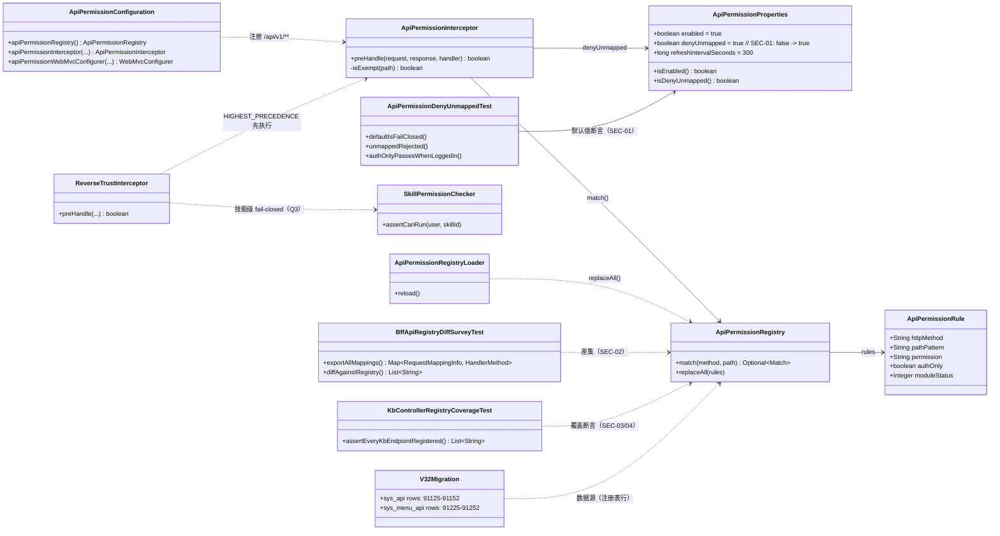
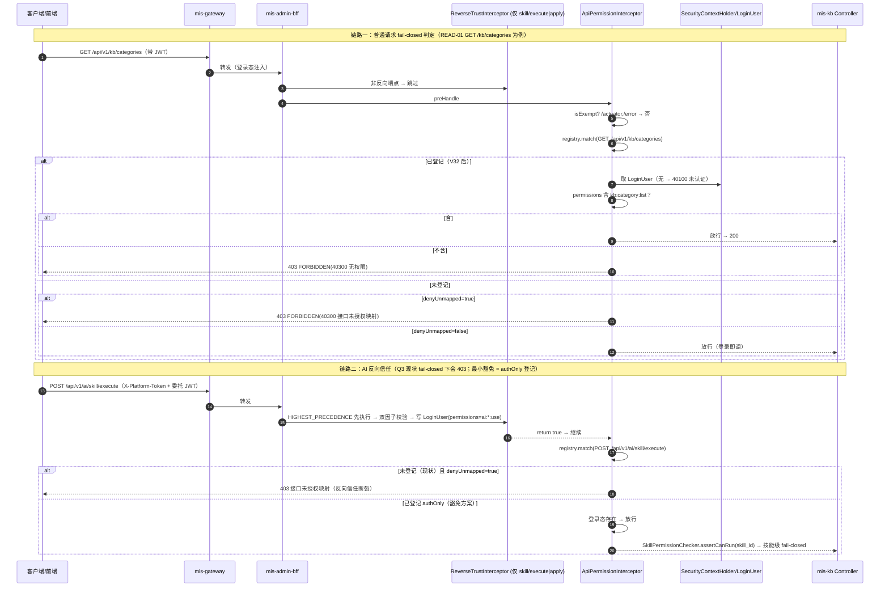
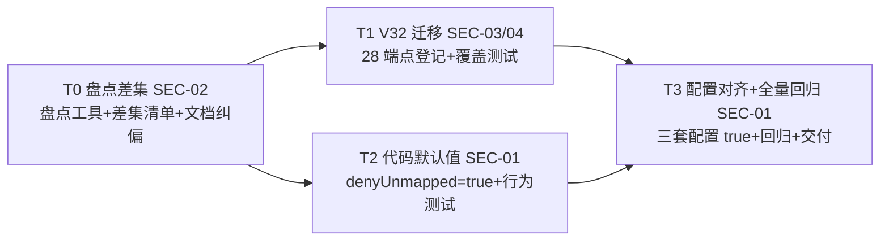

# MIS 知识库（mis-kb）技术债安全专项 系统设计 + 任务分解

- **作者**：高见远（软件架构师）
- **日期**：2026-08-12
- **状态**：定稿（待主理人复核 Q1/Q3 处置结论与待拍板事项）
- **上游**：`deliverables/software-company/kb-security-sprint-prd-2026-08-12.md`（许清楚，SEC-01~04 + Q1~Q8 + 盘点表）
- **基线**：`docs/backend/knowledge-base-phase2-plan.md` §11（11.2/11.3）、`docs/backend/mis-kb-enterprise-phase1-design-2026-08-11.md`（块① V30）、`docs/backend/mis-kb-wave-b-graphrag-design-2026-08-11.md`（块② V31）、`docs/backend/api-permission-mapping.md`
- **下游**：寇豆码（软件工程师）按本文任务列表实现；严过关（QA）按本文验收映射验收
- **配套文件**：`mis-kb-security-sprint-class.mermaid`（类图）、`mis-kb-security-sprint-seq.mermaid`（时序图）

---

## 0. 本设计与 PRD 的映射

| PRD 需求 | 本文章节 | 结论 |
|---|---|---|
| SEC-01 denyUnmapped fail-closed（P0） | §1.2 / §1.6 / §2 / §4 / §5 | 代码默认值 false→true + 三套配置对齐 true；双路径（补登先行 + 止血预案）；验收：未登记 403、已登记零回归 |
| SEC-02 全平台差集盘点（P0 前置） | §1.1 / §1.4 / §5.2 | RequestMappingHandlerMapping 运行时导出 vs sys_api 45 行基线差集；交付差集清单；非 KB 域只盘点不改造 |
| SEC-03 KB 读端点 READ-01~24 登记（P1） | §1.7 / §3 | V32 迁移，id 91125+/code 00900041+/menu_api 91225+，复用既有 kb:* 码，一码一菜单 |
| SEC-04 KB 遗漏写端点 WRITE-01~04 登记（P1，等同 P0） | §1.7 / §3 | 同 V32 迁移；fail-closed 下删除知识库 403 = 直接功能故障 |
| Q1~Q8 主理人裁决 | §1.1~§1.5 | 逐条执行（含理由）；Q3 给出 authOnly 最小豁免方案但不阻塞 KB |
| 明确不做 | §1.4 / §10 | 11.5（已销）、权限码重构、非 KB 域改造、11.4 public ACL、authOnly 二期 |

---

## 1. 实现方案与关键决策

### 1.0 现状核查结论（读码核验，非臆测）

| # | 核查项 | 结论 | 证据 |
|---|---|---|---|
| 1 | 代码默认值 | `ApiPermissionProperties.java:12` `private boolean denyUnmapped = false;`（fail-open） | 读码 |
| 2 | 拦截器行为 | `ApiPermissionInterceptor.preHandle`：未映射路径在 `denyUnmapped=true` 抛 `BusinessException(FORBIDDEN, "接口未授权映射")`；false 时 `return true` **提前放行**（早于 L66-70 LoginUser 判空） | 读码 `ApiPermissionInterceptor.java:52-58` |
| 3 | 注册范围 | mis-admin-bff `addPathPatterns("/api/v1/**")` → **全平台 BFF 端点**；豁免 `/actuator`、`/error` | `ApiPermissionConfiguration.java:44`、`ApiPermissionInterceptor.java:90-93` |
| 4 | 生效环境 | **prod 已 `deny-unmapped: true`**（commit `6db58b0`，2026-08-11 15:57，git show 证实）；test / integration / 本地 application.yml 均 false | `deploy/nacos-config/prod/mis-admin-bff.yaml:30`、git log/show |
| 5 | 唯一 PEP 入口 | `ApiPermissionInterceptor` 仅在 mis-admin-bff 注册；mis-kb 自身不注册（内部 `/internal/**` 由 `InternalServiceTrustInterceptor` 管） | grep 全仓 |
| 6 | 已登记基线 | **45 行** = V17 hit-test(1) + V18 synonyms(11) + V24/25 categories(5) + V26 engine(3) + V27 engine-p1(6) + V30 写端点(17) + V31 graph(2)；段位末位 = sys_api 91124 / code 00900040 / menu_api 91224 / sort 49 | 迁移逐条核对 + PRD §2.2 |
| 7 | 未登记 28 端点 | READ-01~24 + WRITE-01~04 **全部未在 sys_api**（grep 全仓迁移无 path 冲突）；BFF `KbController` 映射逐字存在 | grep V*.sql + `KbController.java` 映射清单 |
| 8 | 注册表匹配 | `AntPathMatcher`：`{id:[0-9]+}` 按单段通配匹配（与 V30/V31 同款），method+path 精确；authOnly 由「permission 为空」派生 | `ApiPermissionRegistry.java`、`ApiService.java:38` |
| 9 | 错误响应 | 未映射拒绝 = HTTP 403 + `Result{code:40300, message:"接口未授权映射"}`；已映射无权限 = 40300「无权限」；未登录 = 40100「未认证」 | `ResultCode.java:44/51` |
| 10 | 文档纠偏 | `api-permission-mapping.md:115` 称 `GET /engine/capabilities`「已有」——**实际未登记**，需随 V32 修订 | grep 全仓迁移 |

### 1.1 Q1 裁决：prod 已 fail-closed —— 按最坏情况处理，双路径执行

- **结论**：采纳「prod 已 fail-closed」为既成事实（git blame/`git show 6db58b0` 证实配置已提交；本地无法确认运行时是否加载，按最坏情况处理）。
- **双路径**：
  - **① 紧急止血（运维预案，非代码任务）**：若确认 prod KB 未登记端点已 403（KB 读/删库不可用）且 V32 无法立即上线 → Nacos prod `mis.api-permission.deny-unmapped` 临时改 `false`，**配置级秒级生效 + 注册表 300s 重载**（`ApiPermissionConfiguration` `@Scheduled` 定时 `reload`）。**恢复条件**：V32 迁移落地并确认 28 端点已登记后，改回 `true`（与现状一致）。操作步骤与回滚详见 §1.6。
  - **② 永久修复**：V32 补登 28 端点（SEC-03/04）→ 注册表重载后 KB 域全量覆盖 → 维持/恢复 `true`。**验收顺序：补登先行**。
- **理由**：fail-closed 是平台级安全默认值，不能为了单模块可用性长期回退；「先补登记、再确认/推广」是 PRD 口径，也是 11.3 原文「差集清零后再收紧」的落地。

### 1.2 Q2 裁决：代码默认值 `denyUnmapped` false→true —— 采纳，但以 SEC-02 差集盘点为前置硬门槛

- **结论**：`ApiPermissionProperties.denyUnmapped` 默认值改 `true`（fail-closed 安全默认值），随版本发布。
- **前置硬门槛**：SEC-02 差集盘点（T0）必须产出**可执行清单**——非 KB 域未登记端点逐项列入清单并标注处置结论（补登/豁免/**待运营评估**），**不得静默放行**；主理人对清单评审通过后，T2 才可开工。
- **拆步兜底（PRD Q2 产品倾向）**：若差集面大且主理人判定不可接受，可拆两步——本期先改 test/integration 配置 + 留代码默认值，二期改代码。**本设计默认按一步执行**（当前所有已知环境均显式配置该属性，默认值改动不改变任何已知环境行为，见 §1.6 影响面）。
- **与 SEC-01 验收对齐**：①未登记 403（40300「接口未授权映射」）；②已登记零回归（有权限 200 / 无权限 403 / 未登录 401）；③test/integration/prod 三套配置 true；④默认值改 true 后不带配置启动的本地行为与配置 true 一致（由 `ApiPermissionDenyUnmappedTest` 断言）。

### 1.3 Q3 裁决：AI 反向信任端点 `skill/execute|apply` —— 不阻塞 KB，列入差集清单 + authOnly 最小豁免方案

- **结论**：本期**不阻塞 KB 收紧**；将 `POST /api/v1/ai/skill/execute` 与 `POST /api/v1/ai/skill/apply` 列入 SEC-02 差集清单，标注「**AI 反向信任白名单依赖**」，处置建议 = **authOnly 登记**，由主理人另行拍板（本期 V32 不包含）。
- **为什么是 authOnly（最小豁免，不新建机制）**：
  - `ReverseTrustInterceptor` 以 `@Order(HIGHEST_PRECEDENCE)` 先于 `ApiPermissionInterceptor` 执行，校验通过后写入 `LoginUser`（permissions=`{"ai:*:use"}`）并 `return true` **继续放行到 PEP**；`X-Platform-Token` 缺失时（普通前端调用）也放行到 PEP。
  - 这两个端点**未登记 sys_api**（V21 刻意不做，真实判权粒度在 body `skill_id` → `SkillPermissionChecker`，fail-closed）。fail-closed 下 PEP 对未映射路径直接 403 → 反向信任链路断裂。
  - 真实闸门是 `SkillPermissionChecker`（按 skill_id 拼 `ai:skill:{id}:run` 判权），**URL 级挂任何单一权限码都无法表达技能粒度**；故正确登记形态 = **authOnly（登录即可调、不做 URL 权限码）**，让请求到达 Controller，再由 `SkillPermissionChecker` 做技能级 fail-closed。`ApiPermissionRegistry`/`ApiService` 已原生支持 authOnly（permission 为空即 authOnly），**零新机制**。
  - 挂载方式：sys_api 行 + sys_menu_api 关联到 **permission=NULL 的既有菜单**（如 V21 建的「AI 技能执行权」目录/或既有仅登录菜单），复用既有登记路径。
- **执行边界**：本期只把方案写入设计 + 差集清单；是否在 V33 补登记由主理人拍板（若已在 sys_api 则顺带登记，实测未在）。

### 1.4 Q4 裁决：非 KB 域 —— 只盘点不改造

- **结论**：SEC-02 仅产出差集清单 + 影响评估；非 KB 域未登记端点（IAM/ORG/SYSTEM/AI/agent-ops 等）**本期不登记、不收紧改造**，逐项列清单标注「待运营评估」/「建议补登」/「建议 authOnly」/「二期」。
- 若盘点发现某域差集为零（如 agent-ops 全量已登记），可在清单中标注「该域已收敛」，但**不主动追加登记**（超出本期边界，留主理人决策）。

### 1.5 Q5~Q8 裁决（技术细节，含理由）

| # | 问题 | 裁决 | 理由 |
|---|---|---|---|
| Q5 | `GET /subjects/search` 权限码 | **`kb:acl:list`**（挂菜单 91035，与 ACL 列表同权） | 授权主体检索是「权限管理页」的前置能力（授权前先搜主体），语义与 ACL 页一致；零新增权限码符合本期原则 |
| Q6 | `GET /libraries/{id}/engine/settings` 权限码 | **`kb:library:edit`**（挂按钮 91044） | RAG 设置是敏感配置（含引擎参数/密钥相关），「能改才能看」与块①「修改 RAG 设置」用同一码，语义对齐；用 `kb:library:list` 会放开只读用户读取敏感配置 |
| Q7 | 迁移段位 | **V32 起；sys_api 91125-91152；code 00900041-00900068；menu_api 91225-91252；sort 50-77** | 实测 V31 末位 91124/00900040/91224/sort49，全部空闲无冲突（grep 全仓迁移核对）；实施时以「当时仓库最大版本号+1」为准 |
| Q8 | `GET /operations/qa/export` 权限 | **维持 `kb:operation:list`**（与列表同权，挂 91037） | 导出内容 = 列表可见内容（同 ACL 范围），导出文件流不额外收紧；若后续要「导出需更高权限」可单独加码（二期） |

### 1.6 `denyUnmapped` 默认值变更影响面评估 + 回滚预案

**影响面评估（默认值 false→true）**：

| 环境 | 当前显式配置 | 默认值改 true 后的行为 |
|---|---|---|
| prod | `deny-unmapped: true`（显式） | **无变化**（保持 fail-closed） |
| test / integration | `deny-unmapped: false`（显式） | **无变化**（直到 T3 显式翻转） |
| 本地 application.yml | `deny-unmapped: false`（显式） | **无变化**（直到 T3 显式翻转） |
| **未配置该属性的环境**（未来新建环境 / 误删配置 / 其他嵌用 mis-common-security 的服务） | 无 | **从 fail-open 变 fail-closed**：未映射路径 403 |

> 关键结论：`ApiPermissionProperties` 默认值改动对**所有已知环境零行为变化**（均显式配置），是「安全网」式收紧——只影响未来未显式配置的环境。真正的行为变化发生在 T3 把 test/integration/本地配置翻转为 `true` 时。因此：
> - 代码默认值（T2）风险低，但**必须**以 SEC-02 差集清单为前置（防止「新环境/漏配环境」上线即大面积 403）；
> - 配置翻转（T3）风险高，**必须**在 V32 落地后执行，且非 KB 未登记端点在 test 环境会 403——需主理人对差集清单评审结论（PRD R2）。

**回滚预案**：

| 场景 | 动作 | 时效 |
|---|---|---|
| 配置翻转后 test/integration 大面积 403（误杀） | Nacos test/integration `deny-unmapped` 回 `false`（一处改动） | 配置级秒级生效 + 注册表 300s 重载 |
| prod KB 已不可用且等不及补登 | Nacos prod `deny-unmapped` 临时回 `false` → 紧急补登窗口 → 补登完成后恢复 `true` | 配置级 |
| 代码默认值改 true 后新环境异常 | 在环境配置显式写 `deny-unmapped: false`（临时）或回滚代码 | 配置级/版本级 |
| 迁移登记出错 | Flyway 只追加不回滚；V32+ 追加修复迁移（参照 V25 修 V24 先例） | 新版本修复 |

**prod 临时止血操作步骤（Q1 ①，运维执行，非代码任务）**：
1. Nacos 控制台 → `mis-admin-bff`（prod）→ 编辑 `mis.api-permission.deny-unmapped` → `false` → 发布；
2. BFF 下一次 `refresh-interval-seconds=300s` 定时重载注册表后生效（或重启 BFF 立即生效）；
3. 验证 KB 读/删库恢复可用；
4. **恢复条件**：V32 迁移落地 → 28 端点登记确认（`KbControllerRegistryCoverageTest` 绿 / 自检 SQL 通过）→ Nacos 改回 `true` → 验证已登记端点零回归、未登记端点 403；
5. 全程记录操作时间与配置 diff，回传主理人归档。

### 1.7 28 端点登记表（READ-01~24 + WRITE-01~04，V32 迁移内容）

> 段位依据：V31 末位 sys_api=91124 / code=00900040 / menu_api=91224 / sort=49；V32 顺延 **91125-91152 / 00900041-00900068 / 91225-91252 / sort 50-77**。
> 与 45 行基线查重：全部 method+path 无重复（grep 全仓迁移核实）；code 段无重叠；menu 节点全部为既有节点（91032-91038 页面 / 91044/91045/91051 按钮），**零新增菜单、零新增权限码**。
> path_pattern 采用 V30/V31 同款 `{id:[0-9]+}` / `{libraryId:[0-9]+}` / `{sessionId}` / `{ticketId}` 隔离写法（AntPathMatcher 单段通配）。

| 编号 | sys_api id | code | 方法 | path_pattern（登记值） | 功能 | 权限码 | menu_id | menu_api id | sort |
|---|---|---|---|---|---|---|---|---|---|
| READ-01 | 91125 | 00900041 | GET | `/api/v1/kb/categories` | 分类列表 | `kb:category:list` | 91032 | 91225 | 50 |
| READ-02 | 91126 | 00900042 | GET | `/api/v1/kb/libraries` | 库列表 | `kb:library:list` | 91033 | 91226 | 51 |
| READ-03 | 91127 | 00900043 | GET | `/api/v1/kb/libraries/{id:[0-9]+}` | 库详情 | `kb:library:list` | 91033 | 91227 | 52 |
| READ-04 | 91128 | 00900044 | GET | `/api/v1/kb/libraries/{id:[0-9]+}/detail` | 详情聚合 | `kb:library:list` | 91033 | 91228 | 53 |
| READ-05 | 91129 | 00900045 | GET | `/api/v1/kb/libraries/{id:[0-9]+}/engine/settings` | RAG 设置读取 | `kb:library:edit` | 91044 | 91229 | 54 |
| READ-06 | 91130 | 00900046 | GET | `/api/v1/kb/libraries/{libraryId:[0-9]+}/documents` | 文档列表 | `kb:document:list` | 91034 | 91230 | 55 |
| READ-07 | 91131 | 00900047 | GET | `/api/v1/kb/libraries/{libraryId:[0-9]+}/documents/{id:[0-9]+}` | 文档详情 | `kb:document:list` | 91034 | 91231 | 56 |
| READ-08 | 91132 | 00900048 | GET | `/api/v1/kb/libraries/{libraryId:[0-9]+}/acls` | ACL 列表 | `kb:acl:list` | 91035 | 91232 | 57 |
| READ-09 | 91133 | 00900049 | GET | `/api/v1/kb/qa/sessions/mine` | 我的会话 | `kb:qa:ask` | 91036 | 91233 | 58 |
| READ-10 | 91134 | 00900050 | GET | `/api/v1/kb/qa/sessions/{sessionId}` | 会话详情 | `kb:qa:ask` | 91036 | 91234 | 59 |
| READ-11 | 91135 | 00900051 | GET | `/api/v1/kb/qa/sessions/{sessionId}/feedback` | 反馈详情 | `kb:qa:ask` | 91036 | 91235 | 60 |
| READ-12 | 91136 | 00900052 | GET | `/api/v1/kb/operations/qa/sessions` | 运营会话列表 | `kb:operation:list` | 91037 | 91236 | 61 |
| READ-13 | 91137 | 00900053 | GET | `/api/v1/kb/operations/qa/sessions/{sessionId}` | 运营会话详情 | `kb:operation:list` | 91037 | 91237 | 62 |
| READ-14 | 91138 | 00900054 | GET | `/api/v1/kb/operations/qa/sessions-all` | 全量会话 | `kb:operation:list` | 91037 | 91238 | 63 |
| READ-15 | 91139 | 00900055 | GET | `/api/v1/kb/operations/qa/feedback` | 反馈列表 | `kb:operation:list` | 91037 | 91239 | 64 |
| READ-16 | 91140 | 00900056 | GET | `/api/v1/kb/operations/stats` | 评价看板 | `kb:operation:list` | 91037 | 91240 | 65 |
| READ-17 | 91141 | 00900057 | GET | `/api/v1/kb/operations/qa/export` | 运营 CSV 导出 | `kb:operation:list` | 91037 | 91241 | 66 |
| READ-18 | 91142 | 00900058 | GET | `/api/v1/kb/operations/qa/tickets` | 工单列表 | `kb:operation:list` | 91037 | 91242 | 67 |
| READ-19 | 91143 | 00900059 | GET | `/api/v1/kb/operations/qa/tickets/{ticketId}` | 工单详情 | `kb:operation:list` | 91037 | 91243 | 68 |
| READ-20 | 91144 | 00900060 | GET | `/api/v1/kb/operations/qa/tickets/by-session/{sessionId}` | 会话侧栏工单 | `kb:operation:list` | 91037 | 91244 | 69 |
| READ-21 | 91145 | 00900061 | GET | `/api/v1/kb/subjects/search` | 授权主体检索 | `kb:acl:list` | 91035 | 91245 | 70 |
| READ-22 | 91146 | 00900062 | GET | `/api/v1/kb/engine/health` | 引擎健康 | `kb:engine:view` | 91038 | 91246 | 71 |
| READ-23 | 91147 | 00900063 | GET | `/api/v1/kb/engine/capabilities` | 引擎能力 | `kb:engine:view` | 91038 | 91247 | 72 |
| READ-24 | 91148 | 00900064 | GET | `/api/v1/kb/engine/models` | 引擎模型池 | `kb:engine:view` | 91038 | 91248 | 73 |
| WRITE-01 | 91149 | 00900065 | DELETE | `/api/v1/kb/libraries/{id:[0-9]+}` | 删除/归档知识库 | `kb:library:delete` | 91045 | 91249 | 74 |
| WRITE-02 | 91150 | 00900066 | POST | `/api/v1/kb/qa/feedback` | 提交问答反馈 | `kb:qa:feedback` | 91051 | 91250 | 75 |
| WRITE-03 | 91151 | 00900067 | POST | `/api/v1/kb/operations/qa/tickets` | 创建问答工单 | `kb:qa:ask` | 91036 | 91251 | 76 |
| WRITE-04 | 91152 | 00900068 | PATCH | `/api/v1/kb/operations/qa/tickets/{ticketId}` | 处理问答工单 | `kb:operation:list` | 91037 | 91252 | 77 |

**一码一菜单核验（uk_menu_app_permission）**：本表**不新建任何 sys_menu 行**，只加 sys_menu_api 关联到既有菜单；每个权限码只出现在一个菜单节点上（`kb:category:list`→91032、`kb:library:list`→91033、`kb:document:list`→91034、`kb:acl:list`→91035、`kb:qa:ask`→91036、`kb:operation:list`→91037、`kb:engine:view`→91038、`kb:library:edit`→91044、`kb:library:delete`→91045、`kb:qa:feedback`→91051）→ 零冲突。

**权限码语义对齐（零新增业务码）**：全部复用既有 `kb:*` 体系；Q5/Q6/Q8 已按 §1.5 裁决。

---

## 2. 文件列表

> A = 新增；M = 修改。路径相对仓库根。层：mis-admin-bff / mis-common-security / mis-migrator / 配置 / 文档。

### 2.1 新增文件

| 层 | 相对路径 | 说明 |
|---|---|---|
| 迁移 | `backend/mis-migrator/src/main/resources/db/migration/V32__kb_security_sprint.sql` | SEC-03/04：28 端点 sys_api + sys_menu_api 登记（零 DDL），含自检 SQL |
| BFF 测试 | `backend/mis-admin-bff/src/test/java/com/mis/adminbff/audit/BffApiRegistryDiffSurveyTest.java` | SEC-02 盘点工具：`RequestMappingHandlerMapping` 运行时导出全量端点 + 与注册表差集 |
| BFF 测试 | `backend/mis-admin-bff/src/test/java/com/mis/adminbff/audit/KbControllerRegistryCoverageTest.java` | SEC-03/04 验收：KB 全量端点（含 28 新登记）逐条断言已在注册表，权限码正确 |
| 安全测试 | `backend/mis-common/mis-common-security/src/test/java/com/mis/common/security/permission/ApiPermissionDenyUnmappedTest.java` | SEC-01 验收：默认值 true；未登记路径 403；已登记 authOnly 登录放行 |
| 文档 | `docs/backend/mis-kb-security-sprint-design-2026-08-12.md` | 本文档 |
| 文档 | `docs/backend/mis-kb-security-sprint-class.mermaid` | 类图（配套） |
| 文档 | `docs/backend/mis-kb-security-sprint-seq.mermaid` | 时序图（配套） |
| 文档（T0 交付物） | `docs/backend/mis-kb-security-sprint-diff-list-2026-08-12.md` | SEC-02 差集清单（工程师产出，结构见 §5.2） |

### 2.2 修改文件

| 层 | 相对路径 | 改动 |
|---|---|---|
| 安全 | `backend/mis-common/mis-common-security/src/main/java/com/mis/common/security/permission/ApiPermissionProperties.java` | `denyUnmapped` 默认值 false→true（SEC-01） |
| 配置 | `backend/mis-admin-bff/src/main/resources/application.yml` | `mis.api-permission.deny-unmapped: false` → `true`（SEC-01，本地对齐） |
| 配置 | `deploy/nacos-config/test/mis-admin-bff.yaml` | `deny-unmapped: false` → `true`（SEC-01） |
| 配置 | `deploy/nacos-config/integration/mis-admin-bff.yaml` | `deny-unmapped: false` → `true`（SEC-01） |
| 配置 | `deploy/nacos-config/prod/mis-admin-bff.yaml` | **核验不改**（已 true）；如补充注释说明 28 端点已登记可加一行注释（可选） |
| 文档 | `docs/backend/api-permission-mapping.md` | ① engine/capabilities 行纠偏（「已有」→「V32 登记」）；② 补 28 端点登记表；③ 仅登录 API 段补 authOnly 口径说明 |

> 无前端改动、无 mis-kb 主代码改动（登记是 DB 行，不触碰 BFF/mis-kb 业务代码）。

---

## 3. 数据结构与迁移

### 3.1 V32 迁移 SQL 设计（要点）

```sql
-- V32__kb_security_sprint.sql —— 技术债 11.2 收尾 + 11.3 前置补登
-- 设计：docs/backend/mis-kb-security-sprint-design-2026-08-12.md
-- 前置：V31 为当前最新；本文件为 V32，Flyway 只追加不修改已发布版本。
-- 内容：A. sys_api 登记 28 端点（READ-01~24 + WRITE-01~04） + sys_menu_api 关联；零 DDL。
--   段位：sys_api 91125-91152 / code 00900041-00900068 / menu_api 91225-91252 / sort 50-77
--   挂载：复用既有菜单节点（91032-91038 页面 / 91044/91045/91051 按钮），一码一菜单，零新增菜单/权限码。
--   幂等：固定 ID + WHERE NOT EXISTS + (method,path) 去重 + ON CONFLICT DO NOTHING（同 V30/V31）。

INSERT INTO sys_api (id, module_id, parent_id, code, type, name, http_method, path_pattern, sort, status, created_at, updated_at)
SELECT v.* FROM (VALUES
    -- READ-01~24（id 91125-91148 / code 00900041-00900064 / sort 50-73）
    (91125, 91020, 91060, '00900041', 'api'::sys_api_node_type, '查询知识库分类',      'GET',    '/api/v1/kb/categories',                                                  50, 1, NOW(), NOW()),
    (91126, 91020, 91060, '00900042', 'api'::sys_api_node_type, '查询知识库列表',      'GET',    '/api/v1/kb/libraries',                                                  51, 1, NOW(), NOW()),
    -- ...（按 §1.7 登记表逐行，共 28 行；工程实现按 V30/V31 模板）
    (91152, 91020, 91060, '00900068', 'api'::sys_api_node_type, '处理问答工单',        'PATCH',  '/api/v1/kb/operations/qa/tickets/{ticketId}',                           77, 1, NOW(), NOW())
) AS v(id, module_id, parent_id, code, type, name, http_method, path_pattern, sort, status, created_at, updated_at)
WHERE NOT EXISTS (SELECT 1 FROM sys_api WHERE id = v.id)
  AND NOT EXISTS (SELECT 1 FROM sys_api WHERE module_id = v.module_id AND code = v.code)
  AND NOT EXISTS (
    SELECT 1 FROM sys_api a
    WHERE a.type = 'api' AND a.status = 1
      AND a.http_method = v.http_method AND a.path_pattern = v.path_pattern
  )
  AND EXISTS (SELECT 1 FROM sys_api WHERE id = 91060);

-- sys_menu_api 关联：api → 承载权限码的既有菜单（§1.7 表 menu_id/menu_api_id 列）
INSERT INTO sys_menu_api (id, menu_id, api_id, sort, created_at)
SELECT v.* FROM (VALUES
    (91225, 91032, 91125, 1, NOW()),
    (91226, 91033, 91126, 1, NOW()),
    -- ...（28 行）
    (91252, 91037, 91152, 1, NOW())
) AS v(id, menu_id, api_id, sort, created_at)
WHERE NOT EXISTS (SELECT 1 FROM sys_menu_api WHERE id = v.id)
  AND NOT EXISTS (SELECT 1 FROM sys_menu_api WHERE menu_id = v.menu_id AND api_id = v.api_id)
  AND EXISTS (SELECT 1 FROM sys_menu WHERE id = v.menu_id)
  AND EXISTS (SELECT 1 FROM sys_api  WHERE id = v.api_id);
```

**迁移后自检 SQL（迁移文件尾，参照 V30/V31）**：
1. `SELECT a.id, a.http_method, a.path_pattern, m.permission FROM sys_api a JOIN sys_menu_api ma ON ma.api_id=a.id JOIN sys_menu m ON ma.menu_id=m.id WHERE a.id BETWEEN 91125 AND 91152 ORDER BY a.id;` — 期望 28 行，permission 分布见 §1.7；
2. 一码一菜单：`SELECT api_id, count(*) FROM sys_menu_api WHERE api_id BETWEEN 91125 AND 91152 GROUP BY api_id HAVING count(*)>1;` — 期望 0 行；
3. 幂等回归：重复执行后仍 28 行 / 0 行；
4. 冲突回归：`SELECT 1 FROM sys_api WHERE (http_method, path_pattern) IN (SELECT http_method, path_pattern FROM (VALUES ...) v(...)) GROUP BY 1 HAVING count(*) > 1;` — 期望 0。

### 3.2 类图（Mermaid classDiagram）

完整类图见 `mis-kb-security-sprint-class.mermaid`，核心关系摘要：



---

## 4. 接口设计

### 4.1 无新端点

本期**不新增任何 REST 端点**（纯登记 + 配置 + 代码默认值 + 测试/文档）。所有变更只影响既有端点的**门控行为**。

### 4.2 fail-closed 生效后的行为变化（未登记 403 响应体）

| 场景 | fail-open（现状 test/integration/本地） | **fail-closed（prod 现状 / 本期推广后）** |
|---|---|---|
| 未登记路径 + 任意登录态 | 放行（`return true`，早于登录判空） | **HTTP 403** + `Result{code:40300, message:"接口未授权映射", data:null, traceId}` |
| 已登记 + 未登录 | 401（`UNAUTHORIZED` 40100） | 401（不变） |
| 已登记 + 有权限码 | 200 | 200（不变） |
| 已登记 + 无权限码 | 403（`FORBIDDEN` 40300「无权限」） | 403（不变） |
| 已登记 + authOnly（permission 为空） | 登录即放行 | 登录即放行（不变） |
| `/actuator`、`/error` | 豁免放行 | 豁免放行（不变） |

> **审计口径（PRD R6）**：拦截器 403 的调用**不产生 sys_oper_log**（切面在 Controller 层，未到达即无审计）——维持既有口径，非本期引入；如需「403 留痕」列二期。

---

## 5. 程序调用流程

### 5.1 请求 → 拦截器 fail-closed 判定（时序图）

完整时序图见 `mis-kb-security-sprint-seq.mermaid`，主链路摘要：



### 5.2 SEC-02 差集盘点方法（推荐：运行时导出为主，静态扫描为辅）

| 方法 | 做法 | 优点 | 缺点 | 推荐度 |
|---|---|---|---|---|
| **运行时导出（主）** | JUnit 测试用 `StaticApplicationContext` 注册全部 BFF Controller + `RequestMappingHandlerMapping.afterPropertiesSet()` 导出全量 (method, path)（含类级前缀拼接），与 sys_api 注册表（45 行基线 + 已登记清单）做差集 | 与 Spring 实际解析一致（正则路径变量、类级前缀、`RequestMethod` 精确）；已有先例 `KbControllerOperLogCoverageTest`（块① QA 证实可运行） | 需要能起 Spring 上下文；注册表侧需 fixture（可从迁移 grep 生成） | **主** |
| 静态扫描（辅） | grep 全部 Controller `@*Mapping` + 类级 `@RequestMapping` 拼接 + 正则归一化 `{id:[0-9]+}`→`{id}` | 无需运行环境；可脚本化 | 漏类级条件映射/方法限定；正则归一化易错；对 Spring 语义不精确 | 交叉验证 |

**执行流程（T0）**：
1. 写 `BffApiRegistryDiffSurveyTest`：注册全部 19 个 Controller → 导出全部 `/api/v1/**` 端点；
2. 注册表侧：从全仓迁移 grep 出已登记 45 行（method+path+permission）作 fixture（也可运行时查 mis-system `ApiService.apiPermissionRegistry()`）；
3. 差集 = 导出的全部端点 − 已登记 45 行；
4. 逐项标注：KB 域（应全部为 28 待登记）→ 确认无遗漏；非 KB 域 → 影响评估 + 建议动作（补登/authOnly/豁免/二期/待运营评估）；
5. 产出 `docs/backend/mis-kb-security-sprint-diff-list-2026-08-12.md`（结构见下），回传主理人评审；
6. 静态扫描（grep 汇总）交叉验证，防运行时导出漏 Controller。

**差集清单文档结构**：
| 方法 | 路径 | Controller 来源 | 域 | 是否已登记 | 影响评估（fail-closed 后） | 建议动作 | 处置结论（主理人） |

---

## 6. 依赖包列表

**无新增第三方依赖**：
- 后端：Spring Boot 3.2.5（自带 `RequestMappingHandlerMapping` / `AntPathMatcher` / JUnit 5）、Flyway、JPA/PostgreSQL 既有；无新库。
- 前端：本期零前端改动，无新包。

---

## 7. 任务列表（T0 起，含依赖、实现顺序、验收点，与 SEC 映射）

> 分组原则：按功能模块整组交付，不按单文件拆分；任务数 ≤5。T0 为唯一硬前置（差集盘点），T1/T2 相对独立可并行，T3 收口集成。

| 编号 | 任务 | 目标 | 涉及文件 | 依赖 | 优先级 | SEC 映射 |
|---|---|---|---|---|---|---|
| **T0** | **项目基础设施 + SEC-02 差集盘点（前置硬门槛）** | 运行时盘点工具落地；产出《全平台 BFF 端点 vs sys_api 差集清单》（非 KB 域逐项处置结论）；`api-permission-mapping.md` engine/capabilities 纠偏标注 | `BffApiRegistryDiffSurveyTest.java`(A)、`docs/backend/mis-kb-security-sprint-diff-list-2026-08-12.md`(A)、`docs/backend/api-permission-mapping.md`(M) | — | P0 | SEC-02 |
| **T1** | **V32 迁移：KB 读端点 READ-01~24 + 遗漏写端点 WRITE-01~04 登记（SEC-03/04）** | V32 SQL 落地（28 行 sys_api + 28 行 sys_menu_api，幂等、一码一菜单、段位查重）；KB 端点注册表覆盖断言测试；api-permission-mapping.md 补 28 端点登记表 | `backend/mis-migrator/src/main/resources/db/migration/V32__kb_security_sprint.sql`(A)、`KbControllerRegistryCoverageTest.java`(A)、`docs/backend/api-permission-mapping.md`(M) | T0（差集确认 KB 未登记清单无遗漏、无 path 冲突） | P0 | SEC-03 / SEC-04 |
| **T2** | **SEC-01 代码默认值 fail-closed + 行为测试** | `ApiPermissionProperties.denyUnmapped` 默认 true；新测试断言默认值/未登记 403/authOnly 放行；BFF 侧 fail-closed 行为断言 | `ApiPermissionProperties.java`(M)、`ApiPermissionDenyUnmappedTest.java`(A)、BFF 行为测试（新增或扩展现有 `KbController*PermissionTest`）(A/M) | T0（差集清单评审通过为前置） | P0 | SEC-01（代码部分） |
| **T3** | **SEC-01 配置对齐 + 全量回归 + 交付** | test/integration/本地 application.yml 三处 `deny-unmapped: true`（prod 保持 true 核验）；全量回归（mis-kb/mis-admin-bff/mis-common-security）通过；产出交付说明（含止血预案记录与验收映射） | `deploy/nacos-config/test/mis-admin-bff.yaml`(M)、`deploy/nacos-config/integration/mis-admin-bff.yaml`(M)、`backend/mis-admin-bff/src/main/resources/application.yml`(M)、回归中修复的测试文件（按需）(M)、交付说明文档(A) | T1（V32 落地）、T2（代码默认值） | P0 | SEC-01（配置部分）+ 全量验收 |

> **执行顺序说明**：安全收紧顺序不可逆——「盘点先行（T0）→ 补登先行（T1）→ 默认值（T2）→ 配置推广（T3）」是 Q1/Q2 主理人裁决的直接落地；T1 与 T2 仅依赖 T0，可并行；T3 必须在 T1+T2 后，否则配置翻转会大面积 403。

**T0 验收点**：①盘点工具运行成功，导出全量 `/api/v1/**` 端点（≥ KbController 50 端点 + 其他域）；②差集清单覆盖非 KB 未登记端点且逐项有处置结论；③`api-permission-mapping.md` 纠偏落笔。
**T1 验收点**：①V32 幂等可重放（重复执行不产生重复行）；②28 行 sys_api + 28 行 sys_menu_api 无 uk_api_method_path / uk_menu_api_pair / uk_menu_app_permission 冲突；③`KbControllerRegistryCoverageTest` 绿（28 端点 method+path 与 BFF Controller 逐字一致、权限码正确）；④自检 SQL 输出符合预期。
**T2 验收点**：①`ApiPermissionProperties` 默认 true；②`ApiPermissionDenyUnmappedTest` 绿（默认值断言 / 未登记 40300「接口未授权映射」/ authOnly 登录放行）；③BFF 行为测试绿；④mis-common-security + mis-admin-bff 相关套件无回归。
**T3 验收点**：①三套配置 + 本地 application.yml 均 `deny-unmapped: true`（prod 核验保持）；②全量回归：mis-kb 397 例、mis-admin-bff 250 例（或增量）、mis-common-security 全绿；③交付说明含：未登记 403 断言记录、已登记零回归记录、prod 止血预案操作步骤。

---

## 8. 共享知识（跨文件约定）

1. **迁移版本号**：V32 起（V31 已用）；Flyway 只追加不修改已发布版本；实施时以「当时仓库最大版本号 + 1」为准。
2. **sys_api 段位**：api id `91125+`、code `00900041+`、menu_api id `91225+`、sort `50+`；幂等写法（WHERE NOT EXISTS + ON CONFLICT DO NOTHING）参照 V26/V27/V30/V31。
3. **一码一菜单铁律**：`uk_menu_app_permission (app_id, permission) WHERE status=1`；本期**零新增菜单、零新增权限码**，28 行全部挂既有菜单节点（91032-91038 / 91044 / 91045 / 91051）。
4. **path_pattern 隔离口径**：详情/子资源用 `{id:[0-9]+}` / `{libraryId:[0-9]+}` / `{sessionId}` / `{ticketId}` 单段通配；字面路径（`sessions/mine`、`sessions-all`、`by-session/{sessionId}`、`reconcile`、`capabilities` 等）逐字登记；与 V30/V31 同款。
5. **AntPathMatcher 语义**：`{var}` 匹配恰好一个路径段；同一 method 下多条规则命中时权限取并集（任一即可）——KB 内同权路径（如 `sessions/mine` 与 `sessions/{sessionId}` 均 `kb:qa:ask`）无冲突。
6. **fail-closed 行为口径**：未登记路径 → HTTP 403 + `Result{code:40300, message:"接口未授权映射"}`；已登记无权限 → 40300「无权限」；未登录 → 40100「未认证」；`/actuator`、`/error` 豁免。
7. **authOnly 派生**：`ApiService.java:38` 以「permission 为空」派生 authOnly → sys_menu_api 挂 permission=NULL 菜单即为「登录即可调」（Q3 豁免方案复用此机制，不新建）。
8. **拦截器注册**：`/api/v1/**`（mis-admin-bff 唯一 PEP）；`ReverseTrustInterceptor` HIGHEST_PRECEDENCE 先于 PEP；`/internal/**` 由 `InternalServiceTrustInterceptor` 管，均不受本期影响。
9. **注册表刷新**：启动加载 + `refresh-interval-seconds=300s` 定时重载；登记后无需重启 BFF，最多等 300s。
10. **错误码**：沿用 `Result` / `BusinessException` / `ResultCode`（FORBIDDEN=40300、UNAUTHORIZED=40100）；无新错误码。
11. **测试基线**（JDK17 + Maven classworlds 直启，同块①/块②）：mis-kb 397 例、mis-admin-bff 250 例必须保持；新增测试不得降低基线。
12. **文档纠偏**：`api-permission-mapping.md` 的 engine/capabilities「已有」说法是错的（实际未登记），V32 登记后一并修正为「V32 登记」。

---

## 9. 任务依赖图



---

## 10. 待明确事项（需主理人/用户拍板）

| # | 事项 | 影响 | 设计默认值 |
|---|---|---|---|
| U1 | **Q3 处置时机**：`POST /api/v1/ai/skill/execute|apply` 是否本期 V33 补 authOnly 登记，还是仅列入差集清单待二期？ | 反向信任链路在 fail-closed 下是否可用 | 仅列清单 + 方案就绪，**本期不登记**（不阻塞 KB）；主理人拍板后可追加 V33 |
| U2 | **test/integration 配置翻转门控**：SEC-02 差集清单评审结论若为「非 KB 未登记端点较多」，test/integration 翻转 true 是否推迟到二期（代码默认值 + prod 保持 true 先行）？ | 是否大面积 403 于 test 环境 | 默认按 PRD SEC-01 验收执行翻转；**若主理人判定差集面大则拆步**（Q2 兜底） |
| U3 | **本地 application.yml 是否翻转 true**：翻转后本地开发未登记端点 403，需显式覆盖 `MIS_API_PERMISSION_DENY_UNMAPPED=false` 才能放行 | 本地开发体验 | 默认翻转（与三套对齐 + 验收④一致），提供环境变量逃生口 |
| U4 | **差集清单归档位置**：放 `docs/backend/`（随设计归档）还是 `deliverables/software-company/`（随 PRD 评审归档）？ | 文档归属 | 默认 `docs/backend/mis-kb-security-sprint-diff-list-2026-08-12.md` |
| U5 | **越权 403 审计留痕**（PRD R6）：本期维持「403 无审计」，是否列二期立项？ | 合规追溯盲区 | 维持现状，登记为二期候选（不阻塞） |

---

## 11. 风险与降级路径

| # | 风险 | 等级 | 降级/应对 |
|---|---|---|---|
| R1 | **prod 已 fail-closed，KB 未登记端点当前可能已 403（线上功能不可用）** | 高 | Q1 双路径：紧急止血（Nacos prod 临时 false，秒级 + 300s 重载，恢复条件= V32 落地后改回 true）；永久修复（V32 补登先行） |
| R2 | **配置翻转后大面积 403（误杀，非 KB 未登记端点）** | 高 | SEC-02 差集清单是 T0 前置硬门槛；test/integration 翻转前主理人评审（U2）；误杀回滚 = Nacos 一处改回 false（秒级） |
| R3 | **AI 反向信任端点 fail-closed 下 403** | 中 | 列入差集清单标注「AI 反向信任白名单依赖」；authOnly 最小豁免方案就绪（§1.3）；主理人拍板后 V33 落地 |
| R4 | **登记撞 uk_api_method_path / uk_menu_api_pair / uk_menu_app_permission** | 中 | 登记前 grep 全仓已占用段位（本设计已实测：91125+/00900041+/91225+ 全部空闲）；一码一菜单；幂等写法 |
| R5 | **AntPathMatcher 误匹配**（`{sessionId}` 命中 `mine`、`{ticketId}` 命中 `by-session`） | 低 | 字面路径逐字登记（mine/sessions-all/by-session）优先于变量规则；同权并集无害；`KbControllerRegistryCoverageTest` 锁定逐字匹配 |
| R6 | **迁移登记出错** | 中 | Flyway 只追加不回滚；V32+ 追加修复迁移（参照 V25 修 V24 先例） |
| R7 | **盘点工具漏 Controller**（运行时导出不全） | 中 | 静态扫描（grep）交叉验证；差集清单含「导出方法说明」，QA 可用 `KbControllerOperLogCoverageTest` 先例复核 |
| R8 | **本地开发体验受影响**（application.yml 翻转 true） | 低 | 文档化环境变量逃生口 `MIS_API_PERMISSION_DENY_UNMAPPED=false`（U3） |

---

## 12. 验收映射（PRD 验收要点 → 验证方式）

| PRD 验收 | 验证方式 |
|---|---|
| SEC-01 ① 未登记端点 403 | T2/T3：`ApiPermissionDenyUnmappedTest`（默认值）+ BFF 行为测试（未登记路径 → 40300「接口未授权映射」）；QA 用真实未登记端点（如 `/api/v1/xxx`）验证 |
| SEC-01 ② 已登记端点零回归 | T3 全量回归 + QA 抽查：有权限 200 / 无权限 403 / 未登录 401；对照块①/块② QA 基线 |
| SEC-01 ③ 三套配置 true | T3：`deploy/nacos-config/{test,integration,prod}/mis-admin-bff.yaml` + 本地 application.yml 逐字核对 `deny-unmapped: true`（prod 核验保持） |
| SEC-01 ④ 默认值改 true 后不带配置启动行为一致 | T2：`ApiPermissionDenyUnmappedTest.defaultIsFailClosed()`（`new ApiPermissionProperties()` 断言 `isDenyUnmapped()==true`） |
| SEC-02 ① 差集清单（方法/路径/Controller/影响评估/建议动作） | T0：`docs/backend/mis-kb-security-sprint-diff-list-2026-08-12.md` 逐项核对 |
| SEC-02 ② 非 KB 域逐项处置结论 | T0：清单「处置结论」列非空；主理人评审记录 |
| SEC-03 ① READ-01~24 全部登记、method+path 逐字一致 | T1：`KbControllerRegistryCoverageTest` + V32 自检 SQL |
| SEC-03 ② 权限码正确 | T1：自检 SQL permission 分布对照 §1.7 |
| SEC-03 ③ uk_menu_app_permission 零冲突 | T1：自检 SQL 一码一菜单 0 行 |
| SEC-03 ④ 幂等可重放 | T1：重复执行迁移后自检仍一致 |
| SEC-04 ① WRITE-01~04 全部登记 | T1：自检 SQL 4 行 |
| SEC-04 ② 权限码正确 | T1：`kb:library:delete`/`kb:qa:feedback`/`kb:qa:ask`/`kb:operation:list` |
| SEC-04 ③ fail-closed 下有权限 200 / 无权限 403 | T3 回归 + QA：管理员删除知识库 200；无 `kb:library:delete` 用户 403 |
| SEC-04 ④ 审计不回归 | T3 回归：删除/反馈/工单操作仍产生 sys_oper_log（块① 审计测试保持） |

---

## 13. 关联文档

- 技术债原文：`docs/backend/knowledge-base-phase2-plan.md` §11（11.2 / 11.3）
- 块①：`docs/backend/mis-kb-enterprise-phase1-design-2026-08-11.md`、`deliverables/software-company/mis-kb-enterprise-phase1-qa-2026-08-11.md`
- 块②：`docs/backend/mis-kb-wave-b-graphrag-design-2026-08-11.md`、`deliverables/software-company/mis-kb-wave-b-qa-2026-08-12.md`
- 权限模型：`docs/backend/api-permission-mapping.md`、ADR-008/010/011
- 迁移先例：V24/V25（ID 冲突修复）、V30（17 写端点）、V31（2 端点）
