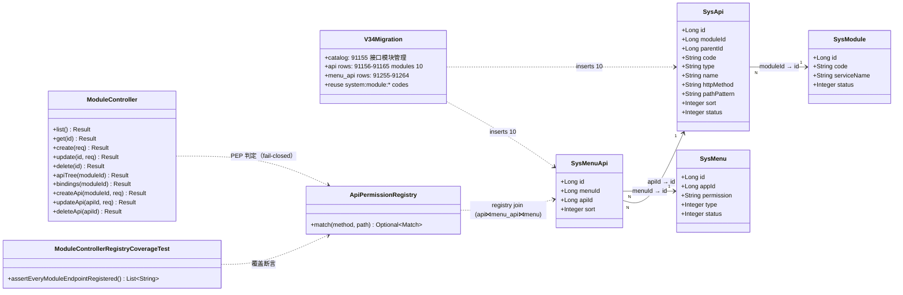
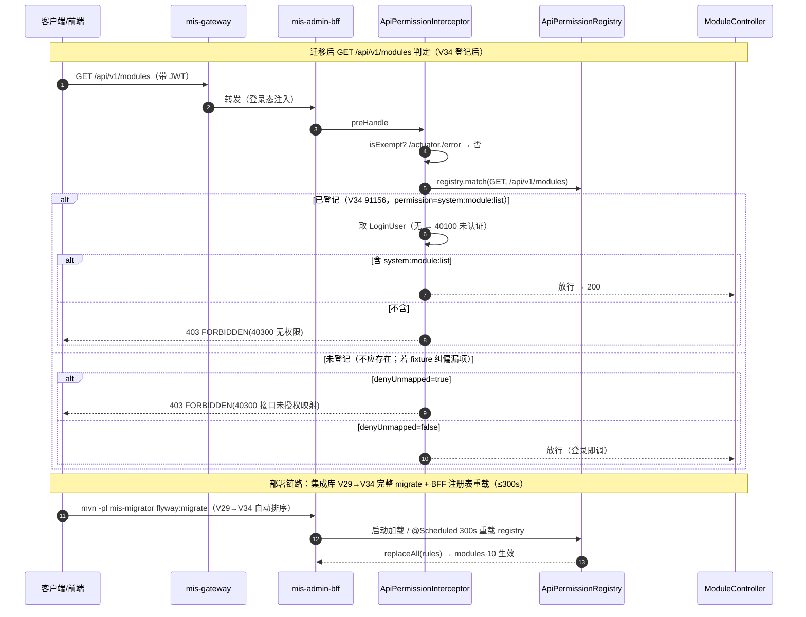

# MIS 技术债安全专项 V34：非 KB 域未登记端点补登（modules 10 项）系统设计 + 任务分解

- **作者**：高见远（软件架构师）
- **日期**：2026-08-12
- **状态**：定稿（待主理人复核 U-V34-1~5）
- **上游**：`docs/backend/mis-kb-security-sprint-diff-list-2026-08-12.md` §5（17 项差集）、`docs/backend/mis-kb-security-sprint-design-2026-08-12.md`（V32/V33 基线）、用户裁决「差集需要全部补登」
- **前置**：迁移目录最新 V33（已 ls 确认，V34 空闲未占用）；本文件为 V34，Flyway 只追加不修改已发布版本
- **下游**：寇豆码（软件工程师）按本文任务列表实现；严过关（QA）按本文验收映射验收
- **配套文件**：`mis-kb-security-sprint-v34-class.mermaid`（类图）、`mis-kb-security-sprint-v34-seq.mermaid`（时序图）

---

## 0. 结论速览（先看这里）

| 项 | 结论 |
|---|---|
| **补登范围** | **modules 10 项**（差集清单 §5 中 17 项经代码核验后，agent-ops 3 项已覆盖、roles 2 项 + apps 1 项 + employees 1 项**已登记**，真正缺的只有 modules 10 项） |
| **⚠️ 差集清单纠偏（重要）** | 盘点工具 `BffApiRegistryDiffSurveyTest` 的 `REGISTERED_FIXTURE` **漏了 V4/V5 的登记**：`GET/PUT /api/v1/roles/{id}/menus`（V2 3008/3009 被 V4 改名）、`GET /api/v1/employees`（V4 1011）、`GET /api/v1/apps`（V5 9006）**实际已登记**，差集清单把它们误列为「未登记」。**V34 不补这 4 项**（重复登记会撞 `uk_api_method_path` 被幂等跳过），而是**修正 fixture + 差集清单** |
| **权限码** | 零新增：复用 V8 建的 `system:module:list`(菜单 207) / `system:module:add`(271) / `system:module:edit`(272) / `system:module:delete`(273)，一码一菜单，全部已授 role_id=1 |
| **段位** | sys_api `91155-91165`（catalog 91155 + api 91156-91165）/ code `00900071-00900081` / sys_menu_api `91255-91264` / sort 80-89（V33 末位 91154/00900070/91254/79，已 grep 全仓确认空闲） |
| **V29~V33 未执行** | 集成库 flyway_schema_history 停 V28；**部署必须完整 `flyway:migrate` 一次跑 V29→V34**（Flyway 自动按版本排序），禁止只跑 V34 |
| **任务数** | 3 个（T0 查重核验 → T1 V34 迁移+测试 → T2 全量回归+部署说明），每任务 ≥3 文件 |
| **不 commit / 不 push** | 只改任务内文件 |

---

## 1. 实现方案与关键决策

### 1.0 现状核查结论（读码核验，非臆测）

| # | 核查项 | 结论 | 证据 |
|---|---|---|---|
| 1 | 差集清单 §5 所列 17 项 | agent-ops 3 项**已覆盖**（动作变量拆行登记，清单已注明）；roles 2 / apps 1 / employees 1 **已登记**；modules 10 **真未登记** | 见 #2~#5 |
| 2 | `GET/PUT /api/v1/roles/{id}/menus` | **已登记**：V2 建 3008/3009（原 `/permissions`），V4 `UPDATE path_pattern='/api/v1/roles/{id}/menus'`（3008 GET / 3009 PUT），sys_menu_api 35/36 → 菜单 234（`system:role:assignMenu`） | `V2__seed_data.sql:155-156,228-229`、`V4__api_path_align.sql:5-16,38-44` |
| 3 | `GET /api/v1/apps` | **已登记**：V5 建 9006 `GET /api/v1/apps`，sys_menu_api 75 → 菜单 90（认证目录，permission NULL → authOnly） | `V5__sys_app_portal_fields.sql:29-36` |
| 4 | `GET /api/v1/employees` | **已登记**：V4 建 1011 `GET /api/v1/employees`，sys_menu_api 19 → 菜单 201（用户管理，`system:user:list`） | `V4__api_path_align.sql:33-36,42` |
| 5 | modules 10 端点 | **真未登记**：grep 全仓迁移 `/api/v1/modules` **零匹配**；V8 只建了菜单 207/271/272/273 + 授权，**未建任何 sys_api 行** | grep V*.sql、`V8__module_api_refactor.sql:43-62` |
| 6 | 盘点工具 fixture 缺陷 | `BffApiRegistryDiffSurveyTest.REGISTERED_FIXTURE` 漏 V4/V5 行：无 `GET /api/v1/employees`、无 `GET /api/v1/apps`、仍写 `roles/{id}/permissions`（未反映 V4 改名 `/menus`）→ 差集把已登记项误报为未登记 | `BffApiRegistryDiffSurveyTest.java:476-684` |
| 7 | 模块域既有权限码 | `system:module:list/add/edit/delete` 四个码 V8 已建（菜单 207/271/272/273），V8+V10 已授 role_id=1；**一码一菜单成立** | `V8__module_api_refactor.sql:45,50-52`、`V10__grant_module_button_perms.sql` |
| 8 | 段位占用 | V33 末位 sys_api 91154 / code 00900070 / menu_api 91254 / sort 79；91155+ / 00900071+ / 91255+ / 80+ 全仓 grep **零占用**（含 V29 的 92158/00920059 段，无重叠） | grep 全仓迁移 |
| 9 | sys_api 列 | V8 已 DROP tenant_id/app_id；现列 = id/module_id/parent_id/code/type/name/http_method/path_pattern/sort/status/created_at/updated_at；**无 permission 列**（权限码在 sys_menu，经 sys_menu_api） | `V1__init_schema.sql:272-291`、`V8__module_api_refactor.sql:21-32` |
| 10 | 约束 | `uk_api_method_path(http_method,path_pattern) WHERE type='api' AND status=1`；`uk_api_module_code(module_id,code)`；`uk_menu_api_pair(menu_id,api_id)`；`uk_menu_app_permission(app_id,permission) WHERE status=1 AND permission IS NOT NULL` | `V1__init_schema.sql:269-301` |
| 11 | BFF Controller 路径 | `ModuleController` `/api/v1/modules`：GET 列表 / GET {id} / POST / PUT {id} / DELETE {id} / GET {moduleId}/apis / POST {moduleId}/apis / PUT apis/{apiId} / DELETE apis/{apiId} / GET {moduleId}/bindings —— 与差集清单逐字一致 | `ModuleController.java`（读码） |
| 12 | 集成库迁移滞后 | flyway_schema_history 停 V28（2026-08-11 14:37）；V29~V33 未执行；sys_api 最新 id=92157；91106+ 段零行；kb_document 无 parse_progress/parse_error 列 | 主理人实测（2026-08-12） |

### 1.1 关键决策 D1：补登范围 = modules 10 项（14 项中 4 项已登记）

- **结论**：V34 只登记 modules 10 个端点。roles/apps/employees 4 项已在 V4/V5 登记，**不重复登记**。
- **理由**：
  - 重复登记同 method+path 会撞 `uk_api_method_path` 部分唯一索引；V30 已示范「重复行由守卫幂等跳过」——但那适用于**已在既有迁移登记**的场景。本 4 项已登记，补登无意义且会误导审计。
  - 正确动作是**修正盘点工具 fixture 与差集清单**（T0），让 SEC-02 的「已登记基线」回归真实，后续差集盘点不再误报。
- **对「差集需要全部补登」用户裁决的落实**：全部补登 = 把真未登记的 10 项补上 + 把 4 项「假未登记」纠偏为已登记（数据层面已完成，无需动作），实现差集**真实清零**。

### 1.2 关键决策 D2：权限码分配 —— 复用 V8 既有 `system:module:*` 四码，零新增

| BFF 端点 | 功能 | 权限码 | menu_id（既有） | 说明 |
|---|---|---|---|---|
| GET `/api/v1/modules` | 模块列表 | `system:module:list` | 207（接口模块页） | 页面读 |
| GET `/api/v1/modules/{id}` | 模块详情 | `system:module:list` | 207 | 页面读 |
| POST `/api/v1/modules` | 新建模块 | `system:module:add` | 271（新增模块按钮） | 写 |
| PUT `/api/v1/modules/{id}` | 编辑模块 | `system:module:edit` | 272（编辑模块按钮） | 写 |
| DELETE `/api/v1/modules/{id}` | 删除模块 | `system:module:delete` | 273（删除模块按钮） | 写 |
| GET `/api/v1/modules/{moduleId}/apis` | 模块 API 树（读） | `system:module:list` | 207 | 页面读 |
| POST `/api/v1/modules/{moduleId}/apis` | 模块下新增 API | `system:module:add` | 271 | 写（U-V34-2 默认） |
| PUT `/api/v1/modules/apis/{apiId}` | 编辑模块 API | `system:module:edit` | 272 | 写 |
| DELETE `/api/v1/modules/apis/{apiId}` | 删除模块 API | `system:module:delete` | 273 | 写 |
| GET `/api/v1/modules/{moduleId}/bindings` | 模块绑定列表（读） | `system:module:list` | 207 | 页面读 |

**一码一菜单核验（uk_menu_app_permission）**：4 个码各只出现在 1 个菜单节点（list→207、add→271、edit→272、delete→273），V8 建库即满足；本迁移**零新增 sys_menu 行**、零新增权限码，只加 sys_menu_api 关联 → 零冲突。

### 1.3 关键决策 D3：段位与幂等写法（参照 V30/V32/V33）

- **段位**：sys_api `91155-91165`（catalog 91155 + api 91156-91165）；code `00900071-00900081`；sys_menu_api `91255-91264`；sort 80-89。全仓 grep 已确认空闲（V29 用 92158/00920059 段，V30-33 用 91106-91154/00900022-00900070 段，均无重叠）。
- **catalog 节点**：新建 `91155`「接口模块管理」（type=catalog，module 4，parent 4000，code 00900071）——模块域当前**没有** sys_api catalog（V8 只建菜单未建 API 树），需要 1 个 catalog 承载 10 个叶子（U-V34-5 默认新建）。
- **幂等**：固定 ID + `WHERE NOT EXISTS(id)` + `(module_id, code)` 去重 + `(method, path)` 去重 + 父行存在性检查，可重复执行。
- **path_pattern 隔离**：沿用 V30/V31/V32 同款 `{id:[0-9]+}` / `{moduleId:[0-9]+}` / `{apiId:[0-9]+}` 写法（AntPathMatcher 单段通配，与 BFF 导出归一化后逐字一致）。

### 1.4 关键决策 D4：V29~V33 未执行的处理（部署顺序，本专项必须一并落地）

- **事实**：集成库 10.254.16.6:5432/mis_platform 的 flyway_schema_history 停在 V28；V29~V33 已在代码库提交（块① V30 / 块② V31 / 块③ V32/V33），但集成库未执行。
- **处理建议**：
  1. **执行顺序 = V29→V30→V31→V32→V33→V34**，一次 `flyway:migrate` 即可——Flyway 按版本号自动排序，V34 会排在 V33 之后执行，**禁止只跑 V34**（否则集成库缺 V30 的 kb_document 解析治理列、缺 V32/V33 的 KB/AI 登记，BFF 注册表加载不到 KB/AI 行）。
  2. **命令路径**（mis-migrator README 提供）：
     ```bash
     cd backend
     mvn -pl mis-migrator flyway:info   # 先确认 pending = V29..V34
     mvn -pl mis-migrator flyway:migrate \
       -Ddb.host=10.254.16.6 -Ddb.port=5432 -Ddb.name=mis_platform \
       -Ddb.user=<user> -Ddb.password=<pwd>
     ```
  3. **BFF 注册表刷新**：mis-admin-bff 启动加载 + `refresh-interval-seconds=300s` 定时重载；迁移后最多等 300s（或重启 BFF）即生效，无需改配置。
  4. **验证**：`flyway:info` 全绿（V29~V34 均 Success）；V34 文件尾自检 SQL 通过；kb_document 出现 parse_progress/parse_error 列（证明 V30 已落地）。
- **风险提示**：若集成库当前 deny-unmapped=true，则在 V34（及 V29~V33）落地前，未登记端点会 403；本专项在迁移落地前不要翻转 test/integration 配置（沿用块③ T3 顺序）。

### 1.5 与块③（V32/V33）的关系

- V34 是块③的**差集补登延伸**：V32 清 KB 28、V33 清 AI 2（authOnly）、V34 清非 KB modules 10（含纠偏 roles/apps/employees 已登记事实）。
- 不修改 V32/V33 任何内容；段位严格在其后顺延。
- 块③的 `ApiPermissionDenyUnmappedTest` / `BffApiRegistryDiffSurveyTest` 与 V34 的关系：fixture 需追加 V34 10 项 + 纠偏 4 项（见 T0/T1 文件清单）。

---

## 2. 文件列表

> A = 新增；M = 修改。路径相对仓库根。层：mis-migrator / mis-admin-bff（测试）/ 文档。

### 2.1 新增文件

| 层 | 相对路径 | 说明 |
|---|---|---|
| 迁移 | `backend/mis-migrator/src/main/resources/db/migration/V34__modules_api_registry.sql` | modules 10 端点 sys_api + sys_menu_api 登记（catalog 91155 + api 91156-91165），零 DDL，含自检 SQL |
| BFF 测试 | `backend/mis-admin-bff/src/test/java/com/mis/adminbff/audit/ModuleControllerRegistryCoverageTest.java` | modules 全量端点（10 条）逐条断言已在注册表、权限码正确（仿 `KbControllerRegistryCoverageTest`） |
| 文档 | `docs/backend/mis-kb-security-sprint-v34-design-2026-08-12.md` | 本文档 |
| 文档 | `docs/backend/mis-kb-security-sprint-v34-class.mermaid` | 类图（配套） |
| 文档 | `docs/backend/mis-kb-security-sprint-v34-seq.mermaid` | 时序图（配套） |
| 文档（T2 交付物） | `docs/backend/mis-kb-security-sprint-v34-deployment-2026-08-12.md` | 部署顺序说明：V29→V34 完整 migrate 命令、验证步骤、回滚预案 |

### 2.2 修改文件

| 层 | 相对路径 | 改动 |
|---|---|---|
| BFF 测试 | `backend/mis-admin-bff/src/test/java/com/mis/adminbff/audit/BffApiRegistryDiffSurveyTest.java` | ① fixture 纠偏：`roles/{id}/permissions` → `roles/{id}/menus`（2 行）、补 `GET /api/v1/employees`、补 `GET /api/v1/apps`；② fixture 追加 V34 modules 10 项；③ DISPOSITIONS 中 modules 处置结论改为「V34 已补登」（roles/apps/employees 已登记则不再出现在未登记集合） |
| 文档 | `docs/backend/mis-kb-security-sprint-diff-list-2026-08-12.md` | §5 纠偏：roles 2 / apps 1 / employees 1 处置结论「待运营评估」→「已登记（V4/V5），差集误报」；modules 10 →「V34 补登」；§6 回填主理人评审记录 |
| 文档 | `docs/backend/api-permission-mapping.md` | 补 modules 10 端点登记表 + 管理台 API 段补 modules 行；roles/apps/employees 已登记说明 |

> 无 BFF 业务代码改动、无 mis-migrator 业务代码改动、无前端改动（登记是 DB 行）。

---

## 3. 数据结构与迁移

### 3.1 V34 迁移 SQL 设计（要点，完整见迁移文件）

```sql
-- V34__modules_api_registry.sql —— 非 KB 域未登记端点补登（modules 10，差集清零）
-- 设计：docs/backend/mis-kb-security-sprint-v34-design-2026-08-12.md
-- 前置：V33 为当前最新；本文件为 V34，Flyway 只追加不修改已发布版本。
-- 内容：A. sys_api 登记 10 个 modules 端点（catalog 91155 + api 91156-91165）
--      + sys_menu_api 关联（91255-91264）；零 DDL。
--   段位：sys_api 91155-91165 / code 00900071-00900081 / menu_api 91255-91264 / sort 80-89
--   挂载：复用 V8 既有菜单（207/271/272/273），一码一菜单，零新增菜单/权限码。
--   幂等：固定 ID + WHERE NOT EXISTS + (method,path) 去重 + ON CONFLICT DO NOTHING（同 V30/V31/V32）。

-- A.1 catalog（模块域缺 sys_api 树根，新建 91155 挂 module 4 / parent 4000）
INSERT INTO sys_api (id, module_id, parent_id, code, type, name, http_method, path_pattern, sort, status, created_at, updated_at)
SELECT v.* FROM (VALUES
    (91155, 4, 4000, '00900071', 'catalog'::sys_api_node_type, '接口模块管理', NULL, NULL, 5, 1, NOW(), NOW())
) AS v(id, module_id, parent_id, code, type, name, http_method, path_pattern, sort, status, created_at, updated_at)
WHERE NOT EXISTS (SELECT 1 FROM sys_api WHERE id = v.id)
  AND NOT EXISTS (SELECT 1 FROM sys_api WHERE module_id = v.module_id AND code = v.code)
  AND EXISTS (SELECT 1 FROM sys_module WHERE id = 4)
  AND EXISTS (SELECT 1 FROM sys_api WHERE id = 4000);

-- A.2 sys_api 10 个叶子（id 91156-91165 / code 00900072-00900081 / sort 80-89）
INSERT INTO sys_api (id, module_id, parent_id, code, type, name, http_method, path_pattern, sort, status, created_at, updated_at)
SELECT v.* FROM (VALUES
    (91156, 4, 91155, '00900072', 'api'::sys_api_node_type, '查询模块列表',     'GET',    '/api/v1/modules',                                 80, 1, NOW(), NOW()),
    (91157, 4, 91155, '00900073', 'api'::sys_api_node_type, '查询模块详情',     'GET',    '/api/v1/modules/{id:[0-9]+}',                     81, 1, NOW(), NOW()),
    (91158, 4, 91155, '00900074', 'api'::sys_api_node_type, '新建模块',         'POST',   '/api/v1/modules',                                 82, 1, NOW(), NOW()),
    (91159, 4, 91155, '00900075', 'api'::sys_api_node_type, '编辑模块',         'PUT',    '/api/v1/modules/{id:[0-9]+}',                     83, 1, NOW(), NOW()),
    (91160, 4, 91155, '00900076', 'api'::sys_api_node_type, '删除模块',         'DELETE', '/api/v1/modules/{id:[0-9]+}',                     84, 1, NOW(), NOW()),
    (91161, 4, 91155, '00900077', 'api'::sys_api_node_type, '模块 API 树',      'GET',    '/api/v1/modules/{moduleId:[0-9]+}/apis',          85, 1, NOW(), NOW()),
    (91162, 4, 91155, '00900078', 'api'::sys_api_node_type, '新增模块 API',     'POST',   '/api/v1/modules/{moduleId:[0-9]+}/apis',          86, 1, NOW(), NOW()),
    (91163, 4, 91155, '00900079', 'api'::sys_api_node_type, '编辑模块 API',     'PUT',    '/api/v1/modules/apis/{apiId:[0-9]+}',             87, 1, NOW(), NOW()),
    (91164, 4, 91155, '00900080', 'api'::sys_api_node_type, '删除模块 API',     'DELETE', '/api/v1/modules/apis/{apiId:[0-9]+}',             88, 1, NOW(), NOW()),
    (91165, 4, 91155, '00900081', 'api'::sys_api_node_type, '模块绑定列表',     'GET',    '/api/v1/modules/{moduleId:[0-9]+}/bindings',      89, 1, NOW(), NOW())
) AS v(id, module_id, parent_id, code, type, name, http_method, path_pattern, sort, status, created_at, updated_at)
WHERE NOT EXISTS (SELECT 1 FROM sys_api WHERE id = v.id)
  AND NOT EXISTS (SELECT 1 FROM sys_api WHERE module_id = v.module_id AND code = v.code)
  AND NOT EXISTS (
    SELECT 1 FROM sys_api a
    WHERE a.type = 'api' AND a.status = 1
      AND a.http_method = v.http_method AND a.path_pattern = v.path_pattern
  )
  AND EXISTS (SELECT 1 FROM sys_api WHERE id = 91155);

-- A.3 sys_menu_api 关联（一码一菜单：207 list / 271 add / 272 edit / 273 delete）
INSERT INTO sys_menu_api (id, menu_id, api_id, sort, created_at)
SELECT v.* FROM (VALUES
    (91255, 207, 91156, 1, NOW()),
    (91256, 207, 91157, 1, NOW()),
    (91257, 271, 91158, 1, NOW()),
    (91258, 272, 91159, 1, NOW()),
    (91259, 273, 91160, 1, NOW()),
    (91260, 207, 91161, 1, NOW()),
    (91261, 271, 91162, 1, NOW()),
    (91262, 272, 91163, 1, NOW()),
    (91263, 273, 91164, 1, NOW()),
    (91264, 207, 91165, 1, NOW())
) AS v(id, menu_id, api_id, sort, created_at)
WHERE NOT EXISTS (SELECT 1 FROM sys_menu_api WHERE id = v.id)
  AND NOT EXISTS (SELECT 1 FROM sys_menu_api WHERE menu_id = v.menu_id AND api_id = v.api_id)
  AND EXISTS (SELECT 1 FROM sys_menu WHERE id = v.menu_id)
  AND EXISTS (SELECT 1 FROM sys_api  WHERE id = v.api_id);
```

**迁移后自检 SQL（迁移文件尾，参照 V30/V32/V33）**：
1. `SELECT a.id, a.http_method, a.path_pattern, m.permission FROM sys_api a JOIN sys_menu_api ma ON ma.api_id=a.id JOIN sys_menu m ON ma.menu_id=m.id WHERE a.id BETWEEN 91155 AND 91165 AND a.type='api' ORDER BY a.id;` — 期望 10 行，permission 分布 = `system:module:list`×4 / `system:module:add`×2 / `system:module:edit`×2 / `system:module:delete`×2；
2. 一码一菜单：`SELECT api_id, count(*) FROM sys_menu_api WHERE api_id BETWEEN 91156 AND 91165 GROUP BY api_id HAVING count(*)>1;` — 期望 0 行；
3. uk_menu_app_permission：`SELECT m.permission, COUNT(*) FROM sys_menu_api ma JOIN sys_menu m ON ma.menu_id=m.id WHERE ma.api_id BETWEEN 91156 AND 91165 AND m.permission IS NOT NULL GROUP BY m.permission, m.app_id, m.id HAVING COUNT(*)>1;` — 期望 0 行；
4. (method,path) 全量冲突：`SELECT 1 FROM sys_api WHERE type='api' AND status=1 AND (http_method, path_pattern) IN (SELECT http_method, path_pattern FROM sys_api WHERE id BETWEEN 91156 AND 91165) GROUP BY 1 HAVING COUNT(*)>1;` — 期望 0 行；
5. 幂等回归：重复执行后 1) 仍 10 行、2)/3)/4) 仍 0 行；
6. 行为验收：无 `system:module:list` 的登录用户 GET `/api/v1/modules` 期望 HTTP 403；有该码的管理员 200（BFF 重启或等 300s 重载）。

### 3.2 类图（Mermaid classDiagram）

完整类图见 `mis-kb-security-sprint-v34-class.mermaid`，核心关系摘要：



---

## 4. 接口设计

### 4.1 无新端点

本期**不新增任何 REST 端点**（纯登记 + fixture/文档纠偏）。所有变更只影响既有 modules 端点的**门控行为**。

### 4.2 fail-closed 生效后的行为变化（14 端点从 403 → 按权限码放行 / 已登记维持）

| 端点 | fail-closed 现状（V34 前） | **V34 后** |
|---|---|---|
| GET/POST `/api/v1/modules`、GET/PUT/DELETE `/api/v1/modules/{id}`、GET/POST `/api/v1/modules/{moduleId}/apis`、PUT/DELETE `/api/v1/modules/apis/{apiId}`、GET `/api/v1/modules/{moduleId}/bindings` | **HTTP 403** `Result{code:40300, message:"接口未授权映射"}`（未登记，fail-closed 拦截） | 已登记：登录 + 有对应 `system:module:*` 权限码 → 200；无权限 → 40300「无权限」；未登录 → 40100「未认证」 |
| GET/PUT `/api/v1/roles/{id}/menus` | 已登记（V4 改名后）——维持 `system:role:assignMenu` 判权 | 不变（纠偏 fixture，行为不变量） |
| GET `/api/v1/apps` | 已登记（V5）——authOnly（登录即可） | 不变（纠偏 fixture，行为不变量） |
| GET `/api/v1/employees` | 已登记（V4）——`system:user:list` 判权 | 不变（纠偏 fixture，行为不变量） |

> **审计口径**：拦截器 403 的调用不产生 sys_oper_log（切面在 Controller 层）——维持块③口径，非本期引入。

---

## 5. 程序调用流程

### 5.1 请求 → 拦截器 fail-closed 判定（时序图）

完整时序图见 `mis-kb-security-sprint-v34-seq.mermaid`，主链路摘要：



### 5.2 查重核验流程（T0，工程师执行）

1. 连集成库（10.254.16.6:5432/mis_platform）跑核验 SQL：确认 3008/3009（roles/menus）、1011（employees）、9006（apps）存在；确认 `/api/v1/modules` 零行；
2. 与全仓迁移 grep 对照（本文档 §1.0 #2~#5）输出《核验记录》；
3. 更新 `BffApiRegistryDiffSurveyTest.REGISTERED_FIXTURE`（纠偏 4 项 + 预留 V34 段不预先写，T1 追加）；
4. 更新差集清单 §5 处置结论 + §6 评审记录回填。

---

## 6. 依赖包列表

**无新增第三方依赖**：
- 后端：Spring Boot 3.2.5（自带 `RequestMappingHandlerMapping` / `AntPathMatcher` / JUnit 5）、Flyway、PostgreSQL 既有；无新库。
- 前端：本期零前端改动，无新包。

---

## 7. 任务列表（T0 起，含依赖、验收点）

> 分组原则：按功能模块整组交付，不按单文件拆分；任务数 ≤5。T0 为查重核验前置，T1 依赖 T0，T2 依赖 T1。

| 编号 | 任务 | 目标 | 涉及文件 | 依赖 | 优先级 |
|---|---|---|---|---|---|
| **T0** | **查重核验 + 差集纠偏（前置）** | 连库核验 roles/apps/employees 已登记、modules 未登记；修正盘点工具 fixture（roles `/permissions`→`/menus`、补 employees/apps）；差集清单 §5 处置结论纠偏 + §6 回填；产出设计文档（本文档） | `docs/backend/mis-kb-security-sprint-v34-design-2026-08-12.md`(A)、`backend/mis-admin-bff/src/test/java/com/mis/adminbff/audit/BffApiRegistryDiffSurveyTest.java`(M)、`docs/backend/mis-kb-security-sprint-diff-list-2026-08-12.md`(M) | — | P0 |
| **T1** | **V34 迁移：modules 10 端点登记 + 覆盖测试** | V34 SQL 落地（catalog 91155 + api 10 行 + menu_api 10 行，幂等、一码一菜单、段位查重）；`ModuleControllerRegistryCoverageTest` 断言 10 端点 method+path 与 BFF Controller 逐字一致、权限码正确；survey fixture 追加 V34 10 项 | `backend/mis-migrator/src/main/resources/db/migration/V34__modules_api_registry.sql`(A)、`backend/mis-admin-bff/src/test/java/com/mis/adminbff/audit/ModuleControllerRegistryCoverageTest.java`(A)、`backend/mis-admin-bff/src/test/java/com/mis/adminbff/audit/BffApiRegistryDiffSurveyTest.java`(M)、`docs/backend/api-permission-mapping.md`(M) | T0（差集纠偏确认 modules 10 无遗漏、无 path 冲突） | P0 |
| **T2** | **全量回归 + 部署顺序说明 + 交付** | 集成库完整 `flyway:migrate`（V29→V34）落地；全量回归（mis-admin-bff + mis-common-security + mis-kb）通过；产出部署说明（含命令、验证、回滚）；交付说明归档 | `docs/backend/mis-kb-security-sprint-v34-deployment-2026-08-12.md`(A)、回归中修复的测试文件（按需）(M)、`docs/backend/mis-kb-security-sprint-v34-design-2026-08-12.md`(M，回填评审记录) | T1（V34 落地） | P0 |

**T0 验收点**：①核验记录明确 4 项已登记（附行 id）/ modules 10 未登记；②survey fixture 纠偏后 `BffApiRegistryDiffSurveyTest` 对 roles/apps/employees 不再误报（断言 4 仍绿，非 KB 未登记集合只剩 modules）；③差集清单 §5 处置结论非空且与事实一致；④本文档落盘。
**T1 验收点**：①V34 幂等可重放；②10 行 sys_api + 10 行 sys_menu_api 无 uk_api_method_path / uk_api_module_code / uk_menu_api_pair / uk_menu_app_permission 冲突；③`ModuleControllerRegistryCoverageTest` 绿（10 端点 method+path 逐字一致、权限码正确）；④自检 SQL 输出符合预期。
**T2 验收点**：①集成库 `flyway:info` 显示 V29~V34 全 Success（kb_document 有 parse_progress/parse_error 列）；②全量回归通过（mis-admin-bff 250 例 + mis-common-security + mis-kb 397 例基线保持）；③部署说明含命令/验证/回滚三步；④BFF 注册表重载后 modules 10 有权限 200 / 无权限 403 行为断言通过。

---

## 8. 共享知识（跨文件约定）

1. **迁移版本号**：V34 起（V33 已用）；Flyway 只追加不修改已发布版本；实施时以「当时仓库最大版本号 + 1」为准。
2. **sys_api 段位**：api id `91155+`（catalog 91155、叶子 91156-91165）、code `00900071-00900081`、menu_api `91255-91264`、sort 80-89；幂等写法（WHERE NOT EXISTS + 固定 ID）参照 V30/V31/V32/V33。
3. **一码一菜单铁律**：`uk_menu_app_permission (app_id, permission) WHERE status=1`；本期**零新增菜单、零新增权限码**，10 行全部挂 V8 既有菜单（207/271/272/273）。
4. **path_pattern 隔离口径**：`{id:[0-9]+}` / `{moduleId:[0-9]+}` / `{apiId:[0-9]+}` 单段通配；字面路径逐字登记；与 V30/V31/V32 同款。
5. **AntPathMatcher 语义**：`{var}` 匹配恰好一个路径段；同一 method 下多条规则命中时权限取并集——modules 内同权路径（如 list 4 条同 `system:module:list`）无冲突。
6. **fail-closed 行为口径**：未登记路径 → HTTP 403 + `Result{code:40300, message:"接口未授权映射"}`；已登记无权限 → 40300「无权限」；未登录 → 40100「未认证」；`/actuator`、`/error` 豁免。
7. **authOnly 派生**：`ApiService.java:38` 以「permission 为空」派生 authOnly（V5 的 apps 9006 挂 permission=NULL 菜单 90 → authOnly，行为不变量）。
8. **拦截器注册**：`/api/v1/**`（mis-admin-bff 唯一 PEP）；`/internal/**` 由 `InternalServiceTrustInterceptor` 管，均不受本期影响。
9. **注册表刷新**：启动加载 + `refresh-interval-seconds=300s` 定时重载；登记后无需重启 BFF，最多等 300s。
10. **错误码**：沿用 `Result` / `BusinessException` / `ResultCode`（FORBIDDEN=40300、UNAUTHORIZED=40100）；无新错误码。
11. **测试基线**（JDK17 + Maven）：mis-kb 397 例、mis-admin-bff 250 例必须保持；新增测试不得降低基线。
12. **集成库部署顺序**：V29→V34 一次 `flyway:migrate`；禁止只跑 V34；BFF 重载 ≤300s。
13. **盘点 fixture 维护**：`BffApiRegistryDiffSurveyTest.REGISTERED_FIXTURE` 每次新增迁移登记端点后必须同步追加（含本次 V34 10 项 + 纠偏 4 项）。

---

## 9. 任务依赖图


---

## 10. 待明确事项（需主理人/用户拍板）

| # | 事项 | 影响 | 设计默认值 |
|---|---|---|---|
| U-V34-1 | **范围纠偏确认**：roles 2 + apps 1 + employees 1 经代码核验**已登记**（V4/V5），V34 只补 modules 10。是否认可「14 项中 4 项不补、改为纠偏」？ | V34 净新增行数（10 vs 14）；是否触发 uk_api_method_path 冲突 | 默认只补 modules 10 + 纠偏 fixture/清单 |
| U-V34-2 | **POST `/modules/{moduleId}/apis` 权限码**：挂 `system:module:add`(271) 还是 `system:module:edit`(272)？ | 新增 API 操作的授权粒度 | 默认 `system:module:add`（新增语义），PUT/DELETE 用 edit/delete |
| U-V34-3 | **集成库 V29~V33 落地时机**：是否由本专项 T2 一并执行完整 migrate（V29→V34）？ | 集成库 KB/AI/agent-ops 登记与 DDL 是否补齐 | 默认 T2 一并完整 migrate（Flyway 自动排序） |
| U-V34-4 | **盘点 fixture 纠偏**：是否同意修改 `BffApiRegistryDiffSurveyTest` fixture（roles/apps/employees 纠偏 + V34 追加）？ | SEC-02 差集盘点是否回归真实 | 默认修改（否则差集持续误报） |
| U-V34-5 | **modules catalog 节点**：新建 sys_api catalog 91155「接口模块管理」（module 4 / parent 4000）是否可接受？ | API 树展示分组 | 默认新建 catalog（模块域当前无 API 树根） |

---

## 11. 风险与降级路径

| # | 风险 | 等级 | 降级/应对 |
|---|---|---|---|
| R1 | **集成库 V29~V33 未执行**，若只跑 V34 会导致 KB/AI/agent-ops 登记缺失、kb_document 列缺失 | 高 | T2 完整 `flyway:migrate`（V29→V34 自动排序）；部署说明文档写清命令与验证；禁止只跑 V34 |
| R2 | **差集 fixture 误报**导致范围判断错误（roles/apps/employees 假未登记） | 中 | 本文档已查证（§1.0 #2~#5）；T0 连库核验 + fixture 纠偏；差集清单 §5 纠偏 |
| R3 | **登记撞 uk_api_method_path / uk_api_module_code / uk_menu_api_pair / uk_menu_app_permission** | 中 | 登记前 grep 全仓已占用段位（91155+/00900071+/91255+ 全空闲）；一码一菜单；幂等写法 |
| R4 | **权限码语义偏差**（POST apis 用 add vs edit） | 低 | U-V34-2 拍板；若需调整，V34+ 追加修复迁移（参照 V25 修 V24 先例） |
| R5 | **AntPathMatcher 误匹配**（`{moduleId}` 命中 `/apis` 等字面路径） | 低 | 字面路径（`/apis`、`/bindings` 为子段）逐字登记；`{moduleId:[0-9]+}` 单段通配；`ModuleControllerRegistryCoverageTest` 锁定逐字匹配 |
| R6 | **迁移登记出错** | 中 | Flyway 只追加不回滚；V34+ 追加修复迁移 |
| R7 | **本地/集成环境 fail-closed 未翻转前行为差异** | 低 | 沿用块③ T3 顺序：先 V34 落地，再翻转配置；误杀回滚 = Nacos 一处改回 false（秒级） |
| R8 | **盘点工具漏 Controller / fixture 不同步** | 中 | `ModuleControllerRegistryCoverageTest` 逐条断言（10 条）；静态扫描（grep）交叉验证 |

---

## 12. 验收映射（用户裁决 → 验证方式）

| 验收 | 验证方式 |
|---|---|
| 差集「全部补登」落地（modules 10 登记） | T1：`ModuleControllerRegistryCoverageTest` 绿（10 端点 method+path 与 ModuleController 逐字一致、权限码正确）+ V34 自检 SQL |
| 差集真实清零（roles/apps/employees 已登记纠偏） | T0：连库核验 3008/3009/1011/9006 存在 + fixture 纠偏后 `BffApiRegistryDiffSurveyTest` 非 KB 未登记只剩 modules（T1 后为零） |
| 已登记端点零回归 | T2：全量回归 + QA 抽查：modules 有权限 200 / 无权限 403 / 未登录 401；roles/apps/employees 行为不变量 |
| uk_menu_app_permission 零冲突 | T1：自检 SQL 一码一菜单 0 行 |
| 幂等可重放 | T1：重复执行迁移后自检仍一致 |
| 集成库 V29~V34 顺序落地 | T2：`flyway:info` 全 Success + kb_document 列存在 + BFF 注册表重载后行为断言 |

---

## 13. 关联文档

- 差集清单：`docs/backend/mis-kb-security-sprint-diff-list-2026-08-12.md`
- 块③设计：`docs/backend/mis-kb-security-sprint-design-2026-08-12.md`
- 权限模型：`docs/backend/api-permission-mapping.md`、ADR-008/010/011
- 迁移先例：V30/V31/V32/V33、V24/V25（ID 冲突修复）
- 部署：`backend/mis-migrator/README.md`（flyway 命令）
