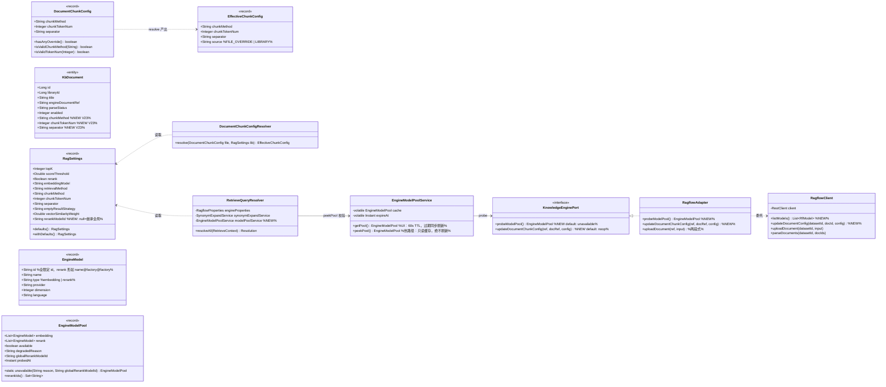
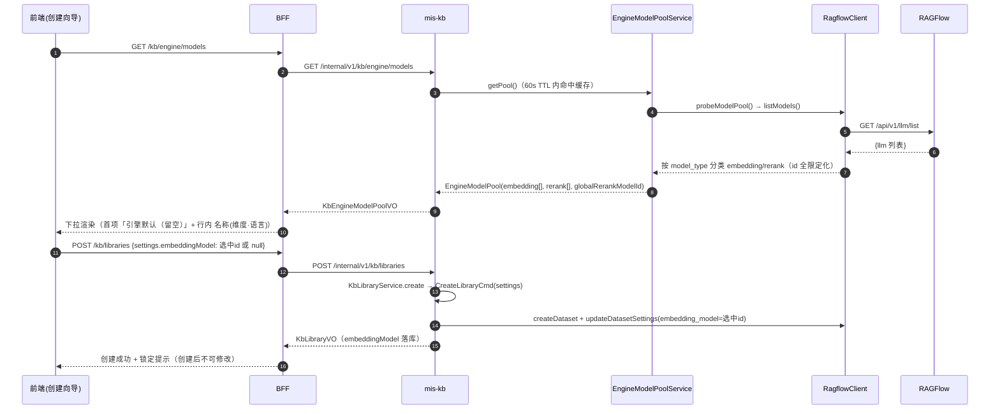
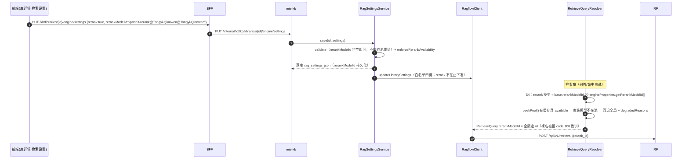
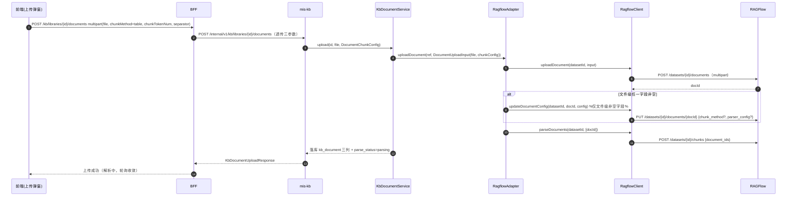
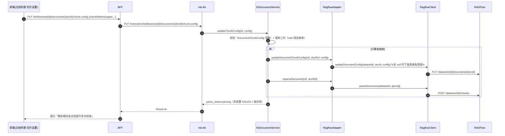
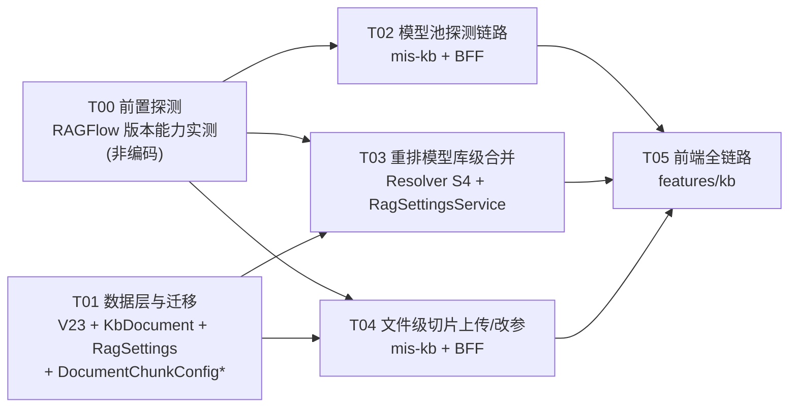

# MIS 知识库详细设置改造：系统架构设计 + 任务分解

- **项目**：`kb_settings_model_chunk`
- **作者**：高见远（软件架构师）
- **日期**：2026-08-10
- **上游**：`deliverables/software-company/kb-settings-model-chunk-prd-2026-08-10.md`（许清楚）
- **下游**：工程师寇豆码按本设计实现；主理人齐活林验收
- **配套文件**：`mis-kb-settings-model-chunk-class.mermaid`（类图）、`mis-kb-settings-model-chunk-seq.mermaid`（时序图）

> 本文档所有涉及 RAGFlow 版本行为的结论，**必须先经 T00 前置探测实测固化**（§6.2）；
> 无法实测时以本设计给定的默认值为准，并在实现中保留开关/降级路径。

---

## Part A 系统设计

## 1. 实现方案与框架选型

### 1.1 需求本质与难点分析

| 难点 | 分析 | 对策 |
|---|---|---|
| 模型池来源不确定 | RAGFlow 各版本模型列表接口路径/字段有差异；embedding 与 rerank 分类方式不统一；裸模型名被拒（B3：rerank-id 必须 `name@factory@factory` 全限定） | 新增**探测式模型池**：`RagflowClient.listModels()` 拉取后按 `model_type` 分类；**不建 MIS 配置表**；T00 用 curl 固化目标实例（10.254.16.6:9380）的接口契约 |
| RAGFlow PUT body 严格校验 | B2 教训：dataset PUT body pydantic `extra=forbid`，多一个字段整单 `code:101` | 文档级配置 PUT、模型池探测、重排模型下发**全部新增字段必须先经 T00 实测**；body 只放白名单键（§7.3） |
| 参数层级铁律 | 「全局默认 → 库设置 → 单次问答覆盖」由 `RetrieveQueryResolver` 三级合并，服务层不得内联判断 | 重排模型库级值加入合并链，**只在 Resolver S4 阶段生效**（§4.3）；不新增旁路 |
| 两级切片合并 | 文件级任一字段非空 = 文件指定；生效 = 文件级 ?? 库级 ?? 全局默认 | 新增 `DocumentChunkConfig` + `DocumentChunkConfigResolver` 统一收口合并语义，服务层只调它 |
| 引擎侧文档级切片是两步式 | 上传接口只收 multipart；文档级 `chunk_method`/`parser_config` 需**上传后** `PUT /datasets/{id}/documents/{docId}` 触发重解析 | `RagflowAdapter.uploadDocument` 内做「上传 →（有文件级参数时）PUT 文档配置 → POST /chunks」两段式；改参同路径 |
| 热路径不能打网络 | 检索期若每次校验模型池会打 RAGFlow，拖垮问答 | 模型池缓存 60s TTL；Resolver 热路径用 `peekPool()`（**只读缓存，绝不刷新**），网络只发生在 UI 显式刷新 |
| 降级不许展示假选项 | 嵌入回落自由文本+告警+重试；重排回落仅全局默认或禁用 | `EngineModelPool` 携带 `available/degradedReason`；前端按此渲染告警态，绝不当空列表 |

### 1.2 框架与依赖选型（新增依赖最小化）

| 层 | 选型 | 说明 |
|---|---|---|
| 后端 | 沿用 Spring Boot 3.2.5 / Java 17 / JPA / PostgreSQL / Flyway | 不引入新框架 |
| 模型池缓存 | **手写 JVM TTL 缓存**（`volatile` 快照 + `Instant` 过期 + `synchronized` 刷新） | 不引 Caffeine；60s TTL 足够，代码 ~40 行 |
| HTTP | 沿用 `RestClient`（RagflowClient 现有） | 探测与文档配置 PUT 复用 `postFor/putFor` |
| 前端 | 沿用 React + TypeScript + Vite + shadcn/ui + Tailwind + Zustand | 不引入 MUI（与 mis-admin-web 全站一致，PRD 已明确） |

### 1.3 架构模式

沿用现有**分层 + 端口适配**：

```
api(controller/dto) → domain(service/model/entity) → engine(KnowledgeEnginePort ← RagflowAdapter → RagflowClient)
                                                          └── 前端唯一入口 BFF(KbController → KbFacadeService → KbWebClient)
```

- **参数决策只发生在领域层**：检索参数合并只允许 `RetrieveQueryResolver`（§4.3 铁律）；切片两级合并只允许 `DocumentChunkConfigResolver`。
- **引擎专属概念（dataset/doc id/字段名）只在 `engine` 包闭环**：RagflowClient 内翻译，服务层只见 MIS 业务 ID。
- **BFF 只装配不决策**：模型池、上传参数、文档配置全部透传 mis-kb；VO 镜像同步更新。

---

## 2. 文件列表

> A = 新增；M = 修改。路径相对仓库根 `D:/code/mis-platform/`。

### 2.1 mis-migrator（Flyway V23）

| 文件 | 标记 | 说明 |
|---|---|---|
| `backend/mis-migrator/src/main/resources/db/migration/V23__kb_document_chunk_config.sql` | A | `kb_document` 新增三列（均可空 = 继承库级），幂等 `ADD COLUMN IF NOT EXISTS` |

### 2.2 mis-kb（`backend/mis-kb/src/main/java/com/mis/kb/`）

| 文件 | 标记 | 说明 |
|---|---|---|
| `domain/model/RagSettings.java` | M | record 末位追加 `rerankModelId`；更新 `defaults()`/`withDefaults()`（null = 继承全局） |
| `domain/entity/KbDocument.java` | M | 新增 `chunkMethod`/`chunkTokenNum`/`separator` 三列字段（V23 对齐） |
| `domain/model/DocumentChunkConfig.java` | A | 文件级切片配置 record + 校验常量（单一事实源）+ `hasAnyOverride()` |
| `domain/model/EffectiveChunkConfig.java` | A | 合并结果（生效值 + 来源 FILE_OVERRIDE/LIBRARY） |
| `domain/model/DocumentChunkConfigResolver.java` | A | 两级合并收口：文件级 ?? 库级 ?? 全局默认 |
| `domain/model/DocumentUploadInput.java` | M | record 末位追加 `chunkConfig`；保留 4 参紧凑构造（旧调用点零改动） |
| `domain/model/EngineModel.java` | A | 模型池项（id/name/type/provider/dimension/language） |
| `domain/model/EngineModelPool.java` | A | 模型池（embedding/rerank 分类 + available/degradedReason + globalRerankModelId） |
| `domain/service/EngineModelPoolService.java` | A | 60s TTL 缓存 + 降级；`getPool()`（可刷新）供 UI，`peekPool()`（只读缓存）供热路径 |
| `domain/service/RagSettingsService.java` | M | validate/enforceRerankAvailability 感知 `rerankModelId`；切片校验常量迁到 `DocumentChunkConfig` 引用 |
| `domain/service/KbDocumentService.java` | M | `upload` 落库三列；新增 `updateChunkConfig`（改参 + 触发重解析）；`toVo` 透出三列 |
| `domain/model/RetrieveQueryResolver.java` | M | 注入 `EngineModelPoolService`；S4 重排模型 = 库级 ?? 全局 + 池校验回退 |
| `engine/KnowledgeEnginePort.java` | M | 新增 default `probeModelPool()`、`updateDocumentChunkConfig()`（noop 默认，noop/mock 零改动） |
| `engine/RagflowClient.java` | M | 新增 `listModels()`、`updateDocumentConfig()`；`uploadDocument` 不动 |
| `engine/RagflowAdapter.java` | M | 实现 `probeModelPool`/`updateDocumentChunkConfig`；`uploadDocument` 两段式 |
| `engine/dto/RfModel.java` | A | RAGFlow `/api/v1/llm/list` 原生响应 DTO（T00 固化字段） |
| `api/controller/DocumentController.java` | M | 上传接口接受可选三参数；新增 `PUT .../documents/{id}/chunk-config` |
| `api/controller/EngineConfigController.java` | M | 新增 `GET /engine/models` 返回模型池 + 全局重排模型 id |
| `api/dto/KbDocumentVO.java` | M | 新增三列透出（本地字段，不调引擎） |

### 2.3 mis-admin-bff（`backend/mis-admin-bff/src/main/java/com/mis/adminbff/`）

| 文件 | 标记 | 说明 |
|---|---|---|
| `dto/kb/KbRagSettings.java` | M | 镜像追加 `rerankModelId`（末位） |
| `dto/kb/KbDocumentVO.java` | M | 镜像追加三列 |
| `dto/kb/KbEngineModelVO.java` | A | 模型池项镜像 |
| `dto/kb/KbEngineModelPoolVO.java` | A | 模型池镜像（含 globalRerankModelId） |
| `client/KbWebClient.java` | M | 新增 `listEngineModels`、`updateDocumentChunkConfig`；`uploadDocument` 带可选表单参数 |
| `service/KbFacadeService.java` | M | 透传模型池、上传三参数、文档配置更新 |
| `controller/KbController.java` | M | 新增 `GET /engine/models`、`PUT /libraries/{id}/documents/{docId}/chunk-config`；上传接口加可选参数 |

### 2.4 前端（`frontend/mis-admin-web/src/features/kb/`）

| 文件 | 标记 | 说明 |
|---|---|---|
| `types.ts` | M | `KbRagSettings` + `rerankModelId`；新增 `KbEngineModel`/`KbEngineModelPool`；`KbDocument` + 三列；上传载荷类型 |
| `api/kb-api.ts` | M | `listEngineModels()`；`uploadDocument(id, file, chunk?)`；`updateDocumentChunkConfig(id, docId, config)` |
| `stores/use-kb-store.ts` | M | 模型池状态 + `refreshModels()` |
| `library/kb-library-page.tsx` | M | 创建向导嵌入模型下拉（池选项 + 首项「引擎默认（留空）」+ 锁定提示 + 池不可达回落自由文本）；编辑态嵌入只读 |
| `library/kb-library-detail-page.tsx` | M | 重排模型下拉（开关关闭/rerankSupported=false 置灰；默认项=全局；选中不在池 → 告警回退文案）；嵌入模型只读展示；把库设置传给文档表做「继承库级」标注 |
| `document/kb-document-page.tsx` | M | 上传入口 + 切片参数透传 |
| `document/kb-document-table.tsx` | M | 「切片方式」列 + 来源徽标；行操作「切片设置」；重解析确认提示 |
| `components/kb-document-upload-dialog.tsx` | A | 上传弹窗（逐文件：切片方式/token/分隔符，默认继承库级） |
| `components/kb-doc-chunk-dialog.tsx` | A | 单文档切片设置弹窗（改参 → 重解析确认 + 「解析期间暂不参与检索」提示） |

### 2.5 文档（交付物）

| 文件 | 标记 | 说明 |
|---|---|---|
| `docs/backend/mis-kb-settings-model-chunk-design-2026-08-10.md` | A | 本文档 |
| `docs/backend/mis-kb-settings-model-chunk-class.mermaid` | A | 类图 |
| `docs/backend/mis-kb-settings-model-chunk-seq.mermaid` | A | 四条时序图 |
| `docs/backend/ragflow-capability-probe-2026-08-10.md` | A | T00 探测记录（curl 原文 + 结论） |

---

## 3. 数据结构与接口

### 3.1 类图（Mermaid）

完整类图见 `mis-kb-settings-model-chunk-class.mermaid`，核心关系如下（摘要）：



### 3.2 关键数据结构

#### 3.2.1 `RagSettings` 扩展（record 末位追加）

```java
public record RagSettings(
        Integer topK, Double scoreThreshold, Boolean rerank, String embeddingModel,
        String retrievalMethod, String chunkMethod, Integer chunkTokenNum, String separator,
        String emptyResultStrategy, Double vectorSimilarityWeight,
        String rerankModelId /* NEW 末位追加 */) {
    // withDefaults()：rerankModelId 保持 null（null = 继承全局 mis.kb.engine.rerank-model-id）
}
```

- 序列化进 `kb_library.rag_settings_json`（TEXT），**零 DDL**；KbJson 已关 `FAIL_ON_UNKNOWN_PROPERTIES`，灰度期兼容。
- 语义：`null` = 库级不指定，检索期用全局；非空 = 库级覆盖全局（R-P0-04）。
- 记录位置参数，**新字段必须追加末位**，否则所有既有构造点静默错位（§7.1）。

#### 3.2.2 `DocumentChunkConfig` / `EffectiveChunkConfig` / `DocumentChunkConfigResolver`

```java
/** 文件级切片配置（kb_document 三列；全 null = 继承库级）。校验常量唯一事实源。 */
public record DocumentChunkConfig(String chunkMethod, Integer chunkTokenNum, String separator) {
    static final Set<String> VALID_CHUNK_METHODS =
            Set.of("naive", "qa", "paper", "book", "laws", "presentation", "table", "picture", "one");

    /** 任一字段非空 = 文件指定（PRD §5.3 来源判定）。 */
    public boolean hasAnyOverride() {
        return (chunkMethod != null && !chunkMethod.isBlank())
                || chunkTokenNum != null
                || separator != null;
    }
    public static boolean isValidChunkMethod(String m) { ... }   // 空/非法 false
    public static boolean isValidTokenNum(Integer n) { return n == null || (n >= 16 && n <= 4096); }
}

/** 两级合并结果：生效值 + 单一来源标记（PRD §5.3）。 */
public record EffectiveChunkConfig(String chunkMethod, Integer chunkTokenNum, String separator, String source) {
    public static final String SOURCE_FILE_OVERRIDE = "FILE_OVERRIDE";
    public static final String SOURCE_LIBRARY = "LIBRARY";
}

/** 合并收口（唯一收口铁律：服务层不得内联 file??lib 判断）。 */
@Component
public class DocumentChunkConfigResolver {
    public EffectiveChunkConfig resolve(DocumentChunkConfig file, RagSettings library) {
        RagSettings def = library == null ? RagSettings.defaults() : library.withDefaults();
        String method = (file != null && file.chunkMethod() != null && !file.chunkMethod().isBlank())
                ? file.chunkMethod() : def.chunkMethod();
        Integer token = (file != null && file.chunkTokenNum() != null) ? file.chunkTokenNum() : def.chunkTokenNum();
        String sep = (file != null && file.separator() != null) ? file.separator() : def.separator();
        String source = (file != null && file.hasAnyOverride()) ? SOURCE_FILE_OVERRIDE : SOURCE_LIBRARY;
        return new EffectiveChunkConfig(method, token, sep, source);
    }
}
```

> ⚠️ **引擎下发差异（重要）**：上传/改参时，RAGFlow 文档 PUT body **只下发文件级非空字段**（未指定字段沿用 dataset 快照 = 库级），与「未指定继承库级」天然一致；**不**下发合并后的有效值。合并值仅用于本地展示/回显。清空文件级覆盖（全 null）时，下发库级当前有效切片参数到该文档（快照式继承，见 §7.5 限制）。

#### 3.2.3 模型池 DTO

```java
/** RAGFlow /api/v1/llm/list 原生项（T00 固化字段名；默认按 RAGFlow 常见结构）。 */
public record RfModel(String llm_name, String model_type, String llm_factory,
                      Integer max_tokens, Integer dimension, String language) {}

/** 领域模型池项。id = 全限定（rerank 形如 name@factory@factory；embedding 以 T00 实测为准，默认 llm_name）。 */
public record EngineModel(String id, String name, String type,
                          String provider, Integer dimension, String language) {}

/** 模型池快照（缓存对象；available=false 表示探测失败/引擎不可达，绝不当空列表）。 */
public record EngineModelPool(
        List<EngineModel> embedding, List<EngineModel> rerank,
        boolean available, String degradedReason, String globalRerankModelId, Instant probedAt) {
    public static EngineModelPool unavailable(String reason, String globalRerankModelId) {
        return new EngineModelPool(List.of(), List.of(), false, reason, globalRerankModelId, Instant.now());
    }
    public Set<String> rerankIds() { return rerank.stream().map(EngineModel::id).collect(toSet()); }
}
```

#### 3.2.4 `EngineModelPoolService`（缓存 + 降级）

```java
@Service
public class EngineModelPoolService {
    private static final Duration TTL = Duration.ofSeconds(60);

    private final KnowledgeEnginePort enginePort;
    private volatile EngineModelPool cache;      // null = 从未探测
    private volatile Instant expireAt = Instant.EPOCH;
    private final Object lock = new Object();

    /** UI 用：缓存过期才真正打引擎（网络只发生在这里）。 */
    public EngineModelPool getPool() {
        EngineModelPool c = cache;
        if (c != null && Instant.now().isBefore(expireAt)) return c;
        synchronized (lock) {
            c = cache;
            if (c != null && Instant.now().isBefore(expireAt)) return c;
            try {
                c = enginePort.probeModelPool();
            } catch (Exception e) {
                log.warn("模型池探测失败，整体降级: {}", e.getMessage());
                c = EngineModelPool.unavailable("模型池探测失败：" + e.getMessage(),
                        enginePort.capabilities() 不需要 —— globalRerankModelId 由适配器注入);
            }
            cache = c; expireAt = Instant.now().plus(TTL);
            return c;
        }
    }

    /** 热路径用：只读缓存，绝不触发网络（检索/问答不得因模型池变慢）。 */
    public EngineModelPool peekPool() {
        EngineModelPool c = cache;
        return (c != null && Instant.now().isBefore(expireAt)) ? c : null;
    }

    /** 手动失效（引擎健康变化时由调用方触发，随 getPool 刷新）。 */
    public void invalidate() { cache = null; expireAt = Instant.EPOCH; }
}
```

#### 3.2.5 文档上传输入扩展

```java
/** record 末位追加 chunkConfig；保留 4 参紧凑构造 → 旧调用点（测试/MockAdapter）零改动。 */
public record DocumentUploadInput(
        String filename, String contentType, long size, byte[] content,
        DocumentChunkConfig chunkConfig) {
    public DocumentUploadInput(String filename, String contentType, long size, byte[] content) {
        this(filename, contentType, size, content, null);
    }
}
```

#### 3.2.6 `KnowledgeEnginePort` 新增（default，noop/mock 零改动）

```java
/** 探测引擎模型池；不支持/失败返回 unavailable（绝不当空列表）。 */
default EngineModelPool probeModelPool() { return EngineModelPool.unavailable("当前引擎不支持模型池探测", null); }

/** 更新文档级切片配置（RAGFlow：PUT doc + 重解析两步；noop/mock 无操作）。 */
default void updateDocumentChunkConfig(EngineLibraryRef ref, EngineDocumentRef docRef, DocumentChunkConfig config) {}
```

#### 3.2.7 `RagflowClient` 新增方法（契约）

```java
/** 模型池探测：GET /api/v1/llm/list（T00 固化路径；失败抛异常由 service 层降级）。 */
public List<RfModel> listModels();

/**
 * 文档级切片配置（B2 教训：body 白名单，extra=forbid）。
 * PUT /api/v1/datasets/{id}/documents/{docId}
 * body 键（T00 固化；默认）：chunk_method（仅文件级非空）、parser_config{chunk_token_num, delimiter}（仅非空）。
 */
public void updateDocumentConfig(String datasetId, String docId, DocumentChunkConfig config);
```

#### 3.2.8 BFF 接口契约（前端唯一入口）

| 方法 | 路径 | 说明 |
|---|---|---|
| GET | `/api/v1/kb/engine/models` | 模型池（embedding[]/rerank[]/available/degradedReason/globalRerankModelId） |
| POST | `/api/v1/kb/libraries/{id}/documents` | multipart `file` + 可选表单字段 `chunkMethod`/`chunkTokenNum`/`separator` |
| PUT | `/api/v1/kb/libraries/{id}/documents/{docId}/chunk-config` | body `{chunkMethod, chunkTokenNum, separator}` 全可空；改参触发重解析 |
| PUT | `/api/v1/kb/libraries/{id}/engine/settings` | body `KbRagSettings` 现含 `rerankModelId`（沿用） |
| GET | `/api/v1/kb/libraries/{id}/documents` | `KbDocumentVO` 现含三列（本地字段） |

模型池 BFF VO：

```java
public record KbEngineModelVO(String id, String name, String type, String provider,
                              Integer dimension, String language) {}
public record KbEngineModelPoolVO(List<KbEngineModelVO> embedding, List<KbEngineModelVO> rerank,
                                  boolean available, String degradedReason,
                                  String globalRerankModelId, String probedAt) {}
```

> 安全：模型列表接口**绝不返回 RAGFlow apiKey**；BFF 只透传模型元数据（§7.6）。

---

## 4. 程序调用流程

完整时序图见 `mis-kb-settings-model-chunk-seq.mermaid`，四条关键流程摘要如下。

### 4.1 建库选嵌入模型（R-P0-01/02）



### 4.2 改重排模型（R-P0-04/05）



### 4.3 上传文件带切片参数（R-P0-06/07）



### 4.4 改文件级参数触发重解析（R-P0-08）



---

## 5. 待明确事项（仅影响开发，≤3，均给默认值）

| # | 事项 | 影响 | 默认值（T00 实测前按此实现） |
|---|---|---|---|
| U1 | RAGFlow 模型列表接口路径/字段/分类方式（版本差异） | T02 探测链路 | `GET /api/v1/llm/list`；按 `model_type` ∈ {embedding, rerank} 分类；`id` 用 `llm_name`（embedding）与 `llm_name@llm_factory@llm_factory`（rerank，B3 实测教训）；整体失败 → `EngineModelPool.unavailable` 降级 |
| U2 | 文档级 PUT 是否接受 `chunk_method`+`parser_config`，及 parser_config 键名（`chunk_token_num` vs `chunk_token_count`） | T04 上传/改参链路 | 接受（RAGFlow 控制台同款两步式）；键名 `chunk_token_num`（与 dataset PUT 一致，B2 实测）与 `delimiter`；若不接受则降级为「MIS 落库 + 重解析时按文件级/库级重算下发」并在设计文档记录实测结论 |
| U3 | 重排下拉在「全局未配置」时的交互口径 | T05 前端 + T03 合并 | 保持现有 `rerankSupported=false` 置灰 + 后端强制关闭（PRD R-P0-05 验收「全局未配置 → 现有置灰逻辑不变」）；库级 `rerankModelId` 仅在有全局模型时参与合并链（覆盖「全局已配+库级不可用」回退全局场景） |

---

## Part B 任务分解

## 6. 依赖包列表

**无需新增任何第三方依赖**：

- 后端：Spring Boot 3.2.5 自带 `RestClient`/`spring-web`；缓存为手写 JVM TTL（§3.2.4），不引 Caffeine。
- 前端：沿用现有 React + shadcn/ui + Tailwind + Zustand + axios + sonner，不新增包（**不引入 MUI**，PRD 已明确）。

### 6.1 T00 前置探测任务（非编码，强制先行）

> 按主理人要求，**任何 RAGFlow 版本行为假设都必须先实测固化**，探测结果写回本文档与
> `docs/backend/ragflow-capability-probe-2026-08-10.md`，作为 T02/T03/T04 实现依据。

**探测清单**（目标实例 `10.254.16.6:9380`，Authorization: Bearer $API_KEY）：

| # | 探测项 | 命令/方式 | 需要确认 |
|---|---|---|---|
| P1 | 模型列表接口路径 | `curl -s -H "Authorization: Bearer $KEY" http://10.254.16.6:9380/api/v1/llm/list`；404 则尝试 `/api/v1/llm/`、`/api/v1/system/llm` 等 | 路径、响应字段名（`llm_name`/`model_type`/`llm_factory`/`dimension`/`language`）、embedding/rerank 分类码值 |
| P2 | embedding id 格式 | 建临时 dataset 后 PUT `embedding_model` 分别试裸名与全限定名，观察 code | 创建向导下拉提交哪个 id 才能被接受 |
| P3 | 文档级 PUT 配置 | `PUT /api/v1/datasets/{id}/documents/{docId}` body `{"chunk_method":"table","parser_config":{"chunk_token_num":256,"delimiter":"###"}}` | 是否 200；`extra=forbid` 是否同样严格；键名 `chunk_token_num` vs `chunk_token_count` |
| P4 | rerank 全限定格式 | 复用 B3 结论复核：`POST /api/v1/retrieval` body `rerank_id` 用 `qwen3-rerank@Tongyi-Qianwen@Tongyi-Qianwen` | 模型池返回的 id 是否恰好是该格式 |
| P5 | 两步式触发 | 文档 PUT 配置后是否自动重解析，还是必须再 `POST /chunks` | 上传链路顺序（默认：PUT 后显式 POST /chunks） |

**T00 产出**：探测记录 md + 本文档 §7.3 结论更新；**不写任何代码**。

---

## 7. 任务列表（按实现顺序，含依赖）

> 实现任务共 **5 个**（T01–T05），满足「≤5 任务」「每任务 ≥3 文件」「T01 为基础设施/数据层」「按模块分组不按单文件拆分」硬性约束；T00 为独立前置探测（非编码），不计入 5 个实现任务。

### T01 数据层与迁移（基础设施 + 数据模型）

- **源文件**：`V23__kb_document_chunk_config.sql`(A)、`KbDocument.java`(M)、`RagSettings.java`(M)、`DocumentChunkConfig.java`(A)、`EffectiveChunkConfig.java`(A)、`DocumentChunkConfigResolver.java`(A)、BFF `KbRagSettings.java`(M)、BFF `KbDocumentVO.java`(M)
- **依赖**：无（可最先开工）
- **优先级**：P0
- **验收**：V23 可重复执行（`IF NOT EXISTS`）；存量文档三列 NULL 读取行为与现状一致；`RagSettings.rerankModelId` 末位追加后 `defaults()/withDefaults()` 正确，且全仓 `new RagSettings(...)` 构造点（`RagSettingsService.enforceRerankAvailability`、`RetrieveQueryResolver.applyOverride`）同步补参；`DocumentChunkConfigResolver.resolve` 单测覆盖「全空继承 / 任一非空文件指定 / 生效 = 文件??库??默认」。

### T02 模型池探测链路（mis-kb + BFF）

- **源文件**：`EngineModel.java`(A)、`EngineModelPool.java`(A)、`RfModel.java`(A)、`EngineModelPoolService.java`(A)、`RagflowClient.java`(M, listModels)、`KnowledgeEnginePort.java`(M, probeModelPool default)、`RagflowAdapter.java`(M, probeModelPool)、`EngineConfigController.java`(M, /models)；BFF `KbEngineModelVO.java`(A)、`KbEngineModelPoolVO.java`(A)、`KbWebClient.java`(M)、`KbFacadeService.java`(M)、`KbController.java`(M)
- **依赖**：T00（接口契约）；T01（VO 镜像风格保持一致）
- **优先级**：P0
- **验收**：`GET /api/v1/kb/engine/models` 返回分类模型池 + `globalRerankModelId`；60s TTL 内命中缓存不重打引擎；探测失败返回 `available=false` + 原因（绝不当空列表）；**响应不含 apiKey**；noop/mock 引擎返回 unavailable 而非报错。

### T03 重排模型库级合并 + 保存链路（mis-kb）

- **源文件**：`RetrieveQueryResolver.java`(M, S4 合并/回退 + 注入 EngineModelPoolService)、`RagSettingsService.java`(M, validate/enforceRerankAvailability 感知 rerankModelId)、`DocumentChunkConfig.java`(M, 若需承接原 RagSettingsService 校验常量并让 RagSettingsService 引用)、对应单测（`RetrieveQueryResolverTest`/`RagSettingsServiceTest` 等，M）
- **依赖**：T01（RagSettings.rerankModelId）、T02（EngineModelPoolService.peekPool）、T00（全限定 id 结论）
- **优先级**：P0
- **验收**：库级选模型 → 检索期 `rerank_id` = 库级值；库级值不在池（peekPool 可判定时）→ 回退全局 + `degradedReasons` 回显；全局未配 → 现有强制关闭不变；**服务层无内联 rerank 判断**（全走 Resolver）。

### T04 文件级切片上传/改参链路（mis-kb + BFF）

- **源文件**：`DocumentUploadInput.java`(M, 末位 chunkConfig)、`RagflowClient.java`(M, updateDocumentConfig)、`RagflowAdapter.java`(M, 两段式 upload + updateDocumentChunkConfig)、`KbDocumentService.java`(M, upload 落库三列 + updateChunkConfig)、`DocumentController.java`(M, 上传三参数 + chunk-config PUT)；BFF `KbWebClient.java`(M)、`KbFacadeService.java`(M)、`KbController.java`(M)、`KbDocumentVO.java`(M 已在 T01)
- **依赖**：T01（KbDocument 三列、DocumentChunkConfig）、T00（文档级 PUT 契约）
- **优先级**：P0
- **验收**：带文件级参数上传 → MIS 落库三列 + RAGFlow PUT 文档配置 + 重解析；不带参 → 行为与现状完全一致；改参端点幂等、失败置 FAILED 并抛异常（用户主动动作不吞）；文档列表返回三列（本地字段，不额外调引擎）。

### T05 前端（features/kb 全链路）

- **源文件**：`types.ts`(M)、`api/kb-api.ts`(M)、`stores/use-kb-store.ts`(M)、`library/kb-library-page.tsx`(M)、`library/kb-library-detail-page.tsx`(M)、`document/kb-document-page.tsx`(M)、`document/kb-document-table.tsx`(M)、`components/kb-document-upload-dialog.tsx`(A)、`components/kb-doc-chunk-dialog.tsx`(A)
- **依赖**：T01（类型镜像）、T02（模型池 API）、T04（上传/改参 API）、T03（重排回退行为供文案对齐）
- **优先级**：P0
- **验收**：`npm run typecheck`（tsc --noEmit，strict + noUnusedLocals）零错；创建向导嵌入下拉 + 锁定提示 + 池不可达回落自由文本；编辑态嵌入只读（自定义原值灰态）；重排下拉与开关联动（`=== true` 判定）且默认项标注全局；文档列表「切片方式」列 + 来源徽标；上传弹窗逐文件参数；改参弹窗重解析确认提示「解析期间暂不参与检索」。

---

## 8. 共享知识 / 跨文件约定

1. **record 新字段一律末位追加**（RagSettings、DocumentUploadInput、BFF VO、RetrieveContext/Resolution 等）：位置参数构造，插中间会让所有既有构造点静默错位（编译器不报错）。
2. **Resolver 铁律**：检索参数（含重排模型）只在 `RetrieveQueryResolver` 合并；切片两级只在 `DocumentChunkConfigResolver` 合并。**任何服务层不得内联判断**。
3. **重排模型全限定 id**（B3 实测）：`rerank_id` 必须是 `name@factory@factory`（如 `qwen3-rerank@Tongyi-Qianwen@Tongyi-Qianwen`），裸名被拒 `code:100`。模型池返回的 rerank id 即此格式。
4. **RAGFlow PUT body 白名单**（B2 实测）：dataset PUT 只接受 `embedding_model/chunk_method/parser_config{chunk_token_num,delimiter}`；文档 PUT 白名单以 T00 为准；pydantic `extra=forbid`，多一个字段整单 `code:101`。
5. **两级切片语义**：文件级任一字段非空 = 「文件指定」（列表来源徽标依据）；生效 = 文件级 ?? 库级 ?? 全局默认；引擎下发只带文件级非空字段。**清空文件级 = 下发库级当前有效值**（快照式继承；库级后续变更不会自动跟进存量文档——引擎快照语义，前端文案提示）。
6. **降级语义**：嵌入模型池不可达 → 自由文本 + 告警 + 重试（可创建）；重排池不可达 → 仅全局默认或禁用；**绝不展示假选项/把错误当空列表**。
7. **模型列表接口不暴露密钥**：BFF/mis-kb 只返回模型元数据，apiKey 只在 RagflowProperties/服务端持有。
8. **热路径零网络**：检索/问答只用 `peekPool()`（只读缓存）；网络只在 UI 显式 `getPool()`。
9. **解析期间文档不参与检索**（RAGFlow 改 chunk_method 先删旧 chunks 再重切）；前端在改参/上传后明示。
10. **前端能力判定一律 `=== true`**（QA P2-A fail-safe）：`rerankSupported` 未确认即置灰。
11. **注释语言**：全部中文 Javadoc/注释，与现有代码一致；关键设计决策标注「%（需求编号）%」便于追溯。
12. **Flyway 集中在 mis-migrator**：新增列一律 `ADD COLUMN IF NOT EXISTS` + COMMENT，幂等可重复执行；最新版本号 V23。
13. **测试基线与绕行命令**（JDK17 + Maven classworlds，系统 mvn 损坏无 mvnw）：
    `"D:/software/jdk-17.0.2/bin/java" -cp "D:/software/apache-maven-3.9.16/boot/plexus-classworlds-2.11.0.jar" "-Dmaven.home=D:/software/apache-maven-3.9.16" "-Dclassworlds.conf=D:/software/apache-maven-3.9.16/bin/m2.conf" "-Dmaven.multiModuleProjectDirectory=D:/code/mis-platform/backend" -Dfile.encoding=UTF-8 org.codehaus.classworlds.Launcher -o -pl <模块> -am clean test`
    `@Nested` 外层 Tests run:0 属正常。基线：mis-kb 169 例、mis-admin-bff 141 例，回归必须保持。
14. **前端唯一门禁**：`npm run typecheck`（tsc --noEmit，strict + noUnusedLocals）。

---

## 9. 任务依赖图



- T01 无依赖，可与 T00 并行开工；T02–T04 均受 T00 探测结论约束（接口契约/键名/全限定格式）。
- T05 是唯一全依赖汇点：类型镜像（T01）+ 模型池 API（T02）+ 上传/改参 API（T04）+ 回退文案（T03）。
