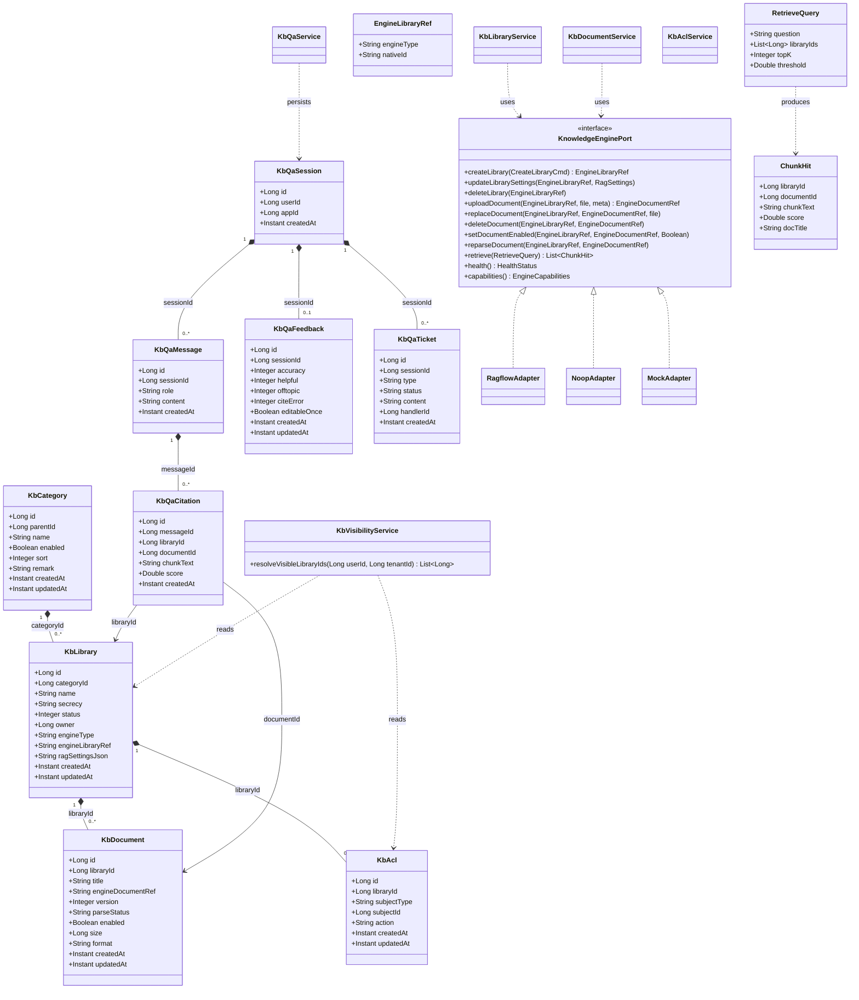
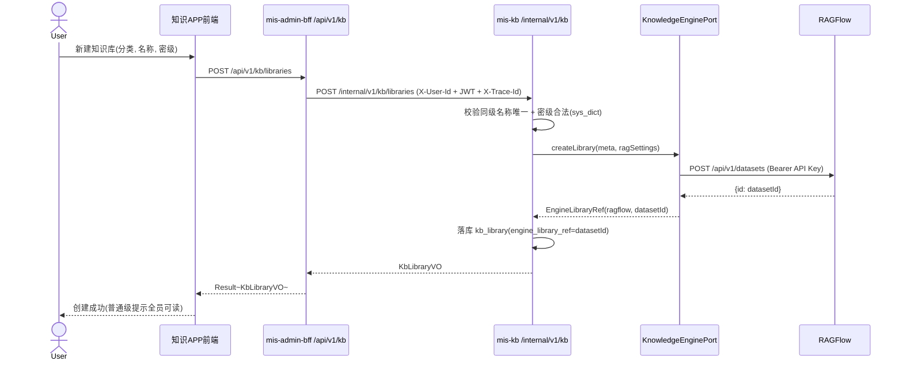
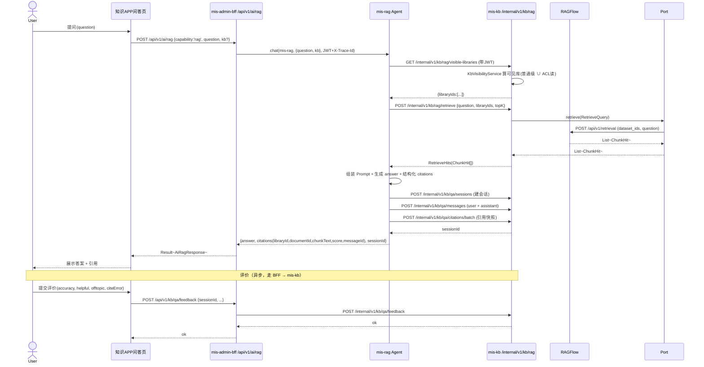
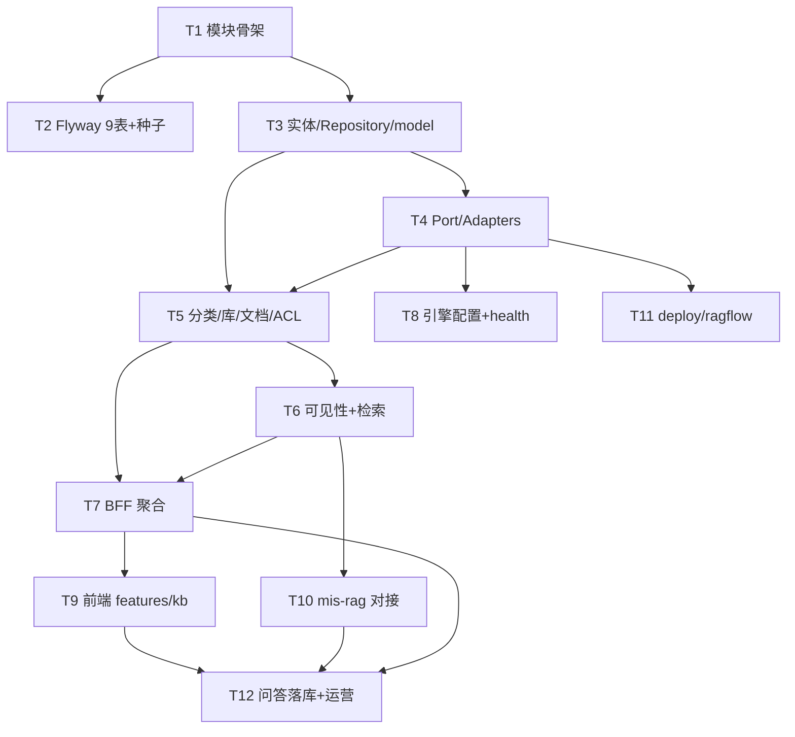

# MIS 知识库（mis-kb）+ RAG —— 架构设计与任务分解（P0）

- **作者**：高见远（软件架构师）
- **日期**：2026-08-03
- **依据**：《MIS 知识库 APP 规划 v3》（`docs/backend/knowledge-base-app-plan.md`）、`ADR-018`、许清楚 P0 聚焦 PRD、用户已拍板 3 项决策
- **仓库**：`D:\code\mis-platform`（真实仓库，本期直接写代码）
- **范围**：P0 全栈（聚焦，不展开 P1/P2 细节，仅在任务列表标注占位）

---

## 0. 与既有决策的关系与探明事实（必读）

### 0.1 用户已拍板的 3 项决策（强制遵循）
1. **引擎适配**：实现 `KnowledgeEnginePort` + `RagflowAdapter`（真实 HTTP 调 RAGFlow）；并须提供 `NoopAdapter`/`MockAdapter`，使 mis-kb 在本地/CI 无 RAGFlow 实例时也能**编译、单测、跑通主流程**（CI 用 Mock）。
2. **数据复用（全部复用，不本地落地重复表）**：
   - 密级枚举复用 `mis-system` 的 `sys_dict`（新增密级字典类型，不建 `kb_secrecy` 表）；
   - 用户/角色主体复用 `mis-iam` / `mis-org` 提供的取数端点（ACL 只存 `subject_id`，不建本地用户表）；
   - `app_id` 注册与九宫格入口复用 `mis-auth`/`mis-iam` 的 `SysApp`/`SysMenu`/`SysModule` 体系（I-01）。
3. **前端形态**：知识 APP 是**后台应用模块**，集成进 `frontend/mis-admin-web` 的 `src/features/kb`（非独立子应用）；**问答交互经现有 ai-copilot 智能体通道访问 mis-rag**（即复用 `POST /api/v1/ai/rag`，不是新建"前端→BFF 直连 mis-rag"链路）。

### 0.2 ⚠️ 重要差异点：问答编排链路（相对 ADR-018 §3.7，已裁定）
- `ADR-018` 决策 #3 与规划 §3.7 **推荐 BFF 编排**：`BFF 先调 mis-kb.retrieve，再调 mis-rag 生成`。
- 用户**决策 #3**改为：**mis-rag 内部经内网（带用户 JWT）调 mis-kb 的 `visible-libraries` + `retrieve`，再生成答案；session/message/citation 落库由 mis-kb 提供内部 API、mis-rag 调用**。
- **本文按用户决策 #3 设计**，即前端问答页仍走 `/api/v1/ai/rag`（ai-copilot 通道，契约不变），但编排权从 BFF 下沉到 mis-rag。
- **已裁定（主理人，2026-08-03）**：采纳本变体，覆盖 `ADR-018` §3.7 推荐的 BFF 编排；详见 §14「ADR-018 修订记录」与 §13「架构裁定」。

### 0.3 探明的仓库事实（已通过读码核实，务必对齐）
| 事实 | 结论 | 对设计的影响 |
|---|---|---|
| **Flyway 位置** | 迁移脚本**集中**在 `backend/mis-migrator/src/main/resources/db/migration/`（V1~V11）；各微服务模块**无** `db/migration`，且 `spring.jpa.hibernate.ddl-auto: none`、`flyway.enabled=false` | KB 的 9 张表 DDL **写入 `mis-migrator` 新增 `V12__kb_schema.sql`**，mis-kb 自己**不跑 Flyway** |
| **API 前缀** | 微服务 Controller 用 `/internal/v1/**`；`mis-admin-bff` 用 `/api/v1/**`；`mis-gateway:8080` 把 `/api` 代理到 BFF `:8081` | mis-kb 暴露 `/internal/v1/kb/**`；BFF 聚合为 `/api/v1/kb/**`；前端仅访问 `/api/v1/**` |
| **统一响应** | `mis-common-core` 的 `Result<T>`（`code==0` 成功）、`PageResult<T>`；`ResultCode` 枚举 | KB 复用，新增 `KbResultCode` 段位不得与现有冲突 |
| **依赖版本** | 父 `mis-platform` 通过 `mis-common-bom` 管理 Spring Boot 3.2.5 / Cloud 2023.0.1 / Flyway 10.14 / PostgreSQL 42.7.3 | mis-kb `pom.xml` 引 `mis-common-*` + `spring-boot-starter-*` **不加版本号** |
| **IAM 取数** | `IamUserClient`（mis-auth 内）、`OrgEmployeeClient`（mis-iam 内）均为**模块私有** RestClient 客户端，调 `mis-iam`/`mis-org` 的 `/internal/v1/**` | mis-kb **不复用这两个类本身**（非共享），而是新建 `KbSubjectClient` 复用其**端点契约**（见 §12） |
| **BFF 内部客户端** | `AbstractDownstreamClient` + `RestClient` + `loginContextHeaders()` 注入 `X-User-Id/X-Tenant-Id/X-App-Id/X-Employee-Id/X-Username` + `Authorization` + `X-Trace-Id` | BFF 新增 `KbWebClient` 复用同一机制 |
| **ai-copilot 通道** | `AiProxyController.rag` → `aiPlatformClient.chat("mis-rag", body)` → `POST /api/v1/agents/mis-rag/chat`；`AiRagRequest{kb, question, topK, context}`、`AiRagResponse{answer, citations, sessionId}` | 前端问答页**直接复用**此通道；仅需扩展 `AiRagResponse/AiRagCitation` 字段（见 T10） |
| **前端路由** | `router.tsx` 用 `AppLayout` + `KeepAliveOutlet`，真实页面由 `useAuthStore.menus`（后端 `SysMenu`）驱动；路由仅作占位 `<Route path="/system/*" element={null}/>` | KB 新增 `<Route path="/kb/*" element={null}/>` + 注册 `SysModule(code=kb)` + `SysMenu` 条目（九宫格来自 `SysApp`） |

---

## 1. 实现方案与框架选型

### 1.1 后端 `mis-kb`（Spring Boot 微服务）
- 仿 `mis-system` 结构，包名 `com.mis.kb`；端口 **8108**（BFF 内网调用）。
- Spring Boot 3.2.5 / Java 17 / Spring Data JPA / PostgreSQL；Nacos（discovery + config）同既有。
- **引擎调用**：用 `spring-boot-starter-web` 自带的 `RestClient`（Spring 6.1 已自动配置 `RestClient.Builder`）同步调 RAGFlow HTTP API（建库/文档/retrieval 均为请求-响应，无需流式）。
- **内部端点**：`/internal/v1/kb/**`（管理 CRUD + 供 mis-rag 的 `rag/visible-libraries`、`rag/retrieve`、`qa/sessions`、`qa/messages`、`qa/citations`、`qa/feedback`）。
- **复用**：`Result`/`PageResult`（mis-common-core）、`BusinessException`、`SecurityContextHolder`/`LoginUser`（mis-common-security）、`IdGenerator` 模式（mirror mis-system）、密级 `sys_dict`。

### 1.2 前端 `features/kb`（后台应用模块）
- 集成进 `frontend/mis-admin-web/src/features/kb`，与 `ai`/`system` 等并列；复用现有 `Zustand + TanStack Query + shadcn + axios(@/lib/api/client)`；`npm run typecheck`（tsc --noEmit）是唯一门禁。
- **管理页**（分类/库/文档/权限/运营/引擎配置）走 `kb-api.ts` → `/api/v1/kb/**`（BFF）。
- **问答页**走 `useAI({capability:'rag'})` → `/api/v1/ai/rag`（ai-copilot 通道，决策 #3），评价走 `/api/v1/kb/qa/feedback`。

### 1.3 `mis-rag` 改动（Python，agent/ai-platform）
- 仅做生成与编排（不落业务库、不管授权、不直连 RAGFlow SDK）；**新增** `kb_client.py` 调 mis-kb 内部端点（带 JWT 透传）；**新增** `models/retrieve.py` 统一 `RetrieveHits/ChunkHit`；**新增/改** `agent/mis_rag/qa_pipeline.py` 在生成前调 `visible-libraries + retrieve`、生成后调 `qa/sessions|messages|citations` 落库。

### 1.4 引擎适配层（Port/Adapter）
- `KnowledgeEnginePort`（接口）+ `RagflowAdapter`（真实）+ `NoopAdapter`（无操作）+ `MockAdapter`（内存假数据，CI 用）。
- 经 `mis.kb.engine.type` 选择（`ragflow`/`noop`/`mock`）；仅 `RagflowAdapter` 实现真实 HTTP。

### 1.5 复用点汇总
| 复用对象 | 来源 | 用法 |
|---|---|---|
| 密级枚举 | `sys_dict`（新增 dict type `kb_secrecy`） | `kb_library.secrecy` 存 dict item `value` |
| 用户/角色主体 | `mis-iam` `/internal/v1/users/{id}/auth`、`mis-org` `/internal/v1/employees` | `KbSubjectClient` 取用户角色列表（用于 ACL 评估） |
| `app_id`/九宫格/菜单 | `SysApp`/`SysModule`/`SysMenu`（mis-system/mis-auth） | I-01 注册知识 APP |
| 统一响应 | `Result`/`PageResult` | 所有 Controller |
| JWT 透传 | `X-User-Id/X-Tenant-Id/X-App-Id` + `Authorization`(RS256) + `X-Trace-Id` | BFF→mis-kb、mis-rag→mis-kb 均透传 |
| Flyway | `mis-migrator` | KB DDL 入 V12 |

---

## 2. 后端 `mis-kb` 文件树 + pom

```
backend/mis-kb/
├── pom.xml
└── src/
    ├── main/
    │   ├── java/com/mis/kb/
    │   │   ├── KbApplication.java
    │   │   ├── domain/
    │   │   │   ├── entity/
    │   │   │   │   ├── KbCategory.java
    │   │   │   │   ├── KbLibrary.java
    │   │   │   │   ├── KbDocument.java
    │   │   │   │   ├── KbAcl.java
    │   │   │   │   ├── KbQaSession.java
    │   │   │   │   ├── KbQaMessage.java
    │   │   │   │   ├── KbQaCitation.java
    │   │   │   │   ├── KbQaFeedback.java
    │   │   │   │   └── KbQaTicket.java
    │   │   │   ├── repository/
    │   │   │   │   ├── KbCategoryRepository.java
    │   │   │   │   ├── KbLibraryRepository.java
    │   │   │   │   ├── KbDocumentRepository.java
    │   │   │   │   ├── KbAclRepository.java
    │   │   │   │   ├── KbQaSessionRepository.java
    │   │   │   │   ├── KbQaMessageRepository.java
    │   │   │   │   ├── KbQaCitationRepository.java
    │   │   │   │   ├── KbQaFeedbackRepository.java
    │   │   │   │   └── KbQaTicketRepository.java
    │   │   │   ├── service/
    │   │   │   │   ├── KbCategoryService.java
    │   │   │   │   ├── KbLibraryService.java
    │   │   │   │   ├── KbDocumentService.java
    │   │   │   │   ├── KbAclService.java
    │   │   │   │   ├── KbVisibilityService.java
    │   │   │   │   ├── KbQaService.java
    │   │   │   │   └── KbEngineConfigService.java
    │   │   │   └── model/
    │   │   │       ├── Secrecy.java          // 密级常量(public/internal/secret/confidential)
    │   │   │       ├── AclAction.java        // read/manage/acl
    │   │   │       ├── SubjectType.java      // user/role
    │   │   │       ├── ParseStatus.java      // pending/parsing/success/failed
    │   │   │       ├── LibraryStatus.java    // enabled/disabled
    │   │   │       ├── RetrieveQuery.java
    │   │   │       ├── ChunkHit.java
    │   │   │       ├── EngineLibraryRef.java
    │   │   │       ├── EngineDocumentRef.java
    │   │   │       ├── RagSettings.java
    │   │   │       ├── EngineCapabilities.java
    │   │   │       └── CreateLibraryCmd.java
    │   │   ├── engine/
    │   │   │   ├── KnowledgeEnginePort.java
    │   │   │   ├── RagflowAdapter.java
    │   │   │   ├── NoopAdapter.java
    │   │   │   ├── MockAdapter.java
    │   │   │   ├── RagflowProperties.java
    │   │   │   ├── RagflowClient.java         // RestClient 封装
    │   │   │   ├── EngineAdapterSelector.java // 按 mis.kb.engine.type 选 Bean
    │   │   │   └── dto/                        // RAGFlow 请求/响应 record
    │   │   │       ├── RfDataset.java
    │   │   │       ├── RfDocument.java
    │   │   │       └── RfRetrievalResult.java
    │   │   ├── api/
    │   │   │   ├── controller/
    │   │   │   │   ├── CategoryController.java
    │   │   │   │   ├── LibraryController.java
    │   │   │   │   ├── DocumentController.java
    │   │   │   │   ├── AclController.java
    │   │   │   │   ├── EngineConfigController.java
    │   │   │   │   ├── QaController.java          // feedback/history（经 BFF 暴露）
    │   │   │   │   └── QaInternalController.java   // visible-libraries/retrieve/sessions/messages/citations（mis-rag 调用）
    │   │   │   ├── dto/
    │   │   │   │   ├── KbCategoryCreateRequest.java / UpdateRequest.java / VO.java
    │   │   │   │   ├── KbLibraryCreateRequest.java / UpdateRequest.java / VO.java
    │   │   │   │   ├── KbDocumentVO.java / UploadResponse.java
    │   │   │   │   ├── KbAclCreateRequest.java / VO.java
    │   │   │   │   ├── VisibleLibrariesResponse.java
    │   │   │   │   ├── RetrieveRequest.java / RetrieveHitsVO.java
    │   │   │   │   ├── QaSessionCreateRequest.java / VO.java
    │   │   │   │   ├── QaMessageCreateRequest.java / VO.java
    │   │   │   │   ├── QaCitationBatchRequest.java
    │   │   │   │   └── QaFeedbackRequest.java
    │   │   │   └── client/
    │   │   │       └── KbSubjectClient.java     // 调 mis-iam/mis-org 取用户/角色
    │   │   ├── config/
    │   │   │   └── KbWebConfig.java            // 内部端点鉴权/异常处理
    │   │   └── support/
    │   │       └── IdGenerator.java            // Snowflake（mirror mis-system）
    │   └── resources/
    │       ├── application.yml
    │       └── bootstrap.yml
    └── test/java/com/mis/kb/
        ├── engine/MockAdapterTest.java
        ├── engine/RagflowAdapterTest.java      // 用 MockMvc/TestRestTemplate 或 mock server
        └── service/KbVisibilityServiceTest.java
```

### `backend/mis-kb/pom.xml`（关键依赖，版本来自父/mis-common-bom，不写版本）
```xml
<dependencies>
    <dependency><groupId>com.mis</groupId><artifactId>mis-common-core</artifactId></dependency>
    <dependency><groupId>com.mis</groupId><artifactId>mis-common-web</artifactId></dependency>
    <dependency><groupId>com.mis</groupId><artifactId>mis-common-jpa</artifactId></dependency>
    <dependency><groupId>com.mis</groupId><artifactId>mis-common-security</artifactId></dependency>
    <dependency><groupId>org.springframework.boot</groupId><artifactId>spring-boot-starter-web</artifactId></dependency>
    <dependency><groupId>org.springframework.boot</groupId><artifactId>spring-boot-starter-data-jpa</artifactId></dependency>
    <dependency><groupId>org.springframework.boot</groupId><artifactId>spring-boot-starter-validation</artifactId></dependency>
    <dependency><groupId>org.springframework.boot</groupId><artifactId>spring-boot-starter-actuator</artifactId></dependency>
    <dependency><groupId>org.postgresql</groupId><artifactId>postgresql</artifactId><scope>runtime</scope></dependency>
    <dependency><groupId>com.alibaba.cloud</groupId><artifactId>spring-cloud-starter-alibaba-nacos-config</artifactId></dependency>
    <dependency><groupId>com.alibaba.cloud</groupId><artifactId>spring-cloud-starter-alibaba-nacos-discovery</artifactId></dependency>
    <dependency><groupId>org.springframework.cloud</groupId><artifactId>spring-cloud-starter-loadbalancer</artifactId></dependency>
    <dependency><groupId>org.springframework.cloud</groupId><artifactId>spring-cloud-starter-bootstrap</artifactId></dependency>
    <dependency><groupId>org.springframework.boot</groupId><artifactId>spring-boot-starter-test</artifactId><scope>test</scope></dependency>
</dependencies>
```
> 同时需在**父 `backend/pom.xml` 的 `<modules>` 追加 `<module>mis-kb</module>`**。

---

## 3. Flyway 迁移（落入 `mis-migrator`）

### 3.1 路径与版本策略
- 路径：`backend/mis-migrator/src/main/resources/db/migration/`
- 现有最新 `V11__add_missing_system_menus.sql` → 新增 **`V12__kb_schema.sql`**（建 9 表 + 索引 + 密级字典 CHECK）、**`V13__kb_seed.sql`**（插入 `kb_secrecy` 字典类型与 4 个码值；插入 `SysApp`/`SysModule`/`SysMenu` 实现 I-01 九宫格入口）。
- 命名与既有一致：`V{序号}__{snake_case}.sql`；`baselineOnMigrate=false`、`cleanDisabled=true`。

### 3.2 9 张表 DDL 要点（PostgreSQL，TIMESTAMPTZ）
```sql
-- 枚举（与既有风格：用 VARCHAR + 应用层校验，或 PG ENUM；此处用 VARCHAR 便于复用 sys_dict 码值）
CREATE TABLE kb_category (
    id          BIGINT PRIMARY KEY,
    parent_id   BIGINT NULL,
    name        VARCHAR(128) NOT NULL,
    enabled     SMALLINT NOT NULL DEFAULT 1,
    sort        INT NOT NULL DEFAULT 0,
    remark      VARCHAR(512) NULL,
    created_at  TIMESTAMPTZ NOT NULL DEFAULT NOW(),
    updated_at  TIMESTAMPTZ NOT NULL DEFAULT NOW()
);
CREATE INDEX idx_kb_category_parent ON kb_category(parent_id);

CREATE TABLE kb_library (
    id                 BIGINT PRIMARY KEY,
    category_id        BIGINT NOT NULL,
    name               VARCHAR(128) NOT NULL,
    secrecy            VARCHAR(32) NOT NULL,          -- 复用 sys_dict(kb_secrecy) 的 value
    status             SMALLINT NOT NULL DEFAULT 1,   -- 1=enabled 0=disabled
    owner              BIGINT NULL,
    engine_type        VARCHAR(32) NOT NULL DEFAULT 'ragflow',
    engine_library_ref VARCHAR(128) NULL,             -- RAGFlow dataset id
    rag_settings_json  TEXT NULL,                     -- MIS 规范 RAG 设置(JSON)
    created_at         TIMESTAMPTZ NOT NULL DEFAULT NOW(),
    updated_at         TIMESTAMPTZ NOT NULL DEFAULT NOW(),
    CONSTRAINT uk_kb_lib_cat_name UNIQUE (category_id, name),
    CONSTRAINT chk_kb_lib_secrecy CHECK (secrecy IN ('public','internal','secret','confidential'))
);
CREATE INDEX idx_kb_lib_cat ON kb_library(category_id);
CREATE INDEX idx_kb_lib_secrecy ON kb_library(secrecy);

CREATE TABLE kb_document (
    id                 BIGINT PRIMARY KEY,
    library_id         BIGINT NOT NULL,
    title              VARCHAR(256) NOT NULL,
    engine_document_ref VARCHAR(128) NULL,           -- RAGFlow doc id
    version            INT NOT NULL DEFAULT 1,
    parse_status       VARCHAR(16) NOT NULL DEFAULT 'pending',
    enabled            SMALLINT NOT NULL DEFAULT 1,
    size               BIGINT NULL,
    format             VARCHAR(16) NULL,
    created_at         TIMESTAMPTZ NOT NULL DEFAULT NOW(),
    updated_at         TIMESTAMPTZ NOT NULL DEFAULT NOW(),
    CONSTRAINT chk_kb_doc_status CHECK (parse_status IN ('pending','parsing','success','failed'))
);
CREATE INDEX idx_kb_doc_lib ON kb_document(library_id);

CREATE TABLE kb_acl (
    id          BIGINT PRIMARY KEY,
    library_id  BIGINT NOT NULL,
    subject_type VARCHAR(8) NOT NULL,                -- user / role
    subject_id  BIGINT NOT NULL,                     -- 复用 mis-iam/mis-org 主体 id
    action      VARCHAR(8) NOT NULL,                 -- read / manage / acl
    created_at  TIMESTAMPTZ NOT NULL DEFAULT NOW(),
    updated_at  TIMESTAMPTZ NOT NULL DEFAULT NOW(),
    CONSTRAINT uk_kb_acl UNIQUE (library_id, subject_type, subject_id, action),
    CONSTRAINT chk_kb_acl_subject CHECK (subject_type IN ('user','role')),
    CONSTRAINT chk_kb_acl_action CHECK (action IN ('read','manage','acl'))
);
CREATE INDEX idx_kb_acl_lib ON kb_acl(library_id);
CREATE INDEX idx_kb_acl_subject ON kb_acl(subject_type, subject_id);

CREATE TABLE kb_qa_session (
    id          BIGINT PRIMARY KEY,
    user_id     BIGINT NOT NULL,
    app_id      BIGINT NULL,
    created_at  TIMESTAMPTZ NOT NULL DEFAULT NOW()
);
CREATE INDEX idx_kb_qa_session_user ON kb_qa_session(user_id);

CREATE TABLE kb_qa_message (
    id          BIGINT PRIMARY KEY,
    session_id  BIGINT NOT NULL,
    role        VARCHAR(8) NOT NULL,                 -- user / assistant
    content     TEXT NOT NULL,
    created_at  TIMESTAMPTZ NOT NULL DEFAULT NOW()
);
CREATE INDEX idx_kb_qa_msg_session ON kb_qa_message(session_id);

CREATE TABLE kb_qa_citation (
    id           BIGINT PRIMARY KEY,
    message_id   BIGINT NOT NULL,
    library_id   BIGINT NOT NULL,
    document_id  BIGINT NOT NULL,
    chunk_text   TEXT NULL,
    score        DOUBLE PRECISION NULL,
    created_at   TIMESTAMPTZ NOT NULL DEFAULT NOW()
);
CREATE INDEX idx_kb_qa_citation_msg ON kb_qa_citation(message_id);

CREATE TABLE kb_qa_feedback (
    id            BIGINT PRIMARY KEY,
    session_id    BIGINT NOT NULL,
    accuracy      SMALLINT NULL,     -- 1~5 或 0/1
    helpful       SMALLINT NULL,
    offtopic      SMALLINT NULL,
    cite_error    SMALLINT NULL,
    editable_once SMALLINT NOT NULL DEFAULT 1,
    created_at    TIMESTAMPTZ NOT NULL DEFAULT NOW(),
    updated_at    TIMESTAMPTZ NOT NULL DEFAULT NOW(),
    CONSTRAINT uk_kb_feedback_session UNIQUE (session_id)
);

-- P1 占位空表（仅建结构，逻辑留待 P1）
CREATE TABLE kb_qa_ticket (
    id          BIGINT PRIMARY KEY,
    session_id  BIGINT NULL,
    type        VARCHAR(16) NULL,
    status      VARCHAR(16) NULL DEFAULT 'open',
    content     TEXT NULL,
    handler_id  BIGINT NULL,
    created_at  TIMESTAMPTZ NOT NULL DEFAULT NOW()
);
```
> 说明：`secrecy` 用 `VARCHAR + CHECK` 而非引用 `sys_dict_item.id`，原因：`sys_dict_item.value` 在 type 内唯一但不全局唯一，且可见性逻辑依赖**码值**（public vs 其他）。应用层在写库前再用 `sys_dict` 校验码值合法（详见 §12）。如需强 FK，可改为存 `sys_dict_item.id`，但 UI 解析成本更高——P0 采用码值方案，待 §13 确认。

### 3.3 密级字典 + 菜单 seed（`V13__kb_seed.sql` 节选）
```sql
-- 密级字典类型
INSERT INTO sys_dict_type(id, name, code, status, sort, created_at, updated_at)
VALUES (nextval...或固定 id, '知识库密级', 'kb_secrecy', 1, 0, NOW(), NOW());
-- 4 个码值（value 即 kb_library.secrecy 取值）
INSERT INTO sys_dict_item(type_id, label, value, sort, status, created_at, updated_at)
VALUES (..., '普通', 'public', 1, 1, NOW(), NOW()),
       (..., '内部', 'internal', 2, 1, NOW(), NOW()),
       (..., '秘密', 'secret', 3, 1, NOW(), NOW()),
       (..., '机密', 'confidential', 4, 1, NOW(), NOW());
-- I-01：九宫格入口（SysApp + SysModule + SysMenu），具体 id 在种子中固化
```
> 菜单项：知识库（app）→ 概览 / 分类管理 / 知识库 / 文档 / 权限 / 智能问答 / 问答运营 / 引擎配置 8 个 `SysMenu`，挂 `SysModule(code=kb, service_name=mis-kb)`。

---

## 4. BFF 改动（`mis-admin-bff`）

新增/修改文件（均在 `com.mis.adminbff` 下）：
| 文件 | 动作 | 说明 |
|---|---|---|
| `client/KbWebClient.java` | 新增 | 继承/复用 `AbstractDownstreamClient`，`RestClient` 调 `mis-kb` `/internal/v1/kb/**`，注入 `loginContextHeaders()` + `Authorization` + `X-Trace-Id` |
| `service/KbAggregateService.java` | 新增 | 聚合分类/库/文档/ACL/问答反馈/历史的内部调用，封装为 `Result` |
| `controller/KbController.java` | 新增 | `@RequestMapping("/api/v1/kb")`，暴露管理 CRUD + `/api/v1/kb/qa/feedback`、`/api/v1/kb/qa/sessions`(本人历史) |
| `dto/kb/KbCategoryVO.java` 等 | 新增 | 与 mis-kb VO 对齐的 BFF 侧 DTO |
| `dto/ai/AiRagResponse.java` / `AiRagCitation.java` | 修改 | 扩展 `AiRagCitation` 增加 `libraryId`、`documentId`、`chunkText`、`messageId`；`AiRagResponse` 增加 `libraryIds` 可见范围提示（见 T10） |

**BFF→mis-kb 鉴权透传**：`KbWebClient` 复用 `loginContextHeaders()`（X-User-Id/X-Tenant-Id/X-App-Id/X-Employee-Id/X-Username）+ 透传前端原始 `Authorization`(RS256 JWT) + `X-Trace-Id`；mis-kb 内部端点经 `mis-common-security` 的 `SecurityContextHolder`/`LoginUser` 解析身份（与 BFF 调 mis-iam/mis-org 同机制）。

---

## 5. 前端 `features/kb` 文件树

```
frontend/mis-admin-web/src/features/kb/
├── index.tsx                     # KbApp 路由出口（/kb/*）
├── pages/
│   ├── overview-page.tsx         # 概览（统计卡片）
│   ├── categories-page.tsx       # 分类管理（C-01~07）
│   ├── libraries-page.tsx        # 知识库列表/详情（L-01~08）
│   ├── documents-page.tsx        # 文档管理（D-01~10）
│   ├── permissions-page.tsx      # 权限设置（P-01~07）
│   ├── qa-page.tsx               # 智能问答（F-01~07，走 /api/v1/ai/rag）
│   ├── operations-page.tsx       # 问答运营（A-02/A-02a 只读）
│   └── engine-config-page.tsx    # 引擎连接 + 全局 RAG 默认（S-04/S-05）
├── components/
│   ├── category-tree.tsx
│   ├── library-table.tsx
│   ├── library-form.tsx
│   ├── document-uploader.tsx
│   ├── acl-editor.tsx            # 复用 org 选人/角色组件
│   ├── qa-panel.tsx              # 包 useAI(capability:'rag')
│   ├── citation-list.tsx         # F-03 引用 + F-04 定位原文
│   ├── feedback-form.tsx         # F-07 多维评价
│   └── engine-config-form.tsx
├── api/
│   ├── kb-api.ts                 # 调 /api/v1/kb/**
│   └── kb-types.ts
└── stores/
    └── use-kb-store.ts           # Zustand：当前库/筛选态
```
- **路由挂载**：`src/app/router.tsx` 增加 `<Route path="/kb/*" element={null} />`（页面由 `SysMenu` 驱动，与 `/system/*` 同机制）。
- **九宫格入口（I-01）**：由 §3.3 的 `SysApp`/`SysModule`/`SysMenu` 种子注册；前端无需硬编码导航，按 `useAuthStore.menus` 渲染。
- **问答通道接入点**：`qa-page.tsx` 使用 `useAI<RagRequestBody, RagResponse>({capability:'rag', feature:'rag-qa'})`（来自 `@/features/ai`），即复用 ai-copilot 通道；评价提交调 `kb-api.submitFeedback()` → `/api/v1/kb/qa/feedback`。这样**完全满足决策 #3**（不经新建直连链路）。

---

## 6. `mis-rag` 改动（`agent/ai-platform/backend/src`）

| 文件 | 动作 | 说明 |
|---|---|---|
| `src/adapters/kb_client.py` | 新增 | 异步 HTTP 客户端，调 mis-kb 内部端点（`/internal/v1/kb/rag/visible-libraries`、`/rag/retrieve`、`/qa/sessions`、`/qa/messages`、`/qa/citations`）**透传用户 JWT/X-User-Id/X-Trace-Id** |
| `src/models/retrieve.py` | 新增 | `RetrieveHits` / `ChunkHit` Pydantic 模型（统一引用 DTO） |
| `src/agent/mis_rag/qa_pipeline.py` | 新增 | KB 问答管线：visible-libraries→retrieve→拼 Prompt→生成→结构化 citations→落库回调 |
| `configs/agents/mis-rag/agent.yaml` | 修改 | 启用 KB 检索步骤；声明依赖 `kb_client` |
| `configs/agents/mis-rag/runtime/runtime.yaml` | 修改 | 增加 `retrieve_top_k` 默认等 |
| `configs/agents/mis-rag/runtime/prompts/system.md` | 修改 | 注入"基于传入 hits 生成、输出结构化 citations"指令 |
| `src/config_manager/` 或 env | 修改 | 增加 `MIS_KB_BASE_URL`、`MIS_KB_AGENT_TOKEN`(内部服务账号 JWT) 配置 |

> 落库责任方裁定（**已裁定，主理人 2026-08-03**，见 §13 第 2 项）：`session/message/citation` 由 mis-rag 经 `kb_client` 调 mis-kb 内部 API 落库（ACL + 审计留在 Java）；`feedback` 由前端经 BFF→mis-kb 落库（用户主动操作，简单 CRUD）。

---

## 7. `deploy/ragflow`

现有 `deploy/ragflow/docker-compose.yml` 仅为占位（`ragflow` 单服务 + `profiles: full`）。需**补全为测试可启动的完整栈**：

| 文件 | 动作 | 说明 |
|---|---|---|
| `deploy/ragflow/docker-compose.yml` | 重写 | 完整定义 `ragflow`(v0.26.4 钉死) + `mysql:5.7` + `redis:7` + `minio` + `elasticsearch`(或 `infinity`)，加 `depends_on`/健康检查/卷/网络 `mis-ragflow-net`；移除 `profiles: full` 占位 |
| `deploy/ragflow/.env.example` | 补全 | `RAGFLOW_IMAGE=infiniflow/ragflow:v0.26.4`、MySQL/Redis/MinIO 密码、`RAGFLOW_HTTP_PORT`、`MIS_KB_ENGINE_BASE_URL=http://ragflow:80`（供同网络 mis-kb 解析） |
| `deploy/ragflow/README.md` | 更新 | "已钉扎版本"表登记 `v0.26.4`；说明 API Key 仅服务端（`.env` 不进 Git，已有 `.gitignore` 覆盖） |

- **与现有 `deploy/` 关系**：作为独立 overlay，可 `docker compose -f deploy/docker-compose.dev.yml -f deploy/ragflow/docker-compose.yml --env-file deploy/ragflow/.env up -d` 与 MIS 开发栈同网络；`mis-kb` 经服务名 `ragflow:80` 访问引擎。
- **密钥**：`RAGFLOW_API_KEY` 写入 `.env`（gitignored），mis-kb 通过 `mis.kb.engine.api-key` 读取（nacos/application.yml），**浏览器永不持有**。

---

## 8. 数据结构与接口（类图）



---

## 9. 程序调用流程（时序图）

### (a) 新建知识库并建引擎 dataset


### (b) 用户问答（经 ai-copilot → mis-rag → mis-kb 可见库+retrieve → 生成 → 落库）


---

## 10. 有序任务列表（关键交付物，按实现顺序）

> 依赖图见 §10.1。每个任务标注**源文件（相对仓库根）**与**验收点**。优先级 P0（标注 P1/P2 为占位）。

| 编号 | 名称 | 源文件（相对路径） | 依赖 | 优先级 | 验收点 |
|---|---|---|---|---|---|
| **T1** | 建 mis-kb 模块骨架 + pom + Application | `backend/mis-kb/pom.xml`、`backend/mis-kb/src/main/java/com/mis/kb/KbApplication.java`、`src/main/resources/application.yml`、`bootstrap.yml`、`support/IdGenerator.java`；`backend/pom.xml`（`<modules>` 加 `mis-kb`） | — | P0 | `mvn -pl mis-kb compile` 通过；模块注册 Nacos；`GET /actuator/health` 200 |
| **T2** | Flyway 9 表 + 密级字典 + 菜单种子 | `backend/mis-migrator/src/main/resources/db/migration/V12__kb_schema.sql`、`V13__kb_seed.sql` | T1（可并行，排其后） | P0 | `flyway migrate` 成功；9 表 + `kb_qa_ticket` 空表存在；`sys_dict`(kb_secrecy) 4 码值存在；知识 APP 出现在九宫格 |
| **T3** | domain 实体 + Repository + model 值对象 | `backend/mis-kb/.../domain/entity/*.java`、`repository/*.java`、`domain/model/*.java` | T1 | P0 | 编译；Repository 查询单测通过 |
| **T4** | KnowledgeEnginePort + RagflowAdapter + NoopAdapter + MockAdapter | `backend/mis-kb/.../engine/*`（Port/Adapters/Client/Properties/Selector/dto） | T1, T3 | P0 | `MockAdapter` 单测覆盖 `createLibrary`/`retrieve`；CI 用 `mock` 跑通主流程；`NoopAdapter` 健康绿 |
| **T5** | 分类/库/文档/ACL 服务与 Controller | `domain/service/{KbCategory,KbLibrary,KbDocument,KbAcl}Service.java`、`api/controller/{Category,Library,Document,Acl}Controller.java`、`api/dto/*`、`api/client/KbSubjectClient.java` | T3, T4 | P0 | 内部端点 CRUD 可用；建库同步建 dataset（Ragflow 真实 / Mock 模拟）；ACL 增删查；普通级自动全员可读 |
| **T6** | 可见性计算与检索服务 | `domain/service/KbVisibilityService.java`、`api/controller/QaInternalController.java`(visible-libraries/retrieve)、`model/RetrieveQuery.java`、`model/ChunkHit.java` | T3, T4, T5 | P0 | 可见库计算正确（普通级 ∪ ACL 读，排除 disabled）；`retrieve` 返回统一 `ChunkHit`；可见性单测覆盖 |
| **T7** | BFF kb 聚合 | `mis-admin-bff/.../client/KbWebClient.java`、`service/KbAggregateService.java`、`controller/KbController.java`、`dto/kb/*` | T5, T6 | P0 | `/api/v1/kb/**` 经网关可达；JWT/头透传；管理页可用 |
| **T8** | S-04 引擎连接配置 + health | `domain/service/KbEngineConfigService.java`、`api/controller/EngineConfigController.java`、`engine/RagflowProperties.java`（接入 nacos） | T4 | P0 | `GET /api/v1/kb/engine/health` 返回健康；`capabilities()` 正确；Noop/Mock 下 health 绿 |
| **T9** | 前端 features/kb 各页面 | `frontend/mis-admin-web/src/features/kb/**`、`src/app/router.tsx`（加 `/kb/*`）、`api/kb-api.ts`、`stores/use-kb-store.ts` | T7 | P0 | `npm run typecheck` 通过；分类/库/文档/权限页可用（管理 CRUD 走 BFF） |
| **T10** | mis-rag 对接（问答编排 + 落库） | `agent/ai-platform/backend/src/adapters/kb_client.py`、`models/retrieve.py`、`agent/mis_rag/qa_pipeline.py`、`configs/agents/mis-rag/{agent,runtime/prompts}/*`；`mis-admin-bff/.../dto/ai/AiRagResponse.java`+`AiRagCitation.java`（扩展字段） | T6 | P0 | `/api/v1/ai/rag` 经 mis-rag 返回 `answer+citations+sessionId`；mis-kb 落库 `session/message/citation`；引用含 `libraryId/documentId/chunkText/messageId` |
| **T11** | deploy/ragflow 完整 Compose | `deploy/ragflow/docker-compose.yml`（重写）、`.env.example`（补全）、`README.md`（钉版 v0.26.4） | T4 | P0 | `docker compose up` 拉起 ragflow+mysql+redis+minio+es；mis-kb `health` 通；API Key 不进 Git |
| **T12** | 问答落库与运营 A-02/A-02a + 反馈 | `api/controller/QaController.java`(feedback/history)、`domain/service/KbQaService.java`、`features/kb/pages/operations-page.tsx`、`pages/qa-page.tsx`(feedback)、`api/kb-api.ts` | T9, T10 | P0 | 提交反馈落 `kb_qa_feedback`（可改一次 `editable_once`）；运营页 A-02 列表/详情只读可见；越权不可见他人会话 |

**P1/P2 占位（不在 P0 实现，仅标注）**：
- A-02b/c/d 评价看板/工单/导出（P1）；L-07/08 索引状态/库设置高级（P1）；Q-04 命中测试（P1）；S-01~03/06 字典/标签/文件策略（P1）；A-01 操作审计（P1）。
- F-06/08/09/10 历史/重生成/无命中/举报（P2 部分）；A-02e/A-03 金标对照/评测（P2）；S-05 全局 RAG 默认固化（P2）；多租户隔离（P2）；文档级 ACL（P2）；原文精确定位增强（P2）；可见性缓存（P1）。

### 10.1 任务依赖图


---

## 11. 依赖包列表

### Maven（`mis-kb`，版本来自父 `mis-platform` / `mis-common-bom`，**不加版本号**）
```
com.mis:mis-common-core
com.mis:mis-common-web
com.mis:mis-common-jpa
com.mis:mis-common-security
org.springframework.boot:spring-boot-starter-web          # 含 RestClient（调 RAGFlow）
org.springframework.boot:spring-boot-starter-data-jpa
org.springframework.boot:spring-boot-starter-validation
org.springframework.boot:spring-boot-starter-actuator
org.postgresql:postgresql                                # runtime
com.alibaba.cloud:spring-cloud-starter-alibaba-nacos-config
com.alibaba.cloud:spring-cloud-starter-alibaba-nacos-discovery
org.springframework.cloud:spring-cloud-starter-loadbalancer
org.springframework.cloud:spring-cloud-starter-bootstrap
org.springframework.boot:spring-boot-starter-test         # test
```
> 注：mis-kb 调 RAGFlow 与内部端点均用**同步 RestClient**，无需 `spring-boot-starter-webflux`（BFF 的流式 SSE 才用 WebClient，mis-kb 不涉及）。

### 前端（基本复用现有，新增极少）
```
# 复用：react, react-router-dom, zustand, @tanstack/react-query, axios(@/lib/api/client),
#       shadcn/ui, lucide-react, sonner（见 ai 模块已用）
# 新增（如需）：
react-markdown            # 若现有 MarkdownView 依赖缺失则补；qa-page/citation 渲染答案与片段
# 流式 SSE 解析：复用 @/features/ai/ai-sse-client.ts（已具备），无需新包
```

---

## 12. 共享知识（跨文件约定）

| 项 | 约定 |
|---|---|
| **包名** | 后端 `com.mis.kb`；前端 `src/features/kb` |
| **统一响应** | `Result<T>`（`code==0` 成功）/ `PageResult<T>`（`page,size,total,list`）；分页请求参数 `page`(1-based)、`size` |
| **错误码** | 新增 `KbResultCode` 枚举（放 `com.mis.kb.domain.model` 或 `mis-common`），段位避开现有 `ResultCode`：建议 `4092x`（冲突类，如 `KB_LIBRARY_NAME_EXISTS=40920`、`KB_CATEGORY_HAS_CHILDREN=40921`、`KB_ACL_EXISTS=40922`）、`4041x`（`KB_LIBRARY_NOT_FOUND=40410`、`KB_DOC_NOT_FOUND=40411`）、`4031x`（`KB_NO_READ_PERMISSION=40310`）；Service 抛 `BusinessException`，Controller 返回 `Result.fail(code,msg)` |
| **密级枚举值来源** | `sys_dict` type=`kb_secrecy` 的 `value`：`public`(普通,全员登录可读) / `internal` / `secret` / `confidential`。`kb_library.secrecy` 存该码值；写库前用 `sys_dict` 校验存在 |
| **可见性规则** | `visible = {secrecy='public' ∧ status=1} ∪ {ACL 授予 user 或 其某 role read} − {status=0}`；检索/问答**只命中可见库**。<br>**软删口径（P0，2026-08-03 补充）**：`kb_library` **无独立软删列**，`V12__kb_schema.sql` 只有 `status SMALLINT NOT NULL DEFAULT 1`（1=enabled / 0=disabled）。删除有两条路径且都已被 `status=1` 这一道过滤覆盖——①**物理删除**：`KbLibraryService.delete` 走 `libraryRepository.delete(entity)`，行直接消失；②**运营侧「软删/下架」**：约定置 `status=0`，落入 disabled 语义。故实现侧 `findByStatus(ENABLED)` **已等价于** `− disabled − deleted`，**不需要**再叠加 `deleted=0` 条件（此前 QA 报告 P-06 的疑似缺口据此关闭）。若 P1 引入独立 `deleted_at` 列，须同步修改本公式与 `KbVisibilityService`。 |
| **引擎 ID 映射** | `kb_library.engine_library_ref`=RAGFlow dataset id；`kb_document.engine_document_ref`=RAGFlow doc id；对外只认 MIS `libraryId/documentId`；浏览器永不持有引擎 Key |
| **JWT 透传字段** | `Authorization`(RS256, iss=mis-platform) + `X-User-Id` / `X-Tenant-Id` / `X-App-Id` / `X-Employee-Id` / `X-Username` + `X-Trace-Id`；BFF→mis-kb、mis-rag→mis-kb 均透传同一套 |
| **日期/ID** | 日期 `java.time.Instant` ↔ PG `TIMESTAMPTZ`；主键 `Long` 由 `support/IdGenerator`（Snowflake，mirror mis-system）生成 |
| **文档上传** | 前端 → BFF（`multipart/form-data`）→ mis-kb `DocumentController.upload` → `RagflowAdapter.uploadDocument` 转发 RAGFlow；解析状态异步回写 `parse_status` |
| **RAG 参数层级** | 全局默认(S-05) → 库设置(L-08) → 单次问答覆盖(topK/threshold 由调用方传 `RetrieveQuery`)；不进 RAGFlow 控制台 |
| **能力探测** | `Port.capabilities()` 声明 `replace/metadata_filter/rerank` 等；未知能力返回 `UNSUPPORTED`，UI 按能力显隐 |

---

## 13. 架构裁定（主理人，2026-08-03）

> 原「§13 待明确事项」已在本节逐项裁定。除链路（第 1 项）与落库责任方（第 2 项）为用户最终决策外，其余 9 项均采纳架构师的推荐方案。**所有 `kb_qa_*` 写操作一律经 mis-kb（Java）落地，mis-rag 不直连业务库。**

1. **问答编排链路（用户决策 #3，最终裁定）**：采纳本文变体——前端经 ai-copilot 通道 `POST /api/v1/ai/rag` → mis-rag；mis-rag 内部**带用户 JWT** 调 mis-kb 的 `/internal/v1/kb/.../visible-libraries` 与 `/retrieve`；生成答案后 mis-rag 调 mis-kb 内部 API 落库 `session/message/citation`。**此方案覆盖 `ADR-018` §3.7 推荐的 BFF 编排**，已记录为修订，见 §14。
2. **落库责任方（最终裁定）**：`session/message/citation` 由 mis-rag 经 `kb_client` 调 mis-kb 内部 API 落库（ACL + 审计在 Java 侧统一处理）；`feedback` 由前端 → BFF → mis-kb 落库（用户主动操作，简单 CRUD）。**所有 `kb_qa_*` 写操作都经 mis-kb（Java）落地，mis-rag 不直连业务库。**
3. **ai-copilot 通道契约（采纳推荐）**：KB 问答直接复用现有 `POST /api/v1/ai/rag`（capability=`rag`），mis-rag 侧加 kb 检索分支；**不新建 capability、不新建前端直连端点**。
4. **密级字典码值（采纳推荐）**：`public/internal/secret/confidential`（在 `sys_dict` 新增 `kb_secrecy` 类型）。仅 `public` 全员登录可读，其余须显式 ACL 授予。
5. **多租户隔离（采纳推荐）**：P0 按 Phase 1 单租户假设，**`kb_*` 表不加 `tenant_id`**；在 DDL 中以注释预留 `tenant_id` 扩展位。ACL 的 `subject_id` 仅靠 mis-iam 主体 id 区分。
6. **`IamUserClient`/`OrgEmployeeClient` 复用方式（采纳推荐）**：二者为 mis-auth/mis-iam **模块私有**类，不提升到 `mis-common` 共享；mis-kb 新建 `KbSubjectClient` **仅复用其 HTTP 端点契约**（调 mis-iam `/internal/v1/users/{id}/auth`、mis-org `/internal/v1/employees`）。
7. **`kb_library.secrecy` 外键形式（采纳推荐）**：存 `sys_dict_item` 的 `item_code` 字符串（`VARCHAR` + `CHECK` + 应用层校验），**不加物理外键**；写库前用 `sys_dict` 校验码值合法（见 §12）。
8. **ACL 角色来源（采纳推荐）**：评估用户可见库所需角色列表，经 `KbSubjectClient` 调 mis-iam（复用其已有 `roles` 字段），角色 id 语义与 mis-iam 一致。
9. **引擎连接配置存放（采纳推荐）**：走 Nacos（`ragflow.base-url` / `ragflow.api-key` / `engine.type`），**不建配置表**；未配置时自动启用 `NoopAdapter`，`health` 返回绿（见 T8/S-04）。
10. **`kb_qa_ticket` 表（采纳推荐）**：P0 仅建空表（P1 实现工单逻辑）；**索引/解析状态从引擎 `health` 与解析回调取，不另存状态表**。
11. **文件大小/类型限额（S-03）与密级下载策略（采纳推荐）**：P0 文档上传暂不限额度、不区分密级下载策略，留 P1（S-03）细化。

---

## 14. ADR-018 修订记录（决策 #3 对 §3.7 的偏离）

### 14.1 背景
`ADR-018`（《知识库（mis-kb）架构决策》）第 3.7 节**推荐 BFF 编排**：由 `mis-admin-bff` 在收到前端问答请求后，先调 mis-kb 的 `retrieve`，再将命中片段与问题一并交给 mis-rag 生成答案。其意图是"编排权在网关侧、各微服务职责单一"。

用户在第 3 项决策中明确推翻该编排方式，改为**由 mis-rag 内部完成编排**（详见 §0.2）。本次（2026-08-03）主理人裁定：**采纳用户决策 #3 变体，覆盖 `ADR-018` §3.7 的 BFF 编排推荐**，并据 §13 第 1、2 项最终签字。

### 14.2 偏离内容对照
| 维度 | ADR-018 §3.7（原推荐） | 用户决策 #3 / 本文（已裁定） |
|---|---|---|
| 编排发起方 | `mis-admin-bff`（网关聚合层） | `mis-rag`（AI Agent） |
| 可见库解析 | BFF 调 mis-kb `retrieve` 前先算可见范围 | mis-rag 内部带 JWT 调 mis-kb `/visible-libraries` + `/retrieve` |
| 生成与检索耦合 | 检索与生成分属两次跨服务调用，BFF 拼装 | mis-rag 单体内 `visible-libraries → retrieve → generate → 落库` 串成管线 |
| 落库责任 | 未明确（原设想 BFF 或 mis-rag 各自回写） | 统一由 mis-kb 内部 API 落库（mis-rag 调用，ACL+审计在 Java） |
| 前端契约 | 未特别约定 | 严格复用现有 `POST /api/v1/ai/rag`，前端 `kb` 问答页不新建链路 |

### 14.3 偏离理由（记为决策依据）
1. **复用既有的 ai-copilot 智能体通道**：前端问答页、SSE 流式、能力路由（`useAI(capability:'rag')`）在 `mis-admin-web` 的 `ai` 模块已成熟；改由 mis-rag 编排可零改造前端，仅扩展 `AiRagResponse`/`AiRagCitation` 字段（见 T10）。
2. **授权与落库内聚到 Java 侧**：可见性计算、ACL 校验、问答审计都属于强一致/强权限逻辑，放在 mis-kb（Java + JPA + `sys_dict`）比在 Python 的 mis-rag 重写更可靠；mis-rag 只做"取可见命中 + 生成 + 回调落库"，不持业务库连接。
3. **避免 BFF 成为检索编排的"胖网关"**：将 `visible-libraries`/`retrieve` 下沉到 mis-rag 后，BFF 在问答链路中退化为纯透传（与现有 `AiProxyController.rag` 一致），降低网关复杂度与跨服务调用次数。
4. **与 RAG 原生形态对齐**：RAGFlow 类引擎的"检索-生成"本是一体化管线，由 Agent 直接编排更自然，也便于后续在 mis-rag 内加入重排、多轮改写、无命中兜底等策略。

### 14.4 影响与约束
- **不修改 `ADR-018` 原文**，仅在本修订记录中声明覆盖关系，便于追溯。
- mis-rag 调用 mis-kb 内部端点须**透传用户 JWT**（`Authorization` + `X-User-Id/X-Tenant-Id/X-App-Id/X-Employee-Id/X-Username` + `X-Trace-Id`），mis-kb 内部端点经 `mis-common-security` 解析身份（见 §12）。
- mis-rag 须持**内部服务账号 JWT**（`MIS_KB_AGENT_TOKEN`）调 mis-kb；该 token 仅服务端持有，浏览器永不接触。
- 后续若需回退到 BFF 编排，仅需调整 `mis-rag` 的 `qa_pipeline.py` 与 BFF 的 `AiProxyController`，mis-kb 内部端点契约保持不变。

---

> 本文档为 P0 架构设计与任务分解，可直接指导工程师编码（T1→T12）。配套图见 `mis-kb-class-diagram.mmd`、`mis-kb-sequence-diagram.mmd`。
