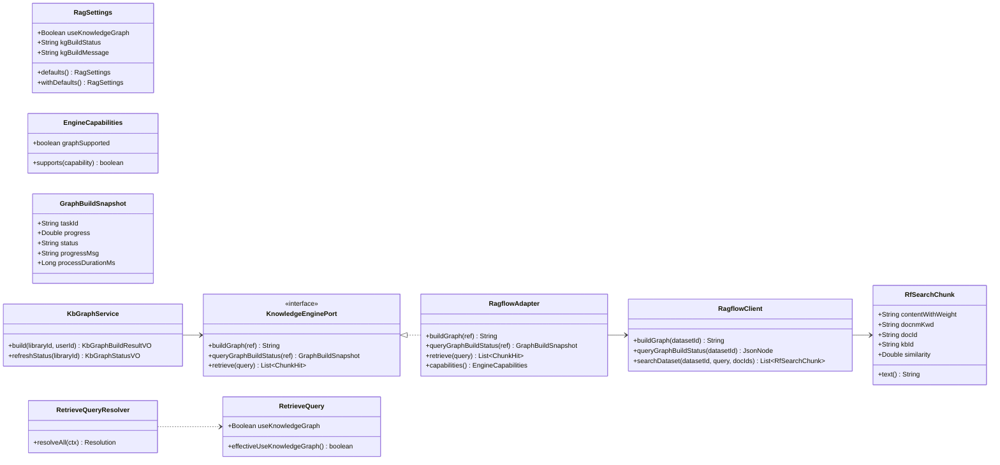
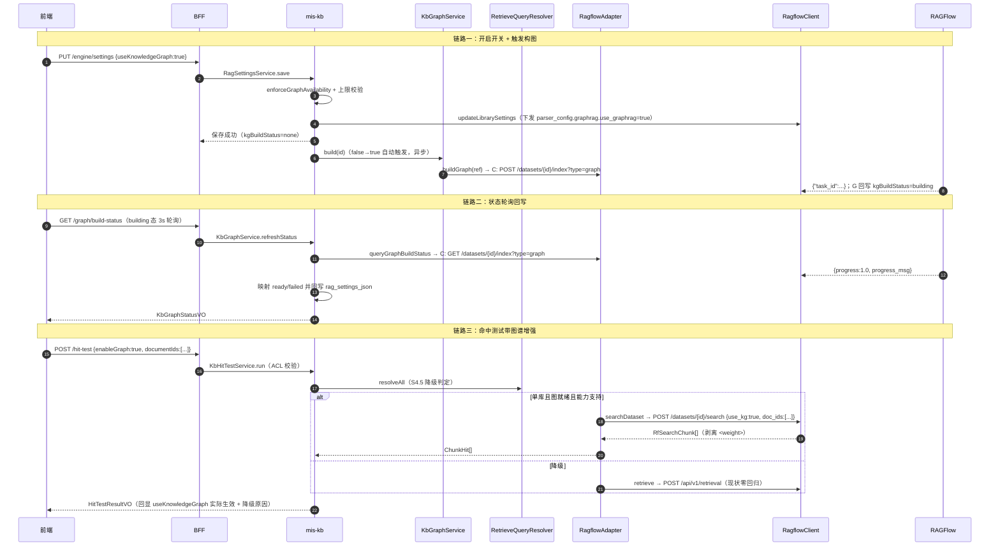

# MIS 知识库 Wave B — GraphRAG PoC 技术设计

- **作者**：高见远（软件架构师）
- **日期**：2026-08-11
- **状态**：定稿（待主理人复核待拍板事项）
- **上游**：`docs/backend/knowledge-base-phase2-plan.md` §6（Wave B 范围与门禁）+ §2（Graph RAG vs Neo4j 决策固化）+ §4.1/4.2（能力码与字段设计）+ §8 + §9
- **基线**：`docs/adr/ADR-018-knowledge-base-mis-kb.md`、`docs/backend/mis-kb-enterprise-phase1-design-2026-08-11.md`（T00 引擎实测范式）、`docs/backend/mis-kb-settings-model-chunk-design-2026-08-10.md`、`docs/backend/mis-kb-phase2-wave-a-design-2026-08-04.md`、`docs/backend/ragflow-graphrag-probe-2026-08-11.md`（本块 T00）
- **下游**：寇豆码（软件工程师）按本文任务列表实现；严过关（QA）按本文验收映射验收
- **配套文件**：`mis-kb-wave-b-graphrag-class.mermaid`（类图）、`mis-kb-wave-b-graphrag-seq.mermaid`（时序图）、`ragflow-graphrag-probe-2026-08-11.md`（T00 探测记录）

---

## 0. 本设计与主规划 §6 的映射

| 主规划 §6 要求 | 本文章节 | 结论 |
|---|---|---|
| 至多 2 个关系密集库可开 Graph；默认关闭 | §2.1/§2.3/§7 | `useKnowledgeGraph` 默认 false；后端上限校验（配置 `mis.kb.engine.graph-max-libraries` 默认 2） |
| 经 KnowledgeEnginePort：`graphrag` 能力码 | §2.2 | `EngineCapabilities` 新增 `CAP_GRAPH = "graphrag"`；RagflowAdapter 按 T00 实测声明 true，noop/mock false |
| 构图触发 / 状态查询（kgBuildStatus: none/building/ready/failed） | §2.3 | 新端点 build / build-status；状态落库 rag_settings_json + 查询时引擎刷新回写 |
| retrieve 带图谱增强参数 | §2.4 | `RetrieveQuery.useKnowledgeGraph`；RagflowAdapter 分流 `/datasets/{id}/search` + `use_kg:true` |
| ACL 红线：构图与检索不得越权；禁全局图谱浏览器 | §2.5 | 构图走管理权限 + 可见性；检索沿用既有 ACL；不提供任何图数据接口 |
| 门禁：库详情可见 kgBuildStatus；金标 10~20 条对比；记录时延与资源；不达标不进 Wave C | §7/§8 | 库详情回显状态；金标集 12 条基于集成库真实业务；对比格式与判据见 §7 |
| 非目标：Neo4j / 全库默认 / 浏览器直连引擎 | §1/§2 | 全部遵守 |

---

## 1. T00 引擎实测（本块核心，已完成）

> 实测实例 `10.254.16.6:9380`（RAGFlow v0.26.4，API Key 取 `.env.integration`）。原始 curl 记录见
> [`ragflow-graphrag-probe-2026-08-11.md`](./ragflow-graphrag-probe-2026-08-11.md)。

### 1.1 结论总表

| # | 探测项 | 实测结论（本实例） | 设计落点 |
|---|---|---|---|
| G1 | 是否支持 / 配置键名 | **支持**；启用键 = `parser_config.graphrag.use_graphrag`（布尔）+ `method`（`light`/`graph`）+ `entity_types`；**不是**顶层 `use_kg` | `updateDatasetSettings` 下发 `parser_config.graphrag`；能力码 `graphrag=true` |
| G2 | 构图触发 | `POST /api/v1/datasets/{id}/index?type=graph`（**type 值是 `graph`**，传 `graphrag` → code:102）→ `{"task_id":...}`；进行中任务拒绝二次触发 | `RagflowClient.buildGraph`；常量 `INDEX_TYPE_GRAPH="graph"` |
| G3 | 状态查询 | `GET /api/v1/datasets/{id}/index?type=graph` → task dict：`progress`（**1.0=完成 / -1=失败 / 其他=构建中**）、`progress_msg`、`task_type="graphrag"`、`process_duration`；无任务 `data={}`；dataset 佐证 `graphrag_task_id/finish_at` | `RagflowClient.queryGraphBuildStatus` → `GraphBuildSnapshot` |
| G4 | 构图实测 | probe 库（2 chunks、light）~9s 完成；`GET /graph` 返回 nodes/edges | 链路可端到端验证；大库耗时不可控 → 异步 + 轮询 |
| G5 | 图谱增强检索 | **必须走 `POST /api/v1/datasets/search`（多库）或 `/datasets/{id}/search`（单库）** + `use_kg:true`；经典 `/api/v1/retrieval` **静默忽略 use_kg**（陷阱） | retrieve 按 `useKnowledgeGraph` 分流；true → 单库 `/datasets/{id}/search` |
| G6 | 与 document_ids 共存 | `/datasets/search` 文档过滤键 = **`doc_ids`**（非 `document_ids`），与 `use_kg` 同体共存 ✓；不存在 doc → code:0 空（软过滤） | 图谱增强与 KE-08/09 过滤可叠加；适配层把 MIS `documentIds` → `doc_ids` |
| G7 | 响应差异 | `/datasets/search` chunk：`content_with_weight`（正文，含 `<weight>` 标记）、`docnm_kwd`、`doc_id`、`similarity`、`kb_id`、`chunk_id`——与 `/retrieval` 的 `content`/`document_keyword` 不同 | 新增 `RfSearchChunk` DTO + 适配层映射 + 剥离标记 |
| G8 | 多库限制 | `/datasets/search` 多库要求**所有库同一 embedding_model**（源码校验） | 图谱增强**仅单库生效**；多库回落 hybrid-only + degradedReason |
| G9 | use_kg 降级 | 图未建/无图结果 → 正常返回普通 chunks（KG 失败记 warning） | 检索期不强校验 status；命中测试回显实际生效 |

### 1.2 对既有基线的修正（重要）

1. **主理人简报里「RAGFlow dataset 支持 use_kg 构图」需澄清**：`use_kg` 是**检索期**参数（`/datasets/search` 请求体），**构图配置键是 `parser_config.graphrag.use_graphrag`**。两者语义不同，实现必须分开。
2. **构图 type 值 = `graph`**，不是 `graphrag`——后者 102 拒绝。这是最容易踩的坑，写进共享知识。
3. **`/api/v1/retrieval` 不能承载图谱增强**：v0.26.4 顶层未知字段被 pydantic 静默忽略（B3 同款结论），若在旧端点硬塞 `use_kg`，表现为「code:0 但无增强」的静默假象。Wave B 必须换端点。

---

## 2. 实现方案与关键决策

### 2.1 数据模型：RagSettings 扩展（零 DDL 进 rag_settings_json）

| 字段 | 类型 | 默认 | 引擎映射 | 说明 |
|---|---|---|---|---|
| `useKnowledgeGraph` | Boolean | **false** | `parser_config.graphrag.use_graphrag`（建库/更新期）+ `use_kg`（检索期） | 库级开关；需 `graphrag` 能力 + 数量上限 |
| `kgBuildStatus` | String | `none` | `GET /datasets/{id}/index?type=graph` progress 映射 | `none` \| `building` \| `ready` \| `failed`；**落库（MIS 唯一事实源）+ 查询时引擎刷新回写** |
| `kgBuildMessage` | String | null | `progress_msg` 摘要 | 失败/构建中原因摘要（≤200 字符）；ready 时清空 |

- **为什么 kgBuildStatus 落库而非纯缓存**：①库详情门禁需要稳定可见（引擎不可达时仍展示最后已知状态）；②随库存档语义一致（归档库状态不丢）；③零 DDL 进 `rag_settings_json` 与 OCR/overlap 同款路径，`withDefaults()` 兜底 null。
- **record 末位追加铁律**：三字段追加在 `chunkOverlapTokenNum` 之后；既有 11/14 参构造点保持零改动（保留兼容构造）。
- **校验（RagSettingsService.validate）**：`useKnowledgeGraph` 非 null 即可；`kgBuildStatus` 只接受四态码值，非法直接拒（防脏写）；`kgBuildMessage` 长度 ≤200。
- **能力闸门（enforceGraphAvailability）**：`useKnowledgeGraph=true` 但 `capabilities.graphrag=false` → 落库强制 false + WARN（对齐 WA-06「前端置灰 + 后端强制 + 降级提示」三道防线）。
- **数量上限**：`useKnowledgeGraph=true` 且当前启用该开关的库数 ≥ `mis.kb.engine.graph-max-libraries`（默认 2）→ 拒绝保存 + 明确提示（错误码 `KB_GRAPH_LIBRARY_LIMIT`）。上限校验放在 `KbGraphService.canEnableGraph`，保存与构图两处共用。

### 2.2 EngineCapabilities 扩展

```java
public static final String CAP_GRAPH = "graphrag";
```

- `EngineCapabilities` 增加第 9 个布尔位 `graphSupported`（record 末位）；`of(...)` 重载同步扩展（OCR/overlap 后追加）。
- **RagflowAdapter**：`graphSupported=true`（T00 G1 实测实例支持）；noop/mock 走 `unsupported()` 或显式 false。
- 语义口径与 `rerankSupported` 一致：「当前部署引擎版本下实际可用」——本实例已实测构图 + 检索链路，故声明 true。若未来引擎升级破坏契约，翻配置/翻转声明即可。

### 2.3 构图触发链路

**谁触发**（两个入口，幂等）：
1. **保存设置自动触发**：`RagSettingsService.save` 检测到 `useKnowledgeGraph` 从 false→true 且 `kgBuildStatus != building` → 保存成功后**异步**调 `KbGraphService.build`（不阻塞保存返回）。
2. **手动按钮**：新端点 `POST /libraries/{id}/graph/build`（重试/补建用）。

**KnowledgeEnginePort 新增（default，noop/mock 零改动）**：

```java
/** 触发图谱构建；返回引擎侧 task id；引擎不支持时抛异常。 */
default String buildGraph(EngineLibraryRef ref) {
    throw new UnsupportedOperationException("当前引擎不支持图谱构建");
}

/** 查询图谱构建状态；无任务/不支持返回 NONE 快照。 */
default GraphBuildSnapshot queryGraphBuildStatus(EngineLibraryRef ref) {
    return GraphBuildSnapshot.none();
}
```

**`GraphBuildSnapshot`（新 record）**：`taskId` / `progress`(0~1) / `status`(BUILDING|READY|FAILED) / `progressMsg` / `processDurationMs`。

**状态回写时机**（`KbGraphService.refreshStatus`，查询时刷新）：
- `GET /libraries/{id}/graph/build-status` 每次调用 → 后端查引擎 `GET /index?type=graph` → 映射 progress → 与本地 `kgBuildStatus` 比对，有变化才写库（避免无效写放大）。
- 前端在 `building` 态每 **3s** 轮询一次，直到 `ready`/`failed`（PoC 不引入后端定时任务，零新增调度）。
- 映射：`progress==1.0 → ready`（清 kgBuildMessage）；`progress<0 → failed`（kgBuildMessage = progress_msg 摘要 ≤200）；其他 → `building`（kgBuildMessage 可存 progress_msg 摘要，便于排障）；无任务 → 保持本地值（`none`）。

**失败处理**：构图失败不自动重试（LLM 资源敏感）；`failed` 态下前端「开始构建」按钮可再次触发（引擎侧 `delete_index` 可选清理——**PoC 不做自动清理**，重试直接再 POST /index，引擎允许覆盖）。构图中再次触发 → 拒绝（`KB_GRAPH_BUILD_IN_PROGRESS`）。

**构图前置条件校验**（`KbGraphService.build` 入口）：
- 库存在 + 未归档（status=enabled）+ 有引擎映射；
- 判权：`kb:library:edit` 权限码（BFF 层）+ `hasLibraryManage`（管辖双闸门，复用 `NodeAdminResolver`）；
- `capabilities.graphrag=true`（能力 false → `KB_GRAPH_UNSUPPORTED`）；
- 文档非空（引擎侧无文档构图返回失败，实测 `No documents`）；
- `kgBuildStatus != building`。

### 2.4 retrieve 增强参数合并

**RetrieveQuery 增加末位字段 `useKnowledgeGraph`（Boolean）** + `effectiveUseKnowledgeGraph()`。

**RetrieveQueryResolver 新增 S4.5 图谱降级**（对齐 S4 rerank 三道防线）：
```
if (useKnowledgeGraph 且 capabilities.graphrag=false) → false + reason「当前引擎不支持知识图谱增强」
if (useKnowledgeGraph 且 多库(scopedLibraryIds.size()>1)) → false + reason「图谱增强仅支持单库检索，已回落混合检索」
if (useKnowledgeGraph 且 kgBuildStatus != ready) → false + reason「图谱未构建完成（当前状态），已回落混合检索」
```
- 降级发生在合并器内，服务层禁止内联判断（Resolver 铁律）。
- 检索期**不强校验** kgBuildStatus 的替代方案被否决：口径不清晰会污染金标对比（hybrid+graph 实际没加图，管理员看不出差异）。降级 + 回显 reason 是唯一正确做法。

**RagflowAdapter.retrieve 分流**：
```
query.effectiveUseKnowledgeGraph() == true（且单库，resolver 已保证）
  → RagflowClient.searchDataset(datasetId, query, nativeDocIds)   // POST /datasets/{id}/search
  → 解析 List<RfSearchChunk> → ChunkHit
else
  → RagflowClient.retrieve(query, datasetIds, nativeDocIds)       // 现状 /api/v1/retrieval 零回归
```

**RagflowClient.searchDataset（新方法）请求体映射**：

| MIS 参数 | `/datasets/{id}/search` 字段 | 说明 |
|---|---|---|
| question | `question` | 必填 |
| 单库 datasetId | 路径参数 | 不走 `dataset_ids`（避免多库 embedding 一致性限制） |
| effectiveTopK | `size`（+`top_k` 可选不传） | 与 /retrieval 的 `page_size` 语义一致（最终返回条数） |
| effectiveThreshold | `similarity_threshold` | 同现状 |
| vectorSimilarityWeight | `vector_similarity_weight` | 同现状 |
| keyword | `keyword` | 同现状映射（hybrid→false） |
| rerank | `rerank_mdl`（全限定 id） | 与现状 `rerank_id` 同值；开关为真且全局模型非空才下发 |
| **useKnowledgeGraph** | **`use_kg: true`** | 图谱增强开关 |
| documentIds（MIS → 引擎 ref） | `doc_ids` | **空 = 不下发键**（R5 同款：空 = 全量）；非空下发 |

**响应映射**（`RfSearchChunk` → `ChunkHit`）：
- `chunkText` ← `content_with_weight` **剥离 `<weight>` 标记**（正则 `<(?:weight|sep)[^>]*>` → 空；单测锁定）；
- `docTitle` ← `docnm_kwd`（引擎已给文档名，优先用）；
- `documentId` ← `doc_id` → repository 反查 MIS `KbDocument.id`（不存在时 null，与现状一致）；
- `libraryId` ← `kb_id` → 反查 MIS `KbLibrary.id`；
- `score` ← `similarity`；`offset/page` 置 null（该响应无此字段，前端降级展示）。

**与过滤参数共存**：`doc_ids` 与 `use_kg` 同体（T00 G6 实测）→ 图谱增强与 KE-08/KE-09 文档/时间过滤**可叠加**，无需互斥。

### 2.5 ACL 红线（本块重点）

| 动作 | 防线 | 说明 |
|---|---|---|
| 构图触发 | BFF 权限码 `kb:library:edit` + mis-kb `KbGraphService` 内 `hasLibraryManage`（NodeAdminResolver 双闸门）+ 库 enabled + 有引擎映射 | 构图 = 修改引擎侧资源，按「写」对待；无管理权限不可触发 |
| 状态查询 | `kb:library:engine-ref:view` 或复用 `kb:library:view`（读）+ 可见性 | 状态只含状态码/taskId，不含图谱实体，仍按读权限 |
| 图谱增强检索 | 既有 `KbVisibilityService` ACL（`KbRetrieveService` / `KbHitTestService` 已强制） | 检索链路零改动即满足；`use_kg` 只是引擎侧增强，检索范围仍由 MIS 下发 dataset/doc 决定 |
| **禁止全局图谱浏览器** | **不实现任何「跨库图数据」接口**；`GET /datasets/{id}/graph`（引擎图数据）**不代理**给 BFF/前端 | 图数据含库内实体关系，PoC 不落地、不展示；避免暴露不可见库实体 |

### 2.6 前端（features/kb）

**库详情页 `library/kb-library-detail-page.tsx`**（RAG 设置区新增「知识图谱」分组）：
- 开关 `useKnowledgeGraph`：按 `capabilities.graphrag` 置灰 + 提示「当前引擎版本暂不支持」；开启时若已达 2 库上限 → 后端拒绝并回显错误；
- 状态徽标：`none`（未构建）/ `building`（构建中，3s 轮询 build-status）/ `ready`（已就绪）/ `failed`（失败 + 原因 tooltip）；
- 「开始构建」按钮：`kgBuildStatus != building` 时可点；`ready`/`failed` 可重试；
- 文案：开关开启且未构建时提示「开启后自动排队构建图谱，构建期间检索暂不启用图谱增强」。

**命中测试页 `hittest/kb-hit-test-page.tsx`**：
- 临时开关「启用图谱增强」（默认跟随库设置 `useKnowledgeGraph`，可临时开/关，用于 hybrid-only vs hybrid+graph 对比）；能力不支持/多库/图未就绪时置灰；
- 结果区回显「本次实际生效：图谱增强 开/关（原因：...）」——来自 `EffectiveParamsVO` 新增字段。

**types.ts / api/kb-api.ts**：`KbRagSettings` 追加三字段；`KbGraphStatusVO`；`HitTestRequest.enableGraph`；`buildGraph()` / `graphBuildStatus()` API。

---

## 3. 文件列表

> A = 新增；M = 修改。路径相对仓库根。

### 3.1 mis-migrator（Flyway V31）

| 文件 | 标记 | 说明 |
|---|---|---|
| `backend/mis-migrator/src/main/resources/db/migration/V31__kb_wave_b_graphrag.sql` | A | 仅 sys_api 登记 2 个新端点（graph/build、graph/build-status）+ sys_menu_api 关联；零 DDL |

### 3.2 mis-kb（`backend/mis-kb/src/main/java/com/mis/kb/`）

| 文件 | 标记 | 说明 |
|---|---|---|
| `domain/model/RagSettings.java` | M | 末位追加 `useKnowledgeGraph` / `kgBuildStatus` / `kgBuildMessage` + defaults/withDefaults + 四态常量 |
| `domain/model/EngineCapabilities.java` | M | 新增 `CAP_GRAPH="graphrag"` + `graphSupported` 布尔位 + of() 重载 |
| `domain/model/GraphBuildSnapshot.java` | A | 构图状态快照（taskId/progress/status/progressMsg/processDurationMs） |
| `domain/model/RetrieveQuery.java` | M | 末位追加 `useKnowledgeGraph` + `effectiveUseKnowledgeGraph()` |
| `domain/model/RetrieveQueryResolver.java` | M | S4.5 图谱降级（能力/单库/kgBuildStatus）+ RetrieveContext 透传 kgBuildStatus |
| `domain/service/KbGraphService.java` | A | 构图触发/状态刷新/上限校验/回写（核心新增服务） |
| `domain/service/RagSettingsService.java` | M | validate 三字段 + enforceGraphAvailability + false→true 自动触发构图 |
| `domain/service/KbRetrieveService.java` | M | RetrieveContext 传 kgBuildStatus（从库设置读） |
| `domain/service/KbHitTestService.java` | M | HitTestRequest.enableGraph → override 图谱开关；回显生效状态 |
| `engine/KnowledgeEnginePort.java` | M | 新增 default `buildGraph` / `queryGraphBuildStatus` |
| `engine/RagflowAdapter.java` | M | 实现 buildGraph/queryGraphBuildStatus；retrieve 分流 searchDataset；capabilities.graphSupported=true |
| `engine/RagflowClient.java` | M | 新增 buildGraph / queryGraphBuildStatus / searchDataset；updateDatasetSettings 下发 parser_config.graphrag |
| `engine/dto/RfSearchChunk.java` | A | `/datasets/search` chunk DTO + 剥离 `<weight>` 标记方法 |
| `api/controller/LibraryController.java` | M | 新增 `POST /libraries/{id}/graph/build`、`GET /libraries/{id}/graph/build-status` |
| `api/dto/HitTestRequest.java` | M | 末位追加 `enableGraph` |
| `api/dto/KbGraphBuildResultVO.java` | A | 构图触发回执（building/taskId） |
| `api/dto/KbGraphStatusVO.java` | A | 状态回执（kgBuildStatus/kgBuildMessage/graphragTaskId/updatedAt） |

### 3.3 mis-admin-bff（`backend/mis-admin-bff/src/main/java/com/mis/adminbff/`）

| 文件 | 标记 | 说明 |
|---|---|---|
| `dto/kb/KbRagSettings.java` | M | 镜像追加三字段 |
| `dto/kb/KbHitTestRequest.java` | M | 镜像追加 `enableGraph` |
| `dto/kb/KbGraphStatusVO.java` | A | 状态镜像 |
| `controller/KbController.java` | M | 新增 buildGraph / graphStatus 端点（权限码 + @OperLog） |
| `service/KbFacadeService.java` | M | 透传构图/状态/命中测试新字段 |

### 3.4 前端（`frontend/mis-admin-web/src/features/kb/`）

| 文件 | 标记 | 说明 |
|---|---|---|
| `types.ts` | M | KbRagSettings 三字段；KbGraphStatusVO；HitTestRequest.enableGraph；EffectiveParams 图谱字段 |
| `api/kb-api.ts` | M | buildGraph / graphBuildStatus；hitTest 透传 enableGraph |
| `library/kb-library-detail-page.tsx` | M | 知识图谱区（开关 + 状态徽标 + 构建按钮 + 轮询） |
| `hittest/kb-hit-test-page.tsx` | M | 图谱增强临时开关 + 生效回显 + 降级原因 |

### 3.5 文档（交付物）

| 文件 | 标记 | 说明 |
|---|---|---|
| `docs/backend/mis-kb-wave-b-graphrag-design-2026-08-11.md` | A | 本文档 |
| `docs/backend/mis-kb-wave-b-graphrag-class.mermaid` | A | 类图 |
| `docs/backend/mis-kb-wave-b-graphrag-seq.mermaid` | A | 时序图 |
| `docs/backend/ragflow-graphrag-probe-2026-08-11.md` | A | T00 探测记录 |

---

## 4. 数据结构（类图）

完整类图见 `mis-kb-wave-b-graphrag-class.mermaid`，核心关系摘要：



### RagSettings 新字段说明

| 字段 | 序列化 | 引擎交互 | 谁写 | 谁读 |
|---|---|---|---|---|
| `useKnowledgeGraph` | rag_settings_json | 保存→`parser_config.graphrag.use_graphrag`；检索→`use_kg` | RagSettingsService.save | 检索（resolver）、前端开关 |
| `kgBuildStatus` | rag_settings_json | 查询→`GET /index?type=graph` progress 映射 | KbGraphService 回写 | 库详情徽标、resolver 降级判定 |
| `kgBuildMessage` | rag_settings_json | `progress_msg` 摘要 ≤200 | KbGraphService 回写 | failed 态 tooltip |

---

## 5. 接口设计

### 5.1 修改端点

| 方法/路径 | 变更 | 请求/响应变更 | 权限码/审计 |
|---|---|---|---|
| `PUT /api/v1/kb/libraries/{id}/engine/settings` | 新字段 | `KbRagSettings` 追加 useKnowledgeGraph/kgBuildStatus/kgBuildMessage；`kgBuildStatus` 由服务端维护（前端提交该字段时忽略或仅回显）；`useKnowledgeGraph=true` 且超上限/能力不支持 → 拒 | `kb:library:edit`；审计沿用（T4 已挂） |
| `POST /api/v1/kb/hit-test` | 新字段 | 请求追加 `enableGraph`（本次临时开关）；响应 `effectiveParams` 追加 `useKnowledgeGraph`（实际生效）与降级原因 | `kb:hittest:run`；审计沿用 |

### 5.2 新增端点

| 方法/路径 | 说明 | 请求/响应 | 权限码/审计 |
|---|---|---|---|
| `POST /api/v1/kb/libraries/{id}/graph/build` | 触发构图（手动/重试） | 空 body；响应 `KbGraphBuildResultVO{building:true, taskId, kgBuildStatus}`；已在构建 → `KB_GRAPH_BUILD_IN_PROGRESS` | `kb:library:edit` + `hasLibraryManage`；@OperLog(recordParams=true) |
| `GET /api/v1/kb/libraries/{id}/graph/build-status` | 状态查询（前端轮询） | 空 body；响应 `KbGraphStatusVO{kgBuildStatus, kgBuildMessage, graphragTaskId, updatedAt}`；查询时引擎刷新回写 | `kb:library:engine-ref:view`（读）或 `kb:library:view`；不写操作日志 |

> 状态查询端点是否挂审计：读操作默认不挂（对齐既有 engine-ref 口径）；如需留痕可挂 `@OperLog(recordParams=false)` 记 resultCount——**设计默认不挂**，避免轮询刷审计表（3s 一次 × 多管理员 = 噪声）。

### 5.3 错误码（新增，KbResultCode）

| 码 | 说明 |
|---|---|
| `KB_GRAPH_UNSUPPORTED` | 当前引擎不支持图谱构建/增强 |
| `KB_GRAPH_LIBRARY_LIMIT` | 已开启图谱的库数达到上限（默认 2） |
| `KB_GRAPH_BUILD_IN_PROGRESS` | 图谱构建中，拒绝重复触发 |
| `KB_GRAPH_NOT_READY` | 图谱未构建完成（降级提示用，实际走 degradedReason 不抛错） |

---

## 6. 程序调用流程（时序图）

完整时序图见 `mis-kb-wave-b-graphrag-seq.mermaid`，三条主链路摘要：



---

## 7. 金标集设计

### 7.1 候选库与内容现状（集成库实测）

| 库 | 集成库现状 | 引擎侧 | 说明 |
|---|---|---|---|
| **百货收银**（id 1786439846183，category 运维，public，enabled） | kb_document 0 条 | dataset `76f53a3e...`（use_graphrag=true 已配置、chunks=0） | **需先上传真实业务文档**才能跑金标；开关已配置 |
| **运维**（id 1786339952827，category 信息，public，**已归档**） | kb_document 0 条 | dataset `66e5a448...`（PAD问题集.docx，7 chunks，DONE） | **需先取消归档**；文档内容已实测（PAD 收银/退货/银联/积分抵现等） |

> 集成库当前没有「制度/组织职责」类库；主理人简报中的「如制度/组织职责」是**候选类型示例**。PoC 金标按**现有真实库**（百货收银 + 运维/PAD）设计，覆盖 POS 收银与运维 FAQ 两个关系密集场景。若主理人要求换库，金标问题结构可平移。

### 7.2 金标问题集（12 条，多跳/关系型）

基于运维库 `PAD问题集.docx` 已实测内容（退货失败场景、银联退款权限、积分抵现单边数据、收款台号一致性、最新版本限制等）设计：

| # | 金标问题 | 期望的多跳/关系点 |
|---|---|---|
| 1 | 哪些情况可能导致 PAD 厅房收银退货操作失败？ | 退货失败 → 多种原因（版本/数据/银联）归因 |
| 2 | 老版本收银程序为什么会导致退货失败？它缺少了什么信息？ | 老版本 → 未保存退货信息 → 失败（因果链） |
| 3 | 退货时如果原消费单出现单边数据，系统会做什么？ | 单边数据 → 数据检查 → 核对失败（条件-行为） |
| 4 | 银联退款权限需要向谁申请？没开通会怎样？ | 银联设备 → 当地银联申请 → 无权限无法退款（主体-动作） |
| 5 | 银联对当天退款金额有什么限制？什么情况下直接做退款可能失败？ | 银联 → 当日限额 → 无消费记录退款失败（约束-后果） |
| 6 | 最新版本对退货收款台有什么要求？ | 新版本 → 原单/退货收款台号一致（约束关系） |
| 7 | 原单使用的某种收款方式在退货时有什么问题？ | 旧积分抵现 → 原消费单 → 单边数据（跨实体关联） |
| 8 | PAD 退货前系统会做数据检查，检查对象是什么？ | 数据检查 → 原单/收款方式（动作-对象） |
| 9 | 如果当天商场还没有任何银联消费，能直接退货吗？ | 银联消费 → 当日退货 → 失败（否定约束） |
| 10 | 退货失败与「原单收款台号」的关系是什么？ | 收款台号 → 一致性要求（关系型） |
| 11 | 商场要支持 PAD 退货，需要在银联侧提前准备什么？ | 退货 → 银联退款权限 → 申请（前置条件链） |
| 12 | 积分抵现参与退货时，为什么可能核对失败？ | 积分抵现 → 单边数据 → 核对失败（实体-属性-结果） |

> 百货收银库补文档后追加 6~8 条（商品-供应商-门店-会员-促销关系型），两库合计 12~20 条，落在主规划「10~20 条」区间。

### 7.3 对比方法

1. 每条金标问题分别在命中测试执行**两轮**：
   - **A 组 hybrid-only**：`enableGraph=false`（或库开关关）；
   - **B 组 hybrid+graph**：`enableGraph=true`（需 kgBuildStatus=ready）。
2. 记录两组各自：命中条数、top1/top5 相关 chunk 文本、是否命中「含跨实体关系证据」的 chunk（图增强时 KG 结果应出现在首位）、`elapsedMs`。
3. **通过判据**（PoC 门禁）：
   - 硬指标：B 组在 ≥60% 金标问题上召回**新增或更相关**的证据 chunk（与 A 组相比 top1 命中目标实体关系），且答案可用性由 QA/业务抽样判定；
   - 软指标：B 组时延增量 ≤ 2× A 组（图谱检索额外一次 LLM 调用）；
   - 资源指标：构图耗时、task process_duration、图节点/边规模、构图期间引擎负载观察（记录即可，不作硬性上限）。

### 7.4 时延/资源记录格式（金标报告模板）

```markdown
## 金标对比报告 —— 库：运维/PAD问题集
- 构图信息：触发时间 / 完成时间 / process_duration / 图节点数 / 图边数 / kgBuildStatus
- 检索配置：topK=5 / threshold=0.2 / hybrid / 无 rerank / use_kg=on|off
| # | 问题 | A组 hits | B组 hits | A组 top1 证据 | B组 top1 证据 | B组新增证据 | A组 ms | B组 ms | 判定 |
|---|---|---|---|---|---|---|---|---|---|
| 1 | ... | 7 | 8 | ... | ... | 是/否 | 120 | 380 | PASS/FAIL |
```

---

## 8. 任务列表（有序，含依赖与门禁映射）

> 任务分组原则：按功能模块整组交付，不按单文件拆分；T01 为唯一硬依赖，T02/T03 相对独立可并行，T04 收口集成。T00 为独立前置探测（本文已完成，工程师实现时按契约执行，可复跑复核）。

| 编号 | 任务 | 目标 | 涉及文件（节选） | 依赖 | 优先级 | 门禁映射（§6.3） |
|---|---|---|---|---|---|---|
| **T01** | **数据层与迁移：能力码 + RagSettings 三字段 + V31 + DTO 骨架** | V31 迁移落地（2 端点 sys_api 登记，零 DDL）；EngineCapabilities.CAP_GRAPH；RagSettings 三字段 + defaults/withDefaults；RfSearchChunk/GraphBuildSnapshot/KbGraphStatusVO DTO；BFF KbRagSettings 镜像；前端 types.ts；构建可编译基线 | V31 SQL、EngineCapabilities、RagSettings、RfSearchChunk、GraphBuildSnapshot、KbGraphStatusVO、KbRagSettings、types.ts | — | P0 | 能力码声明正确（graphrag=true on ragflow） |
| **T02** | **构图链路：KbGraphService + Port + 适配器 + 端点 + 前端 Graph 区** | 构图触发/状态查询/回写/失败处理/上限校验；RagflowClient.buildGraph/queryGraphBuildStatus + updateDatasetSettings 下发 graphrag；RagSettingsService 自动触发；库详情页开关/徽标/构建按钮/轮询 | KbGraphService、KnowledgeEnginePort、RagflowAdapter、RagflowClient、LibraryController、KbGraphBuildResultVO、RagSettingsService、KbController、KbFacadeService、kb-library-detail-page、kb-api、types | T01 | P0 | 库详情可见 kgBuildStatus；至多 2 库可开 |
| **T03** | **检索增强：RetrieveQuery/Resolver + searchDataset 分流 + 命中测试 + 前端对比开关** | useKnowledgeGraph 走 `/datasets/{id}/search` + use_kg；S4.5 降级（能力/单库/kgBuildStatus）；doc_ids 共存；响应映射（content_with_weight 剥离）；命中测试 enableGraph + 生效回显 | RetrieveQuery、RetrieveQueryResolver、RagflowAdapter、RagflowClient、RfSearchChunk、HitTestRequest、KbHitTestService、KbRetrieveService、KbHitTestRequest、kb-hit-test-page | T01（可并行 T02） | P0 | 检索仍 ACL 过滤；hybrid+graph 参数真实生效 |
| **T04** | **金标对比 + 集成联调 + 全量回归** | 按 §7 执行金标集对比（A/B 两组）、产出金标报告（时延/资源/判定）；构图/检索端到端联调；无 Neo4j/无全库强制/无浏览器持 Key 核对；后端 + 前端全量回归 | 金标报告（交付物）、部署配置核对、单测/契约测试（RfSearchChunk 剥离、Resolver 降级、KbGraphService 上限）、QA 回归清单 | T02、T03 | P0 | 金标对比报告决定是否 Wave C；不达标 → 不进 Wave C |

> **门禁结论前置（对齐 §6.3）**：Wave C 是否启动以 T04 金标报告为准；报告不达标则 `graphrag` 能力码可保留 true 但**不新增开图库**、前端开关维持上限置灰，图谱仅作为已开库的增强项。

---

## 9. 依赖包列表

**无需新增任何第三方依赖**：
- 后端：Spring Boot 3.2.5 自带 `RestClient`；JPA/PostgreSQL/Flyway 既有；无 Caffeine、无定时框架（轮询走前端）。
- 前端：React + TS + Vite + shadcn/ui + Tailwind + Zustand + axios + sonner 既有，不新增包。

---

## 10. 共享知识（跨文件约定）

1. **能力码**：`EngineCapabilities.CAP_GRAPH = "graphrag"`，集中定义禁硬编码；RagflowAdapter 声明 `graphSupported=true`（T00 实测），noop/mock false。
2. **RAGFlow 构图 type 值 = `graph`**（`RagflowClient.INDEX_TYPE_GRAPH`），**禁止写 `graphrag`**（102 拒绝）；内部任务类型才是 graphrag。
3. **配置键 ≠ 检索键**：构图配置 = `parser_config.graphrag.use_graphrag`；检索增强 = `/datasets/search` 请求体 `use_kg`。`/api/v1/retrieval` 不支持 use_kg（静默忽略）——**图谱增强必须走 `/datasets/{id}/search`**。
4. **文档过滤键**：`/datasets/search` 用 `doc_ids`（非 `document_ids`）；空 = 不下发键 = 全量（R5 同款）；不存在 doc → code:0 空结果（软过滤）。
5. **响应差异**：`/datasets/search` chunk 正文在 `content_with_weight`（含 `<weight>` 标记，剥离后展示）、文档名在 `docnm_kwd`、文档 id 在 `doc_id`；与 `/retrieval` 字段不同，统一由 `RfSearchChunk` 承载。
6. **单库限制**：图谱增强仅单库检索生效（多库 `/datasets/search` 有 embedding 一致性限制 + MIS 多库回落全局默认）；多库自动降级 + degradedReason。
7. **降级三道防线**：`useKnowledgeGraph` 对齐 WA-06——前端置灰（能力/上限）+ 后端强制（save 落库 false）+ 检索期降级（Resolver S4.5 + 回显原因）。
8. **record 末位追加铁律**：`RagSettings` / `RetrieveQuery` / `HitTestRequest` / `KbRagSettings` / `EngineCapabilities` 新字段一律追加末位。
9. **Resolver 铁律**：图谱降级只允许在 `RetrieveQueryResolver` S4.5；服务层禁止内联判断。
10. **状态机**：`kgBuildStatus` 四态 `none → building → ready|failed →（重试）building`；`building` 拒绝重复触发；`ready` 清 `kgBuildMessage`。
11. **迁移版本号**：V31 起（V30 已用）；Flyway 只追加；sys_api 段位：api id `91123+`、code `00900039+`、menu_api `91223+`；一码一菜单（uk_menu_app_permission）；幂等写法参照 V26/V27/V30。
12. **权限码**：本期不新增；构图 `kb:library:edit` + `hasLibraryManage`、状态查询 `kb:library:engine-ref:view`、命中测试 `kb:hittest:run`。
13. **文案口径**：图谱开关提示「当前引擎版本暂不支持」/「已开启图谱的库数达到上限（2）」/「开启后自动排队构建图谱，构建期间检索暂不启用图谱增强」；kgBuildStatus 徽标：未构建/构建中/已就绪/构建失败。
14. **前端唯一门禁**：`npm run typecheck`（tsc --noEmit，strict + noUnusedLocals）0 错。
15. **测试基线与绕行命令**（JDK17 + Maven classworlds，系统 mvn 损坏无 mvnw）：`"D:/software/jdk-17.0.2/bin/java" -cp "D:/software/apache-maven-3.9.16/boot/plexus-classworlds-2.11.0.jar" "-Dmaven.home=D:/software/apache-maven-3.9.16" "-Dclassworlds.conf=D:/software/apache-maven-3.9.16/bin/m2.conf" "-Dmaven.multiModuleProjectDirectory=D:/code/mis-platform/backend" -Dfile.encoding=UTF-8 org.codehaus.classworlds.Launcher -o -pl <模块> -am clean test`；回归基线：mis-kb 270 例、mis-admin-bff 141 例必须保持。
16. **金标执行**：A/B 两组同一问题、同一库、同一参数（仅图谱开关差异）；记录时延与资源，产出报告进 T04 验收。

---

## 11. 待明确事项（需主理人拍板）

| # | 事项 | 影响 | 设计默认值 |
|---|---|---|---|
| U1 | **候选库**：集成库现有「百货收银」（0 文档）与「运维」（已归档，含 PAD问题集.docx）。是否接受以这两库为 PoC 候选（百货收银需先补文档、运维需先取消归档）？主理人简报中的「制度/组织职责」在集成库不存在 | 金标集内容与前置准备 | 采用百货收银 + 运维/PAD；如需换库，金标问题结构可平移（§7.1） |
| U2 | **构图触发方式**：开关 false→true 保存时自动触发一次 + 手动按钮可重试？还是仅手动按钮？ | T02 实现与前端交互 | 自动触发一次 + 手动重试 |
| U3 | **kgBuildStatus 落库 vs 缓存**：主规划 §4.2 写「可落库或缓存」 | 状态一致性与实现量 | 落库 rag_settings_json（零 DDL）+ 查询时引擎刷新回写 |
| U4 | **图谱增强多库**：多库检索遇 `useKnowledgeGraph=true` 时自动降级 hybrid-only + reason，是否可接受？（多库 `/datasets/search` 有 embedding 一致性限制） | 检索语义 | 接受：图谱增强仅单库生效 |
| U5 | **检索期是否强校验 kgBuildStatus==ready**：设计为「降级 + 回显 reason」（图未就绪则 hybrid-only），是否接受？（替代方案：不校验，图未就绪时 use_kg 静默无增强——会污染金标对比） | 口径清晰度 | 接受降级 + reason |
| U6 | **状态查询端点是否挂审计**：3s 轮询会刷审计表 | 审计噪声 | 默认不挂（读操作） |
| U7 | **图谱上限是否做成配置**：`mis.kb.engine.graph-max-libraries`（默认 2）进 Nacos 还是硬编码常量 | 运维灵活性 | 进 RagflowProperties 配置，默认 2 |

---

## 12. 风险与降级路径

| # | 风险 | 等级 | 降级/应对 |
|---|---|---|---|
| R1 | **引擎升级破坏构图契约**（index?type=graph 路径/字段变化） | 中 | 能力码 `graphrag` 是唯一开关：翻转 false → 前端置灰 + 保存强制关 + 检索降级（三道防线已建）；代码分支不动 |
| R2 | **`/api/v1/retrieval` 对 use_kg 静默忽略**（已实测） | 高 | 已设计强制换端点 `/datasets/{id}/search`；单测锁定「useKnowledgeGraph=true 时请求体含 use_kg=true 且路径为 /search」（契约测试防回归） |
| R3 | **`content_with_weight` 剥离不净**（`<weight>` 标记残留） | 中 | `RfSearchChunk.text()` 正则剥离 + 单测锁定（含多标记/嵌套边界用例） |
| R4 | **大库构图耗时长 / 资源消耗（LLM tokens）** | 高 | 异步触发 + 3s 轮询 + 不阻塞保存；上限 2 库；金标只在小库执行；构图失败可重试；门禁不达标不进 Wave C |
| R5 | **多库 embedding 不一致**（/datasets/search 限制） | 中 | 图谱增强仅单库生效；多库自动回落 hybrid-only + reason（S4.5） |
| R6 | **kgBuildStatus 与引擎实际漂移**（引擎侧任务被运维手动删/重跑） | 低 | 状态查询每次刷新回写；无任务时保持本地值；`none/failed` 均可重新触发 |
| R7 | **sys_api 登记撞 uk_menu_app_permission / 段位冲突** | 中 | 登记前 grep 全仓已占用段位；一码一菜单；幂等写法；本设计已按 V30 末段（91122/00900038/91222）顺延规划 |
| R8 | **金标不达标**（图增强无显著收益） | 高 | 按 §6.3：**不进 Wave C、不全量打开 Graph**；已开 2 库保留为增强项；金标报告如实记录 |

---

## 13. 验收映射（Wave B 验收清单 §9 → 验证方式）

| 主规划 §9 Wave B 验收 | 验证方式 |
|---|---|
| 至多 2 库可开 Graph；默认关 | 保存第 3 个库 useKnowledgeGraph=true → `KB_GRAPH_LIBRARY_LIMIT`；新建库 settings 无该字段 → 读取为 false |
| 构图状态可查 | 触发构图 → kgBuildStatus=none→building→ready 变化可见；失败场景（如引擎不可达）→ failed + 原因 |
| 检索仍 ACL 过滤 | 命中测试对无读权限用户 → `KB_NO_READ_PERMISSION`（既有测试保持）；构图对无管理权限用户 → 403 |
| 金标对比报告（含资源）决定是否 Wave C | T04 产出 §7.4 报告：≥60% 问题 B 组有新增/更相关证据、时延增量 ≤2×、构图资源记录完整；报告结论写入交付物 |
| 无 Neo4j、无全库强制、无浏览器持 Key | 代码走查：无新增图谱引擎依赖；无全局图谱接口；`GET /datasets/{id}/graph` 不代理；apiKey 仍服务端 |
