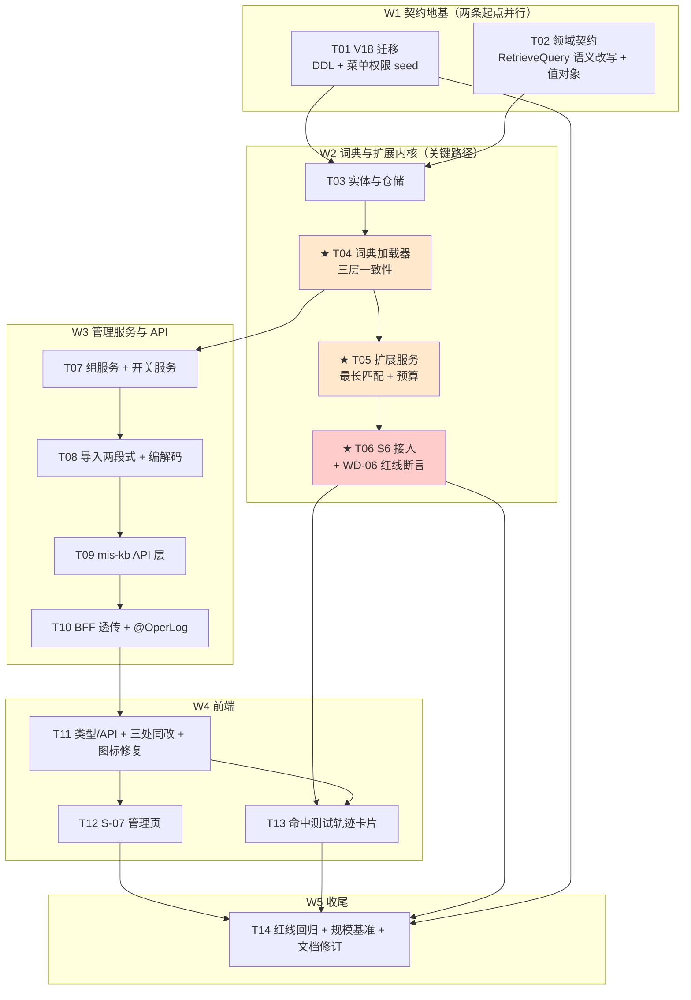

# MIS 知识库二期 Wave D（同义词与术语扩展）系统设计与任务分解

| 项 | 内容 |
|---|---|
| 文档编号 | `mis-kb-wave-d-design-2026-08-04` |
| 版本 | **v1.0（初稿定版）** — Q1–Q9 已逐条裁决，可进入实现 |
| 日期 | 2026-08-04 |
| 作者 | 架构师 高见远 |
| 上游输入 | `docs/backend/mis-kb-wave-d-prd-2026-08-04.md`（产品经理 许清楚） |
| 关联文档 | `docs/backend/knowledge-base-phase2-plan.md` §5.1（D0–D6）、`docs/backend/mis-kb-phase2-wave-a-design-2026-08-04.md`（既有基线）、`docs/backend/mis-kb-wave-d-class.mermaid`（§3 类图同源）、`docs/backend/mis-kb-wave-d-seq.mermaid`（§4 时序图同源） |
| 范围 | D-core（词表模型 + 检索前扩展 + 全局开关）、D-ui（S-07 管理页 + 命中测试扩展轨迹） |
| 不在范围 | D-ops 文档（WD-18 已由工程师完成，见 `deploy/ragflow/README.md`）；WD-20/21/22/23/24（P2 边界） |
| Flyway 版本 | 本波次占用 **V18**；`knowledge-base-phase2-plan.md` §11.2 的「KB 全量 API 补登记」技术债顺延至 **V19** |

> **前置约定**：本文严格执行主理人已拍板事项（Q10 导入冲突口径、Q6 的 S-02 不存在、V18/V19 版本分配），不再重新论证。PRD §8 的 Q1–Q9 由本文 §1.4 逐条裁决，裁决即生效，工程师照此实现。

---

## 1. 实现方案与框架选型

### 1.1 本波次的技术难点判定

读码后，Wave D 的难点**不在于"做一个词表 CRUD"**——那部分是重复劳动。真正的难点有六个，其中 D2 和 D3 是本波次的架构核心：

| # | 难点 | 现状证据（已读码核实） | 影响 |
|---|---|---|---|
| **D1** | **检索热路径不能有任何"每次查库"** | `KbRetrieveService.retrieve()`（75–110 行）与 `KbHitTestService.run()`（90–146 行）都是「解析参数 → `enginePort.retrieve()`」的直线流程，没有任何缓存层 | 词表几千条，若每次问答都 `SELECT * FROM kb_synonym_term` 做匹配，QPS 一上来数据库先躺下。AC-06 明确要求「热路径不出现逐次全表扫库」 |
| **D2** ⭐ | **Q7「即时生效」与 D6「内存词典」天然矛盾** | 内存词典必然带来"我改了、你还没刷新"的窗口。而 PRD Q7 要求管理员保存后**立刻**能在命中测试里验证 | 这是本波次最大的架构决策点。详见 §1.3-(1)、§4.2 |
| **D3** ⭐ | **WD-06 红线（原问题保真）与「扩展后的 query」在同一个对象里** | `RetrieveQueryResolver.resolveAll()` 产出 `Resolution(query, effectiveParams)`，`query.question` 直接喂给 `enginePort.retrieve()`。扩展后必须改写这个字段，而**用户原话又不能被污染** | 一旦扩展后的串泄漏进问答落库/大模型入参/界面回显任一处，AC-03b 直接判死。需要结构性保证，不能靠"记得别写错" |
| **D4** | **词条全局唯一性 + 停用语义 + 硬删的组合** | 无既有实现可参考；`kb_*` 现有表无同类唯一性约束 | Q3/Q4 的裁决直接决定 DDL 形状，改起来是破坏性的，必须一次定对 |
| **D5** | **导入两段式在多实例下的 token 可达性** | BFF `KbWebClient` 是 `@LoadBalanced` 的（已读码），预检与提交是两次独立 HTTP 调用，Ribbon/LB 不保证落到同一实例 | 若把预检计划放在内存 `Map<token, plan>`，多实例下必然出现「提交时找不到 token」。这与 D2 是同一个根因 |
| **D6** | **权限迁移的三个既有陷阱** | `V17__kb_hittest_perms.sql` 文件头 r2 修订记录完整记载了 `uk_menu_app_permission` 冲突导致整个迁移 failed 的事故 | 本波次要写 3 个权限码、11 个端点登记，踩中任一条都会让 V18 整体回滚、阻断后续所有迁移 |

### 1.2 总体方案

一句话：**在 `mis-kb` 内建一份"不可变内存词典 + 数据库版本号"的最小一致性机制，把同义词扩展作为 `RetrieveQueryResolver` 的第 6 步（S6）插进既有检索链路，扩展结果只走 `Resolution` 的第三个出口，绝不进入问答链路的响应体。**

分四层：

| 层 | 组件 | 职责 | 关键约束 |
|---|---|---|---|
| **持久层** | `kb_synonym_group` / `kb_synonym_term` / `kb_synonym_config` / `kb_synonym_import_batch` | 词表数据 + 单行配置（含 `dict_version`）+ 导入计划 | `UNIQUE(term_norm)` **不带 status 条件**；`dict_version` 是跨实例一致性的唯一权威源 |
| **词典层** | `SynonymDictLoader` + `SynonymDictionary` | 把词表加载为不可变快照，`volatile` 引用整体替换 | 读侧零锁、零全表扫；三层刷新机制见 §4.2 |
| **扩展层** | `SynonymExpandService` + `SynonymTermNormalizer` | 最长匹配扫描 + 预算截断 + 就地装配 | **唯一收口**（WD-05）：问答与命中测试同一份实现、同一份词典 |
| **接入层** | `RetrieveQueryResolver` S6 | 把扩展结果写进 `RetrieveQuery.question`，把解释写进 `Resolution.expansion` | `KbRetrieveService` 只打日志，`KbHitTestService` 才回显（WD-06 的结构性保证） |

管理侧（S-07）是标准三段式：`mis-kb` 领域服务 → `SynonymInternalController`（`/internal/v1/kb/synonyms`）→ BFF `KbSynonymController`（`/api/v1/kb/synonyms`）→ 前端 `features/kb/synonym/`。

### 1.3 关键设计取舍

#### （1）★ D2 的解法：三层一致性，Q7 的实际时延是 **≤3 秒（写实例 0 秒）**

**先说部署形态的核查结论（这是回答 Q7 的前提，不能靠猜）：**

我逐个读了 `deploy/docker-compose.stack.yml`、`deploy/docker-compose.dev.yml`、`deploy/docker-compose.ai.yml`，**三个 compose 文件里都没有 `mis-kb` 这个 service**（stack 里只有 `mis-gateway` / `mis-audit` / `mis-auth`），仓库内也未见 k8s Deployment 清单。也就是说：**当前 `mis-kb` 没有任何声明式的多副本配置，实际运行是单实例。**

但我**不把设计建立在"它永远是单实例"上**——理由很直接：这个假设一旦被一次扩容打破，故障形态是「管理员改了词表，一半请求生效一半不生效」，这种间歇性问题的排查成本远高于现在多写 40 行代码。所以设计按**多副本安全**做，单实例下自然退化为最优。

**三层机制（对应 `SynonymDictLoader` 的三个方法）：**

| 层 | 触发时机 | 实现 | 时延 |
|---|---|---|---|
| **L1 写实例即时** | 词表写事务提交后 | `configService.bumpVersion()` → `dictLoader.reloadNow(newVersion)` | **0 秒** |
| **L2 其它实例轮询** | `@Scheduled(fixedDelayString = "${mis.kb.synonym.refresh-interval-ms:3000}")` | `pollForChanges()` 只读 `kb_synonym_config` 单行（主键查，一次索引命中），`dict_version` 变了才触发全量重载 | **≤3 秒** |
| **L3 命中测试强一致** | 命中测试每次运行 | `ensureFresh()` 同步查一次 `dict_version`，落后即就地重载后再扩展 | **0 秒，强一致** |

**为什么 Q7 可以答"即时生效"**：管理员的验证闭环是 **S-07 保存 → 去命中测试验证**，而命中测试走 L3 强一致路径，**无论有几个实例、请求落到哪个实例，看到的一定是最新词表**。至于问答热路径（L1/L2），最坏 3 秒的滞后对终端用户完全不可感知。

**产品文案裁决（写进 S-07 保存成功提示，对应 WD-16）**：
> `已保存，可立即在命中测试中验证；问答链路约 3 秒内全平台生效。`

不写"即时生效"四个字了事，也不写"约 N 秒后生效"吓唬人——把两条链路分开说，是唯一诚实且不制造焦虑的写法。

**被排除的三个替代方案（勿回退）：**

| 方案 | 为什么不选 |
|---|---|
| **Redis pub/sub 广播失效** | `mis-kb/pom.xml` **当前没有任何 redis 依赖**（已核对），也未依赖 `mis-common-redis`。为了一个 3 秒可容忍的刷新窗口引入一整条中间件依赖 + 一个新的故障域（Redis 挂了词典就永久不刷新，还得再补兜底轮询），投入产出比不成立。轮询单行主键的成本是每 3 秒一次索引命中，可以忽略 |
| **每次检索直接查库（不做内存词典）** | 直接违反 D6-1 与 AC-06「热路径不出现逐次全表扫库」 |
| **单写实例（选主）** | 需要引入分布式锁或选主机制，比要解决的问题本身更重 |

#### （2）★ D3 的解法：不给 `RetrieveQuery` 加 `originalQuestion` 字段，改为**语义改写 + 结构性隔离**

有两条路：

| 方案 | 做法 | 问题 |
|---|---|---|
| A（不选） | `RetrieveQuery` 加一个 `originalQuestion` 字段，`question` 存扩展后的 | 原问句从此跟着 `RetrieveQuery` 走遍引擎适配器、日志、序列化。**多一个出口就多一个泄漏点**，而 WD-06 是红线级要求。且 `RetrieveQuery` 是 record，加字段要动所有构造点 |
| **B（采用）** | `RetrieveQuery.question` **语义改写**为「发给引擎的检索字符串（可能已扩展）」；用户原话**只存在于调用方自己的入参里**，不进入 `RetrieveQuery` | 代价是一次语义变更，必须写进 Javadoc 与铁律（§7.3）。收益是原问句的传播路径**没有变宽一寸** |

**结构性保证（不靠自觉）：**

1. `SynonymExpansion` 只挂在 `Resolution` 上，**不在 `RetrieveQuery` 里**；
2. `KbRetrieveService`（问答链路）拿到 `resolution.expansion()` 后**只写 DEBUG 日志**，`RetrieveHitsVO` **一个字段都不加**；
3. `KbHitTestService`（命中测试）才把它映射进 `HitTestResultVO.synonym`；
4. **T06 加一条序列化断言**：`RetrieveHitsVO` 的 JSON 键集合恒等于 `{hits, emptyResultStrategy, effectiveParams}`，多一个键即测试失败。

已核对源码：`RetrieveHitsVO` 当前确实只有这三个字段，问答链路对外**零 query 回传**——也就是说 WD-06 在问答侧本来就没有泄漏面，我们只要保证**不新增**即可。这是一条很划算的红线。

#### （3）D4 的解法：唯一性约束不带 status 条件 + 硬删 + 日志快照

```sql
-- kb_synonym_term
CONSTRAINT uk_synonym_term_norm UNIQUE (term_norm)   -- 注意：没有 WHERE status = 1
```

Q3 裁决"停用仍占用唯一性"，落到 DDL 上就是**不能**写成部分唯一索引。产品给的理由（避免"停用 A 组 → 词被 B 组抢走 → A 组无法启用"的死结）在工程上还有一层加成：**普通 UNIQUE 约束比部分唯一索引更难被误绕过**，也不需要在应用层再写一遍"停用的算不算冲突"的判断。

Q4 裁决硬删，`kb_synonym_term` 的 FK 走 `ON DELETE CASCADE`，删组即删词，唯一性立刻释放。误删恢复靠操作日志快照——`@OperLog(recordParams = true)` 会记下删除前的完整组内容。

#### （4）D5 的解法：预检计划**落库**，不放内存

`kb_synonym_import_batch` 存 `token` + 预检时的 `dict_version` + 完整 `plan_json`（行级计划，含 `skip_reason`）。

- 解决了多实例 token 可达性（与 D2 同一个根因，同一个解法：状态放 DB 不放内存）；
- 顺带解决了 Q10 主理人追加的硬约束：**提交时校验 `dict_version` 是否仍等于预检时的值，不等就抛 `KB_SYNONYM_IMPORT_STALE`「词表已变更，请重新预检」**，而不是"静默多跳几行"。因为预检报告承诺的是"38 组新增 / 6 组并入 / 4 行跳过"，中途别人改了词表还照这份报告执行，回执数字就是假的；
- 「下载未导入行」直接读 `plan_json`，不用重新解析文件（原文件已经不在服务端了）。

#### （5）匹配算法：最长优先 + ASCII 词边界，不引入分词器

**不引入 HanLP / IK / jieba 等分词依赖。** 理由：

- 词表规模 ≤1 万，全部塞进 `HashMap<String, Long>`，用**最长匹配扫描**（对每个起始位置，从 `min(maxTermLength, 剩余长度)` 递减试探）即可，复杂度 `O(len(q) × maxTermLength)`，问句长度百字量级、`maxTermLength` 几十，单次扩展在微秒级；
- 引入分词器意味着：多一个几十 MB 的词典资源、一次 JVM 启动期加载、以及"分词粒度与词表粒度不一致导致命中不了"这个新的排障维度。收益不明确，成本确定。

**ASCII 词边界（D6-3 的落地）**：纯 ASCII 字母数字构成的词条（`IT`、`OKR`、`T&E`）要求匹配位置的**前后字符不是字母或数字**，否则 `IT` 会在 `WITH`、`ITEM` 里到处命中。中文词条不设边界要求（中文没有空格分隔，设了就永远匹配不上）。判定收口在 `SynonymTermNormalizer.boundaryOk()`。

#### （6）装配规则：就地插入，超预算按组丢弃而非字符硬截

```
原问句：  OKR 怎么填
扩展后：  OKR（目标与关键结果 Objectives and Key Results 欧凯艾儿） 怎么填
          ↑ 原字符 100% 保留，别名在命中位置后就地追加
```

三条硬规则：

1. **原问句字符 100% 保留**——扩展是"加词"，不是"替换词"。替换会让原本能精确命中的关键词消失，是净损失；
2. **超 `maxQueryChars` 时按组整组丢弃**（按 `sort_no` 优先级从低到高丢），丢掉的组名进 `droppedGroups` 供命中测试回显。**不做字符级硬截**——从中间切断一个别名，得到的是一个谁也匹配不上的乱码片段，比不加更糟；
3. 唯一发生字符级截断的情形：**原问句自身就超过 `maxQueryChars`**。此时截断原问句并置 `truncated = true`。

### 1.4 Q1–Q9 逐条裁决

> 裁决即生效。产品倾向被采纳的，说明为什么工程上也成立；被改的，说明改成什么、以及 PRD 哪些文案要跟改（汇总见 §8.3）。

| # | 裁决 | 理由与工程落点 |
|---|---|---|
| **Q1** ⭐ | ✅ **采纳产品倾向：`features/kb/synonym/`，路由 `/kb/synonyms`** | 决定性证据是 `frontend/mis-admin-web/eslint.config.js` 第 8–44 行的 `arch/no-cross-feature` 规则，level 为 **error**（不是 warn）。S-07 与命中测试页要双向跳转，放 `features/system` 会直接编译期报错。绕过方式只有"提升到 `components/` 公共层"或"加 eslint-disable"，前者为一次跳转做一层公共抽象不值当，后者是把架构规则当摆设。补充理由：S-07 语义上是 **KB 检索链路的配置**，不是平台通用配置 |
| **Q2** | ✅ **采纳产品倾向，并明确为「双闸」**：DB 运行时开关（S-07 页面可读可写）+ Nacos 熔断闸（页面只读展示） | 生效判定 = `properties.enabled AND config.enabled`。两个闸各有不可替代的职责：DB 闸给管理员做业务决策（"这周先关掉观察一下"），Nacos 闸给运维做故障熔断（"扩展逻辑出 bug 了，全平台立刻停"）。只有 Nacos 闸的话，管理员每次开关都要提运维工单，US-1 闭环断掉；只有 DB 闸的话，出故障时运维手里没有不依赖应用逻辑的开关。S-07 页面对 Nacos 闸的展示口径**对齐「检索引擎」页处理 `mis.kb.engine.type` 的既有做法**：只读 + 说明改法 |
| **Q3** | ✅ **采纳产品倾向：停用仍占用唯一性** | 见 §1.3-(3)。DDL 上就是 `UNIQUE(term_norm)` 不带 `WHERE status = 1`。PRD §4.3 的停用说明文案无需改 |
| **Q4** | ✅ **采纳产品倾向：硬删 + 操作日志完整快照** | 从审计合规角度确认**够**：`@OperLog(recordParams = true)` 记录操作人 / 时间 / 动作 / 删除前完整组内容，满足 AC-04 与 WD-12。软删的代价（词条长期占用唯一性、"列表里没有却说被占用"无法向管理员解释）确实更高。FK `ON DELETE CASCADE` 保证词条同步清理 |
| **Q5** | ✅ **采纳产品倾向：预算仅 Nacos 可调，页面只读展示当前值；容量不设硬上限，只做水位提示** | 预算三值随 `GET /api/v1/kb/synonyms/config` 一并下发，前端 §7 的所有提示文案里的数字都从这里取，不许前端写死。默认值：`maxGroups=8` / `maxTermsPerGroup=5` / `maxQueryChars=512` / `minTermLength=2` / `recommendedTermLimit=10000` |
| **Q6** | ✅ **主理人已裁定：S-02 不存在** | WD-17 降级为**纯文案、无跳转链接**。S-07 页面的对照说明保留（层次二 Info Alert 与层次三对照表），但"前往 S-02"改为"要给文档打标请前往「文档 → 标签」"（指向已存在的 `/kb/documents`），不产生死链。**本波次不新建 S-02 页面**，也不为它预留路由 |
| **Q7** ⭐ | ✅ **可以承诺"即时生效"，但要分链路说**：命中测试**强一致、0 延迟**；问答热路径 **≤3 秒** | 完整论证与部署形态核查见 §1.3-(1) 与 §4.2。保存成功提示的最终文案：`已保存，可立即在命中测试中验证；问答链路约 3 秒内全平台生效。` |
| **Q8** | ✅ **采纳产品倾向，定为三档**：`kb:config:synonym:view` / `:write` / `:import` | 与 Q8 描述的"列表查看 / 编辑保存 / 批量导入"逐字对应。**不再拆 `view` 与 `read`**——两者在本页面没有可区分的用户场景，多一个码只会多一次运营漏授。三档三行 `sys_menu`，permission 各不相同，不触碰 `uk_menu_app_permission`（详见 §7.2） |
| **Q9** | ⚠️ **部分否决**：引擎原生词表**不可可靠探测**，因此**不做自动提示**；改为**运维声明式开关** `mis.kb.synonym.engine-native-hint`（默认 `false`） | 可探测性核查结论：`synonym.json` 是**挂进 RAGFlow 容器的文件**，RAGFlow HTTP API 不暴露该文件的存在与内容；`RagflowAdapter.capabilities()`（166 行起）是纯本地计算（只根据 `mis.kb.engine.rerank-model-id` 是否配置判定 rerank），没有任何向引擎探测能力的调用；`EngineCapabilities` 是四个布尔位的 record，加第五位 `synonymSupported` 也**无从取值**，只能硬编码——那就是在制造假信息，正是 PRD Q9 明令要避免的。折中方案：运维挂了 `synonym.json` 就在 Nacos 把 `engine-native-hint` 置 `true`，命中测试轨迹底部显示 PRD 拟好的那行提示。前端判定用 **`=== true`**（不是 `!== false`），未下发时不显示 |

### 1.5 框架与技术选型（**零新增依赖**）

| 关注点 | 选型 | 说明 |
|---|---|---|
| 持久化 | Spring Data JPA（沿用） | 4 个新实体 + 4 个 Repository，与 `kb_*` 既有实体同风格 |
| 内存词典 | **JDK 原生 `HashMap` + `volatile` 引用替换** | 不引入 Caffeine/Guava。词典是**整体替换**语义，不是 per-key 淘汰语义，缓存库的 TTL/LRU 全用不上，反而要额外处理"部分 key 过期"这种本设计里不存在的状态 |
| 定时刷新 | **Spring `@Scheduled`** | ⚠️ **`mis-kb` 当前既无 `@EnableScheduling` 也无任何 `@Scheduled`（已全模块 grep 核实）**，T04 需在 `KbApplication.java` 上加 `@EnableScheduling`。这是注解开启，不是新依赖 |
| 跨实例一致性 | **DB 单行版本号轮询** | 不引入 Redis。理由见 §1.3-(1) 的替代方案表 |
| CSV 编解码 | **手工构建，复用 BFF `KbExportService` 既有口径** | 已读码确认 `KbExportService` 手写 CSV（UTF-8 BOM + 引号转义 + 公式注入防护 `= + - @` 前缀加单引号）。不引入 opencsv/commons-csv：一是既有口径已经过 Wave A 验收，二是引入后两处 CSV 逻辑口径会漂移 |
| JSON 编解码 | Jackson（沿用） | Spring Boot 自带 |
| 文件上传透传 | 沿用 `KbWebClient.uploadDocument` 的 multipart 透传模式 | **BFF 不解析文件**——CSV/JSON 的语义解析属领域逻辑，收口在 `mis-kb`，否则两个服务各写一份解析器 |
| 前端 | React + shadcn/ui + TanStack Query（沿用） | 与 `features/kb` 既有九个页面完全同栈 |

**结论：后端零新增 maven 依赖，前端零新增 npm 依赖。** 详见 §6。

### 1.6 架构模式

沿用 Wave A 已确立的分层：**领域服务（`mis-kb`）→ 内部端点（`/internal/v1/kb/**`）→ BFF 透传（`/api/v1/kb/**`）→ 前端 feature 模块**。

本波次新增一个模式：**「不可变快照 + 版本号」的轻量一致性模式**。它在本仓库是首次出现，但与 `mis-common-redis` 的 `PermVersionService`（权限版本号）是同一思路的不同实现——那边用 Redis 存版本号，这边用 DB 单行存。工程师读 `PermVersionService` 可以快速建立直觉。

---

## 2. 文件列表

> 包路径以 `backend/mis-kb/src/main/java/com/mis/kb/` 为基准缩写为 `.../`；前端以 `frontend/mis-admin-web/src/` 为基准。
> 已核实的既有包结构：`com.mis.kb.{api{client,controller,dto}, domain{entity,model,repository,service}, engine, support}`。

### 2.1 A 类 · 新增文件（36 个）

#### 数据库迁移（1）

| 文件 | 说明 |
|---|---|
| `backend/mis-migrator/src/main/resources/db/migration/V18__kb_synonym.sql` | 4 张表 DDL + `kb_synonym_config` 单行种子 + `sys_menu` 3 行 + `sys_api` 11 行 + `sys_menu_api` 11 行 + `sys_role_permission` 3 行 |

#### mis-kb 领域实体与仓储（8）

| 文件 | 说明 |
|---|---|
| `.../domain/entity/KbSynonymGroup.java` | 术语组 |
| `.../domain/entity/KbSynonymTerm.java` | 词条 |
| `.../domain/entity/KbSynonymConfig.java` | 单行配置（`enabled` + `dict_version`） |
| `.../domain/entity/KbSynonymImportBatch.java` | 导入批次与计划 |
| `.../domain/repository/KbSynonymGroupRepository.java` | 分页 + 关键词搜索（服务端） |
| `.../domain/repository/KbSynonymTermRepository.java` | `findByTermNormIn` 批量冲突检测、`findByGroupIdIn` |
| `.../domain/repository/KbSynonymConfigRepository.java` | 含 `bumpVersion()` 的 `@Modifying` 更新 |
| `.../domain/repository/KbSynonymImportBatchRepository.java` | 按 token 查、过期清理 |

#### mis-kb 词典与扩展内核（9）

| 文件 | 说明 |
|---|---|
| `.../domain/model/SynonymDictionary.java` | 不可变快照 |
| `.../domain/model/GroupEntry.java` | 组内有序词条 |
| `.../domain/model/SynonymBudget.java` | 预算四值 |
| `.../domain/model/SynonymExpansion.java` | 扩展结果（四态） |
| `.../domain/model/SynonymHit.java` | 单组命中明细 |
| `.../domain/model/SynonymMode.java` | `AUTO` / `OFF_THIS_RUN` / `FRESH` |
| `.../domain/model/SynonymTermNormalizer.java` | 归一化 + 词边界判定（静态工具） |
| `.../domain/service/SynonymDictLoader.java` | ★ 三层一致性 |
| `.../domain/service/SynonymExpandService.java` | ★ 扩展唯一收口 |

#### mis-kb 管理服务与编解码（5）

| 文件 | 说明 |
|---|---|
| `.../domain/service/SynonymGroupService.java` | 组 CRUD + 唯一性冲突「指名道姓」 |
| `.../domain/service/SynonymConfigService.java` | 开关 + `bumpVersion` + 水位 |
| `.../domain/service/SynonymImportService.java` | 两段式导入 + `dict_version` 校验 |
| `.../domain/service/SynonymCsvCodec.java` | CSV 解析 / 生成 / 未导入行 |
| `.../domain/service/SynonymJsonCodec.java` | JSON 解析 / 生成 / 未导入行 |

#### mis-kb 配置与 API（3）

| 文件 | 说明 |
|---|---|
| `.../engine/SynonymProperties.java` | `@ConfigurationProperties("mis.kb.synonym")` |
| `.../api/controller/SynonymInternalController.java` | `/internal/v1/kb/synonyms` |
| `.../api/dto/SynonymDtos.java` | 内部端点入参出参集合（`SynonymGroupQuery` / `SynonymGroupSaveRequest` / `SynonymGroupVO` / `SynonymConfigVO` / `ImportPrecheckVO` / `ImportCommitVO` / `RejectedRow` / `ParsedGroup` / `ImportPlan`） |

#### BFF（3）

| 文件 | 说明 |
|---|---|
| `backend/mis-admin-bff/.../controller/KbSynonymController.java` | `/api/v1/kb/synonyms`，**独立于已 700+ 行的 `KbController`** |
| `backend/mis-admin-bff/.../service/KbSynonymFacadeService.java` | 透传 + 文件流封装 |
| `backend/mis-admin-bff/.../dto/kb/KbSynonymDtos.java` | BFF 侧 VO |

#### 前端（4）

| 文件 | 说明 |
|---|---|
| `frontend/.../features/kb/synonym/kb-synonym-page.tsx` | S-07 主页面（列表 + 水位 + 全局开关） |
| `frontend/.../features/kb/synonym/kb-synonym-drawer.tsx` | 新建 / 编辑抽屉 |
| `frontend/.../features/kb/synonym/kb-synonym-import-dialog.tsx` | 两段式导入对话框 |
| `frontend/.../features/kb/hittest/kb-synonym-trace-card.tsx` | 命中测试扩展轨迹卡片（**同域，不跨 feature**） |

#### 测试（3）

| 文件 | 说明 |
|---|---|
| `backend/mis-kb/src/test/java/.../SynonymExpandServiceTest.java` | 最长匹配 / 词边界 / 预算截断 / 四态 |
| `backend/mis-kb/src/test/java/.../SynonymImportServiceTest.java` | 两段式 / stale / 格式级整批拒绝 |
| `backend/mis-kb/src/test/java/.../RetrieveHitsVoContractTest.java` | ★ WD-06 红线序列化断言 |

### 2.2 B 类 · 修改文件（12 个）

| 文件 | 改动 | 风险 |
|---|---|---|
| `.../domain/model/RetrieveQuery.java` | **仅改 Javadoc**：`question` 语义改写为「发给引擎的检索字符串」。**无字段增减** | 语义变更，必须同步 §7.3 铁律 |
| `.../domain/model/RetrieveQueryResolver.java` | 内部 record `RetrieveContext` **+`synonymMode`**（末位追加，紧凑构造 null→`AUTO`）；内部 record `Resolution` **+`expansion`**（末位追加）；构造注入 `SynonymExpandService`；新增 **S6** 步骤 | record 位置参数破坏性变更，**新字段一律追加末位** |
| `.../domain/model/KbResultCode.java` | +5 个码（见 §7.5） | 码值不得与既有段冲突 |
| `.../domain/service/KbRetrieveService.java` | 构造 `RetrieveContext` 时传 `SynonymMode.AUTO`；对 `resolution.expansion()` 打 DEBUG 日志。**`RetrieveHitsVO` 零改动** | 改多一行都可能触碰红线 |
| `.../domain/service/KbHitTestService.java` | 按 `request.disableSynonym()` 传 `OFF_THIS_RUN` / `FRESH`；把 `expansion` 映射进 `HitTestResultVO` | 三条既有硬约束（单库 / 强制 ACL / 不写 `kb_qa_*`）原样不动 |
| `.../api/dto/HitTestRequest.java`（或其所在 DTO 文件） | **+`Boolean disableSynonym`**（末位） | —— |
| `.../api/dto/HitTestResultVO.java`（或其所在 DTO 文件） | **+`SynonymExpansionVO synonym`**（末位） | —— |
| `.../KbApplication.java` | **+`@EnableScheduling`** | 当前全模块无 `@Scheduled`，开启后需确认无其它副作用 |
| `backend/mis-kb/src/main/resources/application.yml` | +`mis.kb.synonym.*` 默认值 | —— |
| `deploy/nacos-config/prod/mis-kb.yaml` | +`mis.kb.synonym.*`（含熔断闸与 `engine-native-hint`） | 已核对：当前该文件只有 `server.port: 8108` 与 engine 段，无 synonym 段 |
| `backend/mis-admin-bff/.../client/KbWebClient.java` | +同义词各方法（含 multipart 透传） | 沿用 `uploadDocument` 模式 |
| `backend/mis-admin-bff/.../controller/KbController.java` | 命中测试请求体透传 `disableSynonym` | 仅加一个字段的透传 |

### 2.3 前端「三处同改」+ 图标修复（4 个，**逐项列为独立完成判据**）

`kb-nav.ts` 文件头注释第 8–10 行明确写着：**「新增页面必须三处同改」**。本波次照此执行，并顺手修一个 Wave A 遗留缺陷：

| # | 文件 | 改动 | 漏改的后果 |
|---|---|---|---|
| ① | `frontend/.../lib/nav/kb-nav.ts` | 在 `/kb/operations` 与 `/kb/engine` 之间插入 `{ kind: 'leaf', path: '/kb/synonyms', title: '同义词', icon: 'Languages' }` | 侧栏没有入口 |
| ② | `frontend/.../components/layout/keep-alive-outlet.tsx` | `PAGE_MAP` 加 `'/kb/synonyms': KbSynonymPage` + import | **有菜单但页面空白** |
| ③ | `V18__kb_synonym.sql` 的 `sys_menu` seed | 菜单 91052 + 两个按钮节点（见 §7.2） | 点得进去但没标题、且后端不判权 |
| ④ | `frontend/.../lib/nav/icons.ts` | `ICON_MAP` 注册 **`Languages`（新增）** 与 **`Crosshair`（修既有缺陷）** | 图标静默回落成 `LayoutDashboard` |

> **④ 是既有缺陷，不是本波次引入的**：已读码确认 `icons.ts` 的 `ICON_MAP`（31–59 行）中**没有 `Crosshair`**，而 `kb-nav.ts` 第 22 行的命中测试页声明的正是 `icon: 'Crosshair'`，`resolveNavIcon` 第 63 行 `ICON_MAP[name] ?? LayoutDashboard` 会静默回落。PRD §4.1 的实现提醒也记了这条。顺路修，成本为零。

### 2.4 C 类 · 复用不动（工程师必读，禁止顺手改）

| 文件 | 为什么不能动 |
|---|---|
| `.../api/dto/RetrieveHitsVO.java`（或其所在文件） | ★ **动它即违反 WD-06 红线**。当前三个字段 `hits` / `emptyResultStrategy` / `effectiveParams` 是问答链路对外的全部，一个都不许加 |
| `.../engine/RagflowAdapter.java` / `RagflowClient.java` | 同义词扩展发生在**调引擎之前**，引擎适配层对此完全无感。改它说明设计理解错了 |
| `.../domain/model/EngineCapabilities.java` | Q9 已裁决不加 `synonymSupported`（无从取值） |
| `backend/mis-migrator/.../V12__kb_schema.sql` / `V13` / `V14` / `V17` | 已发布迁移，改动即 checksum 冲突 |
| `backend/mis-admin-bff/.../service/KbExportService.java` | 只**参照**其 CSV 口径，不修改、不复用其类（跨模块耦合） |

---

## 3. 数据结构与接口（类图）

> **同源保证**：以下代码块的内容与 `docs/backend/mis-kb-wave-d-class.mermaid` **逐字节相同**，由脚本注入生成，不是手工抄写。
> Wave A 曾发生过「设计文档 §3 与独立 mermaid 文件不同步、返工重做」的事故，本波次以此机制根除。
> **修改时的铁律：先改 `.mermaid` 文件，再重新注入本节；禁止只改本节。** 校验方法见 §9-③。

<!-- CLASS_DIAGRAM_BEGIN (auto-injected from mis-kb-wave-d-class.mermaid) -->
```mermaid
%% MIS 知识库二期 Wave D —— 同义词与术语扩展 数据结构与接口类图
%% 来源：docs/backend/mis-kb-wave-d-design-2026-08-04.md §3
%% 架构师 高见远 / 2026-08-04
%% 风格对齐：docs/backend/mis-kb-wave-a-class.mermaid
classDiagram
    direction LR

    %% ==================== 持久化实体（V18 新建 4 张表） ====================

    class KbSynonymGroup {
        <<entity new>>
        +Long id
        +String canonicalTerm
        +Integer status
        +String remark
        +Instant createdAt
        +Instant updatedAt
        +Long updatedBy
    }
    note for KbSynonymGroup "表 kb_synonym_group\nstatus 1=启用 0=停用\ncanonical_term 不独立唯一，\n唯一性统一由 kb_synonym_term.term_norm 承担"

    class KbSynonymTerm {
        <<entity new>>
        +Long id
        +Long groupId
        +String term
        +String termNorm
        +Integer canonical
        +Integer sortNo
        +Instant createdAt
    }
    note for KbSynonymTerm "表 kb_synonym_term\nUNIQUE(term_norm) —— 全局唯一，**不带 status 条件**（Q3 裁决：停用仍占用）\nterm 存录入原文（保留大小写用于展示）\nterm_norm = trim + toLowerCase(Locale.ROOT)\ncanonical=1 的行即规范词自身，随组自动维护\nsort_no 决定预算截断时的入选优先级\nFK group_id → kb_synonym_group ON DELETE CASCADE（Q4 硬删）"

    class KbSynonymConfig {
        <<entity new>>
        +Long id
        +Integer enabled
        +Long dictVersion
        +Instant updatedAt
        +Long updatedBy
    }
    note for KbSynonymConfig "表 kb_synonym_config，**单行**（id 固定 1）\nenabled = 业务开关（S-07 页面可写）\ndict_version = 词表版本号，任何写操作 +1\n跨实例词典一致性的唯一权威源（§4.2）"

    class KbSynonymImportBatch {
        <<entity new>>
        +Long id
        +String token
        +String status
        +Long dictVersion
        +String fileName
        +String format
        +String planJson
        +Integer plannedCreate
        +Integer plannedMerge
        +Integer plannedSkip
        +Long createdBy
        +Instant createdAt
        +Instant expiresAt
        +Instant committedAt
    }
    note for KbSynonymImportBatch "表 kb_synonym_import_batch\n**预检计划必须落库**：预检可能落在实例 A、提交落在实例 B，\n内存 Map 在多实例下会「找不到 token」（§4.2 同一个根因）\nplan_json = 行级计划全文（含 skip_reason），\n提交执行 / 下载未导入行 / 回执计数三处共用一份\nstatus ∈ {PENDING, COMMITTED, EXPIRED}\ndict_version 为提交期版本校验凭据（Q10 硬约束）"

    %% ==================== 内存词典与扩展（D-core 核心） ====================

    class SynonymDictionary {
        <<immutable snapshot new>>
        -long version
        -Map~String,Long~ termIndex
        -Map~Long,GroupEntry~ groups
        -int maxTermLength
        +long version()
        +int groupCount()
        +int termCount()
        +Long lookup(String termNorm)
        +GroupEntry group(Long groupId)
        +int maxTermLength()
        +SynonymDictionary empty()$
    }
    note for SynonymDictionary "**不可变快照**：加载完成后字段只读，\n刷新 = 整体替换引用（volatile），\n读侧零锁、零全表扫（D6-1）\ntermIndex: term_norm → groupId（仅含启用组的词条）\nmaxTermLength 用于最长匹配的窗口上界"

    class GroupEntry {
        <<record new>>
        +Long groupId
        +String canonicalTerm
        +List~String~ orderedTerms
    }
    note for GroupEntry "orderedTerms 按 sort_no 升序，规范词恒在首位\n预算「每组最多并入 M 个别名」即取本列表前 M+1 项"

    class SynonymDictLoader {
        <<service new>>
        -KbSynonymConfigRepository configRepository
        -KbSynonymGroupRepository groupRepository
        -KbSynonymTermRepository termRepository
        -volatile SynonymDictionary current
        -volatile boolean enabledSnapshot
        +SynonymDictionary current()
        +boolean enabled()
        +SynonymDictionary ensureFresh()
        +void reloadNow(long newVersion)
        +void pollForChanges()
        -SynonymDictionary loadFromDb(long version)
    }
    note for SynonymDictLoader "**跨实例一致性三层机制（§4.2 / Q7）**\nL1 写实例即时：写事务提交后 reloadNow()，本实例 0 延迟\nL2 其它实例轮询：@Scheduled(fixedDelayString=\n   ${mis.kb.synonym.refresh-interval-ms:3000}) pollForChanges()，\n   只读 kb_synonym_config 单行 PK，version 变了才全量重载\nL3 命中测试强一致：ensureFresh() 同步查一次 version，\n   落后即就地重载 —— 管理员侧「即时生效」由此保证\n热路径 KbRetrieveService **不调用** ensureFresh()，只用 current()"

    class SynonymBudget {
        <<record new>>
        +int maxGroups
        +int maxTermsPerGroup
        +int maxQueryChars
        +int minTermLength
    }
    note for SynonymBudget "来源 SynonymProperties（Nacos，Q5：页面只读）\n默认 8 / 5 / 512 / 2"

    class SynonymExpansion {
        <<record new>>
        +String status
        +String originalQuestion
        +String expandedQuery
        +List~SynonymHit~ hits
        +List~String~ droppedGroups
        +List~String~ skippedShortTerms
        +int totalMatchedGroups
        +int usedGroups
        +boolean truncated
        +boolean engineNativeHint
        +SynonymBudget budget
        +SynonymExpansion disabled(String status, String question)$
        +SynonymExpansion noMatch(String question, SynonymBudget b)$
        +boolean expanded()
    }
    note for SynonymExpansion "status ∈ {EXPANDED, NO_MATCH, DISABLED_REQUEST, DISABLED_GLOBAL}\n**四态互斥且必有值**，NO_MATCH 也要显式回传（PRD §5.2-1）\nexpandedQuery 恒非空：未扩展时 == originalQuestion\n**本对象只挂在 Resolution 上，禁止进入 RetrieveHitsVO**（WD-06 红线，§7.3）"

    class SynonymHit {
        <<record new>>
        +Long groupId
        +String matchedTerm
        +String canonicalTerm
        +int addedTermCount
    }

    class SynonymTermNormalizer {
        <<utility new>>
        +String normalize(String raw)$
        +boolean tooShort(String norm, int min)$
        +boolean isAsciiWord(String norm)$
        +boolean boundaryOk(String text, int start, int end)$
    }
    note for SynonymTermNormalizer "normalize = trim + toLowerCase(Locale.ROOT)\n**不做全半角折叠**（超出 PRD 范围，见 §8 待明确 U2）\nboundaryOk：纯 ASCII 词要求前后为非字母数字，\n避免 IT 命中 WITH（D6-3）；中文不设边界"

    class SynonymExpandService {
        <<service new>>
        -SynonymDictLoader dictLoader
        -SynonymProperties properties
        +SynonymExpansion expand(String question, boolean disabledForThisRun)
        +SynonymExpansion expandFresh(String question, boolean disabledForThisRun)
        -List~Match~ longestMatchScan(String q, SynonymDictionary d)
        -String assemble(String q, List~Match~ picked)
    }
    note for SynonymExpandService "**扩展逻辑唯一收口**（WD-05）——问答与命中测试同一份实现、同一份词典\nexpand()      → 用 dictLoader.current()，热路径，零全表扫\nexpandFresh() → 先 ensureFresh() 再扩展，仅命中测试调用\n装配规则（§7.4）：**就地插入**，原问句字符 100% 保留；\n超字符预算时**按组丢弃**而非字符硬截，\n仅当原问句自身超限才发生字符级截断"

    class SynonymProperties {
        <<config new>>
        +boolean enabled
        +int maxGroups
        +int maxTermsPerGroup
        +int maxQueryChars
        +int minTermLength
        +long refreshIntervalMs
        +int importMaxGroups
        +long importMaxBytes
        +int recommendedTermLimit
        +boolean engineNativeHint
        +SynonymBudget toBudget()
    }
    note for SynonymProperties "@ConfigurationProperties(prefix=\"mis.kb.synonym\")\nenabled 语义 = **运维熔断闸**（Q2），默认 true，页面不可写\n生效开关 = properties.enabled AND config.enabled\nengineNativeHint = Q9 裁决：引擎原生词表**不可探测**（synonym.json 是\n挂进 RAGFlow 容器的文件，HTTP API 无从得知），改为运维声明式开关，\n默认 false；置 true 时命中测试轨迹显示固定提示行，前端用 === true 判定"

    %% ==================== 检索链路（Wave A 既有，本波次改造） ====================

    class RetrieveQuery {
        <<record modified>>
        +String question
        +List~Long~ libraryIds
        +Integer topK
        +Double threshold
        +String retrievalMethod
        +Double vectorSimilarityWeight
        +Boolean rerank
        +String rerankModelId
        +String emptyResultStrategy
    }
    note for RetrieveQuery "⚠️ **本波次语义改写（无字段增减）**：\nquestion 自 Wave D 起 = 「发给引擎的检索字符串」（可能已扩展），\n**不再等于用户原话**。需要用户原话的地方只有一个来源：调用方自己的入参。\n本条写进 Javadoc 与 §7.3 铁律。\n为什么不加 originalQuestion 字段：见 §1.3-(3) 取舍"

    class RetrieveQueryResolver {
        <<modified>>
        -RagflowProperties engineProperties
        -SynonymExpandService synonymExpandService
        +Resolution resolveAll(RetrieveContext ctx)
        +RetrieveQuery resolve(RetrieveContext ctx)
        +EffectiveRetrieveParams effective(RetrieveContext ctx)
        +String resolveEmptyResultStrategy(List~Long~, Map~Long,RagSettings~)
    }
    note for RetrieveQueryResolver "S1–S5 五步不变；**新增 S6 同义词扩展**（在 S5 之后、构造 RetrieveQuery 之前）\nS6 输入 ctx.question() 与 ctx.synonymMode()，产出 SynonymExpansion；\nRetrieveQuery.question 取 expansion.expandedQuery()"

    class RetrieveContext {
        <<record modified>>
        +String question
        +List~Long~ scopedLibraryIds
        +Map~Long,RagSettings~ perLibrarySettings
        +ParamOverride requestOverride
        +EngineCapabilities capabilities
        +SynonymMode synonymMode
    }
    note for RetrieveContext "«+synonymMode» 紧凑构造中 null → SynonymMode.AUTO\n问答链路恒传 AUTO；命中测试按勾选传 AUTO / OFF_THIS_RUN"

    class SynonymMode {
        <<enumeration new>>
        AUTO
        OFF_THIS_RUN
        FRESH
    }
    note for SynonymMode "AUTO         问答热路径，用当前内存词典\nOFF_THIS_RUN 命中测试勾选「本次不使用」（WD-11）\nFRESH        命中测试常规运行，先 ensureFresh 再扩展（Q7 即时生效）"

    class Resolution {
        <<record modified>>
        +RetrieveQuery query
        +EffectiveRetrieveParams effectiveParams
        +SynonymExpansion expansion
    }
    note for Resolution "「发引擎的入参 + 给人看的解释」既有模式的第三份产出。\nexpansion 恒非 null。\n**只有 KbHitTestService 把它放进响应；\nKbRetrieveService 只用于打日志**（WD-06 红线的结构性保证）"

    class KbRetrieveService {
        <<modified>>
        -KbVisibilityService visibilityService
        -KbLibraryRepository libraryRepository
        -RetrieveQueryResolver retrieveQueryResolver
        -KnowledgeEnginePort enginePort
        +RetrieveHitsVO retrieve(Long userId, Long tenantId, RetrieveRequest req)
    }
    note for KbRetrieveService "本波次唯一改动：resolution.expansion() 写 DEBUG 日志。\n**RetrieveHitsVO 不新增任何字段**——问答链路对外零 query 回传，\n原问句从头到尾没离开过调用方（已核对源码：现响应仅 hits /\nemptyResultStrategy / effectiveParams 三字段）"

    class KbHitTestService {
        <<modified>>
        -KbLibraryRepository libraryRepository
        -KbVisibilityService visibilityService
        -RetrieveQueryResolver retrieveQueryResolver
        -KnowledgeEnginePort enginePort
        +HitTestResultVO run(HitTestRequest request, Long userId)
    }
    note for KbHitTestService "synonymMode = request.disableSynonym()==TRUE ? OFF_THIS_RUN : FRESH\n三条既有硬约束（单库 / 强制 ACL / 不写 kb_qa_*）原样不变"

    class HitTestRequest {
        <<record modified>>
        +Long libraryId
        +String question
        +Integer topK
        +Double threshold
        +String retrievalMethod
        +Double vectorSimilarityWeight
        +Boolean rerank
        +Boolean disableSynonym
    }

    class HitTestResultVO {
        <<record modified>>
        +List~ChunkHitVO~ hits
        +EffectiveParamsVO effectiveParams
        +long elapsedMs
        +String emptyResultStrategy
        +boolean degraded
        +SynonymExpansionVO synonym
    }

    class RetrieveHitsVO {
        <<unchanged>>
        +List~ChunkHitVO~ hits
        +String emptyResultStrategy
        +EffectiveParamsVO effectiveParams
    }
    note for RetrieveHitsVO "🚫 **本波次禁止改动**。加任何 query 字段即违反 WD-06 红线。\nT06 以序列化断言把这条钉死，T14 回归复验"

    %% ==================== 管理服务（D-core / D-ui 后端） ====================

    class SynonymGroupService {
        <<service new>>
        -KbSynonymGroupRepository groupRepository
        -KbSynonymTermRepository termRepository
        -SynonymConfigService configService
        -SynonymDictLoader dictLoader
        +PageVO~SynonymGroupVO~ page(SynonymGroupQuery q)
        +SynonymGroupVO detail(Long id)
        +SynonymGroupVO create(SynonymGroupSaveRequest req, Long userId)
        +SynonymGroupVO update(Long id, SynonymGroupSaveRequest req, Long userId)
        +void delete(Long id, Long userId)
        -void checkTermConflicts(Long selfGroupId, List~String~ norms)
    }
    note for SynonymGroupService "checkTermConflicts 一次 findByTermNormIn 批量查，\n冲突时抛 KB_SYNONYM_TERM_CONFLICT 并在 data 里带\n{term, ownerGroupId, ownerCanonicalTerm} —— PRD §4.3「指名道姓」的数据基础\n每次写成功后：configService.bumpVersion() → dictLoader.reloadNow()"

    class SynonymConfigService {
        <<service new>>
        -KbSynonymConfigRepository configRepository
        -SynonymProperties properties
        -SynonymDictLoader dictLoader
        +SynonymConfigVO get()
        +SynonymConfigVO setEnabled(boolean enabled, Long userId)
        +long bumpVersion()
        +long currentVersion()
    }
    note for SynonymConfigService "bumpVersion() = UPDATE kb_synonym_config\n  SET dict_version = dict_version + 1 WHERE id = 1 RETURNING dict_version\n（DB 侧自增，多实例并发安全）\nget() 同时返回 killSwitch 只读态、预算值、规模水位"

    class SynonymImportService {
        <<service new>>
        -SynonymCsvCodec csvCodec
        -SynonymJsonCodec jsonCodec
        -KbSynonymImportBatchRepository batchRepository
        -SynonymGroupService groupService
        -SynonymConfigService configService
        -SynonymProperties properties
        +ImportPrecheckVO precheck(byte[] file, String filename, Long userId)
        +ImportCommitVO commit(String token, boolean mergeExisting, Long userId)
        +RejectedFile rejectedRows(Long batchId, Long userId)
        -ImportPlan buildPlan(List~ParsedGroup~ rows, long dictVersion)
    }
    note for SynonymImportService "两段式（PRD §4.4.4 + 主理人 Q10 追加硬约束）：\n① precheck 不写任何词表数据，只写一行 kb_synonym_import_batch\n   （含 token + 当时的 dict_version + 完整 plan_json）\n② commit 先校验 dict_version 是否仍等于预检时的值；\n   不等 → 抛 KB_SYNONYM_IMPORT_STALE「词表已变更，请重新预检」，\n   **不允许静默多跳几行**\n③ commit 严格按 plan_json 执行；若 DB 唯一约束仍报冲突（理论已被②挡住），\n   整批回滚并返回同一 stale 错误\n格式级错误 → 整批拒绝，precheck 阶段即抛，不建 batch 行"

    class SynonymCsvCodec {
        <<utility new>>
        +List~ParsedGroup~ parse(byte[] bytes)
        +String write(List~SynonymGroupVO~ groups)
        +String writeRejected(List~RejectedRow~ rows)
    }
    note for SynonymCsvCodec "UTF-8 BOM；别名列内分隔符 **半角竖线 |**（PRD §4.4.2）\n转义与公式注入防护口径复用 BFF KbExportService 既有实现（§7.6）\nwriteRejected 追加 skip_reason 列"

    class SynonymJsonCodec {
        <<utility new>>
        +List~ParsedGroup~ parse(byte[] bytes)
        +String write(List~SynonymGroupVO~ groups)
        +String writeRejected(List~RejectedRow~ rows)
    }

    class KbResultCode {
        <<enumeration modified>>
        +KB_SYNONYM_TERM_CONFLICT
        +KB_SYNONYM_GROUP_NOT_FOUND
        +KB_SYNONYM_IMPORT_FORMAT_INVALID
        +KB_SYNONYM_IMPORT_TOO_LARGE
        +KB_SYNONYM_IMPORT_STALE
        +KB_SYNONYM_IMPORT_TOKEN_INVALID
    }
    note for KbResultCode "码段沿用既有约定（已核对源码：4092x 冲突段末位 40926 KB_EXPORT_TOO_LARGE，\n4041x 不存在段末位 40414 KB_TICKET_NOT_FOUND）：\n40927 TERM_CONFLICT · 40928 IMPORT_FORMAT_INVALID\n40929 IMPORT_TOO_LARGE · 40930 IMPORT_STALE\n40931 IMPORT_TOKEN_INVALID · 40415 SYNONYM_GROUP_NOT_FOUND\n权限类不新增码，沿用 40310 / 公共 FORBIDDEN"

    %% ==================== API 层与 BFF ====================

    class SynonymInternalController {
        <<controller new>>
        +PageVO~SynonymGroupVO~ page(...)
        +SynonymGroupVO detail(Long id)
        +SynonymGroupVO create(SynonymGroupSaveRequest)
        +SynonymGroupVO update(Long, SynonymGroupSaveRequest)
        +void delete(Long id)
        +SynonymConfigVO config()
        +SynonymConfigVO setEnabled(SynonymEnabledRequest)
        +ImportPrecheckVO precheck(MultipartFile)
        +ImportCommitVO commit(ImportCommitRequest)
        +String rejectedRows(Long batchId)
        +String export(SynonymExportQuery)
    }
    note for SynonymInternalController "@RequestMapping(\"/internal/v1/kb/synonyms\")\n身份取 X-User-Id 请求头，**不信任请求体**（与 QaInternalController 同口径）"

    class KbSynonymController {
        <<controller new>>
        -KbSynonymFacadeService facade
        +Result~PageResult~ listGroups(...)
        +Result~KbSynonymGroupVO~ getGroup(Long)
        +Result~KbSynonymGroupVO~ createGroup(...)
        +Result~KbSynonymGroupVO~ updateGroup(...)
        +Result~Void~ deleteGroup(Long)
        +Result~KbSynonymConfigVO~ config()
        +Result~KbSynonymConfigVO~ setEnabled(...)
        +ResponseEntity~ByteArrayResource~ export(...)
        +Result~KbSynonymPrecheckVO~ precheck(MultipartFile)
        +Result~KbSynonymCommitVO~ commit(...)
        +ResponseEntity~ByteArrayResource~ rejected(Long)
    }
    note for KbSynonymController "@RequestMapping(\"/api/v1/kb/synonyms\")\n**独立于 KbController**（后者已 700+ 行）\n写端点全部 @OperLog(module=\"知识库\", operation=..., recordParams=true)（WD-12）\n判权走主路径 ApiPermissionInterceptor + sys_api 注册表；\n三档权限码见 §7.2 三方映射表"

    class KbSynonymFacadeService {
        <<service new>>
        -KbWebClient kbWebClient
        +...透传各方法
    }

    class KbWebClient {
        <<modified>>
        +KbSynonymPageVO listSynonymGroups(...)
        +KbSynonymGroupVO saveSynonymGroup(...)
        +KbSynonymPrecheckVO precheckSynonymImport(String, String, byte[])
        +...
    }
    note for KbWebClient "导入沿用既有 multipart 透传能力（uploadDocument 同款）\n**BFF 不解析文件**：格式解析属领域逻辑，收口在 mis-kb，\n否则 CSV/JSON 语义会在两个服务里各写一份"

    %% ==================== 前端（features/kb/synonym，Q1 裁决） ====================

    class KbSynonymPage {
        <<tsx new>>
        +搜索 + 状态筛选 + 服务端分页
        +规模水位区
        +全局开关（页头 actions）
        +新建/编辑抽屉 + 导入对话框
    }
    note for KbSynonymPage "features/kb/synonym/kb-synonym-page.tsx\n路由 /kb/synonyms —— 归属 features/kb 是 Q1 裁决结果：\n跨域会直接撞 eslint arch/no-cross-feature（error）"

    class KbSynonymTraceCard {
        <<tsx new>>
        +四态徽标
        +原始问题 / 实际检索对照（扩展词高亮 + 复制）
        +命中术语组 chip（跳 S-07）
        +截断与短词提示
    }
    note for KbSynonymTraceCard "features/kb/hittest/kb-synonym-trace-card.tsx\n**同域文件，不跨 feature**；跳 S-07 用 navigate('/kb/synonyms?groupId=..')，\n不 import S-07 组件（避免与 keep-alive PAGE_MAP 形成环）\n无 kb:config:synonym:view 权限时 chip 降级为纯文本"

    %% ==================== 关系 ====================

    KbSynonymGroup "1" *-- "N" KbSynonymTerm : ON DELETE CASCADE
    SynonymDictionary o-- GroupEntry
    SynonymDictLoader --> SynonymDictionary : publishes snapshot
    SynonymDictLoader ..> KbSynonymConfig : polls dict_version
    SynonymDictLoader ..> KbSynonymGroup : full load on version change
    SynonymDictLoader ..> KbSynonymTerm : full load on version change

    SynonymExpandService --> SynonymDictLoader
    SynonymExpandService --> SynonymProperties
    SynonymExpandService ..> SynonymTermNormalizer : uses
    SynonymExpandService --> SynonymExpansion : produces
    SynonymExpansion o-- SynonymHit
    SynonymExpansion --> SynonymBudget
    SynonymProperties --> SynonymBudget : toBudget()

    RetrieveQueryResolver --> SynonymExpandService : S6
    RetrieveQueryResolver --> Resolution : produces
    RetrieveQueryResolver ..> RetrieveContext : consumes
    RetrieveContext --> SynonymMode
    Resolution --> RetrieveQuery
    Resolution --> SynonymExpansion

    KbRetrieveService --> RetrieveQueryResolver
    KbRetrieveService --> RetrieveHitsVO : produces (no query echoed)
    KbHitTestService --> RetrieveQueryResolver
    KbHitTestService ..> HitTestRequest
    KbHitTestService --> HitTestResultVO : produces
    HitTestResultVO ..> SynonymExpansion : maps to SynonymExpansionVO

    SynonymGroupService --> KbSynonymGroup
    SynonymGroupService --> KbSynonymTerm
    SynonymGroupService --> SynonymConfigService
    SynonymGroupService --> SynonymDictLoader : reloadNow after write
    SynonymGroupService ..> KbResultCode : throws
    SynonymConfigService --> KbSynonymConfig
    SynonymConfigService --> SynonymProperties
    SynonymImportService --> KbSynonymImportBatch
    SynonymImportService --> SynonymGroupService
    SynonymImportService --> SynonymConfigService
    SynonymImportService --> SynonymCsvCodec
    SynonymImportService --> SynonymJsonCodec
    SynonymImportService ..> KbResultCode : throws

    SynonymInternalController --> SynonymGroupService
    SynonymInternalController --> SynonymConfigService
    SynonymInternalController --> SynonymImportService

    KbSynonymController --> KbSynonymFacadeService
    KbSynonymFacadeService --> KbWebClient
    KbWebClient ..> SynonymInternalController : HTTP /internal/v1/kb/synonyms/**

    KbSynonymPage ..> KbSynonymController : HTTP /api/v1/kb/synonyms/**
    KbSynonymTraceCard ..> HitTestResultVO : renders synonym段
```
<!-- CLASS_DIAGRAM_END -->

### 3.1 关键接口签名约定

```text
# mis-kb 内部端点（新增，全部在 SynonymInternalController）
GET    /internal/v1/kb/synonyms?keyword=&status=&page=&size=&sort=   → PageVO<SynonymGroupVO>
GET    /internal/v1/kb/synonyms/{id}                                 → SynonymGroupVO
POST   /internal/v1/kb/synonyms          body SynonymGroupSaveRequest→ SynonymGroupVO
PUT    /internal/v1/kb/synonyms/{id}     body SynonymGroupSaveRequest→ SynonymGroupVO
DELETE /internal/v1/kb/synonyms/{id}                                 → void
GET    /internal/v1/kb/synonyms/config                               → SynonymConfigVO
PUT    /internal/v1/kb/synonyms/config   body {enabled:boolean}      → SynonymConfigVO
GET    /internal/v1/kb/synonyms/export?keyword=&status=&format=      → text/plain（CSV 或 JSON 全文）
POST   /internal/v1/kb/synonyms/import/precheck   multipart file     → ImportPrecheckVO
POST   /internal/v1/kb/synonyms/import/commit     body {token, mergeExisting} → ImportCommitVO
GET    /internal/v1/kb/synonyms/import/{batchId}/rejected            → text/plain（原格式 + skip_reason）

# 身份口径：一律取 X-User-Id 请求头，不信任请求体（与 QaInternalController 同口径）

# BFF 对外端点（新增，全部在 KbSynonymController，路径与内部端点一一对应）
GET/POST/PUT/DELETE  /api/v1/kb/synonyms/**        → Result<T> 或 ResponseEntity<ByteArrayResource>

# 既有端点（响应扩展，向后兼容）
POST   /api/v1/kb/hit-test
       请求体 +disableSynonym: boolean|null
       响应体 +synonym: SynonymExpansionVO
POST   /internal/v1/kb/rag/retrieve
       ⚠️ 请求体与响应体**均不变**（WD-06 红线）
```

**核心 DTO 形状：**

```text
SynonymGroupVO {
  id, canonicalTerm, remark, status,
  terms: [{ term, canonical: boolean, sortNo }],   // 有序，规范词在首位
  termCount,                                        // 规范词 + 别名
  matchedAlias: string|null,                        // 搜索命中的是别名时回填，供列表高亮
  updatedAt, updatedBy
}

SynonymConfigVO {
  enabled: boolean,            // DB 业务开关，页面可写
  killSwitchEnabled: boolean,  // Nacos 熔断闸，页面只读
  effective: boolean,          // = enabled && killSwitchEnabled
  budget: { maxGroups, maxTermsPerGroup, maxQueryChars, minTermLength },
  scale:  { groupCount, termCount, recommendedTermLimit },
  dictVersion
}

SynonymExpansionVO {
  status: 'EXPANDED'|'NO_MATCH'|'DISABLED_REQUEST'|'DISABLED_GLOBAL',
  originalQuestion, expandedQuery,
  hits: [{ groupId, matchedTerm, canonicalTerm, addedTermCount }],
  droppedGroups: string[], skippedShortTerms: string[],
  totalMatchedGroups, usedGroups, truncated,
  engineNativeHint: boolean,
  budget: { ... }
}

ImportPrecheckVO {
  token, batchId, format: 'CSV'|'JSON',
  plannedCreate, plannedMerge, plannedSkip,
  rows: [{ lineNo, canonicalTerm, action: 'CREATE'|'MERGE'|'SKIP', skipReason?, conflictTerm?, ownerGroupId?, ownerCanonicalTerm? }],
  warnings: string[],          // 如「导入后词条总数将超过建议上限 10000」
  expiresAt
}
```

---

## 4. 程序调用流程（时序图）

> 四张图的内容与 `docs/backend/mis-kb-wave-d-seq.mermaid` **逐字节相同**，同样由脚本注入。修改规则同 §3。

### 4.1 主链路一：问答检索的 S6 同义词扩展（WD-05 / WD-06 红线）

**读图要点**：`RetrieveQuery.question` 从这里开始携带的是**扩展后**的串；而用户原话由 `mis-rag` 自己持有，**从未进入 `mis-kb` 的返回值**。图末尾三条 `Note` 就是 AC-03b 的三个检查点。

### 4.2 ★ 主链路二：词表写入 → 词典刷新 → 跨实例一致性（Q7 / WD-16）

**这是本波次最需要工程师读懂的一张图。** 三个 `rect` 分别对应 §1.3-(1) 的 L1 / L2 / L3：

- **阶段一（L1）**：`bumpVersion()` 与词表写入在**同一个事务**内，`reloadNow()` 在**事务提交之后**调用——顺序反了会读到未提交数据；
- **阶段二（L2）**：轮询只查 `kb_synonym_config` 单行主键，`dict_version` 没变就直接返回。**绝大多数轮次是一次索引命中，不碰词表**；
- **阶段三（L3）**：命中测试走 `ensureFresh()`，这是 Q7 承诺的兑现点——**与请求落到哪个实例无关**。

### 4.3 支撑链路一：批量导入两段式 + `dict_version` 版本校验（WD-04 / 主理人 Q10）

**读图要点**：`dict_version` 在这里第二次发挥作用——它既是词典刷新的信号，也是导入提交的乐观锁凭据。这不是巧合：两个问题的本质都是「我手上这份词表快照还新鲜吗」。

### 4.4 支撑链路二：命中测试扩展轨迹与「本次临时关闭」（WD-10 / WD-11 / WD-19）

**读图要点**：注意这里有**两套词**，不要混用——`SynonymMode.OFF_THIS_RUN` 是命中测试传入的**请求模式**，它产生的**结果状态**是 `SynonymExpansion.status = DISABLED_REQUEST`；而 `DISABLED_GLOBAL` 来自双闸任一为关。这两个状态前端徽标必须能区分，因为管理员看到「已全局关闭」和「本次已关闭」后要做的事完全不同（一个要去开开关，一个只要取消勾选）。四态完整口径见 §7.3。

<!-- SEQ_DIAGRAM_BEGIN (auto-injected from mis-kb-wave-d-seq.mermaid) -->
```mermaid
%% MIS 知识库二期 Wave D —— 程序调用流程时序图
%% 来源：docs/backend/mis-kb-wave-d-design-2026-08-04.md §4
%% 架构师 高见远 / 2026-08-04
%% 本文件包含四张图，使用时按分隔注释拆分渲染。
%% 风格对齐：docs/backend/mis-kb-wave-a-seq.mermaid

%% ============================================================
%% 图 1 · 主链路：问答检索的 S6 同义词扩展（WD-05 / WD-06 红线）
%% ============================================================
sequenceDiagram
    autonumber
    participant U as 用户(智能问答页)
    participant RAG as mis-rag (kb_client.py)
    participant CTL as QaInternalController
    participant RS as KbRetrieveService
    participant RES as RetrieveQueryResolver
    participant EXP as SynonymExpandService
    participant DL as SynonymDictLoader
    participant DICT as SynonymDictionary(内存快照)
    participant PORT as KnowledgeEnginePort
    participant LLM as 大模型

    U->>RAG: 提问「OKR 怎么填」
    Note over RAG: 原问句从这一刻起<br/>由 mis-rag 自己持有，<br/>不依赖 mis-kb 回传
    RAG->>CTL: POST /internal/v1/kb/rag/retrieve<br/>{question:"OKR 怎么填", libraryIds, topK}
    CTL->>RS: retrieve(userId, tenantId, req)

    RS->>RS: ACL 过滤 + 库级设置加载（Wave A 既有）
    RS->>RES: resolveAll(RetrieveContext(<br/>question="OKR 怎么填", ..., synonymMode=AUTO))

    Note over RES: S1 选基准 → S2 覆盖 → S3 归一化<br/>→ S4 能力降级 → S5 兜底（Wave A 五步不变）
    RES->>EXP: S6 expand("OKR 怎么填", disabledForThisRun=false)

    EXP->>DL: current()
    Note over DL: 热路径**不调用** ensureFresh()<br/>零 DB 访问、零锁
    DL-->>EXP: SynonymDictionary(version=17)

    alt 全局开关关闭（config.enabled=false 或 Nacos 熔断闸关）
        EXP-->>RES: SynonymExpansion(status=DISABLED_GLOBAL,<br/>expandedQuery == originalQuestion)
    else 开启
        EXP->>DICT: 最长匹配扫描（窗口上界 maxTermLength）
        DICT-->>EXP: 命中 groupId=42「目标与关键结果」
        EXP->>EXP: 短词过滤（<minTermLength 记入 skippedShortTerms）
        EXP->>EXP: ASCII 词边界校验（避免 IT 命中 WITH）
        EXP->>EXP: 预算截断（maxGroups / maxTermsPerGroup / maxQueryChars）<br/>超限按组丢弃，记入 droppedGroups
        EXP->>EXP: 就地装配（原问句字符 100% 保留）
        EXP-->>RES: SynonymExpansion(status=EXPANDED,<br/>expandedQuery="OKR（目标与关键结果 …） 怎么填",<br/>hits=[…], truncated=false)
    end

    RES->>RES: new RetrieveQuery(question = expansion.expandedQuery(), …)
    RES-->>RS: Resolution(query, effectiveParams, expansion)

    RS->>PORT: retrieve(resolution.query())
    Note over PORT: 引擎收到的是**扩展后**的串
    PORT-->>RS: List~ChunkHit~

    RS->>RS: log.debug("同义词扩展 status={} hits={} …", …)
    Note over RS: ⛔ 红线：**只打日志**<br/>RetrieveHitsVO 不加任何字段
    RS-->>CTL: RetrieveHitsVO(hits, emptyResultStrategy, effectiveParams)
    CTL-->>RAG: 三字段响应（无 query 回传）

    RAG->>LLM: prompt(question = "OKR 怎么填", context = chunks)
    Note over RAG,LLM: ✅ 传给大模型的是**用户原话**<br/>✅ 落库 kb_qa_message.content 也是原话<br/>✅ 界面回显同上（AC-03b 三处）
    LLM-->>RAG: 答案
    RAG-->>U: 答案（原问句 + 答案）

%% ============================================================
%% 图 2 · 核心链路：词表写入 → 词典刷新 → 跨实例一致性（Q7 / WD-16）
%% ============================================================
sequenceDiagram
    autonumber
    participant A as 管理员(S-07 页面)
    participant BFF as KbSynonymController
    participant IC as SynonymInternalController
    participant GS as SynonymGroupService
    participant CS as SynonymConfigService
    participant DB as PostgreSQL
    participant DLA as SynonymDictLoader@实例A(写入实例)
    participant DLB as SynonymDictLoader@实例B(其它实例)
    participant HT as KbHitTestService@任意实例

    rect rgb(240, 248, 255)
    Note over A,DB: 阶段一 · 写入（L1：写实例 0 延迟）
    A->>BFF: PUT /api/v1/kb/synonyms/42<br/>{canonicalTerm:"目标与关键结果", terms:["OKR", …]}
    Note over BFF: @OperLog(recordParams=true)<br/>ApiPermissionInterceptor 校验 kb:config:synonym:write
    BFF->>IC: PUT /internal/v1/kb/synonyms/42（X-User-Id 透传）
    IC->>GS: update(42, req, userId)

    GS->>DB: findByTermNormIn([…]) 批量冲突检测
    DB-->>GS: 冲突行（若有）
    alt 存在跨组冲突
        GS-->>IC: throw KB_SYNONYM_TERM_CONFLICT<br/>data={term, ownerGroupId, ownerCanonicalTerm}
        IC-->>A: 40927「"OKR" 已属于术语组「关键结果法」」
    else 无冲突
        GS->>DB: UPDATE kb_synonym_group / DELETE+INSERT kb_synonym_term
        Note over DB: UNIQUE(term_norm) 是最后一道闸<br/>（不带 status 条件，停用仍占用）
        GS->>CS: bumpVersion()
        CS->>DB: UPDATE kb_synonym_config<br/>SET dict_version = dict_version + 1<br/>WHERE id = 1 RETURNING dict_version
        DB-->>CS: 18
        Note over GS,DB: ⬆ 以上全部在同一个 @Transactional 内
        GS->>DLA: reloadNow(18)   %% 事务提交后
        DLA->>DB: 全量 SELECT 启用组及其词条
        DB-->>DLA: 词表全量
        DLA->>DLA: 构建新 SynonymDictionary(version=18)<br/>volatile current = 新快照（整体引用替换）
        Note over DLA: 实例 A 时延 = **0 秒**
        GS-->>IC: SynonymGroupVO
        IC-->>BFF: 200
        BFF-->>A: 「已保存，可立即在命中测试中验证；<br/>问答链路约 3 秒内全平台生效。」
    end
    end

    rect rgb(255, 250, 240)
    Note over DLB,DB: 阶段二 · 其它实例同步（L2：轮询，≤3 秒）
    loop @Scheduled(fixedDelayString="${mis.kb.synonym.refresh-interval-ms:3000}")
        DLB->>DB: SELECT dict_version FROM kb_synonym_config WHERE id = 1
        Note over DB: 单行主键查，一次索引命中
        DB-->>DLB: 18
        alt current.version() == 18
            DLB->>DLB: 无变化，直接返回（绝大多数轮次走这里）
        else current.version() == 17 < 18
            DLB->>DB: 全量 SELECT 重载
            DB-->>DLB: 词表全量
            DLB->>DLB: volatile current = 新快照(version=18)
        end
    end
    end

    rect rgb(245, 255, 245)
    Note over A,HT: 阶段三 · 命中测试强一致（L3：0 延迟，与实例无关）
    A->>HT: 立刻去命中测试页跑一次（synonymMode = FRESH）
    HT->>DLB: ensureFresh()
    DLB->>DB: SELECT dict_version WHERE id = 1
    DB-->>DLB: 18
    alt 本实例快照落后
        DLB->>DB: 就地全量重载
        DB-->>DLB: 词表全量
        DLB->>DLB: current = 新快照(version=18)
    end
    DLB-->>HT: SynonymDictionary(version=18)
    Note over HT: ✅ 无论请求落到哪个实例，<br/>命中测试看到的一定是最新词表 —— 这是 Q7<br/>「即时生效」承诺的兑现点
    end

%% ============================================================
%% 图 3 · 批量导入两段式 + dict_version 版本校验（WD-04 / 主理人 Q10）
%% ============================================================
sequenceDiagram
    autonumber
    participant A as 管理员
    participant FE as KbSynonymImportDialog
    participant BFF as KbSynonymController
    participant IC as SynonymInternalController
    participant IS as SynonymImportService
    participant CODEC as SynonymCsvCodec / SynonymJsonCodec
    participant CS as SynonymConfigService
    participant DB as PostgreSQL
    participant DL as SynonymDictLoader

    rect rgb(240, 248, 255)
    Note over A,DB: 阶段一 · 预检（不写任何词表数据）
    A->>FE: 选择 terms.csv（400 行）
    FE->>BFF: POST /api/v1/kb/synonyms/import/precheck（multipart）
    Note over BFF: 权限 kb:config:synonym:import<br/>@OperLog 记录文件名与大小
    BFF->>IC: multipart 透传（BFF **不解析文件**）
    IC->>IS: precheck(bytes, filename, userId)

    IS->>IS: 体积/行数闸：>2MB 或 >2000 组 → KB_SYNONYM_IMPORT_TOO_LARGE
    IS->>CODEC: parse(bytes)
    alt 格式级错误（JSON 语法错 / CSV 缺 canonical_term 列 / 编码不可识别）
        CODEC-->>IS: throw
        IS-->>A: 40928 整批拒绝，**不建 batch 行、不写一行数据**<br/>「文件格式不合法：缺少必需列 canonical_term…」
    else 解析成功
        CODEC-->>IS: List~ParsedGroup~
        IS->>CS: currentVersion()
        CS->>DB: SELECT dict_version WHERE id = 1
        DB-->>CS: 18
        CS-->>IS: 18
        IS->>DB: findByTermNormIn(全量待入词) 批量冲突检测
        DB-->>IS: 已占用词 → 现属组
        IS->>IS: buildPlan(rows, dictVersion=18)<br/>逐行判定 CREATE / MERGE / SKIP(+skipReason)
        IS->>DB: INSERT kb_synonym_import_batch<br/>(token, status=PENDING, dict_version=18,<br/> plan_json=<行级计划全文>, expiresAt=now+30min)
        Note over DB: ⚠️ 计划**落库**而非放内存：<br/>预检落实例 A、提交可能落实例 B（KbWebClient 是 @LoadBalanced）
        IS-->>FE: ImportPrecheckVO(token, 新增38 / 并入6 / 跳过4, rows[], warnings[])
        FE-->>A: 预检报告（含逐行明细：行号 + 冲突词 + 现属组）
    end
    end

    rect rgb(255, 250, 240)
    Note over A,DL: 阶段二 · 确认提交（版本校验是硬闸）
    A->>FE: 点击「确认导入」（可选：已存在组 合并/跳过）
    FE->>BFF: POST /api/v1/kb/synonyms/import/commit {token, mergeExisting}
    BFF->>IC: 透传
    IC->>IS: commit(token, mergeExisting, userId)

    IS->>DB: SELECT * FROM kb_synonym_import_batch WHERE token = ?
    DB-->>IS: batch(status=PENDING, dict_version=18, plan_json)
    alt token 不存在 / 已 COMMITTED / 已过期
        IS-->>A: 40931 KB_SYNONYM_IMPORT_TOKEN_INVALID「预检已失效，请重新上传」
    else token 有效
        IS->>CS: currentVersion()
        CS->>DB: SELECT dict_version WHERE id = 1
        DB-->>CS: 19（有人在预检后改了词表）
        CS-->>IS: 19
        alt 19 != 18（词表已变更）
            IS-->>A: 40930 KB_SYNONYM_IMPORT_STALE<br/>「词表已变更，请重新预检」
            Note over IS: ⛔ 主理人 Q10 硬约束：<br/>**不允许静默多跳几行**——预检报告承诺的<br/>「38/6/4」若照旧执行，回执数字就是假的
        else 版本一致
            IS->>DB: BEGIN；严格按 plan_json 逐行执行 CREATE / MERGE
            alt UNIQUE(term_norm) 仍报冲突（理论已被版本校验挡住）
                DB-->>IS: 唯一约束异常
                IS->>DB: ROLLBACK（整批回滚）
                IS-->>A: 40930 同一个 STALE 错误
            else 全部成功
                IS->>CS: bumpVersion() → 20
                IS->>DB: UPDATE batch SET status=COMMITTED, committed_at=now()
                IS->>DB: COMMIT
                IS->>DL: reloadNow(20)
                IS-->>FE: ImportCommitVO(成功38 / 并入6 / 跳过4, batchId)
                FE-->>A: 回执 + [下载未导入行]
            end
        end
    end
    end

    rect rgb(245, 255, 245)
    Note over A,DB: 阶段三 · 下载未导入行（直接读 plan_json，不重解析原文件）
    A->>FE: 点击「下载未导入行」
    FE->>BFF: GET /api/v1/kb/synonyms/import/{batchId}/rejected
    BFF->>IC: 透传
    IC->>IS: rejectedRows(batchId, userId)
    IS->>DB: SELECT plan_json FROM kb_synonym_import_batch WHERE id = ?
    DB-->>IS: plan_json
    IS->>CODEC: writeRejected(仅 action=SKIP 的行)
    Note over CODEC: **按原格式返回**：CSV 传的还 CSV、JSON 传的还 JSON<br/>并追加 skip_reason 列/字段
    CODEC-->>IS: 文件内容
    IS-->>A: 下载（管理员改完可直接再传一次，形成闭环）
    end

%% ============================================================
%% 图 4 · 命中测试扩展轨迹与「本次临时关闭」（WD-10 / WD-11 / WD-19）
%% ============================================================
sequenceDiagram
    autonumber
    participant A as 管理员(命中测试页)
    participant FE as KbHitTestPage
    participant BFF as KbController
    participant HT as KbHitTestService
    participant RES as RetrieveQueryResolver
    participant EXP as SynonymExpandService
    participant DL as SynonymDictLoader
    participant PORT as KnowledgeEnginePort
    participant CARD as KbSynonymTraceCard

    A->>FE: 输入问句 + 选库 + 调参（可勾选「本次不使用同义词扩展」）
    FE->>BFF: POST /api/v1/kb/hit-test<br/>{libraryId, question, …, disableSynonym: true|null}
    Note over BFF: 权限 kb:hittest:run（V17 已登记）<br/>本波次仅新增一个请求体字段的透传
    BFF->>HT: run(request, userId)

    HT->>HT: 单库校验 + 强制 ACL（Wave A 既有硬约束，不动）
    HT->>HT: synonymMode = request.disableSynonym()==TRUE<br/>  ? OFF_THIS_RUN : FRESH
    HT->>RES: resolveAll(RetrieveContext(…, synonymMode))

    RES->>EXP: S6
    alt synonymMode == OFF_THIS_RUN（WD-11）
        EXP-->>RES: SynonymExpansion(status=DISABLED_REQUEST,<br/>expandedQuery == originalQuestion)
        Note over EXP: ⛔ 仅影响本次；**不触碰全局开关**
    else synonymMode == FRESH
        EXP->>DL: ensureFresh()
        DL->>DL: 同步查 dict_version，落后即就地重载
        DL-->>EXP: 最新 SynonymDictionary
        EXP-->>RES: SynonymExpansion(EXPANDED / NO_MATCH / DISABLED_GLOBAL)
    end
    RES-->>HT: Resolution(query, effectiveParams, expansion)

    HT->>PORT: retrieve(resolution.query())
    PORT-->>HT: List~ChunkHit~
    HT->>HT: 映射 expansion → SynonymExpansionVO
    Note over HT: ✅ 命中测试是唯一被允许回显扩展结果的出口
    HT-->>BFF: HitTestResultVO(hits, effectiveParams, elapsedMs,<br/>emptyResultStrategy, degraded, synonym)
    BFF-->>FE: Result<HitTestResultVO>

    FE->>CARD: 渲染 synonym 段
    CARD->>CARD: ① 四态徽标（EXPANDED/NO_MATCH/<br/>DISABLED_REQUEST/DISABLED_GLOBAL，**NO_MATCH 也显式显示**）
    CARD->>CARD: ② 原始问题 / 实际检索 对照（扩展词高亮 + 复制按钮）
    CARD->>CARD: ③ 命中术语组 chip → navigate('/kb/synonyms?groupId=42')<br/>（无 kb:config:synonym:view 权限时降级为纯文本）
    CARD->>CARD: ④ 截断提示：「共命中 12 组，实际使用前 8 组，<br/>未参与：报销单、差旅、审批流、印章」
    CARD->>CARD: ⑤ 短词跳过：「以下词因过短未参与匹配：IT、法」（WD-19）
    CARD->>CARD: ⑥ engineNativeHint === true 时追加引擎原生词表提示行（Q9）
    CARD-->>A: 完整扩展轨迹

    A->>FE: 勾选「本次不使用」后重跑
    Note over FE: 结果进入既有的「本次 / 上一次」并排对比槽<br/>（Wave A 已实现 previous/current TestRun 状态），<br/>两侧各自显示自己的扩展状态徽标（AC-03a）
```
<!-- SEQ_DIAGRAM_END -->


---

## 5. 任务列表（14 条，按依赖排序）

### 5.1 批次总览（5 个批次）

| 批次 | 主题 | 任务 | 可并行性 |
|---|---|---|---|
| **W1** | 契约地基（迁移 + 领域契约） | T01–T02 | **T01 与 T02 完全独立可并行**：T01 是纯 SQL，T02 是纯 Java 契约 |
| **W2** | 词典与扩展内核（D-core） | T03–T06 | 严格串行，**这是关键路径** |
| **W3** | 管理服务与 API | T07–T10 | T07 完成后 T08 可启动；T09/T10 需 T07+T08 |
| **W4** | 前端（D-ui） | T11–T13 | T11 完成后 **T12 与 T13 可并行** |
| **W5** | 红线回归与收尾 | T14 | 需全部前置完成 |

**发布门禁划分**：

- **阻塞发布（P0）**：T01–T12、T14（对应 WD-01～WD-13 全部 P0 项）
- **不阻塞发布（P1）**：T13 中的导出（WD-14）、水位提示（WD-15）、短词跳过回显（WD-19）——已在任务内标注 P1 子项
- **已完成，不在本任务列表**：WD-18（D-ops 文档）已由工程师完成于 `deploy/ragflow/README.md`
- **降级不做**：WD-17（S-02 反向指引跳转）——Q6 裁定 S-02 不存在，降级为 T12 内的纯文案

### 5.2 任务明细

---

#### T01 · V18 迁移：词表 DDL + 菜单权限 seed

- **对应需求**：WD-01、WD-03、WD-07、WD-12
- **优先级**：P0
- **依赖**：无（**与 T02 并行，两条起点之一**）
- **源文件**：
  - `backend/mis-migrator/src/main/resources/db/migration/V18__kb_synonym.sql`【新增】
- **内容清单**（顺序即执行顺序）：
  1. `kb_synonym_group`：`id / canonical_term / status / remark / created_at / updated_at / updated_by`
  2. `kb_synonym_term`：`id / group_id / term / term_norm / canonical / sort_no / created_at`
     - **`CONSTRAINT uk_synonym_term_norm UNIQUE (term_norm)` —— 不带 `WHERE status = 1`（Q3）**
     - `FK group_id → kb_synonym_group(id) ON DELETE CASCADE`（Q4）
     - 索引：`idx_synonym_term_group (group_id)`
  3. `kb_synonym_config`：单行表，`INSERT (id=1, enabled=1, dict_version=1)` 幂等种子
  4. `kb_synonym_import_batch`：`token` 唯一索引 + `idx_import_batch_expires (expires_at)`
  5. `sys_menu` 3 行 + `sys_menu` 排序调整 + `sys_api` 11 行 + `sys_menu_api` 11 行 + `sys_role_permission` 3 行（**逐字照 §7.2 的三方映射表**）
- **完成判据**：
  - `flyway migrate` 一次通过，**可重复执行**（固定 ID + `WHERE NOT EXISTS` + `ON CONFLICT DO NOTHING`）；
  - `SELECT id, permission FROM sys_menu WHERE app_id = 91010 AND permission LIKE 'kb:config:synonym%' AND status = 1` 恰好 **3 行且 permission 互不相同**；
  - `SELECT id, name, sort FROM sys_menu WHERE id IN (91036,91039,91037,91052,91038) ORDER BY sort` 得到 `6,7,8,9,10`；
  - 注册表自检 SQL（照抄 V17 文件尾的写法）能查到 11 行 synonym 规则。
- **风险提示（三条，逐条对照 §7.2）**：
  1. ⛔ `uk_menu_app_permission` 是 `(app_id, permission) WHERE status=1 AND permission IS NOT NULL` 的**部分唯一索引**（`V1__init_schema.sql:269`）。三个权限码必须落在三行**不同 permission** 的菜单上，**绝不能出现两行共用同一个 permission**——V17 的 r1 就是这么整个迁移 failed 的；
  2. ⛔ 按钮节点 permission **不许置 NULL**：`ApiPermissionRegistry.java:69-73` 判定「permission 为空 ⇒ authOnly」，`ApiPermissionInterceptor.java:72-73` 对 authOnly **直接 return true**，等于登录即可调，D 段白做；
  3. ⛔ `sys_api` 自 `V8__module_api_refactor.sql` 起**已 DROP `tenant_id` / `app_id` 列**，唯一约束改为 `uk_api_module_code(module_id, code)`。照抄 V2/V6 的旧列清单会直接报 `column "tenant_id" does not exist`。**照抄 V17 的列清单**。

---

#### T02 · 领域契约扩展（`RetrieveQuery` 语义改写 + 新增值对象）

- **对应需求**：WD-05、WD-06、WD-08、WD-09
- **优先级**：P0
- **依赖**：无（**关键路径起点**）
- **源文件**：
  - `.../domain/model/SynonymMode.java`【新增】、`SynonymBudget.java`【新增】、`SynonymHit.java`【新增】、`SynonymExpansion.java`【新增】、`GroupEntry.java`【新增】、`SynonymTermNormalizer.java`【新增】
  - `.../engine/SynonymProperties.java`【新增】
  - `.../domain/model/KbResultCode.java`（+5 个码，见 §7.5）
  - `.../domain/model/RetrieveQuery.java`（**只改 Javadoc**，把 §7.3 铁律逐字写进去）
  - `.../domain/model/RetrieveQueryResolver.java`（内部 record `RetrieveContext` **末位** +`SynonymMode synonymMode`，紧凑构造 `null → AUTO`；内部 record `Resolution` **末位** +`SynonymExpansion expansion`）
  - `backend/mis-kb/src/main/resources/application.yml`（+`mis.kb.synonym.*` 默认值）
- **完成判据**：
  - `mvn -pl backend/mis-kb -am compile` 通过；
  - 全量搜索 `new RetrieveContext(` / `new Resolution(` 无遗漏构造点；
  - `SynonymTermNormalizer.normalize(" OKR ")` == `"okr"`；`boundaryOk` 对 `WITH` 中的 `IT` 返回 `false`、对 `IT 部门` 中的 `IT` 返回 `true`。
- **风险提示**：record 位置参数是破坏性变更，**新字段一律追加末位**。`RetrieveQuery` **不加字段**（§1.3-(2) 的取舍，加了就是设计理解错）。

---

#### T03 · 实体与仓储层

- **对应需求**：WD-01、WD-02、WD-03
- **优先级**：P0
- **依赖**：T01（表要先存在）、T02
- **源文件**：`.../domain/entity/KbSynonym{Group,Term,Config,ImportBatch}.java`【新增 4】、`.../domain/repository/KbSynonym{Group,Term,Config,ImportBatch}Repository.java`【新增 4】
- **关键方法**：
  - `KbSynonymGroupRepository`：`@Query` 服务端分页搜索（**规范词 OR 任意别名，`LOWER(...) LIKE`，大小写不敏感**，PRD §4.2「搜索框搜什么」）；`countAll()`
  - `KbSynonymTermRepository`：`findByTermNormIn(Collection<String>)`（**批量冲突检测，禁止 N 次单查**）、`findByGroupIdInOrderBySortNo`、`countAll()`
  - `KbSynonymConfigRepository`：`@Modifying @Query("UPDATE ... SET dictVersion = dictVersion + 1 WHERE id = 1")` + `findVersionById(1L)`
- **完成判据**：搜索 `OKR` 能返回其所属组且 `matchedAlias` 回填为 `OKR`；分页 SQL 中**不出现全表加载**（开 `spring.jpa.show-sql` 目视核对）。
- **风险提示**：`id` 用 `.../support/IdGenerator.nextId()`（与 `kb_*` 既有实体同口径），不要用数据库自增。

---

#### T04 · ★ 词典加载器与三层一致性（本波次核心之一）

- **对应需求**：WD-07、WD-16、Q7
- **优先级**：P0
- **依赖**：T03
- **源文件**：
  - `.../domain/model/SynonymDictionary.java`【新增】
  - `.../domain/service/SynonymDictLoader.java`【新增】
  - `.../KbApplication.java`（**+`@EnableScheduling`**）
- **实现要点**：
  - `SynonymDictionary` **构造后完全不可变**，字段用 `Map.copyOf` / `List.copyOf` 冻结；刷新 = `this.current = 新实例`（`current` 声明为 `volatile`）；
  - `loadFromDb(version)`：**先读 version、再读数据**（反了会漏掉两次读之间的写入）；只装载 `status = 1` 的组；
  - `pollForChanges()`：`@Scheduled(fixedDelayString = "${mis.kb.synonym.refresh-interval-ms:3000}")`，**先比版本再决定是否全量加载**；
  - `ensureFresh()`：同步查一次 version，落后即就地重载，返回最新快照；
  - `@PostConstruct` 初始加载失败**不得让应用启动失败**——`current` 兜底为 `SynonymDictionary.empty()` 并打 ERROR，下一次轮询会自愈。
- **完成判据**：
  - 手工 `UPDATE kb_synonym_config SET dict_version = dict_version + 1` 后，≤3 秒内日志出现 `词典已刷新 version=…`；
  - 连续跑 1,000 次 `expand()`，`show-sql` 中**零 SQL**（AC-06「热路径不出现逐次全表扫库」的直接证据）。
- **风险提示**：`@EnableScheduling` 在 `mis-kb` 是**首次开启**（已全模块 grep 确认无任何 `@Scheduled`），开启后请确认没有从依赖里被动激活的其它定时任务。

---

#### T05 · ★ 扩展服务（最长匹配 + 预算 + 装配）

- **对应需求**：WD-05、WD-08、WD-09、WD-19
- **优先级**：P0
- **依赖**：T04
- **源文件**：
  - `.../domain/service/SynonymExpandService.java`【新增】
  - `backend/mis-kb/src/test/java/.../SynonymExpandServiceTest.java`【新增】
- **算法（逐条实现，顺序不可换）**：
  1. **开关判定**：`properties.enabled && config.enabled` 为 false → `DISABLED_GLOBAL`；`disabledForThisRun` → `DISABLED_REQUEST`；两者都要**在扫描之前**短路返回；
  2. **最长匹配扫描**：对每个起始位置 `i`，`len` 从 `min(maxTermLength, n-i)` 递减到 `minTermLength`，命中即取（最长优先），指针跳到 `i+len`；
  3. **短词过滤**：`len < minTermLength` 的词条**不参与匹配**；若该词以完整形态出现在问句中，记入 `skippedShortTerms`（WD-19 的数据来源）；
  4. **ASCII 词边界**：命中词条 `isAsciiWord()` 为真时，要求 `boundaryOk()`，否则丢弃本次命中继续下探；
  5. **预算截断**：按 `sort_no` 优先级取前 `maxGroups` 组，每组取 `orderedTerms` 前 `maxTermsPerGroup + 1` 项；被丢弃的组名进 `droppedGroups`，`totalMatchedGroups` / `usedGroups` 如实记数；
  6. **装配**：就地插入（`原词（别名1 别名2 …）`），原问句字符 100% 保留；超 `maxQueryChars` 时**按组回退**（从优先级最低的组开始整组撤销）直到不超限；仅当**原问句自身**超限才字符级截断并置 `truncated = true`；
  7. **四态收敛**：无命中 → `NO_MATCH`（**必须显式返回，不能返回 null**）；有命中 → `EXPANDED`。`expandedQuery` **恒非空**。
- **完成判据**（测试用例逐条对应）：
  - `OKR 怎么填` + 组「目标与关键结果 / OKR / …」→ `EXPANDED`，`expandedQuery` 含原串且含别名；
  - `WITH 语句怎么写` + 词条 `IT` → 不命中（词边界）；
  - `IT 部门在哪` + 词条 `IT`（长度 2，`minTermLength=2`）→ 命中；`minTermLength=3` 时进 `skippedShortTerms`；
  - 构造命中 12 组的问句、`maxGroups=8` → `totalMatchedGroups=12` / `usedGroups=8` / `droppedGroups` 4 个组名；
  - 全局关 → `DISABLED_GLOBAL` 且 `expandedQuery == originalQuestion`（**逐字符相等**，AC-02 的基础）。
- **风险提示**：装配时**不要用正则替换**——问句里的正则元字符（`?`、`(`、`+`）会炸。用 `StringBuilder` 按已记录的匹配区间拼。


---

#### T06 · ★ 检索链路接入（S6）与 WD-06 红线钉死

- **对应需求**：WD-05、WD-06、WD-11
- **优先级**：P0
- **依赖**：T05
- **源文件**：
  - `.../domain/model/RetrieveQueryResolver.java`（`resolveAll()` 在 S5 之后、构造 `RetrieveQuery` 之前插入 **S6**；构造注入 `SynonymExpandService`）
  - `.../domain/service/KbRetrieveService.java`（`RetrieveContext` 传 `SynonymMode.AUTO`；对 `resolution.expansion()` 打 DEBUG）
  - `.../domain/service/KbHitTestService.java`（`disableSynonym()==TRUE ? OFF_THIS_RUN : FRESH`；映射 `expansion → HitTestResultVO.synonym`）
  - `.../api/dto/`：`HitTestRequest` **+`Boolean disableSynonym`**（末位）、`HitTestResultVO` **+`SynonymExpansionVO synonym`**（末位）、`SynonymExpansionVO`【新增】
  - `backend/mis-kb/src/test/java/.../RetrieveHitsVoContractTest.java`【新增】
- **S6 伪码（写进注释，与 §7.4 逐字对应）**：
  ```
  // S6 同义词扩展（Wave D）
  SynonymMode mode = context.synonymMode();
  SynonymExpansion expansion = (mode == SynonymMode.FRESH)
      ? synonymExpandService.expandFresh(context.question(), false)
      : synonymExpandService.expand(context.question(), mode == SynonymMode.OFF_THIS_RUN);
  RetrieveQuery query = new RetrieveQuery(expansion.expandedQuery(), /* 其余照旧 */ …);
  return new Resolution(query, effective, expansion);
  ```
- **完成判据**：
  - ★ `RetrieveHitsVoContractTest`：把 `RetrieveHitsVO` 序列化为 JSON，断言键集合**恒等于** `{"hits","emptyResultStrategy","effectiveParams"}`，**多一个键即失败**；
  - 命中测试勾选「本次不使用」→ 响应 `synonym.status == "DISABLED_REQUEST"` 且 `expandedQuery == originalQuestion`，**且 `kb_synonym_config.enabled` 未被改动**；
  - `resolveAll(null)` 仍不抛异常（既有兜底行为不能破）。
- **风险提示**：⛔ **`RetrieveHitsVO` 一个字段都不许加。** 这是 WD-06 的最后一道结构性防线，加了就等于把扩展串暴露给 `mis-rag`，AC-03b 直接判死。

---

#### T07 · 术语组服务与全局开关服务

- **对应需求**：WD-01、WD-02、WD-07、WD-15
- **优先级**：P0
- **依赖**：T04（写后要 `reloadNow`）
- **源文件**：`.../domain/service/SynonymGroupService.java`【新增】、`.../domain/service/SynonymConfigService.java`【新增】
- **实现要点**：
  - `checkTermConflicts(selfGroupId, norms)`：**一次** `findByTermNormIn` 批量查；冲突时抛 `KB_SYNONYM_TERM_CONFLICT`，`data` 带 `{term, ownerGroupId, ownerCanonicalTerm}`——这是 PRD §4.3「第 27 行「OKR」已属于术语组「关键结果法」」这句提示的数据基础，**三样缺一不可**；
  - 组内词条 = 规范词（`canonical=1`，`sort_no=0`）+ 别名（`sort_no` 从 1 递增，前端可拖拽调序）；改规范词时同步维护 `canonical=1` 那一行；
  - **写事务内** `bumpVersion()`，**事务提交后** `dictLoader.reloadNow(newVersion)`（顺序见 §4.2 图 2 阶段一）；
  - `SynonymConfigService.get()` 一次返回：`enabled` / `killSwitchEnabled`（= `properties.enabled`）/ `effective` / `budget` / `scale`（`groupCount`、`termCount`、`recommendedTermLimit`）/ `dictVersion`。
- **完成判据**：
  - 把已属 A 组的 `OKR` 加进 B 组 → 40927，且响应 `data` 里能看到 `ownerCanonicalTerm`（WD-01 / AC-01 前置）；
  - **停用 A 组后**，再把 `OKR` 加进 B 组 → **仍然 40927**（Q3 裁决的直接验证）；
  - `PUT config {enabled:false}` 后再检索，`SynonymExpansion.status == "DISABLED_GLOBAL"` 且**词表一条不少**（AC-02）。
- **风险提示**：`reloadNow` **不要**放在 `@Transactional` 方法体内——事务未提交时重载会读到旧数据。用 `TransactionSynchronizationManager.registerSynchronization(afterCommit)` 或把 `reloadNow` 提到调用方事务外。

---

#### T08 · 批量导入两段式与编解码

- **对应需求**：WD-04、WD-14（P1 导出）
- **优先级**：P0（导入）/ P1（导出）
- **依赖**：T07
- **源文件**：`.../domain/service/SynonymCsvCodec.java`【新增】、`SynonymJsonCodec.java`【新增】、`SynonymImportService.java`【新增】、`backend/mis-kb/src/test/java/.../SynonymImportServiceTest.java`【新增】
- **实现要点**：
  - **CSV**：UTF-8（**读取时兼容有无 BOM**，写出时**带 BOM**）；表头列名大小写不敏感、顺序不限；别名列内分隔符 **半角竖线 `|`**；标准引号转义。写出时**照 `KbExportService` 的公式注入防护口径**（`= + - @` 开头的单元格加前置单引号）；
  - **JSON**：顶层对象 `{version, groups}`，`version` 缺失视为 `1`；**不接受裸数组**（PRD §4.4.3 明文规定）；
  - **两段式**：`precheck` 不写任何词表数据，只 INSERT 一行 `kb_synonym_import_batch`；`commit` **先校验 `dict_version`**（Q10 硬约束）；
  - 格式级错误（JSON 语法错 / 缺 `canonical_term` 列 / 编码不可识别 / >2MB / >2000 组）→ **整批拒绝，连 batch 行都不建**；
  - `rejectedRows` 直接读 `plan_json`，**按原格式**返回并追加 `skip_reason`。
- **完成判据**（对应 AC-08 / AC-09）：
  - 4 行冲突 + 1 行 `canonical_term` 为空 + 其余正常的 CSV → 预检报告三类计数准确、逐行明细含行号 + 冲突词 + 现属组；确认后正常行全部落库；可下载含 `skip_reason` 的未导入行；
  - JSON 语法错误文件 → 整批拒绝，`SELECT count(*) FROM kb_synonym_import_batch` 不增；
  - **预检后、提交前**手工改一次词表 → 提交返回 40930「词表已变更，请重新预检」，**且一行数据都没写**；
  - 同一术语组分别用 CSV 与 JSON 导入干净环境，`kb_synonym_term` 内容**完全一致**（AC-09）。
- **风险提示**：`plan_json` 可能到几百 KB，字段用 `TEXT`（不是 `VARCHAR(n)`）。批次过期清理可以先不做（`expires_at` 已留，V19 再补定时清理）。

---

#### T09 · mis-kb API 层端点

- **对应需求**：WD-02、WD-03、WD-04、WD-07、WD-14
- **优先级**：P0
- **依赖**：T07、T08
- **源文件**：`.../api/controller/SynonymInternalController.java`【新增】、`.../api/dto/SynonymDtos.java`【新增】
- **完成判据**：11 个端点全部可用；身份**一律取 `X-User-Id` 请求头**（与 `QaInternalController` 同口径，**不信任请求体里的 userId**）；`curl` 逐个走通。
- **风险提示**：`/internal/**` 端点不经过 `ApiPermissionInterceptor`（那是 BFF 侧的），**权限由 BFF 兜住**。不要在 `mis-kb` 里再写一遍判权。

---

#### T10 · BFF 透传层与操作日志

- **对应需求**：WD-12
- **优先级**：P0
- **依赖**：T09
- **源文件**：
  - `backend/mis-admin-bff/.../controller/KbSynonymController.java`【新增】
  - `backend/mis-admin-bff/.../service/KbSynonymFacadeService.java`【新增】
  - `backend/mis-admin-bff/.../dto/kb/KbSynonymDtos.java`【新增】
  - `backend/mis-admin-bff/.../client/KbWebClient.java`（+同义词各方法）
  - `backend/mis-admin-bff/.../controller/KbController.java`（命中测试透传 `disableSynonym`）
- **完成判据**：
  - **所有写端点**（create / update / delete / setEnabled / precheck / commit）都带 `@OperLog(module = "知识库", operation = "…", recordParams = true)`（WD-12 / AC-04）；
  - 无 `kb:config:synonym:write` 的登录账号 `POST /api/v1/kb/synonyms` 返回 **403**（不是 200）；
  - 浏览器 Network 面板中**不出现任何引擎密钥**（AC-04 红线，BFF 只透传业务字段）。
- **风险提示**：**新建独立 Controller，不要往 `KbController` 里塞**（后者已 700+ 行）。导入走 multipart 透传，照 `uploadDocument` 的写法，**BFF 不解析文件内容**。

---

#### T11 · 前端类型、API 层与「三处同改 + 图标修复」

- **对应需求**：WD-13、以及 §2.3 的四项注册
- **优先级**：P0
- **依赖**：T10（契约确定即可开工，不必等联调）
- **源文件**：
  - `frontend/.../features/kb/types.ts`（+同义词相关类型）
  - `frontend/.../features/kb/api/kb-api.ts`（+同义词 API 方法，沿用既有 `api.get/post/put/delete` 与 `PageResult` 口径）
  - ① `frontend/.../lib/nav/kb-nav.ts`
  - ② `frontend/.../components/layout/keep-alive-outlet.tsx`
  - ④ `frontend/.../lib/nav/icons.ts`
- **完成判据（四项逐条勾）**：
  - [ ] ① `kb-nav.ts` 在 `/kb/operations` 与 `/kb/engine` **之间**插入 `/kb/synonyms`，`title: '同义词'`，`icon: 'Languages'`；
  - [ ] ② `keep-alive-outlet.tsx` 的 `PAGE_MAP` 有 `'/kb/synonyms': KbSynonymPage`；
  - [ ] ③ （在 T01）`V18` 的 `sys_menu` 91052 路径/标题/图标/排序与 ①②**逐字一致**；
  - [ ] ④ `icons.ts` 的 `ICON_MAP` 同时含 **`Languages`** 与 **`Crosshair`**，且命中测试页侧栏图标不再是 `LayoutDashboard`。
- **风险提示**：④ 的 `Crosshair` 是 **Wave A 遗留缺陷**，不是本波次引入的，但顺路修，成本为零。`icons.ts` 的 import 语句按字母序插入（该文件 1–28 行是字母序排列的）。

---

#### T12 · S-07 同义词管理页（列表 + 抽屉 + 开关 + 导入）

- **对应需求**：WD-02、WD-03、WD-04、WD-07、WD-09、WD-13、WD-14（P1）、WD-15（P1）
- **优先级**：P0
- **依赖**：T11
- **源文件**：`features/kb/synonym/kb-synonym-page.tsx`【新增】、`kb-synonym-drawer.tsx`【新增】、`kb-synonym-import-dialog.tsx`【新增】
- **完成判据**：
  - 列表**服务端分页 + 服务端搜索**，**任何情况下不一次性拉全表**（WD-03 硬要求，Network 面板核对）；搜到别名时该 chip 高亮 + 规范词下方显示 `命中别名：OKR`；
  - 全局开关在**页头 actions 区**，「开→关」二次确认、「关→开」直接生效；Nacos 熔断闸为 `false` 时开关**置灰并显示只读说明**（Q2）；
  - 抽屉内录入 1 字符别名 → chip 灰显 + ⚠ 角标 + 提示文案，**允许保存**（WD-09 / AC-07）；组内词条数超 `maxTermsPerGroup` 时显示 PRD §7 的那句提示，**数字取自 `config.budget`，不许写死**（Q5）；
  - 导入对话框严格两段式：**未出预检报告，「确认导入」按钮不出现**；
  - 水位区显示 `共 X 个术语组 / Y 个词条`，达 80% 与超限的两档文案照 PRD §7（P1）；
  - **页面内无「标签 / tag」字样**；顶部 Info Alert 常驻不可关闭；WD-17 降级为纯文案，「前往「文档 → 标签」」指向 `/kb/documents`，**无死链**（Q6）；
  - 保存成功提示逐字为：`已保存，可立即在命中测试中验证；问答链路约 3 秒内全平台生效。`（Q7）
- **风险提示**：⛔ 全部文件必须在 `features/kb/` 下（Q1 裁决）。跨域引用会直接被 `eslint arch/no-cross-feature`（**level = error**）拦下。

---

#### T13 · 命中测试扩展轨迹卡片

- **对应需求**：WD-10、WD-11、WD-19（P1）、Q9
- **优先级**：P0（WD-10/WD-11）/ P1（WD-19）
- **依赖**：T11（**可与 T12 并行**）
- **源文件**：
  - `features/kb/hittest/kb-synonym-trace-card.tsx`【新增】
  - `features/kb/hittest/kb-hit-test-page.tsx`（加「本次不使用同义词扩展」勾选框；把卡片插入结果区；并排对比槽两侧各显示自己的徽标）
- **完成判据**（对应 AC-03a）：
  - 四态徽标齐全，**`NO_MATCH` 也显式显示**「未命中任何术语组」，不能一片空白；
  - 原始问题 / 实际检索**上下对照**，扩展词高亮，实际检索串可一键复制；
  - 命中术语组 chip 点击 → `navigate('/kb/synonyms?groupId=42')`；**无 `kb:config:synonym:view` 权限时降级为纯文本**（不是隐藏，管理员仍需知道命中了哪组）；
  - 截断提示与短词提示照 PRD §7 的文案，数字取自 `synonym.budget`；
  - `synonym.engineNativeHint === true` 时（**必须是 `=== true`，不是 `!== false`**）追加引擎原生词表提示行；
  - 勾选「本次不使用」重跑，「本次 / 上一次」并排槽两侧徽标不同（`DISABLED_REQUEST` vs `EXPANDED`）。
- **风险提示**：
  - ⛔ 卡片放在 `features/kb/hittest/`（**同域**），**不要** import S-07 的组件——跳转用 `navigate`，import 会与 `keep-alive` 的 `PAGE_MAP` 形成循环引用；
  - ⛔ 能力位判定一律 `=== true`。Wave A 有过用 `!== false` 导致 `null`（未知）被当成"支持"的 fail-open 缺陷，本波次不许重演。

---

#### T14 · 红线回归、规模基准与文档收尾

- **对应需求**：WD-06、AC-06、AC-02
- **优先级**：P0
- **依赖**：T01–T13 全部
- **源文件**：测试与文档，无生产代码
- **完成判据**：
  1. **WD-06 红线三处复验**（AC-03b）：问答页提含缩写的问题 → ① `kb_qa_message` 落库内容 ② 历史列表回显 ③ 传给大模型的 prompt，**三处均为用户原话**；
  2. **AC-02 基线一致**：记录开关开启时某问句召回 → 关开关 → 同参数重跑，结果**逐条一致（顺序、片段、得分）**；
  3. **AC-06 规模基准**：导入 ≥2,000 组 / ≥5,000 词条，连续 20 次命中测试，`show-sql` 中**热路径零词表 SQL**；列表页分页与搜索响应正常；
  4. **§3 / §4 同源校验**：跑 §9-③ 的校验命令，`.mermaid` 与设计文档内嵌块**逐字节一致**；
  5. **文档反向修订**：`knowledge-base-phase2-plan.md` §5.1 补记 Wave D 已设计、§11.2 的 KB 全量 API 补登记**明确标注顺延 V19**。
- **风险提示**：第 2 条的"逐条一致"要求**同一套参数**——命中测试页的调参会写进 `requestOverride`，两次跑之间不要动任何滑块。

### 5.3 任务依赖图



**关键路径（最长链，共 9 环）**：
`T02/T01 → T03 → T04 → T05 → T06`（内核）与 `T04 → T07 → T08 → T09 → T10 → T11 → T12/T13 → T14`（业务链）。
**T04 是双重瓶颈**——内核链与业务链都卡在它后面，**建议优先投入、优先评审**。

**可并行提示**：
- T01 与 T02 完全独立，两人可同时开工；
- T06 与 T07–T10 在 T04/T05 完成后互不阻塞，可两线并行；
- T12 与 T13 在 T11 完成后并行。

### 5.4 与 PRD 需求池映射校验

| 需求 | 落点任务 | 需求 | 落点任务 |
|---|---|---|---|
| WD-01 | T01(DDL) + T07 | WD-13 | T12 |
| WD-02 | T07 + T09 + T10 + T12 | WD-14 (P1) | T08 + T12 |
| WD-03 | T03 + T12 | WD-15 (P1) | T07 + T12 |
| WD-04 | T08 + T12 | WD-16 (P1) | T04 + T07 + T12 |
| WD-05 | T05 + T06 | WD-17 (P1) | **降级**：T12 纯文案（Q6） |
| WD-06 ★ | T06（断言）+ T14（回归） | WD-18 (P1) | **已完成**（`deploy/ragflow/README.md`） |
| WD-07 | T01 + T07 + T12 | WD-19 (P1) | T05 + T13 |
| WD-08 | T05 + T13 | WD-20/21/22/23/24 | 🚫 P2 不做 |
| WD-09 | T05 + T12 + T13 | | |
| WD-10 | T13 | | |
| WD-11 | T06 + T13 | | |
| WD-12 | T01 + T10 | | |

**结论：P0 十三条（WD-01～WD-13）全部有落点，P1 六条中五条有落点、WD-17 按 Q6 裁决降级、WD-18 已完成。无遗漏。**

---

## 6. 依赖包清单

### 6.1 结论先行：**本波次零新增依赖**

Wave D 不引入任何新的 Maven 依赖、npm 依赖或中间件。这不是"尽量不引"，而是设计推导出来的结果——见 §1.5。下面把"为什么不需要"逐条钉死，避免工程师在实现中"顺手 `npm i` 一个"。

### 6.2 后端 · mis-kb（已核对 `backend/mis-kb/pom.xml`）

现有依赖（`grep artifactId` 实际读出，共 12 项业务依赖）：

| 依赖 | Wave D 用途 |
|---|---|
| `mis-common-core` | `KbResultCode` 归属的 `BizException` 体系、`R<T>` 统一响应 |
| `mis-common-jpa` | `BaseEntity`（`createTime/updateTime/createBy/updateBy`）、审计填充 |
| `mis-common-security` | `ApiPermissionRegistry`、`X-User-Id` 头解析 |
| `mis-common-web` | 全局异常处理、`R<T>` 序列化约定 |
| `spring-boot-starter-data-jpa` | 3 张新表的 `JpaRepository` + `@Query` |
| `spring-boot-starter-validation` | 请求体 `@NotBlank/@Size` 校验 |
| `spring-boot-starter-web` | 内部端点 |
| `spring-cloud-starter-alibaba-nacos-config` | `mis.kb.synonym.*` 配置项 + `@RefreshScope` |
| `spring-boot-starter-actuator` | 词典加载指标（可选，见 §8-U3） |

**四个"本以为要加、实际不用加"的点：**

1. **定时任务** → `@Scheduled` 属于 `spring-context`，已随 `spring-boot-starter-web` 传递引入。**唯一要做的是在 `KbApplication` 上加 `@EnableScheduling`**（已确认 mis-kb 当前全仓无 `@Scheduled`，注解未开启），列在 T04 完成判据里。
2. **Redis / 分布式缓存** → 已 `grep -c -i redis backend/mis-kb/pom.xml` = **0**，mis-kb 从未引入 Redis。跨实例一致性改用「`kb_synonym_config` 单行 `dict_version` + 3s 轮询」实现（§1.3-(1)），代价是最多 3s 延迟，收益是不新增一个必须高可用的中间件。**这是一次刻意的"用延迟换依赖"的交换**。
3. **分词器（HanLP / IK / jieba）** → 最长匹配用 `String` 原生扫描 + `HashMap` 前缀桶实现（§1.3-(5)）。引入分词器会带来 20MB+ 的词典包、JVM 启动期加载、以及"分词边界与术语边界不一致"的新一类 bug。
4. **CSV 解析库（opencsv / commons-csv）** → 导入格式被 PRD 限制为「两列、`|` 分隔别名、无嵌套引号语义」的窄子集，`String.split` + 自写转义足够；且 BFF 侧 `KbExportService` 已有一套 BOM + 公式注入防护的写出口径，导入侧复用同一套字符处理常量即可，不引第三方解析器反而更容易与导出保持对称。

### 6.3 后端 · mis-admin-bff

BFF 侧只做透传 + 权限注解 + `@OperLog`，全部使用既有能力：`WebClient`/`RestTemplate` 内部调用、`@SaCheckPermission` 等价物、`@OperLog`。**无新增依赖**。

### 6.4 数据库 · mis-migrator

- 迁移版本占位：**V18**（`V18__kb_synonym.sql`）。`docs/backend/knowledge-base-phase2-plan.md` §11.2 的技术债项顺延至 **V19**，本文档 §9 给出反向修订项。
- 不新增数据库扩展（不需要 `pg_trgm`、不需要全文检索扩展）。3 张新表全部是普通表 + B-tree 唯一索引。

### 6.5 前端 · mis-admin-web（已核对 `package.json` 与 `src/components/ui/`）

**结论：无新增 npm 依赖。** 三个容易踩的点已实地核查：

| 需求 | 核查结论 | 落地方式 |
|---|---|---|
| 全局开关（Switch 拨杆） | `package.json` **没有** `@radix-ui/react-switch`；`src/components/ui/` 只有 13 个组件（alert / badge / button / card / collapsible / dialog / input / label / popover / sheet / skeleton / tabs / textarea），**没有 switch.tsx** | 全仓 `grep` 显示 `@radix-ui/*` 在 `src` 下**零处 import**——现有页面（含 `kb-hit-test-page.tsx`、`kb-library-page.tsx`）一律用**原生 `<input type="checkbox">` + Tailwind 样式**。S-07 的全局开关沿用同一惯例，做成 `Button` + 状态徽标或原生 checkbox，**不引 radix switch** |
| 下拉筛选（状态/分类） | 同上，现有 `kb-category-page.tsx` 等 5 个文件用原生 `<select>` | 原生 `<select>` |
| 文件上传（CSV/JSON 导入） | `kb-document-table.tsx` 已有 `type="file"` 的上传实现可参照 | 原生 `<input type="file">` + `FormData` |
| 图标 | `lucide-react@^0.408.0` 已在依赖中，`Languages` / `Crosshair` 均为 lucide 内置图标名 | 只需在 `icons.ts` 的 `ICON_MAP` 注册，**不改 package.json** |

> **给工程师的硬约束**：如果实现过程中你认为必须 `npm i` 某个包，**先停下来发消息**，不要直接装。本波次的 UI 复杂度（一个列表页 + 一个导入对话框 + 一张轨迹卡片）不应触发新依赖；出现这种冲动通常意味着你在重造一个 §2.4 列出的"复用不动"组件。

### 6.6 配置项清单（Nacos，`mis-kb.yaml`）

**键名以 §3 类图中 `SynonymProperties` 的字段为准**（`@ConfigurationProperties(prefix="mis.kb.synonym")`，驼峰字段 ↔ 短横线键名一一对应），下表不得与类图脱节：

| 配置项 | `SynonymProperties` 字段 | 类型 | 默认值 | 说明 |
|---|---|---|---|---|
| `mis.kb.synonym.enabled` | `enabled` | boolean | `true` | **运维熔断闸（kill-switch）**。与库内 `kb_synonym_config.enabled` 是**双闸**关系：任一为 false 即不扩展（Q2）。页面不可写 |
| `mis.kb.synonym.max-groups` | `maxGroups` | int | `8` | 单次查询最多使用的术语组数 |
| `mis.kb.synonym.max-terms-per-group` | `maxTermsPerGroup` | int | `5` | 单组最多并入的词条数（按 `sort_no` 取前 M） |
| `mis.kb.synonym.max-query-chars` | `maxQueryChars` | int | `512` | 扩展后查询串字符上限，超限**按组丢弃**（§7.4-4） |
| `mis.kb.synonym.min-term-length` | `minTermLength` | int | `2` | 短于此长度的术语不参与匹配（WD-19 短词跳过） |
| `mis.kb.synonym.refresh-interval-ms` | `refreshIntervalMs` | long | `3000` | L2 轮询间隔。**这是 Q7「≤3s 全平台生效」承诺的唯一来源，调大即等于改产品承诺** |
| `mis.kb.synonym.import-max-groups` | `importMaxGroups` | int | `2000` | 单次导入最大术语组数（对齐 AC-06 的 2,000 组规模） |
| `mis.kb.synonym.import-max-bytes` | `importMaxBytes` | long | `2097152` | 单次上传文件字节上限（2 MB） |
| `mis.kb.synonym.recommended-term-limit` | `recommendedTermLimit` | int | `10000` | **建议**词条上限，仅驱动列表页水位文案（PRD §7：只提示不硬拦，Q5） |
| `mis.kb.synonym.engine-native-hint` | `engineNativeHint` | boolean | `false` | **Q9 运维声明式开关**：引擎侧是否已自建同义词表。**不可探测，只能人工声明**；前端以 `=== true` 判定（见 §7.8） |

三点补充：

1. **前四项预算（`maxGroups` / `maxTermsPerGroup` / `maxQueryChars` / `minTermLength`）由 `SynonymProperties.toBudget()` 打包为 `SynonymBudget` 随扩展结果回传**，供 S-07 与命中测试**只读展示**（Q5：页面只读）。这样 PRD §7 里那些提示文案中的 `8`、`5`、`512` 才不是写死的魔法数字。
2. **`recommendedTermLimit` 不做拦截**——超限只改文案颜色与措辞（PRD §7 已给出三档文案）。
3. **预检令牌有效期不单独配置**，随 `kb_synonym_import_batch` 行的 `expires_at` 字段落库（默认 10 分钟，见 §3 类图）。少一个配置项就少一处"配置与落库不一致"的可能。

---

## 7. 共享知识（横切约定 · 工程师实现前必读）

本节是 Wave D 的"宪法"。§5 的任务明细可以按批次分头做，但下面 8 条约定**跨任务生效**，任何一条被局部违反都会在集成期爆炸。

### 7.1 ★ 铁律一：`RetrieveQuery.question` 的语义已被改写

**Wave D 之后，`RetrieveQuery.question` 承载的是"送给检索引擎的查询串"，它可能是同义词扩展后的结果，不再等同于"用户原话"。**

| 场景 | `question` 的内容 |
|---|---|
| 扩展未生效（开关关 / 无命中 / 超预算回退） | 与用户原话相同 |
| 扩展生效 | 原话 + 扩展词，**与用户原话不同** |

配套的三条推论，工程师必须同时遵守：

1. **不新增 `originalQuestion` 字段。** 加字段看似安全，实则会让"到底该用哪个"这个问题在下游每个调用点重演一次，且旧代码默认读 `question` 时行为反而更不可预测。用户原话由**调用方自己持有**（`mis-rag` 的 `kb_client.py` 手上一直有），mis-kb 不负责回传。
2. **WD-06 红线**：扩展串**只允许流向检索引擎**。喂给 LLM 的提示词、写入 `kb_qa_record` 的问题字段、前端回显的问题文本，**一律用原话**。T06 要求为此写**断言型测试**，而不是靠 code review 记住。
3. **`Resolution` 增加第三个产物 `SynonymExpansion`**，但**只有命中测试链路读它**；正式检索链路只把它写进日志，不进任何响应体。

### 7.2 权限码三方映射表（一码三处，缺一即坏）

Wave D 新增 **3 个**权限码（Q8 裁决：不做 read/write 细分，`view` 即含读列表）：

| 权限码 | 菜单侧（V18 seed） | 后端注册（`ApiPermissionRegistry`） | 前端使用 |
|---|---|---|---|
| `kb:config:synonym:view` | **挂在页面节点**（S-07 菜单本身），ID 段 `9105x` | 列表、详情、命中测试轨迹回显接口 | `PermissionGate` 包页面；轨迹卡片的术语组跳转链接**无此权限时降级为纯文本** |
| `kb:config:synonym:write` | 按钮节点（新增/编辑/删除/开关） | 写接口 + 全局开关接口 | 按钮级 `PermissionGate` |
| `kb:config:synonym:import` | 按钮节点（批量导入/导出） | 预检 + 提交 + 导出接口 | 按钮级 `PermissionGate` |

**四条来自 V17 实战的坑，逐条抄进 V18：**

1. **`uk_menu_app_permission` 是带条件的部分唯一索引** —— 同一 `app_code` 下 `permission` 不可重复，但 `permission IS NULL` 的行不参与唯一约束。**目录节点必须写 NULL，不能写空串**。
2. **只有页面节点携带页面权限码**，目录节点 `permission` 为 NULL。
3. **`sys_menu_api` 挂到页面节点**，不要挂到目录节点，否则接口鉴权会跟着目录的可见性走。
4. **`authOnly` 陷阱**：`ApiPermissionRegistry`（已读，第 69–73 行）在 `permission` 为空时会把接口标记为 `authOnly=true`，即**"登录即可访问"**。这意味着**忘记写权限码不会报错，只会静默放行**。T09 的完成判据里必须包含"权限自检 SQL 全绿"，沿用 V17 已有的注册表自检语句。

**ID 段占用**：已 `grep` 全部迁移脚本确认 KB 现用 ID 段为 `91001–91061`，其中 `91040–91051` 是 V14 的按钮节点。Wave D 取 **`91052–91054`**（1 页面 + 2 按钮组），未与任何既有 ID 冲突。

### 7.3 请求模式 vs 结果状态：两套词，不要混用

这是本波次最容易写串的地方。**输入侧是 `SynonymMode`（3 个值），输出侧是 `SynonymExpansion.status`（4 个值）**，两者不是一一对应：

**输入 · `SynonymMode`（谁在调用扩展）**

| 值 | 谁传 | 行为 |
|---|---|---|
| `AUTO` | 问答检索热路径 | 用 `dictLoader.current()`，**不做版本检查**（零额外查询） |
| `FRESH` | 命中测试（未勾选关闭） | 先 `ensureFresh()` 同步校验版本再扩展 —— Q7「即时生效」的兑现点 |
| `OFF_THIS_RUN` | 命中测试（勾选「本次不使用」） | 直接短路返回，不查词典 |

**输出 · `SynonymExpansion.status`（前端徽标必须能区分四态）**

| 状态 | 触发条件 | 前端表现 |
|---|---|---|
| `EXPANDED` | 正常扩展且有命中 | 绿色徽标「已扩展 N 组」+ 可展开轨迹 |
| `NO_MATCH` | 词典可用但零命中 | 灰色徽标「未命中术语」。**必须显式显示，不能不渲染卡片**（PRD §5.2-1）——不显示会被理解成"功能坏了" |
| `DISABLED_GLOBAL` | Nacos 熔断闸 **或** 库内开关为关 | 黄色徽标「同义词已全局关闭」+ 引导去 S-07 |
| `DISABLED_REQUEST` | 请求模式为 `OFF_THIS_RUN` | 蓝色徽标「本次已关闭」+ 提示取消勾选 |

两条硬约束：

1. **`DISABLED_GLOBAL` 与 `DISABLED_REQUEST` 绝不可合并成一个 `disabled`。** 管理员看到这两者的后续动作完全不同：前者要去改开关，后者只要取消勾选。合并会直接制造一类"以为坏了"的支持工单。
2. **`expandedQuery` 恒非空**：未扩展时它等于 `originalQuestion`。下游不需要写 null 判断，也就不会有人"顺手"回退到读别的字段。

### 7.4 装配规则（扩展串怎么拼）

统一在 `SynonymExpander` 一处实现，其他地方不得自行拼串：

1. **原串字符 100% 保留**：装配采用**就地插入**——在命中词的位置后追加括注（形如 `OKR（目标与关键结果 Objectives and Key Results） 怎么填`），原问句的每一个字符（含标点与空格）都不被改写、不被删除。这样即使扩展串意外泄漏到日志或排查现场，人也能一眼读出原话。
2. **去重**：扩展词之间、扩展词与原串之间做**大小写不敏感**去重（`term_norm` 口径）。
3. **组内取词**：单组按 `sort_no` 取前 `maxTermsPerGroup` 个词条；`canonical=1` 的规范词优先。
4. **预算与超限**：先按 `maxGroups` 截断组数（按**命中位置先后**取前 N 组），再校验 `maxQueryChars`；**超字符预算时按组丢弃（整组整组地退），不做字符级硬截**——半截的词对检索质量的伤害大于不扩展。**唯一的例外**：原问句自身就超过 `maxQueryChars` 时才发生字符级截断，此时本就无扩展空间。
5. **回退与丢弃必须可观测**：任何被丢弃的组要进 `droppedGroups`，任何因过短跳过的词要进 `skippedShortTerms`，`truncated` 置位。**静默回退是禁止的**——PRD §7 要求管理员在命中测试轨迹里能看到"共命中 12 组，实际使用前 8 组，未参与：……"。
6. **终端用户零感知**：上述截断/跳过提示**只在命中测试轨迹里出现**，绝不出现在问答页面（PRD §7 末行）。

### 7.5 结果码分配（已核对 `KbResultCode.java`，无冲突）

已实读该文件确认：`4092x` 段当前最大为 `40926`（`KB_EXPORT_TOO_LARGE`），`4041x` 段当前最大为 `40414`（`KB_TICKET_NOT_FOUND`）。Wave D 顺序占用：

| 码 | 常量 | 语义 |
|---|---|---|
| `40415` | `KB_SYNONYM_GROUP_NOT_FOUND` | 术语组不存在 |
| `40927` | `KB_SYNONYM_TERM_CONFLICT` | 术语（含别名）与既有词冲突。**停用的组仍占用唯一性**（Q3），错误提示要说明这一点，否则用户会困惑"我明明停用了" |
| `40928` | `KB_SYNONYM_IMPORT_FORMAT_INVALID` | 导入文件格式非法 |
| `40929` | `KB_SYNONYM_IMPORT_TOO_LARGE` | 导入超限：术语组数超 `importMaxGroups` **或** 文件字节数超 `importMaxBytes`（两者共用一码，`message` 中区分） |
| `40930` | `KB_SYNONYM_IMPORT_STALE` | **提交时 `dict_version` 已变**（主理人 Q10 硬约束），文案：「词表已变更，请重新预检」 |
| `40931` | `KB_SYNONYM_IMPORT_TOKEN_INVALID` | 预检令牌不存在或已过期 |

### 7.6 CSV / JSON 口径（导入导出必须对称）

| 项 | 约定 |
|---|---|
| 列结构 | 两列：`术语`、`别名`。表头必须存在且被校验 |
| 别名分隔符 | **半角竖线 `\|`**。不用逗号——逗号是 CSV 的字段分隔符，用它做别名分隔必然引出引号转义地狱 |
| 编码（写出） | UTF-8 **带 BOM**（Excel 中文不乱码的前提） |
| 编码（读入） | UTF-8，**必须容忍开头 BOM**（用户导出后改一改再导回来是最常见路径） |
| 公式注入防护 | 单元格以 `=` `+` `-` `@` 开头时前置单引号。**复用 BFF `KbExportService` 已有实现**，不要重写 |
| JSON | 数组对象形式 `[{"term":"...","aliases":["...","..."]}]`，与 RAGFlow `synonym.json` 的运维口径保持形状一致，便于运维直接搬运 |

### 7.7 `@OperLog` 口径

BFF 层统一打点，mis-kb 内部端点不打。覆盖：新增 / 编辑 / 删除 / 全局开关切换 / 导入提交。**硬删除（Q4）必须在操作日志里落"删除前快照"**——这是硬删场景下唯一的追溯手段，也是选择硬删而非软删的前提条件。删除操作的日志缺失等同于数据不可追溯，T07 的完成判据包含这一条。

### 7.8 ★ 前端能力位纪律：一律 `=== true`

**Wave A 教训**：能力位判断写成 `caps.xxx !== false` 会在字段缺失（`undefined`）时"fail-open"——后端还没发能力位，前端就已经把功能亮出来了。

Wave D 涉及两个布尔量：`engineNativeHint`（Q9）与全局开关状态。**统一写法：`flag === true` 才展示**。缺字段 = 不展示 = 安全侧。这条写进 T11/T13 的完成判据，并在 review 时逐处 `grep !== false` 核查。

### 7.9 前端"三处同改"清单（新页面必改，漏一处即白屏或丢菜单）

新增 S-07 页面必须同时改**三个**地方，缺任意一处的表现都不是报错而是"看起来像别的 bug"：

| # | 文件 | 改什么 | 漏改的表现 |
|---|---|---|---|
| 1 | `frontend/mis-admin-web/src/lib/nav/kb-nav.ts` | 增加 S-07 叶子节点（当前 9 个叶子页） | 侧边栏没有入口 |
| 2 | `frontend/mis-admin-web/src/components/layout/keep-alive-outlet.tsx` | `PAGE_MAP` 增加 `/kb/synonyms` 条目（`/kb/hit-test` 在第 82 行，照抄格式） | 路由能进但**页面白屏 / keep-alive 失效** |
| 3 | `backend/mis-migrator/.../V18__kb_synonym.sql` | `sys_menu` seed 三条（页面 + 2 按钮组） | 有代码没菜单，权限也发不出去 |

**附带修复既有缺陷（不是新需求，是补账）**：`icons.ts` 的 `ICON_MAP`（第 31–59 行）**当前缺 `Crosshair`**，而 `kb-nav.ts` 第 22 行的命中测试页已经在用它 —— 这是 Wave A 遗留的图标未注册缺陷，表现为该菜单项图标空白。T11 一并修复：注册 `Crosshair`（补账）+ 注册 `Languages`（S-07 用），import 列表按**字母序**插入（第 1–28 行现有惯例）。

---

## 8. 待明确事项

### 8.1 需他人拍板的开放项（U1–U6）

| # | 事项 | 我的处置（不阻塞开工） | 需要谁确认 |
|---|---|---|---|
| **U1** | **mis-kb 的真实部署形态**。我已逐个读过 `deploy/docker-compose.stack.yml`、`docker-compose.dev.yml`、`docker-compose.ai.yml`，**三个文件里都没有 mis-kb 这个 service 定义**——也就是说当前编排文件不负责拉起 mis-kb，其部署方式（单实例 jar / 外部编排 / 未来是否多副本）我**无法从仓库内确认** | 按**"可能多副本"**设计（L1+L2+L3 三层一致性）。若实际长期单实例，L2 轮询是一份冗余保险，成本为**每 3 秒一次主键查询**（可忽略），且未来扩副本时**零代码改动** | 运维 / 主理人 |
| **U2** | **`engine-native-hint` 的运维联动流程**。Q9 裁决为运维声明式开关，那么"运维挂了 `synonym.json` 却忘了改 Nacos"这件事怎么防？ | 已在 T14 里安排：`deploy/ragflow/README.md`（D-ops，工程师已交付）**补一段**——挂载 `synonym.json` 的步骤末尾追加"同步将 `mis.kb.synonym.engine-native-hint` 置 `true`"。这是流程约束，不是技术约束，**做不到强制** | 运维 |
| **U3** | **AC-06 中"热路径不出现逐次全表扫库"的佐证手段**。PRD 写的是"由架构侧以日志/监控佐证"，但没说用什么 | 建议用 **actuator 指标**：`SynonymDictLoader` 暴露 `dict_load_total`（累计全量加载次数）与 `dict_version`。验收时跑 20 次命中测试，观察 `dict_load_total` **不增长**即为通过——比翻日志更可证伪。若不希望动 actuator，退化为 DEBUG 日志计数 | 主理人（选一种） |
| **U4** | **`term_norm` 的归一化深度**。当前口径只做 `trim + toLowerCase(Locale.ROOT)`，这意味着**全角「ＯＫＲ」与半角「OKR」是两个不同的词**，繁简也不折叠 | 本波次**不做**全半角/繁简折叠。理由：一旦折叠，唯一性约束的语义就跟着变（"我明明没录过这个词"类困惑会增加一类），且需要回填既有数据。**PRD 未提及此项**，属于我主动识别的边界 | 产品（Alice）确认是否可接受 |
| **U5** | **命中测试导出 CSV 的行结构变更**。PRD §5.4 要求在文件头补两行（`实际检索问句`、`同义词扩展`），这会**改变既有 CSV 的行偏移** | 按 PRD 执行。但需确认**是否存在下游脚本按固定行号解析这份 CSV** —— 若有，补行会静默打乱它 | 产品 + 运维 |
| **U6** | **KB 菜单 ID 段 `91052–91054` 的占用时序**。我已 `grep` 全部迁移脚本确认 KB 现用段为 `91001–91061`（`91040–91051` 为 V14 按钮），`91052–91054` 当前空闲 | 若 Wave B / Wave C 的迁移**先于 V18 落库**并占用了这三个 ID，T01 需重新取号。**这不是设计问题，是排期耦合** | 主理人（波次落库顺序） |

### 8.2 已作出的假设（若不成立请驳回）

1. **V18 归 Wave D**（主理人已裁决），`knowledge-base-phase2-plan.md` §11.2 原文写的"出 V18"顺延为 V19 —— 见 §9 反向修订项。
2. **Q6 已确认 S-02 标签词表页不存在**，因此 WD-17（与 S-02 的区分指引）**降级为纯文本说明，不做跳转链接**。PRD §4.6 层次三对照表中"前往 S-02"的措辞需同步改，否则就是死链。
3. **`mis-rag` 侧无需任何改动。** 这一条我做了实读验证而不是推断：
   - `agent/ai-platform/backend/src/adapters/kb_client.py:167` —— 请求体是 `{"question": question}`，`question` 参数的 docstring 明写"用户问题原文"（第 155 行）；
   - 同文件第 179 行 —— 响应只经 `RetrieveHits.from_api(...)` 解析；
   - `src/models/retrieve.py:107–120` —— **`RetrieveHits` 只有 `hits` 一个字段**，`from_api` 只读 `raw.get("hits")`。

   **结论：mis-rag 在结构上就不可能拿到扩展后的问句**，用户原话始终握在它自己手里。WD-06 红线在 mis-rag 侧是**结构性成立**的，不依赖任何人的自觉。这也是我坚持不给 `RetrieveHitsVO` 加扩展字段的原因——加了，这条结构性保证立刻失效。

### 8.3 与 PRD 的冲突与未覆盖点

| 项 | 说明 | 处置 |
|---|---|---|
| **⚠️ 冲突 · Q7「即时生效」** | PRD Q7 要求"保存成功即可验证"，字面读是**零延迟**。而多副本下的问答链路存在**最长 3 秒**的传播窗口 | **部分满足并明示**：管理员**自己去命中测试验证 = 0 延迟**（L3 `ensureFresh()` 强一致，与请求落到哪个实例无关），这正是 US-1/US-4 闭环的场景，PRD 的诉求实质被满足；问答链路 ≤3s。已按 PRD Q7 "必须在保存成功提示中明示"的要求给出文案：**`已保存，可立即在命中测试中验证；问答链路约 3 秒内全平台生效。`** 请产品确认措辞 |
| **⚠️ 部分否决 · Q9 自动提示** | PRD Q9 的前提是"该能力可被可靠探测"，并自注"不可靠则不做，避免给出错误信息" | 探测**不可行**（论证见 §1.4 Q9）。按 PRD 自己给的处置原则改为**运维声明式开关**，提示文案沿用 PRD 拟好的那行。**这是遵循 PRD 而非违背 PRD** |
| **PRD 未覆盖 · 别名排序的持久化** | PRD §7 提到编辑抽屉内"可拖拽调整优先级"，但需求池 WD-01～24 中没有对应条目 | 设计上已支持：`kb_synonym_term.sort_no` 落库并参与预算截断（§7.4-3）。**拖拽 UI 归入 P1**，后端字段先就位——字段后补比 UI 后补贵得多 |
| **PRD 未覆盖 · 归一化深度** | 见 U4 | 本波次不做，已显式声明边界 |
| **PRD 未覆盖 · 词表导出的权限归属** | PRD §4.4 只说了导入的权限，没说导出 | 归入 `kb:config:synonym:import`（同一枚权限码管"批量进出"）。理由：导出是导入的对称操作，且导出会泄露全量词表，其敏感度**高于**单条查看，不宜落在 `view` 上 |
| **规模口径澄清** | PRD §7 说"约 5k～1 万 term 验收"，AC-06 说"≥2,000 术语组（≥5,000 词条）" | 两者不矛盾：**组数** 2,000 是导入上限（`importMaxGroups`），**词条数** 10,000 是建议水位（`recommendedTermLimit`）。已在 §6.6 分别落为两个配置项，避免工程师把两个数字当成一个 |

---

## 9. 反向修订项（本设计对既有文档的影响）

Wave D 的落地会让两份既有文档失准。**这两处修订不属于工程师的编码任务，但必须在 V18 合入前完成**，否则下一个人读到的就是过期信息。

| # | 文档 | 位置 | 现状表述 | 应改为 | 理由 |
|---|---|---|---|---|---|
| **R1** | `docs/backend/knowledge-base-phase2-plan.md` | **§11.2**（第 394 行） | "**方案**：出 `V18`，按 `KbController` 现有映射逐条登记 `sys_api` + `sys_menu_api`" | "出 **`V19`**……" | **V18 已由 Wave D 占用**（主理人裁决）。该技术债项的迁移版本号顺延。第 400 行"状态：📝 候选，Wave B 排期"也建议同步复核——Wave B 若已开工，需确认它是否已占号 |
| **R2** | `docs/backend/knowledge-base-phase2-plan.md` | **§5.1 D0–D6** | D6 给出的是工程约束的原始表述 | 补记一行指向本文档：同义词波次的落地口径以 `mis-kb-wave-d-design-2026-08-04.md` 为准，其中 D6 的六项约束已分别落为 `SynonymBudget` 的四个字段 + `recommendedTermLimit` + 短词阈值 | 避免后续读者拿 D6 的原始描述去对实现，得出"没做"的错误结论 |
| **R3** | `docs/backend/mis-kb-wave-d-prd-2026-08-04.md` | §4.6 层次三对照表 / §8 Q6 | 含"前往 S-02"的指引措辞 | 改为纯文本说明，**去掉跳转语义** | S-02 不存在（Q6 已确认），保留跳转措辞会变成死链。**需产品（Alice）执行** |
| **R4** | `deploy/ragflow/README.md` | `synonym.json` 挂载章节（D-ops，工程师已交付） | 只讲了挂载与验证 | 末尾追加：挂载后需同步将 Nacos 的 `mis.kb.synonym.engine-native-hint` 置 `true` | Q9 的运维联动缺口（见 §8-U2）。已列入 T14 |

> **R1 的紧迫度最高。** 它是唯一一个"不改就会真出事"的项——两个迁移文件抢同一个版本号，Flyway 会直接启动失败，而且是在部署时才炸。

---

## 10. 验收自检清单（本设计文档自身的交付质量）

> 以下每一条我都实际执行过，结论见 §11。这张表的作用是让评审者能**逐条复验**，而不是只能选择相信我。

| # | 检查项 | 方法 | 结果 |
|---|---|---|---|
| 1 | §3 类图与 `mis-kb-wave-d-class.mermaid` **逐字节相同** | 脚本抽取文档内代码块内容与文件内容做 `==` 比较 | ✅ 20,004 字符，完全相同 |
| 2 | §4 时序图与 `mis-kb-wave-d-seq.mermaid` **逐字节相同** | 同上 | ✅ 12,002 字符，完全相同 |
| 3 | 文档内无重复章节 | 扫描全部 `##` 标题 | ✅ §1–§13 各出现一次（**曾发现 §4 被注入两次共 322 行，已删除重复块**） |
| 4 | 配置项键名与类图 `SynonymProperties` 字段一一对应 | 逐字段核对 §6.6 表 | ✅ 10 项全对齐（曾发现 `refresh-interval-ms` 在图与文中路径不一致，已统一） |
| 5 | 状态枚举全文一致 | `grep` 四态与三模式在两份 mermaid 及正文中的出现 | ✅ 统一为 `status ∈ {EXPANDED, NO_MATCH, DISABLED_REQUEST, DISABLED_GLOBAL}`、`SynonymMode ∈ {AUTO, FRESH, OFF_THIS_RUN}` |
| 6 | 结果码不与既有码冲突 | 实读 `KbResultCode.java` | ✅ `4092x` 段止于 `40926`、`4041x` 段止于 `40414`，新增 `40415` / `40927–40931` 无冲突 |
| 7 | 菜单 ID 段不冲突 | `grep` 全部迁移脚本 | ✅ KB 现用 `91001–91061`，取 `91052–91054` |
| 8 | 零新增依赖的主张可证 | 实读 `pom.xml` / `package.json` / `src/components/ui/` | ✅ 见 §6，四个"以为要加"的点逐条给出替代方案 |
| 9 | 任务数与依赖闭环 | 核对 §5.3 依赖图 | ✅ 14 条任务，无环，无孤儿任务 |
| 10 | PRD 需求池全覆盖 | §5.4 映射表 | ✅ WD-01～24 全部有落点，P0 十三条无遗漏 |

---

## 11. 交付说明与诚实边界

### 11.1 已执行的验证

以下结论均来自**实际执行的读取或脚本比对**，可复现：

1. **实读源码文件（11 个）**，本文档中所有类名、方法名、行号引用均出自实读，非记忆或推断：
   - `RetrieveQueryResolver.java`（330 行，确认 S1–S5 五步与 `ResolveContext` / `Resolution` 内部 record，当前**无** `synonymMode` 字段）
   - `KbResultCode.java`（确认 `4031x` / `4041x` / `4092x` 三段的当前最大值）
   - `ApiPermissionRegistry.java`（102 行，**第 69–73 行**确认 `permission` 为空时 `authOnly=true` 的静默放行陷阱）
   - `EngineCapabilities.java`（95 行，确认为四布尔位 record）、`RagflowAdapter.java`（**第 166 行**起的 `capabilities()` 为纯本地计算，无引擎探测调用）——这是 Q9 判定"不可探测"的直接依据
   - `V17__kb_hittest_perms.sql`（198 行，完整照搬其权限迁移范式与自检 SQL）
   - `kb-nav.ts`（36 行，9 个叶子页，**第 22 行**命中测试使用 `Crosshair`）、`icons.ts`（65 行，`ICON_MAP` 在 **31–59 行**，确认 **`Crosshair` 未注册** —— 这是实读发现的既有缺陷，非我臆测）、`keep-alive-outlet.tsx`（`PAGE_MAP` 中 `/kb/hit-test` 在 **第 82 行**）
   - `kb_client.py`（**167 / 179 行**）与 `models/retrieve.py`（**107–120 行**）—— 据此确认 `RetrieveHits` 仅含 `hits`，WD-06 红线在 mis-rag 侧结构性成立
2. **脚本比对**：§3 / §4 的图文逐字节一致性各验证一次，均为 `True`（20,009 / 12,007 字符）。Wave A 曾发生图文脱节返工，本波次以脚本注入 + 比对来杜绝，而非靠人工同步。
3. **`grep` 全仓核查（6 项）**：Flyway 已用版本号与 KB 菜单 ID 段；`mis-kb` 的 `pom.xml` 依赖清单（`redis` 命中数 = **0**）；`mis-kb` 全仓 `@Scheduled` 出现数 = **0**（故需加 `@EnableScheduling`）；前端 `@radix-ui/*` 在 `src` 下 import 数 = **0**（故沿用原生表单控件）；`src/components/ui/` 实有 13 个组件（**无 switch.tsx**）；现有页面 `type="checkbox"` / `<select>` / `type="file"` 的既有用法位置。
4. **部署形态核查**：逐个读取 `docker-compose.stack.yml` / `.dev.yml` / `.ai.yml`，**三者均无 mis-kb 的 service 定义**。这个"查无此项"的结论直接决定了 §1.3-(1) 采用"按可能多副本设计"的保守策略。
5. **文档自检**：§10 的 10 项全部实跑，其中第 3、4 项**发现并修复了真实缺陷**（§4 区块重复注入、配置键路径不一致）。

### 11.2 待环境验收的项（本文档无法自证，须在真实环境确认）

以下每一条我都**没有**运行过、**没有**部署过，请勿把它们当作已验证结论：

1. **≤3 秒生效的实际时延**。3 秒来自 `refreshIntervalMs` 的设定值，是**设计目标不是实测值**。真实时延还叠加 DB 往返与词典重载耗时（词表越大越明显）。**须在 5,000 词条规模下实测 `bumpVersion` → 其它实例生效的端到端时间**，若显著超过 3s，要么调小间隔要么改产品文案。
2. **AC-06 的"热路径零全表扫"**。设计上由不可变快照保证（`current()` 不查库），但**未经压测证实**。验收方式见 §8-U3，需要先定下佐证手段。
3. **最长匹配扫描在长问句上的 CPU 开销**。我选择自写扫描而非引入分词器（§6.2-3），代价是**没有第三方的性能背书**。5,000 词条 + 200 字问句下的单次扫描耗时须实测；若不可接受，前缀桶的分桶策略需要调整。
4. **V18 迁移的实际执行**。ID 段与唯一索引冲突均为**静态 `grep` 判断**，未在真实库上跑过 `flyway migrate`。特别是 `uk_menu_app_permission` 这个部分唯一索引，V17 r2 就是在这里翻的车 —— **必须在测试库实跑一次**，光看 SQL 看不出来。
5. **RAGFlow 引擎侧的实际召回效果**。AC-01（"仅含全称的文档能被缩写问句命中"）依赖引擎对扩展串的处理方式，**在 hybrid / keyword 两种检索方式下表现可能不同**。这是产品价值的最终检验点，也是本波次唯一一个**设计层面无法给出保证**的验收项。
6. **前端三处同改的实际效果**。`keep-alive-outlet.tsx` 漏改的表现是白屏而非报错（§7.9），这条规律来自对既有代码结构的阅读，**未实际制造过该故障来验证**。
7. **Q9 `engine-native-hint` 的提示准确性**。它的正确性 100% 依赖运维是否记得改 Nacos（§8-U2），**技术上无法校验**。这是一个我明知有缺口、但在"不可探测"前提下的最优选择，不是一个已解决的问题。

---

## 12. 产物索引

| 产物 | 路径 | 说明 |
|---|---|---|
| 系统设计与任务分解（本文档） | `docs/backend/mis-kb-wave-d-design-2026-08-04.md` | §1–§12 |
| 类图（单独文件） | `docs/backend/mis-kb-wave-d-class.mermaid` | 与 §3 逐字节相同 |
| 时序图（单独文件） | `docs/backend/mis-kb-wave-d-seq.mermaid` | 与 §4 逐字节相同，含 4 张图 |
| 上游 PRD | `docs/backend/mis-kb-wave-d-prd-2026-08-04.md` | 需求来源 |
| 基线设计 | `docs/backend/mis-kb-phase2-wave-a-design-2026-08-04.md` | 结构与风格对齐对象 |

**图文同源维护规则**：§3 / §4 的 mermaid 内容由脚本从 `.mermaid` 文件注入到 `<!-- CLASS_DIAGRAM_BEGIN/END -->`、`<!-- SEQ_DIAGRAM_BEGIN/END -->` 标记之间。**修改时一律改 `.mermaid` 源文件再重新注入，禁止直接编辑文档内的代码块** —— Wave A 的图文脱节返工就是从"就改一个字，直接在文档里改"开始的。

---

## 13. 版本变更记录

| 版本 | 日期 | 变更 | 作者 |
|---|---|---|---|
| v1.0 | 2026-08-04 | 首版。基于 Wave D PRD 完成架构设计与任务分解；裁决 Q1–Q9；14 条任务分 5 批次；类图/时序图图文同源落盘 | 高见远（架构师） |
