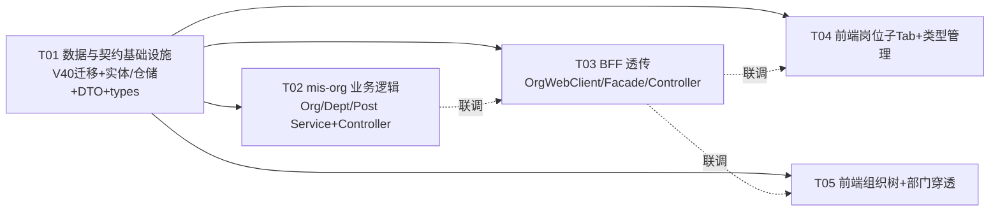

# 施工设计：岗位类型管理界面 + 组织穿透（org-pierce）

> 版本：v1.0（2026-08-13） | 作者：Bob（架构师）
> 输入：`deliverables/software-company/org-pierce-prd-2026-08-13.md`（Alice）+ 主理人 Q&A 拍板 + 用户补充关键案例（部门手工打标对应组织锚点）
> 范围：仅覆盖「岗位类型管理（岗位管理页子 Tab）」与「组织穿透（部门页只读下钻）」；部门页「岗位编制」硬编码样例（EMPLOYEE_ASSIGNMENTS）为既有遗留，不覆盖。
> 施工唯一标准：本文档 + 两份 mermaid（class / sequence）。实现遵循本文档，不得自行另起架构。

---

## 0. 结论速览

| 项 | 结论 |
|---|---|
| 核心机制 | 穿透 = **锚点机制**（`sys_dept.linked_org_id` 手工打标），非「org 树汇总」；`sys_org.parent_id` 组织树与其**并存**（组织管理展示用，穿透本身不依赖 org 树聚合） |
| 数据变更 | V40 迁移：`sys_org.parent_id BIGINT NOT NULL DEFAULT 0` + `sys_dept.linked_org_id BIGINT NULL`（均幂等 IF NOT EXISTS） |
| 穿透端点 | 单一只读端点 `GET /internal/v1/depts/pierce?orgId=X` + BFF `GET /api/v1/depts/pierce?orgId=X`；懒加载下钻（每层一次请求），前端维护钻取栈 + 防循环 |
| 岗位类型 | mis-org `PostService` 补 CRUD + 引用计数（`countByPostTypeId`），删除硬拦截；类型下拉客户端过滤 `status=1` |
| 权限段位（已核实） | sys_api **91195-91198**（V39 用到 91194）；sys_menu_api **91284-91287**（V39 用到 91283）；新按钮菜单 **297-299**（`system:post-type:*`，挂岗位管理 285，V9 用到 296）；module 2 新 code **00900101-00900104**（V39 用到 00900100） |
| 任务数 | 5 个（T01 契约与基础设施 → T02 mis-org 业务 → T03 BFF 透传 → T04 前端岗位子 Tab → T05 前端组织树 + 穿透） |
| 新增第三方依赖 | **无**（前后端均沿用现有栈） |

---

# Part A 系统设计

## 1. 实现方案 + 框架选型

### 1.1 现状核实（设计输入，均已逐文件复核）

- **mis-org 分层**：`Controller → Service → Spring Data JPA Repository`，统一 `Result<T>` 响应（`com.mis.common.core.result.Result`），异常走 `BusinessException(ResultCode, msg)`；Flyway 只追加（V39 最新，V40 起新版本）。
- **sys_org**（V1 L57-73）：`id/tenant_id/code/name/sort/status/remark/deleted/created_by/created_at/updated_by/updated_at`，**无 parent_id**。`OrgController(/internal/v1/orgs)`：GET /、/names、/{id}、POST、PUT、DELETE 齐全；`OrgService.create` 会自动创建该组织 `is_root=1` 根部门（ADR-013）。`SysOrgRepository` 现有 `findByTenantIdAndStatus / findByTenantIdAndCode / countByTenantId`。
- **sys_dept**（V1 L87-105）：`org_id(NOT NULL)/parent_id(默认0)/ancestors/is_root` 已存在；**无 linked_org_id**。`DeptController(/internal/v1/depts)`：tree/{orgId}、{id}/subtree-ids、{id}、{id}/staffing、POST、PUT、DELETE。`DeptService.create` 禁止 parentId=0（根部门只由建组织生成）；`relocate` 已做跨组织/自环/子孙校验。
- **sys_post_type**（V1 L114-124）：表存在，V39 种子 id 1-5；`PostController` 仅 `GET /internal/v1/post-types?tenantId=`（只返回 status=1），**无写端点**。BFF 仅 `GET /api/v1/post-types`（`PostTypeVO` 无引用数）。
- **权限登记**：V39 段位 sys_api 91178-91194 / code 00900084-00900100 / sys_menu_api 91268-91283；系统模块（module 2）菜单 id 至 296（V9：285 岗位管理 + 286/287/288 按钮）。org/dept 的既有 API 在 V2 登记（1952-1957 / 2002-2007），复用同一 path 即免新登记。
- **前端**：
  - `features/system/dept/dept-tree-page.tsx`：分段控件（组织架构 / 岗位编制）+ 组织选择器 + TreeTable + 行操作（子部门/编辑/删除，PermissionGate 门禁）；`view: 'tree' | 'staffing'`。
  - `features/system/org/org-list-page.tsx`：平铺表格（useColumnWidths + useClientSort）+ Sheet 表单 + 增删改。
  - `features/system/admin-list-page.tsx`：通用 AdminListPage 引擎，`PostPage = SystemAdminPage('/system/post')`，由 `keep-alive-outlet.tsx` 的 PAGE_MAP 注册 `/system/post`。
  - `features/system/page-defs.ts`：`SYSTEM_PAGE_DEFS['/system/post']` 已接 `postTypeOptionsLoader: loadPostTypeOptions`（下拉真实数据）。
  - `lib/api/*.ts`：axios 封装 `unwrap`（code===0 取 data），`depts.ts/orgs.ts/posts.ts` 现有 CRUD。
  - TreeTable 组件：`rowActions` 为空时**不渲染操作列**，天然支持只读树（穿透复用）。

### 1.2 核心设计决策（D1-D6）

- **D1 穿透 = 锚点机制（linked_org_id）**。`sys_dept.linked_org_id`（可空）表示「该部门手工打标对应某组织」。穿透 = 沿部门树下钻，遇到带锚点的部门可点击「下钻」跳入该组织顶级部门树（`is_root=1`）继续下钻，可递归。**不采用** PRD 3.2-C 的「org 树聚合顶级部门合集」表述（用户补充案例为准）。`org.parent_id` 组织树用于组织管理展示/上级下拉，与穿透并存互不依赖。
- **D2 穿透端点 = 单一只读 GET + 懒加载**。`GET /internal/v1/depts/pierce?orgId=X`（BFF 同名透传 `GET /api/v1/depts/pierce?orgId=X`）：返回该组织顶级部门树 forest（每棵子树根带 `orgName` 徽标，Q5 拍板显示）；节点含 `linkedOrgId/linkedOrgName` 供前端渲染「下钻」按钮。下钻 = 用 `linkedOrgId` 再调同一端点（路径复用，无需第二端点）。**端点天然只读**（仅 GET，无任何写路径；mis-org 不因此暴露写能力）。
  - 为何懒加载而非一次嵌套全量：穿透链可任意深（A→B→C…），一次全量会递归展开全部子树、响应大且渲染重；懒加载每层一次、数据小、天然契合「浏览式下钻」。
  - 循环防护：锚点自环（`linked_org_id = 部门自身 org_id`）**后端写时拒绝**；跨组织链环（A→B→A）为浏览时用户驱动，后端无状态 GET 不阻断，**前端维护钻取栈 + 已访问 org 集合**，重复锚点禁用「下钻」并提示。
- **D3 org parent_id 组织树**。`sys_org.parent_id BIGINT NOT NULL DEFAULT 0` + 索引 `(tenant_id, parent_id)`；存量平级（=0）。接口沿用现有 flat list（OrgVO 增 `parentId`），前端客户端建树（缩进 + 上级组织列 + 上级下拉排除自身与子孙）。后端写时校验：上级存在、同租户、非自身、非子孙（BFS 遍历租户全量 org）；删除硬拦截：有子组织或有部门即拒绝，**不级联**（Q4，行为变更见 §5）。
- **D4 岗位类型管理**。mis-org 补 `POST/PUT/DELETE /internal/v1/post-types*`；`GET` 扩展为返回**全部**类型（含禁用）+ `referenceCount`（下拉用客户端 `status===1` 过滤）。删除被引用硬拦截（Q3），返回引用数。code 不可编辑（与 org/dict 更新语义一致）；新增/编辑支持启停与排序。
- **D5 权限模型**：岗位类型 CRUD 新增**按钮级权限** `system:post-type:add/edit/delete`（菜单 297-299 挂 285，V9 一码一菜单范式，V40 补授 role 1）；穿透只读端点绑定部门菜单 206（`system:dept:list`，与「员工详情挂 281 列表权限」同范式）。
- **D6 部门 CRUD 支持锚点**：`DeptCreateRequest/DeptUpdateRequest` 增 `linkedOrgId`（可空）；写时校验被引用组织存在、同租户、且 ≠ 部门自身 org_id。更新语义：PUT 总是下发该字段（null=清空），避免「未传=保持」歧义（见 §5 待确认 2）。

### 1.3 架构模式

- 后端：分层服务 + 仓储（沿用），无新增模式。
- BFF：透传模式（OrgWebClient → OrgFacadeService → Controller，body 用 Map 组装）。
- 前端：特性目录 + 通用组件（TreeTable / Sheet / PermissionGate / zustand）。

---

## 2. 文件列表

> 标注：`[改]` 修改既有文件 / `[新]` 新建文件。相对仓库根。

### 2.1 迁移（mis-migrator）
| 文件 | 说明 |
|---|---|
| `backend/mis-migrator/src/main/resources/db/migration/V40__org_hierarchy_and_dept_pierce.sql` [新] | DDL（parent_id / linked_org_id）+ sys_api 登记（91195-91198）+ 新按钮菜单（297-299）+ sys_menu_api（91284-91287）+ role 补授 + 自检注释（详见 §6） |

### 2.2 mis-org（backend/mis-org）
| 文件 | 说明 |
|---|---|
| `src/main/java/com/mis/org/domain/entity/SysOrg.java` [改] | +`parentId` 字段/访问器 |
| `src/main/java/com/mis/org/domain/entity/SysDept.java` [改] | +`linkedOrgId` 字段/访问器 |
| `src/main/java/com/mis/org/domain/repository/SysOrgRepository.java` [改] | +`List<SysOrg> findByTenantId(Long tenantId)`、`boolean existsByParentId(Long parentId)` |
| `src/main/java/com/mis/org/domain/repository/SysDeptRepository.java` [改] | +`boolean existsByOrgId(Long orgId)` |
| `src/main/java/com/mis/org/domain/repository/SysPostTypeRepository.java` [改] | +`List<SysPostType> findByTenantId(Long tenantId)` |
| `src/main/java/com/mis/org/domain/repository/SysPostRepository.java` [改] | +`long countByPostTypeId(Long postTypeId)`（含 deleted=0 语义，实体 @SQLRestriction 覆盖） |
| `src/main/java/com/mis/org/dto/OrgVO.java` [改] | +`String parentId` |
| `src/main/java/com/mis/org/dto/OrgCreateRequest.java` [改] | +`Long parentId` |
| `src/main/java/com/mis/org/dto/OrgUpdateRequest.java` [改] | +`Long parentId` |
| `src/main/java/com/mis/org/dto/DeptVO.java` [改] | +`String linkedOrgId`、`String linkedOrgName` |
| `src/main/java/com/mis/org/dto/DeptCreateRequest.java` [改] | +`Long linkedOrgId` |
| `src/main/java/com/mis/org/dto/DeptUpdateRequest.java` [改] | +`Long linkedOrgId` |
| `src/main/java/com/mis/org/dto/DeptPierceVO.java` [新] | 穿透树节点 VO（orgId/orgName + 部门字段 + linkedOrgId/linkedOrgName + children） |
| `src/main/java/com/mis/org/dto/PostTypeVO.java` [改] | +`Integer referenceCount` |
| `src/main/java/com/mis/org/dto/PostTypeCreateRequest.java` [新] | tenantId/code/name/sort/status |
| `src/main/java/com/mis/org/dto/PostTypeUpdateRequest.java` [新] | name/sort/status（code 不可改） |
| `src/main/java/com/mis/org/service/OrgService.java` [改] | parentId 落库 + 上级校验（环路）+ 删除约束（子组织/部门硬拦截） |
| `src/main/java/com/mis/org/service/DeptService.java` [改] | linkedOrgId 落库/校验 + `pierce(orgId)` 实现 |
| `src/main/java/com/mis/org/service/PostService.java` [改] | 岗位类型 CRUD + referenceCount + 删除引用拦截 |
| `src/main/java/com/mis/org/controller/OrgController.java` [改] | 端点不变（list/get/create/update/delete 同 path，服务层处理 parentId） |
| `src/main/java/com/mis/org/controller/DeptController.java` [改] | +`GET /pierce?orgId=` |
| `src/main/java/com/mis/org/controller/PostController.java` [改] | +`POST/PUT/DELETE /post-types`；GET 增加 `status` 可选参数（默认全量） |

### 2.3 BFF（backend/mis-admin-bff）
| 文件 | 说明 |
|---|---|
| `src/main/java/com/mis/adminbff/client/model/OrgVO.java` [改] | +`String parentId` |
| `src/main/java/com/mis/adminbff/client/model/DeptVO.java` [改] | +`String linkedOrgId`、`String linkedOrgName` |
| `src/main/java/com/mis/adminbff/client/model/DeptPierceVO.java` [新] | 透传 mis-org DeptPierceVO |
| `src/main/java/com/mis/adminbff/client/model/PostTypeVO.java` [改] | +`Integer referenceCount` |
| `src/main/java/com/mis/adminbff/dto/OrgCreateRequest.java` [改] | +`Long parentId` |
| `src/main/java/com/mis/adminbff/dto/OrgUpdateRequest.java` [改] | +`Long parentId` |
| `src/main/java/com/mis/adminbff/dto/DeptCreateRequest.java` [改] | +`Long linkedOrgId` |
| `src/main/java/com/mis/adminbff/dto/DeptUpdateRequest.java` [改] | +`Long linkedOrgId` |
| `src/main/java/com/mis/adminbff/dto/PostTypeCreateRequest.java` [新] | code/name/sort/status |
| `src/main/java/com/mis/adminbff/dto/PostTypeUpdateRequest.java` [新] | name/sort/status |
| `src/main/java/com/mis/adminbff/client/OrgWebClient.java` [改] | +`deptPierce(orgId)`、+`createPostType/updatePostType/deletePostType`、GET post-types 加 status 参数、org 写请求带 parentId |
| `src/main/java/com/mis/adminbff/service/OrgFacadeService.java` [改] | 透传 parentId/linkedOrgId/pierce/postType CRUD |
| `src/main/java/com/mis/adminbff/controller/OrgController.java` [改] | 端点不变（请求 DTO 带 parentId） |
| `src/main/java/com/mis/adminbff/controller/DeptController.java` [改] | +`GET /pierce?orgId=` |
| `src/main/java/com/mis/adminbff/controller/PostController.java` [改] | +`POST/PUT/DELETE /post-types`；GET post-types 加 status 可选 |

### 2.4 前端（frontend/mis-admin-web/src）
| 文件 | 说明 |
|---|---|
| `features/system/post/post-manage-page.tsx` [新] | 岗位管理页分段控件（岗位列表 / 岗位类型）+ 类型变更后重挂载岗位列表引擎（key=version） |
| `features/system/post/post-type-manage-page.tsx` [新] | 岗位类型 Tab：表格（编码/名称/排序/状态/引用岗位数/操作）+ Sheet 表单 + 删除拦截 |
| `features/system/post/post-type-version-store.ts` [新] | zustand 计数 store：类型变更 → bump version → 岗位列表/下拉同源刷新（P0-PT-03） |
| `features/system/org/org-list-page.tsx` [改] | 树形展示（缩进 + 上级组织列，客户端建树）+ 表单上级下拉（排除自身与子孙）+ 删除错误 toast |
| `features/system/dept/dept-tree-page.tsx` [改] | 分段控件加第三项「组织穿透」：只读 forest + 锚点「下钻」+ 钻取栈/面包屑 + 防循环；穿透下无增删改/子部门/编制入口；切换组织退出穿透 |
| `components/layout/keep-alive-outlet.tsx` [改] | PAGE_MAP `/system/post` → `PostManagePage`（替代 PostPage 直挂） |
| `lib/api/orgs.ts` [改] | OrgItem + parentId；create/update 载荷带 parentId |
| `lib/api/depts.ts` [改] | DeptNode + linkedOrgId/linkedOrgName；create/update 载荷带 linkedOrgId；+`fetchDeptPierce(orgId)` |
| `lib/api/posts.ts` [改] | +`createPostType/updatePostType/deletePostType`；`listPostTypes` 适配 referenceCount |
| `types/api.ts` [改] | OrgItem.parentId；DeptNode.linkedOrgId/linkedOrgName；PostTypeItem.referenceCount；+`DeptPierceNode` |
| `features/system/page-defs.ts` [改] | `loadPostTypeOptions` 增加 `status===1` 过滤（避免禁用类型进岗位表单下拉） |

---

## 3. 数据模型 + 接口

### 3.1 表变更（V40，幂等）

```sql
-- sys_org：组织层级
ALTER TABLE sys_org ADD COLUMN IF NOT EXISTS parent_id BIGINT NOT NULL DEFAULT 0;
CREATE INDEX IF NOT EXISTS idx_org_tenant_parent ON sys_org (tenant_id, parent_id);

-- sys_dept：部门手工对应组织（穿透锚点）
ALTER TABLE sys_dept ADD COLUMN IF NOT EXISTS linked_org_id BIGINT NULL;
CREATE INDEX IF NOT EXISTS idx_dept_linked_org ON sys_dept (linked_org_id) WHERE deleted = 0;
```

语义约束（应用层强制）：
- `sys_org.parent_id=0` = 顶级组织；非 0 必须指向同租户存在的 org；禁止自环/子孙环。
- `sys_dept.linked_org_id` NULL = 无锚点；非 NULL 必须指向存在的 org 且 ≠ 该部门所属 org_id。
- 不新增 `sys_org.ancestors`（org 层级浅 ≤3，环路校验在内存 BFS 完成，避免冗余列）。

### 3.2 类图

文件：`docs/backend/org-pierce-class-diagram.mermaid`（正文见该文件）。

要点：
- 实体：`SysOrg(+parentId)` / `SysDept(+linkedOrgId)` / `SysPostType`（不变）。
- 服务：`OrgService`（validateParent / collectDescendantIds）、`DeptService`（pierce / validateLinkedOrg）、`PostService`（类型 CRUD）。
- 控制器：`OrgController / DeptController / PostController` → 对应 Service。
- DTO：`OrgVO(+parentId)`、`DeptVO(+linkedOrgId/+linkedOrgName)`、`DeptPierceVO`（orgId/orgName/linkedOrgId/linkedOrgName/children）、`PostTypeVO(+referenceCount)`、各 Request。

### 3.3 Controller 端点清单

**mis-org（internal，BFF 直连，不经权限网关）**

| 方法 | 路径 | 参数/Body | 说明 | 权限 |
|---|---|---|---|---|
| GET | `/internal/v1/orgs` | tenantId | 组织列表（含 parentId） | 内部 |
| POST | `/internal/v1/orgs` | OrgCreateRequest(+parentId) | 新增组织（自动建根部门） | 内部 |
| PUT | `/internal/v1/orgs/{id}` | OrgUpdateRequest(+parentId) | 编辑（上级校验 + 环路防护） | 内部 |
| DELETE | `/internal/v1/orgs/{id}` | — | 有子组织/部门硬拦截 | 内部 |
| GET | `/internal/v1/depts/tree` | orgId | 部门树（DeptVO + linkedOrgId/Name） | 内部 |
| GET | `/internal/v1/depts/pierce` | orgId | **穿透 forest（只读）** | 内部 |
| POST | `/internal/v1/depts` | DeptCreateRequest(+linkedOrgId) | 新增部门（锚点校验） | 内部 |
| PUT | `/internal/v1/depts/{id}` | DeptUpdateRequest(+linkedOrgId) | 编辑（锚点校验/清空） | 内部 |
| GET | `/internal/v1/post-types` | tenantId, status(可选) | 类型全量 + referenceCount；status=1 仅启用 | 内部 |
| POST | `/internal/v1/post-types` | PostTypeCreateRequest | 新增类型 | 内部 |
| PUT | `/internal/v1/post-types/{id}` | PostTypeUpdateRequest | 编辑类型（name/sort/status） | 内部 |
| DELETE | `/internal/v1/post-types/{id}` | — | 删除类型（被引用硬拦截） | 内部 |

**BFF（/api/v1，权限网关校验，sys_api 登记）**

| 方法 | 路径 | sys_api id | 权限码（绑定菜单） |
|---|---|---|---|
| GET | `/api/v1/orgs` | 1952（复用，无新增） | system:org:list (202) |
| POST | `/api/v1/orgs` | 1955（复用） | system:org:add (216) |
| PUT | `/api/v1/orgs/{id}` | 1956（复用） | system:org:edit (217) |
| DELETE | `/api/v1/orgs/{id}` | 1957（复用） | system:org:delete (218) |
| GET | `/api/v1/depts/tree` | 2002（复用） | system:dept:list (206) |
| GET | `/api/v1/depts/pierce` | **91198 新** | system:dept:list (206) |
| GET | `/api/v1/depts/{id}` | 2003（复用） | system:dept:list (206) |
| POST | `/api/v1/depts` | 2005（复用） | system:dept:add (221) |
| PUT | `/api/v1/depts/{id}` | 2006（复用） | system:dept:edit (222) |
| DELETE | `/api/v1/depts/{id}` | 2007（复用） | system:dept:delete (223) |
| GET | `/api/v1/post-types` | 91188（复用，加 status 可选） | system:post:list (285) |
| POST | `/api/v1/post-types` | **91195 新** | system:post-type:add (297) |
| PUT | `/api/v1/post-types/{id}` | **91196 新** | system:post-type:edit (298) |
| DELETE | `/api/v1/post-types/{id}` | **91197 新** | system:post-type:delete (299) |

> 说明：`/api/v1/depts/pierce` 与 `/{id}` 并存无冲突（Spring PathPattern 字面量优先，与既有 `/tree` 同理）。

### 3.4 穿透响应结构（DeptPierceVO）

```jsonc
[
  {
    "id": "90001", "orgId": "1", "orgName": "总部",
    "parentId": "0", "code": "0001", "name": "总经理办公室",
    "sort": 0, "status": 1, "isRoot": 1,
    "linkedOrgId": "2",            // 锚点：手工对应组织（可选）
    "linkedOrgName": "百货分公司",  // 锚点组织名（供「下钻」按钮）
    "children": [ /* 完整子树，递归同构 */ ]
  },
  /* … 该组织下多棵顶级部门树并列（forest） */
]
```

---

## 4. 程序调用流程

文件：`docs/backend/org-pierce-sequence-diagram.mermaid`（正文见该文件）。

三条关键链路：
1. **穿透下钻（核心）**：DeptTreePage(穿透视图) → `GET /api/v1/depts/pierce?orgId=X` → OrgFacadeService.deptPierce → OrgWebClient.deptPierce → `GET /internal/v1/depts/pierce?orgId=X` → DeptController.pierce → DeptService.pierce（一次取该 org 全部部门 + 一次 orgNames 解析，避免 N+1）→ 返回 forest；前端渲染徽标 + 锚点按钮；点击锚点 → 以 linkedOrgId 再调同一端点（钻取栈 push）。
2. **岗位类型删除拦截**：PostTypeManagePage → `DELETE /api/v1/post-types/{id}` → BFF → `DELETE /internal/v1/post-types/{id}` → PostService.deleteType → `SysPostRepository.countByPostTypeId(id)` → >0 抛 `BusinessException(409, "岗位类型已被 N 个岗位引用，禁止删除")` → 前端 toast 展示。
3. **组织设上级 + 环路校验**：OrgListPage → `PUT /api/v1/orgs/{id} {parentId}` → BFF → `PUT /internal/v1/orgs/{id}` → OrgService.update → 校验 parent 存在/同租户/非自身 → `collectDescendantIds(tenantId, id)` BFS → parentId ∈ 子孙则拒绝 → 保存。

---

## 5. Anything UNCLEAR / 待明确事项

1. **岗位类型按钮权限粒度**（已按 D5 拍板为新增 297-299 `system:post-type:*`）：若 PM 希望复用 `system:post:add/edit/delete`（省 3 个菜单），V40 相应删减 C/D 段即可，接口不变。
2. **部门更新锚点「清空」语义**（已按 D6 拍板）：PUT 总是下发 `linkedOrgId`（null=清空）。若未来有其他调用方不传该字段，会误清空——现仅 BFF 调用，风险可控。
3. **组织删除行为变更**：现 `OrgService.delete` 为「级联软删全部部门后软删组织」；按 Q4 改为「存在子组织或部门即硬拦截、不级联」。属于行为回归点，测试需覆盖原部门删除用例被拦截。
4. **穿透初始范围**：设计为「从当前所选组织的顶级部门树开始」（PRD P0-PR-02 同源）；用户补充案例的「浏览到打标部门继续下钻」即锚点点击触发，二者不冲突。若 PM 期望初始即含全部子孙组织树，需另设计聚合端点（本迭代不做）。
5. **岗位类型 code 不可编辑**（与 org/dict 更新语义一致）；若需编辑需补唯一性校验与历史引用一致性评估（本期不做）。
6. **org 树深度**：Q2 已拍板不硬限制；实现按「内存 BFS 环路校验」，org 量级大时（>数百）需评估性能（现租户 org 数十级，无风险）。
7. **穿透端点是否需登录上下文/数据权限**：沿用现有 `/internal/v1/depts/tree` 语义（仅 orgId，无 tenantId），BFF 网关已做认证与 sys_api 校验。

---

## 6. 迁移 V40 设计（详细）

文件：`backend/mis-migrator/src/main/resources/db/migration/V40__org_hierarchy_and_dept_pierce.sql`

**段位（2026-08-13 全仓核实）**：
- sys_api 上一段位 = 91194（V39）→ 本文件 **91195-91198**
- sys_api.code（module 2）上一段位 = 00900100（V39）→ 本文件 **00900101-00900104**（module 2 内唯一，不与 V2 的 0002/0006 前缀冲突）
- sys_menu_api 上一段位 = 91283（V39）→ 本文件 **91284-91287**
- sys_menu（系统模块）上一段位 = 296（V9）→ 本文件新增按钮 **297/298/299**

**A. DDL（幂等）**
```sql
ALTER TABLE sys_org  ADD COLUMN IF NOT EXISTS parent_id BIGINT NOT NULL DEFAULT 0;
CREATE INDEX IF NOT EXISTS idx_org_tenant_parent ON sys_org (tenant_id, parent_id);
ALTER TABLE sys_dept ADD COLUMN IF NOT EXISTS linked_org_id BIGINT NULL;
CREATE INDEX IF NOT EXISTS idx_dept_linked_org ON sys_dept (linked_org_id) WHERE deleted = 0;
```

**B. sys_api 登记（module 2，catalog 91178「员工与岗位」下挂类型 CRUD；2001「部门查询」下挂穿透）**
```sql
INSERT INTO sys_api (id, module_id, parent_id, code, type, name, http_method, path_pattern, sort, status, created_at, updated_at)
SELECT v.* FROM (VALUES
    (91195, 2, 91178, '00900101', 'api'::sys_api_node_type, '新增岗位类型', 'POST',   '/api/v1/post-types',              1, 1, NOW(), NOW()),
    (91196, 2, 91178, '00900102', 'api'::sys_api_node_type, '编辑岗位类型', 'PUT',    '/api/v1/post-types/{id:[0-9]+}', 2, 1, NOW(), NOW()),
    (91197, 2, 91178, '00900103', 'api'::sys_api_node_type, '删除岗位类型', 'DELETE', '/api/v1/post-types/{id:[0-9]+}', 3, 1, NOW(), NOW()),
    (91198, 2, 2001,  '00900104', 'api'::sys_api_node_type, '组织穿透',     'GET',    '/api/v1/depts/pierce',           3, 1, NOW(), NOW())
) AS v(id, module_id, parent_id, code, type, name, http_method, path_pattern, sort, status, created_at, updated_at)
WHERE NOT EXISTS (SELECT 1 FROM sys_api WHERE id = v.id)
  AND NOT EXISTS (SELECT 1 FROM sys_api WHERE module_id = v.module_id AND code = v.code)
  AND NOT EXISTS (SELECT 1 FROM sys_api a WHERE a.type='api' AND a.status=1
                  AND a.http_method = v.http_method AND a.path_pattern = v.path_pattern)
  AND EXISTS (SELECT 1 FROM sys_api WHERE id = 91178)   -- 类型 CRUD 挂 91178
  AND EXISTS (SELECT 1 FROM sys_api WHERE id = 2001);   -- 穿透挂 2001
```

**C. 新增按钮菜单（挂 285 岗位管理，type=3）**
```sql
INSERT INTO sys_menu (id, tenant_id, app_id, parent_id, code, name, type, path, component, permission, icon, sort, visible, status, created_at, updated_at)
SELECT v.* FROM (VALUES
    (297, 1, 1, 285, '000200160004', '新增岗位类型', 3, NULL, NULL, 'system:post-type:add',    NULL, 4, 1, 1, NOW(), NOW()),
    (298, 1, 1, 285, '000200160005', '编辑岗位类型', 3, NULL, NULL, 'system:post-type:edit',   NULL, 5, 1, 1, NOW(), NOW()),
    (299, 1, 1, 285, '000200160006', '删除岗位类型', 3, NULL, NULL, 'system:post-type:delete', NULL, 6, 1, 1, NOW(), NOW())
) AS v(id, tenant_id, app_id, parent_id, code, name, type, path, component, permission, icon, sort, visible, status, created_at, updated_at)
WHERE NOT EXISTS (SELECT 1 FROM sys_menu WHERE id = v.id)
  AND NOT EXISTS (SELECT 1 FROM sys_menu WHERE tenant_id = v.tenant_id AND app_id = v.app_id AND code = v.code)
  AND EXISTS (SELECT 1 FROM sys_menu WHERE id = 285);
```

**D. sys_menu_api（一码一菜单）**
```sql
INSERT INTO sys_menu_api (id, menu_id, api_id, sort, created_at)
SELECT v.* FROM (VALUES
    (91284, 297, 91195, 1, NOW()),  -- 新增岗位类型 → system:post-type:add
    (91285, 298, 91196, 1, NOW()),  -- 编辑岗位类型 → system:post-type:edit
    (91286, 299, 91197, 1, NOW()),  -- 删除岗位类型 → system:post-type:delete
    (91287, 206, 91198, 1, NOW())   -- 组织穿透 → system:dept:list
) AS v(id, menu_id, api_id, sort, created_at)
WHERE NOT EXISTS (SELECT 1 FROM sys_menu_api WHERE id = v.id)
  AND NOT EXISTS (SELECT 1 FROM sys_menu_api WHERE menu_id = v.menu_id AND api_id = v.api_id)
  AND EXISTS (SELECT 1 FROM sys_menu WHERE id = v.menu_id)
  AND EXISTS (SELECT 1 FROM sys_api  WHERE id = v.api_id);
```

**E. role 补授（role_id=1，V39 D 段同款）**
```sql
INSERT INTO sys_role_permission (id, role_id, perm_type, target_id, created_at)
SELECT m.id, 1, 'menu'::sys_perm_type, m.id, NOW()
FROM sys_menu m
WHERE m.parent_id = 285 AND m.type = 3 AND m.status = 1
  AND m.id IN (297, 298, 299)
  AND NOT EXISTS (SELECT 1 FROM sys_role_permission rp
                  WHERE rp.role_id = 1 AND rp.perm_type = 'menu' AND rp.target_id = m.id)
ON CONFLICT (id) DO NOTHING;
```

**F. 迁移后自检（SQL 注释附在文件尾）**
1. sys_api 91195-91198 均挂且权限码正确（JOIN sys_menu_api/sys_menu 检查 permission 分布：297/298/299/206）。
2. 一码一菜单回归：api_id IN (91195..91198) GROUP BY count(*)=1。
3. (module_id, code) 无重复：module_id=2 AND code IN (00900101..00900104)。
4. 按钮 297-299 全部有 role_id=1 授权。

---

# Part B 任务分解

## 7. Required Packages

**无新增第三方依赖**。沿用既有：
- 后端：Spring Boot 3 / Spring Data JPA / Flyway / mis-common（Result、BusinessException、ResultCode）。
- BFF：Spring WebFlux WebClient（OrgWebClient 透传）。
- 前端：react@^18.3.1 / react-router-dom@^6.22.3 / axios / zustand@^4.5.2 / sonner / lucide-react / Tailwind + shadcn 风格组件（@/components/ui/*、TreeTable、Sheet、PermissionGate）。

## 8. Task List（≤5，P0 全量）

> 约定：T02/T03/T04/T05 均仅依赖 T01（契约），前端任务可与后端并行开发，**联调在 T03 完成后统一进行**。

### T01 数据与契约基础设施（迁移 + 实体/仓储 + 全链路 DTO + 前端类型）— P0
- **Source Files**：
  - `backend/mis-migrator/.../V40__org_hierarchy_and_dept_pierce.sql` [新]
  - mis-org：`SysOrg.java`、`SysDept.java`、`SysOrgRepository.java`、`SysDeptRepository.java`、`SysPostTypeRepository.java`、`SysPostRepository.java`、`dto/OrgVO.java`、`dto/OrgCreateRequest.java`、`dto/OrgUpdateRequest.java`、`dto/DeptVO.java`、`dto/DeptCreateRequest.java`、`dto/DeptUpdateRequest.java`、`dto/DeptPierceVO.java` [新]、`dto/PostTypeVO.java`、`dto/PostTypeCreateRequest.java` [新]、`dto/PostTypeUpdateRequest.java` [新]
  - BFF：`client/model/OrgVO.java`、`client/model/DeptVO.java`、`client/model/DeptPierceVO.java` [新]、`client/model/PostTypeVO.java`、`dto/OrgCreateRequest.java`、`dto/OrgUpdateRequest.java`、`dto/DeptCreateRequest.java`、`dto/DeptUpdateRequest.java`、`dto/PostTypeCreateRequest.java` [新]、`dto/PostTypeUpdateRequest.java` [新]
  - 前端：`types/api.ts`
- **Dependencies**：无
- **说明**：一次性把「表字段 → 实体 → 仓储方法 → 三层 DTO/VO → 前端类型」契约打通；V40 权限登记（sys_api/menu/绑定/补授）在此任务完成。验收：mvn compile 通过、flyway migrate 可执行、自检 SQL 全绿。

### T02 mis-org 业务逻辑（OrgService / DeptService / PostService / Controller）— P0
- **Source Files**：`service/OrgService.java`、`service/DeptService.java`、`service/PostService.java`、`controller/OrgController.java`、`controller/DeptController.java`、`controller/PostController.java`
- **Dependencies**：T01
- **说明**：实现 parentId 落库 + 上级校验（BFS 环路）+ 删除硬拦截；linkedOrgId 落库/校验 + `pierce()` 懒加载 forest（一次查询 + orgNames 批量解析）；岗位类型 CRUD + referenceCount + 删除引用拦截。验收：单测覆盖环路/删除拦截/穿透空态与锚点。

### T03 BFF 透传（OrgWebClient / OrgFacadeService / BFF Controller）— P0
- **Source Files**：`client/OrgWebClient.java`、`service/OrgFacadeService.java`、`controller/OrgController.java`、`controller/DeptController.java`、`controller/PostController.java`
- **Dependencies**：T01
- **说明**：透传 parentId/linkedOrgId；新增 `GET /api/v1/depts/pierce`；岗位类型 CRUD 端点；GET post-types 加 status 可选。验收：与 T02 联调后 BFF 冒烟（curl pierce / post-type CRUD）。

### T04 前端岗位管理子 Tab + 岗位类型管理 — P0
- **Source Files**：`features/system/post/post-manage-page.tsx` [新]、`features/system/post/post-type-manage-page.tsx` [新]、`features/system/post/post-type-version-store.ts` [新]、`components/layout/keep-alive-outlet.tsx`、`lib/api/posts.ts`、`features/system/page-defs.ts`
- **Dependencies**：T01
- **说明**：岗位页分段控件；类型 Tab 表格/表单/删除拦截（引用数展示）；类型变更 bump version → 岗位列表重挂载刷新下拉；`loadPostTypeOptions` 过滤 status=1。验收：验收标准 1-3。

### T05 前端组织树 + 部门穿透 — P0
- **Source Files**：`features/system/org/org-list-page.tsx`、`features/system/dept/dept-tree-page.tsx`、`lib/api/orgs.ts`、`lib/api/depts.ts`
- **Dependencies**：T01
- **说明**：组织页树形（缩进 + 上级列 + 上级下拉排除自身子孙 + 删除拦截提示）；部门页「组织穿透」视图（只读 forest、锚点下钻按钮、钻取栈/面包屑、防循环、无增删改/子部门/编制入口、切换组织退出穿透）。验收：验收标准 4-8。

## 9. Shared Knowledge（跨文件约定）

- **Result 包装**：全链路 `Result<T>{code,data,message}`；BFF 前端 `unwrap`（code!==0 抛 Error(message)）。
- **BFF 透传模式**：OrgWebClient 组装 body Map → FacadeService 组装（tenantId 取 `RequestContext.requireTenantId()`）→ Controller 收 DTO；**前端不直接碰 /internal 路径**。
- **权限登记规则**：只登记 BFF `/api/v1` path；deny-unmapped=true（未登记即 403）；一码一菜单；新段位 V40：sys_api 91195-91198 / code 00900101-00900104 / sys_menu_api 91284-91287 / 按钮 297-299。
- **id 生成**：mis-org 统一 `IdGenerator.nextId()`；迁移种子固定 id + `WHERE NOT EXISTS` + `ON CONFLICT DO NOTHING`（幂等）。
- **DTO 字段约定**：后端 `String id/tenantId/orgId/parentId/...`（字符串）；前端类型对齐（`OrgItem.parentId: string` 等）。
- **穿透只读**：mis-org 仅 GET；前端穿透视图 `rowActions` 不传（TreeTable 不渲染操作列）、隐藏新增按钮、编制视图不渲染。
- **锚点校验**：`linked_org_id ≠ dept.org_id`（后端拒绝自环）；前端钻取栈 visited 集合防 A→B→A。
- **更新语义**：org `parentId` 与 dept `linkedOrgId` 均「PUT 总是下发，null=清空/顶级(0)」；BFF/前端表单默认值 parentId=0、linkedOrgId=null。
- **下拉同源**：岗位类型下拉走 `loadPostTypeOptions`（真实 sys_post_type，过滤 status=1）；类型变更后 bump `post-type-version-store` 触发岗位列表引擎重挂载。
- **既有复用**：org/dept 既有 sys_api（1952-2007）不新增；`/api/v1/depts/pierce` 字面量优先于 `/{id}`（与 /tree 同理）。

## 10. Task Dependency Graph


