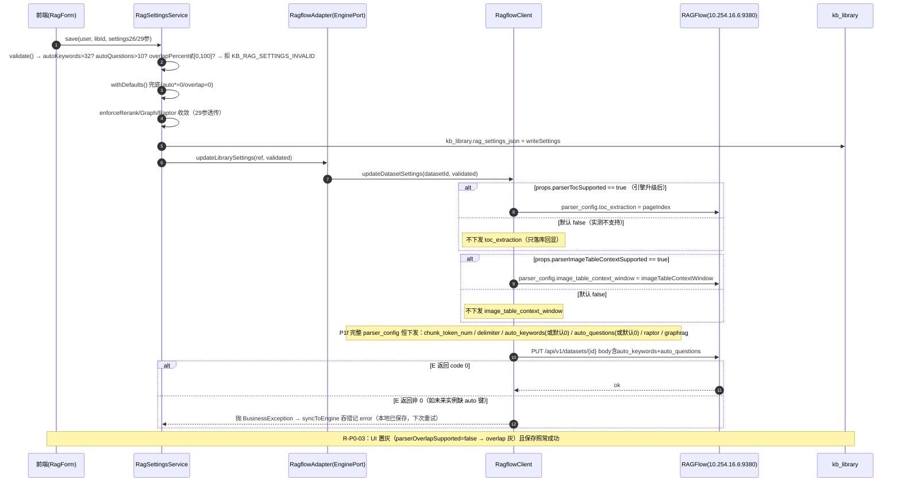
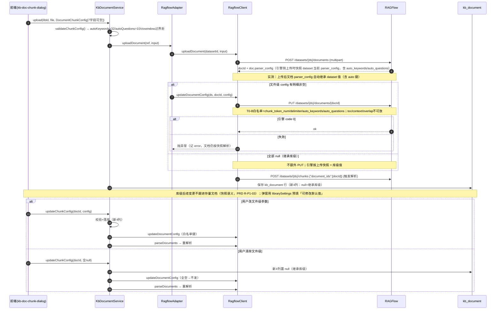
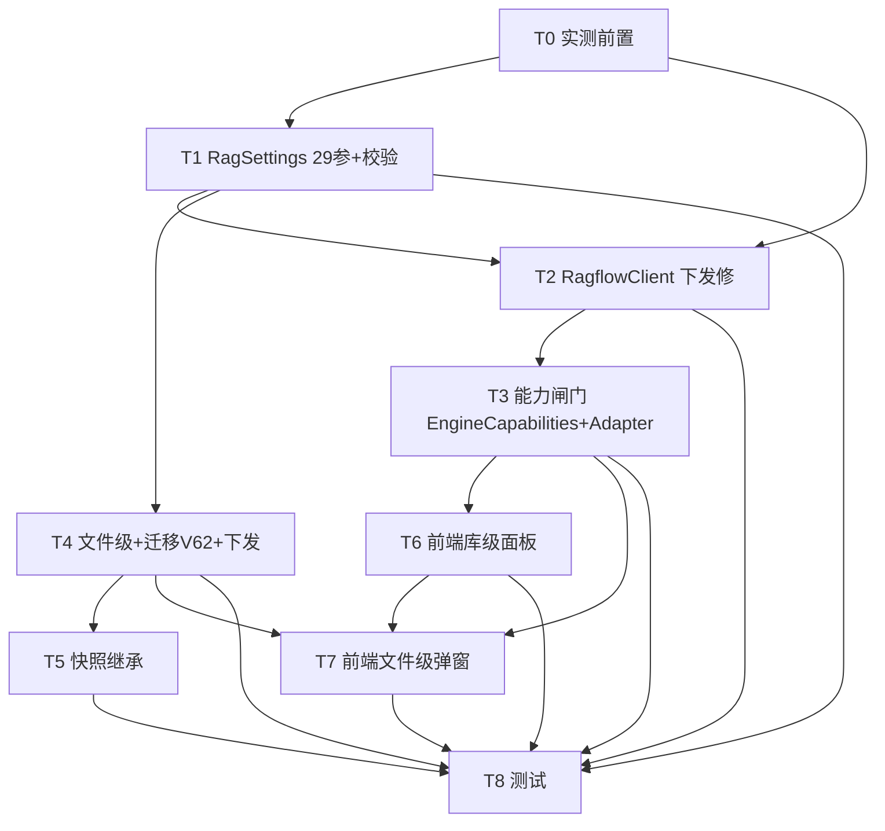

# RAGFlow 切片设置参数对齐（overlap% / auto_keywords / auto_questions + 文件级扩展与快照继承）— 增量架构设计 + 任务分解

- 文档类型：**增量架构设计 + 任务分解**（基于增量 PRD，含 T0 实测裁决）
- 编写人：software-architect（架构师 高见远）
- 日期：2026-08-19
- 关联文档：
  - 增量 PRD：`deliverables/software-company/ragflow-chunk-settings-prd-2026-08-19.md`
  - T0 实测记录：`docs/backend/ragflow-chunk-settings-probe-2026-08-19.md`
  - 参考范式：`docs/backend/ragflow-physical-delete-design-2026-08-12.md`
- 代码核实范围：`backend/mis-kb` 全部引用文件已实际打开核对（见 §2 行号证据）；`backend/mis-migrator` 迁移目录已 ls 实测（最新 **V61**，V62 未被占用）。
- T0 实测范围：`.env.integration` 目标实例 `http://10.254.16.6:9380`（RAGFlow v0.26.4 时代），临时 dataset 已建→逐键 PUT→上传小文档→文件级 PUT→**临时 dataset 已删除**；未触碰任何业务库/业务数据库。

---

## 0. 设计要点速览（给主理人）

| 项 | 决策 |
|---|---|
| **T0-a overlap%** | **当前实例不支持任何 overlap 键**：`overlapped_percent/overlap_percent/overlap_token_count/chunk_overlap_token_num/overlap` 全部 code:101（Extra inputs）→ **裁决：走「能力闸门只落库不下发 + 置灰提示」（与 OCR 同款）**，新增字段 `overlapPercent`（Double，[0,100]，默认 0）参与落库/校验/回显，`EngineCapabilities` 已有 `parser_overlap` 位，翻 true 即放行，代码分支不动 |
| **T0-b 文件级 PUT** | `PUT /datasets/{ds}/documents/{doc}` parser_config **接受** `chunk_token_num/delimiter/auto_keywords/auto_questions`（持久化回读验证成功）；**拒绝** `toc_extraction/image_table_context_window/overlapped_percent`（code 102）→ 文件级只下发 auto 两键（chunk/换行沿用），另三键文件级**不下发**（只落库回显） |
| **auto 两键** | 官方 naive 写 schema 键，库级/文件级均接受、越界被引擎拒（auto_keywords≤32 / auto_questions≤10，与 PRD 一致）→ **随每次 PUT 恒下发（P1f）**，不做能力闸门；默认 0=关闭 |
| **⚠ T01 遗留修正（T0 附带发现）** | 本实例 **dataset 级 PUT 也拒绝 `toc_extraction`/`image_table_context_window`（code 101）**，而现网 `updateDatasetSettings` 每次恒带这两键 → 每次库级保存引擎同步整单失败（本地静默成功 + error 日志）。这也阻断 auto 键生效（pydantic 拒整单）。**必需修正**：两键改为「配置闸门下放」，默认 false（本实例实测），引擎升级后翻 true；前端能力声明同步置灰 |
| 快照继承 | **沿用上传时引擎快照**（实测：上传文档 parser_config 自动复制 dataset，auto_keywords/auto_questions 值一并带入）→ MIS 文档列保持 **null=继承库级**，不做列拷贝（不破坏 FILE_OVERRIDE/清除覆盖语义）；「默认值可修改」由前端弹窗用库级设置预填实现 |
| V62 迁移 | **未被占用**（ls 实测最新为 V61__agent_ops_v50_menu_api_binding.sql）；新增 `V62__kb_document_chunk_parser_fields.sql`，独立列 4 列（page_index / image_table_context_window / auto_keywords / auto_questions），ADD COLUMN IF NOT EXISTS 幂等，不回填 |
| 依赖包 | **无新增**（沿用 Spring Boot + RestClient + Flyway + JUnit5/Mockito；真实探测用 Python urllib，仅运维脚本，不入依赖） |

---

## 1. 实现方案 + 框架选型

### 1.1 难点分析

1. **overlap% 键名/单位/默认未知（PRD Q1 前置阻塞）**：官方 naive 白名单未明确列出该键，存量 `chunkOverlapTokenNum` 因能力闸门从未下发。**已真机实测（T0-a）**：当前目标实例写 schema 无任何 overlap 键（5 个候选全部 code 101 `Extra inputs are not permitted`）→ **裁决：本实例不支持，走「只落库+回显+置灰提示」能力降级（与 OCR/KE-06 同款）**；字段仍新增 `overlapPercent`（Double，[0,100]，默认 0）承载配置，`EngineCapabilities.parser_overlap` 翻转即放行（代码分支不动）。
2. **auto_keywords/auto_questions 下发正确性**：官方 naive 键，需确认范围/默认。**T0 实测**：`auto_keywords` ≤32、`auto_questions` ≤10（越界引擎 code 101/102 拒）；默认 0；库级与文件级 PUT 均接受且持久化 → **恒下发（P1f 契约）**。
3. **文件级 PUT 新增键接受度（PRD R-P1-03 阻塞）**：**T0-B 实测**：文件级 PUT parser_config 白名单 = `chunk_token_num/delimiter/auto_keywords/auto_questions`；拒绝 `toc_extraction/image_table_context_window/overlapped_percent` → 文件级下落仅含 auto 两键（另两键沿用），其余新增键只落库回显。
4. **T01 遗留：`toc_extraction`/`image_table_context_window` 本实例不被写 schema 接受**（实测 code 101）→ 必须用配置闸门「按能力放行」，否则该实例库级设置每次同步整单失败且 auto 键永远到不了引擎。这是让 PRD 验收 1 成立的前置修正。
5. **record 29 参铁律**：`RagSettings` 新增 3 字段（overlapPercent / autoKeywords / autoQuestions）必须**末位追加**（位置参数）；4 处 canonical 透传点 + withGraphOverride/withRaptorOverride + 兼容构造（11/14/17）同步补参；`withDefaults()` 兜底默认值（老 JSON 无字段按 `null` 读入 → 默认值补齐）。
6. **零回归**：存量 26 参 record 兼容构造调用点零改动；`KB` 实体新增列可空不迁移；前端新字段老后端缺字段按 `undefined → 默认` 兜底。

### 1.2 框架 / 库选型

**沿用现有 `mis-kb` 技术栈，无新框架、无新第三方依赖**：

- 后端：Java 17 + Spring Boot + Spring Data JPA（Flyway 管 DDL）。
- 引擎 HTTP：现有 `org.springframework.web.client.RestClient`（`RagflowClient` 已封装）。
- 配置：现有 `RagflowProperties`（`mis.kb.engine.*`，Nacos 热调）——新增 `parser-toc-supported` / `parser-image-table-context-supported` 两个布尔位（与 `delete-supported`/`raptor-enabled` 同款配置化口径）。
- 测试：现有 JUnit 5 + Mockito + JDK `HttpServer` 假 RAGFlow（`RagflowHttpClientTest` 范式）。
- DDL：新增一条 Flyway 迁移（`V62__...`，与 V23/V30 同款风格）。

> 结论：**依赖包列表为空（无新增）**，见 §6。

### 1.3 架构模式

保持现有分层：Controller → Service(@Transactional) → EnginePort(RagflowAdapter) → RagflowClient。参数决策仍由 `RagSettingsService`/`DocumentChunkConfigResolver` 收口，适配层不做决策；能力/配置闸门（toc/context/overlap）统一走 `RagflowProperties`（服务端事实）+ `EngineCapabilities`（前端置灰依据）。

---

## 2. 文件列表及相对路径（新增 / 修改）

> 所有路径相对仓库根 `d:/code/mis-platform`。本设计不修改源码，下表为工程师落地改动清单。

### 2.1 新增文件

| 相对路径 | 说明 | 任务 |
|---|---|---|
| `docs/backend/ragflow-chunk-settings-probe-2026-08-19.md` | T0 真机实测记录（curl/urllib 原文 + 决策表） | T0 |
| `backend/mis-migrator/src/main/resources/db/migration/V62__kb_document_chunk_parser_settings.sql` | DDL：`kb_document` 增 4 列（page_index BOOLEAN / image_table_context_window INTEGER / auto_keywords INTEGER / auto_questions INTEGER），`ADD COLUMN IF NOT EXISTS` 幂等 | T4 |
| `backend/mis-kb/src/main/java/com/mis/kb/domain/model/EffectiveChunkConfig.java`（若为 4 字段既有 3 字段版本 → 扩展）| 文件级生效切片值 + 来源标记，扩展新字段 | T4 |
| `backend/mis-kb/src/test/java/com/mis/kb/engine/RagflowChunkSettingsHttpTest.java` | P1f 契约钉死：库级 PUT 恒含 auto 两键；toc/context 受配置闸门；overlap 永不出现；文件级 PUT 只含白名单键（新假 RAGFlow 合约） | T8 |
| `backend/mis-kb/src/test/java/com/mis/kb/domain/service/KbDocumentServiceChunkConfigTest.java` | 文件级新字段校验（越界拒）、清除回 null、快照继承（列 null=继承）用例 | T8 |

### 2.2 修改文件

| 相对路径 | 改动点 | 对应任务 |
|---|---|---|
| `backend/mis-kb/src/main/java/com/mis/kb/domain/model/RagSettings.java` | **29 参末位追加三字段**：`Double overlapPercent` / `Integer autoKeywords` / `Integer autoQuestions`；默认常量区（DEFAULT_OVERLAP_PERCENT=0.0（0≤v≤100）/DEFAULT_AUTO_KEYWORDS=0/DEFAULT_AUTO_QUESTIONS=0、MAX_AUTO_KEYWORDS=32/MAX_AUTO_QUESTIONS=10）；`defaults()`/`withDefaults()`/`withGraphOverride`/`withRaptorOverride` 补参；兼容构造（11/14/17）追加 `null, null, null`；normalize 区新增 `normalizeOverlapPercent`/`normalizeAutoKeywords`/`normalizeAutoQuestions` | T1 |
| `backend/mis-kb/src/main/java/com/mis/kb/domain/service/RagSettingsService.java` | `validate()` 三处新增越界拒检（overlapPercent∉[0,100]、autoKeywords>32、autoQuestions>10，直接拒不做静默截断）；4 处 canonical 26→29 参全透传（enforceRerankAvailability/enforceGraphAvailability/enforceRaptorAvailability/withServerGraphState） | T1 |
| `backend/mis-kb/src/main/java/com/mis/kb/engine/RagflowProperties.java` | 新增 `parserTocSupported`（默认 false）/`parserImageTableContextSupported`（默认 false）——本实例实测不支持；`application.yml` 同加 `mis.kb.engine.parser-toc-supported` / `parser-image-table-context-supported` 环境变量（默认 false） | T2/T3 |
| `backend/mis-kb/src/main/java/com/mis/kb/engine/RagflowClient.java` | `updateDatasetSettings`：恒放 `auto_keywords`/`auto_questions`（P1f，默认 0）；`toc_extraction`/`image_table_context_window` 改为 **props.parserTocSupported()/parserImageTableContextSupported() 为 true 才放**；**overlap 永不下发**（能力闸门关注点放适配层）；`updateDocumentConfig` 在 `DocumentChunkConfig` 新增字段下放 `auto_keywords`/`auto_questions`（仅文件级两键白名单）| T2/T4 |
| `backend/mis-kb/src/main/java/com/mis/kb/engine/RagflowAdapter.java` | `capabilities()` 声明新增 `parserTocSupported`/`parserImageTableContextSupported`（读 props，默认 false；键 `parser_toc`/`parser_image_table_context`）加入 `EngineCapabilities`；`parser_overlap` 保持现状（恒 false，仅平台开关位） | T3 |
| `backend/mis-kb/src/main/java/com/mis/kb/domain/model/EngineCapabilities.java` | record 末位+两个布尔位 `parserTocSupported`/`parserImageTableContextSupported`；`of(...)` 各重载同步；`unsupported()` 全 false；能力码常量 CAP_PARSER_TOC/CAP_PARSER_IMAGE_TABLE_CONTEXT | T3 |
| `backend/mis-kb/src/main/java/com/mis/kb/domain/entity/KbDocument.java` | 新增 4 字段 + getter/setter：`pageIndex`（BOOLEAN 列 `page_index`）/`imageTableContextWindow`（`image_table_context_window`）/`autoKeywords`/`autoQuestions`（可空 = 继承库级） | T4 |
| `backend/mis-kb/src/main/java/com/mis/kb/domain/model/DocumentChunkConfig.java` | record 3→7 字段（追加 pageIndex/imageTableContextWindow/autoKeywords/autoQuestions）；保留单个无参/3 参 compat 构造（新增字段置 null）；`hasAnyOverride()` 纳入新字段；`isValidImageTableContextWindow`/`isValidAutoKeywords`/`isValidAutoQuestions` + MIN/MAX 常量（复用 RagSettings 常量） | T4 |
| `backend/mis-kb/src/main/java/com/mis/kb/domain/model/DocumentChunkConfigResolver.java` + `EffectiveChunkConfig` | resolve 合并逻辑扩展（新字段 file ?? lib ?? default）；source 判定语义不变 | T4 |
| `backend/mis-kb/src/main/java/com/mis/kb/domain/service/KbDocumentService.java` | `upload()` 持久化新 4 列；`updateChunkConfig()` 校验+持久化新 4 列；`validateChunkConfig()` 新增三个范围校验；`buildStats()`/VO 扩展新字段回显 | T4 |
| `backend/mis-kb/src/main/java/com/mis/kb/api/controller/DocumentController.java` | `upload` 增加 4 个 `@RequestParam`（pageIndex/imageTableContextWindow/autoKeywords/autoQuestions）组装 7 参 `DocumentChunkConfig` | T4 |
| `backend/mis-kb/src/main/java/com/mis/kb/api/dto/KbDocumentChunkStatsVO.java`/`KbDocumentVO.java` | 回显新增文件级/库级字段（列表/统计） | T4/T5 |
| `frontend/mis-admin-web/src/features/kb/types.ts` | `KbRagSettings` +3（overlapPercent/autoKeywords/autoQuestions）；`KbDocumentChunkConfig`+4；`KbDocument`+4；`KbEngineCapabilities` +2（parserTocSupported/parserImageTableContextSupported）；`KbDocumentChunkStats` +4 | T6/T7 |
| `frontend/mis-admin-web/src/features/kb/library/kb-library-detail-page.tsx` | `RagForm`/`EMPTY_RAG_FORM` +3；`CHUNK_FIELDS` +3（改动即弹重解析引导）；`toForm`/`toSettings` 映射；保存前校验（autoKeywords 0..32 / autoQuestions 0..10 / overlapPercent 0..100）并即时 toast；控件：overlap%（number、0-100、`parserOverlapSupported=false` 置灰+提示）、autoKeywords（number、0-32、0=关闭）、autoQuestions（number、0-10、0=关闭）；pageIndex/imageTableContextWindow 控件按新能力位置灰 | T6 |
| `frontend/mis-admin-web/src/features/kb/components/kb-doc-chunk-dialog.tsx` | 新增 4 控件（页码索引开关、图像表格窗口 number、autoKeywords/autoQuestions number）；**库级预填默认值**（doc 列 null 时用 `librarySettings` 对应值）；`hasOverride`/提交体/清除覆盖纳入新字段（**文件级不下发 toc/context/overlap，仅落库回显**）；能力不支持的控件灰禁用+提示 | T7 |
| `frontend/mis-admin-web/src/features/kb/components/kb-doc-list*`（如存在列表展示来源徽标）| 来源/徽标判定扩展新字段 | T7 |

> 测试文件清单随任务并入 T8；`RagSettingsTest`/`RagSettingsServiceTest`/`EngineCapabilitiesTest`/`DocumentChunkConfigTest`/`DocumentChunkConfigResolverTest`/`RagflowAdapterEngineOpsTest` 为扩展修改。

---

## 3. 数据结构与接口（类图 mermaid）

```mermaid
classDiagram
    %% ===== 领域模型：RagSettings 29 参 =====
    class RagSettings {
        <<record>>
        +Integer topK
        +Double scoreThreshold
        +Boolean rerank
        +String embeddingModel
        +String retrievalMethod
        +String chunkMethod
        +Integer chunkTokenNum
        +String separator
        +String emptyResultStrategy
        +Double vectorSimilarityWeight
        +String rerankModelId
        +Boolean ocrEnabled
        +String ocrLanguage
        +Integer chunkOverlapTokenNum
        +Boolean useKnowledgeGraph
        +String kgBuildStatus
        +String kgBuildMessage
        +Boolean useRaptor
        +Integer raptorMaxTokenNum
        +Double raptorThreshold
        +Integer raptorMaxCluster
        +String raptorPrompt
        +String raptorBuildStatus
        +String raptorBuildMessage
        +Boolean pageIndex
        +Integer imageTableContextWindow
        +Double overlapPercent         %% T1 末位追加 (3)
        +Integer autoKeywords          %% T1 [0,32] 默认 0
        +Integer autoQuestions         %% T1 [0,10] 默认 0
        +defaults() RagSettings
        +withDefaults() RagSettings
        +withGraphOverride(b) RagSettings
        +withRaptorOverride(b) RagSettings
        +normalizeOverlapPercent(Double) Double
        +normalizeAutoKeywords(Integer) Integer
        +normalizeAutoQuestions(Integer) Integer
    }
    note for RagSettings "record 位置参数：新字段必须末位追加(铁律)；\n兼容构造11/14/17补 null；auto/overlap 保守先落库"

    class RagSettingsService {
        +get(libraryId) RagSettings
        +save(userId, libraryId, settings) RagSettings
        -validate(settings) RagSettings       %% 新增3处越界拒(不做截断)
        -enforceRerankAvailability(s,lib) RagSettings  %% 29参透传
        -enforceGraphAvailability(s,lib) RagSettings    %% 29参透传
        -enforceRaptorAvailability(s,lib) RagSettings   %% 29参透传
        -withServerGraphState(s,server) RagSettings     %% 29参透传
        -syncToEngine(lib, settings) void
    }

    %% ===== 引擎客户端 =====
    class RagflowProperties {
        -String type
        -String baseUrl
        -String apiKey
        -boolean deleteSupported
        -boolean raptorEnabled
        -boolean parserTocSupported = false        %% T2/T3 新增(实测证据)
        -boolean parserImageTableContextSupported = false %% T2/T3 新增
        +isParserTocSupported() boolean
        +isParserImageTableContextSupported() boolean
    }
    class RagflowClient {
        +updateDatasetSettings(datasetId, RagSettings) void  %% T2: auto恒下发; toc/context按props; overlap永不下发
        +updateDocumentConfig(dsId, docId, DocumentChunkConfig) void %% T2: 文件级恒白名单 chunk_token_num+delimiter+auto_*
        +uploadDocument(dsId, input) String
        +deleteDataset(dsId) void
        -putFor(...) RfResponse
    }
    class RagflowAdapter {
        +capabilities() EngineCapabilities        %% T3: parserToc/imageTable read props
        +updateDocumentChunkConfig(ref, docRef, config) void
        +updateLibrarySettings(ref, RagSettings) void
    }

    %% ===== 能力声明 =====
    class EngineCapabilities {
        <<record>>
        +List~String~ capabilities
        +boolean rerankSupported
        +boolean metadataFilterSupported
        +boolean replaceSupported
        +boolean hybridSupported
        +boolean deleteSupported
        +boolean parserOcrSupported
        +boolean parserOverlapSupported   %% overlap 键（T0 不支持→只落库）
        +boolean graphSupported
        +boolean raptorSupported
        +boolean parserTocSupported        %% T3 新增：toc_extraction 键（默认 false 实测证据）
        +boolean parserImageTableContextSupported %% T3 新增
        +supports(String) boolean
    }

    %% ===== 文件级 =====
    class DocumentChunkConfig {
        <<record>>
        +String chunkMethod
        +Integer chunkTokenNum
        +String separator
        +Boolean pageIndex                 %% T4
        +Integer imageTableContextWindow   %% T4
        +Integer autoKeywords              %% T4
        +Integer autoQuestions             %% T4
        +hasAnyOverride() boolean
        +isValidAutoKeywords() boolean
        +isValidAutoQuestions() boolean
    }
    class EffectiveChunkConfig {
        +String chunkMethod
        +Integer chunkTokenNum
        +String separator
        +Boolean pageIndex
        +Integer imageTableContextWindow
        +Integer autoKeywords
        +Integer autoQuestions
        +String source   %% FILE_OVERRIDE/LIBRARY
    }
    class DocumentChunkConfigResolver {
        +resolve(file, library) EffectiveChunkConfig  %% file ?? lib ?? defaults
    }
    class KbDocument {
        +Long id
        +Long libraryId
        +String title
        +String engineDocumentRef
        +String chunkMethod
        +Integer chunkTokenNum
        +String separator
        +Boolean pageIndex                %% V62 新列
        +Integer imageTableContextWindow  %% V62 新列
        +Integer autoKeywords             %% V62 新列
        +Integer autoQuestions            %% V62 新列
        +String parseStatus
        +Integer parseProgress
        +String parseError
    }
    class KbDocumentService {
        +upload(libId, file, DocumentChunkConfig, userId) Response
        +updateChunkConfig(id, DocumentChunkConfig) void  %% 新字段校验+持久化+下发白名单
        -validateChunkConfig(config) void
    }

    %% ===== 关系 =====
    RagflowAdapter ..|> KnowledgeEnginePort
    RagflowAdapter --> RagflowClient
    RagflowAdapter --> RagflowProperties
    RagSettingsService --> RagflowProperties
    RagflowClient --> RagflowProperties : 读 props 闸门
    RagSettingsService --> RagSettings
    RagSettingsService --> KbLibrary
    RagSettingsService --> RagflowClient
    KbDocumentService --> DocumentChunkConfigResolver
    DocumentChunkConfigResolver --> EffectiveChunkConfig
    KbDocumentService --> RagflowClient
    KbDocument "1" --> "1" DocumentChunkConfig : 领域映射
    RagflowAdapter ..> EngineCapabilities : (经 adapter 暴露)
```

---

## 4. 程序调用流程（时序图 mermaid）

### 4.1 库级保存 → 引擎全量下发全链路（含配置闸门）

### 4.2 文件上传 → 快照继承 → 文件级覆盖 → 重解析

---

## 5. 任务列表（有序、含依赖、按实现顺序）

> 任务粒度按本增量项目自定义（前置实测 T0 必须最先）。为兼容「标准 5 桶」口径，末尾附映射表：T0→基础设施/实测，T1→元模型层，T2/T3→引擎下发层，T4/T5→文件级层，$6/T7→前端，T8→测试。

### T0 — 实测前置（overlap% 键名/单位/默认值 + 文件级 PUT 键接受度）

- **源文件**：`docs/backend/ragflow-chunk-settings-probe-2026-08-19.md`（产出记录）
- **改动**：
  - T0-a：目标实例（`.env.integration` 的 `MIS_KB_ENGINE_BASE_URL`/`MIS_KB_ENGINE_API_KEY`）建临时 dataset → 逐 PUT 候选键 `overlapped_percent/overlap_percent/overlap_token_count/chunk_overlap_token_num/overlap` 记录 code；GET 回读 parser_config 键集；测完 DELETE 临时 dataset（**已执行/记录**）。
  - T0-b：临时 dataset 传小文档 → `PUT /datasets/{ds}/documents/{doc}` 候选键 `toc_extraction/image_table_context_window/auto_keywords/auto_questions` 记录接受度；GET 验证持久化；清理（**已执行/记录**）。
- **裁决落库（写进 §1）**：overlap 不支持→能力闸门；auto 两键恒下发；toc/上下文键实测不支持→配置闸门默认 false。
- **优先级**：P0（阻塞 T1/T2 一切下发决策）

### T1 — `RagSettings` 29 参三字段 + 4 处透传 + normalize + validate
- **源文件**：`RagSettings.java`、`RagSettingsService.java`、`RagSettingsTest`、`RagSettingsServiceTest`
- **改动**：
  - record 追加末位 `Double overlapPercent`（常量 DEFAULT_OVERLAP_PERCENT=0.0 / MIN 0 / MAX 100）、`Integer autoKeywords`（DEFAULT=0，MAX=32）、`Integer autoQuestions`（DEFAULT=0，MAX=10）；索引 javadoc/常量区。
  - `defaults()`/`withDefaults()`/`withGraphOverride`/`withRaptorOverride` 补参（29）；兼容构造 17/14/11 末位补 `null,null,null`。
  - normalize 区新增 `normalizeOverlapPercent`/`normalizeAutoKeywords`/`normalizeAutoQuestions`（null/越过界回默认，防老 JSON 脏读）。
  - `RagSettingsService.validate()` 新增：autoKeywords>32、autoQuestions>10、overlapPercent∉[0,100] 均抛 `KB_RAG_SETTINGS_INVALID`（不静默截断）。
  - 4 处 canonical 透传点扩为 29 参透传（enforceRerank/enforceGraph/enforceRaptor/withServerGraphState）。
- **优先级**：P0

### T2 — `RagflowClient` 库级下发（auto 恒下发 + 配置闸门替换 toc/context）
- **源文件**：`RagflowClient.java`、`RagflowProperties.java`、`application.yml`、`RagflowClientHttpTest`/新 `RagChunkSyncContractTest`
- **依赖**：T0、T1
- **改动**：
  - `updateDatasetSettings`：恒 `parser_config.auto_keywords`/`auto_questions`（settings null 或字段 null 时按默认 0）；仅 `props.isParserTocSupported()` 出现 `toc_extraction`；仅 `props.isParserImage(ContextContextSupported()` 出现 `image_table_context_window`；**overlap 键永不出现**；其余（chunk_token_num/delimiter/raptor/graphrag）不变 → 保证每次 PUT 只含白名单键（pydantic extra 不拒）。
  - `RagflowProperties`/yml 新增 `parser-toc-supported`(默认 false)/`parser-image-table-context-supported`(默认 false)。
- **优先级**：P0
- **备注**：这是「T01 遗留修正」——本实例实测这两键 code 101，改由配置闸门放行后，auto 键才能在同一 PUT 内到达引擎。

### T3 — 能力闸门落地（EngineCapabilities + Adapter 暴露新能力）
- **源文件**：`EngineCapabilities.java`、`RagflowAdapter.java`、`EngineCapabilitiesTest`、`RagflowAdapterEngineOpsTest`
- **改动**：
 record 追加末位 `parserTocSupported`/`parserImageTableContextSupported`；兼容 `of(...)` 重载补齐；`unsupported()` 全 false；任一 `CAP_PARSER_TOC`/`CAP_PARSER_IMAGE_TABLE_CONTEXT` 常量。
 `RagflowAdapter.capabilities()` 读 `props.isParserTocSupported()`/`isParserImageTableContextSupported()` 声明（默认 false）；`parserOcrSupported=false`/`parserOverlapSupported=false` 现状保持。
- **依赖**：T2
- **优先级**：P0

### T4 — 文件级扩展（KbDocument 4 列 + DocumentChunkConfig + V62 迁移 + 下发/合并）
- **源文件**：`KbDocument.java`、`DocumentChunkConfig.java`（record→7 字段）、`DocumentChunkConfigResolver.java`、`EffectiveChunkConfig`、`KbDocumentService.java`、`DocumentController.java`、`KbDocumentChunkStatsVO.java`、`KbDocumentVO.java`、`V62__rag_kb_document_chunk_parser_settings.sql`
- **改动**：
 DDL 加 4 列（page_index/image_table_context_window/auto_keywords/auto_questions）`ALTER TABLE kb_document ADD COLUMN IF NOT EXISTS ...`（幂等）。
 `DocumentChunkConfig` 7 字段（追加 4），新增 `hasAnyOverrideChunkConfig()` 含新字段；校验常量/MIX/MAX 与 RagSettings 同源。
 `Resolver.resolve` 扩展：新字段 file ?? lib ?? default；`EffectiveChunkConfig` 扩展；source 语义不变。
 `KbDocumentService.upload/updateChunkConfig` 持久化新列 + `validateChunkConfig` 新 3 范围；`buildStats` 扩展回显。
 `DocumentController.upload` 增加 4 个 `@RequestParam`；`updateChunkConfig` 不用改签名（body DTO 直接扩字段）。
 `RagflowClient.updateDocumentConfig` 白名单加 auto_keywords/auto_questions（文件级实测支持；toc/context 不下发，overlap 不下发）。
- **依赖**：T1（record/默认常量）；DDL 需在服务代码前
- **优先级**：P1

### T5 — 快照继承扩展（语义确认 + MIS 列保持 null=继承 + 前端预填联动）
- **源文件**：`KbDocumentService.java`（upload javadoc 更新）、`kb-doc-chunk-dialog.tsx`（预填逻辑依赖）、`docs` 说明
- **改动**：
  - 沿用上传时引擎快照继承（已实测），MIS 库列**不**拷贝、维持 `null=继承库级`（避免破坏 FILE_OVERRIDE/清除覆盖语义）。
  - 「默认值可修改」由前端弹窗用 `librarySettings` 预填承载；后端 `upload()` 空 config=继承语义不变。
- **依赖**：T4
- **优先级**：P1（PRD R-P1-03 验收可随 T4 顺带达成，本任务主要为验收用例+文案）

### T6 — 前端库级面板三控件（overlap/auto_keywords/auto_questions）
- **源文件**：`types.ts`、`kb-library-detail-page.tsx`
- **改动**：
 - `KbRagSettings` 三字段；`KbEngineCapabilities` + parserTocSupported/parserImageTableContextSupported。
 - RagForm +3；`toForm`/`toSettings` 映射；`CHUNK_FIELDS` +3；保存校验与即时 toast。
 - 控件：autoKeywords/autoQuestions（number 0-32 / 0-10，0=关闭，默认 0 展示）与 overlapPercent（number 0-100；`parserOverlapSupported===false` 灰+提示「当前引擎暂不支持，参数已保留待引擎升级生效」）；pageIndex/imageTableContextWindow（`parserTocSupported===false` 置灰同款提示）。
- **依赖**：T3（能力位）+ T1（字段）
- **优先级**：P0

### T7 — 前端文件级弹窗扩展
- **源文件**：`types.ts`、`kb-doc-chunk-dialog.tsx`
- **改动**：新增 4 控件；doc 列 null 时以 `librarySettings` 预填默认值；`hasOverride` 判定/清除覆盖/提交体全含新字段；全空=清覆盖继承库级；文件级 COVER 仅下发 auto 键（toc/page/image 已由测试拒）；能力不支持控件灰显；文案（快照式继承）保持。
- **依赖**：T4、T6（types 同步）
- **优先级**：P1

### T8 — 测试（新增/调整，钉死护栏与零回归）
- **源文件**：`RagflowChunkSettingsContractTest`（新增）、`KbDocumentServiceChunkConfigTest`（新增）、`RagSettingsTest`、`RagSettingsServiceTest`、`EngineCapabilitiesTest`、`DocumentChunkConfigTest`、`DocumentChunkConfigResolverTest`、`RagflowAdapterEngineOpsTest`、`RagflowParseStatusMapperTest`（若关联）
- **用例覆盖**：
 - P1f：库级 PUT 恒 auto 双键 + 值正确；toc/context 默认不出（flip=true 才出）；每次一个码 101/102 防护（未知键永不出）。
 - 越界拒：autoKeywords=33/autoQuestions=11/overlapPercent=101 保存被拒并回显；0 合法=关闭。
 - 兼容构造：11/14/17 参调用零改动编译通过；老 JSON 空字段 withDefaults 兜底。
 - 继承：上传快照含 auto 值；库变更不跟上存量；清除全 null=继承。
 - 文件级 PUT 白名单钉死（chunk_token_num/delimiter/auto 两键下发；toc/context/overlap 绝不出现）。
 - 显式失败护栏：引擎 PUT 失败本地保存成功 + error、不吞错假成功。
 - 405/101 经典护栏不回归（RagflowDeleteHttpTest 等既有契约保持）。
- **依赖**：T1～T7
- **优先级**：P0（回归护栏）

### 任务依赖图

---

## 6. 依赖包列表

**无新增依赖**。本增量完全复用现有技术栈：

- `org.springframework.boot:spring-boot-starter-web`（含 RestClient）—— 已存在
- `org.springframework.boot:spring-boot-starter-data-jpa` + Flyway —— 已存在
- `net.javacrumbs.shedlock:shedlock-spring` —— 已存在（定时对账）
- `org.springframework.boot:spring-boot-starter-test` + JUnit 5 + Mockito —— 已存在（测试）
- 探索性工具：JDK `HttpServer` 假 RAGFlow（契约测试）+ 真机探测用 **Python 标准库 urllib**（实用脚本，非代码依赖，仅 T0 记录用）

> 配置新增项（非依赖，仅 `application.yml`/`RagflowProperties`）：
> - `mis.kb.engine.parser-toc-supported`（新增，默认 false）
> - `mis.kb.engine.parser-image-table-context-supported`（新增，默认 false）

---

## 7. 共享知识（跨文件约定）

1. **record 末位追加铁律（RagSettings）**：参数 record 位置不可变，所有新增字段（overlapPercent/autoKeywords/autoQuestions）**必须追加末位**；任何 canonical 透传（`RagSettingsService` 4 处 / `withGraphOverride` / `withRaptorOverride`）走 29 参，**绝不走旧构造**（会把新字段静默置 null）。

2. **P0 恒下发契约（auto 双键）**：`auto_keywords`/`auto_questions` 是当前被实例实测接受的 naive schema 键（0~32 / 0~10，默认 0），**随每次 `updateDatasetSettings` PUT 恒下发**，即使值为默认 0（保持引擎 parser_config 完整）；不做能力闸门。范围上界同时由 MIS `validate()` 与引擎 pydantic 双重校验，MIS 先拒。

3. **overlap 键只落库不下发（能力闸门）**：本实例实测任何 overlap 键（`overlapped_percent`/`overlap_percent`/`overlap_token_count`/`chunk_overlap_token_num`/`overlap`）→ code101（dataset）或 102（document）→ `RagflowClient` / `RagflowAdapter` 白名单**一律不出现 overlap 键**；`RagSettings.overlapPercent` 仅持久化 + 回显 + 校验；前端 `parserOverlapSupported===false` 置灰，提示「当前引擎版本暂不支持，参数已保留待引擎升级生效」；引擎升级后翻转能力位即放行。

4. **配置闸门（toc/图像上下文）**：`toc_extraction`/`image_table_context_window` 由 `RagflowProperties.parser-toc-supported` / `parser-image-table-context-supported`（默认 false）控制是否进 PUT；仅 true 时 `RagflowClient.updateDatasetSettings` 放入对应键；`RagflowAdapter.capabilities()` 同步声明新能力位（`parser_toc` / `parser_image_table_context`）。**理由：T0 实测本实例该两键被拒（code 101）**，且这几个键若夹杂在 PUT 中会让整套 body 被拒（pydantic extra 拒），连 auto 键都进不去。

5. **文件级 PUT 白名单（T0-B 钉死）**：`PUT /datasets/{ds_id}/documents/{doc_id}` 的 parser_config 只放 `chunk_token_num` / `delimiter` / `auto_keywords` / `auto_questions`；`toc_extraction` / `image_table_context_window` / 任何 overlap 键**不得放**（实测 code 102）。未指定字段沿用文档快照=库级，语义与「未指定继承库级」一致。

6. **快照式继承语义**：上传时 RAGFlow 把 dataset 当前 parser_config 复制到文档（实测含 auto 键值），「重新解析」用文档自身快照；因此库级后续参数变更**不**自动跟进存量文档，正确操作是删除后重传（或改文件级设置）。MIS `kb_document` 列 `null = 继承库级`，不做上传列拷贝（保持 FILE_OVERRIDE/LIBRARY 来源判定不漂）。

7. **显式失败护栏**：`syncToEngine` 对引擎 PUT 失败保持「本地保存成功 + 记 error + 下次保存重试」（不静默假成功、不回滚本地）；文件级 `updateChunkConfig` 失败则置 `FAILED` 并向上抛（用户主动动作不吞）。**405/101 防护不变**：未知键整单拒 → 白名单硬性。

8. **零回归约束**：老 JSON 无 `overlapPercent/autoKeyword/autoQuestion` 由 `withDefaults()` 补默认；`EngineCapabilities` 新布尔位默认 false 走 `unsupported()`；前端老结构缺字段按 `undefined → placeholder` 处理；存量 `chunkOverlapTokenNum` 保持原样（能力闸门），不因本轮改动而被当作 overlap 下发。

---

## 8. 待明确事项：Q1–Q4 技术建议与默认值（含实测裁决）

### Q1 — overlap% 实测口径与兜底（已实测裁决）

- **实测结论**：目标实例（`.env.integration`，`v0.26.4` 时代）`parser_config` 写 schema **无任何 overlap 键**。逐键 PUT `overlapped_percent`/`overlap_percent`/`overlap_token_count`/`chunk_overlap_token_num`/`overlap` → 全部 `code:101 Extra inputs are not permitted`（dataset 级）与 `code:102`（document 级）；建库回读 parser_config 亦无 overlap 键。
- **裁决**：**采用兜底 (a) 能力闸门「只落库 + 回显 + 置灰提示」（与 OCR 同款）**，推荐给产品定责——不建议隐藏控件，用户可保留配置等待引擎升级后自动放行。
- **字段**：`RagSettings.overlapPercent`（**Double**，[0,100]，默认 0），T0 未测出引擎默认值 → 默认 0（=关闭），`normalizeOverlapPercent` 防脏读。
- **单位类型备注**：既然引擎不支持，键名/单位裁决以「百分比整数 UI 语义」为最终；若未来实例实测为 token 数（如 `chunk_overlap_token_num`），则按 PRD 备选**直接启用存量 `chunkOverlapTokenNum` 并翻转 `parser_overlap` 后下发**，新增 `overlapPercent` 保留或废弃按未来裁决（本设计写清楚两条切换路径）。

### Q2 — auto_keywords/auto_questions 前端交互

- **裁决**：**数量输入（0=关）**，落实给 `RagForm` 三控件；不引入「开关+数量」双控件。范围提示（0~32 / 0~10）、默认值 0、越界显示上界 hint；0 合法且语义=关闭，与 RAGFlow 滑块一致（PRD R-P0-01 采纳产品倾向）。

### Q3 — 文件级扩展列形态（独立列 vs JSON 快照列）与 V62 占用确认

- **V62 占用确认**：`backend/mis-migrator/src/main/resources/db/migration/` 已 ls 实测，当前最新为 **V61__agent_ops_v50_menu_api_binding.sql**；**V62 未被占用**，本轮新增 `V62__rag_kb_document_chunk_parser_settings.sql`（ADD COLUMN IF NOT EXISTS 幂等，与 V23/V30 同款，可重复执行不破坏既有建表）。
- **技术裁决：独立列**（4 列：`page_index`/`image_table_context_window`/`auto_keywords`/`auto_questions`；overlap% 文件级不支持，不新增列）。理由与产品一致：文件级需按来源判定（FILE_OVERRIDE/LIBRARY）、Resolver 逐字段合并、未来对账（P2-02）按字段查询；JSON 列把查询/校验/合并都退化为字符串解析，且与既有三列（chunk_method/chunk_token_num/separator）风格断裂。迁移成本=一条 DDL（一次性）。
- **备注**：`DocumentChunkConfig` record 型 DTO 扩 4 字段（7 参）；`CharacterController.upload` 增加 4 个 `@RequestParam`（保持 multipart），`updateChunkConfig` 的 `@RequestBody` 已随 DTO 自动扩展。

### Q4 — 新建文件继承语义（快照确认）

- **实测确认**：上传时 RAGFlow 文档 parser_config 自动复制数据集当前值（含 auto_keywords/auto_questions）——「快照式继承」**确认沿用**。
- **技术建议**：**MIS `kb_document` 新列保持 `null = 继承库级`，不拷贝库级值到列**（避免破坏来源徽标 FILE_OVERRIDE/LIBRARY 与「清除覆盖=回 null」语义）；「默认值可修改」由前端弹窗经 `librarySettings` 预填承载（如 T5/T7）。若产品坚持「列级实体快照」，需增加来源中枢改动量（列非空但 source 仍 LIBRARY 的例外分支），本轮不推荐。

---

## 附：T0 实测证据速递（设计 §1 的支撑）

### A1 目标实例
- 来源：`.env.integration` → `MIS_KB_ENGINE_TYPE=ragflow` / `MIS_KB_ENGINE_BASE_URL=http://10.254.16.6:9380` / `MIS_KB_ENGINE_API_KEY`（51 字符，已脱敏不外显）。
- 探测执行：`curl PUT`（JSON 正常）/ `urllib` multipart 上传（Git Bash curl -F 连接被拒，如前期记录）。
- 清理：临时 dataset `t00-chunk-settings-probe-0819`（id `a49f5...2d94a`）已 DELETE（code 0, success_count 1），验证 GET 报不存在。

### A2 关键实测结果（全部原文可复跑，见 probe 文件）

| 探测 | 结论 |
|---|---|
| 建库回读 parser_config | 含 `auto_keywords=0`/`auto_questions=0`/`chunk_token_num`/`delimiter`/`raptor`/`graphrag` 等；**无任何 overlap 键；无 `toc_extraction` 回显** |
| dataset PUT `auto_keywords=5, auto_questions=3` | **code:0**；GET 回读 5/3 持久化 |
| dataset PUT `auto_keywords=33, auto_questions=11` | **code:101** `Input should be less than or equal to 32/10` |
| dataset PUT `overlapped_percent/overlap_percent/overlap_token_count/chunk_overlap_token_num/overlap` | **均 code:101 `Extra inputs are not permitted`** → 不支持 |
| dataset PUT `toc_extraction=true` / `image_table_context_window=256` | **code:101** → T01 下发键在本实例实际被拒（遗留修正依据） |
| dataset PUT `image_context_size=128` / `table_context_size=128` | **code:101**（GET 回读里有，但只读/派生） |
| document PUT `chunk_token_num/delimiter` + auto（更新文档） | **code:0** 且持久化（7/4 回读） |
| document PUT `toc_extraction/image_table_context_window/overlapped_percent` | **code:102**（白名单外） |
| 上传新文档 | 文档 parser_config 自带 **auto 值继承**（快照语义实证） |

---

*本设计为增量交付，范围收敛于 PRD §4（P0/P1）；T0 实测为前置阻断已在本设计完成裁决（§1/§8）。工程交付测试以 §5 T8 为准。*