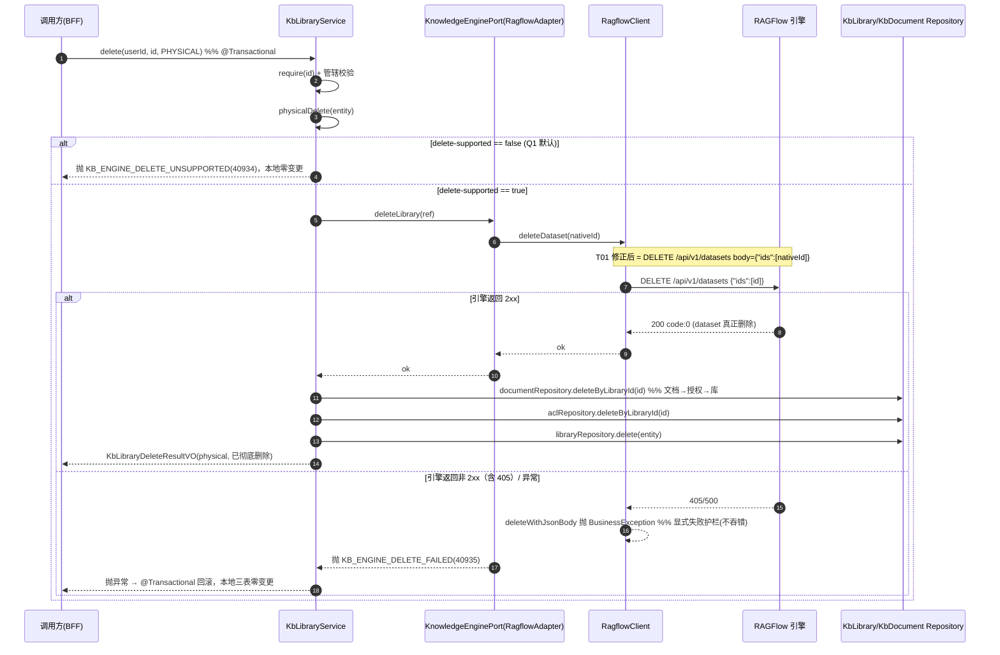
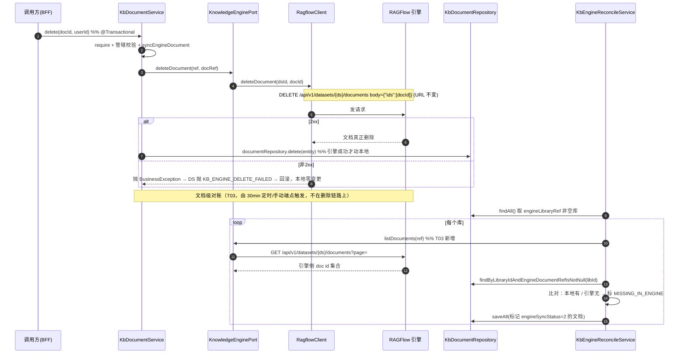
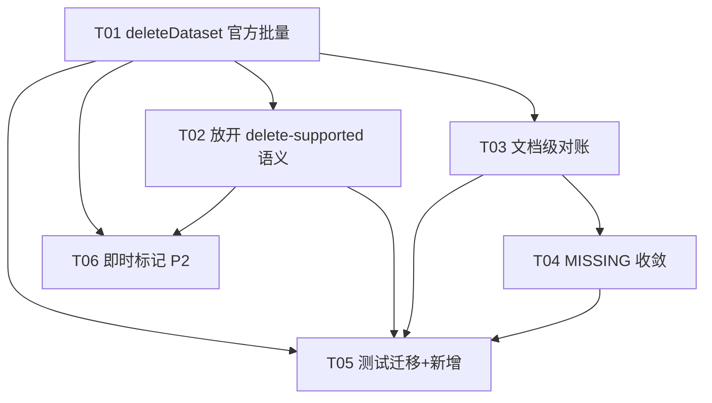

# RAGFlow 删除语义修复与对账补强 — 增量架构设计

- 文档类型：**增量架构设计 + 任务分解**（基于已有增量 PRD 与只读审计报告）
- 编写人：software-architect（架构师 高见远）
- 日期：2026-08-12
- 关联文档：
  - 增量 PRD：`deliverables/software-company/ragflow-physical-delete-prd-2026-08-12.md`
  - 只读审计报告：`deliverables/software-company/ragflow-delete-audit-2026-08-12.md`
- 代码核实范围：`backend/mis-kb` 全部引用文件已实际打开核对（见 §2 证据与行号）。

---

## 0. 设计要点速览（给主理人）

| 项 | 决策 |
|---|---|
| 库删除 URL | `RagflowClient.deleteDataset` 由 `DELETE /api/v1/datasets/{id}`（单 id 路径）改为官方批量 `DELETE /api/v1/datasets` + body `{"ids":[datasetId]}`，与 `deleteDocument` 完全同构 |
| 显式失败护栏 | **原样保留** `deleteWithJsonBody` 对非 2xx 抛 `BusinessException`，不回退「假成功吞错」 |
| `delete-supported` 默认值（Q1） | **2026-08-12 用户拍板：默认 `true`（开箱即物理删）**，配置键 `mis.kb.engine.delete-supported` 保留供部署关回 `false`（关回后物理删被拒 40934、只能归档）；开关回归「是否允许业务物理删」本意 |
| 库级后台对账 | **保留** 30min 定时 + 手动端点，能力不回退 |
| 文档级对账（Q3） | **本期实现（P1）**，扩展 `KbEngineReconcileService.reconcileDocuments()`，新增 `kb_document.engine_sync_status/engine_checked_at/engine_missing_since` 三列 |
| 单边删除收敛（Q4 残余） | 库级 `kb_library` 加 `engine_missing_since`；连续 N 次（默认 ≥2）`MISSING_IN_ENGINE` 后默认**人工清理端点**收敛，可选 `auto-clean-missing=true` 自动软删库 |
| 事务边界（Q4） | 维持「引擎先删、本地后删」顺序；引擎成功但本地失败 → 本地 `@Transactional` 回滚 + 引擎残留由后台对账标 `MISSING_IN_ENGINE` 收敛；**不做补偿式重发** |
| 对账时效（Q2） | 本期**仅保留后台定时 30min + 手动端点**；即时标记（P2-1）留 P2 可选 |
| 405 契约测试 | **平滑迁移**：路径断言由 `/api/v1/datasets/ds-1` 改为 `/api/v1/datasets` + body 含 `"ids":"ds-1"`；「405 必须显式抛异常、绝不吞错」的契约意图**完全不变** |

---

## 1. 实现方案 + 框架选型

### 1.1 难点分析

1. **库删除调用形态错误（根因）**：`RagflowClient.deleteDataset`（`RagflowClient.java#L265`）走非官方单 id 路径 `DELETE /api/v1/datasets/{id}`，本实例实测 405。文档删除（`deleteDocument`，`#L563`）已是官方集合+body 形态且正常。修复只需让库删除与文档删除同构。
2. **`delete-supported` 拦截语义回归**：当前该开关因 URL 写错而被迫默认 `false` 当「防 405 兜底」。URL 修正后，开关应回归「是否允许业务物理删」的本意——默认仍 `false`，部署确认后放开。
3. **对账只标记不清理（缺口 A）**：库级 `MISSING_IN_ENGINE` 本地残留无收敛路径，需新增「连续 N 次 → 软删本地/人工清理」。
4. **文档级对账完全缺失（缺口 B/C）**：`kb_document.engine_document_ref` 从未与引擎 `listDocuments` 比对，需新增文档级 reconcile。

### 1.2 框架 / 库选型

**沿用现有 `mis-kb` 技术栈，无新框架、无新第三方依赖**：

- 语言/框架：Java 17 + Spring Boot + Spring Data JPA（Flyway 管 DDL）。
- 引擎 HTTP 客户端：现有 `org.springframework.web.client.RestClient`（`RagflowClient` 已封装）。
- 定时任务：现有 `@Scheduled` + ShedLock（`KbEngineReconcileService` 已用）。
- 测试：现有 JUnit 5 + Mockito（`RagflowDeleteHttpTest` 用 JDK `HttpServer` 起假 RAGFlow，无需新依赖）。
- DDL 变更：沿用现有 Flyway 迁移（`V12/V23/V30` 既有风格），新增一条迁移加列。

> 结论：**依赖包列表为空（无新增）**，见 §6。

### 1.3 架构模式

保持现有分层（Controller → Service(@Transactional) → Repository / EnginePort(适配器) → RagflowClient）。文档级对账**扩展**既有 `KbEngineReconcileService`（而非新建 service），复用其 30min 定时、`@SchedulerLock`、手动端点与报告缓存，避免重复调度基础设施。

---

## 2. 文件列表及相对路径（新增 / 修改）

> 所有路径相对仓库根 `d:/code/mis-platform`。**本设计不修改任何源码**，下表为工程师落地时的改动清单。

### 2.1 新增文件

| 路径 | 说明 |
|---|---|
| `backend/mis-kb/src/main/java/com/mis/kb/domain/model/EngineDocumentBrief.java` | 引擎文档摘要 DTO（`id`/`name`），供文档级对账比对 |
| `backend/mis-kb/src/main/resources/db/migration/V<next>__kb_engine_sync_status_doc.sql` | DDL：给 `kb_document` 加 `engine_sync_status`(int,默认0)、`engine_checked_at`(timestamp)、`engine_missing_since`(timestamp,可空)；给 `kb_library` 加 `engine_missing_since`(timestamp,可空) |
| `backend/mis-kb/src/test/java/com/mis/kb/domain/service/KbEngineDocumentReconcileTest.java` | 文档级对账单测（T03） |
| `backend/mis-kb/src/test/java/com/mis/kb/domain/service/KbEngineReconcileConvergenceTest.java` | 连续 `MISSING_IN_ENGINE` 收敛单测（T04） |

### 2.2 修改文件

| 路径 | 改动点 | 对应任务 |
|---|---|---|
| `backend/mis-kb/src/main/java/com/mis/kb/engine/RagflowClient.java` | `deleteDataset` 改官方批量 `DELETE /api/v1/datasets` + `{"ids":[...]}`，复用 `deleteWithJsonBody`；保留显式失败护栏 | T01 |
| `backend/mis-kb/src/main/java/com/mis/kb/engine/RagflowAdapter.java` | 新增 `listDocuments(EngineLibraryRef)`（翻页调 `client.listDocuments`，同 `listLibraries`）；`deleteLibrary` 无需改（已调 `client.deleteDataset`，T01 后自动发批量 URL） | T03 |
| `backend/mis-kb/src/main/java/com/mis/kb/engine/KnowledgeEnginePort.java` | 新增 `default List<EngineDocumentBrief> listDocuments(EngineLibraryRef ref)`（默认返回空列表，noop/mock 零改动） | T03 |
| `backend/mis-kb/src/main/java/com/mis/kb/domain/entity/KbDocument.java` | 新增 `engineSyncStatus`/`engineCheckedAt`/`engineMissingSince` 字段及 getter/setter | T03/T04 |
| `backend/mis-kb/src/main/java/com/mis/kb/domain/entity/KbLibrary.java` | 新增 `engineMissingSince` 字段及 getter/setter | T04 |
| `backend/mis-kb/src/main/java/com/mis/kb/domain/service/KbLibraryService.java` | T02：保留 `delete-supported` 闸门（不移除），更新 javadoc 明确「URL 已官方化，开关=破坏性删除显式放行」；T04 收敛时复用 `archive` 的软删语义 | T02/T04 |
| `backend/mis-kb/src/main/java/com/mis/kb/domain/service/KbEngineReconcileService.java` | T03：新增 `reconcileDocuments()`；T04：`reconcile()` 内维护 `engineMissingSince`，末尾调用 `convergeMissing()`（自动模式）；手动端点也调用 | T03/T04 |
| `backend/mis-kb/src/main/java/com/mis/kb/domain/model/EngineReconcileReport.java` | 增加文档级缺失计数与明细（`documentMissingInEngine` count + list），`rebuildFromDb()` 同步 | T03 |
| `backend/mis-kb/src/main/java/com/mis/kb/domain/repository/KbDocumentRepository.java` | 新增 `findByLibraryIdAndEngineDocumentRefIsNotNull(libraryId)`、`findByEngineSyncStatusAndEngineMissingSinceBefore(status, instant)`、`@Modifying` 删除孤儿文档方法 | T03/T04 |
| `backend/mis-kb/src/main/java/com/mis/kb/engine/RagflowProperties.java` | `Reconcile` 内新增 `missingInEngineThreshold`(默认 2)、`autoCleanMissing`(默认 false)；`deleteSupported` 维持现状（默认 false），仅 T02 文档说明 | T04 |
| `backend/mis-kb/src/main/java/com/mis/kb/api/controller/EngineConfigController.java` | 手动对账端点 `runReconcile()` 串接文档级对账；新增 `POST /internal/v1/kb/engine/cleanup-missing`（人工收敛，库+文档） | T03/T04 |
| `backend/mis-kb/src/main/java/com/mis/kb/api/dto/KbEngineReconcileVO.java` | `Counts` 增加文档缺失计数；新增 `DocumentMissingItem` 明细；`from()` 映射 | T03 |
| `backend/mis-kb/src/test/java/com/mis/kb/engine/RagflowDeleteHttpTest.java` | **T05 必改**：`deleteDataset405Throws` 与 `deleteDataset2xxSucceeds` 断言迁移到新批量 URL+body，保留「显式失败不吞错」契约 | T05 |
| `backend/mis-kb/src/test/java/com/mis/kb/domain/service/KbLibraryServiceDeleteTest.java` | T05：保留 `shouldRejectWhenDeleteUnsupported`(delete-supported=false→40934)、`shouldRollbackWhenEngineDeleteFails`(本地零变更) 等护栏用例；不破 | T05 |

---

## 3. 数据结构与接口（类图 mermaid）

```mermaid
classDiagram
    %% ===== 引擎客户端层 =====
    class RagflowClient {
        -RestClient client
        -String apiKey
        +createDataset(name) String
        +deleteDataset(datasetId) void   %% T01: 改 DELETE /api/v1/datasets + {"ids":[id]}
        +deleteDocument(dsId, docId) void
        +listDatasets(page, size) List~RfDataset~
        +listDocuments(dsId, page, size) List~RfDocument~
        -deleteFor(uri, prefix) void      %% 无 body，非2xx抛异常
        -deleteWithJsonBody(uri, body, prefix) void  %% 有 body，非2xx抛异常(显式失败护栏)
    }

    class RagflowAdapter {
        +deleteLibrary(ref) void          %% 调 client.deleteDataset
        +deleteDocument(ref, docRef) void
        +listLibraries() List~EngineLibraryBrief~
        +listDocuments(ref) List~EngineDocumentBrief~  %% T03 新增
    }

    class KnowledgeEnginePort {
        <<interface>>
        +deleteLibrary(ref) void
        +deleteDocument(ref, docRef) void
        +listLibraries() List~EngineLibraryBrief~
        +listDocuments(ref) List~EngineDocumentBrief~  %% T03 新增 default
    }

    %% ===== 领域实体（含 T03/T04 新增字段）=====
    class KbLibrary {
        +Long id
        +String engineLibraryRef
        +Integer engineSyncStatus   %% 0未知/1一致/2引擎缺失/3漂移
        +Instant engineCheckedAt
        +Instant engineMissingSince  %% T04 新增: 首次标记MISSING_IN_ENGINE时刻
        +isArchived() boolean
    }

    class KbDocument {
        +Long id
        +Long libraryId
        +String engineDocumentRef
        +Integer engineSyncStatus    %% T03 新增: 复用EngineSyncStatus枚举
        +Instant engineCheckedAt     %% T03 新增
        +Instant engineMissingSince  %% T04 新增
    }

    class KbEngineOrphan {
        +Long id
        +String nativeId
        +Integer resolved
        +String resolvedAction
    }

    class EngineDocumentBrief {
        <<DTO>>
        +String id
        +String name
    }

    %% ===== 领域服务 =====
    class KbLibraryService {
        -RagflowProperties engineProperties
        +delete(userId, id, mode) KbLibraryDeleteResultVO  %% @Transactional
        -archive(entity) KbLibraryDeleteResultVO
        -physicalDelete(entity) KbLibraryDeleteResultVO   %% T02: 保留 delete-supported 闸门
    }

    class KbDocumentService {
        +delete(id, userId) void       %% @Transactional, 引擎成功才动本地
    }

    class KbEngineReconcileService {
        -RagflowProperties engineProperties
        +scheduledReconcile() void     %% @Scheduled 30min + ShedLock
        +reconcile() EngineReconcileReport
        +reconcileDocuments() void     %% T03 新增: 文档级对账
        -convergeMissing() void        %% T04 新增: 连续N次MISSING→收敛
        -upsertOrphans(...) void
    }

    class KbEngineOrphanService {
        +list(engineType, resolved) List
        +resolve(...) KbEngineOrphanResolveResult
    }

    class EngineConfigController {
        +runReconcile() Result~VO~          %% T03: 串接文档级对账
        +reconcileReport() Result~VO~
        +cleanupMissing() Result~VO~        %% T04 新增: 人工收敛端点
    }

    %% ===== 仓储 =====
    class KbLibraryRepository
    class KbDocumentRepository {
        +findByLibraryIdOrderByCreatedAtDesc(libraryId) List
        +findByLibraryIdAndEngineDocumentRefIsNotNull(libraryId) List  %% T03
        +findByEngineSyncStatusAndEngineMissingSinceBefore(s, inst) List  %% T04
        +deleteByLibraryId(libraryId) void
    }
    class KbEngineOrphanRepository

    class EngineReconcileReport {
        <<record>>
        +Counts counts
        +List~MissingInEngine~ missingInEngine
        +List~DocumentMissingInEngine~ documentMissingInEngine  %% T03 新增
    }

    class RagflowProperties {
        -boolean deleteSupported = false   %% Q1: 保持false, 部署配置放开
        -Reconcile reconcile
    }
    class RagflowProperties.Reconcile {
        -boolean enabled = true
        -long intervalMs = 1800000
        -int missingInEngineThreshold = 2   %% T04 新增
        -boolean autoCleanMissing = false    %% T04 新增
    }

    %% ===== 关系 =====
    RagflowAdapter ..|> KnowledgeEnginePort
    RagflowAdapter --> RagflowClient
    KbLibraryService --> KnowledgeEnginePort
    KbDocumentService --> KnowledgeEnginePort
    KbEngineReconcileService --> KnowledgeEnginePort
    KbEngineReconcileService --> KbLibraryRepository
    KbEngineReconcileService --> KbDocumentRepository
    KbEngineReconcileService --> KbEngineOrphanRepository
    KbEngineReconcileService --> EngineReconcileReport
    KbEngineOrphanService --> KbEngineOrphanRepository
    KbEngineOrphanService --> KbLibraryRepository
    EngineConfigController --> KbEngineReconcileService
    EngineConfigController --> KbEngineOrphanService
    RagflowAdapter --> KbDocumentRepository
    RagflowClient ..> EngineDocumentBrief : 返回
    KbLibrary "1" --> "0..*" KbDocument : libraryId
    EngineReconcileReport --> KbLibrary : 标记engineSyncStatus
    EngineReconcileReport --> KbDocument : 标记engineSyncStatus(T03)
    RagflowProperties <.. KbLibraryService : isDeleteSupported()
```

---

## 4. 程序调用流程（时序图 mermaid）

### 4.1 库物理删除全流程（URL 修正 + 事务边界 + 显式失败回滚）



> **事务边界（Q4）关键点**：引擎 HTTP 删除在 `@Transactional` 方法内但**不参与 DB 回滚范围**。若引擎成功、但本地 `libraryRepository.delete` 抛异常 → 本地事务回滚（本地行保留）、引擎 dataset 已真删 → 该库后续被对账标 `MISSING_IN_ENGINE`，由 T04 收敛。详见 §8 Q4。

### 4.2 文档删除 + 文档级对账触发



---

## 5. 任务列表（有序、含依赖、按实现顺序）

> 任务 T01–T06 按依赖编排；测试任务 T05 需在 T01/T02/T03/T04 之后，但可与实现并行补。

### T01 — `RagflowClient.deleteDataset` 改官方批量接口
- **源文件**：`RagflowClient.java`
- **改动**：`deleteDataset(String datasetId)` 由 `deleteFor("/api/v1/datasets/" + datasetId, ...)` 改为构造 `Map{"ids": List.of(datasetId)}` 调 `deleteWithJsonBody("/api/v1/datasets", body, "RAGFlow 删除知识库失败")`，与 `deleteDocument` 完全同构。
- **护栏（必须保留）**：`deleteWithJsonBody` 对非 2xx / `code!=0` 一律抛 `BusinessException`——**不回退**到旧版 `toBodilessEntity` 吞错的「假成功」。
- **依赖**：无
- **优先级**：P0

### T02 — `KbLibraryService.physicalDelete` 放开 `delete-supported` 拦截（语义回归）
- **源文件**：`KbLibraryService.java`、`RagflowProperties.java`（仅文档/注释）
- **改动**：**保留** `if (!engineProperties.isDeleteSupported())` 首道闸门（不移除——它是破坏性删除的显式放行开关）。更新 `physicalDelete` javadoc：URL 已官方化，开关回归「是否允许业务物理删」本意。默认 `deleteSupported=false`（见 Q1），由部署配置 `mis.kb.engine.delete-supported=true` 放开。
- **依赖**：T01
- **优先级**：P0

### T03 — 文档级对账（新增 `reconcileDocuments`）
- **源文件**：`KnowledgeEnginePort.java`(新增 `listDocuments` default)、`RagflowAdapter.java`(实现 `listDocuments` 翻页)、`KbEngineReconcileService.java`(新增 `reconcileDocuments()`)、`EngineReconcileReport.java`(加文档缺失计数/明细)、`KbDocument.java`(加 3 字段)、`KbDocumentRepository.java`(加查询方法)、`KbEngineReconcileVO.java`(映射)、`EngineConfigController.java`(`runReconcile` 串接)、DDL 迁移文件、`EngineDocumentBrief.java`(新增 DTO)
- **改动**：`reconcileDocuments()` 遍历 `engineLibraryRef` 非空库，按 `listDocuments` 拉引擎 doc id 集合，与本地 `kb_document.engine_document_ref` 比对，本地有/引擎无 → `kb_document.engine_sync_status=2`(MISSING_IN_ENGINE) + `engine_checked_at=now`；一致 → `=1`。复用 `EngineSyncStatus` 枚举与 `type!=ragflow → skipped` 护栏。报告增加文档级计数与明细。
- **依赖**：T01（同引擎客户端基础设施）；DDL 先行
- **优先级**：P1

### T04 — `MISSING_IN_ENGINE` 本地残留收敛路径
- **源文件**：`KbLibrary.java`(加 `engineMissingSince`)、`KbDocument.java`(加 `engineMissingSince`)、`KbEngineReconcileService.java`(`reconcile()` 内维护 `engineMissingSince` + 末尾 `convergeMissing()`)、`RagflowProperties.java`(`missingInEngineThreshold=2`、`autoCleanMissing=false`)、`KbLibraryService.java`(复用 archive 软删语义)、`KbDocumentRepository.java`(加 `findByEngineSyncStatusAndEngineMissingSinceBefore` + 删除方法)、`EngineConfigController.java`(新增 `POST /cleanup-missing` 人工端点)
- **改动**：
  - 标记 `MISSING_IN_ENGINE` 时若 `engineMissingSince==null` 置 `now`；变为一致时清空。
  - `convergeMissing()`：筛 `engineSyncStatus=2 AND engineMissingSince <= now - N*intervalMs`：
    - **库**：`autoCleanMissing=true` 时自动置 `status=0`+`archivedAt=now`（可逆软删）；否则仅留待人工。
    - **文档**：引擎 doc 已不存在，本地行无用；`autoCleanMissing=true` 时直接物理删 `kb_document` 孤儿行，否则留待人工端点 `cleanup-missing` 删除。
  - 人工端点 `POST /internal/v1/kb/engine/cleanup-missing`：显式收敛当前所有达阈值的库/文档残留（安全、显式、不自动）。
- **依赖**：T03（依赖文档级状态字段）；DDL 先行
- **优先级**：P1

### T05 — 测试：平滑迁移 405 钉死测试 + 新增对账/收敛测试
- **源文件**：`RagflowDeleteHttpTest.java`、`KbLibraryServiceDeleteTest.java`、`KbEngineDocumentReconcileTest.java`(新增)、`KbEngineReconcileConvergenceTest.java`(新增)
- **改动（详见 §7 平滑迁移说明）**：
  - `deleteDataset405Throws`：断言由 `lastPath=="/api/v1/datasets/ds-1"` 改为 `lastPath=="/api/v1/datasets"` 且 `lastBody` 含 `"ids"` 与 `"ds-1"`；保留 `assertThrows(BusinessException)` + 消息含「删除知识库」+「405」。**契约意图（405 显式抛、不吞错）不变。**
  - `deleteDataset2xxSucceeds`：`lastPath` 改 `/api/v1/datasets`，body 含 `ids`。
  - `KbLibraryServiceDeleteTest`：保留 `shouldRejectWhenDeleteUnsupported`(delete-supported=false→40934、本地零接触)、`shouldRollbackWhenEngineDeleteFails`(三表零变更) —— **不破**。
  - 新增文档级对账单测（T03）+ 收敛单测（T04）。
- **依赖**：T01、T02、T03、T04
- **优先级**：P0（护栏回归）

### T06（可选 P2）— 删除链路即时标记
- **源文件**：`KbLibraryService.java`、`KbDocumentService.java`（可选增强）
- **改动**：在 `physicalDelete`/`delete` 成功后，除后台定时对账外，额外即时把本地 `engine_sync_status` 标「待引擎确认」。**鉴于删除链路已是同步 + 事务模型（引擎成功即知、失败即抛），即时标记的边际价值有限**，建议留 P2；若做，仅作「缩短漂移可见时延」的锦上添花，不引入新失败分支。
- **依赖**：T01、T02
- **优先级**：P2

### 任务依赖图



---

## 6. 依赖包列表

**无新增依赖**。本增量完全复用现有 `mis-kb` 技术栈：

- `org.springframework.boot:spring-boot-starter-web`（含 `RestClient`）—— 已存在
- `org.springframework.boot:spring-boot-starter-data-jpa` + Flyway —— 已存在
- `net.javacrumbs.shedlock:shedlock-spring` —— 已存在（定时互斥）
- `org.springframework.boot:spring-boot-starter-test` + JUnit 5 + Mockito —— 已存在（测试）
- JDK `com.sun.net.httpserver.HttpServer` —— JDK 内置（`RagflowDeleteHttpTest` 起假 RAGFlow）

> 配置新增项（非依赖，仅 `application.yml`/`RagflowProperties`）：
> - `mis.kb.engine.delete-supported`（**已存在**，默认 `false`，Q1 建议保持）
> - `mis.kb.engine.reconcile.missing-in-engine-threshold`（T04 新增，默认 `2`）
> - `mis.kb.engine.reconcile.auto-clean-missing`（T04 新增，默认 `false`）

---

## 7. 共享知识（跨文件约定）

1. **URL 形态（铁律）**
   - 库删除：`DELETE /api/v1/datasets`，JSON body `{"ids":[datasetId]}`（**集合端点 + ids body，非路径参数**）。
   - 文档删除：`DELETE /api/v1/datasets/{ds}/documents`，JSON body `{"ids":[docId]}`（**不变**，审计已确认是官方形态）。
   - 列表文档：`GET /api/v1/datasets/{ds}/documents?page=&page_size=`。

2. **ids body 结构**：统一 `{"ids": [<原生id>]}`，`Content-Type: application/json`；空/缺 ids 部分版本会被当成「删库内全部文档」，绝不可发空列表。

3. **显式失败护栏（必须保留，Q4 核心）**：`deleteFor` / `deleteWithJsonBody` 对任意非 2xx 一律抛 `BusinessException`，**绝不回退**到「假成功吞错」旧行为。删除链路中引擎失败即抛、本地零变更。

4. **事务边界约定**：`physicalDelete` / `KbDocumentService.delete` 的引擎 HTTP 调用在 `@Transactional` 内但**不在 DB 回滚范围内**。约定顺序：**引擎先删成功 → 再删本地三表/文档**；引擎失败即抛 → 本地零变更（回滚）。例外残余（引擎成功/本地失败）交后台对账收敛（T04），**不做补偿式重发**。

5. **`delete-supported` 开关语义**：=「是否允许业务物理删」显式放行；默认 `false`，仅 `type=ragflow` 且部署确认后翻 `true`。`type=noop/mock` 时物理删/对账一律跳过（护栏不变）。

6. **对账护栏**：`KbEngineReconcileService` 入口第一行 `type != ragflow → skipped`（noop/mock 的 `listLibraries/listDocuments` 返回空，放行进比对会把全库判成缺失）。文档级对账同样复用该护栏。

7. **status 枚举复用**：`kb_document.engine_sync_status` 与 `kb_library.engine_sync_status` 共用 `EngineSyncStatus`（0 未知 / 1 一致 / 2 引擎缺失 / 3 名称漂移或同步失败）。

8. **敏感信息红线**：对账报告中的 `engineLibraryRef` / `nativeId` 属 F8 红线，只经 `kb:engine:reconcile` 权限码保护的端点透出。

---

## 8. 待明确事项：Q1–Q4 技术建议与默认值

### Q1 — `delete-supported` 默认值与放开策略

> **【2026-08-12 用户拍板（覆盖本建议）】**：默认 `true`（开箱即物理删），配置键 `mis.kb.engine.delete-supported` 保留供部署关回 `false`。实现 `RagflowProperties#L50`、`application.yml` 已按用户拍板落地为 `true`。

- **原建议（已被用户拍板覆盖）**：默认保持 `false`，由部署配置控制，经确认后翻 `true`。
- **配置键**：`mis.kb.engine.delete-supported`（Nacos/yml 热调，已存在于 `RagflowProperties.java#L48`）。
- **理由**：回归开关本意（是否允许不可逆的业务物理删），避免默认即「彻底销毁知识库（含 chunks）」。URL 修正后，放开开关即真正生效，无需改代码分支（`RagflowAdapter.capabilities()` 已据该值声明 `delete` 能力）。
- **落地**：T02 保留 `physicalDelete` 首道闸门；前端据 `capabilities().deleteSupported` 置灰/提示。运维在 Nacos 翻 `true` 并经产品确认后，库物理删链路打通。

### Q2 — 对账时效策略

- **建议：本期仅保留后台定时（30min `@Scheduled` + ShedLock）+ 手动端点 `runReconcile()`，不接入删除链路即时标记。**
- **理由**：即时标记（P2-1）在现有「同步 + 事务」删除模型下边际价值有限（引擎成功即已知、失败即抛回滚）；接入会增加删除链路复杂度与失败分支。先以「库级保留 + 文档级补齐（T03）」闭环，即时标记留 P2（T06）。
- **后续**：若监控发现 30min 漂移可见时延不可接受，再升 P2 在 `physicalDelete`/`delete` 成功后即时标 `engine_sync_status`。

### Q3 — 文档级对账本期是否实现

- **建议：本期实现（P1，即 T03）。**
- **理由**：审计明确该缺口「当前完全不可见」，且文档删除已是广泛使用的真实物理删——「引擎 doc 被外部删/改名、本地仍记录」会持续向用户展示不存在的文档。实现成本可控（扩展 `KbEngineReconcileService` + 加 3 列 + 翻页 `listDocuments`），回归风险低（仅新增比对分支，不动删除链路）。

### Q4 — 事务边界与残留处置策略

- **核心问题**：引擎 HTTP 删除成功、本地 DB 写失败时的残留处置——「回滚重发引擎删除」还是「标记本地待人工 / 仅依赖后台对账收敛」？
- **建议（推荐方案 B：依赖后台对账收敛，不做补偿式重发）**：
  1. **维持现有顺序**：`physicalDelete` 内「引擎先删成功 → 再删本地三表（`documentRepository.deleteByLibraryId` → `aclRepository.deleteByLibraryId` → `libraryRepository.delete`）」。该顺序保证**主目标**（引擎侧 dataset 真正消失、彻底释放存储）在任何失败下都优先达成。
  2. **引擎成功 / 本地失败 → 本地 `@Transactional` 回滚**（本地行保留、引擎已删）= 产生「引擎无 / 本地有」漂移。这正是 `MISSING_IN_ENGINE` 场景，由 **T03/T04 的对账 + 连续 N 次收敛** 可靠清理。本地短暂残留是可控、自愈的不一致。
  3. **不做「补偿式重发引擎删除」**：引擎删除不在 DB 事务回滚范围内（HTTP 调用无法 undo），且数据集已真删，重发要么幂等成功要么报「不存在」——既无意义又增加复杂分支。
  4. **补充稳定性建议（非强制）**：为让「引擎已删、本地事务回滚后重试」可幂等收敛，建议 `deleteDataset` 对 RAGFlow 返回「dataset 不存在」(如 404 / code:100 特定 message) 视为成功（已删除=目标达成）。这能避免重试物理删时因「找不到 dataset」再次失败。
- **备选（方案 A：本地先删、引擎后删）不推荐**：若本地先提交成功、引擎后删失败，则出现「MIS 已删、引擎仍留敏感数据」——违背用户「彻底释放存储、避免敏感知识被意外恢复」的首要目标，故否决。

---

## 9. 现有 405 钉死测试的平滑迁移说明（约束落实）

现有 `RagflowDeleteHttpTest.Delete405.deleteDataset405Throws`（`RagflowDeleteHttpTest.java#L106`）钉死的不是「路径 `/api/v1/datasets/ds-1`」本身，而是**「`deleteDataset` 遇非 2xx 必须显式抛 `BusinessException`、绝不吞成假成功」这一契约**。URL 形态变化只是该契约的载体，迁移时契约意图必须完整保留。

### 9.1 假 RAGFlow 的行为不变

`RagflowDeleteHttpTest` 的 `setUp()`（#L65）对所有 `DELETE` 默认回 **405 + `{"code":100,"message":"Method Not Allowed"}`**（`deleteReturns405=true` 默认）。T01 后 `deleteDataset` 改为 `DELETE /api/v1/datasets` + body，仍命中这个 405 分支 → `deleteWithJsonBody` 仍抛 `BusinessException`。**所以「抛异常」这一断言天然继续成立。**

### 9.2 断言需随之调整（仅路径/body 形状，意图不变）

| 断言项 | 改前（T01 前） | 改后（T01 后，新官方批量） |
|---|---|---|
| `lastMethod` | `"DELETE"` | `"DELETE"`（不变） |
| `lastPath` | `"/api/v1/datasets/ds-1"` | **`"/api/v1/datasets"`**（无 `{id}` 路径参数） |
| `lastBody` | （无 body） | **含 `"ids"` 且含 `"ds-1"`**（验证批量 body） |
| `lastAuth` | `"Bearer "+API_KEY` | 不变 |
| 异常类型 | `assertThrows(BusinessException)` | 不变 |
| 消息含「删除知识库」 | 是 | 是（`deleteWithJsonBody` 的 `failurePrefix` 仍为「RAGFlow 删除知识库失败」） |
| 消息含「405」 | 是 | 是（`deleteWithJsonBody` 异常 message 含 `HTTP 405 ...`） |

### 9.3 同步迁移 `deleteDataset2xxSucceeds`（#L159）

该用例 `deleteReturns405.set(false)` 后期望 2xx 成功：
- `lastPath` 由 `"/api/v1/datasets/ds-1"` → `"/api/v1/datasets"`；
- 新增断言 `lastBody` 含 `"ids"` 与 `"ds-1"`，与文档删除同构验证。

### 9.4 不破坏现有契约测试的结论

- `KbLibraryServiceDeleteTest`（Mockito 纯单测）只验证 `enginePort.deleteLibrary(...)` 被调用 / 不被调用，**不直接断言 HTTP 路径**，故 T01 对其零影响；`shouldRejectWhenDeleteUnsupported`(delete-supported=false→40934、本地零接触)、`shouldRollbackWhenEngineDeleteFails`(三表零变更) 等护栏用例**必须且能够原样保留**。
- HTTP 层 `RagflowDeleteHttpTest` 仅调整 `lastPath`/`lastBody` 两个断言常量，异常契约（显式失败、不吞错）逐字保留——**现有契约测试不被破坏，只是从「钉死单 id 路径 405」升级为「钉死官方批量 URL + body 且 405 显式抛」**。

---

## 附：关键证据索引（本次设计核实）

- 库删除单 id 路径 405：`RagflowClient.java#L265`、`#L593`；注释 `#L248`~`#L267`
- 文档删除官方集合+body：`RagflowClient.java#L563`、`#L615`；`RagflowAdapter.java#L502`
- 显式失败护栏：`RagflowClient.java#L593`(deleteFor)、`#L615`(deleteWithJsonBody)
- `delete-supported` 默认 false：`RagflowProperties.java#L48`；`KbLibraryService.java#L384` 首道闸门
- 库物理删三表顺序：`KbLibraryService.java#L403`~`#L407`
- 库级对账四类判定 & 30min 定时：`KbEngineReconcileService.java#L99`(scheduled)、`#L127`(reconcile)、`#L156`(MISSING)、`#L181`(orphan)
- 孤儿仅 dataset 级、仅人工：`KbEngineOrphanService.java#L118`、`KbEngineOrphan.java`
- 文档级对账缺失：全仓无 `reconcileDocuments` / 文档级 sync 字段
- 405 测试钉死：`RagflowDeleteHttpTest.java#L106`、`#L142`、`#L159`；`KbLibraryServiceDeleteTest.java#L153`(回滚护栏)
