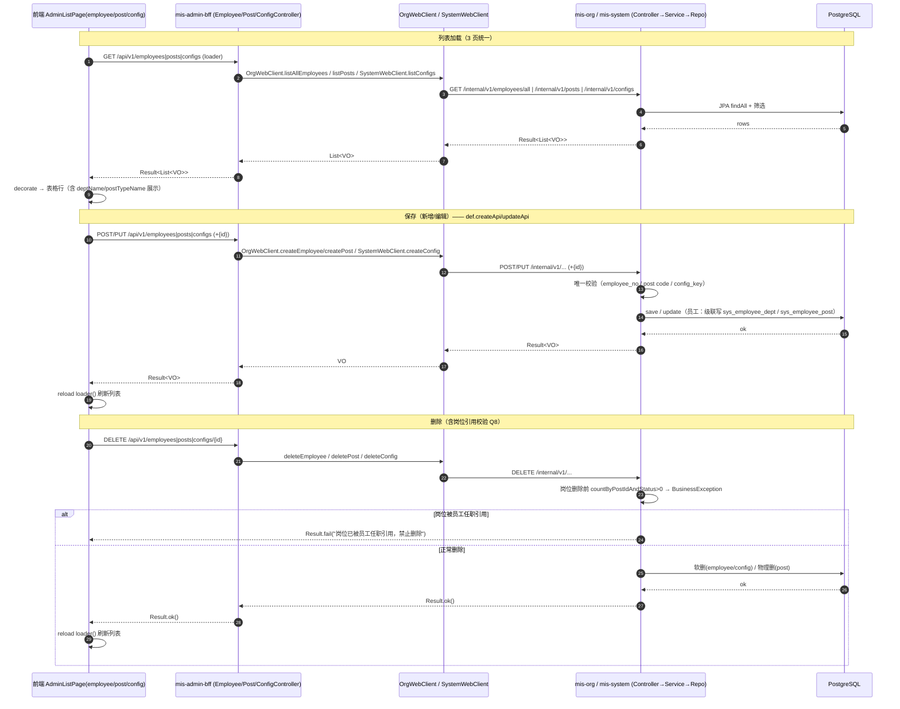
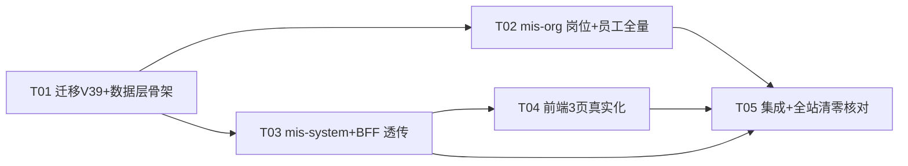

# MIS 系统管理三页示例数据真实化（全站 sample 清零）——系统设计 + 任务分解

- **作者**：Bob（架构师）
- **日期**：2026-08-12
- **类型**：增量设计（基于 PRD `deliverables/software-company/system-real-data-prd-2026-08-12.md`）
- **项目名**：`system_sample_clear`
- **上游**：PRD（Alice）+ 主理人 Q&A 拍板（Q1-Q8）+ PM 现状盘点（已逐项读码核实）
- **设计原则**：沿用既有分层与惯例，不引入新框架；Flyway 只追加；BFF 透传沿用 OrgWebClient/SystemWebClient 模式；前端沿用 features/system 的 loader + page-defs 机制（含上一轮未提交的 deptOptionsLoader/optionsFrom 机制）。

---

## Part A：系统设计

### 1. 实现方案与框架选型

#### 1.1 核心难点

| 难点 | 现状 | 方案 |
|---|---|---|
| 员工页无真实数据 | mis-org 内部 CRUD 完整，但 BFF 仅透传 `GET /api/v1/employees?deptId=`（强制 deptId、强制 status=1） | 新增内部全量列表端点 + BFF 补齐 5 个端点透传 |
| 岗位页从零建 | `sys_post`/`sys_post_type` 表 + 实体已存在，但无 Controller/Service/TypeRepository/种子 | mis-org 新建 PostController/PostService/SysPostTypeRepository + V39 种子 |
| 系统参数从零建 | `sys_config` 表 + V2 已种 7 条，mis-system 无实体/仓库/服务/控制器 | mis-system 新建 Config 实体/仓库/服务/控制器 + BFF 透传 |
| 权限登记缺失 | `sys_api` 仅登记 `GET /api/v1/employees`（V4:1011）；V9 只建了菜单+按钮码，**按钮未授权给 role 1** | V39 登记岗位/参数/员工写端点 + menu_api 绑定 + 补授 V9 按钮 |
| 前端引擎只读本地 | `AdminListPage.saveForm/removeRow` 只改本地 rows，不调 API | 扩展 `AdminPageDef` 增加 `createApi/updateApi/deleteApi`，引擎保存/删除后 reload loader |
| 部门选项不带 id | 上一轮 BugFix `loadDeptOptions` 用 `{value: node.name}` | 改为 `{value: node.id, label: node.name}`，岗位选项新增 `optionsFrom:'post'` |

#### 1.2 框架选型

- **后端**：Spring Boot 3.2.5 / Java 17 / JPA（Hibernate）/ PostgreSQL，与仓库一致；不引入新依赖。
- **迁移**：Flyway 集中在 `backend/mis-migrator`，从 **V39** 起（V38 为当前最新，已核实）。
- **BFF**：WebClient（`AbstractDownstreamClient` 封装），沿用 `OrgWebClient` / `SystemWebClient` + Facade 透传模式。
- **前端**：React + TS + Vite + shadcn/ui + Tailwind + Zustand，沿用 `features/system` 的 `AdminListPage` 引擎 + `SYSTEM_PAGE_DEFS` 声明式配置。

#### 1.3 架构模式

- **后端**：分层 Controller → Service → JPA Repository，统一 `Result<T>` 包装（`code==0` 成功），业务异常抛 `BusinessException(ResultCode, msg)`。
- **前端**：声明式页面配置（`AdminPageDef`）+ loader 数据源 + 通用引擎渲染；新增 mutation 回调后引擎支持真实 CRUD。
- **归属**：岗位 → **mis-org**（组织架构域，实体/仓库已就绪）；系统参数 → **mis-system**（基础数据域，与 dict 同域）。

---

### 2. 文件清单

> 标注：`新增` / `修改`。路径均相对仓库根 `D:\code\mis-platform`。

#### 2.1 迁移（mis-migrator）

| 文件 | 类型 | 说明 |
|---|---|---|
| `backend/mis-migrator/src/main/resources/db/migration/V39__system_management_real_data.sql` | 新增 | 种子（岗位类型/岗位）+ 权限登记（sys_api/menu_api/按钮补授）+ 幂等写法 |

#### 2.2 后端 mis-org（岗位 + 员工全量列表）

| 文件 | 类型 | 说明 |
|---|---|---|
| `backend/mis-org/src/main/java/com/mis/org/domain/repository/SysPostTypeRepository.java` | 新增 | 岗位类型 JPA 仓库 |
| `backend/mis-org/src/main/java/com/mis/org/service/PostService.java` | 新增 | 岗位 CRUD + 启停 + 筛选 + 删除引用校验 |
| `backend/mis-org/src/main/java/com/mis/org/controller/PostController.java` | 新增 | 内部端点 `/internal/v1/posts`、`/internal/v1/post-types` |
| `backend/mis-org/src/main/java/com/mis/org/dto/PostVO.java` | 新增 | 岗位 VO（含 deptName/postTypeName） |
| `backend/mis-org/src/main/java/com/mis/org/dto/PostTypeVO.java` | 新增 | 岗位类型 VO |
| `backend/mis-org/src/main/java/com/mis/org/dto/PostCreateRequest.java` | 新增 | 岗位创建请求 |
| `backend/mis-org/src/main/java/com/mis/org/dto/PostUpdateRequest.java` | 新增 | 岗位更新请求 |
| `backend/mis-org/src/main/java/com/mis/org/dto/EmployeePostItem.java` | 修改 | 增加 `LocalDate startDate`（映射 `sys_employee_post.start_date`） |
| `backend/mis-org/src/main/java/com/mis/org/dto/EmployeePostVO.java` | 修改 | 增加 `String startDate`（读回展示） |
| `backend/mis-org/src/main/java/com/mis/org/service/EmployeeService.java` | 修改 | 新增 `listAll(tenantId, realName, deptId, status)`；`saveEmployeePosts` 写入 startDate |
| `backend/mis-org/src/main/java/com/mis/org/controller/EmployeeController.java` | 修改 | 新增 `GET /internal/v1/employees/all`（全量+筛选，含禁用） |
| `backend/mis-org/src/main/java/com/mis/org/domain/repository/SysEmployeePostRepository.java` | 修改 | 新增 `long countByPostIdAndStatus(Long postId, Integer status)` 删除引用校验 |
| `backend/mis-org/src/main/java/com/mis/org/service/DeptStaffingService.java` | 修改（P1） | `postTypeName` 硬编码 1/2/3 改为读 `SysPostTypeRepository` |

#### 2.3 后端 mis-system（系统参数）

| 文件 | 类型 | 说明 |
|---|---|---|
| `backend/mis-system/src/main/java/com/mis/system/domain/entity/SysConfig.java` | 新增 | 实体映射 `sys_config`（无 tenant_id，全局） |
| `backend/mis-system/src/main/java/com/mis/system/domain/repository/SysConfigRepository.java` | 新增 | JPA 仓库 + `existsByConfigKey` |
| `backend/mis-system/src/main/java/com/mis/system/service/ConfigService.java` | 新增 | CRUD + `config_key` 唯一校验 |
| `backend/mis-system/src/main/java/com/mis/system/controller/ConfigController.java` | 新增 | 内部端点 `/internal/v1/configs` |
| `backend/mis-system/src/main/java/com/mis/system/dto/ConfigVO.java` | 新增 | 参数 VO |
| `backend/mis-system/src/main/java/com/mis/system/dto/ConfigCreateRequest.java` | 新增 | 创建请求 |
| `backend/mis-system/src/main/java/com/mis/system/dto/ConfigUpdateRequest.java` | 新增 | 更新请求 |

#### 2.4 后端 BFF（mis-admin-bff）

| 文件 | 类型 | 说明 |
|---|---|---|
| `backend/mis-admin-bff/src/main/java/com/mis/adminbff/controller/EmployeeController.java` | 修改 | GET 全量列表（realName/deptId/status 可选）+ GET/{id} + POST + PUT/{id} + DELETE/{id} |
| `backend/mis-admin-bff/src/main/java/com/mis/adminbff/controller/PostController.java` | 新增 | GET/POST `/api/v1/posts`、PUT/DELETE `/api/v1/posts/{id}`、GET `/api/v1/post-types` |
| `backend/mis-admin-bff/src/main/java/com/mis/adminbff/controller/ConfigController.java` | 新增 | GET/POST `/api/v1/configs`、PUT/DELETE `/api/v1/configs/{id}` |
| `backend/mis-admin-bff/src/main/java/com/mis/adminbff/service/OrgFacadeService.java` | 修改 | 员工全量列表/CRUD + 岗位 CRUD + 岗位类型 |
| `backend/mis-admin-bff/src/main/java/com/mis/adminbff/service/ConfigFacadeService.java` | 新增 | 参数 CRUD 透传（对齐 DictFacadeService） |
| `backend/mis-admin-bff/src/main/java/com/mis/adminbff/client/OrgWebClient.java` | 修改 | `listAllEmployees`、post/post-type 方法 |
| `backend/mis-admin-bff/src/main/java/com/mis/adminbff/client/SystemWebClient.java` | 修改 | config CRUD 方法 |
| `backend/mis-admin-bff/src/main/java/com/mis/adminbff/client/model/EmployeeVO.java` | 修改 | 增加 `deptIds`/`primaryDeptId`/`posts` |
| `backend/mis-admin-bff/src/main/java/com/mis/adminbff/client/model/EmployeePostVO.java` | 新增 | 岗位任职 VO |
| `backend/mis-admin-bff/src/main/java/com/mis/adminbff/client/model/PostVO.java` | 新增 | 岗位 VO |
| `backend/mis-admin-bff/src/main/java/com/mis/adminbff/client/model/PostTypeVO.java` | 新增 | 岗位类型 VO |
| `backend/mis-admin-bff/src/main/java/com/mis/adminbff/client/model/ConfigVO.java` | 新增 | 参数 VO |
| `backend/mis-admin-bff/src/main/java/com/mis/adminbff/dto/EmployeeCreateRequest.java` | 新增 | BFF 员工创建请求（含 deptIds/posts） |
| `backend/mis-admin-bff/src/main/java/com/mis/adminbff/dto/EmployeeUpdateRequest.java` | 新增 | BFF 员工更新请求 |
| `backend/mis-admin-bff/src/main/java/com/mis/adminbff/dto/PostCreateRequest.java` | 新增 | BFF 岗位创建请求 |
| `backend/mis-admin-bff/src/main/java/com/mis/adminbff/dto/PostUpdateRequest.java` | 新增 | BFF 岗位更新请求 |
| `backend/mis-admin-bff/src/main/java/com/mis/adminbff/dto/ConfigCreateRequest.java` | 新增 | BFF 参数创建请求 |
| `backend/mis-admin-bff/src/main/java/com/mis/adminbff/dto/ConfigUpdateRequest.java` | 新增 | BFF 参数更新请求 |

#### 2.5 前端 mis-admin-web

| 文件 | 类型 | 说明 |
|---|---|---|
| `frontend/mis-admin-web/src/lib/api/employees.ts` | 新增 | 员工 API（list/get/create/update/delete） |
| `frontend/mis-admin-web/src/lib/api/posts.ts` | 新增 | 岗位 API（list/create/update/delete）+ 岗位类型 API |
| `frontend/mis-admin-web/src/lib/api/configs.ts` | 新增 | 参数 API（list/create/update/delete） |
| `frontend/mis-admin-web/src/types/api.ts` | 修改 | 新增 `EmployeeItem`/`PostItem`/`PostTypeItem`/`ConfigItem`/`EmployeePostItem` |
| `frontend/mis-admin-web/src/features/system/types.ts` | 修改 | `optionsFrom` 扩展 `'post' | 'post-type'`；`AdminPageDef` 增加 `createApi/updateApi/deleteApi` |
| `frontend/mis-admin-web/src/features/system/page-defs.ts` | 修改 | 3 页接 loader + mutation；部门选项带 id；删 sample 死代码；POST_OPTS 移除 |
| `frontend/mis-admin-web/src/features/system/admin-list-page.tsx` | 修改 | saveForm/removeRow 调用 def mutation 并 reload；loader 失败回退空数组+提示（不落 sample） |

#### 2.6 文档

| 文件 | 类型 |
|---|---|
| `docs/backend/system-real-data-design-2026-08-12.md` | 本文件 |
| `docs/backend/system-real-data-class.mermaid` | 类图 |
| `docs/backend/system-real-data-seq.mermaid` | 时序图 |

---

### 3. 数据模型与接口

#### 3.1 数据库表结构（已核实）

**sys_post_type**（V1:114）
| 列 | 类型 | 说明 |
|---|---|---|
| id | BIGINT PK | 种子 1 管理 / 2 技术 / 3 财务 / 4 行政 / 5 运营 |
| tenant_id | BIGINT | 种子 1 |
| code | VARCHAR(64) | `management`/`tech`/`finance`/`admin`/`operation`；uk(tenant_id,code) |
| name | VARCHAR(128) | 管理/技术/财务/行政/运营 |
| sort | INT | 1..5 |
| status | SMALLINT | 1 |
| created_at / updated_at | TIMESTAMPTZ | |

**sys_post**（V1:126）
| 列 | 类型 | 说明 |
|---|---|---|
| id | BIGINT PK | 种子 1-9 |
| tenant_id | BIGINT | 1 |
| dept_id | BIGINT | 种子对齐真实部门 `sys_dept.id=1`（总部） |
| post_type_id | BIGINT | 1-5 |
| code | VARCHAR(64) | `GM`/`RD-D`/`ARCH`/`TECH-C`/`FIN-M`/`AUD-C`/`REG-M`/`RD-M`/`FIN-S` |
| name | VARCHAR(128) | 总经理/研发总监/架构师/技术委员会/财务经理/内审委员/大区总/研发部经理/财务主管 |
| sort | INT | 1..9 |
| status | SMALLINT | 1 |
| deleted | SMALLINT | 0 |
| created_at / updated_at | TIMESTAMPTZ | |

**sys_config**（V1:345）— 全局无 tenant_id
| 列 | 类型 | 说明 |
|---|---|---|
| id | BIGINT PK | V2 已种 1-7 |
| config_key | VARCHAR(128) | uk_config_key 唯一 |
| config_value | TEXT | |
| remark | VARCHAR(512) | |
| created_at / updated_at | TIMESTAMPTZ | |

**sys_employee_post**（V1:143，V11 关联）
| 列 | 类型 | 说明 |
|---|---|---|
| id | BIGINT PK | |
| tenant_id / employee_id / post_id | BIGINT | |
| is_primary | SMALLINT | 1=主岗 |
| start_date / end_date | DATE | **start_date 已存在，本次打通读写** |
| status | SMALLINT | 1 |
| created_at | TIMESTAMPTZ | |

#### 3.2 类图（mermaid classDiagram）

```mermaid
classDiagram
    class SysPost {
        +Long id
        +Long tenantId
        +Long deptId
        +Long postTypeId
        +String code
        +String name
        +Integer sort
        +Integer status
        +Integer deleted
    }
    class SysPostType {
        +Long id
        +Long tenantId
        +String code
        +String name
        +Integer sort
        +Integer status
    }
    class SysConfig {
        +Long id
        +String configKey
        +String configValue
        +String remark
    }
    class SysEmployeePost {
        +Long id
        +Long employeeId
        +Long postId
        +Integer isPrimary
        +LocalDate startDate
        +Integer status
    }
    class SysPostTypeRepository {
        <<interface>>
        +findByTenantIdAndStatus(Long, Integer) List~SysPostType~
    }
    class SysPostRepository {
        <<interface>>
        +findByDeptIdAndStatus(Long, Integer) List~SysPost~
        +existsByDeptId(Long) boolean
    }
    class SysConfigRepository {
        <<interface>>
        +findAllByOrderByIdAsc() List~SysConfig~
        +existsByConfigKey(String) boolean
    }
    class SysEmployeePostRepository {
        <<interface>>
        +countByPostIdAndStatus(Long, Integer) long
        +findByEmployeeIdAndStatus(Long, Integer) List~SysEmployeePost~
    }
    class PostService {
        +list(Long tenantId, Long deptId, Long postTypeId, Integer status) List~PostVO~
        +getById(Long) PostVO
        +create(PostCreateRequest) PostVO
        +update(Long, PostUpdateRequest) PostVO
        +delete(Long) void
        +listTypes(Long tenantId) List~PostTypeVO~
    }
    class PostController {
        +GET /internal/v1/posts
        +GET /internal/v1/posts/{id}
        +POST /internal/v1/posts
        +PUT /internal/v1/posts/{id}
        +DELETE /internal/v1/posts/{id}
        +GET /internal/v1/post-types
    }
    class ConfigService {
        +list() List~ConfigVO~
        +getById(Long) ConfigVO
        +create(ConfigCreateRequest) ConfigVO
        +update(Long, ConfigUpdateRequest) ConfigVO
        +delete(Long) void
    }
    class ConfigController {
        +GET /internal/v1/configs
        +GET /internal/v1/configs/{id}
        +POST /internal/v1/configs
        +PUT /internal/v1/configs/{id}
        +DELETE /internal/v1/configs/{id}
    }
    class EmployeeService {
        +listAll(Long tenantId, String realName, Long deptId, Integer status) List~EmployeeVO~
        +create(EmployeeCreateRequest) EmployeeVO
        +update(Long, EmployeeUpdateRequest) EmployeeVO
        +delete(Long) void
    }
    class EmployeeController {
        +GET /internal/v1/employees/all
        +GET /internal/v1/employees/{id}
        +POST /internal/v1/employees
        +PUT /internal/v1/employees/{id}
        +DELETE /internal/v1/employees/{id}
    }
    class OrgWebClient {
        +listAllEmployees(Long, String, Long, Integer) List~EmployeeVO~
        +listPosts(Long, Long, Long, Integer) List~PostVO~
        +getPost(Long) PostVO
        +createPost(Map) PostVO
        +updatePost(Long, Map) PostVO
        +deletePost(Long) void
        +listPostTypes(Long) List~PostTypeVO~
    }
    class SystemWebClient {
        +listConfigs() List~ConfigVO~
        +getConfig(Long) ConfigVO
        +createConfig(Map) ConfigVO
        +updateConfig(Long, Map) ConfigVO
        +deleteConfig(Long) void
    }
    class BffEmployeeController {
        +GET/POST /api/v1/employees
        +GET/PUT/DELETE /api/v1/employees/{id}
    }
    class BffPostController {
        +GET/POST /api/v1/posts
        +GET/PUT/DELETE /api/v1/posts/{id}
        +GET /api/v1/post-types
    }
    class BffConfigController {
        +GET/POST /api/v1/configs
        +GET/PUT/DELETE /api/v1/configs/{id}
    }

    PostController --> PostService
    PostService --> SysPostRepository
    PostService --> SysPostTypeRepository
    PostService --> SysEmployeePostRepository
    ConfigController --> ConfigService
    ConfigService --> SysConfigRepository
    EmployeeController --> EmployeeService
    EmployeeService --> SysEmployeePostRepository
    BffEmployeeController --> OrgWebClient
    BffPostController --> OrgWebClient
    BffConfigController --> SystemWebClient
```

#### 3.3 端点清单（含权限码）

**内部端点（BFF → 微服务）**

| 方法 | 路径 | 服务 | 说明 |
|---|---|---|---|
| GET | `/internal/v1/employees/all?tenantId=&realName=&deptId=&status=` | mis-org | 全量列表（含禁用；realName 模糊；deptId/status 可选） |
| GET | `/internal/v1/employees/{id}` | mis-org | 详情（已存在） |
| POST | `/internal/v1/employees` | mis-org | 创建（已存在） |
| PUT | `/internal/v1/employees/{id}` | mis-org | 更新（已存在） |
| DELETE | `/internal/v1/employees/{id}` | mis-org | 软删（已存在） |
| GET | `/internal/v1/posts?tenantId=&deptId=&postTypeId=&status=` | mis-org | 岗位列表（新增） |
| GET | `/internal/v1/posts/{id}` | mis-org | 岗位详情（新增） |
| POST | `/internal/v1/posts` | mis-org | 新增岗位（新增） |
| PUT | `/internal/v1/posts/{id}` | mis-org | 编辑岗位（新增） |
| DELETE | `/internal/v1/posts/{id}` | mis-org | 删除岗位（引用校验，新增） |
| GET | `/internal/v1/post-types?tenantId=&status=` | mis-org | 岗位类型（新增） |
| GET | `/internal/v1/configs` | mis-system | 参数列表（新增） |
| GET | `/internal/v1/configs/{id}` | mis-system | 参数详情（新增） |
| POST | `/internal/v1/configs` | mis-system | 新增参数（新增） |
| PUT | `/internal/v1/configs/{id}` | mis-system | 编辑参数（新增） |
| DELETE | `/internal/v1/configs/{id}` | mis-system | 删除参数（新增） |

**BFF 端点（前端 → BFF，均需登录）**

| 方法 | 路径 | 权限码（V9 菜单按钮） | 说明 |
|---|---|---|---|
| GET | `/api/v1/employees?realName=&deptId=&status=` | `system:employee:list`（菜单 281） | 全量列表（deptId 可选） |
| GET | `/api/v1/employees/{id}` | `system:employee:list`（281） | 详情 |
| POST | `/api/v1/employees` | `system:employee:add`（282） | 新增 |
| PUT | `/api/v1/employees/{id}` | `system:employee:edit`（283） | 编辑（含启停=status） |
| DELETE | `/api/v1/employees/{id}` | `system:employee:delete`（284） | 删除 |
| GET | `/api/v1/posts?deptId=&postTypeId=&status=` | `system:post:list`（285） | 岗位列表 |
| GET | `/api/v1/posts/{id}` | `system:post:list`（285） | 岗位详情 |
| POST | `/api/v1/posts` | `system:post:add`（286） | 新增岗位 |
| PUT | `/api/v1/posts/{id}` | `system:post:edit`（287） | 编辑岗位 |
| DELETE | `/api/v1/posts/{id}` | `system:post:delete`（288） | 删除岗位 |
| GET | `/api/v1/post-types` | `system:post:list`（285） | 岗位类型（下拉） |
| GET | `/api/v1/configs` | `system:config:list`（293） | 参数列表 |
| GET | `/api/v1/configs/{id}` | `system:config:list`（293） | 参数详情 |
| GET | `/api/v1/configs/key/{key}` | `system:config:list`（293）或 `system:user:list`（201） | 按键读取（V60） |
| POST | `/api/v1/configs` | `system:config:add`（294） | 新增参数 |
| PUT | `/api/v1/configs/{id}` | `system:config:edit`（295） | 编辑参数 |
| DELETE | `/api/v1/configs/{id}` | `system:config:delete`（296） | 删除参数 |

> 注：`GET /api/v1/employees` 已登记于 sys_api id=1011（V4），本次仅补 `sys_menu_api` 绑定到菜单 281；其余端点全部在 V39 登记（见 §5）。

#### 3.4 关键映射（Q1 精确映射）

前端 `assignments`（行式：dept/post/startDate/isPrimary）⇄ 后端：

```text
EmployeeCreateRequest {
  tenantId: Long, deptId: Long,           // 主部门（兼容旧字段，= deptIds 首项）
  deptIds: List<Long>,                    // 任职部门列表（含主部门，首项为主）
  posts: List<EmployeePostItem{ postId, isPrimary, startDate }>,
  employeeNo, realName, email, phone, gender, title, hireDate
}
```
- `deptIds` 由 assignments 行的部门（携带真实 dept id）去重得出，首行为主 → `sys_employee_dept.is_primary=1`。
- `posts` 由 assignments 行（携带真实 post id）得出；`isPrimary` 标记主岗；`startDate` 写入 `sys_employee_post.start_date`（DB 已存在该列，本次打通读写，前端不再"暂存不持久化"）。
- 员工无岗位（Q7）→ `posts` 传空数组/省略，后端 `saveEmployeePosts(null)` 直接返回。

---

### 4. 调用流程（时序图）



---

### 5. 迁移 V39 设计

#### 5.1 段位（已核实，避免与并行工作流冲突）

| 段位 | 现状最高 | V39 采用 |
|---|---|---|
| sys_api.id | 91177（V37） | **91178-91193** |
| sys_api.code（module 2 org） | module 2 无 0090 前缀 | **00900084-00900092** |
| sys_api.code（module 4 system） | 00900083（V35） | **00900093-00900096** |
| sys_menu_api.id | 91267（V37） | **91268-91282** |
| sort | 103（V37） | catalog 内 1..N（无全局冲突） |

#### 5.2 内容结构（单文件，幂等）

**A. 种子数据**
1. `sys_post_type`：id 1-5（管理/技术/财务/行政/运营），`WHERE NOT EXISTS (id/code)`。
2. `sys_post`：id 1-9，全部 `dept_id=1`（真实部门"总部"，V2:37 已核实），类型分布 1/2/3，名称对齐前端 sample（总经理/研发总监/架构师/技术委员会/财务经理/内审委员/大区总/研发部经理/财务主管），`WHERE NOT EXISTS (code)`。

**B. sys_api 登记**（`uk_api_module_code(module_id,code)` + `(method,path)` 双重守卫）

module 2（org）→ 新 catalog `91178 '员工与岗位'`（parent 1950 组织模块 / sort 3）：
| id | code | method | path_pattern | name |
|---|---|---|---|---|
| 91179 | 00900084 | GET | `/api/v1/employees/{id:[0-9]+}` | 员工详情 |
| 91180 | 00900085 | POST | `/api/v1/employees` | 新增员工 |
| 91181 | 00900086 | PUT | `/api/v1/employees/{id:[0-9]+}` | 编辑员工 |
| 91182 | 00900087 | DELETE | `/api/v1/employees/{id:[0-9]+}` | 删除员工 |
| 91183 | 00900088 | GET | `/api/v1/posts` | 岗位列表 |
| 91184 | 00900089 | GET | `/api/v1/posts/{id:[0-9]+}` | 岗位详情 |
| 91185 | 00900090 | POST | `/api/v1/posts` | 新增岗位 |
| 91186 | 00900091 | PUT | `/api/v1/posts/{id:[0-9]+}` | 编辑岗位 |
| 91187 | 00900092 | DELETE | `/api/v1/posts/{id:[0-9]+}` | 删除岗位 |
| 91188 | 00900093 | GET | `/api/v1/post-types` | 岗位类型列表 |

module 4（system）→ 新 catalog `91189 '系统参数'`（parent 4000 系统模块 / sort 6）：
| id | code | method | path_pattern | name |
|---|---|---|---|---|
| 91190 | 00900094 | GET | `/api/v1/configs` | 参数列表 |
| 91191 | 00900095 | POST | `/api/v1/configs` | 新增参数 |
| 91192 | 00900096 | PUT | `/api/v1/configs/{id:[0-9]+}` | 编辑参数 |
| 91193 | 00900097 | DELETE | `/api/v1/configs/{id:[0-9]+}` | 删除参数 |

**C. sys_menu_api 绑定**（id 91268-91282，一码一菜单守卫）：
- 91268 (281,1011) 员工列表 / 91269 (281,91179) 详情 / 91270 (282,91180) 新增 / 91271 (283,91181) 编辑 / 91272 (284,91182) 删除
- 91273 (285,91183) 岗位列表 / 91274 (285,91184) 详情 / 91275 (286,91185) 新增 / 91276 (287,91186) 编辑 / 91277 (288,91187) 删除 / 91278 (285,91188) 岗位类型
- 91279 (293,91190) 参数列表 / 91280 (294,91191) 新增 / 91281 (295,91192) 编辑 / 91282 (296,91193) 删除

**D. 补授 V9 按钮给租户管理员（role_id=1）**
V9 A.3 仅授权了 type=2 的 4 个菜单页，**12 个按钮（282-284/286-288/290-292/294-296）从未授权**。V39 按 V10 同款写法补授：
```sql
INSERT INTO sys_role_permission (id, role_id, perm_type, target_id, created_at)
SELECT m.id, 1, 'menu'::sys_perm_type, m.id, NOW()
FROM sys_menu m
WHERE m.parent_id IN (281,285,289,293) AND m.type = 3 AND m.status = 1
  AND NOT EXISTS (SELECT 1 FROM sys_role_permission rp
                  WHERE rp.role_id=1 AND rp.perm_type='menu' AND rp.target_id=m.id)
ON CONFLICT (id) DO NOTHING;
```

**E. 幂等**：全部固定 ID + `WHERE NOT EXISTS`（id / code / (method,path) / menu_api pair）+ `ON CONFLICT DO NOTHING`；不得修改已发布 V1-V38。

---

### 6. 待明确事项

1. **sys_config 无读取方**（已核实 auth/iam 用 yml）：本次仅做 CRUD 持久化。`security.*` 等参数修改后**不会即时生效**，需未来接入读取方；产品口径明确为"改后不一定立即生效"，验收 A3 只验证持久化与重复 key 拒绝。
2. **岗位删除为物理删**：`sys_post` 无 deleted 软删语义；Q8 通过 `sys_employee_post` 引用计数阻止删除。是否要为岗位引入软删（与员工一致）留待后续。
3. **`/system/app` 失败兜底**：按 Q5 拍板 sample 清零、失败回退空数组+toast，不再保留兜底样例（需同步删除 `page-defs.ts` 中 app 的 sample 注释与数组）。

---

## Part B：任务分解

### 7. 所需依赖（无新增第三方包）

```
- 后端：Spring Boot 3.2.5 / Spring Data JPA / Flyway / WebClient —— 仓库既有
- 前端：React 18 / TypeScript / Vite / shadcn-ui / Tailwind / Zustand / axios —— 仓库既有
```

### 8. 任务列表（按依赖排序，≤5 个）

| 任务 | 名称 | 模块 | 源文件 | 依赖 | 优先级 |
|---|---|---|---|---|---|
| T01 | 迁移 V39 + 数据层骨架（种子/权限/实体/仓库/DTO） | migrator + mis-org + mis-system | `V39__system_management_real_data.sql`、`SysPostTypeRepository`、`SysConfig`、`SysConfigRepository`、`PostVO`/`PostTypeVO`/`PostCreateRequest`/`PostUpdateRequest`/`ConfigVO`/`ConfigCreateRequest`/`ConfigUpdateRequest` | — | P0 |
| T02 | mis-org 岗位后端 + 员工全量列表 | mis-org | `PostService`、`PostController`、`EmployeeService`(改)、`EmployeeController`(改)、`EmployeePostItem`(改)、`EmployeePostVO`(改)、`SysEmployeePostRepository`(改)、`DeptStaffingService`(改) | T01 | P0 |
| T03 | mis-system 系统参数 + BFF 透传（员工/岗位/参数全量） | mis-system + mis-admin-bff | `ConfigService`、`ConfigController`、`BffEmployeeController`(改)、`BffPostController`、`BffConfigController`、`OrgFacadeService`(改)、`ConfigFacadeService`、`OrgWebClient`(改)、`SystemWebClient`(改)、BFF 模型/DTO 若干 | T01 | P0 |
| T04 | 前端 3 页 loader + mutation + 部门带 id + sample 清零 | mis-admin-web | `lib/api/employees.ts`、`lib/api/posts.ts`、`lib/api/configs.ts`、`types/api.ts`(改)、`features/system/types.ts`(改)、`features/system/page-defs.ts`(改)、`features/system/admin-list-page.tsx`(改) | T03 | P0 |
| T05 | 集成联调 + 全站 sample 清零核对（QA 收口） | 全仓 | 验收核对脚本/清单（建议 `scripts/qa-sample-clear.sh` 或手工清单）、`docs/backend/system-real-data-design-2026-08-12.md` 验收章节、回归记录 | T02+T03+T04 | P1 |

### 9. 共享知识（跨文件约定）

- **Result 包装**：所有响应 `Result<T>{code,message,data,traceId}`，`code==0` 成功；业务失败抛 `BusinessException(ResultCode, msg)`，前端 `unwrap()` 统一抛错。
- **BFF 透传模式**：Controller(带 @Valid DTO) → FacadeService(取 `RequestContext.requireTenantId()` 组 Map body) → WebClient(AbstractDownstreamClient post/put/delete/block) → `/internal/v1/**`。
- **内部端点路径**：微服务内部用 `/internal/v1/**`；BFF 对前端用 `/api/v1/**`。
- **软删语义**：员工软删 `deleted=1`（`@SQLRestriction("deleted=0")` 自动过滤）；岗位物理删 + 引用校验；config 物理删。
- **员工多部门/多岗位**：`deptIds` 首项=主部门（=`deptId`）；`posts[].isPrimary=1`=主岗；`posts` 可空（Q7）。
- **前端 FieldOption 机制**（沿用并扩展上轮未提交的 BugFix）：
  - `optionsFrom:'dept'` → `AdminPageDef.deptOptionsLoader`（真实 sys_dept 树，value=**id**、label=name）；
  - 新增 `optionsFrom:'post'` → 岗位下拉（真实 sys_post）；
  - 新增 `optionsFrom:'post-type'` → 岗位类型下拉（真实 sys_post_type）；
  - loader 失败/为空一律回退空数组 + toast，**绝不落 sample**（Q5）。
- **前端 mutation**：`AdminPageDef.createApi/updateApi/deleteApi`（可选）；提供时 `saveForm/removeRow` 调 API 成功后 `reload()`；未提供保持本地行为。
- **迁移纪律**：Flyway 只追加；V39 段位 91178-91193 / code 00900084-00900097 / menu_api 91268-91282；权限码复用 V9 既有（零新增菜单行，一码一菜单）。
- **日期格式**：`LocalDate` 前后端 ISO `yyyy-MM-dd`；`Instant` 序列化为 ISO 8601。

### 10. 任务依赖图



---

## 验收口径对照（PRD §5）

| 验收项 | 设计对应 |
|---|---|
| A1 员工 E002 刷新可见、部门同源 | T02（listAll+CRUD）+ T04（loader + dept id） |
| A2 岗位真实 sys_post、类型下拉 | T01（种子）+ T02（后端）+ T03（BFF）+ T04（前端） |
| A3 参数 V2 7 条可见、重复 key 拒绝 | T01（Config 实体）+ T03（mis-system+BFF）+ T04（前端） |
| A4 权限树可查 | T01（V39 登记 + 按钮补授） |
| A5 全站无 sample 残留 | T04（死代码清理）+ T05（QA 核对） |
