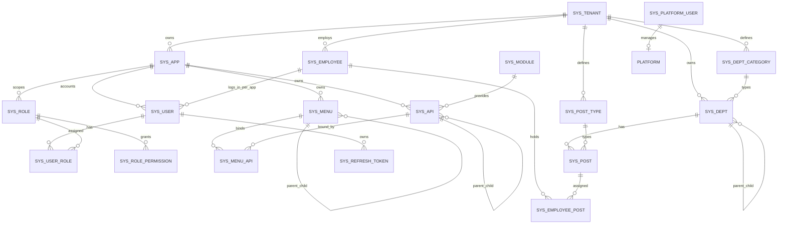

# 数据库表结构设计

> 状态：✅ SQL 已生成 | 见 [docs/db/migrations/](../db/migrations/)  
> 数据库：PostgreSQL 16 | 库名：`mis_platform` | 策略：Phase 1 单库

## 1. 设计约定

| 约定 | 说明 |
|------|------|
| 主键 | `BIGINT` 雪花 ID |
| 租户 | 租户 = 集团公司；业务表含 `tenant_id` |
| APP | 多应用；用户、菜单、API、角色均带 `app_id`（租户级表除外） |
| 模块 | **`sys_module` 为平台微服务注册表，与 `app_id` 无对应**；经 `sys_api.module_id` 关联 |
| 树编码 | `sys_menu`、`sys_api`、**`sys_dept`** 使用层级 **`code`**（ADR-011 / ADR-013） |
| 软删除 | 用户/组织/员工等 `deleted`；菜单/API 用 `status` |
| 时间 | `TIMESTAMP WITH TIME ZONE`，存储 UTC |
| 命名 | 表前缀 `sys_`，小写蛇形 |
| 索引 | `uk_` 唯一索引，`idx_` 普通索引 |

## 2. ER 图



## 3. 表结构明细

### 3.1 sys_app — 应用（≈ 微前端子应用边界）

| 字段 | 类型 | 约束 | 说明 |
|------|------|------|------|
| id | BIGINT | PK | |
| tenant_id | BIGINT | NOT NULL DEFAULT 1 | |
| code | VARCHAR(64) | NOT NULL | 如 `system` |
| name | VARCHAR(128) | NOT NULL | |
| icon | VARCHAR(64) | NULL | |
| base_path | VARCHAR(128) | NULL | 路由前缀 `/system` |
| mfe_remote | VARCHAR(256) | NULL | 微前端 remote，Phase 1 空 |
| sort | INT | NOT NULL DEFAULT 0 | |
| status | SMALLINT | NOT NULL DEFAULT 1 | |
| created_at | TIMESTAMPTZ | NOT NULL | |
| updated_at | TIMESTAMPTZ | NOT NULL | |

**索引：** `uk_app_tenant_code` UNIQUE (tenant_id, code)

### 3.2 sys_module — 业务模块（≈ 微服务 1:1，平台级）

| 字段 | 类型 | 约束 | 说明 |
|------|------|------|------|
| id | BIGINT | PK | |
| code | VARCHAR(64) | NOT NULL | 如 `user`、`org` |
| name | VARCHAR(128) | NOT NULL | |
| service_name | VARCHAR(64) | NOT NULL | Nacos 名 `mis-user` |
| sort | INT | NOT NULL DEFAULT 0 | |
| status | SMALLINT | NOT NULL DEFAULT 1 | |
| created_at | TIMESTAMPTZ | NOT NULL | |
| updated_at | TIMESTAMPTZ | NOT NULL | |

**索引：**
- `uk_module_code` UNIQUE (code)
- `uk_module_service` UNIQUE (service_name)

> **与 `sys_app` 无隶属关系。** 同一微服务模块可被多个 APP 的 `sys_api` 引用（经 `module_id`）。

### 3.3 sys_tenant — 租户

| 字段 | 类型 | 约束 | 说明 |
|------|------|------|------|
| id | BIGINT | PK | 雪花 ID |
| code | VARCHAR(64) | NOT NULL, UNIQUE | 租户编码 |
| name | VARCHAR(128) | NOT NULL | 租户名称 |
| status | SMALLINT | NOT NULL DEFAULT 1 | 0=禁用 1=启用 |
| expire_at | TIMESTAMPTZ | NULL | 过期时间 |
| created_at | TIMESTAMPTZ | NOT NULL | |
| updated_at | TIMESTAMPTZ | NOT NULL | |

### 3.4 sys_dept_category — 租户部门类别

| 字段 | 类型 | 约束 | 说明 |
|------|------|------|------|
| id | BIGINT | PK | |
| tenant_id | BIGINT | NOT NULL | |
| code | VARCHAR(64) | NOT NULL | 如 `headquarters`、`store` |
| name | VARCHAR(128) | NOT NULL | 显示名 |
| sort | INT | NOT NULL DEFAULT 0 | |
| status | SMALLINT | NOT NULL DEFAULT 1 | 0禁用 1启用 |
| created_at | TIMESTAMPTZ | NOT NULL | |
| updated_at | TIMESTAMPTZ | NOT NULL | |

**索引：** `uk_dept_cat_tenant_code` UNIQUE (tenant_id, code)

> 每租户独立维护；**创建租户时**写入默认类别种子（总部/分公司/部门），租户可增删改。

### 3.5 sys_dept — 部门树

| 字段 | 类型 | 约束 | 说明 |
|------|------|------|------|
| id | BIGINT | PK | |
| tenant_id | BIGINT | NOT NULL | |
| parent_id | BIGINT | NOT NULL DEFAULT 0 | 根=0 |
| **code** | **VARCHAR(64)** | NOT NULL | 层级编码 `0001`/`00010001`（ADR-013） |
| name | VARCHAR(128) | NOT NULL | |
| category_id | BIGINT | NOT NULL | → sys_dept_category |
| ancestors | VARCHAR(512) | NOT NULL | 如 `0,1,5` |
| sort | INT | NOT NULL DEFAULT 0 | |
| **status** | SMALLINT | NOT NULL DEFAULT 1 | 0禁用 1启用 |
| **is_root** | SMALLINT | NOT NULL DEFAULT 0 | 1=租户自动顶级节点，不可删 |
| leader_employee_id | BIGINT | NULL | 负责人 |
| deleted | SMALLINT | NOT NULL DEFAULT 0 | |
| created_by | BIGINT | NULL | |
| created_at | TIMESTAMPTZ | NOT NULL | |
| updated_by | BIGINT | NULL | |
| updated_at | TIMESTAMPTZ | NOT NULL | |

**索引：**
- `uk_dept_tenant_code` UNIQUE (tenant_id, code) WHERE deleted=0
- `uk_dept_tenant_root` UNIQUE (tenant_id) WHERE is_root=1 AND deleted=0
- `idx_dept_tenant_parent` (tenant_id, parent_id)

**开户规则：** 创建 `sys_tenant` 后自动插入根部门；同步创建内置角色 `TENANT_ADMIN`、租户 `admin` 账号（见 ADR-014）。

### 3.6 sys_post_type — 租户岗位类型

| 字段 | 类型 | 说明 |
|------|------|------|
| id | BIGINT | PK |
| tenant_id | BIGINT | NOT NULL |
| code | VARCHAR(64) | 租户内唯一，如 `management`、`tech` |
| name | VARCHAR(128) | 显示名 |
| sort | INT | 默认 0 |
| status | SMALLINT | 0禁用 1启用 |
| created_at / updated_at | TIMESTAMPTZ | |

**索引：** `uk_post_type_tenant_code` UNIQUE (tenant_id, code)

### 3.7 sys_post — 部门岗位编制

| 字段 | 类型 | 说明 |
|------|------|------|
| id | BIGINT | PK |
| tenant_id | BIGINT | NOT NULL |
| dept_id | BIGINT | NOT NULL | → sys_dept |
| post_type_id | BIGINT | NOT NULL | → sys_post_type |
| code | VARCHAR(64) | 租户内岗位编码（业务编码，非树 code） |
| name | VARCHAR(128) | 如「研发部经理」 |
| sort | INT | |
| status | SMALLINT | 0禁用 1启用 |
| deleted | SMALLINT | |
| created_at / updated_at | TIMESTAMPTZ | |

**索引：**
- `uk_post_tenant_code` UNIQUE (tenant_id, code) WHERE deleted=0
- `idx_post_dept` (dept_id)

### 3.8 sys_employee_post — 员工任职（支持兼职多岗）

| 字段 | 类型 | 说明 |
|------|------|------|
| id | BIGINT | PK |
| tenant_id | BIGINT | NOT NULL |
| employee_id | BIGINT | NOT NULL |
| post_id | BIGINT | NOT NULL | → sys_post |
| is_primary | SMALLINT | NOT NULL DEFAULT 0 | 1=主岗 |
| start_date | DATE | NULL | |
| end_date | DATE | NULL | 结束任职 |
| status | SMALLINT | NOT NULL DEFAULT 1 | 0结束 1在任 |
| created_at | TIMESTAMPTZ | |

**索引：**
- `uk_emp_post` UNIQUE (employee_id, post_id) WHERE status=1
- `idx_emp_post_employee` (employee_id)

> 主部门 `sys_employee.dept_id` 与主岗 `is_primary=1` 应对齐（应用层校验）。

### 3.9 sys_employee — 租户员工（自然人主数据）

| 字段 | 类型 | 约束 | 说明 |
|------|------|------|------|
| id | BIGINT | PK | |
| tenant_id | BIGINT | NOT NULL | |
| dept_id | BIGINT | NOT NULL | 主部门 → sys_dept |
| employee_no | VARCHAR(64) | NOT NULL | 工号 |
| real_name | VARCHAR(64) | NOT NULL | |
| email | VARCHAR(128) | NULL | |
| phone | VARCHAR(32) | NULL | |
| gender | SMALLINT | NULL | 0/1/2 |
| title | VARCHAR(64) | NULL | |
| hire_date | DATE | NULL | |
| status | SMALLINT | NOT NULL DEFAULT 1 | |
| deleted | SMALLINT | NOT NULL DEFAULT 0 | |
| created_at | TIMESTAMPTZ | NOT NULL | |
| updated_at | TIMESTAMPTZ | NOT NULL | |

**索引：** `uk_employee_tenant_no` UNIQUE (tenant_id, employee_no) WHERE deleted=0

### 3.10 sys_platform_user — 平台超级管理员（superadmin）

| 字段 | 类型 | 说明 |
|------|------|------|
| id | BIGINT | PK |
| username | VARCHAR(64) | NOT NULL, UNIQUE |
| password_hash | VARCHAR(128) | BCrypt |
| real_name | VARCHAR(64) | |
| status | SMALLINT | 0禁用 1启用 |
| is_protected | SMALLINT | 1=不可删（种子 superadmin） |
| must_change_password | SMALLINT | 1=首次登录须改密 |
| last_login_at | TIMESTAMPTZ | |
| login_fail_count | INT | |
| created_at / updated_at | TIMESTAMPTZ | |

> 管理**所有租户**；与 `sys_tenant` / `sys_user` 分离。登录入口独立（如 `/api/v1/platform/auth/login`）。

### 3.11 sys_user — APP 登录账号（每员工每 APP 一条）

| 字段 | 类型 | 约束 | 说明 |
|------|------|------|------|
| id | BIGINT | PK | |
| tenant_id | BIGINT | NOT NULL | |
| app_id | BIGINT | NOT NULL | 所属 APP |
| employee_id | BIGINT | NOT NULL | 对应员工 |
| dept_id | BIGINT | NOT NULL | 数据权限主部门（可覆盖员工主部门） |
| username | VARCHAR(64) | NOT NULL | APP 内登录名 |
| password_hash | VARCHAR(128) | NOT NULL | BCrypt |
| avatar_url | VARCHAR(512) | NULL | |
| status | SMALLINT | NOT NULL DEFAULT 1 | 0禁用 1启用 2锁定 |
| last_login_at | TIMESTAMPTZ | NULL | |
| login_fail_count | INT | NOT NULL DEFAULT 0 | |
| **is_tenant_admin** | **SMALLINT** | NOT NULL DEFAULT 0 | 1=租户管理员，**不可删自己** |
| **must_change_password** | **SMALLINT** | NOT NULL DEFAULT 0 | 1=须先改密再进系统 |
| deleted | SMALLINT | NOT NULL DEFAULT 0 | |
| created_at | TIMESTAMPTZ | NOT NULL | |
| updated_at | TIMESTAMPTZ | NOT NULL | |

**索引：**
- `uk_user_tenant_app_username` UNIQUE (tenant_id, app_id, username) WHERE deleted=0
- `uk_user_app_employee` UNIQUE (app_id, employee_id) — 每 APP 每员工一个账号
- `idx_user_employee` (employee_id)

> 登录：`app_code` + `username` + `password`。**令牌仅在该 APP 有效**（ADR-011）。

### 3.12 sys_role — 角色（APP 级）

| 字段 | 类型 | 约束 | 说明 |
|------|------|------|------|
| id | BIGINT | PK | |
| tenant_id | BIGINT | NOT NULL | |
| app_id | BIGINT | NOT NULL | 角色归属 APP |
| code | VARCHAR(64) | NOT NULL | |
| name | VARCHAR(128) | NOT NULL | |
| type | SMALLINT | NOT NULL DEFAULT 2 | 1=内置（仅 `TENANT_ADMIN`）2=自定义 |
| data_scope | SMALLINT | NOT NULL DEFAULT 1 | |
| status | SMALLINT | NOT NULL DEFAULT 1 | |
| remark | VARCHAR(512) | NULL | |
| deleted | SMALLINT | NOT NULL DEFAULT 0 | |
| created_at | TIMESTAMPTZ | NOT NULL | |
| updated_at | TIMESTAMPTZ | NOT NULL | |

**索引：** `uk_role_app_code` UNIQUE (app_id, code) WHERE deleted=0

> Phase 1 种子仅内置 **`TENANT_ADMIN`**。`DEPT_MANAGER` 等由租户 admin 后期创建（`type=2`）。

### 3.13 sys_user_role — 用户角色

| 字段 | 类型 | |
|------|------|---|
| id | BIGINT | PK |
| user_id | BIGINT | |
| role_id | BIGINT | |

**索引：** `uk_user_role` UNIQUE (user_id, role_id)；`idx_user_role_role` (role_id)

### 3.14 sys_menu — 菜单树（层级 code）

| 字段 | 类型 | 说明 |
|------|------|------|
| id | BIGINT | PK |
| tenant_id | BIGINT | |
| app_id | BIGINT | 必填 |
| parent_id | BIGINT | 根=0 |
| **code** | **VARCHAR(64)** | **层级编码**，如 `0001`/`00010001`（ADR-011） |
| name | VARCHAR(64) | |
| type | SMALLINT | 1目录 2菜单 3按钮 |
| path | VARCHAR(128) | type=1/2 |
| component | VARCHAR(128) | type=2 |
| permission | VARCHAR(128) | type=2/3 必填；**鉴权依据** |
| icon | VARCHAR(64) | |
| sort | INT | |
| visible | SMALLINT | |
| status | SMALLINT | |
| created_at / updated_at | TIMESTAMPTZ | |

**索引：**
- `uk_menu_app_code` UNIQUE (app_id, code)
- `idx_menu_parent` (parent_id)
- `uk_menu_app_permission` UNIQUE (app_id, permission) WHERE status=1 AND permission IS NOT NULL

### 3.15 sys_api — API 树（catalog / api）

| 字段 | 类型 | 说明 |
|------|------|------|
| id | BIGINT | PK |
| tenant_id | BIGINT | |
| app_id | BIGINT | |
| module_id | BIGINT | 微服务模块 |
| parent_id | BIGINT | 根=0 |
| **code** | **VARCHAR(64)** | 层级编码，与 menu 独立编号 |
| **type** | **VARCHAR(16)** | **`catalog`** 目录 \| **`api`** HTTP 端点 |
| name | VARCHAR(64) | |
| http_method | VARCHAR(16) | type=api 必填 |
| path_pattern | VARCHAR(256) | type=api 必填，全局唯一 |
| sort | INT | |
| status | SMALLINT | |
| created_at / updated_at | TIMESTAMPTZ | |

**索引：**
- `uk_api_app_code` UNIQUE (app_id, code)
- `uk_api_method_path` UNIQUE (http_method, path_pattern) WHERE type='api' AND status=1
- `idx_api_parent` (parent_id)

**BFF Registry 加载（经菜单/按钮关联）：**

```sql
SELECT a.http_method, a.path_pattern, m.permission
FROM sys_api a
INNER JOIN sys_menu_api ma ON ma.api_id = a.id
INNER JOIN sys_menu m ON ma.menu_id = m.id
WHERE a.type = 'api' AND a.status = 1
  AND m.status = 1 AND m.permission IS NOT NULL
  AND m.type IN (2, 3);
```

> `sys_api` 仅存 HTTP 端点元数据；**所需 permission 继承自关联的菜单页或按钮**。

**code 树示例：**

```
0001                 catalog  用户模块
00010001             catalog  用户查询
000100010001         api      GET /api/v1/users
000100020001         api      POST /api/v1/users
```

### 3.16 sys_menu_api — 菜单页/按钮 ↔ API 关联

| 字段 | 类型 | 说明 |
|------|------|------|
| id | BIGINT | PK |
| menu_id | BIGINT | → `sys_menu`（type=2 菜单页 或 type=3 按钮） |
| api_id | BIGINT | → `sys_api`（type=api 叶子） |
| sort | INT | 默认 0 |
| created_at | TIMESTAMPTZ | |

**索引：**
- `uk_menu_api_pair` UNIQUE (menu_id, api_id)
- `uk_menu_api_api` UNIQUE (api_id) — 每个 API 端点只归属一个菜单/按钮节点

**约定：**
- type=2 菜单页：挂载页面加载 API（列表、下拉等）
- type=3 按钮：挂载操作类 API（增删改）；**角色不直接勾选 API 树**

### 3.17 sys_role_permission — 角色权限（按类型扩展）

| 字段 | 类型 | 说明 |
|------|------|------|
| id | BIGINT | PK |
| role_id | BIGINT | NOT NULL |
| **perm_type** | **sys_perm_type** | NOT NULL | PostgreSQL ENUM，见下表 |
| **target_id** | **BIGINT** | 多态目标 ID |
| created_at | TIMESTAMPTZ | |

**`sys_perm_type` ENUM：** `menu` | `dept` | `store`（S2 已确认；新增类型需迁移扩展 ENUM）

| perm_type | target_id 指向 | Phase | 说明 |
|-----------|----------------|-------|------|
| `menu` | `sys_menu.id` | 1 | 菜单/按钮 → `sys_menu.permission` |
| `dept` | `sys_dept.id` | 1 | 部门数据范围；多角色 **并集**（S1） |
| `store` | 待定 | 2+ | 门店数据权限 |

**索引：**
- `uk_role_perm` UNIQUE (role_id, perm_type, target_id)
- `idx_role_perm_type` (role_id, perm_type)
- `idx_perm_target` (perm_type, target_id)

**约定：**
- `data_scope=5`（自定义）时，部门列表取自 `perm_type='dept'` 记录
- BFF 功能权限（API）：仅 `perm_type='menu'` 参与 Redis `permissions` 聚合
- `dept` / `store` 等用于**数据权限**（`@DataScope`），与菜单 permission 分离

**登录聚合 permissions（仅 menu 类型）：**

```sql
SELECT DISTINCT m.permission
FROM sys_user_role ur
JOIN sys_role_permission rp ON ur.role_id = rp.role_id AND rp.perm_type = 'menu'
JOIN sys_menu m ON rp.target_id = m.id
WHERE ur.user_id = ? AND m.app_id = ?
  AND m.status = 1 AND m.permission IS NOT NULL AND m.type IN (2, 3);
```

### 3.18 sys_dict_type — 字典类型

| 字段 | 类型 | 约束 | 说明 |
|------|------|------|------|
| id | BIGINT | PK | |
| tenant_id | BIGINT | NOT NULL DEFAULT 0 | 0=全局 |
| code | VARCHAR(64) | NOT NULL | 类型编码 |
| name | VARCHAR(128) | NOT NULL | 类型名称 |
| status | SMALLINT | NOT NULL DEFAULT 1 | |
| remark | VARCHAR(512) | NULL | |
| created_at | TIMESTAMPTZ | NOT NULL | |
| updated_at | TIMESTAMPTZ | NOT NULL | |

**索引：**
- `uk_dict_type_code` UNIQUE (tenant_id, code)

### 3.19 sys_dict_item — 字典项

| 字段 | 类型 | 约束 | 说明 |
|------|------|------|------|
| id | BIGINT | PK | |
| type_id | BIGINT | NOT NULL, FK | |
| label | VARCHAR(128) | NOT NULL | 显示标签 |
| value | VARCHAR(128) | NOT NULL | 值 |
| sort | INT | NOT NULL DEFAULT 0 | |
| status | SMALLINT | NOT NULL DEFAULT 1 | |
| css_class | VARCHAR(64) | NULL | 前端样式 class |
| created_at | TIMESTAMPTZ | NOT NULL | |
| updated_at | TIMESTAMPTZ | NOT NULL | |

**索引：**
- `idx_dict_item_type` (type_id)

### 3.20 sys_config — 系统参数

| 字段 | 类型 | 约束 | 说明 |
|------|------|------|------|
| id | BIGINT | PK | |
| config_key | VARCHAR(128) | NOT NULL, UNIQUE | |
| config_value | TEXT | NOT NULL | |
| remark | VARCHAR(512) | NULL | |
| created_at | TIMESTAMPTZ | NOT NULL | |
| updated_at | TIMESTAMPTZ | NOT NULL | |

### 3.21 sys_refresh_token — 刷新令牌

| 字段 | 类型 | 约束 | 说明 |
|------|------|------|------|
| id | BIGINT | PK | |
| user_id | BIGINT | NOT NULL | |
| app_id | BIGINT | NOT NULL | 与 user 一致，令牌隔离 |
| token_hash | VARCHAR(128) | NOT NULL | |
| client_id | VARCHAR(64) | NOT NULL DEFAULT 'web' | |
| expire_at | TIMESTAMPTZ | NOT NULL | |
| revoked | SMALLINT | NOT NULL DEFAULT 0 | |
| created_at | TIMESTAMPTZ | NOT NULL | |

**索引：**
- `idx_refresh_token_user` (user_id)
- `idx_refresh_token_hash` (token_hash)

### 3.22 sys_login_log — 登录日志

| 字段 | 类型 | 约束 | 说明 |
|------|------|------|------|
| id | BIGINT | PK | |
| tenant_id | BIGINT | NOT NULL | |
| app_id | BIGINT | NOT NULL | 登录所在 APP |
| user_id | BIGINT | NULL | |
| username | VARCHAR(64) | NOT NULL | |
| ip | VARCHAR(64) | NULL | |
| user_agent | VARCHAR(512) | NULL | |
| status | SMALLINT | NOT NULL | 0=失败 1=成功 |
| msg | VARCHAR(256) | NULL | |
| login_at | TIMESTAMPTZ | NOT NULL | |

**索引：**
- `idx_login_log_user` (user_id)
- `idx_login_log_time` (login_at DESC)

### 3.23 sys_oper_log — 操作日志

| 字段 | 类型 | 约束 | 说明 |
|------|------|------|------|
| id | BIGINT | PK | |
| tenant_id | BIGINT | NOT NULL | |
| user_id | BIGINT | NULL | |
| username | VARCHAR(64) | NULL | |
| module | VARCHAR(64) | NULL | |
| operation | VARCHAR(64) | NULL | |
| method | VARCHAR(256) | NULL | 全类名+方法 |
| request_uri | VARCHAR(256) | NULL | |
| request_method | VARCHAR(16) | NULL | GET/POST 等 |
| request_params | TEXT | NULL | 脱敏 JSON |
| response_code | INT | NULL | 业务 code |
| duration_ms | INT | NULL | |
| ip | VARCHAR(64) | NULL | |
| oper_time | TIMESTAMPTZ | NOT NULL | |

**索引：**
- `idx_oper_log_user` (user_id)
- `idx_oper_log_time` (oper_time DESC)

## 4. 数据权限枚举

| 值 | 常量名 | 说明 |
|----|--------|------|
| 1 | ALL | 全部数据 |
| 2 | DEPT | 本部门 |
| 3 | DEPT_AND_CHILD | 本部门及下级 |
| 4 | SELF | 仅本人 |
| 5 | CUSTOM | 自定义部门集合 |

## 5. Redis Key 约定（ADR-009 / ADR-011）

| Key | 说明 |
|-----|------|
| `mis:rbac:permissions:{tenantId}:{appId}:{userId}` | 用户在该 APP 下的 permission 集合 |
| `mis:rbac:perm-version:{tenantId}:{appId}:{userId}` | 权限版本号 |
| `mis:auth:login-fail:{tenantId}:{appId}:{username}` | 登录失败计数 |
| `mis:auth:refresh:{tokenHash}` | Refresh Token 缓存 |

## 6. Flyway 迁移规划

| 文件 | 内容 |
|------|------|
| V1__init_schema.sql | 含 `sys_dept_category`、`sys_dept`、`sys_perm_type` ENUM 等 |
| V2__seed_data.sql | 种子：APP、模块、菜单树（code）、`sys_api` 全量 API 树 |
| V3__indexes_optimize.sql | 性能索引（按需） |

## 7. 待确认项

- [x] 主要项见 [schema-discussion.md §10、§14](schema-discussion.md)；**可生成 SQL**

## 8. 关联文档

- [种子数据](seed-data.md)
- [接口规范](../api/api-specification.md)
- [ADR-012：sys_role_permission](../adr/ADR-012-sys-role-permission.md)
- [ADR-013：部门层级与类别](../adr/ADR-013-sys-dept-hierarchy.md)
- [ADR-013：部门层级与类别](../adr/ADR-013-sys-dept-hierarchy.md)
- [ADR-001：Phase 1 单库](../adr/ADR-001-single-database-phase1.md)
