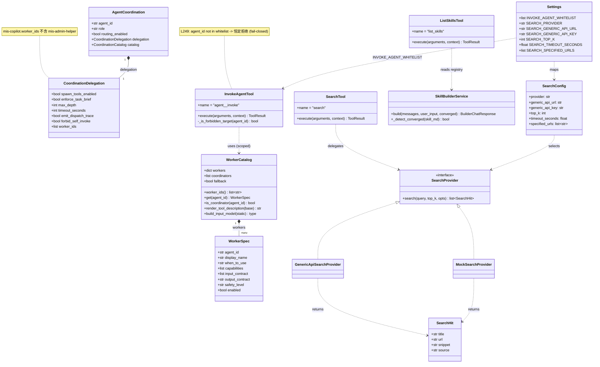
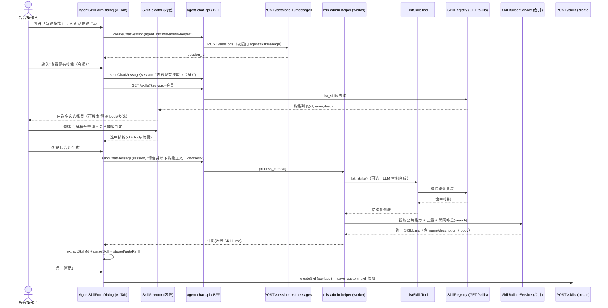
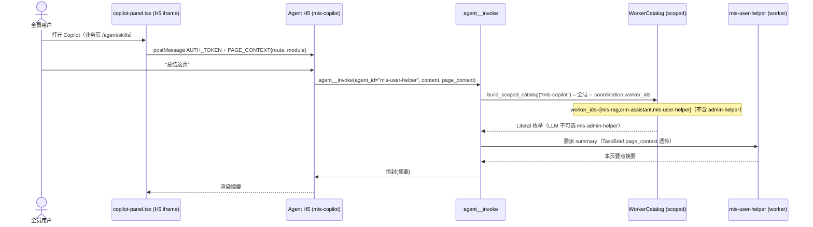
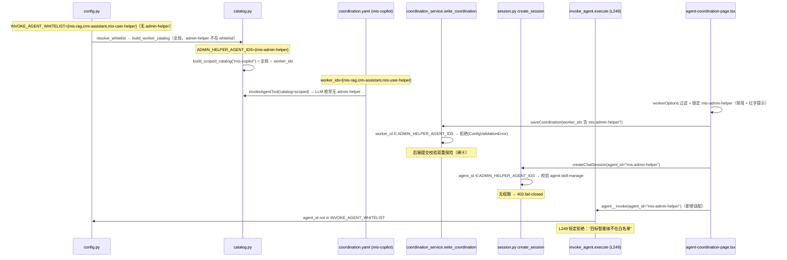
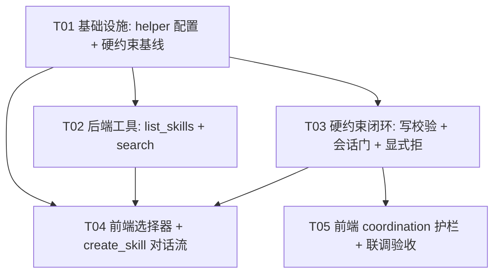

# MIS 平台 Agent 控制台 · 需求 1.3 / 1.4 系统架构设计 + 任务分解

> 架构师：高见远（Bob）｜阶段：标准 SOP 第二环（设计 + 任务分解）
> 输入：`docs/prd/agent-helper-1.3-1.4.md`（产品经理 许清楚）
> 工作目录：`D:\code\mis-platform`（git 已提交，本设计不修改任何代码，仅产出设计 + 任务分解）

---

## 0. PRD 引用点核对结论（节选）

已逐一打开 PRD 第 8 节列的文件，确认引用真实存在、行号/结构一致：

| PRD 引用 | 核对结果 |
| --- | --- |
| `catalog.py:53-68 STATIC_WORKER_HINTS` | ✅ 含 `mis-extract`/`mis-summary`，无新 helper |
| `catalog.py:403-451 build_worker_catalog()` | ✅ 全局目录 = `role=worker ∩ enabled ∩ whitelist` |
| `catalog.py:257-272 _resolve_whitelist()` | ✅ 读 `settings.INVOKE_AGENT_WHITELIST` |
| `invoke_agent.py:73-80 DEFAULT_WHITELIST` / `:83 FORBIDDEN_TARGETS` | ✅ |
| `invoke_agent.py:249` 运行时守卫 `agent_id not in whitelist` | ✅ 硬约束落点（fail-closed 基线） |
| `config.py:326-334 INVOKE_AGENT_WHITELIST` | ✅ 默认 `[mis-extract,mis-summary,mis-rag,crm-assistant]` |
| `coordination.yaml` / `agent.yaml` / `metadata.yaml` | ✅ `mis-copilot` 为 `role: coordinator`，`mis-extract/summary` 为 `role: worker` |
| `coordination_service.py:127-154` / `write_coordination` 四条校验 | ✅ 写回 + 级联清理 + 重建目录 |
| `skill_builder_service.py:_detect_converged` | ✅ 收敛判定（Front Matter name+description + body 非空） |
| `custom_store.py:51-75 save_custom_skill` | ✅ custom 技能落盘 `data/skills/{id}/SKILL.md` |
| `session.py:733 create_session` / `:980 send_message` | ✅ 通用会话机制，可按 `agent_id` 建会话 |
| `skill.py:181 POST /skills/builder/chat` | ✅ ephemeral SkillBuilderService |
| `copilot-panel.tsx:222 pushAuthAndContext` | ✅ 已推送 `PAGE_CONTEXT{route, module}` |
| 前端技能/协调页 | ✅ `agent-skill-form-dialog.tsx` / `skill-builder-panel.tsx` / `agent-coordination-page.tsx` / `agent-chat-api.ts` 均存在且结构如 PRD 所述 |
| 全仓检索 `mis-admin-helper`/`mis-user-helper` | ✅ 零引用（纯新增）；`search` tool 零对外联网实现（净新增） |

结论：**PRD 引用可信，可直接据此设计**。

---

## 1. 开放问题裁定 Q1–Q8（含理由）

### Q1 委派白名单单一来源
**裁定：采用推荐方案——coordinator-scoped catalog + 全局 whitelist 对齐，双重 fail-closed。**

- 全局 `WorkerCatalog`（`build_worker_catalog`）继续作为"已注册 worker"的来源（`mis-admin-helper` 作为真实 worker 注册，以便 admin web 经 `create_session` 直达）。
- 新增 `build_scoped_catalog(coordinator_id)`：读取该 coordinator 的 `coordination.yaml.delegation.worker_ids`，用其**过滤**全局目录，得到"该协调者可委派"的子目录。
- `tool_registry_builder` 在为该 coordinator 装配 `InvokeAgentTool` 时，注入** scoped catalog**（而非全局）。于是 LLM 看到的 `agent_id` Literal 枚举里**根本不含 `mis-admin-helper`**——它连"被点名"的机会都没有。
- 同时把 `INVOKE_AGENT_WHITELIST` 与 coordination 对齐（见 R5）。即便有人绕过 scoped catalog（例如误把 `mis-admin-helper` 写进 `mis-copilot/coordination.yaml`，或新增一个忘记 scope 的 coordinator），运行时 `invoke_agent.py:249` 的 `agent_id not in whitelist` 守卫**恒定拒绝**。
- `mis-copilot/coordination.yaml` 的 `worker_ids` 声明为 `[crm-assistant, mis-rag, mis-user-helper]`，**不含 `mis-admin-helper`**。

### Q2 `mis-admin-helper` 如何被 admin web 触达
**裁定：复用通用会话机制，不新增端点。**

- 走 `createChatSession(agent_id="mis-admin-helper")` + `sendChatMessage`（即 `POST /sessions` + `POST /sessions/{id}/messages`）。理由：`mis-admin-helper` 是真实注册的 worker，通用会话机制原生支持任意 `agent_id`；复用避免重复实现会话生命周期。
- 会话归属：`session.user_id` = 当前后台操作员（MIS `employeeId`/`mis_user_id`），`channel="web"`。
- 权限门：`create_session` 在 `req.agent_id ∈ ADMIN_HELPER_AGENT_IDS` 时，调用 `MisPermissionResolver` 校验 `agent:skill:manage`，缺失即 `error_response(40301/2005)` **fail-closed 拒绝**。前端「AI 对话创建」入口用 `<PermissionGate permission="agent:skill:manage">` 包住，纵深防御。

### Q3 内嵌选择器如何获得 `list_skills` 结果
**裁定：前端自行调 `GET /skills` 渲染选择器；LLM 仅负责意图识别与合成（不依赖 SSE tool 事件）。**

- `sendChatMessage` 当前只回 `response + tool_errors`，无结构化 tool 结果，故**不**依赖 SSE tool 事件。
- 流程：操作员在 AI 对话发"查看现有技能"→ 前端**乐观拉起**内嵌多选选择器，直接 `GET /api/v1/skills?keyword=…` 拉取列表（可搜索、可预览 body、可多选）；勾选后把"选中技能的 id+body"拼进下一条用户消息发给 `mis-admin-helper`。
- `mis-admin-helper` 仍挂 `list_skills` 工具作为**兜底/增强**（LLM 可自行补全），但**选择器的数据源是 `GET /skills`**，最稳。
- 前端/LLM 意图约定（见 §9 共享知识）：用户输入命中"查看/浏览/列出 现有技能"类意图 → 前端拉起选择器；其余对话照常走 `mis-admin-helper` 会话。

### Q4 `search` tool 抽象与默认 provider
**裁定：定义 Provider 协议 + 抽象 `SearchTool`，本期实现 `mock`（默认联调用）与 `generic_api`（可配置真实搜索 API），provider 经配置切换；`internal_mcp` / `specified_urls` 留 P2（R15）。**

- 抽象接口：`SearchProvider.search(query, *, top_k, **opts) -> list[SearchHit]`；`SearchHit{title,url,snippet,source}`。
- `SearchTool`（OpenHarness `BaseTool`，`name="search"`）：input `{query:str, top_k:int, source?:str}`，内部调 `get_search_provider()` 拿 provider，返回格式化命中。
- 配置开关（落到 `config.py`）：`SEARCH_PROVIDER`（mock|generic_api|internal_mcp|specified_urls，默认 `mock`）、`SEARCH_GENERIC_API_URL`、`SEARCH_GENERIC_API_KEY`、`SEARCH_TOP_K=5`、`SEARCH_TIMEOUT_SECONDS=10.0`、`SEARCH_SPECIFIED_URLS`。
- `generic_api` provider 用 `httpx` 经 `OUTBOUND_PROXY` 调可配置 endpoint（与现有 LLM/KB 出站一致）；生产期把 `SEARCH_PROVIDER` 配成 `generic_api` 并下发 key 即可，本期联调默认 `mock`。
- `mis-admin-helper` 的 `runtime.yaml.allowed_tools` 加 `search`，合成时可挂 web 搜索补全外部资料。

### Q5 create_skill 产物落盘路径
**裁定：复用现有 `SkillBuilderService._detect_converged` + `POST /skills`（→ `custom_store.save_custom_skill`）落盘，不新写流程。**

- 合成收敛判定复用 `_detect_converged`（Front Matter `name`+`description` + body 非空）。
- 前端把合成结果经现有 `parseSkill` + `applyParsedSkill` 回填左栏表单与正文，用户点「保存」走现有 `createSkill`/`updateSkill`（custom 技能经 `save_custom_skill` 落盘 `data/skills/{id}/SKILL.md`）。
- **R11 裁定**：保留 `POST /skills/builder/chat`（ephemeral）作为"手动 AI tab / 兜底"仍可用；本期「新建技能」对话框的 AI 对话创建 Tab **默认切到 `mis-admin-helper` 会话**。前端 `chatSkillBuilder` 在 create-skill 场景下改为走 `mis-admin-helper` 会话，ephemeral 端点保留为 fallback（不删）。

### Q6 旧 worker 下线灰度
**裁定：先 `enabled:false` 灰度、再删配置（两阶段），零中断。**

- 本期 R3：把 `mis-extract`/`mis-summary` 的 `metadata.yaml` 设 `enabled:false`（从全局 catalog 剔除），从 `mis-copilot/coordination.yaml.worker_ids` 移除（R4），`INVOKE_AGENT_WHITELIST` 默认值移除二者（R5）。
- 检索全仓确认无硬编码 `invoke_agent("mis-extract")` 调用点（验收点）。
- 配置保留一段时间后再物理删除目录，便于回滚。

### Q7 `mis-user-helper` 输出契约
**裁定：沿用旧 `mis-extract`/`mis-summary` 既有契约——`extract` 输出 JSON、`summary` 输出 text。**

- `metadata.yaml`：`capabilities=[extract, summary]`，`output_contract="text"`（与旧 `mis-summary` 对齐，summary 为主场景）；`extract` 结果由 agent 仍以 JSON 文本返回（与旧 `mis-extract` 下游一致）。
- 不新造输出契约，避免破坏 BFF `/ai/extract`、`/ai/summary` 调用方。

### Q8 权限模型边界
**裁定：后台操作员复用 `agent:skill:manage`；本期不新增细粒度码（R12 留 P2 仅做审计）。**

- `mis-admin-helper` 触达门 = `agent:skill:manage`（Q2 已裁定在 `create_session` + 前端 `PermissionGate` 双保险）。
- 全员（`mis-user-helper` / copilot）走现有 `agent:chat:use` 等，无需新码。
- "后台操作员 vs 技能管理员"在现有 MIS 权限中心用同一 `agent:skill:manage` 表达（受众比"技能管理员"略宽由 MIS 侧角色/数据范围控制，平台侧不另建码）。

---

# Part A：系统架构设计

## 2. 实现方案 + 框架选型

**沿用现有栈，零新增框架：**

- 后端：`FastAPI` + 现有 `OpenHarness` agent 运行时 + `WorkerCatalog`/`CoordinationService` 基座 + `SkillBuilderService`（复用其 `_detect_converged`）。
- 前端：`React + TypeScript + Tailwind + shadcn 原语`（现有 `mis-admin-web`）。
- 联网搜索：`httpx`（仓库已依赖，用于 indexer/formfill/kb_client）经 `OUTBOUND_PROXY` 出站，不引入新 SDK。

**核心设计决策：**

1. **受众隔离 = 两个 worker agent**：`mis-admin-helper`（后台操作员，capabilities=[create_skill]，挂 `list_skills`+`search`）、`mis-user-helper`（全员，capabilities=[extract,summary]）。
2. **copilot 接入声明式**：`mis-copilot/coordination.yaml.delegation.worker_ids` 为唯一"是否接入 copilot"声明；`mis-user-helper` 进、`mis-admin-helper` 不进。
3. **硬约束 fail-closed 四道闸**（R4+R5+R8 闭环）：
   - 闸① 配置声明：`mis-copilot.worker_ids` 不含 `mis-admin-helper`；
   - 闸② 运行时白名单：`INVOKE_AGENT_WHITELIST` 不含 `mis-admin-helper` → `invoke_agent.py:249` 恒定拒绝；
   - 闸③ scoped catalog：coordinator 的 `agent__invoke` 工具只暴露其 `worker_ids` 内的 agent，LLM 枚举里无 `mis-admin-helper`；
   - 闸④ 提交校验 + 会话门：`write_coordination` 拒绝把 `mis-admin-helper` 加进任何 coordinator；`create_session(agent_id=mis-admin-helper)` 校验 `agent:skill:manage`。
4. **create_skill 智能合成**：`mis-admin-helper` 真实运行，带 `list_skills`+`search` 工具，对话驱动 + LLM 智能合成（提炼公共能力、去重），产物复用现有 `parseSkill`/`applyParsedSkill` 回填 + `save_custom_skill` 落盘。
5. **内嵌选择器数据源 = `GET /skills`**（前端拉取，不依赖 SSE tool 事件）。

## 3. 文件列表（相对路径）

> 基准目录：`agent/ai-platform/`（后端）、`frontend/mis-admin-web/`（前端）

### 3.1 新增后端配置（agent yaml/coordination）
```
configs/agents/mis-admin-helper/agent.yaml
configs/agents/mis-admin-helper/metadata.yaml
configs/agents/mis-admin-helper/runtime/runtime.yaml
configs/agents/mis-admin-helper/runtime/prompts/system.md
configs/agents/mis-admin-helper/skills/enabled-skills.yaml
configs/agents/mis-admin-helper/system/model.yaml
configs/agents/mis-user-helper/agent.yaml
configs/agents/mis-user-helper/metadata.yaml
configs/agents/mis-user-helper/runtime/runtime.yaml
configs/agents/mis-user-helper/runtime/prompts/system.md
configs/agents/mis-user-helper/skills/enabled-skills.yaml
configs/agents/mis-user-helper/system/model.yaml
```

### 3.2 修改后端配置
```
configs/agents/mis-copilot/coordination.yaml   # worker_ids 改为 [crm-assistant, mis-rag, mis-user-helper]
configs/agents/mis-extract/metadata.yaml       # enabled: false（灰度下线）
configs/agents/mis-summary/metadata.yaml       # enabled: false（灰度下线）
```

### 3.3 新增后端逻辑
```
backend/src/skills/tools/list_skills_tool.py    # ListSkillsTool（读 SkillRegistry）
backend/src/skills/tools/search_tool.py         # SearchTool（抽象工具）
backend/src/skills/tools/search_providers.py    # SearchProvider 协议 + Mock/GenericApi provider
```

### 3.4 修改后端逻辑
```
backend/src/config.py                           # INVOKE_AGENT_WHITELIST 默认值 + SEARCH_* 配置
backend/src/coordinator/catalog.py              # STATIC_WORKER_HINTS 更新 + ADMIN_HELPER_AGENT_IDS + build_scoped_catalog()
backend/src/runtime/tool_registry_builder.py    # 注册 ListSkillsTool/SearchTool + coordinator 注入 scoped catalog
backend/src/coordinator/coordination_service.py # write_coordination 硬校验：拒绝 admin-helper 入 worker_ids
backend/src/api/routes/session.py               # create_session 对 admin-helper 加 agent:skill:manage 权限门
backend/src/skills/tools/invoke_agent.py        # 显式硬拒 mis-admin-helper（belt-and-suspenders，L249 之上）
backend/src/skills/skill_builder_prompt.py      # （可选）create_skill 系统提示词（reuse 现有）
```

### 3.5 修改前端
```
src/features/agent/skills/skill-builder-selector.tsx        # 新增：内嵌多选选择器
src/features/agent/skills/skill-builder-panel.tsx           # 挂载选择器（不离开创建流）
src/features/agent/skills/agent-skill-form-dialog.tsx       # AI Tab 切到 mis-admin-helper 会话 + 注入选中技能
src/features/agent/agents/agent-coordination-page.tsx       # worker_ids 锁定 mis-admin-helper（禁用+红字）
src/features/agent/api/agent-chat-api.ts                    # 复用 createChatSession/sendChatMessage；补 listSkillsForBuilder 封装
src/features/agent/api/agent-ops-api.ts                     # 确认 listSkills/getSkill 签名（复用）
src/features/agent/types.ts                                 # 补 SkillSummary / 选择器相关类型
```

## 4. 数据结构与接口（类图）



### 4.1 关键接口/契约

**`coordination.yaml`（mis-copilot）schema（声明式接入唯一来源）**
```yaml
role: coordinator
routing_enabled: false
delegation:
  spawn_tools_enabled: true
  enforce_task_brief: true
  max_depth: 1
  timeout_seconds: 120
  emit_dispatch_trace: true
  forbid_self_invoke: true
  worker_ids: [crm-assistant, mis-rag, mis-user-helper]   # 硬约束：不含 mis-admin-helper
```

**`metadata.yaml`（mis-admin-helper）catalog 段**
```yaml
metadata:
  name: mis-admin-helper
  display_name: MIS 技能创建助手（后台操作员）
  when_to_use: 后台操作员创建/合并生成技能（create_skill），含浏览现有技能 + 联网补全
  enabled: true
  capabilities: [create_skill]
  input_contract: [user_question]
  output_contract: text
  safety_level: read_only
```

**`metadata.yaml`（mis-user-helper）catalog 段**
```yaml
metadata:
  name: mis-user-helper
  display_name: MIS 抽取/摘要助手（全员）
  when_to_use: 从文本抽取结构化字段（extract）或对文本做摘要（summary）
  enabled: true
  capabilities: [extract, summary]
  input_contract: [user_question, attachments_text, page_context_slice]
  output_contract: text
  safety_level: read_only
```

**`SearchTool` 抽象接口（伪签名）**
```python
class SearchProvider(Protocol):
    async def search(self, query: str, *, top_k: int = 5, **opts) -> list[SearchHit]: ...

class SearchHit(BaseModel):
    title: str
    url: str
    snippet: str
    source: str

class SearchTool(BaseTool):
    name = "search"
    # input_model: { query: str, top_k: int = 5, source: str | None }
    # output: "1. <title> — <url>\n   <snippet>\n..."
```

**`ListSkillsTool` 抽象接口（伪签名）**
```python
class ListSkillsTool(BaseTool):
    name = "list_skills"
    # input_model: { keyword: str | None, limit: int = 20 }
    # output: "id | name | description\n..."  (从 SkillRegistry 读取，供 LLM 合成)
```

**前端 `SkillSelector` 组件契约**
```typescript
interface SkillSummary { skill_id: string; name: string; description: string; category?: string; }
interface SkillSelectorProps {
  open: boolean;
  keyword?: string;
  onConfirm: (selected: Array<{ skill_id: string; name: string; body: string }>) => void;
  onCancel: () => void;
}
// 数据源：GET /api/v1/skills?keyword= 列表；展开预览 body 时 GET /api/v1/skills/{id}
```

## 5. 程序调用流程

### 5.1 后台操作员 create_skill 合并生成流



### 5.2 copilot 内 mis-user-helper 页面感知总结流



### 5.3 硬约束 fail-closed 校验流（四道闸）



## 6. 待明确事项（未定）

1. **通用搜索 API 供应商与密钥**：本期默认 `mock`；生产真实 endpoint/key 待运维配置（`SEARCH_GENERIC_API_URL/KEY`）。不影响本期联调。
2. **mis-admin-helper 是否挂 Anthropic skill-creator 技能包**：建议在 `enabled-skills.yaml` 挂一个 `create-skill` 参考技能以规范合成，但技能包内容（SKILL.md）待内容侧补充；不阻塞本期（LLM 系统提示词已含规范）。
3. **create_skill 会话是否持久化**（R17，P2）：本期按"对话框生命周期"持有 session，关闭即清（与现有 AI Tab 行为一致）；留存/续聊留 P2。
4. **后台操作员具体 MIS 角色映射**：假定 `agent:skill:manage` 已由 MIS 权限中心下发给"后台操作员"角色；若实际码名不同，仅需在权限门与前端 `PermissionGate` 同步替换字符串。
5. **R13 是否随 R4 强制同批**：建议同批（T05），避免配置页留出"可把 admin-helper 勾进 copilot"的视觉误导。

---

# Part B：任务分解

## 7. 依赖包列表（新增）

```
- httpx>=0.27              # 后端已依赖（indexer/formfill/kb_client 在用），search provider 复用，经 OUTBOUND_PROXY 出站
- pydantic>=2.0            # 后端已依赖，SearchHit / 配置模型复用
- 前端：无新增依赖（复用 axios / react / zod / sonner / lucide-react）
```
> 说明：本期**不引入任何新 SDK**。通用搜索走 `httpx` + 可配置 endpoint；内部检索 MCP / 指定 URL provider 留 P2（R15），届时若接 MCP 复用现有 `McpClientManager`。

## 8. 任务列表（有序，按实现顺序；每个任务标 P0/P1、涉及文件、依赖、验收点）

> 总原则：第一个任务=基础设施（配置+常量+依赖基线）；后续按"后端工具→硬约束闭环→前端对话流→前端护栏"分层，互相尽量仅依赖 T01。

### T01 · 项目基础设施：两个 helper 配置 + 硬约束基线（P0）
- **依赖**：无
- **涉及文件**：
  - 新增 `configs/agents/mis-admin-helper/{agent,metadata,runtime/runtime,runtime/prompts/system,skills/enabled-skills,system/model}.yaml`
  - 新增 `configs/agents/mis-user-helper/{agent,metadata,runtime/runtime,runtime/prompts/system,skills/enabled-skills,system/model}.yaml`
  - 修改 `configs/agents/mis-copilot/coordination.yaml`（worker_ids 不含 admin-helper）
  - 修改 `configs/agents/mis-extract/metadata.yaml`、`mis-summary/metadata.yaml`（enabled:false 灰度）
  - 修改 `backend/src/config.py`（`INVOKE_AGENT_WHITELIST` 默认去 extract/summary、加 `mis-user-helper`；新增 `SEARCH_*` 配置项）
  - 修改 `backend/src/coordinator/catalog.py`（更新 `STATIC_WORKER_HINTS` 去 extract/summary、加 `mis-user-helper`；新增常量 `ADMIN_HELPER_AGENT_IDS={"mis-admin-helper"}`；新增 `build_scoped_catalog(coordinator_id)`）
- **做什么**：
  1. 写两个 helper 的完整 agent 配置（role=worker、runtime.allowed_tools：admin-helper=`[skill, list_skills, search]`，user-helper=`[skill, formfill__*]`），system.md 写明 create_skill / extract+summary 规范（reuse skill-creator 规范）。
  2. `mis-copilot/coordination.yaml` 的 `worker_ids` 改为 `[crm-assistant, mis-rag, mis-user-helper]`。
  3. `config.py`：`INVOKE_AGENT_WHITELIST` 默认 = `[mis-rag, crm-assistant, mis-user-helper]`；新增 `SEARCH_PROVIDER="mock"` / `SEARCH_GENERIC_API_URL=""` / `SEARCH_GENERIC_API_KEY=""` / `SEARCH_TOP_K=5` / `SEARCH_TIMEOUT_SECONDS=10.0` / `SEARCH_SPECIFIED_URLS=[]`。
  4. `catalog.py`：更新 `STATIC_WORKER_HINTS`；新增 `ADMIN_HELPER_AGENT_IDS`；实现 `build_scoped_catalog(coordinator_id)`（读 `agent_dir(coordinator_id)/coordination.yaml` 的 `delegation.worker_ids`，过滤全局目录 workers，保留 coordinators 列表；coordinator 缺失/无 delegation → 返回空 scoped 目录 fail-closed 安全）。
- **验收点**：
  - `build_worker_catalog()` 能列出 `mis-admin-helper`、`mis-user-helper`，且 `mis-extract`/`mis-summary` 因 `enabled:false` 不出现。
  - `resolve_whitelist()` 返回的 whitelist **不含** `mis-admin-helper`。
  - `build_scoped_catalog("mis-copilot").worker_ids()` == `[crm-assistant, mis-rag, mis-user-helper]`（不含 admin-helper）。
  - `mis-copilot/coordination.yaml` 的 `worker_ids` 不含 `mis-admin-helper`。

### T02 · 后端工具：list_skills + search tool + tool registry 接入（P0）
- **依赖**：T01
- **涉及文件**：
  - 新增 `backend/src/skills/tools/list_skills_tool.py`
  - 新增 `backend/src/skills/tools/search_tool.py`
  - 新增 `backend/src/skills/tools/search_providers.py`
  - 修改 `backend/src/runtime/tool_registry_builder.py`
- **做什么**：
  1. `list_skills_tool.py`：`ListSkillsTool(BaseTool)`，读 `SkillRegistry`（经 `get_skill_registry()`），input `{keyword?, limit=20}`，输出 `id | name | description` 文本（供 LLM 合成；selector 数据源另走 `GET /skills`，互不冲突）。
  2. `search_providers.py`：定义 `SearchProvider` 协议、`SearchHit` 模型；实现 `MockSearchProvider`（返回稳定占位命中，零依赖联调）与 `GenericApiSearchProvider`（`httpx` 经 `outbound_proxy_url` 调 `SEARCH_GENERIC_API_URL`，header 带 `SEARCH_GENERIC_API_KEY`）；`get_search_provider()` 按 `SEARCH_PROVIDER` 工厂返回。
  3. `search_tool.py`：`SearchTool(BaseTool)`，`name="search"`，input `{query, top_k=5, source?}`，调 `get_search_provider().search(...)`，格式化命中返回。
  4. `tool_registry_builder.py`：在 `create_agent_source_registry` 注册 `ListSkillsTool()` 与 `SearchTool()`；在 `create_platform_tool_registry` 增加 `agent_id` 入参，当 `role==coordinator` 时用 `build_scoped_catalog(agent_id)` 替代全局 catalog 注入 `InvokeAgentTool(catalog=scoped)`（scoped 为空时退回静态 schema，安全 fail-closed）。
- **验收点**：
  - `mis-admin-helper` 会话可用 `list_skills`、`search` 工具；`mis-user-helper` 不暴露二者。
  - `get_search_provider()` 在 `SEARCH_PROVIDER=mock` 返回占位命中；`generic_api` 走 httpx 且超时/缺失 url 安全降级。
  - 为 `mis-copilot`（coordinator）装配的 `agent__invoke` 工具 `agent_id` 枚举不含 `mis-admin-helper`。

### T03 · 硬约束闭环：coordination 写校验 + 会话权限门 + 显式拒（P0）
- **依赖**：T01、T02
- **涉及文件**：
  - 修改 `backend/src/coordinator/coordination_service.py`
  - 修改 `backend/src/api/routes/session.py`
  - 修改 `backend/src/skills/tools/invoke_agent.py`
- **做什么**：
  1. `coordination_service.write_coordination`：在 coordinator 分支新增校验——若 `delegation.worker_ids` 任一 ∈ `ADMIN_HELPER_AGENT_IDS`，抛 `ConfigValidationError(["mis-admin-helper 不允许接入任何协调者（硬约束）"])`（闸④ 后端提交校验）。
  2. `session.py create_session`：新增依赖 `require_admin_helper_access`——当 `req.agent_id ∈ ADMIN_HELPER_AGENT_IDS` 时，用 `get_mis_permission_resolver().has_permission(current_user, "agent:skill:manage")` 判权，缺失即 `error_response(40301, "无 agent:skill:manage 权限", 403)` fail-closed（闸④ 会话门）。
  3. `invoke_agent.py execute`：在 `agent_id` 解析后、白名单校验前，增加显式 `if agent_id in ADMIN_HELPER_AGENT_IDS: return 拒绝("目标智能体不允许经委派调用（硬约束）")`（belt-and-suspenders，与 L249 双保险；常量从 `catalog` 延迟导入避免循环依赖）。
- **验收点**：
  - `PUT /{agent_id}/coordination` 把 `mis-admin-helper` 加入 `mis-copilot.worker_ids` → 返回 7001 校验错误。
  - 无 `agent:skill:manage` 的用户 `POST /sessions(agent_id=mis-admin-helper)` → 403。
  - `agent__invoke(agent_id="mis-admin-helper")` 无论配置如何 → 恒定被拒（白名单 + 显式拒双保险）。

### T04 · 前端内嵌选择器 + create_skill 对话流（P0）
- **依赖**：T01、T02、T03
- **涉及文件**：
  - 新增 `src/features/agent/skills/skill-builder-selector.tsx`
  - 修改 `src/features/agent/skills/skill-builder-panel.tsx`
  - 修改 `src/features/agent/skills/agent-skill-form-dialog.tsx`
  - 修改 `src/features/agent/api/agent-chat-api.ts`
  - 修改 `src/features/agent/types.ts`
- **做什么**：
  1. `skill-builder-selector.tsx`（新）：内嵌多选选择器，数据源 `listSkills(keyword)`（GET /skills），支持搜索、点击展开预览 body（`getSkill(id)`），多选；`onConfirm` 回传 `{skill_id,name,body}[]`；不关闭对话框、不跳转。
  2. `skill-builder-panel.tsx`：在消息流内挂载 `SkillSelector`（受控 `selectorOpen`/`selected`），提供"浏览现有技能"触发按钮；勾选确认后通过 `onSkillsSelected` 回调上抛给对话框。
  3. `agent-skill-form-dialog.tsx`：AI Tab 改为走 `mis-admin-helper` 会话——打开时 `createChatSession("mis-admin-helper")`（对话框生命周期内缓存 session_id），发送改走 `sendChatMessage`；用户输入命中"查看/浏览/列出 现有技能"意图 → 拉起 `SkillSelector`；确认后把选中技能正文拼入下一条用户消息发给 `mis-admin-helper` 做合并合成；合成结果仍复用现有 `extractSkillMd + parseSkill + applyParsedSkill` 回填/暂存；保留 `chatSkillBuilder`（ephemeral）作为 fallback（R11）。
  4. `agent-chat-api.ts`：复用 `createChatSession`/`sendChatMessage`；新增 `listSkillsForBuilder(keyword)` 封装（若 `agent-ops-api.listSkills` 已存在则直接复用）。
  5. `types.ts`：补 `SkillSummary`、选择器 props 等类型。
- **验收点**：
  - 后台操作员（持 `agent:skill:manage`）在 AI Tab 可"查看现有技能"→ 内嵌选择器拉起 → 勾选多个 → 点"确认合并生成" → `mis-admin-helper` 返回收敛 SKILL.md → 回填/暂存 → 保存落盘 `data/skills/{id}/SKILL.md`。
  - 选择器不离开创建流、可搜索、可预览 body、可多选。
  - 合成结果经 `parseSkill` 后字段/正文回填左侧表单成功。

### T05 · 前端 coordination 护栏（R13）+ 联调验收（P0）
- **依赖**：T03
- **涉及文件**：
  - 修改 `src/features/agent/agents/agent-coordination-page.tsx`
  - 修改 `backend/src/skills/tools/invoke_agent.py`（已有，验收 + 单测加固）
  - 修改 `backend/src/coordinator/catalog.py`（已有 `build_scoped_catalog`，补单测）
- **做什么**：
  1. `agent-coordination-page.tsx`：定义前端常量 `LOCKED_WORKERS=["mis-admin-helper"]`；`workerOptions` 过滤掉 `LOCKED_WORKERS`；在 `worker_ids` 勾选区额外渲染 `LOCKED_WORKERS` 条目（禁用 checkbox + 红字「不可加入 copilot · 硬约束」）。前端 `PermissionGate agent:skill:manage` 已包住保存按钮（既有）。
  2. 后端加固：`invoke_agent.py` 显式拒（T03 已加）补单测；`catalog.build_scoped_catalog` 补单测（确认 mis-copilot scoped 无 admin-helper）。
  3. 联调验收：走查 §5.3 四道闸全绿；检索全仓无 `mis-extract`/`mis-summary` 硬编码残留（除迁移备注）。
- **验收点**：
  - `mis-copilot` coordination 配置页 `worker_ids` 列表里 `mis-admin-helper` 呈禁用+红字，无法勾选。
  - 即便绕过前端直发 `PUT /coordination`（worker_ids 含 admin-helper）→ 后端 7001 拒绝。
  - 全仓 grep `mis-extract|mis-summary`（排除配置灰度注释/迁移备注）无残留硬编码引用。
  - §5.1 / §5.2 / §5.3 三条主链路在联调环境跑通。

## 9. 共享知识（跨文件约定）

1. **硬约束常量单一来源**：`ADMIN_HELPER_AGENT_IDS={"mis-admin-helper"}` 定义在 `backend/src/coordinator/catalog.py`，前端镜像常量 `LOCKED_WORKERS=["mis-admin-helper"]` 定义在 `agent-coordination-page.tsx`；两端不可漂移。
2. **配置 schema 约定**：coordinator 的"可委派对象"唯一声明 = `coordination.yaml.delegation.worker_ids`；全局 whitelist（`INVOKE_AGENT_WHITELIST`）必须与 coordination 对齐，不含 `mis-admin-helper`。
3. **权限码**：`mis-admin-helper` 触达 = `agent:skill:manage`（后端 `create_session` 门 + 前端 `PermissionGate`）；全员 helper 走既有 `agent:chat:use`。
4. **前端选择器与 LLM 意图约定**：用户输入命中"查看/浏览/列出 现有技能"类语义 → 前端**自行** `GET /skills` 拉起 `SkillSelector`（不依赖 SSE tool 事件）；选中技能 body 由前端注入下一条用户消息；`list_skills` 工具仅作 LLM 兜底增强。
5. **search tool 配置开关**：`SEARCH_PROVIDER ∈ {mock, generic_api, internal_mcp, specified_urls}`；本期仅 `mock`/`generic_api` 实现；`generic_api` 经 `OUTBOUND_PROXY` 出站（与 LLM/KB 一致）；provider 缺省 `mock` 保证零依赖联调。
6. **create_skill 产物落盘**：必须复用现有 `parseSkill` + `applyParsedSkill` + `POST /skills`（→ `save_custom_skill`），**禁止**为 create_skill 另写解析/落盘分支（硬约束 C 同源）。
7. **命名约定**：agent id 全小写中划线；helper 后缀统一 `-helper`；搜索工具名 `search`、列技能工具名 `list_skills`（与 `GET /skills` 语义区分：前者给 LLM、后者给前端选择器）。
8. **失败处理**：所有新工具（`list_skills`/`search`）执行异常须转 `ToolResult(is_error=True)`，不向上抛，避免中断 `mis-admin-helper` 对话循环（与 `SafeToolWrapper` 一致）。

## 10. 任务依赖图



> 任务顺序与依赖：T01 打底（配置+常量）→ T02（工具）、T03（硬约束）可并行推进；T04（前端对话流）依赖 T01+T02+T03；T05（护栏+验收）依赖 T03。工程师可按 T01 → (T02 ∥ T03) → T04 → T05 批量实现。
