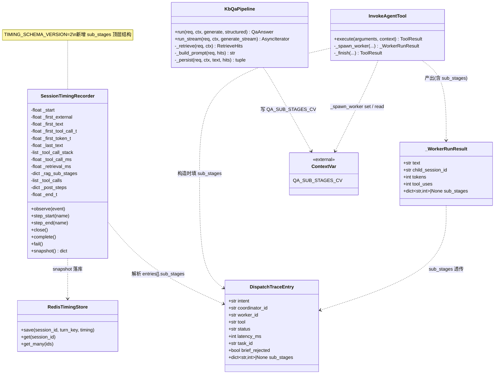
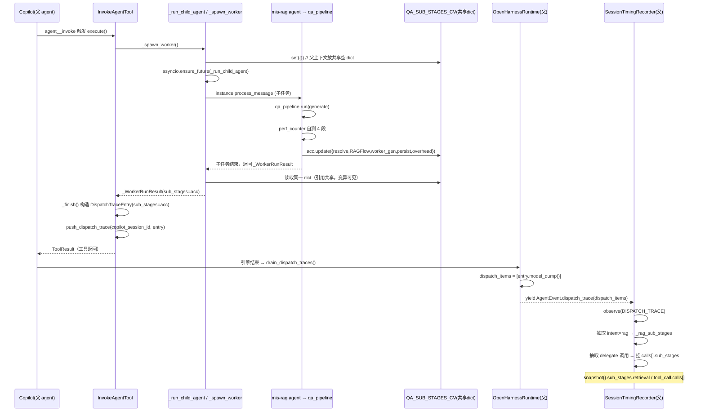
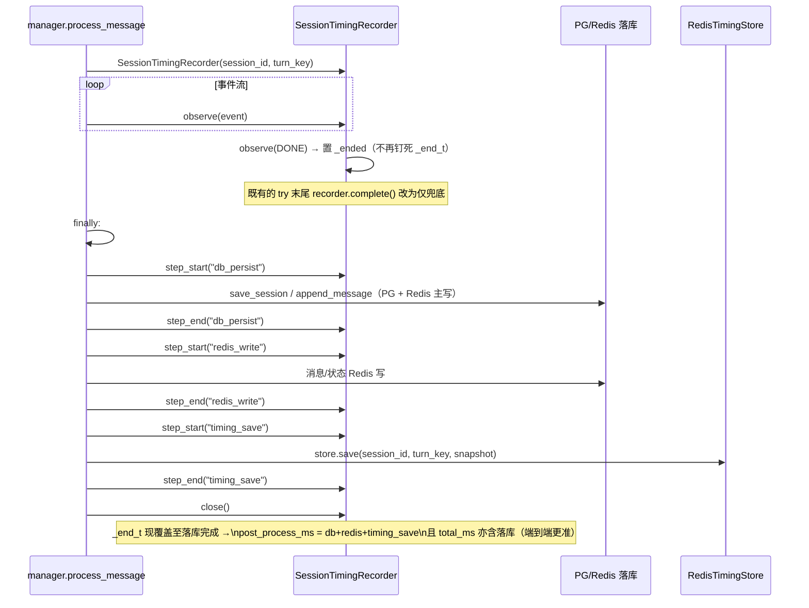
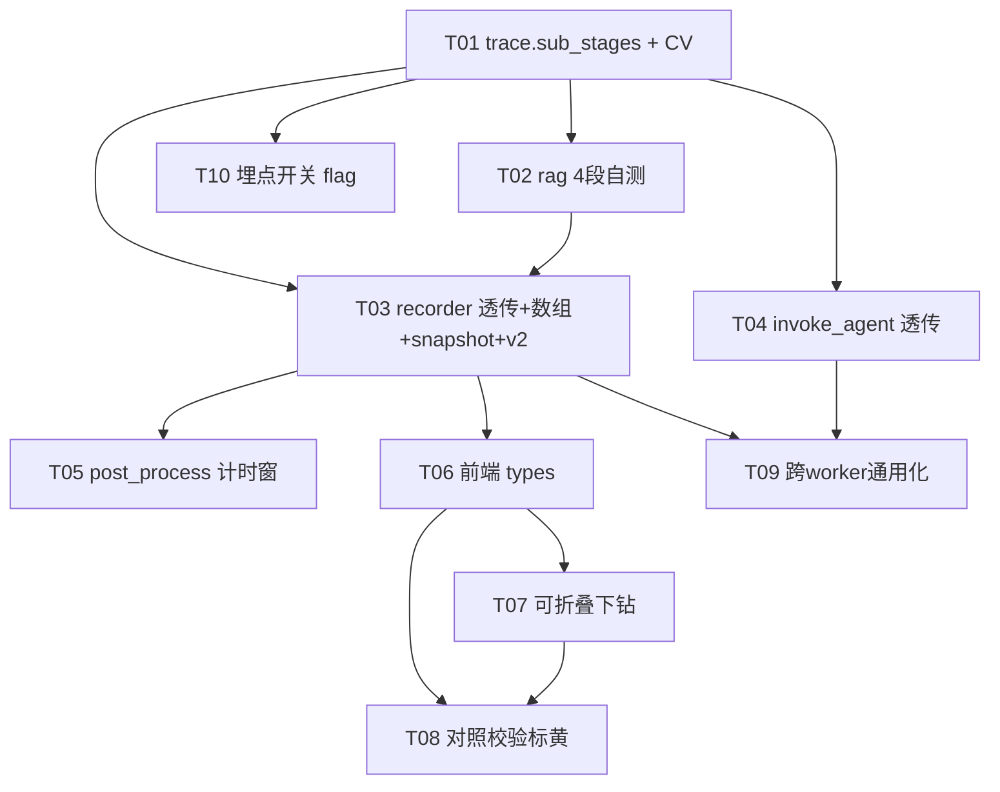

# 增量设计：对话各环节内部细分埋点（Sub-stage Timing Instrumentation）

| 项 | 内容 |
| --- | --- |
| 文档类型 | 增量设计（系统架构 + 任务分解） |
| 产品线 | ai-platform 智能体后端（FastAPI+Python） + mis-admin-web 前端（React+TS） |
| 关联 PRD | `docs/prd/agent-timing-instrumentation-prd.md`（许清楚，2026-08-15） |
| 作者 | 架构师 高见远 |
| 日期 | 2026-08-15 |
| 设计原则 | **增量扩展，不推翻重做**；顶层 5 阶段展示不变，仅在其下挂子阶段明细；任何异常静默降级，绝不阻断主对话链路 |

---

## 0. 设计摘要（给 team-lead）

- **核心机制**：worker（mis-rag）内部 4 段细分经 `DispatchTraceEntry.sub_stages` 一个可选字段透传，由 `OpenHarnessRuntime.drain_dispatch_traces` 自动随 dispatch.trace 事件回流父 `SessionTimingRecorder`。**`events.py` / `openharness.py` 零改动**——sub_stages 只是 `DispatchTraceEntry.model_dump()` 多带的一个 dict，全链路天然透传，与现有 `retrieval_ms` 共用同一通道，**零回归**。
- **跨任务边界传值**：mis-rag 的 `qa_pipeline` 把 4 段计时写进一个**共享 dict**（经由 `_spawn_worker` 在父上下文 set 的 `ContextVar`——拷贝上下文只复制引用，dict 对象被父子任务共享，子任务内变异对父任务可见），`_run_child_agent` 取出后塞进 `_WorkerRunResult.sub_stages` → `InvokeAgentTool._finish` → `DispatchTraceEntry.sub_stages`。
- **post_process 计时窗**：推荐把 `recorder.complete()` 在成功路径上的"窗口关闭"语义**延后**——`observe(DONE)` 仍照常置 `_ended`，但 `_end_t`（= 端到端终点 + post_process 终点）改由 finally 末的 `recorder.close()`（新增）最终落定。`finally` 内三步（PG 落库 / Redis 写 / timing 保存）前后各打点，写进 `_post_steps`。`complete()` 在错误路径与向后兼容中仍可用，**语义不破坏**。
- **schema 升级**：`TIMING_SCHEMA_VERSION` 1→2，per-turn snapshot 顶层加 `sub_stages` 对象；旧数据缺省 `null`/`"—"`，前端零回归。
- **依赖**：无新增第三方包。

---

## 1. 实现方案 + 框架选型

### 1.1 技术栈（沿用，不引入新框架/依赖）

| 层 | 现状 | 本次 |
| --- | --- | --- |
| 后端 | FastAPI + Python 3.11，Pydantic v2 | 不变 |
| 计时 | `time.monotonic()` / `perf_counter()`（无新库） | 不变 |
| 事件流 | `AgentEvent` / `AgentEventType`（Pydantic） | 不变（`sub_stages` 仅作字典透传） |
| 存储 | Redis（`RedisTimingStore`，map + 环形缓冲 + TTL 24h） | 不变（仅值结构加字段） |
| 前端 | React + TS + Tailwind + lucide | 不变 |

**结论**：保持零新增依赖。所有改造均在既有模块内扩展字段与方法。

### 1.2 增量改造整体思路（4 个支点）

```
支点 A：DispatchTraceEntry.sub_stages（新可选字段）
        └─ mis-rag qa_pipeline 自测 4 段 → 共享 dict（ContextVar）→ _WorkerRunResult
           → InvokeAgentTool._finish 填入 sub_stages
        └─ 经 push_dispatch_trace → OpenHarnessRuntime.drain → dispatch.trace 事件 → 父 recorder 消费
支点 B：SessionTimingRecorder 扩展
        ├─ 新增子阶段时间戳与 _post_steps / _tool_calls 列表
        ├─ observe(DISPATCH_TRACE) 额外抽取 intent=rag 的 sub_stages → retrieval.sub_stages
        ├─ 每个 TOOL_CALL/TOOL_RESULT 配对升级为带 tool_name/kind/sub_stages 的明细
        └─ snapshot() 产出 sub_stages 顶层结构 + TIMING_SCHEMA_VERSION=2
支点 C：post_process 计时窗延伸
        └─ manager.finally 三步打点 + recorder.close() 落定 _end_t
支点 D：前端可折叠下钻
        └─ types 扩展 sub_stages + InlineTimingCell 可点击展开 + 对照校验标黄
```

### 1.3 关键技术约束的落地裁定（对应 PM 已确认的两点）

1. **子阶段回流通道 = `DispatchTraceEntry.sub_stages`**。经验证：
   - `trace.py::push_dispatch_trace` 用 `entry.model_dump()` 序列化，`sub_stages` 作为新字段会自动进入缓冲。
   - `openharness.py` 仅 `yield AgentEvent.dispatch_trace(dispatch_items)`（`dispatch_items` 即 model_dump 字典列表），不解析内部字段 → **全链路透传，openharness/events 零改动**。
   - 父 copilot 的 `SessionTimingRecorder.observe(DISPATCH_TRACE)` 扩展解析 `trace["entries"][*]["sub_stages"]` 即可。
   - 现有 `retrieval_ms` 已依赖 `DISPATCH_TRACE_EVENT_ENABLED`（默认开），扩展无回归风险。

2. **post_process 计时窗延伸**（详见 §4 时序图与 §8 待明确 Q5）：
   - 现状：`recorder.complete()` 在 `manager.process_message` 的 try 块末尾（DONE 事件后）调用，`_end_t` 即被钉在 DONE 时刻；`finally` 内的落库（含 `store.save` 即 timing 保存）发生在 `_end_t` 之后 → `post_process_ms` 恒≈0。
   - 裁定：**把"窗口关闭"从 try 末尾移到 finally 末尾**。成功路径不再由 `complete()` 钉死 `_end_t`，改由新增 `recorder.close()` 在 finally 三步打点完成后落定。错误路径保留 `fail()/complete()` 行为。

---

## 2. 文件列表及相对路径（标注「修改 / 新增」）

### 2.1 后端（`agent/ai-platform/backend/src`）

| 文件 | 操作 | 说明 |
| --- | --- | --- |
| `src/coordinator/trace.py` | 修改 | `DispatchTraceEntry` 增 `sub_stages: dict[str,int]\|None` 字段；新增 `QA_SUB_STAGES_CV: ContextVar[dict\|None]`（共享细数字典的传输载体）；`push_dispatch_trace` 无需改（model_dump 自动带出） |
| `src/agent/session_timing.py` | 修改 | `SessionTimingRecorder` 增子阶段时间戳、`_tool_calls` 列表、`_post_steps`、`_rag_sub_stages`；`observe`/`snapshot` 扩展；`TIMING_SCHEMA_VERSION=2`；新增 `step_start/step_end/close`；`StageTiming`/`SessionTiming` 增 `sub_stages` 字段 |
| `src/skills/tools/invoke_agent.py` | 修改 | `_WorkerRunResult` 增 `sub_stages`；`_spawn_worker` set `QA_SUB_STAGES_CV` 传入；`execute` 把 `run_result.sub_stages` 交给 `_finish`；`_finish` 填 `DispatchTraceEntry.sub_stages` |
| `src/agent/mis_rag/qa_pipeline.py` | 修改 | `run`/`run_stream` 内以 `perf_counter` 自测 4 段 + overhead；经 `QA_SUB_STAGES_CV` 回写；`retrieve_kb_chunks`/`_retrieve`/`_persist` 内埋点；异常静默（单段失败置 null） |
| `src/agent/mis_rag/mis_capability.py`（或 rag 技能调用 qa_pipeline 处） | 修改 | 调用 qa_pipeline 后，将返回的 metrics 写入 `QA_SUB_STAGES_CV`（若 qa_pipeline 不自写） |
| `src/agent/manager.py` | 修改 | `process_message` finally 内对 PG 落库 / Redis 写 / timing 保存三步包 `step_start/step_end`，末尾调 `recorder.close()`；移除 try 末尾冗余 `recorder.complete()`（或保留作 no-op，见 §8 Q5） |
| `src/runtime/events.py` | 不改 | `dispatch_trace` 的 `trace` 字段为 `dict[str,Any]`，sub_stages 作为 dict 内元素天然透传 |
| `src/runtime/openharness.py` | 不改 | `drain_dispatch_traces` + `yield AgentEvent.dispatch_trace(dispatch_items)` 已自动透传整 dict |

### 2.2 前端（`frontend/mis-admin-web/src`）

| 文件 | 操作 | 说明 |
| --- | --- | --- |
| `src/features/agent/types.ts` | 修改 | `SessionTiming` 增 `sub_stages?: SubStages \| null`；新增 `SubStageBlock` / `ToolCallSubStage` / `SubStages` 类型 |
| `src/features/agent/components/agent-message-stream.tsx` | 修改 | `InlineTimingCell` 改为可点击展开子阶段；新增 `ExpandedSubStageRow`；新增全局"展开全部耗时明细"开关（默认折叠）；子阶段和与父阶段偏差>5% 时父 cell 标黄 |

> 说明：PRD 中给出的路径 `features/agent/agent-message-stream.tsx` 实际位于 `features/agent/components/agent-message-stream.tsx`（已核实），以实际路径为准。

---

## 3. 数据结构和接口（类型定义 / 类图）

### 3.1 `DispatchTraceEntry` 扩展（trace.py）

```python
class DispatchTraceEntry(BaseModel):
    model_config = ConfigDict(extra="ignore")  # 已支持向后兼容

    intent: str = "unknown"
    coordinator_id: str = ""
    worker_id: str = ""
    tool: str = "agent__invoke"
    status: str = "completed"
    latency_ms: int = 0
    task_id: str = ""
    brief_rejected: bool = False
    # ---- 新增（P0-1）：worker 内部子阶段细分的透传载体 ----
    # 平铺的 {指标名: 毫秒} 字典；不可得为 None（缺省即 None，不写 0）
    # rag worker 约定键：resolve_visible_libraries_ms / RAGFlow_retrieve_ms /
    #                     worker_generate_ms / persist_ms / overhead_ms
    # 其它 worker（crm/extract/summary，P2）复用同一结构，键名自定
    sub_stages: dict[str, int] | None = None

# 新增：跨 asyncio.Task 边界传递 worker 细分计时的共享字典载体
# （理由：_spawn_worker 用 asyncio.ensure_future 开子任务，上下文被拷贝但引用共享，
#  子任务内对 dict 对象的变异对父任务可见；比"返回值穿 event 流"更稳。）
QA_SUB_STAGES_CV: ContextVar[dict[str, int] | None] = ContextVar(
    "qa_sub_stages", default=None
)
```

### 3.2 `SessionTimingRecorder` 新增字段与计算方法（session_timing.py）

```python
class SessionTimingRecorder:
    def __init__(self, session_id, turn_key=None):
        self._start = time.monotonic()
        # —— 既有 ——
        self._first_external = None
        self._last_external = None
        self._first_text = None
        self._last_text = None
        self._tool_call_stack = []          # 保留用于配对
        self._tool_call_ms = 0.0
        self._retrieval_ms = 0.0
        self._has_rag_trace = False
        self._ended = False
        self._end_t = None                  # 端到端 + post_process 终点（由 close() 最终落定）
        # —— 新增：子阶段 ——
        self._first_tool_call_t: float | None = None      # 首个 TOOL_CALL 时刻
        self._first_token_t: float | None = None          # 首个 LLM 输出信号 = min(文本, tool.call)
        self._rag_sub_stages: dict[str, int] | None = None # intent=rag 的 sub_stages
        self._tool_calls: list[dict] = []   # 每对调用的明细：
                                            # {tool_name, kind, started_at, ended_at, sub_stages}
        self._post_steps: dict[str, list[float | None]] = {}  # {名: [start, end]}

    # 子阶段计算方法（规划 / 生成 / 后处理）
    def _planning_ttft_ms(self) -> int | None: ...   # (_first_token_t - _start) * 1000
    def _planning_decision_ms(self) -> int | None: ...# (_first_external - _first_token_t) * 1000
    def _generation_ttft_ms(self) -> int | None: ...  # (_first_text - _start) * 1000
    def _generation_stream_ms(self) -> int | None: ...# (_last_text - _first_text) * 1000 == generation_ms
    def _generation_tail_ms(self) -> int | None: ...  # (_end_t - _last_text) * 1000

    # post_process 三步打点（弱引用，异常静默）
    def step_start(self, name: str) -> None: ...
    def step_end(self, name: str) -> None: ...
    def close(self) -> None:
        """成功路径：finally 三步完成后落定 _end_t（窗口关闭点）。
        幂等：若已 _ended（DONE/ERROR/fail）仍按既有 _end_t；否则以当前时刻收口。"""

    # observe 扩展要点
    def observe(self, event):
        ...
        elif TOOL_CALL: self._first_tool_call_t ??= t; 更新 _first_token_t; 压栈并记 _tool_calls 明细
        elif TOOL_RESULT: 出栈配对，写 ended_at + latency_ms，累加 _tool_call_ms
        elif DISPATCH_TRACE:
            self._retrieval_ms += 既有 rag latency 求和
            for entry in trace["entries"]:
                if entry["intent"]=="rag": self._rag_sub_stages = entry.get("sub_stages")
                if entry["tool"]=="agent__invoke" and entry.get("sub_stages"):
                    挂到最近一个无 sub_stages 的 delegate 调用明细
        ...
```

### 3.3 Redis per-turn snapshot 的 `sub_stages` 顶层结构（TIMING_SCHEMA_VERSION 1→2）

```jsonc
{
  "turn_key": "asst-msg-id",
  "total_ms": 17470,
  "stages": { "planning_ms": 5240, "retrieval_ms": 8640, "tool_call_ms": 9,
              "generation_ms": 12140, "post_process_ms": 41 },
  "sub_stages": {
    "planning":   { "ttft_ms": 4120, "decision_ms": 1120 },
    "retrieval":  {
      "resolve_visible_libraries_ms": 320, "RAGFlow_retrieve_ms": 1850,
      "worker_generate_ms": 5600, "persist_ms": 870, "overhead_ms": 0 },
    "tool_call":  {
      "calls": [ { "tool_name": "agent__invoke", "kind": "delegate", "latency_ms": 8642,
                   "sub_stages": { "resolve_visible_libraries_ms": 320, "RAGFlow_retrieve_ms": 1850,
                                   "worker_generate_ms": 5600, "persist_ms": 870, "overhead_ms": 0 } } ],
      "delegate_round_trip_ms": 2 },
    "generation": { "ttft_ms": 80, "stream_ms": 12010, "tail_ms": 50 },
    "post_process": { "db_persist_ms": 33, "redis_write_ms": 5, "timing_save_ms": 3 }
  },
  "schema_version": 2,
  "sampled_at": "2026-08-15T..."
}
```

**兼容处理**：
- `TIMING_SCHEMA_VERSION` 由 1 升 2；`RedisTimingStore` 读写逻辑不变（仍是 map + 环形缓冲 + TTL）。
- 读取端：`schema_version < 2` 或 `sub_stages` 缺失 → 视为 `null`；前端 `sub_stages ?? null` → 各子段显示「—」，旧前端/旧数据零回归。
- 字段命名 snake_case、单位 ms、`null` 表示不可得，与 PRD §4 约定一致。

### 3.4 类图（Mermaid）



---

## 4. 程序调用流程（时序图）

### 4.1 worker 子阶段经 DISPATCH_TRACE 回流父 recorder（核心机制）



### 4.2 post_process 计时窗延伸到 finally



---

## 5. 前端子阶段下钻（设计）

- 顶层 5 阶段 `InlineTimingCell` 保持不变，但变为**可点击**：点击切换展开/折叠该阶段的 `sub_stages` 次级行。
- 次级行用与 `InlineTimingCell` 同款 `fmtMs` 渲染各子段（`null` → 「—」）。
- 新增全局开关「展开全部耗时明细」，**默认折叠**（长会话性能友好）。
- **对照校验**：`Σ sub_stages 各段` 与对应父阶段 `stages.*_ms` 偏差 > 5% 时，父 cell 标黄（`⚠`），提示口径漂移。
- 类型扩展见 §3/§2.2；旧数据 `sub_stages` 缺省 → 子段显示「—」，不报错。

---

## 6. 任务列表（有序、含依赖、按实现顺序排列）

> 说明：本任务按 PRD §8 的 P0/P1/P2 细化，未强行压到 5 个任务——因 P0 内部 4 子项跨不同模块且不耦合，合并会劣化可审查性与验收对齐。每个任务标注依赖与优先级。

### P0 — 后端细分埋点 + 存储扩展（本论必做）

| Task ID | 任务名 | 源文件（修改/新增） | 依赖 | 优先级 |
| --- | --- | --- | --- | --- |
| **T01** | `DispatchTraceEntry.sub_stages` 字段 + `QA_SUB_STAGES_CV` 传输载体 | `src/coordinator/trace.py`（改） | — | P0 |
| **T02** | mis-rag `qa_pipeline` 4 段 + overhead 自测回填（经 CV）；`mis_capability` 回写 | `src/agent/mis_rag/qa_pipeline.py`（改）、`mis_capability.py`（改） | T01 | P0 |
| **T03** | `SessionTimingRecorder` 透传 `retrieval.sub_stages`；`planning/generation` 子阶段计算；`tool_call` 改数组（带 `tool_name/kind/sub_stages`）；`delegate_round_trip_ms`；`snapshot()` 产出 `sub_stages` 结构；`TIMING_SCHEMA_VERSION=2` | `src/agent/session_timing.py`（改） | T01, T02 | P0 |
| **T04** | `InvokeAgentTool`/`_run_child_agent` 透传 `sub_stages`（`_WorkerRunResult.sub_stages`、`_spawn_worker` set CV、`_finish` 填 entry） | `src/skills/tools/invoke_agent.py`（改） | T01 | P0 |
| **T05** | post_process 计时窗延伸：`manager.finally` 三步 `step_start/step_end` + `recorder.close()`；`step_start/step_end/close` 方法实现 | `src/agent/manager.py`（改）、`src/agent/session_timing.py`（改，T03 同文件） | T03 | P0 |

### P1 — 前端展示子阶段（下钻体验）

| Task ID | 任务名 | 源文件 | 依赖 | 优先级 |
| --- | --- | --- | --- | --- |
| **T06** | `types.ts` 扩展 `sub_stages`（`SubStageBlock`/`ToolCallSubStage`/`SubStages`） | `src/features/agent/types.ts`（改） | T03 | P1 |
| **T07** | `agent-message-stream.tsx` 可折叠子阶段下钻（顶层 5 阶段不变，点击展开次级行 + 全局开关默认折叠） | `src/features/agent/components/agent-message-stream.tsx`（改） | T06 | P1 |
| **T08** | 子阶段和与父阶段对照校验，偏差 >5% 父 cell 标黄 | 同 T07 | T06, T07 | P1 |

### P2 — 跨 agent 通用化（后续演进）

| Task ID | 任务名 | 源文件 | 依赖 | 优先级 |
| --- | --- | --- | --- | --- |
| **T09** | 跨 worker 通用化：crm/extract/summary 等同款 `sub_stages` 埋点（复用 `DispatchTraceEntry.sub_stages`） | 各 worker pipeline + `session_timing.py`（改） | T03, T04 | P2 |
| **T10** | 埋点开关 feature flag（高频会话可降级关闭子阶段采集，落点见 §8 Q8） | `src/coordinator/flags.py` + 各采集点（改） | T01 | P2 |

### 6.1 任务依赖图（Mermaid）



---

## 7. 依赖包列表

**无新增第三方依赖。** 全部使用现有栈：

- 后端：Python 3.11 + FastAPI + Pydantic v2 + `redis.asyncio`（已在用）+ `contextvars`（标准库）+ `time`/`perf_counter`（标准库）。
- 前端：React + TypeScript + Tailwind CSS + lucide-react（已在用），仅类型与组件增量，无新包。

---

## 8. 待明确事项（架构层面推荐决策，对应 PRD §10）

| # | PRD 问题 | 架构/技术推荐取舍 |
| --- | --- | --- |
| Q1 | 前端展示粒度（折叠/展开/移动端/全局开关） | **推荐默认折叠 + 全局"展开全部"开关**（如 PRD §7）。移动端（H5 运营台）同套组件复用，子阶段次级行在窄屏自动换行；不单独为 H5 另写。 |
| Q2 | 是否所有 agent 通用 | 本论 P0 仅 copilot + rag；crm/extract/summary 留 **P2（T09）**。架构已预留：recorder 对"非 rag 的 delegate 调用"也挂 `calls[].sub_stages`，只是这些 worker 在 P2 才回填。 |
| Q3 | 埋点开关 | **P2（T10）实现，但本期预留**：建议复用既有 `src/coordinator/flags.py` 的三通道 `bool_flag` 范式，新增 `SUBSTAGE_INSTRUMENTATION_ENABLED`（默认开）。采集点（qa_pipeline 打点、`recorder.observe` 抽取、`push_dispatch_trace`）首行判开关，关则跳过、sub_stages 写 `null`。落点统一在 flags 层，不散落常量。 |
| Q4 | `worker_generate_ms` 测量点 | **推荐在 `qa_pipeline.run/run_stream` 内用 `perf_counter` 包裹 `generate(prompt)` 回调**，不改 LLM 网关（符合"管线不直连 LLM"边界）。若 `generate` 是流式，则在 `run_stream` 的 `async for piece in generate_stream(prompt)` 整体前后计时（`worker_generate_ms` 含首字延迟，可接受）。 |
| Q5 | post_process 计时窗是否延伸 | **推荐延伸（方案采纳）**。把 `_end_t` 落定从 try 末尾 `complete()` 移到 finally 末尾新增的 `recorder.close()`。`observe(DONE)` 仍置 `_ended`（保持生成阶段口径），但 `_end_t` 由 `close()` 收口到最后一步 `timing_save` 之后。这样 `db_persist_ms + redis_write_ms + timing_save_ms ≈ post_process_ms` 严格成立，且 `total_ms` 端到端更准（含落库）。`complete()` 在错误路径与向后兼容中保留。`push_dispatch_trace`/`store.save` 异常静默，绝不阻断主链路。 |
| Q6 | `planning_decision_ms` 可测性 | **接受 P0 仅保证 `planning_ttft_ms`**。`planning_decision_ms` 仅在运行时暴露"首 token vs 决策完成"中间事件时可测；不可得时 recorder 置 `null`，不影响 `planning_ttft_ms`/`planning_ms` 对照。`_first_token_t = min(_first_text, _first_tool_call_t)` 已为决策段留出测量基础。 |
| Q7 | retrieval 4 段口径对齐 / overhead 归属 | **推荐 `overhead_ms` 独立展示**作为差值校验项（PRD §4.2 已定）。`resolve + RAGFlow + worker_generate + persist + overhead ≈ retrieval_ms`；偏差 < 5% 吸收进 overhead，否则标黄（前端 T08）。`_build_prompt` CPU 拼接并入 overhead（量级极小）。 |
| Q8 | delegate 往返拆分精度 | **推荐 P0-3 增强**：`delegate_round_trip_ms = calls[].latency_ms - Σ calls[].sub_stages`（近似）。若需精确，可在 `InvokeAgentTool._spawn_worker` 进 `_run_child_agent` 前后用 `perf_counter` 测"pre-worker 编排耗时"（会话创建/深度 set 等），与 `qa_pipeline` 自测的 worker 内部段相加对账；本期先落近似，精确化记 P2 增强。 |

---

## 9. 共享知识（跨文件约定）

1. **`sub_stages` 上报格式约定**：一律 `dict[str, int] | None` 平铺字典，`key=snake_case 指标名`，`value=毫秒整数（非负）`，单段不可得为 `null`（整字段缺省即 None，不写 0）。禁止嵌套对象（仅 `tool_call.calls[].sub_stages` 因数组而间接嵌套）。
2. **字段命名约定**：所有子阶段指标 snake_case + `_ms` 后缀；父阶段聚合字段沿用既有 `stages.*_ms`；`_ms` 单位恒为毫秒。
3. **`DispatchTraceEntry.sub_stages` 与 recorder 消费的契约**：
   - 写入方（worker）：`qa_pipeline` 经 `QA_SUB_STAGES_CV` 回写共享 dict → `_WorkerRunResult.sub_stages` → `InvokeAgentTool._finish` → `DispatchTraceEntry(sub_stages=...)` → `push_dispatch_trace`。
   - 透传方：`push_dispatch_trace`/`drain_dispatch_traces`/`AgentEvent.dispatch_trace`/OpenHarnessRuntime **不解析 sub_stages，仅作为 dict 透传**（零改动）。
   - 消费方（父 recorder）：`observe(DISPATCH_TRACE)` 解析 `trace["entries"]`，`intent=="rag"` → `snapshot.sub_stages.retrieval`；`tool=="agent__invoke"` 且带 `sub_stages` → 挂到最近一个未填的 delegate `calls[]` 明细。
4. **`QA_SUB_STAGES_CV` 跨任务边界约定**：由 `InvokeAgentTool._spawn_worker` 在**父上下文** `set({})`，经 `asyncio.ensure_future` 拷贝引用后，子任务内 `acc = CV.get(); acc.update(...)` 的变异对父任务可见；`_spawn_worker` 任务结束后读同一 dict。严禁把 CV 当作"可回传对象"以外的用途。
5. **schema 版本号演进规则**：`TIMING_SCHEMA_VERSION` 仅在 per-turn snapshot 结构变更时 +1；读取端对 `schema_version < 2` 或 `sub_stages` 缺失一律降级为 `null`/「—」；Redis key/map/环形缓冲/TTL 永不跨版本变更。
6. **降级红线**：任何子阶段采集/解析异常必须 `try/except` 静默、对应字段置 `null`，不得 raise、不得阻断主对话链路（沿用 `session_timing` 既有范式）。
7. **对照校验口径**：严格求和项见 PRD §9.3；`overhead_ms` 为差值吸收项；偏差 >5% 由前端 T08 标黄，后端不强制。

---

## 10. 验收对照（摘自首 PRD §9，设计侧保证）

- 子阶段字段均有独立数据来源（事件 / trace / finally 打点），不可得为 `null`。
- 前端可点击父阶段下钻（P1）。
- 严格求和项：
  - `planning_ttft_ms + planning_decision_ms = planning_ms`
  - `Σ tool_call.calls[].latency_ms = tool_call_ms`
  - `db_persist_ms + redis_write_ms + timing_save_ms ≈ post_process_ms`（T05 延伸后）
  - `resolve + RAGFlow + worker_generate + persist + overhead ≈ retrieval_ms`（偏差<5% 吸收进 overhead）
  - `generation_stream_ms = generation_ms`
- 零回归：顶层 5 阶段、Redis 结构、TTL/环形缓冲、降级红线、旧数据「—」均不受影响。
- 降级安全：子阶段异常静默。
