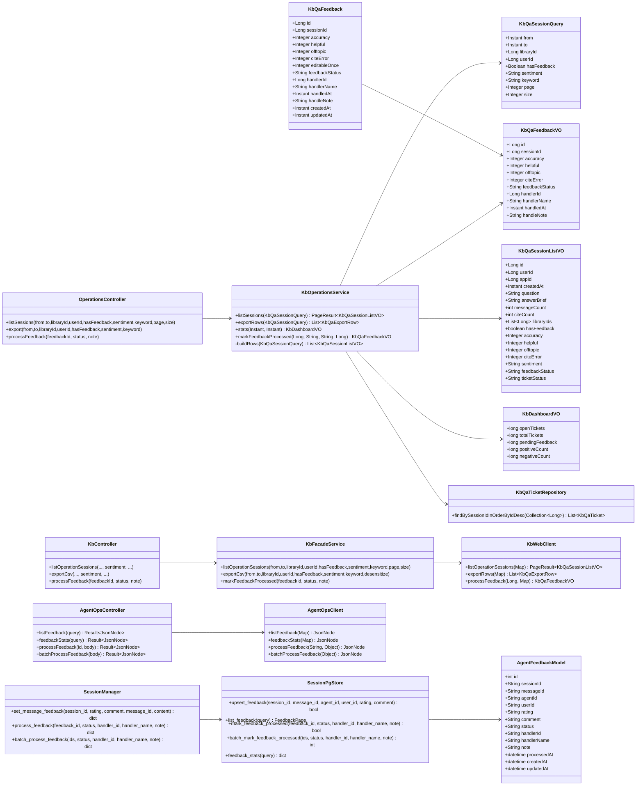
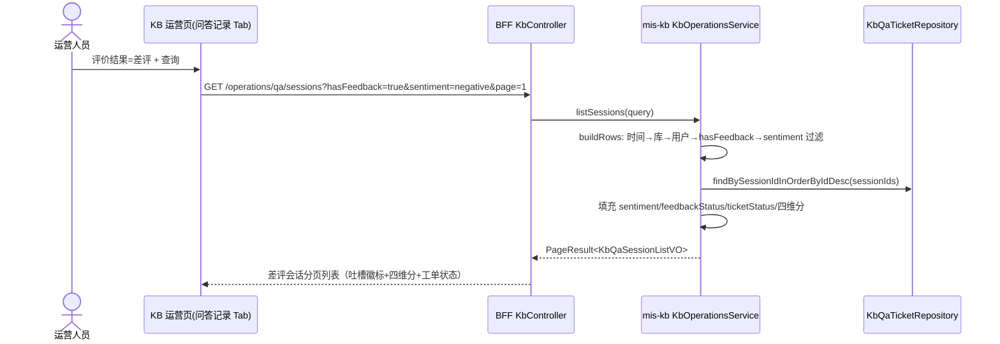
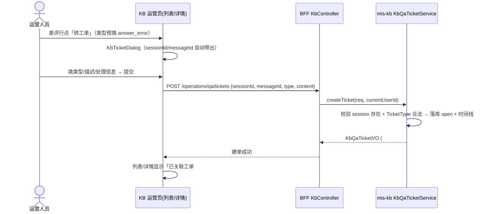
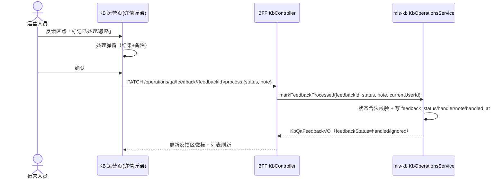
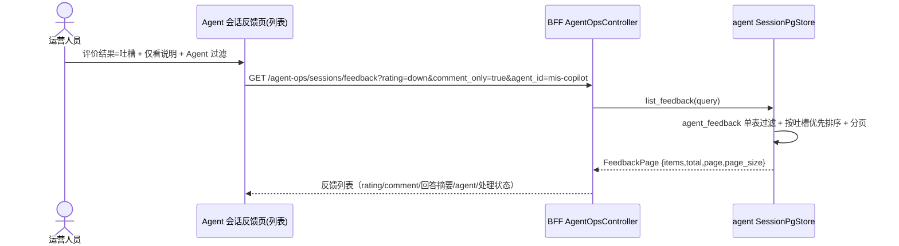
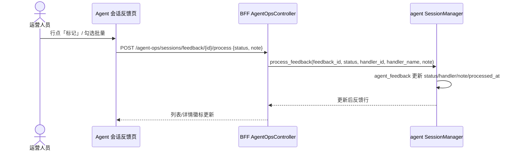
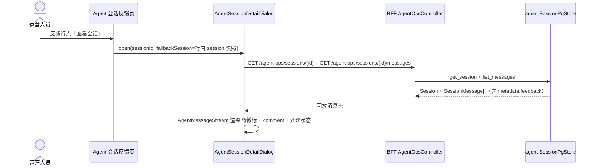

# KB 知识问答反馈运营 + Copilot 会话反馈运营 系统设计与任务分解

| 项 | 内容 |
|---|---|
| 版本 | v0.1（设计稿） |
| 日期 | 2026-08-13 |
| 作者 | Bob（架构师） |
| 上游输入 | `docs/prd/kb-feedback-operations-prd-2026-08-13.md`（OP-01~OP-06）+ `docs/prd/kb-feedback-ops-copilot-feedback-2026-08-13.md`（CF-01~CF-05） |
| 范围 | **两套 P0 一起做**（OP-01~06 + CF-01~05）；P1/P2 一律不做不设计 |
| 关联模块 | mis-kb（8108）、mis-admin-bff（8081）、mis-migrator（V43）、mis-admin-web、agent/ai-platform（Python + Alembic） |

---

## 1. 实现方案

### 1.1 总体判断（已读代码核实）

| 结论 | 依据 |
|---|---|
| KB 侧「数据底座 + 只读视图 + 工单闭环」已齐，本次是**查询口径扩展 + 反馈处理状态（轻量闭环）+ 运营侧入口补全** | `KbOperationsService.listSessions/exportRows/stats`、`QaTicketController` 均已存在 |
| Agent 侧「采集已通、运营为零」，本次是**在既有会话管理能力上新增反馈聚焦视图 + 轻量处理闭环 + 统计** | `message.metadata.feedback`（rating/comment）已采集；`GET /sessions` 列表已具备 agent/channel 过滤；无任何反馈运营端点 |
| **两套数据模型与 ID 空间完全不同**（KB：Long session_id + 四维评分；Agent：UUID session_id + rating/comment），按决策 D2 分页独立建设，不合并 | 前端 `features/kb/operations/` 与 `features/agent/` 本就是两个 feature，`arch/no-cross-feature` 为 error 级 |
| **Agent 侧存在 Alembic 迁移体系**（`backend/alembic/versions/001~003`，最新 003 建 `agent_session`/`agent_session_message`），CF-03 处理状态落点可走 **Alembic 004 新建独立表**，不必依赖 Redis metadata 扩展 | `003_add_agent_session_tables.py` 确认；`src/db/session.py:91` 的 `create_all` 是运行时兜底，建表以迁移为准 |

### 1.2 A. KB 知识问答反馈（OP-01~OP-06，在 `features/kb/operations/` 3 Tab 内增强）

| 编号 | 设计要点 | 复用 | 新增 |
|---|---|---|---|
| OP-01 | 评价结果筛选：`KbQaSessionQuery` 增 `sentiment`（`null`=全部 / `positive`=好评 / `negative`=差评），`hasFeedback` 保留（`true`=已评价 / `false`=未评价）。前端下拉四项：全部 / 好评 / 差评 / 未评价（**按团队拍板，不做「已评价」独立项**）。好评=综合分 ≥4；差评=综合分 ≤2 **或** offtopic>0 **或** citeError>0（与 `stats` 的 `negativeSessionIds` 口径完全一致）。筛选在 `buildRows` 内存聚合内完成 | 好评/差评口径复用 `POSITIVE_SCORE_MIN`/`NEGATIVE_SCORE_MAX` + 显式问题标记逻辑 | `sentiment` 参数贯通 mis-kb → BFF → 前端 |
| OP-02 | 吐槽会话列表增强：`KbQaSessionListVO` 增 `offtopic`/`citeError`/`sentiment`/`feedbackStatus`/`ticketStatus`。行内「评价」单元格：好评=绿徽标；差评=红「吐槽」徽标 + 四维分 + 工单状态徽标（无/待处理/处理中/已解决/已关闭）+ 反馈处理状态徽标（待处理/已处理/已忽略）；操作列差评行补「转工单」 | 列表页表格骨架、列宽拖拽 `use-column-widths` | VO 字段、`buildRows` 填充、前端单元格 |
| OP-03 | 会话详情强化：`KbQaFeedbackVO` 增处理状态字段（反馈区置顶展示四维分 + 处理状态 + 工单状态徽标）；详情弹窗新增「转工单」按钮（类型按吐槽维度预填 `answer_error`/`cite_error`，自动带 `sessionId`/`messageId`）与「标记已处理/忽略」按钮 | `getSessionDetailForOperations` 已返回 feedback + `listTicketsBySession` 已返回关联工单 | `KbQaFeedbackVO` 字段、前端详情弹窗反馈区改造 |
| OP-04 | 吐槽→工单一键转化：**完全复用**现有 `POST /api/v1/kb/operations/qa/tickets` + 前端 `KbTicketDialog`（用户侧建单弹窗）交互，从运营列表/详情发起；建单成功后反馈区显示「已关联工单 #id」。P0 不做显式 feedback↔ticket 关联（PRD Q4 归 P1）、不做建单去重（弱关联现状接受） | `KbQaTicketService.create`、BFF `createTicket`、前端 `kb-ticket-dialog.tsx` | 仅前端入口接线 |
| OP-05 | 反馈处理状态（轻量闭环）：`kb_qa_feedback` 增 `feedback_status`（pending/handled/ignored）+ `handler_id`/`handler_name`/`handled_at`/`handle_note`。新增端点 `PATCH /operations/qa/feedback/{feedbackId}/process`（body `{status: handled\|ignored, note?}`，处理人取当前登录人）。看板 `KbDashboardVO` 增 `pendingFeedback` 计数（待处理反馈数），与「待处理工单」并列展示。**这是「差评响应时效/处理覆盖率/闭环可追踪率」三指标的数据来源** | 工单处理人取当前登录人的模式（`QaTicketController.currentUserId`） | V43 迁移、实体/DTO 字段、process 端点、看板计数 |
| OP-06 | 导出增强：修复 `exportRows` 中 offtopic/citeError 传 `null` 的缺陷（`KbQaExportRow` 已有两字段，直接透传）；导出端点支持 `sentiment` 筛选；保持 10000 行硬上限 + userId 脱敏（BFF `KbExportService`） | `KbExportService.toCsv`、`EXPORT_MAX_ROWS` | `exportRows` 修复、导出参数透传 |

### 1.3 B. Agent 会话反馈（CF-01~CF-05，在 `features/agent/` 新增「会话反馈」页，独立于 KB）

#### 1.3.1 CF-03 处理状态存储方案结论（团队领导点名要求）

**结论：新建独立 PG 表 `agent_feedback`（Alembic 004 迁移），由 `SessionPgStore` 读写；反馈本体继续读 `message.metadata.feedback`（PG 优先、Redis 兜底），处理状态与反馈快照冗余在 `agent_feedback` 表。** 不在 `message.metadata.feedback` 里扩展处理状态。

理由（对照备选方案的否决原因）：

| # | 备选方案 | 否决原因 |
|---|---|---|
| A | 在 `message.metadata.feedback` 内扩展 `processing` 字段 | ① metadata 是 **Redis 权威、PG 尽力同步**（degraded 时只 Redis），运营标记属高可信操作，挂在不保证落盘的投影上不可接受；② 用户**可重复提交覆盖写** feedback，处理状态若在同一 JSON 里，用户改评会连带覆盖运营标记（或需 merge，复杂度上升）；③ Redis TTL 过期/重启后处理状态丢失；④ 无法高效按 status 过滤/统计 |
| B | 独立表 `agent_feedback`（**采纳**） | ① 运营读侧唯一权威，可靠持久化；② 处理状态与反馈快照同表，CF-01 列表/CF-05 统计单表 SQL 即可，索引可控；③ 用户覆盖写 feedback 时在 `set_message_feedback` 里同步 upsert 该表（复用现有 PG 双写位置），语义不变；④ 与现有「PG 是运营读侧权威」口径一致（PRD Q-C3 已接受尽力而为，页面标注「可能存在延迟/遗漏」） |

一致性口径：用户提交 feedback → Redis 写 `message.metadata.feedback`（热路径权威）+ PG 双写 `agent_session_message.metadata`（尽力）+ **upsert `agent_feedback`（尽力，失败降级仅记日志）**；运营标记处理 → 只写 `agent_feedback.status/handler/note/processed_at`（可靠，PG 权威）。

#### 1.3.2 逐项设计

| 编号 | 设计要点 | 复用 | 新增 |
|---|---|---|---|
| CF-01 | Agent 反馈列表：agent 新增 `GET /api/v1/sessions/feedback`（分页 + rating/comment_only/agent_id/channel/from/to/keyword/status 过滤），**默认按「吐槽且 comment 非空」优先排序**。行含：rating 徽标、comment、助手回答摘要（按 message_id 读 `agent_session_message.content` 截断）、agent、用户、处理状态、时间、操作（查看会话/标记）。BFF `AgentOpsController` 透传（返回 `Result<JsonNode>`，与现状一致） | 会话列表的分页/过滤模式（`SessionListQuery`/`SessionPage`）、`AgentOpsController` 透明端点模式 | agent 反馈列表端点 + `SessionPgStore.list_feedback` + 前端反馈列表页签 |
| CF-02 | 会话回放反馈徽标：`agent-message-stream.tsx` 对 assistant 消息的 `metadata.feedback` 结构化渲染（👍已点赞/👎已吐槽 + comment + 处理状态徽标），替代 metadata JSON 裸展开（JSON 仍保留在 `<details>` 兜底） | `AgentMessageStream` 消息流渲染、`AgentSessionDetailDialog` 回放抽屉 | 前端徽标组件 |
| CF-03 | 反馈处理动作：agent 新增 `POST /api/v1/sessions/feedback/{feedbackId}/process`（body `{status: handled\|ignored, note?}`，操作人从透传头取）+ `POST /api/v1/sessions/feedback/batch-process`（body `{ids[], status, note?}`）。BFF 透传；前端列表/详情可标记、列表可批量标记 | 批量删除会话的模式（`batch-delete` 路由 + `MAX_BATCH_*` 上限） | `agent_feedback` 表 + process/batch-process 端点 + 前端处理弹窗 |
| CF-04 | 吐槽→会话回放下钻：反馈列表行「查看会话」→ 打开既有 `AgentSessionDetailDialog`（传 `sessionId` + `fallbackSession`，无需后端改动） | `AgentSessionDetailDialog` 已支持 `fallbackSession` | 仅前端接线 |
| CF-05 | Agent 反馈统计看板：agent 新增 `GET /api/v1/sessions/feedback/stats`（基础计数：反馈总数/点赞/吐槽/点赞率/吐槽率/待处理；按 agent 维度：各 agent 反馈数/点赞率/吐槽率；按日趋势：点赞/吐槽/comment 量）。BFF 透传；前端「会话反馈」页第二个页签卡片展示 | 路由统计 `RouteStats` 聚合形状（BFF 剥信封） | agent 统计端点 + 前端看板页签 |

**BFF 判权**：Agent 反馈端点沿用 `agent-ops` 注册表主路径（`ApiPermissionInterceptor` + `sys_api`），BFF 侧 `deny-unmapped: false`，新端点必须在 V43 登记 `sys_api`+`sys_menu_api`（fail-closed 红线，详见 §4.3）。

---

## 2. 文件列表

### 2.1 mis-kb（`backend/mis-kb`）

| 文件（相对路径） | 增/改 | 职责 |
|---|---|---|
| `src/main/java/com/mis/kb/domain/entity/KbQaFeedback.java` | 改 | 增 `feedbackStatus`/`handlerId`/`handlerName`/`handledAt`/`handleNote` 字段与 getter/setter |
| `src/main/java/com/mis/kb/api/dto/KbQaFeedbackVO.java` | 改 | 增处理状态五字段（详情/反馈列表共用） |
| `src/main/java/com/mis/kb/api/dto/KbQaSessionQuery.java` | 改 | 增 `sentiment`（String：positive/negative/null） |
| `src/main/java/com/mis/kb/api/dto/KbQaSessionListVO.java` | 改 | 增 `offtopic`/`citeError`/`sentiment`/`feedbackStatus`/`ticketStatus` |
| `src/main/java/com/mis/kb/api/dto/KbDashboardVO.java` | 改 | 增 `pendingFeedback` 计数 |
| `src/main/java/com/mis/kb/domain/repository/KbQaTicketRepository.java` | 改 | 增 `findBySessionIdInOrderByIdDesc(Collection<Long>)`（批量取会话最新工单状态） |
| `src/main/java/com/mis/kb/domain/service/KbOperationsService.java` | 改 | `buildRows` 支持 sentiment 筛选 + VO 扩展字段填充 + `exportRows` 补 offtopic/citeError + `stats` 增 pendingFeedback + 新增 `markFeedbackProcessed` |
| `src/main/java/com/mis/kb/api/controller/OperationsController.java` | 改 | 列表/导出增 `sentiment` 参数；新增 `PATCH /qa/feedback/{feedbackId}/process` |

### 2.2 迁移（`backend/mis-migrator`）

| 文件（相对路径） | 增/改 | 职责 |
|---|---|---|
| `src/main/resources/db/migration/V43__kb_feedback_processing.sql` | **新** | A. `kb_qa_feedback` 增处理状态五列；B. sys_api 登记 KB process 端点（91201）；C. sys_api 登记 Agent 反馈四端点（92158~92161）；D. sys_menu_api 绑定（91290、92158~92161）；E. 新菜单 92046「会话反馈」+ 新权限码 `agent:feedback:view` + sys_role_permission 授权 |

### 2.3 BFF（`backend/mis-admin-bff`）

| 文件（相对路径） | 增/改 | 职责 |
|---|---|---|
| `src/main/java/com/mis/adminbff/controller/KbController.java` | 改 | 运营列表/导出增 `sentiment` 透传；新增 `PATCH /operations/qa/feedback/{feedbackId}/process`（@OperLog 审计） |
| `src/main/java/com/mis/adminbff/service/KbFacadeService.java` | 改 | `listOperationSessions`/`exportCsv` 增 `sentiment`；新增 `markFeedbackProcessed` |
| `src/main/java/com/mis/adminbff/client/KbWebClient.java` | 改 | 透传 sentiment；新增 process 调用 |
| `src/main/java/com/mis/adminbff/controller/AgentOpsController.java` | 改 | 新增 `GET /sessions/feedback`、`GET /sessions/feedback/stats`、`POST /sessions/feedback/{id}/process`、`POST /sessions/feedback/batch-process`（透明透传 Result\<JsonNode\>） |
| `src/main/java/com/mis/adminbff/client/AgentOpsClient.java` | 改 | 新增 feedback 四端点透传（SESSIONS 前缀复用） |
| `src/main/java/com/mis/adminbff/service/agentops/AgentOpsFacadeService.java` | 改 | feedback 四端点转发（参数装配 + 操作人头透传） |

### 2.4 前端 mis-admin-web（`frontend/mis-admin-web`）

| 文件（相对路径） | 增/改 | 职责 |
|---|---|---|
| `src/features/kb/api/kb-api.ts` | 改 | `OperationSessionQuery` 增 `sentiment`；`exportOperationsCsv` 透传；新增 `markFeedbackProcessed`/`FeedbackProcessPayload` |
| `src/features/kb/types.ts` | 改 | `KbQaSessionListItem`/`KbQaFeedback` 增 sentiment/处理状态/工单状态字段 |
| `src/features/kb/operations/kb-qa-record-tab.tsx` | 改 | 筛选区加「评价结果」下拉；评价单元格改四维徽标 + 工单状态徽标 + 处理状态徽标；操作列差评行加「转工单」 |
| `src/features/kb/operations/kb-qa-session-detail-dialog.tsx` | 改 | 反馈区置顶突出（吐槽维度高亮）；新增「转工单」「标记已处理/已忽略」按钮与处理弹窗；关联工单状态徽标 |
| `src/features/kb/operations/kb-dashboard-tab.tsx` | 改 | 新增「待处理反馈」卡片 |
| `src/features/agent/types.ts` | 改 | 增 `AgentFeedbackItem`/`AgentFeedbackQuery`/`AgentFeedbackStats`/`AgentFeedbackStatus` |
| `src/features/agent/api/agent-ops-api.ts` | 改 | 增 `listAgentFeedback`/`getAgentFeedbackStats`/`processAgentFeedback`/`batchProcessAgentFeedback` |
| `src/features/agent/components/agent-message-stream.tsx` | 改 | assistant 消息 `metadata.feedback` 结构化徽标渲染（CF-02） |
| `src/features/agent/sessions/agent-feedback-page.tsx` | **新** | 「会话反馈」页（反馈列表 + 统计看板两个页签；复用 `AgentSessionDetailDialog` 下钻） |
| `src/features/agent/pages.ts` | 改 | 导出 `AgentFeedbackPage` 桥接 |

### 2.5 agent/ai-platform（`agent/ai-platform/backend`）

| 文件（相对路径） | 增/改 | 职责 |
|---|---|---|
| `alembic/versions/004_add_agent_feedback.py` | **新** | 建 `agent_feedback` 表 + 索引（revision 004, down_revision 003） |
| `src/models/agent_feedback.py` | **新** | `AgentFeedbackModel` ORM（wire 字段对齐） |
| `src/agent/session_store.py` | 改 | 增 `upsert_feedback`（幂等）/`list_feedback`/`mark_feedback_processed`/`batch_mark_feedback_processed`/`feedback_stats` |
| `src/agent/session.py` | 改 | `set_message_feedback` 追加 `agent_feedback` upsert（与 PG 双写同一降级语义）；新增 `process_feedback`/`batch_process_feedback` |
| `src/api/routes/session.py` | 改 | 新增 `GET /sessions/feedback`、`GET /sessions/feedback/stats`、`POST /sessions/feedback/{feedback_id}/process`、`POST /sessions/feedback/batch-process`（**注意路由顺序：字面量 `feedback` 必须先于 `/{session_id}` 注册**，与 `batch-delete` 同款约束） |

---

## 3. 数据结构与接口

### 3.1 V43 迁移字段定义（KB）

```sql
ALTER TABLE kb_qa_feedback
    ADD COLUMN IF NOT EXISTS feedback_status VARCHAR(16) NOT NULL DEFAULT 'pending',
    ADD COLUMN IF NOT EXISTS handler_id     BIGINT        NULL,
    ADD COLUMN IF NOT EXISTS handler_name   VARCHAR(128)  NULL,
    ADD COLUMN IF NOT EXISTS handled_at     TIMESTAMPTZ   NULL,
    ADD COLUMN IF NOT EXISTS handle_note    VARCHAR(500)  NULL;

COMMENT ON COLUMN kb_qa_feedback.feedback_status IS '反馈处理状态：pending/handled/ignored；默认 pending';
COMMENT ON COLUMN kb_qa_feedback.handler_id    IS '处理人 userId（运营侧标记）';
COMMENT ON COLUMN kb_qa_feedback.handler_name  IS '处理人姓名冗余（BFF 回填，避免运营页再查一次 subject）';
COMMENT ON COLUMN kb_qa_feedback.handled_at    IS '处理时间（UTC）';
COMMENT ON COLUMN kb_qa_feedback.handle_note   IS '处理备注';
```

### 3.2 Agent 反馈处理存储结构（Alembic 004）

```
agent_feedback
├── id            BIGSERIAL PK
├── session_id    VARCHAR(128) NOT NULL          -- agent 会话 UUID
├── message_id    VARCHAR(64)  NOT NULL          -- 后端消息 UUID（与 agent_session_message.id 同源）
├── agent_id      VARCHAR(64)  NOT NULL          -- 冗余，列表/统计按 agent 过滤
├── user_id       VARCHAR(64)  NULL              -- 冗余，列表展示
├── rating        VARCHAR(8)   NOT NULL          -- up / down
├── comment       TEXT         NULL              -- 吐槽说明（≤500 字）
├── status        VARCHAR(16)  NOT NULL DEFAULT 'pending'  -- pending / handled / ignored
├── handler_id    VARCHAR(64)  NULL              -- 运营操作人（MIS userId 字符串化）
├── handler_name  VARCHAR(128) NULL
├── note          TEXT         NULL              -- 处理备注
├── processed_at  TIMESTAMPTZ  NULL
├── created_at    TIMESTAMPTZ  NOT NULL DEFAULT now()
├── updated_at    TIMESTAMPTZ  NOT NULL DEFAULT now()
└── UNIQUE (session_id, message_id)              -- 用户对同一消息覆盖写 → upsert
索引：ix_agent_feedback_status_created (status, created_at)
      ix_agent_feedback_agent_created (agent_id, created_at)
      ix_agent_feedback_rating_created (rating, created_at)
      ix_agent_feedback_session (session_id)
```

### 3.3 类图（Mermaid classDiagram）



### 3.4 接口清单（BFF 对外契约）

**KB 侧（改动）**

| 方法 | 路径 | 变更 |
|---|---|---|
| GET | `/api/v1/kb/operations/qa/sessions` | 增 `sentiment`（positive/negative） |
| GET | `/api/v1/kb/operations/qa/export` | 增 `sentiment`；导出 CSV 补 offtopic/citeError 两列 |
| PATCH | `/api/v1/kb/operations/qa/feedback/{feedbackId}/process` | **新增**，body `{status, note?}` → `KbQaFeedbackVO`；@OperLog 审计 |

**Agent 侧（新增，BFF 前缀 `/api/v1/agent-ops`）**

| 方法 | 路径 | 说明 |
|---|---|---|
| GET | `/sessions/feedback` | 反馈列表（分页 + rating/comment_only/agent_id/channel/from/to/keyword/status），默认吐槽+comment 非空优先 |
| GET | `/sessions/feedback/stats` | 统计（基础计数 + 按 agent + 按日趋势） |
| POST | `/sessions/feedback/{feedbackId}/process` | 标记处理，body `{status, note?}` |
| POST | `/sessions/feedback/batch-process` | 批量标记，body `{ids[], status, note?}`，单次上限 200 |

### 3.5 段位登记清单（V43，fail-closed 红线）

| 表 | id | 归属域 | 说明 |
|---|---|---|---|
| sys_menu | 92046 | agent | 「会话反馈」页面菜单（parent 92030，path `/agent/feedback`，permission `agent:feedback:view`，sort 顺延） |
| sys_api | 91201 | kb（module 91020 / parent 91172） | `PATCH /api/v1/kb/operations/qa/feedback/{feedbackId}/process`，code `00900085` |
| sys_api | 92158 | agent（module 92020 / parent 92090） | `GET /api/v1/agent-ops/sessions/feedback`，code `00920059` |
| sys_api | 92159 | agent | `GET /api/v1/agent-ops/sessions/feedback/stats`，code `00920060` |
| sys_api | 92160 | agent | `POST /api/v1/agent-ops/sessions/feedback/{feedbackId}/process`，code `00920061` |
| sys_api | 92161 | agent | `POST /api/v1/agent-ops/sessions/feedback/batch-process`，code `00920062` |
| sys_menu_api | 91290 | kb | menu 91037（问答运营）→ api 91201 |
| sys_menu_api | 92158~92161 | agent | menu 92046 → api 92158~92161（同号，V20 先例） |
| sys_role_permission | 92046 | agent | 授权运营角色（复用 V19 先例，perm_type 对应关系需核实） |

> 约束：KB 域 sys_api 段位 91200（V42）已占 → 新登记从 **91201** 起；code `00900084`（V42）已占 → 从 **00900085** 起。sys_menu_api 段位 91289（V42）已占 → 从 **91290** 起。Agent 域 sys_api/sys_menu_api 段位 92100~92157（V20）已占 → 从 **92158** 起；code `00920058`（V20）已占 → 从 `00920059` 起。**所有 INSERT 沿用 V42 的 WHERE NOT EXISTS 三重去重 + 父节点存在性校验，可重复执行。**

---

## 4. 关键流程时序图（Mermaid sequenceDiagram）

### 4.1 ①KB 列表按差评筛选



### 4.2 ②KB 吐槽→转工单



### 4.3 ③KB 标记已处理/忽略



### 4.4 ④Agent 反馈列表查询



### 4.5 ⑤Agent 标记已处理/忽略



### 4.6 ⑥Agent 吐槽→会话回放下钻



---

## 5. 任务列表（有序，按依赖）

> 团队拍板范围：两套 P0 一起做；任务按「数据契约 → mis-kb → BFF → 前端（依赖后端契约）」+「Agent 侧独立一组」编排。前端无 vitest，唯一门禁 `npm run typecheck`（tsc --noEmit，strict+noUnusedLocals），每个前端任务自检通过。

| 任务 ID | 任务名称 | 源文件 | 依赖 | 优先级 |
|---|---|---|---|---|
| **T01** | 数据契约与迁移基础设施：V43（kb_qa_feedback 处理状态五列 + sys_api/sys_menu_api 登记 + agent 菜单 92046）+ agent Alembic 004（agent_feedback 表）+ 实体/DTO 字段声明 | `V43__kb_feedback_processing.sql`（新）、`004_add_agent_feedback.py`（新）、`src/models/agent_feedback.py`（新）、`KbQaFeedback.java`、`KbQaFeedbackVO.java` | — | P0 |
| **T02** | mis-kb 运营查询层：sentiment 筛选、列表 VO 扩展（四维分/处理状态/工单状态）、导出补列、反馈处理端点、看板待处理反馈计数 | `KbQaSessionQuery.java`、`KbQaSessionListVO.java`、`KbDashboardVO.java`、`KbQaTicketRepository.java`、`KbOperationsService.java`、`OperationsController.java` | T01 | P0 |
| **T03** | BFF 透传层：KB 侧 sentiment/process 透传 + Agent 侧 feedback 四端点透传 | `KbController.java`、`KbFacadeService.java`、`KbWebClient.java`、`AgentOpsController.java`、`AgentOpsClient.java`、`AgentOpsFacadeService.java` | T01（契约就绪即可，不阻塞等 T02） | P0 |
| **T04** | 前端 KB 运营页增强：评价结果筛选、评价单元格（四维+工单状态+处理状态）、详情反馈区置顶+转工单+标记处理、看板待处理反馈卡片 | `kb-api.ts`、`types.ts`、`kb-qa-record-tab.tsx`、`kb-qa-session-detail-dialog.tsx`、`kb-dashboard-tab.tsx` | T02、T03 | P0 |
| **T05** | Agent 后端反馈端点 + 前端会话反馈页：反馈列表/统计/标记端点、消息流反馈徽标、会话反馈页（列表+看板）+ 下钻 | `session_store.py`、`session.py`、`api/routes/session.py`、`agent-message-stream.tsx`、`agent-feedback-page.tsx`（新）、`agent-ops-api.ts`、`types.ts`、`pages.ts` | T01（表）、T03（BFF 契约） | P0 |

**执行顺序建议**：T01 →（T02 ∥ T03）→ T04；T05 与 T02/T03 并行但依赖 T01 的表与 T03 的 BFF 契约先行定稿（接口契约在本文 §3.4 已锁定，可提前并行开发前端）。

---

## 6. 依赖包列表

**无新增三方依赖。** 全部复用现有技术栈：

```
后端（Java）：Spring Boot / WebClient / JPA / Flyway（既有）
前端：React 18 / MUI / Tailwind CSS / axios / sonner / lucide-react / radix-ui（既有）
agent（Python）：FastAPI / SQLAlchemy / Alembic / psycopg2 / asyncpg（既有）
mermaid 图仅作文档注释，不引入任何运行时包
```

---

## 7. 共享知识（跨文件约定）

1. **好评/差评口径（KB）**：综合分 = accuracy 与 helpful 非空均值；好评 = 综合分 ≥ 4；差评 = 综合分 ≤ 2 **或** offtopic>0 **或** citeError>0（与 `KbOperationsService.stats` 的 `negativeSessionIds` 完全一致）。此口径在筛选（OP-01）、列表（OP-02）、看板（OP-05）三处必须同源，禁止各写一份。
2. **四维折算映射（KB，用户侧现状不改）**：点赞 = accuracy5/helpful5/offtopic1/citeError1；吐槽 = accuracy1/helpful1/offtopic5/citeError1；会话级一票，editableOnce 仅可改一次。
3. **反馈处理状态机（KB + Agent 共用）**：`pending → handled` / `pending → ignored`，单向终态；`handled/ignored` 不可回退（P0 不提供重开）。Agent 侧 CF-03 批量标记同语义。
4. **工单状态机（KB，仅 OP-04 复用，不改）**：`open → processing → resolved → closed`，非法流转抛 `KB_TICKET_STATUS_ILLEGAL`；处理人/备注/relAction/时间线已具备。
5. **段位登记规则（V43，fail-closed 红线）**：新增 BFF 端点必须登记 `sys_api` + `sys_menu_api`（否则 `deny-unmapped: false` 下等同「登录即可调用」的越权口子）；段位避开已占（KB sys_api 91200→新 91201 起 / sys_menu_api 91289→新 91290 起 / code 00900084→新 00900085 起；Agent sys_api & sys_menu_api 92100~92157→新 92158 起 / code 00920058→新 00920059 起）；INSERT 用 V42 同款 WHERE NOT EXISTS 三重去重 + 父节点存在性校验，可重复执行。
6. **Agent 一致性口径**：用户反馈 Redis 权威、PG 尽力同步（degraded 仅告警）；运营读侧一律 PG（`agent_feedback` 表），页面标注「可能存在延迟/遗漏」（PRD Q-C3 已接受）。BFF 透传不复制数据到 MIS（单一事实源）。
7. **操作人透传（Agent）**：MIS 运营人员经 BFF 调用 process 端点时，BFF 注入操作人身份头（对齐既有 `X-User-Id` 透传机制），agent 侧落 `handler_id`/`handler_name`。
8. **前端表格规范**：吸顶 `min-h-0 flex-1 overflow-auto` 单层滚动、禁 h-full 嵌套、sticky th 禁 backdrop-blur、列宽拖拽 `use-column-widths`（KB 与 Agent 反馈列表页均遵守）。
9. **前端架构约束**：`arch/no-cross-feature` 为 error 级，`features/kb` 不得 import `features/agent` 反之亦然；`unwrap`/`cleanParams` 各自文件内已有实现，刻意重复不抽共享（impl-plan §10.1 约定 1）。
10. **导出脱敏**：KB 导出默认脱敏 userId（`u_<12位hash>`），勾选可关闭；Agent 反馈列表 P0 不做导出（CF-07 归 P1）。

---

## 8. 待明确事项

| # | 事项 | 影响 | 建议默认（已按此设计） |
|---|---|---|---|
| 1 | **「三态」歧义**：团队拍板写「P0 三态（全部/好评/差评/未评价）」实际列了四项；PRD OP-01 是五态（含「已评价」） | OP-01 前端下拉项 | 按拍板做四项（全部/好评/差评/未评价），后端保留 `hasFeedback` 兼容「已评价/未评价」；若需「已评价」独立项仅前端加一项，后端零改动 |
| 2 | **KB 差评口径边界**：综合分 >2 但 offtopic/citeError 显式标记 >0 的反馈算不算「差评」 | OP-01 筛选结果与看板差评数一致性 | 算（与 `stats.negativeSessionIds` 同源），保证「筛选出的差评」与「看板差评数」不打架 |
| 3 | **OP-04 建单去重**：同一会话已存在 open 工单时再点「转工单」是否拦截 | 工单池整洁度 | P0 不拦截（PRD Q4 归 P1 做显式关联+去重），前端可加「该会话已有工单」提示但不阻塞 |
| 4 | **Agent 反馈「覆盖写」数据口径**：用户点赞改吐槽后，`agent_feedback` 表按 UNIQUE(session_id,message_id) upsert，统计按最新值 | CF-05 看板稳定性 | 维持现状（覆盖写），看板按最新值统计（PRD Q-C1 已确认） |
| 5 | **Agent PG degraded 时反馈漏读**：反馈只在 Redis 时，`agent_feedback` 表无行，列表/统计漏 | CF-01/CF-05 完整性 | 接受尽力而为（PRD Q-C3），页面标注「可能存在延迟/遗漏」；P1 评估补偿任务 |
| 6 | **agent 侧是否存在数据初始化**：`agent_feedback` 表上线时历史已有 feedback 是否回填 | 上线首日看板为空 | 不回填（历史反馈不补运营处理状态，仅新反馈进表）；如需要可加一次性回填脚本（P1） |
| 7 | **process 端点操作人权限**：Agent process 端点是否要求特定权限码（`agent:feedback:view` 还是 `agent:session:list`） | 权限模型 | ~~菜单 92046 挂新权限码 `agent:feedback:view`；列表只读与标记处理共用该码（P0 不细分），若产品要求细分再加 `agent:feedback:handle`~~ → **已拆分（V45）**：页面/列表/统计=`agent:feedback:view`（92046）；单条/批量处理=`agent:feedback:handle`（按钮 92064，API 92171/92172） |
| 8 | **KB process 端点挂哪个菜单**：标记处理是运营动作，应挂「问答运营」菜单（91037）还是单独菜单 | V43 sys_menu_api | 挂 91037（复用运营权限），不新增 KB 菜单/权限码 |
| 9 | **V43 sys_role_permission 授权范围**：新权限码 `agent:feedback:view` 授权给哪些角色 | 上线后谁能看到反馈页 | 默认授权给与 `agent:session:list` 相同的角色集合（V19 先例核对后复制），上线前需产品确认 |
