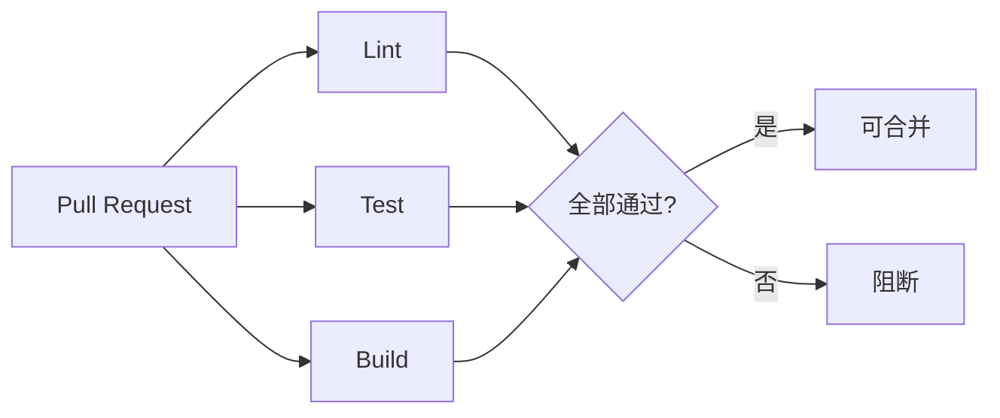

# CI/CD 与质量门禁

> 状态：📝 草稿 | 版本：v1.0-draft

## 1. 分支策略

| 分支 | 用途 | 保护 |
|------|------|------|
| main | 生产就绪 | PR + Review + CI 通过 |
| develop | 集成分支 | CI 通过 |
| feature/* | 功能开发 | — |
| hotfix/* | 紧急修复 | PR → main |

## 2. CI 流水线（PR 触发）



### 2.1 后端 Job

```yaml
# 规划示例
jobs:
  backend:
    steps:
      - checkout
      - setup-java: temurin 17
      - mvn -B verify
      - mvn spotless:check  # 代码格式
```

| 步骤 | 命令 | 失败阻断 |
|------|------|----------|
| 编译测试 | `mvn -B verify` | ✅ |
| 格式检查 | `mvn spotless:check` | ✅ |
| 静态分析 | SonarQube（可选） | 警告 |

### 2.2 前端 Job

| 步骤 | 命令 | 失败阻断 |
|------|------|----------|
| 安装 | `pnpm install --frozen-lockfile` | ✅ |
| Lint | `pnpm lint` | ✅ |
| 类型检查 | `pnpm typecheck` | ✅ |
| 单元测试 | `pnpm test` | ✅ |
| 构建 | `pnpm build` | ✅ |

### 2.3 Python Job

| 步骤 | 命令 | 失败阻断 |
|------|------|----------|
| Lint | `ruff check .` | ✅ |
| 类型 | `mypy app` | 警告 |
| 测试 | `pytest` | ✅ |

## 3. CD 流水线（main 合并后）

| 环境 | 触发 | 部署方式 |
|------|------|----------|
| dev | 自动 | Docker Compose / K8s dev namespace |
| staging | 手动审批 | K8s staging |
| prod | 手动审批 + tag | K8s prod |

### 3.1 镜像构建

| 镜像 | Dockerfile 路径 |
|------|-----------------|
| mis-gateway | backend/mis-gateway/Dockerfile |
| mis-admin-bff | backend/mis-admin-bff/Dockerfile |
| ... | 各服务独立镜像 |
| mis-admin-web | frontend/mis-admin-web/Dockerfile (nginx) |
| agent-gateway | agent/agent-gateway/Dockerfile |

标签：`mis-{service}:{git-sha}` + `latest`（dev）

## 4. 质量门禁

| 指标 | 阈值 | Phase |
|------|------|-------|
| 后端单测覆盖率 | ≥ 60%（核心 Service） | 1 |
| 前端单测覆盖率 | ≥ 50% | 1 |
| E2E | 核心 5 条路径 | 1 |
| 安全扫描 | Trivy 无 Critical | 1 |
| 依赖漏洞 | Dependabot 每周 | 1 |

## 5. E2E 测试规划（Playwright）

| # | 场景 |
|---|------|
| 1 | admin 登录成功 → 进入 dashboard |
| 2 | 错误密码登录失败 |
| 3 | 创建用户 → 列表可见 |
| 4 | 无权限用户访问 /system/user → 403 |
| 5 | 登出 → 跳登录页 |

## 6. 制品与发布

| 制品 | 存储 |
|------|------|
| Docker 镜像 | 私有 Registry（Harbor / ACR） |
| 前端静态资源 | 镜像内 nginx 或 OSS |
| Flyway 脚本 | Git 版本管理 |
| OpenAPI | `docs/api/openapi/` |

## 7. 回滚策略

- K8s：`kubectl rollout undo deployment/mis-gateway`
- 数据库：Flyway 禁止自动 downgrade；回滚用补偿 migration
- 配置：Nacos 配置版本回退

## 8. 待确认项

- [ ] CI 平台：GitHub Actions vs GitLab CI vs Jenkins
- [ ] 镜像仓库：Harbor / 阿里云 ACR / Docker Hub 私有
- [ ] SonarQube 是否 Phase 1 接入 → **否，已确认不接入**
- [ ] E2E 是否在 CI 中跑（需 Docker Compose 全套）
- [ ] 生产 K8s 集群是否已有

## 9. 关联文档

- [本地开发环境](local-dev.md)
- [Sprint 计划](../project/sprint-plan.md)
