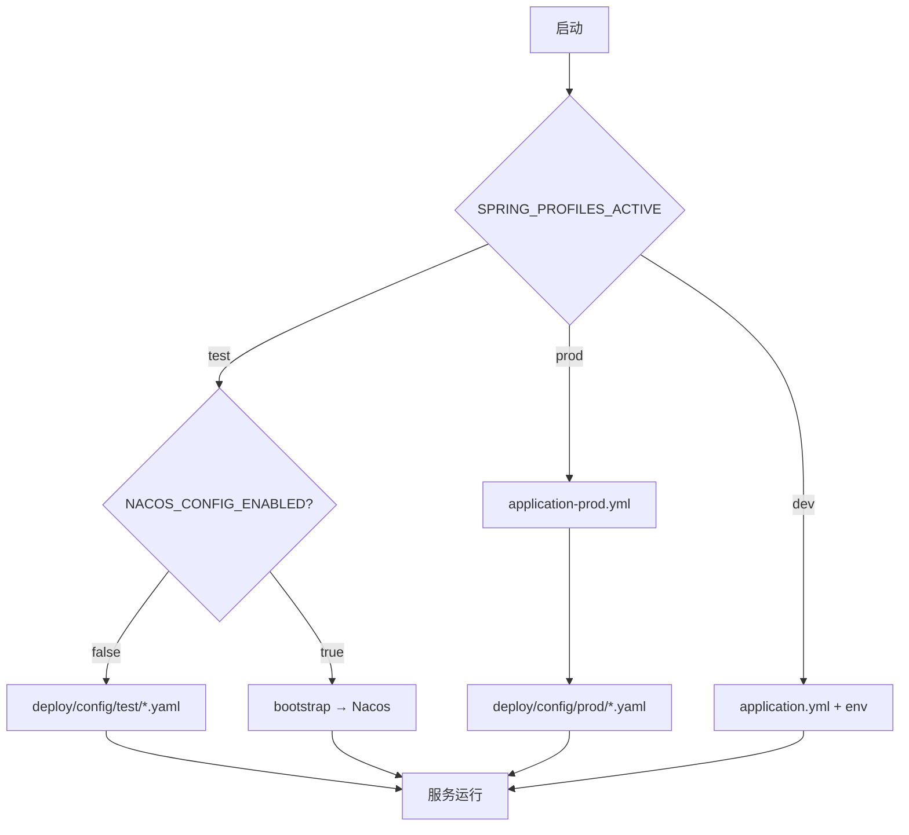

# 配置管理策略

> 状态：📝 草稿 | Nacos 2.3 + PostgreSQL 外置存储

## 1. 总体原则

| 环境 | Profile | 配置来源 | Nacos 客户端 |
|------|---------|----------|--------------|
| **本地开发** | `dev` | 各服务 `application.yml` + 环境变量 | 默认 **关闭** |
| **测试** | `test` | `deploy/config/test/*.yaml` 文件 | 可选开启（`NACOS_CONFIG_ENABLED=true`） |
| **正式** | `prod` | `deploy/config/prod/*.yaml` 文件 **仅文件** | **强制关闭** |

> **正式环境微服务不连接 Nacos 配置中心**，所有参数通过挂载的外部 YAML 注入。  
> Nacos Server 仍可使用 PostgreSQL 持久化（供测试环境或运维导入配置），与微服务是否连接无关。

## 2. Nacos Server（PostgreSQL 存储）

### 2.1 架构

```
PostgreSQL
├── mis_platform    # 业务库（Flyway）
└── nacos           # 配置中心元数据（config_info 等）
```

### 2.2 本地 Docker

`deploy/docker-compose.dev.yml` 已配置：

- Postgres 初始化：`deploy/postgres/init/02-init-nacos-db.sql`（建库）
- 表结构：`deploy/postgres/init/03-nacos-schema.sql`
- Nacos 连接：`deploy/nacos/server/application.properties`

控制台：http://localhost:8848/nacos（`nacos` / `nacos`）

### 2.3 导入测试配置到 Nacos

将 `deploy/nacos/import/*.yaml` 导入 Nacos：

| Data ID | Group | Namespace |
|---------|-------|-----------|
| `mis-common.yaml` | `MIS_GROUP` | `test`（或 dev） |
| `mis-gateway.yaml` | `MIS_GROUP` | 同上 |
| `mis-auth.yaml` | `MIS_GROUP` | 同上 |

```powershell
# 需 Nacos 已启动
.\scripts\import-nacos-config.ps1 -Namespace test
```

## 3. 微服务配置加载顺序



### 3.1 关键环境变量

| 变量 | 默认 | 说明 |
|------|------|------|
| `SPRING_PROFILES_ACTIVE` | `dev` | `dev` / `test` / `prod` |
| `NACOS_CONFIG_ENABLED` | `false` | 是否连接 Nacos 配置中心 |
| `NACOS_SERVER` | `localhost:8848` | Nacos 地址 |
| `NACOS_NAMESPACE` | `dev` | 命名空间 ID |
| `NACOS_CONFIG_GROUP` | `MIS_GROUP` | 配置分组 |
| `MIS_CONFIG_HOME` | 见 profile | 外部 YAML 目录 |

### 3.2 正式环境启动示例

```bash
export SPRING_PROFILES_ACTIVE=prod
export MIS_CONFIG_HOME=/etc/mis/config   # 内容为 deploy/config/prod/
java -jar mis-gateway.jar
```

### 3.3 测试环境 · 纯文件（不连 Nacos）

```bash
export SPRING_PROFILES_ACTIVE=test
export MIS_CONFIG_HOME=./deploy/config/test
# 可不启动 Nacos；可不连 Redis/DB 时仅做部分冒烟
java -jar mis-gateway.jar
```

### 3.4 测试环境 · 连接 Nacos

```bash
export SPRING_PROFILES_ACTIVE=test
export NACOS_CONFIG_ENABLED=true
export NACOS_NAMESPACE=test
export NACOS_SERVER=localhost:8848
java -jar mis-gateway.jar
```

## 4. 文件布局

```
deploy/
├── config/
│   ├── prod/           # 正式环境（微服务唯一来源）
│   ├── test/           # 测试环境文件模式
│   └── bootstrap-template.yml
├── nacos/
│   ├── server/         # Nacos Server 自身配置
│   ├── import/         # 导入 Nacos 的 YAML 模板
│   └── schema/         # PG 表结构参考
└── postgres/init/      # 含 nacos 库与表初始化
```

## 5. 新微服务接入清单

1. 复制 `deploy/config/bootstrap-template.yml` → `src/main/resources/bootstrap.yml`，改 `application.name`
2. 新增 `application-prod.yml`、`application-test.yml`（与 gateway/auth 一致）
3. 在 `deploy/config/{prod,test,nacos/import}/` 添加 `{service}.yaml`
4. `dev` 阶段可仅在 `application.yml` 写默认值

## 6. 关联文档

- [代码阅读顺序](../CODE-READING-GUIDE.md)
- [本地开发](local-dev.md)
- [微服务规划](../backend/microservices.md)
