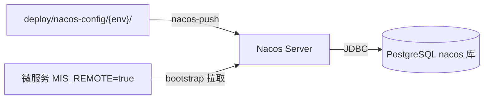

# 配置管理策略

> Nacos 2.3 + PostgreSQL 外置存储 | 操作手册见 [运维总览](README.md)

## 1. 两档模式

| 模式 | 环境变量 | 配置来源 | 文档 |
|------|----------|----------|------|
| **local** | 不设 `MIS_REMOTE` | jar 内 `application.yml` | [本地开发](local-dev.md) |
| **remote** | `MIS_REMOTE=true` + `NACOS_NAMESPACE` + `NACOS_SERVER` | Nacos 命名空间 | [测试部署](test-deploy.md) / [正式部署](prod-deploy.md) |



## 2. 配置 Git 源

```
deploy/nacos-config/
├── prod/           → Nacos namespace `prod`
├── test/           → Nacos namespace `test`
├── integration/    → Nacos namespace `integration`
└── bootstrap-template.yml
```

| Git 文件 | Nacos Data ID | Group |
|----------|---------------|-------|
| `mis-common.yaml` | `mis-common` | `MIS_GROUP` |
| `mis-gateway.yaml` | `mis-gateway` | `MIS_GROUP` |
| `mis-auth.yaml` | `mis-auth` | `MIS_GROUP` |
| `mis-iam.yaml` | `mis-iam` | `MIS_GROUP` |
| `mis-org.yaml` | `mis-org` | `MIS_GROUP` |
| `mis-audit.yaml` | `mis-audit` | `MIS_GROUP` |

Data ID **不带 `.yaml`** 扩展名。

### 推送

```powershell
.\scripts\ensure-nacos-namespace.ps1 -Namespace prod
.\scripts\nacos-push.ps1 -Namespace prod
```

`import-nacos-config.ps1` 为兼容别名。

> **重要**：`deploy/nacos-config/` 通过脚本推送到 Nacos，**不**与 JAR 打包进业务容器。

## 3. 微服务 resources

| 文件 | 作用 |
|------|------|
| `application.yml` | local 默认（端口、localhost 路由、数据源等） |
| `bootstrap.yml` | `${MIS_REMOTE:false}` 控制 Nacos 连接 |

bootstrap 加载 `mis-common`（共享）+ `${spring.application.name}`（服务专属）。

## 4. 环境变量

| 变量 | local | remote |
|------|-------|--------|
| `MIS_REMOTE` | `false`（默认） | `true` |
| `NACOS_SERVER` | — | Nacos 地址 |
| `NACOS_NAMESPACE` | — | `test` / `prod` / `integration` |
| `NACOS_CONFIG_GROUP` | `MIS_GROUP` | `MIS_GROUP` |
| `NACOS_REGISTER_IP` | — | 联调时 `host.docker.internal` |
| `JWT_*_PATH` | 本地路径 | Secret 挂载路径 |

## 5. Nacos Server

```
PostgreSQL
├── mis_platform    # 业务库（Flyway）
└── nacos           # 配置中心元数据
```

本地：`deploy/docker-compose.dev.yml`  
详见 [deploy/nacos/README.md](../../deploy/nacos/README.md)

## 6. 新微服务接入

1. 复制 `deploy/nacos-config/bootstrap-template.yml` → `bootstrap.yml`
2. 编写 `application.yml`（local 默认）
3. 在 `deploy/nacos-config/{prod,test,integration}/` 添加 `{service}.yaml`（如 `mis-iam.yaml`）
4. 发版前：`nacos-push.ps1 -Namespace prod`

## 7. 关联文档

- [运维总览](README.md)
- [本地开发](local-dev.md)
- [混合联调](integration-test.md)
- [测试环境部署](test-deploy.md)
- [正式环境部署](prod-deploy.md)
