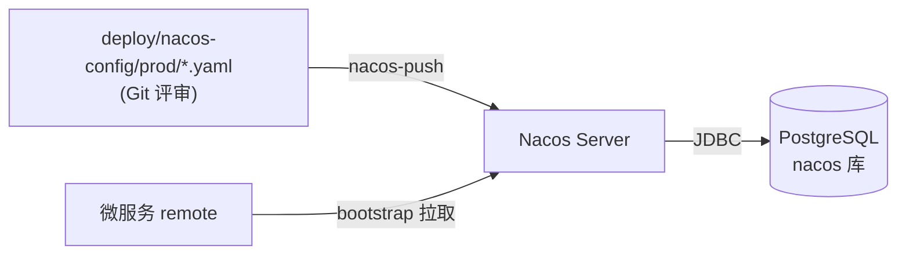

# 配置管理策略

> Nacos 2.3 + PostgreSQL 外置存储

## 1. 两档模式

| 模式 | 环境变量 | 配置来源 |
|------|----------|----------|
| **local**（默认） | 无 | 各服务 jar 内 `application.yml` + 环境变量 |
| **remote** | `MIS_REMOTE=true` + `NACOS_NAMESPACE` + `NACOS_SERVER` | Nacos 命名空间 |

本地开发直接 `java -jar` 或 IDE 启动即可，**不连 Nacos**。  
测试 / 联调 / 正式环境设置 `MIS_REMOTE=true`，由 `bootstrap.yml` 从 Nacos 拉取 `mis-common` 与服务专属配置。

### 1.1 数据流



敏感项（JWT 私钥、DB 密码）建议用 **K8s Secret / 环境变量** 注入。

## 2. Nacos 配置 Git 源

```
deploy/nacos-config/
├── prod/           # → Nacos namespace `prod`
├── test/           # → Nacos namespace `test`
├── integration/    # → Nacos namespace `integration`
└── bootstrap-template.yml
```

| Git 文件 | Nacos Data ID | Group |
|----------|---------------|-------|
| `mis-common.yaml` | `mis-common` | `MIS_GROUP` |
| `mis-gateway.yaml` | `mis-gateway` | `MIS_GROUP` |
| `mis-auth.yaml` | `mis-auth` | `MIS_GROUP` |
| `mis-audit.yaml` | `mis-audit` | `MIS_GROUP` |

Data ID **不带 `.yaml`** 扩展名。

### 推送到 Nacos

```powershell
.\scripts\ensure-nacos-namespace.ps1 -Namespace prod
.\scripts\nacos-push.ps1 -Namespace prod
```

```bash
./scripts/nacos-push.sh integration
```

`import-nacos-config.ps1` 为兼容别名，内部调用 `nacos-push`。

## 3. 微服务 resources 布局

每个服务仅保留两个文件：

| 文件 | 作用 |
|------|------|
| `application.yml` | local 默认配置（localhost 路由、本地数据源等） |
| `bootstrap.yml` | `MIS_REMOTE=true` 时连 Nacos 配置中心与注册发现 |

**不再使用** `application-{test,prod,integration}.yml` 等 profile 文件。

### 3.1 关键环境变量

| 变量 | local 默认 | remote | 说明 |
|------|------------|--------|------|
| `MIS_REMOTE` | `false` | `true` | 是否连 Nacos |
| `NACOS_SERVER` | — | `localhost:8848` | Nacos 地址 |
| `NACOS_NAMESPACE` | — | `prod` / `test` / `integration` | 命名空间 |
| `NACOS_CONFIG_GROUP` | `MIS_GROUP` | `MIS_GROUP` | 配置分组 |
| `NACOS_REGISTER_IP` | — | 联调时 `host.docker.internal` | 宿主机注册 IP |

### 3.2 正式环境启动

```bash
export MIS_REMOTE=true
export NACOS_NAMESPACE=prod
export NACOS_SERVER=nacos.mis.svc:8848
export JWT_PRIVATE_KEY_PATH=/etc/mis/keys/private.pem
export JWT_PUBLIC_KEY_PATH=/etc/mis/keys/public.pem

java -jar mis-gateway.jar
```

发版前须将 `deploy/nacos-config/prod/` 推送到 Nacos `prod` 命名空间。

### 3.3 本地开发

```bash
# 不设 MIS_REMOTE，直接启动
java -jar mis-gateway.jar
```

Gateway 使用 `application.yml` 中的 `http://localhost:8101` 等直连路由。

## 4. Nacos Server（PostgreSQL）

```
PostgreSQL
├── mis_platform    # 业务库（Flyway）
└── nacos           # 配置中心元数据
```

本地 Docker：`deploy/docker-compose.dev.yml`  
控制台：http://localhost:8848/nacos（`nacos` / `nacos`）

## 5. 新微服务接入

1. 复制 `deploy/nacos-config/bootstrap-template.yml` → `bootstrap.yml`，改 `spring.application.name`
2. 编写 `application.yml`（local 默认）
3. 在 `deploy/nacos-config/{prod,test,integration}/` 添加 `{service}.yaml`
4. 发版前：`nacos-push.ps1 -Namespace prod`

## 6. 关联文档

- [混合联调](integration-test.md)
- [本地开发](local-dev.md)
