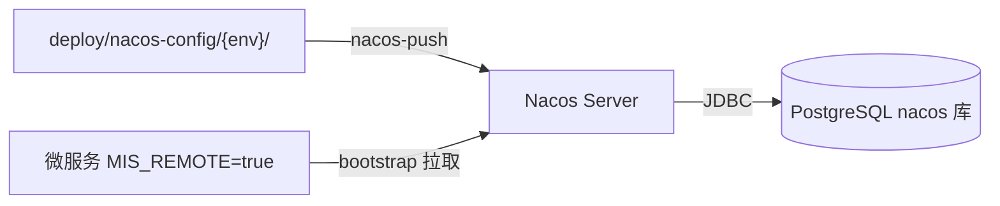

# 配置管理策略

> Nacos **Server 2.3.2**（运行 **JDK 17**）+ 测试/正式 PostgreSQL 外置存储 | 操作手册见 [运维总览](README.md)

## 1. 两档模式

| 模式 | 环境变量 | 配置来源 | 文档 |
|------|----------|----------|------|
| **local** | 显式 `MIS_REMOTE=false` | jar 内 `application.yml` | [本地开发](local-dev.md) |
| **remote** | 默认 `true`（或不设，因默认已是 true）+ `NACOS_NAMESPACE` + `NACOS_SERVER` | Nacos 命名空间 | [测试部署](test-deploy.md) / [正式部署](prod-deploy.md) |


```mermaid
flowchart LR
    Git["deploy/nacos-config/{env}/"] -->|nacos-push| Nacos["Nacos Server"]
    Nacos -->|JDBC| PG[("PostgreSQL nacos 库")]
    MS["微服务 MIS_REMOTE=true"] -->|bootstrap 拉取| Nacos
```

## 2. 配置 Git 源

```
deploy/nacos-config/
├── prod/           → Nacos namespace `prod`
├── test/           → Nacos namespace `test`
├── integration/    → Nacos namespace `integration`
└── bootstrap-template.yml
```

| Git 文件 | Nacos Data ID | Group | `server.port` |
|----------|---------------|-------|---------------|
| `mis-common.yaml` | `mis-common` | `MIS_GROUP` | —（共享，无服务端口） |
| `mis-gateway.yaml` | `mis-gateway` | `MIS_GROUP` | 8080 |
| `mis-auth.yaml` | `mis-auth` | `MIS_GROUP` | 8101 |
| `mis-iam.yaml` | `mis-iam` | `MIS_GROUP` | 8102 |
| `mis-org.yaml` | `mis-org` | `MIS_GROUP` | 8103 |
| `mis-system.yaml` | `mis-system` | `MIS_GROUP` | 8105 |
| `mis-audit.yaml` | `mis-audit` | `MIS_GROUP` | 8106 |
| `mis-kb.yaml` | `mis-kb` | `MIS_GROUP` | 8108 |
| `mis-admin-bff.yaml` | `mis-admin-bff` | `MIS_GROUP` | 8081 |

Data ID **不带 `.yaml`** 扩展名。

### 建议迁入 / 留在本地的配置清单

| 服务 | 建议进 Nacos（环境相关、可热改） | 建议留 jar / 环境变量（密钥或本机路径） |
|------|----------------------------------|----------------------------------------|
| **mis-common** | datasource URL 模板、Redis host/port/db、JPA 通用项 | `JWT_*_PATH`、真实 DB/Redis 密码（用 `${ENV}` 引用） |
| **mis-gateway** | `server.port`、路由表（lb 服务名）、`mis.security.gateway.enabled` | JWT 公钥路径 |
| **mis-auth** | `server.port`、验证码开关/TTL、登录失败锁定、下游 discovery/base-url、token TTL | JWT 私钥路径、cookie secure |
| **mis-iam** | `server.port`、`mis.iam.org-*` / `system-*` 下游地址与 discovery | — |
| **mis-org** | `server.port`、`mis.org.iam-*` 下游地址与 discovery | — |
| **mis-system** | `server.port` | —（业务配置较少） |
| **mis-audit** | `server.port` | — |
| **mis-kb** | `server.port`、`mis.kb.engine.type/base-url/rerank-model-id` | `MIS_KB_ENGINE_API_KEY`（密钥用 env 注入） |
| **mis-admin-bff** | `server.port`、下游 `mis.bff.*-base-url` + discovery 开关、`aggregate-timeout-ms`、`api-permission.*`、`mis.ai-platform.*`（非密钥）、`mis.agent-ops.*`（含 `chat-timeout-ms`）、`mis.mcp.servers` | `service-token` / `MIS_JWT_PUBLIC_KEY` / 默认密码等密钥类 |

原则：
1. **端口、路由、下游地址、超时、功能开关** → Nacos
2. **密钥、私钥/公钥路径、默认口令** → 环境变量 / Secret，Nacos 里只写 `${VAR}` 占位
3. **本机纯 local**：显式 `MIS_REMOTE=false`，仍用各模块 `application.yml`；不设该变量时**默认连 Nacos**（`${MIS_REMOTE:true}`）

### 推送

```powershell
.\scripts\ensure-nacos-namespace.ps1 -Namespace prod
.\scripts\nacos-push.ps1 -Namespace prod
```

`import-nacos-config.ps1` 为兼容别名。

> **重要**：`deploy/nacos-config/` 通过脚本推送到 Nacos，**不**与 JAR 打包进业务容器。

## 3. 微服务 resources（方案 B：本地保留范围）

每个 Java 微服务 **只保留这两个** 配置文件（不另建 `application-local.yml` / `application-dev.yml`，除非有强隔离需求再议）：

| 文件 | 是否保留 | 作用 |
|------|----------|------|
| `bootstrap.yml` | **保留** | 仅负责：应用名 + 是否连 Nacos + Nacos 地址/命名空间/Group；**不写业务配置** |
| `application.yml` | **保留** | **local 完整可跑画像**：`MIS_REMOTE=false` 时唯一权威；本机 Docker PG/Redis、localhost 直连下游 |

remote（`MIS_REMOTE=true`）时：Nacos（`mis-common` + 本服务 Data ID）覆盖同名键；`application.yml` 仍打进 jar，作未迁入键的兜底，**不以删空 jar 配置为目标**。

### 3.1 `bootstrap.yml` 应写内容（全服务同构）

只允许下列几类，模板见 `deploy/nacos-config/bootstrap-template.yml`：

```yaml
spring.application.name          # 与 Nacos Data ID 一致，如 mis-auth
spring.cloud.nacos.config.*      # enabled=${MIS_REMOTE:true}、server-addr、namespace、group
                                 # shared-configs: mis-common
                                 # extension-configs: ${spring.application.name}
spring.cloud.nacos.discovery.*   # enabled 与 config 同步；server-addr / namespace
```

**禁止** 在 `bootstrap.yml` 写：`server.port`、数据源、业务 `mis.*`、路由表。

### 3.2 `application.yml` 应写内容（local 完整画像）

原则：**本机显式 `MIS_REMOTE=false` 时，仅靠本文件 + 少量本机 env（JWT 路径等）即可启动联调**；不设该变量则默认连 Nacos。

| 区块 | 是否写入 | 约定 |
|------|----------|------|
| `server.port` | 是 | 固定本机端口（与文档端口表一致） |
| `spring.application.name` | 是 | 与 bootstrap 一致 |
| `spring.datasource` / `redis` / `jpa` | 有则写 | 默认 `localhost` + `${DB_*}` / `${REDIS_*}`；开发口令可有默认值（仅 local） |
| `spring.cloud.gateway.routes` | 仅 gateway | **localhost:端口** 直连，不用 `lb://` |
| `management` / `logging` | 是 | health 暴露；本机可 `DEBUG` |
| `mis.*.*-discovery-enabled` | 是 | local **一律 `false`** |
| `mis.*.*-base-url` | 是 | `http://localhost:{port}` |
| `mis.*` 业务开关 / 超时 / TTL | 是 | local 合理默认（如 agent-ops `chat-timeout-ms: 180000`） |
| 密钥类 | **只写 `${ENV}` 或空默认** | JWT 路径、`api-key`、`service-token`、`MIS_JWT_PUBLIC_KEY`；**不要**把生产密钥写进仓库 |
| `default-password` | 可保留开发默认 | local 可用文档约定口令；remote/Nacos 改为 `${ENV}` |

### 3.3 各服务 `application.yml` 内容清单（local）

| 服务 | 必写 |
|------|------|
| **mis-gateway** | `port:8080`；Redis；**localhost 路由表**（auth-me→8081、auth→8101、audit→8106、其余→BFF）；`mis.security.gateway`；`jwt.public-key-path: ${JWT_PUBLIC_KEY_PATH:}` |
| **mis-auth** | `port:8101`；DB+Redis+JPA；验证码/锁定/cookie；audit/iam **discovery=false** + localhost base-url；`jwt.*-path: ${JWT_*_PATH:}` + token TTL |
| **mis-iam** | `port:8102`；DB+Redis+JPA；org/system discovery=false + localhost；`default-password`（开发默认）；permissions TTL |
| **mis-org** | `port:8103`；DB+JPA；iam discovery=false + localhost |
| **mis-system** | `port:8105`；DB+JPA |
| **mis-audit** | `port:8106`；DB+JPA |
| **mis-kb** | `port:8108`；DB+JPA；`mis.kb.engine.*`（type/base-url/api-key/rerank/reconcile 等，密钥用 `${MIS_KB_*}`） |
| **mis-admin-bff** | `port:8081`；Redis；`mis.bff.*` 下游全套 discovery=false + localhost；`aggregate-timeout-ms`；`api-permission.*`；`ai-platform.*`（含 reverse-trust 的 `${ENV}`）；`agent-ops.*`（含 180s chat-timeout）；`mcp.servers` localhost |

> **没有** 独立的「本地 mis-common 文件」：共享项在 local 模式下由各服务 `application.yml` **各自写齐**（或靠本机 env）；remote 才由 Nacos `mis-common` 统一下发。

### 3.4 本地进程环境变量（文件外）

即使不连 Nacos，本机通常仍需：

| 变量 | 说明 |
|------|------|
| `JWT_PRIVATE_KEY_PATH` / `JWT_PUBLIC_KEY_PATH` | 指向 `backend/keys/*.pem` |
| `DB_*` / `REDIS_*` | 仅当不用 yml 默认 localhost 时 |
| 可选业务密钥 | 如 `MIS_KB_ENGINE_API_KEY`、`AI_PLATFORM_BFF_SHARED_SECRET` |

**纯 local 开发必须显式设 `MIS_REMOTE=false`**（jar 默认已是 `true`）。连远程 Nacos 时见 [混合联调](integration-test.md) / [远端基础设施](remote-infra-local-dev.md)。

## 4. 环境变量

| 变量 | local | remote |
|------|-------|--------|
| `MIS_REMOTE` | 显式 `false` | `true`（**bootstrap 默认**，不设即 true） |
| `NACOS_SERVER` | — | Nacos 地址 |
| `NACOS_NAMESPACE` | — | `test` / `prod` / `integration` |
| `NACOS_CONFIG_GROUP` | `MIS_GROUP` | `MIS_GROUP` |
| `NACOS_REGISTER_IP` | — | 联调时 `host.docker.internal` |
| `JWT_*_PATH` | 本地路径 | Secret 挂载路径 |

## 5. Nacos Server

| 项 | 约定 |
|----|------|
| 版本 | **2.3.2**（对齐 SCA 2023.0.1.0 / nacos-client 2.3.2） |
| 运行 JDK | **17**（自建镜像 `mis-nacos:2.3.2-jdk17`；可与 mis-auth 同机共用 `JAVA_HOME_17`） |
| 本地存储 | 内嵌（`docker-compose.dev.yml`） |
| 测试/正式存储 | PostgreSQL 库 `nacos`（`docker-compose.nacos-pg.yml`） |

```
PostgreSQL
├── mis_platform    # 业务库（Flyway）
└── nacos           # 配置中心元数据（remote 环境）
```

业务模块（mis-auth 等）**不改 JDK、不改 SCA 版本**；仅 Nacos **进程**改为 JDK 17 运行。  
详见 [deploy/nacos/README.md](../../deploy/nacos/README.md)。

## 6. 新微服务接入

1. 复制 `deploy/nacos-config/bootstrap-template.yml` → `bootstrap.yml`
2. 编写 `application.yml`（local 默认）
3. 在 `deploy/nacos-config/{prod,test,integration}/` 添加 `{service}.yaml`（如 `mis-iam.yaml`）
4. 发版前：`nacos-push.ps1 -Namespace prod`

## 7. 方案 B 变更核对（开工用）

每一批改完按 **L1 → L2 → L3** 过一遍；超时类（如 `chat-timeout-ms`）改完后 **必须重启** 对应服务再验。

| 层 | 时机 | 做什么 | 通过标准 |
|----|------|--------|----------|
| **L1 静态** | push 前 | 三环境同名 yaml **键集合**一致；`rg` 扫 `nacos-config` 无真实密钥；`application.yml`/`bootstrap.yml` 未被掏空 | 仅允许 host/url 等**值**因环境不同；密钥只有 `${VAR}` |
| **L2 推送** | `nacos-push` 后 | OpenAPI 列出 Data ID；逐个拉取正文与 Git 源 diff；抽查本批关键键 | 9 个 Data ID 齐全；无控制台手工漂移（以 Git 为准） |
| **L3 运行** | 重启本批服务后 | **local**：`MIS_REMOTE=false` 能登录；**remote**：默认/`true` + `.env.integration` 起服务后行为来自 Nacos | 冒烟：登录 → Gateway 路由 →（若涉及）KB → Agent Ops 对话约 180s |

**每批最小包**：B1 盯 BFF+对话；B2 盯登录/组织权限；B3 盯明文清零 + 缺 Secret 负向；B4 对 test/prod 重复 L2 并做一次 Nacos 历史回滚演练。

> L2 可用 `scripts/nacos-diff.ps1`（Git ↔ 线上）。推送仍用 `scripts/nacos-push.ps1`。

## 8. 关联文档

- [运维总览](README.md)
- [本地开发](local-dev.md)
- [混合联调](integration-test.md)
- [测试环境部署](test-deploy.md)
- [正式环境部署](prod-deploy.md)
- [远端基础设施 + 本机代码](remote-infra-local-dev.md)
