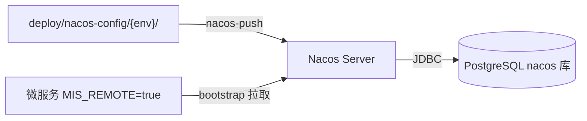

# 配置管理策略

> Nacos **Server 2.3.2**（运行 **JDK 17**）+ 测试/正式 PostgreSQL 外置存储 | 操作手册见 [运维总览](README.md)

## 1. 两档模式

| 模式 | 环境变量 | 配置来源 | 文档 |
|------|----------|----------|------|
| **local** | 不设 `MIS_REMOTE` | jar 内 `application.yml` | [本地开发](local-dev.md) |
| **remote** | `MIS_REMOTE=true` + `NACOS_NAMESPACE` + `NACOS_SERVER` | Nacos 命名空间 | [测试部署](test-deploy.md) / [正式部署](prod-deploy.md) |


```mermaid
flowchart LR
    Git["deploy/nacos-config/{env}/"] -->|nacos-push| Nacos["Nacos Server"]
    Nacos -->|JDBC| PG[("PostgreSQL nacos 库")]
    MS["微服务 MIS_REMOTE=true"] -->|bootstrap 拉取| Nacos
```

## 2. 配置 Git 源

```
deploy/nacos-config/
├── prod/           → Nacos namespace `prod`
├── test/           → Nacos namespace `test`
├── integration/    → Nacos namespace `integration`
└── bootstrap-template.yml
```

| Git 文件 | Nacos Data ID | Group | `server.port` |
|----------|---------------|-------|---------------|
| `mis-common.yaml` | `mis-common` | `MIS_GROUP` | —（共享，无服务端口） |
| `mis-gateway.yaml` | `mis-gateway` | `MIS_GROUP` | 8080 |
| `mis-auth.yaml` | `mis-auth` | `MIS_GROUP` | 8101 |
| `mis-iam.yaml` | `mis-iam` | `MIS_GROUP` | 8102 |
| `mis-org.yaml` | `mis-org` | `MIS_GROUP` | 8103 |
| `mis-system.yaml` | `mis-system` | `MIS_GROUP` | 8105 |
| `mis-audit.yaml` | `mis-audit` | `MIS_GROUP` | 8106 |
| `mis-kb.yaml` | `mis-kb` | `MIS_GROUP` | 8108 |
| `mis-admin-bff.yaml` | `mis-admin-bff` | `MIS_GROUP` | 8081 |

Data ID **不带 `.yaml`** 扩展名。

### 建议迁入 / 留在本地的配置清单

| 服务 | 建议进 Nacos（环境相关、可热改） | 建议留 jar / 环境变量（密钥或本机路径） |
|------|----------------------------------|----------------------------------------|
| **mis-common** | datasource URL 模板、Redis host/port/db、JPA 通用项 | `JWT_*_PATH`、真实 DB/Redis 密码（用 `${ENV}` 引用） |
| **mis-gateway** | `server.port`、路由表（lb 服务名）、`mis.security.gateway.enabled` | JWT 公钥路径 |
| **mis-auth** | `server.port`、验证码开关/TTL、登录失败锁定、下游 discovery/base-url、token TTL | JWT 私钥路径、cookie secure |
| **mis-iam** | `server.port`、`mis.iam.org-*` / `system-*` 下游地址与 discovery | — |
| **mis-org** | `server.port`、`mis.org.iam-*` 下游地址与 discovery | — |
| **mis-system** | `server.port` | —（业务配置较少） |
| **mis-audit** | `server.port` | — |
| **mis-kb** | `server.port`、`mis.kb.engine.type/base-url/rerank-model-id` | `MIS_KB_ENGINE_API_KEY`（密钥用 env 注入） |
| **mis-admin-bff** | `server.port`、下游 `mis.bff.*-base-url` + discovery 开关、`aggregate-timeout-ms`、`api-permission.*`、`mis.ai-platform.*`（非密钥）、`mis.agent-ops.*`（含 `chat-timeout-ms`）、`mis.mcp.servers` | `service-token` / `MIS_JWT_PUBLIC_KEY` / 默认密码等密钥类 |

原则：
1. **端口、路由、下游地址、超时、功能开关** → Nacos
2. **密钥、私钥/公钥路径、默认口令** → 环境变量 / Secret，Nacos 里只写 `${VAR}` 占位
3. **本机 IDE 默认** 仍保留在各模块 `application.yml`（`MIS_REMOTE=false` 时生效）

### 推送

```powershell
.\scripts\ensure-nacos-namespace.ps1 -Namespace prod
.\scripts\nacos-push.ps1 -Namespace prod
```

`import-nacos-config.ps1` 为兼容别名。

> **重要**：`deploy/nacos-config/` 通过脚本推送到 Nacos，**不**与 JAR 打包进业务容器。

## 3. 微服务 resources

| 文件 | 作用 |
|------|------|
| `application.yml` | local 默认（端口、localhost 路由、数据源等） |
| `bootstrap.yml` | `${MIS_REMOTE:false}` 控制 Nacos 连接 |

bootstrap 加载 `mis-common`（共享）+ `${spring.application.name}`（服务专属）。

## 4. 环境变量

| 变量 | local | remote |
|------|-------|--------|
| `MIS_REMOTE` | `false`（默认） | `true` |
| `NACOS_SERVER` | — | Nacos 地址 |
| `NACOS_NAMESPACE` | — | `test` / `prod` / `integration` |
| `NACOS_CONFIG_GROUP` | `MIS_GROUP` | `MIS_GROUP` |
| `NACOS_REGISTER_IP` | — | 联调时 `host.docker.internal` |
| `JWT_*_PATH` | 本地路径 | Secret 挂载路径 |

## 5. Nacos Server

| 项 | 约定 |
|----|------|
| 版本 | **2.3.2**（对齐 SCA 2023.0.1.0 / nacos-client 2.3.2） |
| 运行 JDK | **17**（自建镜像 `mis-nacos:2.3.2-jdk17`；可与 mis-auth 同机共用 `JAVA_HOME_17`） |
| 本地存储 | 内嵌（`docker-compose.dev.yml`） |
| 测试/正式存储 | PostgreSQL 库 `nacos`（`docker-compose.nacos-pg.yml`） |

```
PostgreSQL
├── mis_platform    # 业务库（Flyway）
└── nacos           # 配置中心元数据（remote 环境）
```

业务模块（mis-auth 等）**不改 JDK、不改 SCA 版本**；仅 Nacos **进程**改为 JDK 17 运行。  
详见 [deploy/nacos/README.md](../../deploy/nacos/README.md)。

## 6. 新微服务接入

1. 复制 `deploy/nacos-config/bootstrap-template.yml` → `bootstrap.yml`
2. 编写 `application.yml`（local 默认）
3. 在 `deploy/nacos-config/{prod,test,integration}/` 添加 `{service}.yaml`（如 `mis-iam.yaml`）
4. 发版前：`nacos-push.ps1 -Namespace prod`

## 7. 关联文档

- [运维总览](README.md)
- [本地开发](local-dev.md)
- [混合联调](integration-test.md)
- [测试环境部署](test-deploy.md)
- [正式环境部署](prod-deploy.md)
